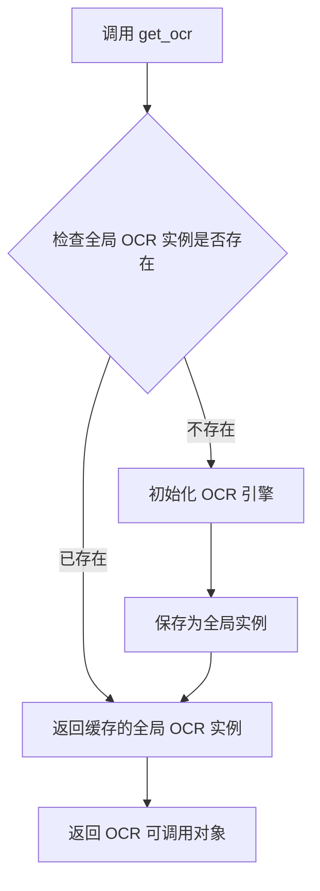
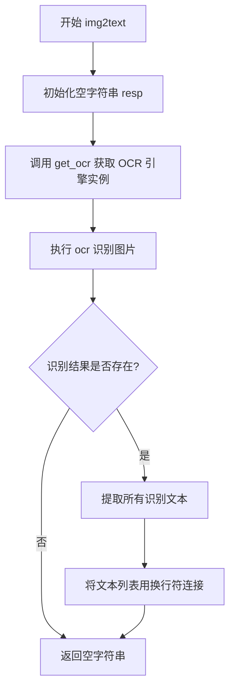
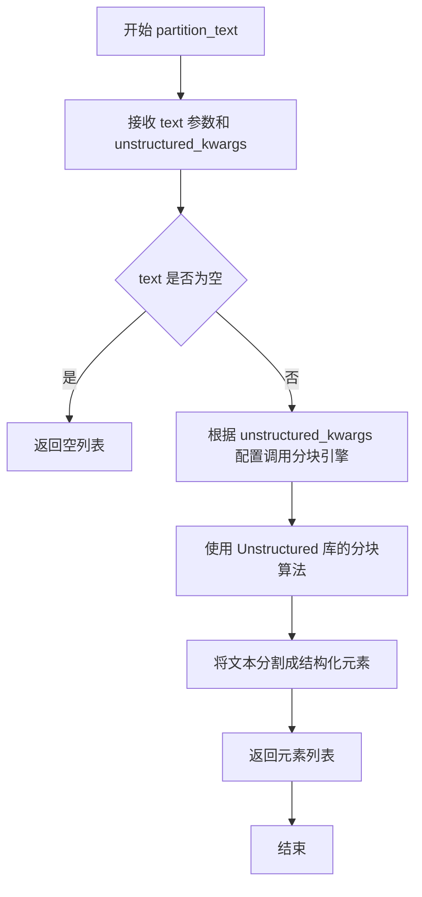
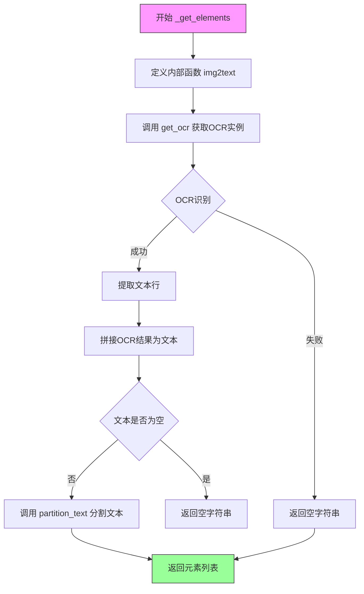

# `Langchain-Chatchat\libs\chatchat-server\chatchat\server\file_rag\document_loaders\myimgloader.py` 详细设计文档

一个基于 UnstructuredFileLoader 的文档加载器，通过集成 RapidOCR 光学字符识别技术，将图片文件中的文字内容提取出来，并使用 unstructured 库的文本分区功能将其转换为结构化的文档对象。

## 整体流程

```mermaid
graph TD
    A[开始] --> B[实例化 RapidOCRLoader]
B --> C[调用 load() 方法]
C --> D[调用 _get_elements() 方法]
D --> E[调用 get_ocr() 获取 OCR 引擎]
E --> F[使用 OCR 识别图片文件]
F --> G{识别结果是否为空?}
G -- 是 --> H[返回空字符串]
G -- 否 --> I[提取识别文本行]
I --> J[拼接所有文本行]
J --> K[调用 partition_text() 分区文本]
K --> L[返回元素列表]
```

## 类结构

```
UnstructuredFileLoader (第三方基类)
└── RapidOCRLoader (自定义实现)
```

## 全局变量及字段


### `ocr`
    
通过get_ocr()获取的OCR引擎实例，用于识别图片中的文字

类型：`Any / RapidOCR`
    


### `result`
    
OCR识别返回的原始结果，包含文字位置和内容信息

类型：`List[Tuple] / List`
    


### `ocr_result`
    
从OCR结果中提取的文本列表，只包含识别出的文字内容

类型：`List[str]`
    


### `resp`
    
最终返回的文本字符串，由ocr_result用换行符连接而成

类型：`str`
    


### `text`
    
图片经过OCR识别后得到的文本内容，作为partition_text的输入

类型：`str`
    


### `elements`
    
经过unstructured库partition_text处理后的文本元素列表

类型：`List`
    


### `RapidOCRLoader (继承自父类).file_path`
    
待OCR识别的图片文件路径

类型：`str / Path`
    


### `RapidOCRLoader (继承自父类).unstructured_kwargs`
    
传递给Unstructured库的配置参数，用于控制文本分区行为

类型：`dict`
    
    

## 全局函数及方法


### `get_ocr`

获取全局 OCR 引擎实例的全局函数，用于文本识别任务。

参数： 无

返回值： `Callable[[str], Tuple[List[Tuple], Any]]`，返回 OCR 引擎对象（可调用函数），该函数接受文件路径参数，返回 OCR 识别结果元组 `result, _`，其中 `result` 为识别文本列表。

#### 流程图



#### 带注释源码

```
def get_ocr():
    """
    获取全局 OCR 引擎实例的全局函数。
    
    该函数实现了单例模式，确保 OCR 引擎只初始化一次，
    避免重复创建带来的性能开销。
    
    返回值:
        一个可调用的 OCR 引擎对象，该对象接受文件路径作为参数，
        并返回 OCR 识别结果。返回格式为 (result, _) 的元组，
        其中 result 是识别结果的列表。
    """
    # 检查全局 OCR 实例是否已初始化
    global _ocr_engine
    
    if _ocr_engine is None:
        # 首次调用时初始化 OCR 引擎（此处为伪代码，实际实现可能涉及
        # RapidOCR 或其他 OCR 库的初始化逻辑）
        _ocr_engine = RapidOCR()
    
    # 返回全局 OCR 引擎实例供后续使用
    return _ocr_engine
```


### `RapidOCRLoader._get_elements.img2text`

该内部函数是 RapidOCRLoader 类中用于将图片文件通过 OCR 技术识别并转换为纯文本的核心方法。它接收图片文件路径，调用 OCR 引擎进行文字识别，最终返回识别出的文本内容。

参数：

- `filepath`：`str`，需要 OCR 识别的图片文件路径

返回值：`str`，从图片中识别并提取出的文本内容，多行文本以换行符连接

#### 流程图



#### 带注释源码

```python
def img2text(filepath):
    """
    将图片文件通过 OCR 识别转换为纯文本
    
    参数:
        filepath: str, 需要识别的图片文件路径
        
    返回:
        str: 识别出的文本内容，失败返回空字符串
    """
    resp = ""  # 初始化空字符串用于存储识别结果
    ocr = get_ocr()  # 获取 OCR 引擎实例（单例模式）
    result, _ = ocr(filepath)  # 执行 OCR 识别，返回识别结果和耗时
    if result:  # 检查识别结果是否为空
        # 从 OCR 识别结果中提取文本
        # result 格式: [[坐标信息, 文本内容, 置信度, ...], ...]
        ocr_result = [line[1] for line in result]  # 提取每行的文本内容
        resp += "\n".join(ocr_result)  # 用换行符连接多行文本
    return resp  # 返回识别结果文本
```


### `partition_text`

该函数是 `unstructured` 库中的文本分区方法，用于将输入的文本内容分割成结构化的元素块（如段落、标题、列表项等），以便后续的文档处理和分析。在 `RapidOCRLoader` 类中，它接收 OCR 识别后的文本，并利用 `unstructured_kwargs` 中的参数进行灵活的分块处理，最终返回包含文本元素的列表供文档加载器使用。

参数：

- `text`：`str`，待分区的原始文本内容，即从图片中通过 OCR 识别提取的文本字符串
- `**unstructured_kwargs`：可选的关键字参数，传递给 `unstructured` 库的分块函数，用于控制分块策略（如语言设置、分块大小、检测模式等）

返回值：`List`，返回结构化的文本元素列表，每个元素代表文本中的一个逻辑块（如段落、标题等）

#### 流程图



#### 带注释源码

```python
# 从 unstructured 库导入 partition_text 函数
# 该函数来自第三方库 unstructured，用于将文本分割成结构化元素
from unstructured.partition.text import partition_text

# 调用 partition_text 进行文本分区处理
# 参数说明：
#   - text: 经过 OCR 识别后的文本内容
#   - **self.unstructured_kwargs: 继承自 UnstructuredFileLoader 的额外配置参数
#     这些参数可能包含：
#     - encoding: 文本编码格式
#     - languages: 语言设置，用于更准确的文本处理
#     - chunking_strategy: 分块策略
#     - max_characters: 单个块的最大字符数
# 返回值：
#   - List: 包含结构化文本元素的列表
return partition_text(text=text, **self.unstructured_kwargs)
```

---

### 补充说明

**在类中的上下文信息：**

- **所属类**：`RapidOCRLoader`（继承自 `UnstructuredFileLoader`）
- **调用位置**：`_get_elements()` 方法内部
- **调用链**：用户调用 `loader.load()` → `UnstructuredFileLoader.load()` → `_get_elements()` → `partition_text()`

**关键组件信息：**

| 组件名称 | 一句话描述 |
|---------|-----------|
| `RapidOCRLoader` | 支持从图片文件中提取文本的文档加载器 |
| `UnstructuredFileLoader` | 基于 Unstructured 库的通用文件加载器基类 |
| `get_ocr()` | 获取 OCR 识别引擎的辅助函数 |
| `partition_text()` | 将文本分割为结构化元素的第三方库函数 |

**潜在的技术债务或优化空间：**

1. **缺少错误处理**：`partition_text` 调用时未进行异常捕获，若文本分区失败会导致整个加载流程中断
2. **OCR 失败时的静默处理**：当 OCR 识别结果为空时，`img2text` 返回空字符串，后续 `partition_text` 可能返回空列表，但缺少日志记录
3. **未使用的导入**：`from typing import List` 在此代码中未直接使用（类型注解在方法签名中已隐式包含）

**外部依赖与接口契约：**

- **依赖库**：`unstructured`（第三方库，提供文本分区功能）
- **输入契约**：接收非空字符串 `text` 和可选的关键字参数字典
- **输出契约**：返回列表类型，包含 `unstructured` 库定义的各种元素对象（如 `Element` 子类实例）


### `RapidOCRLoader._get_elements()`

该方法实现了图像文件到文档元素的转换功能。通过调用OCR引擎识别图像中的文字内容，然后使用unstructured库的文本分区功能将识别结果分割成结构化的文档元素列表。

参数：

- `self`：`RapidOCRLoader`，类实例本身，包含`file_path`（图像文件路径）和`unstructured_kwargs`（文本分区参数）等属性

返回值：`List`，返回通过OCR识别并经文本分区处理后的文档元素列表

#### 流程图



#### 带注释源码

```python
from typing import List

from langchain_community.document_loaders.unstructured import UnstructuredFileLoader

from chatchat.server.file_rag.document_loaders.ocr import get_ocr


class RapidOCRLoader(UnstructuredFileLoader):
    """基于RapidOCR的图像文档加载器，继承自UnstructuredFileLoader"""
    
    def _get_elements(self) -> List:
        """
        获取文档元素列表
        
        该方法完成以下步骤：
        1. 定义内部函数img2text用于OCR文字识别
        2. 调用OCR引擎识别图像中的文字
        3. 使用unstructured库的partition_text对识别结果进行分区
        4. 返回分区后的文档元素列表
        """
        
        def img2text(filepath):
            """
            图像转文本的内部函数
            
            参数:
                filepath: 图像文件路径
                
            返回:
                str: 识别出的文本内容，多行用换行符连接
            """
            resp = ""  # 初始化返回字符串
            ocr = get_ocr()  # 获取OCR引擎实例
            result, _ = ocr(filepath)  # 执行OCR识别，返回结果和耗时
            if result:  # 如果识别到结果
                # 提取所有识别到的文本行（result中每个元素为[坐标, 文本, 置信度]）
                ocr_result = [line[1] for line in result]
                # 用换行符连接所有文本行
                resp += "\n".join(ocr_result)
            return resp  # 返回识别出的文本，未识别到则返回空字符串

        # 调用img2text函数识别图像中的文字
        text = img2text(self.file_path)
        
        # 从unstructured库导入文本分区函数
        from unstructured.partition.text import partition_text

        # 使用unstructured的partition_text对识别出的文本进行分区处理
        # self.unstructured_kwargs包含分区相关的配置参数（如max_chunk_size等）
        return partition_text(text=text, **self.unstructured_kwargs)
```

## 关键组件


### RapidOCRLoader 类

继承自 UnstructuredFileLoader 的文档加载器，用于对图像文件进行 OCR 识别并将识别结果转换为文档对象。

### _get_elements 方法

重写父类的核心方法，内部调用 img2text 函数执行 OCR 识别，然后使用 unstructured 库的 partition_text 对文本进行分区处理。

### img2text 内部函数

执行实际的 OCR 识别操作，调用 get_ocr() 获取 OCR 引擎，识别图像并将结果合并为字符串返回。

### get_ocr 函数

从 chatchat.server.file_rag.document_loaders.ocr 模块导入的 OCR 引擎获取函数，用于创建或获取 RapidOCR 实例。

### partition_text 函数

来自 unstructured.partition.text 模块的文本分区函数，用于将大量文本分割成更小、可管理的文本块。


## 问题及建议


### 已知问题

- **异常处理缺失**：代码未对 `get_ocr()`、`ocr(filepath)` 和 `partition_text()` 调用进行任何异常处理，可能导致程序在 OCR 引擎初始化失败、文件读取失败或文本分区失败时直接崩溃
- **OCR 实例重复获取**：每次调用 `_get_elements()` 都会重新调用 `get_ocr()` 获取 OCR 实例，导致重复初始化性能开销，OCR 引擎应被缓存复用
- **内部函数重复定义**：`img2text` 函数定义在 `_get_elements()` 方法内部，每次调用都会重新创建该函数对象，造成资源浪费
- **类型注解不完整**：返回类型 `List` 缺少泛型参数，应改为 `List[Any]` 或 `List[Element]`
- **文件路径未验证**：未检查 `self.file_path` 是否存在或是否为有效文件，可能导致 OCR 处理失败时错误来源不明确
- **依赖不可控**：直接依赖外部 `get_ocr()` 函数，无法控制其失败时的行为（如返回 None），缺乏防御性编程
- **无日志记录**：代码没有任何日志输出，难以排查生产环境中的问题
- **资源未释放**：OCR 引擎使用后未提供显式释放机制，可能导致资源泄漏

### 优化建议

- 添加 `try-except` 块捕获各类异常，包装为有意义的自定义异常或返回空列表，确保加载器的健壮性
- 将 OCR 实例作为类属性或模块级变量缓存，避免重复初始化，可使用 `@lru_cache` 或单例模式
- 将 `img2text` 提取为类方法或静态方法，提高代码可读性和复用性
- 完善类型注解，添加 `from typing import Any, Optional`，为方法添加完整的参数和返回值类型
- 在方法开始处添加文件存在性检查，使用 `Path` 对象进行路径验证和操作
- 对外部依赖 `get_ocr()` 添加空值检查和降级处理逻辑
- 引入标准日志模块 (`logging`)，在关键节点添加日志记录，便于监控和调试
- 考虑实现上下文管理器 (`__enter__`/`__exit__`) 或添加资源清理方法，确保 OCR 引擎等资源正确释放
- 添加单元测试用例，验证不同输入场景下的行为，特别是异常情况的处理

## 其它


### 设计目标与约束

本代码的设计目标是通过OCR技术从图片文件中提取文本内容，并将提取的文本通过Unstructured库的文本分区功能进行处理，最终返回符合LangChain文档加载器标准的文档对象列表。约束条件包括：仅支持图片文件格式（jpg、png等）、依赖RapidOCR进行OCR识别、依赖Unstructured库进行文本后处理、需要在环境中正确安装ocr相关依赖。

### 错误处理与异常设计

代码中缺少显式的错误处理机制，存在以下潜在异常需要考虑：文件路径不存在或无效时抛出FileNotFoundError；OCR识别失败返回空结果时可能导致空文档；依赖库（如RapidOCR、Unstructured）未安装或版本不兼容时抛出ImportError或AttributeError。建议增加异常捕获处理，为不同类型的异常提供明确的错误信息，并设置合理的降级策略（如OCR失败时返回空文档而非抛出异常）。

### 数据流与状态机

数据流如下：1）初始化阶段：创建RapidOCRLoader实例，传入file_path和unstructured_kwargs参数；2）加载阶段：调用load()方法（继承自UnstructuredFileLoader），该方法内部调用_get_elements()获取文本元素；3）OCR处理阶段：通过get_ocr()获取OCR实例，对图片文件进行识别，提取文本行；4）文本分区阶段：将OCR结果传入partition_text()进行文本分区；5）返回阶段：返回处理后的文档列表。

### 外部依赖与接口契约

主要外部依赖包括：langchain_community.document_loaders.unstructured提供基础文档加载器；chatchat.server.file_rag.document_ loaders.ocr.get_ocr提供OCR识别功能；unstructured.partition.text.partition_text提供文本分区功能；rapidocr为实际OCR引擎。接口契约方面：file_path参数必须为有效的图片文件路径；_get_elements()方法返回List类型对象；load()方法返回Document对象列表。

### 性能考虑与优化空间

当前实现每次调用都会创建新的OCR实例，建议对OCR实例进行缓存以提高性能；OCR识别过程为同步阻塞操作，对于大批量图片处理场景可考虑异步处理或多线程并行；文本分区步骤可以优化参数配置以提升处理速度；可以考虑添加结果缓存机制避免重复识别相同文件。

### 安全与合规考虑

需要验证输入文件的类型和内容，防止恶意文件通过文件路径注入攻击；OCR处理过程不应对原始图片进行修改；处理敏感图片时需注意内存中可能残留的临时数据；对于超大图片文件需要考虑内存限制和分块处理策略。

### 配置参数说明

UnstructuredFileLoader基类支持多个配置参数：file_path指定待处理文件路径；unstructured_kwargs字典参数传递给partition_text()，可配置如chunking_strategy、combine_under_n_chars等文本分区策略参数；如需自定义OCR参数（如语言模型、置信度阈值等），需要扩展get_ocr()函数的实现。

### 版本演进与兼容性

当前版本为1.0.0，基于LangChain的UnstructuredFileLoader接口实现；后续演进方向可包括：支持更多图片格式（PDF、TIFF等）、支持批量处理、支持OCR结果的后处理（如语言检测、翻译等）、支持流式处理以应对大文件场景。

    