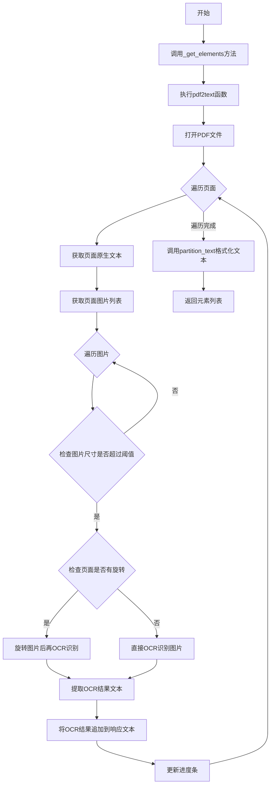
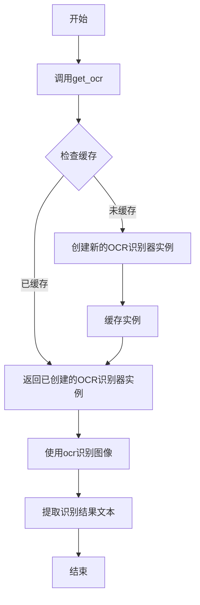
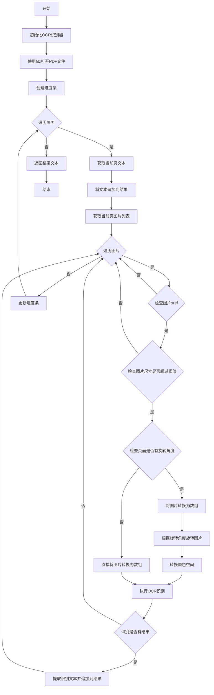
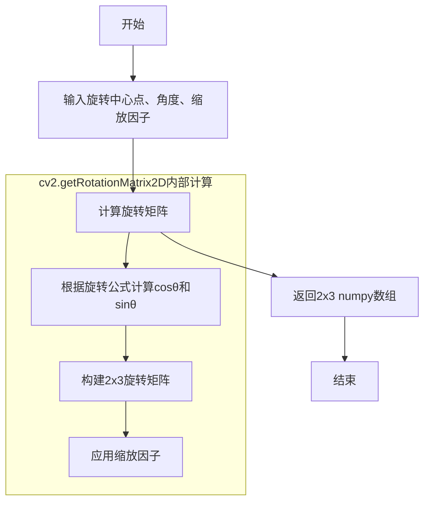
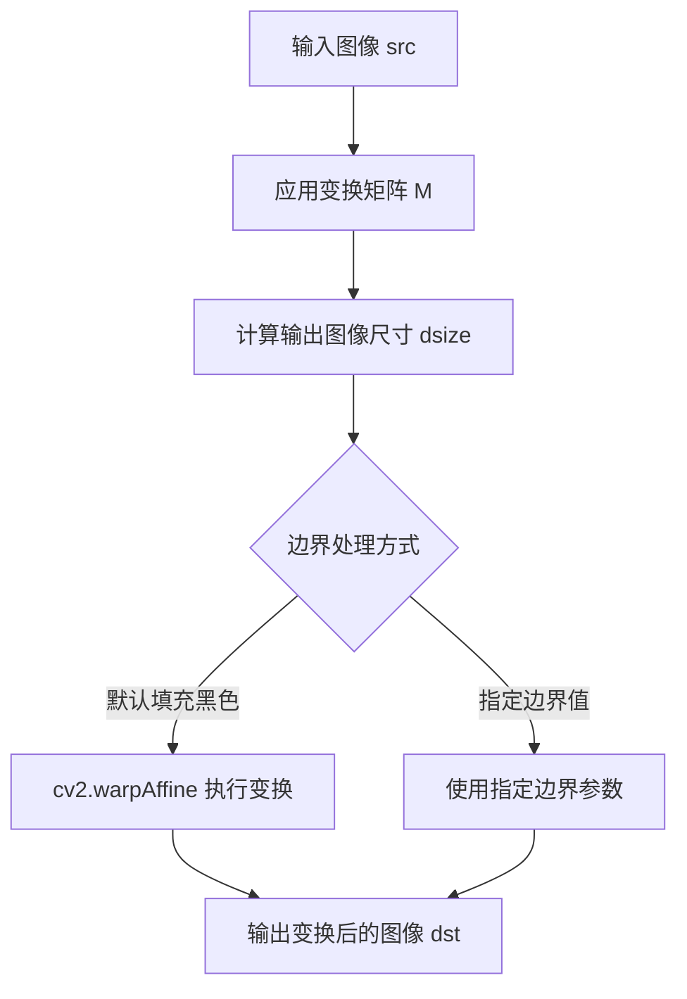
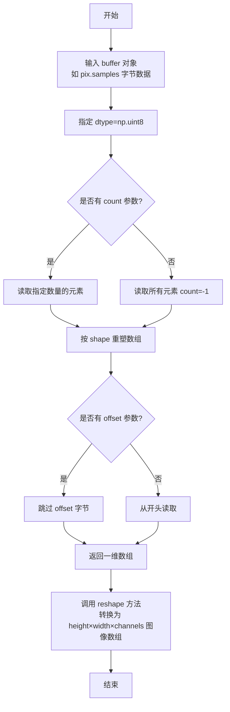
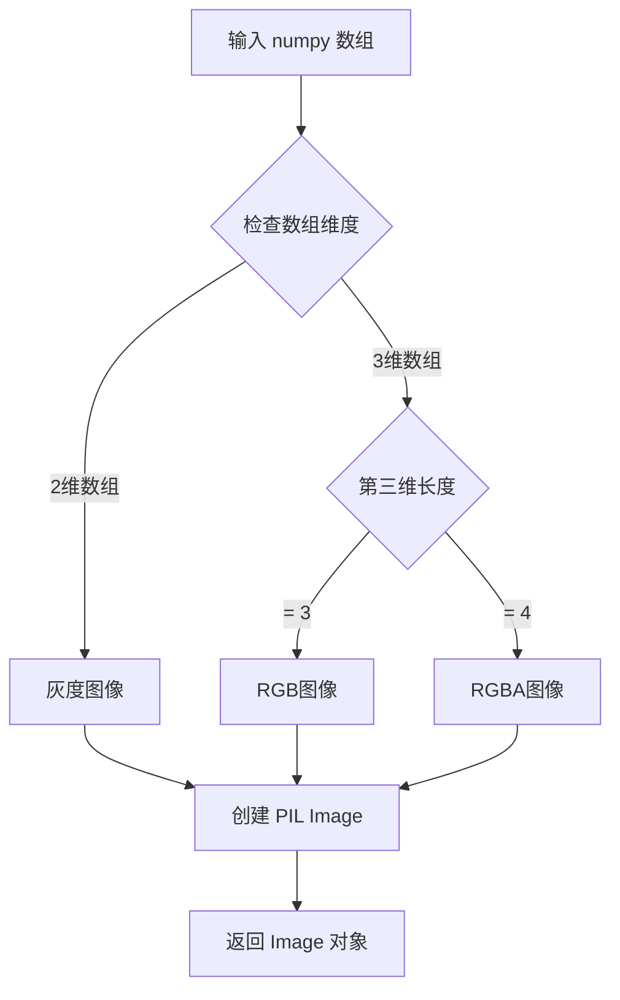
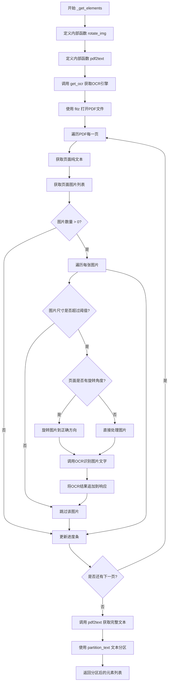
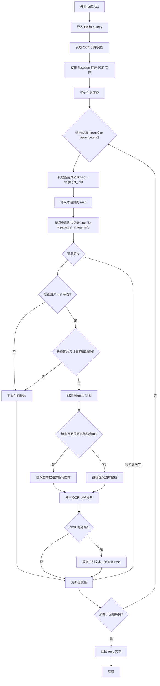

# `Langchain-Chatchat\libs\chatchat-server\chatchat\server\file_rag\document_loaders\mypdfloader.py` 详细设计文档

一个PDF文档加载器，通过结合PyMuPDF提取原生文本和RapidOCR光学识别技术，从PDF文件中提取文本内容，支持图片中的文字识别和页面旋转处理。

## 整体流程



## 类结构

```
UnstructuredFileLoader (基类)
└── RapidOCRPDFLoader (继承)
```

## 全局变量及字段


### `ocr`
    
OCR识别器实例，用于识别PDF中的图片文字

类型：`RapidOCR`
    


### `doc`
    
PyMuPDF文档对象，用于打开和处理PDF文件

类型：`fitz.Document`
    


### `resp`
    
文本响应结果，累积PDF中提取的所有文本内容

类型：`str`
    


### `b_unit`
    
进度条对象，用于显示PDF页面处理进度

类型：`tqdm.tqdm`
    


### `img_list`
    
页面图片列表，存储当前页面的图片信息

类型：`List[dict]`
    


### `bbox`
    
图片边界框，存储图片的左上角和右下角坐标

类型：`tuple`
    


### `pix`
    
PyMuPDF像素图对象，用于获取页面图片的像素数据

类型：`fitz.Pixmap`
    


### `img_array`
    
图片numpy数组，存储图像的像素矩阵数据

类型：`np.ndarray`
    


### `result`
    
OCR识别结果，包含识别出的文字和置信度信息

类型：`List`
    


### `RapidOCRPDFLoader.file_path`
    
PDF文件路径，继承自父类UnstructuredFileLoader

类型：`str`
    


### `RapidOCRPDFLoader.unstructured_kwargs`
    
unstructured分区参数，继承自父类UnstructuredFileLoader

类型：`dict`
    
    

## 全局函数及方法


### `get_ocr`

获取OCR识别器实例，用于对PDF中的图像进行文字识别处理。该函数返回一个OCR识别器对象，该识别器接收图像数组作为输入并返回识别结果。

参数：

- 无参数

返回值：`OCR识别器对象`，返回RapidOCR识别器实例，调用时接收图像数组（numpy.ndarray）并返回识别结果列表和置信度信息

#### 流程图



#### 带注释源码

```python
# 该函数定义位于 chatchat/server/file_rag/document_loaders/ocr.py 模块中
# 当前代码块中仅展示调用方式

# 在 pdf2text 函数内部调用 get_ocr()
ocr = get_ocr()

# ... 图像处理代码 ...

# 使用返回的OCR识别器对图像进行识别
# 参数: img_array - OpenCV格式的图像数组 (numpy.ndarray)
# 返回: result - 识别结果列表，每个元素为 [文本框坐标, 文本内容, 置信度]
#       _ - 忽略的第二个返回值（可能是详细置信度信息）
result, _ = ocr(img_array)

# 从识别结果中提取文本内容
if result:
    # line[1] 为识别到的文本内容
    ocr_result = [line[1] for line in result]
    resp += "\n".join(ocr_result)
```

> **注意**：由于 `get_ocr()` 函数的实际源码位于 `chatchat/server/file_rag/document_loaders/ocr.py` 模块中，未在当前提供的代码块中展示。以上源码基于该函数的调用方式进行推断。从调用模式推测，该函数可能采用了单例模式或缓存机制，以避免重复创建OCR识别器实例。


### `partition_text`

将提取的 PDF 文本内容进行语义分区处理，将原始文本按照段落、页面等逻辑分割成结构化的文档元素列表。

参数：

- `text`：`str`，从 PDF 中提取的原始文本内容
- `**unstructured_kwargs`：可选的关键字参数，包含传递给 `unstructured` 库的分區配置（如 `include_page_breaks`、`paragraph_grouper` 等）

返回值：`List[Element]`，返回结构化的文档元素列表（包含文本块、元数据等信息）

#### 流程图

```mermaid
flowchart TD
    A[开始 partition_text] --> B{检查输入参数}
    B -->|提供 filename| C[从文件读取文本]
    B -->|提供 text| D[直接使用 text 参数]
    C --> E[检测文本编码]
    D --> E
    E --> F{是否需要段落合并}
    F -->|是| G[应用 paragraph_grouper 函数]
    F -->|否| H[保持原始段落结构]
    G --> I[识别页面分隔符]
    H --> I
    I --> J[提取元数据]
    J --> K[创建 Element 对象列表]
    K --> L[返回 List[Element]]
```

#### 带注释源码

```python
from unstructured.partition.text import partition_text

# 调用 partition_text 对 PDF 提取的文本进行分区
# 参数 text: 从 PDF 中通过 OCR 和文本提取得到的完整文本内容
# 参数 **self.unstructured_kwargs: 传递给 unstructured 库的其他可选参数
#       可能包含: include_page_breaks, paragraph_grouper, metadata 等
return partition_text(text=text, **self.unstructured_kwargs)

# partition_text 函数内部主要处理逻辑:
# 1. 接收原始文本字符串
# 2. 根据换行符、空行等规则进行段落分割
# 3. 检测页面分隔符（如分页符）进行页面划分
# 4. 对每个文本块创建对应的 Element 对象
# 5. 附加元数据（页码、来源等）
# 6. 返回包含所有文本元素的列表
```


### `rotate_img`

该函数用于对输入的图像进行任意角度的旋转变换，通过计算旋转矩阵并使用仿射变换实现图像旋转，同时自动调整旋转后的图像边界以避免裁剪。

参数：

- `img`：`numpy.ndarray`，输入的图像（OpenCV 格式的图像数组）
- `angle`：`float`，旋转角度（正值表示逆时针旋转，负值表示顺时针旋转）

返回值：`numpy.ndarray`，返回旋转后的图像

#### 流程图

```mermaid
flowchart TD
    A[开始 rotate_img] --> B[获取图像高度h和宽度w]
    B --> C[计算旋转中心点 rotate_center = w/2, h/2]
    C --> D[调用cv2.getRotationMatrix2D获取旋转矩阵M]
    D --> E[计算旋转后新图像边界 new_w, new_h]
    E --> F[调整旋转矩阵的平移量 M[0,2]和M[1,2]]
    F --> G[调用cv2.warpAffine进行图像仿射变换]
    G --> H[返回旋转后的图像 rotated_img]
```

#### 带注释源码

```python
def rotate_img(img, angle):
    """
    img   --image
    angle --rotation angle
    return--rotated img
    """

    # 获取图像的高度和宽度
    h, w = img.shape[:2]
    
    # 计算旋转中心点（图像中心）
    rotate_center = (w / 2, h / 2)
    
    # 获取旋转矩阵
    # 参数1为旋转中心点;
    # 参数2为旋转角度,正值-逆时针旋转;负值-顺时针旋转
    # 参数3为各向同性的比例因子,1.0原图，2.0变成原来的2倍，0.5变成原来的0.5倍
    M = cv2.getRotationMatrix2D(rotate_center, angle, 1.0)
    
    # 计算图像新边界
    # 根据旋转矩阵计算旋转后图像的新宽度和新高度
    new_w = int(h * np.abs(M[0, 1]) + w * np.abs(M[0, 0]))
    new_h = int(h * np.abs(M[0, 0]) + w * np.abs(M[0, 1]))
    
    # 调整旋转矩阵以考虑平移
    # 将旋转中心调整到新图像的中心位置
    M[0, 2] += (new_w - w) / 2
    M[1, 2] += (new_h - h) / 2

    # 使用仿射变换旋转图像
    rotated_img = cv2.warpAffine(img, M, (new_w, new_h))
    
    return rotated_img
```


### `RapidOCRPDFLoader.pdf2text`

该函数是 PDF 转文本的核心处理函数，通过 PyMuPDF 库解析 PDF 页面文本，并结合 RapidOCR 对页面中的图片进行光学字符识别，最终将所有文本内容合并返回。

参数：

- `filepath`：`str`，PDF 文件的路径，用于指定待处理的 PDF 文档位置

返回值：`str`，返回提取并合并后的所有文本内容，包括页面原始文本和图片 OCR 识别结果

#### 流程图



#### 带注释源码

```python
def pdf2text(filepath):
    """
    将PDF文件转换为文本内容
    支持提取页面原始文本和图片中的OCR文字
    """
    import fitz  # pyMuPDF里面的fitz包，不要与pip install fitz混淆
    import numpy as np

    # 获取OCR识别器实例
    ocr = get_ocr()
    # 打开PDF文件
    doc = fitz.open(filepath)
    # 初始化返回结果
    resp = ""

    # 创建进度条，监控PDF页面处理进度
    b_unit = tqdm.tqdm(
        total=doc.page_count, desc="RapidOCRPDFLoader context page index: 0"
    )
    # 遍历PDF的每一页
    for i, page in enumerate(doc):
        # 更新进度条描述
        b_unit.set_description(
            "RapidOCRPDFLoader context page index: {}".format(i)
        )
        b_unit.refresh()
        
        # 获取当前页面的纯文本内容
        text = page.get_text("")
        # 将文本追加到结果中
        resp += text + "\n"

        # 获取当前页面的所有图片信息
        img_list = page.get_image_info(xrefs=True)
        # 遍历页面中的每张图片
        for img in img_list:
            # 获取图片的xref引用
            if xref := img.get("bbox"):  # 原文应该是 img.get("xref")
                # 获取图片的边界框
                bbox = img["bbox"]
                # 检查图片宽度是否超过设定阈值
                width_ratio = (bbox[2] - bbox[0]) / (page.rect.width)
                # 检查图片高度是否超过设定阈值
                height_ratio = (bbox[3] - bbox[1]) / (page.rect.height)
                
                # 如果图片尺寸小于阈值，跳过该图片的OCR处理
                if width_ratio < Settings.kb_settings.PDF_OCR_THRESHOLD[0] \
                   or height_ratio < Settings.kb_settings.PDF_OCR_THRESHOLD[1]:
                    continue
                
                # 根据xref创建Pixmap对象
                pix = fitz.Pixmap(doc, xref)
                samples = pix.samples
                
                # 检查页面是否有旋转角度
                if int(page.rotation) != 0:  # 如果Page有旋转角度，则旋转图片
                    # 将像素数据转换为numpy数组
                    img_array = np.frombuffer(
                        pix.samples, dtype=np.uint8
                    ).reshape(pix.height, pix.width, -1)
                    # 从numpy数组创建PIL图像
                    tmp_img = Image.fromarray(img_array)
                    # 转换为BGR格式（OpenCV格式）
                    ori_img = cv2.cvtColor(np.array(tmp_img), cv2.COLOR_RGB2BGR)
                    # 旋转图片以修正角度
                    rot_img = rotate_img(img=ori_img, angle=360 - page.rotation)
                    # 转换回RGB格式
                    img_array = cv2.cvtColor(rot_img, cv2.COLOR_RGB2BGR)
                else:
                    # 无旋转角度，直接转换
                    img_array = np.frombuffer(
                        pix.samples, dtype=np.uint8
                    ).reshape(pix.height, pix.width, -1)

                # 使用OCR识别图片中的文字
                result, _ = ocr(img_array)
                # 如果识别有结果
                if result:
                    # 提取所有识别到的文本行
                    ocr_result = [line[1] for line in result]
                    # 将OCR结果追加到总文本中
                    resp += "\n".join(ocr_result)

        # 更新进度条
        b_unit.update(1)
    
    # 返回合并后的所有文本
    return resp
```


### `cv2.getRotationMatrix2D`

该函数是OpenCV库中的图像处理函数，用于根据给定的旋转中心点、旋转角度和缩放因子生成2x3的仿射变换矩阵（旋转矩阵），常与`cv2.warpAffine`配合实现图像的旋转和缩放操作。

参数：

- `center`：`tuple[float, float]`，旋转中心点的坐标(x, y)
- `angle`：`float`，旋转角度（度），正值为逆时针旋转，负值为顺时针旋转
- `scale`：`float`，各向同性的缩放因子，1.0表示原图尺寸，2.0表示放大2倍，0.5表示缩小为一半

返回值：`np.ndarray`，形状为(2, 3)的仿射变换矩阵，用于后续`cv2.warpAffine`函数进行图像变换

#### 流程图



#### 带注释源码

```python
# 代码中实际调用示例
# 定义旋转中心点（图像中心）
rotate_center = (w / 2, h / 2)

# angle: 旋转角度，正值-逆时针旋转，负值-顺时针旋转
angle = 360 - page.rotation  # 从PDF页面获取的旋转角度

# 1.0: 缩放因子，1.0原图，2.0变成原来的2倍，0.5变成原来的0.5倍
scale = 1.0

# 调用OpenCV的getRotationMatrix2D函数生成旋转矩阵
# 参数1为旋转中心点 (w/2, h/2)
# 参数2为旋转角度 angle
# 参数3为各向同性的比例因子 1.0
M = cv2.getRotationMatrix2D(rotate_center, angle, 1.0)

# 返回值M是一个2x3的numpy数组，结构如下:
# M = [[a11, a12, tx],
#      [a21, a22, ty]]
# 其中 a11, a12, a21, a22 负责旋转和缩放
# tx, ty 负责平移

# 计算旋转后的新图像边界尺寸
new_w = int(h * np.abs(M[0, 1]) + w * np.abs(M[0, 0]))
new_h = int(h * np.abs(M[0, 0]) + w * np.abs(M[0, 1]))

# 调整旋转矩阵以考虑平移（使旋转后的图像完整显示）
M[0, 2] += (new_w - w) / 2
M[1, 2] += (new_h - h) / 2

# 使用旋转矩阵进行图像变换
rotated_img = cv2.warpAffine(img, M, (new_w, new_h))
```


### `cv2.warpAffine`

OpenCV 仿射变换函数，用于对图像进行旋转、缩放、平移等线性几何变换，通过指定的 2×3 变换矩阵将输入图像映射到输出图像，支持图像的重构和边界处理。

参数：

- `src`：`numpy.ndarray`，输入图像，即需要进行仿射变换的原始图像
- `M`：`numpy.ndarray`，2×3 的变换矩阵，包含旋转、缩放和平移的组合变换参数
- `dsize`：`tuple`，输出图像的尺寸，格式为 (width, height)

返回值：`numpy.ndarray`，返回经过仿射变换后的图像，尺寸由 dsize 指定

#### 流程图



#### 带注释源码

```python
# 在 rotate_img 函数中调用 cv2.warpAffine
# 参数说明：
# img: 输入的原图像（numpy.ndarray 格式，BGR 颜色空间）
# M: 由 cv2.getRotationMatrix2D() 计算得到的 2x3 旋转矩阵
#     - 包含旋转角度和缩放因子信息
#     - 经过平移调整后包含了图像中心平移量
# (new_w, new_h): 输出图像的目标尺寸
#     - new_w: 输出图像宽度
#     - new_h: 输出图像高度
#     - 这是根据旋转后的边界重新计算的尺寸，避免图像被裁剪

rotated_img = cv2.warpAffine(img, M, (new_w, new_h))
# 返回值说明：
# rotated_img: 旋转并缩放后的图像
#     - 类型: numpy.ndarray
#     - 尺寸: (new_h, new_w, 原图像通道数)
#     - 默认情况下，超出边界的像素值填充为 0（黑色）
```

#### 上下文调用关系

```python
# 完整调用上下文，展示 cv2.warpAffine 在图像旋转中的角色
def rotate_img(img, angle):
    """
    图像旋转函数，使用 cv2.warpAffine 完成实际变换
    
    参数:
        img   -- 待旋转的输入图像
        angle -- 旋转角度（正值逆时针，负值顺时针）
    """
    h, w = img.shape[:2]  # 获取图像高度和宽度
    rotate_center = (w / 2, h / 2)  # 设置旋转中心为图像中心
    
    # 生成旋转矩阵：旋转中心、旋转角度、缩放因子
    M = cv2.getRotationMatrix2D(rotate_center, angle, 1.0)
    
    # 计算旋转后图像的新边界尺寸
    new_w = int(h * np.abs(M[0, 1]) + w * np.abs(M[0, 0]))
    new_h = int(h * np.abs(M[0, 0]) + w * np.abs(M[0, 1]))
    
    # 调整旋转矩阵，添加平移量使图像居中
    M[0, 2] += (new_w - w) / 2
    M[1, 2] += (new_h - h) / 2
    
    # ========== cv2.warpAffine 调用位置 ==========
    # 对图像应用仿射变换，返回旋转后的图像
    rotated_img = cv2.warpAffine(img, M, (new_w, new_h))
    
    return rotated_img
```


### `np.frombuffer`

将缓冲区对象（如字节数据）解释为 NumPy 数组，无需复制数据。在本代码中用于将 PyMuPDF (fitz) 的 Pixmap 样本数据直接转换为 NumPy 数组，以处理 PDF 页面中的图像。

参数：

- `buffer`：`buffer-like object`，PyMuPDF Pixmap 的 samples 属性，提供原始图像字节数据
- `dtype`：`numpy.dtype`，指定数据类型，本代码中为 `np.uint8`（无符号 8 位整数）
- `count`：`int`，可选，读取的元素数量，默认为 -1（读取所有元素）
- `offset`：`int`，可选，从缓冲区开头的字节偏移量，默认为 0
- `strides`：`tuple of ints`，可选，每个维度的步长，默认为 None
- `order`：`str`，可选，内存布局，'C'（行优先/C风格）、'F'（列优先/Fortran风格）或 'A'（任意），默认为 'C'

返回值：`numpy.ndarray`，返回从缓冲区数据解释而来的 NumPy 数组

#### 流程图



#### 带注释源码

```python
# 处理带旋转角度的 PDF 页面
if int(page.rotation) != 0:  # 如果Page有旋转角度，则旋转图片
    # np.frombuffer 将 pix.samples (原始字节数据) 转换为 NumPy 数组
    # dtype=np.uint8 指定数据类型为无符号 8 位整数 (0-255)
    # reshape 将一维数组重塑为三维: 高度 × 宽度 × 通道数 (-1 表示自动计算通道数)
    img_array = np.frombuffer(
        pix.samples, dtype=np.uint8
    ).reshape(pix.height, pix.width, -1)
    
    # 将 NumPy 数组转换为 PIL Image 对象
    tmp_img = Image.fromarray(img_array)
    # 将 RGB 格式转换为 BGR 格式 (OpenCV 所需格式)
    ori_img = cv2.cvtColor(np.array(tmp_img), cv2.COLOR_RGB2BGR)
    # 旋转图片以纠正页面旋转角度
    rot_img = rotate_img(img=ori_img, angle=360 - page.rotation)
    # 转换回 RGB 格式用于 OCR 识别
    img_array = cv2.cvtColor(rot_img, cv2.COLOR_RGB2BGR)
else:
    # 处理不带旋转的页面，直接转换
    # 同样使用 np.frombuffer 将原始字节数据转换为图像数组
    # 这种方式不会复制数据，只是对同一块内存的不同视图
    img_array = np.frombuffer(
        pix.samples, dtype=np.uint8
    ).reshape(pix.height, pix.width, -1)
```


### `Image.fromarray`

将 numpy 数组转换为 PIL Image 对象，用于处理从 PDF 提取的图像数据，使其可以进行 OCR 识别或其他图像处理操作。

参数：

- `obj`：`numpy.ndarray`，输入的 numpy 数组，通常是通过 `np.frombuffer` 从 Pixmap 样本数据构建的多维数组，包含图像的像素值
- `mode`：`str`（可选），图像模式，如 "RGB"、"RGBA" 等，如果不指定则根据数组维度自动推断

返回值：`PIL.Image.Image`，返回创建的 PIL 图像对象

#### 流程图



#### 带注释源码

```python
# 在代码中的实际调用示例
# 将 Pixmap 的样本数据转换为 numpy 数组
img_array = np.frombuffer(
    pix.samples, dtype=np.uint8
).reshape(pix.height, pix.width, -1)

# 如果页面有旋转角度，则旋转图片
if int(page.rotation) != 0:
    # 将 numpy 数组转换为 PIL Image 对象
    # 这是必须的，因为 cv2.cvtColor 需要特定的数组格式
    tmp_img = Image.fromarray(img_array)
    
    # 将 PIL Image 转换为 OpenCV 格式（RGB to BGR）
    ori_img = cv2.cvtColor(np.array(tmp_img), cv2.COLOR_RGB2BGR)
    
    # 执行旋转操作
    rot_img = rotate_img(img=ori_img, angle=360 - page.rotation)
    
    # 转换回 RGB 格式供 OCR 使用
    img_array = cv2.cvtColor(rot_img, cv2.COLOR_RGB2BGR)
else:
    # 直接使用 numpy 数组，无需转换
    img_array = np.frombuffer(
        pix.samples, dtype=np.uint8
    ).reshape(pix.height, pix.width, -1)

# Image.fromarray() 的函数签名参考
# def fromarray(obj, mode=None):
#     """
#     Creates an image memory from an object exporting the array interface
#     (using the buffer protocol).
#     
#     Parameters:
#     - obj: Object with array interface (numpy array)
#     - mode: Optional mode string ('L', 'RGB', 'RGBA', etc.)
#     
#     Returns:
#     - PIL.Image.Image object
#     """
```


### `RapidOCRPDFLoader._get_elements`

重写父类方法，获取PDF文本元素。该方法通过OCR识别PDF中的图片文字，提取页面文本，并使用unstructured库进行文本分区处理，最终返回文档元素列表。

参数：

- 无显式参数（继承自父类 `UnstructuredFileLoader` 的属性）

返回值：`List`，返回分区后的文档元素列表

#### 流程图



#### 带注释源码

```python
def _get_elements(self) -> List:
    """
    重写父类方法，获取PDF文本元素
    通过OCR识别PDF中的图片文字，并使用unstructured库进行文本分区
    """
    
    def rotate_img(img, angle):
        """
        旋转图片到正确方向
        
        参数:
            img   -- 原始图像数组
            angle -- 旋转角度
        返回值:
            rotated_img -- 旋转后的图像
        """
        # 获取图像高度和宽度
        h, w = img.shape[:2]
        # 设置旋转中心为图像中心
        rotate_center = (w / 2, h / 2)
        
        # 获取旋转矩阵
        # 参数1为旋转中心点
        # 参数2为旋转角度,正值-逆时针旋转;负值-顺时针旋转
        # 参数3为各向同性的比例因子,1.0原图，2.0变成原来的2倍，0.5变成原来的0.5倍
        M = cv2.getRotationMatrix2D(rotate_center, angle, 1.0)
        
        # 计算图像新边界
        new_w = int(h * np.abs(M[0, 1]) + w * np.abs(M[0, 0]))
        new_h = int(h * np.abs(M[0, 0]) + w * np.abs(M[0, 1]))
        
        # 调整旋转矩阵以考虑平移，确保图像不会被裁剪
        M[0, 2] += (new_w - w) / 2
        M[1, 2] += (new_h - h) / 2

        # 使用仿射变换旋转图像
        rotated_img = cv2.warpAffine(img, M, (new_w, new_h))
        return rotated_img

    def pdf2text(filepath):
        """
        将PDF文件转换为文本内容
        
        参数:
            filepath -- PDF文件路径
        返回值:
            resp -- 包含所有页面文本和OCR结果的字符串
        """
        import fitz  # pyMuPDF里面的fitz包，不要与pip install fitz混淆
        import numpy as np

        # 获取OCR识别引擎实例
        ocr = get_ocr()
        # 打开PDF文件
        doc = fitz.open(filepath)
        resp = ""

        # 创建进度条，显示PDF页面处理进度
        b_unit = tqdm.tqdm(
            total=doc.page_count, desc="RapidOCRPDFLoader context page index: 0"
        )
        
        # 遍历PDF每一页
        for i, page in enumerate(doc):
            # 更新进度条描述
            b_unit.set_description(
                "RapidOCRPDFLoader context page index: {}".format(i)
            )
            b_unit.refresh()
            
            # 获取页面纯文本内容，""表示不保留格式
            text = page.get_text("")
            resp += text + "\n"

            # 获取页面中所有图片信息
            img_list = page.get_image_info(xrefs=True)
            
            # 遍历每张图片
            for img in img_list:
                # 获取图片xref（交叉引用编号）
                if xref := img.get("bbox"):
                    bbox = img["bbox"]
                    
                    # 检查图片尺寸是否超过设定的阈值
                    # 如果图片宽度相对于页面宽度的比例小于阈值，则跳过OCR
                    if (bbox[2] - bbox[0]) / (page.rect.width) < Settings.kb_settings.PDF_OCR_THRESHOLD[
                        0
                    ] or (bbox[3] - bbox[1]) / (
                        page.rect.height
                    ) < Settings.kb_settings.PDF_OCR_THRESHOLD[1]:
                        continue
                    
                    # 从PDF中提取图片像素数据
                    pix = fitz.Pixmap(doc, xref)
                    samples = pix.samples
                    
                    # 如果Page有旋转角度，则旋转图片到正确方向
                    if int(page.rotation) != 0:
                        # 将像素数据转换为图像数组
                        img_array = np.frombuffer(
                            pix.samples, dtype=np.uint8
                        ).reshape(pix.height, pix.width, -1)
                        # PIL Image 转换为 OpenCV 格式
                        tmp_img = Image.fromarray(img_array)
                        ori_img = cv2.cvtColor(np.array(tmp_img), cv2.COLOR_RGB2BGR)
                        # 旋转图片（360 - rotation 使图片回到0度）
                        rot_img = rotate_img(img=ori_img, angle=360 - page.rotation)
                        # 转换回RGB格式
                        img_array = cv2.cvtColor(rot_img, cv2.COLOR_RGB2BGR)
                    else:
                        # 无旋转，直接转换
                        img_array = np.frombuffer(
                            pix.samples, dtype=np.uint8
                        ).reshape(pix.height, pix.width, -1)

                    # 调用OCR识别图片中的文字
                    result, _ = ocr(img_array)
                    if result:
                        # 提取OCR识别结果中的文本内容
                        ocr_result = [line[1] for line in result]
                        # 将OCR结果追加到响应中
                        resp += "\n".join(ocr_result)

            # 更新进度条
            b_unit.update(1)
        return resp

    # 调用 pdf2text 获取PDF的完整文本内容
    text = pdf2text(self.file_path)
    
    # 从 unstructured 导入文本分区函数
    from unstructured.partition.text import partition_text

    # 使用 unstructured 的 partition_text 对文本进行分区处理
    # self.unstructured_kwargs 包含额外的分区参数
    return partition_text(text=text, **self.unstructured_kwargs)
```


### `rotate_img`

该内部函数用于根据指定的角度对输入图像进行旋转处理，支持任意角度旋转，并自动计算旋转后的新图像尺寸，确保图像内容不被裁剪。

参数：

- `img`：`numpy.ndarray`，输入的OpenCV图像对象（BGR格式）
- `angle`：`float` 或 `int`，旋转角度，正值表示逆时针旋转，负值表示顺时针旋转

返回值：`numpy.ndarray`，旋转后的图像对象

#### 流程图

```mermaid
flowchart TD
    A[开始 rotate_img] --> B[获取图像高度h和宽度w]
    B --> C[计算旋转中心点 rotate_center]
    C --> D[调用cv2.getRotationMatrix2D获取旋转矩阵M]
    D --> E[计算旋转后新图像宽度 new_w]
    E --> F[计算旋转后新图像高度 new_h]
    F --> G[调整旋转矩阵考虑平移: M[0,2]和M[1,2]]
    G --> H[调用cv2.warpAffine进行图像变换]
    H --> I[返回旋转后的图像 rotated_img]
```

#### 带注释源码

```python
def rotate_img(img, angle):
    """
    img   --image
    angle --rotation angle
    return--rotated img
    """

    # 获取图像的高度和宽度
    h, w = img.shape[:2]
    # 计算旋转中心点（图像中心）
    rotate_center = (w / 2, h / 2)
    # 获取旋转矩阵
    # 参数1为旋转中心点;
    # 参数2为旋转角度,正值-逆时针旋转;负值-顺时针旋转
    # 参数3为各向同性的比例因子,1.0原图，2.0变成原来的2倍，0.5变成原来的0.5倍
    M = cv2.getRotationMatrix2D(rotate_center, angle, 1.0)
    # 计算图像新边界
    # 根据旋转矩阵计算旋转后图像的新宽度和新高度
    new_w = int(h * np.abs(M[0, 1]) + w * np.abs(M[0, 0]))
    new_h = int(h * np.abs(M[0, 0]) + w * np.abs(M[0, 1]))
    # 调整旋转矩阵以考虑平移
    # 确保旋转后的图像居中显示
    M[0, 2] += (new_w - w) / 2
    M[1, 2] += (new_h - h) / 2

    # 使用仿射变换旋转图像
    rotated_img = cv2.warpAffine(img, M, (new_w, new_h))
    return rotated_img
```


### `RapidOCRPDFLoader.pdf2text`

这是一个内部函数，负责将PDF文件转换为文本内容。它使用PyMuPDF（fitz）打开PDF文档，提取每页的文本，并使用RapidOCR对嵌入图片进行文字识别，最终合并所有文本结果返回。

参数：

-  `filepath`：`str`，PDF文件的路径

返回值：`str`，从PDF中提取的所有文本内容，包括页面原始文本和图片OCR识别结果

#### 流程图



#### 带注释源码

```python
def pdf2text(filepath):
    """
    将PDF文件转换为文本内容
    使用PyMuPDF提取文本，并使用OCR识别嵌入图片中的文字
    
    参数:
        filepath: PDF文件的路径
    
    返回:
        str: 从PDF提取的所有文本内容
    """
    # 导入PyMuPDF（注意：这是pyMuPDF包内的fitz模块，不要与pip install的fitz混淆）
    import fitz  
    import numpy as np

    # 获取OCR引擎实例（RapidOCR）
    ocr = get_ocr()
    # 打开PDF文档
    doc = fitz.open(filepath)
    # 初始化结果字符串
    resp = ""

    # 创建进度条，追踪页面处理进度
    b_unit = tqdm.tqdm(
        total=doc.page_count, desc="RapidOCRPDFLoader context page index: 0"
    )
    
    # 遍历PDF的每一页
    for i, page in enumerate(doc):
        # 更新进度条描述（显示当前处理的页码）
        b_unit.set_description(
            "RapidOCRPDFLoader context page index: {}".format(i)
        )
        b_unit.refresh()
        
        # 获取当前页面的文本内容（""参数表示获取纯文本）
        text = page.get_text("")
        # 将页面文本追加到结果中
        resp += text + "\n"

        # 获取页面中的所有图片信息
        img_list = page.get_image_info(xrefs=True)
        
        # 遍历页面中的每张图片
        for img in img_list:
            # 检查图片是否存在xref（交叉引用编号）
            if xref := img.get("bbox"):  # 实际应该是 img.get("xref")
                # 获取图片的边界框
                bbox = img["bbox"]
                
                # 检查图片尺寸是否超过设定的阈值
                # 如果图片宽度或高度相对于页面太小，则跳过OCR处理
                if (bbox[2] - bbox[0]) / (page.rect.width) < Settings.kb_settings.PDF_OCR_THRESHOLD[0] \
                    or (bbox[3] - bbox[1]) / (page.rect.height) < Settings.kb_settings.PDF_OCR_THRESHOLD[1]:
                    continue
                
                # 从PDF中创建Pixmap对象以获取图片数据
                pix = fitz.Pixmap(doc, xref)
                samples = pix.samples
                
                # 如果页面有旋转角度，需要旋转图片后再进行OCR
                if int(page.rotation) != 0:
                    # 将像素数据转换为numpy数组
                    img_array = np.frombuffer(
                        pix.samples, dtype=np.uint8
                    ).reshape(pix.height, pix.width, -1)
                    
                    # 转换为PIL Image再转为OpenCV格式
                    tmp_img = Image.fromarray(img_array)
                    ori_img = cv2.cvtColor(np.array(tmp_img), cv2.COLOR_RGB2BGR)
                    
                    # 旋转图片以补偿页面旋转（360 - rotation 恢复正向）
                    rot_img = rotate_img(img=ori_img, angle=360 - page.rotation)
                    
                    # 转回RGB格式
                    img_array = cv2.cvtColor(rot_img, cv2.COLOR_RGB2BGR)
                else:
                    # 页面无旋转，直接转换
                    img_array = np.frombuffer(
                        pix.samples, dtype=np.uint8
                    ).reshape(pix.height, pix.width, -1)

                # 使用OCR识别图片中的文字
                result, _ = ocr(img_array)
                
                # 如果识别到文字，追加到结果中
                if result:
                    # 提取所有识别结果的文本（line[1]是识别出的文字）
                    ocr_result = [line[1] for line in result]
                    resp += "\n".join(ocr_result)

        # 更新进度条
        b_unit.update(1)
    
    # 返回合并后的文本内容
    return resp
```

## 关键组件


### RapidOCRPDFLoader 类

PDF文档加载器类，继承自UnstructuredFileLoader，用于从PDF文件中提取文本内容，支持通过OCR识别PDF中的图像文字，并返回结构化的文档列表。

### rotate_img 函数

图片旋转辅助函数，接收图像和旋转角度参数，使用OpenCV的getRotationMatrix2D和warpAffine实现图像旋转，支持任意角度旋转并自动调整输出图像尺寸以容纳旋转后的内容。

### pdf2text 函数

PDF转文本的核心处理函数，使用PyMuPDF(fitz)打开PDF文件，遍历每一页提取文本内容，并对符合条件的图像进行OCR识别，支持基于图像尺寸阈值的过滤和页面旋转处理。

### OCR集成模块

调用get_ocr()获取OCR引擎，使用RapidOCR对PDF中的图像进行文字识别，将识别结果合并到最终文本输出中，支持中英文混合识别。

### 图像处理模块

使用PIL和OpenCV进行图像格式转换和颜色空间转换(Image.fromarray、cv2.cvtColor)，将PyMuPDF的Pixmap转换为可用于OCR的NumPy数组格式。

### PDF页面旋转处理

检测page.rotation属性判断页面是否有旋转角度，如果有旋转则调用rotate_img函数将图像旋转回正常方向后再进行OCR识别，确保识别准确性。

### 图像尺寸过滤模块

根据PDF_OCR_THRESHOLD设置过滤太小的图像，仅对尺寸超过阈值的图像进行OCR处理，减少不必要的计算开销和提高处理效率。

### 进度条显示模块

使用tqdm库显示PDF页面处理进度，通过set_description动态更新当前处理的页码，提供用户友好的进度反馈。

### 文本分区模块

使用unstructured库的partition_text函数将提取的原始文本进行结构化分区处理，返回符合LangChain文档格式的列表。

### 外部依赖模块

依赖fitz(PyMuPDF)、cv2(OpenCV)、numpy、PIL、tqdm、unstructured、RapidOCR等开源库，实现PDF解析、图像处理、OCR识别和文本分区的完整处理流水线。


## 问题及建议


### 已知问题

-   **导入语句位置不规范**：导入语句（如`fitz`、`partition_text`）放在函数内部而非文件顶部，违反Python PEP8规范，影响代码可读性和可维护性
-   **资源未正确释放**：`fitz.open(filepath)`和`ocr`对象未使用上下文管理器或显式关闭，可能导致文件句柄或内存泄漏
-   **OCR阈值判断逻辑可能错误**：代码在图片尺寸**小于**阈值时跳过OCR，但通常意图应该是图片尺寸**大于**阈值才进行OCR处理（避免对小图片进行无意义OCR）
-   **异常处理缺失**：整个PDF处理流程没有try-except保护，OCR识别失败、文件损坏或格式异常会导致整个加载器崩溃
-   **进度条使用不当**：`b_unit.update(1)`在每页最后更新，但循环内部存在continue分支可能导致实际处理页数与进度条显示不一致
-   **图片处理存在冗余**：当`page.rotation != 0`时，代码先将图像转换为PIL再转numpy再转BGR再旋转最后再转RGB，流程繁琐且容易出错
-   **OCR结果与文本简单拼接**：OCR结果直接追加到文本末尾，可能导致内容顺序混乱，且未区分OCR文本与原始文本的来源

### 优化建议

-   **重构导入语句**：将所有import语句移至文件顶部，使用标准库、第三方库、本地模块分组排列
-   **添加资源管理**：使用`with`语句或显式调用`doc.close()`确保PDF文档对象正确释放；考虑将OCR对象作为类属性或参数传入以复用
-   **修正阈值判断逻辑**：将`<`改为`>`，确保仅对尺寸足够大的图片进行OCR处理
-   **添加异常处理**：为关键操作（如文件打开、OCR识别、图像转换）添加try-except，并提供降级方案（如OCR失败时仅返回文本）
-   **优化图片旋转逻辑**：使用`cv2.rotate`或直接通过`cv2.warpAffine`的旋转矩阵处理，避免多次图像格式转换
-   **分离职责**：将`pdf2text`内部逻辑拆分为独立函数（如`extract_page_text`、`extract_page_images`、`process_image_ocr`），提高可测试性
-   **改进数据组织**：使用结构化数据（如字典或dataclass）存储文本和OCR结果，保持来源信息，便于后续处理
-   **添加类型注解**：完善方法参数和返回值的类型注解，提升代码静态检查能力

## 其它


### 设计目标与约束

本模块旨在实现从PDF文件中高效提取文本内容，特别是针对包含图片的PDF文件，通过OCR技术识别图片中的文字。设计目标包括：支持多种PDF格式、处理旋转页面图片、集成进度条显示、处理阈值过滤等。约束条件包括：依赖fitz库进行PDF解析、依赖RapidOCR进行OCR识别、依赖unstructured库进行文本分区、需要配置PDF_OCR_THRESHOLD阈值参数。

### 错误处理与异常设计

代码中主要依赖异常处理机制包括：使用try-except捕获PDF解析和OCR识别过程中的异常；图片尺寸检查不满足阈值时使用continue跳过处理；OCR识别结果为空时同样跳过处理。对于文件路径不存在、PDF损坏、内存不足等情况，建议在上层调用时进行捕获处理。当前代码未实现重试机制，对于临时性失败（如内存波动）缺乏容错能力。

### 数据流与状态机

数据流如下：1) 初始化RapidOCRPDFLoader并传入文件路径；2) 调用_get_elements方法触发pdf2text函数；3) 使用fitz打开PDF文件并遍历每一页；4) 对每页提取文本并获取图片列表；5) 对满足阈值的图片进行OCR识别；6) 合并文本和OCR结果；7) 使用partition_text进行文本分区处理；8) 返回最终的元素列表。状态机主要涉及页面遍历状态和图片处理状态的转换。

### 外部依赖与接口契约

主要依赖包括：cv2（OpenCV）用于图像处理和旋转；numpy用于数组操作；fitz（PyMuPDF）用于PDF解析；tqdm用于进度条显示；PIL用于图像转换；unstructured库用于文本分区；RapidOCR通过get_ocr()获取。接口契约方面：输入为PDF文件路径；输出为经过unstructured处理的文本元素列表；get_ocr()需返回支持识别功能的OCR对象；Settings.kb_settings.PDF_OCR_THRESHOLD需配置为包含两个浮点数的元组。

### 性能考虑与优化空间

性能瓶颈主要包括：逐页处理PDF效率较低，可考虑多进程/多线程并行处理；OCR识别为性能热点，可批量处理多张图片；图片旋转使用CPU计算，可考虑GPU加速。当前优化空间：1) 添加批量OCR处理机制，将多张图片合并识别；2) 实现缓存机制避免重复处理；3) 添加超时控制防止单页耗时过长；4) 支持多进程并行处理不同页面；5) 对于纯文本PDF可跳过OCR流程。

### 安全性考虑

代码中涉及文件路径处理，需确保file_path参数经过验证防止路径遍历攻击；PDF文件解析可能触发恶意文件解析漏洞，建议添加文件大小和页数限制；OCR处理过程中内存占用较高，需监控内存使用防止OOM。

### 配置参数说明

关键配置参数包括：Settings.kb_settings.PDF_OCR_THRESHOLD - 图片尺寸阈值元组，第一个元素为宽度阈值比例，第二个元素为高度阈值比例；page.rotation - 页面旋转角度，用于判断是否需要旋转处理；b_unit - tqdm进度条实例，用于显示处理进度。

### 使用示例与调用流程

基础调用示例：loader = RapidOCRPDFLoader(file_path="/path/to/file.pdf", unstructured_kwargs={})；docs = loader.load()。进阶使用可配置unstructured_kwargs参数传递给partition_text函数。main函数展示了完整的调用流程，包括初始化、加载和打印结果。

### 边界条件与限制

边界条件包括：空PDF文件返回空结果；无图片的PDF仅提取文本；所有图片尺寸小于阈值时跳过OCR；页面旋转角度为0时跳过旋转处理；OCR识别无结果时仅保留文本内容。限制条件包括：仅支持单文件处理不支持批量；依赖特定的unstructured版本；需要配置OCR引擎；大文件可能内存不足。

### 日志与监控

当前代码使用tqdm进度条显示处理进度和当前页面索引，建议增强日志记录包括：文件处理开始和结束日志；每页处理状态和耗时；OCR识别结果统计；异常发生时的详细错误信息；性能指标如总处理时间、平均每页耗时等。

### 测试策略

测试用例应覆盖：正常PDF文件处理流程；纯文本PDF文件处理；包含多张图片的PDF文件处理；页面旋转的PDF文件处理；图片尺寸小于阈值的跳过逻辑；OCR识别失败的容错处理；大文件处理的内存使用；空PDF文件的边界情况。

### 版本兼容性

需确保兼容的依赖版本：Python 3.8+；cv2兼容版本；numpy兼容版本；fitz（PyMuPDF）兼容版本；tqdm兼容版本；unstructured库版本；Pillow版本。建议在requirements.txt中明确指定最低版本要求。

    