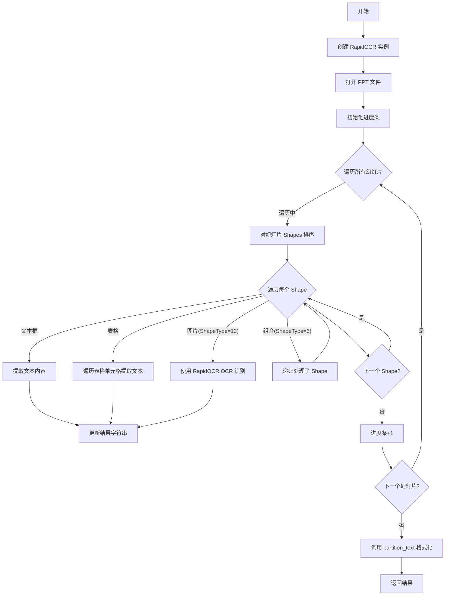
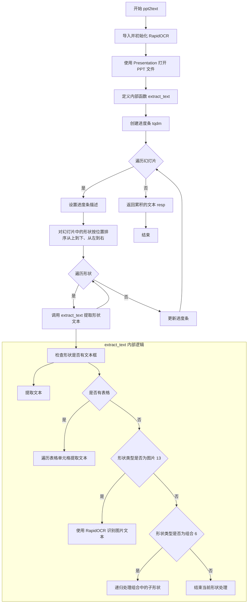
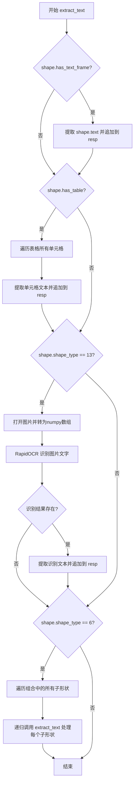
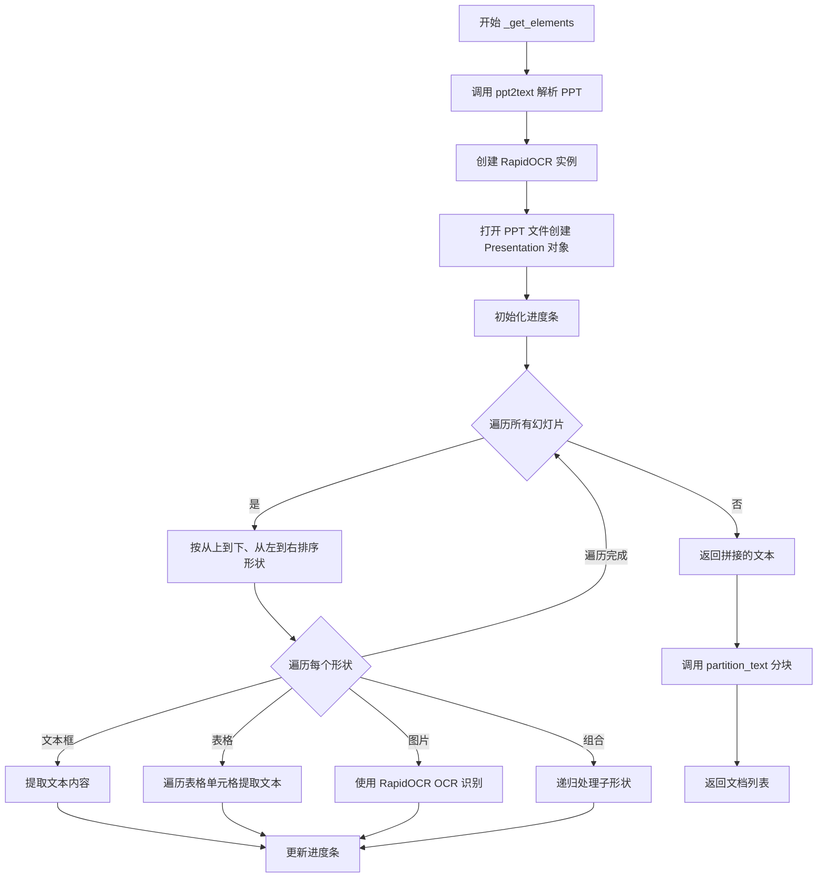

# `Langchain-Chatchat\libs\chatchat-server\chatchat\server\file_rag\document_loaders\mypptloader.py` 详细设计文档

一个基于 langchain 的 PPT/PPTX 文档加载器，通过 RapidOCR 对幻灯片中的图片进行 OCR 识别，并结合 python-pptx 提取文本和表格内容，最终返回非结构化文本。

## 整体流程



## 类结构

```
UnstructuredFileLoader (langchain_community.document_loaders.unstructured)
└── RapidOCRPPTLoader (本类)
```

## 全局变量及字段


### `file_path`
    
PPT 文件路径，继承自父类 UnstructuredFileLoader，用于指定要加载的 PPT 文件位置

类型：`str`
    


### `unstructured_kwargs`
    
unstructured 分区参数，继承自父类 UnstructuredFileLoader，用于配置文本分区处理的额外参数

类型：`dict`
    


### `RapidOCRPPTLoader.file_path`
    
PPT 文件路径，继承自父类 UnstructuredFileLoader，用于指定要加载的 PPT 文件位置

类型：`str`
    


### `RapidOCRPPTLoader.unstructured_kwargs`
    
unstructured 分区参数，继承自父类 UnstructuredFileLoader，用于配置文本分区处理的额外参数

类型：`dict`
    
    

## 全局函数及方法


### `ppt2text`

该函数是 PPT 转文本的主逻辑函数，通过打开 PPT 文件，使用 RapidOCR 识别图片中的文字，并递归提取幻灯片中所有形状（文本框、表格、图片、组合）的文本内容，最终返回合并后的文本字符串。

参数：

- `filepath`：`str`，PPT 文件的路径，用于打开演示文稿

返回值：`str`，从 PPT 中提取的所有文本内容，包括幻灯片中的文本、表格文本和图片 OCR 识别结果

#### 流程图



#### 带注释源码

```python
def ppt2text(filepath):
    """
    将 PPT 文件转换为文本内容
    
    参数:
        filepath: PPT 文件的路径
        
    返回:
        提取的文本内容字符串
    """
    from io import BytesIO
    
    import numpy as np
    from PIL import Image
    from pptx import Presentation
    from rapidocr_onnxruntime import RapidOCR
    
    # 初始化 RapidOCR 识别器
    ocr = RapidOCR()
    # 打开 PPT 文件
    prs = Presentation(filepath)
    # 用于累积提取的文本结果
    resp = ""
    
    def extract_text(shape):
        """
        递归提取形状中的文本内容
        
        参数:
            shape: pptx 形状对象
        """
        nonlocal resp
        # 检查形状是否有文本框，有则提取文本
        if shape.has_text_frame:
            resp += shape.text.strip() + "\n"
        # 检查形状是否有表格，有则遍历表格单元格提取文本
        if shape.has_table:
            for row in shape.table.rows:
                for cell in row.cells:
                    for paragraph in cell.text_frame.paragraphs:
                        resp += paragraph.text.strip() + "\n"
        # 形状类型为 13 表示图片，使用 OCR 识别图片中的文字
        if shape.shape_type == 13:  # 13 表示图片
            # 从形状中获取图片二进制数据并转换为 Image 对象
            image = Image.open(BytesIO(shape.image.blob))
            # 将图片转换为 numpy 数组并进行 OCR 识别
            result, _ = ocr(np.array(image))
            if result:
                # 提取识别结果中的文本内容（第二个元素为识别文本）
                ocr_result = [line[1] for line in result]
                resp += "\n".join(ocr_result)
        # 形状类型为 6 表示组合，递归处理组合中的子形状
        elif shape.shape_type == 6:  # 6 表示组合
            for child_shape in shape.shapes:
                extract_text(child_shape)
    
    # 创建进度条，描述为幻灯片索引
    b_unit = tqdm.tqdm(
        total=len(prs.slides), desc="RapidOCRPPTLoader slide index: 1"
    )
    # 遍历所有幻灯片
    for slide_number, slide in enumerate(prs.slides, start=1):
        # 更新进度条描述为当前处理的幻灯片编号
        b_unit.set_description(
            "RapidOCRPPTLoader slide index: {}".format(slide_number)
        )
        b_unit.refresh()
        # 对幻灯片中的形状按位置排序（先按 top 排序，再按 left 排序）
        # 这样可以保证从上到下、从左到右遍历
        sorted_shapes = sorted(
            slide.shapes, key=lambda x: (x.top, x.left)
        )
        # 遍历排序后的形状，提取文本
        for shape in sorted_shapes:
            extract_text(shape)
        # 更新进度条
        b_unit.update(1)
    # 返回累积的所有文本内容
    return resp
```


### `extract_text`

递归提取单个 Shape 的文本内容，包括文本框、表格和图片（通过 OCR），并支持组合形状的递归遍历。

参数：

- `shape`：`pptx.presentation.Shape`，PowerPoint 演示文稿中的形状对象，可能是文本框、表格、图片或组合形状

返回值：`None`，通过 `nonlocal` 变量 `resp` 累积存储提取的文本内容

#### 流程图



#### 带注释源码

```python
def extract_text(shape):
    """
    递归提取单个 Shape 的文本内容
    支持：文本框、表格、图片(OCR)、组合形状
    """
    nonlocal resp  # 引用外层函数的变量，用于累积文本结果
    
    # 1. 处理文本框
    if shape.has_text_frame:
        resp += shape.text.strip() + "\n"
    
    # 2. 处理表格
    if shape.has_table:
        for row in shape.table.rows:
            for cell in row.cells:
                for paragraph in cell.text_frame.paragraphs:
                    resp += paragraph.text.strip() + "\n"
    
    # 3. 处理图片 - shape_type 13 表示图片
    if shape.shape_type == 13:  # 13 表示图片
        # 从 Shape 中获取图片二进制数据并用 PIL 打开
        image = Image.open(BytesIO(shape.image.blob))
        # 将图片转换为 numpy 数组供 RapidOCR 使用
        result, _ = ocr(np.array(image))
        if result:
            # 提取识别结果中的文本部分 (line[1] 为识别文本)
            ocr_result = [line[1] for line in result]
            resp += "\n".join(ocr_result)
    
    # 4. 处理组合形状 - shape_type 6 表示组合
    elif shape.shape_type == 6:  # 6 表示组合
        # 递归遍历组合中的每个子形状
        for child_shape in shape.shapes:
            extract_text(child_shape)  # 递归调用自身处理子形状
```


### RapidOCRPPTLoader._get_elements()

重写父类方法，实现 PPT 解析核心逻辑。通过 python-pptx 库读取 PPT 文件，遍历所有幻灯片提取文本框和表格内容，同时利用 RapidOCR 对图片进行 OCR 识别，最后使用 unstructured 库的 partition_text 对文本进行分块处理并返回文档列表。

参数：

- `self`：实例本身，包含文件路径和 unstructured 配置参数

返回值：`List`，返回经过 partition_text 分块处理后的文档列表

#### 流程图



#### 带注释源码

```python
class RapidOCRPPTLoader(UnstructuredFileLoader):
    def _get_elements(self) -> List:
        """重写父类方法，实现 PPT 解析核心逻辑"""
        
        def ppt2text(filepath):
            """内部函数：解析 PPT 文件为纯文本
            
            Args:
                filepath: PPT 文件路径
            Returns:
                提取的所有文本内容
            """
            from io import BytesIO
            
            import numpy as np
            from PIL import Image
            from pptx import Presentation
            from rapidocr_onnxruntime import RapidOCR
            
            # 初始化 RapidOCR OCR 引擎
            ocr = RapidOCR()
            # 打开 PPT 文件
            prs = Presentation(filepath)
            # 用于存储提取的文本结果
            resp = ""
            
            def extract_text(shape):
                """递归提取单个形状的文本内容
                
                Args:
                    shape: pptx 形状对象
                """
                nonlocal resp
                # 检查是否为文本框
                if shape.has_text_frame:
                    resp += shape.text.strip() + "\n"
                # 检查是否为表格
                if shape.has_table:
                    for row in shape.table.rows:
                        for cell in row.cells:
                            for paragraph in cell.text_frame.paragraphs:
                                resp += paragraph.text.strip() + "\n"
                # shape_type == 13 表示图片
                if shape.shape_type == 13:
                    # 从图片二进制数据创建 Image 对象
                    image = Image.open(BytesIO(shape.image.blob))
                    # 将 PIL Image 转为 numpy 数组进行 OCR
                    result, _ = ocr(np.array(image))
                    if result:
                        # 提取 OCR 识别结果中的文本
                        ocr_result = [line[1] for line in result]
                        resp += "\n".join(ocr_result)
                # shape_type == 6 表示组合形状
                elif shape.shape_type == 6:
                    # 递归处理组合中的每个子形状
                    for child_shape in shape.shapes:
                        extract_text(child_shape)
            
            # 创建进度条，监控幻灯片处理进度
            b_unit = tqdm.tqdm(
                total=len(prs.slides), 
                desc="RapidOCRPPTLoader slide index: 1"
            )
            # 遍历所有幻灯片（从 1 开始编号）
            for slide_number, slide in enumerate(prs.slides, start=1):
                b_unit.set_description(
                    "RapidOCRPPTLoader slide index: {}".format(slide_number)
                )
                b_unit.refresh()
                # 按从上到下、从左到右排序形状
                sorted_shapes = sorted(
                    slide.shapes, 
                    key=lambda x: (x.top, x.left)
                )
                # 提取每个形状的文本
                for shape in sorted_shapes:
                    extract_text(shape)
                # 更新进度条
                b_unit.update(1)
            return resp
        
        # 调用内部函数解析 PPT 文件
        text = ppt2text(self.file_path)
        # 从 unstructured 导入文本分区函数
        from unstructured.partition.text import partition_text
        
        # 使用 partition_text 对文本进行分块处理
        # self.unstructured_kwargs 包含额外的分区参数
        return partition_text(text=text, **self.unstructured_kwargs)
```

## 关键组件


### RapidOCRPPTLoader类

继承自UnstructuredFileLoader的文档加载器类，用于从PowerPoint文件中提取文本内容，支持OCR识别图片中的文字。

### _get_elements方法

实现父类的抽象方法，调用ppt2text函数将PPTX文件转换为文本，然后使用unstructured库的partition_text进行进一步处理。

### ppt2text内部函数

负责将PPTX文件转换为文本字符串的核心函数，内部包含extract_text递归函数处理各种形状，支持文本框、表格、图片(OCR)和组合形状的文本提取。

### extract_text内部函数

递归提取形状中文本的函数，处理文本框、表格、图片(通过RapidOCR OCR识别)和组合形状，将识别结果追加到resp字符串中。

### RapidOCR OCR引擎

基于ONNX Runtime的快速OCR识别引擎，用于识别PPT中图片内的文字内容，返回识别结果的文本列表。

### 形状遍历逻辑

使用sorted对slide.shapes按(top, left)排序，实现从上到下、从左到右的顺序遍历幻灯片中的元素。

### 进度条组件

使用tqdm显示幻灯片处理进度，每处理一张幻灯片更新一次进度条，并显示当前处理的幻灯片索引。

### 图片形状处理

当shape.shape_type等于13时识别为图片，使用PIL读取图片为Image对象，转换为numpy数组后调用RapidOCR进行文字识别。

### 组合形状处理

当shape.shape_type等于6时识别为组合形状，递归遍历组合内的所有子形状进行文本提取。


## 问题及建议


### 已知问题

- **导入语句分散**：大量导入语句位于类方法内部（`_get_elements` 和 `ppt2text` 函数内），违反 Python 最佳实践，影响代码可读性和启动性能
- **嵌套函数层级过深**：`ppt2text` 和 `extract_text` 定义在 `_get_elements` 方法内部，导致代码结构复杂，难以单独测试和复用
- **缺少异常处理**：文件读取、PPT 解析、OCR 识别等关键操作均无 try-except 保护，可能导致程序直接崩溃
- **OCR 实例重复创建**：每次调用 `_get_elements` 都会创建新的 `RapidOCR()` 实例，增加内存开销，应改为类级别或模块级别单例
- **魔法数字未定义**：`shape_type == 13`（图片）和 `shape_type == 6`（组合）使用硬编码数值，缺乏常量定义，可读性差
- **资源未正确释放**：进度条 `tqdm` 对象未显式调用 `close()`，文件句柄未显式关闭
- **类型注解不完整**：`_get_elements` 返回类型声明为 `List` 而非 `List[Any]`，缺少泛型参数
- **函数副作用设计不佳**：`extract_text` 使用 `nonlocal resp` 修改外部变量，容易产生意外行为

### 优化建议

- 将所有第三方导入移至文件顶部，统一管理依赖
- 将 `ppt2text` 和 `extract_text` 提取为类方法或独立的模块级函数，提高可测试性
- 为关键操作（文件读取、OCR 识别）添加异常捕获和优雅降级
- 在类初始化时创建 `RapidOCR` 实例并缓存为类属性，避免重复实例化
- 定义常量类或枚举来映射 `shape_type`，如 `SHAPE_TYPE_IMAGE = 13`、`SHAPE_TYPE_GROUP = 6`
- 使用上下文管理器或显式 `close()` 确保资源释放
- 完善类型注解，使用 `List[Document]` 或 `List[Any]` 明确返回类型
- 考虑将 `extract_text` 改为返回值而非修改外部变量，遵循函数式编程原则

## 其它


### 设计目标与约束

设计目标：实现一个高效的PPTX文档加载器，能够提取幻灯片中的文本内容（包括形状文本、表格文本）以及图片中的OCR文字，支持从组合形状中递归提取文本，并使用unstructured库进行后续文本分区处理。约束：依赖RapidOCR进行图片OCR，依赖python-pptx解析PPT结构，依赖unstructured进行文本分区，必须在支持PPTX格式的环境下运行。

### 错误处理与异常设计

文件路径异常：若file_path不存在或无法读取，抛出FileNotFoundError或OSError。PPT解析异常：若PPT文件损坏或格式不兼容，python-pptx会抛出异常，需捕获并包装为更友好的错误信息。OCR异常：若图片格式无法被PIL识别或RapidOCR处理失败，需捕获异常并继续处理其他内容，避免整体失败。进度条异常：tqdm操作需捕获可能的异常确保资源释放。空内容处理：对于无法提取任何内容的幻灯片，应记录日志并继续处理。

### 外部依赖与接口契约

主要依赖包括：langchain_community.document_loaders.unstructured作为基类，python-pptx用于解析PPT结构，PIL用于图片读取，rapidocr_onnxruntime用于OCR识别，unstructured.partition.text.partition_text用于文本分区，tqdm用于进度显示。接口契约：RapidOCRPPTLoader继承UnstructuredFileLoader，遵循其load()方法约定，返回List[Document]类型。内部方法_get_elements()返回处理后的文本分区结果。

### 性能考虑

图片OCR是性能瓶颈，建议对重复图片进行缓存避免重复OCR。幻灯片形状排序操作时间复杂度为O(n log n)，对于大型PPT可能有性能影响。进度条刷新频率可能影响性能，建议合理设置刷新策略。内存占用主要来自图片加载和OCR结果，建议分批处理或流式处理大型文件。

### 安全性考虑

文件路径校验：需验证file_path指向的是合法的PPT文件，防止路径遍历攻击。恶意PPT文件：需考虑损坏的PPT文件可能导致解析异常或内存溢出。外部依赖安全：RapidOCR使用ONNXRuntime，需确保模型文件来源可靠。大文件处理：需防止超大PPT文件导致内存溢出，建议添加文件大小限制。

### 可扩展性设计

支持更多幻灯片元素：当前支持形状、表格、图片、组合形状，可扩展支持动画、备注等。多种OCR引擎：可通过抽象OCR引擎接口支持不同OCR实现。多格式支持：可扩展支持其他Office格式如ODP等。插件化分区器：partition_text的参数可通过unstructured_kwargs外部配置。

### 配置管理

file_path：必需参数，指定PPT文件路径。unstructured_kwargs：可选参数，传递给partition_text的额外参数。OCR配置：RapidOCR可通过参数配置置信度阈值、线程数等。进度条配置：tqdm的描述格式和更新频率可配置。排序策略：当前按top和left排序，可配置为其他排序方式。

### 版本兼容性

python-pptx版本：需兼容不同版本的pptx库，部分API如shape.shape_type常量值可能随版本变化。RapidOCR版本：需确保RapidOCR返回结果格式稳定。unstructured版本：partition_text的接口参数可能随版本变化。PIL版本：Image.open对图片格式的支持可能变化。Python版本：需明确支持的Python版本范围。

    