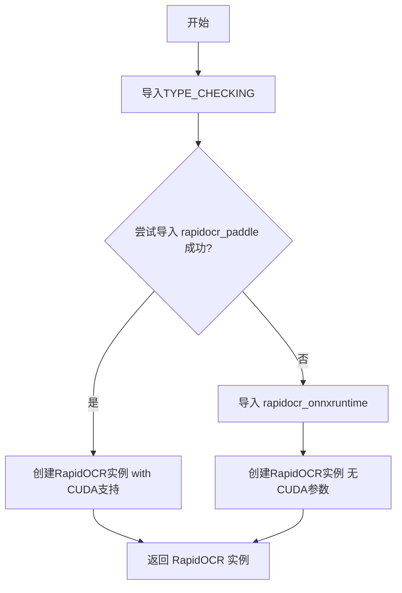
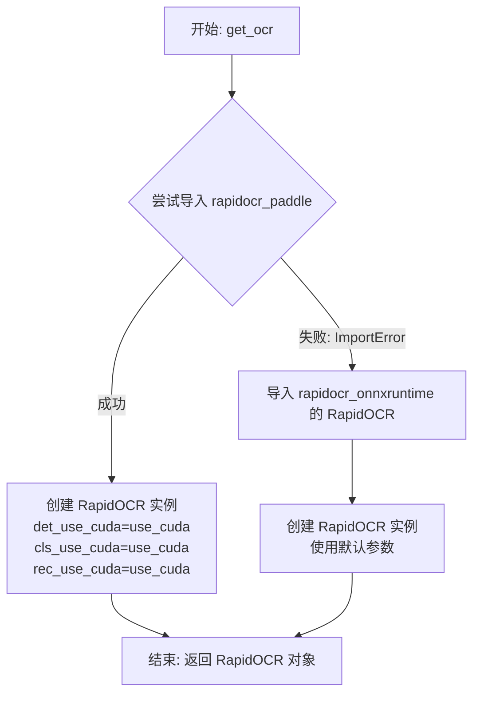

# `Langchain-Chatchat\libs\chatchat-server\chatchat\server\file_rag\document_loaders\ocr.py` 详细设计文档

这是一个OCR引擎初始化模块，通过动态导入机制优先使用PaddlePaddle后端的RapidOCR以获得更好的性能，若导入失败则自动降级使用ONNXRuntime后端，确保程序在各种环境下都能正常运行OCR任务。

## 整体流程



## 类结构

```
无类结构（纯模块化函数）
```

## 全局变量及字段


### `TYPE_CHECKING`
    
typing模块常量，用于类型检查时导入，避免运行时导入冲突

类型：`bool`
    


    

## 全局函数及方法


### `get_ocr`

该函数用于获取 RapidOCR 光学字符识别引擎实例。它首先尝试导入支持 CUDA 加速的 `rapidocr_paddle` 版本，并根据 `use_cuda` 参数配置检测、分类和识别模块的 CUDA 使用情况；如果 paddle 版本的包未安装，则回退到 `rapidocr_onnxruntime` 版本。

**参数：**

- `use_cuda`：`bool`，可选参数（默认值为 `True`）。控制是否在 OCR 的检测、分类和识别阶段使用 CUDA 加速。当为 `True` 时启用 GPU 加速，为 `False` 时使用 CPU 计算。

**返回值：** `RapidOCR`，返回配置好的 RapidOCR 识别引擎实例。

#### 流程图



#### 带注释源码

```python
from typing import TYPE_CHECKING

# TYPE_CHECKING 仅在类型检查时导入，不影响运行时性能
if TYPE_CHECKING:
    try:
        # 尝试导入 PaddlePaddle 版本的 RapidOCR（支持 CUDA 加速）
        from rapidocr_paddle import RapidOCR
    except ImportError:
        # 如果 PaddlePaddle 版本不可用，回退到 ONNXRuntime 版本（纯 CPU）
        from rapidocr_onnxruntime import RapidOCR


def get_ocr(use_cuda: bool = True) -> "RapidOCR":
    """
    获取 RapidOCR 引擎实例。
    
    优先使用支持 CUDA 加速的 PaddlePaddle 后端，如果不可用则使用
    ONNXRuntime 后端。该函数会自动处理依赖库的兼容性选择。
    
    Args:
        use_cuda: 是否使用 CUDA 加速。默认为 True。
                  仅在 rapidocr_paddle 可用时生效。
    
    Returns:
        RapidOCR: 初始化好的 OCR 引擎实例，可用于文本检测和识别。
    """
    try:
        # 尝试导入并使用 PaddlePaddle 版本的 RapidOCR
        from rapidocr_paddle import RapidOCR

        # 创建支持 CUDA 配置的 OCR 实例
        # det_use_cuda: 文本检测模块是否使用 CUDA
        # cls_use_cuda: 方向分类模块是否使用 CUDA
        # rec_use_cuda: 文字识别模块是否使用 CUDA
        ocr = RapidOCR(
            det_use_cuda=use_cuda, 
            cls_use_cuda=use_cuda, 
            rec_use_cuda=use_cuda
        )
    except ImportError:
        # PaddlePaddle 版本不可用，回退到 ONNXRuntime 版本
        # ONNXRuntime 版本不支持 CUDA 参数，使用纯 CPU 计算
        from rapidocr_onnxruntime import RapidOCR

        ocr = RapidOCR()
    
    return ocr
```

## 关键组件


### 条件导入与后端选择机制

通过 TYPE_CHECKING 和 try-except 实现运行时动态选择 OCR 后端，优先使用 PaddleOCR 后端，失败时回退到 ONNXRuntime 后端，确保在不同环境下都能正常运行。

### CUDA 加速配置模块

根据 use_cuda 参数控制检测、分类、识别三个模块的 CUDA 加速开关，支持在有 NVIDIA GPU 的环境下提升 OCR 推理性能。

### OCR 实例工厂函数

get_ocr 函数作为工厂方法，根据传入的 use_cuda 参数动态创建并返回对应的 RapidOCR 实例，封装了后端选择和初始化的复杂性。

### 类型提示与类型检查

使用 TYPE_CHECKING 条件导入和字符串形式的类型注解 "RapidOCR"，避免运行时循环导入问题，提供静态类型检查支持。


## 问题及建议


### 已知问题

-   **重复导入逻辑**：在`get_ocr`函数内部存在与`TYPE_CHECKING`块中重复的导入逻辑，导致代码冗余
-   **参数丢失问题**：当`rapidocr_paddle`导入失败而回退到`rapidocr_onnxruntime`时，`use_cuda`参数被完全忽略，导致参数丢失
-   **异常处理不完整**：仅捕获`ImportError`，未处理其他可能的运行时异常（如初始化失败、依赖缺失等）
-   **类型提示不一致**：`TYPE_CHECKING`块仅能导入`rapidocr_paddle`的`RapidOCR`，但运行时可能使用`rapidocr_onnxruntime`，两者接口可能存在差异
-   **缺少文档字符串**：模块和函数均缺少文档说明，可维护性较低

### 优化建议

-   **提取公共导入逻辑**：将导入逻辑抽取为独立函数或使用辅助变量，减少重复代码
-   **参数一致性处理**：在回退逻辑中考虑添加`use_cuda`参数的支持，或明确文档说明`rapidocr_onnxruntime`版本不支持该参数
-   **增强异常处理**：添加更完善的异常捕获机制，例如记录日志或返回有意义的错误信息
-   **添加文档字符串**：为模块和函数添加清晰的文档说明，包括参数说明、返回值说明和使用示例
-   **依赖检查优化**：可在模块初始化时预检查可用库，缓存结果以避免每次调用都进行导入尝试

## 其它


### 设计目标与约束

本模块的设计目标是提供一个统一的OCR实例获取接口，根据系统环境和配置自动选择最优的OCR实现。设计约束包括：优先使用支持CUDA加速的PaddleOCR后端以获得更好的性能，当PaddleOCR不可用时自动回退到ONNX Runtime后端以保证兼容性，同时通过use_cuda参数允许用户控制是否启用CUDA加速。

### 错误处理与异常设计

本模块采用异常捕获机制处理导入失败场景。当尝试导入rapidocr_paddle失败时，会捕获ImportError并自动回退到rapidocr_onnxruntime。当前仅处理ImportError类型的异常，未对其他潜在异常（如参数错误、配置问题）进行专门处理。设计上建议增加更详细的日志记录，以便追踪回退行为发生的原因和频率。

### 数据流与状态机

数据流较为简单：调用get_ocr函数传入use_cuda布尔参数，函数内部根据参数和导入可用性创建RapidOCR实例并返回。状态机可简化为两种状态：主路径状态（成功导入PaddleOCR并创建实例）和回退路径状态（ImportError触发，使用ONNX Runtime创建实例）。状态转换条件为PaddleOCR模块是否可导入。

### 外部依赖与接口契约

本模块依赖两个可选的外部OCR库：rapidocr_paddle（优先）和rapidocr_onnxruntime（备选）。接口契约包括：get_ocr函数接受一个可选的布尔参数use_cuda（默认True），返回RapidOCR实例。当use_cuda为True时，PaddleOCR后端会启用CUDA加速；ONNX Runtime后端不支持CUDA参数。调用方需确保传入的use_cuda参数与实际硬件环境匹配。

### 配置管理

当前配置通过函数参数传递，未使用独立的配置管理系统。可配置项包括：use_cuda参数控制CUDA加速启用状态。建议未来引入配置类或配置文件来集中管理OCR相关的配置选项，如模型路径、置信度阈值、文本方向检测等。

### 性能考虑

性能优化主要体现在CUDA加速支持和优雅降级策略上。PaddleOCR后端启用CUDA可显著提升检测和识别速度。模块在首次导入时存在一定的启动开销（尝试导入库），但运行时性能取决于所选用的OCR后端。建议：对于频繁调用的场景，应在应用初始化时调用get_ocr并缓存返回的实例，避免重复创建。

### 安全性考虑

当前模块不涉及敏感数据处理或用户输入验证，安全性风险较低。但需要注意：传入的use_cuda参数应进行类型校验，避免非布尔值导致意外行为；另外，当OCR处理外部图像数据时，应考虑图像来源的可信性问题。

### 测试策略

建议编写单元测试覆盖以下场景：成功导入PaddleOCR且use_cuda为True的情况、ImportError触发时的回退行为、use_cuda为False时的行为、以及rapidocr_paddle完全不可用时仅使用ONNX Runtime的情况。可使用mock技术模拟导入失败场景来验证回退逻辑的正确性。

### 版本兼容性

需要确保代码与RapidOCR的两个后端版本兼容。rapidocr_paddle和rapidocr_onnxruntime的API应保持一致以保证透明切换。建议在项目依赖中明确指定兼容的OCR库版本范围，并定期测试新版本的兼容性。

### 部署注意事项

部署时需确保目标环境满足以下条件：Python环境、所需的OCR库已安装（如需CUDA加速还需CUDA Toolkit和兼容的GPU驱动）。容器化部署建议在Dockerfile中包含条件安装逻辑，优先安装PaddleOCR相关包，回退安装ONNX Runtime包。生产环境建议记录OCR后端选择日志以便问题排查。

    