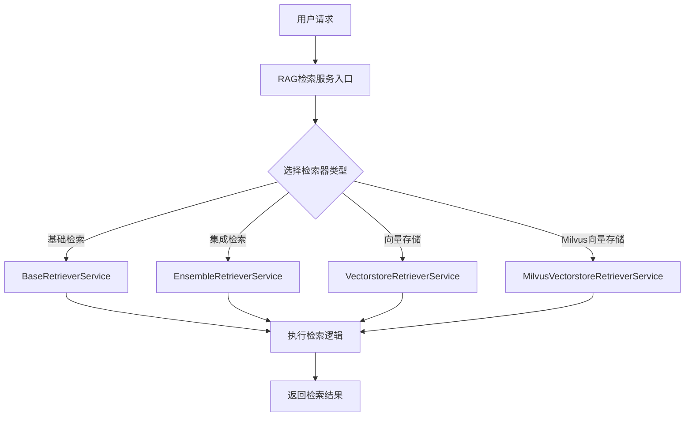

# `Langchain-Chatchat\libs\chatchat-server\chatchat\server\file_rag\retrievers\__init__.py` 详细设计文档

该代码文件是ChatChat项目中文档检索(RAG)模块的检索器服务初始化文件，导入了多种检索器服务实现，包括基础检索器、集成检索器、向量存储检索器以及Milvus专用向量存储检索器，为上层应用提供统一的检索服务接口。

## 整体流程



## 类结构

```
BaseRetrieverService (抽象基类)
├── EnsembleRetrieverService (集成检索服务)
├── VectorstoreRetrieverService (向量存储检索服务)
└── MilvusVectorstoreRetrieverService (Milvus向量存储检索服务)
```

## 全局变量及字段


### `BaseRetrieverService`
    
基础检索服务基类，定义检索服务的通用接口和方法

类型：`class`
    


### `EnsembleRetrieverService`
    
集成检索服务，支持多种检索方式的组合与融合

类型：`class`
    


### `VectorstoreRetrieverService`
    
向量存储检索服务，基于向量数据库提供检索能力

类型：`class`
    


### `MilvusVectorstoreRetrieverService`
    
Milvus向量存储检索服务，集成Milvus向量数据库的检索实现

类型：`class`
    


    

## 全局函数及方法


## 关键组件


### BaseRetrieverService

基础检索服务抽象基类，定义检索服务的通用接口和规范

### EnsembleRetrieverService

集成检索服务，支持多种检索策略的组合与投票机制

### VectorstoreRetrieverService

向量存储检索服务，基于向量数据库提供语义检索能力

### MilvusVectorstoreRetrieverService

Milvus向量存储专用检索服务，集成Milvus数据库的特定检索功能


## 问题及建议


### 已知问题

-   **导入粒度过粗**：直接导入整个类而非具体需要的接口或方法，可能引入不必要的依赖加载
-   **缺乏动态加载机制**：硬编码导入具体实现类（如MilvusVectorstoreRetrieverService），不利于后续扩展其他向量存储后端
-   **无错误处理**：import阶段没有异常捕获，若依赖模块缺失会导致程序启动失败
-   **耦合度高**：与特定实现类（Milvus）强耦合，切换向量数据库成本较高
-   **循环导入风险**：未展示retriever模块内部结构，若存在循环依赖可能导致运行时错误

### 优化建议

-   **采用工厂模式或插件机制**：通过配置或注册方式动态加载Retriever实现，避免硬编码导入
-   **使用接口/抽象类导入**：仅依赖BaseRetrieverService抽象接口，降低具体实现耦合
-   **添加导入错误处理**：使用try-except包装导入，提供友好的降级或提示信息
-   **提取配置项**：将向量存储类型（milvus等）配置化，支持运行时切换
-   **建立依赖检查**：对可选依赖（如milvus）进行版本兼容检查和优雅降级


## 其它


### 设计目标与约束

本代码模块的设计目标是提供一个统一的检索器服务框架，支持多种检索方式（基础检索、集成检索、向量存储检索、Milvus向量存储检索）的灵活切换与组合使用。约束条件包括：必须继承BaseRetrieverService基类、遵循统一的接口规范、支持RAG系统的文档检索功能。

### 错误处理与异常设计

代码中应包含异常处理机制，可能出现的异常包括：导入模块失败异常、类实例化异常、方法调用异常等。建议在BaseRetrieverService基类中定义统一的异常处理接口，各子类实现具体的异常捕获逻辑，确保错误信息的统一管理和上报。

### 数据流与状态机

数据流：外部调用方 -> 检索服务入口 -> 选择具体检索器类型 -> 向量数据库/集成检索/基础检索 -> 返回检索结果
状态机：初始化状态 -> 就绪状态 -> 检索中状态 -> 完成状态/异常状态

### 外部依赖与接口契约

本模块依赖以下外部组件和接口：
- 向量数据库接口（Vectorstore）：用于文档向量存储和检索
- Milvus数据库：高性能向量数据库，支持大规模向量检索
- 基础检索接口：提供文档的基础检索能力
- 集成检索接口：支持多种检索器的组合使用

接口契约：
- BaseRetrieverService：定义检索服务的抽象接口，包括retrieve方法
- EnsembleRetrieverService：实现多检索器组合检索功能
- VectorstoreRetrieverService：实现基于向量存储的检索功能
- MilvusVectorstoreRetrieverService：实现基于Milvus的向量检索功能

### 模块协作关系

BaseRetrieverService作为基类定义统一接口，EnsembleRetrieverService负责协调多种检索策略，VectorstoreRetrieverService和MilvusVectorstoreRetrieverService分别实现具体的向量检索逻辑。各模块通过继承和多态实现解耦，支持灵活扩展新的检索器类型。

### 配置与初始化

代码中应包含必要的配置信息，如向量存储的连接参数、集成检索器的权重配置、检索结果的数量限制等。建议通过配置文件或环境变量进行管理，支持运行时动态调整。

    