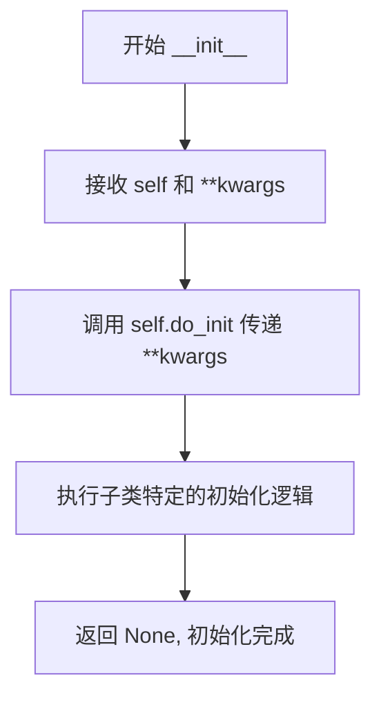
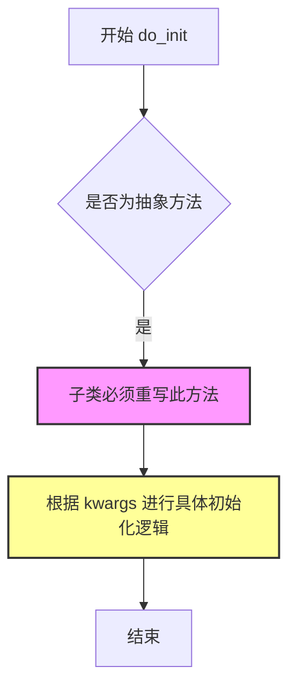
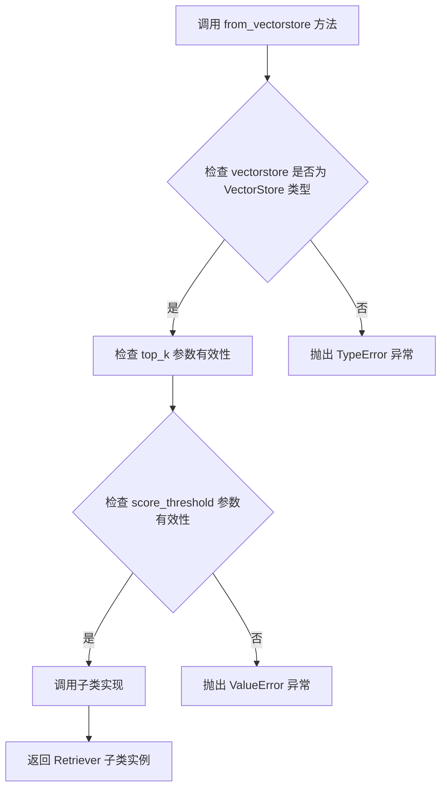
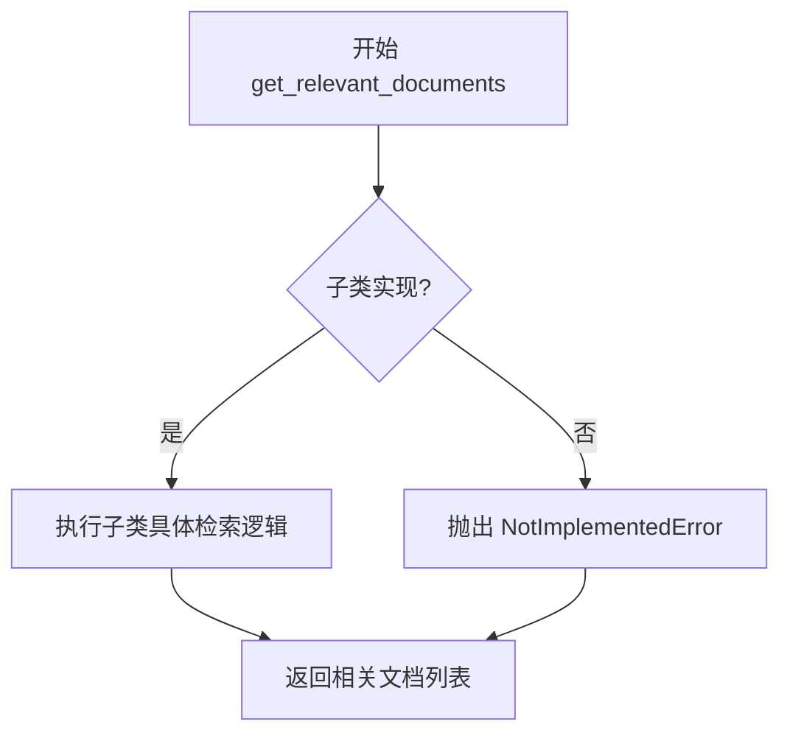

# `Langchain-Chatchat\libs\chatchat-server\chatchat\server\file_rag\retrievers\base.py` 详细设计文档

这是一个用于检索服务的抽象基类，定义了向量检索的接口规范。通过 LangChain 的 VectorStore 接口，提供统一的文档检索能力，支持自定义 top_k 数量和相关性分数阈值。

## 整体流程

```mermaid
graph TD
    A[开始] --> B[创建 BaseRetrieverService 子类实例]
B --> C{调用 __init__]
C --> D[调用 do_init 初始化方法]
D --> E{子类实现 do_init}
E --> F[调用 from_vectorstore 加载向量存储]
F --> G[配置 top_k 和 score_threshold]
G --> H[调用 get_relevant_documents 获取文档]
H --> I[返回相关文档列表]
style A fill:#f9f,stroke:#333
style E fill:#ff9,stroke:#333
```

## 类结构

```
BaseRetrieverService (抽象基类)
└── 子类实现: 需实现 do_init, from_vectorstore, get_relevant_documents 三个抽象方法
```

## 全局变量及字段


    

## 全局函数及方法


### `BaseRetrieverService.__init__`

这是 BaseRetrieverService 类的初始化方法，作为抽象基类的构造函数，接受任意关键字参数（**kwargs），并将这些参数委托给子类实现的 do_init 方法执行具体的初始化逻辑。

参数：

- `self`：BaseRetrieverService，类的实例本身
- `**kwargs`：dict，任意关键字参数，用于传递给 do_init 方法进行子类特定的初始化

返回值：`None`，该方法不返回任何值

#### 流程图



#### 带注释源码

```python
def __init__(self, **kwargs):
    """
    初始化 BaseRetrieverService 实例。
    
    这是一个模板方法模式的具体实现，通过调用抽象方法 do_init
    将初始化逻辑委托给子类实现。
    
    参数:
        **kwargs: 任意关键字参数，将被传递给 do_init 方法
                 具体的参数由子类实现决定
    """
    # 调用子类的 do_init 方法执行实际的初始化逻辑
    # 使用 **kwargs 解包关键字参数并传递
    self.do_init(**kwargs)
```


### `BaseRetrieverService.do_init`

该方法是 `BaseRetrieverService` 抽象类的初始化抽象方法，用于根据传入的配置参数初始化检索器服务子类。由于是抽象方法，具体实现由子类完成。

参数：

- `**kwargs`：任意关键字参数，用于传递初始化所需的配置参数（如向量存储配置、检索参数等）

返回值：`None`，该方法为抽象方法，不返回具体值，具体返回值由子类实现决定

#### 流程图



#### 带注释源码

```python
@abstractmethod
def do_init(self, **kwargs):
    """
    抽象初始化方法，子类需要实现此方法进行具体的初始化逻辑
    
    参数:
        **kwargs: 任意关键字参数，用于传递初始化配置
                 常见的参数可能包括:
                 - vectorstore: 向量存储实例
                 - top_k: 返回的相似文档数量
                 - score_threshold: 相似度阈值
                 - 其他自定义配置参数
    
    返回值:
        None: 抽象方法不返回具体值，具体返回值由子类实现决定
    
    注意:
        此方法为抽象方法，必须由子类重写实现
        子类在实现时应解析 kwargs 中的参数并进行相应的初始化操作
    """
    pass
```


### `BaseRetrieverService.from_vectorstore`

这是一个抽象方法，定义了在向量存储（VectorStore）基础上创建检索器服务的接口。该方法接收向量存储实例、top_k 参数和分数阈值参数，用于配置检索器并返回相应的检索器实现子类实例。

参数：

- `vectorstore`：`VectorStore`，向量存储实例，包含待检索的文档向量数据
- `top_k`：`int`，返回的相似文档数量，指定返回最相似的 top_k 个文档
- `score_threshold`：`int | float`，文档相关性分数阈值，用于过滤低于该阈值的低相关性文档

返回值：`None`，因为该方法是抽象方法，没有具体实现，返回类型取决于子类实现

#### 流程图



#### 带注释源码

```python
@abstractmethod
def from_vectorstore(
    vectorstore: VectorStore,
    top_k: int,
    score_threshold: int | float,
):
    """
    抽象方法：从向量存储创建检索器服务
    
    该方法是一个抽象方法接口，定义了创建检索器的基本契约。
    子类需要实现此方法以提供具体的检索器创建逻辑。
    
    参数:
        vectorstore: VectorStore 类型
            LangChain 的向量存储实例，包含文档的嵌入向量数据
            用于执行相似度搜索
            
        top_k: int 类型
            整数类型参数，指定返回最相似的文档数量
            决定检索结果的数量上限
            
        score_threshold: int | float 类型
            支持整数或浮点数类型
            文档相关性分数阈值，低于此阈值的文档将被过滤掉
            用于提高检索质量
    
    返回:
        None - 抽象方法没有具体返回值，具体返回类型由子类实现决定
    
    注意:
        - 该方法使用 @abstractmethod 装饰器，强制子类必须实现此方法
        - 子类实现时需要调用 super().from_vectorstore() 或直接覆盖此方法
    """
    pass
```


### `BaseRetrieverService.get_relevant_documents`

该方法是一个抽象方法，用于从向量存储中检索与给定查询相关的文档。子类需要实现此方法以提供具体的检索逻辑。

参数：

- `query`：`str`，用户输入的查询字符串，用于在向量存储中搜索相关文档

返回值：`未指定`（抽象方法，由子类实现具体返回类型，通常为 `List[Document]` 或类似类型）

#### 流程图



#### 带注释源码

```python
@abstractmethod
def get_relevant_documents(self, query: str):
    """
    从向量存储中检索与给定查询相关的文档。
    
    这是一个抽象方法，子类必须实现此方法以提供具体的文档检索逻辑。
    通常的实现会使用向量相似度搜索，从向量存储中找出与查询最相关的文档。
    
    参数:
        query (str): 用户输入的查询字符串，用于在向量存储中搜索相关文档
        
    返回:
        由子类实现决定，通常返回 Document 对象列表或类似的结构
        
    注意:
        - 该方法使用 @abstractmethod 装饰器，强制子类实现
        - 具体返回类型取决于实现子类，可能返回 List[Document] 或 AsyncIterator[Document] 等
    """
    pass
```


## 关键组件


### 抽象基类 BaseRetrieverService

提供检索服务的抽象基类，定义了向量检索的标准接口，支持从向量存储中根据查询获取相关文档，支持top_k和score_threshold过滤。

### 向量存储集成 (VectorStore)

通过 langchain.vectorstores 模块集成向量数据库，允许子类实现从不同向量存储（如 FAISS、Chroma、Pinecone 等）创建检索器。

### 抽象方法 do_init

子类必须实现的初始化方法，接受任意关键字参数，用于自定义初始化逻辑。

### 抽象方法 from_vectorstore

工厂方法模式，从 VectorStore 实例创建检索器，接受 vectorstore、top_k 和 score_threshold 参数，返回检索器实例。

### 抽象方法 get_relevant_documents

核心检索接口，接收查询字符串，返回相关文档列表，具体实现由子类完成。

### 评分阈值机制 (score_threshold)

支持对检索结果进行相关性评分过滤，只返回分数高于阈值的文档，提高结果质量。

### Top-K 限制机制 (top_k)

限制返回的最多文档数量，控制检索结果规模，便于下游处理和性能优化。


## 问题及建议


### 已知问题

-   **抽象方法缺少 self 参数**：`from_vectorstore` 和 `get_relevant_documents` 作为抽象方法却缺少 `self` 参数，这在 Python 中会导致类型错误或方法无法正确调用
-   **返回类型注解缺失**：抽象方法 `from_vectorstore` 和 `get_relevant_documents` 缺少返回类型注解，无法在编译时进行类型检查
-   **do_init 方法职责不清晰**：`do_init` 使用 `**kwargs` 没有任何类型约束，且与 `__init__` 的职责存在重叠，设计意图不明确
-   **from_vectorstore 方法设计不当**：该方法被定义为抽象方法但没有返回类型，容易与类方法/静态方法的工厂模式混淆，且不符合 langchain 的标准 Retriever 接口
-   **缺少文档注释**：整个类没有任何 docstrings，无法帮助使用者理解抽象方法的预期行为和契约
-   **score_threshold 参数类型定义冗余**：虽然导入了 `from __future__ import annotations`，但 `int | float` 在某些静态分析工具中可能产生兼容性警告
-   **与 LangChain 接口不兼容**：langchain 的 Retriever 接口要求实现 `get_relevant_documents` 方法签名应包含 `self` 和特定的返回类型，当前实现缺少这些约束

### 优化建议

-   **修正方法签名**：为所有实例方法添加 `self` 参数，并为方法添加完整的类型注解
-   **明确返回类型**：`from_vectorstore` 应明确返回 `BaseRetrieverService` 或其子类实例，`get_relevant_documents` 应返回 `List[Document]` 或类似的类型
-   **重构初始化逻辑**：考虑移除 `do_init` 方法，直接在 `__init__` 中处理初始化，或将其改为受保护的 `_do_init` 方法
-   **添加类级别文档**：为类和方法添加完整的 docstrings，说明抽象方法的预期行为、参数含义和返回值
-   **考虑实现标准接口**：如需与 LangChain 集成，应实现 `langchain.schema.Retriever` 接口或类似的标准化接口
-   **添加类型守卫**：为 `score_threshold` 添加合理的范围验证和类型守卫
-   **考虑使用 Protocol**：如需定义结构化类型而非抽象类，可考虑使用 `typing.Protocol` 替代 ABC


## 其它


### 设计目标与约束

设计目标：定义检索服务的抽象基类，统一不同检索器实现的标准接口，支持从向量存储中获取相关文档。约束：必须继承自ABCMeta元类，所有子类必须实现所有抽象方法。

### 错误处理与异常设计

异常类型：子类未实现抽象方法时抛出TypeError；vectorstore为None或无效类型时应抛出ValueError；top_k和score_threshold参数非法时应抛出ValueError或TypeError。处理策略：参数验证在子类实现中完成，抽象基类不处理具体异常。

### 数据流与状态机

数据流：客户端调用get_relevant_documents(query) → 子类实现查询向量存储 → 返回相关文档列表。状态机：初始化状态(do_init) → 就绪状态(from_vectorstore配置) → 查询状态(get_relevant_documents执行)。

### 外部依赖与接口契约

外部依赖：langchain.vectorstores.VectorStore接口。接口契约：from_vectorstore接收VectorStore对象、top_k整数、score_threshold数值，返回实例；get_relevant_documents接收query字符串，返回文档列表。

### 性能考虑

性能指标：检索响应时间应控制在合理范围内，内存占用应最小化。可优化点：子类可实现缓存机制、批量查询优化、异步执行支持。

### 安全性考虑

安全要点：query参数需防范注入风险，vectorstore需验证来源可信性，文档内容需过滤敏感信息。

### 测试策略

测试方法：单元测试验证子类实现完整性，集成测试验证与VectorStore的交互，mock测试覆盖各方法调用路径。

### 扩展点

可扩展方向：支持多路召回策略、支持重排序(rerank)机制、支持自定义相似度计算、支持结果缓存与持久化。


    