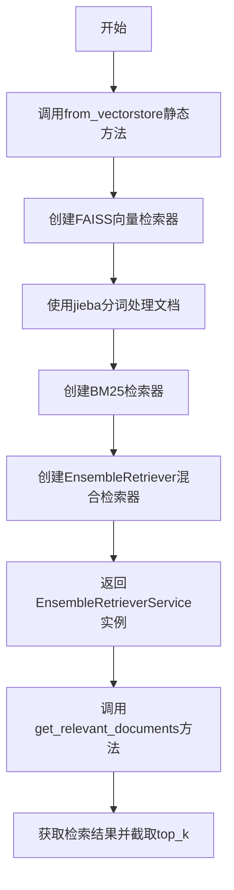
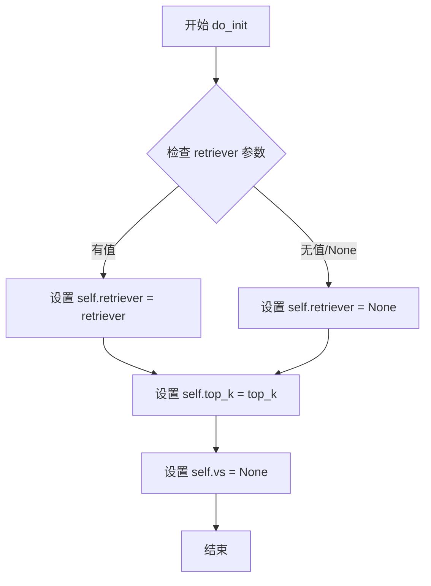
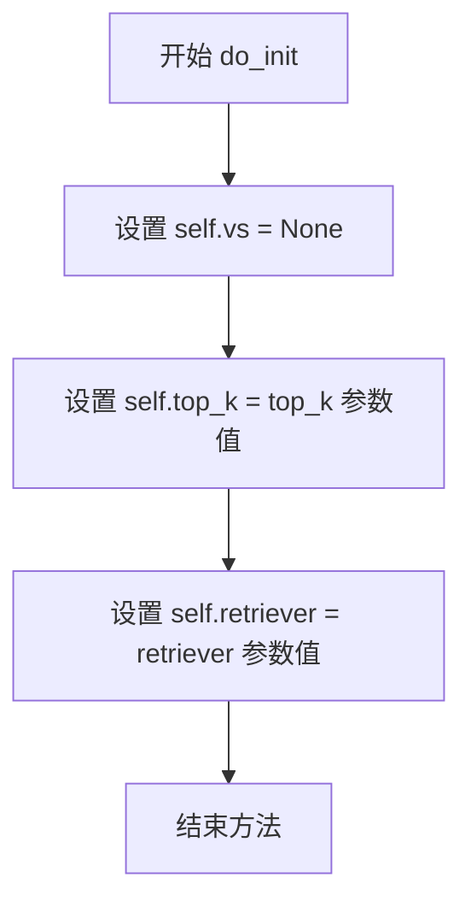
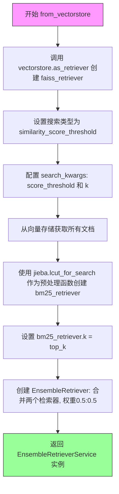
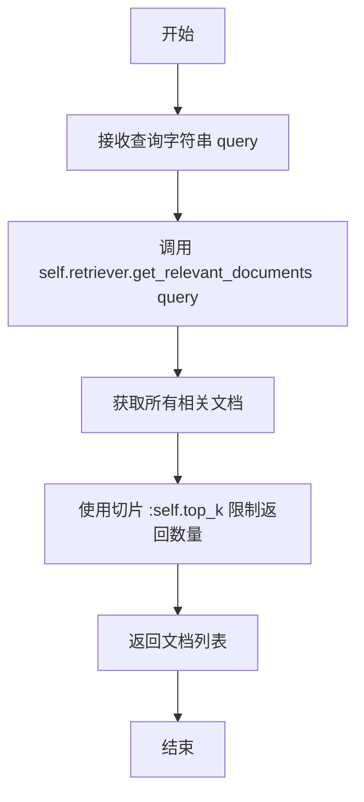

# `Langchain-Chatchat\libs\chatchat-server\chatchat\server\file_rag\retrievers\ensemble.py` 详细设计文档

EnsembleRetrieverService是一个混合检索服务，通过结合BM25全文检索和向量相似度检索（FAISS）来提升文档召回效果，使用jieba中文分词进行文本预处理，权重各占50%实现混合搜索。

## 整体流程



## 类结构

```
BaseRetrieverService (抽象基类)
└── EnsembleRetrieverService (混合检索服务类)
```

## 全局变量及字段


### `jieba`
    
中文分词库，用于对文本进行分词处理

类型：`module`
    


### `faiss_retriever`
    
基于向量存储创建的FAISS检索器，使用相似度分数阈值进行检索

类型：`BaseRetriever`
    


### `bm25_retriever`
    
基于BM25算法的检索器，用于关键词匹配检索

类型：`BM25Retriever`
    


### `docs`
    
从向量存储文档库中获取的所有文档列表

类型：`list[Document]`
    


### `ensemble_retriever`
    
集成检索器，组合了BM25和FAISS两种检索方法的检索结果

类型：`EnsembleRetriever`
    


### `EnsembleRetrieverService.self.vs`
    
向量存储实例，初始化时为None

类型：`VectorStore | None`
    


### `EnsembleRetrieverService.self.top_k`
    
返回结果的数量限制

类型：`int`
    


### `EnsembleRetrieverService.self.retriever`
    
底层使用的检索器实例

类型：`BaseRetriever`
    
    

## 全局函数及方法


### `EnsembleRetrieverService.from_vectorstore`

这是一个静态工厂方法，用于根据传入的向量数据库（VectorStore）初始化一个混合检索服务。该方法同时构建了基于向量相似度的检索器（`faiss_retriever`）和基于关键词的 BM25 检索器，并将它们组合成一个加权集成检索器（Ensemble Retriever），以提升检索的准确性和覆盖面。

参数：

-  `vectorstore`：`VectorStore`，向量数据库实例，用于生成向量检索器并提供文档内容。
-  `top_k`：`int`，在检索结果中返回的最相似的 Top K 个文档的数量。
-  `score_threshold`：`int | float`，向量相似度检索的最低分数阈值，低于该阈值的文档将被过滤掉。

返回值：`EnsembleRetrieverService`，返回一个配置好集成检索器的服务实例。

#### 流程图

```mermaid
flowchart TD
    A[输入: vectorstore, top_k, score_threshold] --> B[创建向量检索器: vectorstore.as_retriever]
    A --> C[提取文档数据: vectorstore.docstore._dict.values]
    C --> D[初始化BM25检索器: BM25Retriever.from_documents]
    D --> E[配置BM25: 设置 k=top_k]
    B --> F[创建集成检索器: EnsembleRetriever]
    E --> F
    F --> G[实例化服务: new EnsembleRetrieverService]
    G --> H[返回: 服务实例]
    
    subgraph 内部处理
    B -.-> B1[search_type: similarity_score_threshold]
    D -.-> D1[preprocess_func: jieba.lcut_for_search]
    F -.-> F1[weights: [0.5, 0.5]]
    end
```

#### 带注释源码

```python
@staticmethod
def from_vectorstore(
    vectorstore: VectorStore,
    top_k: int,
    score_threshold: int | float,
):
    """
    从向量存储库初始化集成检索器服务的静态工厂方法。
    
    参数:
        vectorstore: 包含文档和向量数据的向量存储实例。
        top_k: 检索返回的文档数量。
        score_threshold: 向量检索的相似度阈值。
    返回:
        配置了混合检索器的 EnsembleRetrieverService 实例。
    """
    
    # 1. 创建基于向量相似度的检索器 (此处虽然变量名叫 faiss_retriever，
    # 但实际类型取决于传入的 vectorstore，常见为 FAISS 或其他支持 as_retriever 的库)
    faiss_retriever = vectorstore.as_retriever(
        search_type="similarity_score_threshold", # 使用带阈值的相似度搜索
        search_kwargs={
            "score_threshold": score_threshold, # 设置最低相似度分数
            "k": top_k                          # 设置返回数量
        },
    )
    
    # TODO: 换个不用torch的实现方式
    # 原计划使用自定义的 Cutter，但目前为了兼容性使用 jieba 进行中文分词
    # from cutword.cutword import Cutter
    import jieba

    # 2. 从向量库中获取所有原始文档，用于训练 BM25 检索器
    # 注意：这里访问了 docstore._dict，假设向量库内部存储了文档对象
    docs = list(vectorstore.docstore._dict.values())
    
    # 3. 创建基于关键词的 BM25 检索器
    # preprocess_func 使用 jieba 的搜索分词模式
    bm25_retriever = BM25Retriever.from_documents(
        docs,
        preprocess_func=jieba.lcut_for_search,
    )
    
    # 4. 设置 BM25 检索器的返回数量
    bm25_retriever.k = top_k
    
    # 5. 创建集成检索器，混合向量检索和 BM25 检索
    # 权重各占 0.5，表示两种检索方式等权重
    ensemble_retriever = EnsembleRetriever(
        retrievers=[bm25_retriever, faiss_retriever], 
        weights=[0.5, 0.5]
    )
    
    # 6. 返回封装好的服务对象
    return EnsembleRetrieverService(retriever=ensemble_retriever, top_k=top_k)
```


### `EnsembleRetrieverService.do_init`

该方法用于初始化`EnsembleRetrieverService`类的实例，设置向量存储、top_k参数和检索器。

参数：

- `retriever`：`BaseRetriever`，可选，默认为`None`，用于指定检索器实例
- `top_k`：`int`，可选，默认为`5`，表示返回的最多相关文档数量

返回值：`None`，该方法无返回值，仅初始化实例变量

#### 流程图



#### 带注释源码

```python
def do_init(
    self,
    retriever: BaseRetriever = None,
    top_k: int = 5,
):
    """
    初始化检索器服务实例
    
    参数:
        retriever: 检索器实例，默认为None
        top_k: 返回的最多相关文档数量，默认为5
    """
    # 初始化向量存储为None（尚未从向量存储加载）
    self.vs = None
    # 设置返回的文档数量上限
    self.top_k = top_k
    # 设置检索器实例
    self.retriever = retriever
```


### `EnsembleRetrieverService.get_relevant_documents`

该方法是集合检索服务的核心查询方法，接收用户查询字符串，通过底层的组合检索器（集合了BM25检索器和向量相似度检索器）获取相关文档，并返回指定数量的顶部结果。

参数：

- `query`：`str`，用户输入的查询字符串，用于检索相关文档

返回值：`List[Document]`，返回与查询相关的文档列表，数量不超过top_k限制

#### 流程图

```mermaid
flowchart TD
    A[开始] --> B[接收query参数]
    B --> C[调用self.retriever.get_relevant_documents获取所有相关文档]
    C --> D[使用切片操作[:self.top_k]限制返回数量]
    D --> E[返回文档列表]
    
    subgraph 底层检索器
        F[EnsembleRetriever]
        F --> G[BM25Retriever - 0.5权重]
        F --> H[FAISS向量检索器 - 0.5权重]
    end
    
    C -.-> F
```

#### 带注释源码

```python
def get_relevant_documents(self, query: str):
    """
    从集合检索器中获取与查询相关的文档
    
    该方法封装了底层EnsembleRetriever的检索功能，
    并对结果数量进行限制以满足性能需求。
    
    Args:
        query: str，用户查询字符串
        
    Returns:
        List[Document]，相关文档列表
    """
    # 调用底层组合检索器的检索方法
    # 组合检索器会同时使用BM25和向量检索，
    # 并根据权重0.5:0.5综合评分后返回结果
    return self.retriever.get_relevant_documents(query)[: self.top_k]
    # 使用切片操作限制返回的文档数量为top_k
    # 这样可以避免返回过多结果导致的内存和性能问题
```


### `jieba.lcut_for_search`

这是 jieba 中文分词库中的一个函数，用于对文本进行搜索引擎模式的分词处理，返回更细粒度的分词列表，适用于搜索场景。

参数：

-  `sentence`：`str`，需要分词的中文文本字符串

返回值：`List[str]`，返回分词后的词语列表

#### 流程图

```mermaid
graph TD
    A[输入中文文本 sentence] --> B[调用 jieba.lcut_for_search]
    B --> C{搜索引擎模式分词}
    C --> D[返回词语列表 List[str]]
    D --> E[作为 preprocess_func 传入 BM25Retriever]
    
    style A fill:#f9f,stroke:#333
    style E fill:#9f9,stroke:#333
```

#### 带注释源码

```python
# jieba.lcut_for_search 函数源码分析
# 来源：jieba 库

import jieba

# 函数签名：jieba.lcut_for_search(sentence: str) -> List[str]

# 示例用法：
text = "我现在在南京财经大学上课"

# lcut_for_search 使用搜索引擎模式分词
# 会产生更细粒度的分词结果，适合搜索场景
result = jieba.lcut_for_search(text)

# 可能的输出示例：
# ['我', '现在', '在', '南京', '财经大学', '南京财经大学', '上课']
# 注意：相比 lcut，search 模式会生成更细粒度的词语
# 例如 "南京财经大学" 会被同时拆分为 "南京" + "财经大学" + "南京财经大学"

# 在代码中的实际使用：
bm25_retriever = BM25Retriever.from_documents(
    docs,  # 文档列表
    preprocess_func=jieba.lcut_for_search,  # 预处理函数：用于对查询和文档进行分词
)
# BM25Retriever 会使用这个分词函数对文本进行预处理
# 以便进行更精准的中文文本相似度计算
```


### `EnsembleRetrieverService.do_init`

该方法为 `EnsembleRetrieverService` 类的初始化方法，用于配置集成检索服务的基本参数，包括设置返回结果的数量上限（top_k）以及底层的检索器实例。

参数：

- `self`：类的实例对象，自动传入
- `retriever`：`BaseRetriever`，可选的检索器实例，用于执行实际的文档检索任务，默认为 None
- `top_k`：`int`，返回结果的数量上限，默认为 5

返回值：`None`，该方法不返回任何值，仅进行实例属性的初始化赋值

#### 流程图



#### 带注释源码

```python
def do_init(
    self,
    retriever: BaseRetriever = None,
    top_k: int = 5,
):
    """
    初始化集成检索服务的实例属性
    
    参数:
        retriever: 底层的检索器实例，支持任何继承自 BaseRetriever 的类
        top_k: 限制返回的相似文档数量
    """
    # 初始化向量存储为 None，该属性在当前方法中未被使用
    self.vs = None
    # 设置返回结果的数量上限
    self.top_k = top_k
    # 保存传入的检索器实例供后续检索使用
    self.retriever = retriever
```


### `EnsembleRetrieverService.from_vectorstore`

该静态方法接收向量存储实例、top_k参数和分数阈值，创建一个结合BM25关键词检索和FAISS向量相似度检索的混合检索器服务。通过设置0.5:0.5的权重平衡两种检索方式的优势，返回配置好的EnsembleRetrieverService实例。

参数：

- `vectorstore`：`VectorStore`，向量存储实例，用于提供文档存储和向量搜索能力
- `top_k`：`int`，返回的顶部结果数量，控制每次检索返回的最多文档数
- `score_threshold`：`int | float`，相似度分数阈值，用于过滤低于该分数的检索结果

返回值：`EnsembleRetrieverService`，返回配置好的集合检索器服务实例，包含混合BM25和向量检索器

#### 流程图



#### 带注释源码

```python
@staticmethod
def from_vectorstore(
    vectorstore: VectorStore,
    top_k: int,
    score_threshold: int | float,
):
    """
    从向量存储创建集合检索器服务的静态方法
    
    参数:
        vectorstore: VectorStore - 向量存储实例
        top_k: int - 返回的顶部结果数量
        score_threshold: int | float - 相似度分数阈值
    返回:
        EnsembleRetrieverService - 配置好的集合检索器服务实例
    """
    # 使用向量存储创建基于相似度分数阈值的检索器
    # search_type: 指定使用相似度分数阈值过滤
    # search_kwargs: 包含score_threshold过滤阈值和k返回数量
    faiss_retriever = vectorstore.as_retriever(
        search_type="similarity_score_threshold",
        search_kwargs={"score_threshold": score_threshold, "k": top_k},
    )
    
    # TODO: 换个不用torch的实现方式
    # 计划使用cutword库替代jieba，但目前未实现
    # from cutword.cutword import Cutter
    import jieba

    # 从向量存储的docstore获取所有文档
    docs = list(vectorstore.docstore._dict.values())
    
    # 使用jieba分词作为预处理函数创建BM25检索器
    # jieba.lcut_for_search: 返回列表，支持搜索场景的分词
    bm25_retriever = BM25Retriever.from_documents(
        docs,
        preprocess_func=jieba.lcut_for_search,
    )
    
    # 设置BM25检索器返回的文档数量
    bm25_retriever.k = top_k
    
    # 创建集合检索器，合并BM25和FAISS两种检索方式
    # weights=[0.5, 0.5]表示两种检索方式权重相等
    ensemble_retriever = EnsembleRetriever(
        retrievers=[bm25_retriever, faiss_retriever], weights=[0.5, 0.5]
    )
    
    # 返回配置好的EnsembleRetrieverService实例
    return EnsembleRetrieverService(retriever=ensemble_retriever, top_k=top_k)
```


### `EnsembleRetrieverService.get_relevant_documents`

该方法是 EnsembleRetrieverService 类中用于检索相关文档的核心方法。它接收用户查询字符串，调用底层的 EnsembleRetriever（集成分类器）执行检索操作，并返回指定数量（top_k）的最相关文档列表。

参数：

- `query`：`str`，用户输入的查询字符串，用于从文档集合中检索相关内容

返回值：`list[Document]`，返回与查询相关的文档列表，最多返回 top_k 条文档

#### 流程图



#### 带注释源码

```python
def get_relevant_documents(self, query: str):
    """
    获取与查询相关的文档
    
    参数:
        query: str - 用户输入的查询字符串
        
    返回:
        list[Document] - 相关文档列表，最多返回 top_k 条
    """
    # 调用底层 EnsembleRetriever 的 get_relevant_documents 方法获取所有相关文档
    # 然后使用切片 [:self.top_k] 限制返回的文档数量
    return self.retriever.get_relevant_documents(query)[: self.top_k]
```

## 关键组件


### EnsembleRetrieverService

集成检索器服务类，组合BM25文本检索器和FAISS向量存储检索器实现混合检索功能。

### do_init

初始化方法，设置向量存储为None，配置top_k参数和基础检索器。

### from_vectorstore

静态工厂方法，从向量存储创建集成检索服务，包含FAISS向量检索和BM25文本检索的组合。

### get_relevant_documents

获取相关文档方法，调用底层集成检索器并限制返回结果数量。

### BM25Retriever

BM25文本检索器，使用jieba分词进行预处理，提供基于词频的文档相关性排序。

### FAISS向量检索器

基于向量相似度阈值的FAISS检索器，使用score_threshold过滤低相关性结果。

### 集成检索策略

权重为0.5:0.5的均匀集成策略，结合文本匹配和向量语义匹配两种检索方式。

### 潜在技术债务

TODO注释显示需要换掉torch依赖的实现方式，且目前使用了jieba而非注释中的Cutter。


## 问题及建议


### 已知问题

- **空指针风险**：`do_init` 方法允许 `retriever` 参数为 `None`，但 `get_relevant_documents` 方法直接调用 `self.retriever.get_relevant_documents()`，若 `retriever` 为 `None` 会导致运行时 `AttributeError` 异常
- **私有属性访问**：`vectorstore.docstore._dict` 使用了私有属性访问，依赖 LangChain 内部实现细节，版本升级可能导致兼容性问题
- **未使用的变量**：`self.vs = None` 被初始化但从未使用，属于冗余代码
- **重复导入**：`import jieba` 在 `from_vectorstore` 方法内部导入，应该提升到文件顶部统一管理
- **硬编码权重**：`weights=[0.5, 0.5]` 硬编码在代码中，缺乏灵活性，无法根据不同业务场景调整 BM25 和向量检索的权重比例
- **类型提示不准确**：`score_threshold` 参数类型为 `int | float`，但语义上通常为 `float`，且 `int` 可能导致浮点数比较问题
- **遗留 TODO 代码**：存在未完成的 `# TODO: 换个不用torch的实现方式` 和被注释的 `Cutter` 代码，表明功能尚未完全实现

### 优化建议

- 在 `get_relevant_documents` 方法中添加空值检查或断言，确保 `self.retriever` 不为 `None`
- 将 `vectorstore.docstore._dict` 的访问封装为安全的方法调用，或使用 LangChain 公开 API 获取文档列表
- 移除未使用的 `self.vs` 变量，或在类文档中说明其预期用途
- 将 `jieba` 导入移至文件顶部，保持导入语句的一致性
- 将权重参数化为 `from_vectorstore` 方法的可选参数，提供默认值 `[0.5, 0.5]` 保持向后兼容
- 修正 `score_threshold` 的类型提示为 `float`，并在文档中说明其取值范围（如 0 到 1 之间）
- 清理遗留的 TODO 和注释代码，或在代码管理系统中创建对应的技术债务 Issue 跟踪

## 其它


### 设计目标与约束

设计目标：
1. 实现BM25检索与向量检索的融合，提升检索质量
2. 提供统一的检索接口，屏蔽底层实现细节
3. 支持可配置的权重分配和top_k参数

设计约束：
1. 依赖langchain库的EnsembleRetriever、BM25Retriever和VectorStore
2. 需要jieba分词库进行中文文本预处理
3. 当前使用torch相关实现（TODO中提及需优化）
4. 权重固定为[0.5, 0.5]，不支持运行时动态调整

### 错误处理与异常设计

异常处理机制：
1. **参数校验**：top_k必须为正整数，score_threshold必须为数值类型
2. **空向量库处理**：当vectorstore.docstore._dict为空时，BM25Retriever.from_documents可能返回空结果
3. **依赖缺失**：如果jieba未安装，from_vectorstore方法会抛出ImportError
4. **retriever为None**：do_init允许retriever为None，但get_relevant_documents调用时可能出错

建议添加异常处理：
- 在from_vectorstore中添加向量库为空时的降级处理
- 添加try-except捕获jieba导入异常
- 在get_relevant_documents中添加retriever为None的检查

### 数据流与状态机

数据流：
1. 用户调用from_vectorstore(vectorstore, top_k, score_threshold)
2. 从vectorstore创建faiss_retriever（基于相似度分数阈值）
3. 从vectorstore.docstore获取所有文档，创建bm25_retriever
4. 创建EnsembleRetriever组合两个检索器
5. 返回EnsembleRetrieverService实例

检索流程：
1. 用户调用get_relevant_documents(query)
2. EnsembleRetriever并发执行BM25和向量检索
3. 根据权重0.5:0.5融合结果
4. 截取top_k个结果返回

### 外部依赖与接口契约

外部依赖：
1. **langchain**：EnsembleRetriever、BaseRetriever、VectorStore
2. **langchain_community**：BM25Retriever
3. **langchain_core**：BaseRetriever基类
4. **jieba**：中文分词（preprocess_func）
5. **chatchat.server.file_rag.retrievers.base**：BaseRetrieverService基类

接口契约：
- **BaseRetrieverService**：需实现do_init和get_relevant_documents方法
- **VectorStore**：需支持as_retriever方法和docstore属性
- **from_vectorstore**：静态方法，输入vectorstore、top_k、score_threshold，返回EnsembleRetrieverService实例

### 性能考虑

性能瓶颈：
1. **文档加载**：从vectorstore.docstore._dict加载所有文档到内存，大规模数据时可能内存溢出
2. **BM25初始化**：BM25Retriever.from_documents在文档量大时初始化较慢
3. **双重检索**：每次查询执行两次检索，延迟较高

优化建议：
1. 实现文档懒加载机制
2. 添加缓存层缓存BM25模型
3. 考虑使用异步检索或并行执行
4. TODO中提及的torch实现需优化为非torch版本

### 安全性考虑

安全风险：
1. **代码执行**：jieba.lcut_for_search对用户输入进行分词，理论上存在注入风险（但jieba为纯Python库，风险较低）
2. **敏感数据**：文档内容通过vectorstore加载，可能包含敏感信息

建议：
1. 对query进行输入验证和清洗
2. 考虑添加结果过滤机制
3. 日志中避免记录敏感文档内容

### 配置与参数说明

参数说明：
- **vectorstore: VectorStore**：向量数据库实例，必须包含docstore属性
- **top_k: int**：返回结果数量，默认5
- **score_threshold: int | float**：相似度分数阈值，用于过滤低相关度结果
- **retriever: BaseRetriever**：检索器实例
- **vs: VectorStore**：当前未使用，保留字段
- **weights: list**：固定为[0.5, 0.5]，表示BM25和向量检索各占50%权重

### 使用示例

```python
# 从向量存储创建服务
vectorstore = FAISS.load_local(...)
service = EnsembleRetrieverService.from_vectorstore(
    vectorstore=vectorstore,
    top_k=10,
    score_threshold=0.5
)

# 执行检索
results = service.get_relevant_documents("查询内容")
```

### 限制与注意事项

当前限制：
1. 权重固定为0.5:0.5，不支持自定义
2. 仅支持中文分词（jieba），不支持其他语言
3. score_threshold在faiss_retriever中生效，但BM25检索不支持阈值过滤
4. 当向量库为空时，BM25Retriever可能无法正常初始化
5. vectorstore.docstore._dict为私有API，可能随版本变化

注意事项：
1. 确保jieba已安装
2. 文档数量影响BM25初始化性能
3. 混合检索结果可能存在重复文档，需在应用层去重

    