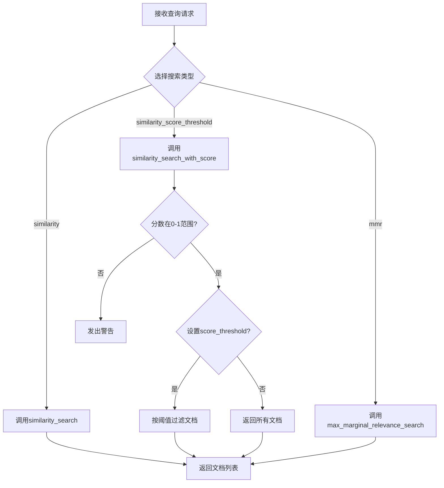
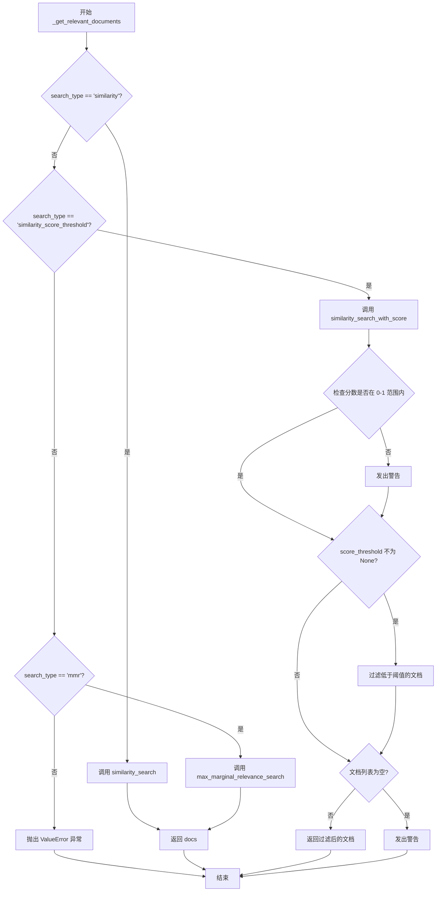
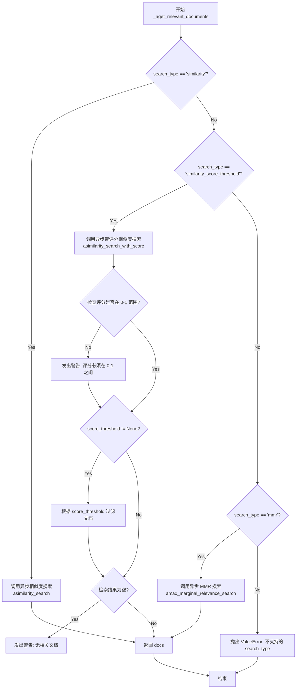
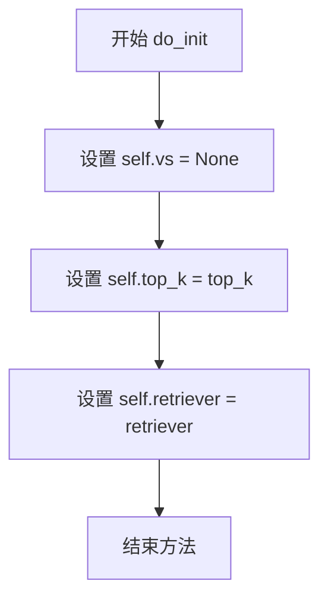
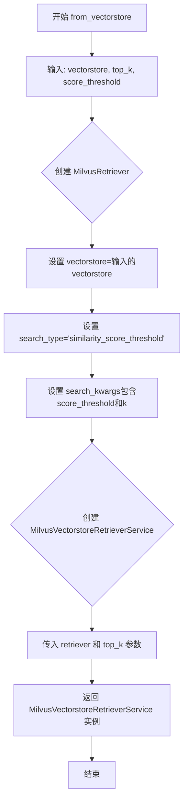

# `Langchain-Chatchat\libs\chatchat-server\chatchat\server\file_rag\retrievers\milvus_vectorstore.py` 详细设计文档

该代码实现了一个基于Milvus向量数据库的检索器服务，支持多种搜索策略（相似度搜索、带阈值的相似度搜索、MMR），提供同步和异步的文档检索功能，并可通过分数阈值过滤检索结果。

## 整体流程



## 类结构

```
BaseRetrieverService (抽象基类)
└── MilvusVectorstoreRetrieverService

VectorStoreRetriever (langchain基类)
└── MilvusRetriever
```

## 全局变量及字段


### `MilvusRetriever.search_type`
    
搜索类型标识，用于指定相似度检索方式

类型：`str`
    


### `MilvusRetriever.vectorstore`
    
向量存储实例，提供文档向量存储和检索能力

类型：`VectorStore`
    


### `MilvusRetriever.search_kwargs`
    
搜索参数配置，包含k值和分数阈值等检索参数

类型：`dict`
    


### `MilvusVectorstoreRetrieverService.vs`
    
向量存储实例，用于存储和检索文档向量

类型：`VectorStore`
    


### `MilvusVectorstoreRetrieverService.top_k`
    
返回文档数量上限，控制检索结果的数量

类型：`int`
    


### `MilvusVectorstoreRetrieverService.retriever`
    
检索器实例，负责执行具体的文档检索逻辑

类型：`BaseRetriever`
    
    

## 全局函数及方法


### `MilvusRetriever._get_relevant_documents`

该方法是MilvusRetriever类的核心检索方法，根据不同的搜索类型（similarity、similarity_score_threshold、mmr）从向量存储中检索相关文档，并对相似度分数阈值进行过滤处理。

参数：

- `query`：`str`，待检索的查询字符串
- `run_manager`：`CallbackManagerForRetrieverRun`，用于管理检索过程中回调的管理器

返回值：`List[Document]`，检索到的相关文档列表

#### 流程图



#### 带注释源码

```python
def _get_relevant_documents(
    self, query: str, *, run_manager: CallbackManagerForRetrieverRun
) -> List[Document]:
    """
    根据search_type从向量存储中检索相关文档
    
    参数:
        query: str - 待检索的查询字符串
        run_manager: CallbackManagerForRetrieverRun - 回调管理器，用于追踪检索过程
    
    返回:
        List[Document] - 检索到的相关文档列表
    """
    # 判断搜索类型为相似度搜索
    if self.search_type == "similarity":
        # 使用向量存储的相似度搜索方法
        docs = self.vectorstore.similarity_search(query, **self.search_kwargs)
    
    # 判断搜索类型为带分数阈值的相似度搜索
    elif self.search_type == "similarity_score_threshold":
        # 获取带相似度分数的搜索结果
        docs_and_similarities = self.vectorstore.similarity_search_with_score(query, **self.search_kwargs)
        # 从搜索参数中获取分数阈值，默认为None
        score_threshold = self.search_kwargs.get("score_threshold", None)
        
        # 检查所有相似度分数是否在0-1范围内
        if any(
            similarity < 0.0 or similarity > 1.0
            for _, similarity in docs_and_similarities
        ):
            # 发出警告：分数必须在0到1之间
            warnings.warn(
                "Relevance scores must be between"
                f" 0 and 1, got {docs_and_similarities}"
            )

        # 如果设置了分数阈值（可以为0但不能为None）
        if score_threshold is not None:
            # 过滤掉相似度低于阈值的文档
            docs_and_similarities = [
                doc
                for doc, similarity in docs_and_similarities
                if similarity >= score_threshold
            ]
        # 检查是否有文档被检索到
        if len(docs_and_similarities) == 0:
            # 发出警告：没有文档达到分数阈值
            warnings.warn(
                "No relevant docs were retrieved using the relevance score"
                f" threshold {score_threshold}"
            )
        # 返回符合阈值的文档列表
        return docs_and_similarities
    
    # 判断搜索类型为最大边际相关性搜索
    elif self.search_type == "mmr":
        # 使用向量存储的最大边际相关性搜索方法
        docs = self.vectorstore.max_marginal_relevance_search(
            query, **self.search_kwargs
        )
    
    # 如果search_type不匹配任何支持的类型
    else:
        # 抛出ValueError异常
        raise ValueError(f"search_type of {self.search_type} not allowed.")
    
    # 返回检索到的文档列表
    return docs
```


### `MilvusRetriever._aget_relevant_documents`

该方法是一个异步方法，用于根据用户查询从 Milvus 向量存储中检索相关文档。支持三种搜索模式：相似度搜索、带评分阈值的相似度搜索和最大边际相关性（MMR）搜索。

参数：

- `query`：`str`，用户输入的查询字符串
- `run_manager`：`AsyncCallbackManagerForRetrieverRun`，用于管理异步检索回调的上下文管理器（关键字参数）
- `self`：隐式的 MilvusRetriever 实例

返回值：`List[Document]`，返回与查询相关的文档列表

#### 流程图



#### 带注释源码

```python
async def _aget_relevant_documents(
    self, query: str, *, run_manager: AsyncCallbackManagerForRetrieverRun
) -> List[Document]:
    """
    异步检索与给定查询相关的文档。
    
    Args:
        query: 用户查询字符串
        run_manager: 异步回调管理器，用于追踪检索运行状态
    
    Returns:
        与查询相关的文档列表
    """
    # 根据搜索类型执行不同的检索策略
    if self.search_type == "similarity":
        # 模式1: 纯相似度搜索
        # 调用异步接口获取相似文档
        docs = await self.vectorstore.asimilarity_search(
            query, **self.search_kwargs
        )
    elif self.search_type == "similarity_score_threshold":
        # 模式2: 带评分阈值的相似度搜索
        # 获取文档及其相似度评分
        docs_and_similarities = (
            await self.vectorstore.asimilarity_search_with_score(query, **self.search_kwargs)
        )
        # 从搜索参数中获取评分阈值
        score_threshold = self.search_kwargs.get("score_threshold", None)
        
        # 验证评分范围是否在 [0, 1] 区间内
        if any(
            similarity < 0.0 or similarity > 1.0
            for _, similarity in docs_and_similarities
        ):
            warnings.warn(
                "Relevance scores must be between"
                f" 0 and 1, got {docs_and_similarities}"
            )

        # 如果设置了评分阈值，则过滤掉低于阈值的文档
        # 注意: 0 是有效阈值，None 表示不设置阈值
        if score_threshold is not None:
            docs_and_similarities = [
                (doc, similarity)
                for doc, similarity in docs_and_similarities
                if similarity >= score_threshold
            ]
        # 检查是否有检索结果
        if len(docs_and_similarities) == 0:
            warnings.warn(
                "No relevant docs were retrieved using the relevance score"
                f" threshold {score_threshold}"
            )
        # 返回文档列表（包含评分信息的元组）
        return docs_and_similarities
    elif self.search_type == "mmr":
        # 模式3: 最大边际相关性搜索
        # 用于平衡相关性和多样性
        docs = await self.vectorstore.amax_marginal_relevance_search(
            query, **self.search_kwargs
        )
    else:
        # 不支持的搜索类型，抛出异常
        raise ValueError(f"search_type of {self.search_type} not allowed.")
    # 返回检索到的文档
    return docs
```


### `MilvusVectorstoreRetrieverService.do_init`

该方法用于初始化 Milvus 向量检索服务实例，设置检索器实例和返回文档数量上限。

参数：

- `self`：`MilvusVectorstoreRetrieverService`，类的实例本身
- `retriever`：`BaseRetriever`，检索器实例，用于执行向量相似度搜索，默认值为 `None`
- `top_k`：`int`，返回的文档数量上限，默认值为 `5`

返回值：`None`，初始化服务实例，不返回任何内容

#### 流程图



#### 带注释源码

```python
def do_init(
    self,
    retriever: BaseRetriever = None,
    top_k: int = 5,
):
    """
    初始化 Milvus 向量检索服务
    
    Args:
        retriever: 检索器实例，用于执行向量相似度搜索
        top_k: 返回的文档数量上限
    
    Returns:
        None: 初始化服务实例，不返回任何内容
    """
    # 初始化向量存储为 None（该类中未使用此字段）
    self.vs = None
    
    # 设置返回文档数量上限
    self.top_k = top_k
    
    # 设置检索器实例
    self.retriever = retriever
```


### `MilvusVectorstoreRetrieverService.from_vectorstore`

该静态方法用于从现有的向量存储（VectorStore）创建一个配置好的 MilvusVectorstoreRetrieverService 实例，支持设置返回文档数量和相似度分数阈值。

参数：

- `vectorstore`：`VectorStore`，向量存储实例，用于执行相似度搜索
- `top_k`：`int`，返回的最多相关文档数量
- `score_threshold`：`int or float`，用于过滤相似度分数低于该阈值的文档

返回值：`MilvusVectorstoreRetrieverService`，返回一个配置好的 MilvusVectorstoreRetrieverService 实例，包含已设置的 retriever 和 top_k 参数

#### 流程图



#### 带注释源码

```python
@staticmethod
def from_vectorstore(
    vectorstore: VectorStore,
    top_k: int,
    score_threshold: int or float,
):
    """
    从向量存储创建 MilvusVectorstoreRetrieverService 实例的静态方法
    
    参数:
        vectorstore: VectorStore - 向量存储实例，用于执行相似度搜索
        top_k: int - 返回的最多相关文档数量
        score_threshold: int or float - 相似度分数阈值，低于该阈值的文档将被过滤
    
    返回:
        MilvusVectorstoreRetrieverService - 配置好的检索服务实例
    """
    
    # 创建 MilvusRetriever 实例，配置为基于相似度分数阈值的搜索模式
    retriever = MilvusRetriever(
        vectorstore=vectorstore,                          # 传入向量存储实例
        search_type="similarity_score_threshold",          # 使用带分数阈值的相似度搜索
        search_kwargs={
            "score_threshold": score_threshold,            # 设置相似度分数阈值
            "k": top_k                                      # 设置返回的文档数量
        }
    )
    
    # 使用创建的 retriever 和 top_k 参数初始化并返回服务实例
    return MilvusVectorstoreRetrieverService(
        retriever=retriever,    # 配置好的检索器
        top_k=top_k            # 返回文档数量限制
    )
```


### `MilvusVectorstoreRetrieverService.get_relevant_documents`

该方法是 Milvus 向量存储检索服务的核心入口方法，接收用户查询字符串，委托给内部持有的 MilvusRetriever 检索器执行向量相似度搜索，并限制返回结果数量为 top_k。

参数：

- `query`：`str`，用户输入的查询字符串，用于在向量数据库中进行相似度检索

返回值：`List[Document]`，返回与查询向量最相似的文档列表，数量不超过初始化时指定的 top_k 值

#### 流程图

```mermaid
flowchart TD
    A[开始 get_relevant_documents] --> B[接收 query 参数]
    B --> C{调用 self.retriever.get_relevant_documents}
    C --> D[MilvusRetriever 执行向量检索]
    D --> E{根据 search_type 执行不同搜索}
    E -->|similarity| F[similarity_search]
    E -->|similarity_score_threshold| G[similarity_search_with_score + 阈值过滤]
    E -->|mmr| H[max_marginal_relevance_search]
    F --> I[List[Document]]
    G --> I
    H --> I
    I --> J[切片操作: [:self.top_k]]
    J --> K[返回结果]
```

#### 带注释源码

```python
def get_relevant_documents(self, query: str):
    """
    获取与查询相关的文档列表
    
    该方法是检索服务的主入口，接收用户查询字符串，
    通过内部的 MilvusRetriever 执行向量相似度搜索，
    并限制返回结果数量为 top_k。
    
    参数:
        query (str): 用户输入的查询字符串，用于在 Milvus 向量数据库中
                     进行相似度检索
    
    返回值:
        List[Document]: 与查询最相关的文档列表，数量不超过 self.top_k
    """
    # 步骤1: 调用内部retriever的get_relevant_documents方法执行向量检索
    #       MilvusRetriever 继承自 VectorStoreRetriever，会根据 search_type
    #       执行不同的搜索策略（similarity/similarity_score_threshold/mmr）
    all_docs = self.retriever.get_relevant_documents(query)
    
    # 步骤2: 使用切片操作限制返回结果数量为 top_k
    #       self.top_k 在 do_init 方法中初始化，默认值为 5
    return all_docs[: self.top_k]
```


## 关键组件


### MilvusRetriever 类

核心检索器类，继承自 VectorStoreRetriever，负责根据不同的搜索类型（similarity、similarity_score_threshold、mmr）从向量存储中检索相关文档，支持同步和异步两种检索方式。

### 搜索类型处理机制

支持三种搜索类型：similarity（相似度搜索）、similarity_score_threshold（带分数阈值的相似度搜索）、mmr（最大边际相关性搜索），并在 search_type 不合法时抛出 ValueError 异常。

### 分数阈值过滤功能

在 similarity_score_threshold 模式下，根据用户指定的 score_threshold 参数过滤检索结果，仅返回相似度大于等于阈值的文档，并对无效分数范围和空结果集发出警告。

### 异步/同步双协议支持

提供 `_get_relevant_documents`（同步）和 `_aget_relevant_documents`（异步）两个方法，支持 LangChain 的异步调用流程，通过 AsyncCallbackManagerForRetrieverRun 和 CallbackManagerForRetrieverRun 管理回调。

### MilvusVectorstoreRetrieverService 服务类

包装 MilvusRetriever 的服务层类，继承自 BaseRetrieverService，提供工厂方法 from_vectorstore 创建实例，并实现 top_k 限制返回文档数量。

### 向量存储集成接口

通过 VectorStore 接口与 LangChain 的向量存储层集成，使用 vectorstore.similarity_search、similarity_search_with_score、max_marginal_relevance_search 等方法执行实际检索操作。

### 警告系统

在检索过程中处理两种警告场景：1） Relevance scores 超出 [0,1] 范围；2） 使用分数阈值后无相关文档被检索到。


## 问题及建议


### 已知问题

-   **类型标注错误**：`from_vectorstore` 方法中 `score_threshold: int or float` 不是合法的Python类型标注，应使用 `Union[int, float]` 或 `int | float`
-   **代码重复**：`_get_relevant_documents` 和 `_aget_relevant_documents` 方法中 `similarity_score_threshold` 模式的处理逻辑几乎完全相同，违反DRY原则
-   **变量命名误导**：在 `similarity_score_threshold` 模式中，过滤后的变量仍名为 `docs_and_similarities`，但实际返回的是 `List[Document]`，易造成混淆
-   **搜索类型硬编码**：`from_vectorstore` 方法中硬编码了 `search_type="similarity_score_threshold"`，不支持其他搜索类型，灵活性和可配置性差
-   **参数未充分利用**：`from_vectorstore` 接收 `top_k` 参数但实际传递给 `search_kwargs` 的是在服务类方法中切片获取，语义不清晰
-   **缺少参数验证**：未对 `score_threshold` 范围（0-1）进行验证，未对 `top_k` 正整数进行校验
-   **空指针风险**：`do_init` 方法中 `self.vs = None`，但 `get_relevant_documents` 未检查 `self.retriever` 是否为 None
- **异步实现不完整**：异步版本返回的 `docs_and_similarities` 仍然是元组列表而非文档列表，与同步版本行为不一致

### 优化建议

-   将类型标注修正为 `score_threshold: Union[int, float]`
-   提取 `similarity_score_threshold` 模式的公共逻辑为私有方法，减少重复代码
-   重命名过滤后的变量为 `docs` 以清晰表达语义
-   在 `from_vectorstore` 中添加 `search_type` 参数，支持配置化
-   添加参数验证逻辑：`score_threshold` 范围检查、`top_k` 正整数检查
-   在 `get_relevant_documents` 开头添加 `self.retriever` 的空值检查
-   统一同步和异步版本的返回类型处理逻辑
-   考虑使用标准logging替代warnings进行日志记录

## 其它


### 设计目标与约束

本模块旨在提供基于Milvus向量存储的文档检索功能，支持多种搜索策略（similarity、similarity_score_threshold、mmr），并提供同步和异步两种检索方式。设计约束包括：必须继承自BaseRetrieverService以保持服务化架构一致性；search_type仅支持三种预定义类型；score_threshold必须在0-1范围内。

### 错误处理与异常设计

代码中存在以下异常处理设计：
- 当search_type不支持时，抛出ValueError异常，提示"search_type of {type} not allowed"
- 当相似度分数超出0-1范围时，发出warnings.warn警告但继续执行
- 当使用score_threshold过滤后无结果时，发出warnings.warn警告
- 异常设计相对简单，仅覆盖了非法搜索类型的情况，其他异常（如VectorStore连接失败）由上层调用者处理

### 数据流与状态机

数据流如下：
1. 外部调用get_relevant_documents(query)
2. 调用retriever.get_relevant_documents(query)获取全部文档
3. 根据self.top_k截取前top_k个文档返回
4. MilvusRetriever内部根据search_type调用vectorstore的不同方法：
   - similarity: similarity_search
   - similarity_score_threshold: similarity_search_with_score + 分数过滤
   - mmr: max_marginal_relevance_search

### 外部依赖与接口契约

主要依赖：
- langchain.vectorstores.VectorStore：向量存储接口
- langchain_core.retrievers.BaseRetriever：检索器基类
- langchain_core.vectorstores.VectorStoreRetriever：向量存储检索器基类
- chatchat.server.file_rag.retrievers.base.BaseRetrieverService：业务层检索器服务基类
- langchain.docstore.document.Document：文档对象
- langchain_core.callbacks.manager：回调管理器

接口契约：
- VectorStore需提供：similarity_search、asimilarity_search、similarity_search_with_score、asimilarity_search_with_score、max_marginal_relevance_search、amax_marginal_relevance_search方法
- BaseRetrieverService需提供：do_init、get_relevant_documents方法

### 配置与参数设计

关键配置参数：
- top_k：返回文档数量，默认值为5
- score_threshold：相似度分数阈值，用于过滤低相关性文档
- search_type：搜索类型，可选"similarity"、"similarity_score_threshold"、"mmr"
- search_kwargs：搜索额外参数，包含k和score_threshold

### 性能考虑

- 提供了异步版本_aget_relevant_documents以支持并发场景
- similarity_score_threshold模式在Python 3.8+可使用海象运算符简化代码
- 未实现结果缓存机制，存在重复查询时的性能优化空间

### 线程安全/并发考虑

- 代码本身为无状态设计，主要状态存储在self.vs、self.top_k、self.retriever中
- 异步方法_aget_relevant_documents支持高并发调用
- VectorStore的线程安全性取决于其具体实现

### 监控与日志

- 使用Python标准库warnings模块发出警告信息
- 警告信息包括：分数范围验证、无结果检索等场景
- 未集成结构化日志系统，建议增加logging模块支持

### 单元测试策略

建议测试场景：
- 三种search_type的正常检索流程
- score_threshold边界值测试（0、1、负数、大于1）
- top_k截断验证
- 无结果时的警告触发
- 异步方法的并发调用
- 异常输入（不支持的search_type）


    