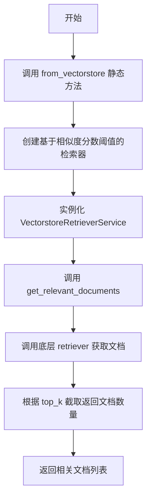
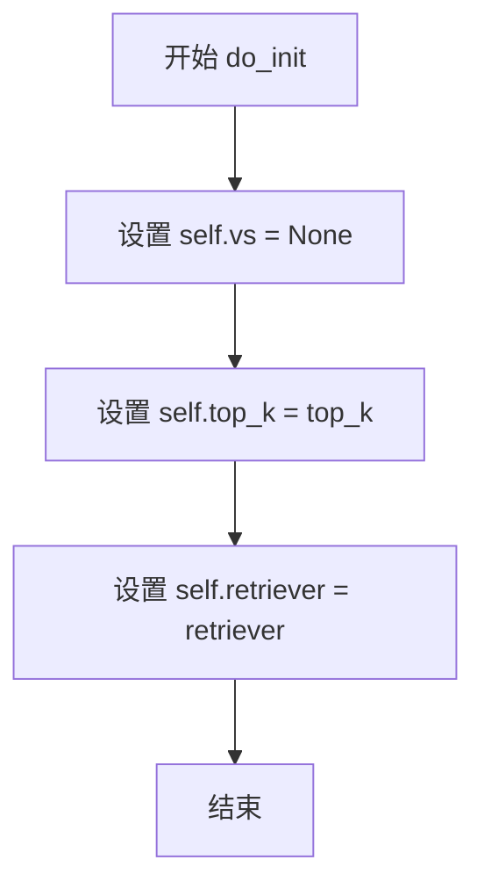
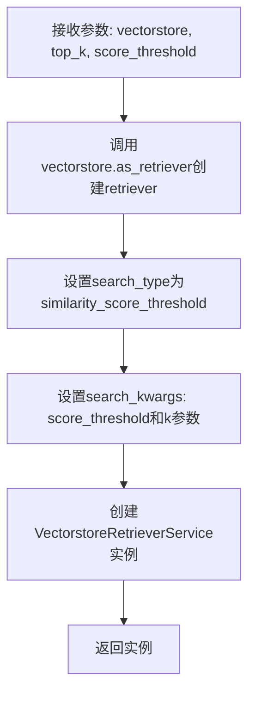

# `Langchain-Chatchat\libs\chatchat-server\chatchat\server\file_rag\retrievers\vectorstore.py` 详细设计文档

该代码实现了一个向量存储检索服务类(VectorstoreRetrieverService)，继承自BaseRetrieverService，用于封装LangChain的向量存储和检索器，通过向量相似度阈值和top_k参数从向量数据库中获取与查询最相关的文档。

## 整体流程



## 类结构

```
BaseRetrieverService (抽象基类)
└── VectorstoreRetrieverService (具体实现类)
```

## 全局变量及字段


### `VectorstoreRetrieverService.vs`
    
向量存储实例，初始化为None

类型：`VectorStore | None`
    


### `VectorstoreRetrieverService.top_k`
    
返回文档的最大数量

类型：`int`
    


### `VectorstoreRetrieverService.retriever`
    
LangChain基础检索器实例

类型：`BaseRetriever | None`
    
    

## 全局函数及方法


### `VectorstoreRetrieverService.do_init`

该方法是一个初始化方法，用于初始化 `VectorstoreRetrieverService` 类的实例变量，包括设置向量存储为 `None`、设置返回文档数量 `top_k` 以及可选的检索器实例 `retriever`。

参数：

- `retriever`：`BaseRetriever`，可选的检索器实例，默认为 `None`
- `top_k`：`int`，返回文档数量，默认为 `5`

返回值：`None`，无返回值，仅初始化实例变量

#### 流程图



#### 带注释源码

```python
def do_init(
    self,
    retriever: BaseRetriever = None,
    top_k: int = 5,
):
    """
    初始化 VectorstoreRetrieverService 实例变量
    
    参数:
        retriever: 可选的检索器实例，用于执行向量检索
        top_k: 返回文档数量，默认为5
    
    返回:
        None: 无返回值，仅初始化实例变量
    """
    # 初始化向量存储为 None，表示尚未加载向量存储
    self.vs = None
    # 设置返回文档的数量上限
    self.top_k = top_k
    # 设置检索器实例，可为 None
    self.retriever = retriever
```


### `VectorstoreRetrieverService.from_vectorstore`

这是一个静态工厂方法，用于从LangChain的VectorStore实例创建一个配置了相似度分数阈值过滤的VectorstoreRetrieverService检索服务实例。该方法封装了VectorStore到Retriever的转换过程，使得上层调用可以统一通过Retriever接口进行文档检索。

参数：

- `vectorstore`：`VectorStore`，LangChain向量存储实例，提供底层向量搜索能力
- `top_k`：`int`，返回文档数量，限制检索结果的数量上限
- `score_threshold`：`int | float`，相似度分数阈值，用于过滤低于设定分数的检索结果

返回值：`VectorstoreRetrieverService`，返回新创建的检索服务实例，包含配置好的retriever和top_k参数

#### 流程图



#### 带注释源码

```python
@staticmethod
def from_vectorstore(
    vectorstore: VectorStore,
    top_k: int,
    score_threshold: int | float,
):
    # 使用VectorStore的as_retriever方法创建检索器
    # 配置为基于相似度分数阈值的搜索模式
    retriever = vectorstore.as_retriever(
        search_type="similarity_score_threshold",
        search_kwargs={
            "score_threshold": score_threshold,  # 相似度分数阈值，低于此值的结果将被过滤
            "k": top_k  # 返回的最多文档数量
        },
    )
    # 创建并返回VectorstoreRetrieverService实例
    # 传入配置好的retriever和top_k参数
    return VectorstoreRetrieverService(retriever=retriever, top_k=top_k)
```


### `VectorstoreRetrieverService.get_relevant_documents`

该方法接收查询字符串，调用底层向量存储检索器获取相关文档，并返回最多 `top_k` 个文档作为搜索结果。

参数：

- `query`：`str`，查询字符串

返回值：`list[Document]`，返回与查询相关的文档列表（已限制数量为 top_k）

#### 流程图

```mermaid
flowchart TD
    A[开始 get_relevant_documents] --> B[接收 query 参数]
    B --> C[调用 self.retriever.get_relevant_documents]
    C --> D[获取原始文档列表]
    D --> E[切片操作: [:self.top_k]]
    E --> F[返回最多 top_k 个文档]
    F --> G[结束]
```

#### 带注释源码

```python
def get_relevant_documents(self, query: str):
    """
    获取与查询相关的文档
    
    参数:
        query: str - 查询字符串
        
    返回:
        list[Document] - 与查询相关的文档列表（已限制为 top_k 数量）
    """
    # 调用底层 retriever 的 get_relevant_documents 方法获取文档
    # 然后通过切片 [:self.top_k] 限制返回的文档数量
    return self.retriever.get_relevant_documents(query)[: self.top_k]
```

## 关键组件


### VectorstoreRetrieverService 类

基于LangChain VectorStore的检索服务实现类，封装了向量数据库的检索能力，提供基于相似度分数阈值的文档检索功能。

### BaseRetrieverService 抽象基类

定义检索服务的接口规范，提供了do_init初始化方法和get_relevant_documents检索方法的标准定义。

### do_init 方法

初始化检索服务的实例字段，包括向量存储实例、top_k参数和底层LangChain检索器。

### from_vectorstore 静态工厂方法

从VectorStore对象创建检索器服务的工厂方法，内部调用vectorstore.as_retriever()创建基于相似度分数阈值的检索器，并返回配置好的VectorstoreRetrieverService实例。

### get_relevant_documents 方法

执行实际检索的核心方法，调用底层retriever的get_relevant_documents并对结果进行切片截断，只返回top_k数量的文档。

### 相似度分数阈值检索策略

通过search_type="similarity_score_threshold"和search_kwargs配置实现的检索策略，允许设置最小相似度分数阈值来过滤不相关的文档。

### top_k 参数

控制返回文档数量的整型参数，在get_relevant_documents中通过切片操作实现结果数量限制。

### score_threshold 参数

用于过滤低相似度文档的阈值参数，通过search_kwargs传递给检索器，实现相关性过滤。

### 底层retriever 委托模式

本类采用委托模式，将实际的文档检索工作委托给LangChain的BaseRetriever实现类，自身只负责结果截断和参数配置。


## 问题及建议


### 已知问题

-   **未使用的实例变量**：`self.vs = None` 在 `do_init` 方法中被赋值为 None，但在整个类中从未被使用，造成冗余
-   **缺少参数验证**：`do_init` 方法接收的 `retriever` 参数默认为 None，但在 `get_relevant_documents` 方法中直接调用 `self.retriever.get_relevant_documents()` 而未进行空值检查，会导致 AttributeError
-   **类型定义不精确**：`score_threshold` 参数类型声明为 `int | float`，但向量检索中的分数阈值通常应为 float 类型，int 类型可能导致意外的精度问题或类型混淆
-   **缺少文档字符串**：类和方法均缺少文档字符串（docstring），影响代码可读性和可维护性
-   **未实现父类抽象方法**：继承自 `BaseRetrieverService`，但未确认是否实现了父类要求的所有抽象方法或接口

### 优化建议

-   **移除未使用变量**：删除 `self.vs = None` 这行代码，或在类中实际使用该属性
-   **添加参数验证**：在 `do_init` 或 `get_relevant_documents` 方法中添加 `retriever` 的空值检查，必要时抛出有意义的异常信息
-   **修正类型注解**：将 `score_threshold` 的类型限制为 `float`，并在文档中说明其有效范围（通常为 0.0 到 1.0）
-   **添加文档字符串**：为类和方法添加详细的 docstring，说明功能、参数、返回值和可能的异常
-   **添加日志记录**：在关键路径添加日志，便于调试和监控检索过程
-   **考虑异步实现**：如父类支持异步检索，可添加 `aget_relevant_documents` 异步方法以提升性能


## 其它


### 设计目标与约束

本模块旨在封装向量存储（VectorStore）的检索能力，提供统一的检索服务接口，支持基于相似度分数阈值的文档检索功能。设计约束包括：依赖langchain库的VectorStore和BaseRetriever接口，仅支持相似度分数阈值检索模式，返回结果数量受top_k参数限制。

### 错误处理与异常设计

初始化时若retriever为None且未正确设置vectorstore，调用get_relevant_documents会抛出AttributeError。from_vectorstore静态方法在vectorstore.as_retriever()调用失败时抛出langchain相关异常。建议在使用前检查self.retriever是否为None，或在调用处进行异常捕获。异常传播策略为向上传递，由调用方处理。

### 数据流与状态机

数据流：外部调用get_relevant_documents(query) → 内部调用self.retriever.get_relevant_documents(query) → 向量存储执行相似度搜索 → 返回文档列表 → 切片操作[:self.top_k]截取top_k条结果 → 返回给调用方。状态机包含两种状态：未初始化状态（self.retriever=None）和已初始化状态（self.retriever已设置）。

### 外部依赖与接口契约

依赖langchain_core.retrievers.BaseRetriever和langchain.vectorstores.VectorStore接口。调用方需提供实现了VectorStore接口的对象（如Chroma、FAISS等），返回结果为Document对象列表。from_vectorstore方法接受vectorstore对象、top_k整数、score_threshold数值参数，返回VectorstoreRetrieverService实例。

### 配置与参数说明

do_init参数：retriever可选的BaseRetriever实例，top_k默认5的整数。from_vectorstore参数：vectorstore必填的VectorStore实例，top_k必填的整数表示返回文档数量，score_threshold必填的数值表示相似度阈值（0-1之间效果最佳）。类属性：self.vs当前未使用（可优化），self.top_k存储返回数量限制，self.retriever存储实际检索器。

### 使用示例

```python
# 从向量存储创建检索服务
vectorstore = Chroma.from_documents(documents, embeddings)
retriever_service = VectorstoreRetrieverService.from_vectorstore(
    vectorstore=vectorstore,
    top_k=10,
    score_threshold=0.7
)

# 执行检索
docs = retriever_service.get_relevant_documents("查询内容")
```

### 性能考虑

每次调用get_relevant_documents都会执行完整的向量搜索，频繁调用时应考虑缓存结果。切片操作在返回列表上执行，内存开销与原始返回结果数量成正比。建议根据实际场景调整top_k和score_threshold参数以平衡召回率和性能。

### 线程安全性

类本身不包含线程锁机制，在多线程环境下共享同一实例时，self.retriever的调用安全性取决于底层langchain实现是否线程安全。建议每个线程使用独立实例或确认底层vectorstore支持并发访问。

    