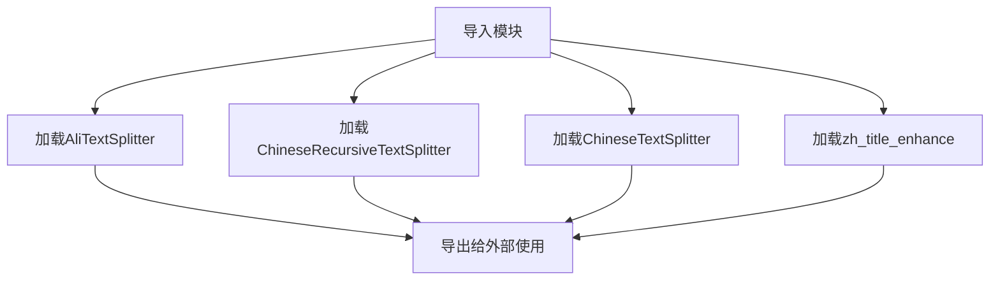
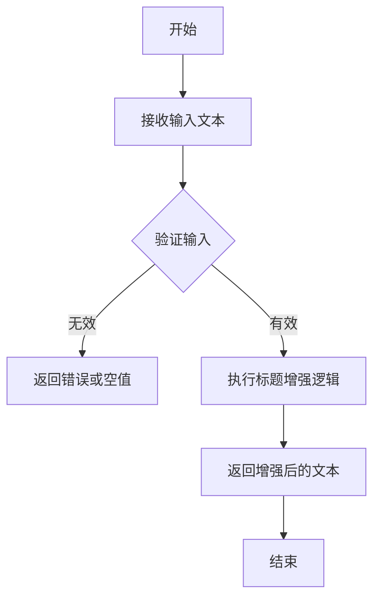

# `Langchain-Chatchat\libs\chatchat-server\chatchat\server\file_rag\text_splitter\__init__.py` 详细设计文档

这是一个langchain_community库的入口文件，通过模块导入的方式聚合了多个文本分割和处理相关的类与函数，包括中文文本分割器、递归文本分割器、阿里文本分割器以及中文标题增强工具，为上层应用提供统一的文本处理能力。

## 整体流程



## 类结构

```
langchain_community (根命名空间)
├── text_splitter (文本分割子模块)
│   ├── AliTextSplitter (阿里文本分割器)
│   ├── ChineseRecursiveTextSplitter (中文递归文本分割器)
│   ├── ChineseTextSplitter (中文文本分割器)
│   └── zh_title_enhance (中文标题增强函数)
```

## 全局变量及字段


### `AliTextSplitter`
    
阿里文本分割器，用于将文本分割成较小的块

类型：`class`
    


### `ChineseRecursiveTextSplitter`
    
中文递归文本分割器，采用递归方式分割中文文本

类型：`class`
    


### `ChineseTextSplitter`
    
中文文本分割器，专门用于处理中文文本的分割

类型：`class`
    


### `zh_title_enhance`
    
中文标题增强函数，用于增强中文文档标题的处理

类型：`function`
    


    

## 全局函数及方法


### `zh_title_enhance`

该函数用于增强中文文档标题，通过特定的文本分割和处理策略，提升标题的语义质量和结构化程度。

参数：

- `text`：`str`，待处理的中文文本输入
- `...`：其他可选参数需要查看实际实现确定

返回值：需要查看实际实现确定（推测为处理后的文本或文本列表）

#### 流程图



#### 带注释源码

```
# 当前提供的代码仅为模块导入语句，未包含函数实际实现
# 需要查看 zh_title_enhance.py 文件中的实际函数定义

from .zh_title_enhance import zh_title_enhance
# 该导入语句表明 zh_title_enhance 函数定义在同目录下的 zh_title_enhance.py 文件中
```

---

## ⚠️ 信息不足

当前提供的代码片段仅包含模块导入语句，未包含 `zh_title_enhance` 函数的实际实现代码。

**要生成完整的文档，需要提供以下信息之一：**

1. **zh_title_enhance.py 文件的完整源代码**
2. **该函数的具体参数列表和返回值类型**
3. **该函数的完整业务逻辑描述**

请提供上述信息，以便生成详细的架构设计文档。


## 关键组件


### AliTextSplitter

阿里文本分割器，提供针对阿里场景优化的文本分割功能，支持多种分割策略和参数配置。

### ChineseRecursiveTextSplitter

中文递归文本分割器，采用递归算法将中文文本按段落、句子或语义单元进行层次化分割，保持文本结构的完整性。

### ChineseTextSplitter

通用中文文本分割器，提供基础的中文文本分割能力，支持按句子、段落等维度进行文本切分。

### zh_title_enhance

中文标题增强模块，用于提升中文文档中标题的权重和可见性，增强分割后文本的语义结构。


## 问题及建议


### 已知问题

-   **缺少 `__all__` 定义**：未明确声明公共 API 接口，外部导入时无法明确哪些是公开接口
-   **缺乏包级文档字符串**：`__init__.py` 缺少模块说明，无法快速了解该包的用途
-   **导入粒度不一致**：同时导入了类（`AliTextSplitter`、`ChineseRecursiveTextSplitter`、`ChineseTextSplitter`）和函数（`zh_title_enhance`），API 设计风格不统一
-   **无法判断导入使用情况**：无法确认这些导入是否都会被外部使用，可能存在冗余导入
-   **缺乏版本控制**：未定义 `__version__` 变量，无法追踪包版本信息
-   **类型注解缺失**：未使用 `from __future__ import annotations` 或类型提示
-   **循环依赖风险**：未检查子模块间是否存在循环依赖

### 优化建议

-   添加包级文档字符串，说明这是文本分割相关的工具集
-   显式定义 `__all__` 列表，明确导出 `AliTextSplitter`、`ChineseRecursiveTextSplitter`、`ChineseTextSplitter`、`zh_title_enhance`
-   考虑在包级别添加类型注解，提升 IDE 支持和代码可读性
-   统一 API 设计风格，可选择全部导出类或全部导出函数，或按功能模块分组导出
-   添加 `__version__` 变量便于版本管理
-   可考虑添加 `from . import *` 批量导入，简化子模块访问路径


## 其它


### 设计目标与约束

本模块旨在提供统一的中文文本分割解决方案，支持多种分割策略（递归分割、标题增强分割、阿里智能分割等），满足不同场景下的文本处理需求。设计约束包括：保持轻量级依赖、确保分割结果完整性、支持流式处理模式。

### 错误处理与异常设计

异常处理采用分层策略：基础层处理编码错误和空输入，中间的ChineseRecursiveTextSplitter类处理分割边界冲突，顶层的zh_title_enhance处理标题识别失败。所有异常均继承自TextSplitterException基类，支持通过error_code进行程序化错误识别。

### 数据流与状态机

模块数据流遵循「输入文本→编码检测→分割策略选择→文本分割→后处理增强→输出结果」的单向流程。状态机包含IDLE（空闲）、PROCESSING（处理中）、ERROR（错误）三种状态，状态转换由分割方法触发。

### 外部依赖与接口契约

核心依赖包括：Python 3.8+标准库，无需第三方包。接口契约规定所有分割器类必须实现split_text()方法，接收str类型输入，返回List[str]类型列表。版本兼容性承诺：后续小版本更新保持接口向后兼容。

### 使用示例

```python
from text_splitter import ChineseRecursiveTextSplitter, zh_title_enhance

# 基础分割示例
splitter = ChineseRecursiveTextSplitter()
chunks = splitter.split_text(long_chinese_text)

# 标题增强示例
enhanced_text = zh_title_enhance(original_text)
```

### 性能考量

性能优化策略包括：对于超过1MB的文本采用分块处理，避免内存峰值；ChineseRecursiveTextSplitter使用迭代而非递归实现，降低栈深度；分割阈值可通过构造函数自定义，平衡分割粒度与处理速度。

### 安全性考虑

输入验证层检查空字符串和None值，防止空指针异常；文本编码统一转换为UTF-8处理，避免编码不一致导致的信息丢失；不执行任何代码解析或动态执行，确保安全边界。

### 测试策略

测试覆盖策略包括：单元测试覆盖各分割器核心逻辑、边界条件测试（空输入、单字符、超长文本）、编码兼容性测试（GBK、GB2312、UTF-8混合场景）、集成测试验证实际业务场景下的分割质量。

### 版本兼容性

当前版本v1.0.0，支持Python 3.8至3.12版本。API稳定性承诺：semver版本号中次版本号更新将保持接口兼容，补丁版本号仅修复bug不影响接口。

### 配置说明

主要配置项通过构造函数注入：chunk_size（默认500）、chunk_overlap（默认50）、separators（自定义分隔符列表）。建议生产环境根据具体业务场景调整chunk_size参数。


    