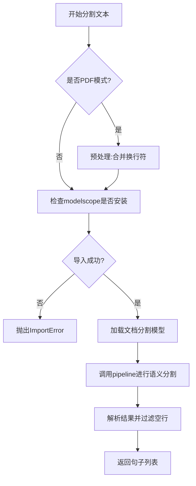
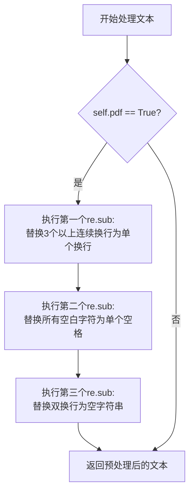
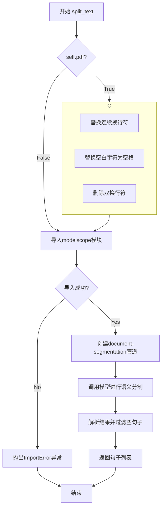
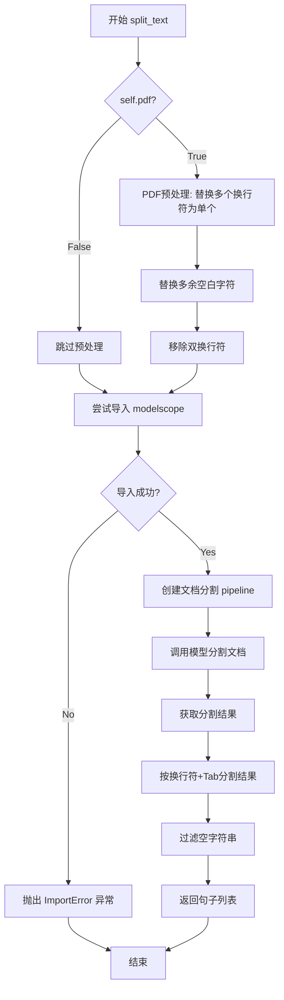
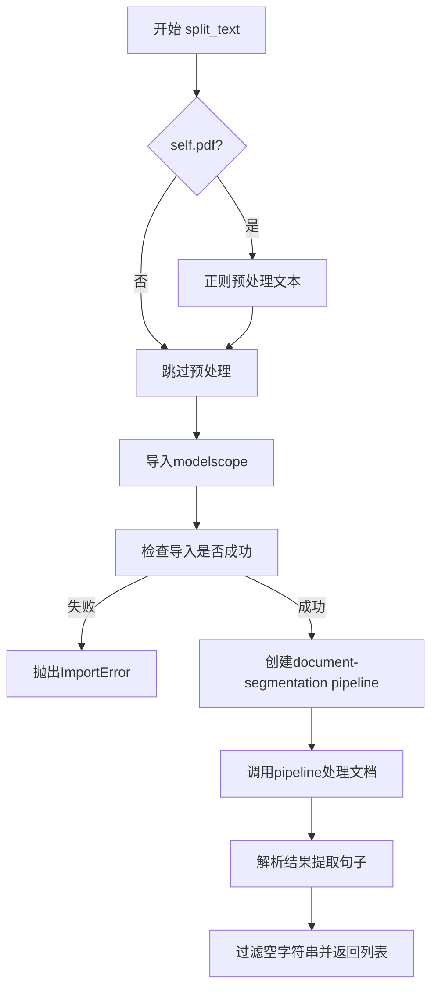

# `Langchain-Chatchat\libs\chatchat-server\chatchat\server\file_rag\text_splitter\ali_text_splitter.py` 详细设计文档

这是一个基于langchain的文本分割器扩展类，专门用于中文文档的语义分割，支持PDF文档预处理，并集成了达摩院开源的nlp_bert_document-segmentation_chinese-base模型进行智能断句。

## 整体流程



## 类结构

```
CharacterTextSplitter (langchain基类)
└── AliTextSplitter (自定义实现)
```

## 全局变量及字段


### `re`
    
Python正则表达式模块，用于文本模式匹配和替换

类型：`module`
    


### `List`
    
Python类型提示，表示列表类型

类型：`typing.Type`
    


### `CharacterTextSplitter`
    
LangChain库中的文本分割器基类，提供字符级别文本分割功能

类型：`class`
    


### `pipeline`
    
ModelScope的管道函数，用于创建文档分割任务管道

类型：`function`
    


### `p`
    
文档分割管道的实例对象，调用nlp_bert_document-segmentation_chinese-base模型

类型：`object`
    


### `result`
    
模型分割结果字典，包含按句子分割的文本内容

类型：`dict`
    


### `sent_list`
    
分割后的句子列表，包含所有非空句子

类型：`List[str]`
    


### `text`
    
待分割的输入文本字符串

类型：`str`
    


### `AliTextSplitter.pdf`
    
是否启用PDF文档模式标志，为True时执行额外的文本清洗操作

类型：`bool`
    
    

## 全局函数及方法


### `re.sub` (正则替换)

该代码中使用了三个 `re.sub` 调用，用于在 PDF 文档分割前对文本进行预处理，清除多余的换行符和空白字符，使文本更适合后续的语义分割模型处理。

参数：

-  `pattern`：`str`，正则表达式模式，定义要匹配的文本内容
-  `repl`：`str`，替换文本，指定匹配项要替换成的内容
-  `string`：`str`，输入字符串，待处理的原始文本

返回值：`str`，替换处理后的字符串

#### 流程图



#### 带注释源码

```python
# 第一处 re.sub 调用
# 匹配3个或更多连续换行符，替换为单个换行符
# 作用：合并多余的空行，减少文档中的冗余换行
text = re.sub(r"\n{3,}", r"\n", text)

# 第二处 re.sub 调用
# 匹配所有空白字符（包括空格、制表符等），替换为单个空格
# 作用：将各种空白字符统一为空格，避免空白符混乱
text = re.sub("\s", " ", text)

# 第三处 re.sub 调用
# 匹配两个连续换行符，替换为空字符串
# 作用：删除段落之间的双换行，进一步清理格式
text = re.sub("\n\n", "", text)
```

#### 关键组件信息

| 名称 | 一句话描述 |
|------|------------|
| `re` 模块 | Python标准库正则表达式处理模块 |
| `\n{3,}` 模式 | 匹配连续3个及以上的换行符 |
| `\s` 模式 | 匹配所有空白字符（空格、制表符、换行等） |
| `\n\n` 模式 | 匹配两个连续换行符 |

#### 潜在的技术债务或优化空间

1. **正则表达式性能**：连续执行三次 `re.sub` 操作效率较低，可以考虑合并正则表达式或使用 `re.compile` 预编译模式以提升性能
2. **硬编码字符串**：替换模式以字符串形式硬编码，缺乏灵活性，可考虑提取为类属性或配置参数
3. **PDF处理逻辑不完整**：当前仅处理了换行和空白符，未处理常见的PDF特殊字符（如 `\x0c` 分页符）
4. **正则表达式安全隐患**：第二个替换使用 `\s` 可能会误处理中文字符间的空格，在处理中文文档时需谨慎

#### 其它项目

- **设计目标**：在调用文档语义分割模型前，对PDF文本进行规范化预处理，去除干扰噪声
- **错误处理**：代码中未对正则替换结果进行验证，建议添加空值检查和边界情况处理
- **数据流**：原始文本 → 换行规范化 → 空白符统一 → 双换行删除 → 输出待分割文本
- **外部依赖**：依赖Python标准库 `re` 模块，无额外依赖


### `AliTextSplitter.split_text`

该方法是一个文本语义分割功能，通过调用达摩院开源的文档语义分割模型（nlp_bert_document-segmentation_chinese-base）将输入的文本按照语义进行智能切分，返回一个句子列表。若初始化时指定`pdf=True`，则会对PDF文本进行预处理以提高分割效果。

参数：

- `text`：`str`，待分割的文本内容

返回值：`List[str]`，分割后的句子列表

#### 流程图



#### 带注释源码

```python
def split_text(self, text: str) -> List[str]:
    # use_document_segmentation参数指定是否用语义切分文档，此处采取的文档语义分割模型为达摩院开源的nlp_bert_document-segmentation_chinese-base，论文见https://arxiv.org/abs/2107.09278
    # 如果使用模型进行文档语义切分，那么需要安装modelscope[nlp]：pip install "modelscope[nlp]" -f https://modelscope.oss-cn-beijing.aliyuncs.com/releases/repo.html
    # 考虑到使用了三个模型，可能对于低配置gpu不太友好，因此这里将模型load进cpu计算，有需要的话可以替换device为自己的显卡id
    
    # 判断是否为PDF文本，若是则进行预处理
    if self.pdf:
        # 将3个及以上连续换行符替换为单个换行符
        text = re.sub(r"\n{3,}", r"\n", text)
        # 将所有空白字符替换为空格
        text = re.sub("\s", " ", text)
        # 删除双换行符
        text = re.sub("\n\n", "", text)
    
    # 尝试导入modelscope库
    try:
        from modelscope.pipelines import pipeline
    except ImportError:
        # 若导入失败则抛出ImportError异常，提示用户安装
        raise ImportError(
            "Could not import modelscope python package. "
            "Please install modelscope with `pip install modelscope`. "
        )

    # 创建文档语义分割管道，使用CPU设备
    p = pipeline(
        task="document-segmentation",
        model="damo/nlp_bert_document-segmentation_chinese-base",
        device="cpu",
    )
    
    # 调用模型进行文档语义分割
    result = p(documents=text)
    
    # 解析结果，按换行符和制表符分割，过滤空字符串
    sent_list = [i for i in result["text"].split("\n\t") if i]
    
    # 返回句子列表
    return sent_list
```


### `AliTextSplitter.__init__`

这是 `AliTextSplitter` 类的构造函数，用于初始化文本分割器实例。它继承自 `CharacterTextSplitter`，并添加了 PDF 处理支持。

参数：

- `self`：隐式参数，当前实例对象
- `pdf`：`bool`，可选参数，默认为 `False`，指定是否将输入视为 PDF 文档进行处理
- `**kwargs`：`Any`，可变关键字参数，用于传递给父类 `CharacterTextSplitter` 的参数

返回值：`None`，无返回值（构造函数）

#### 流程图

```mermaid
flowchart TD
    A[开始 __init__] --> B[调用父类构造函数 super().__init__**kwargs]
    B --> C[将 pdf 参数赋值给 self.pdf]
    D[结束]
```

#### 带注释源码

```python
def __init__(self, pdf: bool = False, **kwargs):
    """
    初始化 AliTextSplitter 实例
    
    参数:
        pdf: bool, 默认为 False. 如果为 True，则在分割文本时会对 PDF 格式的文本进行预处理
        **kwargs: 传递给父类 CharacterTextSplitter 的关键字参数
    """
    # 调用父类的构造函数，传递任意关键字参数
    super().__init__(**kwargs)
    # 将 pdf 参数存储为实例属性，供 split_text 方法使用
    self.pdf = pdf
```


### `AliTextSplitter.__init__`

该方法是 `AliTextSplitter` 类的构造函数，负责初始化对象状态。在调用父类 `CharacterTextSplitter` 的初始化方法后，根据 `pdf` 参数设置文档处理模式。

参数：

- `self`：实例对象（隐式参数），`AliTextSplitter`，类的实例本身
- `pdf`：`bool`，默认为 `False`，指定是否以 PDF 模式处理文档
- `**kwargs`：`任意关键字参数`，传递给父类 `CharacterTextSplitter` 的关键字参数（如 `separator`、`chunk_size` 等文本分割相关配置）

返回值：`None`，构造函数不返回值，仅初始化对象状态

#### 流程图

```mermaid
flowchart TD
    A[开始 __init__] --> B[接收 pdf 和 **kwargs 参数]
    B --> C[调用 super().__init__(**kwargs)]
    C --> D[调用父类 CharacterTextSplitter 构造方法]
    D --> E[初始化父类属性]
    E --> F[设置 self.pdf = pdf]
    G[结束 __init__]
    F --> G
```

#### 带注释源码

```python
def __init__(self, pdf: bool = False, **kwargs):
    """
    初始化 AliTextSplitter 实例。
    
    参数:
        pdf: bool, optional
            是否以 PDF 模式处理文档。默认为 False。
            当为 True 时，会对文本进行额外的清理处理。
        **kwargs: dict
            传递给父类 CharacterTextSplitter 的关键字参数，
            用于配置文本分割行为（如 separator、chunk_size、length_function 等）。
    """
    # 调用父类 CharacterTextSplitter 的 __init__ 方法
    # 传递所有 kwargs 参数，使子类能够复用父类的初始化逻辑
    super().__init__(**kwargs)
    
    # 根据 pdf 参数设置实例属性
    # 当 pdf=True 时，split_text 方法会对文本进行额外的清理
    self.pdf = pdf
```


### `AliTextSplitter`

这是一个继承自 LangChain 的 `CharacterTextSplitter` 的中文文档语义分割类，通过集成阿里达摩院的 NLP BERT 文档分割模型实现智能文本切分，支持 PDF 文档的特殊预处理。

#### 参数

- `pdf`：`bool`，指定是否以 PDF 模式处理文本（进行额外的清理操作）
- `**kwargs`：传递给父类 `CharacterTextSplitter` 的额外关键字参数

#### 返回值

- `List[str]`，返回切分后的文本句子列表

#### 流程图



#### 带注释源码

```python
import re
from typing import List

# 从 langchain 导入字符文本分割器基类
from langchain.text_splitter import CharacterTextSplitter


class AliTextSplitter(CharacterTextSplitter):
    """
    阿里达摩院文档语义分割器
    继承自 CharacterTextSplitter，用于智能中文文档切分
    """
    
    def __init__(self, pdf: bool = False, **kwargs):
        """
        初始化分割器
        
        参数:
            pdf: bool - 是否以PDF模式处理文本，进行额外的清理预处理
            **kwargs: 传递给父类的其他参数
        """
        # 调用父类构造函数
        super().__init__(**kwargs)
        # 保存 PDF 模式标志
        self.pdf = pdf

    def split_text(self, text: str) -> List[str]:
        """
        使用文档语义分割模型切分文本
        
        参数:
            text: str - 需要分割的原始文本
            
        返回:
            List[str] - 分割后的句子列表
        """
        # use_document_segmentation参数指定是否用语义切分文档，此处采取的文档语义分割模型为达摩院开源的nlp_bert_document-segmentation_chinese-base，论文见https://arxiv.org/abs/2107.09278
        # 如果使用模型进行文档语义切分，那么需要安装modelscope[nlp]：pip install "modelscope[nlp]" -f https://modelscope.oss-cn-beijing.aliyuncs.com/releases/repo.html
        # 考虑到使用了三个模型，可能对于低配置gpu不太友好，因此这里将模型load进cpu计算，有需要的话可以替换device为自己的显卡id
        
        # 如果是PDF模式，进行文本预处理
        if self.pdf:
            # 将3个及以上连续换行符替换为单个换行符
            text = re.sub(r"\n{3,}", r"\n", text)
            # 将所有空白字符替换为单个空格
            text = re.sub("\s", " ", text)
            # 移除双换行符
            text = re.sub("\n\n", "", text)
        
        # 尝试导入 modelscope 库
        try:
            from modelscope.pipelines import pipeline
        except ImportError:
            # 如果导入失败，抛出明确的安装提示
            raise ImportError(
                "Could not import modelscope python package. "
                "Please install modelscope with `pip install modelscope`. "
            )

        # 创建文档分割管道，使用达摩院的中文文档分割模型
        # 注意：每次调用都会重新加载模型，造成性能开销
        p = pipeline(
            task="document-segmentation",
            model="damo/nlp_bert_document-segmentation_chinese-base",
            device="cpu",  # 硬编码为CPU，可配置为GPU设备
        )
        
        # 执行文档分割
        result = p(documents=text)
        
        # 解析结果，按换行+Tab分割，过滤空字符串
        sent_list = [i for i in result["text"].split("\n\t") if i]
        
        # 返回句子列表
        return sent_list
```

---

### 关键组件信息

| 组件名称 | 一句话描述 |
|---------|-----------|
| `AliTextSplitter` | 集成阿里达摩院NLP BERT模型的中文文档语义分割器 |
| `modelscope.pipeline` | ModelScope的管道组件，用于加载和运行预训练模型 |
| `nlp_bert_document-segmentation_chinese-base` | 达摩院开源的中文文档语义分割基座模型 |

---

### 潜在的技术债务与优化空间

1. **模型重复加载**：每次调用 `split_text` 都会重新创建 pipeline 并加载模型，导致严重的性能开销。建议将模型初始化移到构造函数或使用单例模式。

2. **设备硬编码**：`device="cpu"` 被硬编码，低配置CPU用户无法使用GPU加速，且无法指定GPU设备ID。应当提取为构造函数参数。

3. **模型名称硬编码**：模型名称固定，无法灵活切换其他分割模型或自定义模型路径。

4. **缺乏错误处理**：模型执行过程中可能抛出异常（如模型加载失败、内存不足等），当前代码未做捕获和处理。

5. **PDF预处理正则表达式不精确**：使用 `\s` 会匹配所有空白字符，可能导致意外替换；正则表达式 `\n\n` 未使用原始字符串前缀 `r`。

6. **缺少缓存机制**：已分割的文本无法缓存，重复分割相同文本会浪费计算资源。

7. **未继承父类的分割逻辑**：重写了 `split_text` 方法但未调用父类方法，丢失了 `CharacterTextSplitter` 原有的基于字符的分割能力。

---

### 其他项目

#### 设计目标与约束
- **目标**：实现中文文档的语义感知分割，而非简单的字符或行分割
- **约束**：依赖 ModelScope 生态和达摩院模型，需安装额外依赖

#### 错误处理与异常设计
- 仅在模型库导入失败时抛出 `ImportError`
- 模型执行阶段的异常（如OOM、模型加载失败）未捕获，可能导致程序崩溃

#### 外部依赖与接口契约
- **输入**：`split_text(text: str)` 接收原始文本字符串
- **输出**：返回 `List[str]}`，按语义分割的句子列表，分隔符为 `\n\t`
- **依赖库**：`langchain.text_splitter`、`modelscope`

#### 数据流说明
```
原始文本 → (PDF预处理) → 模型推理 → 结果解析 → 句子列表
```


### `AliTextSplitter.split_text`

该方法是`AliTextSplitter`类的核心方法，用于对文本进行语义分割。当启用PDF模式时会进行文本预处理，然后调用达摩院的文档语义分割模型将文本按段落或语义单元分割成句子列表。

参数：

- `text`：`str`，需要分割的原始文本内容

返回值：`List[str]`，分割后的句子列表，每个元素为一个语义完整的文本片段

#### 流程图

```mermaid
flowchart TD
    A[开始 split_text] --> B{self.pdf?}
    B -->|Yes| C[预处理文本: 合并换行、替换空格]
    B -->|No| D[导入 modelscope.pipeline]
    C --> D
    D --> E[创建文档语义分割管道]
    E --> F[调用模型分割文档]
    F --> G[result['text'].split]
    G --> H[过滤空字符串]
    H --> I[返回句子列表]
    
    style G fill:#f9f,stroke:#333,stroke-width:2px
```

#### 带注释源码

```python
def split_text(self, text: str) -> List[str]:
    # 使用文档语义分割模型进行分句
    # 参数说明:
    #   - pdf: 是否对PDF文档进行预处理
    #   - 模型: damo/nlp_bert_document-segmentation_chinese-base (达摩院开源)
    #   - 论文: https://arxiv.org/abs/2107.09278
    
    # 判断是否为PDF文档格式，若是则进行文本预处理
    if self.pdf:
        # 将3个及以上连续换行符替换为单个换行
        text = re.sub(r"\n{3,}", r"\n", text)
        # 将所有空白字符替换为单个空格
        text = re.sub("\s", " ", text)
        # 移除双换行符
        text = re.sub("\n\n", "", text)
    
    # 尝试导入ModelScope库用于文档分割
    try:
        from modelscope.pipelines import pipeline
    except ImportError:
        raise ImportError(
            "Could not import modelscope python package. "
            "Please install modelscope with `pip install modelscope`. "
        )

    # 创建文档语义分割管道
    # 参数:
    #   - task: 任务类型为文档分割
    #   - model: 使用的中文文档分割模型
    #   - device: 运行设备为CPU (如需GPU可改为'cuda:0'等)
    p = pipeline(
        task="document-segmentation",
        model="damo/nlp_bert_document-segmentation_chinese-base",
        device="cpu",
    )
    
    # 调用模型对文本进行语义分割
    result = p(documents=text)
    
    # 核心分割操作: 按换行符+制表符分割结果文本
    # result["text"] 包含模型分割后的文本，用 "\n\t" 分隔各段落
    # split("\n\t") 将其分割成列表
    # [i for i in ... if i] 过滤掉空字符串
    sent_list = [i for i in result["text"].split("\n\t") if i]
    
    # 返回非空句子列表
    return sent_list
```

### `result["text"].split` 操作详情

这是文档分割结果的处理核心，将模型输出的字符串按特定分隔符拆分为句子列表。

参数：

- `self`：`AliTextSplitter`，方法所属的实例对象
- `result["text"]`：`str`，模型分割后的原始文本结果，包含用`\n\t`分隔的多个段落

返回值：`List[str]`，过滤空字符串后的句子列表

#### 流程图

```mermaid
flowchart LR
    A[result['text'] 原始字符串] --> B[.split('\n\t') 分割]
    B --> C[遍历每个元素]
    C --> D{元素非空?}
    D -->|Yes| E[保留到结果列表]
    D -->|No| F[过滤掉]
    E --> G[返回 List[str]]
    F --> G
    
    style B fill:#f9f,stroke:#333,stroke-width:2px
```

#### 带注释源码

```python
# result["text"] 是模型返回的分割后文本，格式为:
# "第一段内容\n\t第二段内容\n\t第三段内容\n\t..."

# 使用换行符+制表符作为分隔符进行分割
# split("\n\t") 会把文本切分成多个字符串片段
split_result = result["text"].split("\n\t")

# 列表推导式过滤空字符串
# [i for i in split_result if i]
#   - 遍历分割后的每个元素
#   - if i: 过滤掉空字符串和None值
sent_list = [i for i in result["text"].split("\n\t") if i]

# 示例:
# 输入: "第一段\n\t第二段\n\t\n\t第三段"
# 输出: ["第一段", "第二段", "第三段"]  (空字符串被过滤)
```


### `sent_list（列表推导式过滤）`

该列表推导式用于将文档分割模型返回的文本结果按换行符和制表符进行拆分，并过滤掉空字符串，得到非空的句子列表。

参数：无（列表推导式为表达式，无需参数）

返回值：`List[str]`，返回非空字符串列表

#### 流程图

```mermaid
flowchart TD
    A[开始] --> B[获取result["text"]]<br/>包含分割后的文本
    B --> C[按'\n\t'分割字符串<br/>split方法]
    C --> D{遍历每个元素i}
    D --> E{i是否为空字符串?}
    E -->|是| F[过滤掉该元素]
    E -->|否| G[保留该元素]
    F --> H[构建新列表sent_list]
    G --> H
    H --> I[返回非空字符串列表]
    I --> J[结束]
```

#### 带注释源码

```python
# 使用列表推导式过滤空字符串
# 1. result["text"] 获取模型返回的文本结果
# 2. split("\n\t") 按换行符+制表符分割成句子列表
# 3. for i in ... 遍历每个分割后的元素
# 4. if i 过滤条件：只保留非空字符串
sent_list = [i for i in result["text"].split("\n\t") if i]
```

---

### 补充说明

**列表推导式详解：**

| 组成部分 | 说明 |
|---------|------|
| `result["text"]` | 模型返回的分段文本，类型为str |
| `.split("\n\t")` | 按换行符+制表符分割，类型为List[str] |
| `for i in ...` | 迭代遍历分割后的每个元素 |
| `if i` | 过滤条件，Python中空字符串为falsy值会被过滤 |
| `[i for i in ... if i]` | 列表推导式，等价于循环+条件判断+列表构建 |

**过滤逻辑：**
- Python中空字符串 `""` 在布尔上下文中等同于 `False`
- `if i` 会自动将空字符串过滤掉，只保留有实际内容的字符串
- 这种写法比传统的for循环加if判断更加简洁高效


### `AliTextSplitter.__init__`

这是 `AliTextSplitter` 类的初始化方法，用于配置文本分割器的参数，特别处理 PDF 文档的预处理选项。

参数：

- `pdf`：`bool`，指定是否启用 PDF 文档预处理模式，默认为 `False`
- `**kwargs`：可变关键字参数，用于传递给父类 `CharacterTextSplitter` 的参数

返回值：`None`，无返回值（Python 初始化方法隐式返回 `None`）

#### 流程图

```mermaid
flowchart TD
    A[开始 __init__] --> B[接收参数: pdf=False, **kwargs]
    B --> C[调用父类初始化: super().__init__**kwargs]
    C --> D[设置实例属性: self.pdf = pdf]
    D --> E[结束 __init__]
```

#### 带注释源码

```python
def __init__(self, pdf: bool = False, **kwargs):
    """
    初始化 AliTextSplitter 实例
    
    参数:
        pdf: bool, 是否启用PDF文档预处理模式
             当为True时会进行额外的文本清洗操作
        **kwargs: 传递给父类CharacterTextSplitter的关键字参数
                  包括但不限于separator, chunk_size, chunk_overlap等
    """
    # 调用父类CharacterTextSplitter的初始化方法
    # 传递所有kwargs参数以配置父类的分割行为
    super().__init__(**kwargs)
    
    # 保存PDF模式标志到实例属性
    # 该标志在split_text方法中用于决定是否进行额外的文本预处理
    self.pdf = pdf
```


### `AliTextSplitter.split_text`

该方法为核心文档分割逻辑，接收原始文本，通过可选的PDF格式预处理后，调用达摩院（Ali）的NLP语义分割模型将文本内容切分为符合语义逻辑的句子或段落列表。

参数：

- `text`：`str`，待分割的原始文本内容。

返回值：`List[str`]，返回分割后的文本片段（句子）列表。

#### 流程图

```mermaid
flowchart TD
    A([输入: text]) --> B{self.pdf == True?}
    B -- Yes --> C[PDF预处理: 正则替换多余换行与空格]
    B -- No --> D[检查依赖: 导入 modelscope]
    C --> D
    D --> E[加载模型: 创建 document-segmentation pipeline]
    E --> F[模型推理: 执行 p/documents=text]
    F --> G{模型调用成功?}
    G -- No --> H[抛出 ImportError]
    G -- Yes --> I[后处理: 按制表符分割并过滤空字符串]
    I --> J([返回: List[str]])
```

#### 带注释源码

```python
def split_text(self, text: str) -> List[str]:
    # 如果是PDF文档模式，进行文本清洗，去除过多的空行和冗余空格
    if self.pdf:
        # 将3个及以上的换行符替换为单个换行
        text = re.sub(r"\n{3,}", r"\n", text)
        # 将所有空白字符（除换行外）替换为单个空格
        text = re.sub("\s", " ", text)
        # 移除双换行符（段落结束标记）
        text = re.sub("\n\n", "", text)
    
    # 尝试导入 modelscope 库，如果未安装则抛出明确的安装指引错误
    try:
        from modelscope.pipelines import pipeline
    except ImportError:
        raise ImportError(
            "Could not import modelscope python package. "
            "Please install modelscope with `pip install modelscope`. "
        )

    # 初始化文档语义分割管道
    # 使用模型: damo/nlp_bert_document-segmentation_chinese-base
    # 论文参考: https://arxiv.org/abs/2107.09278
    # 默认使用 CPU 设备以适应低配置环境，可在生产环境修改为 GPU ID
    p = pipeline(
        task="document-segmentation",
        model="damo/nlp_bert_document-segmentation_chinese-base",
        device="cpu",
    )
    
    # 调用模型进行推理
    result = p(documents=text)
    
    # 解析结果：模型输出通常以 "\n\t" 作为句子分隔符
    # 列表推导式过滤掉可能的空字符串
    sent_list = [i for i in result["text"].split("\n\t") if i]
    
    return sent_list
```

## 关键组件


### 一段话描述

该代码定义了一个继承自LangChain的`CharacterTextSplitter`的中文文档文本分割类`AliTextSplitter`，通过集成阿里达摩院的文档语义分割模型实现智能文档切分，同时支持PDF文本的特殊预处理功能。

### 文件的整体运行流程

1. 初始化`AliTextSplitter`实例，可选启用PDF模式
2. 调用`split_text`方法进行文本分割
3. 如果启用PDF模式，先对文本进行正则预处理（合并换行、替换空白字符）
4. 动态导入`modelscope`库，如未安装则抛出导入错误
5. 加载达摩院文档语义分割模型构建pipeline（默认使用CPU设备）
6. 将待分割文本传入pipeline获取分割结果
7. 解析结果文本，按换行符和制表符分割并过滤空字符串，返回句子列表

### 类的详细信息

#### AliTextSplitter类

**类字段：**

| 字段名称 | 类型 | 描述 |
|---------|------|------|
| pdf | bool | 标识是否处理PDF文本的标志位 |

**类方法：**

##### __init__方法

- **参数：**
  - pdf: bool = False - 是否启用PDF模式
  - **kwargs: 传递给父类CharacterTextSplitter的其他参数
- **返回值类型：** None
- **返回值描述：** 初始化实例，设置pdf标志
- **mermaid流程图：**
```mermaid
flowchart TD
    A[开始 __init__] --> B[调用super().__init__**kwargs]
    B --> C[设置self.pdf = pdf]
    C --> D[结束]
```
- **带注释源码：**
```python
def __init__(self, pdf: bool = False, **kwargs):
    super().__init__(**kwargs)  # 调用父类构造函数
    self.pdf = pdf  # 记录是否为PDF文档模式
```

##### split_text方法

- **参数：**
  - text: str - 待分割的中文文本
- **返回值类型：** List[str]
- **返回值描述：** 分割后的句子列表
- **mermaid流程图：**

- **带注释源码：**
```python
def split_text(self, text: str) -> List[str]:
    # 使用文档语义分割模型的说明注释（模型为达摩院开源的nlp_bert_document-segmentation_chinese-base）
    # 如果使用模型进行文档语义切分，需要安装modelscope[nlp]
    # 默认使用CPU设备以适应低配置环境
    
    # PDF模式预处理：合并连续换行、替换空白字符、移除多余换行
    if self.pdf:
        text = re.sub(r"\n{3,}", r"\n", text)  # 将3个及以上换行符替换为单个
        text = re.sub("\s", " ", text)  # 将所有空白字符替换为空格
        text = re.sub("\n\n", "", text)  # 移除双换行符
    
    # 尝试导入modelscope库
    try:
        from modelscope.pipelines import pipeline
    except ImportError:
        raise ImportError(
            "Could not import modelscope python package. "
            "Please install modelscope with `pip install modelscope`. "
        )

    # 创建文档分割pipeline，指定模型和设备
    p = pipeline(
        task="document-segmentation",
        model="damo/nlp_bert_document-segmentation_chinese-base",
        device="cpu",
    )
    
    # 调用模型进行文档分割
    result = p(documents=text)
    
    # 解析结果：按换行+制表符分割，过滤空字符串
    sent_list = [i for i in result["text"].split("\n\t") if i]
    return sent_list
```

### 关键组件信息

#### 达摩院文档语义分割模型

使用阿里达摩院开源的nlp_bert_document-segmentation_chinese-base模型进行中文文档的语义级分割，模型基于BERT架构，专门针对中文文档结构设计。

#### PDF文本预处理模块

通过正则表达式对PDF提取的文本进行规范化处理，解决PDF文本中常见的连续换行、异常空白字符等问题。

#### Modelscope Pipeline封装

将复杂的模型加载和推理过程封装为统一的pipeline接口，支持动态导入和错误处理。

### 潜在的技术债务或优化空间

1. **模型设备硬编码**：device固定为"cpu"，缺乏灵活性，应支持通过参数配置GPU设备
2. **重复模型加载**：每次调用split_text都会重新创建pipeline实例，应考虑模型缓存或单例模式
3. **异常处理不完善**：仅处理ImportError，模型推理失败等异常情况未捕获
4. **正则表达式编译**：频繁使用的正则表达式未预编译，影响性能
5. **缺少配置管理**：模型名称、设备参数硬编码在代码中，不利于配置管理
6. **PDF预处理逻辑简化**：仅使用简单的正则替换，无法处理复杂的PDF布局

### 其它项目

#### 设计目标与约束

- **目标**：实现中文文档的语义级智能分割，支持PDF文档的特殊处理
- **约束**：依赖阿里达摩院modelscope框架，默认使用CPU以适应低配置环境

#### 错误处理与异常设计

- 显式处理`ImportError`，当modelscope未安装时提供清晰的安装指引
- 缺少对模型推理异常、网络异常、输入验证等情况的处理

#### 数据流与状态机

输入文本 → PDF预处理(可选) → 模型推理 → 结果解析 → 输出句子列表

#### 外部依赖与接口契约

- **输入**：text: str - 待分割的文本内容
- **输出**：List[str] - 分割后的句子列表
- **依赖**：
  - langchain.text_splitter.CharacterTextSplitter
  - modelscope.pipelines.pipeline
  - modelscope.models (自动下载nlp_bert_document-segmentation_chinese-base模型)


## 问题及建议


### 已知问题

- **模型重复加载**：每次调用 `split_text` 方法都会创建新的 `pipeline` 对象并加载模型，导致性能极差，尤其在多次调用场景下。
- **设备配置硬编码**：模型固定加载到 CPU 设备（`device="cpu"`），虽然代码注释提到可以替换为 GPU，但未提供可配置的 `device` 参数。
- **异常处理时机不当**：`ImportError` 在每次调用 `split_text` 时才检查，应在模块加载或初始化时提前验证。
- **正则表达式未预编译**：`re.sub` 中使用的正则表达式在每次调用时都会重新编译，增加开销。
- **空文本未处理**：未对输入 `text` 进行空值检查，可能导致不必要的模型推理。
- **PDF 处理逻辑耦合**：PDF 文本预处理逻辑与语义分割逻辑混在同一个方法中，违反单一职责原则。
- **类型注解不完整**：方法参数和返回值缺少详细的类型标注，`pdf` 参数在父类中定义方式不明确。
- **资源未显式释放**：`pipeline` 对象创建后没有提供显式的资源清理机制。

### 优化建议

- **模型单例化或缓存**：将 `pipeline` 对象在类初始化时创建一次并缓存，避免重复加载模型；或使用类级别/模块级别的单例模式。
- **支持设备配置**：添加 `device` 参数到 `__init__` 方法，允许用户指定使用 CPU 或 GPU。
- **依赖前置检查**：在 `__init__` 或类加载时检查 `modelscope` 是否已安装，避免在运行时频繁触发导入检查。
- **预编译正则表达式**：将 `re.sub` 使用的正则表达式定义为类属性或模块级常量并进行预编译。
- **输入验证**：在方法开始时添加 `text` 的空值和空字符串检查，提前返回空列表。
- **分离关注点**：将 PDF 文本预处理逻辑提取为独立的私有方法，如 `_preprocess_pdf_text`。
- **完善类型注解**：为所有方法参数和返回值添加完整的类型注解。
- **添加上下文管理支持**：实现 `__enter__` 和 `__exit__` 方法或使用 `__del__` 确保资源释放。

## 其它


### 设计目标与约束

本模块的设计目标是为中文文档提供智能语义分割功能，支持PDF文档和普通文本的统一处理。约束条件包括：必须依赖modelscope框架和nlp_bert_document-segmentation_chinese-base模型；模型默认加载到CPU设备以适应低配置环境；仅支持中文文档的语义分割。

### 错误处理与异常设计

主要异常场景包括：ImportError当modelscope未安装时抛出带安装提示的导入错误；模型加载失败时modelscope框架会自动抛出相应异常；空文本输入时模型可能返回异常结果。异常设计原则是直接传递底层框架异常，提供清晰的错误信息指导用户修复。

### 数据流与状态机

数据流处理过程：首先检查pdf标志位对文本进行预处理（去除多余换行和空格），然后调用modelscope的document-segmentation管道模型进行语义分割，最后对分割结果进行过滤处理（去除空字符串）。状态机包含三个状态：预处理状态、模型推理状态、后处理状态。

### 外部依赖与接口契约

外部依赖包括：langchain.text_splitter.CharacterTextSplitter基类、modelscope.pipelines.pipeline函数、modelscope的document-segmentation任务模型。接口契约要求输入text参数为字符串类型，返回值为List[str]类型。

### 性能考虑与优化空间

当前性能瓶颈在于每次调用split_text都会重新加载模型实例，导致性能低下。优化方向包括：单例模式缓存模型实例避免重复加载；支持GPU设备参数配置；模型预热机制；批量处理支持。当前默认CPU计算是为兼容低配置GPU的妥协方案。

### 配置参数说明

pdf参数：布尔类型，默认为False，设置为True时启用PDF文档预处理。device参数：当前硬编码为"cpu"，建议修改为可配置参数。model参数：当前硬编码为"damo/nlp_bert_document-segmentation_chinese-base"，可通过pipeline参数覆盖。

### 使用示例与注意事项

基本用法示例：splitter = AliTextSplitter()，result = splitter.split_text("长文本内容")。PDF文档用法：splitter = AliTextSplitter(pdf=True)。注意事项：首次调用会下载模型文件需要较长时间；模型文件较大（约400MB）需要保证存储空间；仅支持中文文档处理。

    