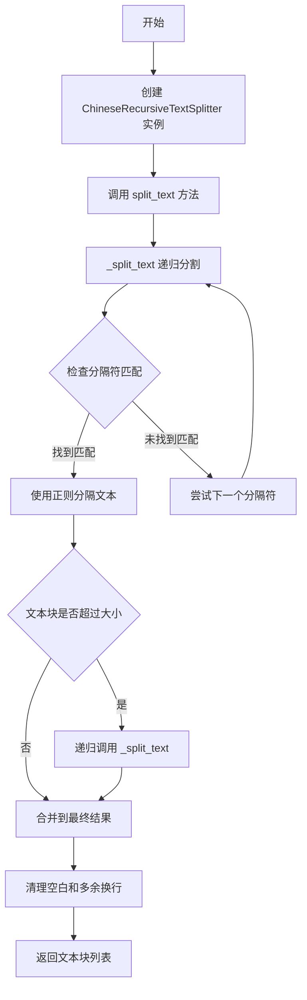
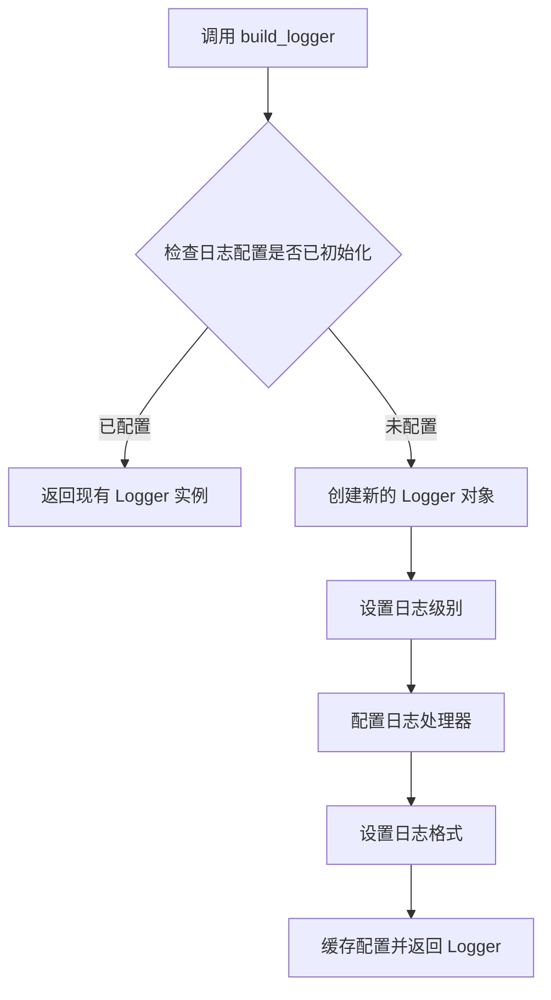
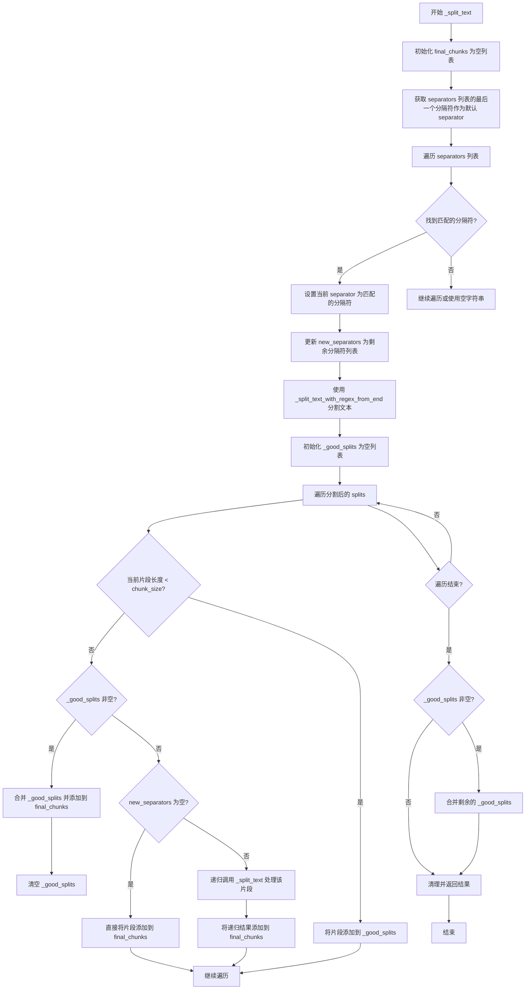

# `Langchain-Chatchat\libs\chatchat-server\chatchat\server\file_rag\text_splitter\chinese_recursive_text_splitter.py` 详细设计文档

这是一个中文递归文本分割器，继承自 langchain 的 RecursiveCharacterTextSplitter，专门针对中文文本特点优化，使用预定义的中英文分隔符列表（包括句号、逗号、换行等）递归地将长文本分割成符合指定大小要求的文本块，同时支持正则表达式分隔符和分隔符保留功能。

## 整体流程



## 类结构

```
RecursiveCharacterTextSplitter (langchain.base)
└── ChineseRecursiveTextSplitter (本地实现)
```

## 全局变量及字段


### `logger`
    
全局日志记录器对象，用于记录程序运行过程中的日志信息

类型：`logging.Logger`
    


### `ls`
    
测试用中文文本列表，包含用于测试文本分割功能的中文内容

类型：`List[str]`
    


### `ChineseRecursiveTextSplitter._separators`
    
分隔符列表，按优先级排序，用于文本分割时尝试使用的分隔符序列

类型：`List[str]`
    


### `ChineseRecursiveTextSplitter._is_separator_regex`
    
是否将分隔符视为正则表达式，True表示分隔符是正则表达式模式

类型：`bool`
    


### `ChineseRecursiveTextSplitter._keep_separator`
    
是否在结果中保留分隔符，True表示分割后的文本块保留分隔符

类型：`bool`
    


### `ChineseRecursiveTextSplitter._chunk_size`
    
文本块的最大长度，超过此长度的文本将进行进一步分割

类型：`int`
    


### `ChineseRecursiveTextSplitter._chunk_overlap`
    
文本块之间的重叠字符数，用于保持相邻文本块之间的上下文连贯性

类型：`int`
    


### `ChineseRecursiveTextSplitter._length_function`
    
计算文本长度的函数，用于判断文本是否超过指定的块大小

类型：`Callable`
    
    

## 全局函数及方法


### `_split_text_with_regex_from_end`

该函数是一个文本分割辅助函数，使用正则表达式从文本末尾进行分割，支持可选地保留分隔符在结果中。

参数：

- `text`：`str`，要分割的原始文本
- `separator`：`str`，用于分割文本的正则表达式分隔符
- `keep_separator`：`bool`，是否在结果中保留分隔符

返回值：`List[str]`，分割后的文本片段列表

#### 流程图

```mermaid
flowchart TD
    A[开始分割文本] --> B{separator是否存在?}
    B -->|是| C{keep_separator?}
    B -->|否| H[逐字符分割文本]
    C -->|是| D[使用捕获组分割: re.split/f'({separator})'/]
    C -->|否| G[直接分割: re.split/separator/]
    D --> E[合并相邻元素: zip/_splits[0::2] 和 _splits[1::2]/]
    E --> F{分割数量为奇数?}
    F -->|是| I[添加最后一个元素]
    F -->|否| J
    G --> K
    H --> K
    I --> K
    J --> K
    K[过滤空字符串]
    K --> L[返回结果列表]
```

#### 带注释源码

```python
def _split_text_with_regex_from_end(
    text: str, separator: str, keep_separator: bool
) -> List[str]:
    # Now that we have the separator, split the text
    # 检查是否提供了分隔符
    if separator:
        # 根据是否保留分隔符选择不同的分割策略
        if keep_separator:
            # The parentheses in the pattern keep the delimiters in the result.
            # 使用捕获组使分隔符也包含在结果中
            # 模式: (separator) 会将分隔符作为独立元素保留
            _splits = re.split(f"({separator})", text)
            # 使用 zip 将分隔符与前一个文本片段配对，然后合并
            # _splits[0::2] 获取所有文本片段
            # _splits[1::2] 获取所有分隔符
            splits = ["".join(i) for i in zip(_splits[0::2], _splits[1::2])]
            # 如果分割结果数量为奇数，说明末尾有一个文本片段没有对应的分隔符
            # 需要将其单独添加
            if len(_splits) % 2 == 1:
                splits += _splits[-1:]
            # splits = [_splits[0]] + splits
        else:
            # 不保留分隔符，直接按分隔符分割
            splits = re.split(separator, text)
    else:
        # 没有分隔符时，逐字符分割
        splits = list(text)
    # 过滤掉空字符串，返回非空结果
    return [s for s in splits if s != ""]
```


### `build_logger`

导入的日志构建工具函数，用于创建并配置项目专用的日志记录器，支持日志级别、格式和输出目标的统一管理。

参数：

- 该函数无显式参数调用（使用默认配置）

返回值：`logging.Logger`，返回配置好的日志记录器实例，可用于模块级别的日志记录。

#### 流程图



#### 带注释源码

```python
# 从 chatchat.utils 模块导入 build_logger 函数
from chatchat.utils import build_logger

# 调用 build_logger() 创建模块级日志记录器
# 注意：由于 build_logger 定义在外部模块 (chatchat.utils) 中，
# 其完整源码不在当前文件中。以下为调用方的使用方式：
logger = build_logger()

# 后续可使用 logger 进行日志记录
# logger.info("信息日志")
# logger.error("错误日志")
```

---

## 补充说明

### 1. 代码整体运行流程

该脚本实现了一个中文文本分割器 `ChineseRecursiveTextSplitter`，继承自 LangChain 的 `RecursiveCharacterTextSplitter`。运行流程如下：

1. 导入日志构建工具 `build_logger` 并初始化日志记录器
2. 定义辅助函数 `_split_text_with_regex_from_end` 用于正则分割文本
3. 定义 `ChineseRecursiveTextSplitter` 类，重写 `_split_text` 方法实现中文智能分块
4. 在 `__main__` 中演示分割效果

### 2. 潜在的技术债务或优化空间

| 名称 | 描述 |
|------|------|
| **硬编码分隔符** | 中文字符串分隔符列表在 `__init__` 中硬编码，可考虑外部配置化 |
| **正则表达式性能** | 循环中多次调用 `re.search` 和 `re.split`，可考虑预编译正则 |
| **日志初始化位置** | `build_logger` 在模块顶层调用，建议延迟初始化以提高导入速度 |

### 3. 外部依赖

- `logging`: Python 标准库日志模块
- `re`: Python 标准库正则表达式
- `typing`: Python 类型提示
- `langchain.text_splitter.RecursiveCharacterTextSplitter`: LangChain 文本分割器基类
- `chatchat.utils.build_logger`: 项目内部日志工具函数（未在当前文件中实现）

---

> **注意**: `build_logger` 函数的完整源码位于 `chatchat.utils` 模块中，当前代码片段仅展示其导入和调用方式。如需查看该函数的详细实现，请查阅 `chatchat/utils.py` 源文件。


### `ChineseRecursiveTextSplitter.__init__`

该构造函数是 `ChineseRecursiveTextSplitter` 类的初始化方法，用于创建适合中文文本分割的文本分割器实例。它继承自 `RecursiveCharacterTextSplitter`，并针对中文语言特性配置了默认的分隔符列表，同时支持自定义分隔符、分隔符保留选项以及分隔符是否为正则表达式模式。

参数：

- `separators`：`Optional[List[str]]`，可选的分隔符列表，用于指定文本分割的优先级顺序，默认为 `None`，当为 `None` 时使用内置的中文默认分隔符列表
- `keep_separator`：`bool`，是否在分割后的文本块中保留分隔符，默认为 `True`
- `is_separator_regex`：`bool`，指定分隔符是否为正则表达式模式，默认为 `True`
- `**kwargs`：`Any`，接收父类 `RecursiveCharacterTextSplitter` 的额外关键字参数，如 `chunk_size`、`chunk_overlap`、`length_function` 等

返回值：`None`，该方法为构造函数，不返回任何值

#### 流程图

```mermaid
flowchart TD
    A[开始 __init__] --> B{separators 是否为 None?}
    B -->|是| C[使用内置中文默认分隔符列表]
    B -->|否| D[使用传入的 separators 参数]
    C --> E[调用父类构造函数 super().__init__]
    D --> E
    E --> F[初始化 self._separators]
    F --> G[初始化 self._is_separator_regex]
    G --> H[结束 __init__]
    
    style A fill:#f9f,stroke:#333
    style H fill:#9f9,stroke:#333
```

#### 带注释源码

```python
def __init__(
    self,
    separators: Optional[List[str]] = None,
    keep_separator: bool = True,
    is_separator_regex: bool = True,
    **kwargs: Any,
) -> None:
    """Create a new TextSplitter."""
    # 调用父类 RecursiveCharacterTextSplitter 的构造函数
    # 传入 keep_separator 参数和其他可选参数
    super().__init__(keep_separator=keep_separator, **kwargs)
    
    # 初始化分隔符列表
    # 如果未提供 separators，则使用默认的中文分隔符列表
    # 默认分隔符按优先级从高到低排列：
    # 1. \n\n - 段落分隔（双换行）
    # 2. \n - 换行符
    # 3. 。|！|？ - 中文句子结束标点
    # 4. \.\s|\!\s|\?\s - 英文句子结束标点（带空格）
    # 5. ；|;\s - 中文/英文分号
    # 6. ，|,\s - 中文/英文逗号
    self._separators = separators or [
        "\n\n",
        "\n",
        "。|！|？",
        "\.\s|\!\s|\?\s",
        "；|;\s",
        "，|,\s",
    ]
    
    # 初始化分隔符是否为正则表达式的标志
    # 当为 True 时，分隔符将作为正则表达式进行匹配
    self._is_separator_regex = is_separator_regex
```


### `ChineseRecursiveTextSplitter._split_text`

这是一个核心递归分割方法，通过遍历预定义的中英文分隔符列表，依次尝试使用匹配的分隔符对文本进行分割，当片段长度超过 chunk_size 时，递归调用自身使用更细粒度的分隔符进行再次分割，直到得到符合大小要求的文本块。

参数：

-  `text`：`str`，需要分割的输入文本
-  `separators`：`List[str]`，用于递归分割的分隔符列表，按优先级从低到高排列

返回值：`List[str]`，分割后的文本块列表

#### 流程图



#### 带注释源码

```python
def _split_text(self, text: str, separators: List[str]) -> List[str]:
    """Split incoming text and return chunks."""
    # 用于存储最终分割结果的列表
    final_chunks = []
    
    # 获取 appropriate separator to use
    # 默认使用最后一个分隔符
    separator = separators[-1]
    new_separators = []
    
    # 遍历分隔符列表，查找第一个在文本中匹配的分隔符
    for i, _s in enumerate(separators):
        # 如果是 regex 模式，直接使用；否则转义
        _separator = _s if self._is_separator_regex else re.escape(_s)
        if _s == "":
            # 空字符串分隔符，直接使用
            separator = _s
            break
        if re.search(_separator, text):
            # 找到匹配的分隔符
            separator = _s
            # 剩余的分隔符用于递归分割
            new_separators = separators[i + 1 :]
            break

    # 根据是否保留分隔符来处理分割
    _separator = separator if self._is_separator_regex else re.escape(separator)
    # 使用正则从末尾分割文本
    splits = _split_text_with_regex_from_end(text, _separator, self._keep_separator)

    # Now go merging things, recursively splitting longer texts.
    # 用于存储符合长度要求的片段
    _good_splits = []
    # 设置合并分隔符
    _separator = "" if self._keep_separator else separator
    
    # 遍历所有分割后的片段
    for s in splits:
        if self._length_function(s) < self._chunk_size:
            # 片段长度小于阈值，暂存到 _good_splits
            _good_splits.append(s)
        else:
            # 片段长度超出阈值
            if _good_splits:
                # 先合并之前积累的符合要求的片段
                merged_text = self._merge_splits(_good_splits, _separator)
                final_chunks.extend(merged_text)
                # 重置 _good_splits
                _good_splits = []
            
            if not new_separators:
                # 没有更细粒度的分隔符了，直接添加
                final_chunks.append(s)
            else:
                # 递归使用更细粒度的分隔符处理该片段
                other_info = self._split_text(s, new_separators)
                final_chunks.extend(other_info)
    
    # 处理最后剩余的符合要求的片段
    if _good_splits:
        merged_text = self._merge_splits(_good_splits, _separator)
        final_chunks.extend(merged_text)
    
    # 清理结果：移除多余空行，将 2 个以上换行符替换为 1 个
    return [
        re.sub(r"\n{2,}", "\n", chunk.strip())
        for chunk in final_chunks
        if chunk.strip() != ""
    ]
```

## 关键组件


### ChineseRecursiveTextSplitter 类

这是一个专门用于中文文本分割的类，继承自 LangChain 的 `RecursiveCharacterTextSplitter`。它通过预定义的中文和英文标点符号分隔符列表，递归地将长文本分割成指定大小的块，同时保留分隔符并处理连续空行。

### 正则表达式分割函数

`_split_text_with_regex_from_end` 是一个辅助函数，使用正则表达式从文本末尾开始分割，支持保留或移除分隔符。

### 分隔符配置

`_separators` 是预定义的分隔符列表，按优先级从高到低排列，包括中文标点（如句号、逗号、分号）和英文标点（如句点、逗号）。

### 文本递归分割逻辑

`_split_text` 方法实现了核心的递归分割算法，它遍历分隔符列表，对每个分隔符进行正则匹配，然后根据块大小决定是否需要进一步递归分割。

### 块合并与后处理

`_merge_splits` 方法（继承自父类）用于合并分割后的块，最终通过正则表达式清理连续的换行符。


## 问题及建议


### 已知问题

- **正则表达式与普通字符串混合处理逻辑混乱**：第37行 `_separator = _s if self._is_separator_regex else re.escape(_s)` 的逻辑存在缺陷。当 `is_separator_regex=True` 时，非正则表达式的分隔符（如 `\n\n`）会被直接当作正则表达式处理，可能导致意外匹配
- **分隔符列表配置不够灵活**：硬编码的中文分隔符列表（如 `"。|！|？"`, `"\.\s|\!\s|\?\s"`）与普通分隔符混合，且 `is_separator_regex` 作为实例级配置，无法为不同分隔符设置不同的正则模式
- **长度检查未考虑编码差异**：仅使用 `_length_function(s)` 计算长度，未考虑中文字符占用的字节数与字符数的差异，可能导致实际 chunk 大小超出预期
- **`_split_text_with_regex_from_end` 函数对空分隔符处理不当**：当 `separator=""` 时直接返回 `list(text)`，这与父类的递归分割逻辑可能不兼容
- **继承依赖风险**：直接继承 `langchain.text_splitter.RecursiveCharacterTextSplitter`，父类实现的任何变更都可能影响当前类的稳定性
- **缺少单元测试**：没有针对中文特殊场景（如混合中英文、标点符号密集文本）的测试用例
- **日志记录不完善**：虽然导入了 `logger`，但实际代码中未使用日志记录关键操作和异常情况
- **变量命名不一致**：实例变量使用 `_separators` 和 `_is_separator_regex`（私有风格），但其他属性（如 `keep_separator`）直接暴露

### 优化建议

- **重构分隔符处理逻辑**：将 `is_separator_regex` 改为逐个分隔符的配置，或提供两个独立的分隔符列表分别存储正则和普通分隔符
- **增强长度计算兼容性**：为中文场景提供基于字符数的 `_length_function` 默认实现，或添加编码感知的分块策略
- **添加边界情况处理**：针对空文本、纯符号文本、极端长度文本等边界情况增加显式处理和测试
- **考虑组合模式**：允许用户通过参数控制中英文分隔符的优先级，例如设置 `language='chinese'` 时优先使用中文标点
- **补充单元测试**：覆盖各种中文文本场景，包括多段落、混合语言、特殊符号等
- **添加日志和错误处理**：在关键路径（如分割失败、长度超限）添加日志记录和异常抛出
- **解耦依赖**：考虑使用组合而非继承，或提供抽象基类以降低对父类实现的耦合

## 其它


### 设计目标与约束

本模块的设计目标是为中文文本提供智能分块功能，支持多种中文标点符号作为分隔符，继承LangChain的RecursiveCharacterTextSplitter实现递归分词，确保分块结果符合指定的chunk_size和chunk_overlap参数约束。

### 错误处理与异常设计

代码中主要通过正则表达式搜索结果判断是否匹配分隔符，若无匹配则继续使用下一个分隔符。当文本长度小于chunk_size时直接加入结果，否则递归处理。异常情况包括：空文本输入返回空列表、分隔符列表为空时按单字符分割、正则表达式编译失败时使用原始分隔符。

### 数据流与状态机

文本分块的流程为：1)输入原始文本和分隔符列表；2)从分隔符列表末尾开始查找匹配的分隔符；3)使用匹配的分隔符分割文本；4)对每个分割结果检查长度，若小于chunk_size则加入最终结果，否则递归使用剩余分隔符继续分割；5)最后清理多余换行符并过滤空块。

### 外部依赖与接口契约

主要依赖包括：langchain.text_splitter.RecursiveCharacterTextSplitter提供基础分词框架，re模块处理正则表达式分割，typing提供类型注解，chatchat.utils.build_logger获取日志记录器。外部接口为ChineseRecursiveTextSplitter类，需传入chunk_size（分块大小）、chunk_overlap（重叠大小）、keep_separator（是否保留分隔符）、is_separator_regex（分隔符是否为正则表达式）等参数。

### 配置参数说明

separators参数默认为中文分隔符列表：双换行、单换行、中文标点组合（。|！|？）、英文标点加空格（\.\s|\!\s|\?\s）、分号（；|;\s）、逗号（，|,\s）。keep_separator默认为True保留分隔符，is_separator_regex默认为True将分隔符视为正则表达式。

### 性能考虑与优化点

当前实现中每次递归都重新编译正则表达式，可考虑缓存已编译的正则对象。_split_text_with_regex_from_end函数中使用zip配对可能产生额外内存开销，当处理超长文本时可考虑流式处理。此外，正则替换re.sub在最终清理步骤可考虑合并到递归流程中减少遍历次数。

### 安全性考虑

代码主要处理文本分割，无直接安全风险。但需注意：1)用户输入的chunk_size需做数值范围校验避免内存溢出；2)正则表达式来自separators参数需防止恶意正则导致ReDoS攻击；3)建议对超长文本输入设置长度限制。

### 版本兼容性与维护

依赖langchain版本需保持兼容，建议在requirements中指定版本范围。当前代码仅在__main__中包含测试用例，建议添加完整的单元测试覆盖边界情况。类继承自langchain.text_splitter需关注上游库API变化，建议添加版本检测或抽象基类。

### 使用示例与测试用例

代码在__main__块中提供了基本测试，测试文本包含中文报告内容。补充测试用例应包括：1)纯英文文本分块；2)仅包含标点符号的文本；3)空字符串输入；4)单字符文本；5)分隔符全部不匹配的长文本；6)chunk_size为极小值（如1）的情况。

### 维护建议与扩展性

建议添加的配置选项包括：自定义分隔符支持、从文件加载分隔符列表、多语言分隔符预置配置。可扩展方向：1)支持自定义长度计算函数；2)支持自定义合并策略；3)添加流式处理接口；4)支持输出多种格式（JSON、DataFrame等）。


    