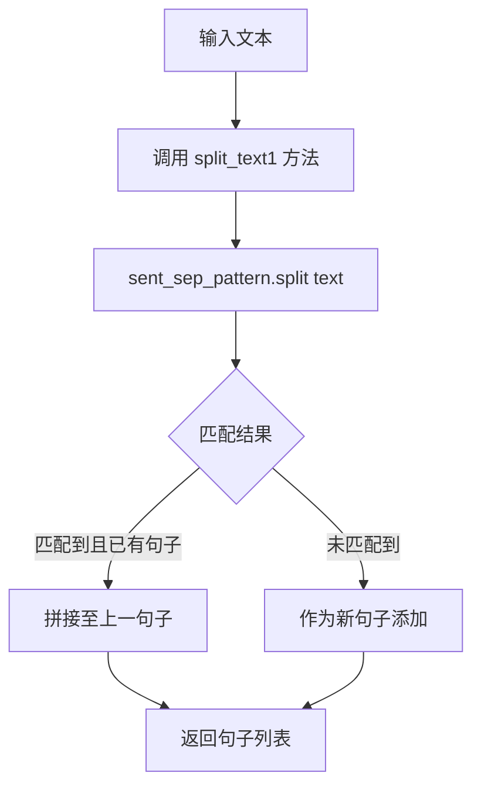
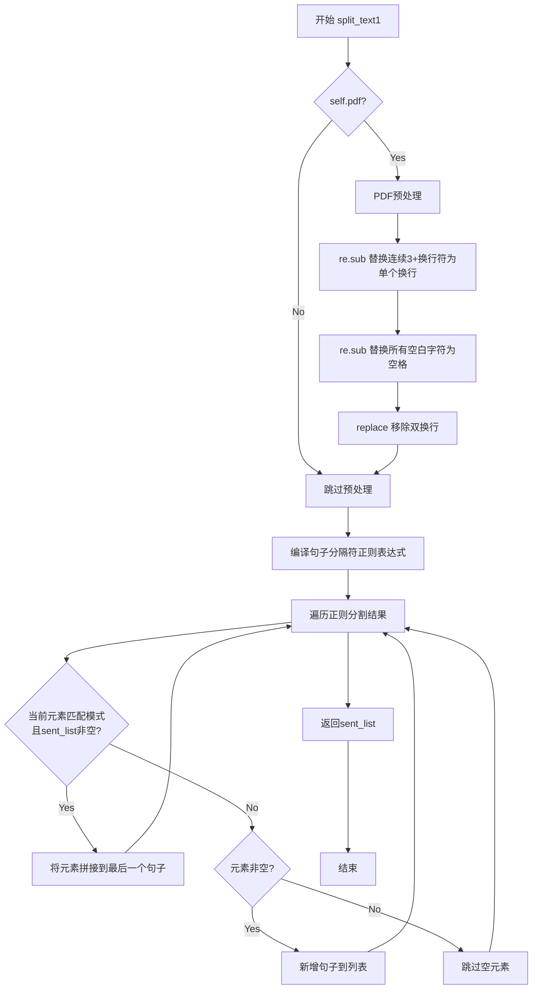

# `Langchain-Chatchat\libs\chatchat-server\chatchat\server\file_rag\text_splitter\chinese_text_splitter.py` 详细设计文档

这是一个中文文本分割器类，继承自langchain的CharacterTextSplitter，用于将中文文本按句子分割成列表，支持PDF文本预处理和可配置的句子最大长度。

## 整体流程

```mermaid
graph TD
    A[开始 split_text] --> B{是否PDF模式?}
    B -- 是 --> C[预处理文本: 替换多余换行符]
    B -- 否 --> D[直接进行断句处理]
    C --> D
    D --> E[单字符断句: ;；.!?。！？\?]
    E --> F[处理英文省略号 \.{6}]
    F --> G[处理中文省略号 \…{2}]
    G --> H[处理双引号前的终止符]
    H --> I[按换行符分割并过滤空行]
    I --> J{存在超过sentence_size的句子?}
    J -- 否 --> K[返回句子列表]
    J -- 是 --> L[递归拆分过长句子]
    L --> J
```

## 类结构

```
CharacterTextSplitter (langchain父类)
└── ChineseTextSplitter (子类)
```

## 全局变量及字段


### `ChineseTextSplitter.pdf`
    
是否处理PDF文本的标志，启用时会进行额外的文本清理

类型：`bool`
    


### `ChineseTextSplitter.sentence_size`
    
单个句子的最大字符数，用于控制分割后文本块的大小

类型：`int`
    
    

## 全局函数及方法


### `re.sub` (正则替换函数)

该函数是 Python `re` 模块中的核心函数，用于使用正则表达式匹配并替换字符串中的文本。在 `ChineseTextSplitter` 类中，主要用于对中文文本进行预处理和智能分句，通过多种正则规则在特定位置插入换行符 `\n` 以实现句子边界识别。

#### 参数信息汇总

| 参数名称 | 参数类型 | 参数描述 |
|---------|---------|---------|
| pattern | str 或 Pattern 对象 | 正则表达式模式，定义要匹配的文本特征 |
| repl | str 或 callable | 替换文本，可以是字符串或可调用对象 |
| string | str | 要进行替换操作的原始文本 |

#### 各类场景中的 `re.sub` 调用详情

##### 场景 1：PDF 文本预处理 (split_text1 和 split_text 共有)

```python
# 1. 合并连续换行符（3个及以上）
re.sub(r"\n{3,}", r"\n", text)

# 2. 统一空白字符为单个空格
re.sub("\s", " ", text)

# 3. 移除双换行符（仅 split_text1）
re.sub("\n\n", "", text)
```

##### 场景 2：基础中文分句

```python
# 单字符断句符后插入换行
re.sub(r"([;；.!?。！？\?])([^"'"'"'"''""''])", r"\1\n\2", text)

# 英文省略号(...)后插入换行
re.sub(r'(\.{6})([^"'"'"'"''""''])', r"\1\n\2", text)

# 中文省略号(……)后插入换行
re.sub(r'(\…{2})([^"'"'"'"''""''])', r"\1\n\2", text)

# 终止符+双引号组合后插入换行
re.sub(r'([;；!?。！？\?]["'"'"'"''""'']{0,2})([^;；!?，。！？\?])', r"\1\n\2", text)
```

##### 场景 3：长句子递归拆分

```python
# 逗号+双引号组合后插入换行
re.sub(r'([,，.]["'"'"'"''""'']{0,2})([^,，.])', r"\1\n\2", ele)

# 换行符或双空格+双引号后插入换行
re.sub(r'([\n]{1,}| {2,}["'"'"'"''""'']{0,2})([^\s])', r"\1\n\2", ele_ele1)

# 双引号+空格组合后插入换行
re.sub('( ["'"'"'"''""'']{0,2})([^ ])', r"\1\n\2", ele_ele2)
```

#### 流程图

```mermaid
flowchart TD
    A[输入原始文本] --> B{PDF模式?}
    B -->|Yes| C[re.sub 预处理]
    B -->|No| D[基础分句处理]
    
    C --> C1[合并连续换行符\n{3,}->\n]
    C1 --> C2[统一空白字符\s-> ]
    C2 --> C3[移除双换行符\n\n->空]
    
    D --> D1[单字符断句符后加\n]
    D1 --> D2[英文省略号后加\n]
    D2 --> D3[中文省略号后加\n]
    D3 --> D4[终止符+双引号后加\n]
    
    C --> E[文本拆分成长句列表]
    D --> E
    E --> F{存在长句?}
    F -->|Yes| G[递归拆分长句]
    F -->|No| H[返回句子列表]
    
    G --> G1[逗号+双引号后加\n]
    G1 --> G2[换行/双空格+双引号后加\n]
    G2 --> G3[双引号+空格后加\n]
    G3 --> G4[更新列表]
    G4 --> F
    
    style C1 fill:#f9f,stroke:#333
    style C2 fill:#f9f,stroke:#333
    style C3 fill:#f9f,stroke:#333
    style D1 fill:#9ff,stroke:#333
    style D2 fill:#9ff,stroke:#333
    style D3 fill:#9ff,stroke:#333
    style D4 fill:#9ff,stroke:#333
    style G1 fill:#ff9,stroke:#333
    style G2 fill:#ff9,stroke:#333
    style G3 fill:#ff9,stroke:#333
```

#### 带注释源码

```python
import re
from typing import List

# ============================================================
# re.sub 函数在各场景中的典型使用模式
# ============================================================

# ------------------------------------------------------------
# 场景1: PDF文本清洗（用于 split_text1 和 split_text 方法）
# ------------------------------------------------------------

# 模式1: 合并连续换行符
#   将3个或更多连续换行符替换为单个换行符
#   用于去除PDF中的多余空行
text = re.sub(r"\n{3,}", r"\n", text)

# 模式2: 空白字符统一
#   将所有类型的空白字符（包括空格、制表符等）替换为单个空格
#   用于规范化文本中的空格使用
text = re.sub("\s", " ", text)

# 模式3: 移除双换行符
#   直接删除连续的换行符（两个\n）
#   进一步清理PDF格式带来的多余换行
text = re.sub("\n\n", "", text)


# ------------------------------------------------------------
# 场景2: 基础中文分句（用于 split_text 方法）
# ------------------------------------------------------------

# 模式4: 单字符断句符后换行
#   在 ;；.!?。！？? 这些终止符后插入换行符
#   但跳过双引号后的情况（通过 [^"'"'"'"''""''] 否定前向查找实现）
text = re.sub(r"([;；.!?。！？\?])([^"'"'"'"''""''])", r"\1\n\2", text)

# 模式5: 英文省略号后换行
#   处理英文6点省略号 (...) 后面的内容
#   避免将双引号断开
text = re.sub(r'(\.{6})([^"'"'"'"''""''])', r"\1\n\2", text)

# 模式6: 中文省略号后换行
#   处理中文双点省略号 (…) 后面的内容
text = re.sub(r'(\…{2})([^"'"'"'"''""''])', r"\1\n\2", text)

# 模式7: 终止符+引号组合后换行
#   处理 "句子结束符 + 引号 + 非终止符" 的情况
#   确保引号不被错误断开
text = re.sub(
    r'([;；!?。！？\?]["'"'"'"''""'']{0,2})([^;；!?，。！？\?])', 
    r"\1\n\2", 
    text
)


# ------------------------------------------------------------
# 场景3: 长句子递归拆分（用于 split_text 方法的循环中）
# ------------------------------------------------------------

# 模式8: 逗号+双引号后换行（第一层拆分）
#   当句子长度超过 sentence_size 时，在逗号处断开
ele1 = re.sub(r'([,，.]["'"'"'"''""'']{0,2})([^,，.])', r"\1\n\2", ele)

# 模式9: 换行符或双空格+双引号后换行（第二层拆分）
#   处理第一层拆分后仍过长的句子
ele_ele2 = re.sub(
    r'([\n]{1,}| {2,}["'"'"'"''""'']{0,2})([^\s])',
    r"\1\n\2",
    ele_ele1,
)

# 模式10: 双引号+空格后换行（第三层拆分）
#   最终层级的拆分，确保不再继续细分
ele_ele3 = re.sub(
    '( ["'"'"'"''""'']{0,2})([^ ])', 
    r"\1\n\2", 
    ele_ele2
)
```


### `ChineseTextSplitter.split_text1` 方法中的局部变量 `sent_sep_pattern`

该正则表达式用于匹配中文句子分隔符，包括句末标点符号（。！？等）及其后方可选的双引号变体（」』等），或字符串边界处的引号（「『等），实现对中文文本的句子级别分割。

参数：不适用（局部变量，非函数参数）

返回值：不适用（局部变量，无返回值）

#### 流程图



#### 带注释源码

```python
# 句子分隔符正则表达式
# 匹配规则：
#   1. [﹒ＯＫ；﹖﹗．。！？]["'"'"」』]{0,2}  - 匹配句末分隔符（﹒﹖﹗．。！？）后跟0-2个右引号（」』）
#   2. (?=["'"'"「『]{1,2}|$)               - 匹配左引号（「『）前或字符串结尾位置
# 注意：del 表示删除的字符，这里是冒号和分号（:；）不在分隔符范围内
sent_sep_pattern = re.compile(
    '([﹒Ｋ9；﹖﹗．。！？]["'"'"」』]{0,2}|(?=["'"'"「『]{1,2}|$))'
)
```


### `ChineseTextSplitter.__init__`

这是 `ChineseTextSplitter` 类的构造函数，用于初始化文本分割器的实例。方法接受 PDF 标志和句子大小参数，调用父类构造函数并设置实例属性，用于后续文本分割处理。

参数：

- `pdf`：`bool`，默认为 `False`，标识处理对象是否为 PDF 文档
- `sentence_size`：`int`，默认为 `250`，设置句子最大长度阈值，用于控制分割粒度
- `**kwargs`：可变关键字参数，传递给父类 `CharacterTextSplitter` 的额外配置参数

返回值：`None`，构造函数无返回值

#### 流程图

```mermaid
flowchart TD
    A[开始 __init__] --> B[接收 pdf, sentence_size, **kwargs]
    B --> C[调用 super().__init__**kwargs]
    C --> D[设置 self.pdf = pdf]
    D --> E[设置 self.sentence_size = sentence_size]
    E --> F[结束 __init__]
```

#### 带注释源码

```python
def __init__(self, pdf: bool = False, sentence_size: int = 250, **kwargs):
    """
    初始化 ChineseTextSplitter 实例
    
    参数:
        pdf: bool - 是否处理PDF文档的标志，影响文本预处理方式
        sentence_size: int - 句子最大字符数，超过该长度会进行进一步分割
        **kwargs: 传递给父类 CharacterTextSplitter 的额外参数
    """
    super().__init__(**kwargs)  # 调用父类构造函数，传递关键字参数
    self.pdf = pdf              # 存储PDF处理标志
    self.sentence_size = sentence_size  # 存储句子大小阈值
```


### `ChineseTextSplitter.split_text1`

该方法实现了一个基于正则表达式的中文文本分割功能，通过预定义的句子分隔符模式（中文标点符号如句号、问号、感叹号等及其配合的引号）将输入的文本拆分为句子列表。对于PDF格式的文本，还会进行预处理以规范化换行和空白字符。

参数：

- `self`：`ChineseTextSplitter`，调用该方法的类实例本身，包含 `pdf` 和 `sentence_size` 属性
- `text`：`str`，需要被分割的中文文本字符串

返回值：`List[str]`，分割后的句子列表，每个元素为一个句子字符串

#### 流程图



#### 带注释源码

```python
def split_text1(self, text: str) -> List[str]:
    """
    使用正则表达式进行简单的中文句子分割
    
    该方法根据中文标点符号（句号、问号、感叹号等）及其配合的引号来识别句子边界，
    并将文本分割成句子列表。适用于处理普通文本或经过预处理的PDF文本。
    
    Args:
        text: 需要分割的中文文本字符串
        
    Returns:
        分割后的句子列表，每个元素为一个完整的句子
    """
    # 如果是PDF文本，先进行预处理以规范化格式
    if self.pdf:
        # 将连续3个及以上的换行符替换为单个换行符
        # 减少PDF中过多的空行
        text = re.sub(r"\n{3,}", "\n", text)
        # 将所有空白字符（包括空格、制表符等）替换为单个空格
        text = re.sub("\s", " ", text)
        # 移除双换行符，进一步清理格式
        text = text.replace("\n\n", "")
    
    # 定义句子分隔符正则表达式模式
    # 匹配规则：
    #   - [﹒妳﹖﹗．。！？] : 中文句末标点符号（句号、顿号、分号、冒号、问号、感叹号等）
    #   - ["'"』]{0,2} : 后面可能跟0-2个引号（双引号、单引号、右引号等）
    #   - | : 或者
    #   - (?=["'"「『]{1,2}|$) : 前面是引号（1-2个）或字符串开头/结尾（用于句首的引号）
    sent_sep_pattern = re.compile(
        '([﹒妳﹖﹗．。！？]["'"』]{0,2}|(?=["'"「『]{1,2}|$))'
    )  # del ：；
    
    # 存储分割后的句子列表
    sent_list = []
    
    # 使用正则表达式分割文本
    # split()会在每个匹配项处分割，返回非匹配部分的列表
    for ele in sent_sep_pattern.split(text):
        # 如果当前元素匹配分隔符模式且已有句子列表
        # 说明这是句末标点+引号的情况，应与前一句合并
        if sent_sep_pattern.match(ele) and sent_list:
            # 将当前元素拼接到最后一个句子的末尾
            sent_list[-1] += ele
        # 如果元素非空且不匹配模式，则是新的句子内容
        elif ele:
            # 添加新句子到列表
            sent_list.append(ele)
    
    # 返回分割完成的句子列表
    return sent_list
```


### ChineseTextSplitter.split_text

该方法是 `ChineseTextSplitter` 类的核心文本分割方法，通过多轮正则表达式替换实现中文文本的句子分割，并支持对超过指定长度阈值的句子进行递归细粒度拆分，适用于处理各类中文文档的语义分句需求。

#### 参数

- `text`：`str`，需要分割的原始文本内容

#### 返回值

`List[str]`，分割后的句子列表，每个元素为独立的句子字符串

#### 流程图

```mermaid
flowchart TD
    A[开始 split_text] --> B{self.pdf == True?}
    B -- 是 --> C[PDF文本预处理]
    B -- 否 --> D[跳过预处理]
    C --> D
    
    D --> E[第一轮正则替换: 单字符断句符后加换行]
    E --> F[第二轮正则替换: 英文省略号后加换行]
    F --> G[第三轮正则替换: 中文省略号后加换行]
    G --> H[第四轮正则替换: 双引号前终止符后加换行]
    H --> I[去除段尾多余换行符]
    I --> J[按换行符分割成句子列表 ls]
    
    J --> K{遍历句子 ele}
    K --> L{len(ele) > self.sentence_size?}
    L -- 否 --> M[继续下一句子]
    L -- 是 --> N[第一层拆分: 按逗号/句号拆分]
    N --> O{拆分后仍超长?}
    O -- 否 --> P[继续下一句子]
    O -- 是 --> Q[第二层拆分: 按换行/空格拆分]
    
    Q --> R{拆分后仍超长?}
    R -- 否 --> S[继续下一句子]
    R -- 是 --> T[第三层拆分: 按空格拆分]
    T --> U[更新句子列表]
    U --> M
    
    M --> V{还有更多句子?}
    V -- 是 --> K
    V -- 否 --> W[返回最终句子列表 ls]
    
    style L fill:#f9f,color:#000
    style O fill:#f9f,color:#000
    style R fill:#f9f,color:#000
```

#### 带注释源码

```python
def split_text(self, text: str) -> List[str]:  ##此处需要进一步优化逻辑
    # ====== PDF文档预处理 ======
    if self.pdf:
        # 将连续3个及以上换行符压缩为单个换行符，减少冗余空行
        text = re.sub(r"\n{3,}", r"\n", text)
        # 将所有空白字符（空格、Tab等）统一替换为空格
        text = re.sub("\s", " ", text)
        # 移除双换行符（段落分隔标记）
        text = re.sub("\n\n", "", text)

    # ====== 第一轮：单字符断句符后插入换行 ======
    # 匹配 ; ； . ! ? 。 ！？ ? 等单字符断句符
    # 在其后面插入换行符，但保留其后的双引号/单引号等标点
    # 示例: "你好。" -> "你好。\n"
    text = re.sub(r"([;；.!?。！？\?])([^"'"'"'"''])", r"\1\n\2", text)

    # ====== 第二轮：英文省略号后插入换行 ======
    # 匹配连续6个英文句点（如 "......"）
    # 在省略号后插入换行，保留后续双引号/单引号
    text = re.sub(r'(\.{6})([^"'"'"'"''])', r"\1\n\2", text)

    # ====== 第三轮：中文省略号后插入换行 ======
    # 匹配连续2个中文省略号（如 "……"）
    # 在省略号后插入换行，保留后续双引号/单引号
    text = re.sub(r'(\…{2})([^"'"'"'"''])', r"\1\n\2", text)

    # ====== 第四轮：双引号前的终止符后插入换行 ======
    # 匹配终止符后跟双引号/单引号/「」『』等中文引号的情况
    # 将换行符放在引号之后，确保引号作为句子一部分被保留
    # 示例: "你好！" -> "你好！\n"（双引号前）
    text = re.sub(
        r'([;；!?。！？\?]["'"'"'"''"'"'"''"'"'"'']{0,2})([^;；!?，。！？\?])',
        r"\1\n\2",
        text
    )

    # 移除文本末尾多余的换行符，避免产生空句子
    text = text.rstrip()

    # ====== 按换行符分割文本 ======
    # 过滤掉空字符串，保留有效句子
    ls = [i for i in text.split("\n") if i]

    # ====== 递归拆分超长句子 ======
    for ele in ls:
        # 判断当前句子是否超过长度阈值
        if len(ele) > self.sentence_size:
            # ----- 第一层拆分：按逗号/句号拆分 -----
            # 匹配逗号、句号后跟引号的模式，在其后插入换行
            ele1 = re.sub(r'([,，.]["'"'"'"''"'"'"''"'"'"'']{0,2})([^,，.])', r"\1\n\2", ele)
            ele1_ls = ele1.split("\n")

            # 遍历第一层拆分结果
            for ele_ele1 in ele1_ls:
                # 判断拆分后是否仍超长
                if len(ele_ele1) > self.sentence_size:
                    # ----- 第二层拆分：按换行/多个空格拆分 -----
                    # 匹配换行符或连续2个及以上空格后跟非空格字符
                    ele_ele2 = re.sub(
                        r'([\n]{1,}| {2,}["'"'"'"''"'"'"''"'"'"'']{0,2})([^\s])',
                        r"\1\n\2",
                        ele_ele1,
                    )
                    ele2_ls = ele_ele2.split("\n")

                    # 遍历第二层拆分结果
                    for ele_ele2 in ele2_ls:
                        # 判断拆分后是否仍超长
                        if len(ele_ele2) > self.sentence_size:
                            # ----- 第三层拆分：按单个空格拆分 -----
                            # 匹配空格后跟非空格字符，强制拆分
                            ele_ele3 = re.sub(
                                '( ["'"'"'"''"'"'"''"'"'"'']{0,2})([^ ])',
                                r"\1\n\2",
                                ele_ele2
                            )
                            # 获取当前元素在列表中的位置
                            ele2_id = ele2_ls.index(ele_ele2)
                            # 替换为拆分后的子句子列表
                            ele2_ls = (
                                ele2_ls[:ele2_id]
                                + [i for i in ele_ele3.split("\n") if i]
                                + ele2_ls[ele2_id + 1:]
                            )

                    # 更新第一层拆分列表
                    ele_id = ele1_ls.index(ele_ele1)
                    ele1_ls = (
                        ele1_ls[:ele_id]
                        + [i for i in ele2_ls if i]
                        + ele1_ls[ele_id + 1:]
                    )

            # 更新原始句子列表
            id = ls.index(ele)
            ls = ls[:id] + [i for i in ele1_ls if i] + ls[id + 1:]

    # 返回最终分割结果
    return ls
```

## 关键组件


### ChineseTextSplitter 类

用于中文文本分割的类，继承自 CharacterTextSplitter，支持 PDF 格式文本处理和基于句子大小的分割策略。

### __init__ 方法

初始化 ChineseTextSplitter 实例，设置 pdf 标志和 sentence_size 参数，用于控制分割逻辑。

### split_text1 方法

基于正则表达式进行简单中文句子分割的方法，通过匹配句末标点符号和引号来切分文本，适用于基础场景。

### split_text 方法

核心分割方法，采用多规则正则替换实现精细化中文文本分割，处理单字符断句符、省略号、引号等复杂情况，并对超长句子进行递归子分割，但逻辑较复杂且存在优化空间。

### 正则表达式模式

预编译的正则表达式，用于匹配中文标点符号、引号和省略号，是分割逻辑的核心依赖。

### 潜在技术债务

- split_text 方法中多层嵌套循环和列表操作可能导致性能问题。
- 正则表达式规则复杂，难以维护和扩展。
- 缺乏单元测试，错误处理不明确。
- 注释中提到“此处需要进一步优化逻辑”，表明存在优化空间。


## 问题及建议


### 已知问题

- **方法职责不清**：`split_text1` 和 `split_text` 功能高度相似，且 `split_text1` 方法未被调用，存在代码冗余
- **正则表达式重复编译**：`sent_sep_pattern` 在 `split_text1` 方法内部定义，每次调用都会重新编译正则表达式，性能低下
- **嵌套层级过深**：`split_text` 方法中存在 4 层嵌套循环，导致代码可读性和可维护性极差
- **重复逻辑未复用**：PDF 文本预处理的逻辑（`re.sub` 替换）在两个方法中重复出现
- **变量命名不清晰**：`ele`、`ele1`、`ele2`、`ele3` 等命名无法表达实际含义，增加理解成本
- **缺少错误处理**：未对输入参数进行校验（如 `text` 为空或非字符串），可能导致异常
- **代码注释表明需优化**：方法注释明确写着"此处需要进一步优化逻辑"，说明技术债务已知
- **未使用父类能力**：继承自 `CharacterTextSplitter` 但未利用其 `split_text` 方法，直接重写实现
- **性能隐患**：在 `split_text` 中多次调用 `re.sub` 和字符串 `split`，对于大文本处理效率可能不佳
- **硬编码分割符**：标点符号分割规则硬编码在方法内部，难以扩展支持其他语言或自定义规则

### 优化建议

- **提取公共逻辑**：将 PDF 预处理逻辑抽取为私有方法 `_preprocess_pdf_text`，避免重复代码
- **预编译正则表达式**：将 `sent_sep_pattern` 定义为类属性或模块级常量，避免重复编译
- **重构嵌套循环**：使用递归或迭代方式替代多层嵌套，将 `split_text` 拆分为多个职责单一的方法
- **添加类型校验**：在方法入口添加参数校验，确保 `text` 为非空字符串
- **改进命名规范**：使用有意义的变量名，如 `sentence`、`chunk`、`sub_sentence` 等
- **考虑使用父类方法**：评估是否可以利用 `CharacterTextSplitter` 的能力，减少重复实现
- **添加文档字符串**：为类和关键方法添加文档说明，方便后续维护
- **抽取配置项**：将分割符规则提取为配置参数或类属性，提高可扩展性

## 其它


### 设计目标与约束

本模块的设计目标是为中文文本提供智能分割功能，支持PDF文档和普通文本两种模式，将长文本分割成指定句子大小的段落块。核心约束包括：sentence_size参数控制单句最大长度，默认250字符；仅支持UTF-8编码的中文文本；PDF模式下会进行额外的文本清洗处理。

### 错误处理与异常设计

代码未实现显式的异常处理机制。潜在异常场景包括：空文本输入时返回空列表；正则表达式匹配失败时返回原文本片段；text参数类型非字符串时可能抛出TypeError。建议在生产环境中添加输入类型校验和空值处理逻辑，确保传入参数为字符串类型且非空。

### 数据流与状态机

数据流处理分为两个阶段：预处理阶段和分割阶段。预处理阶段对PDF文本进行规范化处理（合并多余换行、替换空白字符）；分割阶段通过多轮正则匹配逐步细化分割粒度，从句号级别分割逐步细化到逗号、换行、空格级别。状态转换遵循：原始文本 → PDF清洗 → 句级分割 → 子句分割 → 最终结果列表。

### 外部依赖与接口契约

主要依赖langchain.text_splitter.CharacterTextSplitter基类，需确保langchain库版本兼容。接口契约：构造参数pdf（布尔值）、sentence_size（整数）；split_text/split_text1方法输入字符串返回字符串列表；方法均不修改原文本内容。

### 性能考虑

当前实现使用多轮正则替换和列表推导式，复杂度为O(n²)级别。对于超长文本（>10000字符），建议考虑使用正则表达式编译缓存（re.compile预编译）和流式处理方式优化性能。split_text1方法逻辑相对简单，性能优于split_text方法。

### 安全性考虑

代码未直接处理用户输入验证场景，不存在SQL注入等安全问题。但需注意：正则表达式需防止恶意输入导致的正则回溯（ReDoS）攻击，建议对text长度做上限限制（建议<1MB）。

### 测试策略

建议覆盖以下测试用例：空字符串输入、纯中文文本、纯英文文本、中英文混合文本、带PDF格式标记的文本、sentence_size参数边界值测试（0、1、250、1000）、多级嵌套标点符号处理、单字符输入等场景。

### 使用示例

```python
# 基础用法
splitter = ChineseTextSplitter(pdf=False, sentence_size=250)
text = "这是第一句。这是第二句！这是第三句？"
result = splitter.split_text(text)

# PDF文档处理
pdf_splitter = ChineseTextSplitter(pdf=True, sentence_size=300)
pdf_text = "PDF文档内容...\n\n\n多个换行"
pdf_result = pdf_splitter.split_text(pdf_text)
```


    