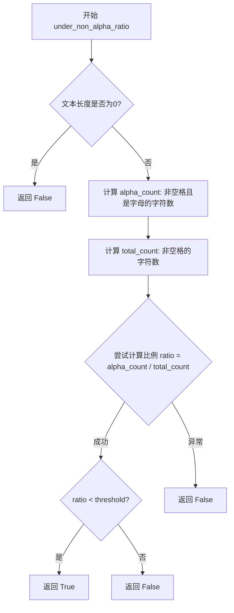
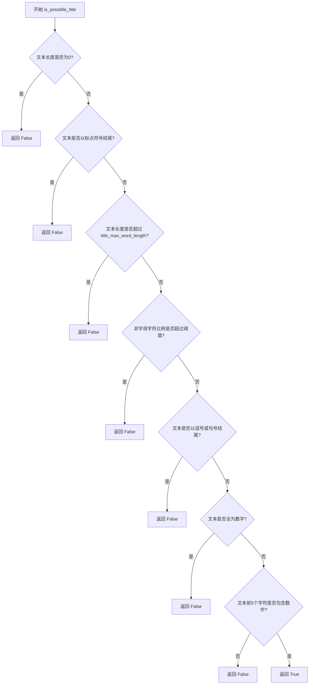

# `Langchain-Chatchat\libs\chatchat-server\chatchat\server\file_rag\text_splitter\zh_title_enhance.py` 详细设计文档

该代码是一个文档标题识别与增强模块，主要用于判断文本是否为标题，并针对中文文档进行标题增强处理。通过多个检查函数（包括非字母字符比例、标点符号、长度限制等）来综合判断文本是否适合作为标题，同时对识别出的标题进行元数据标记和内容增强。

## 整体流程

```mermaid
graph TD
    A[开始] --> B[调用 zh_title_enhance]
    B --> C{文档列表长度 > 0?}
    C -- 否 --> D[打印错误: 文件不存在]
    C -- 是 --> E[遍历文档]
    E --> F[调用 is_possible_title]
    F --> G{通过所有标题检查?}
    G -- 否 --> H[检查是否有已保存标题]
    G -- 是 --> I[设置元数据category为cn_Title]
    I --> J[保存标题到title变量]
    H --> K{有已保存标题?}
    K -- 是 --> L[在内容前添加: 下文与(标题)有关]
    K -- 否 --> E
    L --> E
    D --> M[结束]
    E --> N[返回处理后的文档列表]
    N --> M
```

## 类结构

```
该代码无类定义，仅包含全局函数和变量
```

## 全局变量及字段


### `ENDS_IN_PUNCT_PATTERN`
    
用于匹配以非字母数字字符结尾的文本的正则表达式模式字符串

类型：`str`
    


### `ENDS_IN_PUNCT_RE`
    
编译后的正则表达式对象，用于检查文本是否以标点符号结尾

类型：`re.Pattern`
    


    

## 全局函数及方法


### `under_non_alpha_ratio`

该函数用于检测文本中非字母字符的比例是否超过指定阈值，常用于判断文本是否为标题或装饰性分隔符（如"-----------BREAK---------"）。

参数：

- `text`：`str`，需要检测的输入字符串
- `threshold`：`float`（默认值为 0.5），非字母字符比例阈值，超过此阈值函数返回 False

返回值：`bool`，如果字母字符占比小于阈值返回 True（表示非字母字符过多），否则返回 False

#### 流程图



#### 带注释源码

```python
def under_non_alpha_ratio(text: str, threshold: float = 0.5):
    """Checks if the proportion of non-alpha characters in the text snippet exceeds a given
    threshold. This helps prevent text like "-----------BREAK---------" from being tagged
    as a title or narrative text. The ratio does not count spaces.

    Parameters
    ----------
    text
        The input string to test
    threshold
        If the proportion of non-alpha characters exceeds this threshold, the function
        returns False
    """
    # 如果文本为空，直接返回 False（空文本不满足条件）
    if len(text) == 0:
        return False

    # 计算字母字符数量：非空格且是字母的字符
    # char.strip() 判断字符是否为空格
    # char.isalpha() 判断字符是否为字母
    alpha_count = len([char for char in text if char.strip() and char.isalpha()])
    
    # 计算总字符数量：非空格的字符
    total_count = len([char for char in text if char.strip()])
    
    try:
        # 计算字母字符占比
        ratio = alpha_count / total_count
        # 如果占比小于阈值，返回 True（表示非字母字符过多）
        return ratio < threshold
    except:
        # 任何异常（如除零错误）返回 False
        return False
```


### `is_possible_title`

检查文本是否通过所有有效标题的验证条件，包括文本长度、非字母字符比例、数字检测等。

参数：

- `text`：`str`，输入要检查的文本
- `title_max_word_length`：`int`，标题可以包含的最大单词数，默认值为 20
- `non_alpha_threshold`：`float`，文本需要被考虑为标题的最小alpha字符比例阈值，默认值为 0.5

返回值：`bool`，如果文本通过所有检查则返回 True，否则返回 False

#### 流程图



#### 带注释源码

```python
def is_possible_title(
    text: str,
    title_max_word_length: int = 20,
    non_alpha_threshold: float = 0.5,
) -> bool:
    """Checks to see if the text passes all of the checks for a valid title.

    Parameters
    ----------
    text
        The input text to check
    title_max_word_length
        The maximum number of words a title can contain
    non_alpha_threshold
        The minimum number of alpha characters the text needs to be considered a title
    """

    # 文本长度为0的话，肯定不是title
    if len(text) == 0:
        print("Not a title. Text is empty.")
        return False

    # 文本中有标点符号，就不是title
    ENDS_IN_PUNCT_PATTERN = r"[^\w\s]\Z"
    ENDS_IN_PUNCT_RE = re.compile(ENDS_IN_PUNCT_PATTERN)
    if ENDS_IN_PUNCT_RE.search(text) is not None:
        return False

    # 文本长度不能超过设定值，默认20
    # NOTE(robinson) - splitting on spaces here instead of word tokenizing because it
    # is less expensive and actual tokenization doesn't add much value for the length check
    if len(text) > title_max_word_length:
        return False

    # 文本中数字的占比不能太高，否则不是title
    if under_non_alpha_ratio(text, threshold=non_alpha_threshold):
        return False

    # NOTE(robinson) - Prevent flagging salutations like "To My Dearest Friends," as titles
    if text.endswith((",", ".", "，", "。")):
        return False

    if text.isnumeric():
        print(f"Not a title. Text is all numeric:\n\n{text}")  # type: ignore
        return False

    # 开头的字符内应该有数字，默认5个字符内
    if len(text) < 5:
        text_5 = text
    else:
        text_5 = text[:5]
    alpha_in_text_5 = sum(list(map(lambda x: x.isnumeric(), list(text_5))))
    if not alpha_in_text_5:
        return False

    return True
```


### `zh_title_enhance`

该函数用于对文档列表进行中文标题增强处理，通过判断文档内容是否为标题，将其分类为"cn_Title"，并为非标题文档添加与前文标题相关的上下文前缀，以增强文档间的语义关联性。

参数：

- `docs`：`Document`（langchain.docstore.document.Document 列表），待处理的文档列表对象

返回值：`Document`（langchain.docstore.document.Document 列表），处理后的文档列表，包含标题分类标记和上下文前缀

#### 流程图

```mermaid
flowchart TD
    A[开始 zh_title_enhance] --> B{检查 docs 长度 > 0?}
    B -->|否| C[打印 '文件不存在']
    B -->|是| D[初始化 title = None]
    D --> E[遍历 docs 中的每个 doc]
    E --> F{调用 is_possible_title(doc.page_content)}
    F -->|是标题| G[设置 doc.metadata['category'] = 'cn_Title']
    G --> H[更新 title = doc.page_content]
    H --> E
    F -->|不是标题| I{title 是否存在?}
    I -->|是| J[在 doc.page_content 前添加 '下文与({title})有关。']
    I -->|否| E
    J --> E
    K[返回处理后的 docs] --> L[结束]
    C --> L
```

#### 带注释源码

```python
def zh_title_enhance(docs: Document) -> Document:
    """对文档列表进行中文标题增强处理
    
    该函数遍历文档列表，识别标题并标记为 'cn_Title' 类别，
    同时为非标题文档添加与前文标题相关的上下文前缀。
    
    Parameters
    ----------
    docs : Document
        langchain 文档对象列表，包含 page_content 和 metadata 属性
        
    Returns
    -------
    Document
        处理后的文档列表，标题文档被标记类别，非标题文档添加上下文前缀
    """
    # 初始化标题变量，用于保存最近发现的标题
    title = None
    
    # 检查文档列表是否有内容
    if len(docs) > 0:
        # 遍历每一个文档进行标题检测和处理
        for doc in docs:
            # 使用 is_possible_title 函数判断当前文档内容是否为标题
            if is_possible_title(doc.page_content):
                # 识别为标题文档，设置元数据类别为中文标题
                doc.metadata["category"] = "cn_Title"
                # 记录当前标题内容，供后续非标题文档使用
                title = doc.page_content
            # 非标题文档，但前面已有识别出的标题
            elif title:
                # 在文档内容前添加上下文前缀，说明本文档与前述标题的关系
                doc.page_content = f"下文与({title})有关。{doc.page_content}"
        # 返回处理完成的文档列表
        return docs
    else:
        # 文档列表为空，输出提示信息
        print("文件不存在")
```

## 关键组件


### 1. under_non_alpha_ratio 函数

检查文本中非字母字符的比例是否超过设定阈值，用于过滤类似"-----------BREAK---------"这样的分隔符文本。

### 2. is_possible_title 函数

综合判断给定文本是否符合标题的条件，包括长度、标点、字符比例等检查。

### 3. zh_title_enhance 函数

中文标题增强主函数，遍历文档列表，识别标题并为后续内容添加标题上下文标记。

### 4. ENDS_IN_PUNCT_PATTERN 正则模式

用于检测文本末尾是否包含非单词、非空白的标点符号（如句号、逗号等）。

### 5. Document 类型

来自 langchain.docstore.document 的文档对象，包含 page_content（页面内容）和 metadata（元数据）属性。

### 6. 阈值参数体系

包括 title_max_word_length（标题最大词数，默认20）和 non_alpha_threshold（非字母字符阈值，默认0.5）两个关键配置参数。

### 7. 文本预处理逻辑

包括空文本检查、标点结尾检查、数字文本检查、前5字符数字检测等辅助判断逻辑。


## 问题及建议


### 已知问题

-   **异常处理过于宽泛**：`under_non_alpha_ratio` 函数中使用 `except:` 捕获所有异常，会隐藏 KeyboardInterrupt、SystemExit 等严重错误，应改为捕获具体异常类型（如 `ZeroDivisionError`）。
-   **类型注解不完整**：`under_non_alpha_ratio` 缺少返回类型注解 `-> bool`；`zh_title_enhance` 参数 `docs` 类型标注为 `Document` 但实际应为 `List[Document]`。
-   **重复遍历文本**：`under_non_alpha_ratio` 函数中两次遍历 text 计算 alpha_count 和 total_count，可以合并为一次遍历提升性能。
-   **魔法数字**：`is_possible_title` 中的数字 `5`（文本前5字符判断）未提取为命名常量，代码可读性差。
-   **调试用 print 语句**：`is_possible_title` 中的 `print` 语句应替换为日志框架（logging），便于生产环境控制日志级别。
-   **条件判断冗余**：`under_non_alpha_ratio` 中 `if len(text) == 0: return False` 后，后续 `ratio = alpha_count / total_count` 即使 total_count 为 0 也不会执行（因为 text 为空时 total_count 必然为 0），try-except 块在此场景下显得多余。
-   **函数命名与实现不符**：`zh_title_enhance` 函数参数名为单数 `docs` 且类型标注为 `Document`，但实际接收和迭代的是文档列表，命名具有误导性。
-   **空字符串判断逻辑**：`under_non_alpha_ratio` 中 `char.strip()` 对于空字符返回空字符串，在布尔上下文为 False，但此逻辑可简化。

### 优化建议

-   为 `under_non_alpha_ratio` 添加返回类型注解 `-> bool`，并使用 `except ZeroDivisionError` 替代宽泛异常捕获。
-   修正 `zh_title_enhance` 的类型注解为 `List[Document]`，并将参数名改为 `docs: List[Document]` 以明确其接受列表。
-   重构 `under_non_alpha_ratio` 使用单次遍历：通过一次循环同时统计 alpha_count 和 total_count，减少时间复杂度。
-   将魔法数字 `5` 提取为命名常量 `TEXT_PREFIX_LENGTH = 5`，并添加类型注解。
-   将所有 `print` 语句替换为 `logging.info()` 或 `logging.debug()`，并配置合理的日志级别。
-   简化空字符串处理逻辑，可考虑使用 `sum` 和生成器表达式替代列表推导式以减少内存开销。

## 其它


### 设计目标与约束

本模块的设计目标是提供一套完整的中英文标题识别与增强解决方案，主要用于文档预处理阶段，帮助识别文档中的标题内容，并为非标题内容添加上下文关联。核心约束包括：1) 依赖轻量级正则表达式匹配，避免引入重型NLP模型；2) 处理流程需保持高效，单文档处理时间控制在毫秒级；3) 支持中英文混合文本场景；4) 函数参数提供合理的默认值，同时支持自定义配置。

### 错误处理与异常设计

模块采用防御式编程策略，在关键路径上做了异常处理。under_non_alpha_ratio函数通过try-except捕获除零异常，当total_count为0时返回False。is_possible_title函数对空字符串、纯数字文本、过长文本等边界情况进行了前置检查。zh_title_enhance函数处理空文档列表时打印警告信息并返回原列表。整体错误处理粒度较粗，建议后续增加自定义异常类（如TitleParsingError）以支持更精细的错误分类和处理策略。

### 数据流与状态机

数据流主要分为三个阶段：首先是标题识别阶段，is_possible_title函数对单个文本块进行多维度检查（长度、非字母比例、标点结尾、纯数字等），输出布尔值；其次是标题标记阶段，zh_title_enhance函数遍历文档列表，对识别为标题的文档设置metadata["category"]="cn_Title"；最后是上下文增强阶段，对非标题内容添加"下文与(标题)有关"的关联前缀。没有复杂的状态机设计，流程为线性处理。

### 外部依赖与接口契约

本模块依赖两个外部包：1) re模块（Python标准库），用于正则表达式编译和匹配；2) langchain.docstore.document模块的Document类，用于文档对象结构定义。接口契约方面：under_non_alpha_ratio接受str类型text和float类型threshold，返回bool；is_possible_title接受str类型text和两个可选整型/浮点型参数，返回bool；zh_title_enhance接受Document列表，返回Document列表。所有函数参数均不做空值检查，调用方需保证参数有效性。

### 性能考虑

当前实现性能瓶颈主要集中在两个方面：1) is_possible_title函数中多次调用len()和列表推导式，建议缓存长度值；2) under_non_alpha_ratio函数使用列表推导式创建中间列表后计算长度，可改用生成器表达式减少内存占用。建议使用@functools.lru_cache装饰器缓存正则表达式编译结果，对于大批量文档处理场景可考虑并行化处理。

### 安全性考虑

当前模块主要处理文本内容，安全性风险较低。潜在风险点：1) f-string格式化时未对title变量进行转义处理，如果title包含特殊字符可能导致注入问题；2) 未对Document对象的page_content和metadata进行长度限制，极端长文本可能影响后续处理。建议添加输入长度校验和内容清洗逻辑。

### 测试策略建议

建议补充以下测试用例：1) 边界条件测试（空字符串、超长文本、特殊字符）；2) 中文标点符号处理测试（，。、）；3) 混合语言场景测试；4) 性能基准测试；5) 异常输入的健壮性测试。可使用pytest框架编写单元测试，并添加代码覆盖率检测。

### 使用示例

```python
from langchain.docstore.document import Document
from zh_title_enhance import is_possible_title, zh_title_enhance

# 标题识别示例
print(is_possible_title("第一章 机器学习基础"))  # True
print(is_possible_title("12345"))  # False

# 文档增强示例
docs = [
    Document(page_content="第一章 深度学习简介", metadata={}),
    Document(page_content="深度学习是机器学习的一个分支...", metadata={})
]
enhanced_docs = zh_title_enhance(docs)
```

### 配置文件说明

当前模块无独立配置文件，所有配置通过函数参数传入。建议将默认配置（如title_max_word_length=20、non_alpha_threshold=0.5）提取至配置类或YAML配置文件中，便于统一管理和修改。

    