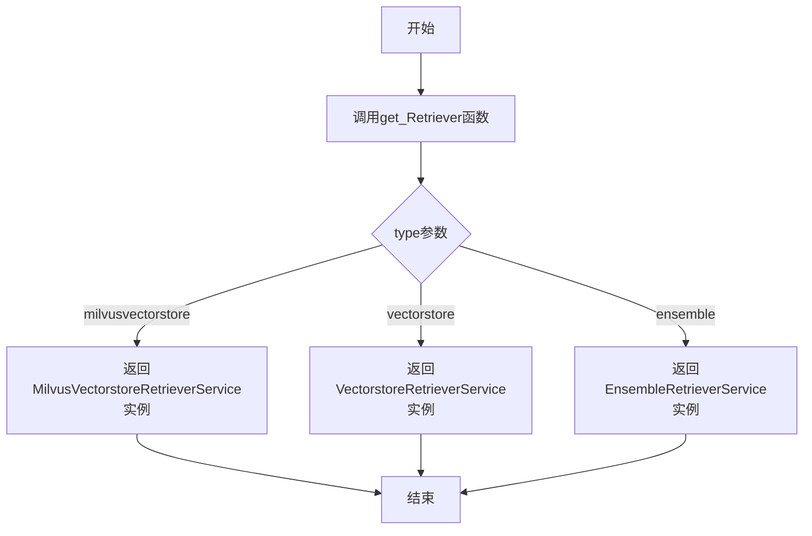
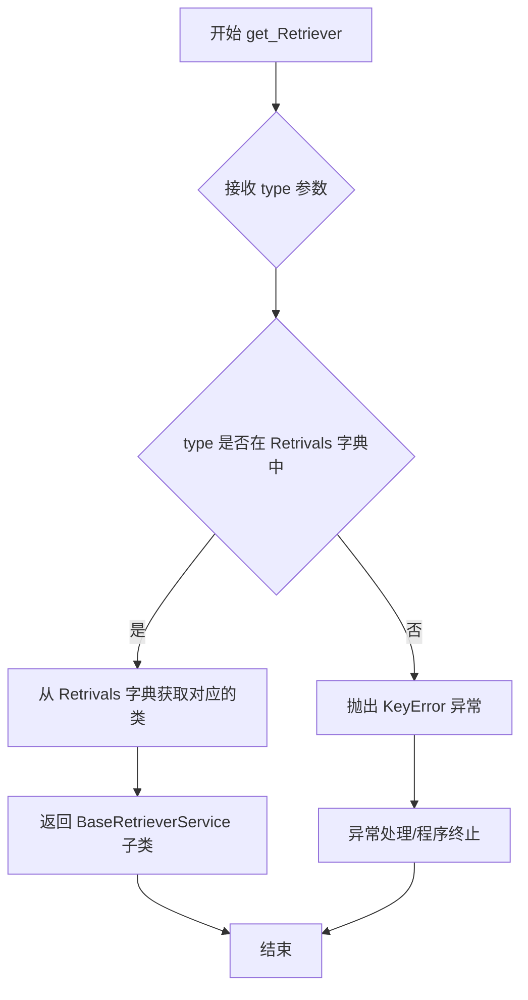

# `Langchain-Chatchat\libs\chatchat-server\chatchat\server\file_rag\utils.py` 详细设计文档

这是一个基于工厂模式的重检索器（Retriever）服务实例化模块，通过类型字符串动态返回对应的检索服务实例，支持Milvus向量存储、通用向量存储和集成检索三种类型。

## 整体流程



## 类结构

```
BaseRetrieverService (抽象基类)
├── VectorstoreRetrieverService
├── EnsembleRetrieverService
└── MilvusVectorstoreRetrieverService
```

## 全局变量及字段


### `Retrivals`
    
存储检索器类型与对应服务类映射的全局字典

类型：`dict`
    


    

## 全局函数及方法


### `get_Retriever`

根据 `type` 参数从预定义的字典中查找并返回对应的 `BaseRetrieverService` 子类，实现简单的 Retriever 工厂模式。

参数：

- `type`：`str`，默认为 `"vectorstore"`，指定要获取的 Retriever 类型，可选值为 `"milvusvectorstore"`、`"vectorstore"`、`"ensemble"`

返回值：`BaseRetrieverService`，返回对应的 Retriever 服务类（注意：返回的是类本身而非实例，调用者需要自行实例化）

#### 流程图



#### 带注释源码

```python
# 从 retriever 模块导入基础 Retriever 服务类和具体实现类
from chatchat.server.file_rag.retrievers import (
    BaseRetrieverService,          # 基础抽象类，定义 Retriever 接口规范
    EnsembleRetrieverService,      # 集成检索服务类
    VectorstoreRetrieverService,   # 向量存储检索服务类
    MilvusVectorstoreRetrieverService,  # Milvus 向量库检索服务类
)

# Retrivals 字典：存储字符串类型到具体 Retriever 类的映射关系
# 键为类型标识字符串，值为对应的 Retriever 服务类（不是实例）
Retrivals = {
    "milvusvectorstore": MilvusVectorstoreRetrieverService,  # Milvus 向量库检索
    "vectorstore": VectorstoreRetrieverService,              # 普通向量存储检索
    "ensemble": EnsembleRetrieverService,                    # 集成检索
}


def get_Retriever(type: str = "vectorstore") -> BaseRetrieverService:
    """
    工厂函数：根据 type 参数返回对应的 BaseRetrieverService 子类
    
    参数:
        type (str): Retriever 类型标识，默认为 "vectorstore"
                   可选值: "milvusvectorstore", "vectorstore", "ensemble"
    
    返回:
        BaseRetrieverService: 对应的 Retriever 服务类（注意：返回类本身而非实例）
    
    异常:
        KeyError: 当传入的 type 不在 Retrivals 字典中时抛出
    """
    # 从字典中查找并返回对应的类
    return Retrivals[type]
```

---

#### 技术债务与优化空间

1. **缺少参数校验**：当传入无效的 `type` 值时，会直接抛出 `KeyError`，建议添加明确的参数校验和友好的错误提示。
2. **返回类型不一致**：函数签名声明返回 `BaseRetrieverService` 实例，但实际返回的是类本身（`Retrivals[type]` 是类，不是实例），这会导致类型注解产生误导，建议修改为 `Type[BaseRetrieverService]` 或修改实现逻辑返回实例。
3. **缺少默认值处理**：当 `type` 不在字典中时，可以考虑返回默认的 `VectorstoreRetrieverService` 或返回 `None` 并提供明确的错误信息。

## 关键组件


### BaseRetrieverService

基础检索器服务抽象类，定义了检索器服务的接口规范，所有具体检索器实现都应继承此类。

### EnsembleRetrieverService

集成检索器服务，通过组合多个检索器的结果来提供更准确的检索能力。

### VectorstoreRetrieverService

向量存储检索器服务，基于向量数据库进行相似度检索的实现类。

### MilvusVectorstoreRetrieverService

Milvus向量存储检索器服务，专门针对Milvus向量数据库的检索实现。

### Retrivals 字典

存储检索器类型与对应实现类的映射字典，用于检索器的动态选择与实例化。

### get_Retriever 函数

工厂函数，根据传入的type参数返回对应的检索器服务实例，实现检索器的动态加载。


## 问题及建议


### 已知问题

- **拼写错误**：变量名 `Retrivals` 少了一个 'e'，应为 `Retrievals`；函数名 `get_Retriever` 命名不符合 Python 蛇形命名规范，应为 `get_retriever`
- **缺少错误处理**：`get_Retriever` 函数未对 `type` 参数进行校验，若传入不存在的类型会直接抛出 `KeyError` 异常，缺乏友好的错误提示
- **参数校验缺失**：默认参数 `"vectorstore"` 未验证是否存在于字典中，可能导致运行时错误
- **导入未使用**：`BaseRetrieverService` 被导入但未在代码中实际使用
- **类型注解不完整**：返回类型注解仅为 `BaseRetrieverService`，无法体现多态特性，IDE 无法提供精确的类型推断
- **设计缺陷**：使用字符串硬编码映射类的方式缺乏类型安全性和可维护性，IDE 无法提供自动补全和重构支持
- **扩展性差**：未提供动态注册 retriever 的机制，后续新增 retriever 类型需要修改源码并重新部署

### 优化建议

- 修正拼写错误并遵循 Python 命名规范，使用 `retrievals` 和 `get_retriever`
- 添加参数校验逻辑，当 `type` 不存在时抛出自定义异常或返回默认值，并记录日志
- 考虑使用 `Enum` 类或常量类替代字符串 key，提升类型安全性和可维护性
- 补充模块和函数的文档注释，说明各 retriever 的用途
- 使用 `typing.Type[BaseRetrieverService]` 或泛型优化返回类型注解
- 提供 `register_retriever` 机制，支持运行时动态注册，增强扩展性
- 添加单元测试覆盖异常分支，确保错误处理逻辑正确

## 其它


### 设计目标与约束

本模块旨在为文件检索系统提供统一的检索器服务访问入口，通过工厂模式根据配置类型动态返回对应的检索器实现，支持Milvus向量库、通用向量库和集成检索器三种类型，满足不同场景下的向量检索需求。

### 错误处理与异常设计

当传入的type参数不在Retrivals字典的key中时，会抛出KeyError异常。建议在get_Retriever函数中添加参数校验，当type不合法时抛出更明确的ValueError异常并提供友好的错误提示，例如："Unsupported retriever type: {type}. Supported types: {list(Retrivals.keys())}"

### 外部依赖与接口契约

本模块依赖chatchat.server.file_rag.retrievers模块中的四个类，其中BaseRetrieverService是基类，定义了检索器的通用接口契约。所有具体检索器实现（MilvusVectorstoreRetrieverService、VectorstoreRetrieverService、EnsembleRetrieverService）都应继承BaseRetrieverService并实现其抽象方法，确保返回类型的一致性。

### 数据流与状态机

get_Retriever函数根据输入的type字符串作为key在Retrivals字典中查找对应的检索器类，然后通过构造函数实例化并返回。数据流为：输入type字符串 → 字典查找 → 类引用获取 → 实例化 → 返回检索器对象。该过程不涉及复杂的状态管理，属于无状态的工厂方法。

### 配置与扩展性

当前支持的检索器类型硬编码在Retrivals字典中，扩展新的检索器类型需要在代码中添加新的映射关系。建议未来可以将检索器类型配置外部化，通过配置文件或环境变量管理，提高系统的灵活性和可维护性。

### 安全性考虑

当前代码未对type参数进行类型校验和边界检查，存在传入非字符串类型导致异常的风险。建议添加参数类型检查，确保type为字符串类型后再进行字典查找操作。

### 性能考虑

字典查找操作的时间复杂度为O(1)，性能较好。get_Retriever函数每次调用都会创建新的检索器实例，如果需要频繁调用且检索器实例无状态，可以考虑引入缓存机制或单例模式来优化性能。

### 使用示例

```python
# 获取默认的vectorstore检索器
retriever = get_Retriever()

# 获取指定的milvus检索器
milvus_retriever = get_Retriever("milvusvectorstore")

# 获取集成检索器
ensemble_retriever = get_Retriever("ensemble")
```

    