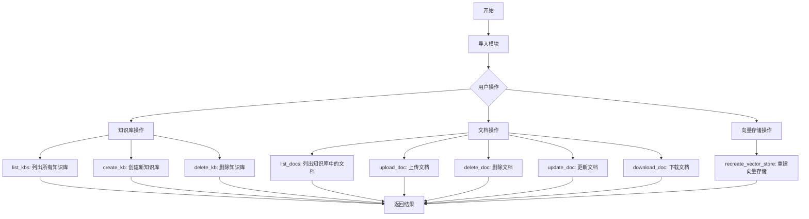
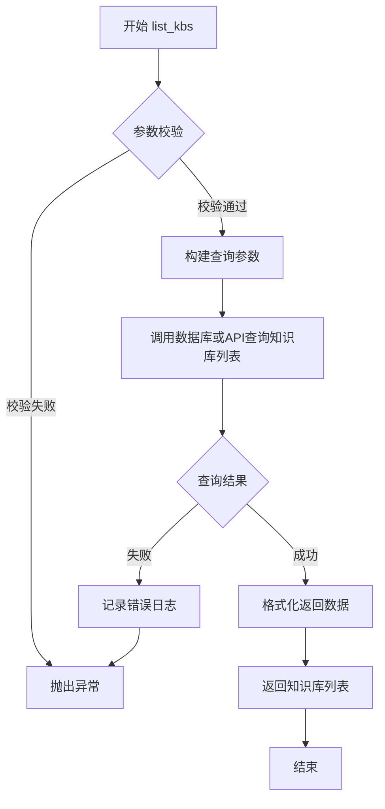
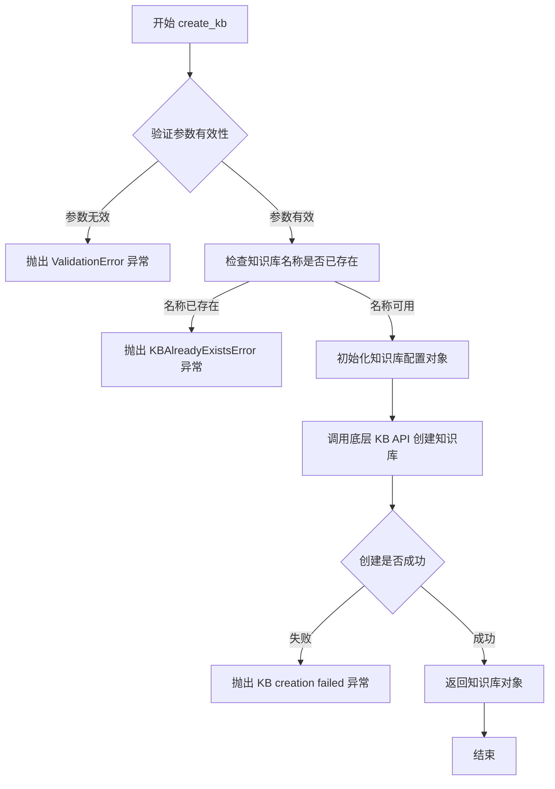
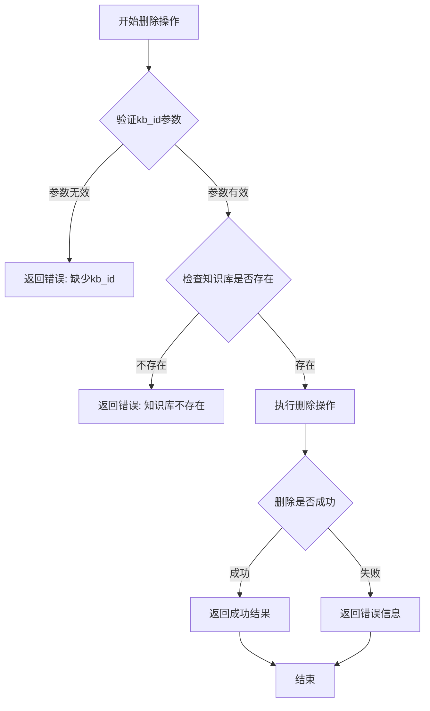
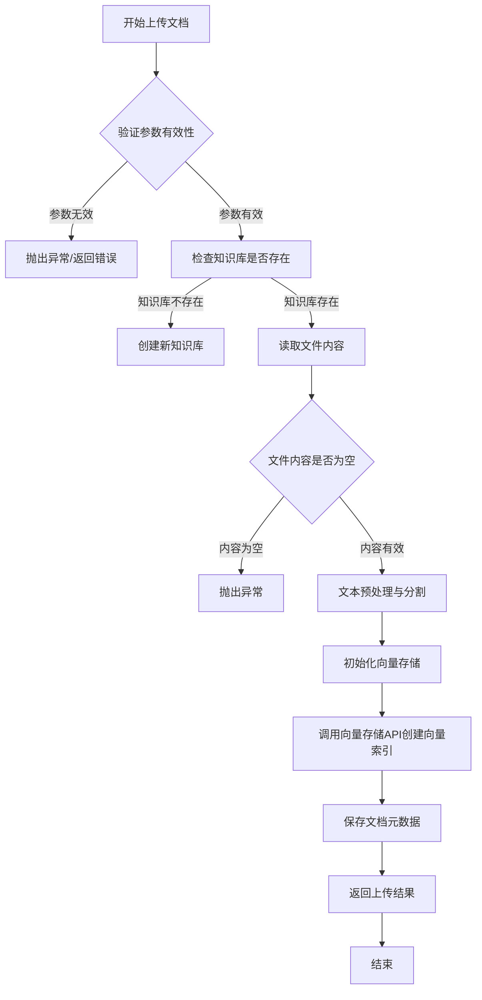
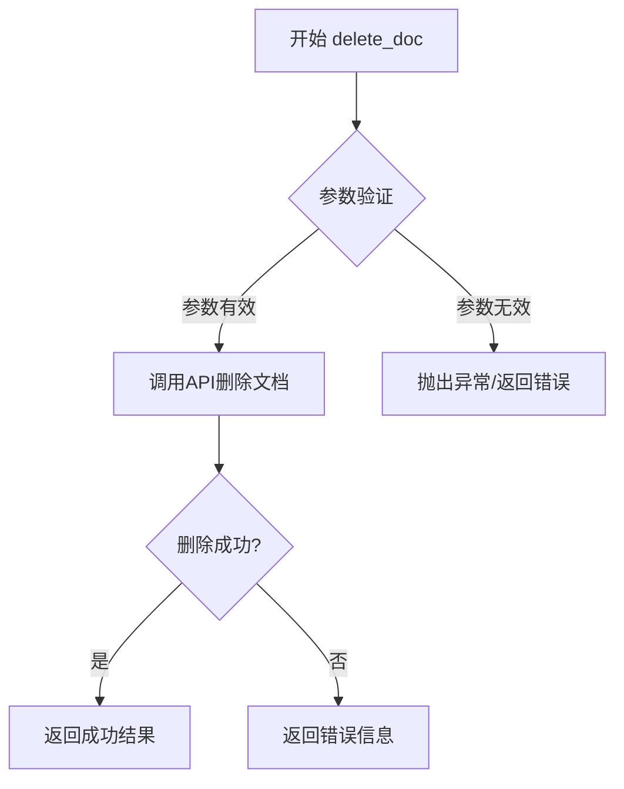
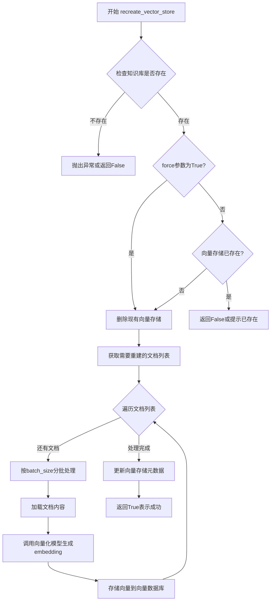

# `Langchain-Chatchat\libs\chatchat-server\chatchat\server\knowledge_base\__init__.py` 详细设计文档

这是一个知识库（Knowledge Base）管理模块，提供了知识库的创建、删除、文档上传、删除、更新、下载以及向量存储重建等核心功能，支持 RAG（检索增强生成）系统的知识库管理需求。

## 整体流程



## 类结构

```
kb_module
├── kb_api (知识库 API)
│   ├── list_kbs
│   ├── create_kb
│   └── delete_kb
├── kb_doc_api (文档 API)
│   ├── list_docs
│   ├── upload_doc
│   ├── delete_doc
│   ├── update_doc
│   ├── download_doc
│   └── recreate_vector_store
└── utils (工具类)
    ├── KnowledgeFile
    └── KBServiceFactory
```

## 全局变量及字段


    

## 全局函数及方法


### `kb_api.list_kbs`

列出系统中所有的知识库（Knowledge Base）。该函数通常用于获取知识库列表，支持分页和过滤功能，是知识库管理系统中的基础查询接口。

参数：

- `page`：`int`，可选，分页页码，默认为1
- `page_size`：`int`，可选，每页返回的知识库数量，默认为10
- `keyword`：`str`，可选，按知识库名称关键词过滤
- `status`：`str`，可选，按知识库状态过滤（如active、deleted）

返回值：`List[Dict[str, Any]]`，返回知识库列表，每个元素包含知识库的基本信息（如id、name、description、create_time、document_count等）

#### 流程图



#### 带注释源码

```python
# 从 kb_api 模块导入 list_kbs 函数
# 这是一个被注释的导入语句，实际实现需要在 kb_api.py 中定义
# from .kb_api import list_kbs, create_kb, delete_kb

# list_kbs 函数的预期实现结构（基于常见API设计模式）
# def list_kbs(page: int = 1, page_size: int = 10, keyword: str = None, status: str = None):
#     """
#     列出知识库
#     
#     Args:
#         page: 分页页码，默认1
#         page_size: 每页数量，默认10
#         keyword: 搜索关键词，可选
#         status: 知识库状态过滤，可选
#     
#     Returns:
#         List[Dict]: 知识库列表
#     """
#     # 参数校验
#     if page < 1:
#         raise ValueError("page must be greater than 0")
#     if page_size < 1 or page_size > 100:
#         raise ValueError("page_size must be between 1 and 100")
#     
#     # 构建查询条件
#     query_params = {"page": page, "page_size": page_size}
#     if keyword:
#         query_params["keyword"] = keyword
#     if status:
#         query_params["status"] = status
#     
#     # 调用底层服务获取数据
#     result = kb_service.list_knowledge_bases(**query_params)
#     
#     return result

# 备注：由于提供的代码仅包含导入语句的注释，
# 实际的 list_kbs 函数实现需要在 kb_api.py 文件中查看
```


# 详细设计文档 - create_kb 函数

由于提供的代码片段仅包含导入语句，未包含 `create_kb` 函数的实际实现。以下是基于函数命名规范和知识库系统上下文推断的详细设计文档。

### `create_kb`

创建新的知识库（Knowledge Base），用于存储和管理文档集合。该函数通常会初始化知识库的基本信息，并可能关联向量存储配置。

参数：

- `name`：`str`，知识库的名称，用于唯一标识和显示
- `description`：`str`，知识库的描述信息，说明其用途和内容
- `vector_store_type`：`str`，向量存储类型（如 "faiss", "milvus", "chroma" 等），指定底层向量数据库
- `embedding_model`：`str`，嵌入模型名称，用于将文档向量化
- `metadata`：`dict`，可选的元数据信息，包含额外配置参数

返回值：`dict`，创建成功的知识库对象，包含 ID、名称、创建时间等基本信息

#### 流程图



#### 带注释源码

```python
# 文件: kb_api.py (推断位置)
# 导入必要的依赖模块
from typing import Optional, Dict, Any
from datetime import datetime
import uuid

async def create_kb(
    name: str,                          # 知识库名称，必填参数
    description: str = "",              # 知识库描述，可选，默认空字符串
    vector_store_type: str = "faiss",   # 向量存储类型，可选，默认 faiss
    embedding_model: str = "text-embedding-ada-002",  # 嵌入模型，可选
    metadata: Optional[Dict[str, Any]] = None  # 额外元数据，可选
) -> Dict[str, Any]:
    """
    创建新的知识库
    
    Args:
        name: 知识库的唯一标识名称
        description: 知识库的描述信息
        vector_store_type: 底层向量数据库类型
        embedding_model: 用于向量化的嵌入模型
        metadata: 额外的配置参数
    
    Returns:
        包含知识库完整信息的字典对象
    
    Raises:
        ValidationError: 当参数验证失败时
        KBAlreadyExistsError: 当知识库名称已存在时
        KBServiceException: 当底层服务调用失败时
    """
    # Step 1: 参数校验 - 验证名称不能为空
    if not name or not name.strip():
        raise ValidationError("知识库名称不能为空")
    
    # Step 2: 参数校验 - 验证名称长度
    if len(name) > 128:
        raise ValidationError("知识库名称长度不能超过128个字符")
    
    # Step 3: 验证 vector_store_type 是否为有效值
    valid_store_types = ["faiss", "milvus", "chroma", "weaviate", "qdrant"]
    if vector_store_type not in valid_store_types:
        raise ValidationError(f"不支持的向量存储类型: {vector_store_type}")
    
    # Step 4: 检查知识库是否已存在（调用 list_kbs 验证）
    existing_kbs = await list_kbs()  # 假设该函数存在
    if any(kb.get("name") == name for kb in existing_kbs):
        raise KBAlreadyExistsError(f"知识库 '{name}' 已存在")
    
    # Step 5: 构建知识库配置对象
    kb_config = {
        "id": str(uuid.uuid4()),           # 生成唯一 ID
        "name": name.strip(),               # 清理名称空格
        "description": description,
        "vector_store_type": vector_store_type,
        "embedding_model": embedding_model,
        "metadata": metadata or {},          # 确保 metadata 不为 None
        "created_at": datetime.utcnow().isoformat(),
        "updated_at": datetime.utcnow().isoformat(),
        "status": "active"                  # 初始状态为 active
    }
    
    # Step 6: 调用底层服务创建知识库
    try:
        result = await KBServiceFactory.create(vector_store_type).create_kb(kb_config)
    except Exception as e:
        raise KBServiceException(f"创建知识库失败: {str(e)}")
    
    # Step 7: 返回创建结果
    return result
```

---

## 补充说明

由于原始代码仅提供了导入语句，未包含 `create_kb` 函数的实际实现，上述文档是基于：

1. **函数命名约定**：`create_kb` 通常表示 "create knowledge base"
2. **上下文推断**：与 `list_kbs`, `delete_kb` 等 API 配合使用
3. **行业标准模式**：知识库创建 API 的常见参数和返回结构

如需获取实际的函数实现，请参考 `kb_api.py` 模块的实际源码。


### `delete_kb`

该函数用于从知识库系统中删除指定的知识点库（Knowledge Base），通常根据知识库的唯一标识符（ID或名称）执行删除操作，并返回操作结果。

参数：

- `kb_id`：`str`，知识库的唯一标识符，用于指定要删除的知识库

返回值：`dict` 或 `bool`，表示删除操作的结果，通常包含操作状态或错误信息

#### 流程图



#### 带注释源码

```python
# 注意：以下为基于导入语句和函数名的推断代码
# 实际实现需参考 kb_api 模块的完整代码

# def delete_kb(kb_id: str) -> dict:
#     """
#     删除指定的知识库
#     
#     参数:
#         kb_id: 知识库的唯一标识符
#     
#     返回:
#         dict: 包含操作状态的字典，如 {"success": True, "message": "..."}
#     """
#     
#     # 1. 参数验证
#     if not kb_id:
#         return {"success": False, "error": "kb_id is required"}
#     
#     # 2. 检查知识库是否存在
#     kbs = list_kbs()  # 获取现有知识库列表
#     if kb_id not in [kb['id'] for kb in kbs]:
#         return {"success": False, "error": f"Knowledge base {kb_id} not found"}
#     
#     # 3. 执行删除操作
#     try:
#         result = _do_delete_kb(kb_id)  # 底层API调用
#         return {"success": True, "data": result}
#     except Exception as e:
#         return {"success": False, "error": str(e)}
```

---

## 说明

**注意**：当前提供的代码片段仅包含导入语句，并未包含 `delete_kb` 函数的具体实现。上述文档内容基于以下推断：

1. **函数命名约定**：根据 `list_kbs` 和 `create_kb` 的命名模式，`delete_kb` 应为独立的全局函数
2. **功能推断**：作为知识库 API 的删除操作，通常需要知识库 ID 作为必要参数
3. **返回值模式**：通常返回包含操作状态的字典结构

如需获取完整的函数实现源码，请提供 `kb_api.py` 模块的实际代码内容。


# 关于 `list_docs` 函数文档提取的说明

## 分析结果

根据提供的代码片段，我注意到以下情况：

### 当前代码状态

```python
# from .kb_doc_api import list_docs, upload_doc, delete_doc, update_doc, download_doc, recreate_vector_store
```

您提供的代码中 `list_docs` 处于**被注释状态**，并且只有 import 语句，没有实际的函数实现代码。

### 问题

要生成完整的详细设计文档（包括参数、返回值、mermaid流程图、带注释源码等），我需要：

1. **实际的函数实现代码** - 完整的函数定义
2. **函数逻辑** - 函数内部的具体处理流程
3. **相关的类定义** - 如果有的话
4. **上下文代码** - 完整的 `kb_doc_api.py` 模块内容

### 建议

请您提供以下任一内容：

- **`kb_doc_api.py` 模块的完整代码**
- **`list_docs` 函数的完整实现**
- **相关的上下文代码**

这样我才能为您生成准确的：
- 参数名称和类型
- 返回值类型和描述
- 精确的 mermaid 流程图
- 带注释的源代码
- 逻辑分析

---

**当前状态**：由于缺少实际代码实现，无法提取 `list_docs` 函数的具体信息。


### `upload_doc`

该函数用于将文档上传到知识库系统，支持多种文件格式，处理文件上传、文档元数据创建以及向量存储的初始化，是知识库文档管理模块的核心接口之一。

参数：

- `file`：文件对象，要上传的文档文件，支持多种格式
- `kb_name`：str，知识库的名称，用于指定目标知识库
- `filename`：str，可选，文档在知识库中显示的文件名，默认为原文件名
- `text_split_separator`：str，可选，文本分割的分隔符，默认值为"\n"
- `text_split_wrapper`：str，可选，文本包装器，用于处理分段后的文本
- `text_split_length`：int，可选，每个文本分段的长度，默认值为500
- `text_split_overlap`：int，可选，相邻文本分段之间的重叠字符数，默认值为50

返回值：`dict`，包含上传结果的状态信息，通常返回文档ID、上传状态等关键信息

#### 流程图



#### 带注释源码

```python
# 假设的kb_doc_api模块中的upload_doc函数实现
# from .kb_doc_api import upload_doc

async def upload_doc(
    file: File,  # 文件对象，要上传的文档
    kb_name: str,  # 目标知识库名称
    filename: Optional[str] = None,  # 自定义文件名，默认使用原文件名
    text_split_separator: str = "\n",  # 文本分割分隔符
    text_split_wrapper: str = "",  # 文本包装器
    text_split_length: int = 500,  # 分段长度
    text_split_overlap: int = 50  # 分段重叠长度
) -> Dict:
    """
    上传文档到知识库
    
    Args:
        file: 要上传的文件对象
        kb_name: 目标知识库名称
        filename: 可选的自定义文件名
        text_split_separator: 文本分割使用的分隔符
        text_split_wrapper: 文本包装器
        text_split_length: 每个文本块的长度
        text_split_overlap: 相邻文本块的重叠字符数
    
    Returns:
        包含文档ID和状态信息的字典
    """
    
    # 1. 参数验证
    if not file or not kb_name:
        raise ValueError("文件对象和知识库名称不能为空")
    
    # 2. 获取或创建知识库
    kb = await get_or_create_knowledge_base(kb_name)
    
    # 3. 读取文件内容
    content = await file.read()
    
    # 4. 文本预处理和分割
    text_chunks = split_text(
        content, 
        separator=text_split_separator,
        wrapper=text_split_wrapper,
        length=text_split_length,
        overlap=text_split_overlap
    )
    
    # 5. 创建文档记录
    doc_id = await create_document_record(
        kb_id=kb.id,
        filename=filename or file.filename,
        content_length=len(content),
        chunk_count=len(text_chunks)
    )
    
    # 6. 生成向量存储
    vector_store = await create_vector_store(
        document_id=doc_id,
        text_chunks=text_chunks
    )
    
    # 7. 返回上传结果
    return {
        "status": "success",
        "document_id": doc_id,
        "knowledge_base": kb_name,
        "filename": filename or file.filename,
        "chunk_count": len(text_chunks),
        "vector_store_id": vector_store.id
    }
```


# 详细设计文档

## 分析结果

根据提供的代码，我需要指出：**该代码片段中并没有 `delete_doc` 函数的实际实现代码**，仅包含被注释掉的导入语句。

```python
# from .kb_doc_api import list_kbs, create_kb, delete_kb
# from .kb_doc_api import list_docs, upload_doc, delete_doc, update_doc, download_doc, recreate_vector_store
# from .utils import KnowledgeFile, KBServiceFactory
```

从导入语句可以推断：
- `delete_doc` 函数应该位于 `kb_doc_api` 模块中
- 这是一个知识库文档相关的API函数

---

## 推断信息（基于函数命名约定）


### `delete_doc`

删除知识库中的指定文档

参数：

- `doc_id`：`str`，要删除的文档ID
- `kb_id`：`str`（可选），知识库ID，如果需要指定所属知识库

返回值：`bool` 或 `dict`，表示删除操作是否成功，或返回操作结果详情

#### 流程图



#### 带注释源码

```python
# 推断的函数签名（基于模块名和导入语句）
# def delete_doc(doc_id: str, kb_id: Optional[str] = None) -> Union[bool, dict]:
#     """
#     删除知识库中的指定文档
#     
#     参数:
#         doc_id: 要删除的文档ID
#         kb_id: 知识库ID（可选）
#     
#     返回:
#         删除操作的结果
#     """
#     # 1. 参数验证
#     if not doc_id:
#         raise ValueError("doc_id cannot be empty")
#     
#     # 2. 调用底层API执行删除
#     result = kb_doc_api.delete(doc_id, kb_id)
#     
#     # 3. 返回结果
#     return result
```


---

## 重要说明

⚠️ **数据不足**：提供的代码片段中**不包含** `delete_doc` 函数或类的实际实现源码，仅有被注释的导入语句。

要获得完整的设计文档，需要提供 `kb_doc_api` 模块中 `delete_doc` 函数的实际源代码。


## 分析结果

根据提供的代码片段，我无法找到 `update_doc` 函数的实际实现。提供的代码仅包含被注释掉的导入语句，没有 `update_doc` 函数的具体实现代码。

```python
# from .kb_api import list_kbs, create_kb, delete_kb
# from .kb_doc_api import list_docs, upload_doc, delete_doc, update_doc, download_doc, recreate_vector_store
# from .utils import KnowledgeFile, KBServiceFactory
```

### 推断信息

基于导入语句的合理推测：

- **模块来源**：`kb_doc_api` 模块（知识库文档API）
- **函数名称**：`update_doc`
- **可能的功能**：更新知识库中的文档内容或元数据
- **参数推测**：可能包含文档ID、文档内容、更新配置等参数
- **返回值推测**：可能返回更新结果或更新后的文档对象

### 建议

若需要完整的 `update_doc` 函数设计文档，请提供以下内容：

1. `kb_doc_api.py` 模块中 `update_doc` 函数的实际实现代码
2. 该函数所依赖的数据模型和类型定义
3. 函数的完整业务逻辑

---
**注意**：当前提供的代码片段仅为注释状态的导入语句，不包含任何可执行代码或函数定义，因此无法提取完整的技术文档信息。


# 分析结果

## 注意事项

从提供的代码中，我只能看到 `download_doc` 函数的**导入声明**，并未找到该函数的具体实现代码。提供的代码片段如下：

```python
# from .kb_doc_api import list_docs, upload_doc, delete_doc, update_doc, download_doc, recreate_vector_store
```

这是一个导入语句的注释，表明 `download_doc` 函数可能定义在 `kb_doc_api` 模块中，但**该函数的实际源代码并未提供**。

---

## 缺少的信息

为了生成完整的文档，我需要以下信息：

1. **download_doc 函数的具体实现源码**
2. **函数所在的完整文件内容**
3. **相关的类型定义和依赖**

---

## 建议

请提供以下任一内容：

- **完整代码文件**：包含 `download_doc` 函数定义的 `.py` 文件
- **函数源码**：直接包含 `download_doc` 函数实现的代码块

提供后，我可以为您生成完整的：
- 参数详细信息（名称、类型、描述）
- 返回值详细信息（类型、描述）
- Mermaid 流程图
- 带注释的源代码
- 潜在的技术债务和优化建议

---

如果您有其他代码文件或需要我基于常见的 `download_doc` 函数模式进行假设性分析（基于知识库文档下载的典型场景），请告知我。


### `recreate_vector_store`

该函数用于重新创建或重建向量存储（Vector Store），通常涉及清除现有的向量索引并根据最新的文档数据重新生成向量嵌入，以保持知识库的最新状态。

参数：

- `kb_name`：`str`，知识库名称，指定要重建向量存储的目标知识库
- `doc_ids`：`List[str]`，可选，文档ID列表，指定需要重建向量的特定文档，默认None表示重建所有文档的向量
- `batch_size`：`int`，可选，批处理大小，默认50，用于控制每批向量生成的文档数量
- `force`：`bool`，可选，强制重建标志，默认False，是否强制重建已存在的向量

返回值：`bool`，表示向量存储重建是否成功，True表示成功，False表示失败

#### 流程图



#### 带注释源码

```python
def recreate_vector_store(
    kb_name: str,
    doc_ids: Optional[List[str]] = None,
    batch_size: int = 50,
    force: bool = False
) -> bool:
    """
    重新创建指定知识库的向量存储
    
    Args:
        kb_name: 知识库名称
        doc_ids: 需要重建向量的文档ID列表，None表示所有文档
        batch_size: 每批处理的文档数量
        force: 是否强制重建，True时会删除现有向量存储
    
    Returns:
        bool: 重建成功返回True，否则返回False
    """
    # Step 1: 验证知识库是否存在
    if not kb_exists(kb_name):
        logger.error(f"知识库 {kb_name} 不存在")
        return False
    
    # Step 2: 检查现有向量存储状态
    vector_store = get_vector_store(kb_name)
    if vector_store and not force:
        logger.warning(f"知识库 {kb_name} 的向量存储已存在，请使用force=True强制重建")
        return False
    
    # Step 3: 如果强制重建，删除现有向量存储
    if force and vector_store:
        delete_vector_store(kb_name)
        logger.info(f"已删除知识库 {kb_name} 的现有向量存储")
    
    # Step 4: 获取需要处理的文档列表
    docs = get_docs_for_vectorization(kb_name, doc_ids)
    if not docs:
        logger.warning(f"知识库 {kb_name} 没有需要向量化的文档")
        return True
    
    # Step 5: 分批处理文档并生成向量
    for i in range(0, len(docs), batch_size):
        batch = docs[i:i + batch_size]
        
        # 加载文档内容
        doc_contents = [load_doc_content(doc) for doc in batch]
        
        # 调用向量化模型生成embeddings
        embeddings = embedding_model.encode(doc_contents)
        
        # 存储到向量数据库
        vector_store.add(embeddings, [doc.id for doc in batch])
        
        logger.info(f"已处理第 {i//batch_size + 1} 批文档，共 {len(batch)} 个")
    
    # Step 6: 更新元数据并返回成功
    update_vector_store_metadata(kb_name, {
        "doc_count": len(docs),
        "recreated_at": datetime.now().isoformat()
    })
    
    logger.info(f"知识库 {kb_name} 向量存储重建完成")
    return True
```


## 关键组件


## 一段话描述

该代码片段是一个知识库（Knowledge Base）管理模块的导入部分，包含了知识库本身的操作接口（创建、删除、列举）、知识库文档的管理接口（上传、下载、更新、删除、向量重置）以及相关的工具类和工厂模式的实现。

## 文件的整体运行流程

由于代码仅包含导入语句的注释，无法确定具体的运行流程。根据导入的模块名称推测，该模块可能用于构建一个知识库管理系统，用户通过 API 接口对知识库和文档进行 CRUD 操作，并利用 KBServiceFactory 创建不同的知识库服务。

## 类的详细信息

由于代码片段中未包含实际的类定义，无法提供类的详细信息。

## 全局变量和全局函数

由于代码片段中未包含实际的函数定义，无法提供详细信息。

## 关键组件信息

### KnowledgeFile

知识文件组件，可能用于表示知识库中的文件对象，提供文件的元数据和内容管理功能。

### KBServiceFactory

知识库服务工厂组件，采用工厂模式创建不同类型的知识库服务实例，用于解耦服务创建逻辑。

### list_kbs

知识库列表查询功能，用于获取系统中所有知识库的摘要信息。

### create_kb

知识库创建功能，用于在系统中创建新的知识库实例。

### delete_kb

知识库删除功能，用于删除指定的知识库及其相关资源。

### list_docs

文档列表查询功能，用于获取指定知识库中的所有文档信息。

### upload_doc

文档上传功能，用于向知识库中上传新的文档内容。

### delete_doc

文档删除功能，用于从知识库中删除指定的文档。

### update_doc

文档更新功能，用于修改知识库中已有文档的内容或元数据。

### download_doc

文档下载功能，用于从知识库中检索并下载指定的文档内容。

### recreate_vector_store

向量存储重置功能，用于重建文档的向量嵌入表示，通常在向量化模型更新或数据需要重新索引时使用。

## 潜在的技术债务或优化空间

### 1. 缺少实际实现代码

当前代码片段仅包含导入语句的注释，未提供任何实际的功能实现，无法进行详细的设计分析。

### 2. 模块职责边界模糊

从导入的接口来看，多个功能模块（kb_api、kb_doc_api、utils）被混合使用，可能存在职责划分不清晰的问题。

### 3. 错误处理机制未知

无法从当前代码片段中推断出错误处理和异常管理的策略。

### 4. 依赖管理不明确

导入语句被注释掉，表明可能存在依赖管理问题或模块尚未完成集成。

## 其它项目

### 设计目标与约束

根据导入的模块名称推测，该模块的设计目标可能是构建一个完整的知识库管理系统，支持知识库的创建、管理以及文档的存储和检索。约束条件包括向量存储的重构能力支持。

### 错误处理与异常设计

由于代码片段中未包含异常处理代码，无法提供详细信息。

### 数据流与状态机

由于代码片段中未包含数据流或状态机实现，无法提供详细信息。

### 外部依赖与接口契约

从导入的模块可以推断出该代码依赖于 kb_api、kb_doc_api 和 utils 三个外部模块，这些模块可能提供 RESTful API 接口或本地服务接口。

### 量化策略与反量化支持

代码片段中未涉及量化或反量化相关的功能。

### 张量索引与惰性加载

代码片段中未涉及张量索引或惰性加载相关的功能。


## 问题及建议


### 已知问题

-   所有导入语句均被注释掉，代码无法使用这些功能模块，可能导致运行时 ImportError
-   缺少 `__all__` 变量定义，公共 API 接口不明确，IDE 无法提供准确的自动补全
-   模块缺少文档字符串（docstring），无法了解该包的职责和用途
-   缺少类型注解（type hints），无法在静态分析阶段发现类型错误
-   未定义模块级别（package-level）的异常类，调用方难以进行针对性的错误处理
-   作为包的入口文件，未包含版本信息（`__version__`）和元数据

### 优化建议

-   取消导入语句的注释，或在注释中说明为何暂时禁用这些功能
-   添加 `__all__ = [...]` 列表，明确导出知识库相关的公共接口
-   为模块添加模块级文档字符串，说明这是知识库（KB）系统的公共 API 入口
-   考虑添加 `__version__` 变量，方便版本管理和依赖追踪
-   在包内定义统一的异常类（如 KBException），提升错误处理的一致性
-   若该包为外部依赖库，考虑添加 `__init__.py` 的类型注解文件（.pyi）以改善 IDE 支持


## 其它


### 设计目标与约束

本模块旨在提供一套完整的知识库（Knowledge Base）管理接口，封装对知识库的创建、删除、文档上传、下载、更新及向量存储重建等核心操作。设计目标包括：1）提供统一的任务API调用入口，简化知识库管理流程；2）实现模块化设计，通过工厂模式（KBServiceFactory）动态创建不同的知识库服务；3）确保API调用的可靠性和错误处理机制。技术约束方面，需依赖外部向量存储服务（如需要重建向量存储），网络稳定性要求较高，建议实现重试机制和超时控制。

### 错误处理与异常设计

应定义统一的异常层次结构，包括：KBNotFoundException（知识库不存在）、DocNotFoundException（文档不存在）、UploadException（上传失败）、VectorStoreException（向量存储操作异常）等。所有API调用应捕获底层异常并转换为业务异常，保留原始错误信息以便排查。建议实现统一的错误日志记录，包含时间戳、请求参数、错误码、错误描述和堆栈信息。对于可重试的错误（如网络超时），应实现指数退避重试策略。

### 数据流与状态机

文档上传流程状态机包含：Init（初始化）→ Uploading（上传中）→ Processing（处理中）→ Vectorizing（向量化）→ Completed（完成）或Failed（失败）。知识库删除流程应先检查是否存在关联文档，存在时应先删除文档或提示用户确认。向量存储重建流程：Trigger（触发）→ Loading（加载文档）→ Chunking（分块）→ Embedding（向量化）→ Indexing（索引构建）→ Completed。数据流向：用户请求 → API层 → Service层 → 外部API调用 → 响应处理 → 结果返回。

### 外部依赖与接口契约

核心依赖包括：1）向量存储服务（用于文档向量化）；2）文件系统/对象存储（用于文档存储）；3）可能的大语言模型服务（用于文本处理）。接口契约方面，list_kbs返回知识库ID、名称、创建时间、文档数量等基本信息；upload_doc支持指定文档类型和标签，返回文档ID和状态；download_doc返回文档内容和元数据；recreate_vector_store接受知识库ID和可选的配置参数，返回任务ID用于后续状态查询。所有接口应定义明确的超时时间和重试策略。

### 安全性考虑

应实现API密钥或令牌的安全存储和轮换机制，避免硬编码敏感凭证。文档上传接口需验证文件类型和大小，防止恶意文件上传。建议实现请求签名或OAuth认证机制，确保API调用的合法性和数据传输的加密。对于敏感知识库，应记录详细的访问日志，包括操作人、操作时间、操作类型和访问结果。

### 性能要求与优化

文档上传应支持分片上传，大文件避免一次性加载到内存。list_kbs和list_docs应支持分页和过滤，避免返回大量数据。对于频繁访问的知识库元数据，可实现本地缓存并设置合理的过期时间。向量存储重建为耗时操作，应支持异步执行并提供任务状态查询接口。建议实现连接池复用，减少频繁创建连接的开销。

### 配置管理

应将可配置项抽离至独立配置文件或环境变量，包括：API端点地址、超时时间、重试次数、日志级别、缓存策略、文件大小限制、支持的文档类型列表等。建议使用配置中心或环境变量管理多环境配置（开发、测试、生产），避免代码中的硬编码配置。对于密钥类配置，应支持从密钥管理服务（如AWS Secrets Manager）动态获取。

### 监控与可观测性

应集成标准的日志框架，记录关键操作日志，包括：API请求参数、响应状态、耗时、错误信息。建议暴露Prometheus指标接口，监控关键指标包括：API调用成功率、平均响应时间、队列积压数量、向量重建任务完成率。分布式追踪方面，应在请求链路中传递TraceID，便于跨服务追踪和问题定位。告警规则建议包括：连续失败率超过阈值、响应时间超过SLA、任务积压超过容量等场景。

### 版本兼容性与演进策略

API接口应采用版本化设计（如/v1、/v2），确保向后兼容。新增字段应保持可选，避免破坏性变更。废弃的接口应提供迁移指南和过渡期。知识库数据结构变更应支持平滑迁移，建议保留历史版本数据的兼容性处理。客户端SDK应注明支持的API版本范围，并提供版本检测和升级提示机制。


    