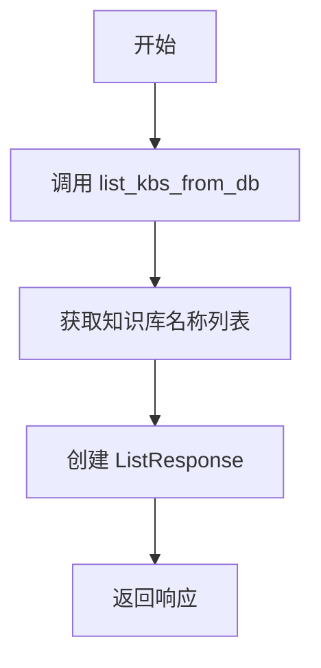
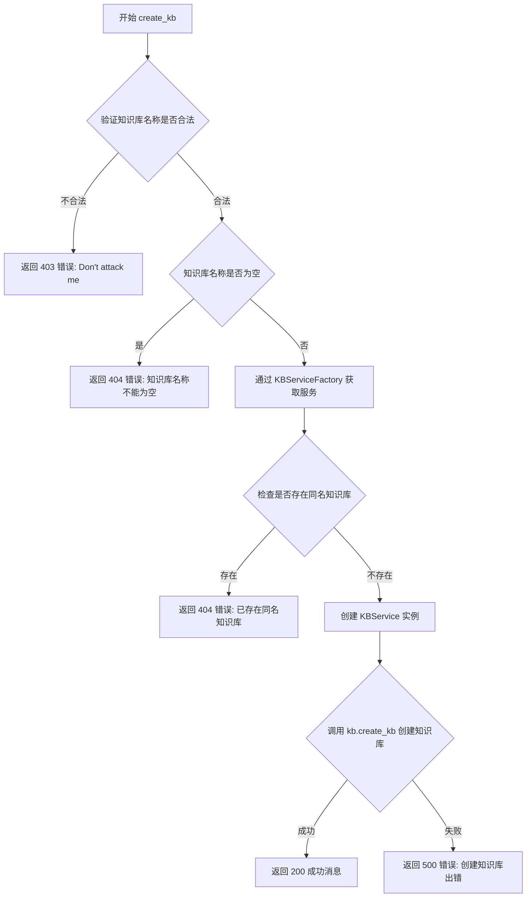

# `Langchain-Chatchat\libs\chatchat-server\chatchat\server\knowledge_base\kb_api.py` 详细设计文档

该代码是一个FastAPI接口模块，提供知识库（Knowledge Base）的管理功能，包括列出、创建和删除知识库，通过KBServiceFactory工厂类创建具体知识库服务，使用向量存储类型和嵌入模型来管理知识数据。

## 整体流程

```mermaid
graph TD
    A[开始] --> B{请求类型}
B -->|list_kbs| C[调用list_kbs_from_db获取知识库列表]
C --> D[返回ListResponse]
B -->|create_kb| E[验证知识库名称]
E --> F{名称是否合法?}
F -- 否 --> G[返回403错误]
F -- 是 --> H{检查名称是否为空}
H -- 是 --> I[返回404错误]
H -- 否 --> J{检查是否已存在同名知识库}
J -- 是 --> K[返回404错误]
J -- 否 --> L[创建KBService实例]
L --> M[调用kb.create_kb()]
M --> N{创建是否成功?}
N -- 是 --> O[返回200成功]
N -- 否 --> P[记录错误并返回500]
B -->|delete_kb| Q[验证知识库名称]
Q --> R{名称是否合法?}
R -- 否 --> S[返回403错误]
R -- 是 --> T[URL解码名称]
T --> U{知识库是否存在?}
U -- 否 --> V[返回404错误]
U -- 是 --> W[清空向量存储并删除知识库]
W --> X{删除是否成功?}
X -- 是 --> Y[返回200成功]
X -- 否 --> Z[记录错误并返回500]
```

## 类结构

```
该文件为API模块，无类定义
主要依赖外部模块：
├── KBServiceFactory (工厂类)
├── Settings (配置类)
├── BaseResponse/ListResponse (响应类)
└── validate_kb_name/list_kbs_from_db (工具函数)
```

## 全局变量及字段


### `logger`
    
模块级日志记录器，用于记录知识库管理过程中的日志信息

类型：`logging.Logger`
    


    

## 全局函数及方法


### `list_kbs`

获取知识库列表函数，用于从数据库中检索所有已创建的知识库名称并返回列表。

参数： 无

返回值：`ListResponse`，包含知识库名称列表的响应对象，其中 `data` 字段为知识库名称列表（`List[str]`）

#### 流程图



#### 带注释源码

```python
def list_kbs():
    # Get List of Knowledge Base
    # 调用知识库仓储层方法从数据库获取所有知识库名称
    # 返回包含知识库列表的 ListResponse 对象
    return ListResponse(data=list_kbs_from_db())
```

---

### 补充信息

#### 关键组件信息

| 组件名称 | 描述 |
|---------|------|
| `list_kbs_from_db` | 知识库仓储层函数，负责从数据库查询知识库列表 |
| `ListResponse` | 统一响应封装类，用于返回列表类型数据 |
| `chatchat.server.db.repository.knowledge_base_repository` | 知识库数据访问层模块 |

#### 潜在技术债务与优化空间

1. **缺乏参数校验**：虽然该函数无入参，但作为 API 端点可考虑添加权限验证
2. **错误处理缺失**：未对 `list_kbs_from_db()` 可能抛出的数据库异常进行捕获
3. **分页支持缺失**：未支持大规模知识库的分页查询，当知识库数量过多时可能影响性能

#### 其它项目

- **设计目标**：提供知识库的查询能力，支持前端获取已有知识库列表
- **约束**：依赖数据库连接正常，知识库数据需预先存在于数据库中
- **错误处理**：当前无显式错误处理，建议增加异常捕获并返回错误响应


### `create_kb`

创建新的知识库，该函数接收知识库名称、向量存储类型、知识库简介和嵌入模型等参数，验证输入合法性后，通过 KBServiceFactory 创建知识库实例并调用其创建方法，最后返回操作结果。

参数：

- `knowledge_base_name`：`str`，知识库的名称，用于标识和访问知识库
- `vector_store_type`：`str`，向量存储类型，默认为设置中的 DEFAULT_VS_TYPE
- `kb_info`：`str`，知识库的内容简介，用于 Agent 选择知识库时参考
- `embed_model`：`str`，嵌入模型，默认为系统默认的嵌入模型

返回值：`BaseResponse`，返回操作结果，包含状态码和消息信息

#### 流程图



#### 带注释源码

```python
def create_kb(
    knowledge_base_name: str = Body(..., examples=["samples"]),
    # 知识库名称，必填参数，通过 Body 从请求体中获取
    vector_store_type: str = Body(Settings.kb_settings.DEFAULT_VS_TYPE),
    # 向量存储类型，使用 Settings 中的默认值
    kb_info: str = Body("", description="知识库内容简介，用于Agent选择知识库。"),
    # 知识库的描述信息，用于 Agent 选择合适的知识库
    embed_model: str = Body(get_default_embedding())
    # 嵌入模型，默认为系统默认的嵌入模型
) -> BaseResponse:
    # 创建知识库的入口函数，接收四个参数并返回 BaseResponse 对象
    
    # 第一步：验证知识库名称的合法性，防止恶意输入
    if not validate_kb_name(knowledge_base_name):
        return BaseResponse(code=403, msg="Don't attack me")
    
    # 第二步：检查知识库名称是否为空
    if knowledge_base_name is None or knowledge_base_name.strip() == "":
        return BaseResponse(code=404, msg="知识库名称不能为空，请重新填写知识库名称")

    # 第三步：检查是否已存在同名知识库
    kb = KBServiceFactory.get_service_by_name(knowledge_base_name)
    if kb is not None:
        return BaseResponse(code=404, msg=f"已存在同名知识库 {knowledge_base_name}")

    # 第四步：创建 KBService 实例
    kb = KBServiceFactory.get_service(
        knowledge_base_name, vector_store_type, embed_model, kb_info=kb_info
    )
    
    # 第五步：调用 create_kb 方法创建知识库
    try:
        kb.create_kb()
    except Exception as e:
        # 捕获异常并记录错误日志
        msg = f"创建知识库出错： {e}"
        logger.error(f"{e.__class__.__name__}: {msg}")
        return BaseResponse(code=500, msg=msg)

    # 第六步：返回成功响应
    return BaseResponse(code=200, msg=f"已新增知识库 {knowledge_base_name}")
```


### `delete_kb`

该函数用于删除指定的知识库，首先验证知识库名称的合法性，然后通过知识库服务工厂获取对应的知识库服务，依次执行清空向量存储和删除知识库操作，最后返回操作结果。

参数：

-  `knowledge_base_name`：`str`（Body），要删除的知识库名称，示例值为 "samples"

返回值：`BaseResponse`，返回删除操作的结果，包含状态码和消息

#### 流程图

```mermaid
flowchart TD
    A[开始 delete_kb] --> B{验证知识库名称 validate_kb_name}
    B -->|不合法| C[返回 BaseResponse code=403, msg="Don't attack me"]
    B -->|合法| D[URL解码 knowledge_base_name]
    D --> E[KBServiceFactory.get_service_by_name 获取知识库服务]
    E --> F{知识库是否存在 kb is None}
    F -->|是| G[返回 BaseResponse code=404, msg=f"未找到知识库 {knowledge_base_name}"]
    F -->|否| H[调用 kb.clear_vs 清空向量存储]
    H --> I[调用 kb.drop_kb 删除知识库]
    I --> J{删除是否成功 status}
    J -->|成功| K[返回 BaseResponse code=200, msg=f"成功删除知识库 {knowledge_base_name}"]
    J -->|失败| L[捕获异常, 返回 BaseResponse code=500, msg=f"删除知识库时出现意外: {e}"]
    L --> M[返回 BaseResponse code=500, msg=f"删除知识库失败 {knowledge_base_name}"]
```

#### 带注释源码

```python
def delete_kb(
    knowledge_base_name: str = Body(..., examples=["samples"]),
) -> BaseResponse:
    # Delete selected knowledge base
    # 验证知识库名称是否合法，防止恶意输入
    if not validate_kb_name(knowledge_base_name):
        return BaseResponse(code=403, msg="Don't attack me")
    
    # 对知识库名称进行URL解码处理
    knowledge_base_name = urllib.parse.unquote(knowledge_base_name)

    # 通过知识库服务工厂根据名称获取对应的知识库服务实例
    kb = KBServiceFactory.get_service_by_name(knowledge_base_name)

    # 检查知识库是否存在于系统中
    if kb is None:
        return BaseResponse(code=404, msg=f"未找到知识库 {knowledge_base_name}")

    try:
        # 第一步：清空该知识库关联的向量存储（向量索引等数据）
        status = kb.clear_vs()
        # 第二步：删除整个知识库（包含配置信息和元数据）
        status = kb.drop_kb()
        # 判断删除操作是否成功
        if status:
            return BaseResponse(code=200, msg=f"成功删除知识库 {knowledge_base_name}")
    except Exception as e:
        # 捕获删除过程中可能出现的异常，如文件权限问题、存储连接问题等
        msg = f"删除知识库时出现意外： {e}"
        logger.error(f"{e.__class__.__name__}: {msg}")
        return BaseResponse(code=500, msg=msg)

    # 如果未进入异常分支但status为false，执行到此返回失败响应
    return BaseResponse(code=500, msg=f"删除知识库失败 {knowledge_base_name}")
```

## 关键组件


### 知识库服务工厂 (KBServiceFactory)

负责创建和管理知识库服务的工厂类，通过get_service_by_name和get_service方法获取知识库实例，支持不同类型的向量存储和嵌入模型。

### 知识库名称验证 (validate_kb_name)

用于验证知识库名称的安全性和合法性，防止恶意输入或无效命名。

### 知识库列表查询 (list_kbs_from_db)

从数据库中检索所有已创建的知识库列表，返回知识库的基本信息。

### 嵌入模型获取 (get_default_embedding)

获取系统配置的默认嵌入模型，用于将文本转换为向量表示，是知识库向量化的核心组件。

### 知识库服务基类 (KBService)

提供知识库操作的抽象接口，包括create_kb、drop_kb、clear_vs等方法，不同的向量存储类型实现此接口。

### 响应模型 (BaseResponse/ListResponse)

标准化的API响应格式，BaseResponse用于单对象操作响应，ListResponse用于列表查询响应，均包含状态码和消息字段。

### URL编码处理 (urllib.parse.unquote)

对知识库名称进行URL解码处理，确保中文字符等特殊字符能正确解析。

### 错误处理与日志记录

通过try-except捕获异常，使用logger记录错误信息，返回适当的HTTP状态码和错误消息给客户端。


## 问题及建议


### 已知问题

- **HTTP状态码使用不当**：`create_kb`中知识库已存在时返回404，但根据HTTP语义应返回409（Conflict）
- **死代码**：`delete_kb`函数最后的`return`语句永远不会执行，因为要么成功返回200，要么捕获异常返回500
- **URL解码不一致**：`delete_kb`中对`knowledge_base_name`做了URL解码，但`create_kb`中未做，可能导致创建和解绑操作使用不同的名称格式
- **重复验证逻辑**：`validate_kb_name`检查后，代码中再次检查`knowledge_base_name is None or knowledge_base_name.strip() == ""`，存在冗余
- **缺少堆栈跟踪**：异常捕获时只记录了错误消息，未记录完整的堆栈信息，不利于生产环境调试
- **参数校验不足**：`vector_store_type`和`embed_model`参数未做有效性校验，可能导致后续操作失败
- **日志上下文缺失**：日志记录未包含请求ID、用户操作等上下文信息，难以追溯问题
- **硬编码示例值**：Body参数中的`examples=["samples"]`是硬编码值，应根据实际场景动态生成

### 优化建议

- **统一状态码**：将"知识库已存在"的响应码改为409，"知识库名称为空"改为400
- **移除死代码**：删除`delete_kb`中永不执行的最后一行return语句
- **统一URL处理**：在`create_kb`中也对`knowledge_base_name`做URL解码，或在函数入口统一处理
- **简化验证逻辑**：移除`validate_kb_name`后的重复空值检查，或在`validate_kb_name`中统一处理
- **增强参数校验**：添加`vector_store_type`和`embed_model`的有效性验证，提前返回错误
- **完善异常日志**：使用`logger.exception()`或`traceback`模块记录完整堆栈信息
- **增加日志上下文**：在日志中添加request_id、operation_type等上下文信息
- **添加请求日志**：在函数入口添加请求参数日志，便于问题追踪和审计

## 其它


### 设计目标与约束

本模块旨在提供知识库的创建、删除和列表查看功能，支持多种向量存储类型，遵循RESTful API设计规范。设计约束包括：知识库名称需通过安全验证、仅支持已配置的嵌入模型、向量存储类型需在系统支持的范围内。

### 错误处理与异常设计

错误处理采用分层策略：输入验证失败返回403/404状态码，业务逻辑异常返回500状态码并记录详细日志。核心异常捕获包括：知识库名称验证异常、向量存储服务创建异常、知识库删除异常。每种异常均返回结构化的BaseResponse，包含错误码和描述信息。

### 数据流与状态机

数据流主要包含三个主要场景：列表查询直接调用数据库仓储获取知识库元数据；创建知识库需经过名称验证→服务实例化→存储层初始化→元数据持久化；删除知识库需经过URL解码→服务查找→向量存储清理→元数据删除。状态转换围绕知识库生命周期：不存在 → 创建中 → 已存在 → 删除中 → 不存在。

### 外部依赖与接口契约

核心依赖包括：KBServiceFactory（知识库服务工厂，负责服务实例化和管理）、list_kbs_from_db（数据库仓储函数，获取知识库列表）、validate_kb_name（名称验证工具函数）、get_default_embedding（获取默认嵌入模型）、Settings.kb_settings.DEFAULT_VS_TYPE（系统默认向量存储类型配置）。接口契约严格依赖这些外部组件的正确实现。

### 安全性考虑

安全措施包括：知识库名称的输入验证（防止注入攻击）、URL参数解码处理（防止URL编码绕过）、知识库存在性检查（防止重复创建）。当前实现缺少认证授权机制、访问频率限制、敏感操作审计日志等企业级安全特性。

### 性能考虑与优化空间

当前实现为同步阻塞模式，高并发场景下可能影响响应速度。优化方向包括：引入异步处理机制（async/await）、知识库列表缓存策略、创建/删除操作的异步任务队列化、批量操作支持。向量存储初始化可能耗时较长，建议增加超时控制和进度回调机制。

### 配置与参数说明

关键配置项：Settings.kb_settings.DEFAULT_VS_TYPE（默认向量存储类型，在Settings中定义）、get_default_embedding()返回的嵌入模型（需在系统配置中预先配置）。参数knowledge_base_name需符合命名规范（validate_kb_name函数约束）、vector_store_type需为系统支持的存储类型、kb_info为可选描述信息用于Agent知识库选择。

### 日志与监控

日志记录采用结构化方式，包含异常类名和详细错误信息。创建知识库失败记录e.__class__.__name__和具体错误信息；删除知识库异常同样记录错误类型和上下文。建议增加操作成功日志、关键性能指标（如创建/删除耗时）、API调用频次统计等监控能力。

### 测试策略建议

单元测试应覆盖：validate_kb_name的各种输入边界、KBServiceFactory的mock测试、各API函数的异常分支。集成测试应覆盖：完整创建流程、重复创建处理、删除不存在知识库、URL编码名称处理。需模拟KBServiceFactory的不同返回场景验证错误处理逻辑。

### 部署与运维注意事项

部署依赖：Python 3.x环境、FastAPI框架、chatchat相关依赖包。运维需关注：知识库存储目录的磁盘空间监控、嵌入模型服务的可用性、数据库连接池配置。建议配置健康检查端点，定期清理孤立资源（如已删除知识库但未清理的向量存储文件）。

### 接口详细说明

list_kbs接口无入参，返回ListResponse包含data字段为知识库名称列表。create_kb接口入参包括knowledge_base_name（必填）、vector_store_type（默认配置值）、kb_info（可选）、embed_model（默认嵌入模型），返回BaseResponse包含code和msg。delete_kb接口入参为knowledge_base_name（必填，支持URL编码），返回BaseResponse。所有接口均返回JSON格式数据。


    