# `Langchain-Chatchat\libs\chatchat-server\chatchat\server\knowledge_base\kb_cache\base.py` 详细设计文档

这是一个线程安全的缓存池实现，通过RLock锁机制和Event同步事件来管理并发访问，提供对象加载状态跟踪和LRU缓存淘汰策略，主要用于管理FAISS向量数据库等重量级对象的缓存。

## 整体流程

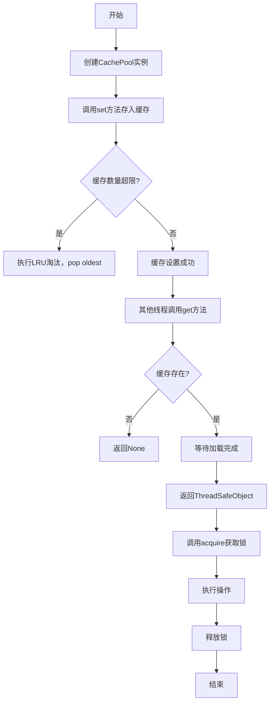

## 类结构

```
ThreadSafeObject (线程安全对象包装类)
└── 属性: _obj, _key, _pool, _lock, _loaded
└── 方法: __init__, __repr__, acquire, start_loading, finish_loading, wait_for_loading

CachePool (缓存池管理类)
└── 属性: _cache_num, _cache, atomic
└── 方法: __init__, keys, _check_count, get, set, pop, acquire
```

## 全局变量及字段


### `logger`
    
模块级日志记录器

类型：`logging.Logger`
    


### `ThreadSafeObject._obj`
    
被缓存的实际对象

类型：`Any`
    


### `ThreadSafeObject._key`
    
缓存键

类型：`Union[str, Tuple]`
    


### `ThreadSafeObject._pool`
    
所属缓存池引用

类型：`CachePool`
    


### `ThreadSafeObject._lock`
    
可重入锁

类型：`threading.RLock`
    


### `ThreadSafeObject._loaded`
    
加载完成事件

类型：`threading.Event`
    


### `CachePool._cache_num`
    
缓存最大数量，-1表示无限制

类型：`int`
    


### `CachePool._cache`
    
缓存存储的有序字典

类型：`OrderedDict`
    


### `CachePool.atomic`
    
全局操作锁

类型：`threading.RLock`
    
    

## 全局函数及方法


### `build_logger`

该函数是 `chatchat.utils` 模块提供的日志构建工具，用于创建并配置项目专用的 Logger 实例，以便在整个模块中统一进行日志记录。

参数：

- 无（该函数在代码中以无参数形式调用）

返回值：`logging.Logger`，返回配置好的 Python 标准库 Logger 对象，用于后续的日志记录操作。

#### 流程图

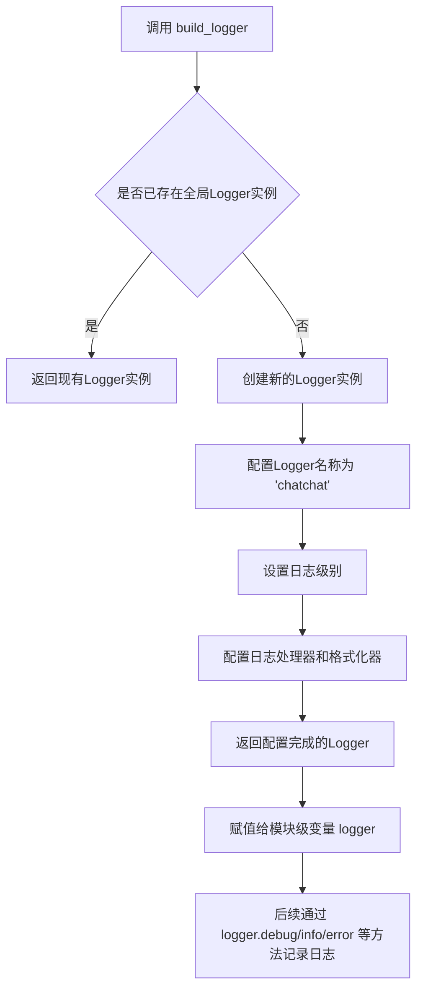

#### 带注释源码

```python
# 从外部依赖 chatchat.utils 导入日志构建函数
from chatchat.utils import build_logger

# 调用 build_logger() 创建/获取日志记录器
# 该函数无参数，返回一个配置好的 Logger 实例
logger = build_logger()

# 后续使用示例（在 ThreadSafeObject.acquire 方法中）
logger.debug(f"{owner} 开始操作：{self.key}。{msg}")
logger.debug(f"{owner} 结束操作：{self.key}。{msg}")
```

> **说明**：由于 `build_logger()` 是来自外部包 `chatchat.utils` 的依赖函数，上述流程图和源码注释基于该函数在项目中的典型使用模式推断所得。实际实现细节需参考 `chatchat` 包的源代码。


### `ThreadSafeObject.__init__`

初始化线程安全对象，创建一个带有线程同步机制（RLock 和 Event）的封装对象，用于安全地在多线程环境中管理和访问缓存对象。

参数：

- `key`：`Union[str, Tuple]`，对象的唯一标识键，用于在缓存池中定位对象
- `obj`：`Any`，要封装的对象，默认为 None
- `pool`：`CachePool`，对所属缓存池的引用，用于缓存池管理，默认为 None

返回值：`None`，构造函数无返回值，仅初始化实例属性

#### 流程图

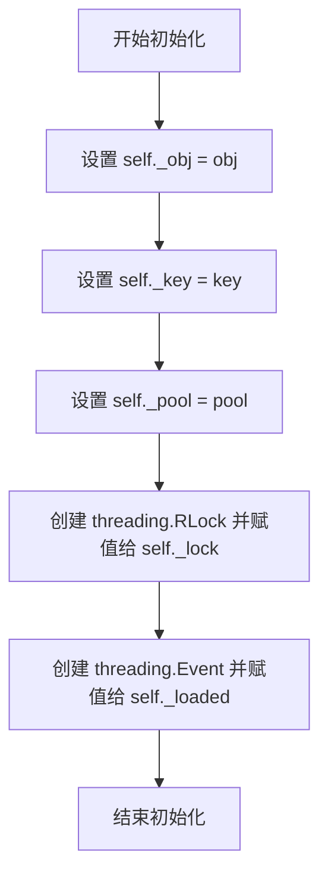

#### 带注释源码

```python
def __init__(
    self, key: Union[str, Tuple], obj: Any = None, pool: "CachePool" = None
):
    """
    初始化线程安全对象

    创建一个 ThreadSafeObject 实例，用于在多线程环境中安全地
    管理和访问底层对象。该类使用 RLock 实现可重入锁，确保
    同一线程可以多次获取锁而不造成死锁；使用 Event 实现
    加载状态同步。

    Args:
        key: 对象的唯一标识键，支持字符串或元组类型
        obj: 要封装的对象，默认为 None
        pool: 所属的缓存池引用，用于缓存池管理，默认为 None
    """
    # 存储底层对象
    self._obj = obj
    # 存储对象的唯一标识键
    self._key = key
    # 存储对缓存池的引用，用于访问缓存池功能（如移动到末尾）
    self._pool = pool
    # 创建可重入锁，用于线程同步
    # RLock 允许同一线程多次获取锁，适合需要嵌套锁的场景
    self._lock = threading.RLock()
    # 创建事件对象，用于同步加载状态
    # 可用于通知其他线程对象已加载完成
    self._loaded = threading.Event()
```


### `ThreadSafeObject.__repr__`

返回对象的字符串表示，用于调试和日志输出。

参数：

- `self`：`ThreadSafeObject`，表示当前对象实例

返回值：`str`，返回对象的字符串表示，格式为 `<类名: key: {key值}, obj: {obj值}>`

#### 流程图

```mermaid
flowchart TD
    A[开始 __repr__] --> B[获取类名: type(self).__name__]
    B --> C[访问 self.key 属性]
    C --> D[访问 self._obj 属性]
    D --> E[拼接格式化字符串]
    E --> F[返回字符串结果]
    F --> G[结束]
```

#### 带注释源码

```python
def __repr__(self) -> str:
    """
    返回对象的字符串表示，用于调试、日志输出和交互式查看。
    
    返回格式: <类名: key: {key值}, obj: {obj值}>
    例如: <ThreadSafeObject: key: some_key, obj: <FAISS index>>
    """
    # 获取当前类的名称
    cls = type(self).__name__
    
    # 使用f-string格式化返回字符串
    # self.key 是通过 @property 装饰器访问的 self._key
    # self._obj 是存储的实际对象
    return f"<{cls}: key: {self.key}, obj: {self._obj}>"
```


### `ThreadSafeObject.key`

获取缓存键的属性方法，返回在CachePool中唯一标识该缓存对象的键。

参数：无显式参数（隐式参数`self`为实例本身）

返回值：`Union[str, Tuple]`，返回缓存对象的键，用于在CachePool中唯一标识该对象

#### 流程图

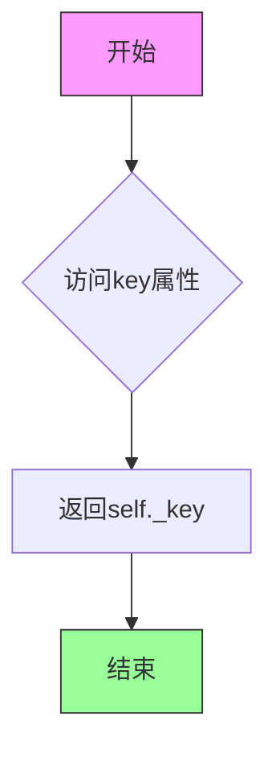

#### 带注释源码

```
@property
def key(self):
    """
    获取缓存键的属性访问器
    
    Returns:
        Union[str, Tuple]: 缓存对象的唯一标识键，可以是字符串或元组类型
    """
    return self._key
```

#### 详细说明

该属性是`ThreadSafeObject`类的只读属性，用于获取对象创建时传入的缓存键。键的类型在构造函数中定义为`Union[str, Tuple]`，可以是简单的字符串键（如文件路径）或复合键元组（如包含多个维度信息的元组）。此属性通常与`CachePool`配合使用，用于在缓存池中查找和管理对应的缓存对象。


### `ThreadSafeObject.acquire`

该方法是一个上下文管理器（context manager），用于获取线程锁并将安全对象交付给调用者进行操作。它会在持有锁期间将被访问的对象移至缓存池末尾（实现 LRU 缓存），在操作完成后自动释放锁，确保多线程环境下对共享对象的安全访问。

参数：

- `owner`：`str`，所有者标识符，用于日志记录，默认为空字符串时自动填充当前线程名称
- `msg`：`str`，操作描述信息，用于日志记录，默认为空字符串

返回值：`Generator[None, None, FAISS]`，生成器类型，返回上下文管理器，yield 的值为存储的对象（FAISS 类型）

#### 流程图

```mermaid
flowchart TD
    A[开始 acquire] --> B{owner 是否为空?}
    B -->|是| C[owner = thread {threading.get_native_id}]
    B -->|否| D[保持原 owner]
    C --> E[获取锁 self._lock.acquire]
    D --> E
    E --> F{self._pool 是否存在?}
    F -->|是| G[将 key 移至缓存末尾]
    F -->|否| H[跳过缓存移动]
    G --> I[记录日志: owner 开始操作 key msg]
    H --> I
    I --> J[yield self._obj 返回对象]
    J --> K[进入 try-finally 块]
    K --> L[记录日志: owner 结束操作 key msg]
    L --> M[释放锁 self._lock.release]
    M --> N[结束上下文管理器]
```

#### 带注释源码

```python
@contextmanager
def acquire(self, owner: str = "", msg: str = "") -> Generator[None, None, FAISS]:
    """
    上下文管理器：获取锁并返回对象供调用者操作
    
    参数:
        owner: str - 操作所有者标识，用于日志记录，默认为空时使用当前线程名
        msg: str - 操作描述信息，用于日志记录
    
    返回:
        Generator[None, None, FAISS] - 生成器上下文，yield 存储的对象
    """
    # 如果未指定 owner，则使用当前线程的原生 ID 作为标识
    owner = owner or f"thread {threading.get_native_id()}"
    try:
        # ===== 临界区开始 =====
        # 获取递归锁（可重入锁），支持同一线程多次获取
        self._lock.acquire()
        
        # 如果对象属于某个缓存池，将该对象移至 OrderedDict 末尾
        # 这实现 LRU（最近最少使用）缓存策略
        if self._pool is not None:
            self._pool._cache.move_to_end(self.key)
        
        # 记录调试日志：开始操作
        logger.debug(f"{owner} 开始操作：{self.key}。{msg}")
        
        # 将 self._obj（FAISS 对象）yield 给调用者
        # 调用者可在 with 语句块内安全地操作该对象
        yield self._obj
        # ===== 临界区结束 =====
        
    finally:
        # ===== 无论是否发生异常，都会执行以下清理 =====
        # 记录调试日志：结束操作
        logger.debug(f"{owner} 结束操作：{self.key}。{msg}")
        
        # 释放锁，允许其他线程获取锁并操作对象
        self._lock.release()
```


### `ThreadSafeObject.start_loading`

该方法用于开始加载对象时清除加载完成事件标志，通知其他线程该对象正在加载中，通常与 `finish_loading()` 和 `wait_for_loading()` 方法配合使用，实现线程安全的对象加载状态管理。

参数：
- （无，仅包含 `self` 隐式参数）

返回值：`None`，无返回值，用于执行清除事件的操作。

#### 流程图

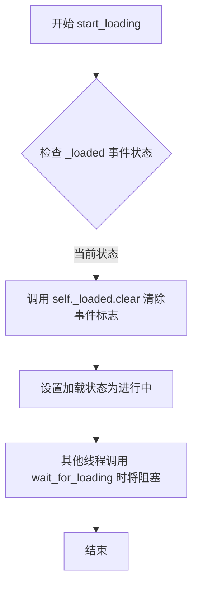

#### 带注释源码

```python
def start_loading(self):
    """
    开始加载对象，清除加载完成事件。
    
    该方法用于标记对象开始加载，通常在从外部源（如磁盘或网络）
    加载数据之前调用。它会清除 _loaded 事件，使其他线程调用
    wait_for_loading() 时会阻塞，直到 finish_loading() 被调用。
    
    使用场景：
        - 在从FAISS向量数据库加载索引之前调用
        - 在执行耗时的初始化操作之前调用
    
    注意：
        - 该方法本身是线程安全的
        - 通常与 finish_loading() 配对使用
        - 必须在数据加载完成后调用 finish_loading()
    
    示例：
        cache_obj = ThreadSafeObject(key="my_index")
        cache_obj.start_loading()
        try:
            # 执行加载操作
            load_data_from_disk()
        finally:
            cache_obj.finish_loading()
    """
    self._loaded.clear()  # 清除事件标志，设置加载状态为进行中
```


### `ThreadSafeObject.finish_loading()`

该方法用于标记对象加载已完成，通过设置内部线程事件（`_loaded`）来通知其他等待线程数据已准备就绪，允许被阻塞的线程继续执行。

参数：无

返回值：`None`，无返回值

#### 流程图

```mermaid
flowchart TD
    A[开始 finish_loading] --> B{检查 _loaded 事件状态}
    B -->|默认状态| C[调用 self._loaded.set()]
    C --> D[设置事件为已触发状态]
    D --> E[所有等待该事件的线程被唤醒]
    E --> F[方法返回]
    F --> G[结束]
```

#### 带注释源码

```python
def finish_loading(self):
    """
    标记加载完成，设置线程事件为已触发状态。
    
    该方法通常与 start_loading() 和 wait_for_loading() 配合使用：
    - start_loading(): 清除事件（设置为未触发）
    - finish_loading(): 设置事件（设置为已触发）
    - wait_for_loading(): 阻塞等待事件被触发
    
    使用场景：
    - 在异步加载数据完成后调用
    - 通知 CachePool.get() 方法可以返回已加载的对象
    - 实现生产者-消费者模式中的同步机制
    """
    self._loaded.set()  # 设置 threading.Event 为触发状态，唤醒所有等待线程
```

#### 补充说明

**调用关系**：

- `start_loading()` → `finish_loading()` 构成完整的加载生命周期
- `CachePool.get()` 调用 `cache.wait_for_loading()` 阻塞等待 `finish_loading()` 完成

**线程安全机制**：

- 内部使用 `threading.Event` 实现线程间同步
- `set()` 方法是线程安全的，可安全从多线程调用

**设计意图**：
该方法实现了经典的"信号量"模式，用于在多线程环境下协调数据的异步加载与消费，确保数据消费者只能获取已完全加载的数据。


### `ThreadSafeObject.wait_for_loading`

等待加载完成。当调用此方法时，当前线程会被阻塞，直到另一个线程调用 `finish_loading()` 方法将加载事件设置为已触发状态。该方法主要用于实现线程间的同步机制，确保在对象完全加载之前，其他线程不会访问该对象。

**参数：**

- （无参数）

**返回值：** `None`，无返回值。此方法会阻塞调用线程，直到加载事件被触发。

#### 流程图

```mermaid
flowchart TD
    A[调用 wait_for_loading] --> B{检查 _loaded 事件状态}
    B -->|事件已设置| C[立即返回]
    B -->|事件未设置| D[阻塞当前线程]
    D --> E{等待 finish_loading 调用}
    E -->|finish_loading 设置事件| C
    E -->|超时[如设置]| F[返回 False]
    
    style D fill:#f9f,stroke:#333
    style E fill:#ff9,stroke:#333
```

#### 带注释源码

```python
def wait_for_loading(self):
    """
    等待加载完成。
    
    该方法调用 threading.Event.wait()，会阻塞当前线程，
    直到另一个线程调用 finish_loading() 方法触发 _loaded 事件。
    在 CachePool.get() 中使用此方法来确保返回的对象已完成加载。
    """
    self._loaded.wait()
```

#### 补充说明

- **调用关系**：此方法通常与 `start_loading()` 和 `finish_loading()` 配合使用，形成完整的加载流程控制
- **使用场景**：在 `CachePool.get()` 方法中，获取缓存对象时会先调用 `wait_for_loading()`，确保返回的对象已完成初始化
- **线程安全**：内部使用 `threading.Event` 实现，无需额外的锁即可实现线程间的同步
- **潜在优化**：目前 `wait_for_loading()` 不支持超时参数，可能导致无限等待，建议增加可选的超时参数以提高健壮性


### `ThreadSafeObject.obj`

获取 ThreadSafeObject 中存储的缓存对象。该属性提供对内部 `_obj` 字段的访问，支持读取操作。

参数：无（仅包含隐式 `self` 参数）

返回值：`Any`，返回当前存储在缓存对象中的值

#### 流程图

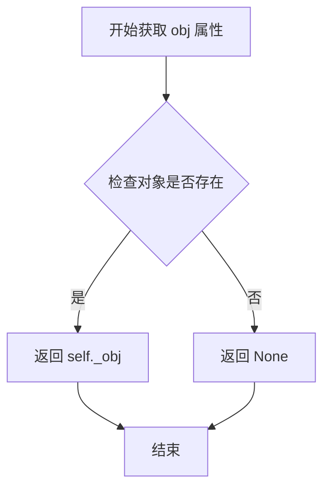

#### 带注释源码

```python
@property
def obj(self):
    """
    obj 属性的 getter 方法
    
    返回当前 ThreadSafeObject 中存储的缓存对象。
    该属性提供对内部 _obj 字段的只读访问。
    
    Returns:
        Any: 存储在缓存中的对象，可以是任意类型
    """
    return self._obj

@obj.setter
def obj(self, val: Any):
    """
    obj 属性的 setter 方法
    
    用于设置 ThreadSafeObject 中存储的缓存对象。
    
    Parameters:
        val (Any): 要存储的新对象，可以是任意类型
    """
    self._obj = val
```


### `ThreadSafeObject.obj`

设置缓存对象的属性值。该方法作为 `ThreadSafeObject` 类的 `obj` 属性的 setter 装饰器实现，用于更新内部持有的缓存对象实例。

参数：

- `self`：`ThreadSafeObject`，隐含的实例本身，代表当前线程安全对象
- `val`：`Any`，要设置的缓存对象值，可以是任意类型的数据

返回值：`None`，Python 属性 setter 不返回值

#### 流程图

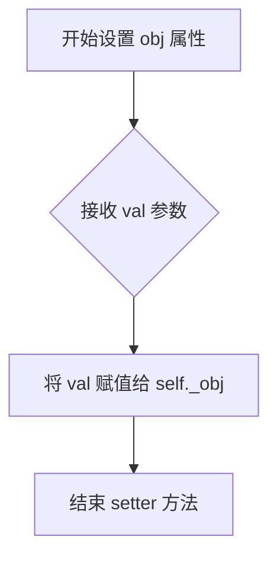

#### 带注释源码

```python
@obj.setter  # 使用装饰器将下面的方法定义为 obj 属性的 setter
def obj(self, val: Any):  # setter 方法，val 参数类型为 Any（任意类型）
    """
    设置缓存对象
    
    Args:
        val: 任意类型的缓存对象值
    """
    self._obj = val  # 将传入的值 val 赋值给内部属性 _obj，完成缓存对象的更新
```

#### 说明

该 setter 方法是 Python 属性（property）机制的一部分，通过 `@obj.setter` 装饰器将普通方法转换为属性的 setter。当执行 `thread_safe_obj.obj = some_value` 这样的赋值操作时，会自动调用此方法。设计上极其简洁，仅完成最基本的属性赋值操作，具体的线程安全锁定由外层的 `acquire` 上下文管理器负责处理。


### `CachePool.__init__`

初始化缓存池实例，设置缓存容量限制并初始化线程安全的存储结构。

参数：

-  `cache_num`：`int`，缓存池的最大容量，默认为 -1 表示无限制（不清理缓存）；正整数表示最多保留的缓存条目数量

返回值：`None`，无返回值（`__init__` 方法）

#### 流程图

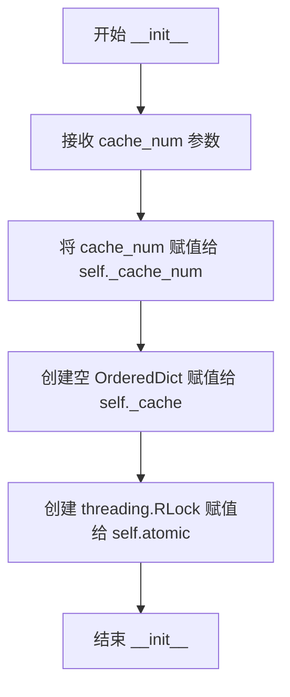

#### 带注释源码

```python
def __init__(self, cache_num: int = -1):
    """
    初始化缓存池
    
    Args:
        cache_num: 缓存池最大容量，-1 表示不限制容量
    """
    # 设置缓存数量上限，-1 表示无限制
    self._cache_num = cache_num
    
    # 创建有序字典用于存储缓存数据（保持插入顺序）
    # 使用 OrderedDict 以支持 LRU（最近最少使用）逻辑
    self._cache = OrderedDict()
    
    # 创建可重入锁，用于保证线程安全操作
    # RLock 允许同一线程多次获取锁
    self.atomic = threading.RLock()
```

#### 关联类信息

**类名**：`CachePool`

**类字段**：

| 字段名 | 类型 | 描述 |
|--------|------|------|
| `_cache_num` | `int` | 缓存池最大容量限制 |
| `_cache` | `OrderedDict` | 存储缓存对象的有序字典 |
| `atomic` | `threading.RLock` | 用于保证线程安全的可重入锁 |

**类方法**：

| 方法名 | 描述 |
|--------|------|
| `keys()` | 获取所有缓存键的列表 |
| `_check_count()` | 检查并清理超出容量限制的缓存 |
| `get()` | 根据键获取缓存的线程安全包装对象 |
| `set()` | 设置缓存键值对 |
| `pop()` | 移除并返回缓存项 |
| `acquire()` | 获取缓存对象的上下文管理器 |

#### 潜在优化建议

1. **可考虑添加容量预警机制**：当前仅在超量时被动清理，可增加主动预警回调
2. **序列化支持**：可添加 `__getstate__` 和 `__setstate__` 方法支持 pickle 序列化
3. **指标监控**：可添加缓存命中率、存储大小等指标的采集接口


### `CachePool.keys`

获取缓存池中所有缓存键的列表。

参数：无需参数

返回值：`List[str]`，返回缓存池中所有键的列表

#### 流程图

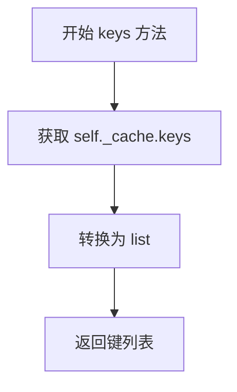

#### 带注释源码

```python
def keys(self) -> List[str]:
    """
    获取缓存池中所有缓存键的列表
    
    该方法返回一个包含当前所有缓存键的列表。
    返回的顺序与键的插入顺序一致（基于OrderedDict的特性）。
    
    Returns:
        List[str]: 缓存池中所有键的列表
    """
    return list(self._cache.keys())
```


### `CachePool._check_count`

检查当前缓存池大小是否超过配置的最大缓存数量，若超过则执行 LRU 淘汰策略，移除最旧（最早插入）的缓存条目。

参数：无

返回值：`None`，无返回值

#### 流程图

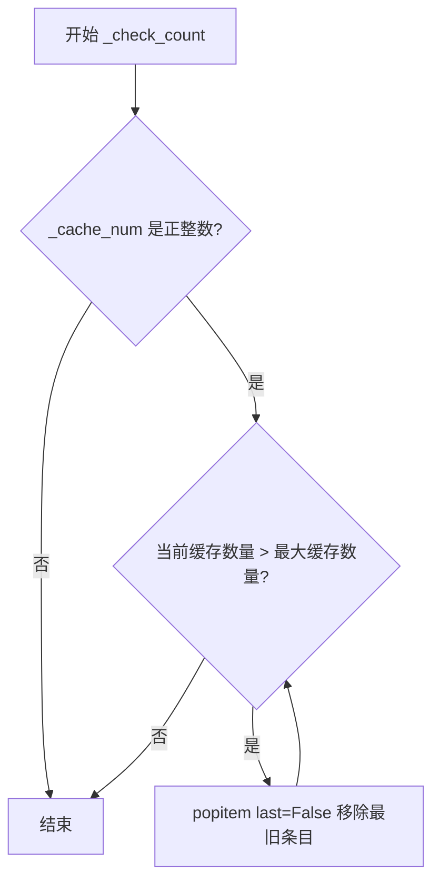

#### 带注释源码

```python
def _check_count(self):
    """
    检查并执行 LRU 淘汰
    当缓存数量超过配置的最大值时，移除最早插入的缓存条目
    """
    # 判断是否配置了正整数作为最大缓存数量
    if isinstance(self._cache_num, int) and self._cache_num > 0:
        # 循环淘汰直到缓存数量符合要求
        # 使用 popitem(last=False) 移除最早插入的条目（LRU策略）
        while len(self._cache) > self._cache_num:
            self._cache.popitem(last=False)
```


### `CachePool.get(key)`

获取缓存池中指定键对应的线程安全缓存对象，如果缓存存在则等待其加载完成后返回。

参数：

- `key`：`str`，缓存的唯一标识键，用于从缓存池中检索对应的线程安全对象

返回值：`ThreadSafeObject`，返回与给定键关联的线程安全对象，如果键不存在则返回 `None`

#### 流程图

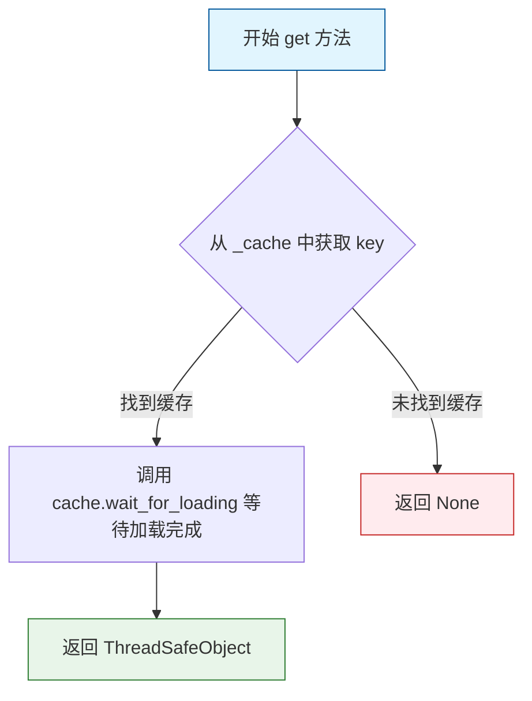

#### 带注释源码

```python
def get(self, key: str) -> ThreadSafeObject:
    """
    从缓存池中获取指定键对应的线程安全对象
    
    参数:
        key: 缓存的唯一标识键
    
    返回:
        找到时返回 ThreadSafeObject 对象，未找到时返回 None
    """
    # 使用字典的 get 方法尝试获取缓存，如果键不存在返回 None
    if cache := self._cache.get(key):
        # 如果缓存存在，调用 wait_for_loading 等待加载完成
        # 这确保了获取对象前，其内容已完全加载
        cache.wait_for_loading()
        # 返回线程安全对象
        return cache
    # 如果缓存不存在，隐式返回 None
```


### `CachePool.set`

该方法用于将指定的线程安全对象存储到缓存池中，并根据缓存数量限制自动清理过期或多余的缓存项。

参数：

- `key`：`str`，缓存的唯一标识键
- `obj`：`ThreadSafeObject`，要存储的线程安全对象实例

返回值：`ThreadSafeObject`，返回刚刚设置到缓存中的对象，便于链式调用或直接使用

#### 流程图

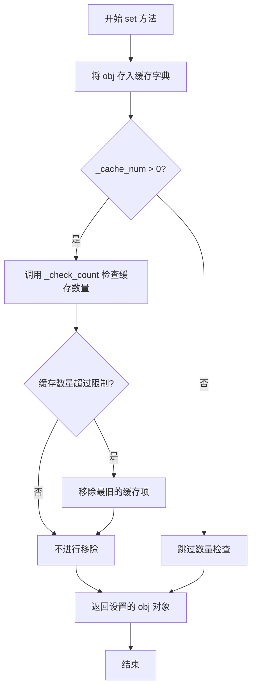

#### 带注释源码

```python
def set(self, key: str, obj: ThreadSafeObject) -> ThreadSafeObject:
    """
    设置缓存对象
    
    将指定的 ThreadSafeObject 对象存储到缓存池中，
    并在缓存数量超过配置限制时自动清理最旧的缓存项。
    
    Args:
        key: 缓存键，用于唯一标识缓存对象
        obj: ThreadSafeObject 实例，要缓存的对象
    
    Returns:
        ThreadSafeObject: 返回刚刚设置的对象
    """
    # 将对象存入有序字典缓存，使用key作为键
    self._cache[key] = obj
    
    # 检查并维护缓存数量限制，移除最旧的项
    self._check_count()
    
    # 返回设置的对象，支持链式调用
    return obj
```


### `CachePool.pop`

从缓存池中移除并返回指定的缓存对象，支持按 key 移除或 FIFO（先进先出）方式移除最早加入的缓存对象。

参数：

- `key`：`str`，可选参数，要移除的缓存项的键。当为 `None` 时，移除并返回缓存池中最早加入的项（FIFO 行为）

返回值：`ThreadSafeObject`，返回从缓存中移除的线程安全对象。如果指定了 key 但缓存中不存在该 key，则返回 `None`。

#### 流程图

```mermaid
flowchart TD
    A[开始 pop 方法] --> B{key 是否为 None?}
    B -->|是| C[调用 self._cache.popitem<br/>参数 last=False]
    C --> D[返回弹出的键值对<br/>Tuple[str, ThreadSafeObject]]
    B -->|否| E[调用 self._cache.pop<br/>参数 key, 默认值 None]
    E --> F{缓存中是否存在该 key?}
    F -->|是| G[返回 ThreadSafeObject]
    F -->|否| H[返回 None]
    D --> I[结束]
    G --> I
    H --> I
```

#### 带注释源码

```python
def pop(self, key: str = None) -> ThreadSafeObject:
    """
    从缓存池中移除并返回缓存对象。
    
    支持两种移除模式：
    1. FIFO 模式：当 key 为 None 时，移除最早加入的缓存项
    2. 指定 key 模式：当 key 指定时，移除指定 key 的缓存项
    
    参数:
        key: str, 缓存项的键。默认为 None，表示移除最早加入的项
        
    返回值:
        ThreadSafeObject: 
            - 当 key 为 None 时，返回 (key, ThreadSafeObject) 元组
            - 当 key 指定且存在时，返回 ThreadSafeObject
            - 当 key 指定但不存在时，返回 None
    """
    # 当 key 为 None 时，使用 popitem 移除最早加入的项（last=False 表示 FIFO）
    # popitem 返回一个 (key, value) 元组
    if key is None:
        return self._cache.popitem(last=False)
    # 当 key 指定时，从缓存中弹出指定 key 的项
    # 如果 key 不存在，pop 方法返回默认值 None（这里未显式指定，默认即为 None）
    else:
        return self._cache.pop(key, None)
```


### `CachePool.acquire`

获取缓存对象的上下文管理器，用于安全地访问和操作缓存中的对象。该方法首先根据 key 获取对应的缓存项，如果是 ThreadSafeObject 类型，还会将其移动到缓存末尾以保持访问顺序，最后返回对应的上下文管理器以确保线程安全的资源访问。

参数：

- `key`：`Union[str, Tuple]`，缓存的唯一标识键，可以是字符串或元组类型
- `owner`：`str`，可选参数，用于标识当前操作的所有者，默认为空字符串或当前线程 ID
- `msg`：`str`，可选参数，用于记录操作相关的描述信息，默认为空字符串

返回值：`Generator[None, None, Any]`，上下文管理器生成器，可用于 with 语句，确保在操作完成后正确释放锁

#### 流程图

```mermaid
flowchart TD
    A[开始 acquire] --> B[获取缓存: cache = self.get(key)]
    B --> C{缓存是否存在?}
    C -->|否| D[抛出 RuntimeError: 请求的资源 {key} 不存在]
    C -->|是| E{缓存是否为 ThreadSafeObject?}
    E -->|是| F[移动缓存到末尾: self._cache.move_to_end(key)]
    E -->|否| G[直接返回 cache]
    F --> H[返回 cache.acquire 上下文管理器]
    D --> I[结束]
    G --> I
    H --> I
```

#### 带注释源码

```python
def acquire(self, key: Union[str, Tuple], owner: str = "", msg: str = ""):
    """
    获取缓存对象的上下文管理器
    
    参数:
        key: 缓存的唯一标识键，支持字符串或元组类型
        owner: 操作所有者标识，默认为空字符串或当前线程ID
        msg: 操作描述信息，用于日志记录
    
    返回:
        上下文管理器生成器，用于安全访问缓存对象
    """
    # 根据key获取缓存对象
    cache = self.get(key)
    
    # 检查缓存是否存在
    if cache is None:
        # 缓存不存在时抛出运行时错误
        raise RuntimeError(f"请求的资源 {key} 不存在")
    
    # 检查缓存对象是否为ThreadSafeObject类型
    elif isinstance(cache, ThreadSafeObject):
        # 将该缓存项移动到OrderedDict末尾，保持最近访问顺序
        self._cache.move_to_end(key)
        # 返回ThreadSafeObject的acquire上下文管理器，确保线程安全
        return cache.acquire(owner=owner, msg=msg)
    
    else:
        # 对于非ThreadSafeObject类型，直接返回（可能是其他类型的缓存对象）
        return cache
```

## 关键组件


### ThreadSafeObject

线程安全的对象包装器，通过RLock和Event实现锁机制与惰性加载支持，用于包装缓存对象并提供统一的线程安全访问接口。

### CachePool

基于OrderedDict实现的LRU缓存池，支持最大缓存数量限制，提供线程安全的get/set/pop/acquire操作，通过_chec_count方法自动淘汰旧缓存。

### 线程锁机制

使用threading.RLock实现可重入锁，配合contextmanager装饰器实现上下文管理器的线程安全操作，确保并发访问时的数据一致性。

### 惰性加载支持

通过ThreadSafeObject的_start_loading、finish_loading和wait_for_loading方法配合threading.Event实现，等待加载完成后再返回对象。

### LRU缓存策略

使用OrderedDict的move_to_end方法实现最近最少使用策略，acquire操作会将访问的缓存项移到末尾，_check_count方法自动淘汰超量缓存。

### 上下文管理器acquire

提供with语法的线程安全资源获取方式，自动管理锁的获取与释放，并记录详细的调试日志。


## 问题及建议


### 已知问题

-   **CachePool的并发安全缺陷**：`CachePool.acquire`方法直接调用`self._cache.move_to_end(key)`而未使用`self.atomic`锁保护，在多线程并发访问时存在竞态条件，可能导致数据不一致
-   **ThreadSafeObject锁嵌套问题**：`CachePool.acquire`调用`cache.acquire()`时会再次获取锁，但由于外层已持有`self.atomic`，可能导致死锁风险或锁重入效率问题
-   **类型不一致风险**：`CachePool.acquire`方法中判断`isinstance(cache, ThreadSafeObject)`，但代码中`get`、`set`方法均只处理`ThreadSafeObject`类型，该判断逻辑表明存在类型转换或兼容性的潜在设计问题
-   **锁粒度设计不合理**：`CachePool.atomic`锁在类初始化时创建，但在`get`、`set`、`pop`、`_check_count`等关键方法中均未使用，无法保护共享缓存字典的并发访问
-   **缺乏超时机制**：`ThreadSafeObject.acquire`方法使用阻塞式获取锁，无超时参数，在死锁或长时间等待时可能导致线程永久阻塞
-   **缓存未命中处理不当**：`CachePool.get`方法在缓存不存在时返回`None`，但调用方`acquire`方法直接使用该返回值进行后续操作，未对`None`情况进行预判处理
-   **资源清理不完整**：`ThreadSafeObject`实现了加载事件机制，但未提供显式的资源释放或清理方法，可能导致线程事件对象泄漏
-   **OrderedDict操作非原子性**：`self._cache.move_to_end`和`popitem`操作在多线程环境下非原子，可能导致状态不一致

### 优化建议

-   **重构锁策略**：统一使用`CachePool.atomic`锁保护所有缓存操作，将`ThreadSafeObject`的锁仅用于对象级别的临界区，避免锁嵌套
-   **添加上下文管理器支持**：为`CachePool`实现`__enter__`和`__exit__`方法，支持`with`语句进行资源管理
-   **实现超时机制**：为`acquire`方法添加`timeout`参数，使用`acquire(timeout=...)`避免无限等待
-   **完善类型标注**：修正`get`方法返回类型为`Optional[ThreadSafeObject]`，并在`acquire`中统一处理类型分支
-   **添加并发测试**：针对多线程场景编写单元测试，覆盖并发读写、边界条件等场景
-   **优化缓存淘汰逻辑**：将`_check_count`的主动检查改为基于访问频率或时间的LRU策略，提高缓存命中率
-   **添加监控和日志**：在关键路径添加性能日志，记录锁等待时间、缓存命中率等指标
-   **考虑使用线程安全数据结构**：直接使用`threading.RLock`保护的字典或使用`queue.Queue`等并发原语简化设计


## 其它


### 设计目标与约束

本模块设计目标是为ChatChat系统提供高效的线程安全缓存机制，支持多线程环境下对FAISS向量数据库等对象的并发访问与缓存管理。核心约束包括：1) 使用RLock保证同一线程可重入加锁；2) 通过Event机制实现加载状态同步；3) 缓存池采用OrderedDict实现LRU淘汰策略；4) 缓存数量可通过cache_num参数配置。

### 错误处理与异常设计

主要异常场景包括：1) CachePool.acquire()方法在请求不存在的key时抛出RuntimeError；2) get()方法返回None时表示缓存未命中；3) ThreadSafeObject的acquire()方法使用contextmanager模式，确保锁在异常情况下也能正确释放。设计遵循"快速失败"原则，acquire操作在资源不存在时应立即报错而非阻塞等待。

### 数据流与状态机

ThreadSafeObject具有三种状态：加载中（_loaded Event未设置）、已加载（_loaded Event已设置）、使用中（持有锁）。状态转换流程：初始化→加载中→完成加载→可被获取→使用中→释放。CachePool的数据流为：外部请求→检查缓存→存在则返回（触发LRU移动）→不存在则报错，存入新对象时触发数量检查和LRU淘汰。

### 外部依赖与接口契约

依赖外部模块：1) langchain.embeddings.base.Embeddings - 类型提示使用；2) langchain.vectorstores.faiss.FAISS - acquire方法yield的类型；3) chatchat.utils.build_logger - 日志构建。接口契约：CachePool.get()返回ThreadSafeObject或None；CachePool.set()接受str key和ThreadSafeObject；ThreadSafeObject.acquire()返回contextmanager Generator。

### 性能考虑与优化空间

性能特性：1) 使用OrderedDict的move_to_end实现O(1) LRU更新；2) RLock支持同一线程重入，减少死锁风险；3) _check_count在set时遍历删除，存在O(n)复杂度。优化方向：1) 可考虑使用maxlen的deque替代OrderedDict实现更高效的LRU；2) 批量操作时可增加锁粗化优化；3) 缓存命中时的wait_for_loading可能造成不必要的等待。

### 并发安全性分析

线程安全机制包括：1) ThreadSafeObject内部使用RLock保护_obj访问；2) CachePool使用atomic（RLock）保护_cache字典操作；3) Event机制确保加载完成前其他线程等待。潜在竞态条件：1) get()和set()之间非原子操作，可能导致并发问题；2) _check_count()检查和删除之间存在时间窗口。建议在CachePool层面增加整体锁保护或使用线程安全的数据结构。

### 使用示例与配置说明

基本用法：
```python
# 初始化缓存池，最多缓存100个对象
pool = CachePool(cache_num=100)

# 创建线程安全对象
safe_obj = ThreadSafeObject(key="faiss_index", obj=faiss_index, pool=pool)

# 存入缓存
pool.set("faiss_index", safe_obj)

# 获取并使用（线程安全）
with pool.acquire("faiss_index", owner="worker1") as obj:
    # 操作obj
    pass
```

配置说明：cache_num=-1表示无限制，>0表示最大缓存数量，超出后采用LRU策略淘汰最旧条目。

    