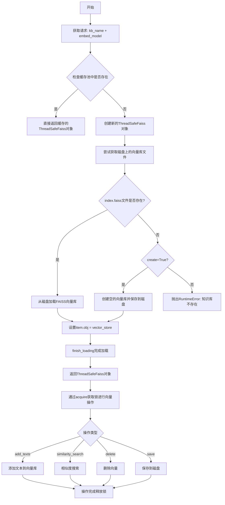
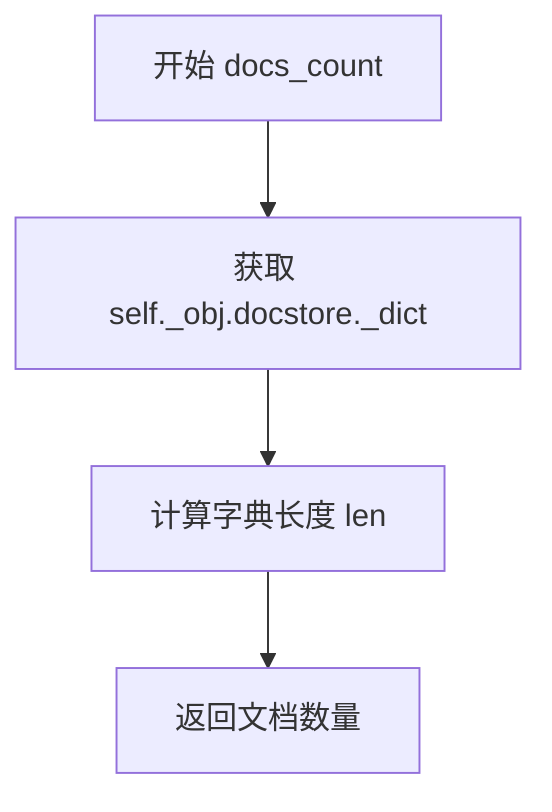
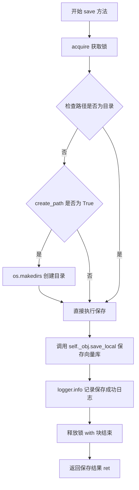
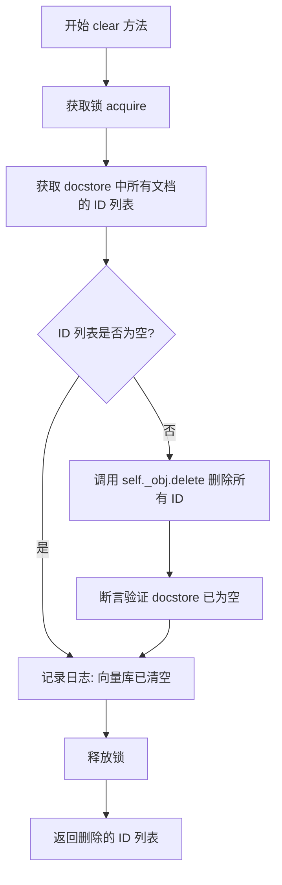
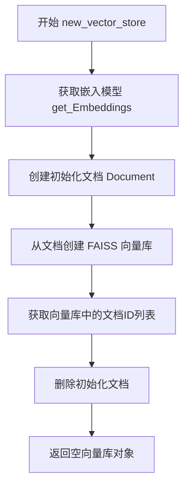
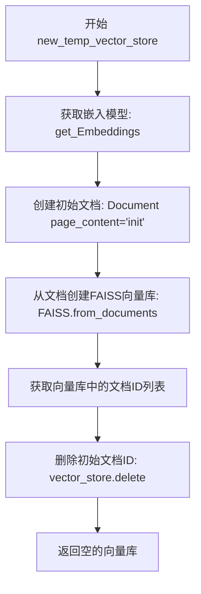
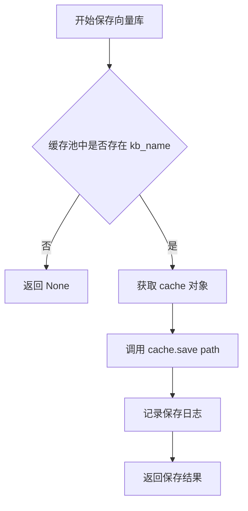
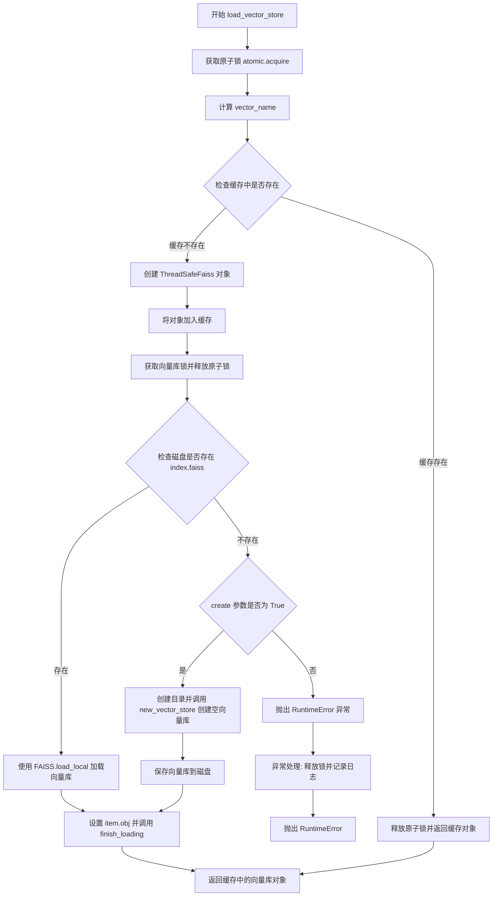
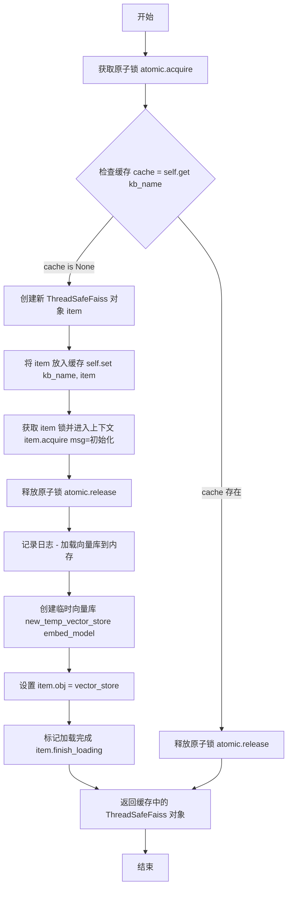

# `Langchain-Chatchat\libs\chatchat-server\chatchat\server\knowledge_base\kb_cache\faiss_cache.py` 详细设计文档

该代码实现了一个线程安全的FAISS向量库缓存池管理系统，用于管理知识库（KB）和临时记忆（Memo）的向量存储，支持向量的加载、保存、清理和并发访问，包含KBFaissPool（持久化向量库）和MemoFaissPool（临时向量库）两种缓存池实现。

## 整体流程



## 类结构

```
CachePool (缓存池基类)
└── _FaissPool (FAISS缓存池基类)
    ├── KBFaissPool (知识库FAISS缓存池)
    └── MemoFaissPool (临时记忆FAISS缓存池)

ThreadSafeObject (线程安全对象基类)
└── ThreadSafeFaiss (线程安全FAISS向量库封装)

InMemoryDocstore (LangChain docstore)
└── _new_ds_search (Monkey patch补丁)
```

## 全局变量及字段


### `kb_faiss_pool`
    
知识库FAISS缓存池单例，用于管理持久化向量库的加载、保存和缓存

类型：`KBFaissPool`
    


### `memo_faiss_pool`
    
临时记忆FAISS缓存池单例，用于管理内存中的临时向量库

类型：`MemoFaissPool`
    


### `ThreadSafeFaiss.key`
    
缓存键，用于唯一标识向量库实例

类型：`Any`
    


### `ThreadSafeFaiss._obj`
    
底层FAISS向量库对象，存储实际的向量数据

类型：`Any`
    


### `ThreadSafeFaiss.pool`
    
所属的缓存池引用，用于管理该向量库的生命周期

类型：`Any`
    


### `_FaissPool.atomic`
    
原子操作锁，用于保证多线程环境下缓存操作的安全性

类型：`Any`
    


### `_FaissPool.cache`
    
缓存字典，存储向量库实例的键值对映射

类型：`Dict`
    
    

## 全局函数及方法


### `_new_ds_search`

该函数是一个补丁函数，用于为 `InMemoryDocstore` 类添加文档ID搜索支持。它通过替换原始的 `search` 方法，实现根据文档ID直接查找文档的功能，并在返回的 `Document` 对象的 `metadata` 中添加 `id` 字段。

参数：

- `self`：`InMemoryDocstore`，被补丁的 InMemoryDocstore 实例，隐式参数
- `search`：`str`，要搜索的文档ID

返回值：`Union[str, Document]`，如果找到文档则返回包含 `id` 元数据的 `Document` 对象，否则返回错误提示字符串

#### 流程图

```mermaid
flowchart TD
    A[开始 _new_ds_search] --> B{search 是否在 self._dict 中}
    B -->|否| C[返回错误消息: ID {search} not found.]
    B -->|是| D[从 self._dict 获取文档: doc = self._dict[search]
    D --> E{doc 是否为 Document 实例}
    E -->|是| F[设置 doc.metadata['id'] = search]
    E -->|否| G[直接返回 doc]
    F --> H[返回 doc]
    C --> I[结束]
    G --> I
    H --> I
```

#### 带注释源码

```python
# patch FAISS to include doc id in Document.metadata
def _new_ds_search(self, search: str) -> Union[str, Document]:
    """
    补丁函数：为 InMemoryDocstore 添加文档ID搜索支持
    
    参数:
        self: InMemoryDocstore 实例，被补丁的文档存储对象
        search: str，要搜索的文档ID
    
    返回:
        Union[str, Document]: 找到的文档对象（已添加id到metadata）或错误消息字符串
    """
    # 检查搜索的ID是否存在于文档存储的字典中
    if search not in self._dict:
        # 不存在则返回错误提示消息
        return f"ID {search} not found."
    else:
        # 存在则从字典中获取对应的文档对象
        doc = self._dict[search]
        # 如果文档是 Document 类型，则在元数据中添加 id 字段
        if isinstance(doc, Document):
            doc.metadata["id"] = search
        # 返回文档对象（可能包含更新后的metadata）
        return doc
```

#### 关键组件信息

| 名称 | 一句话描述 |
|------|-----------|
| `InMemoryDocstore` | LangChain 提供的内存文档存储类，用于存储 Document 对象 |
| `_new_ds_search` | 补丁函数，为 InMemoryDocstore 添加基于文档ID的搜索功能 |
| `Document` | LangChain 模式类，表示带有页面内容和元数据的文档 |

#### 技术债务与优化空间

1. **修改原类行为**：通过直接替换类方法的方式修改第三方库行为，这种 monkey patching 方式可能导致代码维护困难，难以追踪
2. **错误处理单一**：仅通过字符串返回错误信息，调用方需要额外判断返回类型，可考虑抛出异常或使用 Result 模式
3. **缺乏类型安全**：虽然使用了 `Union[str, Document]` 类型提示，但调用方需要自行判断返回类型
4. **文档ID覆盖风险**：如果 Document 对象的 metadata 中已存在 `id` 字段，此补丁会直接覆盖原有值，可能导致数据丢失


### `ThreadSafeFaiss.__repr__`

返回 ThreadSafeFaiss 对象的字符串表示形式，用于调试和日志输出，包含对象的类名、键、底层 FAISS 对象以及文档数量。

参数：无需参数（Python 特殊方法 `__repr__` 自动接收 `self` 作为隐式参数）

返回值：`str`，返回格式化的字符串，描述 ThreadSafeFaiss 实例的关键信息

#### 流程图

```mermaid
flowchart TD
    A[开始 __repr__] --> B[获取类名: type(self).__name__]
    B --> C[获取 self.key]
    C --> D[获取 self._obj]
    D --> E[调用 self.docs_count 获取文档数量]
    E --> F[格式化字符串]
    F --> G[返回字符串结果]
    
    B -.-> B1[cls = 'ThreadSafeFaiss']
    C -.-> C1[key = self.key]
    D -.-> D1[obj = self._obj 底层FAISS对象]
    E -.-> E1[docs_count = 文档数量]
    F -.-> F1[返回 <ThreadSafeFaiss: key: ..., obj: ..., docs_count: ...>]
```

#### 带注释源码

```python
def __repr__(self) -> str:
    """
    返回对象的字符串表示形式
    
    Returns:
        str: 包含类名、键、底层对象和文档数量的格式化字符串
    """
    # 获取当前类的名称
    cls = type(self).__name__
    
    # 格式化并返回字符串表示，包含：
    # - cls: 类名 (ThreadSafeFaiss)
    # - self.key: 缓存键 (通常为元组如 (kb_name, vector_name))
    # - self._obj: 底层的 FAISS 向量库对象
    # - self.docs_count(): 文档数量，通过调用 docs_count 方法获取
    return f"<{cls}: key: {self.key}, obj: {self._obj}, docs_count: {self.docs_count()}>"
```


### `ThreadSafeFaiss.docs_count`

返回向量库中当前加载的文档数量，用于获取内存中文档总数。

参数：

- 无（仅 `self` 隐式参数）

返回值：`int`，返回向量库文档存储中的文档数量

#### 流程图



#### 带注释源码

```python
def docs_count(self) -> int:
    """
    返回向量库中文档的数量
    
    该方法通过获取FAISS向量存储的内部文档存储字典的长度来计算
    当前加载到内存中的文档总数
    
    Returns:
        int: 文档数量，等于 docstore 内部字典的长度
    """
    # 访问底层 FAISS 对象的文档存储字典，并返回其长度
    return len(self._obj.docstore._dict)
```


### `ThreadSafeFaiss.save`

将向量库保存到磁盘，支持自动创建目录，并记录保存日志。

参数：

- `path`：`str`，保存向量库的目录路径
- `create_path`：`bool`，默认为`True`，是否在路径不存在时自动创建目录

返回值：`Any`，返回FAISS向量库`save_local`方法的执行结果，通常为`None`

#### 流程图



#### 带注释源码

```python
def save(self, path: str, create_path: bool = True):
    """
    将向量库保存到磁盘
    
    参数:
        path: 保存路径
        create_path: 是否在路径不存在时创建目录
    """
    # 使用 with 语句获取锁，确保线程安全
    with self.acquire():
        # 如果路径不存在且 create_path 为 True，则创建目录
        if not os.path.isdir(path) and create_path:
            os.makedirs(path)
        # 调用 FAISS 对象的 save_local 方法保存到本地
        ret = self._obj.save_local(path)
        # 记录保存成功的日志，包含向量库的 key
        logger.info(f"已将向量库 {self.key} 保存到磁盘")
    # 返回保存结果（通常为 None）
    return ret
```


### `ThreadSafeFaiss.clear`

清空向量库中的所有向量，删除所有存储的文档和对应的向量数据。

参数：

- 无（仅包含隐式参数 `self`，代表 `ThreadSafeFaiss` 实例本身）

返回值：`List`，返回被删除的向量ID列表，如果向量库为空则返回空列表

#### 流程图



#### 带注释源码

```python
def clear(self):
    """
    清空向量库中的所有向量
    
    该方法线程安全地清空向量库中的所有文档和向量数据。
    通过获取锁来确保在多线程环境下安全执行删除操作。
    """
    # 初始化返回值为空列表
    ret = []
    
    # 使用 with 语句确保锁的获取和释放
    with self.acquire():
        # 获取 docstore 字典中所有键（即文档ID）
        ids = list(self._obj.docstore._dict.keys())
        
        # 检查是否存在需要删除的文档
        if ids:
            # 调用 FAISS 对象的 delete 方法删除所有文档
            # 返回被删除的 ID 列表
            ret = self._obj.delete(ids)
            
            # 断言验证删除后 docstore 是否为空
            # 这是一个调试检查，确保删除操作完全成功
            assert len(self._obj.docstore._dict) == 0
        
        # 记录清空向量库的日志，包含向量库的 key 标识
        logger.info(f"已将向量库 {self.key} 清空")
    
    # 返回被删除的 ID 列表（如果为空则返回空列表）
    return ret
```


### `_FaissPool.new_vector_store`

创建一个空的持久化向量库（FAISS），用于后续向知识库中添加文档数据。

参数：

- `self`：`_FaissPool`，类实例本身
- `kb_name`：`str`，知识库名称，用于标识向量库
- `embed_model`：`str`，嵌入模型名称，默认为 `get_default_embedding()` 的返回值

返回值：`FAISS`，返回一个新创建的空向量库对象

#### 流程图



#### 带注释源码

```python
def new_vector_store(
    self,
    kb_name: str,
    embed_model: str = get_default_embedding(),
) -> FAISS:
    """
    创建一个空的持久化向量库
    
    参数:
        kb_name: 知识库名称
        embed_model: 嵌入模型名称，默认为系统默认嵌入模型
    
    返回:
        FAISS: 空向量库对象，可用于后续添加文档
    """
    # 获取指定嵌入模型的向量化工具
    embeddings = get_Embeddings(embed_model=embed_model)
    
    # 创建一个初始化文档（仅用于初始化向量库结构）
    doc = Document(page_content="init", metadata={})
    
    # 从文档列表创建 FAISS 向量库（会生成向量索引）
    vector_store = FAISS.from_documents([doc], embeddings, normalize_L2=True)
    
    # 获取向量库中所有文档的ID（包含初始文档）
    ids = list(vector_store.docstore._dict.keys())
    
    # 删除初始文档，得到真正的空向量库
    vector_store.delete(ids)
    
    # 返回空的向量库对象
    return vector_store
```


### `_FaissPool.new_temp_vector_store`

创建新的临时向量库，用于在内存中存储临时的向量数据，不持久化到磁盘。

参数：

- `self`：`_FaissPool`，缓存池实例本身
- `embed_model`：`str`，使用的嵌入模型名称，默认为 `get_default_embedding()` 的返回值

返回值：`FAISS`，返回一个空的 FAISS 向量库实例

#### 流程图



#### 带注释源码

```python
def new_temp_vector_store(
    self,
    embed_model: str = get_default_embedding(),
) -> FAISS:
    # create an empty vector store
    # 第一步：获取嵌入模型实例
    embeddings = get_Embeddings(embed_model=embed_model)
    
    # 第二步：创建一个初始文档作为向量库的种子数据
    # 这个文档仅用于初始化向量库结构，后续会被删除
    doc = Document(page_content="init", metadata={})
    
    # 第三步：从文档创建FAISS向量库
    # normalize_L2=True 表示使用L2归一化
    vector_store = FAISS.from_documents([doc], embeddings, normalize_L2=True)
    
    # 第四步：获取向量库中所有文档的ID
    ids = list(vector_store.docstore._dict.keys())
    
    # 第五步：删除初始文档ID，得到一个空的向量库
    # 这样可以避免向量库因为没有任何向量而报错
    vector_store.delete(ids)
    
    # 返回空的FAISS向量库实例
    return vector_store
```


### `_FaissPool.save_vector_store`

该方法是 Faiss 向量库缓存池的保存功能，负责将指定知识库名称的向量库从内存缓存保存到磁盘持久化存储。它通过缓存池获取向量库对象，并调用其内部保存方法完成持久化操作。

参数：

- `kb_name`：`str`，知识库名称，用于从缓存池中定位并获取对应的向量库实例
- `path`：`str`，可选参数，保存路径，默认为 None，将传递给底层向量库的保存方法

返回值：`Any`，返回底层向量库 `save_local` 方法的返回值，通常为 None 或保存操作结果

#### 流程图



#### 带注释源码

```python
def save_vector_store(self, kb_name: str, path: str = None):
    """
    保存向量库到磁盘
    
    参数:
        kb_name: str - 知识库名称，用于从缓存池中获取向量库
        path: str - 保存路径，默认为 None
    
    返回:
        Any - 底层向量库保存操作的返回值
    """
    # 从缓存池中获取指定名称的向量库对象
    # 如果不存在则 cache 为 None
    if cache := self.get(kb_name):
        # 调用向量库对象的 save 方法进行持久化保存
        # 传递 path 参数，如果为 None 则使用向量库内部默认路径
        return cache.save(path)
```


### `_FaissPool.unload_vector_store`

卸载指定的向量库，从缓存池中移除并释放相关资源。

参数：

- `kb_name`：`str`，知识库名称，用于指定需要卸载的向量库

返回值：`None`，该方法没有显式返回值

#### 流程图

```mermaid
flowchart TD
    A[开始卸载向量库] --> B{获取缓存: self.get(kb_name)}
    B -->|缓存存在| C[从缓存池移除: self.pop(kb_name)]
    B -->|缓存不存在| D[结束 - 什么都不做]
    C --> E[记录日志: 成功释放向量库]
    E --> F[结束]
```

#### 带注释源码

```python
def unload_vector_store(self, kb_name: str):
    """
    卸载指定的向量库。
    
    参数:
        kb_name: str - 知识库名称
        
    注意:
        该方法从缓存池中移除向量库，但不会保存到磁盘。
        如果需要保存后再卸载，应先调用 save_vector_store。
    """
    # 使用海象运算符（walrus operator）检查缓存是否存在
    # 如果缓存存在，则执行 pop 操作移除该缓存
    if cache := self.get(kb_name):
        self.pop(kb_name)  # 从缓存池中移除指定 kb_name 的向量库
        logger.info(f"成功释放向量库：{kb_name}")  # 记录释放成功的日志信息
```


### `KBFaissPool.load_vector_store`

该方法用于从磁盘加载知识库的向量库，如果磁盘上不存在对应的向量库文件且 `create` 参数为 True，则创建一个新的空向量库并保存到磁盘。该方法支持线程安全的并发访问，使用原子锁确保初始化过程的线程安全。

参数：

- `kb_name`：`str`，知识库的名称，用于标识和定位向量库
- `vector_name`：`str = None`，向量存储的具体名称，默认为 None，此时会使用 `embed_model` 替换冒号后的结果作为名称
- `create`：`bool = True`，当向量库不存在时是否创建新的空向量库，默认为 True
- `embed_model`：`str = get_default_embedding()`，用于向量化的嵌入模型，默认为系统默认的嵌入模型

返回值：`ThreadSafeFaiss`，返回线程安全的 FAISS 向量库对象，如果加载或创建失败则抛出 `RuntimeError` 异常

#### 流程图



#### 带注释源码

```python
def load_vector_store(
    self,
    kb_name: str,
    vector_name: str = None,
    create: bool = True,
    embed_model: str = get_default_embedding(),
) -> ThreadSafeFaiss:
    # 获取原子锁，确保多线程环境下只有一个线程能执行初始化逻辑
    self.atomic.acquire()
    locked = True
    # 如果未指定 vector_name，则使用 embed_model 替换冒号为下划线作为默认名称
    vector_name = vector_name or embed_model.replace(":", "_")
    # 尝试从缓存中获取向量库，使用元组 (kb_name, vector_name) 作为键
    cache = self.get((kb_name, vector_name))
    try:
        if cache is None:
            # 缓存不存在，创建新的 ThreadSafeFaiss 对象并加入缓存
            item = ThreadSafeFaiss((kb_name, vector_name), pool=self)
            self.set((kb_name, vector_name), item)
            # 获取该向量库的专属锁，释放全局原子锁
            with item.acquire(msg="初始化"):
                self.atomic.release()
                locked = False
                logger.info(
                    f"loading vector store in '{kb_name}/vector_store/{vector_name}' from disk."
                )
                # 获取向量库文件的完整路径
                vs_path = get_vs_path(kb_name, vector_name)

                # 检查磁盘上是否存在 index.faiss 文件
                if os.path.isfile(os.path.join(vs_path, "index.faiss")):
                    # 存在则从磁盘加载向量库
                    embeddings = get_Embeddings(embed_model=embed_model)
                    vector_store = FAISS.load_local(
                        vs_path,
                        embeddings,
                        normalize_L2=True,
                        allow_dangerous_deserialization=True,
                    )
                elif create:
                    # 不存在且 create=True，则创建新的空向量库
                    if not os.path.exists(vs_path):
                        os.makedirs(vs_path)
                    vector_store = self.new_vector_store(
                        kb_name=kb_name, embed_model=embed_model
                    )
                    # 保存到磁盘以便后续使用
                    vector_store.save_local(vs_path)
                else:
                    # 不存在且 create=False，抛出异常
                    raise RuntimeError(f"knowledge base {kb_name} not exist.")
                # 设置向量库对象并标记加载完成
                item.obj = vector_store
                item.finish_loading()
        else:
            # 缓存已存在，直接释放原子锁
            self.atomic.release()
            locked = False
    except Exception as e:
        # 异常处理：如果锁仍未释放则释放它
        if locked:
            self.atomic.release()
        logger.exception(e)
        raise RuntimeError(f"向量库 {kb_name} 加载失败。")
    # 返回缓存中的向量库对象
    return self.get((kb_name, vector_name))
```


### `MemoFaissPool.load_vector_store`

加载临时向量库（仅内存），用于管理内存中的临时 FAISS 向量库缓存，支持线程安全的访问和延迟加载。

参数：

- `kb_name`：`str`，知识库名称，作为缓存键标识不同的临时向量库
- `embed_model`：`str`，嵌入模型名称，默认为 `get_default_embedding()` 的返回值，用于创建向量库的嵌入函数

返回值：`ThreadSafeFaiss`，返回线程安全的 FAISS 向量库对象，如果缓存中已存在则直接返回，否则创建新的临时向量库并返回

#### 流程图



#### 带注释源码

```python
def load_vector_store(
    self,
    kb_name: str,
    embed_model: str = get_default_embedding(),
) -> ThreadSafeFaiss:
    """
    加载临时向量库（仅内存）
    
    参数:
        kb_name: 知识库名称，作为缓存键
        embed_model: 嵌入模型名称，默认为默认嵌入模型
    
    返回:
        ThreadSafeFaiss: 线程安全的 FAISS 向量库对象
    """
    # 获取原子锁，保证多线程访问缓存池时的线程安全
    self.atomic.acquire()
    
    # 从缓存中获取指定 kb_name 的向量库
    cache = self.get(kb_name)
    
    # 如果缓存中没有该向量库，则创建新的临时向量库
    if cache is None:
        # 创建线程安全的 FAISS 对象，使用 kb_name 作为键
        item = ThreadSafeFaiss(kb_name, pool=self)
        
        # 将新创建的 item 加入缓存
        self.set(kb_name, item)
        
        # 获取 item 的锁并进入上下文管理器
        with item.acquire(msg="初始化"):
            # 在初始化前释放原子锁，避免阻塞其他线程
            self.atomic.release()
            
            # 记录日志：正在加载向量库到内存
            logger.info(f"loading vector store in '{kb_name}' to memory.")
            
            # 创建空的临时向量库（仅内存，不持久化）
            vector_store = self.new_temp_vector_store(embed_model=embed_model)
            
            # 将向量库对象赋值给 item.obj
            item.obj = vector_store
            
            # 标记加载完成
            item.finish_loading()
    else:
        # 缓存已存在，直接释放原子锁
        self.atomic.release()
    
    # 返回缓存中的 ThreadSafeFaiss 对象
    return self.get(kb_name)
```

## 关键组件


### ThreadSafeFaiss

线程安全的FAISS向量库封装类，继承自ThreadSafeObject，提供文档计数、保存到磁盘、清空向量库等核心操作。

### _FaissPool

FAISS向量库缓存池基类，继承自CachePool，提供创建新向量库、创建临时向量库、保存向量库、卸载向量库等基础方法。

### KBFaissPool

知识库FAISS向量库缓存池，继承自_FaissPool，负责从磁盘加载或创建知识库向量库，支持原子操作和线程安全的初始化流程。

### MemoFaissPool

临时向量库缓存池，继承自_FaissPool，用于管理内存中的临时向量库，支持按需创建和缓存管理。

### 向量索引与惰性加载

通过缓存池机制实现向量库的惰性加载，只有在首次访问时才从磁盘加载向量库数据，提升启动速度和内存效率。

### 反量化支持

通过FAISS的normalize_L2=True参数实现L2归一化，使向量支持余弦相似度搜索，无需额外反量化操作。

### 量化策略

利用FAISS的向量量化能力，通过load_local和save_local方法管理量化后的向量数据，支持危险反序列化选项。


## 问题及建议


### 已知问题

-   **Monkey Patch风险**：使用`InMemoryDocstore.search = _new_ds_search`直接修改第三方库的原始方法，这种monkey patching方式会导致代码行为难以追踪，且在库升级时可能失效
-   **线程锁嵌套风险**：`load_vector_store`方法中先调用`self.atomic.acquire()`，然后在`with item.acquire(msg="初始化")`块内释放`self.atomic`，这种嵌套锁的设计存在死锁风险
-   **异常处理不完善**：`save_vector_store`和`unload_vector_store`方法没有异常处理，文件操作失败时可能导致调用方无法感知错误
-   **代码重复**：`new_vector_store`和`new_temp_vector_store`方法逻辑几乎完全相同，仅返回值类型不同，存在明显的代码重复
-   **资源初始化冗余**：先创建包含"init"文档的向量库再立即删除，这是低效的初始化方式
-   **类型注解缺失**：多处关键方法缺少完整的类型注解，如`load_vector_store`的返回类型在某些分支未明确标注
-   **路径处理硬编码**：路径拼接使用`os.path.join`但未充分考虑跨平台兼容性，且未对路径进行规范化处理

### 优化建议

-   **消除Monkey Patch**：考虑继承`InMemoryDocstore`或使用组合模式，而非直接修改原始类的search方法
-   **简化锁逻辑**：重构锁的获取和释放逻辑，避免嵌套锁，使用上下文管理器统一管理
-   **提取公共方法**：将`new_vector_store`和`new_temp_vector_store`的公共逻辑提取为私有方法
-   **优化初始化**：考虑使用`FAISS`的直接构造方法或添加参数来创建空向量库，避免创建后再删除文档的开销
-   **完善异常处理**：在文件操作路径添加try-except块，向调用方传递明确的错误信息
-   **添加类型注解**：为所有公开方法补充完整的类型注解，提高代码可维护性

## 其它


### 设计目标与约束

- **目标**：为知识库系统提供高效的FAISS向量库缓存管理，支持多知识库并发访问、动态加载与卸载、线程安全操作
- **约束**：依赖langchain的FAISS实现，受限于服务器内存资源（由`Cached_VS_NUM`控制缓存数量）

### 错误处理与异常设计

- `RuntimeError`：知识库不存在时抛出
- 加载失败时抛出`RuntimeError`并记录完整异常堆栈
- 使用`assert`确保向量库清空操作一致性
- 锁机制确保异常情况下正确释放原子锁

### 数据流与状态机

- **加载流程**：检查缓存→不存在则创建ThreadSafeFaiss→获取锁→从磁盘加载或新建空向量库→完成加载标记
- **保存流程**：获取对象锁→调用FAISS的save_local→释放锁
- **清除流程**：获取对象锁→获取所有doc ID→批量删除→验证清空结果

### 外部依赖与接口契约

- **依赖**：langchain FAISS、langchain InMemoryDocstore、langchain Document、chatchat.settings.Settings、chatchat.server.knowledge_base相关模块
- **接口**：
  - `load_vector_store(kb_name, vector_name?, create?, embed_model?) -> ThreadSafeFaiss`
  - `save_vector_store(kb_name, path?)`
  - `unload_vector_store(kb_name)`

### 并发控制与线程安全

- 基于`ThreadSafeObject`的锁机制
- 使用`atomic`互斥锁保护缓存池状态
- 加载过程中先获取锁，初始化完成后释放锁，允许其他线程并发访问

### 配置参数

- `Cached_VS_NUM`：知识库向量库最大缓存数量
- `Cached_MEMO_VS_NUM`：临时向量库最大缓存数量
- `embed_model`：嵌入模型名称，用于生成向量

### 生命周期管理

- 知识库向量库持久化到磁盘（`vs_path`路径）
- 临时向量库仅存在于内存
- 支持显式卸载（unload_vector_store）和自动缓存淘汰

### 性能考虑

- 使用元组(kb_name, vector_name)作为缓存键，避免字符串拼接开销
- 批量删除文档时一次性获取所有ID后执行删除
- 空向量库创建后立即删除初始文档，保持干净状态

### 潜在风险与限制

- 依赖`allow_dangerous_deserialization=True`加载FAISS，存在安全风险
- patch了第三方类（InMemoryDocstore.search），可能影响其他模块
- 缓存池满时的淘汰策略未在代码中实现


    