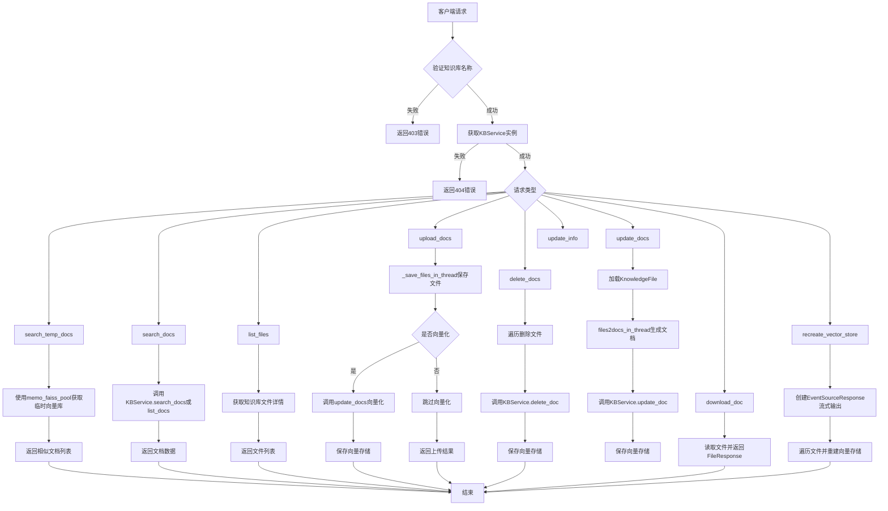
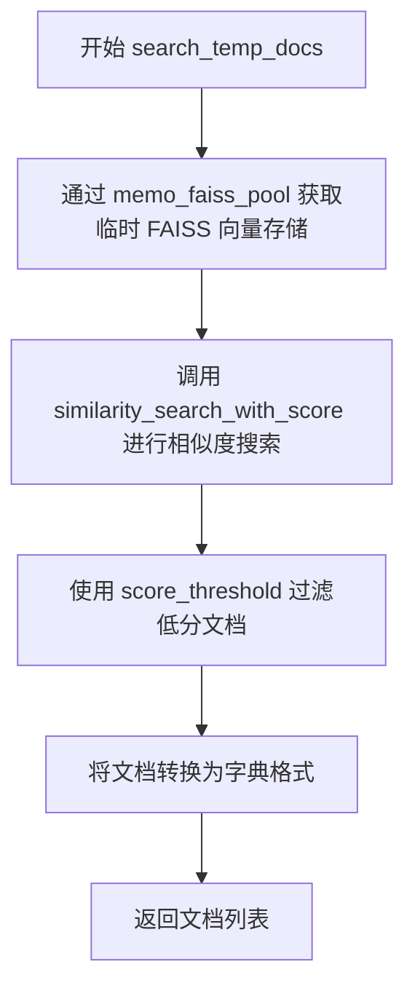
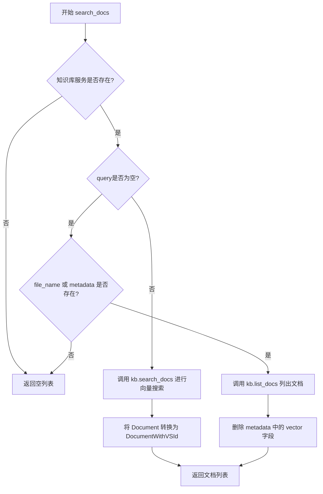
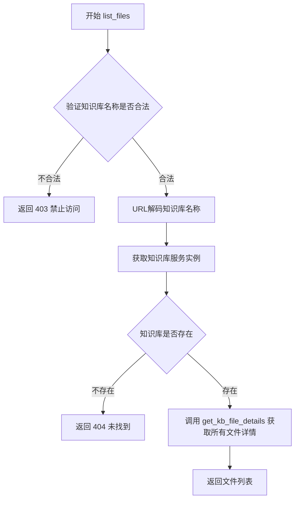
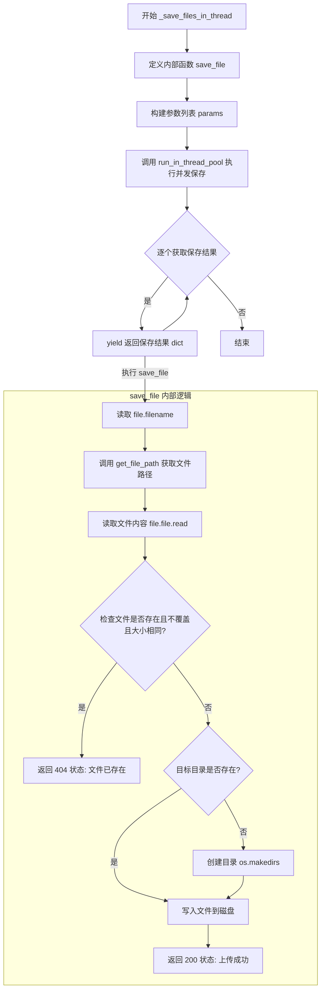
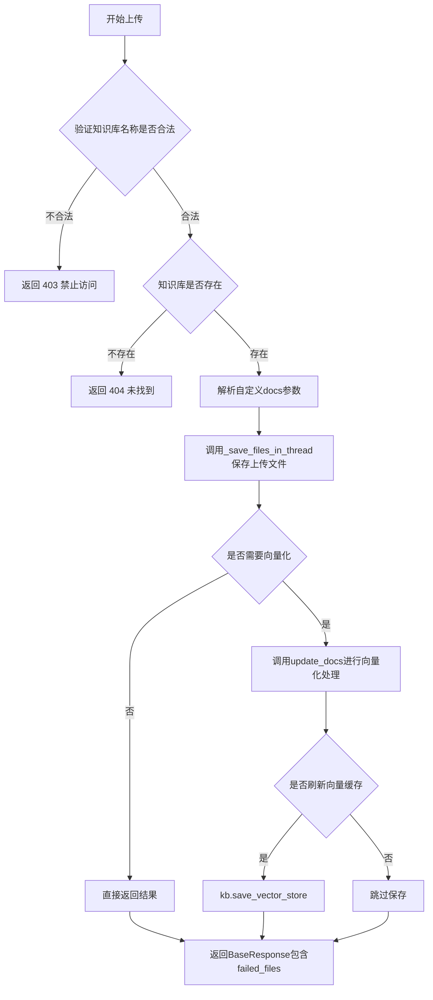
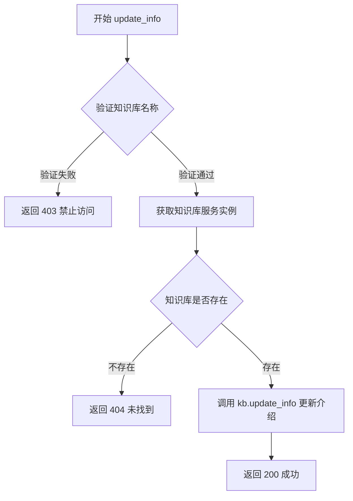
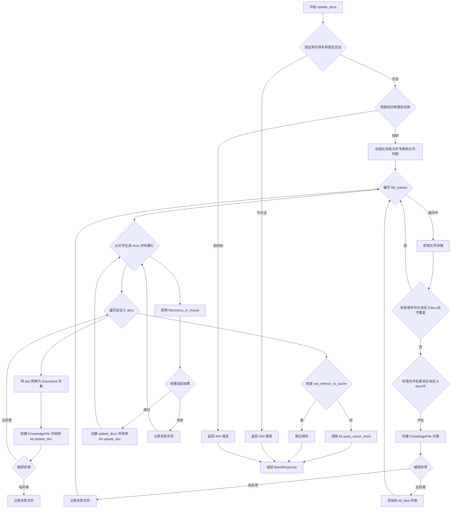
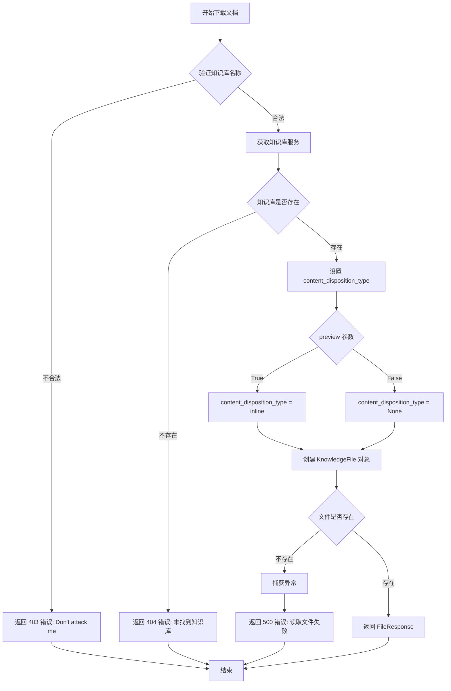
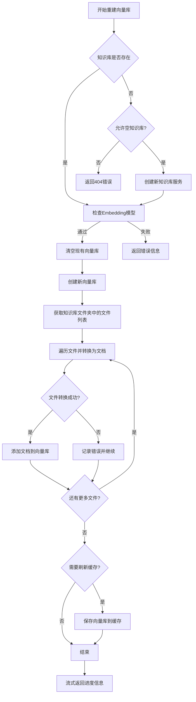

# `Langchain-Chatchat\libs\chatchat-server\chatchat\server\knowledge_base\kb_doc_api.py` 详细设计文档

该文件实现了一个基于FastAPI的知识库管理API服务，提供文档上传、删除、更新、搜索、下载及向量存储重建等功能，支持临时FAISS缓存和多种知识库操作。

## 整体流程



## 类结构

```
无类定义（纯函数式模块）
└── API端点函数集合
    ├── search_temp_docs - 搜索临时FAISS知识库
    ├── search_docs - 搜索知识库文档
    ├── list_files - 列出知识库文件
    ├── _save_files_in_thread - 保存上传文件（内部函数）
    ├── upload_docs - 上传文档并向量化
    ├── delete_docs - 删除知识库文档
    ├── update_info - 更新知识库信息
    ├── update_docs - 更新知识库文档
    ├── download_doc - 下载知识库文档
    └── recreate_vector_store - 重建向量存储
```

## 全局变量及字段


### `logger`
    
日志记录器对象，用于记录系统运行日志和错误信息

类型：`Logger`
    


    

## 全局函数及方法


### `search_temp_docs`

从临时 FAISS 知识库中检索文档，用于文件对话场景。通过获取临时知识库的向量存储，使用相似度搜索返回与查询最相关的文档。

参数：

- `knowledge_id`：`str`，知识库 ID，用于标识临时 FAISS 知识库
- `query`：`str`，用户输入的查询文本
- `top_k`：`int`，返回的文档数量
- `score_threshold`：`float`，分数阈值，用于过滤低相关性文档

返回值：`List[Dict]`，返回与查询最相关的文档列表，每个文档以字典形式呈现

#### 流程图



#### 带注释源码

```python
def search_temp_docs(
    knowledge_id: str = Body(..., description="知识库 ID", examples=["example_id"]),
    query: str = Body("", description="用户输入", examples=["你好"]),
    top_k: int = Body(..., description="返回的文档数量", examples=[5]),
    score_threshold: float = Body(..., description="分数阈值", examples=[0.8])
) -> List[Dict]:
    '''
    从临时 FAISS 知识库中检索文档，用于文件对话
    
    参数:
        knowledge_id: 知识库的唯一标识符，用于从内存池中获取对应的向量存储
        query: 用户查询的文本内容
        top_k: 指定返回最相似的k个文档
        score_threshold: 相似度阈值，低于该阈值的文档将被过滤
    
    返回:
        包含文档内容的字典列表
    '''
    # 通过上下文管理器从内存池获取指定knowledge_id的FAISS向量存储
    # memo_faiss_pool 管理临时FAISS实例的生命周期
    with memo_faiss_pool.acquire(knowledge_id) as vs:
        # 执行相似度搜索，同时返回文档和对应的相似度分数
        # score_threshold 用于在搜索时过滤掉低相关性的结果
        docs = vs.similarity_search_with_score(
            query,          # 查询文本
            k=top_k,        # 返回top_k个最相似的文档
            score_threshold=score_threshold  # 相似度阈值
        )
        # 将结果转换为字典格式
        # similarity_search_with_score 返回的是 (Document, score) 元组列表
        # x[0] 是 Document 对象，调用 .dict() 转换为字典
        docs = [x[0].dict() for x in docs]
        # 返回转换后的文档列表
        return docs
```


### `search_docs`

从指定知识库中检索文档，支持基于向量相似度的语义搜索和基于文件名/元数据的过滤查询。

参数：

- `query`：`str`，用户输入的查询文本，用于向量语义搜索，默认为空字符串
- `knowledge_base_name`：`str`，目标知识库的名称，必填参数
- `top_k`：`int`，返回的最多匹配文档数量，默认使用配置值 `Settings.kb_settings.VECTOR_SEARCH_TOP_K`
- `score_threshold`：`float`，知识库匹配相关度阈值，取值范围 0-2.0，值越小表示相关度越高，默认使用配置值 `Settings.kb_settings.SCORE_THRESHOLD`
- `file_name`：`str`，按文件名过滤，支持 SQL 通配符，默认为空字符串
- `metadata`：`dict`，根据 metadata 进行过滤，仅支持一级键，默认为空字典

返回值：`List[Dict]`，返回匹配文档的字典列表，每个字典包含文档内容和元数据信息

#### 流程图



#### 带注释源码

```python
def search_docs(
        query: str = Body("", description="用户输入", examples=["你好"]),
        knowledge_base_name: str = Body(
            ..., description="知识库名称", examples=["samples"]
        ),
        top_k: int = Body(Settings.kb_settings.VECTOR_SEARCH_TOP_K, description="匹配向量数"),
        score_threshold: float = Body(
            Settings.kb_settings.SCORE_THRESHOLD,
            description="知识库匹配相关度阈值，取值范围在0-1之间，"
                        "SCORE越小，相关度越高，"
                        "取到2相当于不筛选，建议设置在0.5左右",
            ge=0.0,
            le=2.0,
        ),
        file_name: str = Body("", description="文件名称，支持 sql 通配符"),
        metadata: dict = Body({}, description="根据 metadata 进行过滤，仅支持一级键"),
) -> List[Dict]:
    """
    从知识库中检索文档，支持向量搜索和文件列表查询两种模式
    
    参数:
        query: 用户查询文本，用于向量语义搜索
        knowledge_base_name: 目标知识库名称
        top_k: 返回的最多匹配文档数
        score_threshold: 相关度阈值，低于此分数的文档将被过滤
        file_name: 文件名过滤条件，支持通配符
        metadata: 元数据过滤条件，仅支持一级键
    
    返回:
        匹配文档的字典列表
    """
    # 通过工厂模式获取指定名称的知识库服务实例
    kb = KBServiceFactory.get_service_by_name(knowledge_base_name)
    data = []
    
    # 只有知识库存在时才进行后续操作
    if kb is not None:
        # 优先处理向量搜索请求（当有查询文本时）
        if query:
            # 调用知识库的向量搜索方法，返回相似文档及分数
            docs = kb.search_docs(query, top_k, score_threshold)
            # 将原始 Document 对象转换为带 ID 的 DocumentWithVSId 对象
            # 包含文档内容和元数据中的 ID 信息
            data = [DocumentWithVSId(**{"id": x.metadata.get("id"), **x.dict()}) for x in docs]
        
        # 当无查询文本但有文件名或元数据过滤条件时，列出匹配文档
        elif file_name or metadata:
            data = kb.list_docs(file_name=file_name, metadata=metadata)
            # 遍历返回的文档，移除 metadata 中的向量数据以减小返回体积
            for d in data:
                if "vector" in d.metadata:
                    del d.metadata["vector"]
    
    # 将所有 Document 对象转换为字典格式返回
    return [x.dict() for x in data]
```


### `list_files`

列出指定知识库中的所有文件信息。

参数：

- `knowledge_base_name`：`str`，知识库名称，用于指定要列出的目标知识库

返回值：`ListResponse`，返回包含知识库中所有文件详情列表的响应对象

#### 流程图



#### 带注释源码

```python
def list_files(knowledge_base_name: str) -> ListResponse:
    """
    列出指定知识库中的所有文件信息。
    
    参数:
        knowledge_base_name: str - 知识库名称
    
    返回:
        ListResponse - 包含文件详情列表的响应对象
    """
    # 第一步：验证知识库名称的安全性，防止恶意输入
    if not validate_kb_name(knowledge_base_name):
        # 验证不通过返回403错误，data为空列表
        return ListResponse(code=403, msg="Don't attack me", data=[])

    # 对知识库名称进行URL解码处理，处理URL编码的特殊字符
    knowledge_base_name = urllib.parse.unquote(knowledge_base_name)
    
    # 通过工厂类获取对应知识库的服务实例
    kb = KBServiceFactory.get_service_by_name(knowledge_base_name)
    
    # 判断知识库是否存在
    if kb is None:
        # 不存在则返回404错误
        return ListResponse(
            code=404, msg=f"未找到知识库 {knowledge_base_name}", data=[]
        )
    else:
        # 存在则查询并获取该知识库下所有文件的详细信息
        all_docs = get_kb_file_details(knowledge_base_name)
        # 返回包含文件详情的成功响应
        return ListResponse(data=all_docs)
```


### `_save_files_in_thread`

该函数是一个生成器函数，通过多线程方式将上传的文件保存到指定知识库的目录中。它接收文件列表、知识库名称和覆盖标志作为参数，遍历每个文件并使用线程池并发执行保存操作，同时生成保存结果。

参数：

- `files`：`List[UploadFile]`（FastAPI 上传的文件列表）
- `knowledge_base_name`：`str`（目标知识库的名称）
- `override`：`bool`（是否覆盖已存在的文件）

返回值：`Generator[dict, None, None]`，生成器逐个返回每个文件的保存结果，格式为 `{"code": 状态码, "msg": 消息, "data": {"knowledge_base_name": 知识库名称, "file_name": 文件名}}`

#### 流程图



#### 带注释源码

```python
def _save_files_in_thread(
        files: List[UploadFile], knowledge_base_name: str, override: bool
):
    """
    通过多线程将上传的文件保存到对应知识库目录内。
    生成器返回保存结果：{"code":200, "msg": "xxx", "data": {"knowledge_base_name":"xxx", "file_name": "xxx"}}
    """

    def save_file(file: UploadFile, knowledge_base_name: str, override: bool) -> dict:
        """
        保存单个文件的内部函数。
        """
        try:
            # 获取上传文件的文件名
            filename = file.filename
            # 根据知识库名称和文件名获取目标存储路径
            file_path = get_file_path(
                knowledge_base_name=knowledge_base_name, doc_name=filename
            )
            # 构建返回数据的基础结构
            data = {"knowledge_base_name": knowledge_base_name, "file_name": filename}

            # 读取上传文件的内容到内存
            file_content = file.file.read()
            
            # 检查文件是否已存在且不覆盖现有文件
            # 仅当文件大小相同时才认为是相同文件（避免重复上传）
            if (
                    os.path.isfile(file_path)
                    and not override
                    and os.path.getsize(file_path) == len(file_content)
            ):
                file_status = f"文件 {filename} 已存在。"
                logger.warn(file_status)
                # 返回文件已存在状态码 404
                return dict(code=404, msg=file_status, data=data)

            # 确保目标目录存在，不存在则创建
            if not os.path.isdir(os.path.dirname(file_path)):
                os.makedirs(os.path.dirname(file_path))
            
            # 以二进制写入模式保存文件到目标路径
            with open(file_path, "wb") as f:
                f.write(file_content)
            
            # 返回成功状态码 200
            return dict(code=200, msg=f"成功上传文件 {filename}", data=data)
        except Exception as e:
            # 捕获异常并记录错误日志
            msg = f"{filename} 文件上传失败，报错信息为: {e}"
            logger.error(f"{e.__class__.__name__}: {msg}")
            # 返回服务器错误状态码 500
            return dict(code=500, msg=msg, data=data)

    # 构建线程池执行所需的参数字典列表
    params = [
        {"file": file, "knowledge_base_name": knowledge_base_name, "override": override}
        for file in files
    ]
    
    # 使用线程池并发执行文件保存，并作为生成器逐个返回结果
    for result in run_in_thread_pool(save_file, params=params):
        yield result
```


### `upload_docs`

上传文件到知识库，并可选地对文件进行向量化处理。该函数是知识库管理的核心API之一，支持批量上传、覆盖模式、自定义文档分割参数等特性。

参数：

- `files`：`List[UploadFile]`，上传的文件列表，支持多文件同时上传
- `knowledge_base_name`：`str`，目标知识库的名称
- `override`：`bool`，是否覆盖已存在的同名文件，默认为 False
- `to_vector_store`：`bool`，上传后是否进行向量化处理，默认为 True
- `chunk_size`：`int`，知识库中单段文本的最大长度，默认从设置中获取
- `chunk_overlap`：`int`，相邻文本块之间的重合长度，默认从设置中获取
- `zh_title_enhance`：`bool`，是否开启中文标题增强功能，默认从设置中获取
- `docs`：`str`，自定义的文档内容，JSON 字符串格式，可选
- `not_refresh_vs_cache`：`bool`，是否暂存向量库刷新操作，用于 FAISS 场景，默认为 False

返回值：`BaseResponse`，返回包含状态码、消息和失败文件列表的响应对象

#### 流程图



#### 带注释源码

```python
def upload_docs(
        files: List[UploadFile] = File(..., description="上传文件，支持多文件"),
        # 上传的文件列表，支持多文件同时上传
        knowledge_base_name: str = Form(
            ..., description="知识库名称", examples=["samples"]
        ),
        # 目标知识库的名称，用于指定文件上传到哪个知识库
        override: bool = Form(False, description="覆盖已有文件"),
        # 是否覆盖已存在的同名文件，避免重复上传
        to_vector_store: bool = Form(True, description="上传文件后是否进行向量化"),
        # 上传完成后是否自动进行向量化处理，设为False则只保存文件
        chunk_size: int = Form(Settings.kb_settings.CHUNK_SIZE, description="知识库中单段文本最大长度"),
        # 文本分割时每个块的最大字符数，影响向量检索的精度
        chunk_overlap: int = Form(Settings.kb_settings.OVERLAP_SIZE, description="知识库中相邻文本重合长度"),
        # 相邻文本块之间的重叠字符数，保证上下文连贯性
        zh_title_enhance: bool = Form(Settings.kb_settings.ZH_TITLE_ENHANCE, description="是否开启中文标题加强"),
        # 是否启用中文标题增强功能，提升中文文档的检索效果
        docs: str = Form("", description="自定义的docs，需要转为json字符串"),
        # 可选的自定义文档内容，以JSON字符串形式传入，用于特殊场景
        not_refresh_vs_cache: bool = Form(False, description="暂不保存向量库（用于FAISS）"),
        # 是否延迟保存向量库，True时用于FAISS等需要批量操作的场景
) -> BaseResponse:
    """
    API接口：上传文件，并/或向量化
    """
    # 首先验证知识库名称的安全性，防止注入攻击
    if not validate_kb_name(knowledge_base_name):
        return BaseResponse(code=403, msg="Don't attack me")

    # 通过工厂类获取对应的知识库服务实例
    kb = KBServiceFactory.get_service_by_name(knowledge_base_name)
    if kb is None:
        return BaseResponse(code=404, msg=f"未找到知识库 {knowledge_base_name}")

    # 解析自定义docs参数，JSON字符串转为字典
    docs = json.loads(docs) if docs else {}
    # 用于存储上传失败的文件信息
    failed_files = {}
    # 记录所有待处理的文件名
    file_names = list(docs.keys())

    # 先将上传的文件保存到磁盘
    # 调用线程池方式保存文件，提升IO效率
    for result in _save_files_in_thread(
            files, knowledge_base_name=knowledge_base_name, override=override
    ):
        filename = result["data"]["file_name"]
        # 收集保存失败的文件信息
        if result["code"] != 200:
            failed_files[filename] = result["msg"]

        # 将成功保存的文件名加入处理列表
        if filename not in file_names:
            file_names.append(filename)

    # 对保存的文件进行向量化处理
    if to_vector_store:
        # 调用update_docs执行向量化和索引更新
        result = update_docs(
            knowledge_base_name=knowledge_base_name,
            file_names=file_names,
            override_custom_docs=True,  # 强制覆盖已有的自定义docs
            chunk_size=chunk_size,
            chunk_overlap=chunk_overlap,
            zh_title_enhance=zh_title_enhance,
            docs=docs,
            not_refresh_vs_cache=True,  # 暂存向量库刷新
        )
        # 合并向量化失败的文件列表
        failed_files.update(result.data["failed_files"])
        # 根据参数决定是否立即刷新向量库缓存
        if not not_refresh_vs_cache:
            kb.save_vector_store()

    # 返回上传和向量化的最终结果
    return BaseResponse(
        code=200, msg="文件上传与向量化完成", data={"failed_files": failed_files}
    )
```


### `delete_docs`

该函数用于从指定的知识库中删除指定的文档列表，支持可选的磁盘文件删除和向量存储缓存刷新控制。

参数：

- `knowledge_base_name`：`str`，知识库名称，用于指定要删除文档的目标知识库
- `file_names`：`List[str]`，要删除的文件名列表，支持同时删除多个文件
- `delete_content`：`bool`，是否同时删除磁盘上的文件内容，默认为 False
- `not_refresh_vs_cache`：`bool`，是否暂存向量库，设为 True 可用于 FAISS 场景避免频繁刷新，默认为 False

返回值：`BaseResponse`，返回删除操作的结果，包含状态码、消息和失败文件列表

#### 流程图

```mermaid
flowchart TD
    A[开始 delete_docs] --> B{validate_kb_name 验证知识库名称}
    B -->|失败| C[返回 BaseResponse 403 - Don't attack me]
    B -->|成功| D[URL解码 knowledge_base_name]
    D --> E[KBServiceFactory 获取知识库服务实例 kb]
    E --> F{kb 是否存在}
    F -->|否| G[返回 BaseResponse 404 - 未找到知识库]
    F -->|是| H[初始化空字典 failed_files]
    H --> I[遍历 file_names 列表]
    I --> J{kb.exist_doc 检查文件是否存在}
    J -->|否| K[failed_files[file_name] = 未找到文件]
    K --> I
    J -->|是| L[创建 KnowledgeFile 对象 kb_file]
    L --> M[调用 kb.delete_doc 删除文档]
    M --> N{捕获异常}
    N -->|发生异常| O[记录错误日志到 failed_files]
    O --> I
    N -->|无异常| I
    I --> P{遍历完成?}
    P -->|否| I
    P -->|是| Q{not_refresh_vs_cache 为 False?}
    Q -->|是| R[调用 kb.save_vector_store 保存向量存储]
    Q -->|否| S[跳过保存]
    R --> T[返回 BaseResponse 200 - 文件删除完成]
    S --> T
```

#### 带注释源码

```python
def delete_docs(
        knowledge_base_name: str = Body(..., examples=["samples"]),
        file_names: List[str] = Body(..., examples=[["file_name.md", "test.txt"]]),
        delete_content: bool = Body(False),
        not_refresh_vs_cache: bool = Body(False, description="暂不保存向量库（用于FAISS）"),
) -> BaseResponse:
    """
    删除知识库中的指定文档
    
    Args:
        knowledge_base_name: 知识库名称
        file_names: 要删除的文件名列表
        delete_content: 是否删除磁盘上的文件内容
        not_refresh_vs_cache: 是否暂存向量库，True 用于 FAISS 场景
    
    Returns:
        BaseResponse: 包含删除结果和失败文件列表
    """
    # Step 1: 验证知识库名称安全性，防止注入攻击
    if not validate_kb_name(knowledge_base_name):
        return BaseResponse(code=403, msg="Don't attack me")

    # Step 2: URL解码知识库名称，处理特殊字符
    knowledge_base_name = urllib.parse.unquote(knowledge_base_name)
    
    # Step 3: 获取知识库服务实例
    kb = KBServiceFactory.get_service_by_name(knowledge_base_name)
    
    # Step 4: 检查知识库是否存在
    if kb is None:
        return BaseResponse(code=404, msg=f"未找到知识库 {knowledge_base_name}")

    # Step 5: 初始化失败文件记录字典
    failed_files = {}
    
    # Step 6: 遍历每个要删除的文件
    for file_name in file_names:
        # 检查文件是否存在于知识库中
        if not kb.exist_doc(file_name):
            failed_files[file_name] = f"未找到文件 {file_name}"
            continue

        try:
            # Step 7: 创建 KnowledgeFile 对象表示目标文件
            kb_file = KnowledgeFile(
                filename=file_name, knowledge_base_name=knowledge_base_name
            )
            # Step 8: 调用知识库的删除方法删除文档
            # 注意：此处固定传入 not_refresh_vs_cache=True 延迟保存
            kb.delete_doc(kb_file, delete_content, not_refresh_vs_cache=True)
        except Exception as e:
            # Step 9: 捕获并记录删除过程中的异常
            msg = f"{file_name} 文件删除失败，错误信息：{e}"
            logger.error(f"{e.__class__.__name__}: {msg}")
            failed_files[file_name] = msg

    # Step 10: 根据参数决定是否刷新向量存储缓存
    if not not_refresh_vs_cache:
        kb.save_vector_store()

    # Step 11: 返回删除操作结果
    return BaseResponse(
        code=200, msg=f"文件删除完成", data={"failed_files": failed_files}
    )
```


### `update_info`

该函数是用于更新指定知识库描述信息的 API 接口，首先验证知识库名称的合法性，然后通过工厂模式获取对应的知识库服务实例，最后调用知识库服务的 `update_info` 方法更新其介绍信息并返回操作结果。

参数：

- `knowledge_base_name`：`str`，知识库名称，用于指定需要更新的目标知识库
- `kb_info`：`str`，知识库介绍，需要更新的描述文本内容

返回值：`BaseResponse`，包含操作状态码、消息以及更新后的知识库介绍信息

#### 流程图



#### 带注释源码

```python
def update_info(
        knowledge_base_name: str = Body(
            ..., description="知识库名称", examples=["samples"]
        ),
        kb_info: str = Body(..., description="知识库介绍", examples=["这是一个知识库"]),
):
    """
    更新知识库的描述信息
    
    Args:
        knowledge_base_name: 目标知识库的名称
        kb_info: 新的知识库介绍文本
    
    Returns:
        BaseResponse: 包含操作结果和更新后的 kb_info
    """
    # 第一步：验证知识库名称的合法性，防止注入攻击
    if not validate_kb_name(knowledge_base_name):
        return BaseResponse(code=403, msg="Don't attack me")

    # 第二步：通过工厂类获取对应知识库的服务实例
    kb = KBServiceFactory.get_service_by_name(knowledge_base_name)
    
    # 第三步：检查知识库是否存在
    if kb is None:
        return BaseResponse(code=404, msg=f"未找到知识库 {knowledge_base_name}")
    
    # 第四步：调用知识库服务的 update_info 方法更新介绍信息
    kb.update_info(kb_info)

    # 第五步：返回成功响应，包含更新后的介绍信息
    return BaseResponse(code=200, msg=f"知识库介绍修改完成", data={"kb_info": kb_info})
```


### `update_docs`

更新知识库中的文档内容，支持从文件加载文档并进行向量化处理，同时支持添加自定义文档，并返回更新结果及失败文件列表。

参数：

- `knowledge_base_name`：`str`，知识库名称
- `file_names`：`List[str]`，需要更新的文件名称列表，支持多文件
- `chunk_size`：`int`，知识库中单段文本最大长度
- `chunk_overlap`：`int`，知识库中相邻文本重合长度
- `zh_title_enhance`：`bool`，是否开启中文标题加强
- `override_custom_docs`：`bool`，是否覆盖之前自定义的 docs
- `docs`：`str`，自定义的 docs，需要转为 json 字符串
- `not_refresh_vs_cache`：`bool`，暂不保存向量库（用于 FAISS）

返回值：`BaseResponse`，包含操作状态码、消息以及失败文件列表

#### 流程图



#### 带注释源码

```python
def update_docs(
        knowledge_base_name: str = Body(
            ..., description="知识库名称", examples=["samples"]
        ),
        file_names: List[str] = Body(
            ..., description="文件名称，支持多文件", examples=[["file_name1", "text.txt"]]
        ),
        chunk_size: int = Body(Settings.kb_settings.CHUNK_SIZE, description="知识库中单段文本最大长度"),
        chunk_overlap: int = Body(Settings.kb_settings.OVERLAP_SIZE, description="知识库中相邻文本重合长度"),
        zh_title_enhance: bool = Body(Settings.kb_settings.ZH_TITLE_ENHANCE, description="是否开启中文标题加强"),
        override_custom_docs: bool = Body(False, description="是否覆盖之前自定义的docs"),
        docs: str = Body("", description="自定义的docs，需要转为json字符串"),
        not_refresh_vs_cache: bool = Body(False, description="暂不保存向量库（用于FAISS）"),
) -> BaseResponse:
    """
    更新知识库文档
    """
    # 1. 验证知识库名称安全性，防止注入攻击
    if not validate_kb_name(knowledge_base_name):
        return BaseResponse(code=403, msg="Don't attack me")

    # 2. 获取知识库服务实例
    kb = KBServiceFactory.get_service_by_name(knowledge_base_name)
    if kb is None:
        return BaseResponse(code=404, msg=f"未找到知识库 {knowledge_base_name}")

    # 3. 初始化变量
    failed_files = {}  # 存储失败的文件及错误信息
    kb_files = []      # 存储成功加载的 KnowledgeFile 对象
    docs = json.loads(docs) if docs else {}  # 解析自定义 docs JSON 字符串

    # 4. 遍历文件名列表，生成需要加载 docs 的文件列表
    for file_name in file_names:
        # 获取文件详情，包含是否有自定义 docs 等信息
        file_detail = get_file_detail(kb_name=knowledge_base_name, filename=file_name)
        
        # 如果该文件之前使用了自定义 docs，则根据参数决定是否略过
        if file_detail.get("custom_docs") and not override_custom_docs:
            continue  # 跳过已有自定义 docs 的文件
        
        # 如果文件名不在自定义 docs 中，则尝试从文件加载
        if file_name not in docs:
            try:
                kb_files.append(
                    KnowledgeFile(
                        filename=file_name, knowledge_base_name=knowledge_base_name
                    )
                )
            except Exception as e:
                msg = f"加载文档 {file_name} 时出错：{e}"
                logger.error(f"{e.__class__.__name__}: {msg}")
                failed_files[file_name] = msg

    # 5. 从文件生成 docs，并进行向量化
    # 这里利用了 KnowledgeFile 的缓存功能，在多线程中加载 Document，然后传给 KnowledgeFile
    for status, result in files2docs_in_thread(
            kb_files,
            chunk_size=chunk_size,
            chunk_overlap=chunk_overlap,
            zh_title_enhance=zh_title_enhance,
    ):
        if status:
            # 成功：从结果中提取知识库名、文件名和新生成的 docs
            kb_name, file_name, new_docs = result
            # 创建 KnowledgeFile 对象并设置分割后的文档
            kb_file = KnowledgeFile(
                filename=file_name, knowledge_base_name=knowledge_base_name
            )
            kb_file.splited_docs = new_docs
            # 调用知识库的更新方法，not_refresh_vs_cache=True 暂不保存向量库
            kb.update_doc(kb_file, not_refresh_vs_cache=True)
        else:
            # 失败：记录错误信息
            kb_name, file_name, error = result
            failed_files[file_name] = error

    # 6. 将自定义的 docs 进行向量化
    for file_name, v in docs.items():
        try:
            # 将字典转换为 Document 对象
            v = [x if isinstance(x, Document) else Document(**x) for x in v]
            kb_file = KnowledgeFile(
                filename=file_name, knowledge_base_name=knowledge_base_name
            )
            # 更新文档，传入自定义 docs
            kb.update_doc(kb_file, docs=v, not_refresh_vs_cache=True)
        except Exception as e:
            msg = f"为 {file_name} 添加自定义 docs 时出错：{e}"
            logger.error(f"{e.__class__.__name__}: {msg}")
            failed_files[file_name] = msg

    # 7. 根据参数决定是否保存向量库到磁盘
    if not not_refresh_vs_cache:
        kb.save_vector_store()

    # 8. 返回操作结果
    return BaseResponse(
        code=200, msg=f"更新文档完成", data={"failed_files": failed_files}
    )
```


### `download_doc`

该函数用于从知识库中下载指定的文档文件，支持预览和下载两种模式，通过 FastAPI 的 Query 参数接收知识库名称、文件名和预览标志，最终返回文件响应或错误响应。

参数：

- `knowledge_base_name`：`str`，知识库名称，用于指定从哪个知识库下载文件
- `file_name`：`str`，文件名称，指定要下载的具体文件名
- `preview`：`bool`，预览标志，True 表示在浏览器内预览，False 表示下载文件

返回值：`BaseResponse | FileResponse`，成功时返回 FileResponse（文件响应），失败时返回 BaseResponse（包含错误码和错误信息）

#### 流程图



#### 带注释源码

```python
def download_doc(
        knowledge_base_name: str = Query(
            ..., description="知识库名称", examples=["samples"]
        ),
        file_name: str = Query(..., description="文件名称", examples=["test.txt"]),
        preview: bool = Query(False, description="是：浏览器内预览；否：下载"),
):
    """
    下载知识库文档
    """
    # 步骤1: 验证知识库名称安全性，防止注入攻击
    if not validate_kb_name(knowledge_base_name):
        return BaseResponse(code=403, msg="Don't attack me")

    # 步骤2: 通过工厂类获取对应的知识库服务实例
    kb = KBServiceFactory.get_service_by_name(knowledge_base_name)
    
    # 步骤3: 检查知识库是否存在
    if kb is None:
        return BaseResponse(code=404, msg=f"未找到知识库 {knowledge_base_name}")

    # 步骤4: 根据 preview 参数决定内容处置类型
    # inline 表示浏览器内预览，None 表示下载
    if preview:
        content_disposition_type = "inline"
    else:
        content_disposition_type = None

    try:
        # 步骤5: 构建知识库文件对象，获取文件的完整路径
        kb_file = KnowledgeFile(
            filename=file_name, knowledge_base_name=knowledge_base_name
        )

        # 步骤6: 检查文件物理是否存在
        if os.path.exists(kb_file.filepath):
            # 步骤7: 返回文件响应，支持预览或下载
            return FileResponse(
                path=kb_file.filepath,          # 文件完整路径
                filename=kb_file.filename,      # 文件名
                media_type="multipart/form-data", # 媒体类型
                content_disposition_type=content_disposition_type, # 处置类型
            )
    except Exception as e:
        # 步骤8: 捕获文件读取过程中的异常
        msg = f"{kb_file.filename} 读取文件失败，错误信息是：{e}"
        logger.error(f"{e.__class__.__name__}: {msg}")
        return BaseResponse(code=500, msg=msg)

    # 步骤9: 文件路径不存在且无异常时，返回失败响应
    return BaseResponse(code=500, msg=f"{kb_file.filename} 读取文件失败")
```


### `recreate_vector_store`

该函数用于重建整个知识库的向量存储，通过读取知识库文件夹中的文件，重新进行分词、向量化并存储到向量数据库中。适用于用户直接复制文件到内容目录而无需通过界面上传的场景，支持空知识库的创建和多种配置选项。

参数：

- `knowledge_base_name`：`str`，知识库名称，examples=["samples"]
- `allow_empty_kb`：`bool`，是否允许空知识库，默认为 True
- `vs_type`：`str`，为空知识库指定向量库类型，已有知识库默认使用原向量库类型
- `embed_model`：`str`，为空知识库指定 Embedding 模型，已有知识库默认使用原 Embedding 模型
- `chunk_size`：`int`，知识库中单段文本最大长度
- `chunk_overlap`：`int`，知识库中相邻文本重合长度
- `zh_title_enhance`：`bool`，是否开启中文标题加强
- `not_refresh_vs_cache`：`bool`，暂不保存向量库（用于 FAISS）

返回值：`EventSourceResponse`，流式返回重建进度信息的响应对象

#### 流程图



#### 带注释源码

```python
def recreate_vector_store(
        knowledge_base_name: str = Body(..., examples=["samples"]),
        # 知识库名称，必填参数
        allow_empty_kb: bool = Body(True),
        # 是否允许处理空知识库，默认为 True
        # 当设为 True 时，即使知识库不在 info.db 中或没有文档文件也能创建
        vs_type: str = Body(Settings.kb_settings.DEFAULT_VS_TYPE, description="为空知识库指定向量库类型。已有知识库默认使用原向量库类型。"),
        # 向量库类型参数，若未指定则使用默认类型
        embed_model: str = Body(get_default_embedding(), description="为空知识库指定Embedding模型。已有知识库默认使用原Embedding模型。"),
        # Embedding 模型参数，用于将文本转为向量
        chunk_size: int = Body(Settings.kb_settings.CHUNK_SIZE, description="知识库中单段文本最大长度"),
        # 分块大小，控制每个文档片段的最大字符数
        chunk_overlap: int = Body(Settings.kb_settings.OVERLAP_SIZE, description="知识库中相邻文本重合长度"),
        # 分块重叠大小，相邻片段之间的重叠字符数
        zh_title_enhance: bool = Body(Settings.kb_settings.ZH_TITLE_ENHANCE, description="是否开启中文标题加强"),
        # 中文标题增强选项，提升中文文档的检索效果
        not_refresh_vs_cache: bool = Body(False, description="暂不保存向量库（用于FAISS）"),
        # 是否暂存向量库，True 时不立即保存到缓存
):
    """
    recreate vector store from the content.
    this is usefull when user can copy files to content folder directly instead of upload through network.
    by default, get_service_by_name only return knowledge base in the info.db and having document files in it.
    set allow_empty_kb to True make it applied on empty knowledge base which it not in the info.db or having no documents.
    """

    def output():
        """
        内部生成器函数，用于流式输出重建进度
        """
        try:
            # 获取或创建知识库服务实例
            kb = KBServiceFactory.get_service_by_name(knowledge_base_name)
            if kb is None:
                # 知识库不存在时，根据指定类型和嵌入模型创建新的
                kb = KBServiceFactory.get_service(knowledge_base_name, vs_type, embed_model)
            
            # 检查知识库是否存在且允许操作空知识库
            if not kb.exists() and not allow_empty_kb:
                yield {"code": 404, "msg": f"未找到知识库 '{knowledge_base_name}'"}
            else:
                # 验证嵌入模型是否可用
                ok, msg = kb.check_embed_model()
                if not ok:
                    yield {"code": 404, "msg": msg}
                else:
                    # 如果知识库已存在，先清空现有向量库
                    if kb.exists():
                        kb.clear_vs()
                    # 创建新的向量库
                    kb.create_kb()
                    
                    # 从文件夹获取所有文件列表
                    files = list_files_from_folder(knowledge_base_name)
                    kb_files = [(file, knowledge_base_name) for file in files]
                    
                    i = 0
                    # 遍历文件并转换为文档
                    for status, result in files2docs_in_thread(
                            kb_files,
                            chunk_size=chunk_size,
                            chunk_overlap=chunk_overlap,
                            zh_title_enhance=zh_title_enhance,
                    ):
                        if status:
                            # 文件转换成功
                            kb_name, file_name, docs = result
                            kb_file = KnowledgeFile(
                                filename=file_name, knowledge_base_name=kb_name
                            )
                            kb_file.splited_docs = docs
                            # 流式返回进度信息
                            yield json.dumps(
                                {
                                    "code": 200,
                                    "msg": f"({i + 1} / {len(files)}): {file_name}",
                                    "total": len(files),
                                    "finished": i + 1,
                                    "doc": file_name,
                                },
                                ensure_ascii=False,
                            )
                            # 添加文档到向量库
                            kb.add_doc(kb_file, not_refresh_vs_cache=True)
                        else:
                            # 文件转换失败
                            kb_name, file_name, error = result
                            msg = f"添加文件'{file_name}'到知识库'{knowledge_base_name}'时出错：{error}。已跳过。"
                            logger.error(msg)
                            yield json.dumps(
                                {
                                    "code": 500,
                                    "msg": msg,
                                }
                            )
                        i += 1
                    
                    # 如果需要刷新缓存，保存向量库
                    if not not_refresh_vs_cache:
                        kb.save_vector_store()
        except asyncio.exceptions.CancelledError:
            # 处理用户中断请求的情况
            logger.warning("streaming progress has been interrupted by user.")
            return

    # 返回 Server-Sent Events 响应，用于流式传输进度
    return EventSourceResponse(output())
```

## 关键组件


### 张量索引与惰性加载

使用 `memo_faiss_pool` 管理FAISS向量库的缓存池，通过 `acquire` 方法实现按需加载向量索引，避免一次性加载所有向量库到内存。

### 反量化支持

通过 `score_threshold` 参数控制向量搜索的相似度阈值，支持在0-2范围内设置，用于过滤低相关度的检索结果。

### 量化策略

向量搜索配置包含 `top_k` 参数控制返回文档数量，结合 `score_threshold` 实现多级筛选，确保检索结果的相关性。

### 文件处理管道

`_save_files_in_thread` 函数实现多线程文件保存，支持覆盖模式和增量上传；`files2docs_in_thread` 实现文件到文档的转换和向量化处理。

### 知识库服务工厂

`KBServiceFactory` 提供知识库服务的统一访问入口，支持通过名称获取服务实例，隐藏底层实现细节。

### 知识库文件实体

`KnowledgeFile` 类封装知识库文件元数据，包括文件路径、文档内容、分片文档等属性，支持文档的增删改操作。

### 向量存储持久化

`save_vector_store` 方法实现向量库的持久化存储，`not_refresh_vs_cache` 参数支持延迟写入优化性能。

### 流式重建响应

`recreate_vector_store` 使用 `EventSourceResponse` 实现SSE流式响应，支持实时反馈向量库重建进度。

### 嵌入模型验证

`check_embed_model` 方法在创建向量库前验证嵌入模型可用性，确保向量化和检索的正确性。

### 文档去向量元数据

在文件列表查询中通过 `del d.metadata["vector"]` 删除向量数据，减少传输数据量并保护向量隐私。


## 问题及建议


### 已知问题

-   **错误处理不一致**：部分函数返回 `BaseResponse`，部分返回 `ListResponse`，异常捕获后返回的错误格式和状态码不统一，难以维护和调试。
-   **文件路径遍历风险**：`get_file_path` 未在代码中展示其实现，若未对 `filename` 进行严格校验，可能存在路径遍历漏洞，攻击者可利用 `../../../` 访问系统敏感文件。
-   **内存占用风险**：`_save_files_in_thread` 中使用 `file.file.read()` 一次性将整个文件内容加载到内存，大文件上传时可能导致内存溢出（OOM）。
-   **缓存同步不一致**：参数 `not_refresh_vs_cache` 在多处使用，但 `delete_docs` 调用 `kb.delete_doc(kb_file, delete_content, not_refresh_vs_cache=True)` 后直接进入下一文件循环，最后才调用 `save_vector_store()`，若中间异常中断会导致缓存与实际数据不一致。
-   **参数校验不足**：`update_docs` 中的 `docs` 参数直接从 JSON 字符串解析为 dict，未校验必要字段和类型，可能导致后续 `Document(**x)` 实例化失败并产生难以追溯的错误。
-   **API 设计风格不统一**：`download_doc` 使用 `Query` 参数获取知识库名称和文件名，而其他 API 多使用 `Body` 参数，不符合 RESTful 最佳实践。
-   **重复代码较多**：多处重复执行 `KBServiceFactory.get_service_by_name(knowledge_base_name)` 和 `validate_kb_name` 校验逻辑，未抽取为统一中间件或装饰器。
-   **日志安全风险**：日志中可能记录敏感信息（如 `knowledge_base_name`、`file_name`），且异常堆栈信息直接输出，未进行脱敏处理。

### 优化建议

-   **统一响应格式**：定义统一的响应模型（如 `ApiResponse`），所有 API 端点均返回同一种结构，包含 `code`、`msg`、`data` 字段，便于前端统一处理。
-   **加强输入校验**：对所有外部输入（尤其是文件名、知识库名称）进行严格校验，使用白名单机制禁止特殊字符；对 `docs` 参数解析后的结构进行 schema 校验。
-   **大文件流式处理**：将 `file.file.read()` 改为分块读取或直接传递文件对象写入磁盘，避免一次性加载整个文件内容到内存。
-   **提取公共逻辑**：将知识库查找、名称校验、异常处理等逻辑抽取为装饰器或依赖注入（如 FastAPI 的 `Depends`），减少代码重复。
-   **完善事务与回滚机制**：在涉及多步骤操作的函数（如 `upload_docs`、`update_docs`）中引入事务管理，若某步骤失败则回滚已执行的操作，保证数据一致性。
-   **统一 API 参数风格**：遵循 RESTful 规范，GET 请求使用 `Query` 参数，POST/PUT/DELETE 请求使用 `Body` 参数（或混合使用 `Form`）。
-   **日志脱敏与分级**：对日志内容进行脱敏处理，敏感字段（如用户 ID、文件名）进行掩码处理；根据环境配置日志级别，生产环境关闭 DEBUG 级别日志。

## 其它


### 设计目标与约束

本模块旨在提供一个完整的知识库文档管理API服务，支持文档的上传、存储、向量化、检索、下载和删除等功能。设计约束包括：使用FastAPI作为Web框架，采用异步编程模型(AsyncIO)；依赖FAISS向量库实现高效相似度检索；通过KBServiceFactory统一管理不同类型的知识库服务；所有知识库名称必须通过validate_kb_name验证以防止注入攻击；文件操作采用线程池并发处理以提升性能；向量化过程支持自定义分块参数( chunk_size、chunk_overlap)和中文标题增强选项。

### 错误处理与异常设计

本模块采用分层错误处理策略。在API层，所有接口均返回标准化的BaseResponse或ListResponse对象，包含code、msg、data三个字段，其中code使用HTTP状态码语义(200成功、403禁止、404未找到、500服务器错误)。在业务逻辑层，使用try-except捕获各类异常，包括文件读写异常(IOException)、知识库不存在异常(ValueError)、向量化异常等，并统一记录到日志系统(通过build_logger获取logger实例)。特殊处理asyncio.exceptions.CancelledError以支持用户中断长时操作的流式响应。错误信息遵循"错误类名: 详细描述"格式，便于问题定位。

### 数据流与状态机

文档上传流程的数据流如下：客户端提交Multipart文件Form -> _save_files_in_thread多线程保存到磁盘 -> 返回保存结果列表 -> 若to_vector_store为true则调用update_docs进行向量化 -> 调用kb.save_vector_store()持久化向量库。文档检索流程：search_temp_docs从临时FAISS池获取向量检索结果；search_docs先通过KBServiceFactory获取知识库服务，若有query则进行向量搜索，否则进行元数据过滤/文件名匹配。状态转换包括：文件状态(未上传->已上传->已向量化->已删除)、知识库状态(不存在->已创建->已加载向量库)、缓存状态(memo_faiss_pool管理临时向量库的获取与释放)。

### 外部依赖与接口契约

本模块依赖以下核心外部组件：FastAPI框架(提供@ Body、@ Form、@ Query、@ File装饰器定义接口参数)；langchain.docstore.document.Document(文档对象模型)；sse_starlette.EventSourceResponse(支持Server-Sent Events流式响应)；chatchat.settings.Settings(全局配置管理)；chatchat.server.knowledge_base.kb_service.base.KBServiceFactory(知识库服务工厂类)；chatchat.server.knowledge_base.utils.KnowledgeFile(知识库文件封装类)；chatchat.server.db.repository.knowledge_file_repository(数据库仓储层)。接口契约方面：所有Body参数支持examples示例值；ListResponse返回data为文件详情列表；BaseResponse返回code为HTTP状态码；向量化相关接口支持not_refresh_vs_cache参数控制是否立即刷新向量库缓存。

### 安全性考虑

本模块包含以下安全措施：知识库名称验证(validate_kb_name)防止SQL注入和路径遍历攻击；知识库名称在URL传输前进行urllib.parse.unquote解码处理；文件路径通过get_file_path统一管理，禁止任意路径写入；文件大小校验(通过比较content长度与已存在文件大小判断是否覆盖)；敏感操作(如覆盖已有文件)需要显式设置override参数为true；日志记录包含完整的错误堆栈信息但避免泄露敏感配置。

### 配置与扩展性

本模块通过Settings.kb_settings集中管理以下配置项：VECTOR_SEARCH_TOP_K(向量检索返回数量，默认值)、SCORE_THRESHOLD(相似度阈值，默认值)、CHUNK_SIZE(文本分块大小)、OVERLAP_SIZE(分块重叠长度)、ZH_TITLE_ENHANCE(中文标题增强开关)、DEFAULT_VS_TYPE(默认向量库类型)。KBServiceFactory采用工厂模式支持扩展新的知识库实现类，只需实现基类KBServiceAbstract定义的方法(similarity_search_with_score、list_docs、search_docs、add_doc、delete_doc、update_doc等)。向量化模型通过get_default_embedding()获取默认实现，支持运行时切换。

### 性能优化策略

本模块采用多项性能优化：文件保存和文档向量化均通过run_in_thread_pool在线程池中并发执行，避免阻塞主事件循环；KnowledgeFile类实现文档缓存机制，多线程加载的Document对象可复用；支持not_refresh_vs_cache参数，允许批量操作时延迟保存向量库以减少IO次数；search_temp_docs使用上下文管理器acquire管理临时FAISS连接池的生命周期；recreate_vector_store使用EventSourceResponse流式返回处理进度，避免大知识库重建时超时。
    