# `Langchain-Chatchat\libs\chatchat-server\chatchat\server\knowledge_base\kb_service\base.py` 详细设计文档

一个知识库服务管理模块，提供统一的接口来管理多种向量知识库的创建、文档添加、删除和搜索操作，支持FAISS、MILVUS、PG、RELYT、ES、CHROMADB等多种向量存储后端

## 整体流程

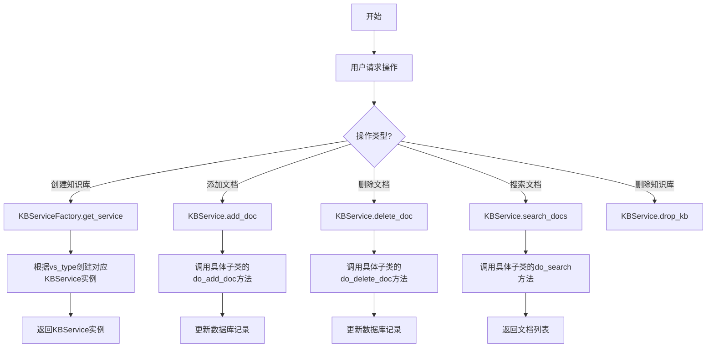

## 类结构

```
KBService (抽象基类)
├── FaissKBService (FAISS向量存储)
├── PGKBService (PG向量存储)
├── RelytKBService (Relyt向量存储)
├── MilvusKBService (Milvus向量存储)
├── ZillizKBService (Zilliz向量存储)
├── ESKBService (Elasticsearch向量存储)
├── ChromaKBService (ChromaDB向量存储)
└── DefaultKBService (默认向量存储)

KBServiceFactory (工厂类)
└── 负责创建各种KBService实例
```

## 全局变量及字段


### `SupportedVSType`
    
支持多种向量存储服务类型的枚举类

类型：`class`
    


### `SupportedVSType.SupportedVSType.FAISS`
    
FAISS向量存储类型标识

类型：`str`
    


### `SupportedVSType.SupportedVSType.MILVUS`
    
Milvus向量存储类型标识

类型：`str`
    


### `SupportedVSType.SupportedVSType.DEFAULT`
    
默认向量存储类型标识

类型：`str`
    


### `SupportedVSType.SupportedVSType.ZILLIZ`
    
Zilliz向量存储类型标识

类型：`str`
    


### `SupportedVSType.SupportedVSType.PG`
    
PG向量存储类型标识

类型：`str`
    


### `SupportedVSType.SupportedVSType.RELYT`
    
Relyt向量存储类型标识

类型：`str`
    


### `SupportedVSType.SupportedVSType.ES`
    
Elasticsearch向量存储类型标识

类型：`str`
    


### `SupportedVSType.SupportedVSType.CHROMADB`
    
ChromaDB向量存储类型标识

类型：`str`
    


### `KBService.KBService.kb_name`
    
知识库名称

类型：`str`
    


### `KBService.KBService.kb_info`
    
知识库描述信息

类型：`str`
    


### `KBService.KBService.embed_model`
    
嵌入模型名称

类型：`str`
    


### `KBService.KBService.kb_path`
    
知识库存储路径

类型：`Path`
    


### `KBService.KBService.doc_path`
    
文档存储路径

类型：`Path`
    
    

## 全局函数及方法


### `get_kb_details`

该函数用于获取所有知识库的详细信息列表，通过整合文件系统中的知识库和数据库中记录的知识库信息，生成统一的包含名称、向量库类型、知识库介绍、嵌入模型、文件数量、创建时间以及在文件夹和数据库中存在状态的完整列表。

参数： 无

返回值：`List[Dict]`，返回知识库详情列表，每个元素包含知识库名称、向量库类型、知识库介绍、嵌入模型、文件数量、创建时间、序号以及在文件夹和数据库中的存在状态

#### 流程图

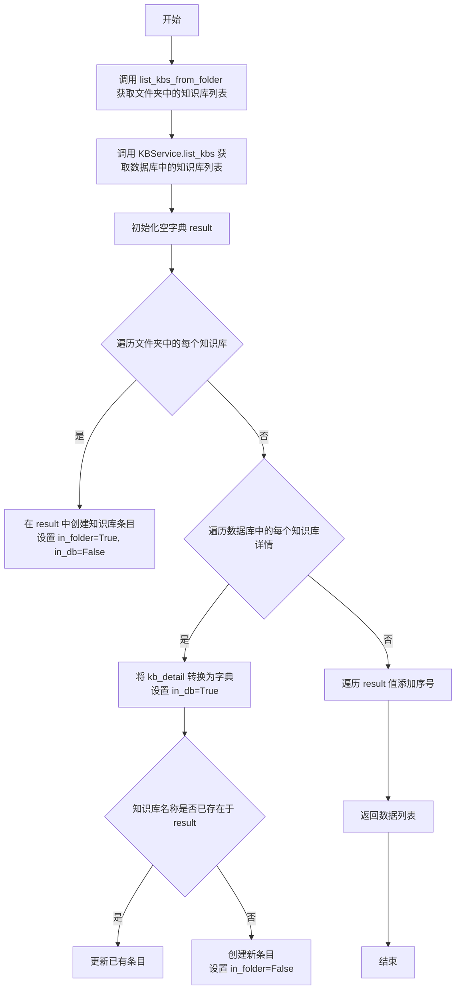

#### 带注释源码

```python
def get_kb_details() -> List[Dict]:
    """
    获取所有知识库的详细信息列表，包括文件夹和数据库中的知识库
    
    Returns:
        List[Dict]: 知识库详情列表，每个字典包含以下字段:
            - kb_name: 知识库名称
            - vs_type: 向量库类型
            - kb_info: 知识库介绍
            - embed_model: 嵌入模型
            - file_count: 文件数量
            - create_time: 创建时间
            - in_folder: 是否在文件夹中存在
            - in_db: 是否在数据库中存在
            - No: 序号
    """
    # 从文件系统获取知识库列表
    kbs_in_folder = list_kbs_from_folder()
    # 从数据库获取知识库列表
    kbs_in_db: List[KnowledgeBaseSchema] = KBService.list_kbs()
    # 用于存储合并后的知识库信息
    result = {}

    # 遍历文件夹中的知识库，初始化结果字典
    for kb in kbs_in_folder:
        result[kb] = {
            "kb_name": kb,
            "vs_type": "",
            "kb_info": "",
            "embed_model": "",
            "file_count": 0,
            "create_time": None,
            "in_folder": True,  # 标记在文件夹中存在
            "in_db": False,     # 初始标记为不在数据库中
        }

    # 遍历数据库中的知识库，合并或新增到结果字典
    for kb_detail in kbs_in_db:
        # 将 Pydantic 模型转换为字典
        kb_detail = kb_detail.model_dump()
        kb_name = kb_detail["kb_name"]
        # 标记在数据库中存在
        kb_detail["in_db"] = True
        # 如果知识库已存在于 result 中，则更新信息
        if kb_name in result:
            result[kb_name].update(kb_detail)
        # 如果知识库不在 result 中，则新增（标记为不在文件夹中）
        else:
            kb_detail["in_folder"] = False
            result[kb_name] = kb_detail

    # 将结果字典转换为列表，并添加序号
    data = []
    for i, v in enumerate(result.values()):
        v["No"] = i + 1
        data.append(v)

    return data
```


### `get_kb_file_details`

获取指定知识库中所有文件的详细信息列表，包括文件在本地文件夹和数据库中的状态信息。

参数：

- `kb_name`：`str`，知识库名称，用于指定要获取文件详情的知识库

返回值：`List[Dict]`，返回包含文件详细信息的字典列表，每个字典包含文件的基本信息、版本、加载器、分词器、创建时间以及是否存在于文件夹或数据库中

#### 流程图

```mermaid
flowchart TD
    A[开始: get_kb_file_details] --> B[调用KBServiceFactory.get_service_by_name获取知识库服务]
    B --> C{知识库服务是否存在?}
    C -->|否| D[返回空列表[]]
    C -->|是| E[获取文件夹中的文件列表 files_in_folder]
    E --> F[获取数据库中的文件列表 files_in_db]
    F --> G[初始化结果字典 result={}]
    G --> H[遍历文件夹中的文件]
    H --> I[为每个文件初始化基础信息结构]
    I --> J[创建小写文件名映射 lower_names]
    J --> K[遍历数据库中的文件]
    K --> L{文件详情是否存在?}
    L -->|否| K
    L -->|是| M[更新文件详情到结果字典]
    M --> N[处理文件名大小写匹配]
    N --> O[构建最终数据列表]
    O --> P[为每个文件添加序号]
    P --> Q[返回数据列表]
```

#### 带注释源码

```python
def get_kb_file_details(kb_name: str) -> List[Dict]:
    """
    获取指定知识库中所有文件的详细信息列表
    
    参数:
        kb_name: 知识库名称
    
    返回:
        包含文件详细信息的字典列表
    """
    # 通过知识库名称获取KBService实例
    kb = KBServiceFactory.get_service_by_name(kb_name)
    
    # 如果知识库不存在，返回空列表
    if kb is None:
        return []

    # 获取知识库文件夹中的文件列表
    files_in_folder = list_files_from_folder(kb_name)
    
    # 从数据库获取该知识库已入库的文件列表
    files_in_db = kb.list_files()
    
    # 初始化结果字典，用于存储合并后的文件信息
    result = {}

    # 遍历文件夹中的文件，构建基础信息结构
    for doc in files_in_folder:
        result[doc] = {
            "kb_name": kb_name,              # 知识库名称
            "file_name": doc,                # 文件名
            "file_ext": os.path.splitext(doc)[-1],  # 文件扩展名
            "file_version": 0,                # 文件版本
            "document_loader": "",           # 文档加载器
            "docs_count": 0,                 # 文档数量
            "text_splitter": "",             # 文本分词器
            "create_time": None,             # 创建时间
            "in_folder": True,               # 是否在文件夹中
            "in_db": False,                  # 是否在数据库中
        }
    
    # 创建文件名小写映射，用于大小写不敏感匹配
    lower_names = {x.lower(): x for x in result}
    
    # 遍历数据库中的文件，获取详细信息并合并
    for doc in files_in_db:
        # 从数据库获取文件详情
        doc_detail = get_file_detail(kb_name, doc)
        if doc_detail:
            doc_detail["in_db"] = True
            # 如果文件在文件夹中存在（大小写不敏感匹配），则更新信息
            if doc.lower() in lower_names:
                result[lower_names[doc.lower()]].update(doc_detail)
            else:
                # 文件不在文件夹中，仅在数据库中存在
                doc_detail["in_folder"] = False
                result[doc] = doc_detail

    # 将结果字典转换为列表，并添加序号
    data = []
    for i, v in enumerate(result.values()):
        v["No"] = i + 1
        data.append(v)

    return data
```


### `score_threshold_process`

根据分数阈值过滤搜索结果，返回top k个文档。该函数通过比较文档的相似度分数与阈值，过滤掉不符合条件的文档，并限制返回结果的数量。

参数：

- `score_threshold`：`Optional[float]`，分数阈值，用于过滤相似度低于或等于该阈值的文档，如果为None则不过滤
- `k`：`int`，返回的文档数量上限
- `docs`：`List[Tuple[Document, float]]`，文档列表，每个元素为(文档, 相似度分数)的元组

返回值：`List[Tuple[Document, float]]`，过滤并截断后的文档列表

#### 流程图

```mermaid
flowchart TD
    A[开始] --> B{score_threshold is not None?}
    B -->|Yes| C[使用 operator.le 作为比较函数]
    B -->|No| D[跳过过滤]
    C --> E[遍历 docs 中的每个 doc, similarity]
    E --> F{similarity <= score_threshold?}
    F -->|Yes| G[保留该文档]
    F -->|No| H[过滤掉该文档]
    G --> I[构建新的 docs 列表]
    H --> E
    D --> J[使用原始 docs]
    I --> K[返回 docs[:k]]
    J --> K
```

#### 带注释源码

```python
def score_threshold_process(score_threshold, k, docs):
    """
    根据分数阈值过滤搜索结果，返回top k个文档
    
    参数:
        score_threshold: 分数阈值，用于过滤相似度低于或等于该阈值的文档
        k: 返回的文档数量上限
        docs: 文档列表，每个元素为(文档, 相似度分数)的元组
    
    返回:
        过滤并截断后的文档列表
    """
    # 如果设置了分数阈值，则进行过滤
    if score_threshold is not None:
        # 使用 operator.le (less than or equal) 作为比较函数
        cmp = operator.le
        # 列表推导式过滤：只保留相似度分数小于等于阈值的文档
        docs = [
            (doc, similarity)
            for doc, similarity in docs
            if cmp(similarity, score_threshold)
        ]
    # 返回前k个文档
    return docs[:k]
```


### `KBService.__init__`

初始化知识库服务实例，设置知识库的基本属性（名称、描述、嵌入模型、路径等），并调用子类的初始化方法。

参数：

- `knowledge_base_name`：`str`，知识库名称，用于唯一标识一个知识库
- `kb_info`：`str`，知识库的描述信息，默认为 None，若未提供则从配置中查找或生成默认描述
- `embed_model`：`str`，向量嵌入模型，默认为 `get_default_embedding()` 的返回值

返回值：`None`，构造函数无返回值，仅初始化实例属性

#### 流程图

```mermaid
flowchart TD
    A[开始 __init__] --> B[设置 self.kb_name = knowledge_base_name]
    B --> C{kb_info 是否为 None?}
    C -->|是| D[从 Settings.kb_settings.KB_INFO 获取知识库描述<br/>若不存在则生成默认描述]
    C -->|否| E[使用传入的 kb_info]
    D --> F[设置 self.kb_info]
    E --> F
    F --> G[设置 self.embed_model = embed_model]
    G --> H[获取知识库路径: get_kb_path(self.kb_name)]
    H --> I[获取文档路径: get_doc_path(self.kb_name)]
    I --> J[调用子类实现的 do_init 方法]
    J --> K[结束 __init__]
```

#### 带注释源码

```python
def __init__(
    self,
    knowledge_base_name: str,
    kb_info: str = None,
    embed_model: str = get_default_embedding(),
):
    """
    初始化知识库服务实例
    
    参数:
        knowledge_base_name: 知识库名称
        kb_info: 知识库描述信息，可选
        embed_model: 向量嵌入模型，默认为系统默认嵌入模型
    """
    # 1. 设置知识库名称
    self.kb_name = knowledge_base_name
    
    # 2. 设置知识库描述信息
    # 如果未提供 kb_info，则从配置 Settings.kb_settings.KB_INFO 中查找
    # 若配置中也没有，则生成默认描述 "关于{knowledge_base_name}的知识库"
    self.kb_info = kb_info or Settings.kb_settings.KB_INFO.get(
        knowledge_base_name, f"关于{knowledge_base_name}的知识库"
    )
    
    # 3. 设置嵌入模型
    self.embed_model = embed_model
    
    # 4. 获取知识库在磁盘上的根目录路径
    self.kb_path = get_kb_path(self.kb_name)
    
    # 5. 获取知识库中文档的存储路径
    self.doc_path = get_doc_path(self.kb_name)
    
    # 6. 调用子类实现的初始化方法
    # 子类需要实现 do_init 方法来完成特定的初始化逻辑
    # 例如：加载向量库、连接数据库等
    self.do_init()
```


### `KBService.__repr__`

返回知识库的字符串表示，包含知识库名称和嵌入模型信息，用于调试和日志输出。

参数：

-  `self`：隐式参数，KBService 实例本身

返回值：`str`，返回格式为 `{知识库名称} @ {嵌入模型名称}` 的字符串

#### 流程图

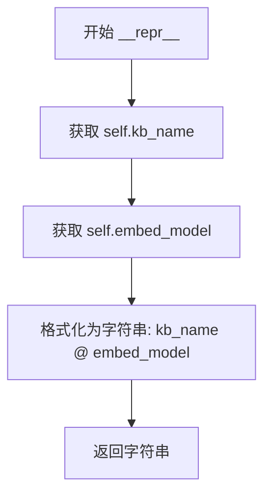

#### 带注释源码

```
def __repr__(self) -> str:
    """
    返回知识库的字符串表示
    
    Returns:
        str: 格式为 '{知识库名称} @ {嵌入模型名称}' 的字符串
              例如: 'my_kb @ text-embedding-3-small'
    """
    return f"{self.kb_name} @ {self.embed_model}"
```


### `KBService.save_vector_store`

该方法用于保存向量库，根据不同的向量存储类型（FAISS 保存到磁盘，Milvus 保存到数据库），但当前版本仅包含方法声明，未实现具体逻辑，PGVector 暂未支持。

参数：无（仅包含 `self` 参数）

返回值：`None`，无返回值

#### 流程图

```mermaid
flowchart TD
    A[开始保存向量库] --> B{判断向量库类型}
    B -->|FAISS| C[保存到磁盘]
    B -->|Milvus| D[保存到数据库]
    B -->|PGVector| E[暂不支持]
    C --> F[结束]
    D --> F
    E --> F
    
    note: 当前方法未实现,仅为占位符
```

#### 带注释源码

```python
def save_vector_store(self):
    """
    保存向量库:FAISS保存到磁盘，milvus保存到数据库。PGVector暂未支持
    
    注意: 该方法为抽象方法声明，具体实现由子类覆盖
    - FAISS: 调用 do_save_vs() 或类似方法保存到磁盘
    - Milvus: 调用数据库持久化方法
    - PGVector: 暂未支持
    """
    pass
```

---

### 补充说明

| 项目 | 详情 |
|------|------|
| **所属类** | `KBService` (抽象基类) |
| **方法性质** | 实例方法（非抽象方法，但未实现） |
| **设计意图** | 为不同向量存储类型的保存操作提供统一接口 |
| **当前状态** | 仅包含方法签名和文档注释，无实际逻辑 |
| **子类实现** | 预计在 FaissKBService、MilvusKBService 等子类中实现具体逻辑 |


### `KBService.check_embed_model`

检查当前知识库服务所配置的嵌入模型是否有效可用。

参数：

- `self`：`KBService`，隐式参数，表示当前知识库服务实例本身，用于访问实例属性 `self.embed_model`

返回值：`Tuple[bool, str]`，返回元组，第一个元素为布尔值表示嵌入模型是否有效，第二个元素为字符串描述信息（如无效则包含错误原因）

#### 流程图

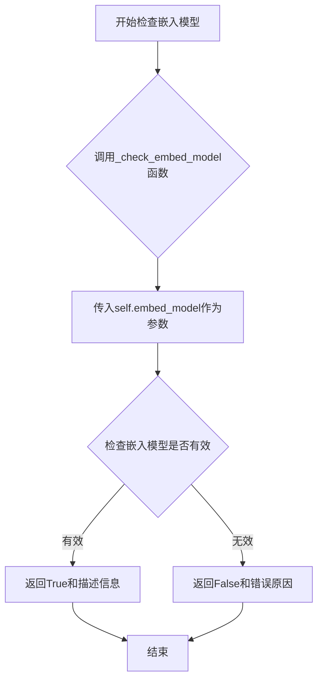

#### 带注释源码

```python
def check_embed_model(self) -> Tuple[bool, str]:
    """
    检查嵌入模型是否有效
    该方法验证当前知识库服务配置的嵌入模型(embed_model)是否可用
    通过调用顶层工具函数_check_embed_model进行实际验证
    """
    # 调用从chatchat.server.utils导入的_check_embed_model函数
    # 传入当前实例的embed_model属性进行验证
    return _check_embed_model(self.embed_model)
```


### `KBService.create_kb`

创建知识库的方法，负责在文件系统中创建知识库目录，并将知识库信息持久化到数据库，同时调用子类实现的创建逻辑。

参数：

- 该方法无显式参数（仅使用实例属性 `self.kb_name`、`self.kb_info`、`self.vs_type`、`self.embed_model`）

返回值：`bool`，返回是否成功创建知识库（数据库操作结果）

#### 流程图

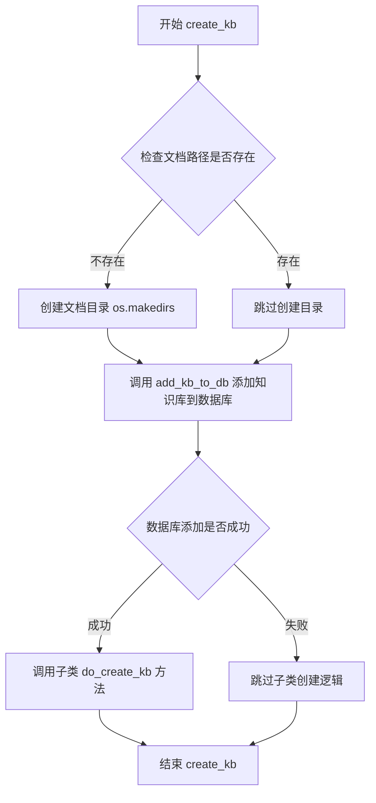

#### 带注释源码

```python
def create_kb(self):
    """
    创建知识库
    """
    # Step 1: 检查知识库的文档存储路径是否存在，不存在则创建
    if not os.path.exists(self.doc_path):
        os.makedirs(self.doc_path)

    # Step 2: 将知识库元信息（名称、描述、向量存储类型、嵌入模型）添加到数据库
    status = add_kb_to_db(
        self.kb_name, self.kb_info, self.vs_type(), self.embed_model
    )

    # Step 3: 如果数据库添加成功，则调用子类实现的具体创建逻辑
    if status:
        self.do_create_kb()

    # Step 4: 返回操作状态（成功返回 True，失败返回 False）
    return status
```


### `KBService.clear_vs`

清空向量库内容，删除向量库中的所有向量数据并同步清除数据库中的文件记录。

参数：

- `self`：`KBService`，KBService 实例本身，包含知识库名称（`kb_name`）等属性

返回值：`bool`，表示是否成功删除数据库中的文件记录（`True` 为成功，`False` 为失败）

#### 流程图

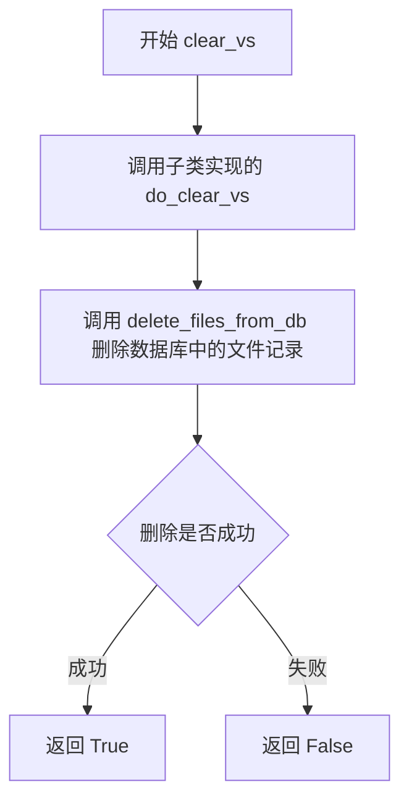

#### 带注释源码

```python
def clear_vs(self):
    """
    删除向量库中所有内容
    该方法首先调用子类实现的 do_clear_vs() 方法清除向量库中的向量数据，
    然后调用 delete_files_from_db 清除数据库中该知识库的所有文件记录。
    """
    # 步骤1：调用子类实现的抽象方法，清除向量库中的向量数据
    self.do_clear_vs()
    
    # 步骤2：清除数据库中的文件记录，返回操作状态（True表示成功，False表示失败）
    status = delete_files_from_db(self.kb_name)
    
    # 步骤3：返回操作状态
    return status
```


### `KBService.drop_kb`

删除知识库方法，负责调用子类的向量库删除逻辑并同步清理数据库中的知识库记录。

参数：该方法无显式参数（除 self 外）

返回值：`bool`，表示删除操作是否成功

#### 流程图

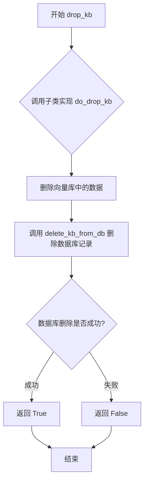

#### 带注释源码

```python
def drop_kb(self):
    """
    删除知识库
    1. 调用子类的 do_drop_kb() 方法清理向量存储层的数据
    2. 调用 delete_kb_from_db() 清理数据库中的知识库元数据
    3. 返回操作结果状态
    """
    # 调用抽象方法，由子类实现具体的向量库删除逻辑
    # 例如：FAISS 删除磁盘文件、Milvus 删除向量索引等
    self.do_drop_kb()
    
    # 从数据库中删除知识库记录及相关文件信息
    # 该函数来自 knowledge_base_repository 模块
    status = delete_kb_from_db(self.kb_name)
    
    # 返回删除操作的成功/失败状态
    return status
```


### `KBService.add_doc`

向知识库添加文档，支持自定义文档或通过文件转换为文档添加。

参数：

-   `kb_file`：`KnowledgeFile`，知识库文件对象，包含文件名和路径等信息
-   `docs`：`List[Document]`，可选的文档列表。如果提供，则使用这些文档而不进行文本向量化
-   `**kwargs`：其他关键字参数，用于传递给底层向量库添加方法

返回值：`bool`，添加成功返回 True，失败返回 False

#### 流程图

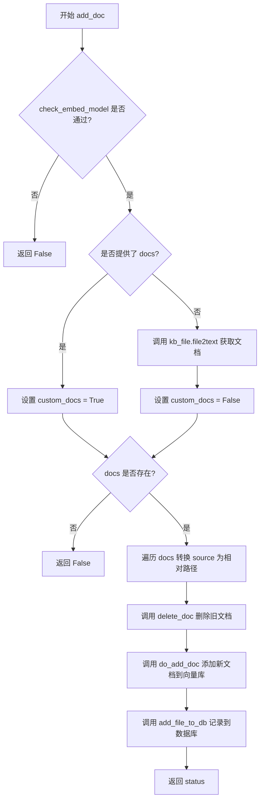

#### 带注释源码

```python
def add_doc(self, kb_file: KnowledgeFile, docs: List[Document] = [], **kwargs):
    """
    向知识库添加文件
    如果指定了docs，则不再将文本向量化，并将数据库对应条目标为custom_docs=True
    """
    # 第一步：检查嵌入模型是否可用
    if not self.check_embed_model()[0]:
        return False

    # 第二步：根据是否提供 docs 来设置自定义文档标志
    if docs:
        custom_docs = True  # 使用自定义文档，不进行向量化
    else:
        # 从文件中提取文本并转换为文档
        docs = kb_file.file2text()
        custom_docs = False  # 使用文件转换的文档，需要向量化

    # 第三步：如果有文档，进行处理
    if docs:
        # 将 metadata["source"] 改为相对路径
        for doc in docs:
            try:
                # 确保 source 字段存在，默认使用文件名
                doc.metadata.setdefault("source", kb_file.filename)
                source = doc.metadata.get("source", "")
                # 如果是绝对路径，转换为相对于知识库文档目录的相对路径
                if os.path.isabs(source):
                    rel_path = Path(source).relative_to(self.doc_path)
                    doc.metadata["source"] = str(rel_path.as_posix().strip("/"))
            except Exception as e:
                print(
                    f"cannot convert absolute path ({source}) to relative path. error is : {e}"
                )
        
        # 第四步：先删除已存在的旧文档（避免重复）
        self.delete_doc(kb_file)
        
        # 第五步：调用子类实现的 do_add_doc 方法添加文档到向量库
        doc_infos = self.do_add_doc(docs, **kwargs)
        
        # 第六步：将文件信息记录到数据库
        status = add_file_to_db(
            kb_file,
            custom_docs=custom_docs,
            docs_count=len(docs),
            doc_infos=doc_infos,
        )
    else:
        status = False
    return status
```


### `KBService.delete_doc`

从知识库删除指定文件的文档内容，支持可选的物理文件删除功能。该方法首先调用子类实现的向量库删除逻辑，然后删除数据库中的文件记录，最后根据参数决定是否删除实际的文件内容。

参数：

- `self`：`KBService`，KBService 实例本身
- `kb_file`：`KnowledgeFile`，要删除的知识库文件对象，包含文件名和路径等信息
- `delete_content`：`bool`，可选参数，默认为 False，是否删除磁盘上的实际文件内容
- `**kwargs`：可变关键字参数，用于传递额外的删除选项

返回值：`bool`，表示删除操作是否成功（True 为成功，False 为失败）

#### 流程图

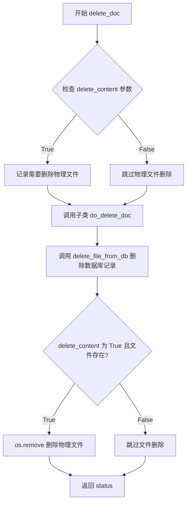

#### 带注释源码

```python
def delete_doc(
    self, kb_file: KnowledgeFile, delete_content: bool = False, **kwargs
):
    """
    从知识库删除文件
    参数:
        kb_file: KnowledgeFile对象，要删除的知识文件
        delete_content: bool，是否删除磁盘上的实际文件，默认为False
        **kwargs: 额外的关键字参数，会传递给do_delete_doc
    返回:
        bool: 操作是否成功
    """
    # 步骤1: 调用子类实现的向量库删除方法
    # 子类需要实现do_delete_doc来清理向量库中的文档
    self.do_delete_doc(kb_file, **kwargs)
    
    # 步骤2: 从数据库中删除文件记录
    # 使用repository层的方法删除数据库中的文件元信息
    status = delete_file_from_db(kb_file)
    
    # 步骤3: 根据参数决定是否删除物理文件
    # 仅当delete_content为True且文件存在时，才删除磁盘上的实际文件
    if delete_content and os.path.exists(kb_file.filepath):
        os.remove(kb_file.filepath)
    
    # 返回操作状态
    return status
```


### KBService.update_info

更新知识库描述信息，将新的知识库介绍内容更新到实例属性并同步到数据库。

参数：

- `kb_info`：`str`，需要更新的知识库描述信息

返回值：`bool`，表示数据库更新操作是否成功

#### 流程图

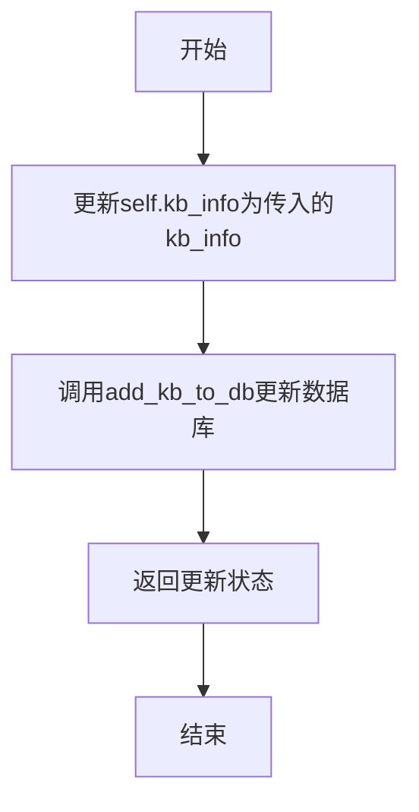

#### 带注释源码

```python
def update_info(self, kb_info: str):
    """
    更新知识库介绍
    """
    # 将传入的kb_info参数赋值给实例属性self.kb_info
    self.kb_info = kb_info
    # 调用数据库仓库层的add_kb_to_db函数，更新知识库的元信息到数据库
    # 参数包括：知识库名称、更新后的描述信息、向量存储类型、嵌入模型
    status = add_kb_to_db(
        self.kb_name, self.kb_info, self.vs_type(), self.embed_model
    )
    # 返回数据库操作的状态结果
    return status
```


### `KBService.update_doc`

该方法用于更新知识库中的文档。如果指定了自定义文档列表（docs），则使用自定义文档更新向量库；否则使用文件内容生成文档进行更新。核心逻辑是调用 `delete_doc` 删除旧文档，然后调用 `add_doc` 添加新文档。

参数：

- `self`：`KBService`，KBService 类实例本身
- `kb_file`：`KnowledgeFile`，要更新的知识库文件对象
- `docs`：`List[Document]`，可选参数，自定义文档列表。如果指定此参数，则使用自定义文档而不将文本向量化，并将数据库对应条目标记为 custom_docs=True
- `**kwargs`：任意关键字参数，会传递给 `delete_doc` 和 `add_doc` 方法

返回值：`bool`，操作是否成功（嵌入模型不可用时返回 False）

#### 流程图

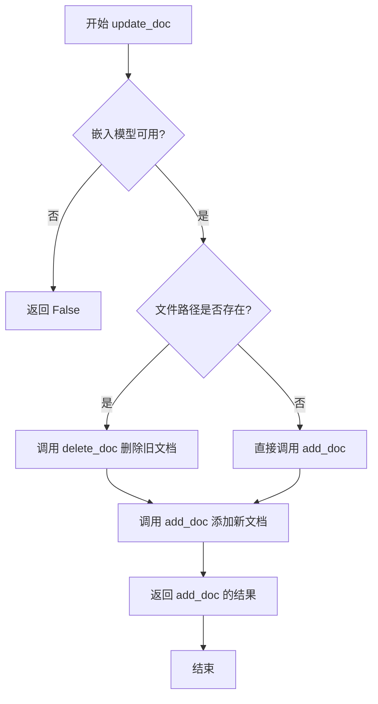

#### 带注释源码

```python
def update_doc(self, kb_file: KnowledgeFile, docs: List[Document] = [], **kwargs):
    """
    使用content中的文件更新向量库
    如果指定了docs，则使用自定义docs，并将数据库对应条目标为custom_docs=True
    """
    # 检查嵌入模型是否可用，如果不可用则直接返回 False
    if not self.check_embed_model()[0]:
        return False

    # 检查文件路径是否存在
    if os.path.exists(kb_file.filepath):
        # 如果文件存在，先删除旧文档
        self.delete_doc(kb_file, **kwargs)
        # 然后添加新文档（使用提供的 docs 或重新从文件生成文档）
        return self.add_doc(kb_file, docs=docs, **kwargs)
    else:
        # 如果文件不存在，直接添加文档
        return self.add_doc(kb_file, docs=docs, **kwargs)
```


### `KBService.exist_doc`

检查指定文件是否存在于知识库中。

参数：

- `file_name`：`str`，要检查的文件名

返回值：`bool`，如果文件存在于数据库中返回 `True`，否则返回 `False`

#### 流程图

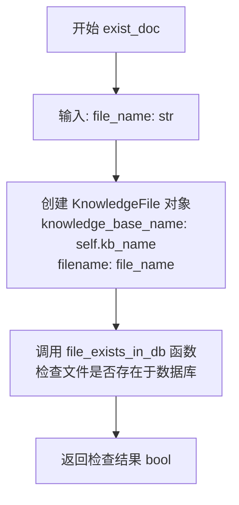

#### 带注释源码

```python
def exist_doc(self, file_name: str):
    """
    检查指定文件是否存在于知识库中
    
    参数:
        file_name: str - 要检查的文件名
        
    返回:
        bool - 文件是否存在
    """
    # 使用 KnowledgeFile 封装知识库名称和文件名
    # 然后调用数据库仓库层的 file_exists_in_db 函数检查文件是否存在
    return file_exists_in_db(
        KnowledgeFile(knowledge_base_name=self.kb_name, filename=file_name)
    )
```


### `KBService.list_files`

该方法用于列出当前知识库中存储的所有文件，通过调用数据库仓储层的 `list_files_from_db` 函数获取知识库名称对应的所有文件列表。

参数： 无（仅使用实例属性 `self.kb_name`）

返回值：`List[str]`，返回知识库中所有文件的文件名列表。

#### 流程图

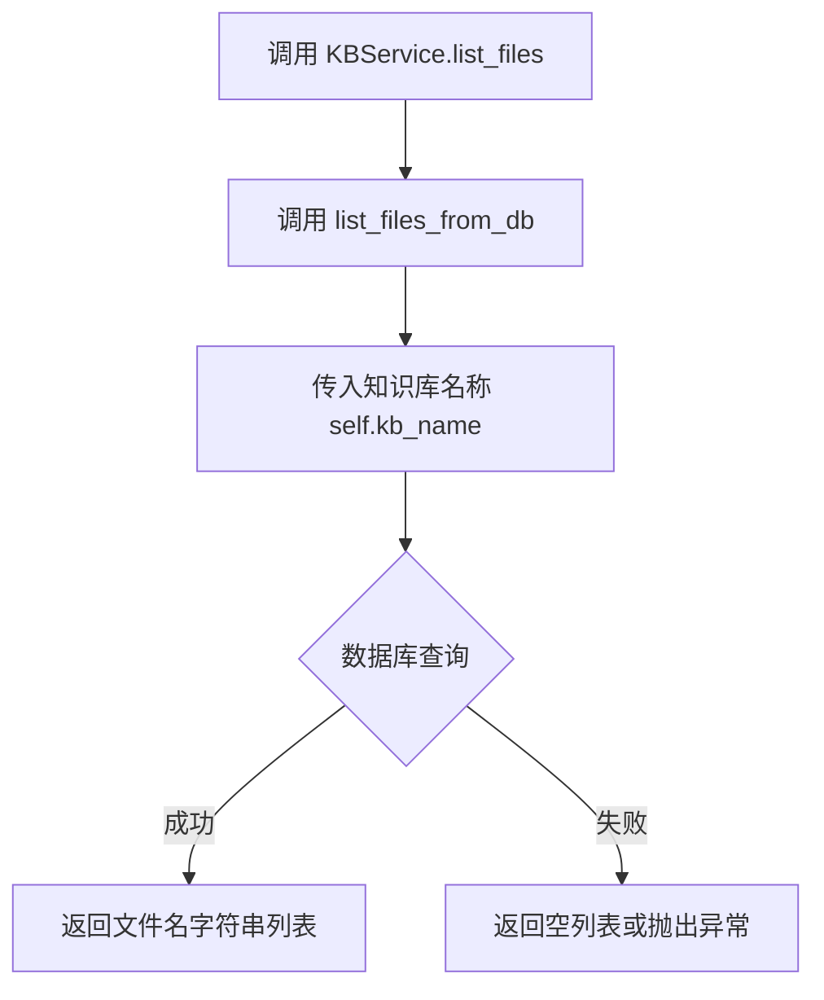

#### 带注释源码

```python
def list_files(self):
    """
    列出知识库中的所有文件
    
    该方法调用数据库仓储层的 list_files_from_db 函数，
    根据当前知识库名称查询并返回所有已入库的文件名列表。
    
    Returns:
        List[str]: 知识库中所有文件的文件名列表
    """
    return list_files_from_db(self.kb_name)
```


### `KBService.count_files`

统计知识库中的文件数量，通过调用数据库仓储层的 `count_files_from_db` 函数获取当前知识库名称对应的文件记录总数。

参数：

- 该方法无显式参数（`self` 为隐式参数，指代 KBService 实例本身）

返回值：`int`，返回知识库中文件的具体数量，由数据库查询结果决定。

#### 流程图

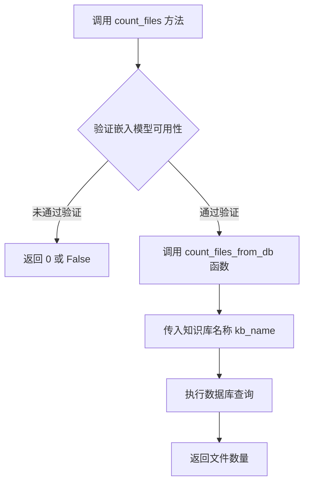

#### 带注释源码

```python
def count_files(self):
    """
    统计知识库中的文件数量
    
    该方法直接调用数据库仓储层的 count_files_from_db 函数，
    通过知识库名称查询数据库中该知识库所关联的文件记录总数。
    无需额外的参数传递，因为知识库名称已在 KBService 实例化时初始化。
    
    注意：该方法依赖于 self.kb_name 属性，该属性在 __init__ 方法中被赋值。
    如果知识库不存在，返回值可能为 0 或其他表示空值的类型（取决于底层实现）。
    
    返回:
        int: 知识库中文件的总数
    """
    return count_files_from_db(self.kb_name)
```


### `KBService.search_docs`

该方法用于在知识库中搜索与给定查询字符串最相关的文档，支持通过 `top_k` 参数限制返回文档数量，并通过 `score_threshold` 参数过滤低相关性文档。

参数：

- `query`：`str`，搜索查询字符串
- `top_k`：`int`，返回的文档数量，默认为 `Settings.kb_settings.VECTOR_SEARCH_TOP_K`
- `score_threshold`：`float`，相关性分数阈值，用于过滤低相关性文档，默认为 `Settings.kb_settings.SCORE_THRESHOLD`

返回值：`List[Document]`，返回与查询相关的文档列表

#### 流程图

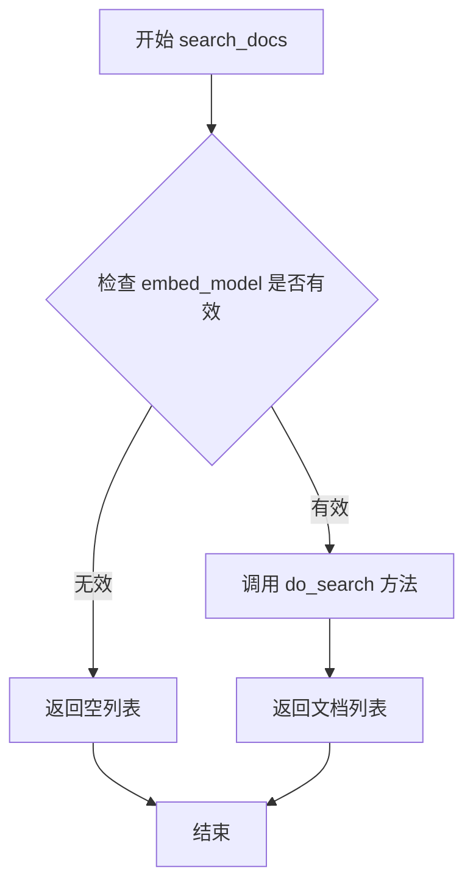

#### 带注释源码

```python
def search_docs(
    self,
    query: str,  # 搜索查询字符串
    top_k: int = Settings.kb_settings.VECTOR_SEARCH_TOP_K,  # 返回文档数量，默认从设置中读取
    score_threshold: float = Settings.kb_settings.SCORE_THRESHOLD,  # 相关性分数阈值，默认从设置中读取
) -> List[Document]:  # 返回文档列表
    """
    搜索知识库文档
    """
    # 检查 embedding 模型是否有效，如果无效则直接返回空列表
    if not self.check_embed_model()[0]:
        return []

    # 调用子类实现的 do_search 方法进行实际搜索
    docs = self.do_search(query, top_k, score_threshold)
    
    # 返回搜索结果文档列表
    return docs
```


### `KBService.get_doc_by_ids`

根据给定的文档ID列表，从知识库中获取对应的文档对象列表。

参数：

- `ids`：`List[str]`，需要查询的文档ID列表

返回值：`List[Document]`，返回与给定ID对应的文档对象列表

#### 流程图

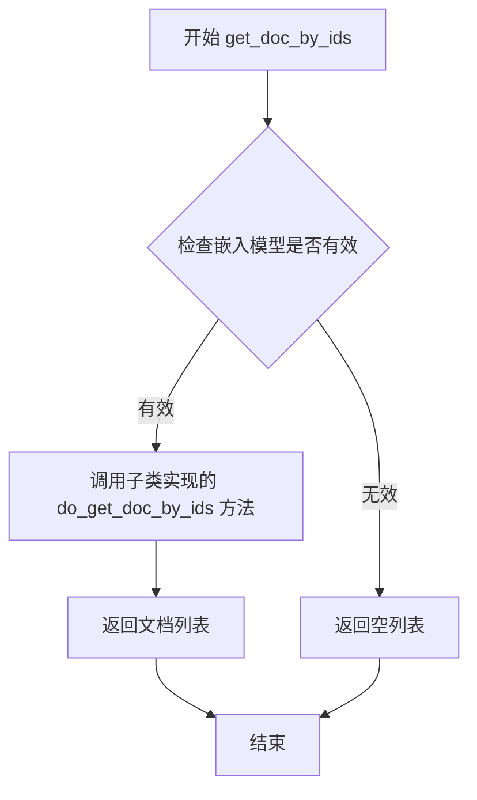

#### 带注释源码

```python
def get_doc_by_ids(self, ids: List[str]) -> List[Document]:
    """
    根据文档ID列表获取对应的文档对象
    
    参数:
        ids: 文档ID列表
        
    返回:
        文档对象列表
    """
    return []
```


### `KBService.del_doc_by_ids`

根据ID删除文档的抽象方法，子类需要实现具体逻辑。当前基类实现为抛出 `NotImplementedError`。

参数：

- `ids`：`List[str]`，要删除的文档ID列表

返回值：`bool`，表示删除操作是否成功

#### 流程图

```mermaid
flowchart TD
    A[开始 del_doc_by_ids] --> B{子类是否实现?}
    B -->|已实现| C[调用子类的 do_del_doc_by_ids]
    B -->|未实现| D[raise NotImplementedError]
    C --> E[返回删除结果 bool]
    D --> F[抛出异常，终止操作]
    
    style D fill:#ffcccc
    style F fill:#ffcccc
```

#### 带注释源码

```python
def del_doc_by_ids(self, ids: List[str]) -> bool:
    """
    根据文档ID列表从知识库中删除指定文档
    
    参数:
        ids: List[str] - 要删除的文档ID列表
    
    返回:
        bool - 删除操作是否成功
    
    注意:
        这是一个抽象方法，基类实现为抛出 NotImplementedError。
        具体删除逻辑由子类（如 FaissKBService, PGKBService 等）实现。
        子类需要重写此方法以实现真正的向量库文档删除操作。
    """
    raise NotImplementedError
```


### `KBService.update_doc_by_ids`

该方法根据文档ID更新知识库中的文档。如果传入的文档对象为空或其内容为空，则对应的文档将被删除。

参数：

- `docs`：`Dict[str, Document]`，键为文档ID，值为Document对象，传入参数为 `{doc_id: Document, ...}`

返回值：`bool`，表示更新操作是否成功。如果embed_model检查失败返回False，否则返回True

#### 流程图

```mermaid
flowchart TD
    A[开始 update_doc_by_ids] --> B{check_embed_model 是否通过}
    B -->|否| C[返回 False]
    B -->|是| D[调用 del_doc_by_ids 删除所有传入ID的文档]
    D --> E[初始化空列表 pending_docs 和 ids]
    E --> F{遍历 docs 中的每个 _id 和 doc}
    F -->|doc 为空或 page_content 为空| G[跳过当前文档]
    F -->|doc 有效| H[将 _id 加入 ids, doc 加入 pending_docs]
    G --> I{是否还有更多文档}
    H --> I
    I -->|是| F
    I -->|否| J[调用 do_add_doc 添加 pending_docs 和 ids]
    J --> K[返回 True]
```

#### 带注释源码

```python
def update_doc_by_ids(self, docs: Dict[str, Document]) -> bool:
    """
    传入参数为： {doc_id: Document, ...}
    如果对应 doc_id 的值为 None，或其 page_content 为空，则删除该文档
    """
    # 检查embedding模型是否可用
    if not self.check_embed_model()[0]:
        return False

    # 先删除所有需要更新的文档ID对应的现有文档
    self.del_doc_by_ids(list(docs.keys()))
    
    # 准备待添加的有效文档列表和对应的ID列表
    pending_docs = []
    ids = []
    
    # 遍历传入的文档字典，过滤掉空文档
    for _id, doc in docs.items():
        # 如果文档为空或内容为空，则跳过（实现删除效果）
        if not doc or not doc.page_content.strip():
            continue
        # 收集有效的文档ID和文档对象
        ids.append(_id)
        pending_docs.append(doc)
    
    # 调用子类方法添加文档到向量库
    self.do_add_doc(docs=pending_docs, ids=ids)
    return True
```


### `KBService.list_docs`

该方法通过指定的文件名称（file_name）或元数据（metadata）条件从知识库中检索文档列表，并返回带有向量存储ID的文档对象列表。

参数：

- `file_name`：`str`，可选参数，用于指定要检索的文件名称，支持精确匹配过滤
- `metadata`：`Dict`，可选参数，用于指定元数据条件进行文档筛选

返回值：`List[DocumentWithVSId]`，返回包含向量存储ID的文档对象列表

#### 流程图

```mermaid
flowchart TD
    A[开始 list_docs] --> B{检查file_name和metadata参数}
    B --> C[调用list_docs_from_db查询数据库]
    C --> D[遍历查询结果doc_infos]
    D --> E[获取当前文档ID: x['id']]
    E --> F[调用get_doc_by_ids获取文档详情]
    F --> G{文档是否存在?}
    G -->|是| H[创建DocumentWithVSId对象]
    H --> I[将文档添加到结果列表]
    I --> D
    G -->|否| J[跳过当前文档]
    J --> D
    D --> K[返回文档列表]
    K --> L[结束]
```

#### 带注释源码

```python
def list_docs(
    self, file_name: str = None, metadata: Dict = {}
) -> List[DocumentWithVSId]:
    """
    通过file_name或metadata检索Document
    """
    # 调用数据库仓储层的list_docs_from_db函数，根据kb_name、file_name和metadata条件查询文档信息
    doc_infos = list_docs_from_db(
        kb_name=self.kb_name, file_name=file_name, metadata=metadata
    )
    
    # 初始化结果文档列表
    docs = []
    
    # 遍历从数据库获取的文档信息列表
    for x in doc_infos:
        # 根据文档ID从向量存储中获取完整的文档对象
        doc_info = self.get_doc_by_ids([x["id"]])[0]
        
        # 判断文档是否存在（非空）
        if doc_info is not None:
            # 处理非空的情况：创建带有向量存储ID的DocumentWithVSId对象
            # 合并文档字典数据并将ID字段加入
            doc_with_id = DocumentWithVSId(**{**doc_info.dict(), "id":x["id"]})
            docs.append(doc_with_id)
        else:
            # 处理空的情况：文档不存在于向量存储中
            # 可以选择跳过当前循环迭代或执行其他操作
            pass
    
    # 返回包含向量存储ID的文档对象列表
    return docs
```


### `KBService.get_relative_source_path`

将文件路径转化为相对路径，确保查询时路径一致性。

参数：

- `filepath`：`str`，需要转换的文件路径（可以是绝对路径或相对路径）

返回值：`str`，转换后的相对路径

#### 流程图

```mermaid
flowchart TD
    A[开始: 传入 filepath] --> B[设置 relative_path = filepath]
    B --> C{判断 relative_path 是否为绝对路径}
    C -->|是| D[尝试使用 Path.relative_to 转换为相对路径]
    D --> E{转换是否成功}
    E -->|是| F[继续处理]
    E -->|否| G[打印错误信息并保持原路径]
    C -->|否| F
    F --> H[转换为 POSIX 格式字符串]
    H --> I[去除首尾斜杠 /]
    I --> J[返回相对路径]
```

#### 带注释源码

```python
def get_relative_source_path(self, filepath: str):
    """
    将文件路径转化为相对路径，保证查询时一致
    """
    # 初始化相对路径为传入的filepath
    relative_path = filepath
    
    # 判断是否为绝对路径
    if os.path.isabs(relative_path):
        try:
            # 尝试将绝对路径转换为相对于doc_path的相对路径
            # self.doc_path 是知识库的文档存储路径
            relative_path = Path(filepath).relative_to(self.doc_path)
        except Exception as e:
            # 转换失败时打印错误信息，但仍然返回原路径（虽然可能是绝对路径）
            print(
                f"cannot convert absolute path ({relative_path}) to relative path. error is : {e}"
            )
    
    # 将路径转换为POSIX格式（使用正斜杠）
    # 去除首尾的斜杠，确保路径格式统一
    relative_path = str(relative_path.as_posix().strip("/"))
    
    # 返回相对路径字符串
    return relative_path
```


### `KBService.do_create_kb`

创建知识库的抽象方法，由子类实现具体的知识库创建逻辑。该方法在 `create_kb` 方法中被调用，用于执行与特定向量存储类型相关的知识库初始化操作。

参数：
- 无额外参数（仅包含 `self` 隐式参数）

返回值：`None`，无返回值（子类实现具体逻辑）

#### 流程图

```mermaid
flowchart TD
    A[开始 do_create_kb] --> B{子类实现}
    B --> C[FaissKBService 实现]
    B --> D[PGKBService 实现]
    B --> E[MilvusKBService 实现]
    B --> F[其他向量库实现]
    C --> G[初始化向量存储]
    D --> G
    E --> G
    F --> G
    G --> H[结束]
    
    style B fill:#f9f,stroke:#333,stroke-width:2px
    style G fill:#9f9,stroke:#333,stroke-width:2px
```

#### 带注释源码

```python
@abstractmethod
def do_create_kb(self):
    """
    创建知识库子类实自己逻辑
    
    这是一个抽象方法，由具体的向量库服务类（如 FaissKBService、PGKBService 等）
    实现各自的知识库创建逻辑。该方法在 KBService.create_kb() 方法中调用，
    只有当向数据库添加知识库信息成功后才会被执行。
    
    子类需要覆盖此方法以实现：
    - 创建向量存储实例
    - 初始化向量存储配置
    - 保存向量存储到磁盘或数据库
    """
    pass
```

---

**备注**：这是一个抽象方法，具体的实现逻辑依赖于不同的向量存储类型。在代码中通过 `KBServiceFactory` 可以看到有多种实现类（如 `FaissKBService`、`PGKBService`、`MilvusKBService` 等），每个子类都需要实现自己的 `do_create_kb` 方法来完成特定向量库的知识库创建工作。


### `KBService.list_kbs_type`

该方法是一个静态方法，用于列出当前系统支持的所有向量存储类型。它通过访问配置对象 `Settings.kb_settings.kbs_config` 并获取其键列表来返回所有可用的知识库类型。

参数： 无

返回值：`List[str]`，返回系统支持的向量存储类型列表（如 faiss、milvus、pg 等）

#### 流程图

```mermaid
flowchart TD
    A[开始] --> B[访问 Settings.kb_settings.kbs_config]
    B --> C[获取配置字典的键集合]
    C --> D[将键集合转换为列表]
    E[返回 List[str]] --> F[结束]
    D --> E
```

#### 带注释源码

```python
@staticmethod
def list_kbs_type():
    """
    列出系统支持的向量存储类型
    
    该方法为静态方法，不需要实例化 KBService 即可调用。
    它从全局配置 Settings 中读取知识库配置，获取所有已配置的向量存储类型。
    
    Returns:
        List[str]: 支持的向量存储类型名称列表，如 ['faiss', 'milvus', 'pg', ...]
    """
    # 访问 Settings 中的 kb_settings 配置，获取 kbs_config 字典
    # 然后提取所有键（即向量存储类型名称）并转换为列表返回
    return list(Settings.kb_settings.kbs_config.keys())
```


### `KBService.list_kbs`

列出所有知识库，返回数据库中所有已创建的知识库列表。

参数：

- `cls`：`KBService` 类本身（隐式参数，由 `@classmethod` 装饰器传入）

返回值：`List[KnowledgeBaseSchema]`，返回数据库中所有知识库的列表，每个元素为一个 `KnowledgeBaseSchema` 对象

#### 流程图

```mermaid
flowchart TD
    A[调用 KBService.list_kbs] --> B{检查调用方式}
    B -->|类方法调用| C[隐式传入 cls 参数]
    B -->|直接调用| D[无需传入 cls]
    C --> E[调用 list_kbs_from_db 函数]
    D --> E
    E --> F[查询数据库 knowledge_base 表]
    F --> G[返回知识库记录列表]
    G --> H[转换为列表返回]
    I[调用方接收知识库列表]
    H --> I
```

#### 带注释源码

```python
@classmethod
def list_kbs(cls):
    """
    类方法：列出所有知识库
    通过调用数据库仓储层的 list_kbs_from_db 函数获取所有已创建的知识库信息
    
    参数:
        cls: KBService 类本身（由 @classmethod 装饰器隐式传入）
    
    返回值:
        List[KnowledgeBaseSchema]: 知识库 schema 对象列表，每个对象包含知识库的详细信息
                                    如知识库名称、向量存储类型、嵌入模型等
    """
    return list_kbs_from_db()  # 调用数据库仓储层函数，查询并返回所有知识库记录
```


### `KBService.exists`

检查指定名称的知识库是否存在于数据库中。

参数：

- `kb_name`：`str`，可选参数，要检查的知识库名称。如果为空，则使用当前实例的知识库名称（`self.kb_name`）。

返回值：`bool`，返回知识库是否存在（True 表示存在，False 表示不存在）。

#### 流程图

```mermaid
flowchart TD
    A[开始] --> B{接收 kb_name 参数}
    B --> C{kb_name 是否为 None}
    C -->|是| D[使用实例的 self.kb_name]
    C -->|否| E[使用传入的 kb_name]
    D --> F[调用 kb_exists 函数]
    E --> F
    F --> G[返回是否存在结果]
    G --> H[结束]
```

#### 带注释源码

```python
def exists(self, kb_name: str = None):
    """
    检查知识库是否存在
    
    参数:
        kb_name: 知识库名称，如果为 None 则使用实例的 kb_name
        
    返回:
        bool: 知识库是否存在
    """
    # 如果未提供 kb_name，则使用实例当前的知识库名称
    kb_name = kb_name or self.kb_name
    
    # 调用数据库仓储层的 kb_exists 函数检查知识库是否存在
    return kb_exists(kb_name)
```


### `KBService.vs_type`

返回当前知识库所使用的向量存储类型（Vector Store Type），是一个抽象方法，需由子类实现具体逻辑以支持不同的向量存储后端（如Faiss、Milvus、PG等）。

参数：无（仅包含 `self` 参数）

返回值：`str`，返回向量存储的具体类型标识符，例如 "faiss"、"milvus"、"pg" 等。

#### 流程图

```mermaid
flowchart TD
    A[调用 vs_type] --> B{子类实现?}
    B -->|是| C[返回具体向量存储类型字符串]
    B -->|否| D[NotImplementedError]
    
    style C fill:#90EE90
    style D fill:#FFB6C1
```

#### 带注释源码

```python
@abstractmethod
def vs_type(self) -> str:
    """
    返回向量存储类型（抽象方法）
    
    该方法为抽象方法，必须由子类实现。
    子类需要返回对应的向量存储类型字符串，用于标识当前知识库使用的向量存储后端。
    
    Returns:
        str: 向量存储类型标识符，如 "faiss", "milvus", "pg", "relyt", "es", "chromadb" 等
    """
    pass
```

#### 说明

- **方法性质**：这是一个 `@abstractmethod` 装饰器标记的抽象方法，意味着 `KBService` 类不能直接实例化，必须通过子类继承并实现该方法。
- **设计意图**：通过抽象方法定义统一的接口，使得不同的向量存储实现（如 FaissKBService、MilvusKBService 等）可以提供各自的类型标识，便于上层统一管理和调用。
- **调用场景**：在 `create_kb()` 和 `update_info()` 方法中会被调用，用于将向量存储类型信息写入数据库。


### `KBService.do_init`

该方法是 `KBService` 抽象类中的抽象方法，作为子类初始化的钩子方法，在 `KBService` 实例化时被调用，用于执行各子类特定的初始化逻辑（如加载向量存储、初始化连接等）。

参数：
- 无（仅 `self` 隐式参数）

返回值：`None`，无返回值

#### 流程图

```mermaid
flowchart TD
    A[KBService.__init__ 调用 do_init] --> B{子类实现 do_init}
    B --> C1[FaissKBService: 加载本地向量存储]
    B --> C2[PGKBService: 建立数据库连接]
    B --> C3[MilvusKBService: 连接Milvus服务]
    B --> C4[ESKBService: 连接Elasticsearch]
    B --> C5[ChromaKBService: 初始化Chroma集合]
    B --> C6[DefaultKBService: 默认初始化]
    
    C1 --> D[初始化完成]
    C2 --> D
    C3 --> D
    C4 --> D
    C5 --> D
    C6 --> D
```

#### 带注释源码

```python
@abstractmethod
def do_init(self):
    """
    子类实现初始化逻辑
    该方法是抽象方法，由KBService的子类重写实现
    在KBService.__init__中被调用，用于执行各向量存储类型特定的初始化操作
    例如：
    - FaissKBService: 从磁盘加载已存在的FAISS向量库
    - PGKBService: 建立与PostgreSQL数据库的连接
    - MilvusKBService: 连接到Milvus向量数据库服务
    - ChromaKBService: 初始化或加载Chroma集合
    """
    pass
```

#### 子类实现示例（参考其他方法模式）

由于 `do_init` 是抽象方法，具体实现依赖于各子类。以下为可能的子类实现模式参考：

```python
# 假设在 FaissKBService 子类中的实现模式
def do_init(self):
    """
    初始化FAISS向量存储
    尝试从磁盘加载已存在的向量库，如果不存在则创建新的
    """
    if os.path.exists(self.kb_path):
        # 加载已存在的向量库
        self.vector_store = load_faiss_index(self.kb_path)
    else:
        # 创建新的向量库（可能延迟到添加文档时）
        self.vector_store = None
```

**注意**：由于提供的代码中仅包含抽象类定义，未包含具体子类实现，实际的 `do_init` 逻辑需查看相应子类（如 `FaissKBService`、`PGKBService` 等）的源码。


### `KBService.do_drop_kb`

该方法是 `KBService` 抽象类中的抽象方法，定义了删除知识库的接口规范。子类需要实现该方法以完成各自向量存储类型的知识库删除逻辑（例如删除向量索引文件、清理存储等），父类 `drop_kb` 方法会先调用此方法，再从数据库中删除知识库记录。

参数： 无（仅包含隐式 `self` 参数）

返回值：`None`，该方法为抽象方法，具体返回值逻辑由子类实现

#### 流程图

```mermaid
flowchart TD
    A[开始 do_drop_kb] --> B{子类实现}
    B --> C[FaissKBService: 删除向量索引文件]
    B --> D[PGKBService: 删除向量数据]
    B --> E[MilvusKBService: 删除向量集合]
    B --> F[其他子类实现...]
    C --> G[返回 None]
    D --> G
    E --> G
    F --> G
    G[结束]
```

#### 带注释源码

```python
@abstractmethod
def do_drop_kb(self):
    """
    删除知识库子类实自己逻辑
    """
    pass
```

**说明**： 
- 该方法使用 `@abstractmethod` 装饰器标记为抽象方法，必须由子类实现
- 方法体只有 `pass`，表示此处无默认实现
- 子类（如 `FaissKBService`、`PGKBService` 等）需要重写此方法，实现对应的向量存储删除逻辑
- 通常子类实现会涉及删除向量索引文件、清空向量数据库中的集合、或释放相关存储资源等操作


### `KBService.do_search`

搜索知识库子类实现搜索逻辑的抽象方法，由各子类（如FaissKBService、PGKBService等）具体实现，用于根据查询字符串、top_k和分数阈值从向量知识库中检索相关文档。

参数：

- `self`：`KBService`，KBService类实例本身
- `query`：`str`，查询的文本字符串
- `top_k`：`int`，返回最相关的Top K个文档
- `score_threshold`：`float`，相似度分数阈值，用于过滤低相关性文档

返回值：`List[Tuple[Document, float]]`，返回文档对象与相似度分数的元组列表

#### 流程图

```mermaid
flowchart TD
    A[开始搜索] --> B{检查embed_model是否有效}
    B -->|无效| C[返回空列表]
    B -->|有效| D[调用子类do_search实现]
    D --> E[子类执行向量搜索]
    E --> F[返回文档-分数元组列表]
    
    style A fill:#f9f,stroke:#333
    style D fill:#ff9,stroke:#333
    style E fill:#9ff,stroke:#333
```

#### 带注释源码

```python
@abstractmethod
def do_search(
    self,
    query: str,
    top_k: int,
    score_threshold: float,
) -> List[Tuple[Document, float]]:
    """
    搜索知识库子类实自己逻辑
    该方法是抽象方法，由各子类具体实现
    - query: 查询文本
    - top_k: 返回前k个最相似文档
    - score_threshold: 相似度分数阈值，低于此分数的文档将被过滤
    返回: 文档对象与相似度分数的元组列表
    """
    pass
```

**备注**：此方法为抽象方法，定义在 `KBService` 基类中，实际搜索逻辑由子类实现。父类 `KBService` 提供了 `search_docs` 方法作为入口，该方法会先检查 embed_model 有效性，然后调用 `do_search` 子类实现。常见的子类实现包括：
- `FaissKBService.do_search` - FAISS向量库搜索
- `PGKBService.do_search` - PostgreSQL向量搜索
- `MilvusKBService.do_search` - Milvus向量搜索
- `ESKBService.do_search` - Elasticsearch搜索
- `ChromaKBService.do_search` - ChromaDB向量搜索


### `KBService.do_add_doc`

向知识库添加文档的抽象方法，由子类实现具体逻辑，用于将文档列表向量化并存储到向量数据库中。

参数：

- `docs`：`List[Document]`，需要添加的文档列表（Document 对象列表，来自 langchain）
- `**kwargs`：可变关键字参数，包含额外的参数（如 ids 参数用于指定文档 ID）

返回值：`List[Dict]`，返回添加的文档信息列表，每个字典包含文档的元数据信息

#### 流程图

```mermaid
flowchart TD
    A[调用 do_add_doc] --> B{子类实现}
    B --> C[FaissKBService 实现]
    B --> D[PGKBService 实现]
    B --> E[MilvusKBService 实现]
    B --> F[其他向量库实现]
    C --> G[向量化文档]
    D --> G
    E --> G
    F --> G
    G --> H[存储到向量库]
    H --> I[返回文档信息列表]
```

#### 带注释源码

```python
@abstractmethod
def do_add_doc(
    self,
    docs: List[Document],
    **kwargs,
) -> List[Dict]:
    """
    向知识库添加文档子类实自己逻辑
    
    这是一个抽象方法，由子类（如 FaissKBService、PGKBService 等）实现具体逻辑。
    子类需要将文档列表向量化并存储到对应的向量数据库中。
    
    参数:
        docs: Document 对象列表，每个 Document 包含 page_content（文本内容）和 metadata（元数据）
        **kwargs: 可选参数，可能包含 ids（指定文档 ID）等
    
    返回:
        List[Dict]: 包含每个文档信息的字典列表，通常包含 id、source 等信息
    """
    pass
```


### `KBService.do_delete_doc`

从知识库中删除指定文件的向量数据，具体实现由子类完成。

参数：

- `self`：KBService，调用该方法的知识库服务实例
- `kb_file`：`KnowledgeFile`，需要删除的文件对象，包含文件名和知识库名称等信息

返回值：`None`，该方法为抽象方法，由子类实现具体逻辑

#### 流程图

```mermaid
flowchart TD
    A[开始删除文档] --> B{检查嵌入模型是否有效}
    B -->|无效| C[返回 False, 不执行删除]
    B -->|有效| D[调用子类实现的 do_delete_doc]
    D --> E[调用 delete_file_from_db 删除数据库记录]
    E --> F{delete_content 参数为 True?}
    F -->|是| G{文件是否存在?}
    F -->|否| H[结束]
    G -->|是| I[删除文件内容]
    G -->|否| H
    I --> H
```

#### 带注释源码

```python
@abstractmethod
def do_delete_doc(self, kb_file: KnowledgeFile):
    """
    从知识库删除文档子类实自己逻辑
    """
    pass
```

---

### 补充说明

**方法类型**：这是一个**抽象方法**（abstract method），使用 `@abstractmethod` 装饰器标记，必须由子类实现具体逻辑。

**调用关系**：该方法被 `KBService.delete_doc` 方法调用，调用链如下：
1. `delete_doc` 方法首先调用 `do_delete_doc(kb_file, **kwargs)` 删除向量库中的文档
2. 然后调用 `delete_file_from_db(kb_file)` 删除数据库中的文件记录
3. 最后根据 `delete_content` 参数决定是否删除物理文件

**子类实现**：当前代码中未显示具体的子类实现，该方法的具体删除逻辑（如从 FAISS、Milvus、PG 等向量库中删除）由具体的子类如 `FaissKBService`、`MilvusKBService` 等实现。


### `KBService.do_clear_vs`

从知识库删除全部向量子类实自己逻辑（子类需实现具体的清空向量库逻辑）。

参数：

- `self`：无额外参数，表示类的实例本身

返回值：`无返回值`（void），该方法为抽象方法，具体返回值由子类实现决定。

#### 流程图

```mermaid
flowchart TD
    A[开始 do_clear_vs] --> B{子类实现}
    B --> C[FaissKBService: 删除向量索引文件]
    B --> D[PGKBService: 清空向量表数据]
    B --> E[MilvusKBService: 删除Collection]
    B --> F[ESKBService: 删除索引数据]
    B --> G[其他子类实现...]
    C --> H[结束]
    D --> H
    E --> H
    F --> H
    G --> H
    
    style B fill:#f9f,stroke:#333
    style H fill:#9f9,stroke:#333
```

#### 带注释源码

```python
@abstractmethod
def do_clear_vs(self):
    """
    从知识库删除全部向量子类实自己逻辑
    """
    pass
```

---

### 补充说明

#### 设计分析

| 项目 | 说明 |
|------|------|
| **方法类型** | 抽象方法（Abstract Method） |
| **访问修饰符** | 公开（public） |
| **设计模式** | 模板方法模式（Template Method Pattern） |
| **调用链路** | `clear_vs()` → `do_clear_vs()` → 子类实现 |

#### 关键设计点

1. **抽象方法声明**：使用 `@abstractmethod` 装饰器，强制子类必须实现该方法
2. **模板方法模式**：`clear_vs()` 是模板方法，定义了清空向量库的完整流程（调用 `do_clear_vs()` + 删除数据库记录）
3. **职责分离**：基类负责流程控制，子类负责具体向量存储的清空逻辑
4. **多态实现**：不同子类（FaissKBService、PGKBService、MilvusKBService 等）根据各自的向量存储类型实现不同的清空策略

#### 子类实现示例（参考调用流程）

```python
# 在 FaissKBService 中的可能实现：
def do_clear_vs(self):
    # 删除 Faiss 索引文件
    if os.path.exists(self.vector_store_path):
        shutil.rmtree(self.vector_store_path)

# 在 PGKBService 中的可能实现：
def do_clear_vs(self):
    # 清空向量表
    self.conn.execute("DELETE FROM vector_table WHERE kb_name = %s", (self.kb_name,))
```


### `KBServiceFactory.get_service`

根据传入的向量存储类型（vector_store_type）参数，创建并返回对应类型的KBService实例。该方法实现了工厂模式，支持多种向量存储后端（如FAISS、PG、Milvus、Zilliz、ES、ChromaDB等）的动态实例化。

参数：

- `kb_name`：`str`，知识库名称，用于标识和创建特定的知识库实例
- `vector_store_type`：`Union[str, SupportedVSType]`，向量存储类型，可以是字符串形式（如"faiss"）或SupportedVSType枚举值
- `embed_model`：`str`，嵌入模型名称，默认为`get_default_embedding()`返回的模型
- `kb_info`：`str`，知识库描述信息，可选参数，用于设置知识库的元信息

返回值：`KBService`，返回对应向量存储类型的KBService子类实例

#### 流程图

```mermaid
flowchart TD
    A[开始 get_service] --> B{vector_store_type 是否为字符串?}
    B -- 是 --> C[使用 getattr 将字符串转换为 SupportedVSType 枚举]
    B -- 否 --> D[直接使用 vector_store_type]
    C --> E[构建 params 字典]
    D --> E
    E --> F{vector_store_type == FAISS?}
    F -- 是 --> G[导入 FaissKBService 并返回实例]
    F -- 否 --> H{vector_store_type == PG?}
    H -- 是 --> I[导入 PGKBService 并返回实例]
    H -- 否 --> J{vector_store_type == RELYT?}
    J -- 是 --> K[导入 RelytKBService 并返回实例]
    J -- 否 --> L{vector_store_type == MILVUS?}
    L -- 是 --> M[导入 MilvusKBService 并返回实例]
    L -- 否 --> N{vector_store_type == ZILLIZ?}
    N -- 是 --> O[导入 ZillizKBService 并返回实例]
    N -- 否 --> P{vector_store_type == DEFAULT?}
    P -- 是 --> Q[导入 MilvusKBService 并返回实例]
    P -- 否 --> R{vector_store_type == ES?}
    R -- 是 --> S[导入 ESKBService 并返回实例]
    R -- 否 --> T{vector_store_type == CHROMADB?}
    T -- 是 --> U[导入 ChromaKBService 并返回实例]
    T -- 否 --> V[返回 None 或抛出异常]
```

#### 带注释源码

```python
@staticmethod
def get_service(
    kb_name: str,
    vector_store_type: Union[str, SupportedVSType],
    embed_model: str = get_default_embedding(),
    kb_info: str = None,
) -> KBService:
    """
    根据向量存储类型创建对应的KBService实例
    
    参数:
        kb_name: 知识库名称
        vector_store_type: 向量存储类型，支持字符串或SupportedVSType枚举
        embed_model: 嵌入模型名称，默认为系统默认嵌入模型
        kb_info: 知识库描述信息，可选
    
    返回:
        对应类型的KBService子类实例
    """
    # 如果传入的是字符串类型，则转换为SupportedVSType枚举
    # 例如: "faiss" -> SupportedVSType.FAISS
    if isinstance(vector_store_type, str):
        vector_store_type = getattr(SupportedVSType, vector_store_type.upper())
    
    # 构建传递给KBService子类的参数字典
    params = {
        "knowledge_base_name": kb_name,
        "embed_model": embed_model,
        "kb_info": kb_info,
    }
    
    # 根据vector_store_type创建对应的KBService实例
    # 使用延迟导入避免循环依赖
    
    if SupportedVSType.FAISS == vector_store_type:
        # FAISS向量存储服务
        from chatchat.server.knowledge_base.kb_service.faiss_kb_service import (
            FaissKBService,
        )
        return FaissKBService(**params)
    
    elif SupportedVSType.PG == vector_store_type:
        # PostgreSQL向量存储服务
        from chatchat.server.knowledge_base.kb_service.pg_kb_service import (
            PGKBService,
        )
        return PGKBService(**params)
    
    elif SupportedVSType.RELYT == vector_store_type:
        # Relyt向量存储服务
        from chatchat.server.knowledge_base.kb_service.relyt_kb_service import (
            RelytKBService,
        )
        return RelytKBService(**params)
    
    elif SupportedVSType.MILVUS == vector_store_type:
        # Milvus向量存储服务
        from chatchat.server.knowledge_base.kb_service.milvus_kb_service import (
            MilvusKBService,
        )
        return MilvusKBService(**params)
    
    elif SupportedVSType.ZILLIZ == vector_store_type:
        # Zilliz云向量存储服务
        from chatchat.server.knowledge_base.kb_service.zilliz_kb_service import (
            ZillizKBService,
        )
        return ZillizKBService(**params)
    
    elif SupportedVSType.DEFAULT == vector_store_type:
        # 默认使用Milvus作为向量存储后端
        # 其他Milvus参数在model_config.Settings.kb_settings.kbs_config中设置
        from chatchat.server.knowledge_base.kb_service.milvus_kb_service import (
            MilvusKBService,
        )
        return MilvusKBService(**params)
    
    elif SupportedVSType.ES == vector_store_type:
        # Elasticsearch向量存储服务
        from chatchat.server.knowledge_base.kb_service.es_kb_service import (
            ESKBService,
        )
        return ESKBService(**params)
    
    elif SupportedVSType.CHROMADB == vector_store_type:
        # ChromaDB向量存储服务
        from chatchat.server.knowledge_base.kb_service.chromadb_kb_service import (
            ChromaKBService,
        )
        return ChromaKBService(**params)
    
    elif SupportedVSType.DEFAULT == vector_store_type:
        # 默认知识库服务（用于验证）
        # kb_exists of default kbservice is False, to make validation easier.
        from chatchat.server.knowledge_base.kb_service.default_kb_service import (
            DefaultKBService,
        )
        return DefaultKBService(kb_name)
```


### `KBServiceFactory.get_service_by_name`

根据知识库名称从数据库加载知识库信息，并返回对应的知识库服务实例。如果知识库不存在于数据库中，则返回 None。

参数：

- `kb_name`：`str`，知识库的名称，用于从数据库查询对应的知识库信息

返回值：`KBService`，返回知识库服务实例，如果知识库不存在于数据库中则返回 `None`

#### 流程图

```mermaid
flowchart TD
    A[开始] --> B[接收 kb_name 参数]
    B --> C[调用 load_kb_from_db(kb_name)]
    C --> D{数据库中是否存在该知识库?}
    D -->|不存在 (_ 为 None)| E[返回 None]
    D -->|存在| F[解包获取 vs_type 和 embed_model]
    F --> G[调用 KBServiceFactory.get_service]
    G --> H[返回 KBService 实例]
    E --> I[结束]
    H --> I
```

#### 带注释源码

```python
@staticmethod
def get_service_by_name(kb_name: str) -> KBService:
    """
    根据知识库名称获取对应的知识库服务实例
    
    参数:
        kb_name: 知识库的名称
        
    返回:
        KBService: 知识库服务实例，如果知识库不存在则返回 None
    """
    # 从数据库加载知识库信息，返回 (kb_name, vs_type, embed_model) 元组
    _, vs_type, embed_model = load_kb_from_db(kb_name)
    
    # 如果 kb 不在数据库中 (_ 为 None)，直接返回 None
    if _ is None:  # kb not in db, just return None
        return None
    
    # 使用获取到的向量存储类型和嵌入模型创建对应的服务实例
    return KBServiceFactory.get_service(kb_name, vs_type, embed_model)
```


### `KBServiceFactory.get_default`

获取默认的知识库服务实例，通过调用 `KBServiceFactory.get_service` 方法，传入默认知识库名称 "default" 和默认向量存储类型 `SupportedVSType.DEFAULT`，返回相应的 `KBService` 子类实例。

参数：

- （无）

返回值：`KBService`，返回默认的知识库服务实例

#### 流程图

```mermaid
flowchart TD
    A[开始] --> B[调用KBServiceFactory.get_service]
    B --> C[传入参数: kb_name='default', vector_store_type=SupportedVSType.DEFAULT]
    C --> D{根据vector_store_type创建对应的KBService实例}
    D -->|DEFAULT| E[创建MilvusKBService实例]
    E --> F[返回KBService实例]
    F --> G[结束]
```

#### 带注释源码

```python
@staticmethod
def get_default():
    """
    获取默认的知识库服务实例
    
    该方法是一个静态工厂方法，用于创建并返回默认的知识库服务。
    它调用 KBServiceFactory.get_service 方法，传入默认的知识库名称
    "default" 和默认的向量存储类型 SupportedVSType.DEFAULT。
    
    Returns:
        KBService: 默认的知识库服务实例，通常是 MilvusKBService
    """
    return KBServiceFactory.get_service("default", SupportedVSType.DEFAULT)
```

## 关键组件


### SupportedVSType

支持多种向量存储类型的枚举类，包括FAISS、MILVUS、DEFAULT、ZILLIZ、PG、RELYT、ES、CHROMADB，用于标识不同的向量数据库实现。

### KBService

知识库服务的抽象基类，提供了知识库的完整生命周期管理方法，包括创建(create_kb)、删除(drop_kb)、清空(clear_vs)、文档增删改查、向量搜索(search_docs)等核心功能。子类需实现抽象方法do_create_kb、do_add_doc、do_delete_doc、do_search等以适配具体向量存储后端。

### KBServiceFactory

知识库服务工厂类，负责根据向量存储类型动态创建相应的KBService实例。通过静态方法get_service和get_service_by_name实现服务发现与实例化，支持FAISS、PG、RELYT、MILVUS、ZILLIZ、ES、CHROMADB等向量子类的按需加载。

### get_kb_details

获取所有知识库的详细信息函数，合并文件夹和数据库中的知识库元数据，返回包含知识库名称、向量类型、嵌入模型、文件数量等信息的列表。

### get_kb_file_details

获取指定知识库下所有文件的详细信息函数，合并文件夹和数据库中的文件元数据，返回包含文件名、扩展名、文档数量、创建时间等信息的列表。

### score_threshold_process

相似度阈值处理函数，根据score_threshold过滤相似度低于阈值的文档，并对结果进行截断返回top_k条记录。


## 问题及建议


### 已知问题

- **抽象类设计不完整**：`KBService` 中的 `save_vector_store()` 方法仅有 `pass`，未声明为抽象方法；`get_doc_by_ids()` 返回空列表但 `del_doc_by_ids()` 抛出 `NotImplementedError`，两者行为不一致。
- **工厂模式代码重复**：`KBServiceFactory.get_service` 方法中存在大量重复的 if-elif 分支，每个分支都执行类似的导入逻辑，可通过注册机制优化。
- **批量操作缺失**：`list_docs()` 方法中循环调用 `get_doc_by_ids([x["id"]])`，每次仅查询单个文档，未实现批量查询接口。
- **错误处理不一致**：`add_doc()` 和 `get_relative_source_path()` 方法中使用 `print()` 输出错误而非统一使用 logger。
- **事务一致性风险**：`clear_vs()` 方法先删除向量库再删除数据库记录，若向量库删除失败会导致数据不一致；`delete_doc()` 中文件删除操作无异常处理。
- **魔法值和硬编码**：`score_threshold_process` 函数中 `cmp = operator.le` 写死比较逻辑，缺乏灵活性。
- **类型注解不完整**：部分方法参数如 `do_add_doc`、`do_search` 的返回值和参数类型注解缺失。

### 优化建议

- 将 `save_vector_store()` 声明为抽象方法或在基类提供默认实现；`get_doc_by_ids()` 应同样抛出 `NotImplementedError` 或提供默认实现。
- 使用注册表模式优化工厂类，将向量库类型与服务类的映射关系抽取为配置或注册表。
- 在 `KBService` 中新增批量查询方法 `get_doc_by_ids`，由子类实现批量查询逻辑。
- 统一错误日志输出方式，全部使用 `logger.error()` 或 `logger.warning()`。
- 考虑使用数据库事务或分布式事务确保 `clear_vs()` 和 `delete_doc()` 的原子性；文件删除操作增加异常捕获。
- 将比较逻辑抽象为可配置参数，或支持自定义比较函数。
- 补充缺失的类型注解，提升代码可读性和 IDE 支持。
- 考虑将 `Settings.kb_settings.VECTOR_SEARCH_TOP_K` 和 `SCORE_THRESHOLD` 的默认值在方法签名中明确声明。

## 其它


### 设计目标与约束

本代码设计目标是为ChatChat系统提供一个统一的、可扩展的知识库管理框架，支持多种向量存储后端（FAISS、Milvus、PGVector等），实现知识库的创建、文档添加、删除、搜索等功能。约束包括：必须继承KBService抽象类实现具体向量库服务；所有向量库操作需通过嵌入模型进行向量化；知识库信息需同步存储到数据库和文件系统。

### 错误处理与异常设计

代码中错误处理采用多种方式：1）check_embed_model方法验证嵌入模型可用性，返回布尔值和错误信息；2）文件路径转换使用try-except捕获Path.relative_to异常；3）数据库操作失败返回False或None；4）部分方法抛出NotImplementedError（如del_doc_by_ids）要求子类实现。异常设计原则：运行时异常打印错误信息但不中断程序流，抽象方法未实现时抛出NotImplementedError。

### 数据流与状态机

知识库管理数据流如下：创建知识库→初始化向量库→添加文档时先进行文本向量化→存储到向量库和数据库→搜索时查询向量库→返回相似文档。状态转换：KBService实例存在三种状态-初始状态（仅加载配置）、已创建状态（向量库存在）、已删除状态。状态转换通过create_kb、drop_kb、clear_vs等方法控制。

### 外部依赖与接口契约

主要外部依赖包括：1）langchain的Document类用于文档结构；2）chatchat.settings.Settings配置管理；3）chatchat.server.db模块进行数据库操作；4）chatchat.server.knowledge_base.model.kb_document_model.DocumentWithVSId数据模型。接口契约：KBService子类必须实现do_create_kb、do_add_doc、do_delete_doc、do_search、do_clear_vs、do_drop_kb、vs_type、do_init等抽象方法；KBServiceFactory.get_service必须返回KBService或其子类实例。

### 安全性考虑

代码安全性涉及：1）文件路径处理使用Path.relative_to防止路径遍历攻击；2）嵌入模型验证确保使用合法的模型；3）数据库操作使用参数化查询防止注入（由底层ORM处理）；4）文件删除操作需显式指定delete_content参数。当前代码未实现用户权限验证和操作审计日志。

### 性能优化空间

当前实现存在以下优化点：1）list_docs方法逐个调用get_doc_by_ids，可考虑批量查询；2）search_docs未实现缓存机制；3）文件2text转换未实现异步处理；4）未实现连接池管理；5）批量文档添加时可合并向量操作减少IO次数。建议后续版本增加异步处理、结果缓存、批量操作优化。

### 配置与扩展性

代码支持通过Settings.kb_settings配置向量库参数，支持在kbs_config中配置不同向量库类型参数。扩展新的向量库只需：1）继承KBService抽象类；2）实现所有抽象方法；3）在SupportedVSType中添加新类型；4）在KBServiceFactory.get_service中添加分支。扩展方式符合开闭原则，对修改关闭对扩展开放。

    