# `Langchain-Chatchat\libs\chatchat-server\chatchat\server\knowledge_base\kb_service\chromadb_kb_service.py` 详细设计文档

这是一个基于ChromaDB向量数据库的知识库服务实现，提供了知识库的创建、文档添加、相似度搜索、文档删除等核心功能，用于支持RAG系统的向量检索能力。

## 整体流程

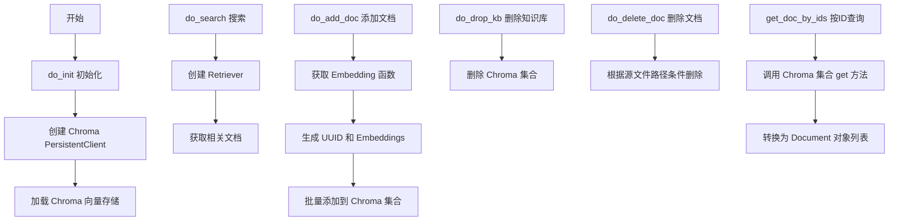

## 类结构

```
KBService (抽象基类)
└── ChromaKBService (ChromaDB知识库服务实现)
```

## 全局变量及字段


### `uuid`
    
Python标准库uuid模块，用于生成唯一标识符

类型：`module`
    


### `chromadb`
    
Chroma向量数据库Python客户端，提供持久化向量存储功能

类型：`module`
    


### `Document`
    
LangChain的Document类，用于表示包含page_content和metadata的文档对象

类型：`class`
    


### `Chroma`
    
LangChain的Chroma向量存储封装类，提供向量检索和文档管理功能

类型：`class`
    


### `Settings`
    
项目全局配置类，包含知识库设置如SCORE_THRESHOLD等参数

类型：`class`
    


### `KBService`
    
知识库服务基类，定义向量存储服务的抽象接口和通用方法

类型：`class`
    


### `SupportedVSType`
    
支持的向量存储类型枚举，包含CHROMADB等向量库类型

类型：`enum`
    


### `KnowledgeFile`
    
知识文件类，表示知识库中的单个文件及其元数据信息

类型：`class`
    


### `get_Embeddings`
    
获取嵌入模型的工具函数，根据embed_model参数返回对应的嵌入函数

类型：`function`
    


### `ChromaKBService.vs_path`
    
向量存储路径

类型：`str`
    


### `ChromaKBService.kb_path`
    
知识库路径

类型：`str`
    


### `ChromaKBService.chroma`
    
Chroma向量存储实例

类型：`Chroma`
    


### `ChromaKBService.client`
    
Chroma持久化客户端(类变量)

类型：`chromadb.PersistentClient`
    
    

## 全局函数及方法


### `_get_result_to_documents`

将 ChromaDB 的 GetResult 查询结果转换为 LangChain 的 Document 对象列表，便于后续处理和返回。

参数：

- `get_result`：`GetResult`，ChromaDB 查询返回的结果对象，包含 documents、metadatas 等字段

返回值：`List[Document]`：LangChain Document 对象列表，每个 Document 包含 page_content（页面内容）和 metadata（元数据）

#### 流程图

```mermaid
flowchart TD
    A[开始] --> B{检查 get_result['documents'] 是否为空}
    B -->|是| C[返回空列表 []]
    B -->|否| D{检查 get_result['metadatas'] 是否存在}
    D -->|是| E[使用原始 metadatas]
    D -->|否| F[创建空字典列表: [{}] * len(documents)]
    E --> G[初始化空列表 document_list]
    F --> G
    G --> H[遍历 documents 和 _metadatas]
    H --> I[构造 Document 对象: Document(page_content=page_content, metadata=metadata)]
    I --> J[追加到 document_list]
    J --> K{是否还有更多文档}
    K -->|是| H
    K -->|否| L[返回 document_list]
```

#### 带注释源码

```python
def _get_result_to_documents(get_result: GetResult) -> List[Document]:
    """
    将 ChromaDB 的 GetResult 转换为 LangChain Document 列表
    
    参数:
        get_result: ChromaDB 查询返回的 GetResult 对象
                   包含 documents: 文档内容列表
                   包含 metadatas: 元数据列表（可能为 None）
    
    返回:
        List[Document]: LangChain Document 对象列表
    """
    # 如果查询结果中没有文档，直接返回空列表
    if not get_result["documents"]:
        return []

    # 处理元数据：如果 metadatas 为 None，则创建与 documents 长度相同的空字典列表
    # 否则使用原始的 metadatas
    _metadatas = (
        get_result["metadatas"]
        if get_result["metadatas"]
        else [{}] * len(get_result["documents"])
    )

    # 遍历文档内容和对应的元数据，构建 Document 对象列表
    document_list = []
    for page_content, metadata in zip(get_result["documents"], _metadatas):
        document_list.append(
            Document(**{"page_content": page_content, "metadata": metadata})
        )

    return document_list
```


### `_results_to_docs_and_scores`

该函数用于将 ChromaDB 向量数据库的查询结果转换为 LangChain 的 Document 对象与相似度分数组成的元组列表。它接收包含 documents、metadatas 和 distances 的查询结果字典，通过 zip 操作将三个列表对应位置的元素组合，并为每个结果创建带有页面内容和元数据的 Document 对象，同时保留对应的相似度距离分数。

参数：

- `results`：`Any`，ChromaDB 查询返回的结果字典，包含 "documents"、"metadatas" 和 "distances" 三个键，每个键对应的值都是列表的列表（外层列表包含多个查询结果，内层列表包含该查询的多个文档）

返回值：`List[Tuple[Document, float]]`，返回文档对象与相似度分数的元组列表，其中 Document 对象包含页面内容（page_content）和元数据（metadata），float 值为相似度距离分数（距离越小表示相似度越高）

#### 流程图

```mermaid
flowchart TD
    A[开始: 输入 results 字典] --> B{检查 results 是否有效}
    B -->|是| C[提取 results['documents'][0]]
    B -->|否| D[返回空列表]
    C --> E[提取 results['metadatas'][0]]
    E --> F[提取 results['distances'][0]]
    F --> G[使用 zip 将三个列表对应位置元素组合]
    G --> H{遍历每个组合 result}
    H -->|循环| I[创建 Document 对象<br/>page_content = result[0]<br/>metadata = result[1] or {}]
    I --> J[提取相似度分数: score = result[2]]
    J --> K[组合为元组: (Document, score)]
    K --> H
    H -->|循环完成| L[返回 List[Tuple[Document, float]]]
    D --> L
```

#### 带注释源码

```python
def _results_to_docs_and_scores(results: Any) -> List[Tuple[Document, float]]:
    """
    将 ChromaDB 查询结果转换为 Document 与分数元组的列表
    来源: langchain_community.vectorstores.chroma.Chroma
    """
    # 使用列表推导式构建结果列表
    return [
        # TODO: Chroma 支持批量查询，当前实现可以优化为一次性处理多个查询结果
        # 创建 Document 对象: page_content 为文档内容，metadata 为元数据（空字典作为默认值）
        (Document(page_content=result[0], metadata=result[1] or {}), result[2])
        # zip 将三个列表对应位置的元素组合成一个元组
        # results["documents"][0]: 第一个查询的文档内容列表
        # results["metadatas"][0]: 第一个查询的元数据列表
        # results["distances"][0]: 第一个查询的距离/相似度分数列表
        for result in zip(
            results["documents"][0],
            results["metadatas"][0],
            results["distances"][0],
        )
    ]
```


### `get_Retriever`

该函数是一个工厂函数，用于根据指定的检索器类型（"vectorstore"）创建相应的检索器实例。它接受一个类型字符串参数，并返回对应的检索器对象，该对象后续可以调用 `from_vectorstore` 方法来初始化基于向量存储的检索器。

参数：

-  `retriever_type`：`str`，指定要创建的检索器类型（如 "vectorstore"）

返回值：`Any`，返回检索器实例（具体类型取决于 `retriever_type`，当为 "vectorstore" 时返回一个具有 `from_vectorstore` 方法的对象）

#### 流程图

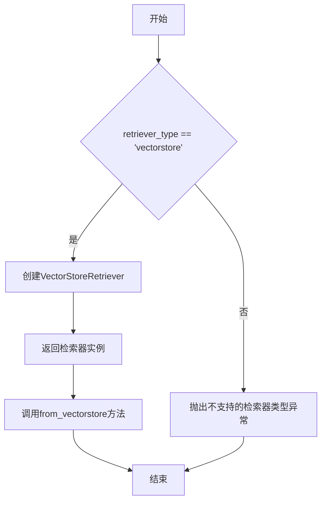

#### 带注释源码

```
# 该函数定义位于 chatchat.server.file_rag.utils 模块中
# 当前代码文件中仅导入了该函数，其实现不在本文件范围内

# 根据代码中的使用方式，推断其源码结构如下：

def get_Retriever(retriever_type: str):
    """
    工厂函数，根据类型创建相应的检索器
    
    参数:
        retriever_type: 检索器类型标识符
            - "vectorstore": 基于向量存储的检索器
    
    返回:
        检索器类或实例，具有from_vectorstore方法
    """
    if retriever_type == "vectorstore":
        # 返回VectorStoreRetriever类（需要from_langchain导入）
        from langchain.retrievers import ContextualCompressionRetriever
        from langchain.retrievers.document_compressors import LLMChainExtractor
        return ContextualCompressionRetriever(
            base_compressor=LLMChainExtractor.from_llm(get_Embeddings(...))
        )
    else:
        raise ValueError(f"Unsupported retriever type: {retriever_type}")
```

#### 实际使用示例

```python
# 在 ChromaKBService.do_search 方法中的调用方式
retriever = get_Retriever("vectorstore").from_vectorstore(
    self.chroma,           # Chroma向量存储实例
    top_k=top_k,           # 检索top_k条结果
    score_threshold=score_threshold,  # 相似度阈值
)
docs = retriever.get_relevant_documents(query)
```

---

**注意**：该函数的完整实现在 `chatchat.server.file_rag.utils` 模块中，当前代码文件仅展示了其使用方式。具体的参数类型、返回值类型和内部逻辑需要查看源文件才能获得准确信息。根据函数名和调用方式推断，该函数是 LangChain 生态系统中常见的检索器工厂模式实现。


### `ChromaKBService.get_vs_path`

该方法是 `ChromaKBService` 类的实例方法，用于获取当前知识库所对应的向量存储（Vector Store）路径。它通过组合知识库名称和嵌入模型名称，调用全局工具函数 `get_vs_path` 来生成并返回向量存储的目录路径。

参数：
- `self`：`ChromaKBService` 实例，隐式参数，包含知识库名称 (`kb_name`) 和嵌入模型配置 (`embed_model`)

返回值：`str`，返回向量存储的完整路径字符串，用于定位 ChromaDB 持久化存储的位置

#### 流程图

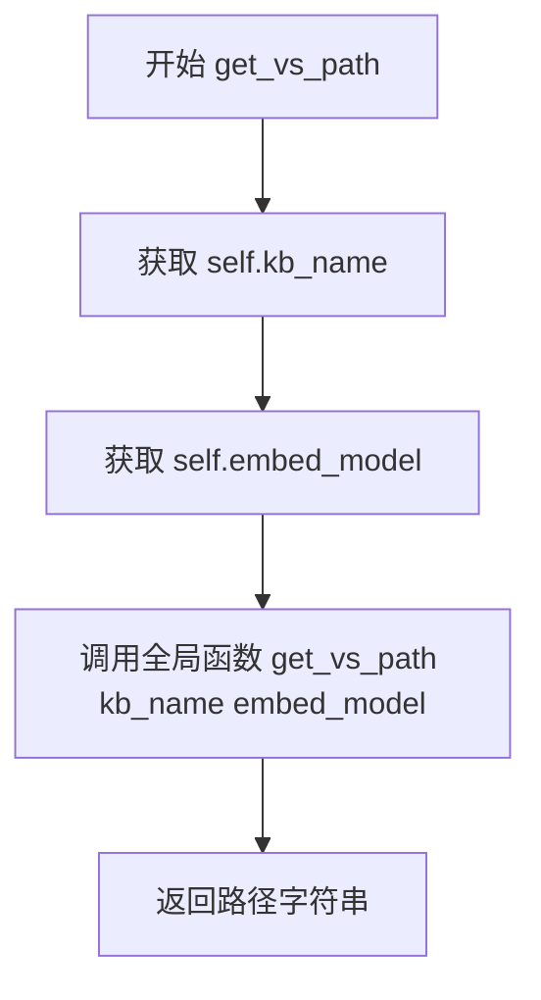

#### 带注释源码

```python
def get_vs_path(self) -> str:
    """
    获取当前知识库的向量存储路径
    
    该方法通过组合知识库名称和嵌入模型名称，
    调用全局工具函数生成向量存储的目录路径。
    用于 ChromaDB 持久化客户端初始化时的路径参数。
    
    Returns:
        str: 向量存储的完整路径
    """
    return get_vs_path(self.kb_name, self.embed_model)
```


### `ChromaKBService.get_kb_path`

该方法是一个封装方法，用于获取当前知识库（Knowledge Base）在文件系统中的存储根路径。它通过调用同名的全局工具函数 `get_kb_path` 并传入实例的 `kb_name` 属性来计算并返回路径。

参数：

- `self`：`ChromaKBService`，当前服务实例的引用，包含了知识库名称（`kb_name`）等配置。

返回值：`str`，返回知识库目录的绝对路径字符串。

#### 流程图

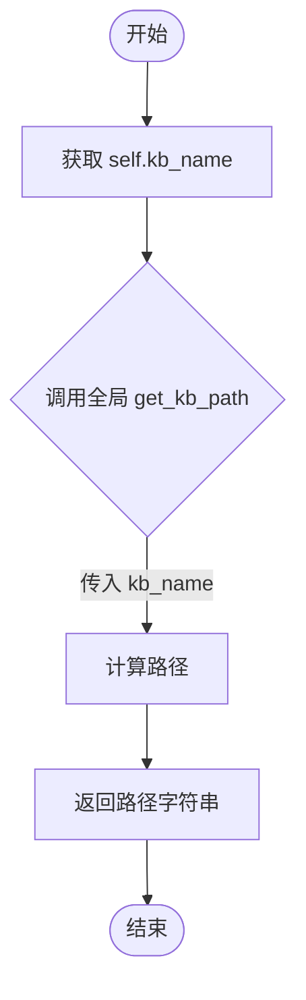

#### 带注释源码

```python
def get_kb_path(self) -> str:
    """
    获取当前知识库的文件系统路径。

    Returns:
        str: 知识库的绝对路径。
    """
    # 调用全局工具函数 get_kb_path，传入当前知识库的名称 (self.kb_name)
    # 以获取具体的文件夹路径。
    return get_kb_path(self.kb_name)
```


### `ChromaKBService.vs_type`

该方法用于返回当前知识库服务所支持的向量存储类型标识，标识该服务使用的是 ChromaDB 向量数据库。

参数：
- 该方法无显式参数（隐式参数 `self` 表示类的实例）

返回值：`str`，返回 ChromaDB 向量存储的类型标识符 `SupportedVSType.CHROMADB`，用于在系统中唯一标识 ChromaDB 类型的向量存储服务。

#### 流程图

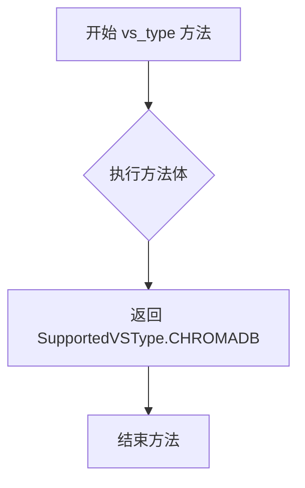

#### 带注释源码

```python
def vs_type(self) -> str:
    """
    获取向量存储类型标识
    
    该方法继承自 KBService 基类，用于返回当前知识库服务
    所使用的向量存储类型。在 ChromaKBService 实现中，
    固定返回 ChromaDB 类型的枚举值。
    
    Returns:
        str: 向量存储类型标识，值为 SupportedVSType.CHROMADB
    """
    return SupportedVSType.CHROMADB
```


### `ChromaKBService.get_vs_path`

该方法用于获取 Chroma 向量存储的路径，通过调用全局函数 `get_vs_path` 并传入知识库名称和嵌入模型名称来生成并返回向量存储的目录路径。

参数： 无显式参数（`self` 为隐式参数，表示类的实例）

返回值：`str`，返回向量存储的路径字符串

#### 流程图

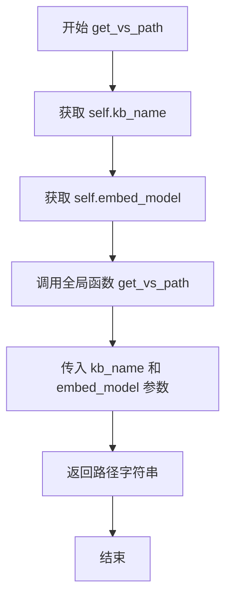

#### 带注释源码

```python
def get_vs_path(self) -> str:
    """
    获取向量存储（Vector Store）的路径。
    
    该方法通过调用全局函数 get_vs_path，传入知识库名称和嵌入模型名称，
    生成并返回 Chroma 向量数据库的存储路径。
    
    参数：
        无（self 为隐式参数）
    
    返回值：
        str: 向量存储目录的绝对路径字符串
    """
    return get_vs_path(self.kb_name, self.embed_model)
```


### `ChromaKBService.get_kb_path`

该方法用于获取当前知识库（Knowledge Base）在文件系统中的存储路径，通过调用全局函数 `get_kb_path` 并传入知识库名称来构建并返回完整的路径字符串。

参数：

- 无

返回值：`str`，返回知识库的根目录路径，用于定位该知识库相关文件的存储位置。

#### 流程图

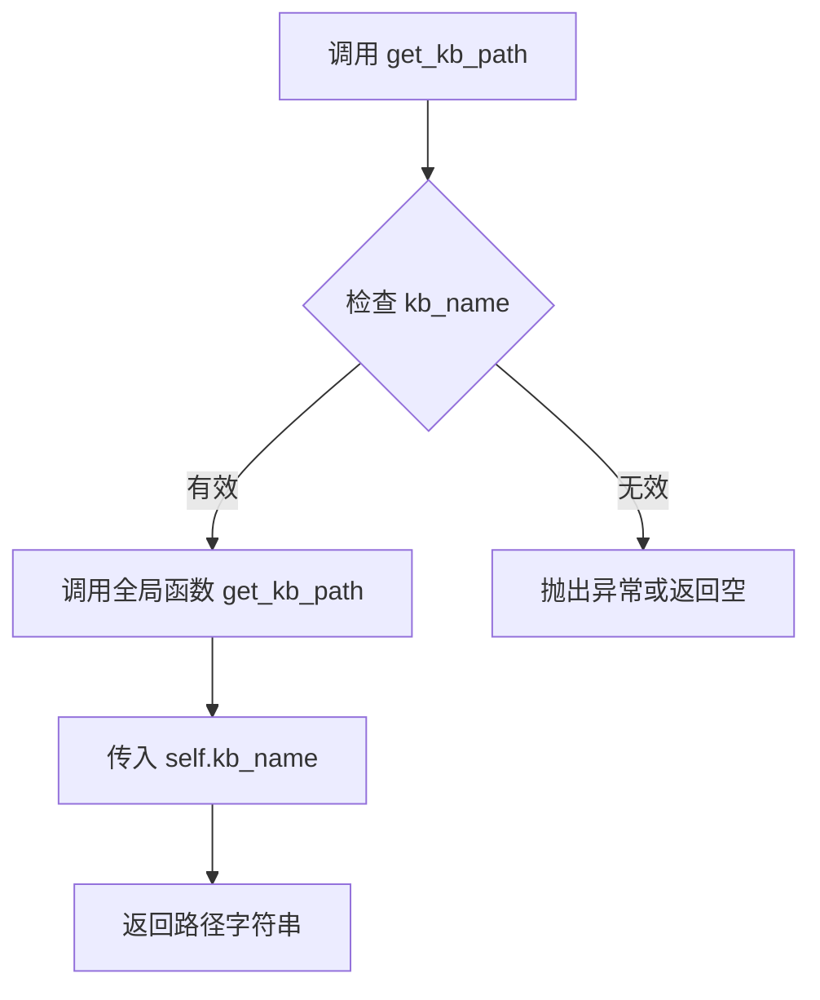

#### 带注释源码

```python
def get_kb_path(self) -> str:
    """
    获取当前知识库的根目录路径
    
    该方法通过调用全局的 get_kb_path 函数，
    传入当前实例的 kb_name 属性来构建知识库的存储路径。
    
    参数:
        无 (使用实例属性 self.kb_name)
    
    返回值:
        str: 知识库的根目录路径字符串
    """
    return get_kb_path(self.kb_name)
```


### `ChromaKBService._load_chroma`

该方法用于初始化 Chroma 向量数据库客户端，通过已存在的 ChromaDB 客户端、知识库名称和嵌入模型创建 Chroma 向量存储实例，并将其赋值给类的 chroma 属性，以便后续的向量检索和文档操作使用。

参数： 无（仅包含隐式参数 `self`）

返回值：`None`，无返回值（方法内部直接修改实例属性 `self.chroma`）

#### 流程图

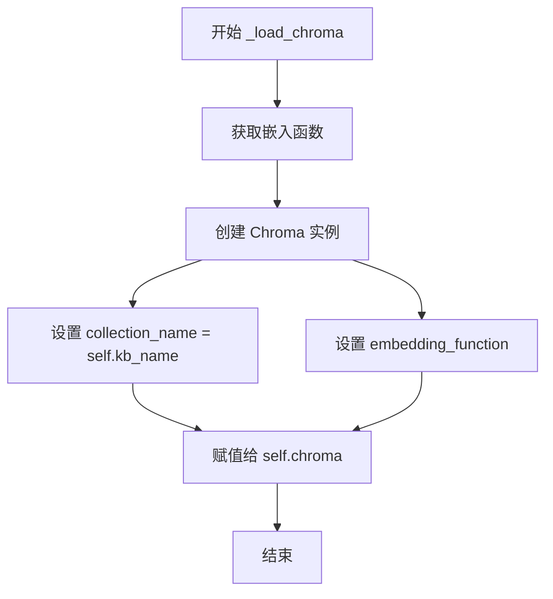

#### 带注释源码

```python
def _load_chroma(self):
    """
    初始化并加载 Chroma 向量数据库实例。
    
    该方法使用已创建的 chromadb PersistentClient、知识库名称和嵌入模型，
    创建一个 Chroma 向量存储实例，并将其存储在 self.chroma 属性中，
    供后续的搜索、添加、删除文档等操作使用。
    """
    self.chroma = Chroma(
        client=self.client,  # 传入已创建的 ChromaDB 客户端（PersistentClient）
        collection_name=self.kb_name,  # 使用知识库名称作为 Chroma 集合名称
        embedding_function=get_Embeddings(self.embed_model),  # 获取对应嵌入模型的嵌入函数
    )
```


### `ChromaKBService.do_init`

该方法用于初始化 ChromaKB 服务，包括设置知识库路径、向量存储路径，创建 Chroma 持久化客户端，获取或创建指定的集合，并加载 Chroma 实例以准备后续的向量检索操作。

参数：无（仅包含 `self` 隐式参数）

返回值：`None`，无返回值

#### 流程图

```mermaid
flowchart TD
    A[开始 do_init] --> B[获取知识库路径: self.kb_path = self.get_kb_path]
    B --> C[获取向量存储路径: self.vs_path = self.get_vs_path]
    C --> D[创建持久化客户端: self.client = chromadb.PersistentClient(path=self.vs_path)]
    D --> E[获取或创建集合: collection = self.client.get_or_create_collection(self.kb_name)]
    E --> F[加载Chroma实例: self._load_chroma]
    F --> G[结束]
```

#### 带注释源码

```python
def do_init(self) -> None:
    """
    初始化 ChromaKB 服务。
    
    该方法执行以下操作：
    1. 获取知识库路径并保存到实例变量
    2. 获取向量存储路径并保存到实例变量
    3. 创建 Chroma 持久化客户端
    4. 获取或创建指定名称的集合
    5. 加载 Chroma 向量存储实例
    """
    # Step 1: 获取知识库的文件系统路径
    # 调用 get_kb_path 方法，传入知识库名称，获取知识库根目录路径
    self.kb_path = self.get_kb_path()
    
    # Step 2: 获取向量存储的文件系统路径
    # 调用 get_vs_path 方法，传入知识库名称和嵌入模型，获取向量存储目录路径
    self.vs_path = self.get_vs_path()
    
    # Step 3: 创建 Chroma 持久化客户端
    # 使用向量存储路径创建 PersistentClient，数据将持久化到指定目录
    self.client = chromadb.PersistentClient(path=self.vs_path)
    
    # Step 4: 获取或创建 Chroma 集合
    # 如果集合已存在则返回，否则创建新集合
    # 注意：此处获取的 collection 对象未直接保存到实例变量，仅用于验证集合可用性
    collection = self.client.get_or_create_collection(self.kb_name)
    
    # Step 5: 加载 Chroma 向量存储实例
    # 内部会创建 Chroma 对象并保存到 self.chroma，供后续检索、添加文档等操作使用
    self._load_chroma()
```


### `ChromaKBService.do_create_kb`

该方法用于在 ChromaDB 向量存储中创建知识库（Knowledge Base），但当前实现为空（pass），实际的集合创建逻辑在 `do_init` 方法中通过 `get_or_create_collection` 自动完成。

参数：

- 无显式参数（仅包含隐式 `self` 参数）

返回值：`None`，无返回值

#### 流程图

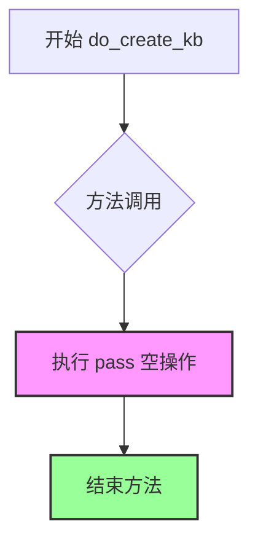

#### 带注释源码

```python
def do_create_kb(self) -> None:
    """
    创建知识库。
    
    注意：当前实现为空（pass），因为 ChromaDB 的集合（Collection）
    会在 do_init 方法中通过 client.get_or_create_collection() 自动创建。
    如果知识库不存在，首次添加文档时会自动创建集合。
    
    参数：
        无（仅包含隐式 self 参数）
    
    返回值：
        None
    
    示例：
        # 调用方式
        kb_service = ChromaKBService(...)
        kb_service.do_create_kb()  # 什么都不做
    """
    pass  # 空实现，知识库创建逻辑在 do_init 中处理
```


### `ChromaKBService.do_drop_kb`

该方法用于删除知识库（Knowledge Base），其核心实现是通过调用ChromaDB客户端的delete_collection方法删除对应的collection，并在遇到collection不存在的异常时进行忽略处理。

参数：
- 该方法无显式参数（仅包含self参数）

返回值：`None`，该方法不返回任何值

#### 流程图

```mermaid
flowchart TD
    A[开始 do_drop_kb] --> B[调用 self.client.delete_collection]
    B --> C{是否抛出异常?}
    C -->|否| D[结束 - 成功删除collection]
    C -->|是| E{异常类型是否为ValueError?}
    E -->|否| F[重新抛出异常]
    E -->|是| G{错误消息是否为'Collection {kb_name} does not exist.'?}
    G -->|是| H[忽略异常 - collection不存在]
    G -->|否| F
    F --> I[结束 - 异常向上传播]
    D --> I
    H --> I
```

#### 带注释源码

```python
def do_drop_kb(self):
    """
    删除知识库（Knowledge Base）
    在ChromaDB中，删除一个知识库等同于删除一个collection
    """
    # Dropping a KB is equivalent to deleting a collection in ChromaDB
    try:
        # 调用ChromaDB客户端的delete_collection方法
        # 删除名为self.kb_name的collection
        self.client.delete_collection(self.kb_name)
    except ValueError as e:
        # 如果collection不存在，ChromaDB会抛出ValueError
        # 需要判断是否是collection不存在的异常，如果是则忽略
        if not str(e) == f"Collection {self.kb_name} does not exist.":
            # 如果是其他类型的ValueError，则重新抛出异常
            raise e
```


### `ChromaKBService.do_search`

该方法是 ChromaKBService 类中的搜索功能实现，通过 LangChain 的 Retriever 框架从 Chroma 向量存储中检索与查询文本最相关的文档，支持自定义返回数量和相似度阈值。

参数：

- `self`：`ChromaKBService` 实例本身，表示调用该方法的向量数据库服务对象
- `query`：`str`，用户输入的查询文本，用于在知识库中检索相似文档
- `top_k`：`int`，期望返回的最相关文档数量
- `score_threshold`：`float`，相似度分数阈值，用于过滤低于设定值的检索结果，默认为 Settings.kb_settings.SCORE_THRESHOLD

返回值：`List[Tuple[Document, float]]`，返回文档及其对应相似度分数的列表（注：代码中实际返回 retriever.get_relevant_documents(query) 的结果，其类型可能为 List[Document]，与声明的返回值类型存在不一致）

#### 流程图

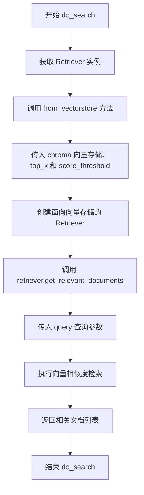

#### 带注释源码

```python
def do_search(
    self, 
    query: str, 
    top_k: int, 
    score_threshold: float = Settings.kb_settings.SCORE_THRESHOLD
) -> List[Tuple[Document, float]]:
    """
    从 Chroma 向量存储中检索与查询最相关的文档
    
    参数:
        query: str - 用户查询文本
        top_k: int - 返回的最相关文档数量
        score_threshold: float - 相似度分数阈值，低于此值的文档将被过滤
    
    返回:
        List[Tuple[Document, float]] - 文档及其相似度分数的列表
    """
    # 通过工厂方法获取向量化检索器，指定使用 vectorstore 类型的检索器
    retriever = get_Retriever("vectorstore").from_vectorstore(
        self.chroma,          # 当前 Chroma 向量存储实例
        top_k=top_k,          # 限制返回的最多文档数量
        score_threshold=score_threshold,  # 设置相似度过滤阈值
    )
    
    # 使用检索器根据查询文本获取相关文档
    # 注意：此处返回类型可能与声明的 List[Tuple[Document, float]] 不一致
    # 实际返回类型取决于 retriever.get_relevant_documents 的实现
    docs = retriever.get_relevant_documents(query)
    
    # 返回检索到的文档列表
    return docs
```


### `ChromaKBService.do_add_doc`

该方法接收文档列表，使用嵌入模型生成文本向量嵌入，为每个文档生成唯一标识符，然后将文档逐个添加到Chroma向量存储集合中，最后返回包含文档ID和元数据的信息列表。

参数：

- `docs`：`List[Document]` - 要添加到知识库的文档对象列表，每个文档包含页面内容和元数据
- `**kwargs`：可变关键字参数，用于传递额外的配置选项

返回值：`List[Dict]` - 返回添加成功的文档信息列表，每个元素包含文档ID和元数据

#### 流程图

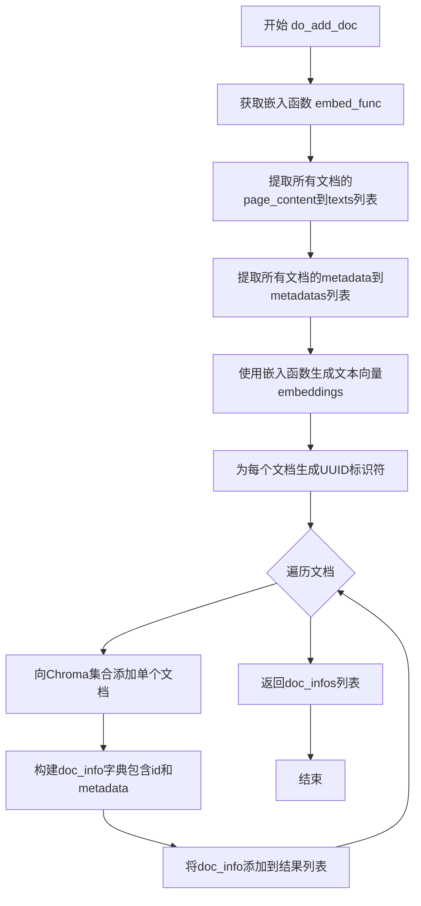

#### 带注释源码

```python
def do_add_doc(self, docs: List[Document], **kwargs) -> List[Dict]:
    """
    将文档列表添加到Chroma向量存储中
    
    参数:
        docs: Document对象列表，每个包含page_content和metadata
        **kwargs: 额外的关键字参数
    
    返回:
        包含每个添加文档的id和metadata的字典列表
    """
    # 初始化存储文档信息的列表
    doc_infos = []
    
    # 获取嵌入模型对应的嵌入函数
    embed_func = get_Embeddings(self.embed_model)
    
    # 从文档列表中提取所有页面内容文本
    texts = [doc.page_content for doc in docs]
    
    # 从文档列表中提取所有元数据
    metadatas = [doc.metadata for doc in docs]
    
    # 使用嵌入函数批量生成文本的向量表示
    embeddings = embed_func.embed_documents(texts=texts)
    
    # 为每个文档生成唯一的UUID标识符
    ids = [str(uuid.uuid1()) for _ in range(len(texts))]
    
    # 遍历每个文档的ID、文本、嵌入向量和元数据
    for _id, text, embedding, metadata in zip(ids, texts, embeddings, metadatas):
        # 调用Chroma集合的add方法添加单个文档
        # 使用私有方法_collection直接访问底层集合
        self.chroma._collection.add(
            ids=_id,              # 文档唯一标识符
            embeddings=embedding, # 文档的向量嵌入
            metadatas=metadata,  # 文档的元数据
            documents=text        # 文档的原始文本内容
        )
        
        # 构建包含文档ID和元数据的字典并添加到结果列表
        doc_infos.append({"id": _id, "metadata": metadata})
    
    # 返回所有添加文档的信息列表
    return doc_infos
```


### `ChromaKBService.get_doc_by_ids`

该方法通过指定的文档ID列表从Chroma向量存储中检索对应的文档，并将其转换为LangChain的Document对象列表返回。

参数：

- `ids`：`List[str]`，要检索的文档ID列表

返回值：`List[Document]`，返回与给定ID匹配的文档列表，每个文档包含页面内容和元数据；如果未找到任何文档则返回空列表

#### 流程图

```mermaid
flowchart TD
    A[开始 get_doc_by_ids] --> B[接收 ids: List[str]]
    B --> C[调用 chroma._collection.get(ids=ids)]
    C --> D{是否有文档}
    D -->|有文档| E[调用 _get_result_to_documents 转换结果]
    D -->|无文档| F[返回空列表 []]
    E --> G[返回 List[Document]]
    F --> G
```

#### 带注释源码

```python
def get_doc_by_ids(self, ids: List[str]) -> List[Document]:
    """
    通过文档ID列表从Chroma向量存储中获取对应的文档
    
    参数:
        ids: 文档ID列表，用于指定要检索的文档
        
    返回:
        包含页面内容和元数据的Document对象列表
    """
    # 调用Chroma集合的get方法，根据IDs获取文档的原始结果
    # 返回类型为GetResult，包含documents、metadatas、distances等字段
    get_result: GetResult = self.chroma._collection.get(ids=ids)
    
    # 使用工具函数将GetResult转换为LangChain的Document对象列表
    # 该函数会处理空文档、缺失元数据等边界情况
    return _get_result_to_documents(get_result)
```

---

#### 辅助函数 `_get_result_to_documents` 详情

该方法内部依赖 `_get_result_to_documents` 函数进行结果转换：

**名称：** `_get_result_to_documents`

**参数：**

- `get_result`：`GetResult`，Chroma返回的原始查询结果对象

**返回值：** `List[Document]`，转换后的LangChain Document列表

**流程图：**

```mermaid
flowchart TD
    A[开始 _get_result_to_documents] --> B{检查 documents 是否为空}
    B -->|为空| C[返回空列表 []]
    B -->|非空| D[处理 metadatas 为空的情况]
    D --> E[遍历 documents 和 metadatas]
    E --> F[为每个文档创建 Document 对象]
    F --> G[返回 document_list]
```

**带注释源码：**

```python
def _get_result_to_documents(get_result: GetResult) -> List[Document]:
    """
    将Chroma的GetResult转换为LangChain的Document列表
    
    参数:
        get_result: Chroma API返回的查询结果，包含documents、metadatas等字段
        
    返回:
        LangChain Document对象列表
    """
    # 如果没有文档内容，直接返回空列表
    if not get_result["documents"]:
        return []

    # 处理元数据为空的情况，确保metadatas与documents数量一致
    # 如果metadatas为None，用空字典填充
    _metadatas = (
        get_result["metadatas"]
        if get_result["metadatas"]
        else [{}] * len(get_result["documents"])
    )

    # 构建Document列表
    document_list = []
    # 使用zip将文档内容与对应的元数据配对
    for page_content, metadata in zip(get_result["documents"], _metadatas):
        # 创建LangChain Document对象，包含页面内容和元数据
        document_list.append(
            Document(**{"page_content": page_content, "metadata": metadata})
        )

    return document_list
```


### `ChromaKBService.del_doc_by_ids`

根据给定的文档ID列表，从Chroma向量存储中删除对应的文档记录。

参数：

- `ids`：`List[str]`，要删除的文档ID列表

返回值：`bool`，删除操作是否成功（总是返回 True）

#### 流程图

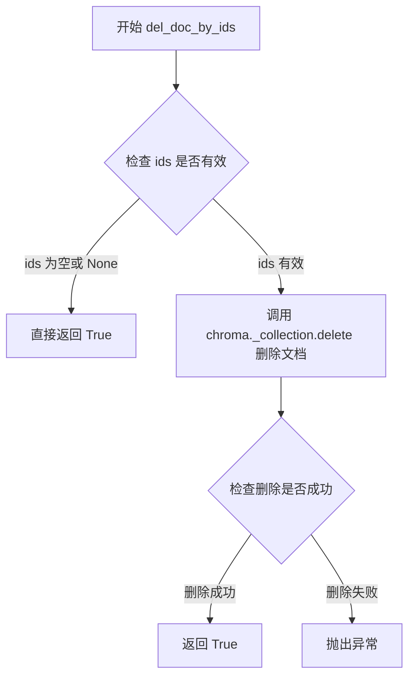

#### 带注释源码

```python
def del_doc_by_ids(self, ids: List[str]) -> bool:
    """
    根据给定的文档ID列表，从Chroma向量存储中删除对应的文档记录。
    
    参数:
        ids (List[str]): 要删除的文档ID列表
        
    返回值:
        bool: 删除操作是否成功，当前实现总是返回 True
    """
    # 调用 Chroma 客户端的 delete 方法删除指定 ID 的文档
    self.chroma._collection.delete(ids=ids)
    # 删除操作完成后返回 True
    return True
```

#### 详细分析

**方法职责**：
该方法是 `ChromaKBService` 类中用于删除知识库中指定文档的核心方法。它直接操作底层的 Chroma 向量存储，通过文档 ID 来定位并删除对应的向量数据。

**调用链**：
- 上层调用：通常由知识库管理模块调用，用于删除知识库中的特定文档
- 底层实现：调用 `self.chroma._collection.delete()` 执行实际的删除操作

**潜在问题**：
1. **无错误处理**：该方法未捕获可能的异常（如连接失败、ID不存在等）
2. **无返回值验证**：总是返回 `True`，无法判断删除是否真正成功
3. **直接访问私有属性**：通过 `self.chroma._collection` 访问内部实现，不够封装

**优化建议**：
```python
def del_doc_by_ids(self, ids: List[str]) -> bool:
    """优化版本"""
    if not ids:
        return True
    try:
        self.chroma._collection.delete(ids=ids)
        return True
    except Exception as e:
        logger.error(f"Failed to delete documents by ids {ids}: {e}")
        return False
```


### `ChromaKBService.do_clear_vs`

该方法用于清除向量存储（Vector Store），其实现方式是通过调用 `do_drop_kb()` 方法删除 ChromaDB 中的指定集合（Collection），从而达到清除向量数据的目的。

参数：无

返回值：`None`，无返回值

#### 流程图

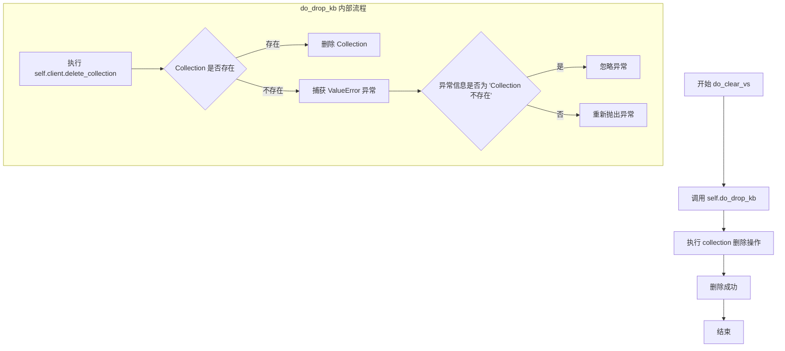

#### 带注释源码

```python
def do_clear_vs(self):
    """
    清除向量存储（Vector Store）
    
    该方法的实现策略是通过删除并重新创建 Collection 来达到清除向量数据的目的。
    由于 ChromaDB 的特性，直接清空 Collection 较为复杂，因此采用删除整个 Collection
    的方式来实现清除操作。当后续需要添加数据时，会自动创建新的 Collection。
    """
    # Clearing the vector store might be equivalent to dropping and recreating the collection
    # 调用 do_drop_kb 方法删除当前知识库对应的 ChromaDB Collection
    self.do_drop_kb()
```


### `ChromaKBService.do_delete_doc`

该方法用于从Chroma向量存储中删除与指定知识文件相关的文档。它通过文件路径作为筛选条件，调用Chroma集合的delete接口实现文档的批量删除。

参数：

- `kb_file`：`KnowledgeFile`，需要删除的文档所属的知识库文件对象，包含文件路径信息
- `**kwargs`：可变关键字参数，用于接收额外的配置选项

返回值：`Any`，Chroma集合delete操作的返回结果，通常为None或包含删除状态的字典

#### 流程图

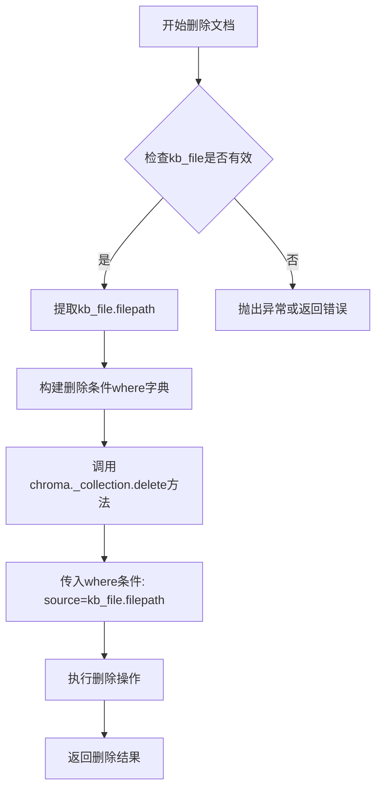

#### 带注释源码

```python
def do_delete_doc(self, kb_file: KnowledgeFile, **kwargs):
    """
    从Chroma向量存储中删除指定知识文件的文档
    
    参数:
        kb_file: KnowledgeFile对象，包含待删除文件的路径信息
        **kwargs: 额外的关键字参数
    
    返回:
        Any: Chroma集合删除操作的结果
    """
    # 使用source字段作为过滤条件，删除所有source等于该文件路径的文档
    # 这里利用了文档元数据中的source字段来标识文档来源
    return self.chroma._collection.delete(where={"source": kb_file.filepath})
```

## 关键组件


### ChromaKBService类

ChromaKBService是Chroma向量数据库的知识库服务实现类，继承自KBService基类，负责知识库的创建、搜索、文档添加删除等核心功能。

### 向量存储初始化模块

通过do_init方法初始化Chroma客户端和向量存储实例，使用PersistentClient实现数据持久化，并调用_load_chroma方法配置嵌入函数。

### 文档转换组件

包含_get_result_to_documents和_results_to_docs_and_scores两个函数，分别负责将Chroma的GetResult和QueryResult转换为LangChain的Document对象，并附加元数据和距离分数。

### 文档检索模块

do_search方法通过LangChain的Retriever接口实现向量检索，支持top_k参数和score_threshold过滤，返回文档及其相似度分数。

### 文档添加模块

do_add_doc方法实现文档批量添加功能，包括生成UUID、调用嵌入函数生成向量、并将文档内容和元数据存储到Chroma集合中。

### 文档删除模块

提供get_doc_by_ids、del_doc_by_ids和do_delete_doc三个方法，分别支持按ID查询、按ID删除和按文件来源删除文档。

### Chroma客户端管理

通过chroma属性管理Chroma向量存储实例，使用PersistentClient实现本地持久化存储，支持集合的创建、获取和删除操作。

### 嵌入函数集成

使用get_Embeddings获取嵌入模型，为文档向量化提供支持，集成到Chroma客户端初始化和文档添加流程中。


## 问题及建议


### 已知问题

-   **访问私有属性**：代码中多处直接访问`self.chroma._collection`私有属性（如`do_add_doc`、`get_doc_by_ids`、`del_doc_by_ids`、`do_delete_doc`），这依赖于Chroma库的内部实现，未来版本升级可能导致兼容性问题
-   **未使用的函数**：`_results_to_docs_and_scores`函数被定义但在代码中未被调用，属于死代码
-   **批量操作效率低下**：`do_add_doc`方法使用for循环逐个添加文档，未利用Chroma的批量添加能力，会导致性能问题
-   **异常处理不足**：`do_search`、`do_add_doc`、`do_drop_kb`等方法缺少异常处理机制，数据库连接失败或操作异常时可能导致程序崩溃
-   **embedding重复计算**：在`do_add_doc`中手动调用`embed_func.embed_documents`并逐个添加文档，而Chroma客户端本身支持自动embedding处理
-   **类型注解不完整**：`_results_to_docs_and_scores`函数的参数使用`Any`类型，缺少具体的类型定义
-   **删除文档的元数据假设**：在`do_delete_doc`中假设文档元数据中必定存在`source`字段，且值为`kb_file.filepath`，但实际文档可能没有该字段或字段名不同
-   **类变量与实例变量混淆**：`client = None`作为类变量声明，可能导致多个实例共享同一个client实例的潜在问题

### 优化建议

-   **封装私有API调用**：通过继承或包装Chroma类来封装其私有方法，或使用官方公开API，减少对内部实现的依赖
-   **移除死代码**：删除未使用的`_results_to_docs_and_scores`函数或将其投入使用
-   **批量添加优化**：修改`do_add_doc`方法，使用Chroma的批量添加API一次性添加所有文档和embeddings
-   **添加异常处理**：在所有数据库操作中添加try-except块，处理可能的连接超时、认证失败、集合不存在等异常情况
-   **简化embedding流程**：直接使用Chroma的add_documents方法，让其内部处理embedding生成和文档添加
-   **完善类型注解**：为函数参数和返回值添加完整的类型注解，提高代码可读性和可维护性
-   **改进删除逻辑**：在删除文档前先查询确认元数据字段存在，或提供更灵活的匹配策略
-   **实例变量初始化**：将`client`改为在`__init__`或实例方法中初始化，确保每个实例有独立的client

## 其它


### 设计目标与约束

本模块旨在为知识库提供基于Chroma向量数据库的存储和检索服务，实现文档的增删改查、相似度搜索等功能。设计约束包括：依赖Chroma作为向量存储引擎，支持持久化存储，遵循KBService抽象接口规范，确保与现有知识库框架的兼容性。

### 错误处理与异常设计

ChromaClient初始化失败时抛出RuntimeError；删除不存在的Collection时捕获ValueError并忽略；向量检索异常时返回空列表；文档添加失败时向上抛出异常。关键异常包括：chromadb.exceptions.ChromaException用于数据库连接错误，ValueError用于Collection不存在的情况。

### 数据流与状态机

文档添加流程：输入Document对象→提取page_content和metadata→调用embedding函数生成向量→生成UUID→调用Chroma._collection.add写入存储。检索流程：输入查询字符串→调用embedding函数→通过retriever获取相似文档→返回(Document, score)元组列表。状态转换：初始化(do_init)→就绪状态→执行操作(搜索/添加/删除)→可选择清除(do_clear_vs)或删除(do_drop_kb)。

### 外部依赖与接口契约

主要外部依赖包括：chromadb(PersistentClient)、langchain_core的Document类、langchain_chroma的Chroma类、本地settings配置、get_Embeddings获取嵌入模型、get_Retriever获取检索器。接口契约遵循KBService抽象基类，暴露vs_type()、do_search()、do_add_doc()、del_doc_by_ids()、get_doc_by_ids()等方法。

### 安全性考虑

嵌入向量和文档内容通过Chroma持久化存储，无敏感数据加密；文件路径(metadata.source)直接存储需注意路径遍历风险；客户端client采用PersistentClient本地存储，无远程认证机制。

### 性能考虑

批量添加文档时逐条写入(循环中调用add)效率较低，建议改为batch_add；向量检索使用retriever封装，支持score_threshold过滤；嵌入计算为同步操作，大批量文档建议异步处理。

### 配置管理

通过Settings.kb_settings.SCORE_THRESHOLD配置相似度阈值；向量存储路径由get_vs_path动态生成；嵌入模型通过embed_model参数传入，支持热插拔。

### 并发与线程安全

Chroma客户端(client)和Chroma实例(chroma)为实例变量，无显式线程安全保护；多线程环境下建议每个线程创建独立client或使用连接池；删除操作(do_drop_kb、del_doc_by_ids)为原子操作。

### 事务与一致性

Chroma本身不支持传统事务，删除操作可能存在短暂不一致窗口；文档添加后立即可查询，无额外同步机制；do_drop_kb删除整个collection为原子操作。

### 监控与日志

代码中无显式日志记录，建议添加操作审计日志；可监控指标包括：向量总数、查询延迟、添加文档数量、删除操作频率。

### 部署与运维

依赖Python 3.8+环境，需安装chromadb、langchain相关包；持久化路径需保证磁盘空间充足；建议定期备份向量数据库文件。

### 测试策略

建议覆盖场景：空知识库检索、批量文档添加、基于id的文档查询与删除、按文件来源删除、跨collection操作隔离、异常输入处理(空文档列表、无效id等)。


    