# `Langchain-Chatchat\libs\chatchat-server\chatchat\server\knowledge_base\kb_service\default_kb_service.py` 详细设计文档

这是一个默认的知识库服务实现类，继承自KBService基类，提供了知识库的基本操作接口，包括创建、删除知识库，添加、删除文档，搜索知识库等核心功能，所有方法目前均为空实现，可作为其他具体知识库服务实现的模板或基类。

## 整体流程

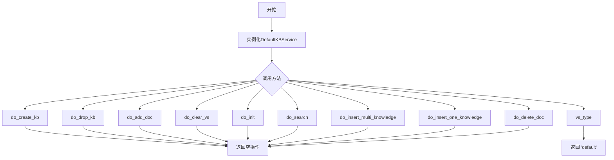

## 类结构

```
KBService (基类)
└── DefaultKBService (默认实现类)
```

## 全局变量及字段


### `List`
    
Python typing 模块中的列表类型，用于类型提示

类型：`typing.List`
    


### `Embeddings`
    
Langchain 的嵌入基类，用于文本向量化

类型：`langchain.embeddings.base.Embeddings`
    


### `Document`
    
Langchain 的文档对象，表示知识库中的文档

类型：`langchain.schema.Document`
    


### `KBService`
    
知识库服务基类，定义知识库操作接口

类型：`chatchat.server.knowledge_base.kb_service.base.KBService`
    


    

## 全局函数及方法


### `DefaultKBService.do_create_kb`

该方法是知识库服务（KBService）的核心接口之一，负责在知识库中创建新的知识库实例，是实现知识库初始化逻辑的抽象方法，由子类具体实现。在当前默认实现中，该方法为空实现（pass），仅作为接口占位符存在。

参数：

- 无参数

返回值：`None`，无返回值

#### 流程图

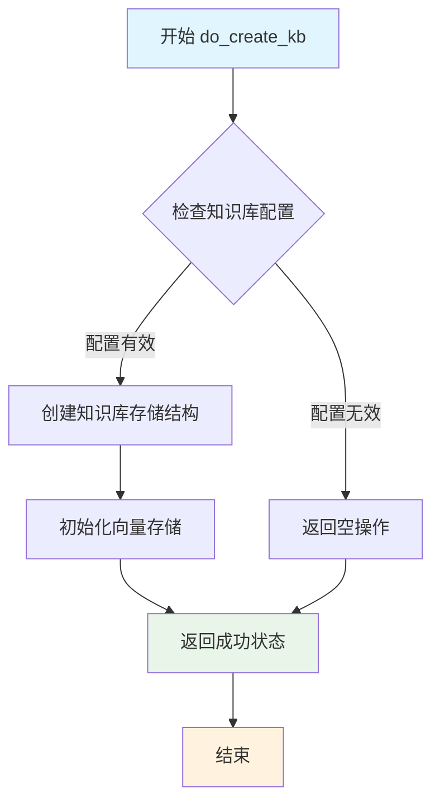

#### 带注释源码

```python
def do_create_kb(self):
    """
    创建知识库（Create Knowledge Base）
    
    该方法是KBService接口的核心方法之一，负责在底层存储中创建
    新的知识库实例。具体实现由子类override完成。
    
    当前默认实现为空实现（No-op），仅作为接口占位符。
    
    子类实现时应考虑：
    - 知识库元数据的持久化存储
    - 向量索引存储结构的初始化
    - 配置文件或数据库记录的创建
    - 权限或资源的预分配
    """
    pass
```


### `DefaultKBService.do_drop_kb`

该方法用于删除指定的知识库（Knowledge Base），是知识库服务基类中删除操作的具体实现，目前为占位实现。

参数：无（除 `self` 外无其他参数）

返回值：`None`，无返回值

#### 流程图

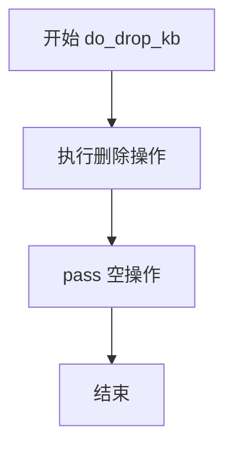

#### 带注释源码

```python
def do_drop_kb(self):
    """
    删除知识库操作的具体实现
    
    该方法由 KBService 基类调用，用于执行删除知识库的功能。
    当前版本为占位实现（pass），实际删除逻辑由子类重写实现。
    
    Args:
        self: DefaultKBService 实例本身
    
    Returns:
        None: 无返回值
    """
    pass  # TODO: 实现删除知识库的逻辑
```


### `DefaultKBService.do_add_doc`

该方法用于向知识库中添加文档，是 `DefaultKBService` 类中处理文档入库的核心方法，目前为待实现的空方法。

参数：

- `docs`：`List[Document]` 待添加的文档列表，包含多个文档对象

返回值：`None`（方法体为 `pass`，无实际返回值）

#### 流程图

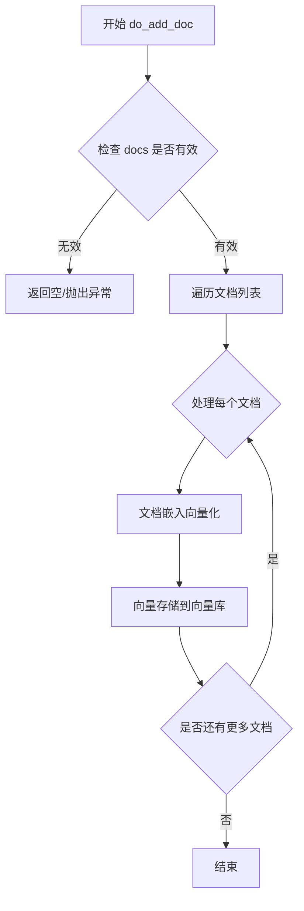

#### 带注释源码

```python
def do_add_doc(self, docs: List[Document]):
    """
    向知识库中添加文档
    
    参数:
        docs: List[Document] - 待添加的文档列表，每个 Document 对象包含文本内容和元数据
    
    返回值:
        None - 该方法目前为占位实现，具体逻辑待后续填充
    """
    pass
```


### `DefaultKBService.do_clear_vs`

该方法是 DefaultKBService 类中的一个空实现方法，用于清除向量存储（Vector Store）中的数据，目前仅包含 pass 语句，未实现具体逻辑。作为 KBService 抽象基类的实现子类，该方法需要由开发者根据具体的向量存储类型（如 Faiss、Milvus、Elasticsearch 等）来实现对应的清除逻辑。

参数：无（仅包含隐含的 self 参数）

返回值：`None`，该方法没有显式返回值，Python 默认返回 None

#### 流程图

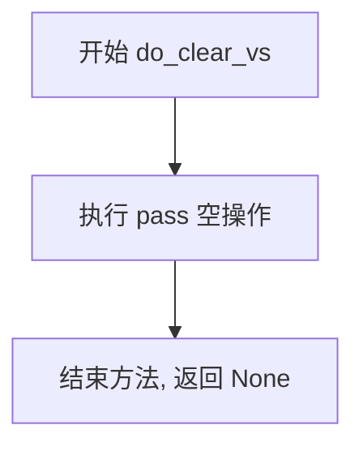

#### 带注释源码

```python
def do_clear_vs(self):
    """
    清除向量存储（Vector Store）中的所有数据。
    
    该方法是 KBService 抽象基类要求的接口实现之一，
    用于在删除知识库时清除对应的向量索引数据。
    
    注意：当前为空实现（pass），需要根据具体的向量存储类型
    进行实现。例如：
    - Faiss: 调用 faiss_index.reset() 或重新创建索引
    - Milvus: 调用 collection.drop() 或 delete 所有实体
    - Elasticsearch: 删除对应的索引
    """
    pass
```


### `DefaultKBService.vs_type`

该方法用于获取当前知识库服务（KBService）的类型标识符，返回一个字符串 "default"，表明这是默认的知识库服务实现。

参数： 无

返回值：`str`，返回知识库服务的类型标识符，当前固定返回 "default"。

#### 流程图

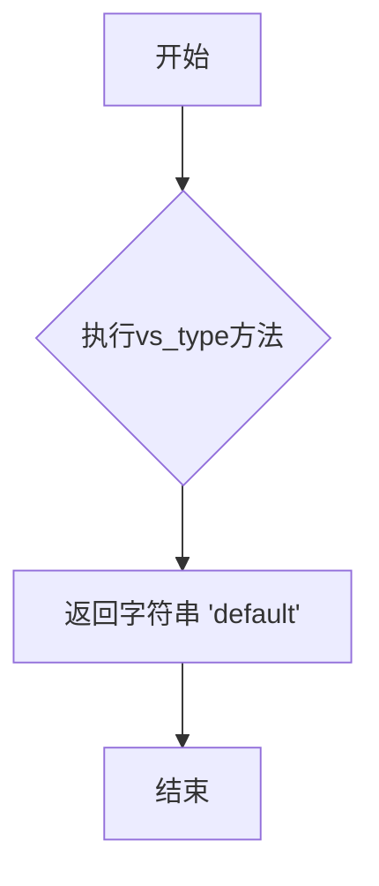

#### 带注释源码

```python
def vs_type(self) -> str:
    """
    获取知识库服务的类型标识符
    
    Args:
        无参数，只使用self引用实例本身
        
    Returns:
        str: 返回知识库类型标识符，当前实现固定返回 "default"
        
    Note:
        该方法用于在知识库服务注册和发现时标识服务类型。
        子类可以通过重写此方法返回不同的类型字符串来区分不同的知识库实现。
    """
    return "default"
```


### `DefaultKBService.do_init`

该方法是 `DefaultKBService` 类的空实现方法，用于执行知识库服务的初始化操作，当前仅包含 `pass` 语句，不执行任何实际逻辑。

参数：无

返回值：`None`，无返回值描述

#### 流程图

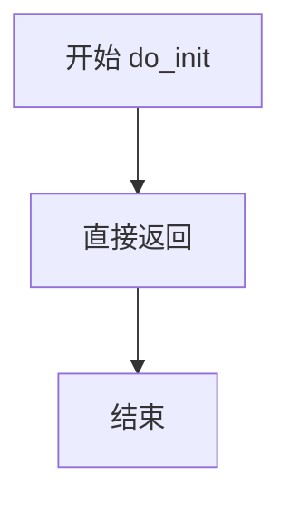

#### 带注释源码

```python
def do_init(self):
    """
    初始化知识库服务。
    
    该方法为知识库服务的初始化入口，当前为空实现（pass），
    预留用于执行知识库服务初始化相关的逻辑，例如：
    - 建立数据库连接
    - 加载配置信息
    - 初始化向量存储
    - 预热缓存等
    """
    pass  # 空实现，等待后续扩展
```


### `DefaultKBService.do_search`

默认知识库服务的搜索方法，用于在知识库中执行搜索查询，但当前为占位符实现。

参数：
- 无

返回值：`None`，该方法目前未实现具体搜索逻辑，返回空值。

#### 流程图

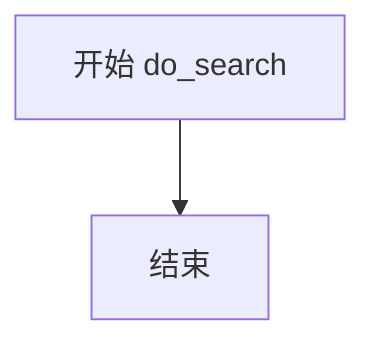

#### 带注释源码

```python
def do_search(self):
    """
    执行知识库搜索操作。
    注意：当前版本中该方法为空实现（pass），需根据实际需求补充搜索逻辑。
    """
    pass
```


### `DefaultKBService.do_insert_multi_knowledge`

该方法是知识库服务类 `DefaultKBService` 中的一个成员方法，用于批量插入多条知识数据。当前实现为空方法（仅包含 `pass` 语句），具体功能待实现。

参数：

- 无参数

返回值：`None`，该方法没有返回值（隐式返回 None）

#### 流程图

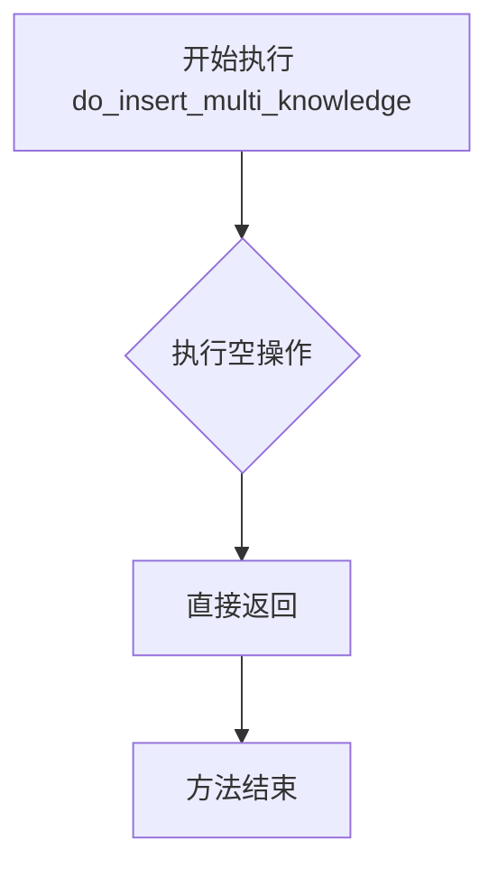

#### 带注释源码

```python
def do_insert_multi_knowledge(self):
    """
    批量插入多条知识数据的方法
    
    该方法目前为空实现（pass），用于继承或扩展时重写
    具体功能：
    - 接收多个文档或知识条目
    - 对每条知识进行向量化处理
    - 将向量化后的知识存储到向量数据库中
    """
    pass  # TODO: 实现批量插入知识的逻辑
```


### `DefaultKBService.do_insert_one_knowledge`

该方法是知识库服务（DefaultKBService）类中的一个空实现方法，用于向知识库中插入单条知识数据。目前方法体仅为 `pass`，是一个待实现的占位方法。

参数：
- 该方法无显式参数

返回值：`None`，无返回值（方法体为 `pass`）

#### 流程图

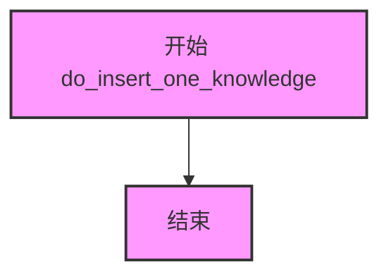

#### 带注释源码

```python
def do_insert_one_knowledge(self):
    """
    向知识库中插入单条知识数据
    
    该方法是 KBService 抽象基类的具体实现，
    用于处理单条知识的插入操作
    
    TODO: 待实现具体逻辑
    - 需要考虑如何将知识转换为向量存储
    - 需要考虑与向量数据库的交互
    - 需要考虑元数据的处理
    """
    pass
```


### `DefaultKBService.do_delete_doc`

该方法是知识库服务（KBService）的删除文档功能接口，用于从知识库中删除指定的文档，但由于当前实现为空（pass），尚未完成具体逻辑。

参数：

- `self`：隐式参数，类型为 `DefaultKBService` 实例，表示调用该方法的对象本身

返回值：`None`，无明确返回值（Python 中方法未显式返回值时默认返回 None）

#### 流程图

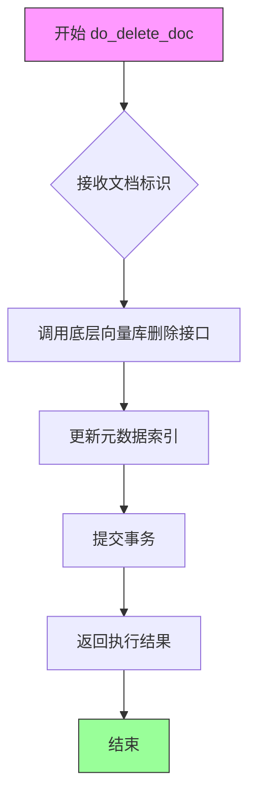

#### 带注释源码

```python
def do_delete_doc(self):
    """
    从知识库中删除指定的文档
    
    该方法应实现以下功能：
    1. 根据文档ID或标识符定位要删除的文档
    2. 调用底层向量数据库的删除接口
    3. 更新相关的元数据索引
    4. 确保删除操作的原子性和事务一致性
    
    Args:
        self: DefaultKBService的实例对象
        
    Returns:
        None: 当前实现返回None（空方法）
        
    Note:
        当前实现为占位符（pass），需要根据具体的向量库类型
        （如Milvus、Qdrant、Chroma等）实现具体的删除逻辑
    """
    pass  # TODO: 实现文档删除逻辑
```

## 关键组件


### DefaultKBService 类

继承自 KBService 的默认知识库服务实现类，提供知识库服务的基础架构框架，所有方法为空实现或 pass，作为其他具体知识库服务实现的基类或默认占位符。

### KBService 基类引用

来自 chatchat.server.knowledge_base.kb_service.base 模块的基类，定义了知识库服务的抽象接口，包括创建/删除知识库、添加文档、搜索、向量化存储等操作规范。

### do_create_kb 方法

知识库创建的空实现方法，用于创建新的知识库实例。

### do_drop_kb 方法

知识库删除的空实现方法，用于删除现有的知识库实例。

### do_add_doc 方法

文档添加的空实现方法，参数 docs: List[Document] 表示待添加的文档列表。

### do_clear_vs 方法

向量存储清空的空实现方法，用于清除向量存储中的所有数据。

### vs_type 方法

返回知识库类型标识符的方法，返回字符串 "default" 表示默认类型。

### do_init 方法

服务初始化的空实现方法，用于执行知识库服务的初始化逻辑。

### do_search 方法

搜索功能的空实现方法，用于在知识库中执行搜索操作。

### do_insert_multi_knowledge 方法

批量插入知识的空实现方法，用于一次性插入多条知识条目。

### do_insert_one_knowledge 方法

单条知识插入的空实现方法，用于插入单条知识条目。

### do_delete_doc 方法

文档删除的空实现方法，用于从知识库中删除指定文档。


## 问题及建议


### 已知问题

-   所有方法均为空实现（pass），缺乏实际功能逻辑，无法满足知识库服务的基本需求
-   多个方法缺少参数类型标注和返回值类型标注（如 do_search、do_insert_multi_knowledge、do_delete_doc 等）
-   缺少方法文档字符串，无法说明各方法的具体用途和预期行为
-   do_add_doc 方法接收 docs 参数但未使用，参数形同虚设
-   类继承自 KBService 但未实现任何有意义的抽象方法，可能导致调用时出现运行时错误
-   vs_type 方法返回硬编码字符串 "default"，缺乏灵活性

### 优化建议

-   为所有方法添加完整的类型标注（参数类型和返回值类型）
-   为每个方法添加文档字符串，说明功能、参数和返回值含义
-   空实现方法建议抛出 NotImplementedError 并添加 TODO 注释，明确标记为待实现状态
-   移除 do_add_doc 中未使用的 docs 参数，或实现文档添加逻辑
-   考虑将 vs_type 的返回值改为可配置属性，提升扩展性
-   添加基础错误处理机制，如参数校验和异常捕获
-   如该类仅为基类占位，建议添加类级注释说明其用途


## 其它


### 一段话描述

DefaultKBService 是一个继承自 KBService 的默认知识库服务实现类，提供了知识库的创建、删除、文档添加、向量存储清理、搜索、多知识插入、单知识插入、文档删除等核心操作的空实现，作为知识库服务的基类或默认实现。

### 文件的整体运行流程

该文件定义了知识库服务的默认实现类。在整个系统中，KBService 是抽象基类，定义了知识库服务的接口规范。DefaultKBService 作为默认实现，继承 KBService 并重写了所有抽象方法。虽然当前所有方法都为空实现（pass），但在实际的系统运行中，其他服务（如 FaissKBService、MilvusKBService 等）会继承 KBService 并实现具体功能。当系统需要使用知识库功能时，会根据配置选择相应的 KBService 实现类进行实例化，并调用相应方法完成知识库的创建、文档管理、向量检索等操作。

### 类的详细信息

#### 类名

DefaultKBService

#### 类继承关系

继承自 KBService，KBService 位于 chatchat.server.knowledge_base.kb_service.base 模块

#### 类字段

| 字段名称 | 类型 | 描述 |
|---------|------|------|
| 无 | - | 该类未定义任何实例字段 |

#### 类方法

##### do_create_kb

- **名称**：do_create_kb
- **参数**：无
- **参数类型**：无
- **参数描述**：创建知识库
- **返回值类型**：None
- **返回值描述**：该方法目前为空实现
- **mermaid 流程图**：
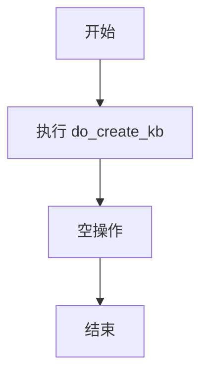
- **带注释源码**：
```python
def do_create_kb(self):
    """
    创建知识库的空实现方法
    在子类中应实现具体的知识库创建逻辑
    """
    pass
```

##### do_drop_kb

- **名称**：do_drop_kb
- **参数**：无
- **参数类型**：无
- **参数描述**：删除知识库
- **返回值类型**：None
- **返回值描述**：该方法目前为空实现
- **mermaid 流程图**：

- **带注释源码**：
```python
def do_drop_kb(self):
    """
    删除知识库的空实现方法
    在子类中应实现具体的知识库删除逻辑
    """
    pass
```

##### do_add_doc

- **名称**：do_add_doc
- **参数名称**：docs
- **参数类型**：List[Document]
- **参数描述**：要添加的文档列表，Document 来自 langchain.schema
- **返回值类型**：None
- **返回值描述**：该方法目前为空实现
- **mermaid 流程图**：
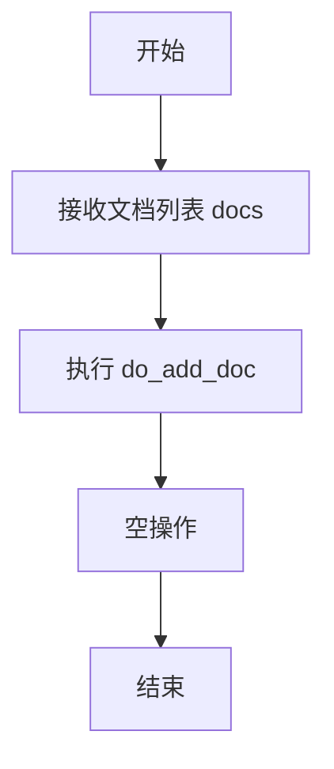
- **带注释源码**：
```python
def do_add_doc(self, docs: List[Document]):
    """
    添加文档到知识库的空实现方法
    :param docs: Document 对象列表
    在子类中应实现具体的文档添加逻辑，包括文档分词、向量化、存储等
    """
    pass
```

##### do_clear_vs

- **名称**：do_clear_vs
- **参数**：无
- **参数类型**：无
- **参数描述**：清除向量存储
- **返回值类型**：None
- **返回值描述**：该方法目前为空实现
- **mermaid 流程图**：
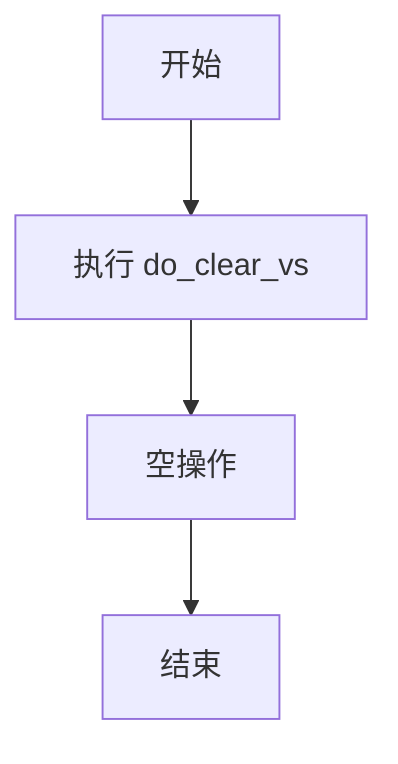
- **带注释源码**：
```python
def do_clear_vs(self):
    """
    清除向量存储的空实现方法
    在子类中应实现具体的向量存储清除逻辑
    """
    pass
```

##### vs_type

- **名称**：vs_type
- **参数**：无
- **参数类型**：无
- **参数描述**：返回向量存储类型标识
- **返回值类型**：str
- **返回值描述**：返回字符串 "default"，表示默认向量存储类型
- **mermaid 流程图**：
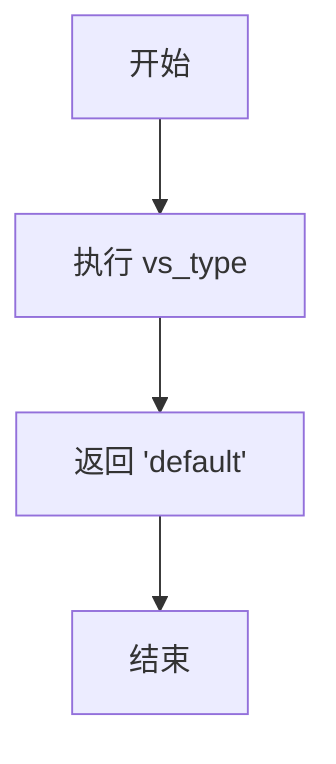
- **带注释源码**：
```python
def vs_type(self) -> str:
    """
    获取向量存储类型
    :return: 返回向量存储类型字符串，当前返回 'default'
    """
    return "default"
```

##### do_init

- **名称**：do_init
- **参数**：无
- **参数类型**：无
- **参数描述**：初始化知识库服务
- **返回值类型**：None
- **返回值描述**：该方法目前为空实现
- **mermaid 流程图**：
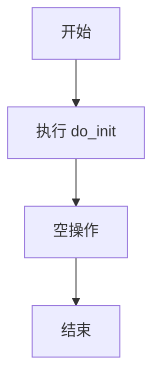
- **带注释源码**：
```python
def do_init(self):
    """
    初始化知识库服务的空实现方法
    在子类中应实现具体的初始化逻辑，如建立连接、加载配置等
    """
    pass
```

##### do_search

- **名称**：do_search
- **参数**：无
- **参数类型**：无
- **参数描述**：搜索知识库
- **返回值类型**：None
- **返回值描述**：该方法目前为空实现
- **mermaid 流程图**：
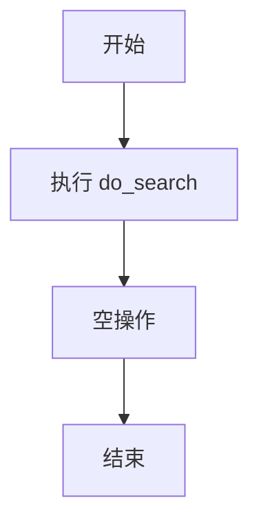
- **带注释源码**：
```python
def do_search(self):
    """
    搜索知识库的空实现方法
    在子类中应实现具体的搜索逻辑，包括查询向量化、相似度计算等
    """
    pass
```

##### do_insert_multi_knowledge

- **名称**：do_insert_multi_knowledge
- **参数**：无
- **参数类型**：无
- **参数描述**：批量插入知识
- **返回值类型**：None
- **返回值描述**：该方法目前为空实现
- **mermaid 流程图**：

- **带注释源码**：
```python
def do_insert_multi_knowledge(self):
    """
    批量插入知识的空实现方法
    在子类中应实现批量插入逻辑，包括批量向量化、批量存储等
    """
    pass
```

##### do_insert_one_knowledge

- **名称**：do_insert_one_knowledge
- **参数**：无
- **参数类型**：无
- **参数描述**：单条插入知识
- **返回值类型**：None
- **返回值描述**：该方法目前为空实现
- **mermaid 流程图**：
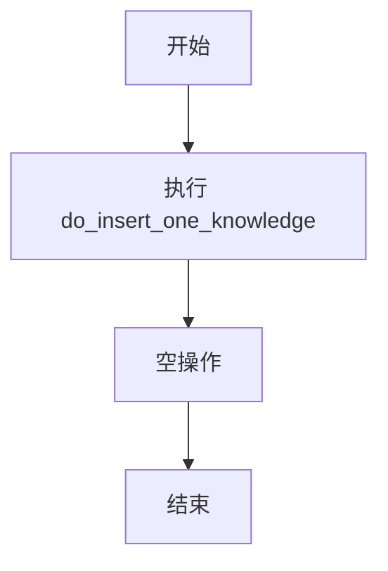
- **带注释源码**：
```python
def do_insert_one_knowledge(self):
    """
    单条插入知识的空实现方法
    在子类中应实现单条知识插入逻辑，包括单条向量化、存储等
    """
    pass
```

##### do_delete_doc

- **名称**：do_delete_doc
- **参数**：无
- **参数类型**：无
- **参数描述**：删除文档
- **返回值类型**：None
- **返回值描述**：该方法目前为空实现
- **mermaid 流程图**：
```mermaid
graph TD
    A[开始] --> B[执行 do_delete_doc]
    B --> C[空操作]
    C --> D[结束]
```
- **带注释源码**：
```python
def do_delete_doc(self):
    """
    删除文档的空实现方法
    在子类中应实现具体的文档删除逻辑，包括从向量存储中移除等
    """
    pass
```

### 全局变量和全局函数

该文件未定义任何全局变量或全局函数。

### 关键组件信息

| 组件名称 | 描述 |
|---------|------|
| KBService | 抽象基类，定义知识库服务的接口规范，DefaultKBService 继承此类 |
| Document | langchain.schema 中的文档类，用于表示待处理的文档内容 |
| Embeddings | langchain.embeddings.base 中的嵌入基类，用于文本向量化 |
| DefaultKBService | 当前类，作为知识库服务的默认实现（空实现） |

### 设计目标与约束

该类的设计目标是为知识库服务提供一个默认的抽象实现。所有方法目前均为空实现，这表明该类主要作为一个接口规范或占位符存在。设计约束包括：必须继承 KBService 抽象基类；需要实现所有抽象方法以满足基类接口要求；返回类型和参数类型需要与基类定义保持一致。当前实现不包含任何实际业务逻辑，仅作为其他具体实现类的基类或模板。

### 错误处理与异常设计

当前类未实现任何错误处理机制。由于所有方法均为空实现（pass），不涉及任何实际的业务逻辑，因此不涉及错误处理。在实际子类实现中，应该考虑以下异常处理场景：数据库连接失败异常、文档解析异常、向量化和存储过程中的异常、搜索时的超时异常、空结果集处理、权限验证失败异常等。建议子类实现时添加 try-except 块，并定义自定义异常类来区分不同类型的错误。

### 数据流与状态机

数据流主要涉及文档的输入和处理流程：外部调用者传入 Document 列表或单个 Document，经过向量化处理（依赖 Embeddings 类），最终存储到向量数据库中。当前类作为中间层，不处理实际数据流。状态机方面，知识库服务通常包含以下状态：初始化状态（init）、就绪状态（ready）、使用中状态（active）、清理状态（clearing）、销毁状态（dropped）。当前类不维护状态，需要子类实现时自行管理状态转换。

### 外部依赖与接口契约

主要外部依赖包括：langchain.embeddings.base.Embeddings（文本嵌入基类）、langchain.schema.Document（文档模式类）、chatchat.server.knowledge_base.kb_service.base.KBService（知识库服务基类）。接口契约方面，该类需要满足 KBService 抽象基类定义的所有接口要求，包括：创建知识库（do_create_kb）、删除知识库（do_drop_kb）、添加文档（do_add_doc）、清空向量存储（do_clear_vs）、获取向量存储类型（vs_type）、初始化（do_init）、搜索（do_search）、批量插入知识（do_insert_multi_knowledge）、单条插入知识（do_insert_one_knowledge）、删除文档（do_delete_doc）。

### 潜在的技术债务或优化空间

该代码存在以下技术债务和优化空间：所有方法均为空实现，缺少实际的业务逻辑实现，建议在子类中补充具体实现或移除此类。缺少文档注释（docstring）中的参数和返回值详细说明，需要完善文档。do_add_doc 方法接收 docs 参数但未使用，方法签名应保持与基类一致。vs_type 方法返回硬编码的 "default"，应根据实际配置动态返回。未定义任何异常类，建议定义自定义异常以提高错误处理能力。缺少类型注解的详细说明，部分方法缺少详细的类型提示。设计模式方面，可以考虑使用策略模式或模板方法模式来优化类结构。未实现任何日志记录机制，建议添加日志输出以便调试和监控。

    