# `Langchain-Chatchat\libs\chatchat-server\chatchat\server\knowledge_base\kb_service\es_kb_service.py` 详细设计文档

ESKBService是基于Elasticsearch的知识库服务实现，提供了向量存储、文档检索、索引管理等功能，用于支持RAG系统的知识库操作。

## 整体流程

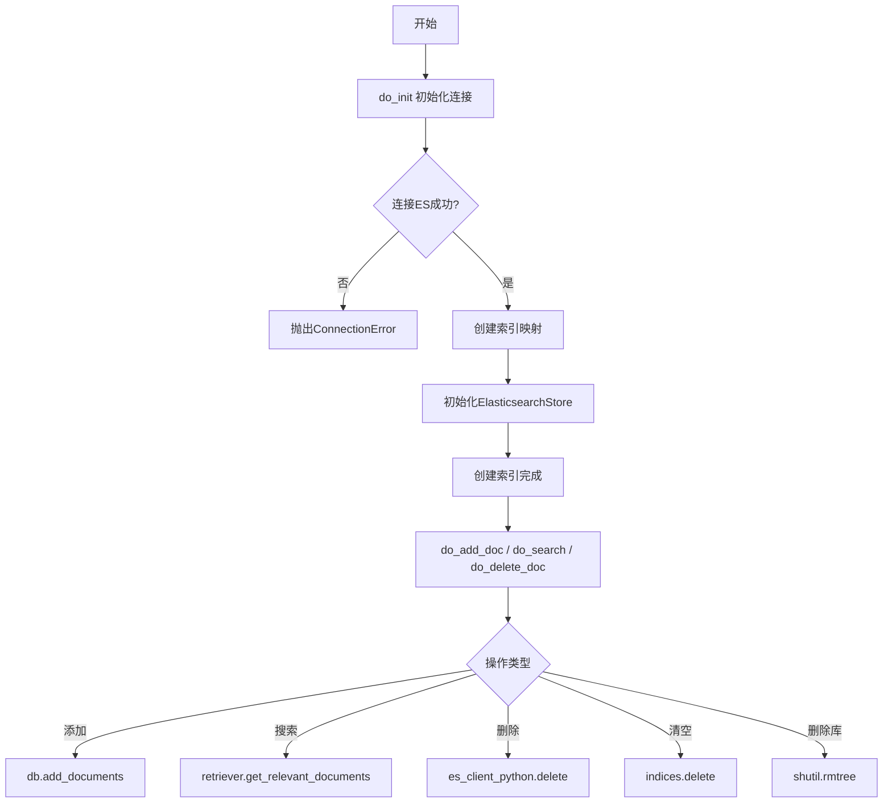

## 类结构

```
KBService (抽象基类)
└── ESKBService (Elasticsearch知识库服务实现)
```

## 全局变量及字段


### `logger`
    
日志记录器实例，用于记录系统运行日志

类型：`logging.Logger`
    


### `ESKBService.kb_path`
    
知识库路径

类型：`str`
    


### `ESKBService.index_name`
    
Elasticsearch索引名

类型：`str`
    


### `ESKBService.scheme`
    
协议(http/https)

类型：`str`
    


### `ESKBService.IP`
    
Elasticsearch主机地址

类型：`str`
    


### `ESKBService.PORT`
    
Elasticsearch端口

类型：`str`
    


### `ESKBService.user`
    
用户名

类型：`str`
    


### `ESKBService.password`
    
密码

类型：`str`
    


### `ESKBService.verify_certs`
    
是否验证证书

类型：`bool`
    


### `ESKBService.ca_certs`
    
CA证书路径

类型：`str`
    


### `ESKBService.client_key`
    
客户端私钥路径

类型：`str`
    


### `ESKBService.client_cert`
    
客户端证书路径

类型：`str`
    


### `ESKBService.dims_length`
    
向量维度

类型：`int`
    


### `ESKBService.embeddings_model`
    
嵌入模型实例

类型：`object`
    


### `ESKBService.es_client_python`
    
ES Python客户端

类型：`Elasticsearch`
    


### `ESKBService.db`
    
LangChain ES向量存储

类型：`ElasticsearchStore`
    
    

## 全局函数及方法


### `build_logger`

构建日志记录器，用于创建并配置项目专用的日志记录器实例。

参数：

- 该函数无显式参数（使用默认配置）

返回值：`logging.Logger`，返回配置好的日志记录器实例

#### 流程图

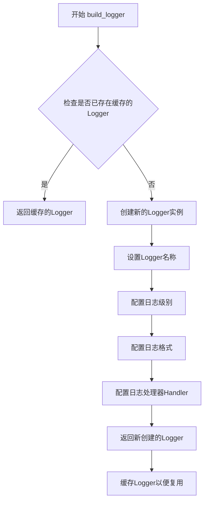

#### 带注释源码

```python
# 由于 build_logger 函数定义在 chatchat.utils 模块中，
# 当前代码文件仅显示其导入和调用方式
from chatchat.utils import build_logger

# 调用 build_logger() 创建或获取日志记录器实例
# 该函数通常采用单例模式或缓存机制，避免重复创建相同的 Logger
logger = build_logger()

# 使用示例（在 ESKBService 类中）
# class ESKBService(KBService):
#     def do_init(self):
#         ...
#         try:
#             logger.warning("ES未配置用户名和密码")
#         except ConnectionError:
#             logger.error("连接到 Elasticsearch 失败！")
#         except Exception as e:
#             logger.error(f"Error 发生 : {e}")
#         ...

# 推断的 chatchat.utils.build_logger 函数实现可能如下：
"""
def build_logger(name: str = "chatchat") -> logging.Logger:
    '''
    构建并返回一个日志记录器实例
    
    参数:
        name: 日志记录器名称，默认为 "chatchat"
    
    返回值:
        logging.Logger: 配置好的日志记录器对象
    '''
    logger = logging.getLogger(name)
    
    # 避免重复配置
    if logger.handlers:
        return logger
    
    # 设置日志级别
    logger.setLevel(logging.INFO)
    
    # 创建控制台处理器
    console_handler = logging.StreamHandler()
    console_handler.setLevel(logging.INFO)
    
    # 设置日志格式
    formatter = logging.Formatter(
        '%(asctime)s - %(name)s - %(levelname)s - %(message)s'
    )
    console_handler.setFormatter(formatter)
    
    # 添加处理器到日志记录器
    logger.addHandler(console_handler)
    
    return logger
"""
```

> **注意**：由于 `build_logger()` 函数的实际源码定义在 `chatchat.utils` 模块中，当前提供的代码文件仅包含该函数的导入和调用。上述源码为基于常见日志构建器模式的合理推断。实际实现可能包括更复杂的配置，如从配置文件读取日志级别、设置不同的日志格式、支持文件输出等特性。


### `get_Embeddings`

该函数用于根据传入的嵌入模型名称获取对应的嵌入模型实例，以便在知识库服务中执行向量化和相似度检索操作。

参数：

- `embed_model`：`str`，嵌入模型的名称，用于标识需要加载的具体嵌入模型（如 `sentence-transformers`、`text-embedding-ada-002` 等）

返回值：`Any`（嵌入模型实例），返回可用于文本向量化的嵌入模型对象，供后续文档向量化处理和相似度检索使用

#### 流程图

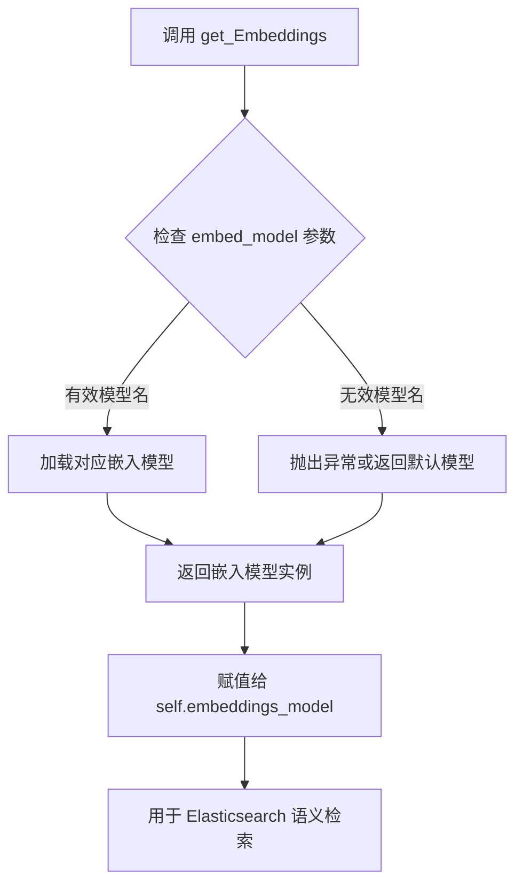

#### 带注释源码

```python
# 从外部模块导入的函数，具体定义位于 chatchat.server.utils
from chatchat.server.utils import get_Embeddings

# 在 ESKBService 类初始化方法中的调用
def do_init(self):
    # ... 省略其他初始化代码 ...
    
    # 调用 get_Embeddings 获取嵌入模型实例
    # embed_model 来自父类 KBService 的属性，标识当前使用的嵌入模型名称
    # 返回的 embeddings_model 用于后续的文档向量化和语义检索
    self.embeddings_model = get_Embeddings(self.embed_model)
    
    # 后续该嵌入模型被传递给 ElasticsearchStore 用于创建向量索引
    params = dict(
        es_url=f"{self.scheme}://{self.IP}:{self.PORT}",
        index_name=self.index_name,
        query_field="context",
        vector_query_field="dense_vector",
        embedding=self.embeddings_model,  # 使用获取的嵌入模型
        strategy=ApproxRetrievalStrategy(),
        es_params={"timeout": 60},
    )
```


### `get_Retriever`

获取检索器，用于从知识库中检索相关文档。该函数是一个工厂函数，根据传入的检索器类型创建相应的检索器实例。

参数：

- `retriever_type`：`str`，检索器类型，代码中传入 `"vectorstore"` 表示从向量存储创建检索器

返回值：`Retriever`，返回一个检索器对象，该对象具有 `from_vectorstore` 方法用于配置向量存储检索参数，以及 `get_relevant_documents` 方法用于执行检索

#### 流程图

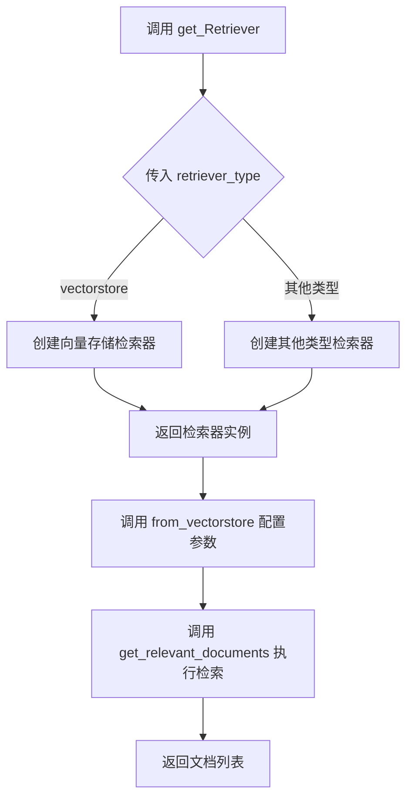

#### 带注释源码

```python
# 注意：此为调用方代码，get_Retriever 函数定义在 chatchat.server.file_rag.utils 模块中
# 此处展示该函数的使用方式

from chatchat.server.file_rag.utils import get_Retriever

# 在 ESKBService.do_search 方法中调用
def do_search(self, query: str, top_k: int, score_threshold: float):
    """
    文本相似性检索
    
    参数:
        query: str - 查询文本
        top_k: int - 返回最相似的k个文档
        score_threshold: float - 相似度阈值
    
    返回:
        docs: List[Document] - 检索到的文档列表
    """
    # 1. 获取检索器，传入 "vectorstore" 表示使用向量存储检索
    retriever = get_Retriever("vectorstore").from_vectorstore(
        self.db,           # ElasticsearchStore 向量数据库实例
        top_k=top_k,       # 返回前k个最相似结果
        score_threshold=score_threshold,  # 相似度分数阈值
    )
    
    # 2. 执行检索，获取相关文档
    docs = retriever.get_relevant_documents(query)
    
    # 3. 返回文档列表
    return docs
```

---

**注意**：由于 `get_Retriever()` 函数的实际源代码不在当前提供的代码文件中，以上信息是基于 `chatchat.server.file_rag.utils` 导入模块的调用方式推断得出。实际函数实现需要查看 `chatchat/server/file_rag/utils.py` 源文件。


### `Settings` - 设置配置类

该配置类采用分层设计，通过嵌套的对象结构管理知识库应用的所有配置参数，包括基础路径设置和各类知识库服务的连接配置（ES、Chroma等），支持灵活的参数定制和类型安全的配置访问。

#### 流程图

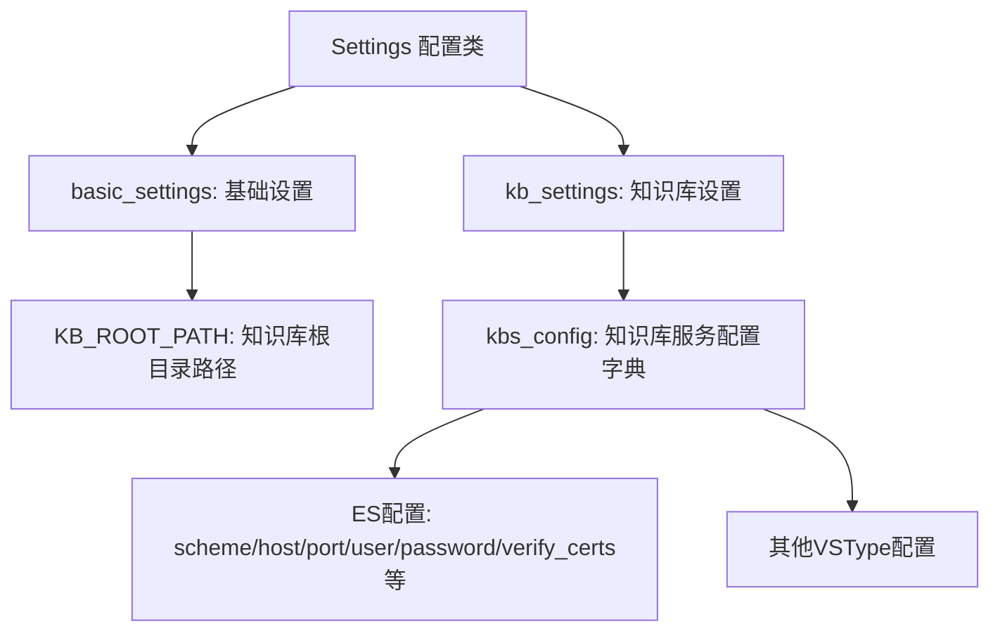

#### 带注释源码

```python
# Settings 类定义（推测，基于代码使用方式）
# 实际源码未在给定代码中提供，以下为基于使用模式的推断

class Settings:
    """
    全局配置管理类
    管理应用的所有配置项，包括基础设置和知识库服务配置
    """
    
    # 基础设置子配置
    basic_settings: BasicSettings
    
    # 知识库设置子配置
    kb_settings: KBSettings


class BasicSettings:
    """
    基础设置
    包含应用运行所需的基础路径和目录配置
    """
    
    # 知识库根目录路径
    KB_ROOT_PATH: str = "knowledge_base"


class KBSettings:
    """
    知识库设置
    包含各类知识库服务的连接配置
    """
    
    # 知识库服务配置字典，键为服务类型(如'ES', 'Chroma'等)
    # 值包含: scheme, host, port, user, password, verify_certs, ca_certs, 
    #         client_key, client_cert, dims_length等
    kbs_config: Dict[str, Dict[str, Any]]
```

#### 在 ESKBService 中的实际使用示例

```python
# 代码中实际使用方式：

# 获取知识库根路径
kb_path = os.path.join(Settings.basic_settings.KB_ROOT_PATH, knowledge_base_name)

# 获取ES服务的配置
kb_config = Settings.kb_settings.kbs_config[self.vs_type()]
scheme = kb_config.get("scheme", "http")
host = kb_config["host"]
port = kb_config["port"]
user = kb_config.get("user", "")
password = kb_config.get("password", "")
verify_certs = kb_config.get("verify_certs", True)
ca_certs = kb_config.get("ca_certs", None)
client_key = kb_config.get("client_key", None)
client_cert = kb_config.get("client_cert", None)
dims_length = kb_config.get("dims_length", None)
```

#### 关键组件信息

| 组件名称 | 一句话描述 |
|---------|-----------|
| `Settings` | 全局配置管理单例，统一管理应用所有配置 |
| `Settings.basic_settings` | 基础设置子配置，包含目录路径等基础信息 |
| `Settings.kb_settings` | 知识库设置子配置，包含各类知识库服务的连接参数 |
| `kbs_config` | 知识库服务配置字典，按服务类型存储独立配置 |

#### 潜在的技术债务或优化空间

1. **配置访问方式不够类型安全**：当前使用字典键访问配置，IDE 无法提供自动补全和类型检查建议
2. **配置集中度过高**：所有配置都通过 Settings 类管理，可能导致类过于庞大
3. **缺少配置验证**：配置加载时没有进行有效性验证，可能导致运行时错误
4. **硬编码默认值**：部分默认值（如 `"http"`、`60` 秒超时）散落在代码中，建议统一管理
5. **文档缺失**：Settings 类的结构和各配置项的详细说明文档可能不完整

#### 其它项目

**设计目标与约束**：
- 支持多种知识库服务类型（ES、Chroma、FAISS等）的灵活配置
- 配置分层管理，基础设置与业务设置分离
- 支持 HTTPS 双向认证

**错误处理与异常设计**：
- 配置缺失时使用 `.get()` 方法提供默认值
- ES 连接失败时抛出 `ConnectionError` 并记录日志
- 索引创建失败时捕获 `BadRequestError` 并尝试恢复

**数据流与状态机**：
- 配置加载 → 连接 ES → 创建索引 → 初始化向量化存储 → 文档操作
- 状态转换：未初始化 → 连接中 → 已连接 → 错误状态

**外部依赖与接口契约**：
- 依赖 `chatchat.settings.Settings` 配置类
- 依赖 `elasticsearch` Python 客户端
- 依赖 `langchain_community.vectorstores.elasticsearch` 向量存储实现


### `ESKBService.do_search`

该方法通过 Elasticsearch 向量存储执行语义搜索，接受查询字符串、返回结果数量和相似度阈值，返回与查询最相关的文档列表。

参数：

-  `query`：`str`，用户输入的查询字符串
-  `top_k`：`int`，期望返回的最相关文档数量
-  `score_threshold`：`float`，用于过滤低相似度结果的阈值

返回值：`List[Document]`，返回与查询语义最相关的文档对象列表

#### 流程图

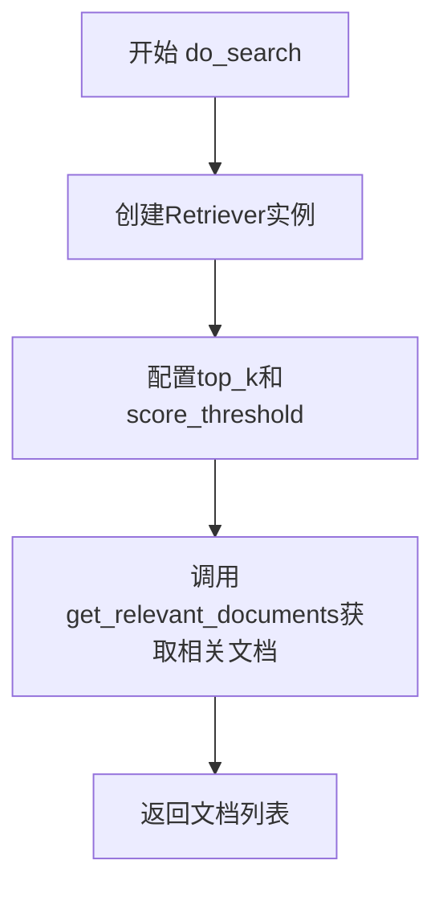

#### 带注释源码

```python
def do_search(self, query: str, top_k: int, score_threshold: float):
    # 文本相似性检索：使用langchain的Retriever接口从向量数据库检索文档
    # 从self.db（ElasticsearchStore实例）创建检索器
    retriever = get_Retriever("vectorstore").from_vectorstore(
        self.db,                     # 向量存储实例
        top_k=top_k,                 # 返回最相似的top_k个结果
        score_threshold=score_threshold,  # 相似度分数阈值
    )
    # 执行检索，获取与query最相关的文档
    docs = retriever.get_relevant_documents(query)
    # 返回文档列表
    return docs
```

---

### `ESKBService.do_add_doc`

该方法将文档列表添加到 Elasticsearch 向量存储中，首先通过 langchain 的 ElasticsearchStore 添加文档，然后查询并返回新添加文档的 ID 和元数据信息。

参数：

-  `docs`：`List[Document]`，langchain Document 对象列表，包含页面内容和元数据
-  `**kwargs`：可选关键字参数

返回值：`List[dict]`，返回包含文档 ID 和元数据的字典列表，格式为 `[{"id": str, "metadata": dict}, ...]`

#### 流程图

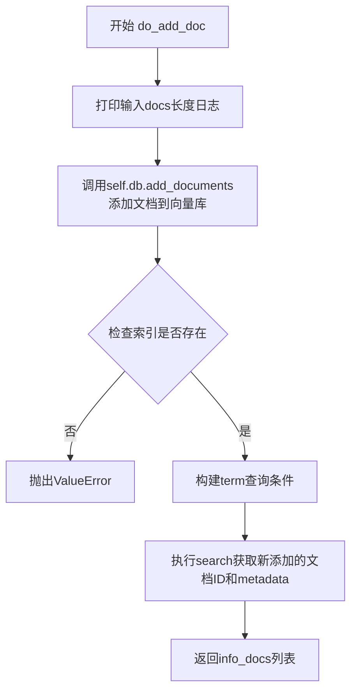

#### 带注释源码

```python
def do_add_doc(self, docs: List[Document], **kwargs):
    """向知识库添加文件"""

    # 记录输入的文档数量，便于调试
    print(
        f"server.knowledge_base.kb_service.es_kb_service.do_add_doc 输入的docs参数长度为:{len(docs)}"
    )
    print("*" * 100)

    # 使用langchain的ElasticsearchStore将文档添加到向量数据库
    self.db.add_documents(documents=docs)
    # 获取 id 和 source , 格式：[{"id": str, "metadata": dict}, ...]
    print("写入数据成功.")
    print("*" * 100)

    # 检查索引是否存在，如果不存在则抛出异常
    if self.es_client_python.indices.exists(index=self.index_name):
        # 从第一个文档的metadata中获取source（源文件路径）
        file_path = docs[0].metadata.get("source")
        # 构建Elasticsearch查询条件，精确匹配metadata.source.keyword字段
        query = {
            "query": {
                "term": {"metadata.source.keyword": file_path},
                "term": {"_index": self.index_name},
            }
        }
        # 注意设置size，默认返回10个。
        # 执行搜索查询，获取刚刚添加的文档
        search_results = self.es_client_python.search(body=query, size=50)
        # 如果召回元素个数为0，抛出异常
        if len(search_results["hits"]["hits"]) == 0:
            raise ValueError("召回元素个数为0")
        # 提取文档的ID和metadata，组装成列表返回
        info_docs = [
            {"id": hit["_id"], "metadata": hit["_source"]["metadata"]}
            for hit in search_results["hits"]["hits"]
        ]
        return info_docs
```

---

### `ESKBService.do_delete_doc`

该方法根据文件路径从 Elasticsearch 索引中删除所有相关文档，通过 term 查询匹配 `metadata.source.keyword` 字段来定位要删除的文档。

参数：

-  `kb_file`：知识库文件对象，包含文件路径信息
-  `**kwargs`：可选关键字参数

返回值：`None`

#### 流程图

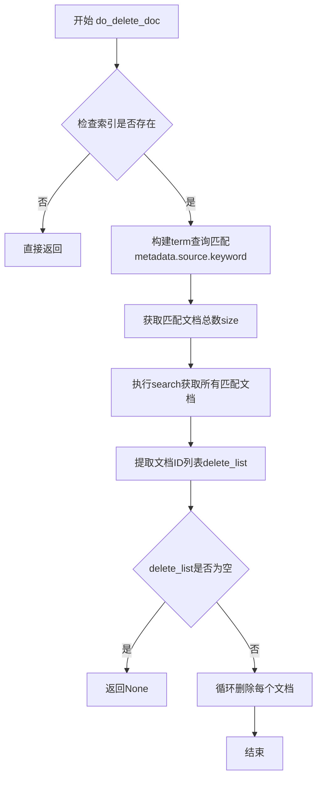

#### 带注释源码

```python
def do_delete_doc(self, kb_file, **kwargs):
    # 检查索引是否存在
    if self.es_client_python.indices.exists(index=self.index_name):
        # 从向量数据库中删除索引(文档名称是Keyword)
        # 获取相对文件路径用于匹配
        query = {
            "query": {
                "term": {
                    "metadata.source.keyword": self.get_relative_source_path(
                        kb_file.filepath
                    )
                }
            },
            "track_total_hits": True,
        }
        # 注意设置size，默认返回10个，es检索设置track_total_hits为True返回数据库中真实的size。
        # 获取匹配文档的总数
        size = self.es_client_python.search(body=query)["hits"]["total"]["value"]
        # 搜索所有匹配文档，设置size为总数
        search_results = self.es_client_python.search(body=query, size=size)
        # 从搜索结果中提取所有文档的ID
        delete_list = [hit["_id"] for hit in search_results["hits"]["hits"]]
        if len(delete_list) == 0:
            return None
        else:
            # 遍历并删除每个文档
            for doc_id in delete_list:
                try:
                    self.es_client_python.delete(
                        index=self.index_name, id=doc_id, refresh=True
                    )
                except Exception as e:
                    logger.error(f"ES Docs Delete Error! {e}")

            # self.db.delete(ids=delete_list)
            # self.es_client_python.indices.refresh(index=self.index_name)
```

---

### `ESKBService.do_clear_vs`

该方法用于清空整个向量存储，通过删除 Elasticsearch 中对应的索引来实现。

参数：无

返回值：`None`

#### 流程图

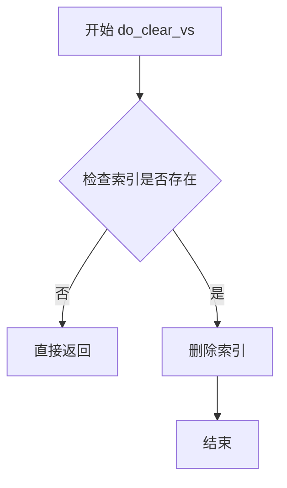

#### 带注释源码

```python
def do_clear_vs(self):
    """从知识库删除全部向量"""
    # 检查索引是否存在，如果存在则删除整个索引
    if self.es_client_python.indices.exists(index=self.kb_name):
        self.es_client_python.indices.delete(index=self.kb_name)
```

---

### `ESKBService.do_drop_kb`

该方法用于删除整个知识库，包括向量存储数据和原始文件，通过删除知识库对应的目录来实现。

参数：无

返回值：`None`

#### 流程图

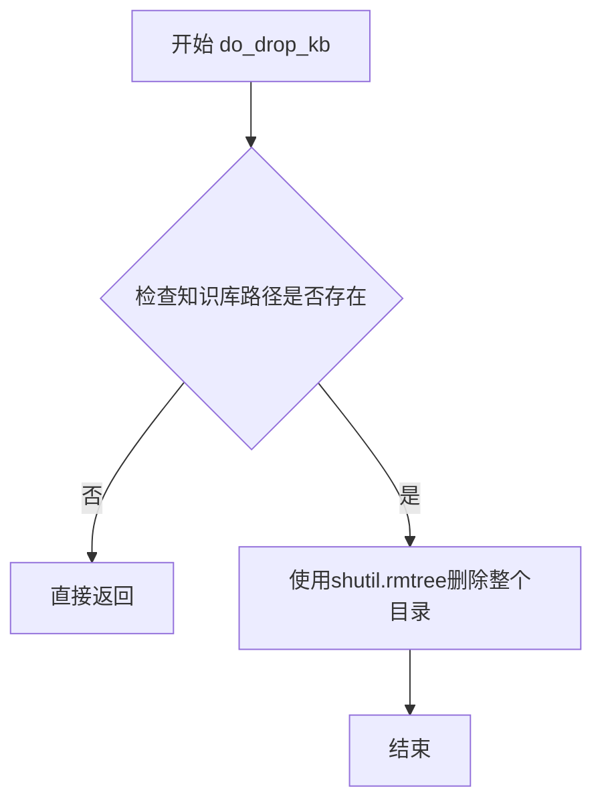

#### 带注释源码

```python
def do_drop_kb(self):
    """删除知识库"""
    # self.kb_file: 知识库路径
    # 检查知识库目录是否存在，如果存在则递归删除整个目录
    if os.path.exists(self.kb_path):
        shutil.rmtree(self.kb_path)
```


### `SupportedVSType`

SupportedVSType 是一个向量存储类型枚举类，用于定义系统支持的各类向量存储后端。该枚举从 `chatchat.server.knowledge_base.kb_service.base` 模块导入，在本文件中通过 `vs_type()` 方法返回具体的向量存储类型值（如 `SupportedVSType.ES` 表示 Elasticsearch）。

参数：无（枚举类型不接受构造参数）

返回值：`str`，返回枚举成员的字符串表示形式（如 "ES"）

#### 流程图

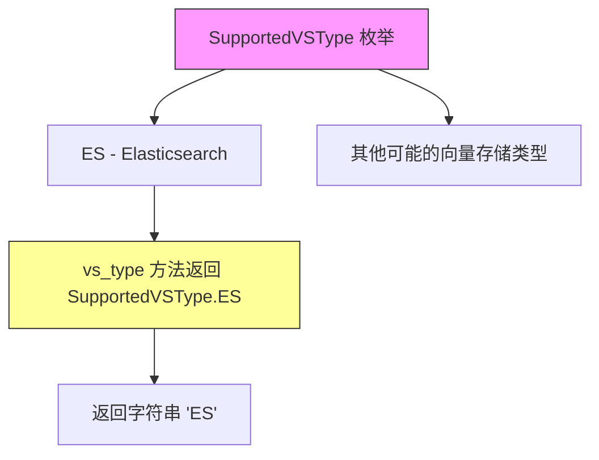

#### 带注释源码

```python
# 从 chatchat.server.knowledge_base.kb_service.base 模块导入 KBService 基类和 SupportedVSType 枚举
from chatchat.server.knowledge_base.kb_service.base import KBService, SupportedVSType

# 在 ESKBService 类中，vs_type 方法使用 SupportedVSType 枚举返回当前向量存储类型
def vs_type(self) -> str:
    """
    获取向量存储类型
    
    返回值：
        str: 返回枚举 SupportedVSType.ES 的字符串表示，即 "ES"
    """
    return SupportedVSType.ES
```

**注意**：由于 `SupportedVSType` 是从外部模块导入的枚举类，其完整定义（包含所有枚举成员如 ES、Faiss、Milvus 等）位于 `chatchat.server.knowledge_base.kb_service.base` 模块中。从当前代码的使用方式来看，`SupportedVSType.ES` 表示 Elasticsearch 向量存储后端。


# KnowledgeFile 类分析

## 1. 概述

`KnowledgeFile` 是一个数据模型类，用于表示知识库中的单个文件。它封装了文件名和所属知识库名称等基本信息，作为知识库文件操作的载体在系统中流转。

## 2. 使用场景

从提供的代码中可以看到 `KnowledgeFile` 在以下场景中被使用：

```python
esKBService.add_doc(KnowledgeFile(filename="README.md", knowledge_base_name="test"))
```

在 `ESKBService.do_delete_doc` 方法中也引用了 `kb_file.filepath` 属性：

```python
query = {
    "query": {
        "term": {
            "metadata.source.keyword": self.get_relative_source_path(
                kb_file.filepath
            )
        }
    },
    ...
}
```

## 3. 类信息推断

### KnowledgeFile

| 属性名称 | 类型 | 描述 |
|---------|------|------|
| `filename` | `str` | 文件名 |
| `knowledge_base_name` | `str` | 所属知识库名称 |
| `filepath` | `str` | 文件完整路径（可推断） |

> **注意**：由于 `KnowledgeFile` 类的具体定义在 `chatchat.server.knowledge_base.utils` 模块中，而当前提供的代码片段未包含该模块的完整源码，以上信息是基于代码使用方式推断得出的。

## 4. 代码中的使用流程

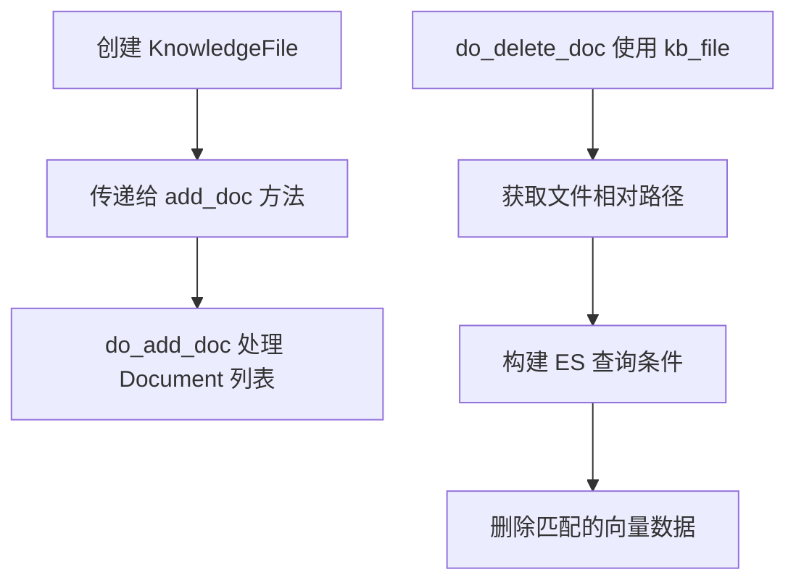

## 5. 相关代码片段

### ESKBService.do_delete_doc 中的使用

```python
def do_delete_doc(self, kb_file, **kwargs):
    if self.es_client_python.indices.exists(index=self.index_name):
        # 从向量数据库中删除索引(文档名称是Keyword)
        query = {
            "query": {
                "term": {
                    "metadata.source.keyword": self.get_relative_source_path(
                        kb_file.filepath  # 使用 KnowledgeFile 的 filepath 属性
                    )
                }
            },
            "track_total_hits": True,
        }
        # ... 删除逻辑
```

### 主函数中的实例化

```python
if __name__ == "__main__":
    esKBService = ESKBService("test")
    esKBService.add_doc(KnowledgeFile(filename="README.md", knowledge_base_name="test"))
```

## 6. 推断的类结构

基于代码分析，`KnowledgeFile` 类的推断结构如下：

```python
class KnowledgeFile:
    def __init__(self, filename: str, knowledge_base_name: str):
        self.filename = filename
        self.knowledge_base_name = knowledge_base_name
        # 可能还有 filepath 属性
```

## 7. 技术债务与优化建议

1. **类型不匹配问题**：在 `do_add_doc` 方法中，接收的是 `List[Document]` 类型，但调用时传递的是 `KnowledgeFile` 对象，这表明可能存在类型转换逻辑缺失或文档不完整的问题。

2. **依赖外部定义**：`KnowledgeFile` 类的完整定义未在当前文件中给出，建议在文档中补充该类的完整源码或引用说明。

3. **异常处理**：在删除文档时，如果 `get_relative_source_path` 方法返回空值或 `kb_file` 对象缺少必要属性，可能导致查询失败。


### `Document (langchain.schema.Document)`

Document 是 LangChain 框架中的文档类，用于表示一个文本片段及其相关的元数据。在知识库服务中用于存储和传递文档信息，是向量检索和知识库管理的核心数据结构。

参数：

- `page_content`：`str`，文档的文本内容，即实际的文本数据
- `metadata`：`dict`，文档的元数据，包含如来源文件路径、页面编号等附加信息

返回值：`Document` 实例，表示一个包含文本内容和元数据的文档对象

#### 流程图

```mermaid
graph TD
    A[创建 Document 对象] --> B{输入参数}
    B -->|page_content| C[存储文本内容]
    B -->|metadata| D[存储元数据字典]
    C --> E[Document 实例]
    D --> E
    E --> F[可用于向量存储/检索]
    
    G[在 ESKBService 中使用] --> H[get_doc_by_ids 返回 List[Document]]
    I[在 ESKBService 中使用] --> J[do_add_doc 接收 List[Document]]
    H --> K[知识库检索结果]
    J --> L[知识库添加文档]
```

#### 带注释源码

```python
# Document 类定义（来自 langchain.schema）
# 这是 LangChain 框架的核心数据类，用于表示文档

# 使用示例 - 在 ESKBService.get_doc_by_ids 方法中：
response = self.es_client_python.get(index=self.index_name, id=doc_id)
source = response["_source"]
text = source.get("context", "")  # 获取文档文本内容
metadata = source.get("metadata", {})  # 获取文档元数据
# 创建 Document 对象，将 ES 存储的数据转换为 LangChain Document 格式
results.append(Document(page_content=text, metadata=metadata))

# 使用示例 - 在 ESKBService.do_add_doc 方法中：
# 接收 LangChain Document 列表，添加到向量数据库
self.db.add_documents(documents=docs)

# Document 类的典型结构：
class Document:
    """表示一个文档单元，包含文本内容和元数据"""
    
    def __init__(self, page_content: str, metadata: dict = None):
        """
        初始化 Document 对象
        
        参数:
            page_content: 文档的文本内容
            metadata: 文档的元数据字典，可包含如 source、page 等信息
        """
        self.page_content = page_content  # 文本内容
        self.metadata = metadata if metadata is not None else {}  # 元数据
```

#### 关键组件信息

| 组件名称 | 一句话描述 |
|---------|-----------|
| page_content | 文档的文本内容字段，存储实际的文本数据 |
| metadata | 文档的元数据字典，存储来源、页面等附加信息 |

#### 技术债务与优化空间

1. **类型提示不够精确**：Document 的 metadata 字典类型可以定义为 `Dict[str, Any]` 并添加更具体的类型约束
2. **ES 字段映射硬编码**：代码中假设 ES 存储使用 "context" 字段存储文本，应提取为配置项
3. **错误处理不完整**：get_doc_by_ids 方法中异常捕获后继续循环，可能导致部分文档获取失败但仍返回部分结果

#### 其它说明

- **设计目标**：Document 作为 LangChain 的标准文档格式，提供了统一的文档表示方式，便于在不同组件间传递和处理
- **约束**：page_content 必须是字符串类型，metadata 必须是字典类型
- **错误处理**：如果 metadata 为 None，会被初始化为空字典
- **数据流**：ES 存储 → 取出转换为 Document → 返回给调用方；调用方 → Document 列表 → 存入向量数据库


### `Elasticsearch`

`Elasticsearch` 是官方提供的 Python 客户端，用于与 Elasticsearch 集群进行交互。在本代码中，它被用于建立与 ES 的连接、执行文档的增删改查操作以及索引管理。

参数：

-  `**connection_info`：`dict`，连接信息字典，包含以下可选键值：
  - `host`：`str`，ES 主机地址，格式如 `http://ip:port` 或 `https://ip:port`
  - `basic_auth`：`tuple`，可选，包含 `(username, password)` 用于 HTTP 基本认证
  - `verify_certs`：`bool`，可选，是否验证 SSL 证书，默认为 `True`
  - `ca_certs`：`str`，可选，CA 证书文件路径
  - `client_key`：`str`，可选，客户端私钥文件路径
  - `client_cert`：`str`，可选，客户端证书文件路径
  - `timeout`：`int`，可选，请求超时时间（秒）

返回值：`Elasticsearch`，返回 Elasticsearch 客户端实例，用于后续与 ES 集群的交互。

#### 流程图

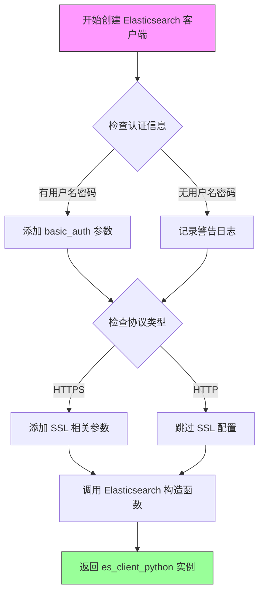

#### 带注释源码

```python
# 从 elasticsearch 库导入 BadRequestError 异常类和 Elasticsearch 客户端类
from elasticsearch import BadRequestError, Elasticsearch

# ... 在 ESKBService 类的 do_init 方法中 ...

# 构建连接信息字典
connection_info = dict(
    host=f"{self.scheme}://{self.IP}:{self.PORT}"  # 构建 ES 主机地址，如 "http://localhost:9200"
)

# 判断是否需要添加认证信息
if self.user != "" and self.password != "":
    # 添加 HTTP 基本认证凭据 (用户名, 密码) 元组
    connection_info.update(basic_auth=(self.user, self.password))
else:
    logger.warning("ES未配置用户名和密码")  # 记录警告日志

# 如果使用 HTTPS 协议
if self.scheme == "https":
    # 添加证书验证配置
    connection_info.update(verify_certs=self.verify_certs)
    
    # 如果提供了 CA 证书，添加到连接信息
    if self.ca_certs:
        connection_info.update(ca_certs=self.ca_certs)
    
    # 如果同时提供了客户端密钥和证书
    if self.client_key and self.client_cert:
        connection_info.update(client_key=self.client_key)
        connection_info.update(client_cert=self.client_cert)

# 创建 Elasticsearch 客户端实例（仅建立连接，不执行实际操作）
# 这里使用 Python 客户端直接连接，用于后续的索引管理和文档操作
self.es_client_python = Elasticsearch(**connection_info)

# 后续使用示例：
# 1. 创建索引
# self.es_client_python.indices.create(index=self.index_name, mappings=mappings)

# 2. 获取文档
# response = self.es_client_python.get(index=self.index_name, id=doc_id)

# 3. 删除文档
# self.es_client_python.delete(index=self.index_name, id=doc_id, refresh=True)

# 4. 搜索文档
# search_results = self.es_client_python.search(body=query, size=size)

# 5. 检查索引是否存在
# self.es_client_python.indices.exists(index=self.index_name)

# 6. 删除索引
# self.es_client_python.indices.delete(index=self.index_name)

# 7. 刷新索引
# self.es_client_python.indices.refresh(index=self.index_name)
```

#### 关键方法调用汇总

| 方法 | 用途 | 代码中的调用位置 |
|------|------|------------------|
| `indices.create()` | 创建索引 | `do_init` |
| `indices.exists()` | 检查索引是否存在 | `do_delete_doc`, `do_add_doc`, `do_clear_vs` |
| `indices.delete()` | 删除索引 | `do_clear_vs` |
| `indices.refresh()` | 刷新索引 | `del_doc_by_ids` |
| `get()` | 获取单个文档 | `get_doc_by_ids` |
| `delete()` | 删除单个文档 | `del_doc_by_ids`, `do_delete_doc` |
| `search()` | 搜索文档 | `do_delete_doc`, `do_add_doc` |

#### 技术债务与优化建议

1. **连接管理**：当前在 `do_init` 中创建连接，但没有实现连接池复用或长连接管理，高并发场景下性能可能受限。

2. **错误处理**：部分异常被捕获后仅记录日志并重新抛出，调用方难以精确判断错误类型。建议使用自定义异常类封装。

3. **硬编码参数**：超时时间 `timeout: 60` 被硬编码，应提取到配置文件中。

4. **批量操作**：`del_doc_by_ids` 和 `do_delete_doc` 使用循环逐个删除文档，ES 支持 `_bulk` API 批量操作，可显著提升性能。

5. **资源释放**：未实现 `__del__` 或上下文管理器来显式关闭客户端连接。


### ApproxRetrievalStrategy

ApproxRetrievalStrategy 是 langchain_community.vectorstores.elasticsearch 模块中提供的近似检索策略类，用于配置 Elasticsearch 向量存储的近似向量检索功能。该策略通过 Elasticsearch 的近似最近邻搜索能力实现高效的向量相似度查询，是处理大规模向量数据的推荐检索方式。

参数：无（使用默认构造方法）

返回值：`ApproxRetrievalStrategy` 实例，用于作为 ElasticsearchStore 的 strategy 参数

#### 流程图

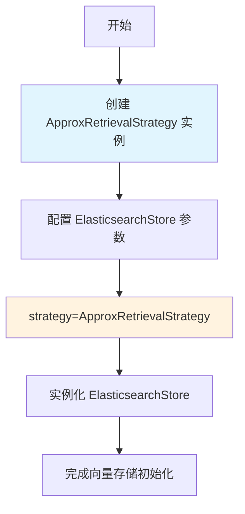

#### 带注释源码

```python
# ApproxRetrievalStrategy 导入 (来源: langchain_community.vectorstores.elasticsearch)
from langchain_community.vectorstores.elasticsearch import (
    ApproxRetrievalStrategy,
    ElasticsearchStore,
)

# 在 ESKBService.do_init 方法中的使用
params = dict(
    es_url=f"{self.scheme}://{self.IP}:{self.PORT}",
    index_name=self.index_name,
    query_field="context",
    vector_query_field="dense_vector",
    embedding=self.embeddings_model,
    strategy=ApproxRetrievalStrategy(),  # 使用近似检索策略
    es_params={
        "timeout": 60,
    },
)
# 继续配置其他参数...
self.db = ElasticsearchStore(**params)
```

#### 备注

由于 ApproxRetrievalStrategy 是外部库类，其完整源码实现位于 langchain_community 包中。上述内容基于代码中的使用方式整理。该策略通常支持以下可选参数（取决于具体版本）：

- **distance_strategy**：距离度量方式（如 "COSINE"、"DOT_PRODUCT"、"EUCLIDEAN_DISTANCE"）
- **model_id**：用于向量化的模型 ID
- **k**：返回的近似最近邻数量

具体参数建议参考 [langchain-community 官方文档](https://python.langchain.com/docs/integrations/vectorstores/elasticsearch/)。


### `ElasticsearchStore` - LangChain ES 向量存储

这是 `ESKBService` 类中使用 `ElasticsearchStore` 进行向量存储的核心逻辑，主要负责初始化 Elasticsearch 连接、创建索引、添加文档和搜索向量等操作。

#### 带注释源码

```python
# 初始化 langchain 的 ElasticsearchStore 向量数据库
# 用于存储和检索向量化的文档
params = dict(
    es_url=f"{self.scheme}://{self.IP}:{self.PORT}",  # Elasticsearch 连接地址
    index_name=self.index_name,                        # 索引名称
    query_field="context",                             # 查询时返回的文本字段
    vector_query_field="dense_vector",                 # 向量查询字段
    embedding=self.embeddings_model,                   # 嵌入模型
    strategy=ApproxRetrievalStrategy(),                # 近似检索策略
    es_params={
        "timeout": 60,                                 # 请求超时时间
    },
)

# 如果配置了用户名和密码，添加到参数中
if self.user != "" and self.password != "":
    params.update(es_user=self.user, es_password=self.password)

# 如果使用 HTTPS 协议，添加 SSL/TLS 相关的证书配置
if self.scheme == "https":
    params["es_params"].update(verify_certs=self.verify_certs)
    if self.ca_certs:
        params["es_params"].update(ca_certs=self.ca_certs)
    if self.client_key and self.client_cert:
        params["es_params"].update(client_key=self.client_key)
        params["es_params"].update(client_cert=self.client_cert)

# 创建 ElasticsearchStore 实例
self.db = ElasticsearchStore(**params)

# 确保索引存在，如果不存在则创建
self.db._create_index_if_not_exists(
    index_name=self.index_name, dims_length=self.dims_length
)
```

---

### `ESKBService.do_init` - 初始化 Elasticsearch 向量知识库服务

参数：

- `self`：隐式参数，ESKBService 实例本身

返回值：`None`，该方法仅执行初始化操作，不返回任何值

#### 流程图

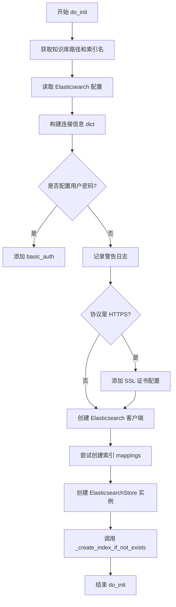

#### 带注释源码

```python
def do_init(self):
    """
    初始化 Elasticsearch 向量知识库服务
    - 设置知识库路径和索引名
    - 建立 Elasticsearch 连接
    - 创建向量索引
    - 初始化 LangChain ElasticsearchStore
    """
    # 1. 获取知识库路径和索引名称
    self.kb_path = self.get_kb_path(self.kb_name)
    self.index_name = os.path.split(self.kb_path)[-1]
    
    # 2. 从配置中读取 Elasticsearch 连接参数
    kb_config = Settings.kb_settings.kbs_config[self.vs_type()]
    self.scheme = kb_config.get("scheme", "http")
    self.IP = kb_config["host"]
    self.PORT = kb_config["port"]
    self.user = kb_config.get("user", "")
    self.password = kb_config.get("password", "")
    self.verify_certs = kb_config.get("verify_certs", True)
    self.ca_certs = kb_config.get("ca_certs", None)
    self.client_key = kb_config.get("client_key", None)
    self.client_cert = kb_config.get("client_cert", None)
    self.dims_length = kb_config.get("dims_length", None)
    
    # 3. 获取嵌入模型
    self.embeddings_model = get_Embeddings(self.embed_model)
    
    # 4. 构建 Elasticsearch 连接信息
    try:
        connection_info = dict(
            host=f"{self.scheme}://{self.IP}:{self.PORT}"
        )
        
        # 添加认证信息
        if self.user != "" and self.password != "":
            connection_info.update(basic_auth=(self.user, self.password))
        else:
            logger.warning("ES未配置用户名和密码")
        
        # 添加 HTTPS 相关配置
        if self.scheme == "https":
            connection_info.update(verify_certs=self.verify_certs)
            if self.ca_certs:
                connection_info.update(ca_certs=self.ca_certs)
            if self.client_key and self.client_cert:
                connection_info.update(client_key=self.client_key)
                connection_info.update(client_cert=self.client_cert)
        
        # 创建 Python ES 客户端（仅连接）
        self.es_client_python = Elasticsearch(**connection_info)
    except ConnectionError:
        logger.error("连接到 Elasticsearch 失败！")
        raise ConnectionError
    except Exception as e:
        logger.error(f"Error 发生 : {e}")
        raise e

    # 5. 尝试创建索引（使用 Python 客户端）
    try:
        mappings = {
            "properties": {
                "dense_vector": {
                    "type": "dense_vector",
                    "dims": self.dims_length,
                    "index": True,
                }
            }
        }
        self.es_client_python.indices.create(
            index=self.index_name, mappings=mappings
        )
    except BadRequestError as e:
        logger.error("创建索引失败,重新")
        logger.error(e)

    # 6. 创建 LangChain ElasticsearchStore 实例
    try:
        params = dict(
            es_url=f"{self.scheme}://{self.IP}:{self.PORT}",
            index_name=self.index_name,
            query_field="context",
            vector_query_field="dense_vector",
            embedding=self.embeddings_model,
            strategy=ApproxRetrievalStrategy(),
            es_params={
                "timeout": 60,
            },
        )
        if self.user != "" and self.password != "":
            params.update(es_user=self.user, es_password=self.password)
        if self.scheme == "https":
            params["es_params"].update(verify_certs=self.verify_certs)
            if self.ca_certs:
                params["es_params"].update(ca_certs=self.ca_certs)
            if self.client_key and self.client_cert:
                params["es_params"].update(client_key=self.client_key)
                params["es_params"].update(client_cert=self.client_cert)
        
        self.db = ElasticsearchStore(**params)
    except ConnectionError:
        logger.error("### 初始化 Elasticsearch 失败！")
        raise ConnectionError
    except Exception as e:
        logger.error(f"Error 发生 : {e}")
        raise e
    
    # 7. 确保索引存在（使用 LangChain 的方法）
    try:
        self.db._create_index_if_not_exists(
            index_name=self.index_name, dims_length=self.dims_length
        )
    except Exception as e:
        logger.error("创建索引失败...")
        logger.error(e)
```

---

### `ESKBService.do_search` - 向量相似性搜索

参数：

- `query`：`str`，用户查询文本
- `top_k`：`int`，返回最相似的 top_k 个结果
- `score_threshold`：`float`，相似度分数阈值

返回值：`List[Document]`，返回与查询向量最相似的文档列表

#### 流程图

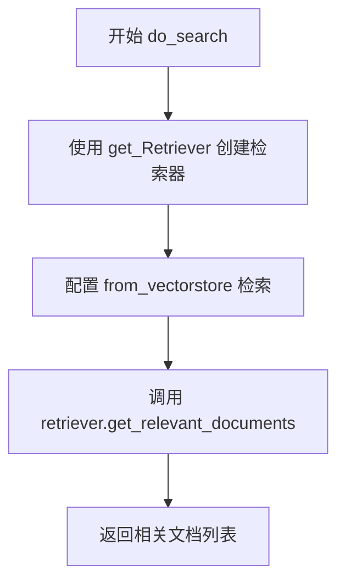

#### 带注释源码

```python
def do_search(self, query: str, top_k: int, score_threshold: float):
    """
    执行向量相似性检索
    
    Args:
        query: 用户查询文本
        top_k: 返回最相似的 top_k 个结果
        score_threshold: 相似度分数阈值
    
    Returns:
        List[Document]: 与查询向量最相似的文档列表
    """
    # 使用 LangChain 的 Retriever 进行向量检索
    # get_Retriever("vectorstore") 获取向量存储类型的检索器
    retriever = get_Retriever("vectorstore").from_vectorstore(
        self.db,                          # ElasticsearchStore 实例
        top_k=top_k,                      # 返回 top_k 个结果
        score_threshold=score_threshold,   # 相似度阈值
    )
    
    # 获取与查询相关的文档
    docs = retriever.get_relevant_documents(query)
    return docs
```

---

### `ESKBService.do_add_doc` - 向知识库添加文档

参数：

- `docs`：`List[Document]`，要添加的 LangChain Document 列表
- `**kwargs`：其他可选参数

返回值：`List[dict]`，返回添加的文档 ID 和元数据信息列表，格式为 `[{"id": str, "metadata": dict}, ...]`

#### 流程图

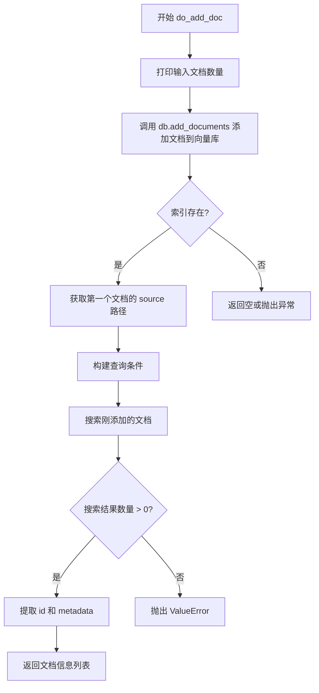

#### 带注释源码

```python
def do_add_doc(self, docs: List[Document], **kwargs):
    """
    向知识库添加文件
    
    Args:
        docs: LangChain Document 对象列表
        **kwargs: 其他可选参数
    
    Returns:
        List[dict]: 添加的文档信息列表，格式为
                   [{"id": str, "metadata": dict}, ...]
    """
    # 打印日志：显示输入的文档数量
    print(
        f"server.knowledge_base.kb_service.es_kb_service.do_add_doc 输入的docs参数长度为:{len(docs)}"
    )
    print("*" * 100)

    # 使用 LangChain ElasticsearchStore 添加文档到向量数据库
    self.db.add_documents(documents=docs)
    
    # 打印成功日志
    print("写入数据成功.")
    print("*" * 100)

    # 验证文档是否成功添加
    if self.es_client_python.indices.exists(index=self.index_name):
        # 获取第一个文档的源文件路径
        file_path = docs[0].metadata.get("source")
        
        # 构建查询条件：查找刚添加的文档
        query = {
            "query": {
                "term": {"metadata.source.keyword": file_path},
                "term": {"_index": self.index_name},
            }
        }
        
        # 注意设置size，默认返回10个。
        search_results = self.es_client_python.search(body=query, size=50)
        
        if len(search_results["hits"]["hits"]) == 0:
            raise ValueError("召回元素个数为0")
        
        # 提取文档 ID 和元数据
        info_docs = [
            {"id": hit["_id"], "metadata": hit["_source"]["metadata"]}
            for hit in search_results["hits"]["hits"]
        ]
        return info_docs
```

---

### `ESKBService.do_delete_doc` - 从知识库删除文档

参数：

- `kb_file`：`KBFile`，知识库文件对象
- `**kwargs`：其他可选参数

返回值：`None`，该方法执行删除操作，不返回任何值

#### 流程图

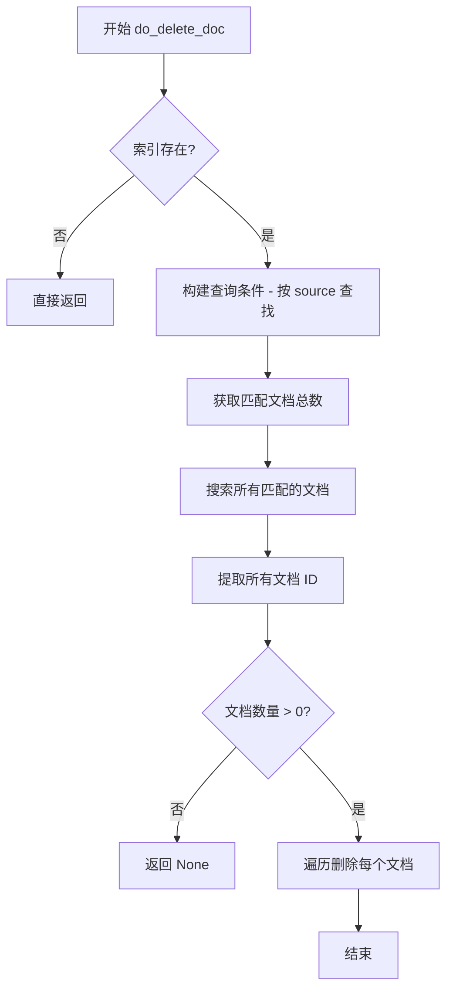

#### 带注释源码

```python
def do_delete_doc(self, kb_file, **kwargs):
    """
    从知识库删除指定文件的向量数据
    
    Args:
        kb_file: 知识库文件对象
        **kwargs: 其他可选参数
    
    Returns:
        None: 执行删除操作，无返回值
    """
    # 检查索引是否存在
    if self.es_client_python.indices.exists(index=self.index_name):
        # 构建查询条件：按源文件路径查找
        query = {
            "query": {
                "term": {
                    "metadata.source.keyword": self.get_relative_source_path(
                        kb_file.filepath
                    )
                }
            },
            "track_total_hits": True,
        }
        
        # 获取匹配文档的总数
        size = self.es_client_python.search(body=query)["hits"]["total"]["value"]
        
        # 注意设置size，默认返回10个，es检索设置track_total_hits为True返回数据库中真实的size。
        search_results = self.es_client_python.search(body=query, size=size)
        
        # 提取所有匹配的文档 ID
        delete_list = [hit["_id"] for hit in search_results["hits"]["hits"]]
        
        if len(delete_list) == 0:
            return None
        else:
            # 遍历删除每个文档
            for doc_id in delete_list:
                try:
                    self.es_client_python.delete(
                        index=self.index_name, id=doc_id, refresh=True
                    )
                except Exception as e:
                    logger.error(f"ES Docs Delete Error! {e}")
```

---

### 关键组件信息

| 组件名称 | 一句话描述 |
|---------|-----------|
| `ElasticsearchStore` | LangChain 提供的 Elasticsearch 向量存储客户端，用于存储和检索向量化的文档 |
| `ApproxRetrievalStrategy` | Elasticsearch 近似向量检索策略，用于高效的大规模向量相似性搜索 |
| `es_client_python` | Elasticsearch Python 官方客户端，用于执行底层索引管理和文档操作 |
| `embeddings_model` | 嵌入模型，用于将文本转换为向量表示 |
| `dense_vector` | Elasticsearch 中的密集向量字段类型，用于存储文档的向量表示 |

---

### 潜在的技术债务或优化空间

1. **异常处理不完整**：`do_add_doc` 方法中如果索引不存在，会隐式返回 `None`，可能导致调用方难以判断操作是否成功
2. **硬编码的 size 参数**：搜索时使用硬编码的 `size=50`，应该根据实际情况动态设置或使用分页
3. **重复的连接配置代码**：ES 连接配置在多处重复，可以提取为独立方法或配置类
4. **缺少重试机制**：对于网络不稳定的场景，缺少重试逻辑
5. **文档 ID 获取方式低效**：`do_add_doc` 中通过再次搜索来获取文档 ID，建议使用 `add_documents` 的返回值
6. **日志级别使用不当**：部分地方使用 `print` 而非日志框架，影响生产环境可观测性
7. **SSL 证书验证配置不完善**：缺少客户端私钥密码（`client_key_password`）的支持


### `ESKBService.do_init()`

该方法负责初始化Elasticsearch连接、创建向量索引，并建立与LangChain的集成。它从配置中读取连接参数，建立ES客户端连接，创建密集向量索引，最后通过LangChain的ElasticsearchStore完成向量数据库的初始化。

参数： 无（该方法为实例方法，不接受外部参数）

返回值：`None`，该方法不返回任何值，仅通过异常处理机制报告错误

#### 流程图

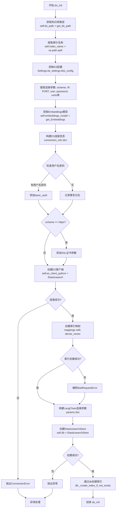

#### 带注释源码

```python
def do_init(self):
    """
    初始化Elasticsearch连接和索引
    1. 获取知识库路径和索引名称
    2. 从配置中读取ES连接参数
    3. 建立ES Python客户端连接
    4. 创建向量索引
    5. 建立LangChain ElasticsearchStore连接
    """
    # ========== 步骤1: 获取知识库路径和索引名称 ==========
    # 根据知识库名称获取完整的文件系统路径
    self.kb_path = self.get_kb_path(self.kb_name)
    # 从路径中提取索引名称（取最后一段路径作为索引名）
    self.index_name = os.path.split(self.kb_path)[-1]
    
    # ========== 步骤2: 从配置中读取ES连接参数 ==========
    # 获取对应向量存储类型的配置（ES类型）
    kb_config = Settings.kb_settings.kbs_config[self.vs_type()]
    # 协议方案：http或https
    self.scheme = kb_config.get("scheme", "http")
    # ES服务器IP地址
    self.IP = kb_config["host"]
    # ES服务器端口
    self.PORT = kb_config["port"]
    # 用户名（可选）
    self.user = kb_config.get("user", "")
    # 密码（可选）
    self.password = kb_config.get("password", "")
    # 是否验证SSL证书（默认True）
    self.verify_certs = kb_config.get("verify_certs", True)
    # CA证书路径（可选）
    self.ca_certs = kb_config.get("ca_certs", None)
    # 客户端私钥路径（可选）
    self.client_key = kb_config.get("client_key", None)
    # 客户端证书路径（可选）
    self.client_cert = kb_config.get("client_cert", None)
    # 向量维度长度（可选，用于dense_vector字段）
    self.dims_length = kb_config.get("dims_length", None)
    # 初始化嵌入模型（用于向量化和相似度搜索）
    self.embeddings_model = get_Embeddings(self.embed_model)
    
    # ========== 步骤3: 建立ES Python客户端连接 ==========
    try:
        # 构建ES连接主机地址
        connection_info = dict(
            host=f"{self.scheme}://{self.IP}:{self.PORT}"
        )
        # 如果配置了用户名和密码，添加基本认证
        if self.user != "" and self.password != "":
            connection_info.update(basic_auth=(self.user, self.password))
        else:
            logger.warning("ES未配置用户名和密码")
        
        # 如果使用HTTPS协议，添加SSL相关参数
        if self.scheme == "https":
            connection_info.update(verify_certs=self.verify_certs)
            if self.ca_certs:
                connection_info.update(ca_certs=self.ca_certs)
            if self.client_key and self.client_cert:
                connection_info.update(client_key=self.client_key)
                connection_info.update(client_cert=self.client_cert)
        
        # 使用Elasticsearch Python客户端建立连接（仅连接，不操作）
        self.es_client_python = Elasticsearch(**connection_info)
    except ConnectionError:
        logger.error("连接到 Elasticsearch 失败！")
        raise ConnectionError
    except Exception as e:
        logger.error(f"Error 发生 : {e}")
        raise e
    
    # ========== 步骤4: 通过ES客户端创建向量索引 ==========
    try:
        # 定义索引映射，包含dense_vector向量字段
        mappings = {
            "properties": {
                "dense_vector": {
                    "type": "dense_vector",
                    "dims": self.dims_length,  # 向量维度
                    "index": True,  # 启用向量索引
                }
            }
        }
        # 尝试创建索引（如果已存在会抛出异常）
        self.es_client_python.indices.create(
            index=self.index_name, mappings=mappings
        )
    except BadRequestError as e:
        # 索引可能已存在，记录错误但继续执行
        logger.error("创建索引失败,重新")
        logger.error(e)
    
    # ========== 步骤5: 建立LangChain ElasticsearchStore连接 ==========
    try:
        # 构建LangChain连接参数
        params = dict(
            es_url=f"{self.scheme}://{self.IP}:{self.PORT}",
            index_name=self.index_name,
            query_field="context",  # 文本查询字段
            vector_query_field="dense_vector",  # 向量查询字段
            embedding=self.embeddings_model,  # 嵌入模型
            strategy=ApproxRetrievalStrategy(),  # 近似检索策略
            es_params={
                "timeout": 60,  # 超时时间60秒
            },
        )
        
        # 添加认证信息
        if self.user != "" and self.password != "":
            params.update(es_user=self.user, es_password=self.password)
        
        # 添加HTTPS相关参数
        if self.scheme == "https":
            params["es_params"].update(verify_certs=self.verify_certs)
            if self.ca_certs:
                params["es_params"].update(ca_certs=self.ca_certs)
            if self.client_key and self.client_cert:
                params["es_params"].update(client_key=self.client_key)
                params["es_params"].update(client_cert=self.client_cert)
        
        # 创建ElasticsearchStore实例（LangChain封装的向量数据库）
        self.db = ElasticsearchStore(**params)
    except ConnectionError:
        logger.error("### 初始化 Elasticsearch 失败！")
        raise ConnectionError
    except Exception as e:
        logger.error(f"Error 发生 : {e}")
        raise e
    
    # ========== 步骤6: 通过LangChain确保索引存在 ==========
    try:
        # 尝试通过db_init创建索引（确保索引存在）
        self.db._create_index_if_not_exists(
            index_name=self.index_name, dims_length=self.dims_length
        )
    except Exception as e:
        # 记录错误但不完全中断（静默失败）
        logger.error("创建索引失败...")
        logger.error(e)
        # raise e  # 已注释，不会抛出异常
```


### `ESKBService.get_kb_path`

获取知识库的路径（静态方法），通过拼接系统配置的基础路径与知识库名称，返回完整的知识库目录路径。

参数：

- `knowledge_base_name`：`str`，知识库的名称，用于标识需要获取路径的具体知识库

返回值：`str`，返回拼接后的完整知识库路径，格式为 `{KB_ROOT_PATH}/{knowledge_base_name}`

#### 流程图

```mermaid
flowchart TD
    A[开始] --> B[输入: knowledge_base_name]
    B --> C[获取系统配置的基础路径: Settings.basic_settings.KB_ROOT_PATH]
    C --> D[使用 os.path.join 拼接路径]
    D --> E[返回完整知识库路径]
    E --> F[结束]
```

#### 带注释源码

```python
@staticmethod
def get_kb_path(knowledge_base_name: str):
    """
    获取指定知识库的路径
    
    参数:
        knowledge_base_name: 知识库的名称
        
    返回:
        知识库的完整路径，由基础路径和知识库名称拼接而成
    """
    # 使用 os.path.join 将基础路径 KB_ROOT_PATH 与知识库名称拼接
    # Settings.basic_settings.KB_ROOT_PATH 是系统配置的知识库根目录
    return os.path.join(Settings.basic_settings.KB_ROOT_PATH, knowledge_base_name)
```


### `ESKBService.get_vs_path`

获取向量存储的路径（静态方法）。该方法通过调用 `get_kb_path` 获取知识库根路径，然后拼接 `vector_store` 子目录，返回完整的向量存储目录路径。

参数：

- `knowledge_base_name`：`str`，知识库的名称，用于定位具体的知识库目录

返回值：`str`，返回知识库对应的向量存储目录的完整路径

#### 流程图

```mermaid
flowchart TD
    A[开始 get_vs_path] --> B[输入: knowledge_base_name]
    B --> C[调用 ESKBService.get_kb_path 获取知识库根路径]
    C --> D[拼接 'vector_store' 子目录]
    D --> E[返回完整向量存储路径]
    E --> F[结束]
```

#### 带注释源码

```python
@staticmethod
def get_vs_path(knowledge_base_name: str):
    """
    获取向量存储路径的静态方法
    
    该方法首先调用 get_kb_path 获取知识库的根目录路径，
    然后在该路径下拼接 'vector_store' 子目录，返回完整的
    向量存储目录路径。
    
    Args:
        knowledge_base_name: str - 知识库的名称
        
    Returns:
        str - 知识库对应的向量存储目录的完整路径
    """
    # 调用同类的静态方法 get_kb_path 获取知识库根目录
    # 然后与 'vector_store' 子目录拼接，形成最终路径
    return os.path.join(
        ESKBService.get_kb_path(knowledge_base_name), "vector_store"
    )
```


### ESKBService.do_create_kb

创建 Elasticsearch 知识库的核心方法，用于在 Elasticsearch 索引中创建新的知识库，目前为待实现状态。

参数：

- `self`：`ESKBService` 实例，当前知识库服务对象，包含知识库名称、索引名、连接配置等信息

返回值：`None`，该方法目前未实现（待开发）

#### 流程图

```mermaid
flowchart TD
    A[开始 do_create_kb] --> B{实现状态}
    B -->|已实现| C[创建知识库逻辑]
    B -->|未实现| D[返回空实现]
    C --> E[结束]
    D --> E
```

#### 带注释源码

```python
def do_create_kb(self):
    """
    创建知识库
    该方法用于在 Elasticsearch 中创建新的知识库索引
    目前为待实现状态（pass）
    """
    ...  # 待实现：创建知识库的逻辑实现
```


### `ESKBService.vs_type`

该方法返回当前知识库服务所使用的向量存储类型标识，用于标识该服务使用 Elasticsearch 作为向量存储后端。

参数：

- （无参数，隐含 `self` 为类实例自身）

返回值：`str`，返回向量存储类型标识，此处为 `"ES"`（Elasticsearch）

#### 流程图

```mermaid
flowchart TD
    A[开始 vs_type 方法] --> B{self 实例}
    B --> C[返回 SupportedVSType.ES 枚举值]
    C --> D[结束]
    
    style A fill:#f9f,color:#000
    style D fill:#9f9,color:#000
```

#### 带注释源码

```python
def vs_type(self) -> str:
    """
    返回向量存储类型标识。
    
    该方法用于标识当前知识库服务所使用的向量存储后端类型。
    在 ESKBService 类中，固定返回 SupportedVSType.ES 枚举值，
    表示该服务基于 Elasticsearch 实现向量存储功能。
    
    Returns:
        str: 向量存储类型标识，值为 "ES"（Elasticsearch）
    """
    return SupportedVSType.ES
```


### `ESKBService.do_search`

该方法用于在基于 Elasticsearch 的知识库中执行向量语义检索。它接收用户的查询文本、返回数量限制和相似度阈值，调用 LangChain 的检索器接口从向量数据库中获取最匹配的知识文档并返回。

参数：

- `query`：`str`，用户输入的查询文本，用于计算向量相似度。
- `top_k`：`int`，希望返回的最相似的文档数量。
- `score_threshold`：`float`，文档相似度分数的最低阈值，低于该值的文档将被过滤掉。

返回值：`List[Document]`，返回与查询向量最相似的文档列表（包含页面内容和元数据）。

#### 流程图

```mermaid
graph TD
    A([开始 do_search]) --> B[获取检索器 Retriever 实例]
    B --> C{从向量存储构建检索器}
    C --> D[设置 top_k 参数]
    C --> E[设置 score_threshold 参数]
    D --> F[调用 retriever.get_relevant_documents]
    E --> F
    F --> G[获取相似文档列表]
    G --> H([返回 docs 列表])
```

#### 带注释源码

```python
def do_search(self, query: str, top_k: int, score_threshold: float):
    # 文本相似性检索
    # 1. 获取检索器。这里通过工厂函数获取一个针对 vectorstore 的检索器构造器。
    #    随后立即调用 from_vectorstore 方法，将当前的 Elasticsearch 向量库 (self.db) 
    #    作为数据源传入，并配置搜索策略。
    retriever = get_Retriever("vectorstore").from_vectorstore(
        self.db,                       # 初始化好的 ElasticsearchStore 实例 (向量库)
        top_k=top_k,                   # 指定返回最相似的 top_k 个结果
        score_threshold=score_threshold, # 设置相似度阈值，过滤掉低分文档
    )
    
    # 2. 执行实际搜索。调用检索器的 get_relevant_documents 方法，
    #    该方法会先对 query 进行向量化，然后在向量库中进行近似最近邻搜索 (ANN)。
    docs = retriever.get_relevant_documents(query)
    
    # 3. 返回结果。返回类型为 langchain.schema.Document 的列表。
    return docs
```


### `ESKBService.get_doc_by_ids`

根据给定的文档ID列表，从Elasticsearch知识库中批量检索对应的文档，并返回LangChain的Document对象列表。

参数：

- `ids`：`List[str]`，文档唯一标识符列表，用于指定需要检索的文档

返回值：`List[Document]`，返回从Elasticsearch中检索到的文档列表，每个Document对象包含page_content（文档内容）和metadata（元数据）字段

#### 流程图

```mermaid
flowchart TD
    A[开始 get_doc_by_ids] --> B[初始化空结果列表 results]
    B --> C{遍历 ids 列表}
    C -->|遍历每个 doc_id| D[调用 ES 客户端获取文档]
    D --> E{获取成功?}
    E -->|是| F[从响应中提取 _source]
    E -->|否| G[记录错误日志]
    G --> C
    F --> H[提取 context 字段作为文本内容]
    H --> I[提取 metadata 字段]
    I --> J[创建 Document 对象]
    J --> K[添加到 results 列表]
    K --> C
    C -->|遍历完成| L[返回 results 列表]
    L --> M[结束]
```

#### 带注释源码

```python
def get_doc_by_ids(self, ids: List[str]) -> List[Document]:
    """
    根据文档ID列表从Elasticsearch中检索文档
    
    参数:
        ids: 文档唯一标识符列表
        
    返回:
        包含检索到的文档的Document对象列表
    """
    # 初始化结果列表，用于存储检索到的文档
    results = []
    
    # 遍历每个文档ID进行检索
    for doc_id in ids:
        try:
            # 使用Elasticsearch客户端根据ID获取文档
            # index: 索引名称
            # id: 文档ID
            response = self.es_client_python.get(index=self.index_name, id=doc_id)
            
            # 从响应中提取文档源数据
            source = response["_source"]
            
            # 从源数据中提取文档内容，默认为空字符串
            # 假设文档包含"context"字段存储文本内容
            text = source.get("context", "")
            
            # 从源数据中提取元数据，默认为空字典
            # metadata可能包含来源文件路径、创建时间等信息
            metadata = source.get("metadata", {})
            
            # 创建LangChain Document对象并添加到结果列表
            # page_content: 文档的文本内容
            # metadata: 文档的元数据信息
            results.append(Document(page_content=text, metadata=metadata))
        except Exception as e:
            # 捕获异常并记录错误日志，但继续处理下一个ID
            # 这样部分文档检索失败不会导致整个方法失败
            logger.error(f"Error retrieving document from Elasticsearch! {e}")
    
    # 返回检索到的所有文档
    return results
```


### `ESKBService.del_doc_by_ids`

该方法接收一个文档ID列表，遍历列表中的每个ID，通过Elasticsearch客户端从索引中删除对应的文档。如果删除过程中出现错误，会记录错误日志但不会中断执行，最终方法结束。

参数：

- `ids`：`List[str]`，需要删除的文档ID列表

返回值：`bool`，方法声明返回bool类型，但实际实现中并未显式返回任何值（实际返回None），这与声明的返回类型不符，存在潜在的技术债务。

#### 流程图

```mermaid
flowchart TD
    A[开始 del_doc_by_ids] --> B[遍历 ids 列表]
    B --> C{还有更多 doc_id?}
    C -->|是| D[获取当前 doc_id]
    D --> E[调用 ES 客户端删除文档]
    E --> F{删除成功?}
    F -->|是| G[继续下一个 doc_id]
    F -->|否| H[记录错误日志]
    H --> G
    G --> C
    C -->|否| I[方法结束]
```

#### 带注释源码

```python
def del_doc_by_ids(self, ids: List[str]) -> bool:
    """
    根据ID列表删除文档
    
    参数:
        ids: 需要删除的文档ID列表
        
    返回:
        bool: 声明返回bool类型，但实际未返回任何值
    """
    # 遍历传入的文档ID列表
    for doc_id in ids:
        try:
            # 调用Elasticsearch Python客户端的delete方法删除文档
            # index: 索引名称
            # id: 文档ID
            # refresh=True: 立即刷新索引，使删除操作立即可见
            self.es_client_python.delete(
                index=self.index_name, id=doc_id, refresh=True
            )
        except Exception as e:
            # 捕获异常并记录错误日志，但不会中断其他文档的删除操作
            logger.error(f"ES Docs Delete Error! {e}")
    
    # 注意：方法声明返回bool类型，但实际没有return语句
    # 实际返回的是None，这与接口契约不一致
```


### `ESKBService.do_delete_doc`

该方法用于从 Elasticsearch 向量知识库中删除指定文档，通过文件路径查询匹配的文档记录并逐一从索引中删除。

参数：

- `kb_file`：`KnowledgeFile`，需要删除的文档文件对象，包含文件路径等信息
- `**kwargs`：`dict`，可变关键字参数，用于扩展额外参数

返回值：`None`，无返回值（方法执行完成后直接返回）

#### 流程图

```mermaid
flowchart TD
    A[开始删除文档] --> B{检查索引是否存在}
    B -->|不存在| C[直接返回]
    B -->|存在| D[构建ES查询条件]
    D --> E[查询匹配文档数量]
    E --> F[根据数量查询所有匹配的文档ID]
    F --> G{删除列表是否为空}
    G -->|为空| H[返回None]
    G -->|不为空| I[遍历删除列表]
    I --> J[逐个删除文档]
    J --> K{是否还有更多文档}
    K -->|是| I
    K -->|否| L[结束]
```

#### 带注释源码

```python
def do_delete_doc(self, kb_file, **kwargs):
    """
    从Elasticsearch向量数据库中删除指定文档
    
    参数:
        kb_file: KnowledgeFile对象,包含需要删除文件的路径信息
        **kwargs: 额外关键字参数
    """
    # 检查索引是否存在,避免操作不存在的索引
    if self.es_client_python.indices.exists(index=self.index_name):
        # 构建查询条件,通过metadata.source.keyword字段匹配文件路径
        # 使用get_relative_source_path获取相对路径
        query = {
            "query": {
                "term": {
                    "metadata.source.keyword": self.get_relative_source_path(
                        kb_file.filepath
                    )
                }
            },
            "track_total_hits": True,  # 获取真实匹配的文档总数
        }
        # 注意:默认ES搜索只返回10条结果,设置track_total_hits为True可获取真实匹配数量
        size = self.es_client_python.search(body=query)["hits"]["total"]["value"]
        # 执行搜索获取所有匹配的文档ID
        search_results = self.es_client_python.search(body=query, size=size)
        # 提取所有匹配的文档ID到删除列表
        delete_list = [hit["_id"] for hit in search_results["hits"]["hits"]]
        
        # 如果没有匹配文档,直接返回None
        if len(delete_list) == 0:
            return None
        else:
            # 遍历删除列表,逐个从ES索引中删除文档
            for doc_id in delete_list:
                try:
                    self.es_client_python.delete(
                        index=self.index_name, id=doc_id, refresh=True
                    )
                except Exception as e:
                    # 记录删除失败错误日志
                    logger.error(f"ES Docs Delete Error! {e}")
```


### `ESKBService.do_add_doc`

向知识库添加文档的方法，通过 Elasticsearch 向量存储将文档添加到知识库，并返回添加的文档信息列表。

参数：

- `docs`：`List[Document]` - 要添加的文档列表，LangChain的Document对象列表
- `**kwargs`：其他可选参数

返回值：`List[Dict[str, Any]]` - 返回添加成功的文档信息列表，格式为 `[{"id": str, "metadata": dict}, ...]`

#### 流程图

```mermaid
flowchart TD
    A[开始 do_add_doc] --> B[打印输入docs参数长度]
    B --> C{检查docs是否为空}
    C -->|否| D[调用 self.db.add_documents 添加文档到向量存储]
    C -->|是| E[返回空列表或处理空文档]
    D --> F[打印写入数据成功]
    F --> G{检查索引是否存在}
    G -->|否| H[抛出ValueError]
    G -->|是| I[获取第一个文档的source路径]
    I --> J[构建ES查询条件 - 按metadata.source.keyword和_index查询]
    J --> K[执行ES搜索, size=50]
    K --> L{检查搜索结果是否为空}
    L -->|是| M[抛出ValueError: 召回元素个数为0]
    L -->|否| N[遍历搜索结果，提取id和metadata]
    N --> O[返回info_docs列表]
    M --> P[异常处理]
    
    style A fill:#f9f,color:#333
    style O fill:#9f9,color:#333
    style H fill:#f99,color:#333
    style M fill:#f99,color:#333
```

#### 带注释源码

```python
def do_add_doc(self, docs: List[Document], **kwargs):
    """向知识库添加文件"""

    # 打印输入的docs参数长度，用于调试和日志记录
    print(
        f"server.knowledge_base.kb_service.es_kb_service.do_add_doc 输入的docs参数长度为:{len(docs)}"
    )
    print("*" * 100)

    # 使用langchain的ElasticsearchStore添加文档到向量数据库
    # self.db 是 ElasticsearchStore 实例，负责向量嵌入和存储
    self.db.add_documents(documents=docs)
    
    # 获取 id 和 source , 格式：[{"id": str, "metadata": dict}, ...]
    # 注意：此步骤通过ES查询获取刚插入的文档信息，而非直接返回添加结果
    print("写入数据成功.")
    print("*" * 100)

    # 检查Elasticsearch索引是否存在
    if self.es_client_python.indices.exists(index=self.index_name):
        # 从第一个文档的metadata中获取源文件路径
        file_path = docs[0].metadata.get("source")
        
        # 构建ES查询条件：
        # 1. term查询metadata.source.keyword - 精确匹配源文件路径
        # 2. term查询_index - 确保在当前索引中查询
        query = {
            "query": {
                "term": {"metadata.source.keyword": file_path},
                "term": {"_index": self.index_name},
            }
        }
        
        # 注意设置size，默认返回10个，查询时设置size=50获取更多结果
        search_results = self.es_client_python.search(body=query, size=50)
        
        # 如果召回元素个数为0，抛出ValueError异常
        if len(search_results["hits"]["hits"]) == 0:
            raise ValueError("召回元素个数为0")
        
        # 遍历搜索结果，提取每个文档的id和metadata
        # 构建返回格式：[{"id": str, "metadata": dict}, ...]
        info_docs = [
            {"id": hit["_id"], "metadata": hit["_source"]["metadata"]}
            for hit in search_results["hits"]["hits"]
        ]
        return info_docs
```


### `ESKBService.do_clear_vs`

从知识库删除全部向量数据，清空Elasticsearch中的向量存储索引。

参数： 无

返回值： `None`，无返回值，仅执行删除操作

#### 流程图

```mermaid
flowchart TD
    A[开始 do_clear_vs] --> B{检查索引是否存在}
    B -->|存在| C[删除索引 kb_name]
    B -->|不存在| D[结束]
    C --> D
```

#### 带注释源码

```python
def do_clear_vs(self):
    """从知识库删除全部向量"""
    # 检查Elasticsearch中是否存在名为self.kb_name的索引
    if self.es_client_python.indices.exists(index=self.kb_name):
        # 如果索引存在，则删除该索引（包含所有向量数据）
        self.es_client_python.indices.delete(index=self.kb_name)
```


### `ESKBService.do_drop_kb`

删除知识库，移除存储在磁盘上的知识库文件夹及其所有内容。

参数： 无（仅包含 `self` 参数）

返回值：`None`，该方法无返回值，执行完成后直接结束

#### 流程图

```mermaid
flowchart TD
    A[开始 do_drop_kb] --> B{检查知识库路径是否存在}
    B -->|是| C[使用 shutil.rmtree 删除整个目录]
    B -->|否| D[直接结束]
    C --> E[结束]
    D --> E
```

#### 带注释源码

```python
def do_drop_kb(self):
    """删除知识库"""
    # self.kb_file: 知识库路径
    # 检查知识库目录是否存在于文件系统
    if os.path.exists(self.kb_path):
        # 使用 shutil.rmtree 递归删除整个目录树
        # 这将删除 kb_path 目录及其所有子目录和文件
        shutil.rmtree(self.kb_path)
```

## 关键组件


### Elasticsearch连接与索引初始化

负责建立与Elasticsearch的连接，根据配置创建索引和映射，初始化langchain的ElasticsearchStore客户端

### 文本相似性检索

通过向量存储和检索器实现基于文本的相似性搜索，支持top_k和score_threshold过滤

### 文档添加服务

将文档列表批量添加到Elasticsearch知识库，并返回文档ID和元数据信息

### 文档删除服务

支持按文件路径或文档ID删除知识库中的向量文档，同时处理索引刷新

### 知识库全量清除

删除指定知识库的所有向量数据，可通过索引名或知识库名称执行

### 文档ID查询

根据文档ID列表从Elasticsearch检索完整文档内容，包含文本和元数据

### 知识库路径管理

提供知识库和向量存储的路径生成方法，基于系统配置的知识库根路径


## 问题及建议


### 已知问题

-   **异常处理不一致**：`do_init`方法中捕获`ConnectionError`后打印日志又重新抛出，导致错误日志重复；`get_doc_by_ids`和`del_doc_by_ids`中捕获异常后仅记录日志，未返回错误状态或中断执行
-   **索引名称混用**：`do_clear_vs`方法使用`self.kb_name`删除索引，而其他地方均使用`self.index_name`，可能导致删除错误的索引
-   **冗余的搜索操作**：`do_add_doc`方法在添加文档后再次执行search来获取文档ID，这是额外的网络开销和不必要的延迟
-   **低效的批量删除**：`do_delete_doc`方法先执行search查询再逐个delete，没有使用ES的bulk API一次性完成，效率低下
-   **空实现方法**：`do_create_kb`方法仅有`...`，没有实现但被调用时不会报错，可能导致预期外的行为
-   **硬编码值**：搜索结果数量`size=50`、超时时间`timeout=60`等参数硬编码，缺乏配置化和灵活性
-   **字符串判断不Pythonic**：使用`if self.user != "" and self.password != ""`而非`if self.user and self.password`
-   **资源未释放**：ES客户端`self.es_client_python`没有提供显式的关闭方法，长时间运行可能导致连接泄漏

### 优化建议

-   **统一异常处理策略**：在关键方法中捕获异常后应抛出或返回明确的错误状态，让调用方知道操作失败
-   **修复索引名称Bug**：将`do_clear_vs`中的`self.kb_name`改为`self.index_name`以确保操作正确的索引
-   **消除冗余搜索**：添加文档后可直接从返回结果中获取ID，或使用ES的bulk API获取生成的ID，避免二次查询
-   **使用Bulk API**：删除多个文档时使用`bulk`操作替代循环单个delete，显著提升性能
-   **实现do_create_kb**：根据实际需求填充方法实现，或在基类中定义明确的行为
-   **配置化参数**：将超时、搜索大小等参数提取到Settings配置中，便于调整
-   **改进字符串判断**：使用`if self.user and self.password`简化逻辑
-   **添加连接池管理**：考虑使用ES客户端的连接池配置，并提供close方法或使用上下文管理器
-   **添加重试机制**：对ES操作添加重试逻辑，处理临时网络抖动

## 其它


### 设计目标与约束

本模块旨在提供基于Elasticsearch的知识库向量存储与检索服务，支持文档的添加、删除、查询及知识库管理功能。设计目标包括：1) 实现与Elasticsearch的高效集成；2) 支持向量相似度检索；3) 提供统一的知识库操作接口。约束条件包括：依赖Elasticsearch 8.x版本、必须配置有效的embedding模型、需保证网络连通性。

### 错误处理与异常设计

代码中存在多处异常处理，但设计不够完善。主要异常处理包括：1) 连接Elasticsearch时的ConnectionError捕获；2) 创建索引时的BadRequestError捕获；3) 文档操作时的通用Exception捕获。存在的问题：部分异常捕获后直接raise e导致程序中断，而do_add_doc中异常被吞掉仅打印日志；建议建立统一的异常层次结构，区分可恢复与不可恢复错误，并提供具体的错误码和错误信息。

### 数据流与状态机

数据流主要包括：1) 文档添加流程：输入Document列表 → 通过ElasticsearchStore.add_documents写入 → 查询并返回文档元信息；2) 文档删除流程：按metadata.source.keyword匹配 → 批量查询 → 逐个删除；3) 搜索流程：构建Retriever → 设置score_threshold → 执行向量相似度检索。状态转换依赖于Elasticsearch索引的存在状态，当前未实现显式的状态机管理。

### 外部依赖与接口契约

主要外部依赖包括：1) elasticsearch客户端库；2) langchain_community.vectorstores.elasticsearch；3) langchain.schema.Document；4) chatchat内部模块(Settings、KBService、get_Retriever、get_Embeddings等)。接口契约方面：do_add_doc接收List[Document]返回List[dict]包含id和metadata；do_search返回List[Document]；del_doc_by_ids和get_doc_by_ids操作粒度为文档ID级别。

### 性能考虑与优化空间

当前实现存在以下性能瓶颈：1) do_delete_doc中使用term查询配合循环删除，效率较低，建议使用bulk API批量删除；2) do_add_doc中写入后再次查询获取元信息，增加了不必要的IO操作；3) get_doc_by_ids使用for循环逐个查询，应改用mget批量获取；4) 未实现连接池复用，每次操作可能创建新连接。建议引入批量操作API、连接池管理、异步处理机制。

### 安全性考虑

代码涉及敏感信息包括：Elasticsearch连接的用户名密码、客户端证书密钥。安全风险：1) 密码等凭据明文存储在配置中；2) 未对输入参数进行严格校验(如kb_name、ids)；3) 未实现访问控制。建议：1) 使用环境变量或密钥管理服务存储凭据；2) 对用户输入进行白名单校验；3) 启用Elasticsearch安全特性(X-Pack或Search Guard)。

### 配置管理

当前配置通过Settings.kb_settings.kbs_config获取，包含：scheme、host、port、user、password、verify_certs、ca_certs、client_key、client_cert、dims_length等。配置管理存在的问题：1) 部分配置项使用.get()提供默认值，可能导致类型不一致；2) dims_length未做有效性和范围校验；3) 缺少配置变更的热重载机制。建议增加配置Schema定义和运行时校验。

### 资源管理与生命周期

资源管理方面：1) Elasticsearch连接(self.es_client_python)在初始化时创建，但未提供显式的close或cleanup方法；2) ElasticsearchStore实例(self.db)同样缺乏资源释放逻辑；3) embeddings_model可能涉及GPU等稀缺资源。建议实现Context Manager支持或提供显式的资源释放接口。

### 监控与日志

日志使用build_logger()构建，存在以下改进空间：1) 日志级别使用不统一(混合使用error、warning、info)；2) 缺少关键操作的审计日志；3) 未结构化日志输出不利于日志分析；4) 缺少性能指标埋点。建议增加操作审计日志、关键性能指标监控(如查询延迟、索引文档数)。

### 测试策略建议

当前代码缺少单元测试和集成测试。建议：1) 针对do_search、do_add_doc、do_delete_doc等核心方法编写单元测试；2) 使用mock模拟Elasticsearch响应；3) 编写集成测试验证实际ES交互；4) 增加边界条件测试(空输入、超大文档集、特殊字符等)。

### 兼容性考虑

兼容性风险包括：1) 依赖库版本兼容性(elasticsearch、langchain版本)；2) Elasticsearch版本兼容性(不同版本的API差异)；3) 与其他知识库服务(FAISS、Milvus等)接口一致性。建议明确支持的技术栈版本范围，并增加版本检测和适配逻辑。

### 部署注意事项

部署时需注意：1) 确保Elasticsearch集群可用且网络可达；2) 正确配置SSL证书路径；3) 合理设置JVM堆内存(针对ES)；4) 初始化顺序(需先初始化Settings、Embedding模型)；5) 多实例部署时的连接池配置。建议提供Docker Compose或Kubernetes部署配置模板。

    