# `Langchain-Chatchat\libs\chatchat-server\chatchat\server\knowledge_base\kb_service\faiss_kb_service.py` 详细设计文档

这是一个基于Faiss向量搜索引擎的知识库服务实现类，继承自KBService基类，提供了完整的向量存储、检索、文档增删改查功能，支持线程安全的Faiss向量库操作和缓存管理。

## 整体流程

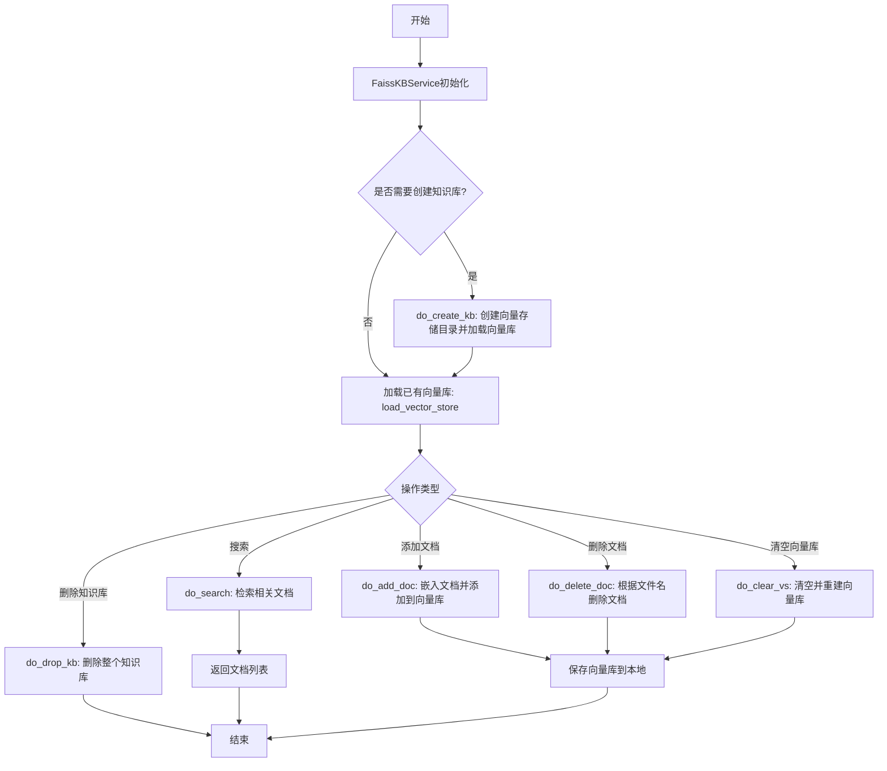

## 类结构

```
KBService (抽象基类)
└── FaissKBService (Faiss知识库服务实现)
```

## 全局变量及字段


### `FaissKBService.vs_path`
    
向量存储路径

类型：`str`
    


### `FaissKBService.kb_path`
    
知识库根目录路径

类型：`str`
    


### `FaissKBService.vector_name`
    
向量存储名称，默认为嵌入模型名称

类型：`str`
    
    

## 全局函数及方法


### `FaissKBService.vs_type`

该方法用于获取当前知识库服务所使用的向量存储类型标识，返回FAISS向量类型标识字符串。

参数：
- 无显式参数（`self` 为实例隐含参数）

返回值：`str`，返回FAISS向量类型标识

#### 流程图

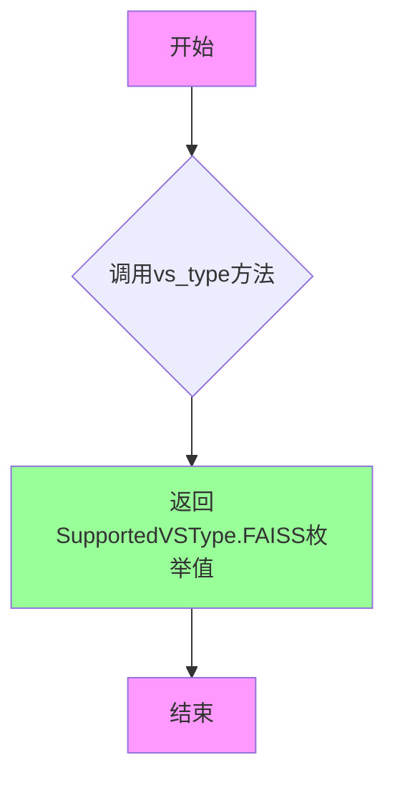

#### 带注释源码

```python
def vs_type(self) -> str:
    """
    返回FAISS向量类型标识
    
    该方法覆写了基类KBService中的抽象方法，用于标识当前知识库服务
    所使用的向量存储类型。在知识库管理系统中，不同的向量存储引擎
    （如FAISS、Milvus、Elasticsearch等）通过此方法进行类型识别，
    以便在加载、缓存或切换向量存储时进行正确的路由和实例化。
    
    Returns:
        str: FAISS向量类型标识，值为SupportedVSType枚举的FAISS成员
    """
    return SupportedVSType.FAISS
```

#### 设计说明

| 项目 | 说明 |
|------|------|
| **设计目标** | 实现向量存储类型的运行时识别，支持多类型向量存储共存 |
| **调用场景** | 向量存储工厂初始化、缓存键生成、类型校验等 |
| **接口契约** | 继承自 `KBService` 基类的抽象方法，必须实现 |
| **潜在优化** | 当前实现为硬编码返回，可考虑配置化以支持动态类型扩展 |


### `FaissKBService.get_vs_path`

获取当前知识库的向量存储路径。

参数：

- 该方法无显式参数（隐含参数 `self` 为类的实例）

返回值：`str`，返回知识库向量存储的完整路径字符串。

#### 流程图

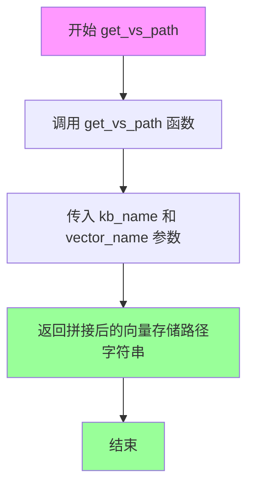

#### 带注释源码

```python
def get_vs_path(self):
    """
    获取向量存储路径
    
    该方法调用外部工具函数 get_vs_path，根据知识库名称(kb_name)
    和向量名称(vector_name)拼接并返回向量存储的完整文件系统路径。
    
    Returns:
        str: 知识库向量存储的路径
    """
    # 调用项目内部的路径获取工具函数，传入知识库名称和向量名称
    # 返回格式通常为: {根目录}/{kb_name}/{vector_name} 的形式
    return get_vs_path(self.kb_name, self.vector_name)
```


### `FaissKBService.get_kb_path`

获取知识库目录的路径，通过调用全局函数`get_kb_path`并传入知识库名称来返回对应的目录路径。

参数：

- 该方法无显式参数（隐式参数`self`为类实例引用）

返回值：`str`，返回知识库目录的绝对路径字符串。

#### 流程图

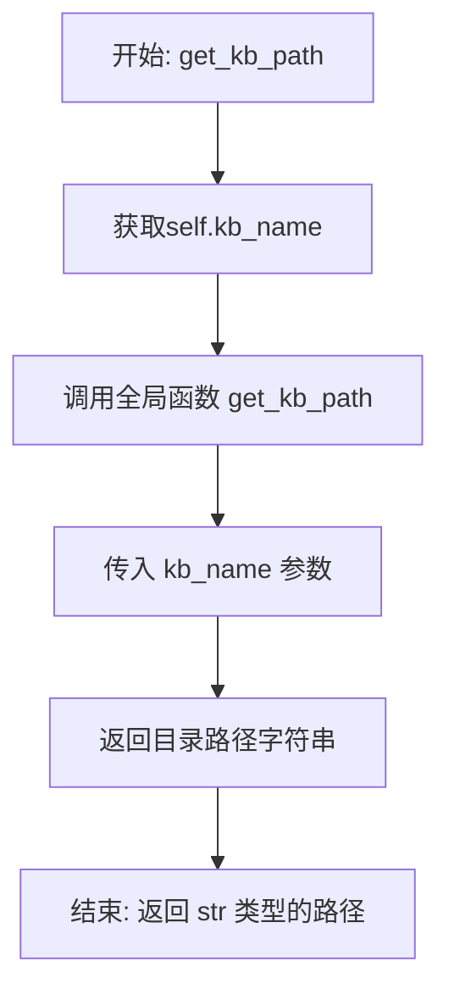

#### 带注释源码

```python
def get_kb_path(self):
    """
    获取当前知识库的根目录路径。
    
    该方法是一个实例方法，用于获取与当前知识库名称(kb_name)对应的
    存储目录路径。它通过调用全局工具函数 get_kb_path 来实现路径的解析。
    
    Returns:
        str: 知识库目录的绝对路径
        
    Example:
        >>> service = FaissKBService(kb_name="my_knowledge_base")
        >>> path = service.get_kb_path()
        >>> print(path)  # 输出类似: /path/to/knowledge_base/my_knowledge_base
    """
    return get_kb_path(self.kb_name)  # 调用全局函数，传入知识库名称获取路径
```


### `FaissKBService.load_vector_store`

该方法用于加载线程安全的 Faiss 向量库，通过全局的 `kb_faiss_pool` 加载指定知识库的向量存储实例，并返回 `ThreadSafeFaiss` 对象供其他操作使用。

**注意**：该方法没有显式输入参数，它依赖于实例属性 `self.kb_name`、`self.vector_name` 和 `self.embed_model`。

参数：

- （无显式参数，依赖实例属性 `self.kb_name`、`self.vector_name`、`self.embed_model`）

返回值：`ThreadSafeFaiss`，返回线程安全的 Faiss 向量库实例，用于后续的向量检索、文档添加等操作。

#### 流程图

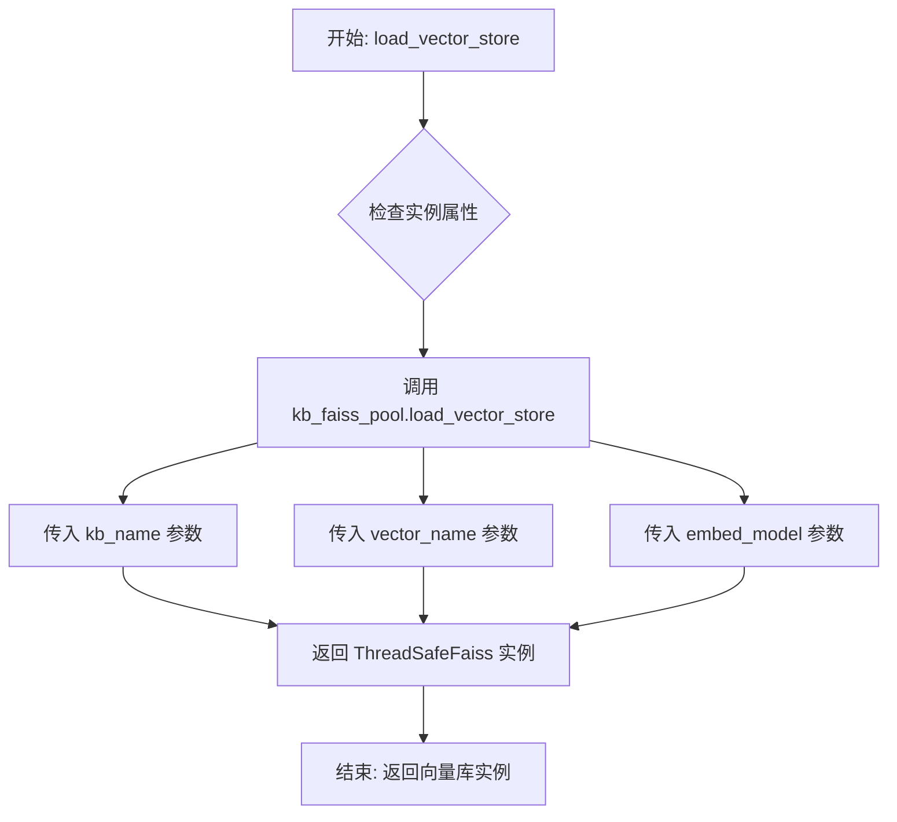

#### 带注释源码

```python
def load_vector_store(self) -> ThreadSafeFaiss:
    """
    加载线程安全的Faiss向量库实例。
    
    该方法通过全局的 kb_faiss_pool 加载指定知识库的向量存储，
    使用实例属性 kb_name、vector_name 和 embed_model 作为参数。
    
    返回:
        ThreadSafeFaiss: 线程安全的Faiss向量库实例，可用于向量检索和文档管理
    """
    # 调用全局的 kb_faiss_pool 的 load_vector_store 方法
    # 参数说明:
    #   - kb_name: 知识库名称，标识要加载的知识库
    #   - vector_name: 向量名称，标识特定的向量存储实例
    #   - embed_model: 嵌入模型，用于生成文档的向量表示
    return kb_faiss_pool.load_vector_store(
        kb_name=self.kb_name,
        vector_name=self.vector_name,
        embed_model=self.embed_model,
    )
```


### `FaissKBService.save_vector_store`

保存向量库到本地存储。该方法通过加载向量库实例并调用其 save 方法，将当前的向量存储数据持久化到指定的 vs_path 路径中。

参数： 无

返回值：`None`，无返回值描述

#### 流程图

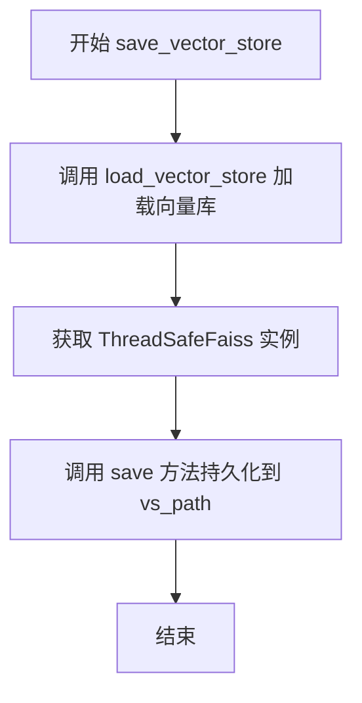

#### 带注释源码

```python
def save_vector_store(self):
    """
    将向量库保存到本地存储。
    
    该方法执行以下操作：
    1. 调用 load_vector_store() 加载当前的向量库实例（ThreadSafeFaiss）
    2. 调用向量库实例的 save() 方法，传入 self.vs_path 作为保存路径
    3. 将内存中的向量数据持久化到磁盘
    
    注意：
    - save 方法会覆盖已存在的向量库文件
    - 需要确保 self.vs_path 已经正确初始化（在 do_init 中设置）
    - 该方法不返回任何值
    """
    self.load_vector_store().save(self.vs_path)
```


### `FaissKBService.get_doc_by_ids`

根据给定的文档ID列表，从Faiss向量存储的文档存储中检索对应的Document对象列表。

参数：

- `ids`：`List[str]`，需要查询的文档ID列表，每个ID唯一对应一个文档

返回值：`List[Document]`，返回与输入ID列表顺序对应的文档对象列表，若某个ID不存在则返回None

#### 流程图

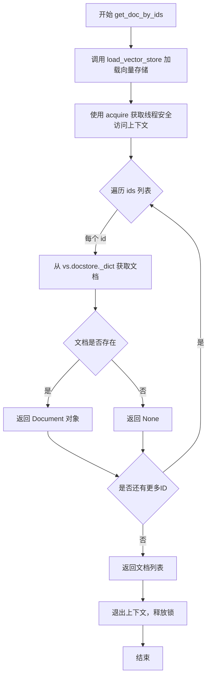

#### 带注释源码

```python
def get_doc_by_ids(self, ids: List[str]) -> List[Document]:
    """
    根据文档ID列表获取文档对象
    
    参数:
        ids: 文档唯一标识符列表
        
    返回:
        文档对象列表，与输入ID顺序对应，不存在的ID返回None
    """
    # 通过上下文管理器获取线程安全的向量存储访问权限
    # acquire() 返回一个上下文管理器，确保多线程环境下的安全访问
    with self.load_vector_store().acquire() as vs:
        # 遍历IDs列表，从向量存储的docstore中逐一查找对应文档
        # vs.docstore._dict 是文档存储的内部字典结构，键为文档ID
        # 使用列表推导式构建结果列表
        return [vs.docstore._dict.get(id) for id in ids]
```


### `FaissKBService.del_doc_by_ids`

该方法通过加载向量存储库并调用其删除接口，根据提供的ID列表从Faiss向量数据库中删除对应的文档记录。

参数：

- `ids`：`List[str]`，要删除的文档唯一标识符列表

返回值：`bool`，但实际代码中未显式返回值（技术债务：声明返回bool但实际返回None）

#### 流程图

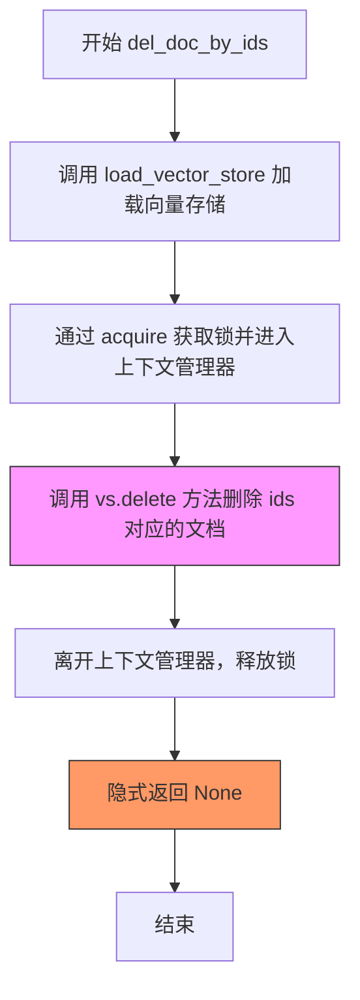

#### 带注释源码

```python
def del_doc_by_ids(self, ids: List[str]) -> bool:
    """
    根据文档ID列表删除向量数据库中的文档
    
    参数:
        ids: 要删除的文档ID列表
    
    返回:
        bool: 删除操作是否成功（声明但未实现）
    """
    # 使用上下文管理器加载向量存储，并获取线程安全的访问权限
    with self.load_vector_store().acquire() as vs:
        # 调用Faiss向量存储的delete方法删除指定ID的文档
        # 注意：vs.delete(ids) 可能抛出异常，但此处未进行异常处理
        vs.delete(ids)
    
    # 技术债务：声明返回 bool 类型，但实际未显式返回值
    # 正确做法应该是: return vs.delete(ids) 或 return True
```


### `FaissKBService.do_init`

该方法用于初始化Faiss向量知识库服务，主要完成向量名称的设置（若未指定则根据嵌入模型名称生成）以及知识库路径和向量存储路径的获取。

参数：无显式外部参数（仅使用 `self` 实例属性）

返回值：`None`，无返回值（方法执行副作用操作）

#### 流程图

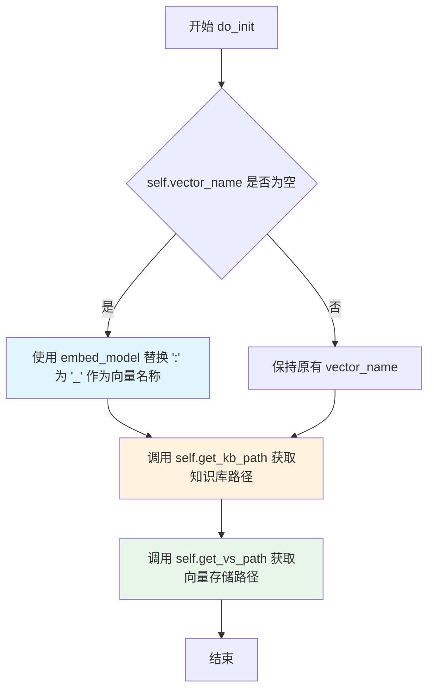

#### 带注释源码

```python
def do_init(self):
    """
    初始化Faiss知识库服务的路径配置
    
    该方法完成以下初始化工作：
    1. 设置向量名称：如果未指定，则根据嵌入模型名称自动生成
    2. 获取知识库根目录路径
    3. 获取向量存储目录路径
    """
    # 初始化向量名称：如果 self.vector_name 为 None 或空值，
    # 则使用 embed_model 替换 ":" 为 "_" 作为向量名称
    # 例如：embed_model="text-embedding-ada-002" -> vector_name="text-embedding-ada-002"
    self.vector_name = self.vector_name or self.embed_model.replace(":", "_")
    
    # 获取知识库目录路径（用于存储原始文档内容）
    # 路径格式：{KB_ROOT_PATH}/{kb_name}/
    self.kb_path = self.get_kb_path()
    
    # 获取向量存储目录路径（用于存储FAISS索引文件）
    # 路径格式：{VS_ROOT_PATH}/{kb_name}/{vector_name}/
    self.vs_path = self.get_vs_path()
```


### `FaissKBService.do_create_kb`

创建知识库的向量存储目录，如果目录不存在则创建目录，然后初始化并加载向量存储。

参数：

- 该方法无显式参数（仅使用实例属性 `self`）

返回值：`None`，无返回值（方法执行完成后直接返回）

#### 流程图

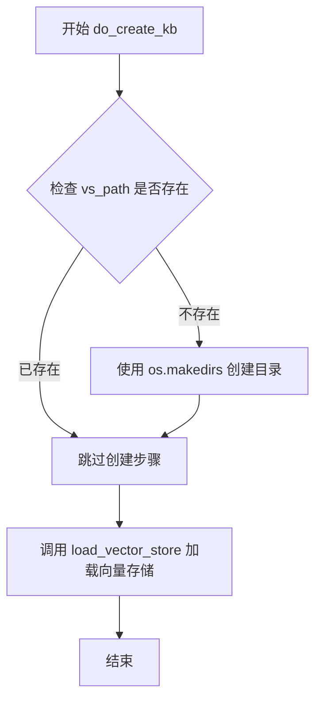

#### 带注释源码

```python
def do_create_kb(self):
    """
    创建新的知识库和向量存储目录
    
    该方法执行以下操作：
    1. 检查向量存储路径 vs_path 是否存在
    2. 如果不存在，则创建所需的目录结构
    3. 加载向量存储到内存中（通过线程安全的 Faiss 池）
    
    注意：此方法不返回任何值，结果存储在类实例的内部状态中
    """
    # 检查向量存储路径是否存在
    if not os.path.exists(self.vs_path):
        # 如果目录不存在，创建目录结构
        # vs_path 由 get_vs_path(self.kb_name, self.vector_name) 生成
        os.makedirs(self.vs_path)
    
    # 加载向量存储到内存中
    # 这会初始化 ThreadSafeFaiss 实例并将其注册到 kb_faiss_pool 中
    # 加载过程会使用 embed_model 进行嵌入模型的初始化
    self.load_vector_store()
```


### `FaissKBService.do_drop_kb`

该方法用于删除整个知识库目录，首先清理向量存储（从内存池中移除并删除向量存储文件），然后删除知识库的物理文件目录。

参数：无（仅包含 self 隐式参数）

返回值：无（`None`），该方法执行副作用操作，不返回任何值

#### 流程图

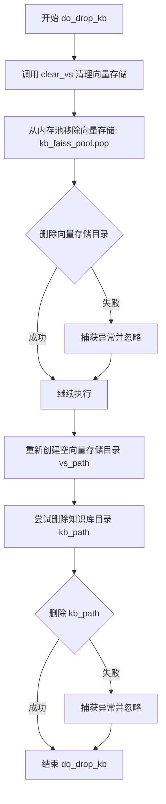

#### 带注释源码

```python
def do_drop_kb(self):
    """
    删除整个知识库目录
    执行两步操作：1. 清理向量存储 2. 删除知识库物理目录
    """
    # 步骤1: 清理向量存储（从内存池移除并删除向量存储文件）
    self.clear_vs()
    
    # 步骤2: 尝试删除知识库目录 kb_path
    # 注意: 这里使用了 try-except 忽略所有异常
    # 可能的问题：如果目录不存在或权限不足，异常会被静默忽略
    try:
        # 使用 shutil.rmtree 递归删除目录及其内容
        shutil.rmtree(self.kb_path)
    except Exception:
        # 异常被静默忽略，不记录日志也不抛出
        pass
```


### `FaissKBService.do_search`

执行语义搜索，从FAISS向量存储中检索与查询最相关的文档，支持基于分数阈值的筛选。

参数：

- `query`：`str`，搜索查询文本，用于在向量库中查找语义相似的文档
- `top_k`：`int`，返回最相似的文档数量上限
- `score_threshold`：`float`，相似度分数阈值，用于过滤低于该分数的文档（默认值：Settings.kb_settings.SCORE_THRESHOLD）

返回值：`List[Tuple[Document, float]]`，返回文档与相似度分数的元组列表，每个元组包含检索到的文档对象及其对应的相似度分数

#### 流程图

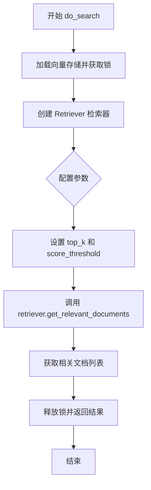

#### 带注释源码

```python
def do_search(
    self,
    query: str,
    top_k: int,
    score_threshold: float = Settings.kb_settings.SCORE_THRESHOLD,
) -> List[Tuple[Document, float]]:
    """
    执行语义搜索，从FAISS向量存储中检索相关文档
    
    参数:
        query: str - 搜索查询文本
        top_k: int - 返回结果的最多数量
        score_threshold: float - 相似度分数阈值，低于此分数的文档将被过滤
    
    返回:
        List[Tuple[Document, float]] - 文档及其相似度分数的元组列表
    """
    # 使用上下文管理器加载向量存储并自动管理锁
    with self.load_vector_store().acquire() as vs:
        # 使用集成检索器从向量存储创建检索器
        # ensemble检索器可能组合了多种搜索策略
        retriever = get_Retriever("ensemble").from_vectorstore(
            vs,                      # 向量存储实例
            top_k=top_k,             # 限制返回的文档数量
            score_threshold=score_threshold,  # 设置分数过滤阈值
        )
        # 执行相似度搜索，获取与查询最相关的文档
        docs = retriever.get_relevant_documents(query)
    
    # 返回文档列表（包含文档内容和元数据）
    return docs
```


### `FaissKBService.do_add_doc`

添加文档到 Faiss 向量库。该方法接收文档列表，提取内容与元数据，生成向量嵌入，存储到向量库中，并返回添加的文档信息列表。

参数：

- `docs`：`List[Document]`（langchain 文档对象列表），需要添加到向量库的文档列表，每个 Document 包含 page_content（文本内容）和 metadata（元数据）
- `**kwargs`：可选关键字参数，支持 `not_refresh_vs_cache`（布尔值，默认为 False），控制是否刷新向量库缓存

返回值：`List[Dict]`，返回添加的文档信息列表，每个字典包含 `id`（向量库中的唯一标识符）和 `metadata`（文档的元数据）

#### 流程图

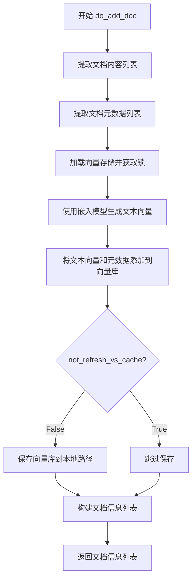

#### 带注释源码

```python
def do_add_doc(
    self,
    docs: List[Document],
    **kwargs,
) -> List[Dict]:
    """
    添加文档到 Faiss 向量库
    
    参数:
        docs: 文档对象列表，每个包含 page_content 和 metadata
        **kwargs: 支持 not_refresh_vs_cache 参数控制是否保存
    
    返回:
        包含 id 和 metadata 的字典列表
    """
    # 从文档列表中提取所有页内容（文本）
    texts = [x.page_content for x in docs]
    
    # 从文档列表中提取所有元数据
    metadatas = [x.metadata for x in docs]
    
    # 获取向量存储实例并加锁，确保线程安全
    with self.load_vector_store().acquire() as vs:
        # 使用嵌入模型将文本转换为向量表示
        embeddings = vs.embeddings.embed_documents(texts)
        
        # 将文本向量及其元数据添加到向量存储，获取返回的 IDs
        ids = vs.add_embeddings(
            text_embeddings=zip(texts, embeddings), 
            metadatas=metadatas
        )
        
        # 如果未设置不刷新缓存，则保存向量库到本地
        if not kwargs.get("not_refresh_vs_cache"):
            vs.save_local(self.vs_path)
    
    # 构建返回的文档信息列表，包含 ID 和元数据
    doc_infos = [
        {"id": id, "metadata": doc.metadata} 
        for id, doc in zip(ids, docs)
    ]
    return doc_infos
```


### `FaissKBService.do_delete_doc`

根据文件名从 Faiss 向量知识库中删除文档，返回被删除的文档 ID 列表。该方法通过匹配文档元数据中的 source 字段与给定文件名来确定要删除的文档。

参数：

- `kb_file`：`KnowledgeFile`，包含待删除文件的文件名信息（`filename` 属性）
- `**kwargs`：可选关键字参数，支持 `not_refresh_vs_cache`（是否跳过刷新向量库缓存）

返回值：`List[str]`，返回被成功删除的文档 ID 列表；如果未删除任何文档则返回空列表

#### 流程图

```mermaid
flowchart TD
    A[开始 do_delete_doc] --> B[加载向量存储: load_vector_store]
    B --> C[遍历 docstore._dict 查找匹配文档]
    C --> D{找到匹配的文档?}
    D -->|是| E[执行删除: vs.delete(ids)]
    D -->|否| F[跳过删除]
    E --> G{not_refresh_vs_cache?}
    F --> G
    G -->|否| H[保存向量库到本地: vs.save_local]
    G -->|是| I[跳过保存]
    H --> J[返回 ids 列表]
    I --> J
```

#### 带注释源码

```python
def do_delete_doc(self, kb_file: KnowledgeFile, **kwargs) -> List[str]:
    """
    根据文件名删除知识库中的文档
    
    参数:
        kb_file: KnowledgeFile对象,包含要删除文件的文件名信息
        **kwargs: 关键字参数,支持not_refresh_vs_cache用于控制是否刷新缓存
    
    返回:
        被删除的文档ID列表
    """
    # 获取向量存储的上下文管理器,通过acquire方法获取vs实例
    with self.load_vector_store().acquire() as vs:
        # 遍历文档存储中的所有文档,查找与给定文件名匹配的文档ID
        # 将文件名转换为小写进行不区分大小写的匹配
        ids = [
            k  # 文档ID
            for k, v in vs.docstore._dict.items()  # 遍历docstore中的所有键值对
            if v.metadata.get("source").lower() == kb_file.filename.lower()  # 匹配source元数据与文件名
        ]
        
        # 如果找到匹配的文档ID,则执行删除操作
        if len(ids) > 0:
            vs.delete(ids)
        
        # 根据kwargs参数决定是否保存向量库到本地
        # not_refresh_vs_cache为True时跳过保存,可用于批量删除优化性能
        if not kwargs.get("not_refresh_vs_cache"):
            vs.save_local(self.vs_path)
    
    # 返回被删除的文档ID列表,即使没有删除任何文档也返回空列表
    return ids
```


### `FaissKBService.do_clear_vs`

该方法用于清空指定知识库的向量存储，并重新创建一个空的索引目录。首先从向量存储池中移除该知识库的向量存储对象，然后删除向量存储的物理文件目录，最后重新创建空目录以供后续使用。

参数：无（仅包含隐式参数 `self`）

返回值：`None`，该方法不返回任何值，仅执行清空和重建操作

#### 流程图

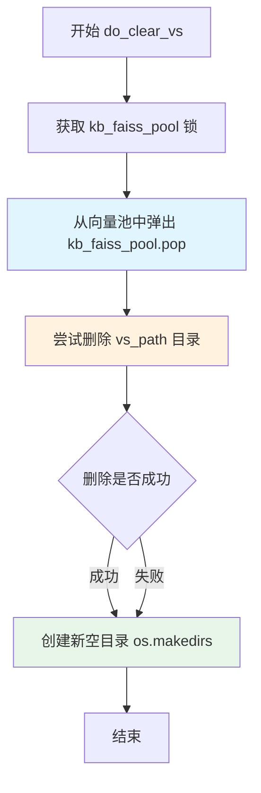

#### 带注释源码

```python
def do_clear_vs(self):
    """
    清空向量库并重建空索引
    该方法执行以下操作：
    1. 从向量存储池中移除当前知识库的向量存储对象
    2. 删除向量存储的物理文件目录
    3. 重新创建空的向量存储目录
    """
    # 使用线程安全的向量池进行原子操作，从池中移除该知识库的向量存储
    # 参数为元组 (kb_name, vector_name)，移除后会释放相关内存资源
    with kb_faiss_pool.atomic:
        kb_faiss_pool.pop((self.kb_name, self.vector_name))
    
    # 尝试删除向量存储的物理文件目录
    # 使用 shutil.rmtree 递归删除目录及其内容
    try:
        shutil.rmtree(self.vs_path)
    except Exception:
        # 忽略删除失败的情况，例如目录不存在或其他权限问题
        # 使用省略号表示空异常处理，这是一种简洁但可能隐藏错误的方式
        ...
    
    # 重新创建向量存储目录
    # 使用 exist_ok=True 确保如果目录已存在不会抛出异常
    # 这确保了向量存储目录始终存在，可以用于后续的索引重建
    os.makedirs(self.vs_path, exist_ok=True)
```


### `FaissKBService.exist_doc`

检查文档是否存在于数据库或文件夹中。

参数：

- `file_name`：`str`，需要检查的文档文件名

返回值：`str | bool`，返回 "in_db" 表示文档存在于数据库中，返回 "in_folder" 表示文档存在于文件夹中，返回 `False` 表示文档不存在

#### 流程图

```mermaid
flowchart TD
    A[开始 exist_doc] --> B{调用父类 exist_doc}
    B -->|文档在数据库中| C[返回 "in_db"]
    B -->|文档不在数据库中| D{检查文件是否存在于文件夹}
    D -->|文件存在| E[返回 "in_folder"]
    D -->|文件不存在| F[返回 False]
    C --> G[结束]
    E --> G
    F --> G
```

#### 带注释源码

```python
def exist_doc(self, file_name: str):
    """
    检查文档是否存在于数据库或文件夹中
    
    参数:
        file_name: str - 需要检查的文档文件名
    
    返回:
        str | bool - "in_db" 表示在数据库中, "in_folder" 表示在文件夹中, False 表示不存在
    """
    # 首先调用父类的 exist_doc 方法检查数据库中是否存在该文档
    if super().exist_doc(file_name):
        return "in_db"  # 如果在数据库中找到,返回 "in_db"

    # 获取知识库内容文件夹路径
    content_path = os.path.join(self.kb_path, "content")
    
    # 检查文件是否存在于内容文件夹中
    if os.path.isfile(os.path.join(content_path, file_name)):
        return "in_folder"  # 如果文件存在于文件夹中,返回 "in_folder"
    else:
        return False  # 如果都不存在,返回 False
```

## 关键组件


### FaissKBService

Faiss知识库服务实现类，继承自KBService基类，负责管理Faiss向量存储的创建、加载、保存、搜索、文档增删等核心操作，支持线程安全的向量存储访问。

### ThreadSafeFaiss

线程安全的Faiss向量存储封装类，提供acquire上下文管理器用于线程安全的向量存储访问，确保多线程环境下的数据一致性。

### kb_faiss_pool

Faiss向量存储连接池，管理不同知识库的Faiss实例，支持load_vector_store加载、save_local保存、atomic原子操作等，提供实例缓存和复用机制。

### do_search方法

向量检索核心方法，通过集成ensemble Retriever进行混合检索，支持top_k和score_threshold参数，返回Document列表及相似度分数元组列表。

### do_add_doc方法

文档添加方法，提取文档的page_content和metadata，调用向量存储的embed_documents生成嵌入向量，批量添加文档并返回文档ID列表，可选是否刷新缓存。

### do_delete_doc方法

文档删除方法，根据文件名匹配docstore中的文档ID进行删除，支持从向量存储和文件系统中清理文档，可配置是否刷新缓存。

### do_drop_kb方法

知识库删除方法，清除向量存储缓存并递归删除知识库目录，处理可能的异常情况，实现完整的知识库销毁流程。

### get_Retriever

检索器工厂函数，根据传入的retriever类型（如ensemble）从向量存储创建相应的检索器，封装了LangChain的检索接口。

### KnowledgeFile

知识文件实体类，表示知识库中的单个文件，包含文件名和知识库名称属性，用于文档操作的标识和追踪。

### vs_path与kb_path

向量存储路径和知识库根目录路径，分别通过get_vs_path和get_kb_path方法动态生成，遵循知识库名称和向量模型名称的命名规范。


## 问题及建议


### 已知问题

-   **异常处理过于简单**：do_drop_kb和do_clear_vs方法中静默捕获所有异常（只有pass），导致问题难以追踪和调试
-   **重复嵌入计算**：do_add_doc方法中手动调用embeddings.embed_documents后，又传递给add_embeddings，Faiss的add_embeddings内部会再次进行嵌入，造成重复计算和性能浪费
-   **类型标注不完整**：vs_path和kb_path字段缺少类型标注；do_add_doc和do_delete_doc方法的kwargs参数缺少类型定义
-   **资源管理效率低**：get_doc_by_ids、del_doc_by_ids、do_search等方法每次都调用load_vector_store()，可能导致频繁的向量库加载操作
-   **命名不一致**：exist_doc方法接收file_name参数，但内部比较时使用filename，造成命名混淆
-   **魔法字符串/值**：exist_doc方法返回"in_db"、"in_folder"等字符串常量未定义为常量或枚举，降低可读性和可维护性
-   **代码重复**：do_add_doc和do_delete_doc中都有保存向量库的逻辑（vs.save_local），存在重复代码

### 优化建议

-   为异常处理添加日志记录或自定义异常类，避免静默失败
-   移除do_add_doc中手动调用embeddings.embed_documents的代码，直接将texts和metadatas传递给add_embeddings
-   补充完整的类型标注，包括字段类型和方法参数类型
-   考虑在类初始化时加载向量库并缓存，减少重复加载；或使用懒加载模式并添加缓存机制
-   统一命名规范，建议将file_name改为filename或保持参数名为file_name但内部使用一致的属性访问
-   使用枚举或常量类定义状态返回值，如DocumentStatus枚举
-   将保存向量库的逻辑提取为私有方法，如_save_if_needed()，减少重复代码
-   添加类和方法级别的文档字符串，提高代码可读性和可维护性
-   在do_create_kb中先检查目录是否存在，避免不必要的makedirs调用


## 其它


### 设计目标与约束

本模块旨在为ChatChat系统提供基于Faiss向量数据库的知识库服务能力，支持文档的向量化存储、相似性搜索和动态更新。设计约束包括：1) 必须继承KBService基类以保持知识库服务接口一致性；2) 使用ThreadSafeFaiss保证多线程环境下的向量存储操作安全；3) 向量存储路径遵循`{kb_name}/{vector_name}`的目录结构；4) 支持与LangChain生态系统的无缝集成。

### 错误处理与异常设计

本模块采用分层异常处理策略：1) `do_drop_kb`中使用try-except捕获`shutil.rmtree`可能的文件不存在异常；2) `do_clear_vs`中使用省略号`...`静默处理目录删除失败；3) 文件系统操作依赖`os.path.exists`进行前置检查；4) 向量存储加载失败时返回None由上层KBService处理。当前实现存在异常信息不详细、缺少重试机制的问题，建议引入日志记录和自定义异常类。

### 数据流与状态机

数据流主要分为三类：1) 文档添加流程：`do_add_doc`接收Document列表→提取page_content和metadata→调用embeddings生成向量→调用vs.add_embeddings添加向量→持久化到本地；2) 文档删除流程：`do_delete_doc`根据文件名匹配docstore中的文档ID→调用vs.delete删除向量→持久化更新；3) 搜索流程：`do_search`接收查询字符串→构建Retriever→调用get_relevant_documents获取相似文档→返回(Document, score)元组列表。状态转换通过`kb_faiss_pool`缓存池管理，包含load、save、clear三种状态。

### 外部依赖与接口契约

核心依赖包括：1) `faiss`向量数据库及其ThreadSafeFaiss包装类；2) `langchain`框架的Document和Retriever组件；3) `chatchat.settings.Settings`配置对象；4) `KnowledgeFile`知识文件模型。接口契约方面：`load_vector_store`返回ThreadSafeFaiss实例；`save_vector_store`和`do_add_doc`涉及本地文件系统写入；`get_vs_path`和`get_kb_path`返回字符串路径；所有涉及向量操作的方法需通过`acquire()`获取上下文管理器锁。

### 并发与线程安全设计

本模块通过`ThreadSafeFaiss`和`kb_faiss_pool`实现线程安全：1) `load_vector_store().acquire()`提供上下文管理器锁，确保同一时刻只有一个线程操作向量存储；2) `kb_faiss_pool.atomic`用于`do_clear_vs`的原子性缓存清除操作；3) `vs.add_embeddings`和`vs.delete`在锁内执行避免竞态条件。注意：`save_vector_store`调用频率和`acquire`锁粒度可能影响并发性能，建议评估批量操作的锁优化空间。

### 配置与参数说明

关键配置参数包括：1) `Settings.kb_settings.SCORE_THRESHOLD`用于搜索结果相关性过滤，默认值从Settings读取；2) `embed_model`嵌入模型名称，do_init中用于生成vector_name；3) `vector_name`向量存储标识，默认为`embed_model.replace(":", "_")`；4) `top_k`搜索返回的最多文档数，由do_search参数传入。配置来源均为chatchat.settings.Settings全局配置对象。

### 性能考虑与优化建议

当前实现存在以下性能瓶颈：1) 每次`do_add_doc`都调用`vs.save_local`持久化，单个文档添加涉及IO操作；2) `do_delete_doc`中遍历整个docstore._dict匹配文件名，文档量增大时效率低下；3) `get_doc_by_ids`和`do_delete_doc`均需加载完整向量存储。优化建议：1) 引入批量操作缓冲机制，减少频繁持久化；2) 建立文件名到IDs的索引缓存；3) 考虑Lazy Load策略延迟加载非活跃知识库的向量存储。

### 安全性考虑

当前模块安全考量包括：1) 文件路径拼接使用`os.path.join`避免路径注入；2) `do_drop_kb`和`do_clear_vs`执行不可逆的目录删除操作，需配合权限控制；3) 搜索结果`score_threshold`可防止低相关度文档泄露。风险点：1) 缺少用户访问权限验证；2) 向量存储路径可推测可能引发信息泄露；3) 未对输入query进行长度和内容校验。

### 测试策略建议

建议补充以下测试用例：1) 单元测试覆盖各do_方法的基本功能；2) 并发测试验证多线程add/delete/search场景下的数据一致性；3) 异常测试覆盖文件权限不足、磁盘空间不足、模型加载失败等场景；4) 集成测试验证与KBService基类、kb_faiss_pool的交互；5) 性能测试评估大规模文档添加和搜索的响应时间。

### 版本兼容性与迁移考虑

当前代码使用`langchain.docstore.document.Document`（旧版API），建议迁移至`langchain_core.documents.Document`以保持与LangChain 0.2+版本的兼容。另外，`vs.docstore._dict`属于内部实现细节，直接访问可能在未来版本中失效，应考虑通过官方API封装访问逻辑。

### 监控与运维建议

建议增加以下可观测性支持：1) 在关键操作节点添加日志记录（load、save、add、delete、search）；2) 暴露向量存储缓存命中率指标；3) 记录知识库创建/删除/文档操作的时间戳；4) 提供健康检查接口查询faiss_pool状态。运维方面需注意：1) 定期清理过期向量存储文件；2) 监控磁盘空间使用；3) 备份策略的制定。


    