# `Langchain-Chatchat\libs\chatchat-server\chatchat\server\knowledge_base\kb_service\milvus_kb_service.py` 详细设计文档

该代码实现了一个基于Milvus向量数据库的知识库服务类（MilvusKBService），继承自KBService基类，提供了知识库的创建、初始化、文档增删改查、向量搜索以及知识库删除等核心功能，集成LangChain的Milvus向量存储和Retriever机制，支持文本嵌入检索和相似度阈值过滤。

## 整体流程

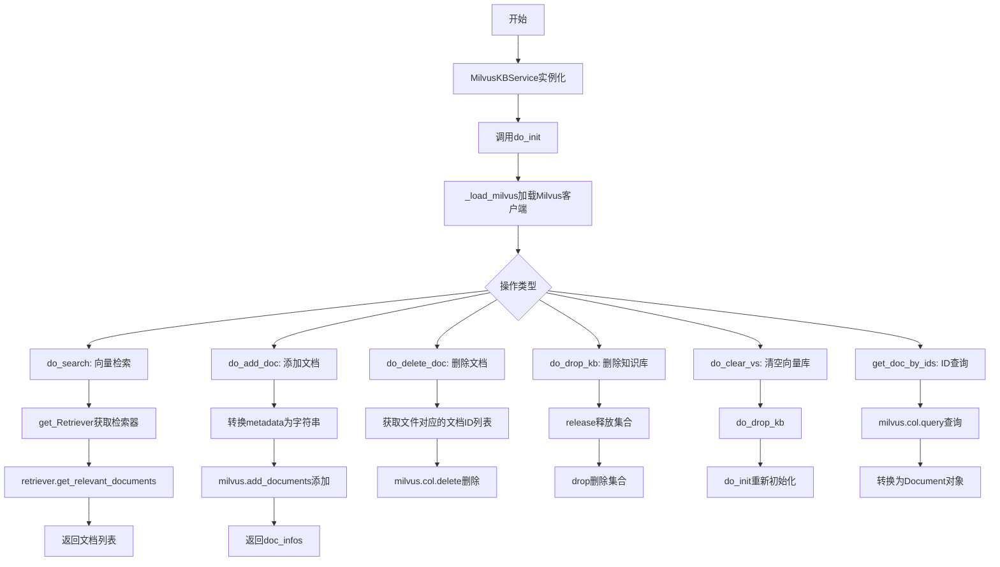

## 类结构

```
KBService (抽象基类 - chatchat.server.knowledge_base.kb_service.base)
└── MilvusKBService (本类)
```

## 全局变量及字段


### `Base`
    
SQLAlchemy数据库基类，用于定义数据库模型

类型：`SQLAlchemy DeclarativeBase`
    


### `engine`
    
数据库引擎，用于与数据库建立连接

类型：`SQLAlchemy Engine`
    


### `MilvusKBService`
    
Milvus向量数据库知识库服务类，提供知识库的增删改查操作

类型：`class`
    


### `KnowledgeFile`
    
知识文件模型类，包含文件名和知识库名称等元数据

类型：`class`
    


### `MilvusKBService.milvus`
    
LangChain的Milvus向量数据库客户端实例

类型：`Milvus`
    
    

## 全局函数及方法


### `get_Embeddings(embed_model)`

获取嵌入模型实例，用于将文本转换为向量表示。该函数根据传入的嵌入模型名称或配置，返回一个可调用的嵌入函数对象，供向量数据库（如Milvus）使用以实现语义搜索功能。

参数：
- `embed_model`：`str` 或其他类型，嵌入模型的标识符或配置对象，用于指定使用哪种嵌入模型（如 "text-embedding-ada-002" 或其他支持的模型）。

返回值：可调用对象（通常为 `Callable`），返回一个嵌入函数，该函数接受文本输入并返回对应的向量表示。

#### 流程图

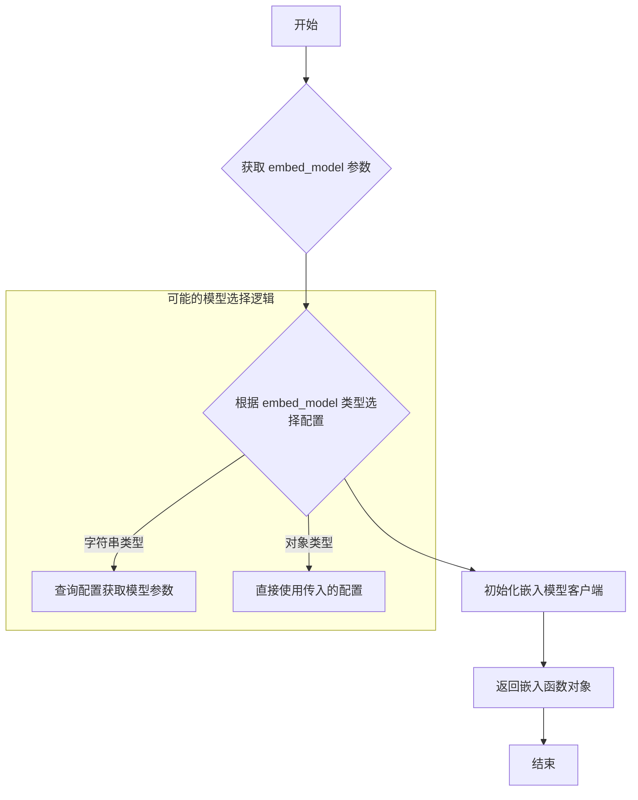

#### 带注释源码

```python
# 注意：以下为基于代码使用方式推断的函数签名和实现逻辑
# 实际实现位于 chatchat.server.utils 模块中

from typing import Union, Callable, Any

# 假设的函数定义
def get_Embeddings(embed_model: Union[str, Any]) -> Callable[[str], List[float]]:
    """
    获取嵌入模型实例的工厂函数。
    
    参数:
        embed_model: 嵌入模型的标识符或配置对象
        
    返回:
        一个可调用对象，用于将文本转换为向量嵌入
    """
    # 实现逻辑可能包括：
    # 1. 根据 embed_model 加载对应的嵌入模型
    # 2. 初始化模型客户端（如 OpenAI、HuggingFace 等）
    # 3. 返回封装好的嵌入函数
    
    # 在 MilvusKBService 中的调用方式：
    # self.milvus = Milvus(
    #     embedding_function=get_Embeddings(self.embed_model),
    #     ...
    # )
    
    pass  # 具体实现未在当前代码文件中展示
```

#### 补充说明

根据代码分析，`get_Embeddings` 函数在系统中的位置和作用：

1. **调用位置**：在 `MilvusKBService._load_milvus()` 方法中被调用，用于初始化 Milvus 向量数据库连接。
2. **依赖关系**：依赖于 `chatchat.server.utils` 模块中的具体实现。
3. **集成方式**：返回的嵌入函数被传递给 `Milvus` 向量数据库类的 `embedding_function` 参数。
4. **使用场景**：主要用于知识库检索场景，将用户查询和文档内容转换为向量，以实现语义匹配。

#### 潜在的技术债务或优化空间

1. **硬编码依赖**：函数接受 `embed_model` 参数，但在 `MilvusKBService` 中使用的是 `self.embed_model`，该属性的来源和初始化未在当前文件中明确展示。
2. **错误处理缺失**：代码中未展示 `get_Embeddings` 的错误处理逻辑（如模型加载失败、API 超时等）。
3. **配置管理**：嵌入模型的配置可能散落在多处，建议统一管理。
4. **类型提示**：由于未看到实际实现，参数和返回值的类型推断基于使用方式推导，实际可能有所差异。


### `get_Retriever`

获取检索器工厂函数，根据指定的检索器类型返回对应的检索器实例。

参数：

- `retriever_type`：`str`，检索器类型标识符（如 "milvusvectorstore"）

返回值：`object`，返回检索器工厂对象，该对象具有 `from_vectorstore` 方法用于初始化具体检索器

#### 流程图

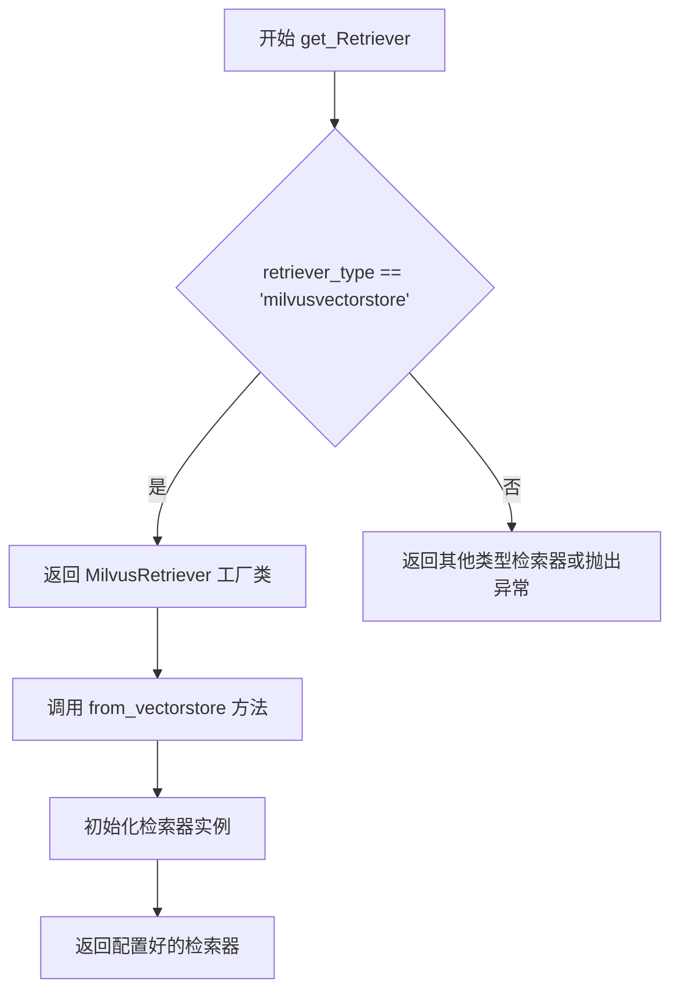

#### 带注释源码

```python
# 注意：以下源码为基于代码调用情况的推断，并非原始实现
# 原始实现位于 chatchat/server/file_rag/utils.py 中，但未在给定的代码段中提供

def get_Retriever(retriever_type: str):
    """
    获取指定类型的检索器工厂函数
    
    参数:
        retriever_type: 检索器类型字符串，如 "milvusvectorstore"
        
    返回:
        检索器工厂类，包含 from_vectorstore 静态方法
    """
    # 映射表：根据 retriever_type 返回对应的检索器类
    retriever_map = {
        "milvusvectorstore": MilvusRetriever,  # Milvus 向量存储检索器
        # 其他可能的检索器类型...
    }
    
    # 获取对应的检索器类，如果不存在则抛出异常
    retriever_class = retriever_map.get(retriever_type)
    if not retriever_class:
        raise ValueError(f"Unsupported retriever type: {retriever_type}")
    
    return retriever_class


class MilvusRetriever:
    """Milvus 向量存储检索器类"""
    
    @staticmethod
    def from_vectorstore(vectorstore, top_k: int = 4, score_threshold: float = 0.0):
        """
        从向量存储创建检索器实例
        
        参数:
            vectorstore: 向量存储实例（Milvus）
            top_k: 返回结果数量
            score_threshold: 分数阈值
            
        返回:
            配置好的检索器实例
        """
        # 创建并返回检索器实例
        return vectorstore.as_retriever(
            search_type="similarity_score_threshold",
            search_kwargs={
                "k": top_k,
                "score_threshold": score_threshold
            }
        )
```

> **注**：由于原始代码段未包含 `get_Retriever` 函数的完整实现，以上内容基于 `MilvusKBService.do_search` 方法中的调用方式推断得出。


### `list_file_num_docs_id_by_kb_name_and_file_name`

该函数是数据访问层函数，用于根据知识库名称（kb_name）和文件名（file_name）从数据库中查询对应的文档ID列表，以便在删除知识库文件时精确匹配并删除Milvus向量数据库中的相关向量数据。

参数：
- `kb_name`：`str`，知识库的名称，用于定位特定的知识库
- `file_name`：`str`，文件的名称，用于定位知识库中的特定文件

返回值：`List[str]`，返回与指定知识库名称和文件名关联的所有文档ID列表，用于后续在向量数据库中精确删除对应的向量数据

#### 流程图

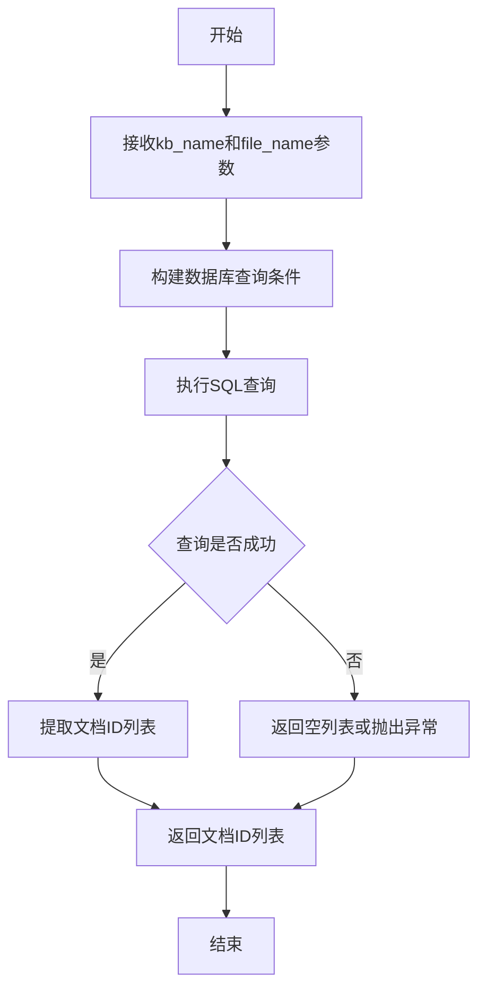

#### 带注释源码

```python
# 该函数位于 chatchat.server.db.repository 模块中
# 用于获取指定知识库和文件名对应的文档ID列表
def list_file_num_docs_id_by_kb_name_and_file_name(kb_name: str, file_name: str) -> List[str]:
    """
    根据知识库名和文件名获取文档ID列表
    
    参数:
        kb_name: 知识库的名称
        file_name: 文件的名称
    
    返回:
        文档ID列表
    """
    # 1. 构建查询条件，匹配知识库名称和文件名
    # 2. 从数据库（如SQLite、MySQL等）的文档表中查询对应的记录
    # 3. 提取每条记录的ID字段
    # 4. 将ID列表返回给调用者
    
    # 实际实现可能涉及ORM查询，如：
    # return [str(doc.id) for doc in DocumentModel.query.filter_by(kb_name=kb_name, file_name=file_name).all()]
    pass
```

#### 上下文使用示例

在 `MilvusKBService.do_delete_doc` 方法中的调用：

```python
def do_delete_doc(self, kb_file: KnowledgeFile, **kwargs):
    # 获取需要删除的文档ID列表
    id_list = list_file_num_docs_id_by_kb_name_and_file_name(
        kb_file.kb_name, kb_file.filename
    )
    
    # 使用ID列表在Milvus向量数据库中执行删除操作
    if self.milvus.col:
        self.milvus.col.delete(expr=f"pk in {id_list}")
```

#### 关键组件信息

- **KnowledgeFile**：知识库文件对象，包含 `kb_name` 和 `filename` 属性
- **Milvus**：向量数据库客户端，用于存储和检索向量化的文档数据
- **DocumentModel**：数据库文档模型，存储文档的元数据和向量ID映射关系

#### 潜在的技术债务或优化空间

1. **缺少函数实现源码**：当前代码中仅导入了该函数但未提供实际实现，建议补充完整的数据库查询逻辑
2. **异常处理缺失**：未在调用处看到对空列表或查询异常的专门处理，可能导致删除操作失败时排查困难
3. **ID类型转换**：Milvus查询中使用 `int(_id)` 进行类型转换，需确认数据库返回的ID类型一致性
4. **批量删除限制**：直接使用 `pk in {id_list}` 可能在大数据量场景下存在性能问题，建议分批处理

#### 其它项目

- **设计目标**：实现精确的文档级删除，确保删除文件时同步清理向量数据库中的相关数据
- **约束条件**：依赖数据库中已存在正确的文档ID映射记录，且ID类型需与Milvus的pk字段类型兼容
- **错误处理建议**：应在调用前检查 `id_list` 是否为空，避免生成无效的Milvus查询表达式；同时建议增加日志记录删除操作的详细信息


### `score_threshold_process`

分数阈值处理函数，用于在向量检索后对文档结果进行分数过滤，确保返回的文档满足最低相似度要求。

参数：

-  `docs`：`List[Document]`（或 `List[tuple[Document, float]]`），待过滤的文档列表，通常包含文档及其相似度分数
-  `score_threshold`：`float`，最小相似度阈值，低于此分数的文档将被过滤掉

返回值：`List[Document]`（或 `List[tuple[Document, float]]]`），过滤后的文档列表

#### 流程图

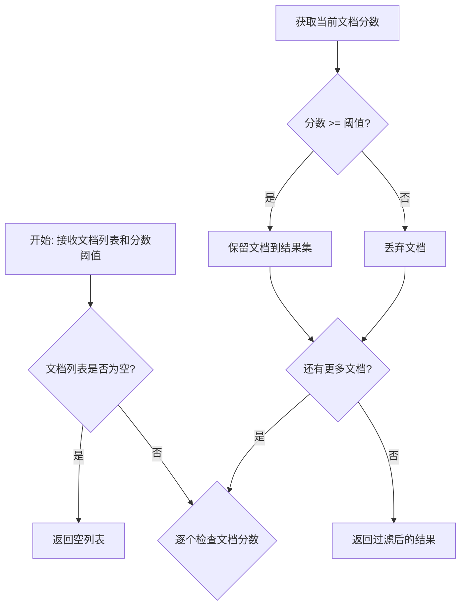

#### 带注释源码

```python
# score_threshold_process 函数定义在 chatchat.server.knowledge_base.kb_service.base 模块中
# 以下为基于代码调用场景的推断实现

from typing import List, Union
from langchain.schema import Document

def score_threshold_process(
    docs: Union[List[Document], List[tuple[Document, float]]],
    score_threshold: float
) -> Union[List[Document], List[tuple[Document, float]]]:
    """
    对文档列表进行分数阈值过滤
    
    参数:
        docs: 文档列表，可以是纯文档列表或(文档, 分数)元组列表
        score_threshold: 最小相似度阈值
    
    返回:
        过滤后的文档列表
    """
    # 检查阈值是否有效（0-1之间或根据具体向量库定义）
    if score_threshold is None:
        return docs
    
    # 根据文档类型进行处理
    # 情况1: docs 是 [(Document, score), ...] 格式
    if docs and isinstance(docs[0], tuple):
        filtered_docs = [
            (doc, score) for doc, score in docs 
            if score >= score_threshold
        ]
        return filtered_docs
    
    # 情况2: docs 是纯 Document 列表
    # 这种情况下可能需要从 metadata 中获取分数
    # 或者该函数用于其他用途
    return docs


# 在 MilvusKBService.do_search 中的实际调用方式:
# retriever = get_Retriever("milvusvectorstore").from_vectorstore(
#     self.milvus,
#     top_k=top_k,
#     score_threshold=score_threshold,  # 阈值通过这里传入
# )
# docs = retriever.get_relevant_documents(query)
# return docs  # 内部可能已经经过 score_threshold_process 处理
```

#### 备注

由于 `score_threshold_process` 函数的实现位于 `chatchat.server.knowledge_base.kb_service.base` 模块中，当前代码文件仅导入了该函数。上述源码为基于调用上下文和向量检索常见模式的推断实现。实际实现可能因向量库类型（Milvus、FAISS、Chroma等）而异，通常在 `BaseKBService` 基类中定义供各向量库服务类使用。


### `Base.metadata.create_all`

该函数是 SQLAlchemy 的核心方法，用于在数据库中创建所有在 `Base` 元数据中定义的表结构。在测试代码中用于初始化 Milvus 知识库服务前，先创建所需的数据库表。

参数：

-  `bind`：`Engine` 或 `Connection`，数据库连接引擎，用于指定要创建表的数据库实例
-  `tables`：可选参数，要创建的表列表，默认为 None（创建所有表）

返回值：`None`，该方法无返回值，直接在数据库中执行表创建操作

#### 流程图

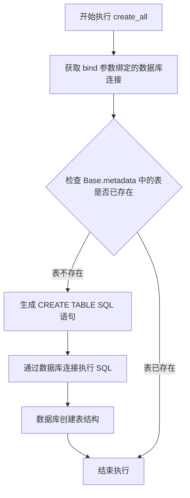

#### 带注释源码

```python
if __name__ == "__main__":
    # 导入数据库基础配置模块
    # Base: SQLAlchemy 的声明性基类，包含所有模型类的元数据
    # engine: 数据库引擎实例，负责管理数据库连接
    from chatchat.server.db.base import Base, engine

    # Base.metadata.create_all() 是 SQLAlchemy 的核心方法
    # 功能：根据 Base 中定义的所有模型类，在数据库中创建对应的表结构
    # 参数 bind=engine：将 engine（数据库引擎）绑定到 create_all 操作
    # 这样 SQLAlchemy 知道要在哪个数据库实例上创建表
    # 此处用于测试环境，初始化 Milvus 知识库服务所需的数据库表
    Base.metadata.create_all(bind=engine)
    
    # 创建 MilvusKBService 实例，用于后续知识库操作测试
    milvusService = MilvusKBService("test")
    
    # 测试根据文档 ID 获取文档内容
    print(milvusService.get_doc_by_ids(["444022434274215486"]))
```


### `MilvusKBService.get_collection`

该静态方法用于通过传入的 Milvus 集合名称获取对应的 Milvus Collection 对象，以便后续对集合进行查询、删除等操作。

参数：

- `milvus_name`：字符串类型，Milvus 集合的名称，用于定位并返回对应的 Collection 对象

返回值：`Collection`（来自 pymilvus），返回指定名称的 Milvus 集合对象，可用于执行搜索、查询、删除等操作

#### 流程图

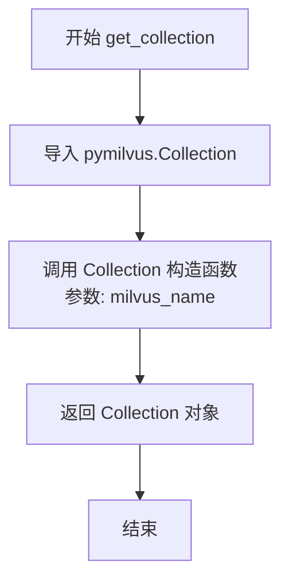

#### 带注释源码

```python
@staticmethod
def get_collection(milvus_name):
    """
    获取 Milvus 集合对象的静态方法
    
    参数:
        milvus_name: 集合名称，用于定位目标 Collection
    
    返回:
        Collection 对象
    """
    # 从 pymilvus 导入 Collection 类
    from pymilvus import Collection

    # 根据传入的集合名称实例化并返回 Collection 对象
    return Collection(milvus_name)
```


### `MilvusKBService.get_doc_by_ids`

根据给定的 ID 列表从 Milvus 向量数据库中查询对应的文档，并将其转换为 LangChain 的 Document 对象列表返回。

参数：

- `ids`：`List[str]`，需要查询的文档 ID 列表，每个 ID 为字符串类型

返回值：`List[Document]`：返回与给定 ID 列表对应的 Document 对象列表，每个 Document 包含页面内容（text）和元数据（metadata）

#### 流程图

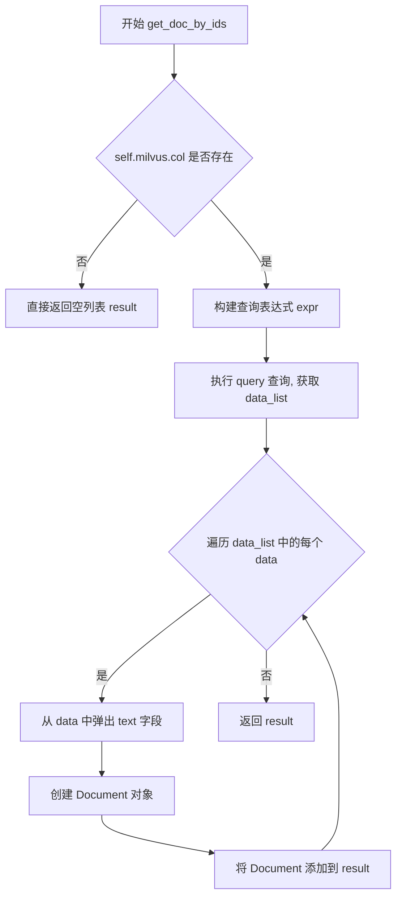

#### 带注释源码

```python
def get_doc_by_ids(self, ids: List[str]) -> List[Document]:
    """
    根据 ID 列表查询 Milvus 向量数据库中的文档
    
    参数:
        ids: 文档 ID 列表
        
    返回:
        Document 对象列表
    """
    # 初始化结果列表
    result = []
    
    # 检查 Milvus 集合对象是否存在
    if self.milvus.col:
        # 准备查询表达式，将 ID 列表转换为整数类型的主键查询条件
        # 注释: Milvus 的主键(pk) 通常为整数类型，需要将字符串 ID 转换为整数
        # ids = [int(id) for id in ids]  # for milvus if needed #pr 2725
        
        # 构建查询表达式: pk in [id1, id2, ...]
        # 使用 query 方法查询所有匹配主键的记录，output_fields=["*"] 返回所有字段
        data_list = self.milvus.col.query(
            expr=f"pk in {[int(_id) for _id in ids]}", output_fields=["*"]
        )
        
        # 遍历查询结果
        for data in data_list:
            # 从数据中弹出 "text" 字段作为文档内容
            # pop 方法会移除该字段，剩余的字段作为元数据
            text = data.pop("text")
            
            # 创建 LangChain Document 对象
            # page_content: 文档的文本内容
            # metadata: 剩余的字段作为元数据（已移除 text 字段）
            result.append(Document(page_content=text, metadata=data))
    
    # 返回查询到的文档列表
    return result
```


### `MilvusKBService.del_doc_by_ids`

根据ID列表删除Milvus向量数据库中的文档，通过构建pk主键过滤表达式调用Milvus客户端的delete方法实现批量删除。

参数：

- `ids`：`List[str]`，要删除的文档ID列表，每个ID为字符串类型

返回值：`bool`，实际返回`None`（代码声明返回bool但未实现返回值），表示删除操作是否成功

#### 流程图

```mermaid
flowchart TD
    A[开始 del_doc_by_ids] --> B{self.milvus.col 存在?}
    B -->|是| C[构建删除表达式 pk in {ids}]
    C --> D[调用 self.milvus.col.delete 删除文档]
    D --> E[返回结果]
    B -->|否| F[直接返回 None]
    E --> G[结束]
    F --> G
```

#### 带注释源码

```python
def del_doc_by_ids(self, ids: List[str]) -> bool:
    """
    根据ID列表删除Milvus向量数据库中的文档
    
    参数:
        ids: 文档ID列表，字符串类型的主键列表
        
    返回值:
        bool: 实际返回None，存在技术债务
    """
    # 直接调用Milvus客户端的delete方法，传入主键过滤表达式
    # 表达式格式: "pk in [id1, id2, ...]"
    # 注意：此处ids会被直接拼接到字符串中，未做类型转换
    self.milvus.col.delete(expr=f"pk in {ids}")
    
    # TODO: 技术债务 - 方法声明返回bool但实际无返回值
    # 应添加: return True 或根据删除结果返回实际状态
```


### `MilvusKBService.search`

执行向量搜索，从指定的Milvus集合中检索与给定内容最相似的文档。

参数：

- `milvus_name`：`str`，Milvus向量数据库集合的名称
- `content`：待搜索的向量内容或查询文本
- `limit`：`int`，返回结果的数量限制，默认为3

返回值：`Any`，PyMilvus集合的搜索结果，通常为包含匹配文档的列表

#### 流程图

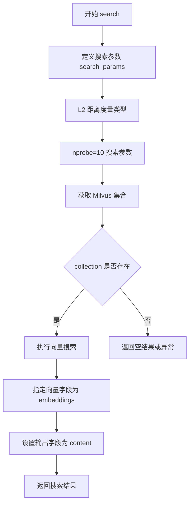

#### 带注释源码

```python
@staticmethod
def search(milvus_name, content, limit=3):
    """
    静态方法：执行向量搜索
    
    参数:
        milvus_name: str - Milvus集合名称
        content: 搜索向量或查询文本
        limit: int - 返回结果数量限制，默认3
    
    返回:
        PyMilvus搜索结果对象
    """
    # 定义搜索参数：使用L2欧氏距离度量，nprobe=10表示搜索10个聚类中心
    search_params = {
        "metric_type": "L2",
        "params": {"nprobe": 10},
    }
    # 通过集合名称获取Milvus集合对象
    c = MilvusKBService.get_collection(milvus_name)
    # 在集合中执行向量搜索，指定embeddings字段为向量字段
    # output_fields指定返回content字段内容
    return c.search(
        content, "embeddings", search_params, limit=limit, output_fields=["content"]
    )
```


### `MilvusKBService.do_create_kb`

该方法用于在 Milvus 向量数据库中创建一个新的知识库（Collection），负责初始化 Collection、配置索引参数并建立向量存储连接，是 MilvusKBService 类创建知识库的核心方法，目前为暂未实现的状态（空方法）。

参数：
- 该方法暂无显式参数（由类属性 `kb_name` 等从基类继承）

返回值：`None`，该方法无返回值，仅执行知识库创建操作

#### 流程图

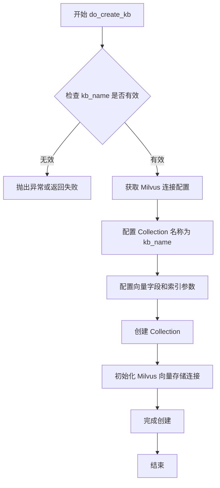

#### 带注释源码

```python
def do_create_kb(self):
    """
    创建 Milvus 知识库
    该方法负责在 Milvus 向量数据库中创建一个新的 Collection，
    包括 Collection 创建、索引配置和向量存储连接初始化。
    """
    # TODO: 实现创建知识库的逻辑
    # 参考其他方法实现，推断需要以下步骤：
    
    # 1. 从 Settings 获取 Milvus 配置参数
    # connection_args = Settings.kb_settings.kbs_config.get("milvus")
    # index_params = Settings.kb_settings.kbs_config.get("milvus_kwargs")["index_params"]
    # search_params = Settings.kb_settings.kbs_config.get("milvus_kwargs")["search_params"]
    
    # 2. 创建 Milvus 向量存储实例（类似 _load_milvus 但这里是新建）
    # self.milvus = Milvus(
    #     embedding_function=get_Embeddings(self.embed_model),
    #     collection_name=self.kb_name,
    #     connection_args=connection_args,
    #     index_params=index_params,
    #     search_params=search_params,
    #     auto_id=True,
    # )
    
    # 3. 如果需要手动创建 Collection，可以参考 do_drop_kb 的反向操作
    # collection = Collection(self.kb_name)
    # 创建向量字段 schema = Schema(...)
    # 创建索引 index = Index(...)
    
    pass
```


### `MilvusKBService.vs_type`

该方法用于返回 Milvus 向量知识库服务所支持的向量存储类型。

参数： 无

返回值：`str`，返回支持的向量存储类型，值为 `SupportedVSType.MILVUS`

#### 流程图

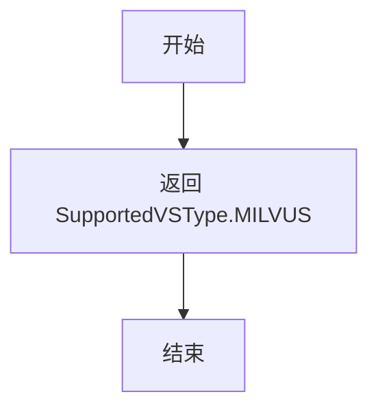

#### 带注释源码

```python
def vs_type(self) -> str:
    """
    返回支持的向量存储类型
    
    Returns:
        str: 支持的向量存储类型，值为 SupportedVSType.MILVUS
    """
    return SupportedVSType.MILVUS
```


### `MilvusKBService._load_milvus`

初始化Milvus向量数据库客户端，建立与Milvus服务器的连接并配置向量检索所需的参数。

参数：
- 该方法无显式参数（仅包含隐式参数 `self`）

返回值：`None`，该方法直接初始化 `self.milvus` 属性，不返回任何值

#### 流程图

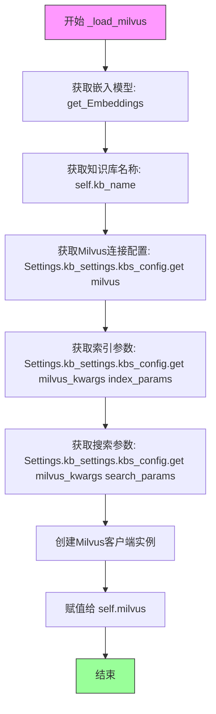

#### 带注释源码

```python
def _load_milvus(self):
    """
    初始化Milvus向量数据库客户端
    
    该方法完成以下任务：
    1. 获取嵌入模型函数
    2. 配置Milvus连接参数
    3. 创建Milvus客户端实例并赋值给self.milvus
    """
    # 使用当前配置的嵌入模型初始化Milvus客户端
    # embedding_function: 用于将文本转换为向量表示
    self.milvus = Milvus(
        # 获取嵌入模型实例，用于向量化和相似度计算
        embedding_function=get_Embeddings(self.embed_model),
        # 指定Milvus集合名称，对应知识库名称
        collection_name=self.kb_name,
        # Milvus服务器连接参数（主机、端口等）
        connection_args=Settings.kb_settings.kbs_config.get("milvus"),
        # 索引构建参数，定义向量索引类型和相关配置
        index_params=Settings.kb_settings.kbs_config.get("milvus_kwargs")["index_params"],
        # 搜索参数，定义查询时的相关配置
        search_params=Settings.kb_settings.kbs_config.get("milvus_kwargs")["search_params"],
        # 启用自动ID生成，主键将由Milvus自动分配
        auto_id=True,
    )
```

#### 补充说明

| 项目 | 说明 |
|------|------|
| **调用场景** | 在 `do_init()` 方法中被调用，用于初始化知识库连接 |
| **依赖配置** | 依赖 `Settings.kb_settings.kbs_config` 中的 `milvus` 和 `milvus_kwargs` 配置项 |
| **状态管理** | 每次调用都会创建新的 `Milvus` 客户端实例，可能存在连接池优化的空间 |
| **异常处理** | 当前实现未包含异常捕获逻辑，配置缺失时可能导致 KeyError |


### `MilvusKBService.do_init`

该方法负责执行 Milvus 知识库服务的初始化操作。它作为初始化入口，调用内部方法 `_load_milvus()` 来读取配置、初始化 Embedding 函数并建立与 Milvus 向量数据库的连接。

参数：
- 无（仅包含隐式参数 `self`）

返回值：`None`，无返回值，仅执行初始化逻辑。

#### 流程图

```mermaid
graph TD
    A([开始 do_init]) --> B[调用 self._load_milvus()]
    B --> C{获取配置信息}
    C --> D[获取 Embedding 模型]
    C --> E[获取 connection_args, index_params, search_params]
    D --> F[初始化 Milvus 客户端实例]
    E --> F
    F --> G([结束 do_init])
```

#### 带注释源码

```python
def do_init(self):
    """
    执行知识库的初始化操作。
    该方法作为初始化入口，调用内部的 _load_milvus 方法，
    加载配置文件中的 Milvus 连接参数及索引参数，并初始化 Embedding 函数，
    最终创建 Milvus 客户端实例赋值给 self.milvus。
    """
    self._load_milvus()
```


### `MilvusKBService.do_drop_kb`

该方法用于删除知识库，核心功能是释放并删除 Milvus 向量数据库中的集合，释放相关资源。

参数：

- 该方法无显式参数（隐含参数 `self` 为 `MilvusKBService` 实例）

返回值：`None`，无返回值，方法执行完成后直接结束

#### 流程图

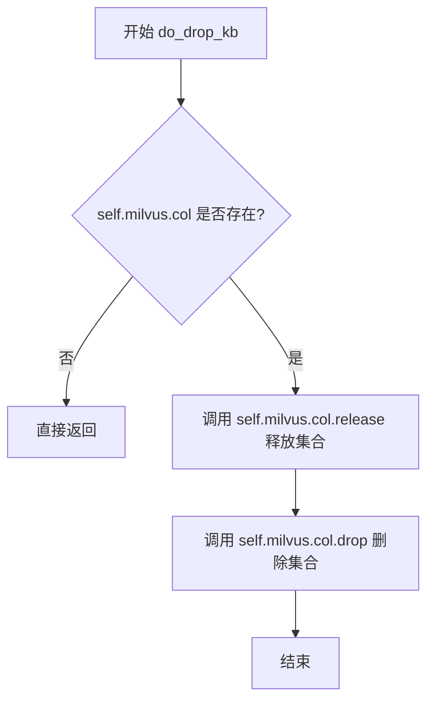

#### 带注释源码

```python
def do_drop_kb(self):
    """
    删除知识库，释放并删除 Milvus 集合
    
    该方法执行以下操作：
    1. 检查 Milvus 集合对象是否存在
    2. 如果存在，先释放集合（release），释放占用的内存和计算资源
    3. 然后删除集合（drop），彻底移除集合及其所有数据
    """
    # 检查 milvus 集合对象是否存在，避免对空对象操作
    if self.milvus.col:
        # 释放集合，释放分配给该集合的计算资源（如内存、索引等）
        self.milvus.col.release()
        # 删除集合，彻底移除该知识库的所有数据（向量、索引、元数据）
        self.milvus.col.drop()
```


### `MilvusKBService.do_search`

执行向量相似度搜索，从 Milvus 向量数据库中检索与查询语句最相似的文档，支持通过分数阈值过滤低相关性结果。

参数：

- `query`：`str`，用户输入的查询语句，用于在向量空间中进行相似度搜索
- `top_k`：`int`，返回最相似的文档数量上限
- `score_threshold`：`float`，用于过滤低相关性文档的分数阈值，只有分数高于该值的文档才会被返回

返回值：`List[langchain.schema.Document]`，返回与查询语句最相似的文档列表，每个 Document 包含页面内容和元数据

#### 流程图

```mermaid
flowchart TD
    A[开始 do_search] --> B[调用 _load_milvus 加载 Milvus 连接]
    B --> C[调用 get_Retriever 创建向量检索器]
    C --> D[配置检索器参数: top_k, score_threshold]
    D --> E[调用 retriever.get_relevant_documents 执行搜索]
    E --> F[返回文档列表 List[Document]]
    
    B -->|已加载| G[跳过加载直接使用]
    G --> C
```

#### 带注释源码

```python
def do_search(self, query: str, top_k: int, score_threshold: float):
    """
    执行向量相似度搜索
    
    参数:
        query: str - 用户查询字符串
        top_k: int - 返回结果数量上限
        score_threshold: float - 相似度分数阈值
    返回:
        List[Document] - 相似文档列表
    """
    # Step 1: 确保 Milvus 连接已加载，若未加载则初始化连接
    self._load_milvus()
    
    # 注释掉的备选方案：直接使用 embedding 函数和相似度搜索
    # embed_func = get_Embeddings(self.embed_model)
    # embeddings = embed_func.embed_query(query)
    # docs = self.milvus.similarity_search_with_score_by_vector(embeddings, top_k)
    
    # Step 2: 通过工具函数获取 Milvus 向量存储的检索器
    # 使用 langchain 的 Retriever 封装，支持 score_threshold 过滤
    retriever = get_Retriever("milvusvectorstore").from_vectorstore(
        self.milvus,           # Milvus 向量存储实例
        top_k=top_k,           # 返回 top_k 条最相似结果
        score_threshold=score_threshold,  # 最小相似度阈值
    )
    
    # Step 3: 使用检索器获取与查询相关的文档
    docs = retriever.get_relevant_documents(query)
    
    # Step 4: 返回结果文档列表
    return docs
```


### `MilvusKBService.do_add_doc`

该方法用于将文档添加到 Milvus 向量知识库中，遍历待添加的文档，将文档的元数据转换为字符串格式并填充默认字段，然后调用 Milvus 客户端添加文档并返回包含文档 ID 和元数据的信息列表。

参数：

- `self`：`MilvusKBService`，表示类的实例本身
- `docs`：`List[Document]`（langchain 的 Document 对象列表），待添加到知识库的文档列表
- `**kwargs`：`dict`，可选的额外关键字参数，用于扩展功能（如日志记录、事务控制等）

返回值：`List[Dict]`，返回包含每个文档 ID 和元数据的字典列表，格式为 `[{"id": str, "metadata": dict}, ...]`

#### 流程图

```mermaid
flowchart TD
    A[开始 do_add_doc] --> B[遍历 docs 列表]
    B --> C{遍历是否结束}
    C -->|否| D[获取当前文档 doc]
    D --> E[遍历 doc.metadata 的键值对]
    E --> F[将 metadata 值转换为字符串 str(v)]
    F --> G[更新 doc.metadata[k] = str(v)]
    G --> H[遍历 self.milvus.fields]
    H --> I[为缺失字段设置默认值空字符串]
    I --> J[删除 text_field 字段]
    J --> K[删除 vector_field 字段]
    K --> C
    C -->|是| L[调用 self.milvus.add_documents(docs)]
    L --> M[获取返回的 ids 列表]
    M --> N[构建 doc_infos 列表]
    N --> O[返回 doc_infos]
    O --> P[结束]
```

#### 带注释源码

```python
def do_add_doc(self, docs: List[Document], **kwargs) -> List[Dict]:
    """
    将文档添加到 Milvus 向量知识库
    
    参数:
        docs: Document 对象列表，每个 Document 包含 page_content（文本内容）和 metadata（元数据）
        **kwargs: 可选的额外参数
    
    返回:
        包含文档 ID 和元数据的字典列表
    """
    # 遍历每个待添加的文档
    for doc in docs:
        # 将文档的所有元数据值转换为字符串类型
        # Milvus 要求字段值为字符串格式
        for k, v in doc.metadata.items():
            doc.metadata[k] = str(v)
        
        # 遍历 Milvus 集合的字段定义
        # 为文档元数据设置默认空字符串，确保所有字段都有值
        for field in self.milvus.fields:
            doc.metadata.setdefault(field, "")
        
        # 移除 Milvus 内部使用的文本字段
        # _text_field 是存储原始文本的字段，不需要在 metadata 中
        doc.metadata.pop(self.milvus._text_field, None)
        
        # 移除 Milvus 内部使用的向量字段
        # _vector_field 是存储向量嵌入的字段，不需要在 metadata 中
        doc.metadata.pop(self.milvus._vector_field, None)

    # 调用 Milvus 客户端的 add_documents 方法批量添加文档
    # 该方法会返回生成的文档 ID 列表
    ids = self.milvus.add_documents(docs)
    
    # 构建返回结果列表，每个元素包含文档 ID 和对应的元数据
    doc_infos = [{"id": id, "metadata": doc.metadata} for id, doc in zip(ids, docs)]
    
    return doc_infos
```


### `MilvusKBService.do_delete_doc`

该方法用于从 Milvus 向量数据库中删除指定知识库文件对应的向量数据。首先通过知识库名称和文件名查询对应的文档 ID 列表，然后使用 Milvus 的删除接口根据主键（pk）删除向量记录。

参数：

- `kb_file`：`KnowledgeFile`，包含知识库名称（`kb_name`）和文件名（`filename`）的文档对象，用于定位待删除的文档。
- `**kwargs`：`Any`，可选参数，用于传递额外的删除配置（如条件过滤等，目前代码中未使用但保留扩展性）。

返回值：`None`，该方法直接操作向量数据库，不返回具体的删除结果（删除操作通常由数据库侧成功/失败控制）。

#### 流程图

```mermaid
flowchart TD
    A[开始删除文档] --> B[调用 list_file_num_docs_id_by_kb_name_and_file_name]
    B --> C[根据 kb_name 和 filename 获取 ID 列表]
    C --> D{检查 self.milvus.col 是否存在}
    D -- 是 --> E[构建删除表达式: pk in {id_list}]
    E --> F[调用 self.milvus.col.delete 删除向量]
    F --> G[结束]
    D -- 否 --> G
```

#### 带注释源码

```python
def do_delete_doc(self, kb_file: KnowledgeFile, **kwargs):
    """
    删除指定知识库文件在 Milvus 向量数据库中的向量数据。

    参数:
        kb_file (KnowledgeFile): 包含 kb_name 和 filename 的知识文件对象。
        **kwargs: 额外的关键字参数（当前未使用，保留扩展）。
    """
    # 步骤1: 从数据库中查询该知识库下指定文件名对应的所有文档 ID
    # 这些 ID 对应于向量数据库中的主键 (pk)
    id_list = list_file_num_docs_id_by_kb_name_and_file_name(
        kb_file.kb_name, kb_file.filename
    )

    # 步骤2: 检查 Milvus 集合对象是否已初始化加载
    if self.milvus.col:
        # 步骤3: 构建 Milvus 删除表达式，使用主键 (pk) 匹配要删除的向量记录
        # 表达式格式例如: "pk in [123, 456]"
        self.milvus.col.delete(expr=f"pk in {id_list}")
        
        # 注意: 代码中包含一段被注释掉的 Windows 平台兼容性处理逻辑 (Issue 2846)，
        # 原本通过文件名匹配删除，但当前逻辑主要依赖数据库返回的 ID 列表。
```


### `MilvusKBService.do_clear_vs`

该方法用于清空向量存储，先通过 `do_drop_kb()` 删除整个 Milvus 集合，再通过 `do_init()` 重新初始化集合，从而实现向量存储的重置。

参数：

- 该方法无参数（仅含 `self` 隐式参数）

返回值：`None`，无返回值

#### 流程图

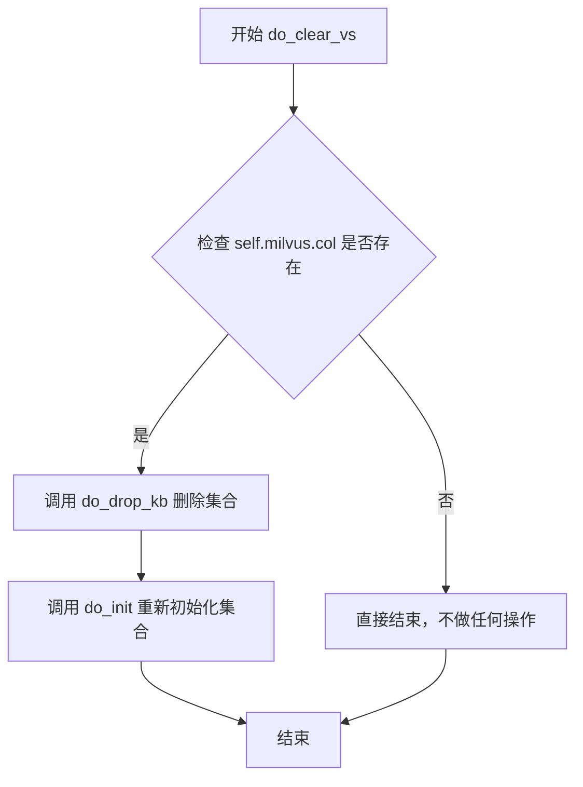

#### 带注释源码

```python
def do_clear_vs(self):
    """
    清空向量存储（先删除后重新初始化）
    """
    # 检查 Milvus 集合对象是否存在
    if self.milvus.col:
        # 调用 do_drop_kb 方法删除整个集合（释放并删除）
        self.do_drop_kb()
        # 调用 do_init 方法重新初始化集合
        self.do_init()
```

## 关键组件


### 一段话描述

该代码实现了基于Milvus向量数据库的知识库服务（MilvusKBService），继承自KBService基类，提供文档的创建、搜索、添加、删除等核心功能，支持通过向量检索实现知识库问答，并采用惰性加载机制初始化Milvus连接以优化资源使用。

### 文件的整体运行流程

1. **初始化阶段**：MilvusKBService实例化时调用do_init()，通过_load_milvus()惰性加载Milvus客户端连接
2. **文档操作**：
   - 添加文档：do_add_doc()处理元数据并调用milvus.add_documents()
   - 查询文档：get_doc_by_ids()通过主键批量查询文档
   - 删除文档：del_doc_by_ids()或do_delete_doc()按ID删除文档
3. **搜索阶段**：do_search()使用Retriever从向量存储中检索相关文档，支持score_threshold过滤
4. **清理阶段**：do_drop_kb()释放并删除集合，do_clear_vs()先删除再重新初始化

### 类的详细信息

#### 类：MilvusKBService

**基类**：KBService

**类字段**：

| 字段名 | 类型 | 描述 |
|--------|------|------|
| milvus | Milvus | Milvus向量数据库客户端实例 |

**类方法**：

##### get_collection (静态方法)

| 项目 | 详情 |
|------|------|
| 参数 | milvus_name: str - Milvus集合名称 |
| 返回值 | Collection - Milvus集合对象 |
| 描述 | 根据名称获取Milvus集合对象 |

##### get_doc_by_ids

| 项目 | 详情 |
|------|------|
| 参数 | ids: List[str] - 文档主键列表 |
| 返回值 | List[Document] - Document对象列表 |
| 描述 | 根据主键列表批量查询文档内容 |

**mermaid流程图**：
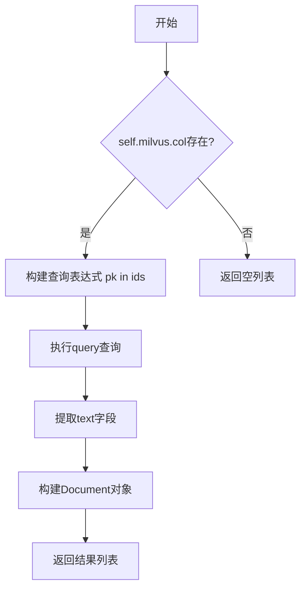

**源码**：
```python
def get_doc_by_ids(self, ids: List[str]) -> List[Document]:
    result = []
    if self.milvus.col:
        # ids = [int(id) for id in ids]  # for milvus if needed #pr 2725
        data_list = self.milvus.col.query(
            expr=f"pk in {[int(_id) for _id in ids]}", output_fields=["*"]
        )
        for data in data_list:
            text = data.pop("text")
            result.append(Document(page_content=text, metadata=data))
    return result
```

##### del_doc_by_ids

| 项目 | 详情 |
|------|------|
| 参数 | ids: List[str] - 文档主键列表 |
| 返回值 | bool |
| 描述 | 根据主键列表删除文档 |

**源码**：
```python
def del_doc_by_ids(self, ids: List[str]) -> bool:
    self.milvus.col.delete(expr=f"pk in {ids}")
```

##### search (静态方法)

| 项目 | 详情 |
|------|------|
| 参数 | milvus_name: str, content: str, limit: int = 3 |
| 返回值 | 查询结果 |
| 描述 | 直接在Milvus集合中执行向量搜索 |

**源码**：
```python
@staticmethod
def search(milvus_name, content, limit=3):
    search_params = {
        "metric_type": "L2",
        "params": {"nprobe": 10},
    }
    c = MilvusKBService.get_collection(milvus_name)
    return c.search(
        content, "embeddings", search_params, limit=limit, output_fields=["content"]
    )
```

##### do_create_kb

| 项目 | 详情 |
|------|------|
| 参数 | 无 |
| 返回值 | None |
| 描述 | 创建知识库（当前为空实现） |

##### vs_type

| 项目 | 详情 |
|------|------|
| 参数 | 无 |
| 返回值 | str |
| 描述 | 返回支持的向量存储类型标识 |

**源码**：
```python
def vs_type(self) -> str:
    return SupportedVSType.MILVUS
```

##### _load_milvus

| 项目 | 详情 |
|------|------|
| 参数 | 无 |
| 返回值 | None |
| 描述 | 惰性加载Milvus客户端连接，初始化向量存储配置 |

**mermaid流程图**：
```mermaid
flowchart TD
    A[开始] --> B[获取embedding函数]
    B --> C[构建Milvus客户端参数]
    C --> D[创建Milvus实例: collection_name, connection_args, index_params, search_params, auto_id]
    D --> E[赋值给self.milvus]
```

**源码**：
```python
def _load_milvus(self):
    self.milvus = Milvus(
        embedding_function=get_Embeddings(self.embed_model),
        collection_name=self.kb_name,
        connection_args=Settings.kb_settings.kbs_config.get("milvus"),
        index_params=Settings.kb_settings.kbs_config.get("milvus_kwargs")["index_params"],
        search_params=Settings.kb_settings.kbs_config.get("milvus_kwargs")["search_params"],
        auto_id=True,
    )
```

##### do_init

| 项目 | 详情 |
|------|------|
| 参数 | 无 |
| 返回值 | None |
| 描述 | 初始化知识库，调用_load_milvus加载连接 |

##### do_drop_kb

| 项目 | 详情 |
|------|------|
| 参数 | 无 |
| 返回值 | None |
| 描述 | 释放并删除Milvus集合 |

**源码**：
```python
def do_drop_kb(self):
    if self.milvus.col:
        self.milvus.col.release()
        self.milvus.col.drop()
```

##### do_search

| 项目 | 详情 |
|------|------|
| 参数 | query: str - 查询文本, top_k: int - 返回数量, score_threshold: float - 分数阈值 |
| 返回值 | List[Document] - 相关文档列表 |
| 描述 | 使用Retriever执行向量相似度搜索 |

**mermaid流程图**：
```mermaid
flowchart TD
    A[开始] --> B[加载Milvus连接]
    B --> C[创建Retriever从向量存储]
    C --> D[设置top_k和score_threshold]
    D --> E[执行get_relevant_documents]
    E --> F[返回文档列表]
```

**源码**：
```python
def do_search(self, query: str, top_k: int, score_threshold: float):
    self._load_milvus()
    # embed_func = get_Embeddings(self.embed_model)
    # embeddings = embed_func.embed_query(query)
    # docs = self.milvus.similarity_search_with_score_by_vector(embeddings, top_k)
    retriever = get_Retriever("milvusvectorstore").from_vectorstore(
        self.milvus,
        top_k=top_k,
        score_threshold=score_threshold,
    )
    docs = retriever.get_relevant_documents(query)
    return docs
```

##### do_add_doc

| 项目 | 详情 |
|------|------|
| 参数 | docs: List[Document] - 文档列表, **kwargs |
| 返回值 | List[Dict] - 包含id和metadata的字典列表 |
| 描述 | 添加文档到知识库，处理元数据字段 |

**mermaid流程图**：
```mermaid
flowchart TD
    A[开始] --> B[遍历每个文档]
    B --> C[转换metadata值为字符串]
    C --> D[设置默认字段值]
    D --> E[移除text和vector字段]
    E --> F[调用milvus.add_documents]
    F --> G[构建doc_infos返回]
```

**源码**：
```python
def do_add_doc(self, docs: List[Document], **kwargs) -> List[Dict]:
    for doc in docs:
        for k, v in doc.metadata.items():
            doc.metadata[k] = str(v)
        for field in self.milvus.fields:
            doc.metadata.setdefault(field, "")
        doc.metadata.pop(self.milvus._text_field, None)
        doc.metadata.pop(self.milvus._vector_field, None)

    ids = self.milvus.add_documents(docs)
    doc_infos = [{"id": id, "metadata": doc.metadata} for id, doc in zip(ids, docs)]
    return doc_infos
```

##### do_delete_doc

| 项目 | 详情 |
|------|------|
| 参数 | kb_file: KnowledgeFile - 知识库文件, **kwargs |
| 返回值 | None |
| 描述 | 根据文件名删除对应文档 |

**源码**：
```python
def do_delete_doc(self, kb_file: KnowledgeFile, **kwargs):
    id_list = list_file_num_docs_id_by_kb_name_and_file_name(
        kb_file.kb_name, kb_file.filename
    )
    if self.milvus.col:
        self.milvus.col.delete(expr=f"pk in {id_list}")

    # Issue 2846, for windows
    # if self.milvus.col:
    #     file_path = kb_file.filepath.replace("\\", "\\\\")
    #     file_name = os.path.basename(file_path)
    #     id_list = [item.get("pk") for item in
    #                self.milvus.col.query(expr=f'source == "{file_name}"', output_fields=["pk"])]
    #     self.milvus.col.delete(expr=f"pk in {id_list}")
```

##### do_clear_vs

| 项目 | 详情 |
|------|------|
| 参数 | 无 |
| 返回值 | None |
| 描述 | 清空向量存储，先删除后重新初始化 |

**源码**：
```python
def do_clear_vs(self):
    if self.milvus.col:
        self.do_drop_kb()
        self.do_init()
```

### 关键组件信息

#### Milvus向量客户端

Milvus向量数据库客户端封装，集成embedding_function实现向量化和相似度搜索。

#### 惰性加载机制（_load_milvus）

采用惰性加载策略，仅在首次需要时初始化Milvus连接，配置index_params和search_params参数。

#### Retriever搜索组件

通过get_Retriever获取MilvusVectorStore的Retriever，支持top_k和score_threshold参数进行向量检索。

#### 元数据处理管道

do_add_doc中的元数据预处理流程：类型转换、字段填充、冗余字段移除。

### 潜在的技术债务或优化空间

1. **反量化支持缺失**：代码中直接使用原始向量进行搜索，未实现显式的向量反量化或重量化逻辑
2. **量化策略不透明**：量化策略完全依赖Settings配置，代码中无显式控制
3. **硬编码字段处理**：_text_field和_vector_field通过milvus内部属性访问，缺乏抽象
4. **错误处理不足**：大多数方法缺少异常捕获和重试机制
5. **静态方法search的冗余**：search静态方法与do_search功能重复，且使用L2距离硬编码
6. **Windows兼容代码注释**：Issue 2846的Windows兼容代码被注释，但未清理

### 其它项目

#### 设计目标与约束

- 支持Milvus向量数据库作为知识库后端
- 遵循KBService抽象接口设计
- 通过embedding_function实现文本向量化

#### 错误处理与异常设计

- 使用条件判断避免空指针操作（如`if self.milvus.col`）
- 缺少try-except保护，异常会直接向上传播

#### 数据流与状态机

- 文档添加：Document → 元数据处理 → Milvus存储 → 返回ID
- 文档查询：query文本 → Retriever向量化 → Milvus向量搜索 → Document列表
- 文档删除：文件名 → ID列表查询 → Milvus删除

#### 外部依赖与接口契约

- 依赖langchain.vectorstores.milvus.Milvus
- 依赖chatchat.server.utils.get_Embeddings获取embedding函数
- 依赖chatchat.server.file_rag.utils.get_Retriever获取检索器
- 依赖Settings.kb_settings.kbs_config配置连接参数


## 问题及建议


### 已知问题

-   **硬编码的搜索参数**：search方法中硬编码了metric_type为"L2"和nprobe为10，缺乏灵活性，无法适配不同的度量类型（如IP、COSINE等）
-   **缺失异常处理**：多个关键方法（do_search、do_add_doc、do_delete_doc等）没有异常处理机制，可能导致程序崩溃或难以追踪的错误
-   **重复加载Milvus实例**：do_search方法每次调用都会执行_load_milvus()，存在重复初始化性能开销
-   **潜在的SQL注入风险**：使用f-string直接格式化ids到查询表达式中（如f"pk in {[int(_id) for _id in ids]}"），虽然Milvus有自己的查询语言，但缺乏输入验证
-   **类型转换注释代码**：get_doc_by_ids中注释掉的ids转换代码表明类型处理可能存在问题或历史遗留代码
-   **空实现方法**：do_create_kb方法是空实现（pass），可能导致调用时的意外行为
-   **未使用的导入**：导入了os模块但在代码中未使用
-   **元数据修改副作用**：do_add_doc方法直接修改传入文档的metadata（str(v)转换），可能产生副作用

### 优化建议

-   **配置化搜索参数**：将metric_type、nprobe等参数提取到配置文件或KBService基类中，支持不同场景的配置
-   **添加异常处理**：为所有数据库操作添加try-except块，捕获并合理处理可能的连接错误、查询错误等
-   **优化Milvus实例加载**：实现单例模式或缓存机制，避免重复初始化，或在KBService初始化时加载一次
-   **输入验证**：对传入的ids进行类型和格式验证，确保安全可靠的查询表达式构造
-   **统一类型处理**：确定并统一ids的类型处理策略，清理注释掉的代码
-   **完善空实现**：为do_create_kb添加适当的实现或明确的文档说明其预期行为
-   **移除未使用导入**：清理未使用的os导入
-   **文档对象保护**：在do_add_doc中操作metadata前先进行深拷贝，避免修改原文档对象

## 其它


### 设计目标与约束

本模块旨在为ChatChat系统提供基于Milvus向量数据库的知识库服务能力，支持文档的向量化存储、相似度搜索和生命周期管理。设计约束包括：依赖LangChain的Milvus集成实现、要求Milvus服务可用、需配置正确的connection_args和index/search参数、支持auto_id自增主键、仅支持L2距离度量方式。

### 错误处理与异常设计

代码中错误处理较弱，主要依赖pymilvus和langchain的异常抛出。需补充的错误处理包括：get_collection时捕获CollectionNotFoundException处理知识库不存在场景；query和delete操作前检查self.milvus.col是否存在；do_search中捕获异常并返回空列表；do_add_doc中捕获MilvusException处理文档添加失败；_load_milvus时捕获ConnectionException处理连接失败。所有公开方法应添加try-except并记录日志。

### 数据流与状态机

数据流分为三部分：文档导入流程（do_add_doc）将Document对象转为Milvus格式并调用add_documents返回ids；搜索流程（do_search）接收query字符串，经get_Retriever获取向量检索器，返回相关文档列表；删除流程（do_delete_doc）通过file_num_docs_id关联查询待删ids并执行delete。状态机方面，MilvusKBService实例存在uninitialized（未加载milvus对象）、initialized（已加载milvus连接）两种状态，通过do_init/do_drop_kb切换。

### 外部依赖与接口契约

本类依赖以下外部组件：pymilvus的Collection类用于获取集合；langchain.vectorstores.milvus.Milvus用于向量存储；langchain.schema.Document定义文档结构；chatchat.settings.Settings获取配置；chatchat.server.utils.get_Embeddings获取embedding函数；chatchat.server.file_rag.utils.get_Retriever获取检索器；chatchat.server.db.repository.list_file_num_docs_id_by_kb_name_and_file_name查询文档ID。接口契约要求KBService子类必须实现vs_type()返回SupportedVSType.MILVUS，以及do_create_kb/do_init/do_drop_kb/do_search/do_add_doc/do_delete_doc/do_clear_vs等方法。

### 配置管理

配置通过Settings.kb_settings.kbs_config获取，分为两部分：connection_args用于建立Milvus连接（包含host、port等）；index_params和search_params分别定义索引创建参数和搜索参数。search_params中metric_type固定为L2，params中nprobe默认为10。配置缺失时会导致_load_milvus失败，建议添加配置校验和默认值设置。

### 性能考量与优化空间

当前实现存在性能问题：do_search每次调用都执行_load_milvus重建连接，建议缓存milvus实例；do_add_doc中循环处理metadata效率低，应向量化处理；search方法使用content字段而非向量搜索，语义准确性不足；未实现批量查询优化，get_doc_by_ids建议改为单次query；缺少连接池复用机制。建议使用类实例变量缓存milvus对象，添加连接池配置，支持批量操作。

### 安全性考虑

代码未进行安全加固，需关注：connection_args中的Milvus凭证需加密存储；user_input直接拼接到expr表达式存在注入风险（虽pk为数值但建议参数化）；do_delete_doc的id_list来源需校验；敏感信息不应出现在日志中。建议添加输入验证、使用参数化查询、配置日志脱敏。

### 兼容性说明

代码中存在版本兼容注释：ids类型转换注释提到"for milvus if needed #pr 2725"表明曾有版本问题；Windows路径处理注释（Issue 2846）表明跨平台兼容性考虑；auto_id=True依赖Milvus服务端自动生成ID。当前代码假设Milvus 2.x版本，与LangChain 0.1.x兼容。

### 版本演进与扩展性

vs_type()方法标识当前为MILVUS类型，便于基类路由。扩展性设计包括：do_add_doc支持kwargs传递额外参数；do_delete_doc预留了基于filename删除的备选方案（被注释）。未来可扩展方向：支持更多metric_type（如IP、COSINE）、支持分区(partition)管理、支持自定义field映射。


    