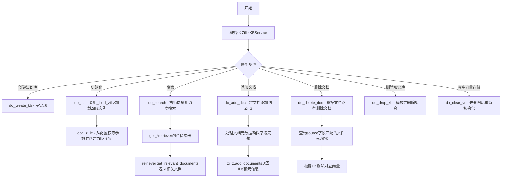
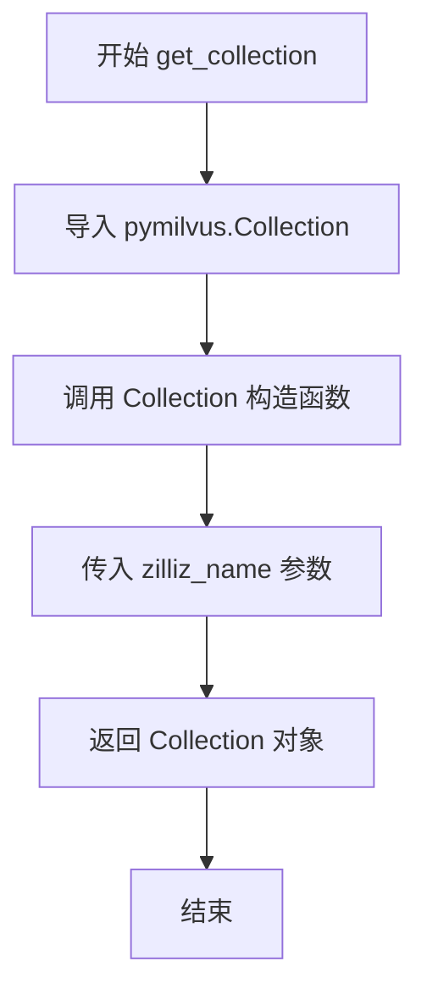
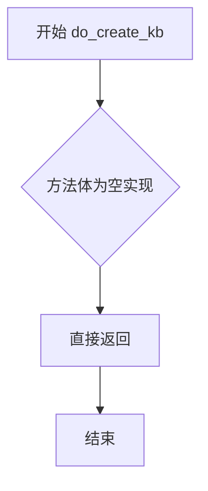
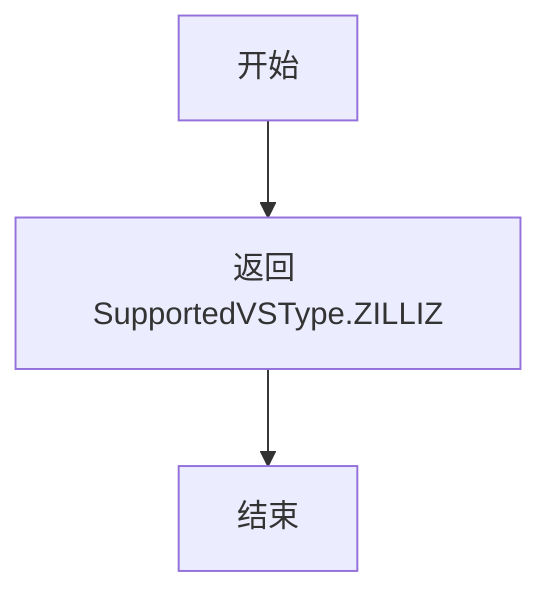
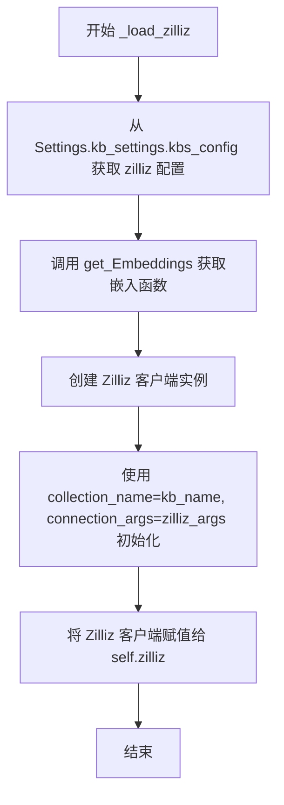
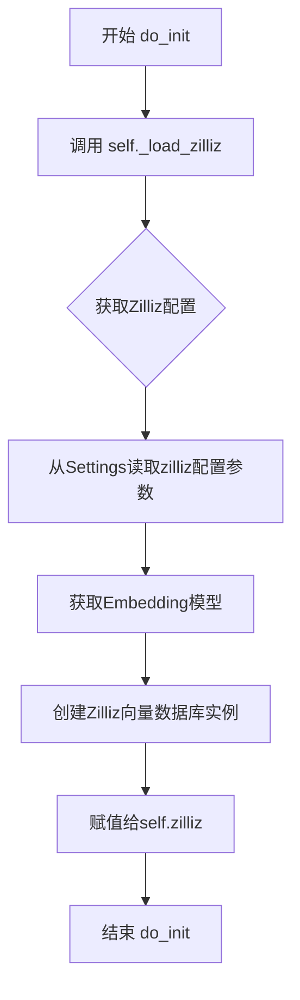
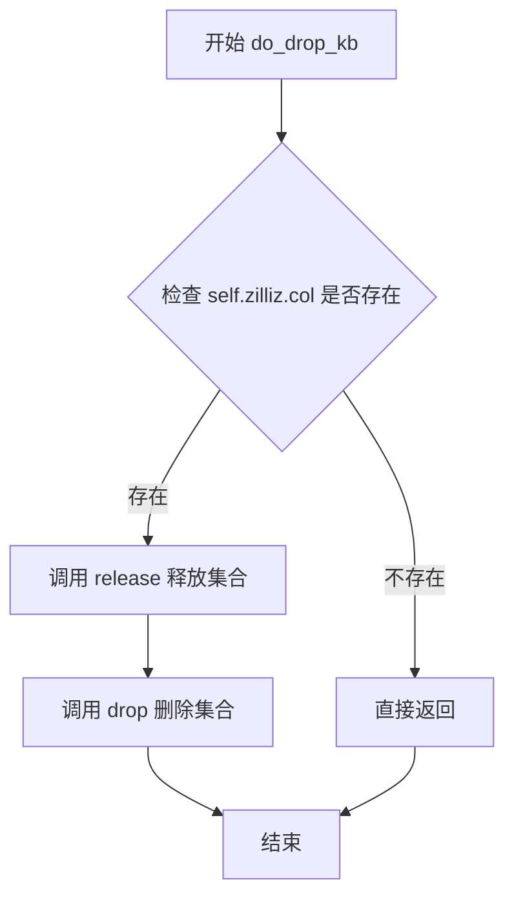
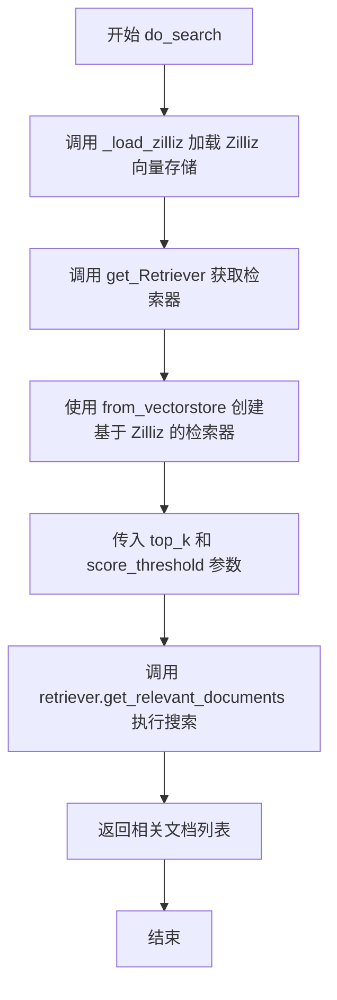
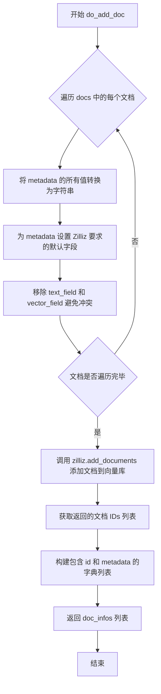
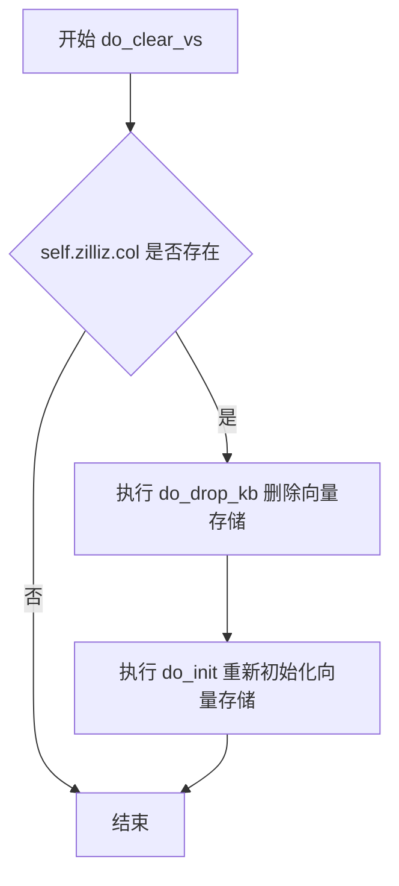

# `Langchain-Chatchat\libs\chatchat-server\chatchat\server\knowledge_base\kb_service\zilliz_kb_service.py` 详细设计文档

该代码实现了一个名为ZillizKBService的知识库服务类，继承自KBService抽象基类，用于将LangChain框架与Zilliz云端向量数据库进行集成，提供文档的添加、删除、搜索和知识库管理功能。

## 整体流程



## 类结构

```
KBService (抽象基类)
└── ZillizKBService (Zilliz云端向量数据库服务实现)
```

## 全局变量及字段


### `ZillizKBService.zilliz`
    
Zilliz向量数据库客户端实例

类型：`Zilliz`
    
    

## 全局函数及方法


### `ZillizKBService.get_collection`

获取 Zilliz 向量数据库中指定名称的 Collection 对象，用于后续的向量检索操作。

**参数：**

- `zilliz_name`：`str`，集合名称

**返回值：** `Collection`，pymilvus的Collection对象

#### 流程图



#### 带注释源码

```python
@staticmethod
def get_collection(zilliz_name):
    """
    获取 Zilliz 向量数据库中指定名称的 Collection 对象
    
    Args:
        zilliz_name: 集合名称，用于指定要连接的 Zilliz 集合
        
    Returns:
        Collection: pymilvus 的 Collection 对象，可用于搜索、查询等操作
    """
    # 动态导入 pymilvus 的 Collection 类，避免在模块级别导入可能不存在的依赖
    from pymilvus import Collection

    # 根据传入的集合名称创建并返回 Collection 对象
    # 该对象封装了对 Zilliz 集合的各种操作方法
    return Collection(zilliz_name)
```


### `ZillizKBService.get_doc_by_ids`

根据给定的文档ID列表，从Zilliz向量数据库中查询对应的文档对象，并返回LangChain的Document对象列表。

参数：

- `ids`：`List[str]`，文档ID列表

返回值：`List[Document]`，根据IDs查询到的LangChain Document对象列表

#### 流程图

```mermaid
flowchart TD
    A[开始 get_doc_by_ids] --> B{self.zilliz.col 是否存在}
    B -->|否| C[返回空列表]
    B -->|是| D[构建查询表达式 expr = f"pk in {ids}"]
    D --> E[调用 self.zilliz.col.query 查询数据]
    E --> F{data_list 是否为空}
    F -->|是| C
    F -->|否| G[遍历 data_list]
    G --> H[提取 text 字段作为 page_content]
    H --> I[将剩余字段作为 metadata]
    I --> J[创建 Document 对象]
    J --> K[添加到 result 列表]
    K --> G
    G --> L[返回 result 列表]
    C --> L
```

#### 带注释源码

```python
def get_doc_by_ids(self, ids: List[str]) -> List[Document]:
    """
    根据IDs查询文档
    
    参数:
        ids: 文档ID列表
        
    返回:
        Document对象列表
    """
    # 初始化结果列表
    result = []
    
    # 检查Zilliz集合是否存在
    if self.zilliz.col:
        # 构建查询表达式，使用pk字段匹配IDs
        # 表达式格式: "pk in ['id1', 'id2', ...]"
        data_list = self.zilliz.col.query(
            expr=f"pk in {ids}",  # 查询表达式
            output_fields=["*"]    # 返回所有字段
        )
        
        # 遍历查询结果
        for data in data_list:
            # 从数据中提取text字段作为文档内容
            text = data.pop("text")
            
            # 创建LangChain Document对象
            # page_content: 文档文本内容
            # metadata: 除text外的其他字段作为元数据
            result.append(Document(page_content=text, metadata=data))
    
    # 返回查询到的文档列表
    return result
```


### `ZillizKBService.del_doc_by_ids`

该方法接收一个文档ID列表，调用Zilliz向量数据库的删除操作，根据主键（pk）删除对应的文档记录。

参数：

- `ids`：`List[str]`，要删除的文档ID列表

返回值：`bool`，删除操作是否成功

#### 流程图

```mermaid
flowchart TD
    A[开始 del_doc_by_ids] --> B{检查 self.zilliz.col 是否存在}
    B -->|存在| C[构建删除表达式: pk in {ids}]
    B -->|不存在| D[跳过删除, 返回None]
    C --> E[调用 zilliz.col.delete 删除文档]
    E --> F[结束]
    
    style A fill:#f9f,stroke:#333
    style F fill:#9f9,stroke:#333
    style D fill:#ff9,stroke:#333
```

#### 带注释源码

```python
def del_doc_by_ids(self, ids: List[str]) -> bool:
    """
    根据文档ID列表删除向量数据库中的文档
    
    参数:
        ids: 要删除的文档ID列表
        
    返回:
        bool: 删除操作是否成功
    """
    # 使用Zilliz客户端的delete方法，通过主键(pk)匹配并删除对应文档
    # 表达式格式: "pk in [id1, id2, ...]"
    self.zilliz.col.delete(expr=f"pk in {ids}")
```

#### 技术债务与优化空间

1. **返回值不一致**：方法签名声明返回 `bool`，但实际实现中 `self.zilliz.col.delete()` 并未返回任何值（隐式返回 `None`）。建议：
   - 修改为 `return self.zilliz.col.delete(expr=f"pk in {ids}")`
   - 或添加异常处理，成功时返回 `True`，异常时返回 `False`

2. **缺少参数校验**：未检查 `ids` 是否为空列表，空列表可能导致不必要的数据库操作或语法错误

3. **错误处理缺失**：未捕获删除操作可能的异常（如连接失败、权限问题等），建议添加 try-except 块


### `ZillizKBService.search`

该方法是一个静态搜索方法，用于在Zilliz向量数据库中根据给定的搜索内容和集合名称执行向量相似度搜索，返回最相似的结果列表。

参数：

- `zilliz_name`：`str`，集合名称
- `content`：`str`，搜索内容
- `limit`：`int`，返回结果数量限制，默认值为 `3`

返回值：`Any`，Zilliz搜索结果

#### 流程图

```mermaid
flowchart TD
    A[开始 search 方法] --> B[构建搜索参数 search_params]
    B --> C{metric_type: IP, params: {}}
    C --> D[调用 get_collection 获取集合]
    D --> E[调用集合的 search 方法执行向量搜索]
    E --> F[传入参数: content, 'embeddings', search_params, limit, output_fields]
    F --> G[返回搜索结果]
    G --> H[结束]
```

#### 带注释源码

```python
@staticmethod
def search(zilliz_name, content, limit=3):
    """
    在Zilliz向量数据库中执行向量相似度搜索
    
    参数:
        zilliz_name: str, 集合名称
        content: str, 搜索内容
        limit: int, 返回结果数量限制，默认值为3
    
    返回:
        Any, Zilliz搜索结果
    """
    # 定义搜索参数，使用内积(IP)作为度量类型
    search_params = {
        "metric_type": "IP",  # 内积度量类型，用于计算向量相似度
        "params": {},          # 额外参数，当前为空字典
    }
    
    # 通过集合名称获取Zilliz集合对象
    c = ZillizKBService.get_collection(zilliz_name)
    
    # 执行向量搜索，返回最相似的结果
    # 参数说明:
    #   - content: 待搜索的文本内容
    #   - "embeddings": 向量字段名称
    #   - search_params: 搜索参数配置
    #   - limit: 返回结果数量限制
    #   - output_fields: 指定返回的字段，这里返回"content"字段
    return c.search(
        content, "embeddings", search_params, limit=limit, output_fields=["content"]
    )
```


### `ZillizKBService.do_create_kb`

创建知识库（当前为空实现）

参数：
- （无）

返回值：`None`，创建知识库（当前为空实现）

#### 流程图



#### 带注释源码

```python
def do_create_kb(self):
    """
    创建知识库（当前为空实现）
    
    该方法是 ZillizKBService 类的一个方法，用于创建 Zilliz 向量数据库中的知识库。
    当前版本为空实现（pass），未执行任何实际操作。
    
    说明：
    - 此方法继承自基类 KBService，需要重写以实现知识库创建功能
    - 实际的 Zilliz 连接和初始化在 do_init 方法中完成
    - 当前空实现可能是因为 Zilliz 的 collection 会在首次添加文档时自动创建
    
    Args:
        None
    
    Returns:
        None
    """
    pass
```


### `ZillizKBService.vs_type`

该方法用于返回当前知识库服务所支持的向量存储类型标识符，具体为 Zilliz 向量存储的类型标记。

参数： 无

返回值：`str`，返回 SupportedVSType 枚举中定义的 Zilliz 类型标识符。

#### 流程图



#### 带注释源码

```python
def vs_type(self) -> str:
    """
    返回当前知识库服务所使用的向量存储类型标识符。
    
    Returns:
        str: 返回 Zilliz 向量存储的类型标识符，对应 SupportedVSType.ZILLIZ
    """
    return SupportedVSType.ZILLIZ
```


### `ZillizKBService._load_zilliz`

从配置加载Zilliz连接参数并初始化客户端，将Zilliz向量数据库客户端实例化并存储到实例属性中。

参数：此方法无参数。

返回值：`None`，无返回值描述。

#### 流程图



#### 带注释源码

```python
def _load_zilliz(self):
    """
    从配置加载Zilliz连接参数并初始化Zilliz客户端
    
    该方法执行以下步骤:
    1. 从应用配置中获取Zilliz连接参数
    2. 使用嵌入模型获取嵌入函数
    3. 初始化Zilliz向量数据库客户端
    4. 将客户端存储到实例属性中供其他方法使用
    """
    # 第1步: 从配置文件中获取Zilliz相关配置参数
    # 配置来源于 Settings.kb_settings.kbs_config 字典中的 "zilliz" 键
    zilliz_args = Settings.kb_settings.kbs_config.get("zilliz")
    
    # 第2步和第3步: 初始化Zilliz客户端实例
    # 使用 langchain.vectorstores.Zilliz 创建向量数据库客户端
    # 参数说明:
    #   - embedding_function: 嵌入函数,用于将文本向量化
    #   - collection_name: 知识库名称,即要连接/创建的集合名
    #   - connection_args: Zilliz云端连接参数(主机、端口、token等)
    self.zilliz = Zilliz(
        embedding_function=get_Embeddings(self.embed_model),  # 获取嵌入模型对应的嵌入函数
        collection_name=self.kb_name,                         # 知识库名称
        connection_args=zilliz_args,                          # Zilliz连接参数
    )
    # 第4步: 将Zilliz客户端存储到实例属性 self.zilliz
    # 后续的搜索、添加文档等操作都将使用此客户端
```


### `ZillizKBService.do_init`

该方法用于初始化Zilliz知识库服务，通过调用内部方法`_load_zilliz()`来加载Zilliz向量数据库实例，建立与Zilliz云的连接并准备向量存储功能。

参数： 无

返回值：`None`，无返回值描述

#### 流程图



#### 带注释源码

```python
def do_init(self):
    """
    初始化知识库服务，加载Zilliz实例
    
    该方法是KBService抽象类的实现方法，用于在知识库服务启动时
    初始化Zilliz向量数据库连接。内部委托给_load_zilliz方法执行具体初始化逻辑。
    """
    # 调用内部方法加载Zilliz向量数据库实例
    # 该方法会：
    # 1. 从Settings配置中获取zilliz连接参数
    # 2. 获取当前配置的Embedding模型
    # 3. 创建Zilliz向量数据库实例并赋值给self.zilliz属性
    self._load_zilliz()
```


### `ZillizKBService.do_drop_kb`

释放并删除Zilliz集合

参数：

- `self`：`ZillizKBService`，表示当前 ZillizKBService 实例

返回值：`None`，释放并删除Zilliz集合

#### 流程图



#### 带注释源码

```python
def do_drop_kb(self):
    """
    释放并删除Zilliz集合
    
    该方法执行以下操作：
    1. 检查 Zilliz 集合是否存在
    2. 如果存在，先释放集合（release）
    3. 然后删除集合（drop）
    """
    # 检查 self.zilliz.col 是否存在（即集合是否已初始化）
    if self.zilliz.col:
        # 释放集合所占用的资源
        self.zilliz.col.release()
        # 删除整个集合及其数据
        self.zilliz.col.drop()
```


### `ZillizKBService.do_search`

该方法用于在 Zilliz 向量数据库中进行相似性搜索，根据查询字符串返回最相似的 K 个文档，并支持相似度分数阈值过滤。

参数：

- `query`：`str`，搜索查询字符串
- `top_k`：`int`，返回最相似的 K 个结果
- `score_threshold`：`float`，相似度分数阈值

返回值：`Any`，检索到的相关文档列表（实际为 `List[Document]`）

#### 流程图



#### 带注释源码

```python
def do_search(self, query: str, top_k: int, score_threshold: float):
    """
    在 Zilliz 向量数据库中执行相似性搜索
    
    参数:
        query: str - 搜索查询字符串
        top_k: int - 返回最相似的K个结果
        score_threshold: float - 相似度分数阈值
    
    返回:
        List[Document] - 检索到的相关文档列表
    """
    # 步骤1: 加载 Zilliz 向量存储连接
    # 确保 Zilliz 客户端已初始化，连接参数从配置中读取
    self._load_zilliz()
    
    # 步骤2: 获取向量存储检索器
    # 使用工厂函数获取类型为 "vectorstore" 的检索器
    retriever = get_Retriever("vectorstore").from_vectorstore(
        self.zilliz,          # Zilliz 向量存储实例
        top_k=top_k,          # 返回最相似的 top_k 个结果
        score_threshold=score_threshold,  # 相似度分数阈值过滤
    )
    
    # 步骤3: 执行检索
    # 使用 query 执行相似性搜索，返回相关文档
    docs = retriever.get_relevant_documents(query)
    
    # 步骤4: 返回结果
    # 返回包含文档内容的列表
    return docs
```


### `ZillizKBService.do_add_doc`

该方法负责将文档列表添加到 Zilliz 向量数据库中，包括将元数据转换为字符串格式、处理字段映射、调用 Zilliz 客户端添加文档，并返回包含文档 ID 和元信息的列表。

**参数：**

- `self`：`ZillizKBService` 类的实例方法，隐式参数
- `docs`：`List[Document]`，要添加的文档列表，每个 Document 包含 page_content 和 metadata
- `kwargs`：`**kwargs`，其他可选参数，用于扩展或未来兼容

**返回值：** `List[Dict]`，添加成功后的文档ID和元信息列表，每个元素包含 `id` 和 `metadata` 字段

#### 流程图



#### 带注释源码

```python
def do_add_doc(self, docs: List[Document], **kwargs) -> List[Dict]:
    """
    将文档列表添加到 Zilliz 向量数据库
    
    参数:
        docs: 要添加的文档列表
        **kwargs: 其他可选参数
    
    返回:
        包含文档ID和元信息的字典列表
    """
    # 遍历每个文档进行处理
    for doc in docs:
        # 将 metadata 中的所有值转换为字符串
        # Zilliz 要求字段值为字符串类型
        for k, v in doc.metadata.items():
            doc.metadata[k] = str(v)
        
        # 为 metadata 设置 Zilliz 要求的默认字段
        # 确保每个文档都具有 Zilliz 集合定义的所有字段
        for field in self.zilliz.fields:
            doc.metadata.setdefault(field, "")
        
        # 移除 text 和 vector 字段避免与 Zilliz 内部字段冲突
        # 这些字段由 Zilliz 自动管理
        doc.metadata.pop(self.zilliz._text_field, None)
        doc.metadata.pop(self.zilliz._vector_field, None)

    # 调用 Zilliz 客户端添加文档到向量数据库
    # 返回添加成功的文档 ID 列表
    ids = self.zilliz.add_documents(docs)
    
    # 构建返回结果列表
    # 每个元素包含文档 ID 和对应的 metadata
    doc_infos = [
        {"id": id, "metadata": doc.metadata} 
        for id, doc in zip(ids, docs)
    ]
    
    return doc_infos
```


### `ZillizKBService.do_delete_doc`

根据文件路径删除对应文档

参数：

-  `self`：`ZillizKBService`，类实例本身
-  `kb_file`：`KnowledgeFile`，要删除的知识文件对象
-  `kwargs`：`**kwargs`，其他可选参数

返回值：`None`，根据文件路径删除对应文档

#### 流程图

```mermaid
flowchart TD
    A[开始 do_delete_doc] --> B{self.zilliz.col 是否存在}
    B -->|否| C[直接返回，不做任何操作]
    B -->|是| D[获取 kb_file.filepath]
    D --> E[转义反斜杠: replace \\ \\\\]
    E --> F[查询匹配 source == filepath 的文档获取 pk 列表]
    F --> G{delete_list 是否为空}
    G -->|是| H[直接返回]
    G -->|否| I[构建删除表达式: pk in {delete_list}]
    I --> J[执行删除操作: self.zilliz.col.delete]
    J --> K[结束]
```

#### 带注释源码

```python
def do_delete_doc(self, kb_file: KnowledgeFile, **kwargs):
    """
    根据文件路径删除对应文档
    
    参数:
        kb_file: KnowledgeFile - 要删除的知识文件对象
        **kwargs: 其他可选参数
    返回:
        None
    """
    # 检查Zilliz集合是否已初始化
    if self.zilliz.col:
        # 获取文件路径，并将反斜杠转义为双反斜杠
        # 防止在后续查询表达式中出现转义问题
        filepath = kb_file.filepath.replace("\\", "\\\\")
        
        # 查询source字段等于当前文件路径的所有文档
        # 获取其主键(pk)用于后续删除
        delete_list = [
            item.get("pk")
            for item in self.zilliz.col.query(
                expr=f'source == "{filepath}"', output_fields=["pk"]
            )
        ]
        
        # 根据获取的主键列表执行批量删除操作
        self.zilliz.col.delete(expr=f"pk in {delete_list}")
```


### `ZillizKBService.do_clear_vs`

清空向量存储，先删除后重新初始化向量存储库。

参数：

- 无

返回值：`None`，无返回值描述

#### 流程图



#### 带注释源码

```
def do_clear_vs(self):
    """
    清空向量存储，先删除后重新初始化向量存储库。
    该方法用于重置向量存储，通常在需要清空所有数据但保留向量存储配置时使用。
    """
    # 检查Zilliz向量存储的集合对象是否存在
    if self.zilliz.col:
        # 调用do_drop_kb方法删除整个向量存储库（包含释放集合并删除）
        self.do_drop_kb()
        # 调用do_init方法重新初始化向量存储库
        self.do_init()
```

## 关键组件


### ZillizKBService 类

ZillizKBService是继承自KBService的向量数据库服务类，封装了与Zilliz云端向量数据库的交互逻辑，实现了知识库的创建、文档添加、删除、搜索等核心功能。

### Zilliz 向量存储实例 (zilliz)

类型为Zilliz的类属性，用于存储Langchain的Zilliz向量数据库连接实例，支持embedding_function、collection_name等配置，实现向量相似度检索。

### 惰性加载机制 (_load_zilliz方法)

通过_load_zilliz方法实现惰性加载，仅在需要时才初始化Zilliz连接。从Settings.kb_settings.kbs_config读取zilliz配置参数，使用get_Embeddings获取嵌入模型，实现按需加载以优化资源占用。

### 文档ID查询与检索 (get_doc_by_ids)

接收List[str]类型的ids参数，通过Zilliz的query方法使用pk表达式查询文档，返回Langchain的Document对象列表，包含page_content和metadata信息。

### 文档删除机制 (del_doc_by_ids)

根据传入的文档ID列表，通过pk表达式执行删除操作，直接操作Zilliz集合中的数据，实现物理删除。

### 向量相似度搜索 (search)

静态方法实现，使用IP（内积）度量类型进行向量相似度搜索，支持limit参数控制返回结果数量，返回Zilliz的SearchResult对象。

### 文档添加与元数据处理 (do_add_doc)

接收Document列表，遍历处理metadata中的值为字符串类型，补充zilliz.fields中定义的字段，移除text和vector字段后调用zilliz.add_documents添加文档，返回包含id和metadata的doc_infos列表。

### 基于文件路径的文档删除 (do_delete_doc)

通过KnowledgeFile的filepath属性构建查询条件，使用source字段匹配文件路径，查询获取pk后执行批量删除，实现按文件维度删除文档的功能。

### 知识库销毁与重建 (do_drop_kb & do_clear_vs)

do_drop_kb方法执行release和drop操作释放并删除集合；do_clear_vs方法先调用do_drop_kb销毁再调用do_init重建，实现向量存储的清空与重置。

### 配置驱动架构 (Settings集成)

通过Settings.kb_settings.kbs_config.get("zilliz")获取Zilliz云端连接配置，实现配置与代码解耦，支持多环境部署。


## 问题及建议


### 已知问题

-   **重复初始化问题**：`do_search`方法每次调用都执行`_load_zilliz()`，导致重复创建Zilliz连接和Collection对象，严重影响性能
-   **类型转换隐患**：`get_doc_by_ids`中注释掉的`ids = [int(id) for id in ids]`表明ID类型可能存在不一致问题，Zilliz的pk通常是整数类型
-   **删除操作缺少验证**：`del_doc_by_ids`方法不返回删除结果，且未检查删除是否成功执行
-   **文件路径转义不当**：`do_delete_doc`中使用`replace("\\", "\\\\")`进行路径转义，这种方式不可靠，应使用原始字符串或正确的转义方法
-   **空列表处理缺失**：`do_delete_doc`的`delete_list`可能为空，但代码直接使用`f"pk in {delete_list}"`会生成无效的查询表达式
-   **元数据修改副作用**：`get_doc_by_ids`中使用`data.pop("text")`会修改原始查询返回的数据字典，可能影响后续处理
-   **字段访问缺乏空值检查**：`do_add_doc`直接访问`self.zilliz.fields`和`self.zilliz._text_field`等属性，未验证其是否存在
-   **资源泄漏风险**：`do_drop_kb`先release后drop，但`do_clear_vs`调用drop后立即init，中间状态处理不当
-   **搜索参数硬编码**：`search`方法中`metric_type`固定为"IP"，缺乏灵活性
-   **返回值未充分利用**：`do_search`返回retriever的结果，但`score_threshold`参数传入retriever后未做进一步过滤处理

### 优化建议

-   将`_load_zilliz()`的调用移至构造函数或初始化方法中，避免重复初始化；或添加连接池和缓存机制
-   统一ID类型处理，根据Zilliz实际要求明确是字符串还是整数ID
-   为删除操作添加返回状态检查，并返回布尔值表示成功与否
-   使用`repr()`或正确的路径处理方法替代字符串replace转义
-   在删除前检查`delete_list`是否为空，避免生成无效的查询表达式
-   使用数据副本而非直接修改原始数据
-   添加属性存在性检查或使用get方法安全访问可选属性
-   优化`do_clear_vs`逻辑，考虑使用更安全的方式清理向量存储
-   将搜索参数提取为配置项或方法参数，提高灵活性
-   在retriever返回结果后，根据`score_threshold`进行额外的过滤处理
-   添加完整的异常处理和日志记录
-   考虑实现上下文管理器或使用finally块确保资源正确释放


## 其它


### 设计目标与约束

**设计目标**：
实现基于Zilliz向量数据库的知识库服务，提供向量存储、检索、文档管理等功能，支持语义搜索场景。

**设计约束**：
- 依赖langchain的Zilliz封装和pymilvus客户端
- 仅支持向量检索模式，不支持全文检索
- 需要预先配置Zilliz连接参数（host、port等）
- 文档元数据中的向量字段和文本字段需由Zilliz自动管理

### 错误处理与异常设计

**异常处理机制**：
- `get_collection`：若集合不存在，pymilvus会抛出异常，调用方需捕获处理
- `get_doc_by_ids`：查询失败时返回空列表，不抛出异常
- `do_add_doc`：元数据转换时若字段不存在，使用空字符串默认值
- `do_delete_doc`：若集合不存在，`self.zilliz.col`为None时直接跳过删除操作

**潜在异常场景**：
- Zilliz服务不可达：连接超时或认证失败
- 集合不存在：操作前未正确初始化
- 嵌入模型不匹配：查询与存储时使用的embedding模型不一致

### 数据流与状态机

**数据流**：
1. **文档添加流程**：外部调用`do_add_doc` → 转换元数据为字符串 → 调用Zilliz.add_documents → 返回文档ID列表
2. **文档删除流程**：外部调用`do_delete_doc` → 按文件路径查询pk → 删除匹配记录
3. **搜索流程**：外部调用`do_search` → 加载Zilliz连接 → 创建Retriever → 执行向量检索 → 返回Document列表

**状态管理**：
- 知识库状态：初始化（`do_init`）→ 可用（执行操作）→ 销毁（`do_drop_kb`）
- 连接状态：通过`self.zilliz`对象维护，重复调用`_load_zilliz`可重新初始化

### 外部依赖与接口契约

**外部依赖**：
- `langchain.vectorstores.Zilliz`：向量数据库封装
- `pymilvus.Collection`：底层Milvus集合操作
- `chatchat.settings.Settings`：配置管理
- `chatchat.server.file_rag.utils.get_Retriever`：检索器工厂
- `chatchat.server.knowledge_base.kb_service.base.KBService`：基类抽象

**接口契约**：
- 继承`KBService`抽象类，需实现`vs_type`、`do_create_kb`、`do_init`、`do_drop_kb`、`do_search`、`do_add_doc`、`do_delete_doc`、`do_clear_vs`方法
- `get_doc_by_ids`和`search`为静态方法或类方法，可独立调用
- 返回值类型需符合基类定义（如`List[Document]`、`List[Dict]`）

### 部署与配置信息

**配置项**：
- `Settings.kb_settings.kbs_config.zilliz`：Zilliz连接参数（host、port、token等）
- `self.embed_model`：嵌入模型名称，用于初始化向量化和检索
- `self.kb_name`：知识库名称，对应Zilliz集合名

**环境要求**：
- Python 3.8+
- pymilvus、langchain、langchain-community依赖
- Zilliz Cloud或自托管Milvus实例

### 性能考虑与优化空间

**当前实现**：
- `do_search`每次调用都会重新加载Zilliz连接（`_load_zilliz`），存在性能开销
- `do_add_doc`逐个处理文档元数据，批量效率较低
- 删除操作使用两次查询（查询pk+删除），非原子性

**优化建议**：
- 缓存Zilliz连接，避免重复初始化
- 批量元数据转换使用字典推导式
- 删除操作可考虑使用异步或批量删除接口
- 添加连接池管理，支持高并发场景

    