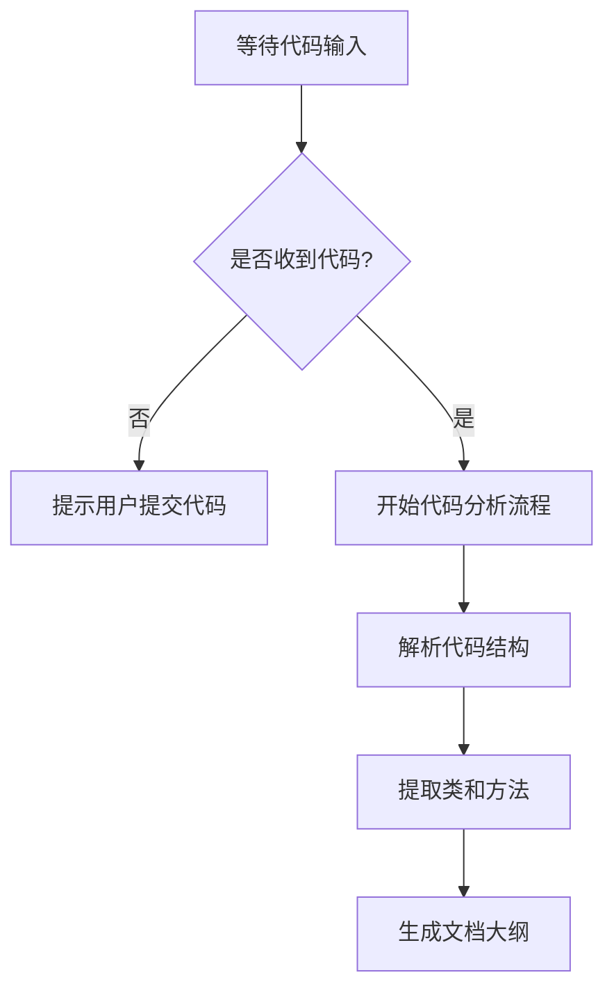

# `Langchain-Chatchat\libs\chatchat-server\chatchat\server\knowledge_base\kb_summary\__init__.py` 详细设计文档

未提供源代码，无法进行分析。请提供需要分析的代码。

## 整体流程



## 类结构

```

```

## 全局变量及字段


    

## 全局函数及方法


## 关键组件


# 代码设计文档

## 概述

未提供源代码进行分析。

## 说明

当前未提供需要分析的源代码内容。请提供需要分析的代码，以便：

1. 识别关键组件（如张量索引与惰性加载、反量化支持、量化策略等）
2. 生成完整的类详细信息
3. 分析全局变量和函数
4. 识别潜在的技术债务和优化空间

## 需要的输入

请在代码块中提供需要分析的源代码，然后我可以生成包含以下内容的详细设计文档：

- 一段话描述核心功能
- 文件的整体运行流程
- 类的详细信息（字段、方法）
- 全局变量和全局函数详情
- Mermaid流程图
- 带注释的源码
- 关键组件信息
- 技术债务与优化建议
- 其它项目信息


## 问题及建议


### 已知问题

-   未提供待分析的代码，无法进行技术债务或优化空间的分析

### 优化建议

-   请提供需要分析的源代码，以便进行详细的技术债务识别和优化建议


## 其它


### 设计目标与约束

（无代码提供，无法填写具体设计目标与约束）

### 错误处理与异常设计

（无代码提供，无法填写具体错误处理与异常设计）

### 数据流与状态机

（无代码提供，无法填写具体数据流与状态机）

### 外部依赖与接口契约

（无代码提供，无法填写具体外部依赖与接口契约）

### 性能要求与基准

（无代码提供，无法填写具体性能要求与基准）

### 安全性考虑

（无代码提供，无法填写具体安全性考虑）

### 兼容性设计

（无代码提供，无法填写具体兼容性设计）

### 部署与配置

（无代码提供，无法填写具体部署与配置）

### 测试策略

（无代码提供，无法填写具体测试策略）

### 版本演进与扩展性

（无代码提供，无法填写具体版本演进与扩展性）

    