# `Langchain-Chatchat\libs\chatchat-server\chatchat\server\knowledge_base\kb_summary\base.py` 详细设计文档

该代码定义了一个抽象基类KBSummaryService，用于管理知识库的摘要服务。核心功能包括：通过Faiss向量存储实现知识库摘要的创建、添加、删除操作，支持知识库的向量化和持久化存储，并提供与数据库的交互接口来管理摘要元数据。

## 整体流程

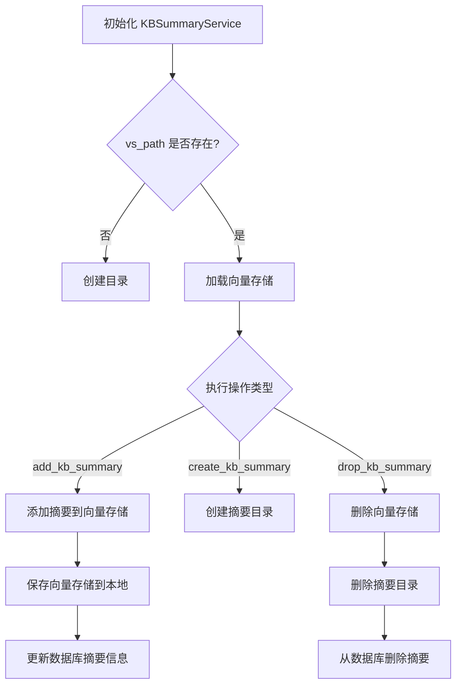

## 类结构

```
KBSummaryService (抽象基类)
└── 知识库摘要管理服务
    ├── 字段: kb_name, embed_model, vs_path, kb_path
    └── 方法: __init__, get_vs_path, get_kb_path, load_vector_store, add_kb_summary, create_kb_summary, drop_kb_summary
```

## 全局变量及字段


### `os`
    
Python标准库，提供操作系统相关功能

类型：`module`
    


### `shutil`
    
Python标准库，提供高级文件和目录操作功能

类型：`module`
    


### `ABC`
    
抽象基类，提供抽象类定义功能

类型：`class`
    


### `abstractmethod`
    
装饰器，用于定义抽象方法

类型：`decorator`
    


### `List`
    
Python类型提示，用于标注列表类型

类型：`type_hint`
    


### `Document`
    
LangChain文档对象，表示文本内容和元数据

类型：`class`
    


### `Settings`
    
系统配置类，包含应用全局配置

类型：`class`
    


### `get_default_embedding`
    
获取默认嵌入模型函数

类型：`function`
    


### `add_summary_to_db`
    
将知识库摘要信息添加到数据库

类型：`function`
    


### `delete_summary_from_db`
    
从数据库删除知识库摘要信息

类型：`function`
    


### `ThreadSafeFaiss`
    
线程安全的Faiss向量存储类

类型：`class`
    


### `kb_faiss_pool`
    
Faiss向量存储池，管理多个知识库的向量存储

类型：`object`
    


### `KBSummaryService.kb_name`
    
知识库名称

类型：`str`
    


### `KBSummaryService.embed_model`
    
嵌入模型名称

类型：`str`
    


### `KBSummaryService.vs_path`
    
向量存储路径

类型：`str`
    


### `KBSummaryService.kb_path`
    
知识库路径

类型：`str`
    
    

## 全局函数及方法


### `add_summary_to_db`

将知识库的摘要信息添加到数据库中。

参数：

- `kb_name`：`str`，知识库的名称
- `summary_infos`：`List[dict]`，摘要信息列表，每个字典包含 `summary_context`（摘要内容）、`summary_id`（摘要ID）、`doc_ids`（关联的文档ID列表）、`metadata`（元数据）

返回值：`Any`（取决于 `knowledge_metadata_repository` 中的实际实现，通常为表示操作状态的布尔值或整数）

#### 流程图

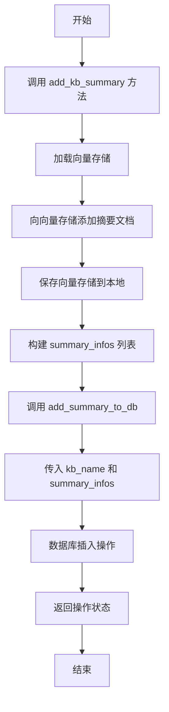

#### 带注释源码

```python
# 在 KBSummaryService 类中使用 add_summary_to_db
def add_kb_summary(self, summary_combine_docs: List[Document]):
    """
    添加知识库摘要到向量存储和数据库
    
    参数:
        summary_combine_docs: Document 对象列表，包含待添加的摘要文档
        
    返回值:
        status: 数据库操作状态
    """
    # 1. 加载向量存储并获取锁
    with self.load_vector_store().acquire() as vs:
        # 2. 向向量存储添加文档，获取返回的ID列表
        ids = vs.add_documents(documents=summary_combine_docs)
        # 3. 将向量存储保存到本地路径
        vs.save_local(self.vs_path)

    # 4. 构建摘要信息列表
    summary_infos = [
        {
            "summary_context": doc.page_content,      # 摘要文本内容
            "summary_id": id,                          # 向量存储返回的ID
            "doc_ids": doc.metadata.get("doc_ids"),    # 关联的原始文档ID
            "metadata": doc.metadata,                  # 文档元数据
        }
        # 使用 zip 将 ID 与文档配对
        for id, doc in zip(ids, summary_combine_docs)
    ]
    
    # 5. 调用外部函数将摘要信息写入数据库
    # add_summary_to_db 函数定义在:
    # chatchat.server.db.repository.knowledge_metadata_repository
    status = add_summary_to_db(kb_name=self.kb_name, summary_infos=summary_infos)
    
    # 6. 返回数据库操作状态
    return status
```

---

**注意**：`add_summary_to_db` 函数本身定义在 `chatchat.server.db.repository.knowledge_metadata_repository` 模块中，上述代码展示了该函数在 `KBSummaryService.add_kb_summary` 方法中的调用方式及参数构建过程。


### `delete_summary_from_db`

从数据库中删除指定知识库的摘要信息。

参数：

-  `kb_name`：`str`，知识库名称，用于指定要删除摘要的目标知识库

返回值：`bool`，表示删除操作是否成功

#### 流程图

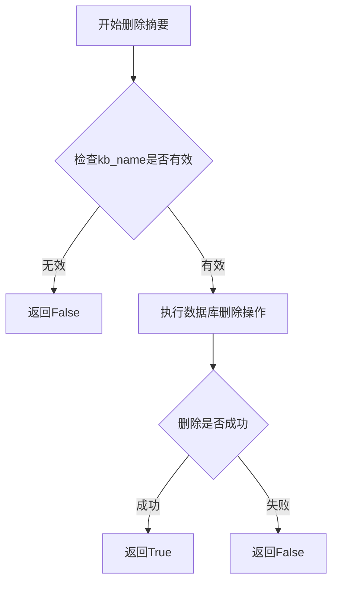

#### 带注释源码

```
# 该函数定义位于 chatchat.server.db.repository.knowledge_metadata_repository 模块中
# 以下为调用方的上下文代码，展示了该函数的使用方式

def drop_kb_summary(self):
    """
    删除知识库chunk summary
    :param kb_name:
    :return:
    """
    with kb_faiss_pool.atomic:
        kb_faiss_pool.pop(self.kb_name)  # 从Faiss向量存储池中移除该知识库
        shutil.rmtree(self.vs_path)       # 删除本地的向量存储文件目录
    # 调用delete_summary_from_db删除数据库中的摘要记录
    delete_summary_from_db(kb_name=self.kb_name)
```

#### 补充说明

根据代码上下文分析，`delete_summary_from_db` 函数具有以下特征：

1. **调用位置**：在 `KBSummaryService` 类的 `drop_kb_summary` 方法中被调用
2. **调用时机**：当用户删除整个知识库的摘要时，先清理向量存储（Faiss），再删除数据库中的摘要元数据
3. **参数来源**：`self.kb_name` 来自 `KBSummaryService` 类的实例属性，在 `__init__` 方法中初始化
4. **模块位置**：`chatchat.server.db.repository.knowledge_metadata_repository`

由于该函数的实际实现代码未在提供的代码片段中显示，以上信息基于函数调用方式和代码上下文的推断。


### `os.path.exists`

检查指定的文件路径或目录路径是否存在。这是 Python 标准库 os 模块提供的函数，用于判断路径的有效性。

参数：

- `path`：`str`，要检查的路径，可以是文件路径或目录路径

返回值：`bool`，如果路径存在返回 `True`，否则返回 `False`

#### 流程图

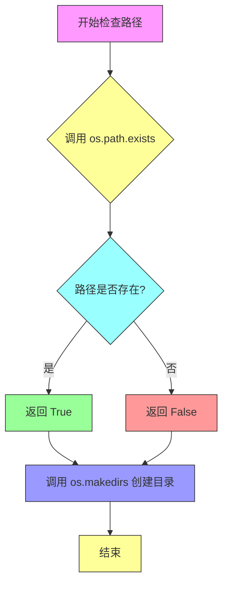

#### 带注释源码

```python
# 第一次使用：在 KBSummaryService.__init__ 构造函数中
# 检查向量存储路径是否存在，如果不存在则创建目录
if not os.path.exists(self.vs_path):
    os.makedirs(self.vs_path)

# 第二次使用：在 create_kb_summary 方法中
# 同样检查向量存储路径是否存在，如果不存在则创建目录
if not os.path.exists(self.vs_path):
    os.makedirs(self.vs_path)
```

#### 代码上下文分析

| 使用位置 | 类/方法 | 目的 |
|---------|---------|------|
| 第31行 | `KBSummaryService.__init__` | 初始化时确保向量存储目录存在 |
| 第62行 | `KBSummaryService.create_kb_summary` | 创建摘要前确保目录存在 |

#### 技术债务与优化空间

1. **重复代码**：在 `__init__` 和 `create_kb_summary` 方法中都使用了相同的路径检查逻辑，可以提取为私有方法如 `_ensure_vs_path_exists()`
2. **原子性不足**：当前先检查再创建存在竞态条件，建议使用 `exist_ok` 参数简化：`os.makedirs(self.vs_path, exist_ok=True)`
3. **路径验证缺失**：未对 `self.vs_path` 的有效性进行提前验证，可能导致后续操作失败


### `os.makedirs` (在 `KBSummaryService` 类中使用)

该函数用于在 `KBSummaryService` 类中创建向量存储目录，确保知识库的摘要向量存储目录存在。如果父目录不存在，`os.makedirs` 会递归创建所有必需的父目录。

参数：

- `path`：`str`，要创建的目录路径，在此代码中为 `self.vs_path`（知识库的摘要向量存储目录路径）
- `mode`：`int`，权限模式，默认为 `0o777`（在此代码中未显式指定）
- `exist_ok`：`bool`，如果目录已存在是否不抛出异常，默认为 `False`（在此代码中未显式指定）

返回值：`None`，无返回值（该函数仅执行目录创建操作）

#### 流程图

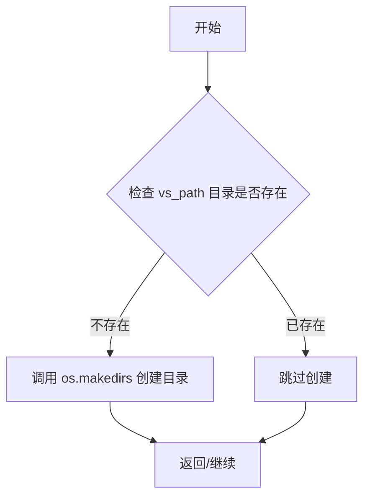

#### 带注释源码

```python
# 在 __init__ 方法中
def __init__(
    self, knowledge_base_name: str, embed_model: str = get_default_embedding()
):
    self.kb_name = knowledge_base_name
    self.embed_model = embed_model

    self.kb_path = self.get_kb_path()
    self.vs_path = self.get_vs_path()

    # 检查摘要向量存储目录是否存在，不存在则创建
    if not os.path.exists(self.vs_path):
        os.makedirs(self.vs_path)  # 递归创建目录及其父目录

# 在 create_kb_summary 方法中
def create_kb_summary(self):
    """
    创建知识库chunk summary
    :return:
    """
    # 再次检查并创建目录，确保目录存在
    if not os.path.exists(self.vs_path):
        os.makedirs(self.vs_path)  # 递归创建目录及其父目录
```


### `os.path.join`

路径拼接函数，用于将多个路径组件智能地连接成一个完整的路径字符串。

参数：

-  `*paths`：`str`，可变数量的路径组件，依次拼接
-  `path`：`str`，最终的路径段

返回值：`str`，拼接后的完整路径字符串

#### 流程图

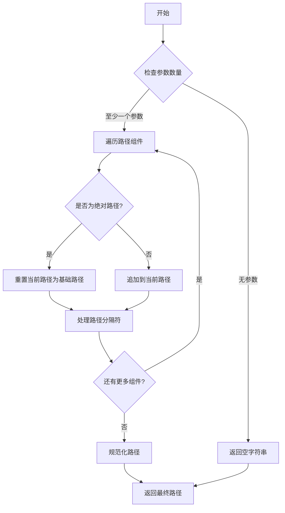

#### 带注释源码

```
# os.path.join 函数在代码中的实际使用示例

# 用法1：在 KBSummaryService.get_vs_path 方法中
def get_vs_path(self):
    # 获取知识库路径，然后拼接 "summary_vector_store" 子目录
    # os.path.join 会智能处理路径分隔符
    return os.path.join(self.get_kb_path(), "summary_vector_store")

# 用法2：在 KBSummaryService.get_kb_path 方法中
def get_kb_path(self):
    # 拼接知识库根目录和知识库名称
    # Settings.basic_settings.KB_ROOT_PATH 是根路径
    # self.kb_name 是知识库名称
    return os.path.join(Settings.basic_settings.KB_ROOT_PATH, self.kb_name)

# os.path.join 的工作原理：
# - 如果任何一个组件是绝对路径，则之前的组件都会被丢弃
# - 会在适当的位置添加文件分隔符（Linux/Mac用/，Windows用\）
# - 会处理多个分隔符的情况
# 示例：
# >>> import os
# >>> os.path.join('/home/user', 'docs', 'file.txt')
# '/home/user/docs/file.txt'
# >>> os.path.join('/home/user', '/absolute/path', 'file.txt')
# '/absolute/path/file.txt'
```


### `shutil.rmtree`

递归删除指定目录及其所有内容。

参数：

- `path`：`str` 或 `os.PathLike`，要删除的目录路径
- `ignore_errors`：`bool`，可选参数，如果设为 `True`，则忽略删除过程中的错误（默认值为 `False`）
- `onerror`：`callable`，可选参数，一个可调用对象，用于处理删除过程中出现的错误（默认值为 `None`）

返回值：`None`，该函数无返回值

#### 流程图

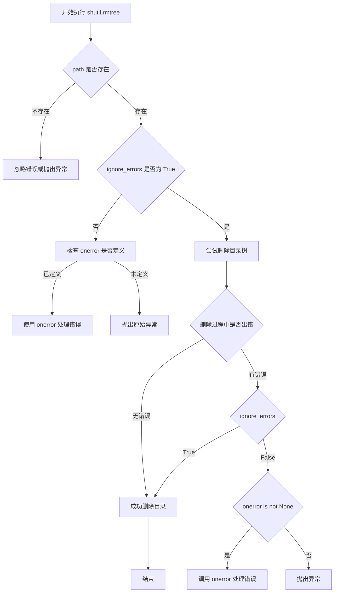

#### 带注释源码

```python
# shutil.rmtree 是 Python 标准库 shutil 模块中的函数
# 用于递归删除目录及其所有内容

# 函数签名:
# def rmtree(path, ignore_errors=False, onerror=None):
#     """
#        Recursively delete a directory tree.
#
#        If ignore_errors is set, errors are ignored; otherwise, if onerror
#        is set, it is called to handle the error with arguments (func,
#        path, exc_info) where func is os.remove() or os.rmdir(); path is the
#        argument to that function that caused it to fail; and exc_info is
#        return from sys.exc_info().  Otherwise, exceptions are propagated.
#
#        This is used in the代码中 as:
#        shutil.rmtree(self.vs_path)
#        其中 self.vs_path 是知识库摘要的向量存储路径
#     """

# 在当前代码中的实际调用:
# shutil.rmtree(self.vs_path)
# 
# 这行代码位于 KBSummaryService 类的 drop_kb_summary 方法中
# 用于删除知识库的摘要向量存储目录
# 
# 调用上下文:
# with kb_faiss_pool.atomic:
#     kb_faiss_pool.pop(self.kb_name)  # 从内存池中移除
#     shutil.rmtree(self.vs_path)       # 删除磁盘上的向量存储目录
# delete_summary_from_db(kb_name=self.kb_name)  # 删除数据库中的元数据
```


### KBSummaryService.__init__

初始化知识库摘要服务，设置知识库名称、嵌入模型，并创建必要的向量存储目录。

参数：

- `knowledge_base_name`：`str`，知识库的名称，用于标识和定位特定的知识库
- `embed_model`：`str`，嵌入模型，默认为`get_default_embedding()`的返回值，用于将文本向量化

返回值：无（`__init__`构造函数不返回值）

#### 流程图

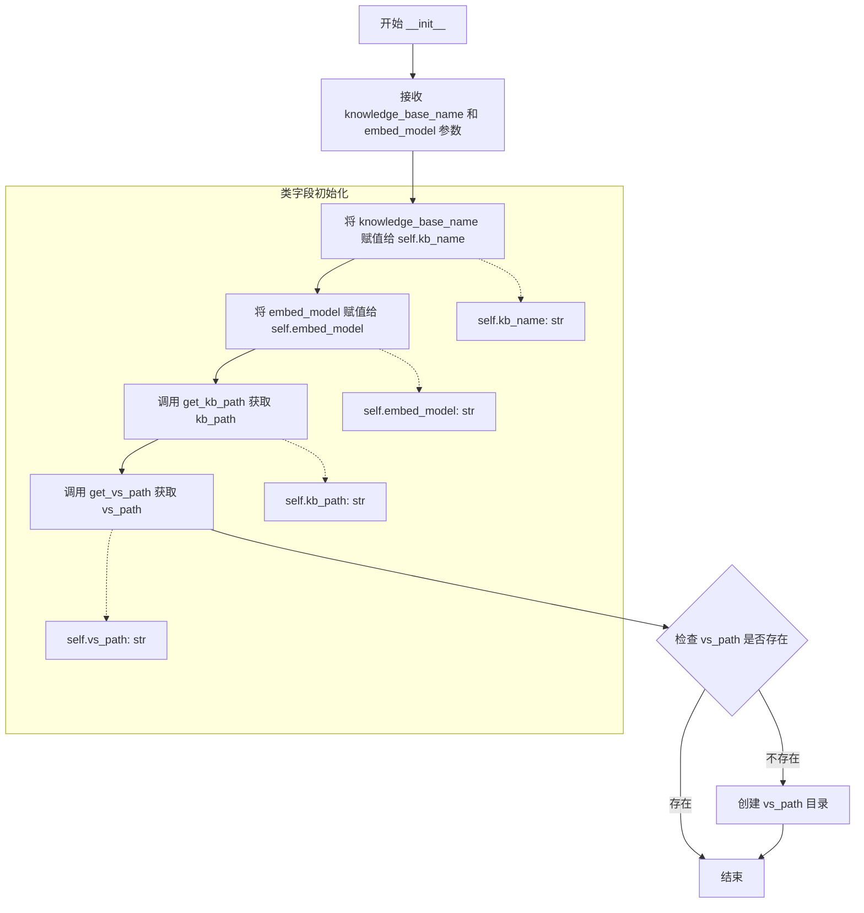

#### 带注释源码

```python
def __init__(
    self, knowledge_base_name: str, embed_model: str = get_default_embedding()
):
    """
    初始化知识库摘要服务
    
    参数:
        knowledge_base_name: 知识库的名称，用于标识和定位特定的知识库
        embed_model: 嵌入模型，用于将文本向量化，默认为系统默认嵌入模型
    """
    # 将传入的知识库名称存储为实例变量
    self.kb_name = knowledge_base_name
    
    # 将传入的嵌入模型名称存储为实例变量
    self.embed_model = embed_model

    # 调用内部方法获取知识库的根路径
    self.kb_path = self.get_kb_path()
    
    # 调用内部方法获取向量存储的路径
    self.vs_path = self.get_vs_path()

    # 检查向量存储路径是否存在，如果不存在则创建目录
    # 确保后续向量存储操作可以正常进行
    if not os.path.exists(self.vs_path):
        os.makedirs(self.vs_path)
```

---

### 补充信息

#### 类字段（全类）

| 字段名称 | 类型 | 描述 |
|---------|------|------|
| `kb_name` | `str` | 知识库名称，用于标识特定知识库 |
| `embed_model` | `str` | 嵌入模型名称，用于文本向量化 |
| `vs_path` | `str` | 向量存储路径，存放摘要向量数据 |
| `kb_path` | `str` | 知识库根路径，知识库文件存储位置 |

#### 关键组件信息

| 组件名称 | 描述 |
|---------|------|
| `ThreadSafeFaiss` | 线程安全的Faiss向量存储封装类，支持并发访问 |
| `kb_faiss_pool` | Faiss向量存储池，管理多个知识库的向量存储实例 |
| `add_summary_to_db` | 将摘要信息持久化到数据库的函数 |
| `delete_summary_from_db` | 从数据库删除摘要信息的函数 |

#### 潜在技术债务与优化空间

1. **空方法实现**：`create_kb_summary()` 方法体为空，未实现摘要创建逻辑，需要补充完整实现
2. **异常处理缺失**：`__init__` 中创建目录时未捕获可能的权限异常或IO异常
3. **路径验证不足**：未验证 `knowledge_base_name` 的合法性，可能存在路径遍历风险
4. **默认值调用时机**：`get_default_embedding()` 作为默认参数在模块加载时就会调用，可能导致依赖未初始化问题

#### 其它设计说明

- **设计目标**：提供知识库摘要的统一管理接口，支持摘要的创建、添加和删除
- **约束**：继承自`ABC`，为抽象基类，不能直接实例化
- **依赖**：依赖`Settings.basic_settings.KB_ROOT_PATH`配置，需确保配置正确初始化


### `KBSummaryService.get_vs_path`

获取向量存储路径，用于定位知识库中摘要向量存储的目录位置。

参数：

- 无显式参数（隐式参数 `self` 为类实例自身）

返回值：`str`，返回知识库摘要向量存储的完整路径字符串，格式为 `{知识库根路径}/{知识库名称}/summary_vector_store`

#### 流程图

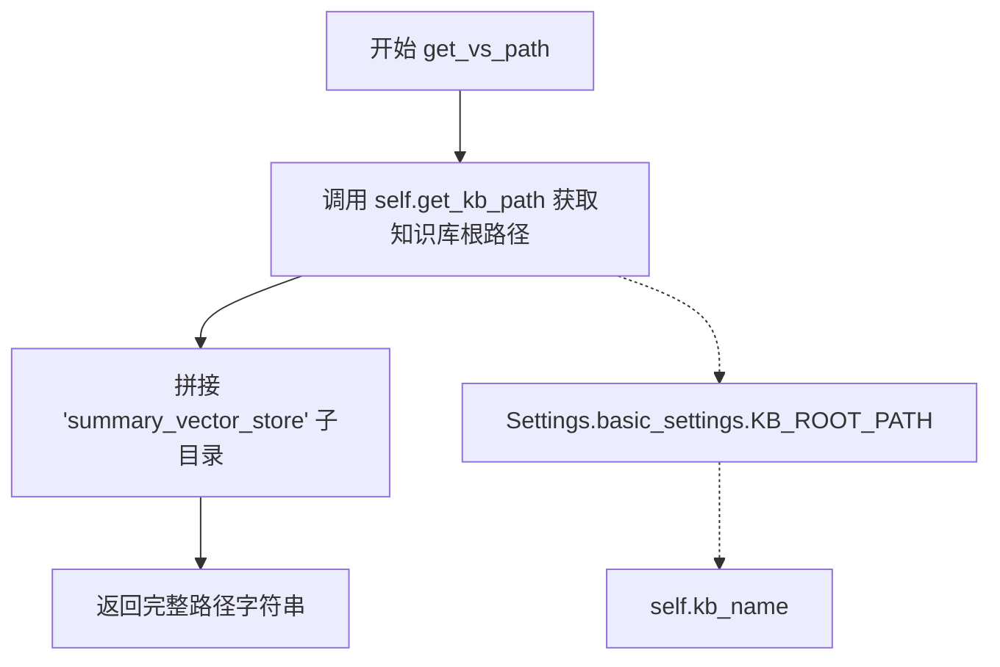

#### 带注释源码

```python
def get_vs_path(self):
    """
    获取向量存储路径
    
    该方法拼接知识库根路径与向量存储子目录名称，
    返回用于存储摘要向量数据的目录路径。
    
    Returns:
        str: 完整的向量存储目录路径，格式为 {KB_ROOT_PATH}/{kb_name}/summary_vector_store
    """
    # 调用 get_kb_path 获取知识库根目录路径，然后与子目录名拼接
    return os.path.join(self.get_kb_path(), "summary_vector_store")
```


### `KBSummaryService.get_kb_path`

获取知识库的根目录路径，通过拼接配置中的知识库根路径与当前知识库名称形成完整的路径字符串。

参数：该方法无显式参数（仅包含隐式参数 `self`）

返回值：`str`，返回知识库的根目录完整路径

#### 流程图

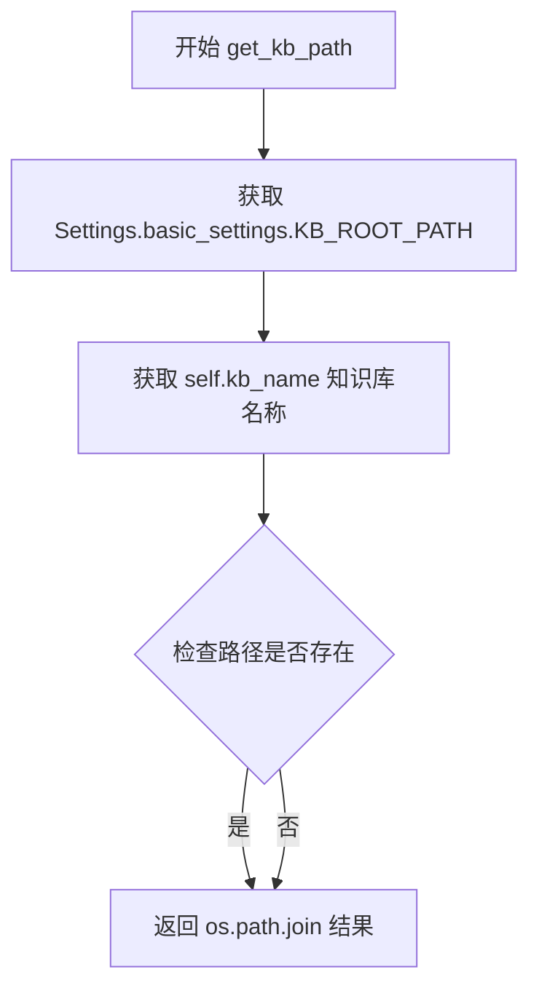

#### 带注释源码

```python
def get_kb_path(self):
    """
    获取知识库的根目录路径
    
    该方法通过将配置中定义的知识库根目录路径与当前知识库名称进行拼接，
    生成该知识库在文件系统中的完整路径。
    
    Returns:
        str: 知识库的根目录完整路径，格式为 {KB_ROOT_PATH}/{kb_name}
    """
    # 使用 os.path.join 拼接知识库根路径和知识库名称，生成完整路径
    return os.path.join(Settings.basic_settings.KB_ROOT_PATH, self.kb_name)
```


### `KBSummaryService.load_vector_store`

该方法用于加载指定知识库的 Faiss 向量存储实例，通过线程安全的连接池加载或创建名为 "summary_vector_store" 的向量存储，并返回 ThreadSafeFaiss 对象供后续操作使用。

参数：
- `self`：隐式参数，KBSummaryService 实例本身

返回值：`ThreadSafeFaiss`，返回线程安全的 Faiss 向量存储对象，用于后续的向量检索和文档添加操作

#### 流程图

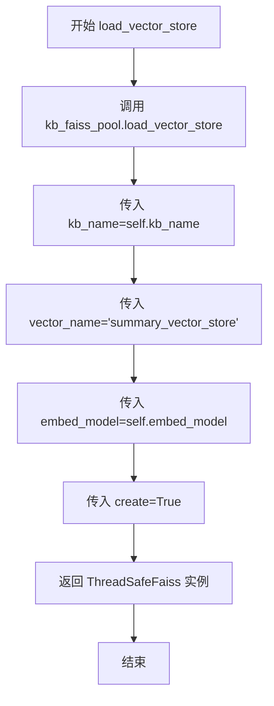

#### 带注释源码

```python
def load_vector_store(self) -> ThreadSafeFaiss:
    """
    加载知识库的 Faiss 向量存储
    
    该方法通过线程安全的 Faiss 连接池加载指定知识库的向量存储实例。
    如果向量存储不存在且 create=True，则会创建新的向量存储。
    
    Returns:
        ThreadSafeFaiss: 线程安全的 Faiss 向量存储对象
    """
    # 调用全局的 kb_faiss_pool 加载向量存储
    # 参数说明：
    # - kb_name: 知识库名称
    # - vector_name: 向量存储名称，此处固定为 "summary_vector_store"
    # - embed_model: 嵌入模型
    # - create: 是否在不存在时创建新的向量存储
    return kb_faiss_pool.load_vector_store(
        kb_name=self.kb_name,           # 知识库名称
        vector_name="summary_vector_store",  # 摘要向量存储名称
        embed_model=self.embed_model,   # 嵌入模型
        create=True,                    # 不存在时创建新向量存储
    )
```


### `KBSummaryService.add_kb_summary`

该方法负责将知识库的摘要文档添加到向量存储库中，并同步更新数据库中的摘要元数据信息。

参数：

- `summary_combine_docs`：`List[Document]`，待添加的知识库摘要文档列表，每个 Document 对象包含页面内容和元数据

返回值：`status`，表示数据库操作的状态结果（具体类型取决于 `add_summary_to_db` 的返回值，通常为布尔值或操作结果对象）

#### 流程图

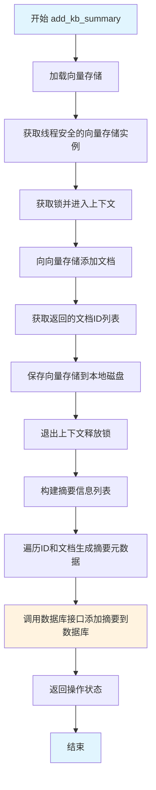

#### 带注释源码

```python
def add_kb_summary(self, summary_combine_docs: List[Document]):
    """
    添加知识库摘要到向量存储和数据库
    :param summary_combine_docs: 待添加的摘要文档列表
    :return: 数据库操作状态
    """
    # 步骤1：加载向量存储并获取线程安全的访问上下文
    with self.load_vector_store().acquire() as vs:
        # 步骤2：将文档添加到向量存储，获取返回的文档ID列表
        ids = vs.add_documents(documents=summary_combine_docs)
        # 步骤3：将向量存储持久化到本地磁盘
        vs.save_local(self.vs_path)

    # 步骤4：构建摘要信息列表，用于存储到数据库
    summary_infos = [
        {
            "summary_context": doc.page_content,           # 摘要文本内容
            "summary_id": id,                               # 向量存储中的文档ID
            "doc_ids": doc.metadata.get("doc_ids"),         # 关联的原始文档ID
            "metadata": doc.metadata,                       # 完整元数据
        }
        for id, doc in zip(ids, summary_combine_docs)
    ]
    
    # 步骤5：调用数据库接口将摘要信息写入数据库
    status = add_summary_to_db(kb_name=self.kb_name, summary_infos=summary_infos)
    
    # 步骤6：返回数据库操作状态
    return status
```


### `KBSummaryService.create_kb_summary`

创建知识库摘要目录，如果目录不存在则创建。

参数：此方法无参数。

返回值：`None`，无返回值。

#### 流程图

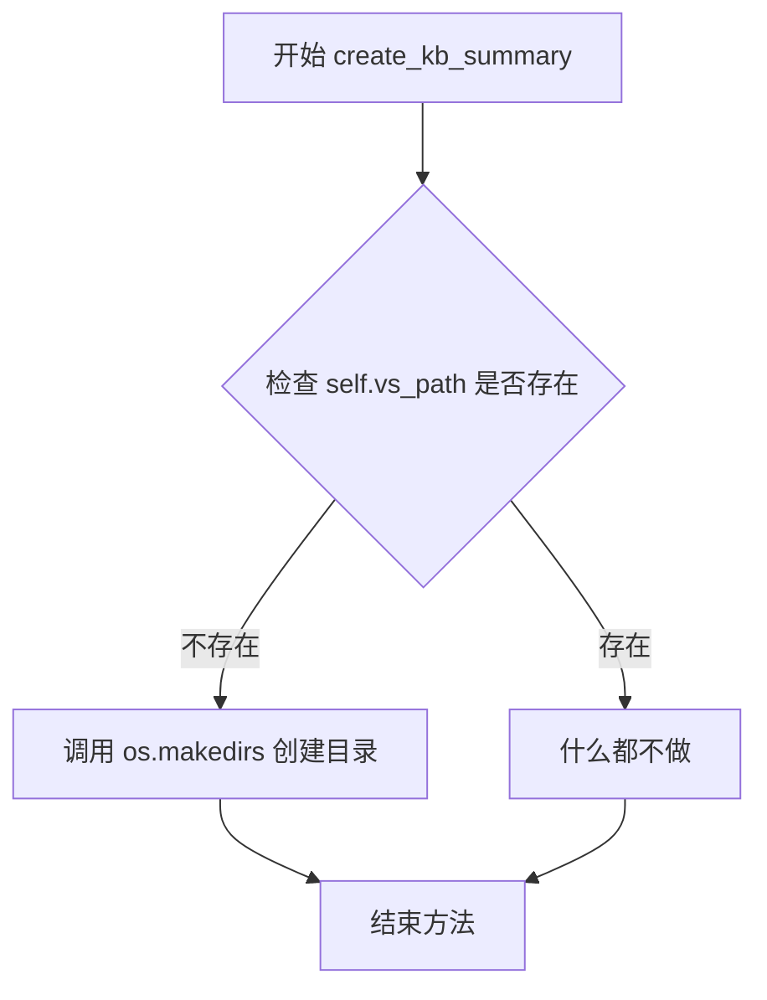

#### 带注释源码

```python
def create_kb_summary(self):
    """
    创建知识库chunk summary
    :return:
    """
    # 检查向量存储路径是否存在
    if not os.path.exists(self.vs_path):
        # 如果不存在，则创建该目录（包括父目录）
        os.makedirs(self.vs_path)
```


### `KBSummaryService.drop_kb_summary`

删除指定知识库的摘要信息，包括从向量存储池中移除Faiss索引、删除本地的向量存储目录以及从数据库中清除相关的摘要记录。

参数：
- 无显式参数（方法通过实例属性 `self.kb_name` 获取知识库名称）

返回值：`None`，无返回值描述

#### 流程图

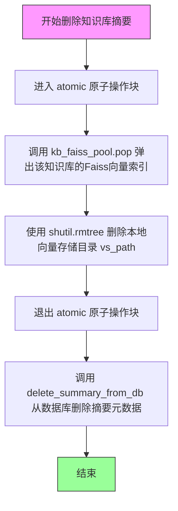

#### 带注释源码

```python
def drop_kb_summary(self):
    """
    删除知识库chunk summary
    :param kb_name: 知识库名称（通过 self.kb_name 获取）
    :return: None
    """
    # 使用原子操作块，确保向量池操作和文件删除的原子性
    with kb_faiss_pool.atomic:
        # 从Faiss向量索引池中弹出（移除）该知识库的索引对象
        kb_faiss_pool.pop(self.kb_name)
        
        # 使用 shutil.rmtree 递归删除该知识库的本地向量存储目录
        # vs_path 指向 summary_vector_store 目录
        shutil.rmtree(self.vs_path)
    
    # 在原子操作外执行数据库操作，确保与文件操作解耦
    # 从数据库的 summary 表中删除该知识库的所有摘要记录
    delete_summary_from_db(kb_name=self.kb_name)
```

## 关键组件


### KBSummaryService (抽象基类)

知识库摘要服务的抽象基类，提供知识库摘要的创建、加载、添加和删除等核心操作，支持向量存储（Faiss）的管理和数据库元数据持久化。

### kb_faiss_pool (向量存储池与惰性加载)

Faiss向量存储的线程安全连接池，实现惰性加载机制，仅在需要时才加载向量存储，支持向量存储的原子操作和缓存管理。

### ThreadSafeFaiss (线程安全Faiss封装)

Faiss向量库的线程安全封装类，提供上下文管理器（acquire方法）确保多线程环境下的安全访问。

### Vector Store 加载与持久化

load_vector_store方法实现向量存储的按需加载，vs.save_local实现向量存储的本地持久化，支持知识库摘要向量数据的保存与恢复。

### Summary 元数据管理

add_summary_to_db和delete_summary_from_db函数调用，实现摘要元数据的数据库持久化，包含summary_id、doc_ids和metadata等关键信息。

### 知识库路径管理

get_kb_path和get_vs_path方法管理知识库目录结构，将知识库名称映射到具体的文件系统路径，支持向量存储的目录组织。


## 问题及建议


### 已知问题

- **空方法实现**：`create_kb_summary` 方法内部只创建了目录，没有任何创建摘要的实际逻辑，形同虚设
- **数据一致性问题**：`add_kb_summary` 方法中先保存向量存储到本地，再更新数据库，如果数据库更新失败会导致数据不一致状态
- **缺少错误处理**：`add_kb_summary` 方法没有对 `add_documents`、`save_local` 和 `add_summary_to_db` 的异常捕获
- **并发安全隐患**：`drop_kb_summary` 使用了 `kb_faiss_pool.atomic` 但未使用 `with` 语句，可能无法保证原子性操作
- **资源重复加载**：`load_vector_store` 每次调用都创建新的向量存储实例并通过 `acquire()` 获取连接，性能开销较大
- **硬编码字符串**：`"summary_vector_store"` 在多处硬编码，如果需要修改命名需要修改多处
- **缺失参数校验**：构造函数和关键方法没有对 `knowledge_base_name` 和 `embed_model` 进行有效性校验

### 优化建议

- 完善 `create_kb_summary` 方法的实际实现逻辑，或添加 `NotImplementedError` 明确告知该方法待实现
- 使用事务机制确保 `add_kb_summary` 中向量存储保存和数据库更新的原子性，添加重试和回滚逻辑
- 为关键方法添加 try-except 异常处理，记录日志并返回明确的错误状态
- 将 `kb_faiss_pool.atomic` 改为 `with kb_faiss_pool.atomic:` 形式确保原子性
- 考虑缓存向量存储实例，避免频繁创建和销毁
- 将 `"summary_vector_store"` 提取为类常量或配置项
- 在构造函数中添加参数校验，确保 `kb_name` 非空且符合命名规范

## 其它


### 设计目标与约束

本代码的设计目标是提供知识库摘要的创建、存储、加载和删除功能，支持知识库chunk级别的摘要管理。约束条件包括：1) 依赖Faiss向量存储作为底层搜索引擎；2) 需要提前配置好embedding模型；3) 知识库根路径由Settings.basic_settings.KB_ROOT_PATH指定；4) 摘要向量存储路径固定为"summary_vector_store"目录。

### 错误处理与异常设计

代码中的异常处理主要包括：1) 文件路径不存在时自动创建目录（get_kb_path、__init__、create_kb_summary方法）；2) 使用with语句确保资源正确释放（load_vector_store的acquire方法）；3) 删除操作使用atomic保证原子性（drop_kb_summary方法）。潜在异常包括：os.makedirs失败、kb_faiss_pool操作异常、数据库操作失败等，建议增加更详细的异常捕获和日志记录。

### 数据流与状态机

数据流如下：1) 初始化时加载知识库路径和向量存储路径；2) add_kb_summary接收Document列表，添加到向量存储，保存到本地，然后写入数据库；3) drop_kb_summary从向量存储池中移除，删除本地文件，清理数据库记录。状态转换：不存在 -> 初始化 -> 可用 -> 删除 -> 不存在。

### 外部依赖与接口契约

外部依赖包括：1) langchain.docstore.document.Document - 文档对象；2) chatchat.settings.Settings - 配置管理；3) chatchat.server.utils.get_default_embedding - 获取默认embedding模型；4) chatchat.server.db.repository.knowledge_metadata_repository - 数据库操作（add_summary_to_db、delete_summary_from_db）；5) chatchat.server.knowledge_base.kb_cache.faiss_cache - Faiss向量存储池管理。接口契约要求：kb_name必须为有效的知识库名称，embed_model必须为已注册的embedding模型名称。

### 性能考虑

性能优化点：1) 使用ThreadSafeFaiss保证多线程安全；2) add_documents后立即save_local确保数据持久化；3) drop_kb_summary使用atomic操作保证一致性。潜在优化：批量操作可以合并多次数据库写入；向量存储可以考虑异步保存；可以增加缓存机制避免重复加载。

### 安全性考虑

安全措施：1) kb_path和vs_path通过os.path.join构建，防止路径注入；2) 使用shutil.rmtree删除目录时确保路径在知识库根目录下；3) 数据库操作依赖外部repository层进行SQL注入防护。建议增加：用户权限验证、路径遍历检查、操作日志审计。

### 测试策略

建议测试用例：1) 单元测试：测试get_kb_path、get_vs_path路径拼接逻辑；2) 集成测试：测试add_kb_summary、drop_kb_summary完整流程；3) 异常测试：测试路径不存在、数据库操作失败等场景；4) 并发测试：验证多线程环境下ThreadSafeFaiss的正确性。

### 部署注意事项

部署时需注意：1) 确保KB_ROOT_PATH配置正确且有读写权限；2) Faiss向量存储需要足够的磁盘空间；3) 数据库连接配置需要正确；4) embedding模型需要提前加载或配置好；5) 多实例部署时需考虑向量存储池的共享机制。

### 配置参数说明

关键配置参数：1) Settings.basic_settings.KB_ROOT_PATH - 知识库根目录；2) embed_model - embedding模型名称，默认为get_default_embedding()；3) kb_name - 知识库名称；4) vector_name - 向量存储名称，固定为"summary_vector_store"；5) vs_path - 向量存储路径。


    