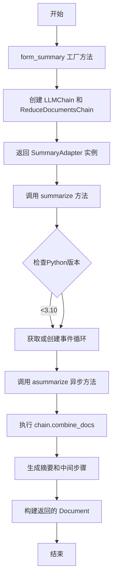
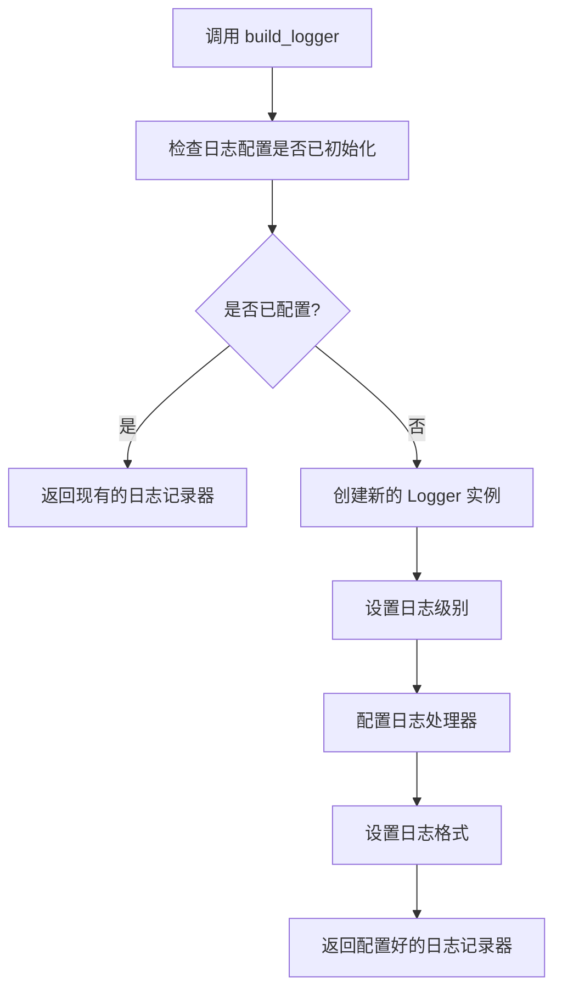
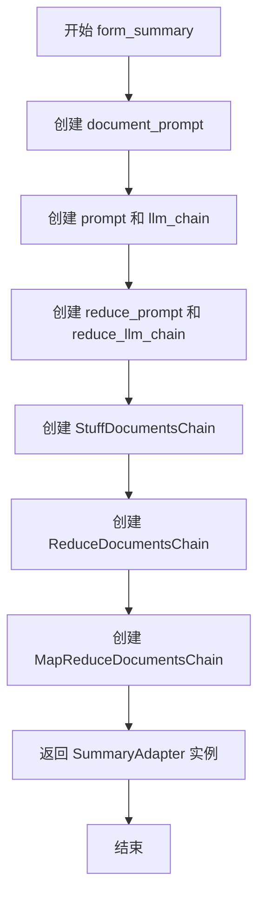
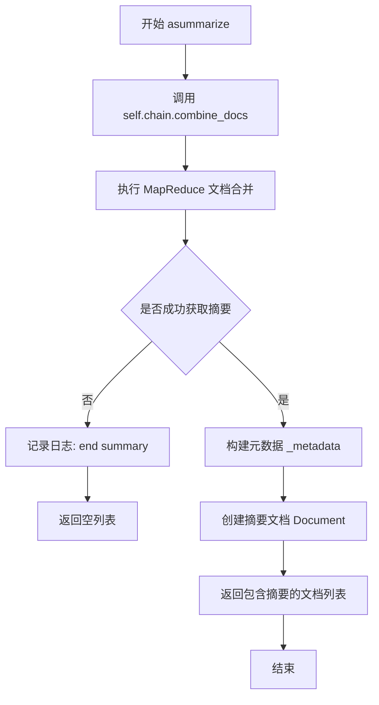
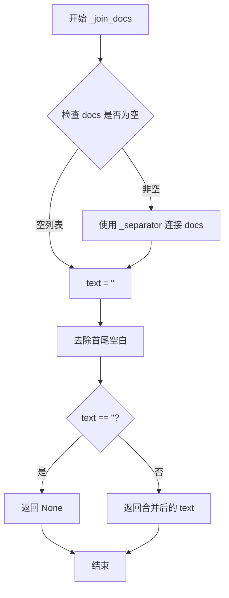
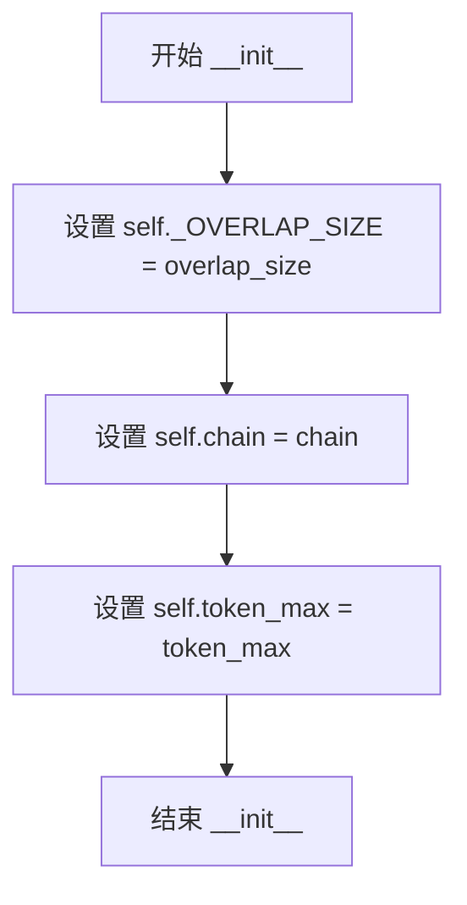
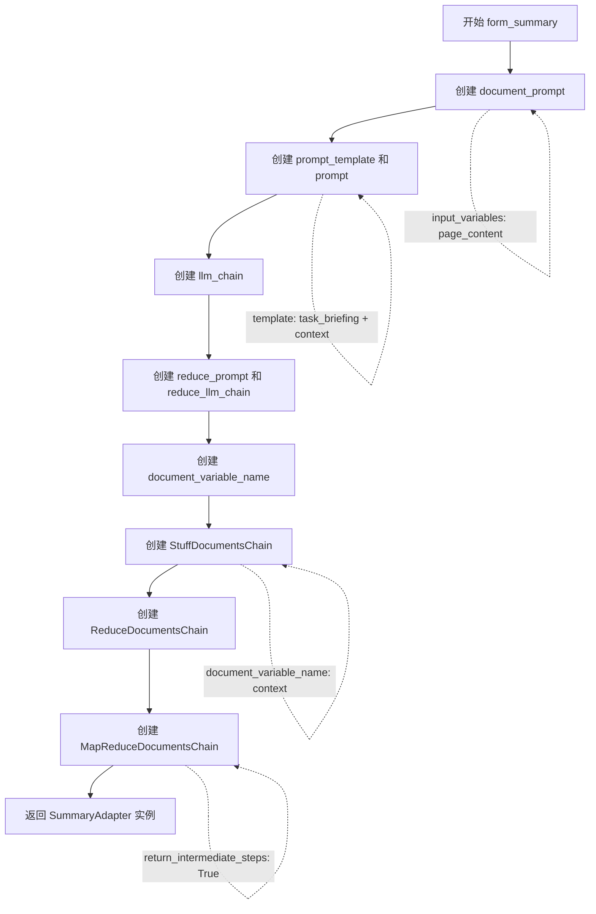
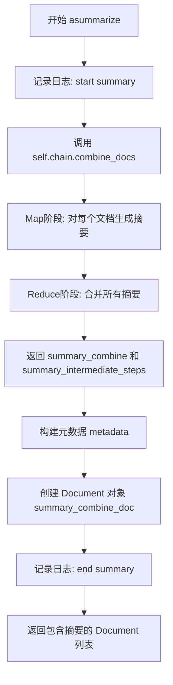
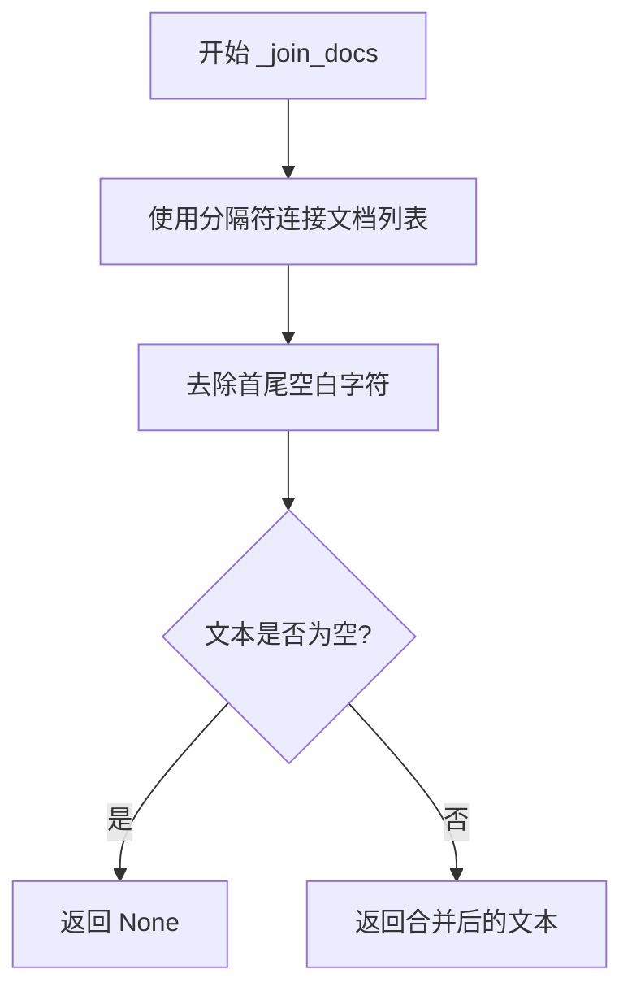

# `Langchain-Chatchat\libs\chatchat-server\chatchat\server\knowledge_base\kb_summary\summary_chunk.py` 详细设计文档

该代码实现了一个基于LangChain的文档摘要适配器，通过MapReduce模式对多个文档进行摘要处理，支持重叠文本去除和异步处理，最终返回合并后的摘要文档。

## 整体流程



## 类结构

```
SummaryAdapter (文档摘要适配器类)
├── _OVERLAP_SIZE: int (重叠大小)
├── token_max: int (最大token数)
├── _separator: str (分隔符)
├── chain: MapReduceDocumentsChain (MapReduce链)
├── __init__ (构造函数)
├── form_summary (工厂方法)
├── summarize (同步摘要入口)
├── asummarize (异步摘要核心)
├── _drop_overlap (去除重叠文本)
└── _join_docs (合并文档字符串)
```

## 全局变量及字段


### `logger`
    
日志记录器对象

类型：`logging.Logger`
    


### `docs`
    
测试用文档列表

类型：`List[str]`
    


### `_OVERLAP_SIZE`
    
测试用重叠大小

类型：`int`
    


### `separator`
    
测试用分隔符

类型：`str`
    


### `merge_docs`
    
测试用合并文档列表

类型：`List[str]`
    


### `pre_doc`
    
测试用前一个文档

类型：`Optional[str]`
    


### `text`
    
测试用合并后文本

类型：`str`
    


### `SummaryAdapter._OVERLAP_SIZE`
    
重叠部分大小

类型：`int`
    


### `SummaryAdapter.token_max`
    
最大chunk token数量

类型：`int`
    


### `SummaryAdapter._separator`
    
文档分隔符，默认双换行符

类型：`str`
    


### `SummaryAdapter.chain`
    
LangChain的MapReduce文档处理链

类型：`MapReduceDocumentsChain`
    
    

## 全局函数及方法


### `build_logger`

构建并返回一个 Python 标准库的 `logging.Logger` 实例，用于在模块中记录日志。

参数：

- 无参数

返回值：`logging.Logger`，返回一个配置好的日志记录器实例

#### 流程图



#### 带注释源码

```python
# 由于提供的代码中没有 build_logger 函数的实际实现，
# 以下是基于代码使用方式和常见日志构建模式推断的源码

def build_logger(name: str = None) -> logging.Logger:
    """
    构建日志记录器
    
    :param name: 日志记录器名称，默认为 None
    :return: logging.Logger 实例
    """
    # 如果未指定名称，使用调用者的模块名
    if name is None:
        import inspect
        # 获取调用者的模块名称
        caller_frame = inspect.currentframe().f_back
        name = caller_frame.f_globals.get('__name__', '__main__')
    
    # 获取或创建日志记录器
    logger = logging.getLogger(name)
    
    # 如果已经配置过（hasHandlers 返回 True），直接返回
    if logger.handlers:
        return logger
    
    # 设置日志级别
    logger.setLevel(logging.INFO)
    
    # 创建控制台处理器
    console_handler = logging.StreamHandler()
    console_handler.setLevel(logging.INFO)
    
    # 设置日志格式
    formatter = logging.Formatter(
        '%(asctime)s - %(name)s - %(levelname)s - %(message)s',
        datefmt='%Y-%m-%d %H:%M:%S'
    )
    console_handler.setFormatter(formatter)
    
    # 添加处理器到日志记录器
    logger.addHandler(console_handler)
    
    return logger
```

#### 说明

由于提供的代码段中没有 `build_logger` 函数的实际定义（只有导入语句和调用），以上源码是基于：
1. 代码中的使用方式：`logger = build_logger()`
2. Python 标准库 `logging` 模块的常见模式
3. 函数名称推断的标准日志构建模式

实际的实现可能在 `chatchat.utils` 模块中，需要查看该模块的完整源代码以获取准确实现。


### `SummaryAdapter.form_summary`

这是一个工厂方法，用于创建 `SummaryAdapter` 实例并配置基于 MapReduce 模式的文档摘要链。该方法接收用于生成摘要和合并摘要的两个 LLM，以及重叠大小和 token 数量限制，初始化 LangChain 的 MapReduceDocumentsChain 链。

参数：

- `cls`：`<class method>`，类本身，隐式参数用于创建实例
- `llm`：`BaseLanguageModel`，用于生成摘要的 LLM，负责处理单个文档并生成初始摘要
- `reduce_llm`：`BaseLanguageModel`，用于合并摘要的 LLM，负责将多个摘要合并为最终摘要
- `overlap_size`：`int`，文档重叠部分大小，用于控制文档切分时的重叠token数量
- `token_max`：`int`，默认为 1300，最大 chunk 数量限制，控制摘要合并时的 token 上限

返回值：`SummaryAdapter`，返回新创建的 SummaryAdapter 实例，包含配置好的 MapReduceDocumentsChain

#### 流程图



#### 带注释源码

```python
@classmethod
def form_summary(
    cls,
    llm: BaseLanguageModel,
    reduce_llm: BaseLanguageModel,
    overlap_size: int,
    token_max: int = 1300,
):
    """
    获取实例
    :param reduce_llm: 用于合并摘要的llm
    :param llm: 用于生成摘要的llm
    :param overlap_size: 重叠部分大小
    :param token_max: 最大的chunk数量，每个chunk长度小于token_max长度，第一次生成摘要时，大于token_max长度的摘要会报错
    :return:
    """

    # This controls how each document will be formatted. Specifically,
    # 定义文档格式化的提示模板，将 page_content 变量注入到模板中
    document_prompt = PromptTemplate(
        input_variables=["page_content"], template="{page_content}"
    )

    # The prompt here should take as an input variable the
    # `document_variable_name`
    # 定义主任务的提示模板，包含任务描述和上下文内容
    prompt_template = (
        "根据文本执行任务。以下任务信息"
        "{task_briefing}"
        "文本内容如下: "
        "\r\n"
        "{context}"
    )
    # 创建包含任务描述和上下文的提示模板
    prompt = PromptTemplate(
        template=prompt_template, input_variables=["task_briefing", "context"]
    )
    # 创建 LLM 链，用于生成单个文档的摘要
    llm_chain = LLMChain(llm=llm, prompt=prompt)
    
    # We now define how to combine these summaries
    # 定义合并摘要的提示模板
    reduce_prompt = PromptTemplate.from_template(
        "Combine these summaries: {context}"
    )
    # 创建用于合并摘要的 LLM 链
    reduce_llm_chain = LLMChain(llm=reduce_llm, prompt=reduce_prompt)

    # 设置文档变量名称，用于在链中传递文档内容
    document_variable_name = "context"
    # 创建文档组合链，使用 StuffDocumentsChain 方式将文档填充到提示中
    combine_documents_chain = StuffDocumentsChain(
        llm_chain=reduce_llm_chain,
        document_prompt=document_prompt,
        document_variable_name=document_variable_name,
    )
    # 创建文档归约链，控制 token 数量上限
    reduce_documents_chain = ReduceDocumentsChain(
        token_max=token_max,
        combine_documents_chain=combine_documents_chain,
    )
    # 创建 MapReduce 文档链，组合生成和归约过程
    chain = MapReduceDocumentsChain(
        llm_chain=llm_chain,
        document_variable_name=document_variable_name,
        reduce_documents_chain=reduce_documents_chain,
        # 返回中间步骤
        return_intermediate_steps=True,
    )
    # 返回配置好的 SummaryAdapter 实例
    return cls(overlap_size=overlap_size, chain=chain, token_max=token_max)
```


### `SummaryAdapter.summarize`

该方法是 `SummaryAdapter` 类的同步摘要方法，内部通过事件循环调用异步方法 `asummarize` 来执行实际的文档摘要生成工作。它处理了 Python 3.9 与 Python 3.10+ 版本在事件循环获取方式上的差异，并使用 `loop.run_until_complete()` 以同步方式执行异步协程。

**参数：**

- `file_description`：`str`，需要摘要的文件描述信息
- `docs`：`List[DocumentWithVSId]`，待摘要的文档列表，默认为空列表

**返回值：** `List[Document]`，返回包含摘要内容的文档列表

#### 流程图

```mermaid
flowchart TD
    A[开始 summarize 方法] --> B{Python 版本检查}
    B -->|version < 3.10| C[使用 get_event_loop 获取事件循环]
    C --> G[设置事件循环]
    
    B -->|version >= 3.10| D{尝试获取运行中的事件循环}
    D -->|成功| E[使用运行中的事件循环]
    D -->|失败 RuntimeError| F[创建新的事件循环 new_event_loop]
    E --> G
    F --> G
    
    G --> H[调用 loop.run_until_complete 执行 asummarize 方法]
    H --> I[返回 List[Document] 摘要结果]
```

#### 带注释源码

```python
def summarize(
    self, file_description: str, docs: List[DocumentWithVSId] = []
) -> List[Document]:
    """
    同步摘要方法，内部调用异步方法完成实际工作
    
    参数:
        file_description: str - 文件描述信息
        docs: List[DocumentWithVSId] - 待摘要的文档列表
    
    返回:
        List[Document] - 包含摘要内容的文档列表
    """
    # 判断 Python 版本，根据版本选择不同的方式获取事件循环
    if sys.version_info < (3, 10):
        # Python 3.9 及以下版本使用 get_event_loop()
        loop = asyncio.get_event_loop()
    else:
        # Python 3.10+ 版本尝试获取运行中的事件循环
        try:
            loop = asyncio.get_running_loop()
        except RuntimeError:
            # 如果没有运行中的事件循环，则创建新的事件循环
            loop = asyncio.new_event_loop()

        # 设置当前线程的事件循环
        asyncio.set_event_loop(loop)
    
    # 同步调用协程代码
    # 使用 run_until_complete 以同步方式执行异步方法
    return loop.run_until_complete(
        self.asummarize(file_description=file_description, docs=docs)
    )
```


### `SummaryAdapter.asummarize`

异步摘要核心方法，使用 MapReduce 模式对文档列表进行摘要处理。首先通过 map 阶段并行生成每个文档的摘要，然后通过 reduce 阶段合并所有摘要为最终结果，并附加文件描述和中间步骤等元数据。

参数：

- `file_description`：`str`，文件描述，用于元数据记录
- `docs`：`List[DocumentWithVSId]`，待摘要的文档列表，默认为空列表

返回值：`List[Document]`，包含摘要结果的文档列表，每个 Document 包含摘要内容和元数据

#### 流程图



#### 带注释源码

```python
async def asummarize(
    self, file_description: str, docs: List[DocumentWithVSId] = []
) -> List[Document]:
    """
    异步摘要核心方法，使用 MapReduce 模式对文档进行摘要
    :param file_description: 文件描述信息
    :param docs: 待处理的文档列表
    :return: 包含摘要结果的文档列表
    """
    logger.info("start summary")  # 记录开始日志
    
    """
    MapReduce 处理流程说明：
    1. Map 阶段：对每个文档并行调用 llm_chain，生成每个文档的摘要
       map_results = self.llm_chain.apply([
           {self.document_variable_name: d.page_content, **kwargs} for d in docs
       ], callbacks=callbacks)
       
    2. Reduce 阶段：对所有文档摘要进行合并，得到最终摘要
       result, extra_return_dict = self.reduce_documents_chain.combine_docs(
           result_docs, token_max=token_max, callbacks=callbacks, **kwargs
       )
       return_intermediate_steps=True 时返回中间步骤
    """
    
    # 调用 MapReduce 文档链进行摘要处理
    # combine_docs 内部自动执行 map 和 reduce 两个阶段
    # task_briefing 指定了摘要的任务目标：描述不同方法之间的接近度和相似性
    summary_combine, summary_intermediate_steps = self.chain.combine_docs(
        docs=docs,
        task_briefing="描述不同方法之间的接近度和相似性，"
        "以帮助读者理解它们之间的关系。",
    )
    print(summary_combine)  # 打印合并后的摘要
    print(summary_intermediate_steps)  # 打印中间步骤结果

    # 以下是可选的重试逻辑（已注释）：如果摘要为空，
    # 将中间步骤数量减半后重新生成摘要
    # if len(summary_combine) == 0:
    #     result_docs = [
    #         Document(page_content=question_result_key, metadata=docs[i].metadata)
    #         for i, question_result_key in enumerate(
    #             summary_intermediate_steps["intermediate_steps"][
    #             :len(summary_intermediate_steps["intermediate_steps"]) // 2
    #             ])
    #     ]
    #     summary_combine, summary_intermediate_steps = self.chain.reduce_documents_chain.combine_docs(
    #         result_docs, token_max=self.token_max
    #     )
    
    logger.info("end summary")  # 记录结束日志
    
    # 构建元数据，包含文件描述、中间步骤和文档ID列表
    doc_ids = ",".join([doc.id for doc in docs])  # 将文档ID连接成字符串
    _metadata = {
        "file_description": file_description,  # 文件描述
        "summary_intermediate_steps": summary_intermediate_steps,  # 中间步骤结果
        "doc_ids": doc_ids,  # 文档ID列表
    }
    
    # 创建包含摘要内容和元数据的 Document 对象
    summary_combine_doc = Document(
        page_content=summary_combine,  # 摘要文本内容
        metadata=_metadata  # 元数据信息
    )

    return [summary_combine_doc]  # 返回包含单个摘要文档的列表
```


### `SummaryAdapter._drop_overlap`

该方法为 `SummaryAdapter` 类的私有方法，用于去除文档列表中相邻文档之间重复叠加的文本内容，通过迭代比较上一个文档的结尾与下一个文档的开头，找出并移除重叠部分。

参数：

- `docs`：`List[DocumentWithVSId]`（在类定义中为 `List[DocumentWithVSId]`），待处理的文档列表，每个文档包含 `page_content` 属性

返回值：`List[str]`，处理后的文档内容列表，已移除相邻文档间的重叠文本

#### 流程图

```mermaid
flowchart TD
    A[开始 _drop_overlap] --> B[初始化空列表 merge_docs]
    B --> C{遍历 docs 中的每个 doc}
    C --> D{merge_docs 长度是否为 0?}
    D -->|是| E[将第一个 doc.page_content 添加到 merge_docs]
    E --> F[设置 pre_doc 为 doc.page_content]
    F --> C
    D -->|否| G[进入重叠检测循环]
    G --> H{pre_doc 长度 > self._OVERLAP_SIZE // 2 - 2 * len(self._separator)?}
    H -->|是| I[pre_doc 向前移动一个字符]
    I --> J{下一个 doc 的开头是否与 pre_doc 匹配?}
    J -->|是| K[将 doc.page_content 去除重叠部分后添加到 merge_docs]
    K --> L[跳出循环]
    L --> M[更新 pre_doc 为当前 doc.page_content]
    M --> C
    J -->|否| H
    H -->|否| L
    C -->|遍历完成| N[返回 merge_docs]
    N --> O[结束]
```

#### 带注释源码

```python
def _drop_overlap(self, docs: List[DocumentWithVSId]) -> List[str]:
    """
    将文档中 page_content 句子叠加的部分去掉
    :param docs: 待处理的文档列表
    :return: 去除重叠后的文档内容列表
    """
    # 存储处理后的文档内容
    merge_docs = []

    # 用于存储上一个文档的 page_content
    pre_doc = None
    
    # 遍历每个文档
    for doc in docs:
        # 第一个文档直接添加，无需处理重叠
        if len(merge_docs) == 0:
            pre_doc = doc.page_content
            merge_docs.append(doc.page_content)
            continue

        # 列表中上一个结尾与下一个开头重叠的部分，删除下一个开头重叠的部分
        # 迭代递减 pre_doc 的长度，每次迭代删除前面的字符，
        # 查询重叠部分，直到 pre_doc 的长度小于 self._OVERLAP_SIZE // 2 - 2*len(separator)
        for i in range(
            len(pre_doc), self._OVERLAP_SIZE // 2 - 2 * len(self._separator), -1
        ):
            # 每次迭代删除前面的字符
            pre_doc = pre_doc[1:]
            # 检查当前 doc 的开头是否与 pre_doc 匹配（存在重叠）
            if doc.page_content[: len(pre_doc)] == pre_doc:
                # 删除下一个开头重叠的部分，只添加非重叠部分
                merge_docs.append(doc.page_content[len(pre_doc) :])
                break

        # 更新 pre_doc 为当前文档的 page_content，为下一个文档的重叠检测做准备
        pre_doc = doc.page_content

    return merge_docs
```


### `SummaryAdapter._join_docs`

该方法是一个私有实例方法，属于 `SummaryAdapter` 类，用于将多个文档字符串合并成一个字符串。它使用类属性 `_separator` 作为分隔符连接所有文档，然后去除首尾空白。如果合并后的字符串为空，则返回 `None`，否则返回合并后的结果。

参数：

-  `docs`：`List[str]`，要合并的文档字符串列表

返回值：`Optional[str]`，合并后的字符串；如果结果为空字符串则返回 `None`

#### 流程图



#### 带注释源码

```python
def _join_docs(self, docs: List[str]) -> Optional[str]:
    """
    合并文档字符串为单个字符串
    
    参数:
        docs: 要合并的文档字符串列表
        
    返回:
        合并后的字符串，如果为空则返回 None
    """
    # 使用类属性 _separator（"\n\n"）作为分隔符连接所有文档字符串
    text = self._separator.join(docs)
    
    # 去除合并后字符串的首尾空白字符
    text = text.strip()
    
    # 判断合并后的字符串是否为空
    if text == "":
        # 空字符串返回 None
        return None
    else:
        # 非空字符串返回合并后的结果
        return text
```


### `SummaryAdapter.__init__`

初始化 SummaryAdapter 实例，设置文档摘要生成所需的重叠大小、token最大数量和MapReduce文档处理链。

参数：

- `self`：`SummaryAdapter`，隐式参数，当前实例对象本身
- `overlap_size`：`int`，重叠部分大小，用于处理文档摘要时去除相邻文档的重叠内容
- `token_max`：`int`，最大的token数量限制，每个chunk长度需小于此值，当生成的摘要超过此长度时会报错
- `chain`：`MapReduceDocumentsChain`，LangChain的MapReduce文档处理链，用于执行多文档摘要的map和reduce操作

返回值：`None`，构造函数无返回值，直接修改实例状态

#### 流程图



#### 带注释源码

```python
def __init__(
    self, overlap_size: int, token_max: int, chain: MapReduceDocumentsChain
):
    """
    初始化 SummaryAdapter 实例
    
    :param overlap_size: 重叠部分大小，用于在文档摘要生成时去除相邻文档间的重叠内容
    :param token_max: 最大token数量限制，控制每个文档块的长度
    :param chain: LangChain的MapReduceDocumentsChain实例，负责执行多文档摘要的map-reduce操作
    """
    # 将重叠大小参数保存为实例属性
    self._OVERLAP_SIZE = overlap_size
    
    # 将MapReduce文档处理链保存为实例属性
    # 该chain包含llm_chain、reduce_documents_chain等组件
    self.chain = chain
    
    # 将最大token数量保存为实例属性
    # 用于控制摘要合并时的token上限
    self.token_max = token_max
```


### `SummaryAdapter.form_summary`

这是一个工厂方法，用于创建 `SummaryAdapter` 实例。该方法初始化了基于 MapReduce 模式的文档摘要链，包括用于生成单个文档摘要的 LLMChain 和用于合并多个摘要的 ReduceDocumentsChain，支持返回中间步骤以供调试和分析。

参数：

- `cls`：元类型，SummaryAdapter 类本身（隐式参数）
- `llm`：`BaseLanguageModel`，用于生成每个文档摘要的 LLM 模型
- `reduce_llm`：`BaseLanguageModel`，用于将多个文档摘要合并为最终摘要的 LLM 模型
- `overlap_size`：`int`，文档重叠部分的大小，用于控制文档边界处理
- `token_max`：`int = 1300`，每个 chunk 的最大 token 数量阈值，超过此长度的摘要会在合并时报错

返回值：`SummaryAdapter`，返回新创建的 SummaryAdapter 实例，包含配置好的 MapReduceDocumentsChain

#### 流程图



#### 带注释源码

```python
@classmethod
def form_summary(
    cls,  # 元类型，SummaryAdapter 类本身
    llm: BaseLanguageModel,  # 用于生成摘要的 LLM
    reduce_llm: BaseLanguageModel,  # 用于合并摘要的 LLM
    overlap_size: int,  # 重叠部分大小
    token_max: int = 1300,  # 最大 token 数量，默认 1300
):
    """
    获取实例
    :param reduce_llm: 用于合并摘要的llm
    :param llm: 用于生成摘要的llm
    :param overlap_size: 重叠部分大小
    :param token_max: 最大的chunk数量，每个chunk长度小于token_max长度，第一次生成摘要时，大于token_max长度的摘要会报错
    :return: SummaryAdapter 实例
    """

    # This controls how each document will be formatted. Specifically,
    # 定义文档格式化模板，将 page_content 变量注入模板
    document_prompt = PromptTemplate(
        input_variables=["page_content"], template="{page_content}"
    )

    # The prompt here should take as an input variable the
    # `document_variable_name`
    # 定义用于生成摘要的提示词模板，包含任务描述和上下文
    prompt_template = (
        "根据文本执行任务。以下任务信息"
        "{task_briefing}"
        "文本内容如下: "
        "\r\n"
        "{context}"
    )
    # 创建提示词模板对象，指定输入变量
    prompt = PromptTemplate(
        template=prompt_template, input_variables=["task_briefing", "context"]
    )
    # 创建 LLMChain，用于生成单个文档的摘要
    llm_chain = LLMChain(llm=llm, prompt=prompt)
    
    # We now define how to combine these summaries
    # 定义用于合并摘要的提示词模板
    reduce_prompt = PromptTemplate.from_template(
        "Combine these summaries: {context}"
    )
    # 创建用于合并摘要的 LLMChain
    reduce_llm_chain = LLMChain(llm=reduce_llm, prompt=reduce_prompt)

    # 设置文档变量名称，用于在提示词中引用文档内容
    document_variable_name = "context"
    # 创建文档组合链，将多个文档内容合并后输入 reduce_llm
    combine_documents_chain = StuffDocumentsChain(
        llm_chain=reduce_llm_chain,
        document_prompt=document_prompt,
        document_variable_name=document_variable_name,
    )
    # 创建文档归约链，控制 token 数量并合并文档摘要
    reduce_documents_chain = ReduceDocumentsChain(
        token_max=token_max,
        combine_documents_chain=combine_documents_chain,
    )
    # 创建 MapReduce 文档链，整合生成和归约过程
    chain = MapReduceDocumentsChain(
        llm_chain=llm_chain,
        document_variable_name=document_variable_name,
        reduce_documents_chain=reduce_documents_chain,
        # 返回中间步骤，便于调试和分析
        return_intermediate_steps=True,
    )
    # 返回 SummaryAdapter 实例
    return cls(overlap_size=overlap_size, chain=chain, token_max=token_max)
```


### `SummaryAdapter.summarize`

同步摘要入口方法，负责将传入的文档列表进行摘要处理，内部通过事件循环调用异步方法完成实际处理工作。

参数：

- `file_description`：`str`，文件的描述信息，用于在摘要结果的元数据中记录
- `docs`：`List[DocumentWithVSId]`，待摘要的文档列表，默认为空列表

返回值：`List[Document]`，包含摘要结果的文档列表

#### 流程图

```mermaid
flowchart TD
    A[开始 summarize 方法] --> B{Python 版本 < 3.10?}
    B -->|是| C[获取事件循环 get_event_loop]
    B -->|否| D{尝试获取运行中的事件循环}
    D -->|成功| E[使用运行中的事件循环]
    D -->|失败| F[创建新的事件循环 new_event_loop]
    E --> G[设置事件循环]
    F --> G
    C --> G
    G --> H[调用 asummarize 异步方法]
    H --> I[返回 List[Document] 结果]
```

#### 带注释源码

```python
def summarize(
    self, file_description: str, docs: List[DocumentWithVSId] = []
) -> List[Document]:
    """
    同步摘要入口方法
    :param file_description: 文件描述信息
    :param docs: 待摘要的文档列表
    :return: 摘要后的文档列表
    """
    # 判断 Python 版本，针对不同版本采用不同的事件循环获取策略
    if sys.version_info < (3, 10):
        # Python 3.9 及以下版本：直接获取事件循环
        loop = asyncio.get_event_loop()
    else:
        # Python 3.10 及以上版本：尝试获取运行中的事件循环
        try:
            loop = asyncio.get_running_loop()
        except RuntimeError:
            # 如果没有运行中的事件循环，则创建新的事件循环
            loop = asyncio.new_event_loop()

        # 设置当前线程的事件循环
        asyncio.set_event_loop(loop)
    
    # 同步调用协程代码，通过事件循环运行异步方法
    return loop.run_until_complete(
        self.asummarize(file_description=file_description, docs=docs)
    )
```


### `SummaryAdapter.asummarize`

这是 `SummaryAdapter` 类的异步摘要核心方法，通过 MapReduce 文档链对输入的文档列表进行两阶段处理：首先对每个文档应用 LLM 生成独立摘要（map 阶段），然后将所有摘要合并为最终结果（reduce 阶段），最终返回包含摘要内容和元数据的 Document 列表。

参数：

- `file_description`：`str`，对文件或文档的描述信息，用于构建元数据
- `docs`：`List[DocumentWithVSId]`，待摘要的文档列表，每个文档包含页面内容和向量库 ID 等信息

返回值：`List[Document]`，返回包含合并后摘要的 Document 列表，每个 Document 的 metadata 包含文件描述、中间步骤结果和文档 ID

#### 流程图



#### 带注释源码

```python
async def asummarize(
    self, file_description: str, docs: List[DocumentWithVSId] = []
) -> List[Document]:
    """
    异步执行文档摘要的核心方法
    流程分为两个阶段:
    1. Map阶段 - 对每个文档并行调用 llm_chain 生成独立摘要
    2. Reduce阶段 - 调用 reduce_documents_chain 合并所有摘要为最终结果
    """
    logger.info("start summary")
    
    # 调用 MapReduceDocumentsChain 的 combine_docs 方法
    # 该方法内部自动完成 map 和 reduce 两个阶段
    # 参数 task_briefing 用于指导 LLM 理解摘要任务目标
    summary_combine, summary_intermediate_steps = self.chain.combine_docs(
        docs=docs,
        task_briefing="描述不同方法之间的接近度和相似性，"
        "以帮助读者理解它们之间的关系。",
    )
    
    # 打印结果用于调试（生产环境应移除或替换为日志）
    print(summary_combine)
    print(summary_intermediate_steps)

    # 构建元数据字典，包含:
    # - file_description: 文件描述信息
    # - summary_intermediate_steps: map阶段的中间结果（每个文档的摘要）
    # - doc_ids: 所有输入文档的ID拼接字符串
    doc_ids = ",".join([doc.id for doc in docs])
    _metadata = {
        "file_description": file_description,
        "summary_intermediate_steps": summary_intermediate_steps,
        "doc_ids": doc_ids,
    }
    
    # 创建包含合并摘要内容和元数据的 Document 对象
    summary_combine_doc = Document(page_content=summary_combine, metadata=_metadata)

    logger.info("end summary")
    
    # 返回包含单个摘要文档的列表
    return [summary_combine_doc]
```


### `SummaryAdapter._drop_overlap`

该方法用于去除多个文档之间重叠的部分，通过比较相邻文档的结尾和开头，找出重复内容并将其去除，确保合并后的文档不包含冗余信息。

参数：

- `docs`：`List[DocumentWithVSId]`，待处理的文档列表，每个文档包含页面内容

返回值：`List[str]`，去除重叠后的文档内容列表

#### 流程图

```mermaid
flowchart TD
    A[开始 _drop_overlap] --> B[初始化空列表 merge_docs]
    B --> C{遍历 docs 中的每个文档}
    C -->|第一个文档| D[直接将文档内容添加到 merge_docs]
    C -->|后续文档| E[进入重叠检测循环]
    D --> F[更新 pre_doc 为当前文档内容]
    F --> C
    E --> G[迭代递减 pre_doc 长度<br/>从 len(pre_doc) 到 _OVERLAP_SIZE // 2 - 2 * len(_separator)]
    G --> H[pre_doc = pre_doc[1:]]
    H --> I{判断: doc.page_content[:len(pre_doc)] == pre_doc}
    I -->|是| J[添加去除重叠部分后的内容<br/>doc.page_content[len(pre_doc):] 到 merge_docs]
    I -->|否| K[继续下一次迭代]
    J --> L[跳出内层循环]
    L --> M[更新 pre_doc 为当前文档内容]
    M --> C
    K --> G
    C -->|遍历完成| N[返回 merge_docs]
```

#### 带注释源码

```python
def _drop_overlap(self, docs: List[DocumentWithVSId]) -> List[str]:
    """
    将文档中 page_content 句子叠加的部分去掉
    :param docs: 待处理的文档列表
    :return: 去除重叠后的文档内容列表
    """
    # 用于存储处理后的文档内容
    merge_docs = []

    # 记录上一个文档的内容，用于与当前文档比对
    pre_doc = None
    
    # 遍历每个文档
    for doc in docs:
        # 第一个文档直接添加，无需处理重叠
        if len(merge_docs) == 0:
            pre_doc = doc.page_content
            merge_docs.append(doc.page_content)
            continue

        # 列表中上一个结尾与下一个开头重叠的部分，删除下一个开头重叠的部分
        # 迭代递减 pre_doc 的长度，每次迭代删除前面的字符，
        # 查询重叠部分，直到 pre_doc 的长度小于 self._OVERLAP_SIZE // 2 - 2*len(separator)
        # 从 pre_doc 末尾开始，逐步向左移动，寻找与下一个文档开头的重叠部分
        for i in range(
            len(pre_doc), self._OVERLAP_SIZE // 2 - 2 * len(self._separator), -1
        ):
            # 每次迭代删除前面的字符，缩小比较范围
            pre_doc = pre_doc[1:]
            
            # 检查当前 pre_doc 是否与当前文档开头匹配
            if doc.page_content[: len(pre_doc)] == pre_doc:
                # 找到重叠部分，删除下一个开头重叠的部分，只保留不重复的后续内容
                merge_docs.append(doc.page_content[len(pre_doc) :])
                break

        # 更新 pre_doc 为当前文档内容，为下一次迭代做准备
        pre_doc = doc.page_content

    return merge_docs
```


### `SummaryAdapter._join_docs`

将文档字符串列表使用分隔符合并为一个字符串，并处理空字符串情况。

参数：

- `docs`：`List[str]`，待合并的文档字符串列表

返回值：`Optional[str]`，合并后的字符串，如果合并结果为空则返回 `None`，否则返回合并后的字符串

#### 流程图



#### 带注释源码

```python
def _join_docs(self, docs: List[str]) -> Optional[str]:
    """
    将文档字符串列表合并为单个字符串
    :param docs: 文档字符串列表
    :return: 合并后的字符串，若为空则返回 None
    """
    # 使用类属性 _separator（双换行符）将文档列表连接成单个字符串
    text = self._separator.join(docs)
    # 去除连接后字符串的首尾空白字符
    text = text.strip()
    # 判断合并后的文本是否为空字符串
    if text == "":
        # 空字符串返回 None，符合函数签名的 Optional[str] 返回类型
        return None
    else:
        # 非空字符串直接返回合并后的结果
        return text
```

## 关键组件


### SummaryAdapter

文档摘要生成器核心类，封装了MapReduce模式的文档摘要逻辑，支持对多个文档进行批量摘要生成，并返回包含摘要内容及中间步骤的Document对象。

### MapReduceDocumentsChain

LangChain框架提供的MapReduce文档链，负责将文档分割为多个块，对每个块并行生成摘要（map阶段），然后将所有摘要合并为最终摘要（reduce阶段）。

### StuffDocumentsChain

Stuff类型的文档链，将多个文档内容填充到prompt模板中，用于reduce阶段的摘要合并操作。

### ReduceDocumentsChain

Reduce阶段的核心链，支持token数量限制（token_max），在合并多个摘要时控制总长度不超过指定阈值。

### _drop_overlap

文档重叠处理方法，通过迭代方式检测相邻文档末尾与开头重叠的部分，并删除重复内容，避免摘要结果中出现冗余信息。

### asummarize

异步摘要生成方法，协调map和reduce两个阶段的文档处理，返回包含摘要内容和中间步骤元数据的Document列表。

### form_summary

工厂方法，用于创建SummaryAdapter实例，初始化LLM链、prompt模板和文档处理链的配置。

### summarize

同步入口方法，处理Python不同版本的异步事件循环差异，调用异步方法完成摘要生成。


## 问题及建议


### 已知问题

-   **事件循环管理混乱**：在`summarize`方法中，对Python 3.9及以下版本使用`get_event_loop()`可能在没有运行事件循环的进程中抛出`RuntimeError`，而3.10+分支创建的新事件循环未正确关闭，存在资源泄漏风险
-   **硬编码的任务描述**：`asummarize`方法中的`task_briefing`参数被硬编码为固定字符串，无法根据不同业务场景自定义，限制了类的通用性
-   **使用print而非日志**：在生产环境中使用`print`输出摘要内容和中间步骤，应使用配置的logger进行统一日志管理
-   **类型注解不完整**：`form_summary`方法缺少返回类型注解，且`List[DocumentWithVSId]`中使用的`DocumentWithVSId`未在当前文件导入
-   **代码重复**：`__main__`块中的重叠处理逻辑与`_drop_overlap`方法实现几乎完全相同，造成代码重复维护困难
-   **异常处理缺失**：`chain.combine_docs`调用未进行任何异常捕获，当LLM调用失败或文档处理异常时会导致未处理的异常传播
-   **文档重叠算法效率低**：`_drop_overlap`方法使用字符串切片和逐字符比对，时间复杂度较高，大文档场景下性能堪忧
-   **缺少资源清理**：手动创建的事件循环未提供显式关闭机制，长期运行可能导致文件描述符泄漏

### 优化建议

-   重构事件循环管理逻辑，使用`asyncio.run()`或提供上下文管理器确保事件循环正确创建和关闭
-   将`task_briefing`作为`summarize`和`asummarize`方法的参数，开放给调用者自定义任务描述
-   替换所有`print`语句为`logger.info`或`logger.debug`，保持日志输出的一致性和可配置性
-   完善类型注解，为所有方法添加返回类型声明，使用`from __future__ import annotations`提高类型检查准确性
-   提取`__main__`块中的重叠处理逻辑为独立函数或测试用例，避免代码重复
-   添加try-except块捕获可能的LLM调用异常和文档处理异常，提供有意义的错误信息和降级策略
-   考虑使用更高效的重叠检测算法，如基于后缀匹配或编辑距离的方法
-   实现上下文管理器或`close()`方法确保事件循环等资源在使用后正确释放

## 其它


### 设计目标与约束

**设计目标**：实现基于MapReduce模式的文档摘要生成能力，支持长文档的分布式处理和合并，通过LLMChain和StuffDocumentsChain组合实现文档摘要的map-reduce流程。

**约束条件**：
- Python版本约束：需要Python 3.10以下版本兼容处理（通过get_event_loop兼容）
- token_max参数限制：单个chunk长度需小于token_max长度（默认1300）
- 重叠大小约束：_OVERLAP_SIZE必须足够大以支持文本重叠检测，最小值需大于2倍separator长度

### 错误处理与异常设计

**异常处理策略**：
- **Python版本兼容异常**：在Python 3.9及以下版本使用get_event_loop()，3.10+使用get_running_loop()，若获取失败则创建新事件循环
- **空文档处理**：_join_docs方法中对空字符串进行判断，返回None而非空字符串
- **文档ID缺失处理**：在生成metadata时使用",".join()，若doc.id为None会产生字符串"None"
- **运行时异常**：asummarize方法未捕获chain.combine_docs可能抛出的异常

### 数据流与状态机

**数据流转过程**：
1. **输入阶段**：接收file_description字符串和List[DocumentWithVSId]文档列表
2. **Map阶段**：对每个文档调用llm_chain生成独立摘要（并行处理）
3. **Reduce阶段**：将Map阶段的摘要结果通过StuffDocumentsChain合并，结合token_max限制
4. **输出阶段**：生成包含summary内容、intermediate_steps和doc_ids的Document对象

**状态转换**：
- 初始状态 → Map处理中 → Reduce处理中 → 完成状态
- 异常状态：token超限 → 降级处理（代码中已注释）

### 外部依赖与接口契约

**核心依赖**：
- langchain包：LLMChain、MapReduceDocumentsChain、StuffDocumentsChain等
- chatchat.server.knowledge_base.model.kb_document_model：DocumentWithVSId数据模型
- chatchat.utils：build_logger日志构建工具

**输入接口**：
- form_summary为类工厂方法，接收llm、reduce_llm、overlap_size、token_max参数
- summarize和asummarize方法接收file_description和docs参数

**输出接口**：
- 返回List[Document]类型，包含摘要结果和metadata信息

### 配置参数说明

| 参数名称 | 类型 | 默认值 | 说明 |
|---------|------|--------|------|
| overlap_size | int | 构造函数传入 | 文档重叠部分大小 |
| token_max | int | 1300 | 最大token限制 |
| _separator | str | "\n\n" | 文档分隔符 |
| document_variable_name | str | "context" | 文档变量名称 |

### 性能考量

- Map阶段支持并行处理（LangChain内部实现）
- _drop_overlap方法使用O(n*m)复杂度的字符串比对，可考虑优化
- 事件循环管理存在重复创建风险，建议单例模式或全局复用
- 建议添加超时机制防止LLM调用长时间阻塞
</content]
    