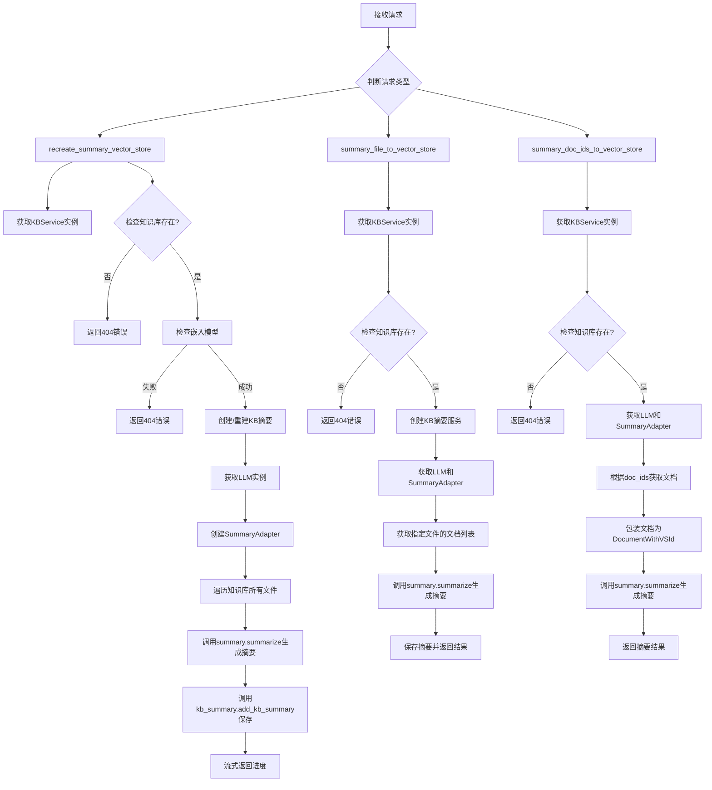
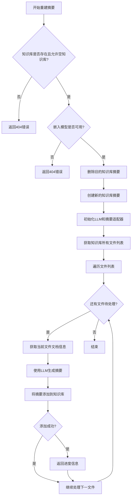
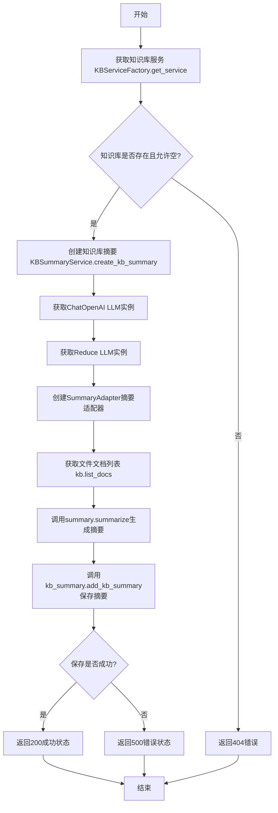
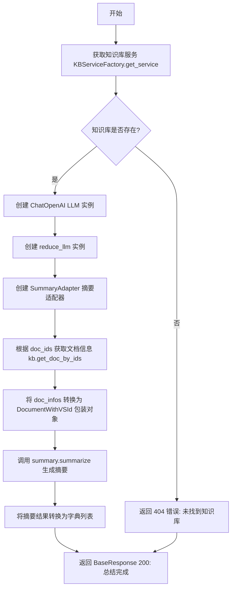

# `Langchain-Chatchat\libs\chatchat-server\chatchat\server\knowledge_base\kb_summary_api.py` 详细设计文档

该代码实现了一个知识库摘要服务的RESTful API接口，提供三种端点用于生成知识库内容的文本摘要：通过重建整个知识库摘要、单文件摘要和按文档ID列表摘要。接口采用Server-Sent Events (SSE)实现流式返回处理进度，支持自定义LLM模型参数和嵌入模型配置。

## 整体流程



## 类结构

```
模块: kb_summary.api (顶层API接口层)
└── 全局函数
    ├── recreate_summary_vector_store (重建知识库摘要)
    ├── summary_file_to_vector_store (单文件摘要)
    └── summary_doc_ids_to_vector_store (按文档ID摘要)
```

## 全局变量及字段


### `logger`
    
全局日志记录器，用于记录知识库摘要服务运行过程中的各类日志信息，包括进度、错误和警告等

类型：`logging.Logger`
    


    

## 全局函数及方法


### `recreate_summary_vector_store`

这是一个FastAPI端点函数，用于重建指定知识库中所有文件的摘要。它通过流式事件（SSE）方式返回处理进度，首先删除旧的摘要库，然后遍历知识库中的所有文件，使用LLM为每个文件生成摘要并存储。

参数：

- `knowledge_base_name`：`str`，知识库名称（必需，示例值 "samples"）
- `allow_empty_kb`：`bool`，是否允许空知识库（默认为 True）
- `vs_type`：`str`，向量存储类型（默认为 Settings.kb_settings.DEFAULT_VS_TYPE）
- `embed_model`：`str`，嵌入模型（默认为 get_default_embedding()）
- `file_description`：`str`，文件描述（默认为 ""）
- `model_name`：`str`，LLM 模型名称（可为空）
- `temperature`：`float`，LLM 采样温度，范围 0.0-1.0（默认为 0.01）
- `max_tokens`：`Optional[int]`，限制 LLM 生成 Token 数量（默认为 None，使用模型最大值）

返回值：`EventSourceResponse`，服务器发送事件响应，用于流式返回处理进度

#### 流程图



#### 带注释源码

```python
def recreate_summary_vector_store(
    knowledge_base_name: str = Body(..., examples=["samples"]),
    # 知识库名称，Body参数表示从请求体中获取，...表示必需参数
    allow_empty_kb: bool = Body(True),
    # 是否允许空知识库，默认为True
    vs_type: str = Body(Settings.kb_settings.DEFAULT_VS_TYPE),
    # 向量存储类型，默认从设置中获取
    embed_model: str = Body(get_default_embedding()),
    # 嵌入模型，默认获取系统配置的嵌入模型
    file_description: str = Body(""),
    # 文件描述信息，用于LLM生成更准确的摘要
    model_name: str = Body(None, description="LLM 模型名称。"),
    # LLM模型名称，用于生成摘要
    temperature: float = Body(0.01, description="LLM 采样温度", ge=0.0, le=1.0),
    # LLM采样温度，控制生成随机性，范围0-1
    max_tokens: Optional[int] = Body(
        None, description="限制LLM生成Token数量，默认None代表模型最大值"
    ),
    # 限制LLM生成的最大token数
):
    """
    重建单个知识库文件摘要
    """
    # 处理max_tokens参数，如果为None或0则使用默认最大值
    if max_tokens in [None, 0]:
        max_tokens = Settings.model_settings.MAX_TOKENS

    def output():
        """内部生成器函数，用于SSE流式输出"""
        try:
            # 获取知识库服务实例
            kb = KBServiceFactory.get_service(knowledge_base_name, vs_type, embed_model)
            
            # 检查知识库是否存在
            if not kb.exists() and not allow_empty_kb:
                yield {"code": 404, "msg": f"未找到知识库 '{knowledge_base_name}'"}
            else:
                # 检查嵌入模型是否可用
                ok, msg = kb.check_embed_model()
                if not ok:
                    yield {"code": 404, "msg": msg}
                else:
                    # 创建知识库摘要服务
                    kb_summary = KBSummaryService(knowledge_base_name, embed_model)
                    # 删除旧的摘要
                    kb_summary.drop_kb_summary()
                    # 创建新的摘要库
                    kb_summary.create_kb_summary()

                    # 初始化主LLM用于生成摘要
                    llm = get_ChatOpenAI(
                        model_name=model_name,
                        temperature=temperature,
                        max_tokens=max_tokens,
                        local_wrap=True,
                    )
                    # 初始化reduce LLM用于摘要压缩
                    reduce_llm = get_ChatOpenAI(
                        model_name=model_name,
                        temperature=temperature,
                        max_tokens=max_tokens,
                        local_wrap=True,
                    )
                    
                    # 创建文本摘要适配器
                    summary = SummaryAdapter.form_summary(
                        llm=llm, reduce_llm=reduce_llm, overlap_size=Settings.kb_settings.OVERLAP_SIZE
                    )
                    
                    # 获取知识库中所有文件
                    files = list_files_from_folder(knowledge_base_name)

                    i = 0
                    # 遍历每个文件生成摘要
                    for i, file_name in enumerate(files):
                        # 获取该文件的文档信息
                        doc_infos = kb.list_docs(file_name=file_name)
                        # 使用LLM生成摘要
                        docs = summary.summarize(
                            file_description=file_description, docs=doc_infos
                        )

                        # 将摘要添加到知识库
                        status_kb_summary = kb_summary.add_kb_summary(
                            summary_combine_docs=docs
                        )
                        
                        if status_kb_summary:
                            # 成功，记录日志并返回进度
                            logger.info(f"({i + 1} / {len(files)}): {file_name} 总结完成")
                            yield json.dumps(
                                {
                                    "code": 200,
                                    "msg": f"({i + 1} / {len(files)}): {file_name}",
                                    "total": len(files),
                                    "finished": i + 1,
                                    "doc": file_name,
                                },
                                ensure_ascii=False,
                            )
                        else:
                            # 失败，记录错误并返回错误信息
                            msg = f"知识库'{knowledge_base_name}'总结文件'{file_name}'时出错。已跳过。"
                            logger.error(msg)
                            yield json.dumps(
                                {
                                    "code": 500,
                                    "msg": msg,
                                }
                            )
                        i += 1
        except asyncio.exceptions.CancelledError:
            # 用户中断时记录警告
            logger.warning("streaming progress has been interrupted by user.")
            return

    # 返回SSE响应用于流式输出
    return EventSourceResponse(output())
```


### `summary_file_to_vector_store`

对指定知识库中的单个文件进行摘要，并将摘要结果添加到知识库的向量存储中。该函数通过流式响应（Server-Sent Events）返回处理进度和结果。

参数：

- `knowledge_base_name`：`str`，知识库名称
- `file_name`：`str`，需要摘要的文件名称
- `allow_empty_kb`：`bool`，是否允许空知识库，默认为 True
- `vs_type`：`str`，向量存储类型，默认为 Settings.kb_settings.DEFAULT_VS_TYPE
- `embed_model`：`str`，嵌入模型，默认为 get_default_embedding()
- `file_description`：`str`，文件描述，默认为空字符串
- `model_name`：`str | None`，LLM 模型名称
- `temperature`：`float`，LLM 采样温度，范围 0.0-1.0，默认 0.01
- `max_tokens`：`int | None`，限制 LLM 生成 Token 数量，默认 None 代表模型最大值

返回值：`EventSourceResponse`，SSE 流式响应，包含处理状态和结果

#### 流程图



#### 带注释源码

```python
def summary_file_to_vector_store(
    knowledge_base_name: str = Body(..., examples=["samples"]),
    # 知识库名称，必填参数，示例为 "samples"
    file_name: str = Body(..., examples=["test.pdf"]),
    # 需要摘要的文件名称，必填参数，示例为 "test.pdf"
    allow_empty_kb: bool = Body(True),
    # 是否允许空知识库，默认为 True
    vs_type: str = Body(Settings.kb_settings.DEFAULT_VS_TYPE),
    # 向量存储类型，默认从设置中获取
    embed_model: str = Body(get_default_embedding()),
    # 嵌入模型，默认获取系统默认嵌入模型
    file_description: str = Body(""),
    # 文件描述信息，用于摘要时的上下文
    model_name: str = Body(None, description="LLM 模型名称。"),
    # LLM 模型名称，可为空
    temperature: float = Body(0.01, description="LLM 采样温度", ge=0.0, le=1.0),
    # LLM 采样温度，范围 0.0-1.0，默认 0.01
    max_tokens: Optional[int] = Body(
        None, description="限制LLM生成Token数量，默认None代表模型最大值"
    ),
    # 限制 LLM 生成 Token 数量，默认 None 使用模型最大值
):
    """
    单个知识库根据文件名称摘要
    :param model_name: LLM 模型名称
    :param max_tokens: 最大 token 数量
    :param temperature: 采样温度
    :param file_description: 文件描述
    :param file_name: 文件名称
    :param knowledge_base_name: 知识库名称
    :param allow_empty_kb: 是否允许空知识库
    :param vs_type: 向量存储类型
    :param embed_model: 嵌入模型
    :return: EventSourceResponse 流式响应
    """

    # 定义内部生成器函数，用于 SSE 流式输出
    def output():
        try:
            # 通过工厂类获取知识库服务实例
            kb = KBServiceFactory.get_service(knowledge_base_name, vs_type, embed_model)
            
            # 检查知识库是否存在，若不存在且不允许空知识库则返回错误
            if not kb.exists() and not allow_empty_kb:
                yield {"code": 404, "msg": f"未找到知识库 '{knowledge_base_name}'"}
            else:
                # 创建知识库摘要服务
                kb_summary = KBSummaryService(knowledge_base_name, embed_model)
                # 创建知识库摘要（如果已存在则重新创建）
                kb_summary.create_kb_summary()

                # 获取主 LLM 用于摘要生成
                llm = get_ChatOpenAI(
                    model_name=model_name,
                    temperature=temperature,
                    max_tokens=max_tokens,
                    local_wrap=True,
                )
                # 获取Reduce LLM用于文档归约
                reduce_llm = get_ChatOpenAI(
                    model_name=model_name,
                    temperature=temperature,
                    max_tokens=max_tokens,
                    local_wrap=True,
                )
                
                # 文本摘要适配器，配置重叠大小
                summary = SummaryAdapter.form_summary(
                    llm=llm, reduce_llm=reduce_llm, overlap_size=Settings.kb_settings.OVERLAP_SIZE
                )

                # 获取指定文件的文档信息
                doc_infos = kb.list_docs(file_name=file_name)
                # 调用摘要适配器生成文档摘要
                docs = summary.summarize(file_description=file_description, docs=doc_infos)

                # 将摘要添加到知识库摘要存储
                status_kb_summary = kb_summary.add_kb_summary(summary_combine_docs=docs)
                
                # 根据保存结果返回相应状态
                if status_kb_summary:
                    logger.info(f" {file_name} 总结完成")
                    yield json.dumps(
                        {
                            "code": 200,
                            "msg": f"{file_name} 总结完成",
                            "doc": file_name,
                        },
                        ensure_ascii=False,
                    )
                else:
                    msg = f"知识库'{knowledge_base_name}'总结文件'{file_name}'时出错。已跳过。"
                    logger.error(msg)
                    yield json.dumps(
                        {
                            "code": 500,
                            "msg": msg,
                        }
                    )
        except asyncio.exceptions.CancelledError:
            # 处理用户中断请求的情况
            logger.warning("streaming progress has been interrupted by user.")
            return

    # 返回 SSE 流式响应
    return EventSourceResponse(output())
```


### `summary_doc_ids_to_vector_store`

根据给定的知识库名称和文档 ID 列表，对知识库中的指定文档进行摘要处理，并返回摘要结果。

参数：

- `knowledge_base_name`：`str`，知识库名称
- `doc_ids`：`List`，文档 ID 列表
- `vs_type`：`str`，向量存储类型，默认为 Settings.kb_settings.DEFAULT_VS_TYPE
- `embed_model`：`str`，嵌入模型，默认为 get_default_embedding()
- `file_description`：`str`，文件描述，默认为空字符串
- `model_name`：`Optional[str]`，LLM 模型名称
- `temperature`：`float`，LLM 采样温度，默认 0.01
- `max_tokens`：`Optional[int]`，限制 LLM 生成 Token 数量

返回值：`BaseResponse`，包含摘要结果或错误信息

#### 流程图



#### 带注释源码

```python
def summary_doc_ids_to_vector_store(
    knowledge_base_name: str = Body(..., examples=["samples"]),
    # 知识库名称，必填参数
    doc_ids: List = Body([], examples=[["uuid"]]),
    # 要摘要的文档 ID 列表
    vs_type: str = Body(Settings.kb_settings.DEFAULT_VS_TYPE),
    # 向量存储类型，默认使用配置中的 DEFAULT_VS_TYPE
    embed_model: str = Body(get_default_embedding()),
    # 嵌入模型，默认使用系统默认嵌入模型
    file_description: str = Body(""),
    # 文件描述信息，用于摘要上下文
    model_name: str = Body(None, description="LLM 模型名称。"),
    # LLM 模型名称，默认 None
    temperature: float = Body(0.01, description="LLM 采样温度", ge=0.0, le=1.0),
    # LLM 采样温度，范围 0.0-1.0
    max_tokens: Optional[int] = Body(
        None, description="限制LLM生成Token数量，默认None代表模型最大值"
    ),
    # 最大生成 token 数量，默认 None（使用模型默认最大值）
) -> BaseResponse:
    """
    单个知识库根据doc_ids摘要
    :param knowledge_base_name: 知识库名称
    :param doc_ids: 文档 ID 列表
    :param model_name: LLM 模型名称
    :param max_tokens: 最大 token 数量
    :param temperature: 采样温度
    :param file_description: 文件描述
    :param vs_type: 向量存储类型
    :param embed_model: 嵌入模型
    :return: 包含摘要结果的 BaseResponse
    """
    # 获取知识库服务实例
    kb = KBServiceFactory.get_service(knowledge_base_name, vs_type, embed_model)
    
    # 检查知识库是否存在
    if not kb.exists():
        # 知识库不存在，返回 404 错误
        return BaseResponse(
            code=404, msg=f"未找到知识库 {knowledge_base_name}", data={}
        )
    else:
        # 创建主 LLM 实例用于摘要
        llm = get_ChatOpenAI(
            model_name=model_name,
            temperature=temperature,
            max_tokens=max_tokens,
            local_wrap=True,
        )
        # 创建 reduce LLM 实例用于文档归约
        reduce_llm = get_ChatOpenAI(
            model_name=model_name,
            temperature=temperature,
            max_tokens=max_tokens,
            local_wrap=True,
        )
        # 文本摘要适配器，配置重叠大小
        summary = SummaryAdapter.form_summary(
            llm=llm, reduce_llm=reduce_llm, overlap_size=Settings.kb_settings.OVERLAP_SIZE
        )

        # 根据文档 ID 列表获取文档信息
        doc_infos = kb.get_doc_by_ids(ids=doc_ids)
        
        # 将 doc_infos 转换成 DocumentWithVSId 包装的对象（保留原始 ID）
        doc_info_with_ids = [
            DocumentWithVSId(**{**doc.dict(), "id": with_id})
            for with_id, doc in zip(doc_ids, doc_infos)
        ]

        # 调用摘要服务生成文档摘要
        docs = summary.summarize(
            file_description=file_description, docs=doc_info_with_ids
        )

        # 将 docs 转换成 dict 列表以便返回
        resp_summarize = [{**doc.dict()} for doc in docs]

        # 返回成功响应，包含摘要结果
        return BaseResponse(
            code=200, msg="总结完成", data={"summarize": resp_summarize}
        )
```

## 关键组件


### 知识库服务工厂 (KBServiceFactory)

负责根据知识库名称、向量存储类型和嵌入模型获取相应的知识库服务实例，是整个摘要流程的入口点。

### 知识库摘要服务 (KBSummaryService)

管理知识库摘要的创建、删除和添加操作，提供drop_kb_summary()和create_kb_summary()方法来重置摘要存储，以及add_kb_summary()方法将摘要结果持久化。

### 摘要适配器 (SummaryAdapter)

封装文本摘要的核心逻辑，通过form_summary()工厂方法创建摘要实例，接收LLM和reduce_llm参数实现摘要生成，支持overlap_size配置控制文本块重叠大小。

### LLM调用模块 (get_ChatOpenAI)

封装ChatOpenAI模型调用，提供model_name、temperature、max_tokens和local_wrap等参数，用于生成摘要文本。

### 流式响应处理器 (EventSourceResponse)

基于SSE协议实现服务器推送，将摘要进度实时返回给客户端，支持中断处理和进度追踪。

### 文档模型包装器 (DocumentWithVSId)

将文档信息与向量存储ID进行绑定封装，为摘要流程提供统一的文档对象格式。

### 配置管理模块 (Settings)

集中管理知识库相关配置，包括DEFAULT_VS_TYPE默认向量存储类型、OVERLAP_SIZE重叠大小、MAX_TOKENS最大令牌数等参数。

### 文件列表获取工具 (list_files_from_folder)

从指定知识库目录中扫描并返回所有待处理的文件列表。

## 问题及建议


### 已知问题

-   **类型提示不完整**：`doc_ids: List = Body([]...)` 应改为 `doc_ids: List[str]`，缺少具体类型约束
-   **代码重复**：三个函数中存在大量重复代码（LLM初始化、摘要适配器创建、错误处理逻辑），违反DRY原则
-   **异常处理不一致**：`recreate_summary_vector_store` 和 `summary_file_to_vector_store` 捕获了 `asyncio.exceptions.CancelledError`，但 `summary_doc_ids_to_vector_store` 未捕获
-   **状态管理问题**：`summary_file_to_vector_store` 中调用 `kb_summary.create_kb_summary()` 未检查是否已存在，可能导致重复创建或覆盖
-   **索引逻辑错误**：`recreate_summary_vector_store` 中存在 `i += 1` 多余操作（for循环已自动递增）
-   **返回值类型不统一**：前两个函数返回 `EventSourceResponse`（SSE流），第三个函数返回 `BaseResponse`，调用方处理逻辑不一致
-   **缺少资源释放**：LLM实例创建后未提供明确的关闭/释放机制，可能导致资源泄漏

### 优化建议

-   **提取公共逻辑**：将LLM初始化、摘要适配器创建等重复代码抽取为独立函数或工具类
-   **完善类型提示**：补全所有类型注解，确保 `doc_ids` 等参数类型安全
-   **统一异常处理**：在所有函数中添加 `CancelledError` 捕获，或在更上层统一处理
-   **添加幂等性检查**：`create_kb_summary()` 前检查是否已存在，避免重复创建
-   **修复索引**：移除多余的 `i += 1` 操作
-   **统一返回类型**：考虑将所有函数改为统一返回格式，或明确区分同步/异步接口
-   **添加并发支持**：考虑使用 `asyncio.gather` 或线程池并行处理多个文件，提升性能
-   **增加重试机制**：网络或LLM调用失败时添加重试逻辑，提升鲁棒性

## 其它


### 设计目标与约束

本模块旨在实现知识库文件的自动化摘要功能，通过LLM对知识库中的文档进行摘要处理，并支持单文件、批量文件及指定文档ID的摘要场景。设计约束包括：1) 必须依赖已存在的知识库；2) 使用SSE实现流式输出进度；3) 支持自定义LLM模型参数（temperature、max_tokens）；4) 默认使用配置文件中的嵌入模型。

### 错误处理与异常设计

异常处理采用分层设计：1) 输入参数校验通过FastAPI的Body参数约束（如temperature的ge/le范围）；2) 知识库不存在时返回404状态码；3) 嵌入模型校验失败时返回404并附带错误信息；4) 摘要生成失败时记录日志并返回500状态码，跳过当前文件继续处理后续文件；5) 用户中断请求时捕获asyncio.exceptions.CancelledError并优雅退出。BaseResponse统一返回格式包含code、msg、data字段。

### 数据流与状态机

数据流路径：1) 接收knowledge_base_name、file_name/doc_ids等参数 → 2) 获取KBService实例 → 3) 验证知识库存在性 → 4) 获取文档列表或指定文档 → 5) 调用SummaryAdapter进行摘要处理 → 6) 将摘要结果存储到kb_summary → 7) 通过EventSourceResponse流式返回进度。状态包括：知识库校验、嵌入模型校验、摘要生成中、摘要存储成功、摘要存储失败。

### 外部依赖与接口契约

主要依赖：1) KBServiceFactory.get_service() - 获取知识库服务实例；2) KBSummaryService - 知识库摘要管理；3) SummaryAdapter.form_summary() - 摘要适配器工厂；4) get_ChatOpenAI() - 获取LLM实例；5) list_files_from_folder() - 获取知识库文件列表。接口契约：所有函数通过FastAPI Body接收参数，recreate_summary_vector_store和summary_file_to_vector_store返回EventSourceResponse（流式SSE），summary_doc_ids_to_vector_store返回BaseResponse（同步）。

### 性能考虑与优化空间

当前实现存在以下优化点：1) 重复创建LLM实例 - llm和reduce_llm每次请求都重新创建，可考虑缓存；2) 串行处理文件 - 批量摘要时逐个处理，可引入并发处理；3) 知识库存在性重复检查 - create_kb_summary内部可能已包含exists检查；4) 内存占用 - doc_infos和docs全部加载到内存，大文件场景可考虑分片处理；5) 日志高频输出 - 每个文件都记录info，可改为进度条或降低频率。

### 并发与异步处理

当前使用asyncio.exceptions.CancelledError处理用户中断场景。EventSourceResponse内部已支持异步迭代器模式，但实际摘要过程（summary.summarize）为同步调用，可考虑改为async def以支持真正的异步处理。批量文件处理时可使用asyncio.gather并发执行多个摘要任务。

### 配置管理

配置来源：1) Settings.kb_settings.DEFAULT_VS_TYPE - 默认向量存储类型；2) Settings.kb_settings.OVERLAP_SIZE - 摘要重叠大小；3) Settings.model_settings.MAX_TOKENS - 默认最大token数；4) get_default_embedding() - 默认嵌入模型。所有配置通过Settings单例或函数动态获取，支持热更新。

### 安全性考虑

当前实现未包含：1) 用户认证与授权 - 知识库访问权限控制；2) 输入 sanitization - file_name等参数未做特殊字符过滤；3) 速率限制 - LLM调用可能产生高并发；4) 敏感信息脱敏 - 日志中可能记录文档内容。建议添加API网关层面的认证和参数校验中间件。

### 日志与监控

日志模块使用build_logger()创建，recreate_summary_vector_store记录info级别进度（文件完成）、error级别错误（摘要失败）；summary_file_to_vector_store记录info和error；summary_doc_ids_to_vector_store仅返回BaseResponse未记录日志。建议统一日志格式，增加请求ID追踪，添加metrics监控LLM调用延迟和成功率。

### 测试策略建议

建议补充：1) 单元测试 - 测试SummaryAdapter、KBSummaryService等组件；2) 集成测试 - 测试API端点响应格式和状态码；3) mock测试 - mock LLM和KBService避免外部依赖；4) 压力测试 - 测试大批量文件摘要的并发处理能力；5) 异常场景测试 - 测试知识库不存在、LLM调用失败等边界情况。

    