# `Langchain-Chatchat\libs\chatchat-server\chatchat\server\knowledge_base\migrate.py` 详细设计文档

该代码文件是ChatChat知识库迁移模块，核心功能包括：从备份SQLite数据库导入数据到info.db、将本地文件夹中的文件向量化并存储到向量库和数据库增量更新、以及同步清理知识库中已删除文件对应的数据库记录或本地文件

## 整体流程

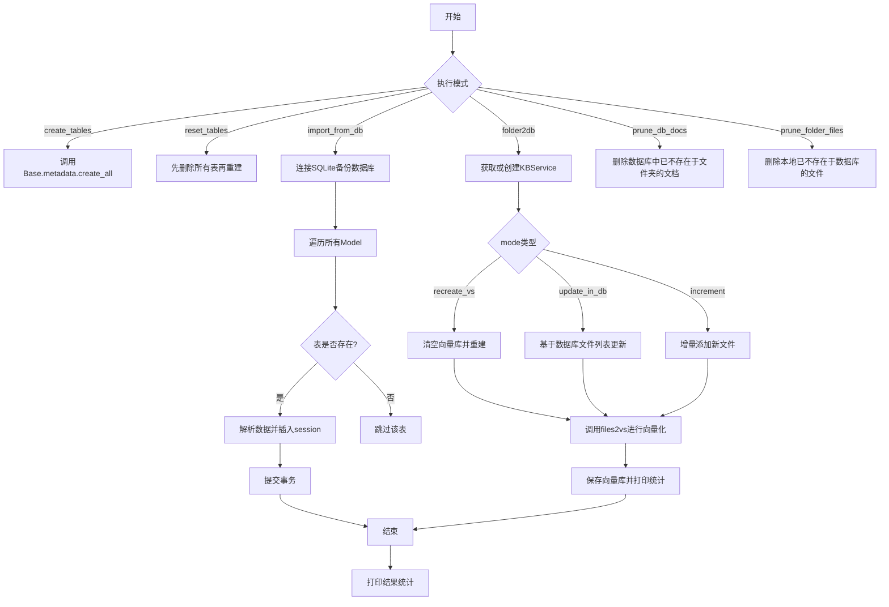

## 类结构

```
全局模块级
├── migrate.py (本文件)
│   ├── create_tables (建表函数)
│   ├── reset_tables (重置表函数)
│   ├── import_from_db (导入数据函数)
│   ├── file_to_kbfile (文件转换函数)
│   ├── folder2db (文件夹转数据库主函数)
    ├── files2vs (内部函数，向量化处理)
    ├── prune_db_docs (清理数据库文档)
    └── prune_folder_files (清理本地文件夹文件)
```

## 全局变量及字段


### `logger`
    
用于记录程序运行日志的日志对象

类型：`Logger`
    


### `sqlite_path`
    
备份数据库的路径，用于从备份数据库导入数据

类型：`str`
    


### `vs_type`
    
向量存储类型，指定使用的向量数据库类型

类型：`Literal['faiss', 'milvus', 'pg', 'chromadb']`
    


### `embed_model`
    
嵌入模型名称，用于将文本转换为向量表示

类型：`str`
    


### `chunk_size`
    
文本分块大小，指定每个文档块包含的字符数

类型：`int`
    


### `chunk_overlap`
    
文本分块重叠大小，指定相邻文档块之间的重叠字符数

类型：`int`
    


### `zh_title_enhance`
    
中文标题增强开关，用于提升中文文档的检索效果

类型：`bool`
    


### `Base.metadata`
    
SQLAlchemy元数据对象，包含所有数据库表的结构定义

类型：`MetaData`
    


### `Base.registry`
    
SQLAlchemy映射注册器，用于管理模型类与数据库表的映射关系

类型：`MapperRegistry`
    


### `KnowledgeFile.filename`
    
文件名，包含文档的实际文件名

类型：`str`
    


### `KnowledgeFile.knowledge_base_name`
    
知识库名称，当前文件所属的知识库标识

类型：`str`
    


### `KnowledgeFile.splited_docs`
    
分割后的文档列表，存储文本分块后的文档对象

类型：`List[Document]`
    


### `Settings.kb_settings`
    
知识库配置对象，包含知识库相关的默认设置参数

类型：`KBSettings`
    
    

## 全局函数及方法


### `create_tables`

该函数是数据库初始化工具函数，负责通过 SQLAlchemy 的元数据机制在数据库中创建所有已定义的表结构。它使用 Base 类的 metadata 属性配合 engine 绑定来执行表创建操作，是应用启动时建立数据库schema的核心方法。

参数：
- 该函数无参数

返回值：`None`，无返回值（Python 函数默认返回 None）

#### 流程图

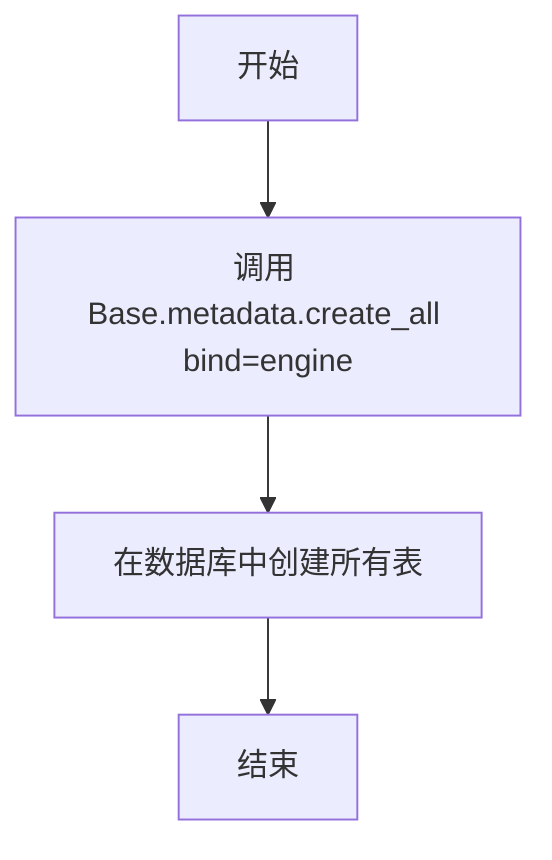

#### 带注释源码

```python
def create_tables():
    """
    创建所有数据库表。
    
    该函数使用 SQLAlchemy 的 Base 元数据来创建所有已定义的表结构。
    它会检查数据库中是否已存在同名的表，如果不存在则创建之。
    这通常在应用首次启动或数据库迁移时调用。
    """
    Base.metadata.create_all(bind=engine)
```


### `reset_tables`

该函数用于重置数据库中的所有表，通过先删除所有现有表然后重新创建它们来实现数据库的重置操作。

参数：

- （无参数）

返回值：`None`，该函数没有显式返回值，执行完表删除和创建操作后直接返回

#### 流程图

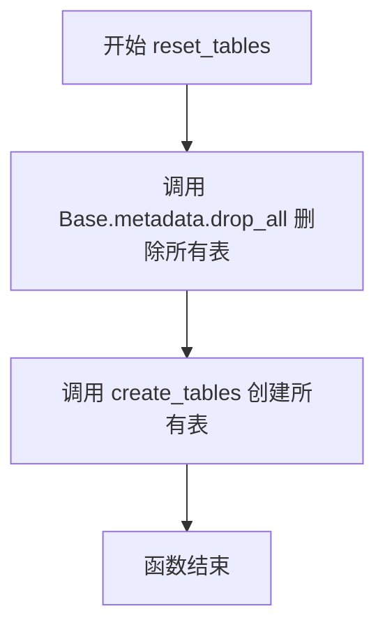

#### 带注释源码

```python
def reset_tables():
    """
    重置数据库中的所有表。
    该函数首先删除所有现有的数据库表，然后重新创建它们，
    通常用于数据库初始化或测试场景。
    """
    # 删除所有已存在的表
    # Base.metadata.drop_all 会检查所有已注册的模型，
    # 并根据这些模型定义删除对应的数据库表
    Base.metadata.drop_all(bind=engine)
    
    # 重新创建所有表
    # create_tables 是同一个模块中定义的函数，
    # 它会读取所有已注册模型的元数据，
    # 并在数据库中创建对应的表结构
    create_tables()
```


### `import_from_db`

该函数用于在知识库与向量库无变化的情况下，从备份的 SQLite 数据库中导入数据到当前系统的 info.db。适用于版本升级时数据库表结构变化，但无需重新进行向量化的场景。函数会遍历备份数据库中的所有表，将数据迁移到当前系统的数据库中。

**参数：**

- `sqlite_path`：`str`，备份数据库的路径，默认为 None

**返回值：** `bool`，表示是否成功导入数据；返回 True 表示导入成功，返回 False 表示导入失败

#### 流程图

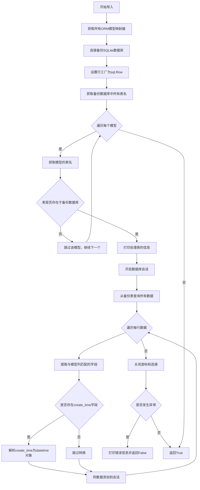

#### 带注释源码

```python
def import_from_db(
    sqlite_path: str = None,
    # csv_path: str = None,
) -> bool:
    """
    在知识库与向量库无变化的情况下，从备份数据库中导入数据到 info.db。
    适用于版本升级时，info.db 结构变化，但无需重新向量化的情况。
    请确保两边数据库表名一致，需要导入的字段名一致
    当前仅支持 sqlite
    """
    # 导入sqlite3模块用于连接SQLite数据库
    # 导入pprint用于调试打印数据
    import sqlite3 as sql
    from pprint import pprint

    # 获取Base中所有注册的ORM模型映射器
    # 这些模型对应数据库中的表结构
    models = list(Base.registry.mappers)

    try:
        # 连接到备份的SQLite数据库
        con = sql.connect(sqlite_path)
        # 设置row_factory为sql.Row，使可以通过列名访问数据
        con.row_factory = sql.Row
        # 创建游标对象用于执行SQL语句
        cur = con.cursor()
        
        # 从sqlite_master系统表查询所有用户表的名称
        # type='table'确保只查询表，不包括索引和视图
        tables = [
            x["name"]
            for x in cur.execute(
                "select name from sqlite_master where type='table'"
            ).fetchall()
        ]
        
        # 遍历每个ORM模型，检查是否需要导入数据
        for model in models:
            # 获取模型对应的表全名（包含schema前缀）
            table = model.local_table.fullname
            
            # 如果备份数据库中不存在该表，则跳过
            if table not in tables:
                continue
            
            # 打印当前正在处理的表名
            print(f"processing table: {table}")
            
            # 开启数据库会话，用于添加数据到目标数据库
            with session_scope() as session:
                # 查询备份表中所有数据
                for row in cur.execute(f"select * from {table}").fetchall():
                    # 使用字典推导式提取与模型列名匹配的字段
                    # 过滤掉备份表中存在但模型中不存在的列
                    data = {k: row[k] for k in row.keys() if k in model.columns}
                    
                    # 如果存在create_time字段，需要将其解析为datetime对象
                    # 因为数据库存储的是字符串格式的时间
                    if "create_time" in data:
                        # 使用dateutil.parser解析时间字符串
                        data["create_time"] = parse(data["create_time"])
                    
                    # 打印当前正在导入的数据（用于调试）
                    pprint(data)
                    
                    # 创建模型实例并添加到会话
                    # model.class_是模型对应的Python类
                    session.add(model.class_(**data))
        
        # 关闭数据库连接
        con.close()
        # 返回成功标志
        return True
        
    except Exception as e:
        # 捕获任何异常，打印错误信息并返回失败标志
        # 包括但不限于：文件路径不存在、数据库损坏、权限问题等
        print(f"无法读取备份数据库：{sqlite_path}。错误信息：{e}")
        return False
```


### `file_to_kbfile`

该函数接收知识库名称和文件列表，遍历文件列表为每个文件创建`KnowledgeFile`对象，将创建成功的对象添加到列表中返回，遇到错误时记录日志并跳过该文件。

参数：

- `kb_name`：`str`，知识库的名称，用于指定文件所属的知识库
- `files`：`List[str]`，要转换的文件名列表

返回值：`List[KnowledgeFile]`，包含成功创建的`KnowledgeFile`对象列表，如果所有文件都创建失败则返回空列表

#### 流程图

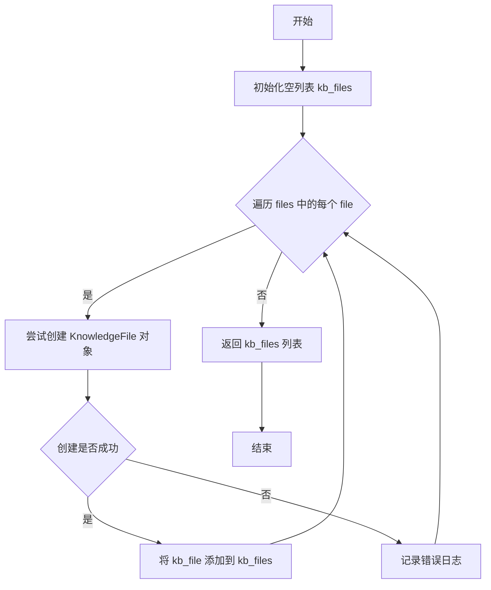

#### 带注释源码

```python
def file_to_kbfile(kb_name: str, files: List[str]) -> List[KnowledgeFile]:
    """
    将文件名列表转换为 KnowledgeFile 对象列表
    
    参数:
        kb_name: 知识库名称
        files: 要转换的文件名列表
    
    返回:
        包含成功创建的 KnowledgeFile 对象的列表
    """
    kb_files = []  # 初始化用于存储 KnowledgeFile 对象的空列表
    for file in files:  # 遍历输入的文件名列表
        try:
            # 尝试为每个文件名创建 KnowledgeFile 对象
            # 传入文件名和知识库名称作为参数
            kb_file = KnowledgeFile(filename=file, knowledge_base_name=kb_name)
            kb_files.append(kb_file)  # 成功则添加到结果列表
        except Exception as e:
            # 捕获创建过程中的异常
            msg = f"{e}，已跳过"  # 构建错误消息
            # 记录错误日志，包含异常类型名称和错误消息
            logger.error(f"{e.__class__.__name__}: {msg}")
    return kb_files  # 返回转换后的 KnowledgeFile 对象列表
```


### `folder2db`

该函数用于将本地文件夹中的知识文件同步到数据库和向量库中，支持多种同步模式（重建向量库、更新数据库信息、增量同步），并提供详细的任务执行统计信息。

参数：

- `kb_names`：`List[str]`，知识库名称列表，传入空列表时自动从文件夹扫描获取
- `mode`：`Literal["recreate_vs", "update_in_db", "increment"]`，同步模式：recreate_vs 为重建所有向量库并填充数据库信息；update_in_db 为仅使用已存在于数据库中的本地文件更新向量库和数据库信息；increment 为仅对本地文件中不存在于数据库的部分创建向量库和数据库信息
- `vs_type`：`Literal["faiss", "milvus", "pg", "chromadb"]`，向量库类型，默认为 Settings.kb_settings.DEFAULT_VS_TYPE
- `embed_model`：`str`，嵌入模型，默认为 get_default_embedding()
- `chunk_size`：`int`，文本分块大小，默认为 Settings.kb_settings.CHUNK_SIZE
- `chunk_overlap`：`int`，文本分块重叠大小，默认为 Settings.kb_settings.OVERLAP_SIZE
- `zh_title_enhance`：`bool`，是否启用中文标题增强，默认为 Settings.kb_settings.ZH_TITLE_ENHANCE

返回值：`None`，该函数无显式返回值，通过打印输出执行结果统计信息

#### 流程图

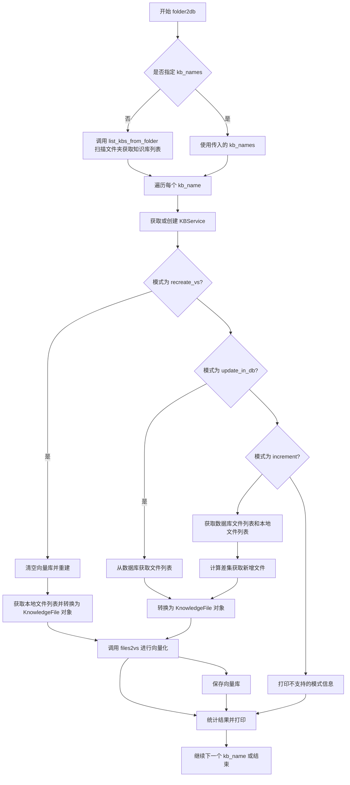

#### 带注释源码

```python
def folder2db(
    kb_names: List[str],  # 知识库名称列表，为空时自动扫描文件夹
    mode: Literal["recreate_vs", "update_in_db", "increment"],  # 同步模式：重建/更新/增量
    # 向量库类型，支持 faiss/milvus/pg/chromadb，默认为配置中的默认值
    vs_type: Literal["faiss", "milvus", "pg", "chromadb"] = Settings.kb_settings.DEFAULT_VS_TYPE,
    embed_model: str = get_default_embedding(),  # 嵌入模型，默认为系统默认模型
    chunk_size: int = Settings.kb_settings.CHUNK_SIZE,  # 文本分块大小
    chunk_overlap: int = Settings.kb_settings.OVERLAP_SIZE,  # 分块重叠大小
    zh_title_enhance: bool = Settings.kb_settings.ZH_TITLE_ENHANCE,  # 中文标题增强开关
):
    """
    use existed files in local folder to populate database and/or vector store.
    set parameter `mode` to:
        recreate_vs: recreate all vector store and fill info to database using existed files in local folder
        fill_info_only(disabled): do not create vector store, fill info to db using existed files only
        update_in_db: update vector store and database info using local files that existed in database only
        increment: create vector store and database info for local files that not existed in database only
    """

    # 内部函数：将知识文件列表向量化并添加到向量库
    def files2vs(kb_name: str, kb_files: List[KnowledgeFile]) -> List:
        result = []  # 存储成功处理的文档结果
        # 遍历文件列表，使用多线程进行文档转换
        for success, res in files2docs_in_thread(
            kb_files,
            chunk_size=chunk_size,
            chunk_overlap=chunk_overlap,
            zh_title_enhance=zh_title_enhance,
        ):
            if success:
                # 成功转换：提取文件名和文档内容
                _, filename, docs = res
                print(
                    f"正在将 {kb_name}/{filename} 添加到向量库，共包含{len(docs)}条文档"
                )
                # 创建 KnowledgeFile 对象并关联分片后的文档
                kb_file = KnowledgeFile(filename=filename, knowledge_base_name=kb_name)
                kb_file.splited_docs = docs
                # 添加到知识库向量库，不刷新缓存以提高性能
                kb.add_doc(kb_file=kb_file, not_refresh_vs_cache=True)
                result.append({"kb_name": kb_name, "file": filename, "docs": docs})
            else:
                # 转换失败，打印错误信息
                print(res)
        return result

    # 获取知识库列表，未指定时从本地文件夹扫描
    kb_names = kb_names or list_kbs_from_folder()
    
    # 遍历每个知识库进行处理
    for kb_name in kb_names:
        start = datetime.now()  # 记录开始时间
        # 创建知识库服务实例
        kb = KBServiceFactory.get_service(kb_name, vs_type, embed_model)
        
        # 确保知识库存在，不存在则创建
        if not kb.exists():
            kb.create_kb()

        # 模式1：清除向量库，从本地文件重建
        if mode == "recreate_vs":
            kb.clear_vs()  # 清空现有向量库
            kb.create_kb()  # 重新创建
            # 获取本地文件夹中的所有文件并转换为 KnowledgeFile 对象
            kb_files = file_to_kbfile(kb_name, list_files_from_folder(kb_name))
            result = files2vs(kb_name, kb_files)  # 执行向量化
            kb.save_vector_store()  # 保存向量库
        
        # 模式2（已禁用）：仅填充文件信息到数据库，不做向量化
        # elif mode == "fill_info_only":
        #     files = list_files_from_folder(kb_name)
        #     kb_files = file_to_kbfile(kb_name, files)
        #     for kb_file in kb_files:
        #         add_file_to_db(kb_file)
        #         print(f"已将 {kb_name}/{kb_file.filename} 添加到数据库")
        
        # 模式3：以数据库中文件列表为基准，利用本地文件更新向量库
        elif mode == "update_in_db":
            files = kb.list_files()  # 获取数据库中已有的文件列表
            kb_files = file_to_kbfile(kb_name, files)
            result = files2vs(kb_name, kb_files)
            kb.save_vector_store()
        
        # 模式4：增量同步，对比本地与数据库，仅处理新增文件
        elif mode == "increment":
            db_files = kb.list_files()  # 数据库中的文件
            folder_files = list_files_from_folder(kb_name)  # 本地文件夹中的文件
            # 计算本地新增的文件（本地有但数据库没有的）
            files = list(set(folder_files) - set(db_files))
            kb_files = file_to_kbfile(kb_name, files)
            result = files2vs(kb_name, kb_files)
            kb.save_vector_store()
        
        # 无效模式处理
        else:
            print(f"unsupported migrate mode: {mode}")
        
        end = datetime.now()  # 记录结束时间
        
        # 构建输出信息，仅 FAISS 类型显示路径
        kb_path = (
            f"知识库路径\t：{kb.kb_path}\n"
            if kb.vs_type() == SupportedVSType.FAISS
            else ""
        )
        file_count = len(kb_files)  # 源文件总数
        success_count = len(result)  # 成功处理的文件数
        docs_count = sum([len(x["docs"]) for x in result])  # 生成的文档条目总数
        
        # 打印格式化的统计报告
        print("\n" + "-" * 100)
        print(
            (
                f"知识库名称\t：{kb_name}\n"
                f"知识库类型\t：{kb.vs_type()}\n"
                f"向量模型\t：{kb.embed_model}\n"
            )
            + kb_path
            + (
                f"文件总数量\t：{file_count}\n"
                f"入库文件数\t：{success_count}\n"
                f"知识条目数\t：{docs_count}\n"
                f"用时\t\t：{end-start}"
            )
        )
        print("-" * 100 + "\n")
```


### `prune_db_docs`

删除数据库中已不存在于本地文件夹的文档。用于在用户通过文件浏览器删除某些文档文件后，清理数据库中的相关文档记录。

参数：

- `kb_names`：`List[str]`，知识库名称列表

返回值：`None`，该函数没有返回值，通过print输出删除结果

#### 流程图

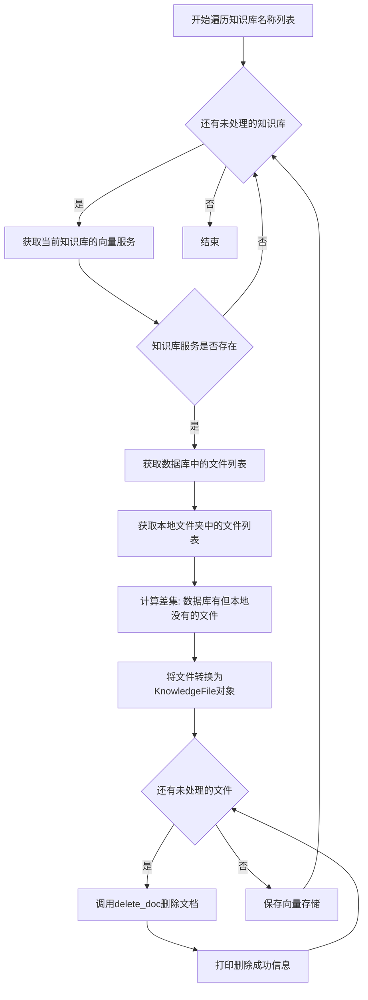

#### 带注释源码

```python
def prune_db_docs(kb_names: List[str]):
    """
    delete docs in database that not existed in local folder.
    it is used to delete database docs after user deleted some doc files in file browser
    """
    # 遍历传入的每个知识库名称
    for kb_name in kb_names:
        # 根据知识库名称获取对应的向量服务实例
        kb = KBServiceFactory.get_service_by_name(kb_name)
        # 检查知识库服务是否存在
        if kb is not None:
            # 获取数据库中已存储的文件列表
            files_in_db = kb.list_files()
            # 获取本地文件夹中的实际文件列表
            files_in_folder = list_files_from_folder(kb_name)
            # 计算差集：数据库中存在但本地文件夹中不存在的文件
            files = list(set(files_in_db) - set(files_in_folder))
            # 将文件列表转换为KnowledgeFile对象列表
            kb_files = file_to_kbfile(kb_name, files)
            # 遍历每个需要删除的文件
            for kb_file in kb_files:
                # 从向量库中删除文档，not_refresh_vs_cache=True表示不刷新缓存
                kb.delete_doc(kb_file, not_refresh_vs_cache=True)
                # 打印删除成功的提示信息
                print(f"success to delete docs for file: {kb_name}/{kb_file.filename}")
            # 保存向量存储的更改
            kb.save_vector_store()
```


### `prune_folder_files`

删除本地文件夹中不存在于数据库中的文档文件，用于通过删除未使用的文档文件来释放本地磁盘空间。

参数：

- `kb_names`：`List[str]`，知识库名称列表

返回值：`None`，该函数没有返回值

#### 流程图

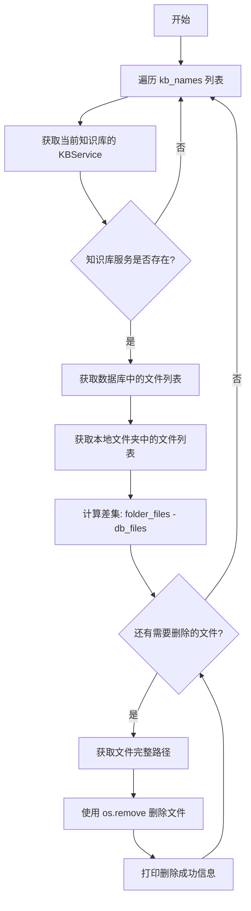

#### 带注释源码

```python
def prune_folder_files(kb_names: List[str]):
    """
    delete doc files in local folder that not existed in database.
    it is used to free local disk space by delete unused doc files.
    """
    # 遍历传入的每个知识库名称
    for kb_name in kb_names:
        # 通过知识库名称获取对应的 KBService 实例
        kb = KBServiceFactory.get_service_by_name(kb_name)
        
        # 检查知识库服务是否存在
        if kb is not None:
            # 获取数据库中已存在的文件列表
            files_in_db = kb.list_files()
            
            # 获取本地文件夹中的文件列表
            files_in_folder = list_files_from_folder(kb_name)
            
            # 计算本地有但数据库中没有的文件（差集）
            files = list(set(files_in_folder) - set(files_in_db))
            
            # 遍历需要删除的文件列表
            for file in files:
                # 获取文件的完整路径并删除
                os.remove(get_file_path(kb_name, file))
                
                # 打印删除成功的日志信息
                print(f"success to delete file: {kb_name}/{file}")
```


### `folder2db.files2vs`

该函数是`folder2db`函数的内部嵌套函数，负责将知识库文件列表转换为向量存储。它遍历文件列表，调用`files2docs_in_thread`进行文档切分，然后使用知识库服务将切分后的文档添加到向量库中，最终返回处理结果列表。

参数：

- `kb_name`：`str`，知识库的名称，用于标识要操作的知识库
- `kb_files`：`List[KnowledgeFile]`，知识文件对象列表，每个元素代表一个需要向量化处理的文件

返回值：`List`，返回处理结果列表，每个元素为包含`kb_name`（知识库名称）、`file`（文件名）、`docs`（文档列表）的字典

#### 流程图

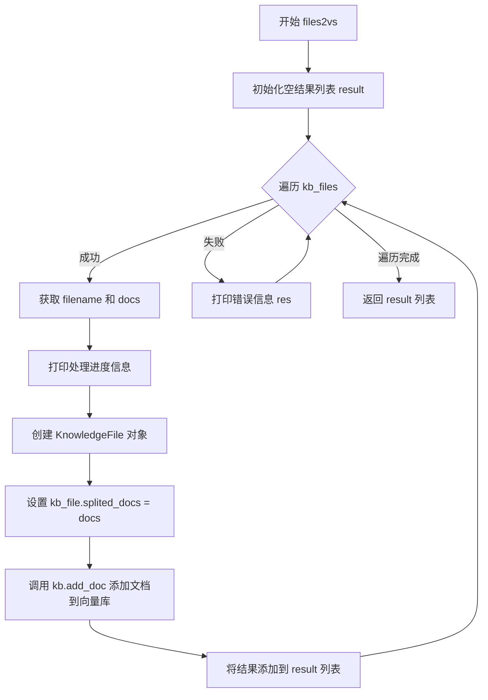

#### 带注释源码

```python
def files2vs(kb_name: str, kb_files: List[KnowledgeFile]) -> List:
    """
    将知识库文件列表转换为向量存储
    :param kb_name: 知识库名称
    :param kb_files: 知识文件列表
    :return: 返回处理结果列表，每个元素为包含 kb_name、file、docs 的字典
    """
    result = []  # 用于存储处理结果的列表
    # 遍历文件列表，调用 files2docs_in_thread 进行文档切分
    for success, res in files2docs_in_thread(
        kb_files,
        chunk_size=chunk_size,
        chunk_overlap=chunk_overlap,
        zh_title_enhance=zh_title_enhance,
    ):
        if success:
            # 解包返回值：(_, filename, docs)
            _, filename, docs = res
            # 打印处理进度信息
            print(
                f"正在将 {kb_name}/{filename} 添加到向量库，共包含{len(docs)}条文档"
            )
            # 创建 KnowledgeFile 对象
            kb_file = KnowledgeFile(filename=filename, knowledge_base_name=kb_name)
            # 设置切分后的文档
            kb_file.splited_docs = docs
            # 调用知识库服务添加文档到向量库，not_refresh_vs_cache=True 表示不刷新向量库缓存
            kb.add_doc(kb_file=kb_file, not_refresh_vs_cache=True)
            # 将处理结果添加到结果列表
            result.append({"kb_name": kb_name, "file": filename, "docs": docs})
        else:
            # 处理失败的情况，打印错误信息
            print(res)
    # 返回处理结果列表
    return result
```


### `list_kbs_from_folder`

获取知识库文件夹中所有已存在的知识库名称列表。

参数：

- （无参数）

返回值：`List[str]`，返回知识库名称列表，每个元素为知识库文件夹名称

#### 流程图

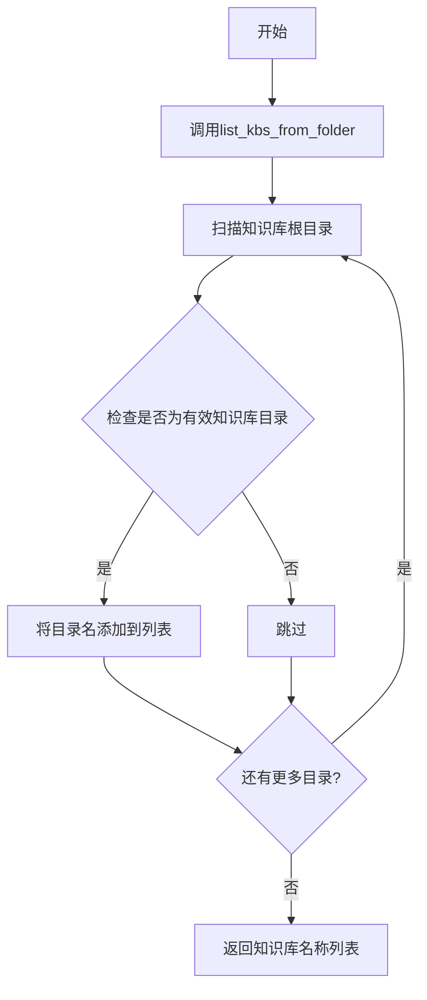

#### 带注释源码

```
# 该函数定义在 chatchat.server.knowledge_base.utils 模块中
# 以下为引用处示例（在当前文件中的使用方式）

# 从 utils 模块导入该函数
from chatchat.server.knowledge_base.utils import (
    KnowledgeFile,
    files2docs_in_thread,
    get_file_path,
    list_files_from_folder,
    list_kbs_from_folder,  # <-- 从 utils 模块导入
)

# 在 folder2db 函数中使用
kb_names = kb_names or list_kbs_from_folder()
# 用途：如果 kb_names 参数为空，则自动获取知识库文件夹中所有知识库名称
# 返回值类型推断：List[str]
# 返回值示例：["knowledge_base_1", "knowledge_base_2", "kb_demo"]
```


### `list_files_from_folder`

获取指定知识库文件夹中的文件列表，返回该知识库目录下所有文件名（不含路径）。

参数：

- `kb_name`：`str`，知识库名称，用于定位对应的知识库文件夹

返回值：`List[str]`，文件名字符串列表

#### 流程图

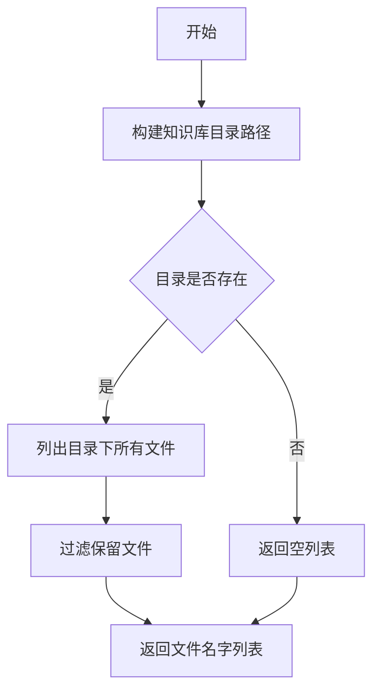

#### 带注释源码

```
# 该函数定义位于 chatchat.server.knowledge_base.utils 模块
# 此处为调用方源码展示其在 folder2db 函数中的使用方式

# 从 utils 模块导入 list_files_from_folder 函数
from chatchat.server.knowledge_base.utils import (
    list_files_from_folder,
    ...
)

def folder2db(kb_names: List[str], ...):
    ...
    for kb_name in kb_names:
        ...
        if mode == "recreate_vs":
            ...
            # 使用 list_files_from_folder 获取知识库目录下的所有文件
            kb_files = file_to_kbfile(kb_name, list_files_from_folder(kb_name))
            ...
        elif mode == "increment":
            db_files = kb.list_files()
            # 获取本地文件夹中的文件列表
            folder_files = list_files_from_folder(kb_name)
            # 计算增量文件（本地有但数据库没有的）
            files = list(set(folder_files) - set(db_files))
            ...

def prune_db_docs(kb_names: List[str]):
    for kb_name in kb_names:
        ...
        files_in_folder = list_files_from_folder(kb_name)
        # 计算数据库中有但本地文件夹没有的文件（待删除）
        files = list(set(files_in_db) - set(files_in_folder))
        ...

def prune_folder_files(kb_names: List[str]):
    for kb_name in kb_names:
        ...
        files_in_folder = list_files_from_folder(kb_name)
        # 计算本地文件夹有但数据库没有的文件（待删除）
        files = list(set(files_in_folder) - set(files_in_db))
        for file in files:
            os.remove(get_file_path(kb_name, file))
```

---

### 备注

**注意**：当前提供的代码文件中 `list_files_from_folder` 函数是以导入方式从 `chatchat.server.knowledge_base.utils` 模块引用的，并未在此文件中定义其具体实现。该函数的完整实现需要查看 `chatchat/server/knowledge_base/utils.py` 源文件。根据调用方式推断：

- **功能**：根据传入的知识库名称，扫描对应知识库目录，返回该目录下所有文件的文件名列表（不含路径）
- **返回值类型**：`List[str]`
- **使用场景**：用于本地文件与数据库记录的比对、增量同步、清理孤立文件等操作


### `files2docs_in_thread`

该函数是知识库文件转文档的核心函数，接收知识库文件列表并使用多线程方式将文件内容进行文本分割处理，返回包含处理结果和文档内容的生成器。

参数：

- `kb_files`：`List[KnowledgeFile]`，待处理的知识库文件列表
- `chunk_size`：`int`，文本分割的块大小，指定每个文档片段的最大字符数
- `chunk_overlap`：`int`，文本分割时的重叠字符数，用于保持上下文连续性
- `zh_title_enhance`：`bool`，是否启用中文标题增强功能

返回值：`Generator[Tuple[bool, Tuple[str, str, List[Document]]], None, None]`，生成器对象，每次迭代返回一个元组，其中第一个元素为布尔值表示处理是否成功，第二个元素为元组（当成功时包含占位符、文件名和文档列表；当失败时为错误信息字符串）

#### 流程图

```mermaid
flowchart TD
    A[接收 kb_files 文件列表] --> B{列表是否为空}
    B -->|是| C[返回空生成器]
    B -->|否| D[创建线程池]
    D --> E[为每个文件分配线程任务]
    E --> F[并行执行 files2docs 单文件处理]
    F --> G{处理是否成功}
    G -->|成功| H[yield (True, (None, filename, docs_list))]
    G -->|失败| I[yield (False, error_message)]
    H --> J[收集所有结果]
    I --> J
    J --> K[返回生成器]
```

#### 带注释源码

```
# files2docs_in_thread 函数签名（推断自调用方式）
def files2docs_in_thread(
    kb_files: List[KnowledgeFile],
    chunk_size: int,
    chunk_overlap: int,
    zh_title_enhance: bool
) -> Generator[Tuple[bool, Tuple[str, str, List[Document]]], None, None]:
    """
    使用多线程将知识库文件转换为文档向量
    
    参数:
        kb_files: KnowledgeFile对象列表，每个对象代表一个待处理的文件
        chunk_size: 文本分割的块大小
        chunk_overlap: 相邻块之间的重叠字符数
        zh_title_enhance: 是否对中文文档启用标题增强
    
    返回:
        生成器，每一项为 (success, result) 元组
        - success: bool, 表示该文件是否处理成功
        - result: 成功时为 (placeholder, filename, docs_list)
                  失败时为错误信息字符串
    """
    
    # 使用线程池并行处理多个文件
    # 每个线程调用 _files2docs 处理单个文件
    # 将结果转换为 (success, result) 格式并 yield 返回
    
    pass  # 具体实现需要查看 chatchat.server.knowledge_base.utils 模块
```


### `get_file_path`

该函数用于根据知识库名称和文件名获取完整的文件路径，是知识库文件管理模块中的路径工具函数。

参数：

- `kb_name`：`str`，知识库的名称，用于定位特定的向量库目录
- `file`：`str`，要获取路径的文件名

返回值：`str`，返回知识库目录下的完整文件路径

#### 流程图

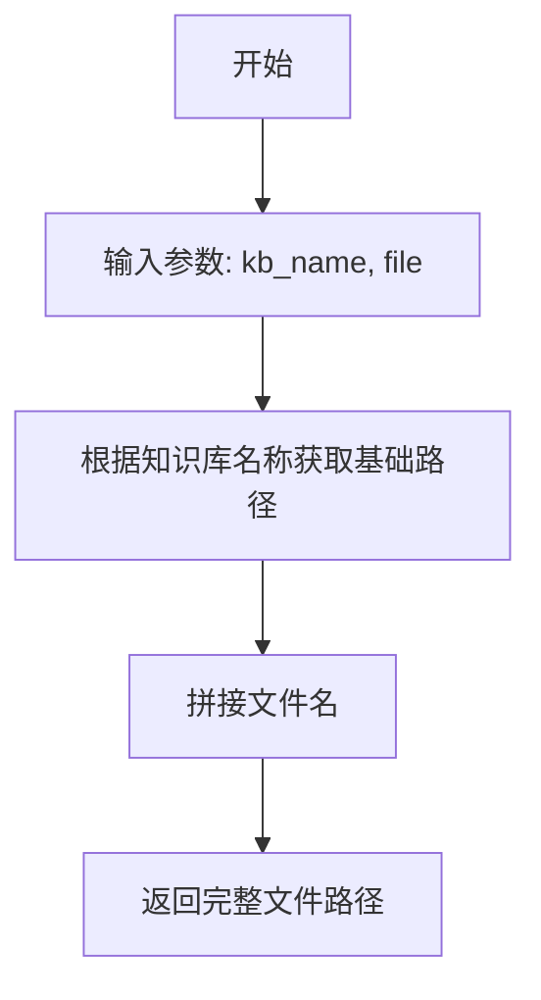

#### 带注释源码

```python
# 注意：该函数定义在 chatchat.server.knowledge_base.utils 模块中
# 当前代码文件仅导入了该函数，未包含其具体实现
# 以下为调用示例，展示了函数的使用方式

# 从 utils 模块导入 get_file_path 函数
from chatchat.server.knowledge_base.utils import get_file_path

# 在 prune_folder_files 函数中的调用示例
def prune_folder_files(kb_names: List[str]):
    """
    删除数据库中不存在但本地文件夹中有的文档文件
    用于释放本地磁盘空间
    """
    for kb_name in kb_names:
        kb = KBServiceFactory.get_service_by_name(kb_name)
        if kb is not None:
            files_in_db = kb.list_files()
            files_in_folder = list_files_from_folder(kb_name)
            files = list(set(files_in_folder) - set(files_in_db))
            for file in files:
                # 使用 get_file_path 获取完整文件路径
                # 参数1: kb_name - 知识库名称
                # 参数2: file - 文件名
                # 返回值: 本地文件系统中的完整路径
                os.remove(get_file_path(kb_name, file))
                print(f"success to delete file: {kb_name}/{file}")
```


### `KBServiceFactory.get_service`

根据代码分析，`KBServiceFactory.get_service` 是一个工厂方法，用于根据给定的知识库名称、向量存储类型和嵌入模型创建相应的知识库服务实例。该方法位于 `chatchat.server.knowledge_base.kb_service.base` 模块中，是 `KBServiceFactory` 类的静态方法。

参数：

- `kb_name`：`str`，知识库的名称，用于标识要创建或获取的知识库
- `vs_type`：`Literal["faiss", "milvus", "pg", "chromadb"]`，向量存储的类型，指定使用哪种向量数据库服务
- `embed_model`：`str`，嵌入模型的名称，用于文本向量化处理

返回值：`KBServiceBase`，返回创建或获取的知识库服务实例，该实例继承自 `KBServiceBase` 基类，包含了操作知识库的各种方法如 `exists()`、`create_kb()`、`add_doc()` 等

#### 流程图

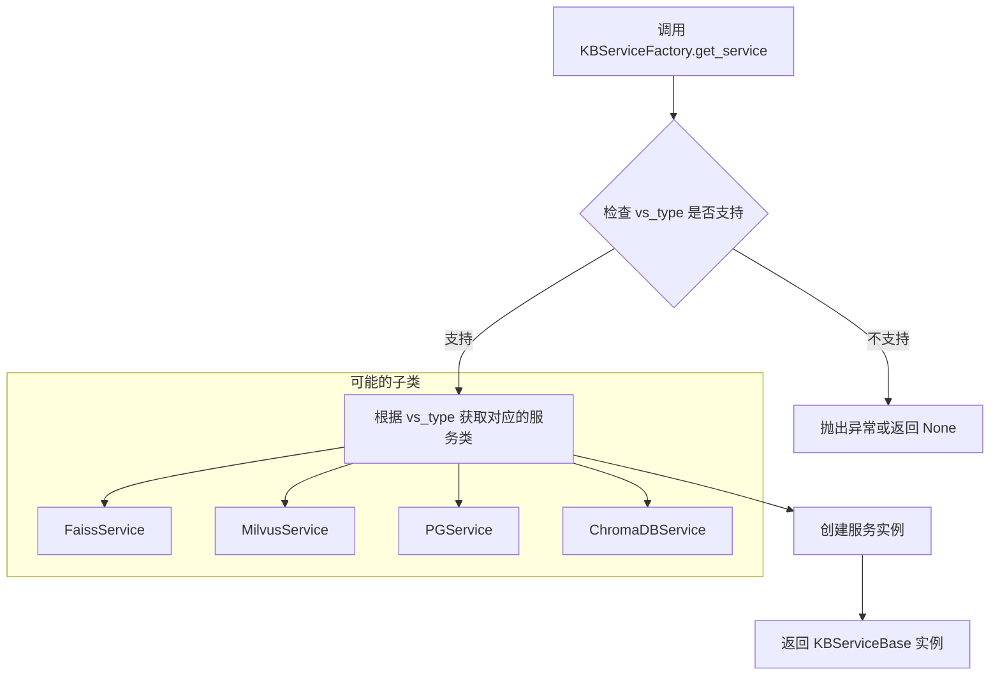

#### 带注释源码

```python
# 调用位置在 folder2db 函数中（第 147 行附近）
kb = KBServiceFactory.get_service(kb_name, vs_type, embed_model)

# 该方法在 chatchat.server.knowledge_base.kb_service.base 模块中定义
# 大致实现逻辑如下（基于代码调用推断）:

"""
@staticmethod
def get_service(
    kb_name: str,
    vs_type: Literal["faiss", "milvus", "pg", "chromadb"],
    embed_model: str
) -> KBServiceBase:
    '''
    工厂方法：根据参数创建对应的知识库服务实例
    
    参数:
        kb_name: 知识库名称
        vs_type: 向量存储类型
        embed_model: 嵌入模型名称
    
    返回:
        KBServiceBase: 知识库服务实例
    '''
    
    # 1. 根据 vs_type 获取对应的服务类
    service_class = cls._get_service_class(vs_type)
    
    # 2. 创建服务实例，传入知识库名称和嵌入模型
    kb_service = service_class(
        knowledge_base_name=kb_name,
        embed_model=embed_model
    )
    
    # 3. 返回服务实例供后续操作
    return kb_service
"""

# 使用示例
kb = KBServiceFactory.get_service("my_knowledge_base", "faiss", "text-embedding-3-small")
if not kb.exists():
    kb.create_kb()
```

#### 补充说明

该方法是知识库服务的工厂模式实现，代码中通过 `KBServiceFactory.get_service(kb_name, vs_type, embed_model)` 调用来获取指定类型的知识库服务实例。调用后可以进一步调用返回对象的方法，如 `exists()` 检查知识库是否存在，`create_kb()` 创建知识库，`add_doc()` 添加文档等。整个模块的设计体现了典型的工厂模式思想，将具体服务类的创建逻辑封装在工厂类中，调用者只需关心接口而不必了解具体实现细节。


### `KBServiceFactory.get_service_by_name`

根据代码分析，`KBServiceFactory.get_service_by_name` 是一个工厂方法，用于根据知识库名称获取对应的知识库服务实例。该方法被 `prune_db_docs` 和 `prune_folder_files` 函数调用，用于对知识库进行文档清理操作。

参数：

- `kb_name`：`str`，知识库的名称，用于标识要获取的知识库服务

返回值：`KBService`，返回知识库服务实例，如果不存在则返回 `None`

#### 流程图

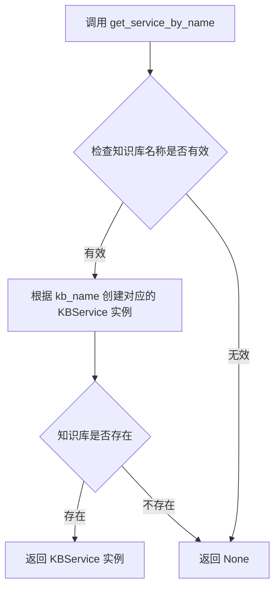

#### 带注释源码

```python
# 该方法定义位于 chatchat.server.knowledge_base.kb_service.base 模块中
# 以下为代码中的调用方式推断：

# 调用示例 1: prune_db_docs 函数
kb = KBServiceFactory.get_service_by_name(kb_name)  # 根据知识库名称获取服务实例
if kb is not None:  # 检查知识库是否存在
    files_in_db = kb.list_files()  # 获取数据库中的文件列表
    files_in_folder = list_files_from_folder(kb_name)  # 获取本地文件夹中的文件列表
    files = list(set(files_in_db) - set(files_in_folder))  # 计算差集，找出需删除的文档
    kb_files = file_to_kbfile(kb_name, files)  # 转换为 KnowledgeFile 对象列表
    for kb_file in kb_files:
        kb.delete_doc(kb_file, not_refresh_vs_cache=True)  # 删除文档
        print(f"success to delete docs for file: {kb_name}/{kb_file.filename}")
    kb.save_vector_store()  # 保存向量存储

# 调用示例 2: prune_folder_files 函数
kb = KBServiceFactory.get_service_by_name(kb_name)  # 根据知识库名称获取服务实例
if kb is not None:
    files_in_db = kb.list_files()  # 获取数据库中的文件列表
    files_in_folder = list_files_from_folder(kb_name)  # 获取本地文件夹中的文件列表
    files = list(set(files_in_folder) - set(files_in_db))  # 计算差集，找出需删除的文件
    for file in files:
        os.remove(get_file_path(kb_name, file))  # 删除本地文件
        print(f"success to delete file: {kb_name}/{file}")
```

## 关键组件


### 知识库文件迁移模块 (folder2db)

该模块是代码的核心功能组件，负责将本地文件夹中的文件批量导入到知识库和向量库。支持四种模式：完全重建向量库(recreate_vs)、基于数据库文件更新(update_in_db)、增量导入(increment)以及保留未实现。该模块集成了文件向量化、文档切分、知识库服务创建等完整流程。

### 向量化文档处理 (files2vs)

该组件是folder2db的内部函数，负责将知识库文件转换为向量并存储到向量库。使用files2docs_in_thread进行多线程文档切分，调用kb.add_doc将文档添加到知识库，并支持not_refresh_vs_cache参数实现惰性加载优化。

### 数据库备份导入 (import_from_db)

该组件实现从SQLite备份数据库恢复数据的功能。支持跨版本升级时无需重新向量化的场景，通过解析数据库表结构并将数据映射到当前模型。包含异常处理机制，确保导入失败时返回False并打印错误信息。

### 知识库服务工厂 (KBServiceFactory.get_service)

该组件是知识库服务的抽象工厂，根据知识库名称、向量库类型和嵌入模型动态创建对应的知识库服务。支持Faiss、Milvus、PostgreSQL、ChromaDB等多种向量库类型，实现了解耦和可扩展性。

### 知识库文件模型 (KnowledgeFile)

该组件表示知识库中的单个文件，包含文件名、知识库名称、切分后的文档(splited_docs)等属性。提供文件到知识库文件的转换功能(file_to_kbfile)，并支持异常捕获跳过损坏文件。

### 数据库文档清理 (prune_db_docs)

该组件实现知识库文档的同步清理功能。当用户通过文件浏览器删除本地文档后，调用该函数从数据库和向量库中同步删除对应的文档记录，保持数据库与文件系统的一致性。

### 本地文件清理 (prune_folder_files)

该组件实现本地文件夹的同步清理功能。当数据库中的文件记录被删除后，调用该函数从本地文件夹中删除对应的物理文件，释放磁盘空间。

### 会话管理 (session_scope)

该组件提供数据库会话的上下文管理器，确保会话在with语句结束后自动关闭。用于所有需要访问数据库的操作，保证数据库连接的正确释放和事务的回滚。

### 文件列表获取 (list_files_from_folder / list_kbs_from_folder)

该组件负责从本地文件夹获取知识库和文件列表。list_kbs_from_folder获取所有知识库目录，list_files_from_folder获取指定知识库中的所有文件，配合增量导入模式实现差异对比。


## 问题及建议


### 已知问题

- **日志使用不一致**：部分函数使用 `logger.error()`，部分使用 `print()`，如 `import_from_db()` 中异常处理和 `folder2db()` 中成功/失败消息输出，违反统一的日志规范
- **资源管理风险**：`import_from_db()` 中 sqlite3 连接 `con` 在异常情况下可能未正确关闭，应使用上下文管理器
- **异常处理过于宽泛**：`file_to_kbfile()` 和 `folder2db()` 中捕获所有 `Exception`，无法针对性处理不同错误类型，且吞掉了部分关键错误信息
- **批量操作缺失**：`import_from_db()` 逐行调用 `session.add()` 插入数据，未使用 SQLAlchemy 的 `bulk_insert_mappings()` 或 `add_all()` 批量操作，大数据量下性能低下
- **魔法字符串和硬编码**：`"recreate_vs"`、`"update_in_db"`、`"increment"` 等模式标识以字符串形式散落，应定义为枚举或常量类
- **函数参数过多**：`folder2db()` 包含9个参数，违反函数设计单一职责原则，可封装为配置对象或分拆为更细粒度的函数
- **重复计算逻辑**：`prune_db_docs()` 和 `prune_folder_files()` 中 `set(files_in_db) - set(files_in_folder)` 逻辑重复，可抽取为通用方法
- **类型注解不精确**：`files2vs()` 内部函数返回类型声明为 `List` 缺少泛型参数，`folder2db()` 的 `kb_files` 变量在 `recreate_vs` 分支外可能未定义就被使用（若 mode 不匹配）
- **导入语句冗余**：注释 `# ensure Models are imported` 表明导入仅为触发模型注册，导入方式不够优雅，可通过显式调用或配置机制解决
- **打印输出未国际化**：所有 `print()` 中文消息不利于国际化，且混合在业务逻辑中

### 优化建议

- **统一日志体系**：将所有 `print()` 替换为对应级别的 `logger` 调用，建议定义模块级 `logger = build_logger(__name__)`
- **资源安全释放**：使用 `with sql.connect(sqlite_path) as con:` 上下文管理器自动管理连接生命周期
- **精细化异常处理**：按异常类型分类捕获（如 `ValueError`、`IntegrityError`），区分可恢复与不可恢复错误，对关键异常进行重试或回退处理
- **批量数据操作**：使用 `session.add_all([model.class_(**data) for ...])` 或 `session.bulk_insert_mappings()` 批量写入，配合批量提交（每 N 条提交一次）提升导入性能
- **常量/枚举定义**：创建 `MigrationMode` 枚举类封装三种模式，定义 `VectorStoreType` 常量类，减少字符串硬编码和拼写错误风险
- **参数对象封装**：将 `folder2db()` 的多个相关参数（如 `chunk_size`、`chunk_overlap`、`zh_title_enhance`）封装为 `KnowledgeFileProcessConfig` 数据类
- **提取公共逻辑**：将文件集合差值计算抽取为 `_get_files_diff(kb, kb_name, mode)` 工具函数，消除 `prune_db_docs()` 和 `prune_folder_files()` 中的重复代码
- **完善类型注解**：补充 `List[Dict[str, Any]]` 等精确类型，为关键变量提供初始值或提前返回处理
- **模型注册机制优化**：在 `Base` 类中定义 `register_models()` 方法或通过装饰器方式集中注册模型，替代散落的导入语句
- **国际化与配置分离**：将用户可见的中文消息抽取至配置文件或 i18n 资源文件，print 输出改为 logger.info 以便统一控制日志级别和输出目标
- **添加重试机制**：对 `files2docs_in_thread()` 和向量库写入操作添加重试装饰器，应对临时性网络或 IO 故障
- **进度回调支持**：为 `folder2db()` 添加 `progress_callback` 参数，支持外部进度条或事件监听，提升长时运行任务的交互性


## 其它


### 设计目标与约束

本模块主要目标是实现知识库文件与向量库的同步管理，支持从本地文件夹批量导入文件到知识库，以及数据库与文件系统之间的数据一致性维护。约束条件包括：仅支持SQLite数据库备份导入；向量库类型支持faiss、milvus、pg、chromadb；需要确保导入字段名与数据库表字段名一致。

### 错误处理与异常设计

代码中主要通过try-except捕获异常并返回布尔值标识成功与否。import_from_db函数捕获sqlite3连接异常和数据库操作异常；file_to_kbfile函数捕获KnowledgeFile初始化异常并记录日志；folder2db函数的files2vs内部函数通过success标识处理结果。建议补充：统一的错误码定义、详细的错误日志记录、异常向上传递机制以供调用方处理。

### 数据流与状态机

数据流主要分为三条路径：1) 备份数据库导入流程：sqlite_path → 连接查询 → 数据映射 → session.add → 提交；2) 文件夹导入流程：kb_names获取 → KBService创建 → 文件扫描 → 向量化 → 数据库/向量库存储；3) 清理流程：数据库文件列表与本地文件列表对比 → 差集计算 → 删除操作。状态机涉及知识库的存在性检查、向量库类型切换、增量/全量模式切换。

### 外部依赖与接口契约

核心依赖包括：sqlite3（数据库连接）、dateutil.parser（时间解析）、chatchat.settings（配置管理）、chatchat.server.db（数据库ORM）、chatchat.server.knowledge_base（知识库服务）。KBServiceFactory.get_service方法接收kb_name、vs_type、embed_model参数，返回知识库服务实例；files2docs_in_thread函数接收文件列表和向量化参数，返回生成器结果。

### 性能考虑

当前实现中文件处理为串行向量化，可考虑使用线程池并发处理；files2docs_in_thread已支持线程但folder2db外层循环为串行；大知识库批量操作建议分批处理并提供进度回调；向量库保存操作(save_vector_store)频率较高，可考虑增量保存策略。

### 安全性考虑

sqlite_path参数未做路径合法性校验，存在路径遍历风险；文件删除操作(os.remove)未做二次确认；数据库连接未设置超时参数；敏感操作建议增加权限校验和操作日志审计。

### 兼容性设计

数据库表结构依赖Base.metadata.mappers动态获取，要求模型定义完整；时间解析依赖dateutil.parse对多种格式的兼容；向量模型需与已有知识库模型兼容；版本升级时需确保字段映射一致性。

### 配置管理

向量化相关配置通过Settings.kb_settings获取，包括DEFAULT_VS_TYPE、CHUNK_SIZE、OVERLAP_SIZE、ZH_TITLE_ENHANCE；embed_model通过get_default_embedding()获取；配置变更需考虑向后兼容性。

### 测试策略

建议覆盖场景：正常导入流程、增量导入、文件删除同步、向量化失败处理、数据库连接异常、磁盘空间不足、并发导入场景。

    