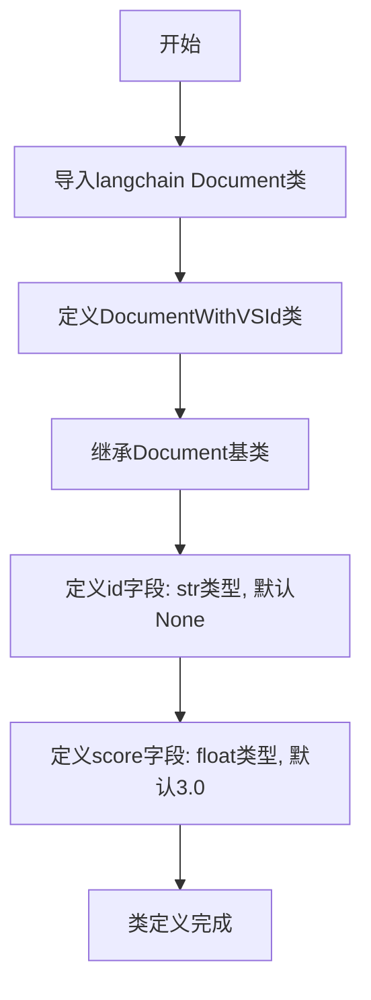

# `Langchain-Chatchat\libs\chatchat-server\chatchat\server\knowledge_base\model\kb_document_model.py` 详细设计文档

该代码定义了一个继承自langchain Document的矢量化文档类DocumentWithVSId，用于在RAG（检索增强生成）系统中表示经过向量化处理的文档，添加了id字段用于追踪文档在向量数据库中的标识，添加了score字段用于存储相似度评分。

## 整体流程



## 类结构

```
Document (langchain基类)
└── DocumentWithVSId (自定义子类)
```

## 全局变量及字段


### `DocumentWithVSId.id`
    
文档的唯一标识符，用于标识矢量化后的文档

类型：`str`
    


### `DocumentWithVSId.score`
    
文档的相似度分数，默认值为3.0

类型：`float`
    
    

## 全局函数及方法


## 关键组件


### DocumentWithVSId 类

继承自 langchain 的 Document 类，用于表示矢量化后的文档对象，包含文档 ID 和相似度分数字段。

### id 字段

字符串类型，表示文档向量化后的唯一标识符，用于追踪和关联原始文档与其向量表示。

### score 字段

浮点类型，默认值为 3.0，表示文档与查询的相似度分数，数值越高表示相关性越强。


## 问题及建议


### 已知问题

-   **类型注解不规范**：`id: str = None` 使用 `str = None` 不符合类型注解最佳实践，当 `id` 可能为 `None` 时应使用 `Optional[str] = None` 或 `str | None = None`
-   **默认值语义不明确**：`score: float = 3.0` 默认值设为 3.0，但向量相似度分数通常在 0-1 或 0-100 范围内，3.0 作为默认值语义不清晰且不符合常规
-   **字段缺少文档说明**：类的文档字符串仅说明用途，但未对 `id` 和 `score` 字段的含义、用途和约束进行说明
-   **缺乏数据验证**：没有对字段值进行校验，如 `id` 不应为空字符串、`score` 应在合理范围内
-   **继承冲突风险**：需确认父类 `Document` 是否已存在 `id` 或 `score` 属性，可能导致属性覆盖或冲突
-   **缺少 Pydantic 特性**：如需更严格的类型验证和序列化，建议使用 Pydantic 模型替代普通类

### 优化建议

-   修改类型注解为 `id: Optional[str] = None` 或 `id: str | None = None`，并导入 `Optional`（如使用 Python 3.9 及以下）
-   根据实际向量数据库的分数范围重新定义 `score` 的默认值（如 0.0 或 1.0），或移除默认值要求调用者显式提供
-   为每个字段添加文档字符串说明其含义、取值范围和业务逻辑
-   考虑添加 `@validator` 或使用 Pydantic 的 `BaseModel` 来自动进行数据验证
-   在类中添加 `__init__` 方法的注释或重写，清晰说明初始化逻辑
-   检查父类 `Document` 的接口，确保字段不产生冲突，必要时使用组合而非继承


## 其它


### 设计目标与约束

**设计目标**：为LangChain的Document类扩展向量搜索所需的ID和相关性评分字段，支持向量化文档的存储和检索场景。

**设计约束**：
- 需保持与父类Document的兼容性
- id字段允许为None，支持可选的文档标识
- score字段默认值3.0，需根据实际向量检索引擎的评分范围调整

### 错误处理与异常设计

- 当前类未实现显式的错误处理机制
- id字段为None时可能导致下游向量检索系统处理异常
- score字段未做边界校验（负值或超出引擎评分范围）
- 建议添加属性验证装饰器或__post_init__方法进行类型和值校验

### 数据流与状态机

- 数据流向：外部系统 → DocumentWithVSId实例化 → 向量检索引擎 → 返回检索结果
- 状态转换：创建（id=None, score=3.0）→ 赋值（设置id和score）→ 序列化/传输
- 无复杂状态机设计，属于简单的数据模型类

### 外部依赖与接口契约

- 依赖：`langchain.docstore.document.Document`（LangChain基础文档类）
- 接口契约：
  - 继承Document所有属性和方法
  - 新增id属性（str类型，可为None）
  - 新增score属性（float类型，默认3.0）
- 外部系统调用方式：实例化后设置id和score，或通过字典构造

### 序列化与反序列化支持

- 当前未实现to_dict/from_dict等序列化方法
- 建议添加Pydantic模型的dict()和parse_obj()支持，确保与LangChain生态系统兼容

### 使用示例与调用模式

```python
# 基本实例化
doc = DocumentWithVSId(page_content="文档内容", metadata={"source": "file"})
doc.id = "unique_vector_id"
doc.score = 0.95

# 批量向量化场景
vector_docs = [
    DocumentWithVSId(page_content=text, id=f"vec_{i}", score=0.0) 
    for i, text in enumerate(texts)
]
```

### 兼容性考虑

- LangChain版本兼容性：需确认与当前使用的LangChain版本兼容
- 后续升级路径：随着LangChain Document类演进，需同步更新继承关系

    