# `Langchain-Chatchat\libs\chatchat-server\chatchat\server\knowledge_base\utils.py` 详细设计文档

该模块是Chatchat知识库文件处理核心模块，负责管理知识库目录结构、加载多种格式的文档（PDF/Word/Markdown/JSON等）、将文档分割成文本块以支持向量检索，并提供多线程批量处理文件的能力。

## 整体流程

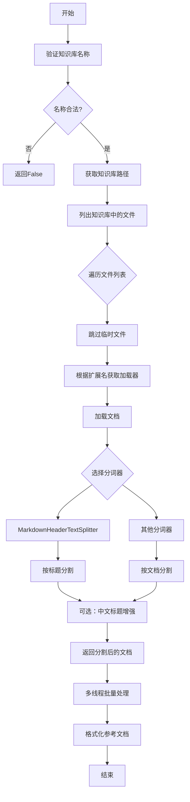

## 类结构

```
Global Functions
├── validate_kb_name
├── get_kb_path
├── get_doc_path
├── get_vs_path
├── get_file_path
├── list_kbs_from_folder
├── list_files_from_folder
├── get_LoaderClass
├── get_loader
├── make_text_splitter
├── files2docs_in_thread_file2docs
├── files2docs_in_thread
└── format_reference
Classes
├── JSONLinesLoader (继承JSONLoader)
└── KnowledgeFile
```

## 全局变量及字段


### `LOADER_DICT`
    
文档加载器类名与支持的文件扩展名映射字典

类型：`Dict[str, List[str]]`
    


### `SUPPORTED_EXTS`
    
所有支持的文档文件扩展名列表

类型：`List[str]`
    


### `logger`
    
用于记录代码运行日志的Logger实例

类型：`logging.Logger`
    


### `_origin_json_dumps`
    
原始json.dumps函数引用，用于备份

类型：`Callable`
    


### `_new_json_dumps`
    
patch后的json.dumps函数，禁用ensure_ascii

类型：`Callable`
    


### `KnowledgeFile.kb_name`
    
知识库名称

类型：`str`
    


### `KnowledgeFile.filename`
    
文件名（POSIX格式）

类型：`str`
    


### `KnowledgeFile.ext`
    
文件扩展名

类型：`str`
    


### `KnowledgeFile.loader_kwargs`
    
文档加载器额外参数

类型：`Dict`
    


### `KnowledgeFile.filepath`
    
文件完整路径

类型：`str`
    


### `KnowledgeFile.docs`
    
加载的原始文档列表

类型：`List[Document]`
    


### `KnowledgeFile.splited_docs`
    
分割后的文档列表

类型：`List[Document]`
    


### `KnowledgeFile.document_loader_name`
    
文档加载器类名

类型：`str`
    


### `KnowledgeFile.text_splitter_name`
    
文本分割器名称

类型：`str`
    
    

## 全局函数及方法


### `validate_kb_name`

验证知识库名称的安全性，通过检查是否包含路径遍历攻击的关键字符（`../`）来防止目录穿越漏洞。

参数：

- `knowledge_base_id`：`str`，待验证的知识库ID或名称

返回值：`bool`，如果名称安全（不包含路径遍历攻击字符）返回 `True`，否则返回 `False`

#### 流程图

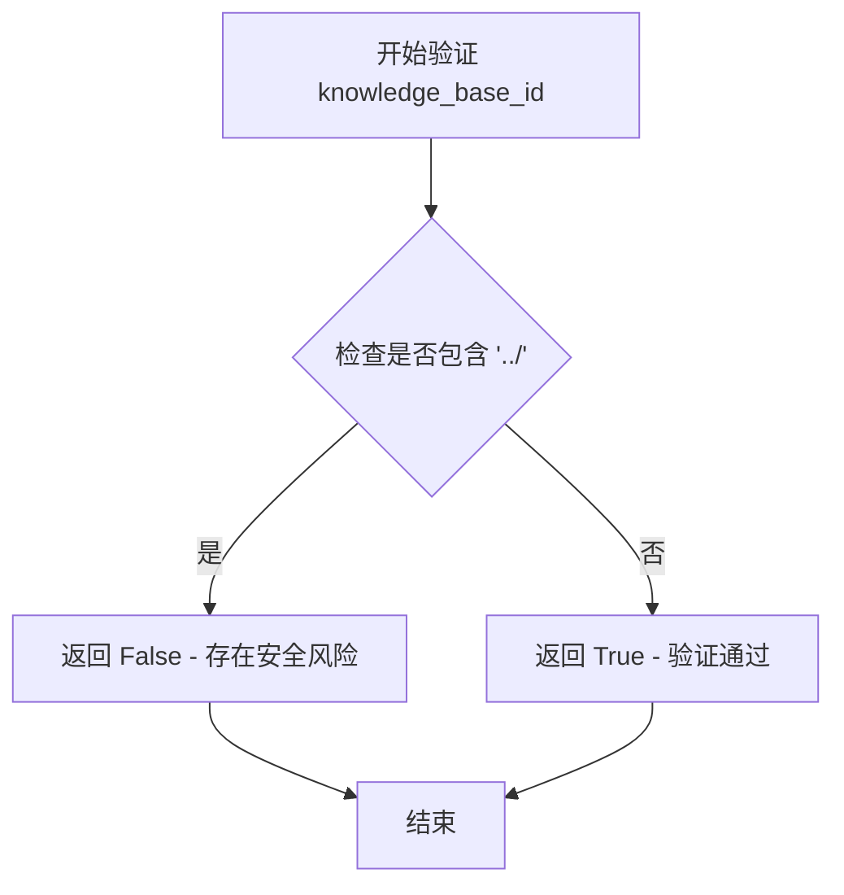

#### 带注释源码

```python
def validate_kb_name(knowledge_base_id: str) -> bool:
    """
    验证知识库名称的安全性
    
    该函数用于防止路径遍历攻击（Path Traversal Attack），
    通过检测知识库名称中是否包含 '../' 这样的路径遍历序列
    来确保用户无法通过构造特殊的知识库名称访问预期外的目录。
    
    参数:
        knowledge_base_id: str - 待验证的知识库ID或名称
        
    返回:
        bool - 名称安全返回True, 存在安全风险返回False
    """
    # 检查是否包含预期外的字符或路径攻击关键字
    # "../" 是典型的路径遍历攻击字符串，可用于跳出当前目录
    if "../" in knowledge_base_id:
        return False
    # 未检测到路径攻击关键字，验证通过
    return True
```

---

#### 技术债务与优化建议

1. **验证逻辑过于简单**：当前仅检查 `../` 字符串，建议扩展检查以下模式：
   - `..\`（Windows风格路径遍历）
   - 绝对路径（如 `/etc/`, `C:\`）
   - URL编码的路径遍历（`%2e%2e%2f`）
   - 其他路径攻击关键字（如 `~`, `$`）

2. **缺少长度限制**：未对 `knowledge_base_id` 长度进行限制，可能导致缓冲区溢出或存储问题

3. **黑名单而非白名单**：当前采用黑名单方式验证，建议改用白名单方式（只允许特定字符）以提供更严格的安全性

4. **缺乏日志记录**：安全验证失败时未记录日志，建议添加审计日志以便追踪潜在攻击行为


### `get_kb_path`

获取知识库根目录路径，根据传入的知识库名称拼接完整路径。

参数：

- `knowledge_base_name`：`str`，知识库的名称，用于拼接在根目录后的子目录名

返回值：`str`，返回完整的知识库目录路径

#### 流程图

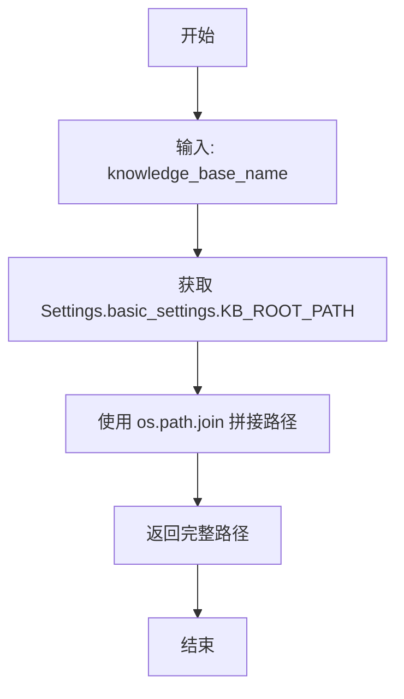

#### 带注释源码

```python
def get_kb_path(knowledge_base_name: str):
    """
    获取指定知识库的根目录路径
    
    Args:
        knowledge_base_name: 知识库名称，用于构建子目录路径
        
    Returns:
        完整的知识库目录绝对路径字符串
    """
    # 从设置中获取知识库的根目录路径，然后与知识库名称拼接
    return os.path.join(Settings.basic_settings.KB_ROOT_PATH, knowledge_base_name)
```


### `get_doc_path`

该函数用于获取指定知识库的文档目录路径。它通过调用 `get_kb_path` 获取知识库的根目录，然后与 "content" 子目录拼接，形成完整的文档存储路径。

参数：

- `knowledge_base_name`：`str`，知识库的名称，用于定位具体的知识库目录

返回值：`str`，返回知识库中文档目录的完整文件系统路径

#### 流程图

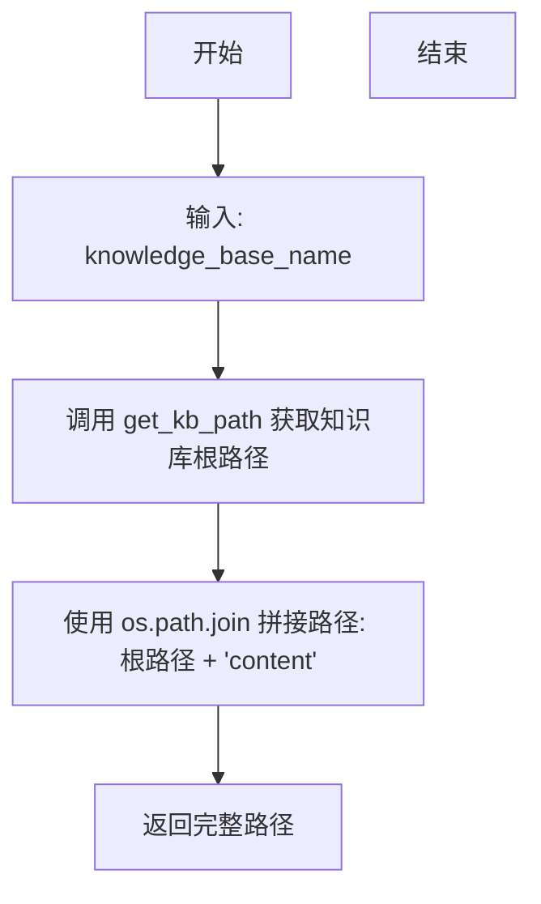

#### 带注释源码

```python
def get_doc_path(knowledge_base_name: str):
    """
    获取知识库文档目录的完整路径。
    
    参数:
        knowledge_base_name: str, 知识库的名称
        
    返回:
        str, 知识库中 content 目录的完整路径
    """
    # 调用 get_kb_path 获取知识库的根目录路径
    # 然后与 'content' 子目录名称拼接，形成文档存储目录
    return os.path.join(get_kb_path(knowledge_base_name), "content")
```


### `get_vs_path`

该函数用于计算并返回指定知识库（Knowledge Base）下某个向量存储（Vector Store）的完整磁盘路径。它首先调用 `get_kb_path` 获取知识库的根目录，随后在该目录下拼接 `vector_store` 子目录以及传入的向量名称，从而定位向量库文件的物理存储位置。

参数：

-  `knowledge_base_name`：`str`，目标知识库的名称，用于确定父目录。
-  `vector_name`：`str`，向量存储的名称或索引标识，用于确定最终的文件夹名称。

返回值：`str`，返回拼接完成的文件系统路径字符串（例如 `KB_ROOT_PATH/knowledge_base_name/vector_store/vector_name`）。

#### 流程图

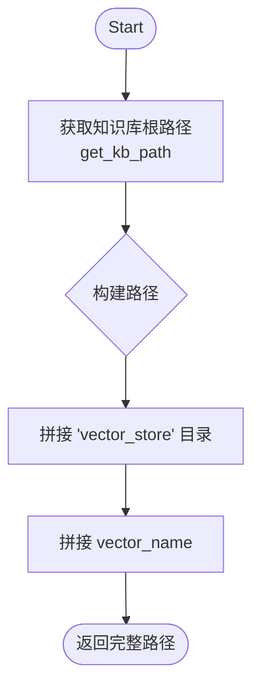

#### 带注释源码

```python
def get_vs_path(knowledge_base_name: str, vector_name: str):
    """
    获取向量存储目录路径
    
    该函数帮助定位特定知识库下的向量数据库文件存放位置。
    路径结构为: {KB根目录}/{知识库名}/vector_store/{向量名}
    
    Args:
        knowledge_base_name (str): 知识库的名称。
        vector_name (str): 向量存储的名称（如 'faiss', 'milvus' 等）。
        
    Returns:
        str: 指向向量存储目录的绝对路径或相对路径字符串。
    """
    # 步骤1: 调用 get_kb_path 获取知识库的根目录
    # 例如: Settings.basic_settings.KB_ROOT_PATH/knowledge_base_name
    kb_root = get_kb_path(knowledge_base_name)
    
    # 步骤2: 使用 os.path.join 拼接子目录和向量名称
    # 完整路径示例: .../content/vector_store/vector_name
    return os.path.join(kb_root, "vector_store", vector_name)
```


### `get_file_path`

获取知识库中指定文档的完整路径，并对路径进行安全检查以防止路径遍历攻击（Path Traversal Attack）。

参数：

- `knowledge_base_name`：`str`，知识库的名称
- `doc_name`：`str`，文档的名称

返回值：`str` 或 `None`，返回文档的完整路径字符串，如果路径不在知识库文档目录内（存在路径遍历风险）则返回 `None`

#### 流程图

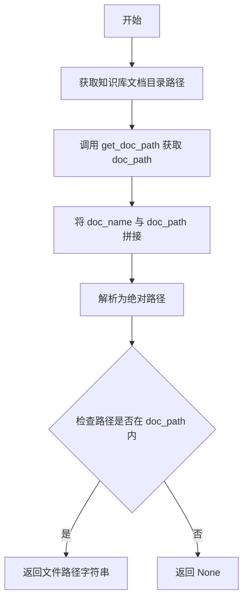

#### 带注释源码

```python
def get_file_path(knowledge_base_name: str, doc_name: str):
    """
    获取知识库中指定文档的完整路径，并进行安全检查
    
    参数:
        knowledge_base_name: 知识库名称
        doc_name: 文档名称
    
    返回:
        文档完整路径字符串，如果路径存在安全风险则返回 None
    """
    # 第一步：获取知识库对应的文档目录路径（content 目录）
    doc_path = Path(get_doc_path(knowledge_base_name)).resolve()
    
    # 第二步：将目录路径与文档名称拼接，形成候选文件路径
    file_path = (doc_path / doc_name).resolve()
    
    # 第三步：安全检查 - 确保最终路径在知识库文档目录内
    # 防止 ../ 等路径遍历攻击，避免访问超出知识库目录的文件
    if str(file_path).startswith(str(doc_path)):
        # 检查通过，返回绝对路径字符串
        return str(file_path)
    
    # 检查不通过，返回 None（隐式返回）
```


### `list_kbs_from_folder`

该函数用于从知识库根目录中列出所有知识库文件夹，返回知识库的名称列表。

参数： 无

返回值：`List[str]`，返回知识库名称列表，包含知识库根目录下所有子目录（知识库）的名称。

#### 流程图

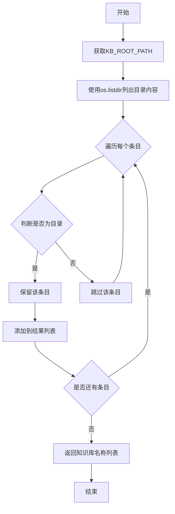

#### 带注释源码

```python
def list_kbs_from_folder():
    """
    从知识库根目录列出所有知识库文件夹。
    
    该函数通过以下步骤获取知识库列表：
    1. 从设置中获取知识库根目录路径
    2. 使用 os.listdir 列出根目录下所有文件和文件夹
    3. 使用 os.path.isdir 过滤掉非目录项（即只保留知识库文件夹）
    4. 返回知识库名称列表
    
    Returns:
        List[str]: 知识库名称列表，每个元素是知识库根目录下的子目录名称
    """
    return [
        f
        for f in os.listdir(Settings.basic_settings.KB_ROOT_PATH)
        if os.path.isdir(os.path.join(Settings.basic_settings.KB_ROOT_PATH, f))
    ]
```


### `list_files_from_folder`

该函数用于列出指定知识库中的所有文件，支持递归遍历目录、自动跳过临时文件和隐藏文件，并将路径统一转换为 POSIX 格式返回。

参数：

- `kb_name`：`str`，知识库的名称，用于定位知识库对应的文档目录

返回值：`List[str]`，返回知识库文档目录下的所有文件路径列表（POSIX 格式），包含子目录中的文件，不包含被跳过的临时/隐藏文件。

#### 流程图

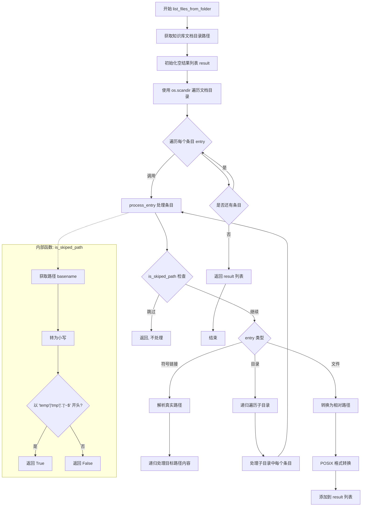

#### 带注释源码

```python
def list_files_from_folder(kb_name: str):
    """
    列出知识库中的所有文件
    
    参数:
        kb_name: 知识库名称
    
    返回:
        文件路径列表（POSIX格式）
    """
    # 获取知识库的文档目录路径
    doc_path = get_doc_path(kb_name)
    # 初始化结果列表
    result = []

    def is_skiped_path(path: str):
        """
        判断路径是否为需要跳过的临时/隐藏文件
        """
        # 获取路径的basename（文件名或最后一级目录名）并转为小写
        tail = os.path.basename(path).lower()
        # 遍历需要跳过的前缀列表
        for x in ["temp", "tmp", ".", "~$"]:
            # 如果文件名以指定前缀开头，返回True（跳过）
            if tail.startswith(x):
                return True
        return False

    def process_entry(entry):
        """
        递归处理目录条目
        
        参数:
            entry: os.DirEntry 对象，代表一个文件或目录条目
        """
        # 如果路径需要跳过，则直接返回
        if is_skiped_path(entry.path):
            return

        # 判断条目类型并分别处理
        if entry.is_symlink():
            # 处理符号链接：解析真实路径并递归处理
            target_path = os.path.realpath(entry.path)
            with os.scandir(target_path) as target_it:
                for target_entry in target_it:
                    process_entry(target_entry)
        elif entry.is_file():
            # 处理文件：计算相对路径并转换为POSIX格式
            file_path = Path(
                os.path.relpath(entry.path, doc_path)
            ).as_posix()  # 路径统一为 posix 格式
            result.append(file_path)
        elif entry.is_dir():
            # 处理目录：递归遍历子目录
            with os.scandir(entry.path) as it:
                for sub_entry in it:
                    process_entry(sub_entry)

    # 使用 os.scandir 高效遍历文档目录
    with os.scandir(doc_path) as it:
        for entry in it:
            process_entry(entry)

    # 返回结果列表
    return result
```


### `get_LoaderClass`

根据输入的文件扩展名，在预定义的 `LOADER_DICT` 映射表中查找并返回对应的文档加载器类名。如果未找到匹配的扩展名，则返回 `None`。

参数：

- `file_extension`：`str`，文件扩展名（例如 ".pdf", ".docx", ".txt" 等）

返回值：`Optional[str]`，返回匹配的文档加载器类名字符串，如果未找到匹配则返回 `None`。

#### 流程图

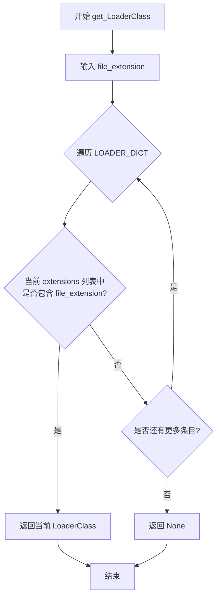

#### 带注释源码

```python
def get_LoaderClass(file_extension):
    """
    根据文件扩展名获取对应的文档加载器类名。
    
    该函数遍历预定义的 LOADER_DICT 字典，
    查找与给定文件扩展名匹配的加载器类。
    
    参数:
        file_extension: str, 文件扩展名，例如 ".pdf", ".docx", ".txt" 等
        
    返回:
        str 或 None: 匹配的加载器类名字符串，如果未找到匹配则返回 None
    """
    # 遍历 LOADER_DICT 字典中的每一项
    # LOADER_DICT 结构: {"LoaderClassName": [".ext1", ".ext2", ...], ...}
    for LoaderClass, extensions in LOADER_DICT.items():
        # 检查当前扩展名列表是否包含输入的文件扩展名
        if file_extension in extensions:
            # 找到匹配项，返回对应的加载器类名
            return LoaderClass
    
    # 遍历完成未找到匹配，返回 None（隐式返回）
    return None
```


### `get_loader`

根据 loader_name 和文件路径返回对应格式的文档加载器实例，支持自动降级处理和常见文件类型的默认参数配置。

参数：

- `loader_name`：`str`，文档加载器的名称，对应 LOADER_DICT 中定义的加载器类名
- `file_path`：`str`，待加载文件的磁盘路径
- `loader_kwargs`：`Dict`，可选，传递给文档加载器的额外关键字参数

返回值：`DocumentLoader`，返回 langchain 文档加载器实例，可用于将文件内容加载为 Document 对象

#### 流程图

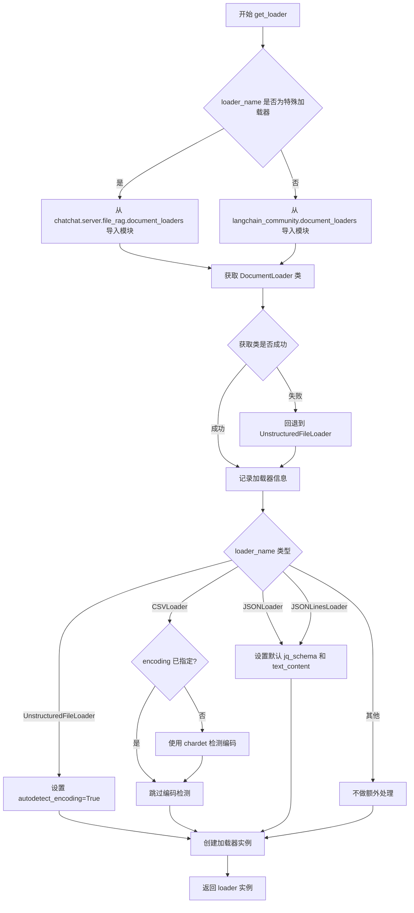

#### 带注释源码

```python
def get_loader(loader_name: str, file_path: str, loader_kwargs: Dict = None):
    """
    根据loader_name和文件路径或内容返回文档加载器。
    """
    # 初始化 loader_kwargs，避免传递 None
    loader_kwargs = loader_kwargs or {}
    try:
        # 根据 loader_name 判断加载器来源
        # 部分自定义加载器（如 OCR 相关）位于项目内部模块
        if loader_name in [
            "RapidOCRPDFLoader",
            "RapidOCRLoader",
            "FilteredCSVLoader",
            "RapidOCRDocLoader",
            "RapidOCRPPTLoader",
        ]:
            document_loaders_module = importlib.import_module(
                "chatchat.server.file_rag.document_loaders"
            )
        else:
            # 标准加载器从 langchain_community 获取
            document_loaders_module = importlib.import_module(
                "langchain_community.document_loaders"
            )
        # 通过反射获取具体的加载器类
        DocumentLoader = getattr(document_loaders_module, loader_name)
    except Exception as e:
        # 加载器获取失败时记录错误并降级为通用加载器
        msg = f"为文件{file_path}查找加载器{loader_name}时出错：{e}"
        logger.error(f"{e.__class__.__name__}: {msg}")
        document_loaders_module = importlib.import_module(
            "langchain_community.document_loaders"
        )
        DocumentLoader = getattr(document_loaders_module, "UnstructuredFileLoader")

    # 针对不同加载器设置特定默认参数
    if loader_name == "UnstructuredFileLoader":
        # 自动检测文件编码，避免加载失败
        loader_kwargs.setdefault("autodetect_encoding", True)
    elif loader_name == "CSVLoader":
        # CSV 文件需特殊处理编码问题
        if not loader_kwargs.get("encoding"):
            # 如果未指定 encoding，自动识别文件编码类型，避免langchain loader 加载文件报编码错误
            with open(file_path, "rb") as struct_file:
                encode_detect = chardet.detect(struct_file.read())
            if encode_detect is None:
                encode_detect = {"encoding": "utf-8"}
            loader_kwargs["encoding"] = encode_detect["encoding"]

    elif loader_name == "JSONLoader":
        # 设置默认的 jq_schema 为根节点，text_content=False 返回字典格式
        loader_kwargs.setdefault("jq_schema", ".")
        loader_kwargs.setdefault("text_content", False)
    elif loader_name == "JSONLinesLoader":
        # JSONLines 格式同样设置默认参数
        loader_kwargs.setdefault("jq_schema", ".")
        loader_kwargs.setdefault("text_content", False)

    # 实例化加载器并返回
    loader = DocumentLoader(file_path, **loader_kwargs)
    return loader
```


### `make_text_splitter`

根据传入的分词器名称、块大小和重叠大小参数，返回对应的 LangChain 文本分割器实例。该函数支持多种分词器类型，包括 MarkdownHeaderTextSplitter、自定义分词器、tiktoken 编码器分词器、huggingface 分词器以及 Spacy 分词器，并使用 LRU 缓存优化重复调用性能。

参数：

- `splitter_name`：`str`，分词器名称，默认为 "SpacyTextSplitter"。可选值包括 "MarkdownHeaderTextSplitter"、自定义分词器名称或 LangChain 内置分词器名称。
- `chunk_size`：`int`，文本块的最大大小（字符数或 token 数，取决于分词器类型），用于控制分割后文本片段的长度。
- `chunk_overlap`：`int`，相邻文本块之间的重叠大小，用于保持上下文连续性，避免关键信息在边界处被截断。

返回值：`TextSplitter`，LangChain 的文本分割器对象，用于将文档或文本分割成较小的块。

#### 流程图

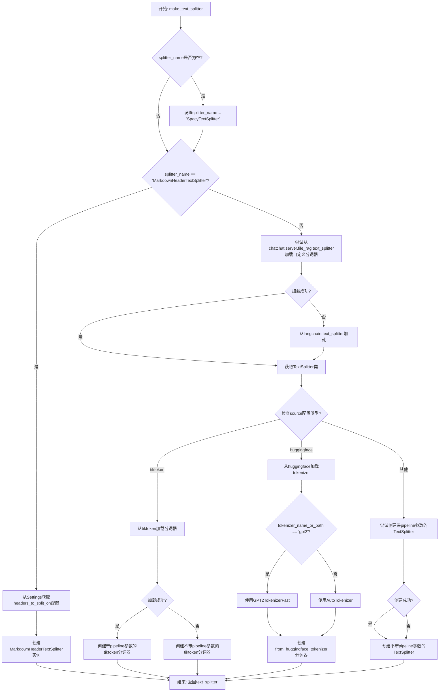

#### 带注释源码

```python
@lru_cache()
def make_text_splitter(splitter_name, chunk_size, chunk_overlap):
    """
    根据参数获取特定的分词器
    
    Args:
        splitter_name: 分词器名称，默认为"SpacyTextSplitter"
        chunk_size: 文本块大小
        chunk_overlap: 文本块重叠大小
    
    Returns:
        TextSplitter: LangChain文本分割器实例
    """
    # 如果未指定分词器名称，默认使用SpacyTextSplitter
    splitter_name = splitter_name or "SpacyTextSplitter"
    
    try:
        # MarkdownHeaderTextSplitter需要特殊处理
        if splitter_name == "MarkdownHeaderTextSplitter":
            # 从设置中获取Markdown标题分割配置
            headers_to_split_on = Settings.kb_settings.text_splitter_dict[splitter_name][
                "headers_to_split_on"
            ]
            # 创建Markdown标题感知分词器
            text_splitter = MarkdownHeaderTextSplitter(
                headers_to_split_on=headers_to_split_on, strip_headers=False
            )
        else:
            # 优先尝试从项目自定义模块加载分词器
            try:
                text_splitter_module = importlib.import_module("chatchat.server.file_rag.text_splitter")
                TextSplitter = getattr(text_splitter_module, splitter_name)
            except:
                # 自定义模块中未找到，则从LangChain官方模块加载
                text_splitter_module = importlib.import_module("langchain.text_splitter")
                TextSplitter = getattr(text_splitter_module, splitter_name)

            # 根据配置选择分词器来源：tiktoken编码器
            if Settings.kb_settings.text_splitter_dict[splitter_name]["source"] == "tiktoken":
                try:
                    # 尝试使用中文pipeline创建tiktoken分词器
                    text_splitter = TextSplitter.from_tiktoken_encoder(
                        encoding_name=Settings.kb_settings.text_splitter_dict[splitter_name][
                            "tokenizer_name_or_path"
                        ],
                        pipeline="zh_core_web_sm",  # 中文NLP pipeline
                        chunk_size=chunk_size,
                        chunk_overlap=chunk_overlap,
                    )
                except:
                    # 如果中文pipeline失败，回退到不带pipeline的版本
                    text_splitter = TextSplitter.from_tiktoken_encoder(
                        encoding_name=Settings.kb_settings.text_splitter_dict[splitter_name][
                            "tokenizer_name_or_path"
                        ],
                        chunk_size=chunk_size,
                        chunk_overlap=chunk_overlap,
                    )
            # 根据配置选择分词器来源：huggingface tokenizer
            elif Settings.kb_settings.text_splitter_dict[splitter_name]["source"] == "huggingface":
                # GPT2使用专用的Fast tokenizer
                if Settings.kb_settings.text_splitter_dict[splitter_name]["tokenizer_name_or_path"] == "gpt2":
                    from langchain.text_splitter import CharacterTextSplitter
                    from transformers import GPT2TokenizerFast
                    tokenizer = GPT2TokenizerFast.from_pretrained("gpt2")
                else:
                    # 其他模型使用AutoTokenizer自动加载
                    from transformers import AutoTokenizer
                    tokenizer = AutoTokenizer.from_pretrained(
                        Settings.kb_settings.text_splitter_dict[splitter_name]["tokenizer_name_or_path"],
                        trust_remote_code=True,
                    )
                # 从huggingface tokenizer创建分词器
                text_splitter = TextSplitter.from_huggingface_tokenizer(
                    tokenizer=tokenizer,
                    chunk_size=chunk_size,
                    chunk_overlap=chunk_overlap,
                )
            else:
                # 默认创建方式：尝试使用Spacy中文分词pipeline
                try:
                    text_splitter = TextSplitter(
                        pipeline="zh_core_web_sm",
                        chunk_size=chunk_size,
                        chunk_overlap=chunk_overlap,
                    )
                except:
                    # 如果失败，创建不带pipeline的通用分词器
                    text_splitter = TextSplitter(
                        chunk_size=chunk_size, chunk_overlap=chunk_overlap
                    )
    except Exception as e:
        # 任何异常都打印并回退到RecursiveCharacterTextSplitter
        print(e)
        text_splitter_module = importlib.import_module("langchain.text_splitter")
        TextSplitter = getattr(text_splitter_module, "RecursiveCharacterTextSplitter")
        text_splitter = TextSplitter(chunk_size=chunk_size, chunk_overlap=chunk_overlap)

    # 注释: SpacyTextSplitter可使用GPU加速（参考Issue #1287）
    # text_splitter._tokenizer.max_length = 37016792
    # text_splitter._tokenizer.prefer_gpu()
    
    return text_splitter
```


### `files2docs_in_thread_file2docs`

该函数是文件转文档的线程工作函数，接收一个 `KnowledgeFile` 对象，调用其 `file2text` 方法将文件内容转换为 LangChain 的 `Document` 列表，并以元组形式返回处理结果（包含状态标志、知识库名称、文件名及文档列表或错误信息）。

参数：

- `file`：`KnowledgeFile`，知识库文件对象，包含文件路径、知识库名称等元数据信息
- `**kwargs`：可变关键字参数，会透传给 `file.file2text()` 方法，用于控制文本分割行为（如 `chunk_size`、`chunk_overlap`、`zh_title_enhance` 等）

返回值：`Tuple[bool, Tuple[str, str, List[Document]]]`，第一个元素表示处理是否成功（`True` 表示成功，`False` 表示失败），第二个元素为元组，包含知识库名称 (`str`)、文件名 (`str`) 以及成功时的文档列表 (`List[Document]`) 或失败时的错误信息 (`str`)

#### 流程图

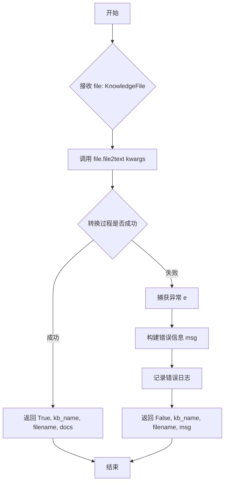

#### 带注释源码

```python
def files2docs_in_thread_file2docs(
    *, file: KnowledgeFile, **kwargs
) -> Tuple[bool, Tuple[str, str, List[Document]]]:
    """
    线程工作函数：将单个知识库文件转换为 Langchain Document 列表
    :param file: KnowledgeFile 实例，包含文件路径、知识库名称等元数据
    :param kwargs: 透传给 file.file2text() 的额外参数（chunk_size、chunk_overlap 等）
    :return: (status, (kb_name, filename, result))
             - status: True 表示成功，False 表示失败
             - result: 成功时为 Document 列表，失败时为错误信息字符串
    """
    try:
        # 调用 KnowledgeFile 的 file2text 方法执行文件到文本的转换
        # **kwargs 传递文本分割相关的参数
        return True, (file.kb_name, file.filename, file.file2text(**kwargs))
    except Exception as e:
        # 异常捕获：构建格式化的错误信息，包含知识库名和文件名
        msg = f"从文件 {file.kb_name}/{file.filename} 加载文档时出错：{e}"
        # 记录错误日志，包含异常类型名称和详细错误信息
        logger.error(f"{e.__class__.__name__}: {msg}")
        # 返回失败状态及错误信息，供调用方处理
        return False, (file.kb_name, file.filename, msg)
```


### `files2docs_in_thread`

利用多线程批量将磁盘文件转化成 langchain Document 对象，支持传入 KnowledgeFile 对象、元组或字典格式的文件信息，并通过生成器逐个返回处理结果。

参数：

- `files`：`List[Union[KnowledgeFile, Tuple[str, str], Dict]]`，待处理的文件列表，可以是 KnowledgeFile 对象、元组（filename, kb_name）或字典格式
- `chunk_size`：`int`，文本分块大小，默认为 Settings.kb_settings.CHUNK_SIZE
- `chunk_overlap`：`int`，文本分块重叠大小，默认为 Settings.kb_settings.OVERLAP_SIZE
- `zh_title_enhance`：`bool`，是否启用中文标题增强，默认为 Settings.kb_settings.ZH_TITLE_ENHANCE

返回值：`Generator`，生成器，返回值为 (status, (kb_name, file_name, docs | error))，status 表示处理是否成功

#### 流程图

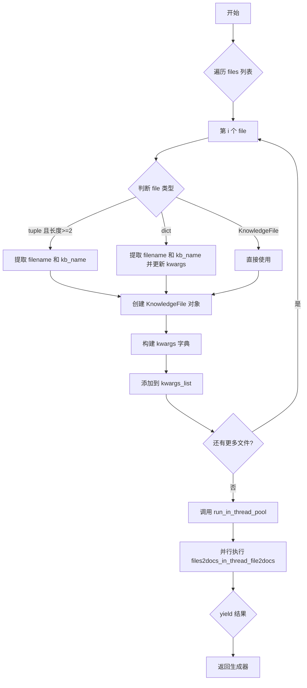

#### 带注释源码

```python
def files2docs_in_thread(
    files: List[Union[KnowledgeFile, Tuple[str, str], Dict]],  # 待处理的文件列表
    chunk_size: int = Settings.kb_settings.CHUNK_SIZE,        # 文本分块大小
    chunk_overlap: int = Settings.kb_settings.OVERLAP_SIZE,   # 文本分块重叠大小
    zh_title_enhance: bool = Settings.kb_settings.ZH_TITLE_ENHANCE,  # 是否启用中文标题增强
) -> Generator:
    """
    利用多线程批量将磁盘文件转化成langchain Document.
    如果传入参数是Tuple，形式为(filename, kb_name)
    生成器返回值为 status, (kb_name, file_name, docs | error)
    """

    kwargs_list = []  # 用于存储每个文件的处理参数
    for i, file in enumerate(files):  # 遍历所有传入的文件
        kwargs = {}
        try:
            if isinstance(file, tuple) and len(file) >= 2:
                # 如果是元组格式 (filename, kb_name)
                filename = file[0]
                kb_name = file[1]
                file = KnowledgeFile(filename=filename, knowledge_base_name=kb_name)
            elif isinstance(file, dict):
                # 如果是字典格式，从字典中提取 filename 和 kb_name
                filename = file.pop("filename")
                kb_name = file.pop("kb_name")
                kwargs.update(file)  # 将字典中剩余的参数添加到 kwargs
                file = KnowledgeFile(filename=filename, knowledge_base_name=kb_name)
            # 设置公共参数
            kwargs["file"] = file
            kwargs["chunk_size"] = chunk_size
            kwargs["chunk_overlap"] = chunk_overlap
            kwargs["zh_title_enhance"] = zh_title_enhance
            kwargs_list.append(kwargs)
        except Exception as e:
            # 如果处理过程中出现异常yield错误信息
            yield False, (kb_name, filename, str(e))

    # 使用线程池并行处理所有文件
    for result in run_in_thread_pool(
        func=files2docs_in_thread_file2docs, params=kwargs_list
    ):
        yield result  # 逐个yield处理结果
```


### `format_reference`

将知识库检索结果格式化为带链接出处的参考文档格式，方便在答案中展示引用来源。

参数：

-  `kb_name`：`str`，知识库名称，用于构建文件下载链接
-  `docs`：`List[Dict]`，知识库检索结果列表，每个元素包含 `metadata`（含 `source` 字段）和 `page_content`
-  `api_base_url`：`str`，可选，API 服务基础 URL，默认为空时会自动从配置获取

返回值：`List[Dict]`，返回格式化后的参考文档列表，每个元素为包含出处编号、文件名、下载链接和内容的字符串

#### 流程图

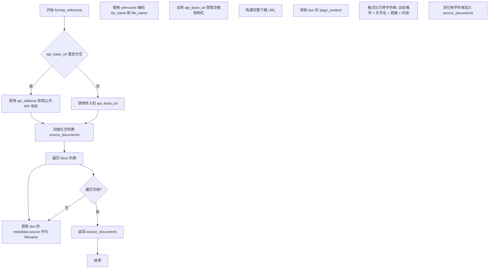

#### 带注释源码

```python
def format_reference(kb_name: str, docs: List[Dict], api_base_url: str="") -> List[Dict]:
    '''
    将知识库检索结果格式化为参考文档的格式
    '''
    # 动态导入，避免循环依赖
    from chatchat.server.utils import api_address
    
    # 如果未提供 api_base_url，则自动获取公共 API 地址
    api_base_url = api_base_url or api_address(is_public=True)

    # 初始化结果列表
    source_documents = []
    
    # 遍历每个检索结果文档
    for inum, doc in enumerate(docs):
        # 从文档元数据中提取原始文件名
        filename = doc.get("metadata", {}).get("source")
        
        # 构建下载链接的查询参数
        parameters = urlencode(
            {
                "knowledge_base_name": kb_name,
                "file_name": filename,
            }
        )
        
        # 清理 API 基础 URL，去除首尾空格和斜杠
        api_base_url = api_base_url.strip(" /")
        
        # 拼接完整的文件下载 URL
        url = (
            f"{api_base_url}/knowledge_base/download_doc?" + parameters
        )
        
        # 获取文档内容
        page_content = doc.get("page_content")
        
        # 格式化为带 Markdown 链接的引用字符串
        # 格式: 出处 [编号] [文件名](URL) \n\n内容\n\n
        ref = f"""出处 [{inum + 1}] [{filename}]({url}) \n\n{page_content}\n\n"""
        
        # 添加到结果列表
        source_documents.append(ref)
    
    # 返回格式化后的参考文档列表
    return source_documents
```


### `JSONLinesLoader.__init__`

该方法是 `JSONLinesLoader` 类的构造函数，继承自 `JSONLoader`，主要用于加载 JSON Lines（`.jsonl`）格式的文件。它通过将 `_json_lines` 属性设置为 `True` 来区分普通 JSON 文件和 JSON Lines 格式文件。

参数：

- `*args`：可变位置参数，用于接收传递给父类 `JSONLoader` 的位置参数。
- `**kwargs`：可变关键字参数，用于接收传递给父类 `JSONLoader` 的关键字参数。

返回值：`None`，因为 `__init__` 方法不返回值。

#### 流程图

```mermaid
flowchart TD
    A[开始 __init__] --> B[接收 *args 和 **kwargs]
    B --> C[调用父类 JSONLoader.__init__(*args, **kwargs)]
    C --> D[设置 self._json_lines = True]
    D --> E[结束]
```

#### 带注释源码

```python
class JSONLinesLoader(JSONLoader):
    def __init__(self, *args, **kwargs):
        """
        初始化 JSONLinesLoader 实例。
        
        该类继承自 JSONLoader，用于处理 JSON Lines 格式的文件。
        通过设置 _json_lines 标志来区分 JSON 和 JSON Lines 格式。
        
        参数:
            *args: 可变位置参数，传递给父类 JSONLoader
            **kwargs: 可变关键字参数，传递给父类 JSONLoader
        """
        # 调用父类 JSONLoader 的初始化方法
        super().__init__(*args, **kwargs)
        # 设置 _json_lines 标志为 True，表示当前处理的是 JSON Lines 格式
        self._json_lines = True
```


### `KnowledgeFile.__init__`

该方法是 `KnowledgeFile` 类的构造函数，用于初始化知识库中的文件对象。它接收文件名、知识库名称和加载器参数，验证文件格式是否支持，并初始化文件相关的各种属性（文件路径、文档加载器、文本分割器等）。

参数：

- `filename`：`str`，要加载的文件名，包含文件扩展名
- `knowledge_base_name`：`str`，知识库的名称，用于定位文件在知识库中的位置
- `loader_kwargs`：`Dict`，可选参数，用于传递给文档加载器的配置选项字典，默认为空字典

返回值：`None`，该方法为构造函数，不返回任何值

#### 流程图

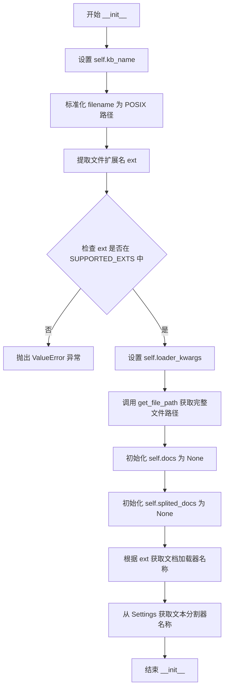

#### 带注释源码

```python
def __init__(
    self,
    filename: str,
    knowledge_base_name: str,
    loader_kwargs: Dict = {},
):
    """
    对应知识库目录中的文件，必须是磁盘上存在的才能进行向量化等操作。
    """
    # 将知识库名称存储到实例属性
    self.kb_name = knowledge_base_name
    
    # 将文件名转换为 POSIX 格式（统一使用正斜杠）并存储
    # Path(filename).as_posix() 确保路径在不同操作系统间保持一致
    self.filename = str(Path(filename).as_posix())
    
    # 提取文件扩展名并转换为小写
    # os.path.splitext 返回 (root, ext)，取最后一个元素 [-1]
    self.ext = os.path.splitext(filename)[-1].lower()
    
    # 检查文件扩展名是否在支持的文件格式列表中
    # SUPPORTED_EXTS 定义了所有可处理的文件类型
    if self.ext not in SUPPORTED_EXTS:
        raise ValueError(f"暂未支持的文件格式 {self.filename}")
    
    # 存储文档加载器的配置参数
    self.loader_kwargs = loader_kwargs
    
    # 调用 get_file_path 获取文件的完整磁盘路径
    # 该函数会验证路径安全性，防止路径遍历攻击
    self.filepath = get_file_path(knowledge_base_name, filename)
    
    # 初始化文档列表为 None，表示尚未加载文档
    # 延迟加载模式：仅在真正需要时再加载文档
    self.docs = None
    
    # 初始化分割后的文档列表为 None
    self.splited_docs = None
    
    # 根据文件扩展名获取对应的文档加载器类名
    # 例如：.pdf -> RapidOCRPDFLoader, .md -> TextLoader
    self.document_loader_name = get_LoaderClass(self.ext)
    
    # 从全局设置中获取文本分割器名称
    # 用于后续将文档分割成较小的块
    self.text_splitter_name = Settings.kb_settings.TEXT_SPLITTER_NAME
```


### `KnowledgeFile.file2docs`

该方法负责将磁盘上的文件加载为 LangChain 的 Document 对象，支持缓存机制以避免重复加载，并根据文件类型选择合适的文档加载器。

参数：

- `self`：KnowledgeFile 类实例，表示一个知识库文件对象
- `refresh`：`bool`，可选参数，默认值为 False。是否强制重新加载文档。当为 True 时，即使已有缓存的文档也会重新加载；当为 False 时，直接返回已缓存的文档（若存在）

返回值：`List[Document]`，返回从文件中加载的 Langchain Document 对象列表。如果文件不存在或加载失败，返回 None（当 refresh=False 且已有缓存时）或抛出异常

#### 流程图

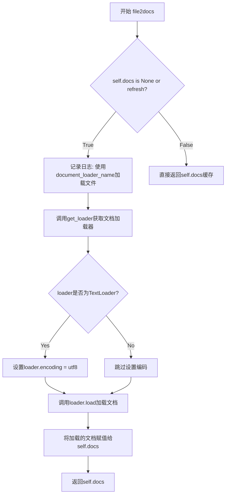

#### 带注释源码

```python
def file2docs(self, refresh: bool = False):
    """
    将文件加载为Langchain Document对象
    
    参数:
        refresh: bool, 是否强制重新加载文档。默认为False，表示使用缓存
    返回:
        List[Document]: 加载的文档列表
    """
    # 检查是否需要加载文档：首次加载或明确要求刷新
    if self.docs is None or refresh:
        # 记录使用的加载器类型和文件路径
        logger.info(f"{self.document_loader_name} used for {self.filepath}")
        
        # 根据文件扩展名和配置获取对应的文档加载器
        loader = get_loader(
            loader_name=self.document_loader_name,  # 加载器名称（如TextLoader、JSONLoader等）
            file_path=self.filepath,                # 文件的完整路径
            loader_kwargs=self.loader_kwargs,       # 加载器配置参数
        )
        
        # 针对TextLoader特殊处理：显式设置UTF-8编码避免乱码
        if isinstance(loader, TextLoader):
            loader.encoding = "utf8"
            self.docs = loader.load()
        else:
            # 其他类型的加载器直接加载
            self.docs = loader.load()
    
    # 返回加载的文档列表（可能是新加载的或缓存的）
    return self.docs
```


### `KnowledgeFile.docs2texts`

该方法将 LangChain 的 Document 对象列表通过文本分割器切分为更小的文本块，可选地应用中文标题增强功能，并返回切分后的文档列表。

参数：

- `self`：`KnowledgeFile` 类的实例本身
- `docs`：`List[Document]`，可选，待切分的文档列表。默认为 None，会自动调用 `file2docs()` 加载文档
- `zh_title_enhance`：`bool`，可选，是否启用中文标题增强功能。默认为 Settings.kb_settings.ZH_TITLE_ENHANCE
- `refresh`：`bool`，可选，是否强制重新加载文档。默认为 False
- `chunk_size`：`int`，可选，分块大小。默认为 Settings.kb_settings.CHUNK_SIZE
- `chunk_overlap`：`int`，可选，分块重叠大小。默认为 Settings.kb_settings.OVERLAP_SIZE
- `text_splitter`：`TextSplitter`，可选，自定义的文本分割器。默认为 None，会根据配置创建

返回值：`List[Document]`，切分后的文档列表

#### 流程图

```mermaid
flowchart TD
    A[开始 docs2texts] --> B{是否传入 docs?}
    B -->|是| C[使用传入的 docs]
    B -->|否| D[调用 self.file2docs refresh=refresh]
    C --> E{docs 是否为空?}
    D --> E
    E -->|是| F[返回空列表 []]
    E -->|否| G{文件扩展名是否为 .csv?}
    G -->|是| H[跳过文本分割]
    G -->|否| I{是否传入 text_splitter?}
    I -->|是| J[使用传入的分割器]
    I -->|否| K[调用 make_text_splitter 创建分割器]
    J --> L{分割器名称是否为 MarkdownHeaderTextSplitter?}
    K --> L
    L -->|是| M[使用 split_text 分割单个文档]
    L -->|否| N[使用 split_documents 分割文档列表]
    M --> O{分割后 docs 是否为空?}
    N --> O
    O -->|是| F
    O -->|否| P{是否启用 zh_title_enhance?}
    P -->|是| Q[调用 func_zh_title_enhance 增强标题]
    P -->|否| R[保存结果到 self.splited_docs]
    Q --> R
    R --> S[返回切分后的文档列表]
    H --> P
```

#### 带注释源码

```python
def docs2texts(
    self,
    docs: List[Document] = None,
    zh_title_enhance: bool = Settings.kb_settings.ZH_TITLE_ENHANCE,
    refresh: bool = False,
    chunk_size: int = Settings.kb_settings.CHUNK_SIZE,
    chunk_overlap: int = Settings.kb_settings.OVERLAP_SIZE,
    text_splitter: TextSplitter = None,
):
    """
    将文档列表通过文本分割器切分为更小的文本块
    
    参数:
        docs: 待切分的文档列表，默认为None时会自动加载文件
        zh_title_enhance: 是否启用中文标题增强
        refresh: 是否强制重新加载文档
        chunk_size: 分块大小
        chunk_overlap: 分块重叠大小
        text_splitter: 自定义文本分割器
    返回:
        切分后的文档列表
    """
    # 如果未传入docs，则从文件加载文档
    docs = docs or self.file2docs(refresh=refresh)
    
    # 空文档直接返回空列表
    if not docs:
        return []
    
    # CSV文件不进行文本分割（CSVLoader已处理分割）
    if self.ext not in [".csv"]:
        # 如果未提供分割器，则根据配置创建
        if text_splitter is None:
            text_splitter = make_text_splitter(
                splitter_name=self.text_splitter_name,
                chunk_size=chunk_size,
                chunk_overlap=chunk_overlap,
            )
        
        # MarkdownHeaderTextSplitter特殊处理：只分割第一个文档的content
        if self.text_splitter_name == "MarkdownHeaderTextSplitter":
            docs = text_splitter.split_text(docs[0].page_content)
        else:
            # 其他分割器处理整个文档列表
            docs = text_splitter.split_documents(docs)

    # 分割后仍为空则返回空列表
    if not docs:
        return []

    # 打印分割示例（调试用）
    print(f"文档切分示例：{docs[0]}")
    
    # 可选：应用中文标题增强
    if zh_title_enhance:
        docs = func_zh_title_enhance(docs)
    
    # 保存结果到实例变量
    self.splited_docs = docs
    return self.splited_docs
```


### `KnowledgeFile.file2text`

将知识库文件转换为文本（文档列表），支持文本分割、标题增强等预处理操作。

参数：

- `self`：`KnowledgeFile` 类的实例
- `zh_title_enhance`：`bool`，是否启用中文标题增强功能，默认为 `Settings.kb_settings.ZH_TITLE_ENHANCE`
- `refresh`：`bool`，是否强制刷新重新加载文档，默认为 `False`
- `chunk_size`：`int`，文本分块大小，默认为 `Settings.kb_settings.CHUNK_SIZE`
- `chunk_overlap`：`int`，文本分块重叠大小，默认为 `Settings.kb_settings.OVERLAP_SIZE`
- `text_splitter`：`TextSplitter`，自定义文本分割器，默认为 `None`

返回值：`List[Document]`，返回分割后的 Langchain Document 列表

#### 流程图

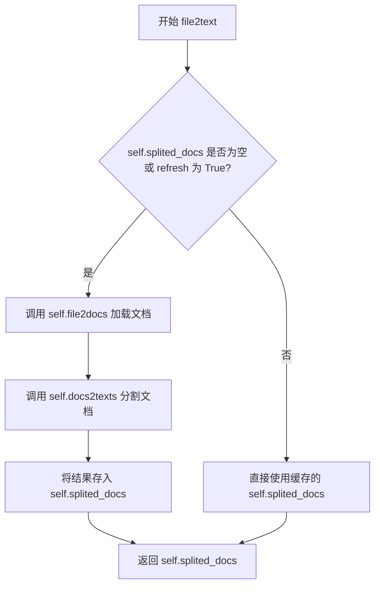

#### 带注释源码

```python
def file2text(
    self,
    zh_title_enhance: bool = Settings.kb_settings.ZH_TITLE_ENHANCE,
    refresh: bool = False,
    chunk_size: int = Settings.kb_settings.CHUNK_SIZE,
    chunk_overlap: int = Settings.kb_settings.OVERLAP_SIZE,
    text_splitter: TextSplitter = None,
):
    """
    将文件转换为文本（Document列表）
    
    参数:
        zh_title_enhance: 是否启用中文标题增强
        refresh: 是否强制刷新重新加载文档
        chunk_size: 文本分块大小
        chunk_overlap: 文本分块重叠大小
        text_splitter: 自定义文本分割器
    """
    # 检查是否需要重新加载和分割文档
    # 如果 splited_docs 为空，或者 refresh 为 True，则重新处理
    if self.splited_docs is None or refresh:
        # 步骤1: 使用 file2docs 方法加载原始文档
        docs = self.file2docs()
        
        # 步骤2: 使用 docs2texts 方法将文档分割为更小的块
        self.splited_docs = self.docs2texts(
            docs=docs,
            zh_title_enhance=zh_title_enhance,
            refresh=refresh,
            chunk_size=chunk_size,
            chunk_overlap=chunk_overlap,
            text_splitter=text_splitter,
        )
    
    # 返回分割后的文档列表
    return self.splited_docs
```


### `KnowledgeFile.file_exist`

检查知识库文件是否存在于磁盘上。

参数：

- `self`：KnowledgeFile 的实例方法隐式参数，表示当前 KnowledgeFile 对象

返回值：`bool`，返回文件是否存在。`True` 表示文件存在，False 表示文件不存在。

#### 流程图

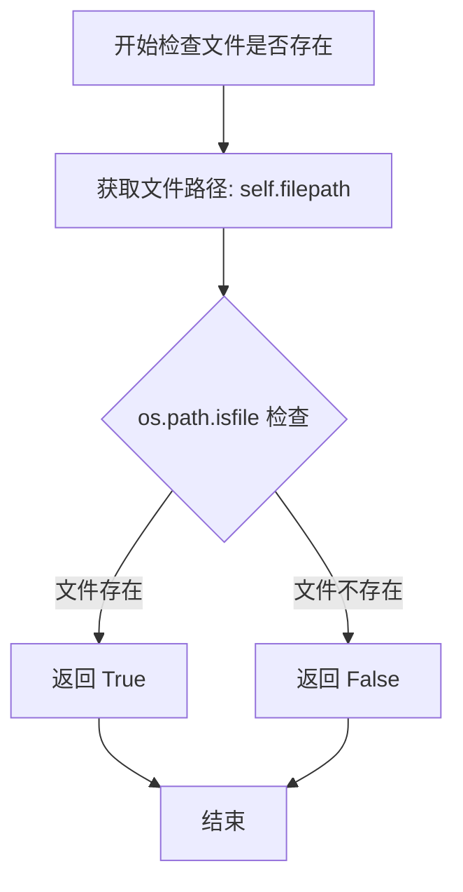

#### 带注释源码

```python
def file_exist(self):
    """
    检查知识库文件是否存在于磁盘上。
    
    该方法利用 os.path.isfile 函数检查当前 KnowledgeFile 对象
    所代表的文件是否真实存在于文件系统路径中。
    
    Returns:
        bool: 如果文件存在返回 True，否则返回 False
    """
    return os.path.isfile(self.filepath)
```


### `KnowledgeFile.get_mtime`

获取知识库文件的最后修改时间。

参数：

- `self`：`KnowledgeFile`，当前 KnowledgeFile 实例，表示需要获取修改时间的文件对象

返回值：`float`，返回文件的最后修改时间（Unix 时间戳），表示自 1970 年 1 月 1 日以来的秒数

#### 流程图

```mermaid
flowchart TD
    A[开始] --> B[获取 self.filepath]
    B --> C{文件是否存在?}
    C -->|是| D[调用 os.path.getmtime 获取修改时间]
    C -->|否| E[抛出异常或返回错误]
    D --> F[返回时间戳]
    E --> F
```

#### 带注释源码

```python
def get_mtime(self):
    """
    获取文件的最后修改时间
    
    该方法调用 Python 标准库 os.path.getmtime 函数，
    返回文件的自 Unix 纪元以来的修改时间戳（以秒为单位）。
    
    Returns:
        float: 文件的最后修改时间（Unix 时间戳）
    """
    return os.path.getmtime(self.filepath)
```


### `KnowledgeFile.get_size`

获取知识库文件的大小（以字节为单位）。

参数：
- 无

返回值：`int`，返回文件的大小（字节），通过 `os.path.getsize` 获取。

#### 流程图

```mermaid
flowchart TD
    A[开始] --> B[调用 os.path.getsizeself.filepath]
    B --> C[返回文件大小字节数]
    C --> D[结束]
```

#### 带注释源码

```python
def get_size(self):
    """
    获取文件大小
    
    Returns:
        int: 文件大小（字节）
    """
    return os.path.getsize(self.filepath)
```

## 关键组件


### 知识库路径管理

提供知识库、文档、向量存储的路径获取函数，包含安全检查防止路径遍历攻击

### 文件加载器映射 (LOADER_DICT)

定义文件扩展名到LangChain文档加载器的映射，支持HTML、PDF、DOCX、Markdown、JSON、CSV、图片等30+种文件格式

### 动态加载器获取 (get_loader)

根据文件名和加载器名称动态导入对应加载器模块，支持自定义加载器和编码自动检测

### 文本分割器工厂 (make_text_splitter)

带LRU缓存的文本分割器创建函数，支持MarkdownHeaderTextSplitter、SpacyTextSplitter及tiktoken/huggingface token化器

### KnowledgeFile 核心类

封装知识库文件操作，包含文件加载、文档分割、文本转换的完整流程，支持惰性加载和缓存机制

### 批量多线程处理 (files2docs_in_thread)

利用线程池批量将磁盘文件转换为LangChain Document，支持多种输入格式和参数传递

### 编码检测与自动识别

对CSV等文件自动使用chardet检测编码，避免LangChain加载器编码错误

### JSON序列化patch

修改json.dumps默认行为，禁用ensure_ascii以支持Unicode字符

### 参考文档格式化 (format_reference)

将知识库检索结果格式化为Markdown格式的参考文档，包含文件来源和URL链接

### 路径遍历防护 (validate_kb_name)

检查知识库名称是否包含路径遍历攻击关键字 "../"


## 问题及建议


### 已知问题

-   **安全漏洞**：`validate_kb_name`函数仅检查`../`字符串，容易被绕过（如使用`..\\`或URL编码等方式）；`get_file_path`函数的路径验证逻辑虽然检查了前缀，但仍存在潜在路径遍历风险
-   **Monkey Patch风险**：使用全局monkey patch修改`json.dumps`行为（`if json.dumps is not _new_json_dumps`），这种做法可能在多线程环境下产生竞态条件，且影响范围难以控制
-   **异常处理不当**：多处使用空`except:`捕获所有异常（如`make_text_splitter`函数中的`except:`），吞掉了关键错误信息，不利于问题排查；`get_loader`函数中异常处理后回退到`UnstructuredFileLoader`，可能隐藏真正的加载错误
-   **性能问题**：`list_files_from_folder`函数使用递归和`os.scandir`遍历目录，但实现较为复杂且未做深度限制，可能导致性能问题；`files2docs_in_thread`中的文件参数解析逻辑在每次循环中都创建`KnowledgeFile`对象
-   **代码冗余**：JSONLoader和JSONLinesLoader的默认参数设置重复；`KnowledgeFile`类的`file2docs`和`docs2texts`方法与`file2text`方法存在功能重叠
-   **配置硬编码**：`zh_title_enhance`等配置在多处作为默认参数传递，若配置变更需要修改多处；`LoaderClass`映射表中部分扩展名重复（如`.md`、`.ppt`、`.pptx`）
-   **调试代码残留**：多处使用`print`语句（如`print(e)`、`print(f"文档切分示例：{docs[0]}")`）而非正式的日志记录
-   **类型提示不完整**：部分函数参数和返回值缺少类型标注，如`files2docs_in_thread`返回值的Generator类型未完整定义

### 优化建议

-   **安全性增强**：使用`pathlib`的`resolve()`严格验证路径，在`validate_kb_name`中使用正则表达式或专门的路径验证库检查知识库名称；添加路径遍历攻击的全面的黑名单检查
-   **重构JSON patch**：避免使用monkey patch，或使用更安全的单例模式/上下文管理器来控制JSON序列化行为；考虑在需要的地方显式传递`ensure_ascii=False`参数
-   **优化异常处理**：为每个`except:`块添加具体的异常类型捕获，记录完整的堆栈信息而非仅打印异常对象；区分可恢复错误和不可恢复错误
-   **性能优化**：为`list_files_from_folder`添加最大深度限制；考虑使用生成器模式减少内存占用；对`LOADER_DICT`使用字典而非列表以提高查找效率
-   **代码重构**：抽取配置到统一的配置类中；合并`KnowledgeFile`中重复的方法逻辑；统一使用`logger`替代`print`语句进行日志输出
-   **类型提示完善**：为所有公开函数添加完整的类型注解；使用`typing.Generated`替代不完整的Generator声明
-   **单元测试**：增加对边界条件（如空文件、特殊字符文件名、巨大文件）的测试覆盖


## 其它


### 设计目标与约束

本模块旨在为知识库系统提供统一的文档加载、解析和分割能力，支持多种文件格式（PDF、Word、Markdown、JSON、CSV、图片等），并将文档内容切分为适合向量检索的文本块。设计约束包括：必须基于langchain的加载器和分割器实现；需支持中英文混合场景下的标题增强；文件路径需进行安全校验以防止路径遍历攻击；需支持多线程并发处理以提升大批量文件处理性能。

### 错误处理与异常设计

代码采用分层错误处理策略：1) 路径安全校验：validate_kb_name函数检查知识库名称是否包含"../"等路径遍历攻击特征，返回布尔值而非抛出异常；2) 加载器获取失败：当指定loader不存在时，捕获异常后降级使用UnstructuredFileLoader；3) 文件不存在：KnowledgeFile类通过file_exist方法自行判断，调用方负责处理；4) 编码检测失败：CSVLoader使用chardet检测失败时默认使用utf-8；5) 分词器创建失败：make_text_splitter函数捕获所有异常，最终降级使用RecursiveCharacterTextSplitter；6) 多线程处理错误：files2docs_in_thread函数通过yield返回(status, (kb_name, filename, error_msg))形式的结果，保留错误信息而非中断执行。

### 数据流与状态机

文档处理流程呈现清晰的状态转换：1) 初始化状态：KnowledgeFile对象创建时仅记录元数据（文件名、知识库名、文件扩展名），不执行IO操作；2) 加载状态：调用file2docs方法时，根据扩展名从LOADER_DICT获取对应加载器，实例化并调用load()方法将文件内容加载为Document列表；3) 分割状态：调用docs2texts方法时，根据配置选择text_splitter（支持MarkdownHeaderTextSplitter、SpacyTextSplitter、RecursiveCharacterTextSplitter等），将Document列表切分为更小的文本块；4) 可选增强状态：当zh_title_enhance为True时，调用中文标题增强函数处理分割后的文档；5) 结果缓存：self.docs和self.splited_docs属性缓存加载和分割结果，支持refresh参数强制刷新。

### 外部依赖与接口契约

本模块依赖以下外部组件：1) langchain系列：langchain.docstore.document.Document、MarkdownHeaderTextSplitter、TextSplitter，用于文档表示和分割；2) langchain_community.document_loaders：提供20+种文档加载器，包括JSONLoader、TextLoader、CSVLoader、PDFLoader等；3) chatchat.settings.Settings：全局配置对象，包含KB_ROOT_PATH、TEXT_SPLITTER_NAME、CHUNK_SIZE、OVERLAP_SIZE、ZH_TITLE_ENHANCE等关键参数；4) chatchat.server.utils：run_in_thread_pool、run_in_process_pool用于并发处理；5) chardet：文件编码检测；6) transformers：可选依赖，用于基于HuggingFace tokenizer的文本分割。对外提供的核心接口包括：KnowledgeFile类（文件包装器）、files2docs_in_thread函数（批量并发转换）、format_reference函数（检索结果格式化）、make_text_splitter函数（分词器工厂）、get_loader函数（加载器工厂）。

### 性能考虑

模块在性能方面做了以下优化：1) LRU缓存：make_text_splitter函数使用@lru_cache装饰器缓存分词器实例，避免重复创建开销；2) 懒加载：KnowledgeFile的docs和splited_docs属性仅在首次调用时加载；3) 多线程并发：files2docs_in_thread函数使用线程池并发处理多个文件，显著提升批量处理速度；4) 编码检测优化：仅对CSVLoader自动检测编码，其他加载器使用默认配置；5) 路径解析优化：使用pathlib.Path的resolve()和as_posix()确保跨平台路径一致性。

### 安全性考虑

代码包含以下安全措施：1) 路径遍历防护：validate_kb_name函数检查知识库名称中的"../"字符串，防止路径穿越攻击；2) 文件路径校验：get_file_path函数通过比较解析后的路径是否以文档目录路径开头，防止目录越界访问；3) 符号链接处理：list_files_from_folder函数使用os.path.realpath解析符号链接目标，避免通过符号链接访问敏感目录；4) 跳过临时文件：is_skiped_path函数过滤以temp、tmp、.、~$开头的文件，防止处理临时文件。

### 配置说明

关键配置项通过Settings.kb_settings访问：1) KB_ROOT_PATH：知识库根目录路径；2) TEXT_SPLITTER_NAME：默认使用的文本分割器名称（如"MarkdownHeaderTextSplitter"、"SpacyTextSplitter"）；3) CHUNK_SIZE：文本块默认大小（字符数或token数）；4) OVERLAP_SIZE：文本块重叠大小；5) ZH_TITLE_ENHANCE：是否启用中文标题增强；6) text_splitter_dict：分词器配置字典，包含source（tiktoken/huggingface/其他）、tokenizer_name_or_path、headers_to_split_on等参数。

### 使用示例

```python
# 单文件处理示例
kb_file = KnowledgeFile(
    filename="test.pdf",
    knowledge_base_name="my_kb",
    loader_kwargs={"autodetect_encoding": True}
)
docs = kb_file.file2docs()
texts = kb_file.docs2texts(docs=docs, chunk_size=500, chunk_overlap=50)

# 批量并发处理示例
files = [
    ("doc1.md", "my_kb"),
    ("doc2.pdf", "my_kb"),
    ("data.json", "my_kb"),
]
for status, result in files2docs_in_thread(files, chunk_size=500):
    kb_name, filename, docs_or_error = result
    if status:
        print(f"处理成功: {filename}, 文档数: {len(docs_or_error)}")
    else:
        print(f"处理失败: {filename}, 错误: {docs_or_error}")

# 检索结果格式化示例
from chatchat.server.utils import api_address
reference = format_reference(
    kb_name="my_kb",
    docs=retrieved_docs,
    api_base_url=api_address(is_public=True)
)
```


    