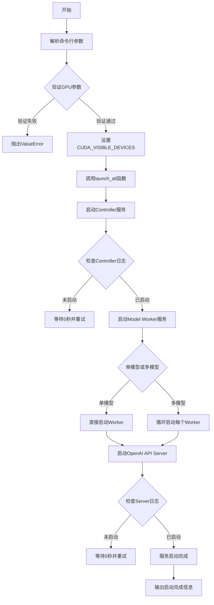
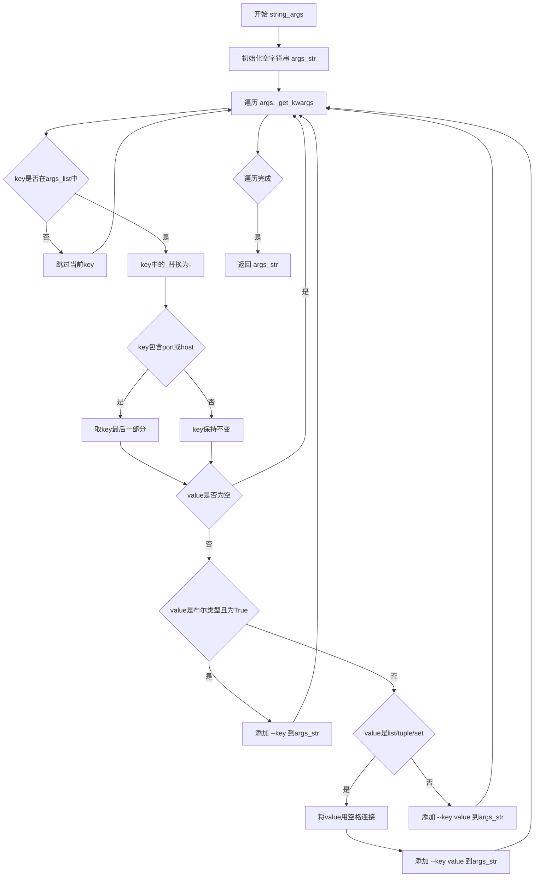
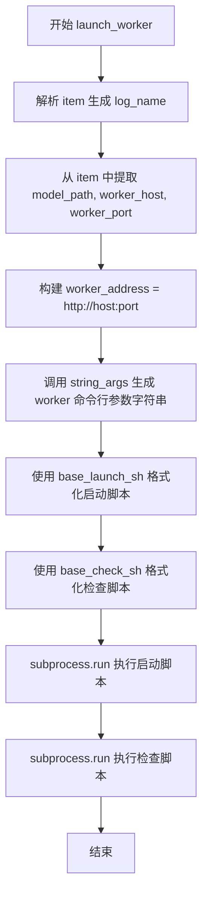
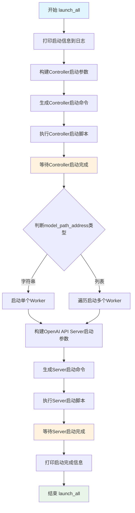

# `Langchain-Chatchat\libs\chatchat-server\chatchat\server\llm_api_stale.py` 详细设计文档

这是一个FastChat分布式LLM服务启动脚本，通过命令行参数配置并自动启动Controller、Model Worker和OpenAI API Server三个核心组件，支持多模型部署和GPU配置，用于提供基于FastChat框架的大语言模型推理服务。

## 整体流程



## 类结构

```
本脚本为扁平化结构，无类定义
所有功能通过全局函数实现
函数调用关系:
├── main入口
│   ├── launch_all (主启动函数)
│   │   ├── launch_worker (worker启动函数)
│   │   │   └── string_args (参数转换函数)
│   │   └── string_args (参数转换函数)
```

## 全局变量及字段


### `LOG_PATH`
    
日志文件存储目录路径

类型：`str`
    


### `LOG_FORMAT`
    
日志输出格式字符串，定义了日志的时间、文件名、行号、级别和消息格式

类型：`str`
    


### `logger`
    
全局日志记录器对象，用于记录程序运行过程中的日志信息

类型：`logging.Logger`
    


### `parser`
    
命令行参数解析器对象，用于解析程序启动时的各种配置参数

类型：`argparse.ArgumentParser`
    


### `controller_args`
    
控制器相关配置参数列表，包含host、port和dispatch-method

类型：`List[str]`
    


### `worker_args`
    
模型worker相关配置参数列表，包含模型路径、设备、GPU配置等

类型：`List[str]`
    


### `server_args`
    
OpenAI API服务器相关配置参数列表，包含服务器地址、端口和API密钥等

类型：`List[str]`
    


### `base_launch_sh`
    
用于启动服务的bash命令模板，包含模块名、参数、日志路径的占位符

类型：`str`
    


### `base_check_sh`
    
用于检查服务是否成功启动的bash循环脚本模板

类型：`str`
    


### `args`
    
解析后的命令行参数命名空间对象，包含所有配置项的值

类型：`argparse.Namespace`
    


    

## 全局函数及方法


### `string_args`

该函数将argparse.Namespace对象中的参数转换为命令行字符串格式，用于构建fastchat服务的启动命令。支持布尔类型、列表类型和普通类型参数的转换，并根据args_list过滤需要处理的参数。

参数：

- `args`：`argparse.Namespace`，包含所有命令行参数的命名空间对象
- `args_list`：`List[str]`，需要处理的参数名称列表，用于过滤参数

返回值：`str`，转换后的命令行参数字符串，格式如`--key value --key2 value2`

#### 流程图



#### 带注释源码

```python
def string_args(args, args_list):
    """将args中的key转化为字符串"""
    # 初始化返回的参数字符串
    args_str = ""
    # 遍历args中的所有键值对
    for key, value in args._get_kwargs():
        # args._get_kwargs中的key以_为分隔符,先转换，再判断是否在指定的args列表中
        # 将key中的下划线替换为连字符（argparse使用下划线，命令行使用连字符）
        key = key.replace("_", "-")
        # 如果key不在指定的args_list中，跳过该参数
        if key not in args_list:
            continue
        # fastchat中port,host没有前缀，去除前缀
        # 如果key包含port或host，取最后一个部分（去除前缀）
        key = key.split("-")[-1] if re.search("port|host", key) else key
        # 如果值为空，跳过
        if not value:
            pass
        # 1==True ->  True
        # 布尔类型参数的处理：如果为True，只输出flag（无值）
        elif isinstance(value, bool) and value == True:
            args_str += f" --{key} "
        # 处理列表、元组、集合类型参数，用空格连接多个值
        elif (
            isinstance(value, list)
            or isinstance(value, tuple)
            or isinstance(value, set)
        ):
            value = " ".join(value)
            args_str += f" --{key} {value} "
        # 其他类型直接转换为字符串
        else:
            args_str += f" --{key} {value} "

    return args_str
```


### `launch_worker`

该函数负责启动 FastChat 的 model_worker 进程，将模型路径、主机和端口解析为命令行参数，并通过 subprocess 启动后台进程，同时监控进程是否成功启动。

参数：

-  `item`：`str`，模型路径地址，格式为 `model-path@host@port`，例如 `THUDM/chatglm2-6b@localhost@7650`
-  `args`：`argparse.Namespace`，包含所有命令行参数的命名空间对象
-  `worker_args`：`list`，可选，默认为 `worker_args` 全局变量，指定需要传递给 worker 的参数列表

返回值：`None`，该函数无返回值，通过 subprocess 在后台启动 worker 进程

#### 流程图



#### 带注释源码

```python
def launch_worker(item, args, worker_args=worker_args):
    """
    启动单个 model_worker 进程
    
    参数:
        item: str, 模型路径地址，格式为 model-path@host@port
        args: argparse.Namespace, 命令行参数对象
        worker_args: list, 需要传递给 worker 的参数列表
    """
    # 从模型路径地址中提取模型名称，生成日志文件名
    # 处理路径分隔符和特殊字符，生成合法的日志名
    log_name = (
        item.split("/")[-1]       # 取路径最后一部分
        .split("\\")[-1]          # 处理 Windows 路径
        .replace("-", "_")       # 连字符替换为下划线
        .replace("@", "_")       # @ 符号替换为下划线
        .replace(".", "_")       # 点号替换为下划线
    )
    
    # 先分割 model-path-address，在传到 string_args 中分析参数
    # item 格式: model-path@host@port
    args.model_path, args.worker_host, args.worker_port = item.split("@")
    
    # 构建完整的 worker 地址，格式: http://host:port
    # 必须加 http:// 前缀，否则后续请求会报 InvalidSchema 错误
    args.worker_address = f"http://{args.worker_host}:{args.worker_port}"
    
    # 打印提示信息
    print("*" * 80)
    print(f"如长时间未启动，请到{LOG_PATH}{log_name}.log下查看日志")
    
    # 将 args 对象中需要传递给 worker 的参数转换为命令行字符串
    worker_str_args = string_args(args, worker_args)
    print(worker_str_args)
    
    # 格式化启动脚本
    # base_launch_sh = "nohup python3 -m fastchat.serve.{0} {1} >{2}/{3}.log 2>&1 &"
    # {0}: 模块名 model_worker
    # {1}: worker_str_args 参数
    # {2}: LOG_PATH 日志目录
    # {3}: worker_{log_name} 日志文件名
    worker_sh = base_launch_sh.format(
        "model_worker", worker_str_args, LOG_PATH, f"worker_{log_name}"
    )
    
    # 格式化检查脚本，监控 worker 是否成功启动
    # base_check_sh 检查日志中是否出现 "Uvicorn running on"
    worker_check_sh = base_check_sh.format(
        LOG_PATH, f"worker_{log_name}", "model_worker"
    )
    
    # 执行启动命令，后台运行 nohup
    # shell=True: 使用 shell 解释器执行
    # check=True: 如果命令返回非零退出码，抛出 CalledProcessError
    subprocess.run(worker_sh, shell=True, check=True)
    
    # 执行检查脚本，等待 worker 启动完成
    subprocess.run(worker_check_sh, shell=True, check=True)
```


### `launch_all`

该函数是LLM服务启动的核心入口，负责按照依赖顺序依次启动FastChat分布式系统的三个关键组件：Controller（控制器）、Model Worker（模型工作进程）和OpenAI API Server（API服务器），并通过等待机制确保每个组件成功启动后再启动下一个。

参数：

-  `args`：`argparse.Namespace`，包含所有命令行参数的配置对象，如model-path-address、controller-host、controller-port等
-  `controller_args`：列表，默认值为`controller_args`，指定Controller组件需要使用的参数列表
-  `worker_args`：列表，默认值为`worker_args`，指定Worker组件需要使用的参数列表
-  `server_args`：列表，默认值为`server_args`，指定OpenAI API Server组件需要使用的参数列表

返回值：`None`，该函数无返回值，仅执行启动流程和日志输出

#### 流程图



#### 带注释源码

```python
def launch_all(
    args,
    controller_args=controller_args,
    worker_args=worker_args,
    server_args=server_args,
):
    """
    启动FastChat分布式LLM服务的主函数
    
    按顺序启动三个核心组件：
    1. Controller - 负责请求分发和负载均衡
    2. Model Worker - 负责加载和运行LLM模型
    3. OpenAI API Server - 提供OpenAI兼容的API接口
    
    参数:
        args: 命令行参数解析后的命名空间对象
        controller_args: Controller组件需要的参数列表
        worker_args: Worker组件需要的参数列表
        server_args: Server组件需要的参数列表
    
    返回值:
        None
    """
    # 打印启动提示信息，告知用户日志存放位置
    print(f"Launching llm service,logs are located in {LOG_PATH}...")
    print(f"开始启动LLM服务,请到{LOG_PATH}下监控各模块日志...")
    
    # --- 步骤1: 启动Controller ---
    # 将args中的参数转换为符合fastchat要求的命令行参数字符串
    controller_str_args = string_args(args, controller_args)
    
    # 格式化生成Controller的启动shell命令
    # base_launch_sh = "nohup python3 -m fastchat.serve.{0} {1} >{2}/{3}.log 2>&1 &"
    controller_sh = base_launch_sh.format(
        "controller", controller_str_args, LOG_PATH, "controller"
    )
    
    # 生成检查Controller是否成功启动的shell脚本
    # base_check_sh 通过循环检查日志中是否出现"Uvicorn running on"来判断服务是否启动成功
    controller_check_sh = base_check_sh.format(LOG_PATH, "controller", "controller")
    
    # 执行Controller启动命令（后台运行）
    subprocess.run(controller_sh, shell=True, check=True)
    
    # 等待并检查Controller是否启动成功
    subprocess.run(controller_check_sh, shell=True, check=True)
    
    # --- 步骤2: 启动Model Worker(s) ---
    # 打印Worker启动提示，因模型加载需要较长时间（3-10分钟）
    print(f"worker启动时间视设备不同而不同，约需3-10分钟，请耐心等待...")
    
    # 判断是单个模型还是多个模型
    if isinstance(args.model_path_address, str):
        # 单个模型：直接调用launch_worker启动
        launch_worker(args.model_path_address, args=args, worker_args=worker_args)
    else:
        # 多个模型：遍历逐个启动，每个模型独立运行在不同的Worker进程中
        for idx, item in enumerate(args.model_path_address):
            print(f"开始加载第{idx}个模型:{item}")
            launch_worker(item, args=args, worker_args=worker_args)
    
    # --- 步骤3: 启动OpenAI API Server ---
    # 将args中的参数转换为符合fastchat要求的命令行参数字符串
    server_str_args = string_args(args, server_args)
    
    # 格式化生成API Server的启动shell命令
    server_sh = base_launch_sh.format(
        "openai_api_server", server_str_args, LOG_PATH, "openai_api_server"
    )
    
    # 生成检查Server是否成功启动的shell脚本
    server_check_sh = base_check_sh.format(
        LOG_PATH, "openai_api_server", "openai_api_server"
    )
    
    # 执行Server启动命令（后台运行）
    subprocess.run(server_sh, shell=True, check=True)
    
    # 等待并检查Server是否启动成功
    subprocess.run(server_check_sh, shell=True, check=True)
    
    # 打印启动完成信息
    print("Launching LLM service done!")
    print("LLM服务启动完毕。")
```

## 关键组件


### 参数解析与配置模块

负责解析命令行参数，包括模型路径地址、控制器配置、Worker配置、API服务器配置等，支持多模型部署和多种量化策略。

### 多Worker启动机制

支持通过`--model-path-address`参数指定多个模型（格式：model-path@host@port），为每个模型独立启动一个worker进程，实现多模型并行服务。

### 量化策略配置

支持多种量化方案：8-bit量化（--load-8bit）、CPU offloading、GPTQ量化（支持2/3/4/8/16位），以及groupsize和act-order配置。

### GPU资源管理

支持多GPU配置（--gpus, --num-gpus），通过CUDA_VISIBLE_DEVICES环境变量控制可用GPU，并提供max-gpu-memory内存限制。

### 日志与进程管理

统一日志路径（./logs/），为各组件生成独立日志文件，并通过检查脚本等待服务启动完成。

### 服务组件编排

按序启动三个核心服务：Controller（控制器，负责调度）、Model Worker（模型推理进程）、OpenAI API Server（对外API服务）。

### 参数转换与格式化

string_args函数将Namespace对象转换为fastchat命令行参数格式，处理bool、list等类型转换，并适配fastchat的参数命名规范。


## 问题及建议


### 已知问题

- **缺乏错误处理机制**：subprocess.run 使用 check=True 但没有捕获异常，若服务启动失败会直接崩溃
- **无停止脚本**：只有启动逻辑，没有提供停止已启动服务的方法
- **端口冲突检测缺失**：未检查指定端口是否已被占用，可能导致服务启动失败
- **模型路径解析脆弱**：使用 split("/") 和 split("\\") 解析路径，当路径格式不符时会导致运行时错误
- **服务健康检查不完善**：仅检查进程是否启动，未验证服务间连通性和实际可用性
- **无超时控制**：worker 启动等待循环没有超时限制，可能无限等待
- **硬编码配置**：LOG_PATH、默认参数等硬编码，缺乏配置灵活性
- **CUDA 设备设置时机问题**：在设置 CUDA_VISIBLE_DEVICES 前未验证 GPU 可用性
- **日志覆盖问题**：使用 nohup 追加模式，但检查脚本使用 grep 可能匹配历史日志导致误判
- **shell 注入风险**：subprocess.run 使用 shell=True 配合字符串格式化，存在潜在安全风险
- **模型启动失败处理**：多 worker 场景下单个 worker 启动失败不会中断整体流程

### 优化建议

- 添加服务停止脚本，支持通过 PID 文件或端口清理进程
- 在启动前检测端口可用性，避免冲突
- 增加超时参数控制服务启动等待时间
- 添加更健壮的正则表达式验证 model-path-address 格式
- 使用 subprocess.Popen 而非 run 并添加超时和错误日志记录
- 将 LOG_PATH 等配置项改为命令行参数或配置文件
- 增加 --dry-run 模式，仅打印实际执行的命令而不执行
- 添加服务间连通性验证，启动完成后发送测试请求
- 考虑使用进程管理工具如 supervisor 或 systemd 管理服务生命周期
- 增加资源检查，在启动前验证 GPU 显存、内存是否满足需求
- 将 check=True 改为手动检查返回码并提供更友好的错误信息
- 添加日志轮转配置，避免日志文件过大


## 其它


### 设计目标与约束

本项目旨在提供一个便捷的脚本工具，用于一键式部署基于FastChat框架的分布式LLM推理服务。设计目标包括：支持多模型并发部署、通过命令行灵活配置各组件参数、实现自动化启动流程并监控服务状态。约束条件包括：仅支持Linux/macOS环境、需要Python 3.8+、依赖fastchat框架、GPU内存要求取决于加载的模型大小。

### 错误处理与异常设计

代码中的错误处理主要包括：1) 参数校验错误（如GPU数量不足时抛出ValueError）；2) 子进程执行错误（subprocess.run使用check=True，遇到错误会抛出CalledProcessError）；3) 启动等待超时（通过grep检查日志中"Uvicorn running on"字符串判断服务是否成功启动）。当前实现缺乏超时机制和重试逻辑，若服务启动失败会直接抛出异常终止程序。建议增加启动超时时间配置、重试次数限制以及更详细的错误日志输出。

### 数据流与状态机

整体数据流为：用户通过命令行传入模型路径地址（如THUDM/chatglm2-6b@localhost@7650）→ launch_all函数解析参数并依次启动controller、worker、openai_api_server三个组件。Worker启动后需要向Controller注册，Controller负责请求分发，OpenAI API Server接收外部请求后转发给Controller。状态机流程：脚本执行 → 参数解析验证 → Controller启动 → Worker启动（每个模型一个Worker） → API Server启动 → 所有服务就绪。

### 外部依赖与接口契约

主要外部依赖包括：1) fastchat.serve.controller - 控制器组件，负责Worker注册和请求分发；2) fastchat.serve.model_worker - 模型工作器，负责加载模型并处理推理请求；3) fastchat.serve.openai_api_server - 提供OpenAI兼容的API接口。接口契约方面：Controller默认监听21001端口，Worker默认监听21002端口，API Server默认监听8888端口，组件间通过HTTP协议通信，Controller地址格式为http://{host}:{port}。

### 安全性考虑

当前代码安全性考虑不足：1) API密钥支持（--api-keys参数）但缺乏HTTPS支持；2) 未实现请求认证和授权机制；3) CORS配置被注释掉，存在跨域请求风险；4) 缺乏请求速率限制。建议生产环境部署时：启用HTTPS、配置CORS策略、添加API密钥验证、考虑增加JWT认证或OAuth2支持。

### 性能考虑与优化

性能相关参数包括：--limit-worker-concurrency限制Worker并发数（默认5）、--stream-interval流式输出间隔（默认2秒）、--num-gpus和--gpus指定GPU资源、--max-gpu-memory限制每GPU内存使用。量化选项包括--load-8bit、--gptq-*系列参数用于GPTQ量化。优化建议：1) 根据GPU数量合理配置num-gpus；2) 对大模型启用量化以降低显存占用；3) 调整worker并发数以平衡吞吐量和OOM风险；4) 使用更短的worker地址以减少网络延迟。

### 配置管理

配置通过argparse模块管理，分为三组：controller参数（controller-host、controller-port、dispatch-method）、worker参数（model-path、device、gpus等约20个参数）、server参数（server-host、server-port、api-keys等）。所有配置通过命令行传入，配置值直接转换为fastchat各组件的命令行参数。部分参数如controller-address会在代码中自动拼接生成。

### 日志与监控

日志配置：使用Python logging模块，日志格式为"时间-文件名-行号-级别-消息"，日志级别设为INFO。日志输出到./logs/目录下的多个文件：controller.log、openai_api_server.log、worker_{模型名}.log。启动监控通过base_check_sh脚本实现，每5秒检查一次日志文件中是否包含"Uvicorn running on"字符串来判断服务是否成功启动。监控能力较弱，仅能判断进程是否启动成功，无法监控运行时健康状态和推理性能指标。

### 部署注意事项

部署前需确认：1) CUDA环境已正确配置；2) Python版本≥3.8；3) 已安装fastchat及其依赖（torch、transformers等）；4) 防火墙已开放所需端口（默认21001、21002、8888）；5) 有足够的GPU显存加载模型。部署步骤：直接运行python llm_api_sture.py --model-path-address MODEL@HOST@PORT即可，脚本会自动启动所有组件。建议使用nohup或systemd确保进程持续运行，并配置日志轮转以防止磁盘空间不足。

### 使用示例与参数参考

基本用法：python llm_api_sture.py --model-path-address THUDM/chatglm2-6b@localhost@7650。多模型用法：python llm_api_sture.py --model-path-address THUDM/chatglm2-6b@localhost@7650 THUDM/chatglm2-6b-32k@localhost@7651。自定义端口：--controller-port 21001 --worker-port 21002 --server-port 8888。GPU配置：--gpus 0,1,2,3 --num-gpus 4 --max-gpu-memory 20GiB。量化加载：--load-8bit或--gptq-ckpt /path/to/ckpt --gptq-wbits 4 --gptq-groupsize 128。API密钥：--api-keys sk-key1,sk-key2。

### 技术债务与未来改进

当前代码存在以下技术债务：1) 缺乏单元测试和集成测试；2) 错误处理不够完善，缺少重试和超时机制；3) 监控能力薄弱，仅依靠日志文件判断服务状态；4) 配置管理不够灵活，未支持配置文件；5) 缺乏健康检查接口和metrics暴露；6) 代码注释较少，维护性可提升。未来改进方向：增加配置热加载、集成Prometheus监控、添加Kubernetes部署支持、实现服务发现与动态扩缩容、补充完整的测试覆盖。

    