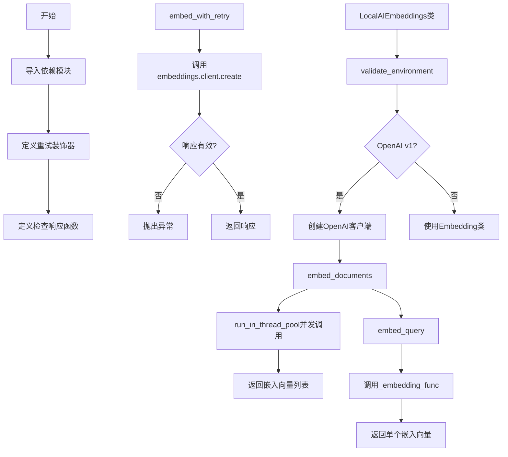
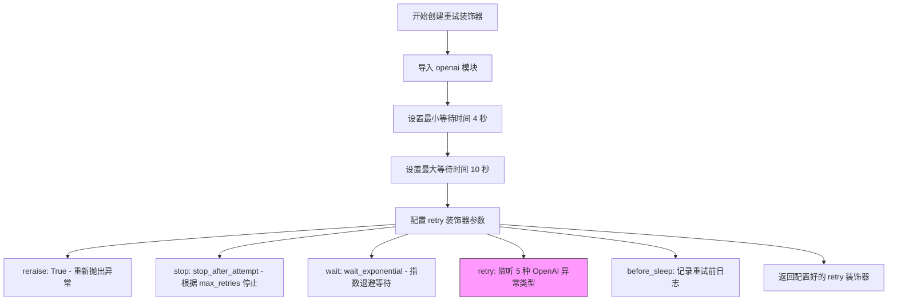
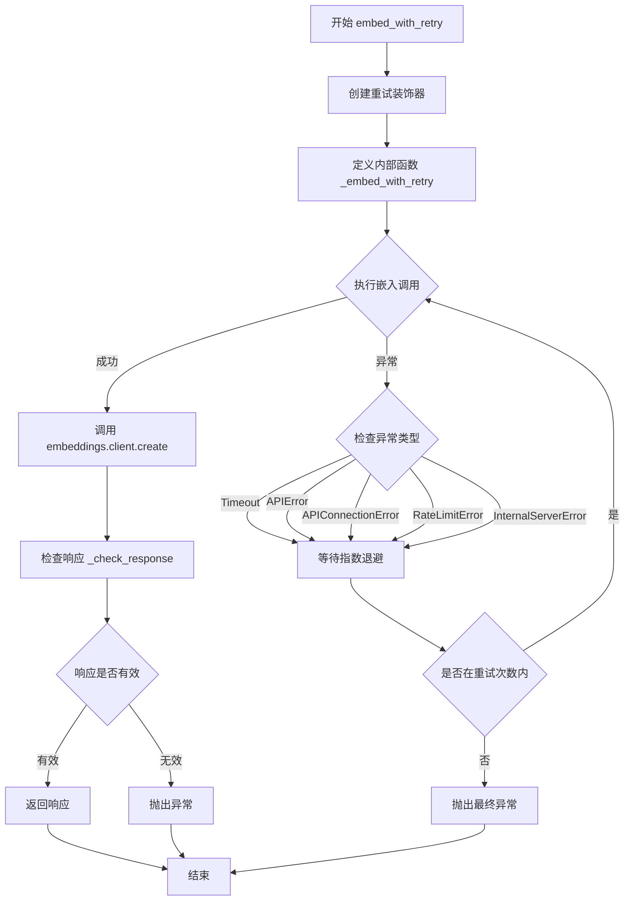
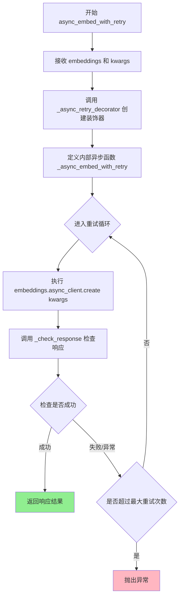
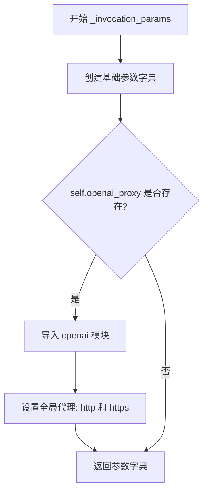
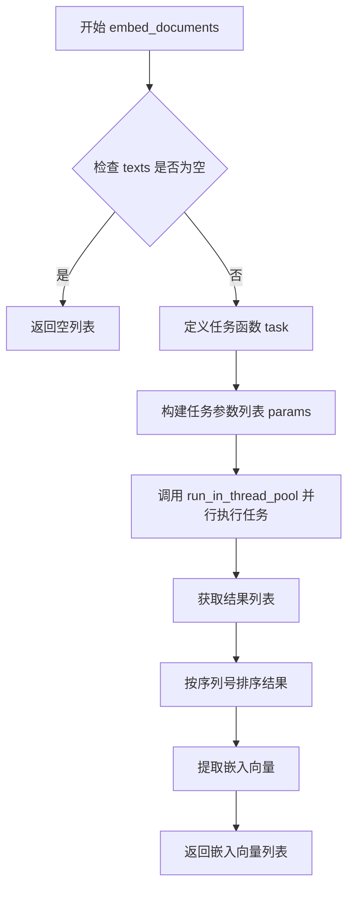
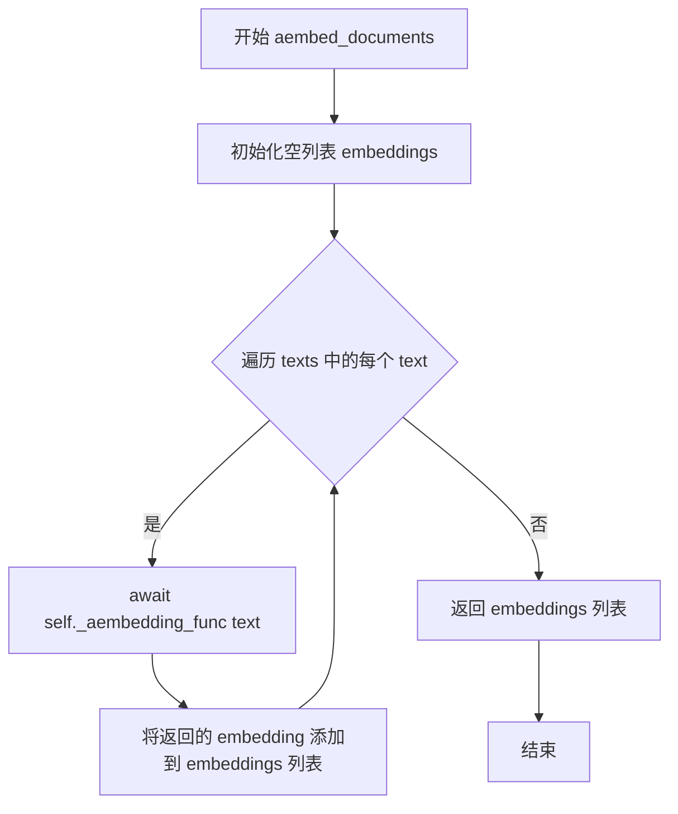
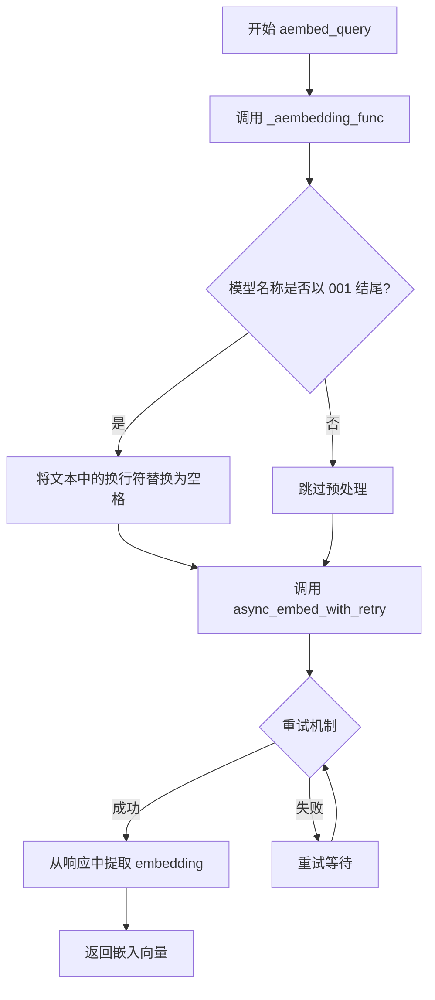

# `Langchain-Chatchat\libs\chatchat-server\chatchat\server\localai_embeddings.py` 详细设计文档

该代码实现了与LocalAI服务交互的嵌入功能，通过OpenAI兼容API获取文本嵌入向量，支持同步/异步调用、自动重试、并发处理和灵活配置

## 整体流程



## 类结构

```
模块级函数
├── _create_retry_decorator
├── _async_retry_decorator
├── _check_response
├── embed_with_retry
└── async_embed_with_retry

LocalAIEmbeddings (主类)
├── 字段 (Fields)
│   ├── client / async_client
│   ├── model / deployment
│   ├── openai_api_* 配置
│   ├── embedding_ctx_length
│   ├── chunk_size / max_retries
│   └── model_kwargs
│
└── 方法 (Methods)
    ├── build_extra (root_validator)
    ├── validate_environment (root_validator)
    ├── _invocation_params (property)
    ├── _embedding_func
    ├── _aembedding_func
    ├── embed_documents
    ├── aembed_documents
    ├── embed_query
    └── aembed_query
```

## 全局变量及字段


### `logger`
    
模块级日志记录器

类型：`logging.Logger`
    


### `min_seconds`
    
最小重试间隔(4秒)

类型：`int`
    


### `max_seconds`
    
最大重试间隔(10秒)

类型：`int`
    


### `LocalAIEmbeddings.client`
    
同步OpenAI嵌入客户端

类型：`Any`
    


### `LocalAIEmbeddings.async_client`
    
异步OpenAI嵌入客户端

类型：`Any`
    


### `LocalAIEmbeddings.model`
    
模型名称，默认text-embedding-ada-002

类型：`str`
    


### `LocalAIEmbeddings.deployment`
    
部署名称

类型：`str`
    


### `LocalAIEmbeddings.openai_api_version`
    
API版本

类型：`Optional[str]`
    


### `LocalAIEmbeddings.openai_api_base`
    
API基础URL

类型：`Optional[str]`
    


### `LocalAIEmbeddings.openai_proxy`
    
代理服务器地址

类型：`Optional[str]`
    


### `LocalAIEmbeddings.embedding_ctx_length`
    
最大token数，默认8191

类型：`int`
    


### `LocalAIEmbeddings.openai_api_key`
    
API密钥

类型：`Optional[str]`
    


### `LocalAIEmbeddings.openai_organization`
    
组织ID

类型：`Optional[str]`
    


### `LocalAIEmbeddings.allowed_special`
    
允许的特殊令牌

类型：`Union[Literal["all"], Set[str]]`
    


### `LocalAIEmbeddings.disallowed_special`
    
禁止的特殊令牌

类型：`Union[Literal["all"], Set[str], Sequence[str]]`
    


### `LocalAIEmbeddings.chunk_size`
    
批处理大小，默认1000

类型：`int`
    


### `LocalAIEmbeddings.max_retries`
    
最大重试次数，默认3

类型：`int`
    


### `LocalAIEmbeddings.request_timeout`
    
请求超时时间

类型：`Union[float, Tuple[float, float], Any, None]`
    


### `LocalAIEmbeddings.headers`
    
自定义请求头

类型：`Any`
    


### `LocalAIEmbeddings.show_progress_bar`
    
是否显示进度条

类型：`bool`
    


### `LocalAIEmbeddings.model_kwargs`
    
额外模型参数

类型：`Dict[str, Any]`
    
    

## 全局函数及方法


### `_create_retry_decorator`

该函数用于创建一个同步重试装饰器，通过 tenacity 库为 LocalAI 嵌入 API 调用提供自动重试机制。它根据传入的 `embeddings` 对象的 `max_retries` 配置，设置指数退避等待策略，并针对特定的 OpenAI 异常类型进行重试，以确保在临时性故障时能够自动恢复。

参数：

- `embeddings`：`LocalAIEmbeddings`，LocalAI 嵌入模型实例，用于获取 `max_retries` 配置以确定重试次数

返回值：`Callable[[Any], Any]`，返回一个 tenacity 的 `retry` 装饰器，可用于包装需要重试的函数

#### 流程图



#### 带注释源码

```python
def _create_retry_decorator(embeddings: LocalAIEmbeddings) -> Callable[[Any], Any]:
    """创建同步重试装饰器，为嵌入 API 调用提供自动重试能力。
    
    Args:
        embeddings: LocalAIEmbeddings 实例，用于获取 max_retries 配置
        
    Returns:
        Callable: 可用于装饰其他函数的 retry 装饰器
    """
    # 动态导入 openai 模块以避免顶层依赖
    import openai

    # 定义指数退避的最小等待时间（秒）
    min_seconds = 4
    # 定义指数退避的最大等待时间（秒）
    max_seconds = 10
    # Wait 2^x * 1 second between each retry starting with
    # 4 seconds, then up to 10 seconds, then 10 seconds afterwards
    
    # 使用 tenacity 库的 retry 装饰器配置重试策略
    return retry(
        reraise=True,  # 重试失败后重新抛出最后一个异常
        stop=stop_after_attempt(embeddings.max_retries),  # 最大重试次数
        wait=wait_exponential(
            multiplier=1,  # 指数乘数
            min=min_seconds,  # 最小等待 4 秒
            max=max_seconds   # 最大等待 10 秒
        ),
        # 配置需要重试的异常类型（5 种 OpenAI 相关异常）
        retry=(
            retry_if_exception_type(openai.Timeout)           # 请求超时
            | retry_if_exception_type(openai.APIError)        # API 通用错误
            | retry_if_exception_type(openai.APIConnectionError)  # 连接错误
            | retry_if_exception_type(openai.RateLimitError)  # 速率限制
            | retry_if_exception_type(openai.InternalServerError)  # 服务器内部错误
        ),
        before_sleep=before_sleep_log(logger, logging.WARNING),  # 重试前记录警告日志
    )
```


### `_async_retry_decorator`

创建异步重试装饰器，用于为异步函数提供基于指数退避策略的重试能力，针对特定的 OpenAI 相关异常进行重试。

参数：

- `embeddings`：`LocalAIEmbeddings`，LocalAI 嵌入模型实例，用于获取重试配置参数（如 max_retries）

返回值：`Callable`，返回一个装饰器函数，该装饰器接收被包装的异步函数并返回具有重试能力的异步包装函数

#### 流程图

```mermaid
flowchart TD
    A[开始: _async_retry_decorator] --> B[导入 openai 模块]
    B --> C[定义重试参数: min_seconds=4, max_seconds=10]
    C --> D[创建 AsyncRetrying 实例]
    D --> E{配置重试策略}
    E --> F[stop: stop_after_attempt-根据 embeddings.max_retries 停止]
    E --> G[wait: wait_exponential-指数退避等待]
    E --> H[retry: 重试条件-Timeout|APIError|APIConnectionError|RateLimitError|InternalServerError]
    E --> I[before_sleep: before_sleep_log-重试前记录日志]
    F --> J[定义 wrap 内部函数]
    G --> J
    H --> J
    I --> J
    J --> K[定义 wrapped_f 异步函数]
    K --> L[async for 遍历 async_retrying]
    L --> M[await 执行原始异步函数]
    M --> N{执行是否成功}
    N -->|成功| O[返回结果]
    N -->|失败| L
    O --> P[返回 wrapped_f 函数]
    P --> Q[返回 wrap 闭包]
    Q --> Z[结束]
```

#### 带注释源码

```python
def _async_retry_decorator(embeddings: LocalAIEmbeddings) -> Any:
    """创建异步重试装饰器，用于为异步函数添加重试逻辑。
    
    Args:
        embeddings: LocalAIEmbeddings 实例，用于获取 max_retries 等重试配置
        
    Returns:
        一个装饰器函数，用于包装异步函数使其具备重试能力
    """
    import openai

    # 最小等待时间4秒，最大等待时间10秒
    min_seconds = 4
    max_seconds = 10
    # Wait 2^x * 1 second between each retry starting with
    # 4 seconds, then up to 10 seconds, then 10 seconds afterwards
    
    # 创建 AsyncRetrying 实例，配置重试策略
    async_retrying = AsyncRetrying(
        reraise=True,  # 重试结束后重新抛出最后一个异常
        stop=stop_after_attempt(embeddings.max_retries),  # 最多重试次数
        wait=wait_exponential(multiplier=1, min=min_seconds, max=max_seconds),  # 指数退避
        retry=(
            # 定义需要重试的异常类型
            retry_if_exception_type(openai.Timeout)
            | retry_if_exception_type(openai.APIError)
            | retry_if_exception_type(openai.APIConnectionError)
            | retry_if_exception_type(openai.RateLimitError)
            | retry_if_exception_type(openai.InternalServerError)
        ),
        before_sleep=before_sleep_log(logger, logging.WARNING),  # 重试前记录警告日志
    )

    def wrap(func: Callable) -> Callable:
        """装饰器内部函数，用于包装被装饰的异步函数。
        
        Args:
            func: 需要被包装的异步函数
            
        Returns:
            包装后的异步函数，具备重试能力
        """
        async def wrapped_f(*args: Any, **kwargs: Any) -> Callable:
            """实际执行重试逻辑的异步包装函数。
            
            使用 async for 遍历 AsyncRetrying，
            每次迭代尝试执行原始函数，如果失败则等待后重试。
            
            Args:
                *args: 位置参数
                **kwargs: 关键字参数
                
            Returns:
                原始异步函数的返回值
            """
            async for _ in async_retrying:
                return await func(*args, **kwargs)
            raise AssertionError("this is unreachable")

        return wrapped_f

    return wrap
```


### `_check_response`

检查 LocalAI API 返回的嵌入响应数据有效性，确保响应中不包含空嵌入向量。如果发现任何空嵌入（长度为1），则抛出 `openai.APIError` 异常；否则返回原始响应对象。

参数：

- `response`：`dict`，LocalAI API 返回的响应对象，包含 `data` 属性，其中每个元素是一个嵌入对象，具有 `embedding` 属性

返回值：`dict`，返回检查后的响应对象，如果验证通过则返回原始响应，验证失败则抛出异常

#### 流程图

```mermaid
flowchart TD
    A[开始检查响应] --> B{检查是否存在空嵌入}
    B -->|是| C[导入 openai 模块]
    C --> D[抛出 openai.APIError 异常]
    B -->|否| E[返回原始响应对象]
    D --> F[结束]
    E --> F
    
    B 的判断条件:
    B1[遍历 response.data]
    B2{任意嵌入的 embedding 长度 == 1?}
    B1 --> B2
```

#### 带注释源码

```python
# https://stackoverflow.com/questions/76469415/getting-embeddings-of-length-1-from-langchain-openaiembeddings
def _check_response(response: dict) -> dict:
    """检查 LocalAI API 返回的响应是否包含无效的空嵌入向量。
    
    LocalAI API 有时会返回长度为1的嵌入向量，这表示空嵌入。
    该函数用于验证响应数据的有效性。
    
    Args:
        response: dict 类型，LocalAI API 返回的响应对象，
                  应包含 data 属性，其中每个元素具有 embedding 属性
    
    Returns:
        dict: 验证通过后返回原始响应对象
    
    Raises:
        openai.APIError: 当响应中包含空嵌入（长度为1）时抛出
    """
    # 使用 any() 检查 response.data 中是否存在任何嵌入向量长度为1的情况
    # 列表推导式遍历所有嵌入数据，检查每个 embedding 的长度
    if any([len(d.embedding) == 1 for d in response.data]):
        # 导入 openai 模块以抛出正确的异常类型
        import openai

        # 抛出 API 错误异常，表明 LocalAI API 返回了空嵌入
        raise openai.APIError("LocalAI API returned an empty embedding")
    # 验证通过，返回原始响应对象供后续处理
    return response
```


### `embed_with_retry`

同步带重试的嵌入调用函数，使用 tenacity 库为 LocalAI 嵌入 API 调用提供自动重试机制，处理常见的 OpenAI 相关异常（如超时、API错误、连接错误、限流和服务器内部错误），确保在临时性故障时能够自动重试，提高嵌入操作的可靠性。

参数：

- `embeddings`：`LocalAIEmbeddings`，LocalAI 嵌入模型实例，提供客户端配置和重试参数
- `**kwargs`：`Any`，可变关键字参数，直接传递给嵌入客户端的 `create` 方法调用

返回值：`Any`，经过 `_check_response` 检查后的嵌入响应对象，通常包含 `data` 字段，其中每个元素包含 `embedding` 向量

#### 流程图



#### 带注释源码

```python
def embed_with_retry(embeddings: LocalAIEmbeddings, **kwargs: Any) -> Any:
    """Use tenacity to retry the embedding call.
    
    该函数为 LocalAI 嵌入调用提供同步重试机制。
    使用 tenacity 库的 retry 装饰器来处理各种临时性故障。
    
    Args:
        embeddings: LocalAIEmbeddings 实例，包含客户端配置和 max_retries 设置
        **kwargs: 传递给 openai 嵌入客户端的任意参数，如 input, model 等
    
    Returns:
        Any: 经过响应验证的嵌入响应对象，通常包含 data 字段，
             每个元素包含 embedding 向量
    
    Raises:
        openai.Timeout: 请求超时且重试次数耗尽
        openai.APIError: API 返回错误且重试次数耗尽
        openai.APIConnectionError: 连接错误且重试次数耗尽
        openai.RateLimitError: 限流错误且重试次数耗尽
        openai.InternalServerError: 服务器内部错误且重试次数耗尽
    """
    # 步骤1: 根据 embeddings 实例创建重试装饰器
    # 装饰器配置了指数退避策略（4-10秒）和最大重试次数
    retry_decorator = _create_retry_decorator(embeddings)

    # 步骤2: 定义内部嵌入函数并应用重试装饰器
    @retry_decorator
    def _embed_with_retry(**kwargs: Any) -> Any:
        """实际执行嵌入调用的内部函数，会被重试装饰器包装"""
        # 调用嵌入客户端的 create 方法
        response = embeddings.client.create(**kwargs)
        # 对响应进行验证，检查是否返回了有效的嵌入向量
        return _check_response(response)

    # 步骤3: 调用装饰后的内部函数并返回结果
    return _embed_with_retry(**kwargs)
```


### `async_embed_with_retry`

该函数是一个异步封装器，用于在使用 LocalAI 进行嵌入计算时提供自动重试机制。它通过 `tenacity` 库的异步重试装饰器处理临时性故障（如超时、连接错误、速率限制等），确保嵌入请求的可靠性。

参数：

- `embeddings`：`LocalAIEmbeddings`，LocalAIEmbeddings 实例，用于获取最大重试次数配置和异步客户端
- `**kwargs`：`Any`，可变关键字参数，包含传递给嵌入 API 的参数（如 `input`、`model` 等）

返回值：`Any`，嵌入 API 的响应对象，通常包含嵌入向量数据

#### 流程图



#### 带注释源码

```python
async def async_embed_with_retry(
    embeddings: LocalAIEmbeddings,
    **kwargs: Any
) -> Any:
    """Use tenacity to retry the embedding call.
    
    该函数提供异步嵌入调用的重试机制。当嵌入 API 调用失败时，
    会根据配置的最大重试次数自动重试，支持处理多种临时性错误。
    
    Args:
        embeddings: LocalAIEmbeddings 实例，包含客户端配置和重试参数
        **kwargs: 传递给 embedding API 的参数，如 input, model 等
        
    Returns:
        Any: embedding API 的响应对象，包含嵌入向量数据
        
    Note:
        内部使用 _async_retry_decorator 创建重试装饰器，
        支持的异常类型包括:
        - openai.Timeout: 请求超时
        - openai.APIError: API 错误
        - openai.APIConnectionError: 连接错误
        - openai.RateLimitError: 速率限制
        - openai.InternalServerError: 服务器内部错误
    """

    # 使用 _async_retry_decorator 创建异步重试装饰器
    # 装饰器基于 embeddings.max_retries 配置重试次数
    @_async_retry_decorator(embeddings)
    async def _async_embed_with_retry(**kwargs: Any) -> Any:
        """内部异步嵌入函数，实际执行 API 调用"""
        
        # 调用异步客户端的 create 方法发送嵌入请求
        # embeddings.async_client 是 openai.AsyncOpenAI 的 embeddings 实例
        response = await embeddings.async_client.create(**kwargs)
        
        # 检查响应有效性，确保返回的嵌入向量不为空
        return _check_response(response)

    # 执行带重试逻辑的异步嵌入函数
    return await _async_embed_with_retry(**kwargs)
```


### `LocalAIEmbeddings.build_extra`

构建额外参数字典。该方法是一个 Pydantic root_validator（pre=True），用于在模型初始化时处理传入的额外参数，将非默认参数转移到 `model_kwargs` 中，并进行相应的验证。

参数：

- `values`：`Dict[str, Any]`，包含传入模型初始化时的所有键值对参数

返回值：`Dict[str, Any]`，处理并验证后的参数字典

#### 流程图

```mermaid
flowchart TD
    A[开始 build_extra] --> B[获取所有必填字段名<br/>all_required_field_names]
    B --> C[从values获取model_kwargs<br/>赋值给extra变量]
    C --> D[遍历values中的所有key]
    D --> E{当前field_name<br/>是否在extra中?}
    E -->|是| F[抛出ValueError<br/>参数被重复提供]
    E -->|否| G{field_name是否在<br/>all_required_field_names中?}
    G -->|是| H[跳过,继续下一个]
    G -->|否| I[发出警告<br/>参数将转移到model_kwargs]
    I --> J[将该参数从values弹出<br/>并存入extra]
    J --> D
    D --> K{检查extra中是否有<br/>必填字段名}
    K -->|是| L[抛出ValueError<br/>必填字段应在model_kwargs外指定]
    K -->|否| M[设置values['model_kwargs'] = extra]
    M --> N[返回values]
```

#### 带注释源码

```python
@root_validator(pre=True)
def build_extra(cls, values: Dict[str, Any]) -> Dict[str, Any]:
    """Build extra kwargs from additional params that were passed in."""
    # 1. 获取Pydantic模型的所有必填字段名
    all_required_field_names = get_pydantic_field_names(cls)
    # 2. 从传入的values中获取model_kwargs，默认为空字典
    extra = values.get("model_kwargs", {})
    # 3. 遍历传入的所有参数
    for field_name in list(values):
        # 3.1 检查该字段是否同时在values和model_kwargs中（重复提供）
        if field_name in extra:
            raise ValueError(f"Found {field_name} supplied twice.")
        # 3.2 如果该字段不是Pydantic模型的必填字段
        if field_name not in all_required_field_names:
            # 发出警告，提醒用户该参数将被转移到model_kwargs
            warnings.warn(
                f"""WARNING! {field_name} is not default parameter.
                {field_name} was transferred to model_kwargs.
                Please confirm that {field_name} is what you intended."""
            )
            # 将该参数从values中弹出（删除），并存入extra字典
            extra[field_name] = values.pop(field_name)

    # 4. 检查extra中是否包含了必填字段名（这些字段应该显式指定，而不是通过model_kwargs）
    invalid_model_kwargs = all_required_field_names.intersection(extra.keys())
    if invalid_model_kwargs:
        raise ValueError(
            f"Parameters {invalid_model_kwargs} should be specified explicitly. "
            f"Instead they were passed in as part of `model_kwargs` parameter."
        )

    # 5. 将处理后的extra字典设置回values['model_kwargs']
    values["model_kwargs"] = extra
    return values
```


### `LocalAIEmbeddings.validate_environment`

该方法是一个 Pydantic root_validator，用于在实例化 `LocalAIEmbeddings` 类时验证环境变量和依赖项是否正确配置，确保 OpenAI API 密钥、基础 URL、代理设置等必要配置存在，并初始化同步和异步客户端。

参数：

- `cls`：类型 `Type[LocalAIEmbeddings]`，表示类本身，用于访问类属性和方法
- `values`：类型 `Dict`，包含模型初始化时的所有参数值，包括从构造函数传入的参数以及从环境变量读取的默认值

返回值：`Dict`，返回更新后的 values 字典，包含验证并初始化后的客户端配置

#### 流程图

```mermaid
flowchart TD
    A[开始 validate_environment] --> B{获取 openai_api_key}
    B --> C[从环境变量 OPENAI_API_KEY 读取]
    C --> D{获取 openai_api_base}
    D --> E[从环境变量 OPENAI_API_BASE 读取<br/>默认值为空字符串]
    E --> F{获取 openai_proxy}
    F --> G[从环境变量 OPENAI_PROXY 读取<br/>默认值为空字符串]
    G --> H{获取 openai_api_version}
    H --> I[从环境变量 OPENAI_API_VERSION 读取<br/>默认值为空字符串]
    I --> J{获取 openai_organization}
    J --> K[从环境变量 OPENAI_ORGANIZATION 读取<br/>默认值为空字符串]
    K --> L{尝试导入 openai 包}
    L --> M{检查 is_openai_v1()}
    M -->|True| N[构建 client_params 字典]
    N --> O{client 是否已存在?}
    O -->|否| P[创建 openai.OpenAI 实例并赋值]
    P --> Q{async_client 是否已存在?}
    Q -->|否| R[创建 openai.AsyncOpenAI 实例并赋值]
    O -->|是| Q
    Q -->|是| S[返回 values]
    M -->|False| T{client 是否已存在?}
    T -->|否| U[使用 openai.Embedding]
    T -->|是| S
    L -->|ImportError| V[抛出 ImportError 异常]
    S[返回 values] --> W[结束]
    V --> W
```

#### 带注释源码

```python
@root_validator()
def validate_environment(cls, values: Dict) -> Dict:
    """Validate that api key and python package exists in environment."""
    # 从 values 字典或环境变量 OPENAI_API_KEY 获取 API 密钥
    values["openai_api_key"] = get_from_dict_or_env(
        values, "openai_api_key", "OPENAI_API_KEY"
    )
    # 从 values 字典或环境变量 OPENAI_API_BASE 获取基础 URL，默认空字符串
    values["openai_api_base"] = get_from_dict_or_env(
        values,
        "openai_api_base",
        "OPENAI_API_BASE",
        default="",
    )
    # 从 values 字典或环境变量 OPENAI_PROXY 获取代理设置，默认空字符串
    values["openai_proxy"] = get_from_dict_or_env(
        values,
        "openai_proxy",
        "OPENAI_PROXY",
        default="",
    )

    default_api_version = ""
    # 从 values 字典或环境变量 OPENAI_API_VERSION 获取 API 版本，默认空字符串
    values["openai_api_version"] = get_from_dict_or_env(
        values,
        "openai_api_version",
        "OPENAI_API_VERSION",
        default=default_api_version,
    )
    # 从 values 字典或环境变量 OPENAI_ORGANIZATION 获取组织信息，默认空字符串
    values["openai_organization"] = get_from_dict_or_env(
        values,
        "openai_organization",
        "OPENAI_ORGANIZATION",
        default="",
    )
    try:
        # 尝试导入 openai 包
        import openai

        # 检查是否为 OpenAI v1+ 版本
        if is_openai_v1():
            # 构建客户端参数字典
            client_params = {
                "api_key": values["openai_api_key"],
                "organization": values["openai_organization"],
                "base_url": values["openai_api_base"],
                "timeout": values["request_timeout"],
                "max_retries": values["max_retries"],
            }

            # 如果客户端不存在，创建同步客户端
            if not values.get("client"):
                values["client"] = openai.OpenAI(**client_params).embeddings
            # 如果异步客户端不存在，创建异步客户端
            if not values.get("async_client"):
                values["async_client"] = openai.AsyncOpenAI(
                    **client_params
                ).embeddings
        # 对于旧版本 OpenAI
        elif not values.get("client"):
            values["client"] = openai.Embedding
        else:
            pass
    except ImportError:
        # 如果 openai 包未安装，抛出 ImportError
        raise ImportError(
            "Could not import openai python package. "
            "Please install it with `pip install openai`."
        )
    return values
```


### `LocalAIEmbeddings._invocation_params`

该属性方法用于获取与 LocalAI API 调用相关的参数字典，封装了模型名称、超时时间、请求头以及额外的模型参数，并在需要时配置全局代理。

参数：无（该方法为属性，使用 `self` 访问实例属性）

返回值：`Dict`，返回包含 `model`、`timeout`、`extra_headers` 等键的参数字典，用于后续的 API 调用；如果配置了 `openai_proxy`，还会设置全局代理。

#### 流程图



#### 带注释源码

```python
@property
def _invocation_params(self) -> Dict:
    """获取用于 API 调用的参数字典。
    
    该属性构建一个包含模型名称、超时时间、自定义请求头
    以及额外模型参数的字典，用于后续的嵌入 API 调用。
    如果配置了 openai_proxy，还会设置全局代理。
    
    Returns:
        Dict: 包含以下键的参数字典:
            - model: 模型名称
            - timeout: 请求超时时间
            - extra_headers: 自定义请求头
            - 以及 model_kwargs 中的其他参数
    """
    # 1. 构建基础参数字典，包含模型、超时、请求头和模型额外参数
    openai_args = {
        "model": self.model,                      # 嵌入模型名称
        "timeout": self.request_timeout,           # 请求超时时间（秒）
        "extra_headers": self.headers,            # 自定义请求头
        **self.model_kwargs,                       # 展开额外的模型参数
    }
    
    # 2. 检查是否配置了代理，如果配置则设置全局代理
    if self.openai_proxy:
        import openai
        
        # 设置全局代理，用于所有 HTTP/HTTPS 请求
        openai.proxy = {
            "http": self.openai_proxy,             # HTTP 代理地址
            "https": self.openai_proxy,            # HTTPS 代理地址
        }  # type: ignore[assignment]  # noqa: E501
    
    # 3. 返回完整的参数字典
    return openai_args
```


### `LocalAIEmbeddings._embedding_func`

该方法是 LocalAIEmbeddings 类的私有同步方法，用于调用 LocalAI 的嵌入端点将单个文本转换为向量表示，支持自动重试机制和针对特定模型（如 001 后缀模型）的换行符处理优化。

参数：

- `self`：`LocalAIEmbeddings`，嵌入对象实例本身，包含模型配置和客户端信息
- `text`：`str`，需要嵌入的单个文本字符串
- `engine`：`str`，引擎参数（Keyword-only 参数），用于指定嵌入模型部署名称

返回值：`List[float]`，文本对应的嵌入向量，维度取决于使用的嵌入模型

#### 流程图

```mermaid
flowchart TD
    A[开始 _embedding_func] --> B{检查模型名称是否以 '001' 结尾}
    B -->|是| C[将文本中的换行符替换为空格]
    B -->|否| D[保持文本不变]
    C --> E[调用 embed_with_retry 函数]
    D --> E
    E --> F[传入 input: [text] 和 _invocation_params]
    F --> G{重试机制}
    G -->|成功| H[获取响应对象]
    G -->|失败| I{达到最大重试次数?}
    I -->|否| G
    I -->|是| J[抛出异常]
    H --> K[提取 response.data[0].embedding]
    K --> L[返回 List[float] 嵌入向量]
```

#### 带注释源码

```python
def _embedding_func(self, text: str, *, engine: str) -> List[float]:
    """Call out to LocalAI's embedding endpoint.
    
    该方法同步调用 LocalAI 的嵌入端点，将单个文本转换为向量表示。
    支持针对特定模型（如 text-embedding-ada-001）的换行符处理优化，
    并通过 embed_with_retry 实现自动重试逻辑。
    
    Args:
        text: 要嵌入的文本字符串
        engine: 引擎参数，用于指定模型部署（虽然代码中未直接使用，
                但保留此参数以保持接口一致性）
    
    Returns:
        List[float]: 文本的嵌入向量表示
    """
    # handle large input text
    # 针对特定模型（以001结尾的模型，如text-embedding-ada-001）
    # 换行符会对性能产生负面影响，需要进行替换处理
    if self.model.endswith("001"):
        # See: https://github.com/openai/openai-python/issues/418#issuecomment-1525939500
        # replace newlines, which can negatively affect performance.
        text = text.replace("\n", " ")
    
    # 调用 embed_with_retry 函数，该函数封装了重试逻辑
    # 使用 tenacity 库实现指数退避重试策略
    return (
        embed_with_retry(
            self,                          # 传入 LocalAIEmbeddings 实例
            input=[text],                  # 将单个文本包装为列表
            **self._invocation_params,     # 展开调用参数（模型、超时等）
        )
        .data[0]                          # 获取响应数据中的第一个嵌入结果
        .embedding                       # 提取 embedding 向量
    )
```


### `LocalAIEmbeddings._aembedding_func`

异步调用 LocalAI 的嵌入端点，将单个文本转换为向量表示。支持对特定模型（如 `*-001` 后缀的模型）进行换行符处理以优化嵌入性能，并通过重试机制保证调用的可靠性。

参数：

- `text`：`str`，要嵌入的单个文本内容
- `engine`：`str`，部署的模型名称（通过关键字参数传入）

返回值：`List[float]`，文本对应的嵌入向量数组

#### 流程图

```mermaid
flowchart TD
    A[开始 _aembedding_func] --> B{检查模型名称是否以 '001' 结尾}
    B -->|是| C[将文本中的换行符替换为空格]
    B -->|否| D[保持原文本不变]
    C --> E[调用 async_embed_with_retry 异步发送嵌入请求]
    D --> E
    E --> F[等待异步响应]
    F --> G{检查响应是否成功}
    G -->|成功| H[提取 response.data[0].embedding]
    G -->|失败| I[根据重试策略重试或抛出异常]
    I --> E
    H --> J[返回嵌入向量 List[float]]
    J --> K[结束]
```

#### 带注释源码

```python
async def _aembedding_func(self, text: str, *, engine: str) -> List[float]:
    """Call out to LocalAI's embedding endpoint.
    
    该方法异步调用 LocalAI 的嵌入 API，将单个文本转换为向量表示。
    对于特定模型（如 text-embedding-ada-001），会替换文本中的换行符以提升性能。
    
    Args:
        text: 要嵌入的文本字符串
        engine: 模型部署名称（关键字参数）
    
    Returns:
        List[float]: 文本的嵌入向量表示
    """
    # 处理大型输入文本
    # 对于特定模型（如以 '001' 结尾的模型），换行符会影响嵌入效果
    if self.model.endswith("001"):
        # 参考: https://github.com/openai/openai-python/issues/418#issuecomment-1525939500
        # 替换换行符，因为它们可能对性能产生负面影响
        text = text.replace("\n", " ")
    
    # 调用异步重试包装器执行嵌入请求
    # async_embed_with_retry 负责处理重试逻辑和错误处理
    return (
        (
            await async_embed_with_retry(
                self,
                input=[text],  # 将单个文本包装为列表
                **self._invocation_params,  # 包含模型、超时等参数
            )
        )
        .data[0]  # 获取第一个嵌入结果
        .embedding  # 提取 embedding 向量
    )
```


### `LocalAIEmbeddings.embed_documents`

该方法用于同步嵌入多个文档，通过线程池并行调用 LocalAI 的嵌入端点，将输入的文本列表转换为向量嵌入列表，支持批量处理和并发执行以提高性能。

参数：

- `texts`：`List[str]` - 要嵌入的文本列表
- `chunk_size`：`Optional[int]` - 嵌入的批次大小。如果为 None，则使用类中指定的块大小（默认为 1000）

返回值：`List[List[float]]` - 嵌入向量列表，每个文本对应一个嵌入向量

#### 流程图



#### 带注释源码

```python
def embed_documents(
    self, texts: List[str], chunk_size: Optional[int] = 0
) -> List[List[float]]:
    """Call out to LocalAI's embedding endpoint for embedding search docs.

    Args:
        texts: The list of texts to embed.
        chunk_size: The chunk size of embeddings. If None, will use the chunk size
            specified by the class.

    Returns:
        List of embeddings, one for each text.
    """

    # 定义单个文本的嵌入任务函数
    # 使用元组返回序列号和嵌入向量，便于后续排序
    def task(seq, text):
        return (seq, self._embedding_func(text, engine=self.deployment))

    # 构建任务参数列表，每个元素包含文本索引和对应文本
    params = [{"seq": i, "text": text} for i, text in enumerate(texts)]
    
    # 使用线程池并行执行所有嵌入任务
    # run_in_thread_pool 会并发调用 task 函数处理每个文本
    result = list(run_in_thread_pool(func=task, params=params))
    
    # 按原始序列号排序，确保返回结果与输入文本顺序一致
    result = sorted(result, key=lambda x: x[0])
    
    # 提取嵌入向量，忽略序列号
    return [x[1] for x in result]
```

#### 相关上下文信息

| 组件名称 | 类型 | 描述 |
|---------|------|------|
| `LocalAIEmbeddings` | 类 | LocalAI 嵌入模型封装类，继承自 BaseModel 和 Embeddings |
| `_embedding_func` | 实例方法 | 实际调用 LocalAI 嵌入端点的底层方法 |
| `embed_with_retry` | 全局函数 | 带重试机制的嵌入调用封装 |
| `run_in_thread_pool` | 全局函数 | 线程池执行器，用于并发处理多个嵌入请求 |
| `chunk_size` | 类字段 | 每次嵌入的文本块大小（默认 1000） |
| `max_retries` | 类字段 | 最大重试次数（默认 3） |

#### 技术细节说明

1. **并发策略**：使用 `run_in_thread_pool` 实现多线程并行嵌入，而非严格按 `chunk_size` 分批处理
2. **重试机制**：底层 `_embedding_func` 调用 `embed_with_retry`，自动处理网络超时和速率限制
3. **排序保证**：由于并发执行，返回结果需按原始索引排序以保证与输入顺序一致
4. **模型适配**：支持通过 `deployment` 参数指定部署名称传递给嵌入引擎


### `LocalAIEmbeddings.aembed_documents`

异步嵌入多个文档的核心方法，通过遍历文本列表，逐个调用 LocalAI 的异步嵌入接口获取每个文档的向量表示，并将结果收集后返回。

参数：

- `texts`：`List[str]`，要嵌入的文本列表
- `chunk_size`：`Optional[int]`，嵌入的块大小。如果为 None，将使用类指定的块大小（当前代码中未使用此参数）

返回值：`List[List[float]]`，嵌入向量列表，每个文本对应一个嵌入向量

#### 流程图



#### 带注释源码

```python
async def aembed_documents(
    self, texts: List[str], chunk_size: Optional[int] = 0
) -> List[List[float]]:
    """Call out to LocalAI's embedding endpoint async for embedding search docs.

    Args:
        texts: The list of texts to embed.
        chunk_size: The chunk size of embeddings. If None, will use the chunk size
            specified by the class.

    Returns:
        List of embeddings, one for each text.
    """
    # 初始化用于存储嵌入向量的空列表
    embeddings = []
    # 遍历每个文本，依次调用异步嵌入函数
    for text in texts:
        # 调用异步嵌入函数获取单个文本的向量表示
        response = await self._aembedding_func(text, engine=self.deployment)
        # 将返回的嵌入向量追加到结果列表中
        embeddings.append(response)
    # 返回所有文本的嵌入向量列表
    return embeddings
```


### `LocalAIEmbeddings.embed_query`

调用 LocalAI 的嵌入端点来嵌入单个查询文本，将文本转换为向量表示形式。

参数：

- `text`：`str`，要嵌入的查询文本

返回值：`List[float]`，文本的嵌入向量表示

#### 流程图

```mermaid
flowchart TD
    A[开始 embed_query] --> B[接收 text 参数]
    B --> C[调用 _embedding_func]
    C --> C1[检查模型名称是否以 '001' 结尾]
    C1 --> C2{以 '001' 结尾?}
    C2 -->|是| C3[替换换行符为空格]
    C2 -->|否| C4[跳过处理]
    C3 --> C4
    C4 --> C5[调用 embed_with_retry]
    C5 --> C6[创建重试装饰器]
    C6 --> C7[执行 client.create 调用]
    C7 --> C8[检查响应数据]
    C8 --> C9{嵌入长度是否为1?}
    C9 -->|是| C10[抛出 APIError]
    C9 -->|否| C11[返回响应数据]
    C11 --> C12[提取 embedding 向量]
    C12 --> D[返回 List[float]]
    
    style C5 fill:#f9f,color:#333
    style C6 fill:#f9f,color:#333
    style C12 fill:#9f9,color:#333
```

#### 带注释源码

```python
def embed_query(self, text: str) -> List[float]:
    """Call out to LocalAI's embedding endpoint for embedding query text.

    Args:
        text: The text to embed.

    Returns:
        Embedding for the text.
    """
    # 调用内部方法 _embedding_func 执行实际的嵌入计算
    # 传入待嵌入的文本和部署模型名称
    embedding = self._embedding_func(text, engine=self.deployment)
    # 返回嵌入向量结果
    return embedding
```

---

**补充说明：**

`embed_query` 是 `LocalAIEmbeddings` 类的同步方法，用于将单个查询文本转换为向量嵌入。它内部委托给 `_embedding_func` 方法，该方法会：

1. 如果模型名称以 "001" 结尾，先替换文本中的换行符（根据 OpenAI 的建议）
2. 通过 `embed_with_retry` 函数调用 LocalAI 的嵌入 API
3. `embed_with_retry` 实现了重试机制，会在遇到超时、API 错误、连接错误、速率限制或服务器内部错误时自动重试
4. 最后从响应中提取 `embedding` 向量并返回


### `LocalAIEmbeddings.aembed_query`

异步嵌入查询文本，将输入的文本字符串通过 LocalAI 服务转换为向量嵌入表示。该方法支持异步调用，内部通过重试机制处理临时性失败，并针对特定模型（如 "001" 结尾的模型）进行换行符预处理以优化嵌入效果。

参数：

- `text`：`str`，需要生成嵌入向量的文本内容

返回值：`List[float]`，文本对应的嵌入向量数组，每个元素为浮点数

#### 流程图



#### 带注释源码

```python
async def aembed_query(self, text: str) -> List[float]:
    """Call out to LocalAI's embedding endpoint async for embedding query text.

    该方法为异步版本，用于将单个查询文本转换为嵌入向量。
    内部委托给 _aembedding_func 方法执行实际的嵌入逻辑，
    该方法会自动处理重试、响应验证等细节。

    Args:
        text: The text to embed.
              需要生成嵌入向量的输入文本

    Returns:
        Embedding for the text.
        返回文本的向量表示，类型为浮点数列表
    """
    # 调用内部异步嵌入处理函数，传入文本和部署引擎名称
    # _aembedding_func 会处理模型特定的预处理（如换行符替换）
    # 并通过 async_embed_with_retry 处理重试逻辑
    embedding = await self._aembedding_func(text, engine=self.deployment)
    
    # 返回提取的嵌入向量列表
    return embedding
```

## 关键组件


### LocalAIEmbeddings 类

核心嵌入模型类，封装了与 LocalAI 服务的连接和交互逻辑，支持同步和异步嵌入生成，并提供重试机制和环境验证功能。

### _create_retry_decorator 函数

同步重试装饰器工厂函数，基于 tenacity 库为 LocalAIEmbeddings 实例创建重试策略，处理超时、API错误、连接错误、速率限制和内部服务器错误。

### _async_retry_decorator 函数

异步重试装饰器工厂函数，为异步嵌入调用创建重试逻辑，同样处理各种 API 错误类型，支持指数退避策略。

### _check_response 函数

响应验证函数，检查返回的嵌入向量是否为空，如果任何嵌入长度为1则抛出 APIError 异常。

### embed_with_retry 函数

同步嵌入重试包装器，通过装饰器模式为嵌入调用添加重试能力，调用底层 client.create 方法并验证响应。

### async_embed_with_retry 函数

异步嵌入重试包装器，为异步嵌入调用提供重试机制，使用 async/await 模式调用 async_client.create。

### client / async_client 字段

OpenAI 兼容的同步/异步客户端对象，用于与 LocalAI 服务进行 HTTP 通信，根据 OpenAI 库版本自动选择 v1 或旧版 API。

### model 字段

指定使用的嵌入模型名称，默认值为 "text-embedding-ada-002"。

### chunk_size 字段

批量嵌入时每个块的文本数量，默认 1000，用于控制单次 API 调用的文本量。

### max_retries 字段

最大重试次数，默认 3 次，控制嵌入调用失败时的重试策略。

### request_timeout 字段

单个请求的超时时间配置，支持浮点数或元组形式（连接超时、读取超时）。

### openai_api_base 字段

LocalAI 服务的端点 URL，默认为 None，通过环境变量 OPENAI_API_BASE 或 base_url 别名获取。

### embed_documents 方法

批量嵌入文档的主方法，接收文本列表，通过线程池并行调用 _embedding_func 处理每个文本，返回嵌入向量列表。

### aembed_documents 方法

异步批量嵌入文档方法，顺序遍历文本列表调用 _aembedding_func，返回嵌入向量列表。

### embed_query 方法

单个查询文本嵌入方法，直接调用 _embedding_func 获取文本的向量表示。

### aembed_query 方法

异步单个查询文本嵌入方法，调用 _aembedding_func 获取文本的向量表示。

### _embedding_func 方法

底层同步嵌入实现，处理大文本（模型以 001 结尾时替换换行符），调用 embed_with_retry 执行实际请求。

### _aembedding_func 方法

底层异步嵌入实现，处理大文本并通过 async_embed_with_retry 执行异步请求。

### validate_environment 验证器

环境验证根验证器，检查 API 密钥、端点 URL、代理等配置是否正确初始化，并根据 OpenAI 库版本创建对应的客户端对象。

### build_extra 验证器

额外参数构建验证器，将未在模型定义中声明的参数转移到 model_kwargs 中，并验证没有重复参数。


## 问题及建议


### 已知问题

-   **代码重复**：`_create_retry_decorator` 和 `_async_retry_decorator` 函数中包含大量重复的 retry 配置逻辑（min_seconds、max_seconds、retry 条件等），可抽取为共享配置。
-   **未使用的参数**：`embed_documents` 和 `aembed_documents` 方法接收 `chunk_size` 参数但从未实际使用，违背了参数的设计意图。
-   **资源管理缺失**：创建的 `openai.OpenAI` 和 `openai.AsyncOpenAI` 客户端未提供 `close()` 或 `cleanup()` 方法，可能导致连接资源泄漏。
-   **线程安全隐患**：`openai.proxy` 是全局赋值（非线程安全），在多线程环境下 `embed_documents` 并发调用时可能导致竞态条件。
-   **导入语句位置不当**：`import openai` 在多个函数内部重复调用，增加开销且影响代码可读性。
-   **并发控制缺失**：`embed_documents` 使用线程池但无并发数量限制，可能导致资源耗尽；`aembed_documents` 使用串行 async 循环，未充分利用并发。
-   **硬编码重试参数**：重试间隔的 min_seconds=4、max_seconds=10 硬编码在装饰器中，缺乏灵活性。
-   **类型注解宽松**：多处使用 `Any` 类型（如 `client: Any`、`headers: Any`），降低了类型安全性和代码可维护性。
-   **Pydantic 版本兼容性**：使用 `langchain_core.pydantic_v1` 为旧版 Pydantic 接口，长期来看技术债务风险较高。
-   **API 版本检测逻辑**：在 `validate_environment` 中根据 `is_openai_v1()` 动态选择客户端逻辑，版本升级时可能需要额外维护。

### 优化建议

-   将重试配置抽取为类属性或配置文件，统一管理并支持自定义。
-   实现 `chunk_size` 参数的逻辑，将大批量文本分批处理，避免单次请求过大。
-   为 `LocalAIEmbeddings` 类添加 `close()` 和 `aclose()` 方法，显式释放客户端资源。
-   使用 `httpx` 或本地代理参数传递代替全局 `openai.proxy` 赋值，确保线程安全。
-   将 `import openai` 移至文件顶部或模块初始化时统一导入，避免重复导入开销。
-   在 `embed_documents` 中添加 `max_concurrency` 参数控制线程池大小，在 `aembed_documents` 中使用 `asyncio.gather` 实现并发处理。
-   使用 `Literal` 或具体类型替代 `Any`，增强类型检查。
-   考虑迁移至 Pydantic v2，使用 `model_validator` 替代 `root_validator`，`model_config` 替代 `Config` 类。
-   将 API 版本检测封装为独立方法或配置类，降低版本兼容性检查的复杂度。


## 其它


### 设计目标与约束

本模块旨在为LocalAI服务提供嵌入向量(embeddings)支持，通过与OpenAI API兼容的接口实现文本向量化。设计目标包括：1) 利用OpenAI Python客户端与LocalAI进行1:1兼容的API交互；2) 支持同步和异步两种嵌入模式；3) 内置重试机制以提高可靠性；4) 支持代理配置和多线程批处理。约束条件包括需要安装openai包、需要设置OPENAI_API_BASE指向LocalAI服务端点、API密钥可设置为任意字符串。

### 错误处理与异常设计

代码采用多层次错误处理策略：1) **导入验证**：validate_environment中检查openai包是否安装，未安装时抛出ImportError；2) **参数验证**：build_extra中检查重复参数和model_kwargs冲突；3) **重试机制**：使用tenacity库对openai.Timeout、APIError、APIConnectionError、RateLimitError、InternalServerError五类异常进行自动重试，默认重试3次，采用指数退避策略(4-10秒)；4) **响应验证**：_check_response函数检测返回的embedding是否为空（长度为1），若为空则抛出APIError；5) **环境变量验证**：使用get_from_dict_or_env检查必需的环境变量。

### 数据流与状态机

数据流主要分为同步和异步两条路径。**同步路径**：embed_documents接收文本列表→通过run_in_thread_pool多线程调用_embedding_func→_embedding_func调用embed_with_retry→重试装饰器执行嵌入请求→返回embedding列表。**异步路径**：aembed_documents接收文本列表→逐个调用_aembedding_func→_aembedding_func调用async_embed_with_retry→异步执行嵌入请求→返回embedding列表。状态机体现在：初始化时通过root_validator完成环境验证和客户端创建，后续调用直接使用已创建的client。

### 外部依赖与接口契约

主要依赖包括：1) **openai包**：用于API调用，代码中根据is_openai_v1()判断使用v1或旧版API；2) **langchain-core**：提供BaseModel、Embeddings基类；3) **tenacity**：提供重试装饰器；4) **chatchat.server.utils.run_in_thread_pool**：用于多线程执行。接口契约方面：本类继承langchain_core.embeddings.Embeddings，需实现embed_documents、embed_query、aembed_documents、aembed_query四个方法；客户端通过openai_api_base指定服务端URL，通过openai_api_key进行认证（LocalAI可设为任意值）。

### 安全性考虑

代码涉及以下安全相关配置：1) **API密钥处理**：通过openai_api_key参数或OPENAI_API_KEY环境变量获取，存储在模型字段中；2) **代理支持**：通过openai_proxy参数设置HTTP/HTTPS代理，直接赋值给openai.proxy；3) **请求超时**：通过request_timeout参数控制，可设置为float或Tuple[float, float]；4) **请求头**：支持通过headers参数传递自定义HTTP头；5) **敏感信息警告**：build_extra中对非默认参数发出警告，提示可能存在参数误用。

### 并发与异步处理

代码实现了两类并发机制：1) **同步多线程**：embed_documents使用run_in_thread_pool将多个文本的嵌入请求分发到线程池并行执行，通过task函数包装调用结果，最后按顺序重组；2) **异步并发**：aembed_documents使用async/await逐个等待嵌入响应（注意：此处未使用gather并行化，可视为优化点）。两种方式的embedding_ctx_length参数用于限制单次嵌入的token数（默认8191），chunk_size参数用于指定批处理大小（默认1000）。

### 配置管理

配置通过以下方式管理：1) **模型参数**：model（默认"text-embedding-ada-002"）、deployment、embedding_ctx_length、chunk_size、max_retries、request_timeout等；2) **API配置**：openai_api_base、openai_api_key、openai_api_version、openai_organization；3) **高级配置**：allowed_special、disallowed_special控制特殊token处理，model_kwargs传递额外模型参数，headers设置自定义头，show_progress_bar控制进度条显示；4) **环境变量映射**：使用get_from_dict_or_env支持从环境变量读取配置，支持别名（如base_url对应openai_api_base）。

### 性能考量

性能优化点包括：1) **重试指数退避**：wait_exponential使用乘数1、最小4秒、最大10秒的指数退避策略；2) **多线程并行**：同步模式使用线程池并行处理多个文本；3) **客户端复用**：通过root_validator预创建client和async_client，避免重复初始化；4) **token长度处理**：对以"001"结尾的模型进行换行符替换以优化性能。潜在性能瓶颈：1) aembed_documents未使用asyncio.gather并行化；2) chunk_size参数在当前实现中未被使用（应进行批处理分组）；3) 未实现嵌入向量的缓存机制。

### 版本兼容性

代码考虑了两类兼容性：1) **OpenAI API版本**：通过is_openai_v1()判断使用openai.OpenAI().embeddings或openai.Embedding；2) **Pydantic版本**：使用langchain_core.pydantic_v1兼容Pydantic v1；3) **Python版本**：from __future__ import annotations支持类型注解向下兼容；4) **LocalAI模型**：针对"001"结尾模型特殊处理换行符。

    