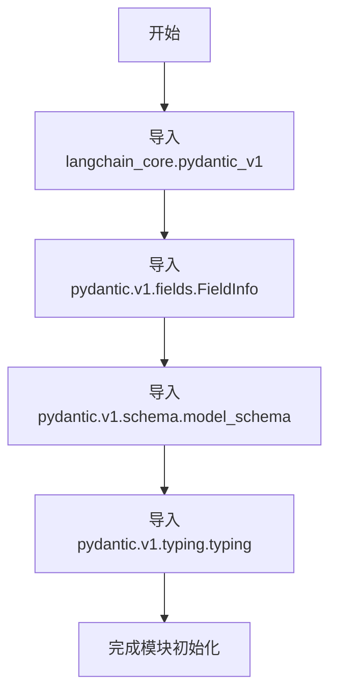

# `Langchain-Chatchat\libs\chatchat-server\chatchat\server\pydantic_v1.py` 详细设计文档

该代码文件主要用于导入langchain_core的Pydantic v1兼容层以及Pydantic v1的相关模块，为后续数据模型定义、字段信息和模式生成提供基础支持。

## 整体流程



## 类结构

```
无自定义类结构（仅包含导入语句）
```

## 全局变量及字段


    

## 全局函数及方法


## 关键组件


### langchain_core.pydantic_v1

LangChain框架提供的Pydantic v1兼容层，用于数据验证和类型定义，兼容旧版Pydantic v1的API接口。

### pydantic.v1.fields.FieldInfo

Pydantic v1的字段元数据类，用于定义模型字段的元信息，包括字段类型、默认值、验证器等属性。

### pydantic.v1.schema.model_schema

Pydantic v1的模型Schema生成工具函数，用于将Pydantic模型类转换为JSON Schema字典，用于API文档生成和数据验证。

### pydantic.v1.typing.typing

Pydantic v1的类型系统模块，提供类型检查和类型推断的支持，与标准库typing模块兼容。


## 问题及建议


### 已知问题

-   **通配符导入（Wildcard Import）**：使用 `from langchain_core.pydantic_v1 import *` 会污染命名空间，难以追踪具体使用了哪些类/函数，降低代码可读性和可维护性
-   **导入来源不明确**：`FieldInfo`、`model_schema`、`typing` 从 `pydantic.v1` 导入，但未明确使用场景，可能存在冗余导入
-   **Pydantic版本混用风险**：显式导入 `pydantic.v1`（v1版本）可能与 `langchain_core.pydantic_v1` 内部使用的Pydantic版本产生冲突，导致潜在的兼容性问题
-   **导入顺序不规范**：按照Python PEP 8规范，应先导入标准库，再导入第三方库，最后导入本地模块；且通配符导入应放在最后
-   **缺乏错误处理**：没有异常处理机制，如果 `pydantic.v1` 相关模块不存在会导致难以追踪的导入错误

### 优化建议

-   **明确具体导入**：将 `from langchain_core.pydantic_v1 import *` 改为具体的类导入，例如 `BaseModel, Field` 等需要使用的类
-   **整理导入顺序**：按照标准顺序组织导入（标准库 → 第三方库 → 项目自身模块），并移除未使用的导入
-   **统一Pydantic版本**：确认项目需求后，统一使用一个Pydantic版本，避免版本混用
-   **添加类型提示检查**：使用静态分析工具（如 mypy）验证导入和类型标注的正确性
-   **考虑迁移到Pydantic v2**：如果项目无版本限制，建议迁移到更新的Pydantic v2以获得性能提升和更多功能


## 其它


### 设计目标与约束

本模块旨在为上层应用提供基于Pydantic v1的数据验证和模式定义能力，同时保持与LangChain框架的兼容性。主要约束包括：必须使用Pydantic v1版本（而非v2），依赖langchain_core.pydantic_v1提供的基础设施，确保数据模型与LangChain生态系统的互操作性。

### 错误处理与异常设计

由于本模块仅包含导入语句，未实现具体业务逻辑，运行时错误主要来源于依赖库的版本不兼容或导入失败。异常处理策略应包括：ImportError用于捕获模块依赖缺失，AttributeError用于处理Pydantic版本不匹配问题，建议在应用入口添加版本检查和友好的错误提示信息。

### 数据流与状态机

本模块作为数据模型定义层，不涉及运行时数据流或状态机逻辑。其作用是为下游模块提供类型定义和数据验证规则，数据流方向为：外部输入 → Pydantic模型实例化 → 数据验证 → 业务逻辑处理。

### 外部依赖与接口契约

核心依赖包括：langchain_core.pydantic_v1（LangChain兼容的Pydantic封装）、pydantic.v1.fields.FieldInfo（Pydantic字段元信息）、pydantic.v1.schema.model_schema（模型schema生成）、pydantic.v1.typing（Pydantic类型工具）。接口契约遵循Pydantic v1规范，上层模块可通过继承BaseModel定义数据模型，通过Field函数定义字段约束。

### 版本兼容性说明

本模块明确依赖Pydantic v1版本，不支持Pydantic v2。LangChain_core的pydantic_v1模块提供了v1兼容接口，确保与LangChain生态的兼容性。使用时需注意避免混用v1和v2的API，导致行为不一致。

### 使用场景与用例

本模块适用于需要数据验证和模式定义且依赖LangChain框架的场景，典型用例包括：定义LLM输入输出模式、配置对象建模、API请求响应数据验证、状态管理数据结构定义等。

### 性能考虑

作为纯导入模块，不产生直接性能开销。实际使用Pydantic模型时，验证性能取决于模型复杂度，建议对高频调用的场景进行性能测试，避免过度复杂的嵌套模型定义。

### 安全考虑

本模块不直接处理敏感数据，但基于其构建的数据模型可能涉及用户输入验证。建议对外部输入实施严格的Pydantic字段约束（如字符串长度限制、类型校验、正则表达式验证），防止注入攻击和非法数据穿透。


    