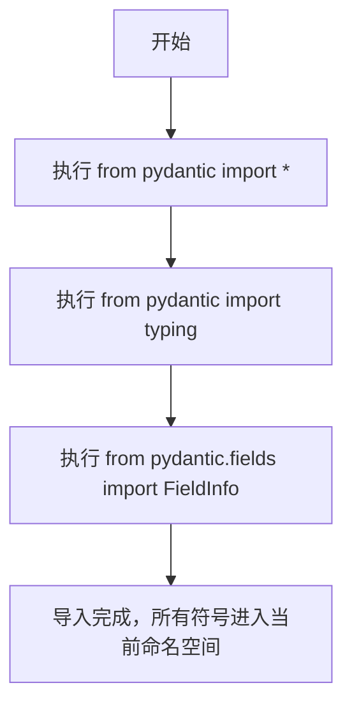

# `Langchain-Chatchat\libs\chatchat-server\chatchat\server\pydantic_v2.py` 详细设计文档

该代码文件是一个Pydantic库的导入模块，通过星号导入、typing子模块导入和FieldInfo类导入三种方式，将Pydantic核心功能引入当前作用域，为后续的数据模型定义和验证提供基础支持。

## 整体流程



## 类结构

```
pydantic
├── BaseModel (Pydantic数据模型基类)
├── Field (字段定义)
├── validator (验证器装饰器)
├── root_validator (根验证器)
├── typing (类型提示支持)
└── fields
    └── FieldInfo (字段元信息类)
```

## 全局变量及字段


    

## 全局函数及方法


## 关键组件


### Pydantic主模块导入

导入Pydantic核心功能模块，通过通配符导入方式获取所有公共API，用于数据模型定义、验证和序列化。

### Pydantic typing模块

导入Pydantic扩展的类型系统，提供更丰富的类型提示和验证功能，支持复杂的类型检查场景。

### FieldInfo字段信息类

从pydantic.fields模块导入FieldInfo类，用于定义Pydantic模型字段的元数据，包括字段默认值、验证规则、别名等配置信息。


## 问题及建议


### 已知问题

-   **通配符导入（Wildcard Import）**：使用 `from pydantic import *` 会导入所有公共API，导致命名空间污染，无法明确知道代码依赖了哪些具体功能，增加维护难度。
-   **冗余导入**：在已有通配符导入的情况下，再单独导入 `typing` 和 `FieldInfo` 是冗余的，且 `typing` 应优先使用 Python 标准库。
-   **非标准导入路径**：从 `pydantic` 直接导入 `typing` 模块不符合常规做法，应从 Python 标准库 `typing` 导入。
-   **缺乏明确依赖声明**：使用 `*` 导入使得代码的依赖不透明，难以进行静态分析和依赖管理。
-   **版本兼容风险**：通配符导入依赖 pydantic 的 `__all__` 变量，不同版本可能存在差异，导致潜在的兼容性问题。

### 优化建议

-   **使用显式导入**：将 `from pydantic import *` 替换为具体的导入，例如 `from pydantic import BaseModel, Field` 等，明确声明所需的类和函数。
-   **使用标准库 typing**：如需使用 typing 模块，应从 Python 标准库导入：`from typing import Any, Optional` 等。
-   **移除冗余导入**：删除单独导入的 `typing` 和 `FieldInfo`（如果确实需要 FieldInfo，可通过 `from pydantic import FieldInfo` 显式导入）。
-   **添加类型注解**：如果代码会进行扩展，建议添加适当的类型注解以提高代码可读性和可维护性。
-   **考虑使用 pyright/mypy**：在优化后运行静态类型检查工具，验证导入和类型声明的正确性。


## 其它


### 设计目标与约束

该代码片段作为数据验证模块的入口文件，通过导入pydantic库的核心功能，为后续的数据模型定义和验证提供基础支持。设计目标包括：确保数据类型安全、提供简洁的模型定义语法、支持复杂数据结构的验证。约束条件主要依赖于pydantic库的版本兼容性。

### 错误处理与异常设计

由于当前代码仅包含导入语句，未涉及实际的业务逻辑，因此错误处理机制需在后续使用该模块的代码中实现。基于pydantic的错误处理通常包括ValidationError（验证错误）、TypeError（类型错误）等异常捕获。建议在调用处统一进行异常处理，并提供友好的错误提示信息。

### 数据流与状态机

该模块作为导入层，不涉及数据流处理和状态机的实现。数据流将在使用pydantic模型的其他模块中体现，包括数据输入、验证、转换和输出的完整流程。

### 外部依赖与接口契约

主要外部依赖为pydantic库，需要确保pydantic版本在2.x或以上版本以支持FieldInfo的正常使用。接口契约方面，导入的typing模块用于类型注解支持，FieldInfo用于自定义字段配置。

### 安全性考虑

代码本身无直接安全风险，但建议在使用pydantic模型时注意：1）敏感数据脱敏处理；2）避免过度信任外部输入；3）模型字段设置合理的约束条件防止注入攻击。

### 性能要求

由于仅为导入代码，性能优化需在具体使用时考虑：1）模型定义尽量使用BaseModel而非BaseModel子类以提升验证速度；2）复杂验证逻辑可使用validator装饰器进行优化；3）大量数据验证时考虑使用model_validate批量处理。

### 兼容性设计

需要确保与pydantic 2.x版本的兼容性，FieldInfo在pydantic 2.x中已从pydantic.fields模块导出，旧版本（1.x）使用Field类。如需兼容多个版本，建议添加版本检测逻辑或使用兼容层。

### 配置管理

当前模块无配置需求，后续使用时可通过pydantic的BaseSettings类进行配置管理，支持环境变量、.env文件等多种配置来源。

### 测试策略

建议为使用该模块的代码编写单元测试，重点测试：1）模型字段验证逻辑；2）自定义validator功能；3）边界条件处理；4）异常场景覆盖。可使用pytest框架配合pydantic的__init__方法进行测试。

### 部署架构

该代码作为基础模块，通常以库的形式集成到主项目中部署，无需单独的部署配置。

### 监控与日志

导入语句本身无需监控，建议在使用层添加关键操作的日志记录，包括验证成功/失败次数、验证耗时等指标，便于运维监控。


    