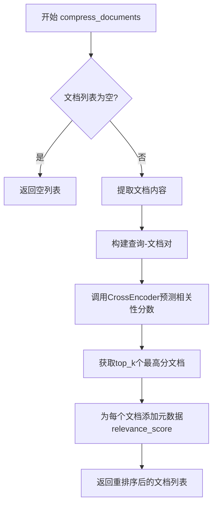

# `Langchain-Chatchat\libs\chatchat-server\chatchat\server\reranker\reranker.py` 详细设计文档

这是一个基于Sentence Transformers的CrossEncoder模型实现的LangChain文档重排序（Re-Rank）组件，通过对文档与查询的相关性进行评分，返回最相关的top-n文档，用于提升检索系统的准确性。

## 整体流程



## 类结构

```
BaseDocumentCompressor (LangChain抽象基类)
└── LangchainReranker (实现类)
```

## 全局变量及字段


### `LangchainReranker.model_name_or_path`
    
模型名称或路径

类型：`str`
    


### `LangchainReranker._model`
    
CrossEncoder模型实例(私有属性)

类型：`Any`
    


### `LangchainReranker.top_n`
    
返回的重排序文档数量

类型：`int`
    


### `LangchainReranker.device`
    
运行设备(cuda/cpu)

类型：`str`
    


### `LangchainReranker.max_length`
    
最大序列长度

类型：`int`
    


### `LangchainReranker.batch_size`
    
批处理大小

类型：`int`
    


### `LangchainReranker.num_workers`
    
数据加载工作线程数

类型：`int`
    
    

## 全局函数及方法


### `LangchainReranker.__init__`

该构造函数是 `LangchainReranker` 类的初始化方法，用于实例化 CrossEncoder 模型并配置文档重排序相关的参数。它接收模型路径、设备类型、批处理大小等配置，创建 CrossEncoder 模型实例，并通过调用父类构造函数完成对象的完整初始化。

参数：

- `model_name_or_path`：`str`，模型名称或路径，指定要加载的 CrossEncoder 模型
- `top_n`：`int = 3`，重排序后返回的顶部结果数量
- `device`：`str = "cuda"`，计算设备，默认为 CUDA 设备
- `max_length`：`int = 1024`，输入文本的最大 token 长度
- `batch_size`：`int = 32`，批处理大小，用于批量推理
- `num_workers`：`int = 0`，数据加载的工作进程数

返回值：`None`，构造函数不返回任何值，仅完成对象初始化

#### 流程图

```mermaid
flowchart TD
    A[开始 __init__] --> B[接收参数: model_name_or_path, top_n, device, max_length, batch_size, num_workers]
    B --> C[创建 CrossEncoder 模型实例]
    C --> D[_model = CrossEncoder model_name=model_name_or_path, max_length=max_length, device=device]
    D --> E[调用父类构造函数 super().__init__]
    E --> F[传递参数: top_n, model_name_or_path, device, max_length, batch_size, num_workers]
    F --> G[结束 __init__]
```

#### 带注释源码

```python
def __init__(
    self,
    model_name_or_path: str,  # 模型名称或路径，如 "BAAI/bge-reranker-large"
    top_n: int = 3,           # 重排序后返回的 Top-N 文档数量
    device: str = "cuda",     # 运行设备，默认为 CUDA
    max_length: int = 1024,   # 输入文本的最大长度（token 数）
    batch_size: int = 32,     # 批处理大小，用于模型推理
    # show_progress_bar: bool = None,  # 已注释：是否显示进度条
    num_workers: int = 0,     # 数据加载的工作进程数
    # activation_fct = None,           # 已注释：激活函数
    # apply_softmax = False,           # 已注释：是否应用 softmax
):
    # 注释掉的属性赋值，这些属性通过父类 Field 定义
    # self.top_n=top_n
    # self.model_name_or_path=model_name_or_path
    # self.device=device
    # self.max_length=max_length
    # self.batch_size=batch_size
    # self.show_progress_bar=show_progress_bar
    # self.num_workers=num_workers
    # self.activation_fct=activation_fct
    # self.apply_softmax=apply_softmax

    # 创建 CrossEncoder 模型实例并赋值给私有属性 _model
    # CrossEncoder 用于对 query-document 对进行打分排序
    self._model = CrossEncoder(
        model_name=model_name_or_path,  # 模型名称或本地路径
        max_length=max_length,          # 最大序列长度
        device=device                   # 运行设备（cuda/cpu）
    )
    # 调用父类 BaseDocumentCompressor 的构造函数
    # 完成 Pydantic 模型的字段验证和赋值
    super().__init__(
        top_n=top_n,                    # 重排序返回数量
        model_name_or_path=model_name_or_path,  # 模型路径
        device=device,                  # 设备
        max_length=max_length,          # 最大长度
        batch_size=batch_size,          # 批处理大小
        # show_progress_bar=show_progress_bar,    # 已注释
        num_workers=num_workers,        # 工作进程数
        # activation_fct=activation_fct,          # 已注释
        # apply_softmax=apply_softmax              # 已注释
    )
```


### `LangchainReranker.compress_documents`

该方法的核心功能是利用底层的 CrossEncoder 模型对输入的文档列表进行重排序（Rerank）。它接收查询语句和文档序列，通过计算查询与每个文档内容的相关性得分，筛选出得分最高的 Top N 个文档，并在返回的文档元数据中添加相关性分数。

参数：

- `self`：类的实例本身。
- `documents`：`Sequence[Document]`，需要被重排序的文档对象序列。
- `query`：`str`，用于计算文档相关性的查询字符串。
- `callbacks`：`Optional[Callbacks]`（可选），LangChain 标准的回调管理器，用于在压缩过程中执行回调（在该实现中未实际使用，视为潜在优化点）。

返回值：`Sequence[Document]`（返回重排序并筛选后的文档列表。每个文档的 `metadata` 中会被额外添加 `relevance_score` 字段来存储相关性得分。）

#### 流程图

```mermaid
flowchart TD
    A([开始]) --> B{检查 documents 是否为空}
    B -- 是 --> C[直接返回空列表 []]
    B -- 否 --> D[将 Sequence 转换为列表 doc_list]
    D --> E[提取所有文档的 page_content 组成列表 _docs]
    E --> F[构建句子对列表 sentence_pairs: 格式为 [[query, doc_content], ...]]
    F --> G[调用 self._model.predict 方法]
    G --> H[获取模型预测的得分结果 results]
    H --> I[计算 top_k: 取 self.top_n 和 results 长度的最小值]
    I --> J[调用 results.topk(top_k) 获取最高分的索引 indices 和 值 values]
    J --> K{遍历 indices 和 values}
    K --> L[根据 index 从 doc_list 中取出对应文档 doc]
    L --> M[更新 doc.metadata['relevance_score'] = value]
    M --> N[将 doc 加入 final_results 列表]
    K --> O{遍历结束?}
    O -- 是 --> P[返回 final_results]
```

#### 带注释源码

```python
def compress_documents(
    self,
    documents: Sequence[Document],
    query: str,
    callbacks: Optional[Callbacks] = None,
) -> Sequence[Document]:
    """
    使用 CrossEncoder 模型对文档进行重排序压缩。

    Args:
        documents: 需要重排序的文档序列。
        query: 用于计算相关性的查询。
        callbacks: 回调函数（当前版本未使用）。

    Returns:
        重排序并筛选后的文档列表。
    """
    # 1. 边界检查：如果文档列表为空，直接返回空列表以避免无效的 API 调用
    if len(documents) == 0:  
        return []
    
    # 2. 转换为列表以便通过索引访问
    doc_list = list(documents)
    
    # 3. 提取文档内容：只保留 page_content 部分用于计算得分
    _docs = [d.page_content for d in doc_list]
    
    # 4. 构建输入：将 query 与每个文档内容配对，形成 [query, doc] 结构
    sentence_pairs = [[query, _doc] for _doc in _docs]
    
    # 5. 模型预测：调用 CrossEncoder 获取交叉编码得分
    #    使用 convert_to_tensor=True 可以直接在 GPU 上进行张量运算（如果可用）
    results = self._model.predict(
        sentences=sentence_pairs,
        batch_size=self.batch_size,
        # show_progress_bar=self.show_progress_bar, # 已注释
        num_workers=self.num_workers,
        # activation_fct=self.activation_fct,       # 已注释
        # apply_softmax=self.apply_softmax,         # 已注释
        convert_to_tensor=True,
    )
    
    # 6. 确定 Top K：取用户指定的 top_n 和实际结果数的最小值，防止越界
    top_k = self.top_n if self.top_n < len(results) else len(results)

    # 7. 提取 Top K：获取得分最高的 k 个索引和具体的得分值
    values, indices = results.topk(top_k)
    
    final_results = []
    
    # 8. 遍历结果：根据索引组装文档，并附加元数据
    for value, index in zip(values, indices):
        doc = doc_list[index]
        # 将相关性得分写入元数据，供下游任务使用
        doc.metadata["relevance_score"] = value
        final_results.append(doc)
        
    return final_results
```

## 关键组件


### LangchainReranker

基于 sentence_transformers 的 CrossEncoder 模型实现的文档重排序压缩器，继承自 BaseDocumentCompressor，用于根据查询相关性对文档列表进行重新排序并返回 top_n 个最相关的文档。

### CrossEncoder 模型集成

使用 sentence_transformers 库的 CrossEncoder 作为底层模型，通过 predict 方法批量计算查询-文档对的相关性分数，支持 GPU/CPU 设备配置和批处理优化。

### compress_documents 方法

文档重排序的核心方法，接收文档序列和查询字符串，提取文档内容构建查询-文档对，调用模型预测相关性分数，使用 topk 操作获取最高分文档并附加元数据。

### 张量索引与结果筛选

使用 PyTorch 的 topk 方法从模型输出的张量中提取最高分数及其对应的索引，通过 zip 函数并行遍历分数和索引来实现结果的精确映射和筛选。

### 批量处理配置

支持 batch_size 和 num_workers 参数配置，实现批量文档处理以提高推理效率，支持进度条显示（代码中已注释）和自定义激活函数（已注释预留）。

### 设备与模型配置管理

通过 device 参数支持 cuda/cpu 切换，model_name_or_path 指定预训练模型路径，max_length 控制输入序列最大长度，形成完整的模型运行时配置体系。

### 文档元数据增强

在返回结果时，将计算得到的 relevance_score 附加到原始 Document 对象的 metadata 字典中，实现相关性分数的透传而不修改文档内容本身。

### 边界条件处理

在方法入口处增加空文档列表检查，避免对空列表调用模型 API 返回错误，实现防御性编程。


## 问题及建议


### 已知问题

- **文档字符串与实现不符**：类文档字符串声明使用 "Cohere Rerank API"，但实际实现使用的是 sentence-transformers 的 CrossEncoder 模型，这是一个本地模型而非 API 调用
- **字段定义不一致**：`model_name_or_path`、`top_n`、`device`、`max_length`、`batch_size`、`num_workers` 等字段使用 `Field()` 定义但未提供默认值，与 `__init__` 中 required 参数的定义存在矛盾
- **类型注解不规范**：`_model` 字段使用 `Any` 类型而非具体的 `CrossEncoder` 类型
- **缺少输入验证**：未对 `query` 参数进行空值检查，可能导致不必要的模型调用
- **缺少设备可用性检查**：默认设备为 "cuda"，但未检查 CUDA 是否可用，当 CUDA 不可用时会抛出异常
- **元数据修改风险**：直接修改 `doc.metadata["relevance_score"]` 未检查 metadata 是否为 None 或是否为字典类型
- **缺少资源管理**：未实现 `__del__` 方法或上下文管理器来释放 CrossEncoder 模型资源
- **异常处理缺失**：模型预测调用 `self._model.predict()` 缺少 try-except 包装，无法优雅处理预测过程中的异常
- **代码冗余**：存在大量注释掉的代码（如 `show_progress_bar`、`activation_fct`、`apply_softmax` 等），影响代码可读性

### 优化建议

- 修正类文档字符串，改为描述使用本地 CrossEncoder 模型进行文档重排序
- 为 `Field()` 字段提供合理的默认值或使用 `Field(..., description="...")` 明确字段用途
- 将 `_model` 的类型注解改为 `CrossEncoder`
- 在 `compress_documents` 方法开头添加 `query` 参数的空值检查
- 添加 CUDA 可用性检查或提供回退到 CPU 的逻辑
- 在修改 metadata 前添加类型检查：`if isinstance(doc.metadata, dict): doc.metadata["relevance_score"] = value`
- 考虑实现 `__del__` 方法释放模型资源，或实现 `__enter__`/`__exit__` 支持上下文管理器协议
- 为模型预测调用添加异常处理，捕获可能的预测异常并给出友好错误信息
- 清理注释掉的代码，或将其移至注释文档中说明为何保留

## 其它


### 设计目标与约束

本模块的设计目标是实现一个基于CrossEncoder模型的文档重排序组件，用于在检索增强生成（RAG）场景中对初始检索结果进行二次排序，提升最终结果的相关性。核心约束包括：1）必须继承自LangChain的BaseDocumentCompressor以保持接口一致性；2）模型运行需支持CPU和GPU设备；3）需支持批量处理以提升性能；4）输出结果需保留原始文档的metadata并添加relevance_score评分。

### 错误处理与异常设计

主要异常场景包括：1）模型加载失败（网络问题或模型路径无效）将抛出CrossEncoder初始化相关的异常；2）输入documents为空时直接返回空列表，避免无效API调用；3）batch_size过大可能导致显存溢出，需在文档数量巨大时分批处理；4）设备类型不支持时CrossEncoder会抛出异常。建议添加模型加载重试机制、输入参数校验（top_n需大于0、batch_size需大于0）、以及设备可用性预检查。

### 数据流与状态机

数据流如下：1）接收原始文档序列（Sequence[Document]）和查询字符串；2）将文档转换为[query, doc_content]的句子对列表；3）调用CrossEncoder模型预测相关性分数；4）使用topk操作选取分数最高的top_n个文档；5）为选中文档的metadata添加relevance_score并返回。整个过程为单向流式处理，无状态机切换，内部无分支状态。

### 外部依赖与接口契约

核心依赖包括：1）langchain.retrievers.document_compressors.base.BaseDocumentCompressor（必须继承的基类）；2）langchain_core.documents.Document（文档数据结构）；3）sentence_transformers.CrossEncoder（模型推理引擎）；4）pydantic.Field/PrivateAttr（配置管理）。对外接口遵循LangChain的DocumentCompressor协议，compress_documents方法签名需保持与BaseDocumentCompressor一致，输入documents为Sequence[Document]，query为str，返回Sequence[Document]。

### 性能考虑与优化空间

当前实现的主要性能瓶颈：1）每次调用都会将所有文档转换为句子对，内存占用与文档数量线性相关；2）未实现结果缓存机制，相同查询的重复计算无法复用；3）num_workers参数在某些环境下可能因GIL导致性能下降。优化方向：1）对于大规模文档集，考虑分批predict并逐步筛选；2）添加可选的结果缓存层；3）支持异步调用；4）可考虑使用量化模型降低显存需求。

### 配置管理与模型兼容性

模型配置通过构造函数参数传入，支持model_name_or_path（支持HuggingFace模型ID或本地路径）、device（cuda/cpu）、max_length、batch_size、num_workers等参数。兼容的模型类型包括BAAI/bge-reranker-base、bge-reranker-large等基于CrossEncoder架构的 reranker模型。不兼容GPT等自回归生成模型。

### 安全性考虑

当前代码无内置安全防护机制，需注意：1）模型路径需验证合法性，防止路径遍历攻击；2）query参数需进行长度限制，防止超长输入导致模型行为异常；3）如涉及远程模型下载，需验证HTTPS证书；4）文档内容可能包含敏感信息，metadata的relevance_score添加需确保不影响数据隔离。

### 测试策略建议

建议包含以下测试用例：1）单元测试：验证compress_documents对空输入、單文档、多文档的处理；2）集成测试：使用真实模型测试排序结果合理性；3）性能测试：对比不同batch_size、device的性能差异；4）边界测试：验证top_n大于文档数量时的行为；5）回归测试：确保修改后的排序结果与基线一致。

    