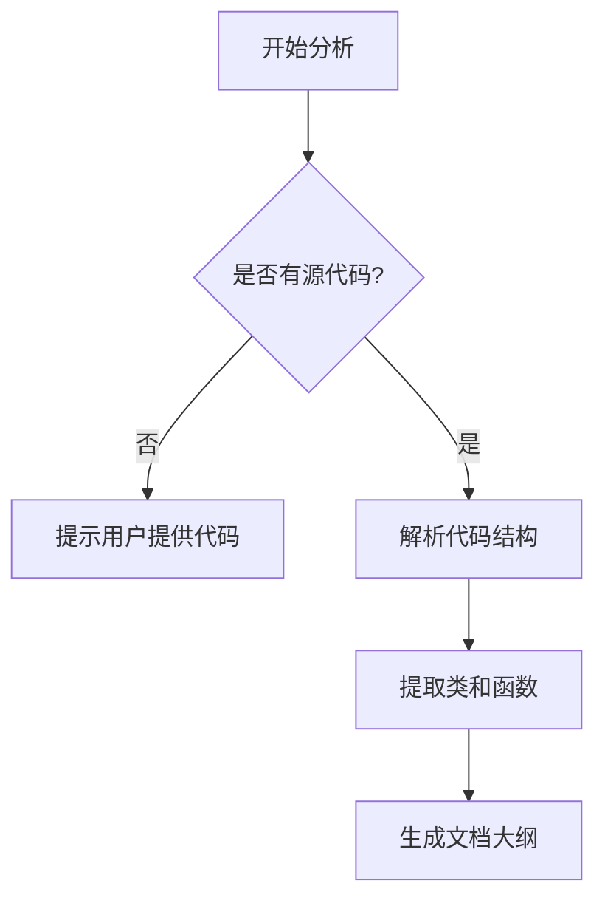

# `Langchain-Chatchat\libs\chatchat-server\chatchat\server\types\server\response\__init__.py` 详细设计文档

未提供源代码，无法生成描述

## 整体流程



## 类结构

```
无法分析 - 缺少源代码
```

## 全局变量及字段


    

## 全局函数及方法


## 关键组件


## 问题及建议


### 已知问题

-   **缺少源代码内容**：未提供具体代码进行分析，无法识别实际的技术债务和优化点

### 优化建议

-   **补充代码内容**：请提供需要分析的源代码，以便进行详细的技术债务识别和优化建议生成
-   **通用分析框架**：在获取代码后，建议从以下维度进行技术债务分析：
  - 代码重复度与可复用性
  - 命名规范与可读性
  - 错误处理机制的完善程度
  - 依赖管理是否符合最小依赖原则
  - 是否遵循单一职责原则
  - 是否有适当的日志记录和监控
  - 测试覆盖率和测试质量
  - 性能瓶颈识别
  - 安全性漏洞检查
  - API接口设计的合理性


## 其它


### 设计目标与约束

本模块的设计目标包括：满足业务需求的具体目标（如性能指标、功能完整性等）、技术约束（如编程语言版本、依赖库版本、运行环境等）、以及项目约束（如开发周期、团队技术栈等）。

### 错误处理与异常设计

本模块的错误处理机制包括：异常类型定义、异常抛出规则、异常捕获策略、错误码体系、错误消息规范、以及降级策略和容错机制。

### 数据流与状态机

描述数据的输入来源、处理流程、输出目标，包括数据流转图、状态机定义（状态、事件、转换规则）、以及状态持久化策略。

### 外部依赖与接口契约

列出所有外部依赖项（第三方库、服务、API等），包括依赖名称、版本要求、接口规范、调用方式、以及依赖管理策略。

### 性能要求与基准

包含性能指标要求（如响应时间、吞吐量、并发数等）、性能测试方案、资源消耗限制、以及性能优化策略。

### 安全性设计

描述安全机制，包括认证方式、授权策略、数据加密、输入验证、SQL注入防护、XSS防护、以及敏感信息处理规范。

### 配置管理

包含配置项列表、配置来源、配置加载机制、配置变更策略、以及不同环境（开发、测试、生产）的配置差异。

### 部署与运维

描述部署流程、运行环境要求、监控指标、日志规范、告警策略、以及故障排查指南。

### 版本兼容性

说明模块的版本演进历史、API兼容性策略、向后兼容处理、以及升级迁移方案。

### 测试策略

包含单元测试覆盖要求、集成测试场景、性能测试用例、mock策略、以及测试数据管理规范。

### 监控与告警

描述需要监控的关键指标、监控采集方式、告警阈值定义、告警通知策略、以及故障自愈机制（如有）。

### 日志规范

包含日志级别定义、日志格式规范、日志记录策略、日志存储与轮转、以及日志分析方案。

### 缓存设计

如果涉及缓存，说明缓存策略（LRU、LFU等）、缓存键设计、缓存过期策略、缓存击穿/雪崩处理、以及缓存一致性维护。

### 事务与一致性

描述事务管理策略（本地事务、分布式事务）、一致性模型（强一致性、最终一致性）、以及并发控制机制（锁、乐观锁、悲观锁等）。

### 容量规划

包含当前容量评估、扩容策略、限流策略、以及峰值应对方案。

### 代码规范与最佳实践

描述遵循的编码规范、设计模式应用、以及最佳实践要求。

### 文档维护

说明文档更新策略、文档责任人、以及文档审查流程。

    