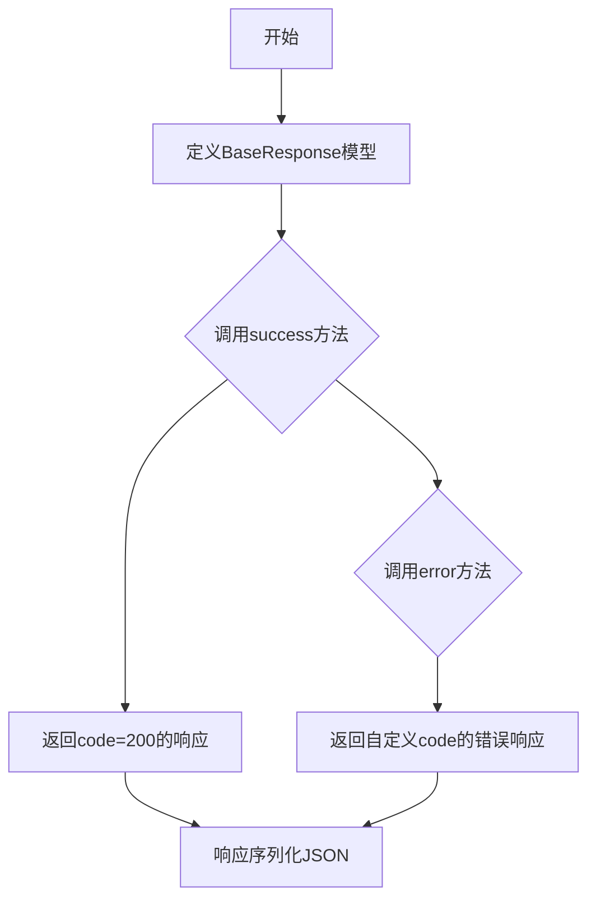
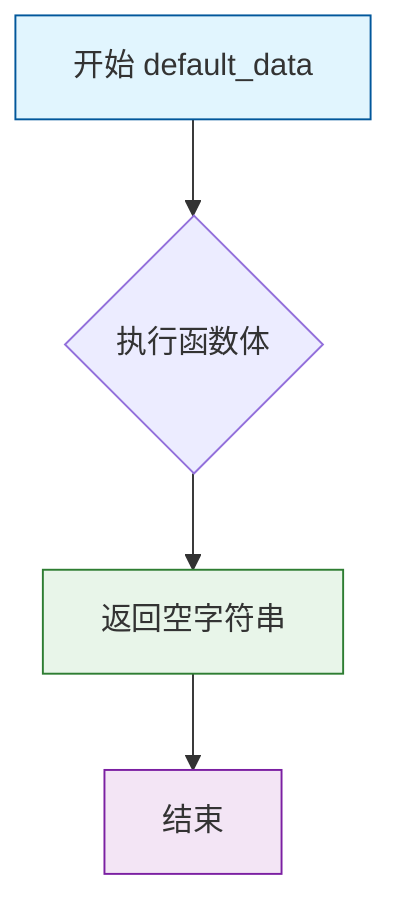
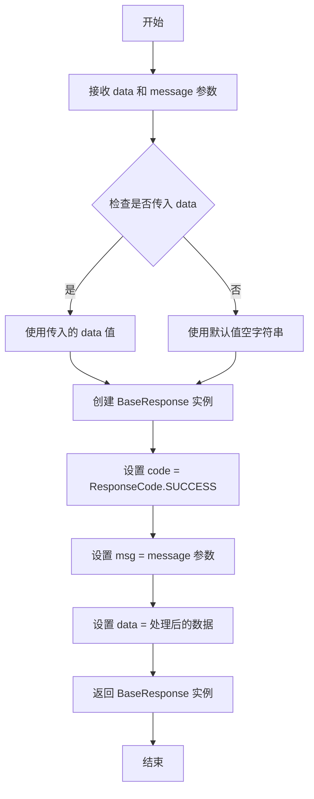
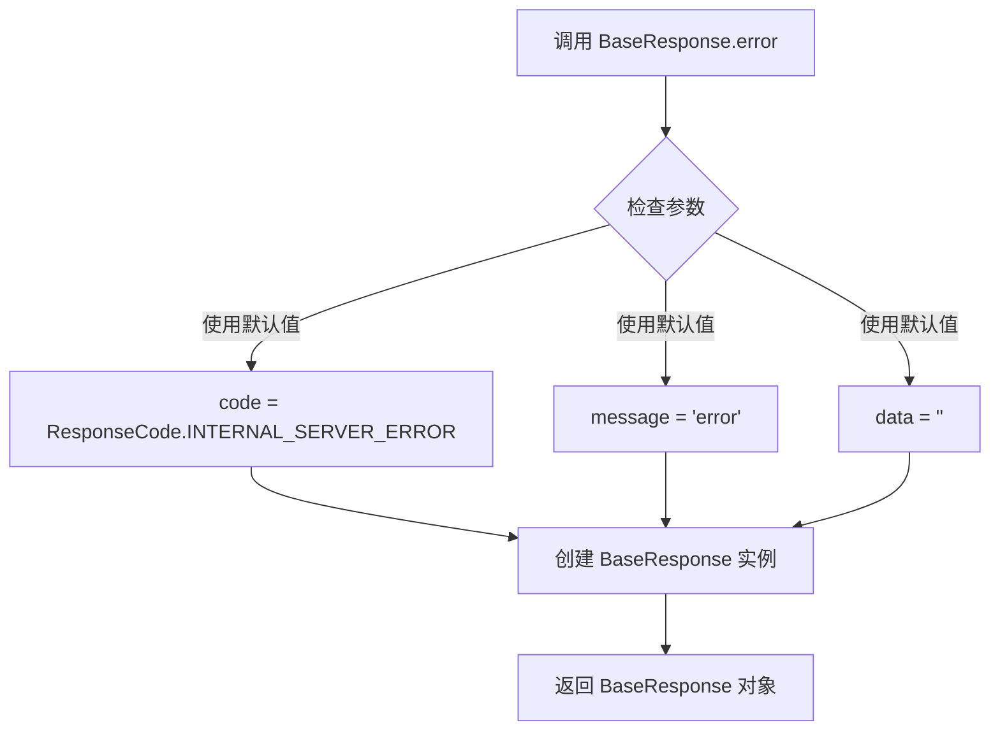
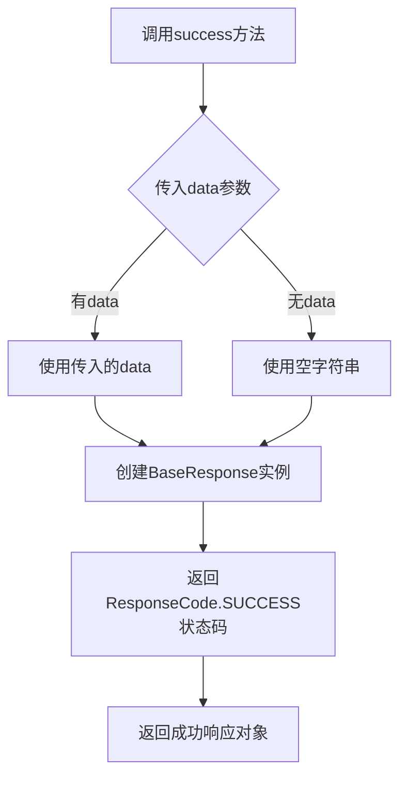
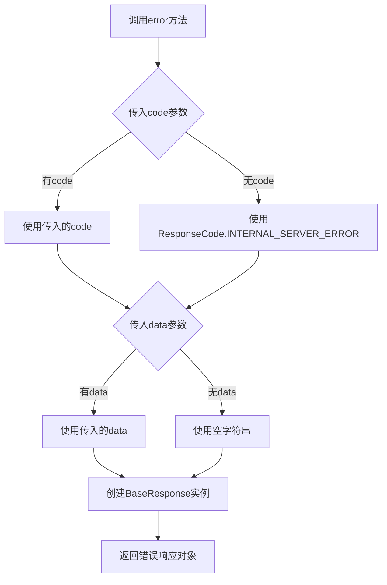

# `Langchain-Chatchat\libs\chatchat-server\chatchat\server\types\server\response\base.py` 详细设计文档

这是一个标准的API响应模型，封装了HTTP响应状态码、消息和响应数据，提供了便捷的success和error类方法用于快速构建统一格式的API响应。

## 整体流程



## 类结构

```
BaseResponse (Pydantic BaseModel)
├── 字段: code, msg, data
└── 类方法: success, error
```

## 全局变量及字段


### `BaseResponse.code`
    
API状态码

类型：`int`
    


### `BaseResponse.msg`
    
API状态消息

类型：`str`
    


### `BaseResponse.data`
    
API响应数据

类型：`Optional[Any]`
    
    

## 全局函数及方法


### `default_data`

这是一个默认工厂函数，用于为 Pydantic 模型的 Optional 字段提供默认值，当未提供数据时返回空字符串。

参数：此函数无参数。

返回值：`str`，返回空字符串 `""`，作为 API 响应的默认数据值。

#### 流程图



#### 带注释源码

```python
def default_data():
    """
    默认工厂函数，用于为 Pydantic Optional 字段提供默认值。
    
    当 BaseResponse 模型的 data 字段未显式提供值时，
    此函数会被 default_factory 调用，返回空字符串作为默认值。
    
    返回:
        str: 空字符串 ""
    """
    return ""
```


### `BaseResponse.success`

这是一个用于创建成功响应的类方法，通过接收可选的数据和消息参数，构建并返回一个表示成功状态的 `BaseResponse` 实例，其中状态码自动设置为成功响应码。

参数：

- `data`：`Optional[Any]`，可选的业务数据，默认为空字符串 ""
- `message`：`str`，成功消息文本，默认为 "success"

返回值：`BaseResponse`，包含成功状态码、消息和数据的新响应对象

#### 流程图



#### 带注释源码

```python
@classmethod
def success(cls, data: Optional[Any] = "", message: str = "success"):
    """
    创建成功响应的类方法
    
    参数:
        data: Optional[Any] - 响应携带的业务数据，默认为空字符串
              当需要返回具体业务数据时传入，否则使用默认值
        message: str - 成功状态的消息描述，默认为 "success"
                  用于向客户端传达操作成功的提示信息
    
    返回:
        BaseResponse - 包含成功状态码、消息和数据的响应对象实例
                      code 固定为 ResponseCode.SUCCESS
                      msg 为传入的 message 参数
                      data 为传入的 data 参数
    
    使用示例:
        # 返回默认成功响应
        BaseResponse.success()
        
        # 返回带数据的成功响应
        BaseResponse.success(data={"user_id": 123})
        
        # 返回自定义消息的成功响应
        BaseResponse.success(message="用户创建成功", data=new_user)
    """
    return BaseResponse(
        code=ResponseCode.SUCCESS,  # 使用预定义的成功响应码
        msg=message,               # 使用传入的消息或默认值 "success"
        data=data                  # 使用传入的数据或默认值 ""
    )
```


### `BaseResponse.error`

这是一个类方法，用于创建错误响应对象。当 API 请求失败时，使用此方法生成包含错误信息的标准响应结构。

参数：

- `data`：`Optional[Any]`，可选的错误数据，默认为空字符串
- `message`：`str`，错误消息，默认为 "error"
- `code`：`int`，HTTP 状态码，默认为 `ResponseCode.INTERNAL_SERVER_ERROR`（服务器内部错误）

返回值：`BaseResponse`，返回一个包含错误信息的 BaseResponse 实例

#### 流程图



#### 带注释源码

```python
@classmethod
def error(cls, data: Optional[Any] = "", message: str = "error", code=ResponseCode.INTERNAL_SERVER_ERROR):
    """
    创建错误响应的类方法
    
    参数:
        data: 可选的错误数据，默认为空字符串
        message: 错误消息字符串，默认为 "error"
        code: HTTP 状态码，使用 ResponseCode 枚举，默认为服务器内部错误
    
    返回:
        返回一个包含错误信息的 BaseResponse 实例
    """
    # 使用传入的参数或默认值创建 BaseResponse 实例
    return BaseResponse(code=code, msg=message, data=data)
```

## 关键组件


### 一段话描述

该代码定义了一个通用的API响应模型（BaseResponse），通过Pydantic实现数据验证和序列化，提供标准化的HTTP API响应结构，包含状态码、消息和可选数据字段，并封装了便捷的success和error类方法用于快速构建成功或错误响应。

### 文件的整体运行流程

1. 导入必要的类型注解和Pydantic依赖
2. 导入自定义的响应码枚举（ResponseCode）
3. 定义默认数据工厂函数default_data
4. 定义BaseResponse数据模型类，包含三个字段和两个类方法
5. 外部调用BaseResponse.success()或BaseResponse.error()创建响应实例
6. Pydantic自动进行数据验证和JSON Schema生成

### 类的详细信息

#### BaseResponse类

**类字段：**

| 名称 | 类型 | 描述 |
|------|------|------|
| code | int | API响应状态码，默认200表示成功 |
| msg | str | API响应消息，默认"success" |
| data | Optional[Union[Any, None]] | API响应数据，可为任意类型 |

**类方法：**

##### success - 成功响应工厂方法

| 属性 | 详情 |
|------|------|
| 方法名 | success |
| 参数名称 | data |
| 参数类型 | Optional[Any] = "" |
| 参数描述 | 成功响应时返回的数据，默认为空字符串 |
| 参数名称 | message |
| 参数类型 | str = "success" |
| 参数描述 | 成功消息文本，默认"success" |
| 返回值类型 | BaseResponse |
| 返回值描述 | 包含成功状态码和消息的响应对象 |



```python
@classmethod
def success(cls, data: Optional[Any] = "", message: str = "success"):
    return BaseResponse(code=ResponseCode.SUCCESS, msg=message, data=data)
```

##### error - 错误响应工厂方法

| 属性 | 详情 |
|------|------|
| 方法名 | error |
| 参数名称 | data |
| 参数类型 | Optional[Any] = "" |
| 参数描述 | 错误响应时返回的数据，可用于携带错误详情 |
| 参数名称 | message |
| 参数类型 | str = "error" |
| 参数描述 | 错误消息文本，默认"error" |
| 参数名称 | code |
| 参数类型 | 默认为ResponseCode.INTERNAL_SERVER_ERROR |
| 参数描述 | 错误状态码，默认500服务器内部错误 |
| 返回值类型 | BaseResponse |
| 返回值描述 | 包含错误状态码和消息的响应对象 |



```python
@classmethod
def error(cls, data: Optional[Any] = "", message: str = "error", code=ResponseCode.INTERNAL_SERVER_ERROR):
    return BaseResponse(code=code, msg=message, data=data)
```

### 全局变量和全局函数详细信息

| 名称 | 类型 | 描述 |
|------|------|------|
| default_data | Callable | 无参数函数，返回空字符串，作为data字段的默认值工厂 |

```python
def default_data():
    return ""
```

### 关键组件信息

### BaseResponse - 核心响应模型

统一的API响应结构封装类，封装了HTTP API的标准响应格式，包含状态码、消息和数据三部分，通过类方法提供便捷的响应构建能力。

### ResponseCode - 响应码枚举

外部依赖的响应状态码枚举类，定义了SUCCESS和INTERNAL_SERVER_ERROR等响应码常量，用于标准化API响应状态。

### default_data - 默认数据工厂

简单的无参数函数，返回空字符串，用于Pydantic Field的default_factory参数，为data字段提供默认值。

### 潜在的技术债务或优化空间

1. **泛型支持缺失**：BaseResponse未使用泛型，data字段类型为Any，无法在编译时提供类型安全保证，建议使用泛型类定义如BaseResponse[T]
2. **默认值设计不一致**：default_data返回空字符串而非None，但data字段类型为Optional，可能造成混淆
3. **缺少链式调用支持**：success和error方法返回BaseResponse实例而非self，无法进行链式调用
4. **error方法参数顺序**：code参数放在最后且有默认值，不如放在前面显式调用更清晰
5. **缺少日志记录**：成功和错误响应生成时没有日志记录，不利于调试和监控

### 其它项目

#### 设计目标与约束

- **设计目标**：提供统一的API响应格式，简化API响应构建流程
- **约束**：依赖Pydantic库和自定义ResponseCode枚举，必须保持与现有ResponseCode枚举的兼容性

#### 错误处理与异常设计

- 通过error类方法支持自定义错误码和错误消息
- data字段可携带错误详情，支持更丰富的错误信息传递
- 依赖Pydantic进行数据验证自动处理类型错误

#### 数据流与状态机

- 响应对象创建流程：调用类方法 → 传入参数 → 创建实例 → 返回JSON可序列化对象
- 无状态机设计，响应对象为无状态数据载体

#### 外部依赖与接口契约

- **Pydantic**：用于数据模型定义、验证和JSON Schema生成
- **ResponseCode**：外部枚举类，定义响应状态码常量，必须实现SUCCESS和INTERNAL_SERVER_ERROR属性
- **typing**：标准库类型注解支持


## 问题及建议


### 已知问题

-   **类型设计过于宽泛**：`data`字段类型为`Optional[Union[Any, None]]`，`Any`类型过于宽泛，缺乏具体的类型约束，导致类型安全性和可读性差
-   **默认值不一致**：`default_data()`函数返回空字符串`""`，而JSON Schema示例中`data`为`null`，实际行为与文档不符
-   **类方法参数冗余**：`success`和`error`方法都接收`data`参数，默认值为空字符串`""`，与`default_factory`功能重复
-   **类型注解缺失**：`error`类方法中`code`参数未指定类型注解
-   **字段验证不足**：`code`字段缺少对有效值范围的约束（如枚举验证），可能导致非法状态
-   **泛型支持缺失**：作为通用响应类，未使用泛型`Generic[T]`来约束`data`字段的具体类型

### 优化建议

-   **引入泛型支持**：使用`Generic[T]`定义响应类，使`data`字段有具体类型约束，如`BaseResponse[T] = BaseModel`
-   **统一默认值**：删除`default_factory`，直接使用`Field(default=None)`或根据实际场景统一为空字符串或`null`
-   **添加字段验证**：使用`Literal`或`Enum`对`code`字段进行值域约束，确保只允许有效的响应码
-   **补充类型注解**：为`error`方法的`code`参数添加类型注解`code: int`
-   **简化类型定义**：将`Optional[Union[Any, None]]`简化为`Optional[Any]`或使用具体的泛型类型


## 其它


### 设计目标与约束

本模块的设计目标是为整个聊天服务系统提供统一的API响应格式封装，确保前后端交互的数据结构一致性。约束条件包括：响应格式必须符合RESTful API规范，code字段必须为整数，msg字段必须为字符串，data字段可为任意类型或None。使用Pydantic v2进行数据验证，确保类型安全。

### 错误处理与异常设计

本模块本身不直接处理业务异常，而是通过success()和error()类方法构建标准响应对象。错误码定义在ResponseCode枚举中，包括SUCCESS(200)、INTERNAL_SERVER_ERROR(500)等。业务层捕获异常后，应调用BaseResponse.error()方法返回相应错误信息，错误消息应简洁明确，便于客户端定位问题。

### 数据流与状态机

BaseResponse作为数据传输对象(DTO)，不涉及复杂的状态机逻辑。其状态流转如下：初始化时默认为成功状态(code=200, msg="success", data=None)，通过success()方法可携带任意数据返回，通过error()方法可返回错误状态码和错误消息。data字段支持嵌套的字典或列表结构，可构建树形响应。

### 外部依赖与接口契约

主要依赖包括：pydantic库用于数据建模和验证，chatchat.server.constant.response_code模块提供响应码枚举。接口契约要求：所有HTTP响应必须返回BaseResponse或其子类的实例，code字段必须为有效的ResponseCode枚举值，msg字段最大长度建议不超过255字符，data字段可为None或符合JSON序列化要求的任意类型。

### 安全性考虑

本模块本身不直接涉及敏感数据处理，但需要注意：data字段在序列化时应避免包含敏感信息（如密码、密钥、Token等），建议业务层在返回数据前进行脱敏处理。error()方法返回的错误消息不应暴露内部系统细节（如堆栈信息、文件路径等），防止信息泄露风险。

### 性能考虑

BaseResponse基于Pydantic的BaseModel，性能开销主要来自数据验证和序列化。对于高频接口，建议：1)合理使用data字段类型注解，避免Any类型导致的动态类型推断开销；2)对于大量列表数据返回，考虑分页封装；3)可在Pydantic配置中启用model_config的frozen=True提升序列化性能。

### 测试策略

建议编写以下测试用例：1)单元测试验证success()方法正确构建成功响应；2)单元测试验证error()方法正确构建错误响应；3)集成测试验证响应对象可正确序列化为JSON格式；4)边界测试验证data字段传入None、空字符串、空列表、空字典等边界情况；5)类型测试验证Pydantic模型验证功能。

### 使用示例

```python
# 成功响应示例
response = BaseResponse.success(data={"user_id": 123, "name": "张三"})
# 输出: {"code": 200, "msg": "success", "data": {"user_id": 123, "name": "张三"}}

# 自定义消息的成功响应
response = BaseResponse.success(data=[1, 2, 3], message="数据查询成功")
# 输出: {"code": 200, "msg": "数据查询成功", "data": [1, 2, 3]}

# 错误响应示例
response = BaseResponse.error(message="用户不存在", code=404)
# 输出: {"code": 404, "msg": "用户不存在", "data": ""}

# 默认错误响应
response = BaseResponse.error()
# 输出: {"code": 500, "msg": "error", "data": ""}
```

### 版本历史与变更记录

暂无版本历史记录。建议在后续迭代中记录：1)版本号；2)变更日期；3)变更描述；4)变更原因。如未来可能扩展：1)添加更多预设错误码；2)支持响应拦截器；3)添加响应日志记录功能；4)支持泛型data类型定义。


    