# `Langchain-Chatchat\libs\chatchat-server\chatchat\server\utils.py` 详细设计文档

该模块是ChatChat项目的核心工具库，提供模型配置管理、API封装、异步处理、FastAPI离线文档支持、HTTP客户端管理、提示模板加载以及多线程/多进程任务执行等关键功能，支撑整个系统的模型调用和知识库检索能力。

## 整体流程

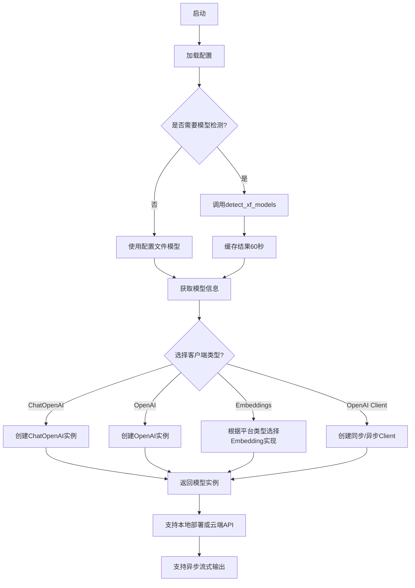

## 类结构

```
MsgType (消息类型常量类)
BaseResponse (Pydantic基础响应模型)
ListResponse (Pydantic列表响应模型)
ChatMessage (Pydantic聊天消息模型)
```

## 全局变量及字段


### `logger`
    
项目全局日志记录器，用于输出各类日志信息

类型：`Logger`
    


### `MsgType.TEXT`
    
文本消息类型常量，值为1

类型：`int`
    


### `MsgType.IMAGE`
    
图片消息类型常量，值为2

类型：`int`
    


### `MsgType.AUDIO`
    
音频消息类型常量，值为3

类型：`int`
    


### `MsgType.VIDEO`
    
视频消息类型常量，值为4

类型：`int`
    


### `BaseResponse.code`
    
API状态码，默认为200表示成功

类型：`int`
    


### `BaseResponse.msg`
    
API状态消息，默认为success

类型：`str`
    


### `BaseResponse.data`
    
API返回的任意类型数据，可为None

类型：`Any`
    


### `ListResponse.code`
    
API状态码，默认为200表示成功

类型：`int`
    


### `ListResponse.msg`
    
API状态消息，默认为success

类型：`str`
    


### `ListResponse.data`
    
API返回的数据列表

类型：`List[Any]`
    


### `ChatMessage.question`
    
用户提出的问题文本

类型：`str`
    


### `ChatMessage.response`
    
系统生成的回复文本

类型：`str`
    


### `ChatMessage.history`
    
对话历史记录，包含多轮问答对

类型：`List[List[str]]`
    


### `ChatMessage.source_documents`
    
来源文档列表及其相关性得分

类型：`List[str]`
    
    

## 全局函数及方法


### `wrap_done`

该函数是一个异步包装函数，用于将一个可等待对象（awaitable）与一个 `asyncio.Event` 结合，在可等待对象完成（无论成功或异常）时发出信号通知。

参数：

- `fn`：`Awaitable`，需要被等待执行的可等待对象（协程或_future_）
- `event`：`asyncio.Event`，用于在 `fn` 执行完成或发生异常时发出信号的异步事件

返回值：`None`，该函数没有显式返回值

#### 流程图

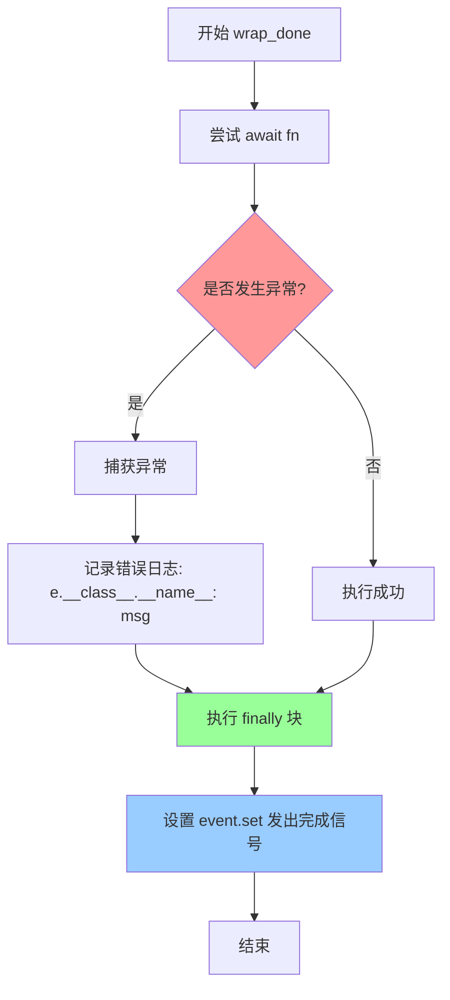

#### 带注释源码

```python
async def wrap_done(fn: Awaitable, event: asyncio.Event):
    """Wrap an awaitable with a event to signal when it's done or an exception is raised."""
    try:
        # 尝试执行传入的可等待对象 fn
        await fn
    except Exception as e:
        # 如果执行过程中发生异常，记录错误日志
        msg = f"Caught exception: {e}"
        logger.error(f"{e.__class__.__name__}: {msg}")
    finally:
        # 无论成功还是异常，都需要设置 event 以通知调用者已完成
        # Signal the aiter to stop.
        event.set()
```


### `get_base_url`

该函数用于从完整的URL中提取基础URL（scheme + netloc），即去掉路径、查询参数等，仅保留协议和域名部分。

参数：

- `url`：`str`，需要进行解析的完整URL字符串

返回值：`str`，返回提取后的基础URL，格式为 `scheme://netloc`（已去除末尾的斜杠）

#### 流程图

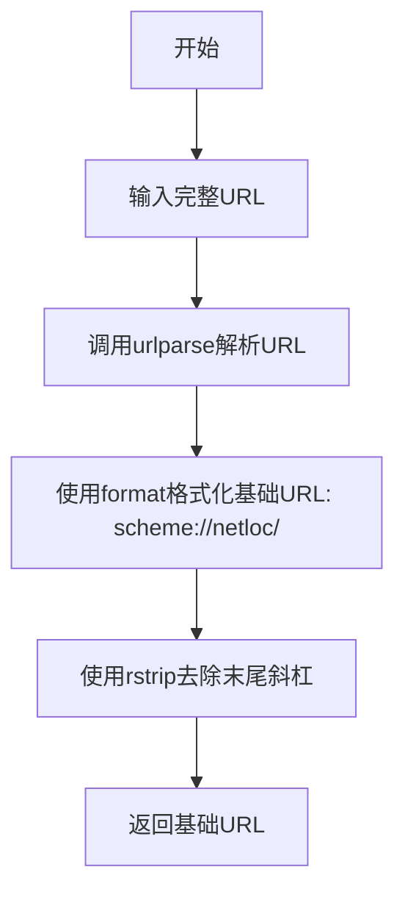

#### 带注释源码

```python
def get_base_url(url):
    parsed_url = urlparse(url)  # 解析url，得到ParseResult对象
    # 格式化基础url，组合协议和域名，末尾加斜杠
    base_url = '{uri.scheme}://{uri.netloc}/'.format(uri=parsed_url)
    # 去除末尾的斜杠，返回标准的基础URL格式
    return base_url.rstrip('/')
```


### `get_config_platforms`

获取配置的模型平台，将 Pydantic 模型配置转换为字典格式返回。

参数：无

返回值：`Dict[str, Dict]`，返回平台名称（platform_name）到平台配置字典的映射，用于后续获取模型信息。

#### 流程图

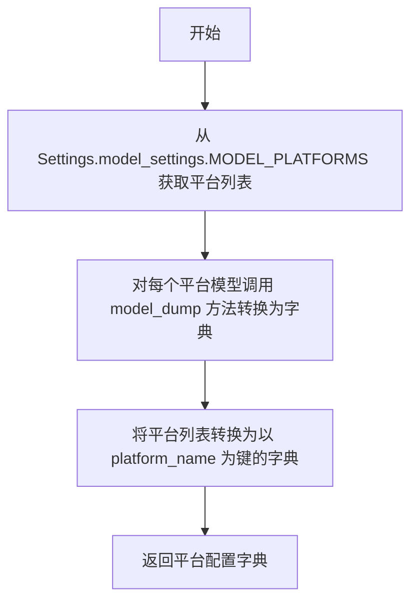

#### 带注释源码

```python
def get_config_platforms() -> Dict[str, Dict]:
    """
    获取配置的模型平台，会将 pydantic model 转换为字典。
    """
    # 从设置中获取模型平台列表，每个平台是 Pydantic 模型对象
    # 通过 model_dump() 方法将每个 Pydantic 模型转换为字典
    platforms = [m.model_dump() for m in Settings.model_settings.MODEL_PLATFORMS]
    
    # 将平台列表转换为字典，键为 platform_name，值为平台配置字典
    # 例如: {"openai": {"platform_name": "openai", "platform_type": "openai", ...}, ...}
    return {m["platform_name"]: m for m in platforms}
```


### `detect_xf_models`

该函数用于自动检测 Xinference 平台上的可用模型，通过 RESTfulClient 连接 xf_url 获取模型列表，并根据模型类型（LLM、embedding、image、speech 等）进行分类过滤。函数使用 LRU 缓存机制（有效期 60 秒）避免频繁请求。

参数：

- `xf_url`：`str`，Xinference 服务的 URL 地址

返回值：`Dict[str, List[str]]`，返回按模型类型分类的字典，键为模型类型名称（如 `llm_models`、`embed_models` 等），值为该类型下的模型名称列表

#### 流程图

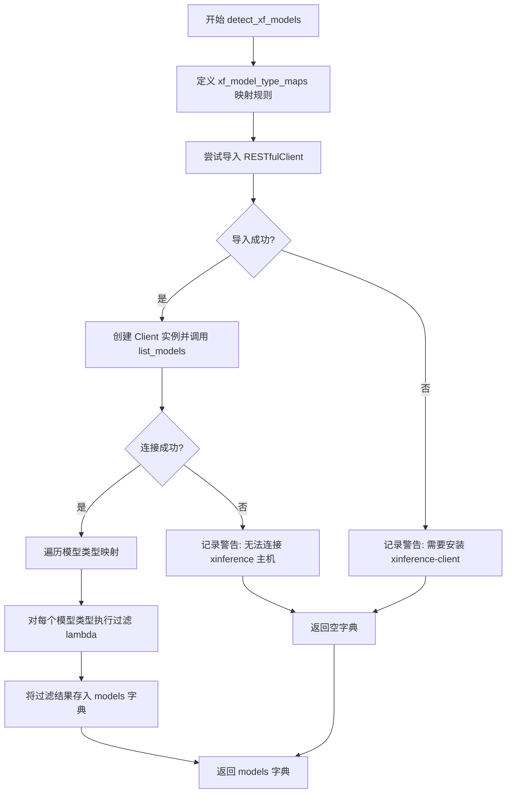

#### 带注释源码

```python
@cached(max_size=10, ttl=60, algorithm=CachingAlgorithmFlag.LRU)
def detect_xf_models(xf_url: str) -> Dict[str, List[str]]:
    '''
    use cache for xinference model detecting to avoid:
    - too many requests in short intervals
    - multiple requests to one platform for every model
    the cache will be invalidated after one minute
    '''
    # 定义模型类型与过滤规则的映射字典
    # 键为模型类型名称，值为 lambda 函数用于从模型字典中筛选对应类型的模型
    xf_model_type_maps = {
        # 筛选普通 LLM 模型（不含视觉能力）
        "llm_models": lambda xf_models: [k for k, v in xf_models.items()
                                         if "LLM" == v["model_type"]
                                         and "vision" not in v["model_ability"]],
        # 筛选 embedding 模型
        "embed_models": lambda xf_models: [k for k, v in xf_models.items()
                                           if "embedding" == v["model_type"]],
        # 筛选 text2image 模型
        "text2image_models": lambda xf_models: [k for k, v in xf_models.items()
                                                if "image" == v["model_type"]],
        # 筛选 image2image 模型
        "image2image_models": lambda xf_models: [k for k, v in xf_models.items()
                                                 if "image" == v["model_type"]],
        # 筛选 image2text 模型（带视觉能力的 LLM）
        "image2text_models": lambda xf_models: [k for k, v in xf_models.items()
                                                if "LLM" == v["model_type"]
                                                and "vision" in v["model_ability"]],
        # 筛选 rerank 模型
        "rerank_models": lambda xf_models: [k for k, v in xf_models.items()
                                            if "rerank" == v["model_type"]],
        # 筛选 speech2text 模型
        "speech2text_models": lambda xf_models: [k for k, v in xf_models.items()
                                                 if v.get(list(XF_MODELS_TYPES["speech2text"].keys())[0])
                                                 in XF_MODELS_TYPES["speech2text"].values()],
        # 筛选 text2speech 模型
        "text2speech_models": lambda xf_models: [k for k, v in xf_models.items()
                                                 if v.get(list(XF_MODELS_TYPES["text2speech"].keys())[0])
                                                 in XF_MODELS_TYPES["text2speech"].values()],
    }
    models = {}
    try:
        # 尝试导入 xinference_client 并创建 RESTfulClient 实例
        from xinference_client import RESTfulClient as Client
        xf_client = Client(xf_url)
        # 获取平台上所有可用模型
        xf_models = xf_client.list_models()
        # 遍历模型类型映射，对每个类型执行过滤函数
        for m_type, filter in xf_model_type_maps.items():
            models[m_type] = filter(xf_models)
    except ImportError:
        # 处理 xinference-client 未安装的情况
        logger.warning('auto_detect_model needs xinference-client installed. '
                       'Please try "pip install xinference-client". ')
    except requests.exceptions.ConnectionError:
        # 处理无法连接到 xinference 主机的情况
        logger.warning(f"cannot connect to xinference host: {xf_url}, please check your configuration.")
    except Exception as e:
        # 处理其他连接异常
        logger.warning(f"error when connect to xinference server({xf_url}): {e}")
    return models
```


### `get_config_models`

该函数用于获取系统中已配置的模型列表，支持按模型名称、模型类型和平台名称进行过滤，并可自动检测 Xinference 平台的模型。

参数：

- `model_name`：`str`，可选，指定要获取的模型名称，若为 `None` 则返回所有匹配的模型
- `model_type`：`Optional[Literal["llm", "embed", "text2image", "image2image", "image2text", "rerank", "speech2text", "text2speech"]]`，可选，指定模型类型，若为 `None` 则返回所有类型的模型
- `platform_name`：`str`，可选，指定平台名称，若为 `None` 则返回所有平台的模型

返回值：`Dict[str, Dict]`，返回模型配置字典，键为模型名称，值包含平台名称、平台类型、模型类型、模型名称、API 基础 URL、API 密钥和代理配置

#### 流程图

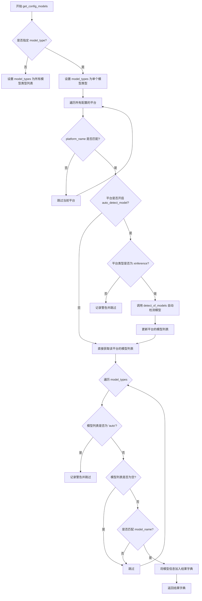

#### 带注释源码

```python
def get_config_models(
        model_name: str = None,
        model_type: Optional[Literal[
            "llm", "embed", "text2image", "image2image", "image2text", "rerank", "speech2text", "text2speech"
        ]] = None,
        platform_name: str = None,
) -> Dict[str, Dict]:
    """
    获取配置的模型列表，返回值为:
    {model_name: {
        "platform_name": xx,
        "platform_type": xx,
        "model_type": xx,
        "model_name": xx,
        "api_base_url": xx,
        "api_key": xx,
        "api_proxy": xx,
    }}
    """
    # 初始化结果字典
    result = {}
    
    # 确定要查询的模型类型列表
    if model_type is None:
        # 未指定类型时，查询所有模型类型
        model_types = [
            "llm_models",
            "embed_models",
            "text2image_models",
            "image2image_models",
            "image2text_models",
            "rerank_models",
            "speech2text_models",
            "text2speech_models",
        ]
    else:
        # 指定类型时，只查询对应类型
        model_types = [f"{model_type}_models"]

    # 遍历所有配置的模型平台
    for m in list(get_config_platforms().values()):
        # 如果指定了平台名称，进行过滤
        if platform_name is not None and platform_name != m.get("platform_name"):
            continue

        # 处理支持自动检测模型的平台（如 Xinference）
        if m.get("auto_detect_model"):
            # TODO：当前仅支持 xinference 自动检测模型
            if not m.get("platform_type") == "xinference":
                logger.warning(f"auto_detect_model not supported for {m.get('platform_type')} yet")
                continue
            
            # 获取平台的基础 URL
            xf_url = get_base_url(m.get("api_base_url"))
            # 调用自动检测函数获取模型列表
            xf_models = detect_xf_models(xf_url)
            
            # 将检测到的模型更新到平台配置中
            for m_type in model_types:
                m[m_type] = xf_models.get(m_type, [])

        # 遍历每种模型类型
        for m_type in model_types:
            models = m.get(m_type, [])
            
            # 检查是否设置了 "auto" 但未启用自动检测
            if models == "auto":
                logger.warning("you should not set `auto` without auto_detect_model=True")
                continue
            elif not models:
                continue
            
            # 遍历每个模型
            for m_name in models:
                # 检查是否匹配指定的模型名称
                if model_name is None or model_name == m_name:
                    # 构建模型信息字典
                    result[m_name] = {
                        "platform_name": m.get("platform_name"),
                        "platform_type": m.get("platform_type"),
                        "model_type": m_type.split("_")[0],  # 从 "llm_models" 提取 "llm"
                        "model_name": m_name,
                        "api_base_url": m.get("api_base_url"),
                        "api_key": m.get("api_key"),
                        "api_proxy": m.get("api_proxy"),
                    }
    
    return result
```


### `get_model_info`

获取配置的模型信息，主要是 api_base_url, api_key。如果指定 multiple=True，则返回所有重名模型；否则仅返回第一个。

参数：

- `model_name`：`str`，模型名称（可选）
- `platform_name`：`str`，平台名称（可选）
- `multiple`：`bool`，是否返回所有重名模型，默认为 False

返回值：`Dict`，模型信息字典，包含平台名称、平台类型、模型类型、模型名称、API基础URL、API密钥和代理配置。

#### 流程图

```mermaid
flowchart TD
    A[开始 get_model_info] --> B[调用 get_config_models 获取模型配置]
    B --> C{结果数量 > 0?}
    C -->|否| D[返回空字典 {}]
    C -->|是| E{multiple == True?}
    E -->|是| F[返回完整 result 字典]
    E -->|否| G[返回 result 字典中的第一个值 list(result.values())[0]]
    F --> H[结束]
    G --> H
    D --> H
```

#### 带注释源码

```python
def get_model_info(
        model_name: str = None, platform_name: str = None, multiple: bool = False
) -> Dict:
    """
    获取配置的模型信息，主要是 api_base_url, api_key
    如果指定 multiple=True，则返回所有重名模型；否则仅返回第一个
    """
    # 调用 get_config_models 获取符合条件的所有模型配置
    result = get_config_models(model_name=model_name, platform_name=platform_name)
    
    # 检查是否有符合条件的模型
    if len(result) > 0:
        # 如果有符合条件的模型
        if multiple:
            # 如果 multiple=True，返回所有同名模型的字典
            return result
        else:
            # 如果 multiple=False，只返回第一个匹配的模型信息
            return list(result.values())[0]
    else:
        # 如果没有符合条件的模型，返回空字典
        return {}
```


### `get_default_llm`

获取默认的LLM模型名称，如果配置的默认模型不可用，则自动选择第一个可用的LLM模型。

参数： 无

返回值：`str`，返回默认的LLM模型名称

#### 流程图

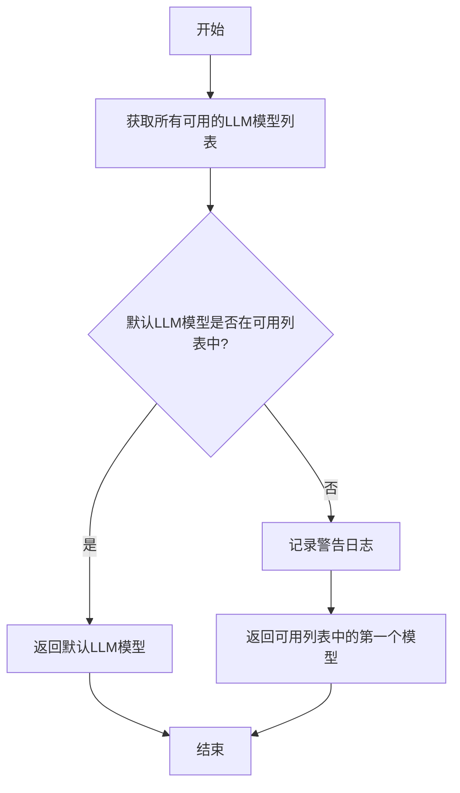

#### 带注释源码

```python
def get_default_llm():
    """
    获取默认的LLM模型名称。
    
    此函数会检查Settings.model_settings.DEFAULT_LLM_MODEL是否在
    配置的可用LLM模型列表中。如果存在则返回该默认模型；
    如果不存在则记录警告并返回可用列表中的第一个模型。
    
    Returns:
        str: 默认的LLM模型名称
    """
    # 获取所有可用的LLM模型名称列表
    available_llms = list(get_config_models(model_type="llm").keys())
    
    # 检查默认LLM模型是否在可用列表中
    if Settings.model_settings.DEFAULT_LLM_MODEL in available_llms:
        # 如果默认模型可用，直接返回
        return Settings.model_settings.DEFAULT_LLM_MODEL
    else:
        # 默认模型不可用，记录警告日志并返回第一个可用模型
        logger.warning(
            f"default llm model {Settings.model_settings.DEFAULT_LLM_MODEL} is not found "
            f"in available llms, using {available_llms[0]} instead"
        )
        return available_llms[0]
```


### `get_default_embedding`

该函数用于获取系统中配置的默认 embedding 模型名称。它首先查询所有可用的 embedding 模型，然后检查默认模型是否在可用列表中，如果不在则使用可用列表中的第一个模型并记录警告日志。

参数：此函数无参数。

返回值：`str`，返回默认 embedding 模型的名称字符串。

#### 流程图

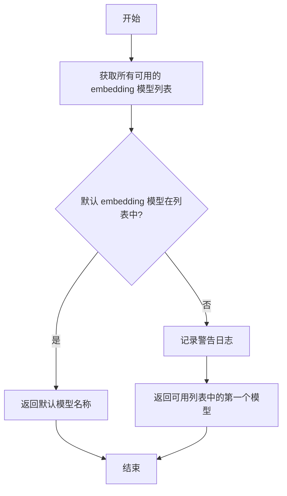

#### 带注释源码

```python
def get_default_embedding():
    """
    获取默认的 embedding 模型名称。
    如果配置的默认模型不可用，则使用可用模型中的第一个并记录警告。
    """
    # 获取所有已配置的 embedding 模型列表（返回模型名称列表）
    available_embeddings = list(get_config_models(model_type="embed").keys())
    
    # 检查默认 embedding 模型是否在可用模型列表中
    if Settings.model_settings.DEFAULT_EMBEDDING_MODEL in available_embeddings:
        # 如果默认模型可用，直接返回默认模型名称
        return Settings.model_settings.DEFAULT_EMBEDDING_MODEL
    else:
        # 如果默认模型不可用，记录警告日志并使用第一个可用的模型
        logger.warning(f"default embedding model {Settings.model_settings.DEFAULT_EMBEDDING_MODEL} is not found in "
                       f"available embeddings, using {available_embeddings[0]} instead")
        return available_embeddings[0]
```


### `get_history_len`

该函数用于获取聊天历史的最大长度配置。它首先尝试从全局设置 `HISTORY_LEN` 中获取值，如果该值未设置或为空，则回退到从 LLM 模型配置中的 `action_model` 的 `history_len` 字段获取。

**参数：** 无

**返回值：** `int`，返回聊天历史的最大长度

#### 流程图

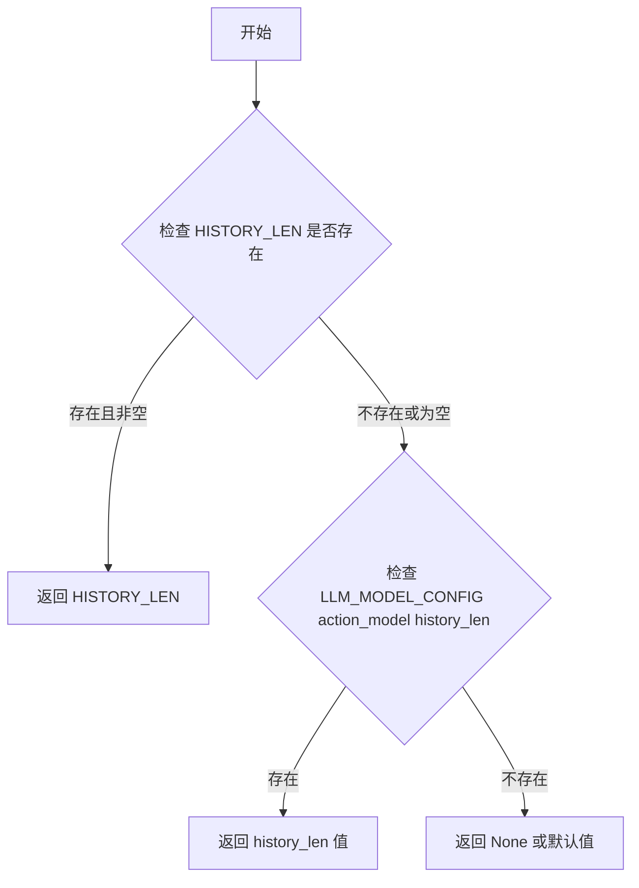

#### 带注释源码

```python
def get_history_len() -> int:
    """
    获取聊天历史的最大长度。
    优先从全局 HISTORY_LEN 配置获取，如果未配置则从 LLM_MODEL_CONFIG 中获取。
    
    Returns:
        int: 聊天历史的最大长度
    """
    # 使用 or 短路逻辑：如果 HISTORY_LEN 存在且非空，则使用该值
    # 否则使用 LLM_MODEL_CONFIG["action_model"]["history_len"] 的值
    return (Settings.model_settings.HISTORY_LEN or
            Settings.model_settings.LLM_MODEL_CONFIG["action_model"]["history_len"])
```


### `get_ChatOpenAI`

该函数用于根据配置的模型信息创建一个 ChatOpenAI 实例，支持本地包装 API 和远程 API 两种调用方式，并处理异常情况。

参数：

- `model_name`：`str`，要使用的模型名称，默认为 `get_default_llm()` 的返回值
- `temperature`：`float`，生成文本的温度参数，默认为 `Settings.model_settings.TEMPERATURE`
- `max_tokens`：`int`，最大生成的令牌数，默认为 `Settings.model_settings.MAX_TOKENS`
- `streaming`：`bool`，是否启用流式输出，默认为 `True`
- `callbacks`：`List[Callable]`，回调函数列表，默认为空列表 `[]`
- `verbose`：`bool`，是否启用详细输出，默认为 `True`
- `local_wrap`：`bool`，是否使用本地包装的 API，默认为 `False`
- `**kwargs`：`Any`，额外的关键字参数，将传递给 ChatOpenAI

返回值：`ChatOpenAI`，返回创建的 ChatOpenAI 实例，如果创建失败则返回 `None`

#### 流程图

```mermaid
flowchart TD
    A[开始 get_ChatOpenAI] --> B[获取模型信息: get_model_info(model_name)]
    B --> C[构建参数字典 params]
    C --> D[移除值为 None 的参数]
    D --> E{local_wrap?}
    E -->|True| F[设置本地 API: api_address()/v1, key=EMPTY]
    E -->|False| G[设置远程 API: api_base_url, api_key, api_proxy]
    F --> H[创建 ChatOpenAI 实例]
    G --> H
    H --> I{创建成功?}
    I -->|Yes| J[返回 ChatOpenAI 实例]
    I -->|No| K[记录异常日志, 返回 None]
    J --> L[结束]
    K --> L
```

#### 带注释源码

```python
def get_ChatOpenAI(
        model_name: str = get_default_llm(),  # 模型名称，默认获取默认LLM
        temperature: float = Settings.model_settings.TEMPERATURE,  # 温度参数
        max_tokens: int = Settings.model_settings.MAX_TOKENS,  # 最大令牌数
        streaming: bool = True,  # 是否流式输出
        callbacks: List[Callable] = [],  # 回调函数列表
        verbose: bool = True,  # 是否详细输出
        local_wrap: bool = False,  # 是否使用本地包装的API
        **kwargs: Any,  # 额外关键字参数
) -> ChatOpenAI:
    # 1. 获取模型信息，包括平台、API地址、密钥等
    model_info = get_model_info(model_name)
    
    # 2. 构建参数字典，包含流式输出、回调、模型名、温度、最大令牌等
    params = dict(
        streaming=streaming,
        verbose=verbose,
        callbacks=callbacks,
        model_name=model_name,
        temperature=temperature,
        max_tokens=max_tokens,
        **kwargs,  # 合并额外的关键字参数
    )
    
    # 3. 移除值为None的参数，避免OpenAI验证错误
    for k in list(params):
        if params[k] is None:
            params.pop(k)

    try:
        if local_wrap:
            # 4a. 使用本地包装的API (本地部署的模型服务)
            params.update(
                openai_api_base=f"{api_address()}/v1",  # 本地服务地址
                openai_api_key="EMPTY",  # 本地服务不需要密钥
            )
        else:
            # 4b. 使用远程API (如OpenAI官方API或其他第三方服务)
            params.update(
                openai_api_base=model_info.get("api_base_url"),  # API基础地址
                openai_api_key=model_info.get("api_key"),  # API密钥
                openai_proxy=model_info.get("api_proxy"),  # 代理设置
            )
        # 5. 创建ChatOpenAI实例
        model = ChatOpenAI(**params)
    except Exception as e:
        # 6. 捕获异常并记录日志，创建失败返回None
        logger.exception(f"failed to create ChatOpenAI for model: {model_name}.")
        model = None
    return model
```


### `get_ChatPlatformAIParams`

该函数用于获取配置好的聊天平台（如 OpenAI、Azure 等）的 AI 模型参数，返回一个包含模型配置信息（如 api_base、api_key、proxy 等）的字典，供其他模块初始化或调用 AI 模型使用。

参数：

- `model_name`：`str`，要获取参数的模型名称，默认为 `get_default_llm()` 返回的默认 LLM 模型名称
- `temperature`：`float`，生成文本的温度参数，控制随机性，默认为 `Settings.model_settings.TEMPERATURE`
- `max_tokens`：`int`，生成文本的最大 token 数，默认为 `Settings.model_settings.MAX_TOKENS`
- `streaming`：`bool`，是否启用流式输出，默认为 `True`
- `callbacks`：`List[Callable]`，回调函数列表，用于处理生成过程中的事件，默认为空列表
- `verbose`：`bool`，是否输出详细日志，默认为 `True`
- `local_wrap`：`bool`，是否使用本地包装的 API，默认为 `False`
- `**kwargs`：`Any`，其他可选参数，会直接传递给返回的参数字典

返回值：`Dict`，包含模型调用所需参数的字典，包括 `streaming`、`verbose`、`callbacks`、`model`、`temperature`、`max_tokens`、`api_base`、`api_key`、`proxy` 等键；如果发生异常则返回空字典

#### 流程图

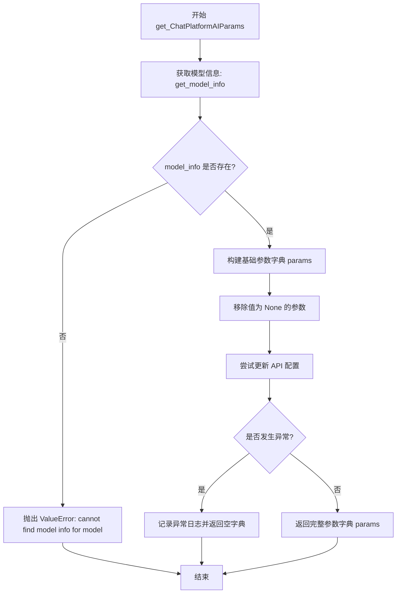

#### 带注释源码

```python
def get_ChatPlatformAIParams(
        model_name: str = get_default_llm(),
        temperature: float = Settings.model_settings.TEMPERATURE,
        max_tokens: int = Settings.model_settings.MAX_TOKENS,
        streaming: bool = True,
        callbacks: List[Callable] = [],
        verbose: bool = True,
        local_wrap: bool = False,  # use local wrapped api
        **kwargs: Any,
) -> Dict:
    """
    获取聊天平台的 AI 模型参数。
    
    Args:
        model_name: 模型名称，默认为系统默认 LLM
        temperature: 生成温度，控制随机性
        max_tokens: 最大生成 token 数
        streaming: 是否流式输出
        callbacks: 回调函数列表
        verbose: 是否详细输出
        local_wrap: 是否使用本地包装 API
        **kwargs: 其他额外参数
    
    Returns:
        包含模型调用所需参数的字典，失败时返回空字典
    """
    # 根据模型名称获取模型配置信息（平台、API地址、密钥等）
    model_info = get_model_info(model_name)
    # 如果未找到模型信息，抛出 ValueError 异常
    if not model_info:
        raise ValueError(f"cannot find model info for model: {model_name}")

    # 构建包含基本调用参数的字典
    params = dict(
        streaming=streaming,
        verbose=verbose,
        callbacks=callbacks,
        model=model_name,
        temperature=temperature,
        max_tokens=max_tokens,
        **kwargs,  # 合并用户传入的额外参数
    )
    # 移除值为 None 的参数，避免 openai 验证错误
    for k in list(params):
        if params[k] is None:
            params.pop(k)

    try:
        # 从模型信息中提取 API 配置并更新参数字典
        params.update(
            api_base=model_info.get("api_base_url"),
            api_key=model_info.get("api_key"),
            proxy=model_info.get("api_proxy"),
        )
        return params
    except Exception as e:
        # 捕获异常并记录日志，返回空字典
        logger.exception(f"failed to create for model: {model_name}.")
        return {}
```


### `get_OpenAI`

用于根据模型名称和其他配置参数创建一个 OpenAI LLM 实例，支持本地封装和远程 API 调用。

参数：

- `model_name`：`str`，要使用的模型名称
- `temperature`：`float`，生成文本的温度参数，控制随机性
- `max_tokens`：`int`，最大生成 token 数，默认为 Settings.model_settings.MAX_TOKENS
- `streaming`：`bool`，是否启用流式输出，默认为 True
- `echo`：`bool`，是否在响应中回显输入，默认为 True
- `callbacks`：`List[Callable]`，回调函数列表
- `verbose`：`bool`，是否启用详细日志，默认为 True
- `local_wrap`：`bool`，是否使用本地封装的 API，默认为 False
- `**kwargs`：`Any`，其他传递给 OpenAI 的额外参数

返回值：`OpenAI`，创建的 OpenAI 模型实例，失败时返回 None

#### 流程图

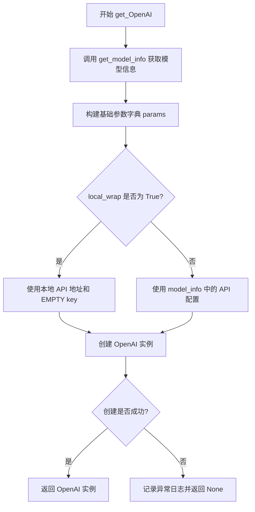

#### 带注释源码

```python
def get_OpenAI(
        model_name: str,
        temperature: float,
        max_tokens: int = Settings.model_settings.MAX_TOKENS,
        streaming: bool = True,
        echo: bool = True,
        callbacks: List[Callable] = [],
        verbose: bool = True,
        local_wrap: bool = False,  # use local wrapped api
        **kwargs: Any,
) -> OpenAI:
    # TODO: 从API获取模型信息
    # 获取模型配置信息，包含 api_base_url, api_key, api_proxy 等
    model_info = get_model_info(model_name)
    
    # 构建参数字典，包含流式输出、回调、模型名称、温度、最大 token 等
    params = dict(
        streaming=streaming,
        verbose=verbose,
        callbacks=callbacks,
        model_name=model_name,
        temperature=temperature,
        max_tokens=max_tokens,
        echo=echo,
        **kwargs,
    )
    
    try:
        # 根据 local_wrap 标志选择使用本地封装 API 或远程 API
        if local_wrap:
            # 使用本地 API 地址，使用 EMPTY 作为 API key
            params.update(
                openai_api_base=f"{api_address()}/v1",
                openai_api_key="EMPTY",
            )
        else:
            # 使用配置文件中定义的远程 API 地址和凭证
            params.update(
                openai_api_base=model_info.get("api_base_url"),
                openai_api_key=model_info.get("api_key"),
                openai_proxy=model_info.get("api_proxy"),
            )
        
        # 使用构建好的参数创建 OpenAI 模型实例
        model = OpenAI(**params)
    except Exception as e:
        # 捕获异常并记录日志，返回 None 表示创建失败
        logger.exception(f"failed to create OpenAI for model: {model_name}.")
        model = None
    
    return model
```


### `get_Embeddings`

该函数用于根据配置的模型信息获取对应的 Embeddings 实例，支持 OpenAI、Ollama、ZhipuAI、LocalAI 等多种嵌入模型平台，根据平台类型返回相应的 Embeddings 对象。

参数：

-  `embed_model`：`str`，要使用的嵌入模型名称，默认为 None，此时使用默认嵌入模型
-  `local_wrap`：`bool`，是否使用本地包装的 API，默认为 False

返回值：`Embeddings`，返回对应的嵌入模型实例

#### 流程图

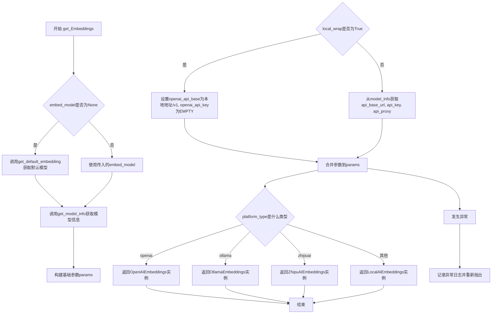

#### 带注释源码

```python
def get_Embeddings(
        embed_model: str = None,
        local_wrap: bool = False,  # use local wrapped api
) -> Embeddings:
    # 导入所需的 Embeddings 类
    from langchain_community.embeddings import OllamaEmbeddings
    from langchain_openai import OpenAIEmbeddings

    # 导入本地封装的 LocalAIEmbeddings
    from chatchat.server.localai_embeddings import (
        LocalAIEmbeddings,
    )

    # 如果未指定嵌入模型，则获取默认嵌入模型
    embed_model = embed_model or get_default_embedding()
    
    # 根据模型名称获取模型配置信息
    model_info = get_model_info(model_name=embed_model)
    
    # 构建基础参数字典
    params = dict(model=embed_model)
    try:
        # 根据是否本地包装来设置 API 参数
        if local_wrap:
            params.update(
                openai_api_base=f"{api_address()}/v1",  # 使用本地 API 地址
                openai_api_key="EMPTY",  # 本地调用不需要 key
            )
        else:
            params.update(
                openai_api_base=model_info.get("api_base_url"),  # 使用配置的 API 基础地址
                openai_api_key=model_info.get("api_key"),  # 使用配置的 API 密钥
                openai_proxy=model_info.get("api_proxy"),  # 使用配置的代理
            )
        
        # 根据平台类型创建对应的 Embeddings 实例
        if model_info.get("platform_type") == "openai":
            return OpenAIEmbeddings(**params)
        elif model_info.get("platform_type") == "ollama":
            return OllamaEmbeddings(
                base_url=model_info.get("api_base_url").replace("/v1", ""),  # 移除 /v1 后缀
                model=embed_model,
            )
        elif model_info.get("platform_type") == "zhipuai":
            return ZhipuAIEmbeddings(
                base_url=model_info.get("api_base_url"),
                api_key=model_info.get("api_key"),
                zhipuai_proxy=model_info.get("api_proxy"),
                model=embed_model,
            )
        else:
            # 默认使用 LocalAIEmbeddings
            return LocalAIEmbeddings(**params)
    except Exception as e:
        # 记录异常日志并重新抛出
        logger.exception(f"failed to create Embeddings for model: {embed_model}.")
        raise e
```


### `check_embed_model`

检查指定的嵌入模型是否可访问，如果未指定嵌入模型则使用默认嵌入模型。

参数：

- `embed_model`：`str`，需要检查的嵌入模型名称，默认为 None，此时使用默认嵌入模型

返回值：`Tuple[bool, str]`，返回一个元组，第一个元素为布尔值表示嵌入模型是否可访问（True 表示可访问，False 表示不可访问），第二个元素为错误信息（如果不可访问则返回错误消息，否则返回空字符串）

#### 流程图

```mermaid
flowchart TD
    A[开始] --> B{embed_model 是否为 None?}
    B -- 是 --> C[调用 get_default_embedding 获取默认嵌入模型名称]
    B -- 否 --> D[使用传入的 embed_model]
    C --> E
    D --> E
    E[调用 get_Embeddings 创建嵌入模型实例] --> F[执行 embeddings.embed_query 测试调用]
    F -- 成功 --> G[返回 (True, "")]
    F -- 失败: 捕获异常 --> H[生成错误消息并记录日志]
    H --> I[返回 (False, 错误消息)]
    G --> J[结束]
    I --> J
```

#### 带注释源码

```python
def check_embed_model(embed_model: str = None) -> Tuple[bool, str]:
    '''
    check whether embed_model is accessible, use default embed model if None
    '''
    # 如果未指定嵌入模型，则获取默认嵌入模型名称
    embed_model = embed_model or get_default_embedding()
    
    # 根据嵌入模型名称获取对应的嵌入模型实例
    embeddings = get_Embeddings(embed_model=embed_model)
    
    try:
        # 尝试调用 embed_query 方法测试嵌入模型是否可用
        embeddings.embed_query("this is a test")
        # 测试成功，返回成功状态和空错误信息
        return True, ""
    except Exception as e:
        # 测试失败，构造错误消息并记录日志
        msg = f"failed to access embed model '{embed_model}': {e}"
        logger.error(msg)
        # 返回失败状态和错误消息
        return False, msg
```


### `get_OpenAIClient`

构造并返回一个针对指定平台或模型的 OpenAI 客户端（同步或异步）。

参数：

- `platform_name`：`str`，可选，平台名称，用于指定要使用的模型平台
- `model_name`：`str`，可选，模型名称，用于查找对应的平台信息
- `is_async`：`bool`，指定返回异步客户端 (`True`) 还是同步客户端 (`False`)，默认为 `True`

返回值：`Union[openai.Client, openai.AsyncClient]`，返回配置好的 OpenAI 同步客户端或异步客户端实例

#### 流程图

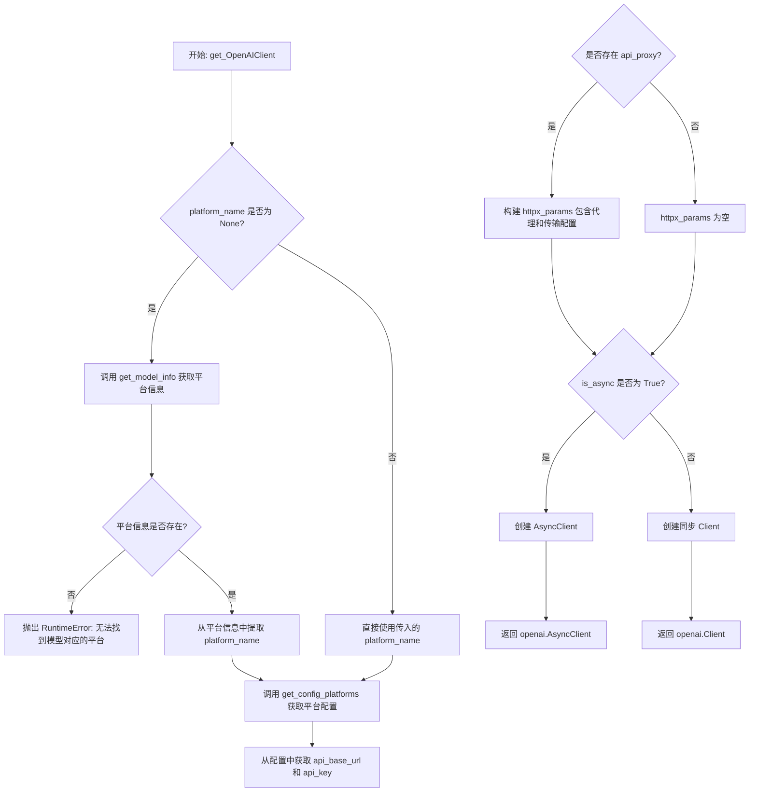

#### 带注释源码

```python
def get_OpenAIClient(
        platform_name: str = None,
        model_name: str = None,
        is_async: bool = True,
) -> Union[openai.Client, openai.AsyncClient]:
    """
    construct an openai Client for specified platform or model
    
    该函数用于构造 OpenAI 客户端实例，支持同步和异步两种模式。
    可以通过平台名称或模型名称来定位并配置客户端。
    """
    # 如果未指定平台名称，则通过模型名称查询对应的平台信息
    if platform_name is None:
        platform_info = get_model_info(
            model_name=model_name, platform_name=platform_name
        )
        # 无法找到模型对应的平台配置时抛出异常
        if platform_info is None:
            raise RuntimeError(
                f"cannot find configured platform for model: {model_name}"
            )
        # 从模型信息中提取平台名称
        platform_name = platform_info.get("platform_name")
    
    # 获取平台配置信息
    platform_info = get_config_platforms().get(platform_name)
    assert platform_info, f"cannot find configured platform: {platform_name}"
    
    # 构建客户端基础参数：base_url 和 api_key
    params = {
        "base_url": platform_info.get("api_base_url"),
        "api_key": platform_info.get("api_key"),
    }
    
    # 初始化 httpx 参数字典，用于配置代理
    httpx_params = {}
    # 如果平台配置了代理，则设置 httpx 的代理和传输层
    if api_proxy := platform_info.get("api_proxy"):
        httpx_params = {
            "proxies": api_proxy,
            "transport": httpx.HTTPTransport(local_address="0.0.0.0"),
        }

    # 根据 is_async 标志决定创建异步还是同步客户端
    if is_async:
        # 如果存在代理配置，创建带代理的异步 httpx 客户端
        if httpx_params:
            params["http_client"] = httpx.AsyncClient(**httpx_params)
        # 返回异步 OpenAI 客户端
        return openai.AsyncClient(**params)
    else:
        # 如果存在代理配置，创建带代理的同步 httpx 客户端
        if httpx_params:
            params["http_client"] = httpx.Client(**httpx_params)
        # 返回同步 OpenAI 客户端
        return openai.Client(**params)
```


### `run_async`

该函数用于在同步环境中执行异步代码，通过获取或创建事件循环并运行协程，实现同步到异步的桥接。

参数：

- `cor`：`Coroutine`，需要执行的协程对象

返回值：`Any`，协程执行的结果（取决于传入的协程具体返回什么）

#### 流程图

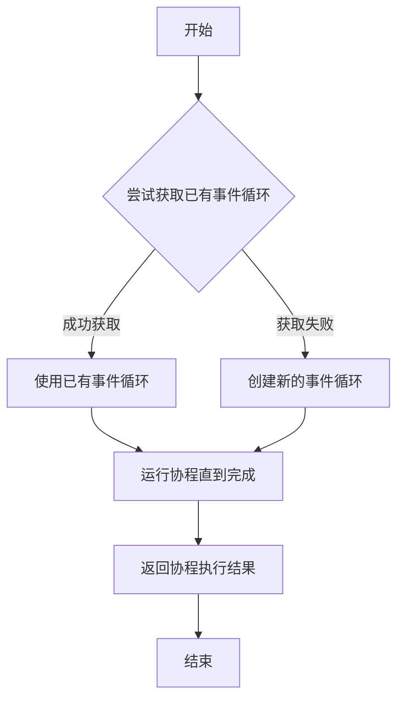

#### 带注释源码

```python
def run_async(cor):
    """
    在同步环境中运行异步代码.
    """
    try:
        # 尝试获取当前线程中已存在的事件循环
        # 如果存在则直接使用，避免重复创建
        loop = asyncio.get_event_loop()
    except:
        # 如果没有已存在的事件循环（如首次调用或事件循环已关闭）
        # 则创建一个新的事件循环
        loop = asyncio.new_event_loop()
    
    # run_until_complete 会阻塞当前线程
    # 直到协程执行完成并返回结果
    return loop.run_until_complete(cor)
```

#### 设计说明

| 项目 | 说明 |
|------|------|
| **设计目标** | 提供同步代码调用异步函数的桥梁，使异步代码可在同步上下文中执行 |
| **异常处理** | 仅捕获获取事件循环时的异常，协程内部的异常会正常传播 |
| **潜在问题** | 在已有事件循环的线程中调用可能导致事件循环状态不一致；长期使用可能产生事件循环泄漏 |
| **优化建议** | 考虑使用 `asyncio.run()` 替代（Python 3.7+），或在需要时显式关闭事件循环以释放资源 |


### `iter_over_async`

该函数是一个将异步生成器（async generator）转换为同步生成器（sync generator）的工具函数，允许在同步代码环境中逐个迭代异步迭代器的元素，而无需显式等待整个异步迭代过程完成。

参数：

- `ait`：异步迭代器（`aiter`），需要转换的异步迭代器对象，必须实现了`__aiter__`方法和`__anext__`方法
- `loop`：`asyncio.AbstractEventLoop` | `None`，可选参数，用于执行异步操作的事件循环。如果为`None`，则自动获取或创建当前的事件循环

返回值：`Generator`，同步生成器对象，可以像使用普通同步生成器一样遍历异步迭代器的所有元素

#### 流程图

```mermaid
flowchart TD
    A[开始: iter_over_async] --> B{loop是否为None}
    B -->|是| C[尝试获取已有事件循环]
    C --> D{能否获取到}
    D -->|是| E[使用已有循环]
    D -->|否| F[创建新的事件循环]
    F --> G[获取异步迭代器的__aiter__]
    B -->|否| G
    E --> G
    G --> H[定义内部异步函数get_next]
    H --> I[调用loop.run_until_complete执行get_next]
    I --> J{是否迭代完成 done=True}
    J -->|否| K[yield 返回当前元素 obj]
    K --> I
    J -->|是| L[退出循环, 生成器结束]
    
    subgraph get_next内部逻辑
    M[尝试获取下一个元素] --> N{是否抛出StopAsyncIteration}
    N -->|否| O[返回 (False, obj)]
    N -->|是| P[返回 (True, None)]
    end
```

#### 带注释源码

```python
def iter_over_async(ait, loop=None):
    """
    将异步生成器封装成同步生成器.
    
    该函数允许在同步环境中使用 for...in 语法遍历异步迭代器，
    通过在内部使用事件循环来逐步获取异步迭代器的元素。
    
    参数:
        ait: 异步迭代器对象，必须实现 __aiter__ 和 __anext__ 方法
        loop: 可选的事件循环对象，如果为 None 则自动创建
    
    返回:
        同步生成器，可以逐步产出异步迭代器的元素
    """
    # 获取异步迭代器的异步迭代器接口
    ait = ait.__aiter__()

    # 定义内部异步函数，用于获取异步迭代器的下一个元素
    async def get_next():
        """异步获取下一个元素的辅助函数"""
        try:
            # 尝试获取异步迭代器的下一个元素
            obj = await ait.__anext__()
            # 如果成功，返回 (False, obj)，False 表示尚未完成
            return False, obj
        except StopAsyncIteration:
            # 捕获异步迭代停止异常，返回 (True, None) 表示迭代已完成
            return True, None

    # 如果未提供事件循环，则尝试获取或创建
    if loop is None:
        try:
            # 尝试获取当前线程中已存在的事件循环
            loop = asyncio.get_event_loop()
        except:
            # 如果没有已存在的循环，创建新的事件循环
            loop = asyncio.new_event_loop()

    # 持续循环直到异步迭代完成
    while True:
        # 在事件循环中运行异步函数 get_next()，获取结果
        done, obj = loop.run_until_complete(get_next())
        
        # 如果迭代已完成（done=True），退出循环
        if done:
            break
        
        # 如果未完成，yield 当前元素给调用者
        yield obj
```


### `MakeFastAPIOffline`

该函数用于将 FastAPI 应用的文档页面（Swagger UI 和 ReDoc）改为离线模式，不再依赖外部 CDN 资源，以便在无网络或内网环境中正常显示 API 文档。

参数：

- `app`：`FastAPI`，FastAPI 应用实例
- `static_dir`：`Path`，静态文件目录路径，默认为 `Path(__file__).parent / "api_server" / "static"`
- `static_url`：`str`，静态文件的 URL 路径，默认为 `"/static-offline-docs"`
- `docs_url`：`Optional[str]`，Swagger UI 文档的路由路径，默认为 `"/docs"`
- `redoc_url`：`Optional[str]`，ReDoc 文档的路由路径，默认为 `"/redoc"`

返回值：`None`，无返回值

#### 流程图

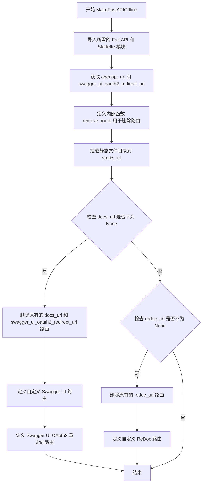

#### 带注释源码

```python
def MakeFastAPIOffline(
        app: FastAPI,
        static_dir=Path(__file__).parent / "api_server" / "static",
        static_url="/static-offline-docs",
        docs_url: Optional[str] = "/docs",
        redoc_url: Optional[str] = "/redoc",
) -> None:
    """
    patch the FastAPI obj that doesn't rely on CDN for the documentation page
    修改 FastAPI 应用，使其不依赖 CDN 来显示文档页面
    """
    # 导入 FastAPI 请求对象
    from fastapi import Request
    # 导入 FastAPI 文档生成相关的函数
    from fastapi.openapi.docs import (
        get_redoc_html,
        get_swagger_ui_html,
        get_swagger_ui_oauth2_redirect_html,
    )
    # 导入 Starlette 静态文件服务
    from fastapi.staticfiles import StaticFiles
    # 导入 HTML 响应类
    from starlette.responses import HTMLResponse

    # 获取应用的 OpenAPI URL
    openapi_url = app.openapi_url
    # 获取 Swagger UI OAuth2 重定向 URL
    swagger_ui_oauth2_redirect_url = app.swagger_ui_oauth2_redirect_url

    def remove_route(url: str) -> None:
        """
        remove original route from app
        从应用中删除原始路由
        """
        index = None
        # 遍历应用的所有路由，查找匹配的 URL
        for i, r in enumerate(app.routes):
            if r.path.lower() == url.lower():
                index = i
                break
        # 如果找到匹配的路由，则从路由列表中删除
        if isinstance(index, int):
            app.routes.pop(index)

    # Set up static file mount
    # 设置静态文件挂载
    app.mount(
        static_url,
        StaticFiles(directory=Path(static_dir).as_posix()),
        name="static-offline-docs",
    )

    if docs_url is not None:
        # 删除原有的 docs 和 oauth2_redirect 路由
        remove_route(docs_url)
        remove_route(swagger_ui_oauth2_redirect_url)

        # Define the doc and redoc pages, pointing at the right files
        # 定义文档页面，指向本地静态文件
        @app.get(docs_url, include_in_schema=False)
        async def custom_swagger_ui_html(request: Request) -> HTMLResponse:
            # 获取请求的根路径
            root = request.scope.get("root_path")
            # 构建 favicon URL
            favicon = f"{root}{static_url}/favicon.png"
            # 返回自定义的 Swagger UI HTML，指向本地静态资源
            return get_swagger_ui_html(
                openapi_url=f"{root}{openapi_url}",
                title=app.title + " - Swagger UI",
                oauth2_redirect_url=swagger_ui_oauth2_redirect_url,
                swagger_js_url=f"{root}{static_url}/swagger-ui-bundle.js",
                swagger_css_url=f"{root}{static_url}/swagger-ui.css",
                swagger_favicon_url=favicon,
            )

        # 定义 Swagger UI OAuth2 重定向路由
        @app.get(swagger_ui_oauth2_redirect_url, include_in_schema=False)
        async def swagger_ui_redirect() -> HTMLResponse:
            return get_swagger_ui_oauth2_redirect_html()

    if redoc_url is not None:
        # 删除原有的 redoc 路由
        remove_route(redoc_url)

        # 定义 ReDoc 页面
        @app.get(redoc_url, include_in_schema=False)
        async def redoc_html(request: Request) -> HTMLResponse:
            # 获取请求的根路径
            root = request.scope.get("root_path")
            # 构建 favicon URL
            favicon = f"{root}{static_url}/favicon.png"

            # 返回自定义的 ReDoc HTML，指向本地静态资源
            return get_redoc_html(
                openapi_url=f"{root}{openapi_url}",
                title=app.title + " - ReDoc",
                redoc_js_url=f"{root}{static_url}/redoc.standalone.js",
                with_google_fonts=False,
                redoc_favicon_url=favicon,
            )
```


### `api_address`

该函数用于获取API服务器的地址，允许用户通过配置`public_host`和`public_port`来生成适用于云服务器或反向代理的公网API地址。

参数：

- `is_public`：`bool`，是否返回公网API地址（True返回public_host:public_port，False返回host:port）

返回值：`str`，API服务器的地址字符串，格式为`http://host:port`

#### 流程图

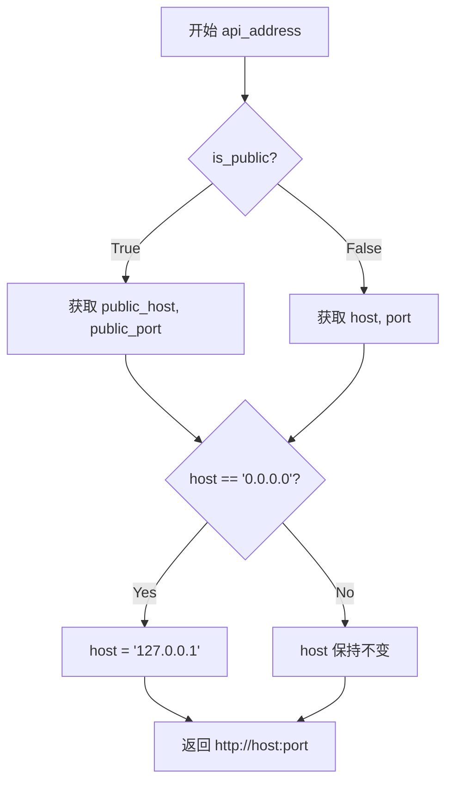

#### 带注释源码

```python
def api_address(is_public: bool = False) -> str:
    '''
    允许用户在 basic_settings.API_SERVER 中配置 public_host, public_port
    以便使用云服务器或反向代理时生成正确的公网 API 地址（如知识库文档下载链接）
    '''
    # 从设置中获取API服务器配置
    from chatchat.settings import Settings

    server = Settings.basic_settings.API_SERVER
    
    # 根据is_public参数决定使用公网还是内网地址
    if is_public:
        # 使用公网配置，默认127.0.0.1和7861
        host = server.get("public_host", "127.0.0.1")
        port = server.get("public_port", "7861")
    else:
        # 使用内网配置，默认127.0.0.1和7861
        host = server.get("host", "127.0.0.1")
        port = server.get("port", "7861")
        # 0.0.0.0表示监听所有接口，对外不可访问，需转换为127.0.0.1
        if host == "0.0.0.0":
            host = "127.0.0.1"
    
    # 拼接并返回完整的URL地址
    return f"http://{host}:{port}"
```


### `webui_address`

获取 WebUI 服务器的地址信息，根据配置返回完整的 WebUI 访问 URL。

参数：无

返回值：`str`，返回 WebUI 服务器的完整 URL 地址（如 `http://127.0.0.1:7860`）

#### 流程图

```mermaid
flowchart TD
    A[开始] --> B[从 Settings 获取 WEBUI_SERVER 配置]
    B --> C[提取 host 和 port]
    C --> D{host 是否为 '0.0.0.0'}
    D -->|是| E[转换为 '127.0.0.1']
    D -->|否| F[保持原 host]
    E --> G[拼接 URL: http://host:port]
    F --> G
    G --> H[返回 URL 字符串]
```

#### 带注释源码

```python
def webui_address() -> str:
    """
    获取 WebUI 服务器的访问地址。
    允许用户在 basic_settings.WEBUI_SERVER 中配置 host 和 port，
    以便生成正确的 WebUI 访问 URL。
    """
    # 从设置中导入配置模块
    from chatchat.settings import Settings

    # 获取 WebUI 服务器的主机地址配置
    host = Settings.basic_settings.WEBUI_SERVER["host"]
    # 获取 WebUI 服务器的端口配置
    port = Settings.basic_settings.WEBUI_SERVER["port"]
    # 拼接并返回完整的 WebUI 访问 URL
    return f"http://{host}:{port}"
```


### `get_prompt_template`

从prompt_config中加载模板内容，根据指定的类型和名称返回对应的提示词模板字符串。

参数：

-  `type`：`str`，对应于 model_settings.llm_model_config 模型类别其中的一种，以及 "rag"，如果有新功能，应该进行加入
-  `name`：`str`，模板名称

返回值：`Optional[str]`，从prompt_config中加载的模板内容，如果不存在则返回 None

#### 流程图

```mermaid
flowchart TD
    A[开始] --> B[接收参数 type 和 name]
    B --> C[从 chatchat.settings 导入 Settings]
    C --> D[调用 Settings.prompt_settings.model_dump 获取字典]
    D --> E[从字典中获取 type 对应的子字典]
    E --> F[从子字典中获取 name 对应的模板内容]
    F --> G{模板内容是否存在?}
    G -->|是| H[返回模板内容字符串]
    G -->|否| I[返回 None]
    H --> J[结束]
    I --> J
```

#### 带注释源码

```python
def get_prompt_template(type: str, name: str) -> Optional[str]:
    """
    从prompt_config中加载模板内容
    type: 对应于 model_settings.llm_model_config 模型类别其中的一种，以及 "rag"，如果有新功能，应该进行加入。
    """

    # 从设置模块导入 Settings 配置类
    from chatchat.settings import Settings

    # 使用 model_dump 将 pydantic 模型转换为字典
    # 然后通过 type 和 name 键进行嵌套获取
    # 返回类型为 Optional[str]，如果找不到对应模板则返回 None
    return Settings.prompt_settings.model_dump().get(type, {}).get(name)
```


### `get_prompt_template_dict`

该函数用于从配置中加载指定类型和名称的提示词模板，返回包含 "SYSTEM_PROMPT" 和 "HUMAN_MESSAGE" 的字典。

参数：

- `type`：`str`，模型类别，对应于 `model_settings.llm_model_config` 模型类别其中的一种，以及 "rag"，如果有新功能，应该进行加入。
- `name`：`str`，模板名称。

返回值：`Optional[Dict]`，返回定义的对象特点字典，包含 "SYSTEM_PROMPT" 和 "HUMAN_MESSAGE" 两个键。

#### 流程图

```mermaid
flowchart TD
    A[开始] --> B[导入 Settings]
    B --> C[调用 Settings.prompt_settings.model_dump]
    C --> D[获取 type 类别下的所有模板]
    E[获取 type 类别下 name 对应的模板字典]
    D --> E
    E --> F{模板是否存在}
    F -->|是| G[返回模板字典]
    F -->|否| H[返回 None]
    G --> I[结束]
    H --> I
```

#### 带注释源码

```python
def get_prompt_template_dict(type: str, name: str) -> Optional[Dict]:
    """
    从prompt_config中加载模板内容
    type: 对应于 model_settings.llm_model_config 模型类别其中的一种，以及 "rag"，如果有新功能，应该进行加入。
    返回：定义的对象特点字典“SYSTEM_PROMPT”，“HUMAN_MESSAGE”
    """

    # 从设置模块中导入 Settings 配置类
    from chatchat.settings import Settings

    # 获取提示词设置的完整字典，model_dump() 将 Pydantic 模型转换为字典
    # .get(type, {}) 获取指定类型下的所有模板
    # .get(name) 获取指定名称的模板字典
    return Settings.prompt_settings.model_dump().get(type, {}).get(name)
```


### `get_model_dump_dict`

从 Settings 中提取指定类型的提示模板配置字典

参数：

- `type`：`str`，表示要获取的提示模板类型

返回值：`Optional[Dict]`，返回对应类型的提示模板字典，如果不存在则返回空字典

#### 流程图

```mermaid
flowchart TD
    A[开始] --> B[导入 Settings]
    B --> C[调用 Settings.prompt_settings.model_dump]
    C --> D[从结果字典中获取 type 对应的值]
    D --> E{是否存在}
    E -->|是| F[返回字典]
    E -->|否| G[返回空字典]
    F --> H[结束]
    G --> H
```

#### 带注释源码

```python
def get_model_dump_dict(type: str) -> Optional[Dict]:
    """
    从prompt_config中加载模板内容
    """
    # 从 chatchat.settings 导入 Settings 配置类
    from chatchat.settings import Settings

    # 使用 pydantic 的 model_dump 将 prompt_settings 转换为字典
    # 然后获取指定 type 键对应的值，返回空字典 {} 作为默认值
    return Settings.prompt_settings.model_dump().get(type, {})
```


### `set_httpx_config`

设置 httpx 默认超时时间，并将项目相关服务加入无代理列表，同时配置系统级代理。

参数：

- `timeout`：`float`，超时时间（秒），默认值为 `Settings.basic_settings.HTTPX_DEFAULT_TIMEOUT`。httpx 默认超时是 5 秒，在请求 LLM 回答时不够用。
- `proxy`：`Union[str, Dict]`，代理设置，支持字符串或字典形式。字符串时设置为 http/https/all 代理，字典时可指定 http_proxy/https_proxy/all_proxy。
- `unused_proxies`：`List[str]`，不需要代理的服务地址列表，用于将用户部署的 fastchat 服务器加入无代理列表。

返回值：`None`，该函数无返回值，直接修改全局配置。

#### 流程图

```mermaid
flowchart TD
    A[开始 set_httpx_config] --> B[设置 httpx 默认超时时间]
    B --> C{proxy 参数类型判断}
    C -->|str| D[将 proxy 设为 http/https/all_proxy]
    C -->|dict| E[从 dict 中提取代理设置]
    C -->|None| F[跳过代理设置]
    D --> G[遍历设置系统环境变量]
    E --> G
    F --> H[构建 no_proxy 列表]
    G --> H
    H --> I[添加本地地址到无代理列表]
    I --> J[遍历 unused_proxies 添加主机到无代理列表]
    J --> K[设置 NO_PROXY 环境变量]
    K --> L[覆盖 urllib.request.getproxies 函数]
    L --> M[结束]
```

#### 带注释源码

```python
def set_httpx_config(
        timeout: float = Settings.basic_settings.HTTPX_DEFAULT_TIMEOUT,
        proxy: Union[str, Dict] = None,
        unused_proxies: List[str] = [],
):
    """
    设置httpx默认timeout。httpx默认timeout是5秒，在请求LLM回答时不够用。
    将本项目相关服务加入无代理列表，避免fastchat的服务器请求错误。(windows下无效)
    对于chatgpt等在线API，如要使用代理需要手动配置。搜索引擎的代理如何处置还需考虑。
    """

    import os

    import httpx

    # 设置 httpx 默认超时时间（连接、读取、写入）
    httpx._config.DEFAULT_TIMEOUT_CONFIG.connect = timeout
    httpx._config.DEFAULT_TIMEOUT_CONFIG.read = timeout
    httpx._config.DEFAULT_TIMEOUT_CONFIG.write = timeout

    # 在进程范围内设置系统级代理
    proxies = {}
    if isinstance(proxy, str):
        # 字符串形式：同时设置 http、https、all 代理
        for n in ["http", "https", "all"]:
            proxies[n + "_proxy"] = proxy
    elif isinstance(proxy, dict):
        # 字典形式：支持 n 或 n_proxy 两种 key 格式
        for n in ["http", "https", "all"]:
            if p := proxy.get(n):
                proxies[n + "_proxy"] = p
            elif p := proxy.get(n + "_proxy"):
                proxies[n + "_proxy"] = p

    # 将代理设置写入系统环境变量
    for k, v in proxies.items():
        os.environ[k] = v

    # set host to bypass proxy
    # 从现有环境变量获取 no_proxy 配置
    no_proxy = [
        x.strip() for x in os.environ.get("no_proxy", "").split(",") if x.strip()
    ]
    # 添加本地地址，不使用代理
    no_proxy += [
        # do not use proxy for locahost
        "http://127.0.0.1",
        "http://localhost",
    ]
    # do not use proxy for user deployed fastchat servers
    # 遍历用户指定的无代理地址，提取主机:端口 添加到列表
    for x in unused_proxies:
        host = ":".join(x.split(":")[:2])
        if host not in no_proxy:
            no_proxy.append(host)
    # 合并设置 NO_PROXY 环境变量
    os.environ["NO_PROXY"] = ",".join(no_proxy)

    # 定义获取代理的函数，供 urllib 使用
    def _get_proxies():
        return proxies

    import urllib.request

    # 覆盖 urllib 的 getproxies 函数，使其能获取自定义代理设置
    urllib.request.getproxies = _get_proxies
```


### `run_in_thread_pool`

在指定的线程池中批量运行任务函数，并将执行结果通过生成器方式逐个返回，支持并发执行多个任务。

参数：

- `func`：`Callable`，需要在线程池中执行的函数对象
- `params`：`List[Dict] = []`，关键字参数列表，每个字典元素代表一个任务的参数

返回值：`Generator`，生成器对象，逐个产出各任务的执行结果

#### 流程图

```mermaid
flowchart TD
    A[开始] --> B[创建ThreadPoolExecutor]
    B --> C{遍历params列表}
    C -->|每次迭代| D[提交任务到线程池: pool.submitfunc, kwargs]
    D --> E[将future对象加入tasks列表]
    E --> C
    C -->|遍历完成| F[使用as_completed按完成顺序获取结果]
    F --> G{获取任务结果}
    G -->|成功| H[yield返回结果obj.result]
    G -->|异常| I[捕获异常并记录日志]
    H --> J{检查是否还有未完成任务}
    I --> J
    J -->|是| F
    J -->|否| K[结束]
```

#### 带注释源码

```python
def run_in_thread_pool(
        func: Callable,      # 要在线程池中执行的函数对象
        params: List[Dict] = [],  # 关键字参数列表，每个字典包含一个任务所需的参数
) -> Generator:              # 返回生成器，逐个返回任务执行结果
    """
    在线程池中批量运行任务，并将运行结果以生成器的形式返回。
    请确保任务中的所有操作是线程安全的，任务函数请全部使用关键字参数。
    """
    tasks = []  # 用于存储提交的任务future对象
    with ThreadPoolExecutor() as pool:  # 创建线程池，使用上下文管理器确保资源正确释放
        for kwargs in params:  # 遍历参数列表，每个kwargs对应一个任务
            tasks.append(pool.submit(func, **kwargs))  # 提交任务到线程池

        for obj in as_completed(tasks):  # 按任务完成顺序遍历
            try:
                yield obj.result()  # 尝试获取任务结果并yield返回
            except Exception as e:  # 捕获任务执行中的异常
                logger.exception(f"error in sub thread: {e}")  # 记录异常日志
```


### `run_in_process_pool`

该函数用于在进程池中批量运行任务，并将运行结果以生成器的形式逐个返回。通过使用 `ProcessPoolExecutor` 实现多进程并发执行，适用于CPU密集型任务的并行处理。注意：文档字符串描述为"线程池"但实际实现为"进程池"，存在描述不一致的问题。

参数：

- `func`：`Callable`，要执行的函数对象
- `params`：`List[Dict] = []`，参数列表，每个元素为一个字典，表示传递给函数的关键字参数

返回值：`Generator`，生成器对象，用于逐个获取任务的执行结果

#### 流程图

```mermaid
flowchart TD
    A[开始] --> B{检查操作系统平台}
    B -->|Windows| C[设置 max_workers 为 min(cpu_count, 60)]
    B -->|非Windows| D[max_workers 设为 None]
    C --> E[创建 ProcessPoolExecutor]
    D --> E
    E --> F[遍历 params 列表]
    F --> G[提交任务到进程池: pool.submit]
    G --> H[将 Future 对象添加到 tasks 列表]
    H --> I{还有更多参数?}
    I -->|是| F
    I -->|否| J[使用 as_completed 遍历已完成的任务]
    J --> K[获取任务结果: obj.result]
    K --> L{任务执行是否成功?}
    L -->|是| M[yield 返回结果]
    L -->|否| N[捕获异常并记录日志]
    M --> O{还有未完成的任务?}
    N --> O
    O -->|是| J
    O -->|否| P[结束]
```

#### 带注释源码

```python
def run_in_process_pool(
        func: Callable,
        params: List[Dict] = [],
) -> Generator:
    """
    在线程池中批量运行任务，并将运行结果以生成器的形式返回。
    请确保任务中的所有操作是线程安全的，任务函数请全部使用关键字参数。
    """
    tasks = []
    max_workers = None
    # Windows 平台下最大 worker 数不能超过 60
    if sys.platform.startswith("win"):
        max_workers = min(
            mp.cpu_count(), 60
        )  # max_workers should not exceed 60 on windows
    # 使用进程池执行器创建进程池
    with ProcessPoolExecutor(max_workers=max_workers) as pool:
        # 遍历参数列表，提交任务到进程池
        for kwargs in params:
            tasks.append(pool.submit(func, **kwargs))

        # 遍历已完成的任务，使用 as_completed 按完成顺序返回结果
        for obj in as_completed(tasks):
            try:
                # 返回任务结果
                yield obj.result()
            except Exception as e:
                # 捕获并记录子进程中的异常
                logger.exception(f"error in sub process: {e}")
```


### `get_httpx_client`

该函数是一个辅助函数，用于创建配置了默认代理的 httpx 客户端。该客户端会自动绕过本地地址（localhost、127.0.0.1）以及用户部署的 fastchat 服务器，同时支持从环境变量读取系统代理设置，并允许用户自定义代理或覆盖默认配置。

参数：

- `use_async`：`bool`，是否返回异步客户端，默认为 False（同步客户端）
- `proxies`：`Union[str, Dict]`，用户提供的代理配置，可以是字符串（所有协议通用）或字典（按协议指定），默认为 None
- `timeout`：`float`，请求超时时间，默认使用 Settings.basic_settings.HTTPX_DEFAULT_TIMEOUT
- `unused_proxies`：`List[str]`，不需要代理的服务器地址列表，默认为空列表
- `**kwargs`：任意关键字参数，会传递给 httpx.Client 或 httpx.AsyncClient 构造函数

返回值：`Union[httpx.Client, httpx.AsyncClient]`，返回配置好的 httpx 同步或异步客户端实例

#### 流程图

```mermaid
flowchart TD
    A[开始] --> B[初始化默认代理字典 default_proxies]
    B --> C[添加本地地址不代理: 127.0.0.1, localhost]
    C --> D[遍历 unused_proxies 列表]
    D --> E{遍历完成?}
    E -->|否| F[提取主机地址并添加到 default_proxies]
    F --> D
    E -->|是| G[从环境变量读取代理设置]
    G --> H[读取 http_proxy, https_proxy, all_proxy]
    H --> I[处理 no_proxy 环境变量]
    I --> J{用户是否提供 proxies?}
    J -->|是| K[格式化用户代理配置]
    K --> L[合并用户代理到 default_proxies]
    J -->|否| M[构建 kwargs 包含 timeout 和 proxies]
    L --> M
    M --> N{use_async == True?}
    N -->|是| O[返回 httpx.AsyncClient]
    N -->|否| P[返回 httpx.Client]
    O --> Q[结束]
    P --> Q
```

#### 带注释源码

```python
def get_httpx_client(
        use_async: bool = False,
        proxies: Union[str, Dict] = None,
        timeout: float = Settings.basic_settings.HTTPX_DEFAULT_TIMEOUT,
        unused_proxies: List[str] = [],
        **kwargs,
) -> Union[httpx.Client, httpx.AsyncClient]:
    """
    helper to get httpx client with default proxies that bypass local addesses.
    """
    # 1. 初始化默认代理字典，设置本地地址不使用代理
    default_proxies = {
        # do not use proxy for locahost
        "all://127.0.0.1": None,
        "all://localhost": None,
    }
    
    # 2. 遍历用户指定的不需要代理的服务器列表
    # do not use proxy for user deployed fastchat servers
    for x in unused_proxies:
        # 从完整地址中提取主机和端口（如 "http://192.168.1.100:8000" -> "192.168.1.100"）
        host = ":".join(x.split(":")[:2])
        default_proxies.update({host: None})

    # 3. 从系统环境变量读取代理配置
    # get proxies from system envionrent
    # proxy not str empty string, None, False, 0, [] or {}
    default_proxies.update(
        {
            # 处理 HTTP 代理
            "http://": (
                os.environ.get("http_proxy")
                if os.environ.get("http_proxy")
                   and len(os.environ.get("http_proxy").strip())
                else None
            ),
            # 处理 HTTPS 代理
            "https://": (
                os.environ.get("https_proxy")
                if os.environ.get("https_proxy")
                   and len(os.environ.get("https_proxy").strip())
                else None
            ),
            # 处理通用代理
            "all://": (
                os.environ.get("all_proxy")
                if os.environ.get("all_proxy")
                   and len(os.environ.get("all_proxy").strip())
                else None
            ),
        }
    )
    
    # 4. 处理 no_proxy 环境变量，将不需要代理的地址加入跳过列表
    for host in os.environ.get("no_proxy", "").split(","):
        if host := host.strip():
            # default_proxies.update({host: None}) # Origin code
            # PR 1838 fix: 必须添加 'all://' 前缀，否则 httpx 会报错
            default_proxies.update(
                {"all://" + host: None}
            )

    # 5. 合并用户提供的代理配置
    # merge default proxies with user provided proxies
    if isinstance(proxies, str):
        # 字符串形式的代理适用于所有协议
        proxies = {"all://": proxies}
    # 如果是字典，则直接更新到默认代理配置中
    if isinstance(proxies, dict):
        default_proxies.update(proxies)

    # 6. 构造客户端参数
    # construct Client
    kwargs.update(timeout=timeout, proxies=default_proxies)

    # 7. 根据 use_async 参数返回对应类型的客户端
    if use_async:
        return httpx.AsyncClient(**kwargs)
    else:
        return httpx.Client(**kwargs)
```


### `get_server_configs`

获取configs中的原始配置项，供前端使用。该函数从本地作用域中收集非下划线开头的变量，并与自定义的api_address配置合并后返回给前端。

参数： 无

返回值：`Dict`，返回合并后的配置字典，包含本地配置项和自定义的api_address

#### 流程图

```mermaid
flowchart TD
    A[Start] --> B[创建自定义配置字典 _custom<br/>包含 api_address]
    B --> C[获取本地作用域中的所有变量<br/>过滤掉以下划线开头的变量]
    C --> D[合并过滤后的本地变量与 _custom 字典]
    D --> E[返回合并后的配置字典]
```

#### 带注释源码

```python
def get_server_configs() -> Dict:
    """
    获取configs中的原始配置项，供前端使用
    """
    # 创建一个自定义配置字典，包含当前API服务器地址
    _custom = {
        "api_address": api_address(),
    }

    # 使用字典推导式过滤出本地作用域中非下划线开头的变量
    # locals() 返回当前局部作用域中的变量字典
    # 过滤掉以下划线(_)开头的变量（如 _custom）
    # 然后与自定义配置 _custom 合并后返回
    return {**{k: v for k, v in locals().items() if k[0] != "_"}, **_custom}
```


### `get_temp_dir`

该函数用于创建临时目录，如果传入的 id 对应的目录已存在则直接返回，否则生成新的 UUID 作为目录名并创建目录，最终返回目录路径和目录名称组成的元组。

参数：

- `id`：`str`，可选参数，指定临时目录的标识符，如果目录已存在则直接返回

返回值：`Tuple[str, str]`，返回包含目录完整路径和目录名称的元组

#### 流程图

```mermaid
flowchart TD
    A[开始] --> B{检查 id 是否为 None}
    B -->|是| C[生成新的 UUID 作为 id]
    B -->|否| D{检查指定目录是否存在}
    D -->|存在| E[直接返回路径和 id]
    D -->|不存在| C
    C --> F[拼接完整路径]
    F --> G[创建目录]
    G --> E
    E --> H[返回路径和 id 元组]
```

#### 带注释源码

```python
def get_temp_dir(id: str = None) -> Tuple[str, str]:
    """
    创建一个临时目录，返回（路径，文件夹名称）
    """
    import uuid  # 导入 uuid 模块用于生成唯一标识符

    from chatchat.settings import Settings  # 导入设置模块获取基础临时目录配置

    # 如果指定了 id，则尝试查找对应目录是否已存在
    if id is not None:  # 如果指定的临时目录已存在，直接返回
        path = os.path.join(Settings.basic_settings.BASE_TEMP_DIR, id)  # 拼接完整路径
        if os.path.isdir(path):  # 检查目录是否存在
            return path, id  # 目录存在则直接返回路径和 id

    # 生成新的 UUID 作为目录名称
    id = uuid.uuid4().hex
    # 拼接完整的临时目录路径
    path = os.path.join(Settings.basic_settings.BASE_TEMP_DIR, id)
    # 创建目录
    os.mkdir(path)
    # 返回目录路径和目录名称
    return path, id
```


### `update_search_local_knowledgebase_tool`

动态更新知识库搜索工具的描述和参数选项，从数据库获取当前可用的知识库列表，并将其信息更新到工具注册表中对应的工具配置里。

参数： 无

返回值：`None`，该函数直接修改全局工具注册表中的工具配置，无返回值。

#### 流程图

```mermaid
flowchart TD
    A[函数开始] --> B[导入必要的模块 re, tools_registry, list_kbs_from_db]
    B --> C[调用 list_kbs_from_db 获取知识库列表]
    C --> D[定义提示词模板 template]
    D --> E[构建知识库信息字符串 KB_info_str]
    E --> F[构建知识库名称字符串 KB_name_info_str]
    F --> G[使用模板格式化生成完整的工具描述 template_knowledge]
    G --> H[从工具注册表获取 search_local_knowledgebase 工具]
    H --> I{工具是否存在?}
    I -->|是| J[更新工具的 description 属性]
    J --> K[更新工具 args.database.choices 为知识库名称列表]
    I -->|否| L[不做任何操作]
    K --> M[函数结束]
    L --> M
```

#### 带注释源码

```
def update_search_local_knowledgebase_tool():
    """
    动态更新知识库信息。
    该函数从数据库获取当前可用的知识库列表，
    并更新 tools_registry 中 search_local_knowledgebase 工具的描述和参数选项。
    """
    import re  # 导入正则表达式模块，用于处理字符串

    # 从工具工厂模块导入工具注册表
    from chatchat.server.agent.tools_factory import tools_registry
    # 从知识库仓库模块导入列出知识库的函数
    from chatchat.server.db.repository.knowledge_base_repository import list_kbs_from_db

    # 获取所有知识库对象列表
    kbs = list_kbs_from_db()
    
    # 定义工具使用的提示词模板，包含知识库信息和数据库参数说明
    template = "Use local knowledgebase from one or more of these:\n{KB_info}\n to get information，Only local data on this knowledge use this tool. The 'database' should be one of the above [{key}]."
    
    # 拼接知识库信息：每个知识库的名称和描述，格式为 "kb_name: kb_info"
    KB_info_str = "\n".join([f"{kb.kb_name}: {kb.kb_info}" for kb in kbs])
    
    # 拼接知识库名称：只包含名称，用于参数验证
    KB_name_info_str = "\n".join([f"{kb.kb_name}" for kb in kbs])
    
    # 使用模板格式化，生成完整的工具描述文本
    template_knowledge = template.format(KB_info=KB_info_str, key=KB_name_info_str)

    # 从工具注册表中获取 search_local_knowledgebase 工具实例
    search_local_knowledgebase_tool = tools_registry._TOOLS_REGISTRY.get(
        "search_local_knowledgebase"
    )
    
    # 如果工具存在，则更新其配置
    if search_local_knowledgebase_tool:
        # 使用正则表达式处理模板知识字符串，去除多余的换行和空白字符，更新工具描述
        search_local_knowledgebase_tool.description = " ".join(
            re.split(r"\n+\s*", template_knowledge)
        )
        # 更新工具的 database 参数的 choices 列表为当前可用的知识库名称
        search_local_knowledgebase_tool.args["database"]["choices"] = [
            kb.kb_name for kb in kbs
        ]
```


### `get_tool`

获取工具注册表中的工具实例，支持获取所有工具或指定名称的单个工具。该函数通过重新加载模块确保获取最新的工具配置，并更新本地知识库搜索工具的动态信息。

参数：

- `name`：`str`，可选参数，工具名称。如果为 `None`，返回所有已注册的工具字典；如果提供具体名称，返回对应的 `BaseTool` 实例。

返回值：`Union[BaseTool, Dict[str, BaseTool]]`，返回类型根据 `name` 参数而定：
- 当 `name` 为 `None` 时，返回包含所有工具的字典 `Dict[str, BaseTool]`
- 当 `name` 指定具体工具名时，返回对应的 `BaseTool` 实例；若未找到则返回 `None`

#### 流程图

```mermaid
flowchart TD
    A[开始 get_tool] --> B{name 参数是否为空?}
    B -->|是| C[重新加载 tools_factory 模块]
    B -->|否| C
    C --> D[导入 tools_registry]
    D --> E[调用 update_search_local_knowledgebase_tool 更新知识库工具]
    E --> F{name 参数是否为空?}
    F -->|是| G[返回完整工具注册表字典]
    F -->|否| H[从注册表获取指定名称的工具]
    H --> I{工具是否存在?}
    I -->|是| J[返回单个 BaseTool]
    I -->|否| K[返回 None]
    G --> L[结束]
    J --> L
    K --> L
```

#### 带注释源码

```python
def get_tool(name: str = None) -> Union[BaseTool, Dict[str, BaseTool]]:
    """
    获取工具注册表中的工具实例。
    
    参数:
        name: 工具名称，默认为 None，表示返回所有工具
    
    返回:
        当 name 为 None 时返回 Dict[str, BaseTool] 所有工具的字典
        当 name 有值时返回 BaseTool 单个工具实例，未找到返回 None
    """
    # 动态导入 importlib 用于模块热重载
    import importlib
    
    # 从 chatchat.server.agent 导入 tools_factory 模块
    from chatchat.server.agent import tools_factory
    
    # 重新加载 tools_factory 模块，确保获取最新的工具配置
    # 这一步可以捕获代码修改后的最新工具定义
    importlib.reload(tools_factory)
    
    # 从重新加载后的模块导入工具注册表
    from chatchat.server.agent.tools_factory import tools_registry
    
    # 更新本地知识库搜索工具的动态信息
    # 根据当前知识库状态更新工具的描述和参数选项
    update_search_local_knowledgebase_tool()
    
    # 判断是否需要返回所有工具还是单个工具
    if name is None:
        # 返回完整的工具注册表字典
        # 字典键为工具名称，值为 BaseTool 实例
        return tools_registry._TOOLS_REGISTRY
    else:
        # 根据名称从注册表中获取对应工具
        # 如果工具不存在，get 方法会返回 None
        return tools_registry._TOOLS_REGISTRY.get(name)
```


### `get_tool_config`

获取工具配置信息的函数，用于从设置中检索工具的配置数据。如果未指定工具名称，则返回所有工具的配置；如果指定了工具名称，则返回对应工具的配置。

参数：

- `name`：`str`，可选参数，工具名称。如果为 `None`，则返回所有工具的配置；否则返回指定工具的配置。

返回值：`Dict`，返回工具配置字典。如果指定了 `name` 但未找到对应配置，则返回空字典。

#### 流程图

```mermaid
flowchart TD
    A[开始] --> B[导入 Settings 模块]
    B --> C{判断 name 是否为 None}
    C -->|是| D[调用 Settings.tool_settings.model_dump<br/>返回所有工具配置]
    C -->|否| E[调用 Settings.tool_settings.model_dump.get<br/>参数为 name, 默认值 {}]
    D --> F[返回配置字典]
    E --> F
    F --> G[结束]
```

#### 带注释源码

```python
def get_tool_config(name: str = None) -> Dict:
    """
    获取工具配置信息。
    
    参数:
        name: str, 可选参数，工具名称。如果为 None，则返回所有工具的配置；
              否则返回指定工具的配置。
    
    返回:
        Dict: 工具配置字典。如果指定了 name 但未找到对应配置，则返回空字典。
    """
    # 从设置模块导入 Settings 类
    from chatchat.settings import Settings

    # 判断是否指定了工具名称
    if name is None:
        # 未指定工具名称，返回所有工具配置
        # model_dump() 将 pydantic 模型转换为字典
        return Settings.tool_settings.model_dump()
    else:
        # 指定了工具名称，返回对应工具的配置
        # 使用 get 方法，如果找不到对应配置则返回空字典
        return Settings.tool_settings.model_dump().get(name, {})
```


### `is_port_in_use`

检测本地指定端口是否被占用（正在使用）。

参数：

-  `port`：`int`，需要检测的端口号

返回值：`bool`，端口正在使用返回 True，否则返回 False

#### 流程图

```mermaid
flowchart TD
    A[开始] --> B[创建TCP socket<br/>AF_INET, SOCK_STREAM]
    B --> C{尝试连接 localhost:port}
    C -->|连接成功 返回值=0| D[端口已被占用]
    D --> E[返回 True]
    C -->|连接失败 返回值≠0| F[端口未被占用]
    F --> G[返回 False]
    E --> H[结束]
    G --> H
```

#### 带注释源码

```python
def is_port_in_use(port):
    """
    检测本地指定端口是否被占用。
    
    Args:
        port: 需要检测的端口号
        
    Returns:
        bool: 端口正在使用返回 True，否则返回 False
    """
    # 创建 IPv4 TCP 套接字
    with socket.socket(socket.AF_INET, socket.SOCK_STREAM) as sock:
        # 尝试连接到指定端口
        # connect_ex 返回 0 表示连接成功（端口被占用）
        # 返回非 0 表示连接失败（端口空闲）
        return sock.connect_ex(("localhost", port)) == 0
```

## 关键组件


### 模型配置平台管理

负责获取和管理配置的模型平台，将pydantic模型转换为字典格式，供系统其他模块使用。

### Xinference模型自动检测

使用缓存机制自动检测Xinference平台上的可用模型，包含LLM、嵌入、文本图像生成等多种类型，避免短时间内大量请求。

### 模型列表获取

根据模型名称、类型和平台名称获取配置的模型列表，支持自动检测模型功能，并返回完整的模型配置信息。

### 模型信息获取

获取指定模型的基本信息包括api_base_url和api_key，支持返回多个同名模型或仅返回第一个匹配项。

### 默认LLM模型获取

返回系统配置的默认LLM模型，如果配置的默认模型不可用则自动选择第一个可用模型并记录警告。

### 默认嵌入模型获取

返回系统配置的默认嵌入模型，如果配置的默认模型不可用则自动选择第一个可用模型并记录警告。

### ChatOpenAI实例创建

根据配置创建ChatOpenAI模型实例，支持本地包装和远程API两种模式，可配置温度、最大token数、流式响应等参数。

### OpenAI模型实例创建

根据配置创建OpenAI模型实例，支持流式响应和本地包装模式，用于兼容OpenAI API的模型调用。

### 嵌入模型实例获取

根据平台类型获取对应的嵌入模型实例，支持OpenAI、Ollama、Zhipuai和本地嵌入模型，根据platform_type选择正确的实现类。

### 嵌入模型可用性检查

检查指定嵌入模型是否可访问，使用测试文本进行验证，返回布尔状态和错误信息。

### OpenAI客户端构建

根据平台或模型名称构建同步或异步的OpenAI客户端，支持代理配置，可返回Client或AsyncClient实例。

### 异步任务包装

将异步函数包装在事件中，用于信号通知任务完成或异常发生，确保在finally块中设置事件状态。

### 异步运行器

在同步环境中运行异步代码，自动创建事件循环并执行协程，支持复用现有事件循环。

### 异步迭代器转同步生成器

将异步生成器封装为同步生成器，使异步迭代可以在同步上下文中使用。

### FastAPI离线文档支持

为FastAPI应用提供离线文档支持，将Swagger UI和ReDoc的静态文件本地化，避免依赖CDN。

### API地址获取

根据配置获取API服务器地址，支持公网和本地地址，用于生成知识库文档下载链接等。

### HTTP客户端工厂

创建httpx客户端实例，自动配置代理和超时设置，排除本地地址不使用代理，支持异步和同步模式。

### HTTP全局配置

设置httpx默认超时时间和系统级代理，排除本地服务地址不受代理影响，配置urllib的代理设置。

### 线程池任务执行

在线程池中批量执行任务，以生成器形式返回结果，确保任务操作线程安全。

### 进程池任务执行

在进程池中批量执行任务，以生成器形式返回结果，在Windows平台限制最大工作进程数为60。

### 服务器配置获取

获取系统配置项供前端使用，合并本地配置和自定义配置，返回包含api_address等信息的字典。

### 工具获取与注册表更新

动态获取或重载工具注册表，更新本地知识库搜索工具的描述和参数，使其反映当前已存在的知识库信息。

### 端口占用检查

检查指定端口是否已被占用，使用TCP连接尝试判断端口使用状态。

### 消息类型定义

定义消息类型的枚举常量，包含文本、图像、音频、视频四种基本类型。

### 通用响应模型

基础响应模型，包含状态码、消息和数据字段，用于API统一响应格式。

### 列表响应模型

继承自BaseResponse的数据模型，专门用于返回列表类型的数据。

### 聊天消息模型

聊天消息的数据模型，包含问题、回答、历史记录和源文档列表，用于对话系统。


## 问题及建议


### 已知问题

- **默认参数陷阱**：`get_ChatOpenAI`、`get_OpenAI` 等函数使用 `get_default_llm()` 作为默认参数值，这在模块加载时就会执行，可能导致循环导入或配置未加载完成时的错误
- **异常处理不一致**：`get_ChatOpenAI` 捕获异常后仅记录日志并返回 `None`，调用方可能未正确处理 `None` 值；而 `get_Embeddings` 则直接 `raise e`，行为不统一
- **重复代码**：`get_ChatOpenAI`、`get_OpenAI`、`get_ChatPlatformAIParams` 三个函数存在大量重复的参数构建和异常处理逻辑
- **类型注解过于宽泛**：多处使用 `Dict`、`Any` 等泛型，缺乏具体类型定义，降低了类型安全性和代码可读性
- **缓存配置硬编码**：`detect_xf_models` 的缓存参数 `max_size=10, ttl=60` 硬编码在代码中，无法动态调整
- **循环导入风险**：在函数内部导入 `from chatchat.settings import Settings`，多处重复导入增加了模块耦合度
- **日志记录不完整**：多处使用 `logger.warning` 而非 `logger.exception`，丢失了关键的堆栈信息，不利于生产环境调试
- **魔法数字**：`run_in_process_pool` 中 Windows 平台硬编码 `max_workers = 60`，缺乏说明且不够灵活

### 优化建议

- **重构默认参数**：将默认参数改为 `None`，在函数内部调用 `get_default_llm()` 等函数获取默认值
- **提取公共逻辑**：创建私有方法 `_build_model_params()` 统一处理参数构建和异常逻辑，消除重复代码
- **增强类型注解**：为关键数据结构和函数返回值定义具体类型，如使用 `TypedDict` 或 `dataclass`
- **配置化缓存**：将缓存参数提取至 Settings 配置中，支持运行时调整
- **统一异常处理策略**：明确各函数的异常处理策略，或设计统一的异常包装器
- **优化导入结构**：将 Settings 相关的导入移至模块顶部，避免函数内重复导入
- **完善日志记录**：在关键错误路径使用 `logger.exception()` 保留完整堆栈信息
- **消除魔法数字**：将 `60` 等数字定义为常量，并添加注释说明业务含义

## 其它


### 设计目标与约束

本模块（`chatchat/server/utils.py`）的核心设计目标是作为LangChain ChatChat项目的统一模型配置管理和工具函数库，为上层应用提供透明的模型接入能力。具体设计目标包括：1）统一管理多平台（OpenAI、Ollama、ZhipuAI、Xinference等）的LLM和Embedding模型配置；2）提供同步/异步两种调用方式，适配不同业务场景；3）实现模型自动检测能力，减少手动配置工作量；4）提供便捷的HTTP客户端和线程池工具函数，支持批量任务处理。设计约束方面：依赖FastAPI作为Web框架、依赖Pydantic v2进行配置校验、要求Python 3.8+环境、不支持Windows平台的多进程max_workers超过60的限制。

### 错误处理与异常设计

本模块采用分层异常处理策略。在模型配置获取层（`get_config_models`、`detect_xf_models`），主要捕获`ImportError`（xinference-client未安装）、`ConnectionError`（无法连接模型服务）、`KeyError`/`ValueError`（配置缺失）等异常，并转换为警告日志继续执行，确保部分模型不可用时不影响其他模型加载。在模型实例化层（`get_ChatOpenAI`、`get_Embeddings`），捕获`Exception`并记录详细日志，返回`None`或空字典，由调用方决定是否降级处理。在HTTP客户端层（`get_httpx_client`），异常由调用方自行处理。关键设计原则：配置相关异常不中断程序运行，运行时异常（如模型调用失败）向上抛出，由业务层统一处理。

### 数据流与状态机

模块的数据流主要分为三类：配置加载流、模型实例化流、任务执行流。配置加载流：Settings对象 → `get_config_platforms()`解析平台配置 → `detect_xf_models()`自动检测（如需） → `get_config_models()`过滤模型 → 返回模型字典。模型实例化流：模型名称 → `get_model_info()`获取配置 → 根据平台类型选择对应SDK（ChatOpenAI/OpenAI/自定义Embeddings） → 返回实例对象。任务执行流：任务参数 → `run_in_thread_pool()`或`run_in_process_pool()`提交 → 异步执行 → 生成器返回结果。模块本身无状态机设计，所有函数均为无状态函数，状态存储在Settings配置对象中。

### 外部依赖与接口契约

本模块的外部依赖包括：核心框架依赖（FastAPI、langchain、openai、httpx）；模型SDK依赖（langchain_openai、langchain_community、langchain_chatchat.embeddings.zhipuai）；工具库依赖（memoization用于缓存、requests用于HTTP请求、multiprocessing用于进程池、socket用于端口检测）。接口契约方面：`get_model_info()`必须返回包含`api_base_url`、`api_key`、`api_proxy`字段的字典；`get_ChatOpenAI()`和`get_Embeddings()`必须返回LangChain兼容的模型实例；`run_in_thread_pool()`和`run_in_process_pool()`必须接收关键字参数的任务函数和参数字典列表，返回生成器。

### 配置管理

本模块的配置来源为`chatchat.settings.Settings`对象，采用Pydantic BaseModel进行结构化定义。主要配置项包括：`MODEL_PLATFORMS`（模型平台列表，每个平台包含platform_name、platform_type、api_base_url、api_key、api_proxy等字段）；`DEFAULT_LLM_MODEL`和`DEFAULT_EMBEDDING_MODEL`（默认模型名称）；`TEMPERATURE`和`MAX_TOKENS`（LLM生成参数）；`HISTORY_LEN`（对话历史长度）；`HTTPX_DEFAULT_TIMEOUT`（HTTP请求超时，默认60秒）；`API_SERVER`和`WEBUI_SERVER`（服务器地址配置）；`BASE_TEMP_DIR`（临时文件目录）。配置支持动态重载，部分函数（如`api_address()`）会在每次调用时实时读取最新配置。

### 性能考量与优化空间

本模块的性能瓶颈主要集中在：1）模型配置获取每次都进行字典推导和过滤操作，可引入缓存机制；2）`detect_xf_models()`使用`@cached`装饰器但仅缓存1分钟，对于大规模部署可能不够；3）`run_in_process_pool()`在Windows平台有60个worker的上限约束，可能成为吞吐量瓶颈；4）`get_httpx_client()`每次调用都构建新的Client对象，存在连接复用不足的问题。优化建议：为`get_config_models()`添加缓存层（缓存时间可配置）；在`get_httpx_client()`中实现单例模式或连接池复用；将`run_in_process_pool()`的max_workers改为可配置参数；考虑使用`functools.lru_cache`替代`memoization`以减少额外依赖。

### 安全性考量

本模块涉及敏感信息处理，主要安全风险点包括：1）API Key明文存储在配置文件中，存在泄露风险，建议使用环境变量或密钥管理服务；2）`api_address()`在is_public=True时使用配置中的public_host和public_port，可能被恶意构造为内网探测工具；3）`set_httpx_config()`修改系统级代理环境变量，可能影响同一进程中的其他组件；4）模型配置中支持`api_proxy`参数，可能被利用进行代理转发攻击。安全加固建议：对API Key进行加密存储和传输；在`api_address()`中添加域名白名单校验；使用命名空间隔离代理配置；添加请求来源验证和频率限制。

### 测试策略建议

测试覆盖应包括：单元测试（测试各配置获取函数、模型信息解析、URL处理）；集成测试（测试与各平台SDK的连接、与xinference-client的交互）；性能测试（测试批量任务处理的吞吐量和延迟）；异常测试（测试网络超时、服务不可用、配置错误等场景）。建议使用pytest框架，配合mock对象模拟外部依赖，测试用例应覆盖Python 3.8-3.11多个版本。

### 部署与运维建议

部署时需注意：1）确保xinference-client已安装否则自动检测功能不可用；2）配置文件中的API Key建议使用环境变量引用而非明文；3）`BASE_TEMP_DIR`指定的目录需要具有写权限且定期清理；4）多进程模式仅在Linux/Mac系统推荐使用，Windows建议使用线程池。运维监控建议：记录`detect_xf_models()`的调用频率和失败率；监控`get_model_info()`的调用延迟；记录模型实例化失败的详细日志便于排查。

### 版本兼容性说明

本模块依赖以下具有版本约束的包：Python >= 3.8；FastAPI（需配合pydantic v2使用）；langchain-core和langchain-openai（版本需匹配）；httpx（用于HTTP客户端）。注意`chatchat.server.pydantic_v2`的导入表明项目使用Pydantic v2，不兼容Pydantic v1。对于xinference-client的版本，需要与 Xinference 服务器版本匹配。当前代码中包含`# TODO: 从API获取模型信息`的注释，表明部分功能尚未完全实现，接口可能存在变更。


    