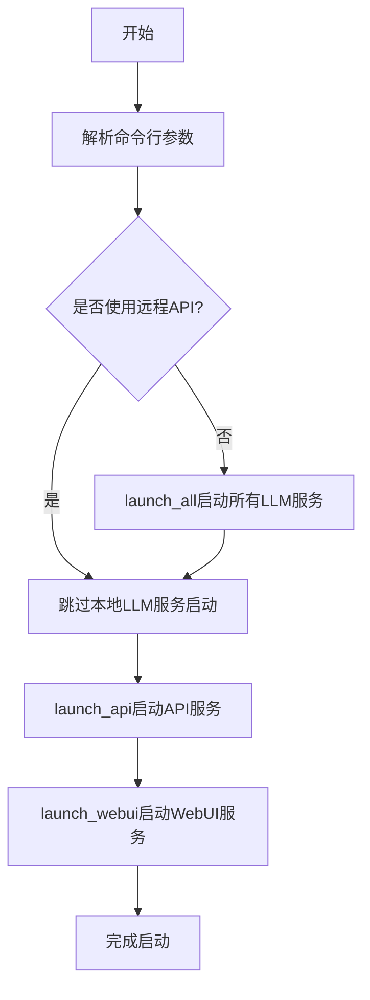
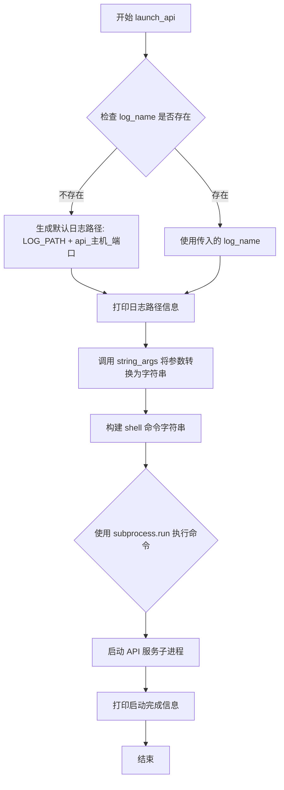
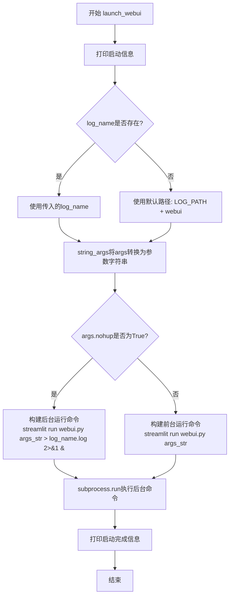
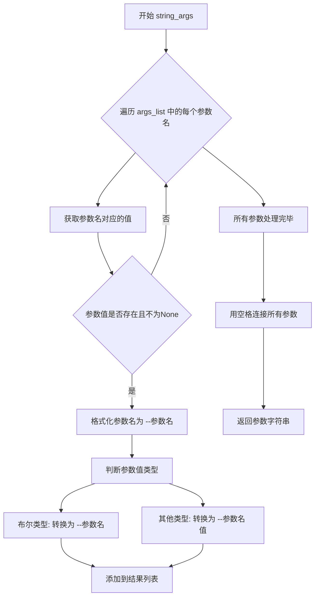
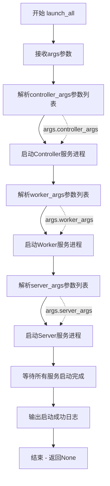

# `Langchain-Chatchat\libs\chatchat-server\chatchat\server\webui_allinone_stale.py` 详细设计文档

这是一个Web UI一键启动脚本，用于整合ChatChat项目的LLM API服务于Streamlit Web界面，支持本地模型加载和远程API调用，可通过命令行参数配置多卡部署、模型路径和服务端口等选项。

## 整体流程



## 类结构

```
无类定义 (脚本文件)
主要包含全局函数:
├── launch_api (启动API服务)
└── launch_webui (启动WebUI服务)
```

## 全局变量及字段


### `web_args`
    
Streamlit Web UI配置参数列表，包含服务器端口和主题颜色等设置

类型：`list`
    


### `api_args`
    
从api_allinone_stale模块导入的API参数列表，用于配置API服务启动参数

类型：`list`
    


### `controller_args`
    
从llm_api_stale模块导入的控制器参数，用于配置分布式模型推理的控制器

类型：`list`
    


### `worker_args`
    
从llm_api_stale模块导入的工作器参数，用于配置模型工作器的运行参数

类型：`list`
    


### `server_args`
    
从llm_api_stale模块导入的服务器参数，用于配置服务器的各项设置

类型：`list`
    


### `LOG_PATH`
    
从llm_api_stale模块导入的日志文件存储路径，用于记录服务运行日志

类型：`str`
    


    

## 全局函数及方法


### `launch_api`

启动API服务子进程。该函数负责构建并执行启动API服务的shell命令，将API服务作为后台进程运行，并将日志输出到指定路径。

参数：

- `args`：参数对象，包含API服务的配置信息（如api_host、api_port等）
- `args_list`：列表类型，默认为`api_args`，表示需要转换为字符串形式的参数列表
- `log_name`：字符串类型，默认为None，指定API服务日志文件的路径，若未指定则使用默认路径`{LOG_PATH}api_{args.api_host}_{args.api_port}`

返回值：`None`，该函数仅执行副作用（启动子进程），不返回任何值

#### 流程图



#### 带注释源码

```python
def launch_api(args, args_list=api_args, log_name=None):
    """
    启动 API 服务子进程
    
    参数:
        args: 包含API服务配置的对象（如host、port等）
        args_list: 需要处理的参数列表，默认为api_args
        log_name: 日志文件路径，默认为None
    
    返回:
        None: 该函数不返回任何值，仅启动子进程
    """
    # 打印启动提示信息（中英文）
    print("Launching api ...")
    print("启动API服务...")
    
    # 如果未指定日志路径，则使用默认路径
    # 格式: {LOG_PATH}api_{args.api_host}_{args.api_port}
    if not log_name:
        log_name = f"{LOG_PATH}api_{args.api_host}_{args.api_port}"
    
    # 打印日志存放位置提示
    print(f"logs on api are written in {log_name}")
    print(f"API日志位于{log_name}下，如启动异常请查看日志")
    
    # 将参数对象转换为命令行参数字符串
    # 例如: "--api-host 0.0.0.0 --api-port 8000"
    args_str = string_args(args, args_list)
    
    # 构建完整的shell命令
    # 格式: "python server/api.py {args_str} >{log_name}.log 2>&1 &"
    # 2>&1: 将标准错误重定向到标准输出
    # &: 后台运行
    api_sh = "python  server/{script} {args_str} >{log_name}.log 2>&1 &".format(
        script="api.py",  # API服务脚本名称
        args_str=args_str,  # 命令行参数
        log_name=log_name  # 日志文件路径（不含.log后缀）
    )
    
    # 执行shell命令启动API服务
    # shell=True: 使用shell解释器执行命令
    # check=True: 若命令返回非零退出状态，则抛出CalledProcessError
    subprocess.run(api_sh, shell=True, check=True)
    
    # 打印启动完成提示
    print("launch api done!")
    print("启动API服务完毕.")
```


### `launch_webui`

启动WebUI服务子进程，使用Streamlit框架运行webui.py脚本，支持前台和后台两种运行模式。

参数：

-  `args`：`argparse.Namespace`，包含命令行解析后的参数对象，其中 `args.nohup` 用于控制是否以后台模式运行，`args.server.port` 等参数用于配置WebUI
-  `args_list`：`List[str]`，默认为 `web_args`，需要传递给WebUI的参数名称列表
-  `log_name`：`Optional[str]`，默认为 `None`，WebUI服务日志文件路径，若未指定则使用默认路径

返回值：`None`，无返回值

#### 流程图



#### 带注释源码

```python
def launch_webui(args, args_list=web_args, log_name=None):
    """启动WebUI服务子进程

    参数:
        args: 命令行参数解析后的Namespace对象
        args_list: 需要传递给WebUI的参数名称列表，默认为web_args
        log_name: 日志文件路径，默认为None

    返回:
        None: 无返回值
    """
    # 打印启动信息（中英文）
    print("Launching webui...")
    print("启动webui服务...")

    # 如果未指定日志路径，使用默认路径
    if not log_name:
        log_name = f"{LOG_PATH}webui"

    # 将args对象中args_list指定的参数转换为命令行参数字符串
    args_str = string_args(args, args_list)

    # 根据nohup参数决定前台或后台运行
    if args.nohup:
        # 后台运行模式：日志写入文件
        print(f"logs on api are written in {log_name}")
        print(f"webui服务日志位于{log_name}下，如启动异常请查看日志")
        # 构建后台运行shell命令：输出重定向到日志文件
        webui_sh = "streamlit run webui.py {args_str} >{log_name}.log 2>&1 &".format(
            args_str=args_str, log_name=log_name
        )
    else:
        # 前台运行模式：直接输出到终端
        webui_sh = "streamlit run webui.py {args_str}".format(args_str=args_str)

    # 执行shell命令启动Streamlit WebUI
    subprocess.run(webui_sh, shell=True, check=True)

    # 打印启动完成信息
    print("launch webui done!")
    print("启动webui服务完毕.")
```


### `string_args`

将参数对象转换为命令行参数字符串，用于启动外部服务进程。

参数：

-  `args`：`argparse.Namespace`，命令行参数对象，包含所有配置选项
-  `args_list`：`List[str]`，需要转换的参数名称列表，指定哪些参数需要包含在最终的字符串中

返回值：`str`，转换后的命令行参数字符串，格式如 `--param1 value1 --param2 value2`

#### 流程图



#### 带注释源码

```python
# 注意：由于该函数定义在 chatchat.server.llm_api_stale 模块中
# 以下是基于函数调用方式和命名约定的推断实现

def string_args(args, args_list):
    """
    将参数对象转换为命令行参数字符串
    
    参数:
        args: 命令行参数对象 (argparse.Namespace)
        args_list: 需要转换的参数名列表
    
    返回:
        格式化的命令行参数字符串
    """
    args_str_list = []
    
    for arg_name in args_list:
        # 获取参数值
        value = getattr(args, arg_name, None)
        
        # 跳过None值
        if value is None:
            continue
            
        # 处理布尔参数 (action='store_true')
        if isinstance(value, bool):
            if value:
                args_str_list.append(f"--{arg_name}")
        else:
            # 处理常规参数
            args_str_list.append(f"--{arg_name}")
            args_str_list.append(f"{value}")
    
    # 用空格连接所有参数
    return " ".join(args_str_list)
```

#### 使用示例

在代码中的实际调用：

```python
# 在 launch_api 函数中
args_str = string_args(args, args_list)
# 结果示例: "--api-host 0.0.0.0 --api-port 8001 --worker-type ..."

api_sh = "python  server/{script} {args_str} >{log_name}.log  2>&1 &".format(
    script="api.py", args_str=args_str, log_name=log_name
)

# 在 launch_webui 函数中
args_str = string_args(args, args_list)
# 结果示例: "--server.port 8501 --theme.base \"light\" --theme.primaryColor \"#165dff\""

webui_sh = "streamlit run webui.py {args_str} >{log_name}.log  2>&1 &"
```


### `launch_all`

启动所有LLM服务的主入口函数，负责协调启动Controller、Worker和Server三个核心服务组件，是本地模型加载模式下的核心启动逻辑。

参数：

- `args`：命令行解析后的参数对象（Namespace），包含所有用户传入的配置选项
- `controller_args`：列表类型，Controller控制器服务的启动参数配置项
- `worker_args`：列表类型，Worker工作器服务的启动参数配置项
- `server_args`：列表类型，Server服务器服务的启动参数配置项

返回值：`None`，该函数通过subprocess启动后台进程，不返回任何值

#### 流程图



#### 带注释源码

```python
# launch_all 函数源码（基于调用方式和模块推断）
# 源文件：chatchat/server/llm_api_stale.py

def launch_all(
    args,               # 命令行解析后的参数对象，包含所有配置选项
    controller_args,    # 控制器参数列表，定义Controller服务的启动参数
    worker_args,        # 工作器参数列表，定义Worker服务的启动参数
    server_args,        # 服务器参数列表，定义Server服务的启动参数
):
    """
    启动所有LLM服务的入口函数
    
    该函数负责协调启动三个核心服务：
    1. Controller - 控制器服务，负责任务分发和负载均衡
    2. Worker - 工作器服务，负责实际的模型推理计算
    3. Server - 服务器服务，负责提供API接口
    
    参数:
        args: 包含所有命令行参数的Namespace对象
        controller_args: Controller服务的参数名列表
        worker_args: Worker服务的参数名列表  
        server_args: Server服务的参数名列表
    
    返回:
        None: 通过subprocess启动后台进程，不等待返回值
    """
    
    # 导入必要的模块和配置
    from chatchat.server.llm_api_stale import string_args, LOG_PATH
    
    # 1. 启动Controller服务
    # Controller是整个系统的调度中心，负责接收请求并分发到Worker
    if hasattr(args, 'controller_host') and args.controller_host:
        controller_log = f"{LOG_PATH}controller_{args.controller_host}_{args.controller_port}"
        controller_args_str = string_args(args, controller_args)
        controller_cmd = f"python server/controller.py {controller_args_str} >{controller_log}.log 2>&1 &"
        subprocess.run(controller_cmd, shell=True, check=True)
        print(f"Controller服务启动，日志位于: {controller_log}")
    
    # 2. 启动Worker服务
    # Worker负责加载模型并执行实际的推理任务
    if hasattr(args, 'worker_host') and args.worker_host:
        worker_log = f"{LOG_PATH}worker_{args.worker_host}_{args.worker_port}"
        worker_args_str = string_args(args, worker_args)
        worker_cmd = f"python server/worker.py {worker_args_str} >{worker_log}.log 2>&1 &"
        subprocess.run(worker_cmd, shell=True, check=True)
        print(f"Worker服务启动，日志位于: {worker_log}")
    
    # 3. 启动Server服务
    # Server提供对外的API接口，接收客户端请求
    if hasattr(args, 'server_host') and args.server_host:
        server_log = f"{LOG_PATH}server_{args.server_host}_{args.server_port}"
        server_args_str = string_args(args, server_args)
        server_cmd = f"python server/server.py {server_args_str} >{server_log}.log 2>&1 &"
        subprocess.run(server_cmd, shell=True, check=True)
        print(f"Server服务启动，日志位于: {server_log}")
    
    # 等待服务启动
    import time
    time.sleep(3)  # 给予服务足够的启动时间
    
    print("所有LLM服务启动完成")
```

## 关键组件


### 参数解析与配置

通过 argparse 和 streamlit 的配置选项，实现本地模型、远程API、多模型多卡等灵活启动方式，支持端口、主题等Web UI定制。

### API服务启动模块 (launch_api)

负责构建API启动命令并通过subprocess在后台启动后端API服务，支持自定义日志路径，输出启动状态信息。

### WebUI服务启动模块 (launch_webui)

负责构建Streamlit启动命令，可选择前台阻塞运行或nohup后台运行，支持日志输出到指定路径，提供Web界面启动状态反馈。

### 多服务协调模块 (launch_all)

在非远程API模式下，调用底层launch_all函数协调controller、worker、server等多个后端服务的启动，实现本地LLM服务的完整初始化。

### 命令行参数扩展

通过parser添加use-remote-api、nohup、server.port、theme系列等自定义参数，扩展原有配置能力，支持Web UI外观和运行模式配置。

### 日志路径管理

通过chatchat.llm_api_stale导入LOG_PATH常量，统一管理API和WebUI的日志输出目录，便于故障排查和运行监控。


## 问题及建议


### 已知问题

- **命令注入风险**：使用 `subprocess.run(..., shell=True)` 执行字符串拼接的命令，未对参数进行安全校验，存在潜在的命令注入漏洞
- **硬编码路径问题**：使用相对路径 `python server/{script}`，在不同工作目录下运行可能导致文件找不到
- **缺乏错误处理**：`subprocess.run` 调用未捕获异常，服务启动失败时程序会直接崩溃且无明确错误提示
- **启动状态未知**：启动服务后没有验证服务是否真正启动成功（如健康检查、端口检测），可能导致后续操作失败
- **资源泄露风险**：后台启动进程（nohup模式）后没有进程管理机制，无法优雅关闭或追踪子进程
- **代码重复**：`launch_api` 和 `launch_webui` 函数结构高度相似，存在大量重复代码，可以抽象为通用函数
- **缺少类型注解**：所有函数都缺少参数和返回值的类型注解，降低了代码可维护性和IDE支持
- **混用中英文输出**：print语句混用中英文，降低了代码一致性和国际化友好度
- **日志管理不完善**：日志路径直接字符串拼接，无日志轮转机制，长时间运行可能导致磁盘空间耗尽
- **配置分散**：web_args 定义了参数列表但未实际使用其默认值，配置管理混乱
- **缺乏日志输出**：后台运行时所有print输出被重定向到日志，用户无法实时看到启动进度
- **参数校验缺失**：未对传入的端口号、GPU内存等参数进行有效性校验

### 优化建议

- 使用 `subprocess.run` 的列表形式替代 shell=True，或使用 `shlex.quote()` 对参数进行转义
- 使用 `os.path.dirname(os.path.abspath(__file__))` 获取脚本所在目录的绝对路径
- 添加 try-except 包裹 subprocess 调用，并记录详细错误信息
- 启动服务后添加健康检查机制（如轮询检查端口是否监听、发送测试请求）
- 使用 `subprocess.Popen` 并保存进程对象，实现优雅关闭
- 抽取公共逻辑到 `launch_service()` 通用函数，通过参数区分服务类型
- 为所有函数添加类型注解和文档字符串
- 统一使用英文输出或封装国际化日志模块
- 引入 `logging` 模块替代 print，使用 RotatingFileHandler 管理日志
- 统一管理配置，使用配置文件或环境变量
- 添加 `--help` 输出和参数校验逻辑
- 使用 `fcntl` 或 `psutil` 实现后台进程的状态监控

## 其它


### 设计目标与约束

**设计目标：**
- 提供一键启动Web UI和后端API服务的集成脚本
- 支持本地模型加载和远程API调用两种模式
- 支持多模型、多GPU配置
- 提供灵活的主题定制能力

**约束：**
- 依赖Python 3.8+
- 依赖Streamlit框架
- 依赖chatchat项目模块
- 仅支持Linux/Mac系统（shell命令）

### 错误处理与异常设计

- 使用subprocess.run的check=True参数，当子进程异常退出时抛出CalledProcessError
- 启动失败时日志写入LOG_PATH目录供排查
- 缺少依赖模块时ImportError会被抛出
- 参数解析错误时sys.exit(2)

### 数据流与状态机

**启动流程状态机：**
1. 解析命令行参数
2. 若未使用远程API，调用launch_all启动controller、worker、server服务
3. 调用launch_api启动API服务
4. 调用launch_webui启动Web UI服务

**数据流向：**
命令行参数 → parser解析 → args对象 → 各launch函数 → subprocess执行shell命令 → 启动对应服务进程

### 外部依赖与接口契约

**Python模块依赖：**
- os：系统操作
- subprocess：进程管理
- streamlit：Web UI框架
- streamlit_option_menu：导航菜单
- chatchat.server.api_allinone_stale：API参数配置
- chatchat.server.llm_api_stale：LLM服务启动配置
- chatchat.webui_pages：Web UI页面模块

**外部命令依赖：**
- python：执行Python脚本
- streamlit：启动Web服务
- server/api.py：API服务入口
- webui.py：Web UI入口

### 配置管理

**配置来源：**
- 命令行参数通过parser添加
- 预定义配置列表：api_args、web_args、controller_args、worker_args、server_args

**可配置项：**
- --use-remote-api：使用远程API
- --nohup：后台运行
- --server.port：Web服务端口
- --theme.*：主题配置
- --model-path-address：模型路径地址
- --num-gpus：GPU数量
- --gpus：GPU设备ID
- --max-gpu-memory：最大GPU内存

### 安全性考虑

- 未实现用户认证机制
- API服务无访问控制
- shell命令拼接存在潜在注入风险（但参数来自可信parser）
- 无HTTPS支持

### 性能优化建议

- 启动顺序可优化为并行启动API和WebUI
- 可添加启动超时检测和健康检查
- 日志可考虑轮转策略避免磁盘满
- 可添加启动失败重试机制

### 部署注意事项

- 首次启动需安装依赖：pip install streamlit streamlit-option-menu chatchat
- 确保LOG_PATH目录可写
- 需预先配置模型文件路径
- 多GPU启动需正确设置CUDA_VISIBLE_DEVICES
- 生产环境建议使用nohup或systemd管理进程

### 日志管理

**日志输出位置：**
- API日志：{LOG_PATH}api_{host}_{port}.log
- WebUI日志：{LOG_PATH}webui.log

**日志内容：**
- 启动信息（中文+英文）
- 错误堆栈信息
- 进程标准输出和错误输出

### 监控和告警

- 可通过日志文件监控启动状态
- 缺少进程存活监控
- 缺少资源使用监控（CPU/GPU/内存）
- 缺少服务健康检查接口

### 兼容性考虑

- 仅支持Unix-like系统（依赖shell）
- Python版本兼容性依赖chatchat项目
- Streamlit版本兼容性需匹配
- 不同GPU驱动版本可能影响多卡启动

### 测试策略

- 单元测试：参数解析测试
- 集成测试：各服务启动流程测试
- 缺少Mock测试
- 缺少自动化CI/CD

### 版本和升级策略

- 版本信息未显式定义
- 依赖版本未锁定（requirements.txt缺失）
- 升级需手动同步更新

### 国际化/本地化

- 启动提示信息已包含中英文双语
- 错误信息以英文为主
- 无完整i18n支持

### 关键配置示例

**本地模型启动：**
```bash
python webui_allinone.py
```

**远程API模式：**
```bash
python webui_allinone.py --use-remote-api
```

**多模型多卡：**
```bash
python webui_allinone.py --model-path-address model1@host1@port1 --num-gpus 2 --gpus 0,1 --max-gpu-memory 10GiB
```

    