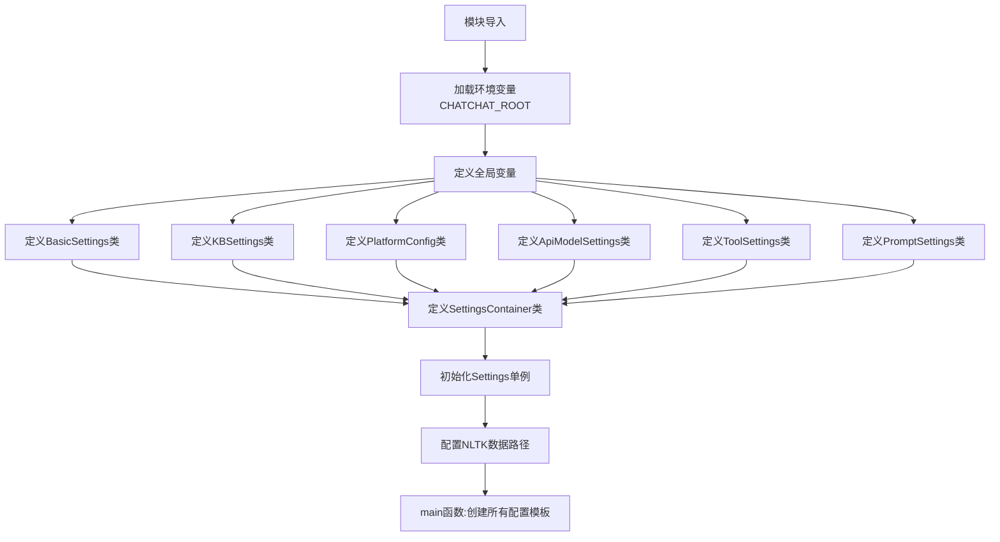
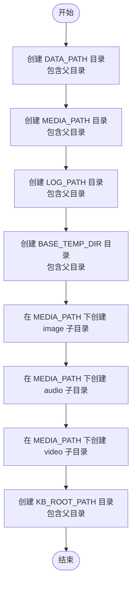
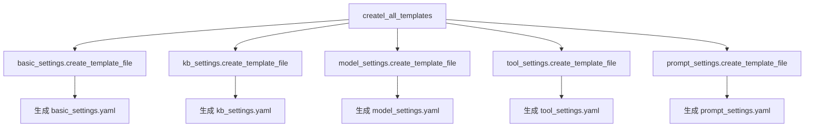
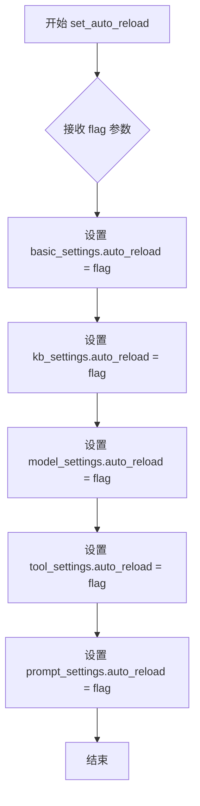
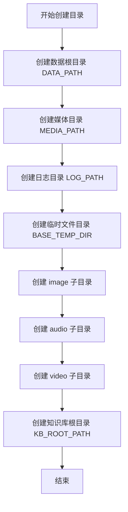
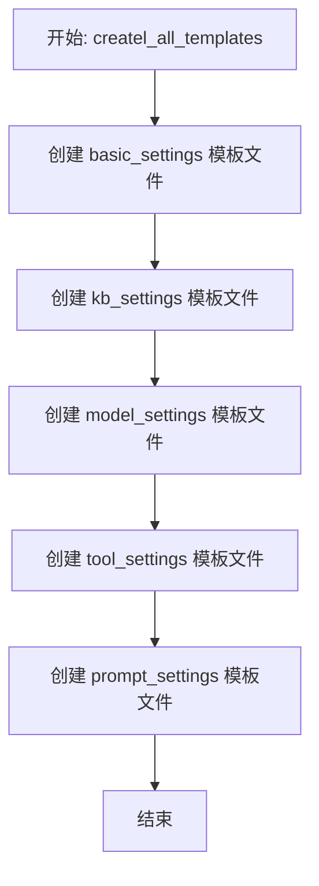

# `Langchain-Chatchat\libs\chatchat-server\chatchat\settings.py` 详细设计文档

这是 ChatChat 项目的配置管理模块，定义了基于 Pydantic 的多层次配置类，用于管理服务器基础设置、知识库配置、模型平台配置、Agent 工具配置和 Prompt 模板，支持 YAML/JSON 文件持久化和自动模板生成。

## 整体流程



## 类结构

```
BaseFileSettings (pydantic_settings.BaseSettings)
├── BasicSettings
│   └── make_dirs()
├── KBSettings
├── ApiModelSettings
│   └── PlatformConfig (嵌套类/MyBaseModel)
├── ToolSettings
├── PromptSettings
└── SettingsContainer
```

## 全局变量及字段


### `CHATCHAT_ROOT`
    
chatchat 数据目录，必须通过环境变量设置。如未设置则自动使用当前目录

类型：`Path`
    


### `XF_MODELS_TYPES`
    
模型类型映射配置，定义不同模型类型对应的模型系列

类型：`dict`
    


### `Settings`
    
全局设置容器，包含所有配置项的单一实例

类型：`SettingsContainer`
    


### `BasicSettings.version`
    
生成该配置模板的项目代码版本，如这里的值与程序实际版本不一致，建议重建配置文件模板

类型：`str`
    


### `BasicSettings.log_verbose`
    
是否开启日志详细信息

类型：`bool`
    


### `BasicSettings.HTTPX_DEFAULT_TIMEOUT`
    
httpx 请求默认超时时间（秒）。如果加载模型或对话较慢，出现超时错误，可以适当加大该值

类型：`float`
    


### `BasicSettings.PACKAGE_ROOT`
    
代码根目录

类型：`Path`
    


### `BasicSettings.DATA_PATH`
    
用户数据根目录

类型：`Path`
    


### `BasicSettings.IMG_DIR`
    
项目相关图片目录

类型：`Path`
    


### `BasicSettings.NLTK_DATA_PATH`
    
nltk 模型存储路径

类型：`Path`
    


### `BasicSettings.LOG_PATH`
    
日志存储路径

类型：`Path`
    


### `BasicSettings.MEDIA_PATH`
    
模型生成内容（图片、视频、音频等）保存位置

类型：`Path`
    


### `BasicSettings.BASE_TEMP_DIR`
    
临时文件目录，主要用于文件对话

类型：`Path`
    


### `BasicSettings.KB_ROOT_PATH`
    
知识库默认存储路径

类型：`str`
    


### `BasicSettings.DB_ROOT_PATH`
    
数据库默认存储路径。如果使用sqlite，可以直接修改DB_ROOT_PATH；如果使用其它数据库，请直接修改SQLALCHEMY_DATABASE_URI

类型：`str`
    


### `BasicSettings.SQLALCHEMY_DATABASE_URI`
    
知识库信息数据库连接URI

类型：`str`
    


### `BasicSettings.OPEN_CROSS_DOMAIN`
    
API 是否开启跨域

类型：`bool`
    


### `BasicSettings.DEFAULT_BIND_HOST`
    
各服务器默认绑定host。Windows 下 WEBUI 自动弹出浏览器时，如果地址为 0.0.0.0 是无法访问的，需要手动修改地址栏

类型：`str`
    


### `BasicSettings.API_SERVER`
    
API 服务器地址。其中 public_host 用于生成云服务公网访问链接（如知识库文档链接）

类型：`dict`
    


### `BasicSettings.WEBUI_SERVER`
    
WEBUI 服务器地址

类型：`dict`
    


### `KBSettings.DEFAULT_KNOWLEDGE_BASE`
    
默认使用的知识库

类型：`str`
    


### `KBSettings.DEFAULT_VS_TYPE`
    
默认向量库/全文检索引擎类型

类型：`Literal`
    


### `KBSettings.CACHED_VS_NUM`
    
缓存向量库数量（针对FAISS）

类型：`int`
    


### `KBSettings.CACHED_MEMO_VS_NUM`
    
缓存临时向量库数量（针对FAISS），用于文件对话

类型：`int`
    


### `KBSettings.CHUNK_SIZE`
    
知识库中单段文本长度(不适用MarkdownHeaderTextSplitter)

类型：`int`
    


### `KBSettings.OVERLAP_SIZE`
    
知识库中相邻文本重合长度(不适用MarkdownHeaderTextSplitter)

类型：`int`
    


### `KBSettings.VECTOR_SEARCH_TOP_K`
    
知识库匹配向量数量

类型：`int`
    


### `KBSettings.SCORE_THRESHOLD`
    
知识库匹配相关度阈值，取值范围在0-2之间，SCORE越小，相关度越高，取到2相当于不筛选，建议设置在0.5左右

类型：`float`
    


### `KBSettings.DEFAULT_SEARCH_ENGINE`
    
默认搜索引擎

类型：`Literal`
    


### `KBSettings.SEARCH_ENGINE_TOP_K`
    
搜索引擎匹配结题数量

类型：`int`
    


### `KBSettings.ZH_TITLE_ENHANCE`
    
是否开启中文标题加强，以及标题增强的相关配置

类型：`bool`
    


### `KBSettings.PDF_OCR_THRESHOLD`
    
PDF OCR 控制：只对宽高超过页面一定比例的图片进行 OCR，避免小图片干扰，提高非扫描版 PDF 处理速度

类型：`Tuple`
    


### `KBSettings.KB_INFO`
    
每个知识库的初始化介绍，用于在初始化知识库时显示和Agent调用

类型：`Dict`
    


### `KBSettings.kbs_config`
    
可选向量库类型及对应配置

类型：`Dict`
    


### `KBSettings.text_splitter_dict`
    
TextSplitter配置项，定义文本分词器的配置参数

类型：`Dict`
    


### `KBSettings.TEXT_SPLITTER_NAME`
    
TEXT_SPLITTER 名称

类型：`str`
    


### `KBSettings.EMBEDDING_KEYWORD_FILE`
    
Embedding模型定制词语的词表文件

类型：`str`
    


### `PlatformConfig.platform_name`
    
平台名称

类型：`str`
    


### `PlatformConfig.platform_type`
    
平台类型

类型：`Literal`
    


### `PlatformConfig.api_base_url`
    
openai api url

类型：`str`
    


### `PlatformConfig.api_key`
    
api key if available

类型：`str`
    


### `PlatformConfig.api_proxy`
    
API 代理

类型：`str`
    


### `PlatformConfig.api_concurrencies`
    
该平台单模型最大并发数

类型：`int`
    


### `PlatformConfig.auto_detect_model`
    
是否自动获取平台可用模型列表。设为 True 时下方不同模型类型可自动检测

类型：`bool`
    


### `PlatformConfig.llm_models`
    
该平台支持的大语言模型列表，auto_detect_model 设为 True 时自动检测

类型：`Union`
    


### `PlatformConfig.embed_models`
    
该平台支持的嵌入模型列表，auto_detect_model 设为 True 时自动检测

类型：`Union`
    


### `PlatformConfig.text2image_models`
    
该平台支持的图像生成模型列表，auto_detect_model 设为 True 时自动检测

类型：`Union`
    


### `PlatformConfig.image2text_models`
    
该平台支持的多模态模型列表，auto_detect_model 设为 True 时自动检测

类型：`Union`
    


### `PlatformConfig.rerank_models`
    
该平台支持的重排模型列表，auto_detect_model 设为 True 时自动检测

类型：`Union`
    


### `PlatformConfig.speech2text_models`
    
该平台支持的 STT 模型列表，auto_detect_model 设为 True 时自动检测

类型：`Union`
    


### `PlatformConfig.text2speech_models`
    
该平台支持的 TTS 模型列表，auto_detect_model 设为 True 时自动检测

类型：`Union`
    


### `ApiModelSettings.DEFAULT_LLM_MODEL`
    
默认选用的 LLM 名称

类型：`str`
    


### `ApiModelSettings.DEFAULT_EMBEDDING_MODEL`
    
默认选用的 Embedding 名称

类型：`str`
    


### `ApiModelSettings.Agent_MODEL`
    
AgentLM模型的名称 (可以不指定，指定之后就锁定进入Agent之后的Chain的模型，不指定就是 DEFAULT_LLM_MODEL)

类型：`str`
    


### `ApiModelSettings.HISTORY_LEN`
    
默认历史对话轮数

类型：`int`
    


### `ApiModelSettings.MAX_TOKENS`
    
大模型最长支持的长度，如果不填写，则使用模型默认的最大长度，如果填写，则为用户设定的最大长度

类型：`Optional[int]`
    


### `ApiModelSettings.TEMPERATURE`
    
LLM通用对话参数

类型：`float`
    


### `ApiModelSettings.SUPPORT_AGENT_MODELS`
    
支持的Agent模型

类型：`List[str]`
    


### `ApiModelSettings.LLM_MODEL_CONFIG`
    
LLM模型配置，包括了不同模态初始化参数

类型：`Dict`
    


### `ApiModelSettings.MODEL_PLATFORMS`
    
模型平台配置

类型：`List[PlatformConfig]`
    


### `ToolSettings.search_local_knowledgebase`
    
本地知识库工具配置项

类型：`dict`
    


### `ToolSettings.search_internet`
    
搜索引擎工具配置项。推荐自己部署 searx 搜索引擎，国内使用最方便

类型：`dict`
    


### `ToolSettings.arxiv`
    
ArXiv 学术论文搜索工具配置项

类型：`dict`
    


### `ToolSettings.weather_check`
    
心知天气（https://www.seniverse.com/）工具配置项

类型：`dict`
    


### `ToolSettings.search_youtube`
    
YouTube 视频搜索工具配置项

类型：`dict`
    


### `ToolSettings.wolfram`
    
Wolfram Alpha 计算知识引擎工具配置项

类型：`dict`
    


### `ToolSettings.calculate`
    
numexpr 数学计算工具配置项

类型：`dict`
    


### `ToolSettings.text2images`
    
图片生成工具配置项。model 必须是在 model_settings.yaml/MODEL_PLATFORMS 中配置过的

类型：`dict`
    


### `ToolSettings.text2sql`
    
text2sql 工具配置项，用于自然语言转 SQL 查询数据库

类型：`dict`
    


### `ToolSettings.amap`
    
高德地图、天气相关工具配置项

类型：`dict`
    


### `ToolSettings.text2promql`
    
Prometheus 查询语言工具配置项，用于自然语言转 PromQL 查询指标

类型：`dict`
    


### `ToolSettings.url_reader`
    
URL内容阅读（https://r.jina.ai/）工具配置项

类型：`dict`
    


### `PromptSettings.preprocess_model`
    
意图识别用模板

类型：`dict`
    


### `PromptSettings.llm_model`
    
普通 LLM 用模板

类型：`dict`
    


### `PromptSettings.rag`
    
RAG 用模板，可用于知识库问答、文件对话、搜索引擎对话

类型：`dict`
    


### `PromptSettings.action_model`
    
Agent 模板

类型：`dict`
    


### `PromptSettings.postprocess_model`
    
后处理模板

类型：`dict`
    


### `SettingsContainer.basic_settings`
    
服务器基本配置实例

类型：`BasicSettings`
    


### `SettingsContainer.kb_settings`
    
知识库相关配置实例

类型：`KBSettings`
    


### `SettingsContainer.model_settings`
    
模型配置实例

类型：`ApiModelSettings`
    


### `SettingsContainer.tool_settings`
    
Agent 工具配置实例

类型：`ToolSettings`
    


### `SettingsContainer.prompt_settings`
    
Prompt 模板配置实例

类型：`PromptSettings`
    
    

## 全局函数及方法


### `BasicSettings.make_dirs`

创建所有必要的应用数据目录，包括数据根目录、媒体目录、日志目录、临时目录以及知识库根目录，并确保所需的子目录结构完整。

参数：无（仅使用实例属性 `self`）

返回值：`None`，该方法不返回任何值，仅执行目录创建操作

#### 流程图



#### 带注释源码

```python
def make_dirs(self):
    '''创建所有数据目录'''
    # 遍历需要创建的主要目录列表
    for p in [
        self.DATA_PATH,        # 用户数据根目录
        self.MEDIA_PATH,       # 模型生成内容保存位置
        self.LOG_PATH,         # 日志存储路径
        self.BASE_TEMP_DIR,    # 临时文件目录
    ]:
        # 使用 mkdir 创建目录，parents=True 确保创建所有父目录
        # exist_ok=True 避免目录已存在时抛出异常
        p.mkdir(parents=True, exist_ok=True)
    
    # 为不同类型的媒体文件创建专门的子目录
    for n in ["image", "audio", "video"]:
        # 在 MEDIA_PATH 下创建 image、audio、video 三个子目录
        (self.MEDIA_PATH / n).mkdir(parents=True, exist_ok=True)
    
    # 单独创建知识库根目录
    # KB_ROOT_PATH 是字符串类型，需要先转换为 Path 对象
    Path(self.KB_ROOT_PATH).mkdir(parents=True, exist_ok=True)
```


### `SettingsContainer.createl_all_templates`

该方法用于生成项目所需的所有配置文件模板，包括基础配置、知识库配置、模型配置、工具配置和提示词配置的模板文件。

参数：无

返回值：`None`，该方法直接写入配置文件到磁盘，不返回任何值。

#### 流程图



#### 带注释源码

```
def createl_all_templates(self):
    """
    创建所有配置文件的模板文件
    该方法会遍历所有设置类，生成对应的YAML/JSON配置文件模板
    """
    # 生成基础配置文件 basic_settings.yaml
    # 包含服务器基本配置如日志、超时、路径等
    self.basic_settings.create_template_file(write_file=True)
    
    # 生成知识库配置文件 kb_settings.yaml
    # 包含知识库相关配置如向量库类型、分块大小、搜索引擎等
    self.kb_settings.create_template_file(write_file=True)
    
    # 生成模型配置文件 model_settings.yaml
    # 包含模型平台配置、LLM模型参数等
    # sub_comments 参数用于为 MODEL_PLATFORMS 添加注释说明
    self.model_settings.create_template_file(sub_comments={
        "MODEL_PLATFORMS": {"model_obj": PlatformConfig(),
                            "is_entire_comment": True}},
        write_file=True)
    
    # 生成工具配置文件 tool_settings.yaml
    # 包含 Agent 工具配置如知识库搜索、互联网搜索、天气等
    # 指定 file_format="yaml" 格式
    self.tool_settings.create_template_file(write_file=True, file_format="yaml", model_obj=ToolSettings())
    
    # 生成提示词配置文件 prompt_settings.yaml
    # 包含各种场景的提示词模板
    self.prompt_settings.create_template_file(write_file=True, file_format="yaml")
```


### `SettingsContainer.set_auto_reload`

设置所有配置对象的自动重载标志，用于控制配置文件的热重载功能。

参数：

- `flag`：`bool`，控制是否开启自动重载，默认为 `True`

返回值：`None`，无返回值

#### 流程图



#### 带注释源码

```python
def set_auto_reload(self, flag: bool = True):
    """
    设置所有配置对象的自动重载标志
    
    该方法用于批量设置 SettingsContainer 中所有配置对象的 auto_reload 属性，
    以实现配置热重载功能的统一开关控制。当 flag 为 True 时，配置文件修改后
    会自动重新加载；为 False 时则需要手动重启服务才能使配置生效。
    
    参数:
        flag: bool, 控制是否开启自动重载, 默认为 True
    
    返回:
        None
    """
    self.basic_settings.auto_reload = flag  # 设置基础配置的自动重载
    self.kb_settings.auto_reload = flag     # 设置知识库配置的自动重载
    self.model_settings.auto_reload = flag  # 设置模型配置的自动重载
    self.tool_settings.auto_reload = flag   # 设置工具配置的自动重载
    self.prompt_settings.auto_reload = flag # 设置提示词配置的自动重载
```


### `BasicSettings.make_dirs`

创建所有项目所需的数据目录，包括数据根目录、媒体目录、日志目录、临时文件目录以及知识库根目录，并创建媒体目录下的图片、音频、视频子目录。

参数：

- 无

返回值：`None`，该方法不返回任何值，仅执行目录创建操作

#### 流程图



#### 带注释源码

```python
def make_dirs(self):
    '''创建所有数据目录'''
    # 遍历主目录列表，创建所有必要的根目录
    for p in [
        self.DATA_PATH,        # 用户数据根目录
        self.MEDIA_PATH,       # 模型生成内容（图片、视频、音频等）保存位置
        self.LOG_PATH,         # 日志存储路径
        self.BASE_TEMP_DIR,    # 临时文件目录，主要用于文件对话
    ]:
        # parents=True 允许创建多级目录，exist_ok=True 避免目录已存在时报错
        p.mkdir(parents=True, exist_ok=True)
    
    # 在媒体目录下创建图片、音频、视频子目录
    for n in ["image", "audio", "video"]:
        (self.MEDIA_PATH / n).mkdir(parents=True, exist_ok=True)
    
    # 创建知识库默认存储路径
    Path(self.KB_ROOT_PATH).mkdir(parents=True, exist_ok=True)
```


### `SettingsContainer.createl_all_templates`

该方法用于初始化并创建所有配置文件的模板文件，包括基础配置、知识库配置、模型配置、工具配置和提示词配置的模板文件写入磁盘。

参数：无

返回值：`None`，无返回值

#### 流程图



#### 带注释源码

```python
def createl_all_templates(self):
    """
    创建所有配置文件的模板文件
    
    该方法会依次调用各个配置对象的 create_template_file 方法，
    将配置模板写入磁盘，用于初始化配置文件。
    """
    # 创建基础配置模板文件（basic_settings.yaml）
    self.basic_settings.create_template_file(write_file=True)
    
    # 创建知识库配置模板文件（kb_settings.yaml）
    self.kb_settings.create_template_file(write_file=True)
    
    # 创建模型配置模板文件（model_settings.yaml）
    # 包含 MODEL_PLATFORMS 的子注释配置，指定 PlatformConfig 作为模型对象
    self.model_settings.create_template_file(sub_comments={
        "MODEL_PLATFORMS": {"model_obj": PlatformConfig(),
                            "is_entire_comment": True}},
        write_file=True)
    
    # 创建工具配置模板文件（tool_settings.yaml）
    # 指定 yaml 格式和 ToolSettings 作为模型对象
    self.tool_settings.create_template_file(write_file=True, file_format="yaml", model_obj=ToolSettings())
    
    # 创建提示词配置模板文件（prompt_settings.yaml）
    # 指定 yaml 格式
    self.prompt_settings.create_template_file(write_file=True, file_format="yaml")
```


### `SettingsContainer.set_auto_reload`

该方法用于统一设置所有配置模块的自动重载功能，通过将传入的布尔值同步到各个配置对象的 `auto_reload` 属性，实现配置热更新能力的全局开关控制。

参数：

- `flag`：`bool`，是否启用自动重新加载。设置为 `True` 时开启配置自动重载，设置为 `False` 时关闭

返回值：`None`，无返回值

#### 流程图


#### 带注释源码

```python
def set_auto_reload(self, flag: bool = True):
    """
    统一设置所有配置模块的自动重载功能
    
    参数:
        flag: bool, 是否启用自动重新加载。默认为 True
              True - 开启配置自动重载，配置文件变更时会自动重新加载
              False - 关闭配置自动重载
    
    返回值:
        None
    
    说明:
        该方法会同时设置以下五个配置对象的 auto_reload 属性:
        - basic_settings: 基础配置
        - kb_settings: 知识库配置
        - model_settings: 模型配置
        - tool_settings: 工具配置
        - prompt_settings: 提示词配置
    """
    # 设置基础配置的自动重载开关
    self.basic_settings.auto_reload = flag
    
    # 设置知识库配置的自动重载开关
    self.kb_settings.auto_reload = flag
    
    # 设置模型配置的自动重载开关
    self.model_settings.auto_reload = flag
    
    # 设置工具配置的自动重载开关
    self.tool_settings.auto_reload = flag
    
    # 设置提示词配置的自动重载开关
    self.prompt_settings.auto_reload = flag
```

## 关键组件


### CHATCHAT_ROOT

项目数据根目录，通过环境变量设置，未设置时默认为当前目录，用于确定所有数据文件的存储基础路径。

### BasicSettings

服务器基本配置类，包含版本信息、日志配置、HTTP超时设置、数据目录路径（用户数据、图片、媒体、日志、临时文件）、知识库路径、数据库连接URI、服务器绑定地址等核心运行参数。

### KBSettings

知识库相关配置类，定义知识库默认名称、向量库类型、文本分块参数、搜索相关度阈值、搜索引擎配置、OCR阈值、知识库初始化信息以及多种向量库（faiss、milvus、pg、es等）的连接参数。

### PlatformConfig

模型加载平台配置类，支持xinference、ollama、oneapi、fastchat、openai等多种平台类型，包含API地址、密钥、并发数、模型列表（LLM、embedding、多模态、TTS、STT等）的配置。

### ApiModelSettings

模型配置项类，定义默认LLM模型、embedding模型、历史对话轮数、生成参数温度、支持的Agent模型列表，以及不同用途模型（预处理、LLM、动作、后处理、图像）的详细配置参数。

### ToolSettings

Agent工具配置类，包含本地知识库搜索、互联网搜索、arxiv、天气查询、YouTube搜索、Wolfram数学计算、图片生成、text2sql、地图、PromQL查询、URL阅读等工具的启用状态和详细配置参数。

### PromptSettings

Prompt模板配置类，定义意图识别、通用LLM对话、RAG检索增强、Agent动作模型（支持openai-functions、glm3、qwen、structured-chat-agent等多种格式）的提示词模板。

### SettingsContainer

设置容器类，将所有配置类统一管理，提供创建所有配置模板文件和自动重载开关的功能，是整个配置系统的入口点。

### Settings (全局单例)

SettingsContainer的实例对象，提供对所有配置的统一访问入口，并在模块初始化时设置NLTK数据路径。


## 问题及建议


### 已知问题

- **配置重复**：VECTOR_SEARCH_TOP_K、SCORE_THRESHOLD、KB_INFO 等配置项在 KBSettings 中定义，但在 ToolSettings 中也存在相同或相似的配置（如 search_local_knowledgebase 中的 top_k 和 score_threshold），造成数据冗余和维护困难。
- **TODO 遗留问题**：代码中多处 TODO 注释表明存在已知的设计问题未解决，如 Agent_MODEL 和 MAX_TOKENS 与 LLM_MODEL_CONFIG 重复。
- **硬编码敏感信息**：api_key 默认值包含占位符（如 "EMPTY"、"sk-"），虽然用于开发环境，但容易在生产环境中泄露或被遗忘修改。
- **类型注解不够精确**：大量使用 `dict` 类型而非具体的 TypedDict 或 Pydantic 模型，导致类型安全性和代码可读性降低。
- **环境变量处理**：CHATCHAT_ROOT 回退到当前目录 (`.`) 可能导致意外行为，尤其是在不同工作目录下运行脚本时。
- **魔法值分散**：字符串 "default"、"auto"、数字 5 等硬编码值散布在多个类中，缺乏统一的常量定义。
- **导入依赖不明确**：从 `chatchat.pydantic_settings_file` 导入所有内容 (`import *`) 导致命名空间污染，且依赖关系不透明。

### 优化建议

- **消除配置冗余**：将知识库搜索参数（top_k、score_threshold）统一在单一配置源管理，或通过配置继承机制避免重复。
- **清理 TODO**：针对标记的重复配置项进行重构，明确各配置项的职责和边界。
- **强化类型安全**：将 `dict` 类型替换为具体的 TypedDict 或嵌套 Pydantic 模型，提高类型检查覆盖率。
- **配置验证**：在 BaseFileSettings 中增加敏感字段（如 api_key）的格式验证，防止生产环境使用不安全默认值。
- **统一常量管理**：创建独立的常量模块（如 constants.py），集中管理 "default"、"auto"、超时默认值等魔法值。
- **改进环境变量逻辑**：当 CHATCHAT_ROOT 未设置时，发出警告或使用更安全的回退路径（如用户主目录下的固定位置）。
- **明确导入依赖**：使用显式导入替代 `import *`，并在模块文档中说明外部依赖。

## 其它


<content>
### 设计目标与约束

本配置管理系统旨在为ChatChat项目提供集中化、可扩展的配置管理能力，支持多环境配置、热重载、配置模板生成等功能。设计约束包括：1) 配置文件必须位于CHATCHAT_ROOT目录下，支持YAML/JSON格式；2) 所有配置项修改后需重启服务器才能生效（除log_verbose和HTTPX_DEFAULT_TIMEOUT外）；3) 配置项遵循Pydantic v2规范，使用BaseFileSettings进行文件配置管理；4) 支持多平台模型配置（xinference、ollama、oneapi、openai等）。

### 错误处理与异常设计

代码中错误处理设计主要体现在：1) 使用Path对象处理文件系统路径，自动创建必要目录（make_dirs方法）；2) 环境变量CHATCHAT_ROOT未设置时默认使用当前目录；3) BaseFileSettings内置配置加载失败处理。潜在改进：1) 缺少对配置文件格式错误、权限问题的显式异常处理；2) NLTK数据路径添加未做失败捕获；3) 各Settings类实例化时缺乏try-except保护，建议在SettingsContainer中添加全局异常捕获机制。

### 数据流与状态机

配置系统数据流如下：1) 启动时CHATCHAT_ROOT初始化 → SettingsContainer加载各配置类 → 读取YAML/JSON配置文件；2) 配置读取完成后执行make_dirs()创建数据目录；3) nltk.data.path追加NLTK_DATA_PATH。状态机：配置加载分为"未加载"→"加载中"→"已加载"三态，支持auto_reload标志实现热重载切换。数据更新流程：配置文件变更 → auto_reload=True时触发重载 → 重新解析YAML/JSON → 更新内存配置对象。

### 外部依赖与接口契约

主要外部依赖包括：1) pydantic_settings（BaseFileSettings、SettingsConfigDict、settings_property）；2) nltk（NLP工具包）；3) pathlib（路径处理）；4) os、sys标准库。接口契约：1) 配置文件路径约定为CHATCHAT_ROOT/basic_settings.yaml等；2) 配置类必须继承BaseFileSettings并定义model_config；3) SettingsContainer通过settings_property装饰器实现配置实例化；4) 各配置类必须实现create_template_file方法用于生成配置模板。

### 安全性考虑

当前代码安全措施：1) api_key使用"EMPTY"作为默认值避免泄露；2) 数据库连接URI使用相对路径。安全建议：1) API密钥（api_key、bing_key、metaphor_api_key等）应支持环境变量注入而非明文配置；2) text2sql的sqlalchemy_connect_str包含明文密码，应标记为敏感字段；3) 建议添加配置加密存储机制；4) 跨域配置OPEN_CROSS_DOMAIN默认False符合安全最佳实践。

### 性能考虑

性能相关配置：1) HTTPX_DEFAULT_TIMEOUT默认300秒，适用于大模型加载；2) CACHED_VS_NUM和CACHED_MEMO_VS_NUM控制向量库缓存数量；3) api_concurrencies控制单模型并发数。优化建议：1) 大量配置项使用cached_property减少重复计算；2) 可考虑将配置热重载改为后台线程轮询而非同步阻塞；3) MODEL_PLATFORMS列表较大时可考虑懒加载机制。

### 配置管理策略

采用集中式配置管理，由SettingsContainer统一管理五个配置对象。策略特点：1) 配置与代码分离，存储在YAML/JSON文件；2) 支持配置模板自动生成（createl_all_templates方法）；3) 支持配置热重载（set_auto_reload方法）；4) 多环境支持通过CHATCHAT_ROOT环境变量实现。版本控制：version字段记录配置模板版本，与__version__比对提示重建配置。

### 版本兼容性

版本相关字段：1) BasicSettings.version记录配置模板版本号；2) 与程序__version__比对提示版本不一致；3) pydantic_settings要求Pydantic v2版本。兼容性注意事项：1) BaseFileSettings为pydantic_settings v2特有；2) SettingsConfigDict的yaml_file/json_file参数为pydantic_settings特有；3) Python版本建议3.10+以支持所有类型注解特性。

### 测试策略建议

建议补充的测试用例：1) 配置加载单元测试（验证默认值、文件解析）；2) 配置写入/读取一致性测试；3) make_dirs目录创建测试；4) auto_reload热重载功能测试；5) 配置文件缺失时的降级处理测试；6) 各PlatformConfig模型列表解析测试；7) ToolSettings中tool开关状态测试。

### 部署注意事项

部署要点：1) 必须设置CHATCHAT_ROOT环境变量指向项目根目录；2) 首次运行需执行Settings.createl_all_templates()生成配置模板；3) 生产环境注意保护配置文件权限，尤其是包含api_key的配置；4) 数据库配置DB_ROOT_PATH和SQLALCHEMY_DATABASE_URI需根据实际部署环境修改；5) Windows部署需注意DEFAULT_BIND_HOST为127.0.0.1而非0.0.0.0；6) 部署前确保data目录具有写入权限。
</content>
    