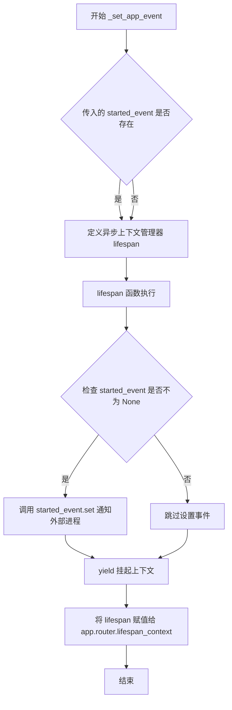
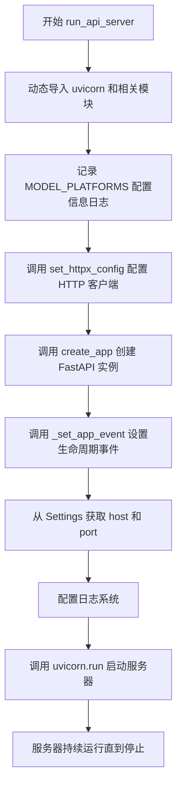
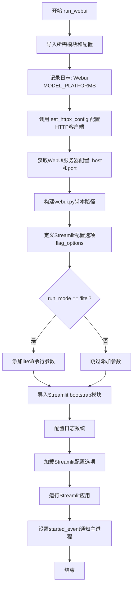
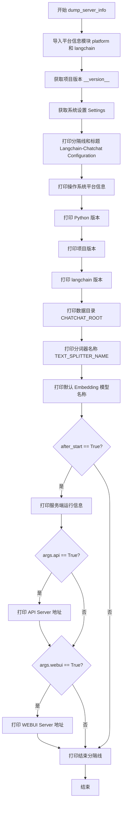
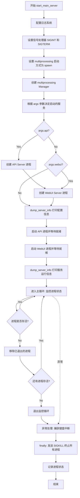
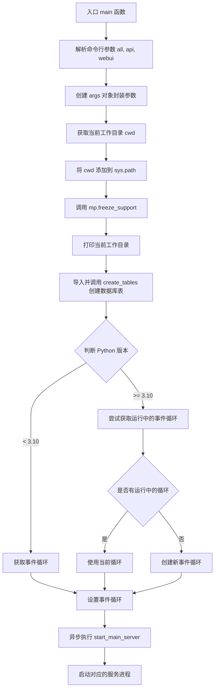

# `Langchain-Chatchat\libs\chatchat-server\chatchat\startup.py` 详细设计文档

LangChain-Chatchat项目的主服务启动器，负责通过多进程方式同时启动API服务器（基于FastAPI）和WebUI服务器（基于Streamlit），并管理它们的生命周期，包括配置初始化、日志设置和优雅关闭。

## 整体流程

```mermaid
graph TD
    A[入口 main函数] --> B[解析命令行参数]
B --> C{是否指定--all}
C -- 是 --> D[设置api=True, webui=True]
C -- 否 --> E[保留原始参数]
D --> F[调用start_main_server]
E --> F
F --> G[配置日志系统]
G --> H[设置信号处理器SIGINT/SIGTERM]
H --> I[创建多进程管理器]
I --> J{是否有api参数?}
J -- 是 --> K[创建API进程]
J -- 否 --> L{是否有webui参数?}
K --> M[启动API进程]
L -- 是 --> N[创建WebUI进程]
L -- 否 --> O[打印服务器信息]
M --> P[等待API启动事件]
N --> Q[等待WebUI启动事件]
P --> O
Q --> O
O --> R[进入主循环等待子进程]
R --> S{进程是否存活?}
S -- 是 --> R
S -- 否 --> T[移除已结束的进程]
T --> U{还有进程吗?]
U -- 是 --> R
U -- 否 --> V[发送SIGKILL信号]
V --> W[结束]
```

## 类结构

```
无显式类定义
主要包含以下函数模块:
├── 全局配置与日志模块
│   ├── _set_app_event: 设置FastAPI生命周期事件
│   ├── run_api_server: API服务器启动函数
│   ├── run_webui: WebUI服务器启动函数
│   ├── dump_server_info: 服务器信息打印
│   └── start_main_server: 主异步启动函数
└── CLI入口
    └── main: Click命令行接口
```

## 全局变量及字段


### `logger`
    
全局日志记录器实例，用于记录应用程序运行日志

类型：`logging.Logger`
    


### `n_cores`
    
CPU核心数，通过numexpr.utils.detect_number_of_cores()检测获取

类型：`int`
    


### `flag_options`
    
Streamlit配置选项字典，包含WebUI服务器的各种配置参数

类型：`Dict[str, Any]`
    


### `args`
    
命令行参数封装对象，存储all/api/webui等启动选项

类型：`args (动态类)`
    


### `processes`
    
进程字典，用于存储和管理API及WebUI子进程

类型：`Dict[str, Process]`
    


### `api_started`
    
API服务器启动完成事件信号，用于主进程等待API服务就绪

类型：`multiprocessing.Event`
    


### `webui_started`
    
WebUI服务器启动完成事件信号，用于主进程等待WebUI服务就绪

类型：`multiprocessing.Event`
    


### `run_mode`
    
运行模式标识符，可选值为None或'lite'等模式

类型：`str (可选)`
    


### `manager`
    
多进程管理器实例，用于创建跨进程共享的对象如Event和Queue

类型：`multiprocessing.Manager`
    


    

## 全局函数及方法


### `_set_app_event`

设置FastAPI应用的异步生命周期上下文管理器，用于在应用启动时通过multiprocessing Event通知外部进程。

参数：

- `app`：`FastAPI`，FastAPI应用实例，需要设置生命周期管理的应用
- `started_event`：`multiprocessing.Event`，可选的进程事件对象，用于通知外部进程应用已启动

返回值：`None`，无返回值，该函数直接修改app对象的router属性

#### 流程图



#### 带注释源码

```python
def _set_app_event(app: FastAPI, started_event: mp.Event = None):
    """
    设置FastAPI应用的异步生命周期上下文管理器
    
    参数:
        app: FastAPI应用实例
        started_event: 可选的multiprocessing.Event，用于通知外部进程应用已启动
    """
    
    # 使用asynccontextmanager装饰器创建异步上下文管理器
    @asynccontextmanager
    async def lifespan(app: FastAPI):
        """
        FastAPI生命周期上下文管理器
        在应用启动时执行一次，yield后保持运行，退出时清理资源
        """
        # 如果传入了started_event，则设置事件（通知外部进程应用已启动）
        if started_event is not None:
            started_event.set()
        # yield使函数成为上下文管理器，挂起并保持应用运行
        yield

    # 将自定义的lifespan函数赋值给应用的router，替换默认的生命周期管理
    app.router.lifespan_context = lifespan
```


### `run_api_server`

在独立进程中启动 FastAPI 服务器的函数，负责配置日志、创建 FastAPI 应用、设置生命周期事件，并通过 uvicorn 启动 API 服务。

参数：

- `started_event`：`multiprocessing.Event`，可选，用于在应用启动后通知主进程事件已触发
- `run_mode`：`str`，可选，运行模式参数，传递给 `create_app` 用于创建不同配置的 FastAPI 应用

返回值：`None`，无返回值

#### 流程图



#### 带注释源码

```python
def run_api_server(
    started_event: mp.Event = None, run_mode: str = None
):
    """
    在独立进程中启动 FastAPI API 服务器
    
    参数:
        started_event: multiprocessing.Event，可选，用于通知主进程应用已启动
        run_mode: str，可选，传递给 create_app 的运行模式
    """
    # 动态导入 uvicorn，用于运行 ASGI 服务器
    import uvicorn
    # 导入工具函数：获取配置字典、日志文件路径、时间戳
    from chatchat.utils import (
        get_config_dict,
        get_log_file,
        get_timestamp_ms,
    )

    # 导入设置类和服务器应用创建函数
    from chatchat.settings import Settings
    from chatchat.server.api_server.server_app import create_app
    from chatchat.server.utils import set_httpx_config

    # 记录当前配置的模型平台信息到日志
    logger.info(f"Api MODEL_PLATFORMS: {Settings.model_settings.MODEL_PLATFORMS}")
    
    # 配置 httpx 客户端的全局设置
    set_httpx_config()
    
    # 根据 run_mode 创建 FastAPI 应用实例
    app = create_app(run_mode=run_mode)
    
    # 设置应用的生命周期事件，如果传入了 started_event 则在启动时触发
    _set_app_event(app, started_event)

    # 从设置中获取 API 服务器的主机地址和端口
    host = Settings.basic_settings.API_SERVER["host"]
    port = Settings.basic_settings.API_SERVER["port"]

    # 构建日志配置：INFO级别，日志文件存放在 LOG_PATH/run_api_server_{时间戳} 目录
    # 文件大小限制和总大小限制均为 3GB
    logging_conf = get_config_dict(
        "INFO",
        get_log_file(log_path=Settings.basic_settings.LOG_PATH, sub_dir=f"run_api_server_{get_timestamp_ms()}"),
        1024 * 1024 * 1024 * 3,
        1024 * 1024 * 1024 * 3,
    )
    # 应用日志配置
    logging.config.dictConfig(logging_conf)  # type: ignore
    
    # 使用 uvicorn 启动 FastAPI 应用，监听指定 host 和 port
    uvicorn.run(app, host=host, port=port)
```


### `run_webui`

在独立进程中启动Streamlit WebUI服务器，配置并运行WebUI应用，同时通过事件机制通知主进程启动完成。

参数：

- `started_event`：`mp.Event`，可选，用于通知主进程WebUI服务器已成功启动的事件对象
- `run_mode`：`str`，可选，运行模式，当值为"lite"时启用lite模式

返回值：`None`，无返回值

#### 流程图



#### 带注释源码

```python
def run_webui(
    started_event: mp.Event = None, run_mode: str = None
):
    """
    在独立进程中启动Streamlit WebUI服务器
    
    参数:
        started_event: multiprocessing.Event，用于通知主进程WebUI已启动
        run_mode: 运行模式，可选值为"lite"等
    """
    # 导入项目设置和工具函数
    from chatchat.settings import Settings
    from chatchat.server.utils import set_httpx_config
    from chatchat.utils import get_config_dict, get_log_file, get_timestamp_ms

    # 记录日志：输出当前配置的模型平台信息
    logger.info(f"Webui MODEL_PLATFORMS: {Settings.model_settings.MODEL_PLATFORMS}")
    
    # 配置HTTP客户端设置
    set_httpx_config()

    # 从设置中获取WebUI服务器的主机和端口配置
    host = Settings.basic_settings.WEBUI_SERVER["host"]
    port = Settings.basic_settings.WEBUI_SERVER["port"]

    # 构建webui.py脚本的绝对路径
    # 使用当前文件所在目录作为基准路径
    script_dir = os.path.join(os.path.dirname(os.path.abspath(__file__)), "webui.py")

    # 定义Streamlit的所有配置选项（flag_options）
    # 这些选项用于配置Streamlit Web界面的各种行为
    flag_options = {
        # 服务器基本配置
        "server_address": host,           # 服务器监听地址
        "server_port": port,              # 服务器监听端口
        
        # 主题配置
        "theme_base": "light",                                    # 基础主题：浅色
        "theme_primaryColor": "#165dff",                         # 主色调：蓝色
        "theme_secondaryBackgroundColor": "#f5f5f5",             # 次级背景色：浅灰
        "theme_textColor": "#000000",                            # 文本颜色：黑色
        
        # 全局禁用警告选项
        "global_disableWatchdogWarning": None,
        "global_disableWidgetStateDuplicationWarning": None,
        "global_showWarningOnDirectExecution": None,
        "global_developmentMode": None,
        "global_logLevel": None,
        "global_unitTest": None,
        "global_suppressDeprecationWarnings": None,
        "global_minCachedMessageSize": None,
        "global_maxCachedMessageAge": None,
        "global_storeCachedForwardMessagesInMemory": None,
        "global_dataFrameSerialization": None,
        
        # 日志配置
        "logger_level": None,
        "logger_messageFormat": None,
        "logger_enableRich": None,
        
        # 客户端配置
        "client_caching": None,
        "client_displayEnabled": None,
        "client_showErrorDetails": None,
        "client_toolbarMode": None,
        "client_showSidebarNavigation": None,
        
        # 运行器配置
        "runner_magicEnabled": None,
        "runner_installTracer": None,
        "runner_fixMatplotlib": None,
        "runner_postScriptGC": None,
        "runner_fastReruns": None,
        "runner_enforceSerializableSessionState": None,
        "runner_enumCoercion": None,
        
        # 服务器配置
        "server_folderWatchBlacklist": None,
        "server_fileWatcherType": "none",    # 禁用文件监视器（避免资源竞争）
        "server_headless": None,
        "server_runOnSave": None,
        "server_allowRunOnSave": None,
        "server_scriptHealthCheckEnabled": None,
        "server_baseUrlPath": None,
        "server_enableCORS": None,
        "server_enableXsrfProtection": None,
        "server_maxUploadSize": None,
        "server_maxMessageSize": None,
        "server_enableArrowTruncation": None,
        "server_enableWebsocketCompression": None,
        "server_enableStaticServing": None,
        
        # 浏览器配置
        "browser_serverAddress": None,
        "browser_gatherUsageStats": None,
        "browser_serverPort": None,
        
        # SSL配置
        "server_sslCertFile": None,
        "server_sslKeyFile": None,
        
        # UI配置
        "ui_hideTopBar": None,
        "ui_hideSidebarNav": None,
        
        # Magic配置
        "magic_displayRootDocString": None,
        "magic_displayLastExprIfNoSemicolon": None,
        
        # 弃用警告配置
        "deprecation_showfileUploaderEncoding": None,
        "deprecation_showImageFormat": None,
        "deprecation_showPyplotGlobalUse": None,
        
        # 额外主题配置
        "theme_backgroundColor": None,
        "theme_font": None,
    }

    # 构建命令行参数列表
    args = []
    
    # 如果运行模式为"lite"，添加lite参数
    # lite模式通常用于轻量级测试或资源受限环境
    if run_mode == "lite":
        args += [
            "--",
            "lite",
        ]

    # 尝试导入Streamlit的bootstrap模块
    # 注意：streamlit >= 1.12.1使用新的导入路径
    try:
        # for streamlit >= 1.12.1
        from streamlit.web import bootstrap
    except ImportError:
        # 兼容旧版本Streamlit
        from streamlit import bootstrap

    # 配置日志系统
    # 创建日志配置字典，包含日志级别、文件路径、文件大小限制等
    logging_conf = get_config_dict(
        "INFO",                                                    # 日志级别
        get_log_file(                                             # 日志文件路径
            log_path=Settings.basic_settings.LOG_PATH, 
            sub_dir=f"run_webui_{get_timestamp_ms()}"
        ),
        1024 * 1024 * 1024 * 3,                                    # 单个日志文件最大字节数 (3GB)
        1024 * 1024 * 1024 * 3,                                    # 日志总大小限制 (3GB)
    )
    # 应用日志配置
    logging.config.dictConfig(logging_conf)  # type: ignore
    
    # 加载Streamlit的配置选项
    bootstrap.load_config_options(flag_options=flag_options)
    
    # 运行Streamlit应用
    # 参数: 脚本路径, 是否启用命令行参数, 额外参数, 配置选项
    bootstrap.run(script_dir, False, args, flag_options)
    
    # 通知主进程WebUI服务器已启动
    if started_event is not None:
        started_event.set()
```


### `dump_server_info`

打印系统和配置信息，包括操作系统、Python版本、项目版本、langchain版本、数据目录、分词器、Embedding模型名称等信息，并在服务启动后打印API和WEBUI的服务器地址。

参数：

- `after_start`：`bool`，可选参数，表示是否在服务启动后调用，默认为 False。如果是 True，则会额外打印服务端运行信息（API 和 WEBUI 地址）
- `args`：可选参数，用于传递命令行参数对象，包含 `api` 和 `webui` 属性，用于判断是否打印对应的服务器地址，默认为 None

返回值：`None`，该函数没有返回值，仅通过 `print` 输出信息到控制台

#### 流程图



#### 带注释源码

```python
def dump_server_info(after_start=False, args=None):
    """
    打印系统和配置信息
    
    参数:
        after_start: bool, 是否在服务启动后调用，用于决定是否打印服务器地址
        args: 命令行参数对象，包含 api 和 webui 属性
    """
    # 动态导入平台相关模块
    import platform
    import langchain

    # 从项目中导入版本信息和设置
    from chatchat import __version__
    from chatchat.settings import Settings
    from chatchat.server.utils import api_address, webui_address

    # 打印空行和分隔线
    print("\n")
    print("=" * 30 + "Langchain-Chatchat Configuration" + "=" * 30)
    
    # 打印系统基本信息
    print(f"操作系统：{platform.platform()}.")
    print(f"python版本：{sys.version}")
    print(f"项目版本：{__version__}")
    print(f"langchain版本：{langchain.__version__}")
    print(f"数据目录：{Settings.CHATCHAT_ROOT}")
    print("\n")

    # 打印知识库相关配置
    print(f"当前使用的分词器：{Settings.kb_settings.TEXT_SPLITTER_NAME}")
    print(f"默认选用的 Embedding 名称： {Settings.model_settings.DEFAULT_EMBEDDING_MODEL}")

    # 如果是启动后打印，额外显示服务器地址信息
    if after_start:
        print("\n")
        print(f"服务端运行信息：")
        # 根据参数判断是否打印 API 服务器地址
        if args.api:
            print(f"    Chatchat Api Server: {api_address()}")
        # 根据参数判断是否打印 WEBUI 服务器地址
        if args.webui:
            print(f"    Chatchat WEBUI Server: {webui_address()}")
    
    # 打印结束分隔线
    print("=" * 30 + "Langchain-Chatchat Configuration" + "=" * 30)
    print("\n")
```


### `start_main_server`

异步主函数，协调多进程启动和管理，负责根据命令行参数启动 API Server 和 WebUI Server 进程，并监控其生命周期。

参数：

- `args`：`args`（内部类），包含启动参数的对象，具有 `all`（是否启动所有服务）、`api`（是否启动 API 服务）、`webui`（是否启动 WebUI 服务）等属性

返回值：`None`，无返回值

#### 流程图



#### 带注释源码

```python
async def start_main_server(args):
    """
    异步主函数，协调多进程启动和管理
    负责根据命令行参数启动 API Server 和 WebUI Server 进程
    """
    import signal
    import time

    # 导入工具函数
    from chatchat.utils import (
        get_config_dict,
        get_log_file,
        get_timestamp_ms,
    )

    from chatchat.settings import Settings

    # 配置日志系统：设置日志级别、路径、文件大小限制
    logging_conf = get_config_dict(
        "INFO",
        get_log_file(
            log_path=Settings.basic_settings.LOG_PATH, 
            sub_dir=f"start_main_server_{get_timestamp_ms()}"
        ),
        1024 * 1024 * 1024 * 3,  # 3GB
        1024 * 1024 * 1024 * 3,   # 3GB
    )
    logging.config.dictConfig(logging_conf)  # type: ignore

    # 定义信号处理闭包
    def handler(signalname):
        """
        Python 3.9 has `signal.strsignal(signalnum)` so this closure would not be needed.
        Also, 3.8 includes `signal.valid_signals()` that can be used to create a mapping for the same purpose.
        """
        def f(signal_received, frame):
            raise KeyboardInterrupt(f"{signalname} received}")
        return f

    # 设置信号处理器，处理 SIGINT 和 SIGTERM 信号
    # 将在子进程中被继承（如果是 fork 模式，非 spawn 模式）
    signal.signal(signal.SIGINT, handler("SIGINT"))
    signal.signal(signal.SIGTERM, handler("SIGTERM"))

    # 设置 multiprocessing 的启动方式为 "spawn"
    # spawn 方式会启动新的 Python 解释器，是跨平台最安全的方式
    mp.set_start_method("spawn")
    
    # 创建 Manager 用于进程间通信
    manager = mp.Manager()
    run_mode = None

    # 如果指定了 --all 参数，同时启动 api 和 webui
    if args.all:
        args.api = True
        args.webui = True

    # 打印服务器配置信息（启动前）
    dump_server_info(args=args)

    # 记录启动信息
    if len(sys.argv) > 1:
        logger.info(f"正在启动服务：")
        logger.info(f"如需查看 llm_api 日志，请前往 {Settings.basic_settings.LOG_PATH}")

    # 存储所有启动的进程
    processes = {}

    def process_count():
        """返回当前运行的进程数量"""
        return len(processes)

    # 创建进程间同步事件
    api_started = manager.Event()
    
    # 如果需要启动 API Server
    if args.api:
        # 创建 API Server 进程
        process = Process(
            target=run_api_server,          # 目标函数
            name=f"API Server",              # 进程名称
            kwargs=dict(
                started_event=api_started,  # 启动完成事件
                run_mode=run_mode,          # 运行模式
            ),
            daemon=False,                   # 非守护进程
        )
        processes["api"] = process

    # 创建进程间同步事件
    webui_started = manager.Event()
    
    # 如果需要启动 WebUI Server
    if args.webui:
        # 创建 WebUI Server 进程
        process = Process(
            target=run_webui,                # 目标函数
            name=f"WEBUI Server",           # 进程名称
            kwargs=dict(
                started_event=webui_started,# 启动完成事件
                run_mode=run_mode,         # 运行模式
            ),
            daemon=True,                    # 守护进程
        )
        processes["webui"] = process

    try:
        # 启动 API 进程并等待就绪
        if p := processes.get("api"):
            p.start()
            p.name = f"{p.name} ({p.pid})"
            api_started.wait()  # 等待 api.py 启动完成

        # 启动 WebUI 进程并等待就绪
        if p := processes.get("webui"):
            p.start()
            p.name = f"{p.name} ({p.pid})"
            webui_started.wait()  # 等待 webui.py 启动完成

        # 打印服务器运行信息（启动后）
        dump_server_info(after_start=True, args=args)

        # 主循环：等待所有进程退出
        while processes:
            for p in processes.values():
                p.join(2)  # 最多等待 2 秒
                if not p.is_alive():
                    processes.pop(p.name)
                    
    except Exception as e:
        # 捕获异常并记录日志
        logger.error(e)
        logger.warning("Caught KeyboardInterrupt! Setting stop event...")
    finally:
        # 清理阶段：确保所有进程被终止
        for p in processes.values():
            logger.warning("Sending SIGKILL to %s", p)
            # Queues and other inter-process communication primitives can break when
            # process is killed, but we don't care here

            # 处理嵌套的进程字典
            if isinstance(p, dict):
                for process in p.values():
                    process.kill()
            else:
                p.kill()

        # 记录最终进程状态
        for p in processes.values():
            logger.info("Process status: %s", p)
```


### `main`

这是 Langchain-Chatchat 项目的 CLI 入口点，使用 Click 框架实现。通过命令行参数控制启动 API 服务器和/或 WebUI 服务器，支持一键启动所有服务或单独启动某个服务。

参数：

- `all`：`bool`，布尔标志，表示同时启动 API 和 WebUI 服务
- `api`：`bool`，布尔标志，表示启动 API 服务器
- `webui`：`bool`，布尔标志，表示启动 WebUI 服务器

返回值：`None`，无返回值，执行完成后服务进程持续运行

#### 流程图



#### 带注释源码

```python
@click.command(help="启动服务")
@click.option(
    "-a",
    "--all",
    "all",
    is_flag=True,
    help="run api.py and webui.py",
)
@click.option(
    "--api",
    "api",
    is_flag=True,
    help="run api.py",
)
@click.option(
    "-w",
    "--webui",
    "webui",
    is_flag=True,
    help="run webui.py server",
)
def main(all, api, webui):
    """
    CLI 入口函数，用于启动 Langchain-Chatchat 的服务组件
    
    Args:
        all: 布尔标志，同时启动 API 和 WebUI 服务
        api: 布尔标志，仅启动 API 服务
        webui: 布尔标志，仅启动 WebUI 服务
    """
    # 创建一个命名空间对象用于存储命令行参数
    class args:
        ...
    args.all = all
    args.api = api
    args.webui = webui

    # 添加这行代码
    # 获取当前工作目录并将其添加到 Python 路径，确保可以正确导入模块
    cwd = os.getcwd()
    sys.path.append(cwd)
    # 调用 multiprocessing 的 freeze_support，用于支持 Windows 下的冻结可执行文件
    mp.freeze_support()
    print("cwd:" + cwd)
    
    # 导入并执行数据库表创建函数，初始化知识库所需的数据库结构
    from chatchat.server.knowledge_base.migrate import create_tables

    create_tables()
    
    # 根据 Python 版本选择合适的事件循环获取方式
    # Python 3.10+ 需要特殊处理事件循环的获取
    if sys.version_info < (3, 10):
        loop = asyncio.get_event_loop()
    else:
        try:
            loop = asyncio.get_running_loop()
        except RuntimeError:
            loop = asyncio.new_event_loop()

        asyncio.set_event_loop(loop)
    
    # 异步启动主服务，传入参数对象
    loop.run_until_complete(start_main_server(args))
```

## 关键组件


### API服务器启动器 (run_api_server)

负责启动FastAPI应用服务器，使用Uvicorn作为ASGI服务器，加载配置并设置日志系统，支持事件传递以协调启动流程。

### WebUI服务器启动器 (run_webui)

负责启动Streamlit Web界面，配置大量Streamlit选项参数，支持lite模式，通过bootstrap模块加载并运行WebUI。

### 主服务器协程 (start_main_server)

异步主函数，协调多进程管理，使用multiprocessing创建API和WebUI子进程，监听系统信号(SIGINT/SIGTERM)实现优雅退出，处理进程启动顺序和事件等待。

### 应用生命周期管理 (_set_app_event)

使用asynccontextmanager装饰器创建FastAPI生命周期上下文管理器，用于在应用启动时触发事件通知，支持进程间同步。

### 服务器信息打印 (dump_server_info)

打印系统环境信息，包括操作系统、Python版本、项目版本、LangChain版本、使用的分词器和Embedding模型等配置信息。

### 日志配置系统

使用get_config_dict和get_log_file工具函数配置日志，支持自定义日志路径、日志级别、日志文件大小限制，集成Python标准logging模块。

### 命令行接口 (main)

使用Click框架定义命令行选项，支持-a/--all同时启动API和WebUI，-w/--webui单独启动WebUI，--api单独启动API，初始化数据库表并管理事件循环。

### 多进程管理机制

使用multiprocessing的Process、Event、Manager类实现进程管理，支持守护进程设置，进程等待和终止，确保多个服务进程协调运行。

### 配置文件加载

从Settings对象读取服务器配置(host、port)、日志路径、模型平台、文本分割器名称、默认Embedding模型等配置项。


## 问题及建议


### 已知问题

-   **裸异常捕获**：多处使用 `except:` 捕获所有异常，包括 `SystemExit` 和 `KeyboardInterrupt`，掩盖了真实的错误类型
- **重复的日志配置**：logging_conf 在多个函数中重复定义，违反了 DRY 原则，增加了维护成本
- **进程启动方法硬编码**：在 `start_main_server` 中硬编码 `mp.set_start_method("spawn")`，可能与其他模块的多进程逻辑冲突，且无法在已设置过启动方法后再次调用
- **不一致的进程守护设置**：API 服务使用 `daemon=False`，WebUI 使用 `daemon=True`，这种不一致可能导致进程管理行为不可预测
- **导入语句分散**：大量导入语句分散在函数内部，虽然避免了循环依赖，但增加了启动时的性能开销
- **巨大的配置字典**：`flag_options` 字典包含大量 None 值，这些无效配置增加了代码复杂度和维护难度
- **事件循环处理复杂**：针对 Python 3.9 及以下版本的手动事件循环处理逻辑复杂且容易出错，应使用更现代的 `asyncio.run()` 方式
- **日志缓冲区过大**：使用 `3GB` (1024*1024*1024*3) 的日志缓冲区，在大多数场景下过于浪费
- **信号处理不当**：在父进程中设置信号处理器，但子进程可能无法正确继承，且捕获信号后主动抛出 `KeyboardInterrupt` 的设计不够优雅
- **资源清理不完整**：`finally` 块中仅发送 SIGKILL 信号，没有正确等待进程退出并清理 multiprocessing.Manager 资源

### 优化建议

-   **重构异常捕获**：使用具体的异常类型（如 `ImportError`、`Exception`）替代裸 `except:`
-   **提取日志配置**：创建独立的日志配置模块或函数，在各服务启动时复用
-   **动态设置进程启动方法**：在程序入口处检查并设置 `set_start_method`，并添加重试机制或捕获已有设置的异常
-   **统一守护进程策略**：根据实际需求统一设置守护进程属性，或通过配置参数控制
-   **优化导入策略**：将必要的函数级导入移至模块顶部，将非必需的延迟导入保持原样
-   **清理配置字典**：移除 `flag_options` 中的 None 值，或使用配置文件/环境变量替代
-   **简化事件循环**：使用 `asyncio.run()` 统一处理，这是 Python 3.7+ 的推荐方式
-   **调整日志缓冲区**：根据实际需求调整日志缓冲区大小，如 10-100MB 级别
-   **改进信号处理**：使用 `signal.signal(signal.SIGINT, signal.SIG_IGN)` 或更优雅的方式处理退出信号
-   **完善资源清理**：在 `finally` 块中添加进程退出等待逻辑，并显式清理 Manager 资源

## 其它


### 设计目标与约束

本项目旨在提供一个灵活的Langchain-Chatchat多服务启动框架，支持独立或组合启动API服务器和WebUI服务器。核心约束包括：1) 必须使用multiprocessing的spawn模式以保证跨平台兼容性；2) API服务器和WebUI服务器必须在独立进程中运行以实现资源隔离；3) 需要支持Python 3.8+版本；4) 日志系统需要配置为同时输出到控制台和文件。

### 错误处理与异常设计

代码采用分层异常处理策略：1) 在主函数中通过try-except捕获KeyboardInterrupt和通用Exception，使用logger.error记录错误并发送SIGKILL信号强制终止进程；2) 在start_main_server中使用signal.signal注册SIGINT和SIGTERM处理器，将信号转换为KeyboardInterrupt异常；3) 每个服务启动函数通过Event.wait()检测子进程启动状态，超时或失败时记录警告日志；4) 导入模块使用try-except处理可选依赖（如numexpr）。

### 数据流与状态机

主进程状态机包含以下状态：INIT（初始化）→ STARTING（启动中）→ RUNNING（运行中）→ SHUTDOWN（关闭中）。进程间通信使用multiprocessing.Event和Manager.Event进行同步：api_started和webui_started事件用于通知主进程子服务已就绪。主进程通过Process.join(2)轮询检查子进程存活状态，每2秒检测一次，发现进程退出后从字典中移除。

### 外部依赖与接口契约

主要外部依赖包括：1) FastAPI（API服务器框架）；2) Streamlit（WebUI框架）；3) Uvicorn（ASGI服务器）；4) click（命令行解析）；5) multiprocessing（多进程管理）；6) logging（日志系统）。接口契约方面：create_app()需返回FastAPI实例且包含lifespan context manager；run_api_server和run_webui函数签名必须接受started_event和run_mode参数；Settings类需提供basic_settings、model_settings、kb_settings等配置属性。

### 配置文件说明

代码涉及多个配置源：1) 命令行参数通过click定义（--all、--api、--webui）；2) 服务配置通过Settings类获取（API_SERVER、WEBUI_SERVER、LOG_PATH等）；3) 日志配置通过get_config_dict动态生成，包含日志级别INFO、文件路径按时间戳区分、文件大小限制3GB；4) Streamlit配置通过flag_options字典定义服务器地址、端口、主题等参数。

### 安全性考虑

当前实现存在以下安全考量：1) 进程使用daemon=True（WebUI）和daemon=False（API）区别设置，主进程退出时守护进程会被强制终止；2) 未实现身份验证和授权机制，服务默认运行在指定host:port；3) 未配置SSL/TLS加密；4) server_enableCORS等安全相关参数默认未启用；5) 文件上传大小通过server_maxUploadSize限制但默认未设置。

### 性能考虑

性能优化点包括：1) NUMEXPR_MAX_THREADS根据CPU核心数自动配置；2) 使用spawn模式而非fork避免继承父进程内存；3) 日志文件大小限制为3GB防止磁盘空间耗尽；4) 进程存活检测间隔设为2秒，平衡响应速度和CPU开销；5) WebUI使用fileWatcherType="none"禁用文件监听减少开销。

### 初始化流程

完整初始化流程为：1) main()被调用后执行mp.freeze_support()；2) 调用create_tables()初始化知识库数据库；3) 获取或创建event loop；4) 调用start_main_server()进入主流程；5) 配置日志系统；6) 注册信号处理器；7) 设置multiprocessing启动方式为spawn；8) 根据参数创建Process对象并启动；9) 等待各服务Event信号通知启动完成；10) 进入主循环等待进程退出。

### 版本兼容性

代码考虑了以下版本兼容性：1) Python版本检测：sys.version_info < (3, 10)时使用get_event_loop()，否则使用get_running_loop()；2) Streamlit兼容：尝试导入streamlit.web.bootstrap，失败则回退到streamlit.bootstrap；3) numexpr为可选依赖，使用try-except处理缺失情况；4) signal.strsignal在Python 3.9+可用，代码使用handler闭包实现兼容。

    