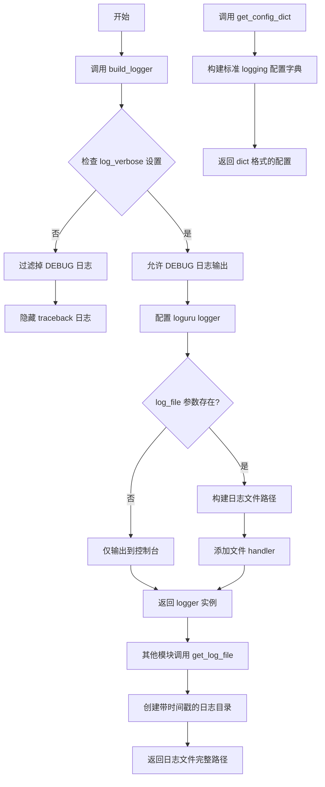
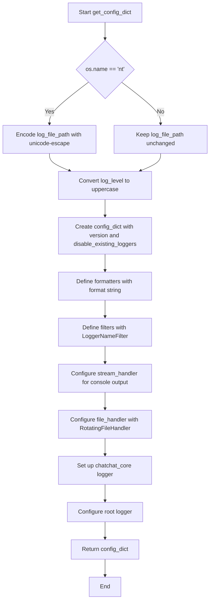
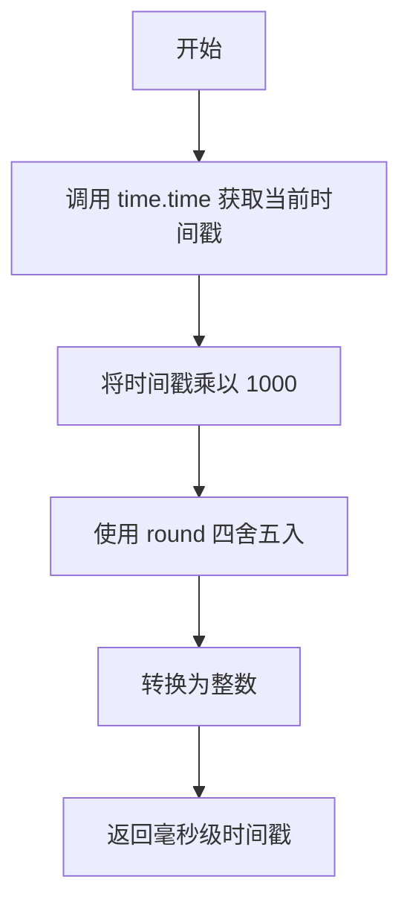
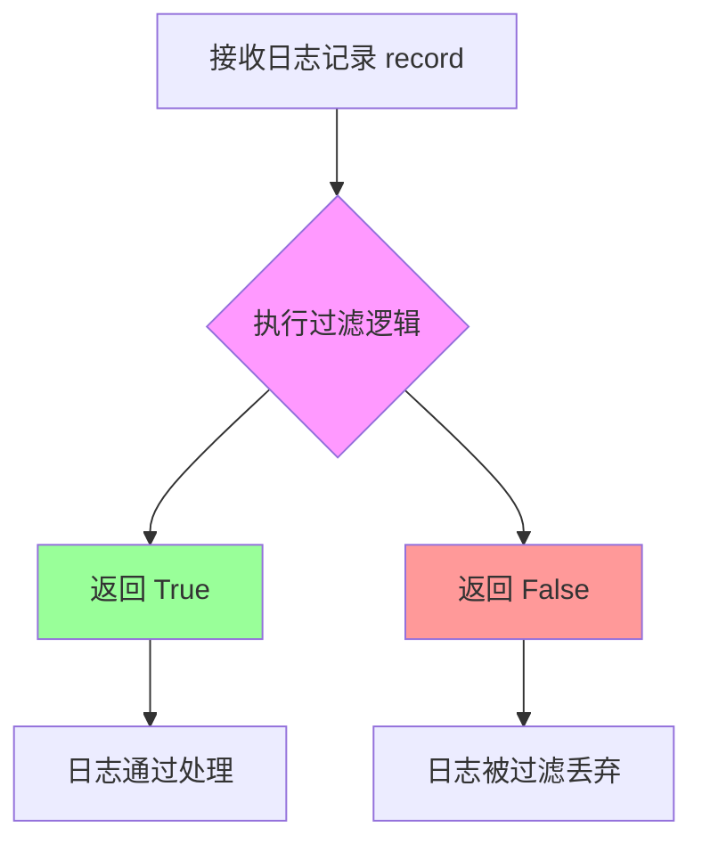

# `Langchain-Chatchat\libs\chatchat-server\chatchat\utils.py` 详细设计文档

该模块提供了一套完整的日志系统解决方案，包含基于loguru的彩色日志构建器、标准logging配置生成器、日志文件路径管理以及日志过滤功能，支持根据配置动态控制日志级别和详细程度。

## 整体流程



## 类结构

```
LoggerNameFilter (logging.Filter)
```

## 全局变量及字段


### `logger`
    
当前模块的标准日志记录器实例，通过 logging.getLogger(__name__) 创建，用于记录模块级别的日志

类型：`logging.Logger`
    


    

## 全局函数及方法


### `_filter_logs`

该函数是一个日志过滤器，根据日志级别和配置设置决定是否记录特定日志。如果日志级别为 DEBUG（no <= 10）且未启用详细日志模式，则过滤掉该日志；如果日志级别为 ERROR（no == 40）且未启用详细日志模式，则清除异常信息但仍允许记录。

参数：

- `record`：`dict`，日志记录字典，包含日志级别、异常信息等字段，通过 `record["level"].no` 获取日志级别数值

返回值：`bool`，返回 `True` 表示允许记录该日志，返回 `False` 表示过滤掉该日志

#### 流程图

```mermaid
flowchart TD
    A[开始] --> B{record["level"].no <= 10 且 not Settings.basic_settings.log_verbose?}
    B -->|是| C[返回 False, 过滤DEBUG日志]
    B -->|否| D{record["level"].no == 40 且 not Settings.basic_settings.log_verbose?}
    D -->|是| E[设置 record["exception"] = None]
    E --> F[返回 True, 记录日志但清除异常]
    D -->|否| G[返回 True, 正常记录日志]
    C --> H[结束]
    F --> H
    G --> H
```

#### 带注释源码

```python
def _filter_logs(record: dict) -> bool:
    """
    日志过滤器函数，用于控制日志的记录行为。
    
    参数:
        record: dict, 日志记录字典，必须包含 "level" 字段，
                该字段是一个具有 no 属性的对象，用于判断日志级别
    
    返回:
        bool: True 允许记录日志，False 过滤掉该日志
    """
    # hide debug logs if Settings.basic_settings.log_verbose=False 
    # 当日志级别为 DEBUG (level.no <= 10) 且 log_verbose=False 时
    # 返回 False 过滤掉调试日志，不进行记录
    if record["level"].no <= 10 and not Settings.basic_settings.log_verbose:
        return False
    
    # hide traceback logs if Settings.basic_settings.log_verbose=False 
    # 当日志级别为 ERROR (level.no == 40) 且 log_verbose=False 时
    # 清除异常信息（exception 设为 None）但仍返回 True 记录日志
    # 这样可以记录错误但隐藏完整的堆栈跟踪信息
    if record["level"].no == 40 and not Settings.basic_settings.log_verbose:
        record["exception"] = None
    
    # 默认返回 True，允许记录日志
    return True
```


### `build_logger`

构建一个带有彩色输出和日志文件的日志记录器，支持通过 Settings.basic_settings.log_verbose 控制调试日志的显示，并使用 LRU 缓存避免重复添加 handler。

参数：

- `log_file`：`str`，日志文件名（可选，默认为 "chatchat"），用于指定日志文件的名称

返回值：`loguru._logger.Logger`，返回一个配置好的 loguru 日志记录器实例，支持彩色输出和文件输出

#### 流程图

```mermaid
flowchart TD
    A[开始 build_logger] --> B{log_file 是否存在}
    B -->|是| C[确保 log_file 扩展名为 .log]
    B -->|否| D[不添加文件 handler]
    C --> E{log_file 是否为绝对路径}
    E -->|否| F[拼接 Settings.basic_settings.LOG_PATH 为绝对路径]
    E -->|是| G[直接使用 log_file 路径]
    F --> H[添加文件 handler 到 logger]
    G --> H
    D --> I[返回配置好的 logger]
    H --> I
    
    subgraph "初始化阶段"
        J[设置 handlers[0] 的 filter 为 _filter_logs] --> K[创建支持彩色输出的 logger]
        K --> L[添加 warn 别名到 warning]
    end
    
    J --> B
    K --> L
    L --> B
```

#### 带注释源码

```python
from functools import partial
import logging
import os
import time
import typing as t

import loguru
import loguru._logger
from memoization import cached, CachingAlgorithmFlag
from chatchat.settings import Settings


def _filter_logs(record: dict) -> bool:
    """
    日志过滤器函数，根据 Settings.basic_settings.log_verbose 配置
    过滤掉调试级别的日志
    """
    # 如果日志级别 <= 10 (DEBUG) 且 log_verbose=False，则隐藏调试日志
    if record["level"].no <= 10 and not Settings.basic_settings.log_verbose:
        return False
    # 如果日志级别 == 40 (ERROR) 且 log_verbose=False，则隐藏异常堆栈信息
    if record["level"].no == 40 and not Settings.basic_settings.log_verbose:
        record["exception"] = None
    return True


# 使用 memoization 库缓存 build_logger 的结果，避免重复创建 logger
# 默认每调用一次 build_logger 就会添加一次 handler，导致 chatchat.log 里重复输出
# 缓存 max_size=100 个不同的 log_file 参数
@cached(max_size=100, algorithm=CachingAlgorithmFlag.LRU)
def build_logger(log_file: str = "chatchat"):
    """
    构建一个带有彩色输出和日志文件的日志记录器
    
    示例:
        logger = build_logger("api")
        logger.info("<green>some message</green>")
    
    用户可以通过设置 basic_settings.log_verbose=True 来输出调试日志
    使用 logger.exception 记录带有异常的误差日志
    """
    # 为 loguru 默认的 handler 设置过滤器
    loguru.logger._core.handlers[0]._filter = _filter_logs
    
    # 创建一个支持彩色输出的 logger 对象
    logger = loguru.logger.opt(colors=True)
    
    # 使用 partial 为 opt 方法固定 colors=True 参数
    logger.opt = partial(loguru.logger.opt, colors=True)
    
    # 为 warning 方法创建别名 warn，保持与标准 logging 库一致的接口
    logger.warn = logger.warning
    # logger.error = partial(logger.exception)  # 可选：创建 error 方法别名

    # 如果指定了 log_file 参数，则添加文件 handler
    if log_file:
        # 确保日志文件以 .log 结尾
        if not log_file.endswith(".log"):
            log_file = f"{log_file}.log"
        
        # 如果是相对路径，则基于 Settings.basic_settings.LOG_PATH 解析为绝对路径
        if not os.path.isabs(log_file):
            log_file = str((Settings.basic_settings.LOG_PATH / log_file).resolve())
        
        # 添加文件 handler，colorize=False 表示文件中不添加 ANSI 颜色码
        logger.add(log_file, colorize=False, filter=_filter_logs)

    # 返回配置好的 logger 实例
    return logger
```


### `get_log_file`

该函数用于根据传入的日志路径和子目录创建一个包含时间戳的日志目录，并返回该日志目录下的日志文件完整路径。

参数：

- `log_path`：`str`，日志的基础路径
- `sub_dir`：`str`，子目录名称（应包含时间戳）

返回值：`str`，返回日志文件的完整路径

#### 流程图

```mermaid
flowchart TD
    A[开始] --> B[拼接 log_path 和 sub_dir 形成 log_dir]
    B --> C[使用 os.makedirs 创建目录, exist_ok=False]
    C --> D[返回 os.path.join(log_dir, f'{sub_dir}.log')]
    D --> E[结束]
```

#### 带注释源码

```python
def get_log_file(log_path: str, sub_dir: str):
    """
    sub_dir should contain a timestamp.
    """
    # 1. 将基础日志路径和子目录拼接成完整的日志目录路径
    log_dir = os.path.join(log_path, sub_dir)
    # 2. 创建日志目录，每次调用都会创建新目录（因为 exist_ok=False）
    #    这确保了每次生成的日志目录都是独立的
    os.makedirs(log_dir, exist_ok=False)
    # 3. 返回日志文件的完整路径，文件名格式为 {sub_dir}.log
    return os.path.join(log_dir, f"{sub_dir}.log")
```


### `get_config_dict`

该函数用于生成日志配置字典，根据传入的日志级别、文件路径、备份数量和文件大小上限，构建标准的 Python logging 模块配置，支持控制台和文件输出以及日志文件轮转。

参数：

- `log_level`：`str`，日志级别（如 "INFO", "DEBUG", "WARNING" 等）
- `log_file_path`：`str`，日志文件的完整路径
- `log_backup_count`：`int`，保留的日志备份文件数量
- `log_max_bytes`：`int`，单个日志文件的最大字节数，超过后进行轮转

返回值：`dict`，包含完整的 logging 配置字典，用于配置 Python 标准日志系统

#### 流程图



#### 带注释源码

```python
def get_config_dict(
        log_level: str, log_file_path: str, log_backup_count: int, log_max_bytes: int
) -> dict:
    """
    生成日志配置字典，用于配置 Python logging 模块。
    
    参数:
        log_level: 日志级别字符串 (如 "INFO", "DEBUG", "WARNING")
        log_file_path: 日志文件路径
        log_backup_count: 保留的备份日志文件数量
        log_max_bytes: 单个日志文件的最大字节数
    
    返回:
        包含完整 logging 配置的字典
    """
    # 针对 Windows 系统，对路径进行 unicode-escape 编码处理
    # 确保路径中的反斜杠等特殊字符正确处理
    log_file_path = (
        log_file_path.encode("unicode-escape").decode()
        if os.name == "nt"
        else log_file_path
    )
    # 标准化日志级别为大写格式
    log_level = log_level.upper()
    
    # 构建完整的 logging 配置字典
    config_dict = {
        "version": 1,  # logging 配置字典版本，固定为 1
        "disable_existing_loggers": False,  # 不禁用已存在的 logger
        "formatters": {
            "formatter": {
                "format": (
                    "%(asctime)s %(name)-12s %(process)d %(levelname)-8s %(message)s"
                )
            },
        },
        "filters": {
            "logger_name_filter": {
                "()": __name__ + ".LoggerNameFilter",  # 使用当前模块的 LoggerNameFilter
            },
        },
        "handlers": {
            "stream_handler": {
                "class": "logging.StreamHandler",  # 控制台输出处理器
                "formatter": "formatter",
                "level": log_level,
                # "stream": "ext://sys.stdout",
                # "filters": ["logger_name_filter"],
            },
            "file_handler": {
                "class": "logging.handlers.RotatingFileHandler",  # 轮转文件处理器
                "formatter": "formatter",
                "level": log_level,
                "filename": log_file_path,  # 日志文件路径
                "mode": "a",  # 追加模式
                "maxBytes": log_max_bytes,  # 单文件最大字节数
                "backupCount": log_backup_count,  # 备份文件数量
                "encoding": "utf8",  # 文件编码
            },
        },
        "loggers": {
            "chatchat_core": {  # 为 chatchat_core 模块专用配置 logger
                "handlers": ["stream_handler", "file_handler"],
                "level": log_level,
                "propagate": False,  # 不向上传播日志
            }
        },
        "root": {  # 根 logger 配置
            "level": log_level,
            "handlers": ["stream_handler", "file_handler"],
        },
    }
    return config_dict
```


### `get_timestamp_ms`

该函数用于获取当前时间的毫秒级时间戳，常用于日志记录、性能计时或生成唯一标识符等场景。

参数：无

返回值：`int`，返回自 Unix 纪元（1970-01-01 00:00:00）以来经过的毫秒数（整型）。

#### 流程图



#### 带注释源码

```python
def get_timestamp_ms():
    """
    获取当前时间的毫秒级时间戳
    
    Returns:
        int: 自 Unix 纪元以来的毫秒数
    """
    # 调用 time.time() 获取自 Unix 纪元以来的秒数（浮点数）
    t = time.time()
    
    # 乘以 1000 转换为毫秒，round() 四舍五入，int() 转为整数
    return int(round(t * 1000))
```

#### 关键组件信息

| 组件名称 | 一句话描述 |
|---------|-----------|
| `time.time()` | Python 标准库函数，返回自 Unix 纪元以来的秒数（浮点数） |
| `round()` | Python 内置函数，对数值进行四舍五入 |
| `int()` | Python 内置函数，将浮点数转换为整数 |

#### 潜在的技术债务或优化空间

1. **返回值类型一致性**：当前返回整数毫秒时间戳，但在某些场景下可能需要返回字符串格式或 `datetime` 对象，建议增加参数支持多种返回格式。
2. **时区考虑**：该函数返回的是本地时间而非 UTC 时间，在分布式系统中可能导致时区不一致问题，建议统一使用 UTC 时间戳。
3. **性能优化**：虽然当前实现已足够高效，但在高频调用场景下可考虑使用 `time.perf_counter_ns()` 等更高精度的时间函数。

#### 其它项目

- **设计目标**：提供一个简洁的毫秒级时间戳获取工具，用于日志标识、性能监控等场景。
- **错误处理**：当前无错误处理逻辑，因 `time.time()` 在正常环境下不会抛出异常。
- **外部依赖**：仅依赖 Python 标准库 `time`，无外部依赖。
- **使用建议**：适用于需要高精度时间记录的短时操作计时，或作为日志文件名的唯一标识。


### `LoggerNameFilter.filter`

该方法是日志过滤器类的核心成员，负责决定是否接受或拒绝特定的日志记录。当前实现为无过滤逻辑的透传模式，始终返回 `True` 允许所有日志通过，未来可基于日志记录器的名称或消息内容扩展过滤规则。

参数：

- `self`：`LoggerNameFilter`，当前过滤器实例（隐式参数）
- `record`：`logging.LogRecord`，标准日志记录对象，包含了日志级别、名称、消息、异常信息等元数据

返回值：`bool`，返回 `True` 表示该日志记录通过过滤器被处理，返回 `False` 表示该日志记录被过滤丢弃

#### 流程图



#### 带注释源码

```python
class LoggerNameFilter(logging.Filter):
    """
    日志名称过滤器类，继承自 logging 标准库的 Filter 基类。
    用于根据日志记录的属性（如记录器名称、消息内容）进行自定义过滤。
    """
    
    def filter(self, record: logging.LogRecord) -> bool:
        """
        过滤方法，决定是否处理指定的日志记录。
        
        参数:
            record: logging.LogRecord 对象，包含日志事件的完整信息，
                   包括 name（记录器名称）、levelno（级别编号）、
                   msg（消息内容）、exc_info（异常信息）等属性。
        
        返回:
            bool: True 表示接受该日志记录并交由 handler 处理；
                  False 表示丢弃该日志记录。
        """
        # return record.name.startswith("{}_core") or record.name in "ERROR" or (
        #         record.name.startswith("uvicorn.error")
        #         and record.getMessage().startswith("Uvicorn running on")
        # )
        # 注释掉的历史过滤逻辑：
        # 1. 过滤以 "{}_core" 开头的记录器日志
        # 2. 过滤名称为 "ERROR" 的记录
        # 3. 过滤 uvicorn.error 记录器中非启动消息的日志
        
        return True  # 当前实现：不做任何过滤，允许所有日志通过
```

## 关键组件


### 日志过滤组件（_filter_logs）

负责过滤日志记录，根据Settings.basic_settings.log_verbose配置决定是否显示debug日志，以及是否隐藏traceback信息。

### 缓存日志构建器（build_logger）

使用memoization库的LRU缓存机制构建具有彩色输出和日志文件功能的logger，避免重复添加handler。支持通过log_verbose设置控制debug日志输出。

### 日志名称过滤器（LoggerNameFilter）

自定义logging.Filter类，用于根据日志记录器的名称进行过滤，当前实现为接受所有记录。

### 日志文件路径获取器（get_log_file）

根据指定的子目录（包含时间戳）创建新的日志目录，并返回完整的日志文件路径。

### 日志配置字典生成器（get_config_dict）

生成标准logging配置的字典对象，包含格式化器、过滤器、处理器和日志器配置，支持日志轮转（RotatingFileHandler）和跨平台路径处理。

### 时间戳生成器（get_timestamp_ms）

返回当前时间的毫秒级时间戳，用于日志记录或其他需要高精度时间的场景。


## 问题及建议


### 已知问题

-   **混用两个日志库**：代码同时导入了 `logging` 和 `loguru` 两个日志库，导致日志系统不一致，增加维护成本
-   **magic number 问题**：在 `_filter_logs` 函数中使用了硬编码的数字 `10` 和 `40` 来判断日志级别，应该使用 `logging.DEBUG` 和 `logging.ERROR` 等常量
-   **直接操作私有属性**：代码中 `loguru.logger._core.handlers[0]._filter = _filter_logs` 直接访问 loguru 的私有属性，这种做法脆弱且容易在未来版本中失效
-   **死代码**：类 `LoggerNameFilter` 的 `filter` 方法始终返回 `True`，且该类在实际配置中未被使用（被注释掉了）
-   **不完整的缓存设计**：`build_logger` 函数使用 `@cached` 装饰器缓存，但缓存仅基于 `log_file` 参数，如果 `Settings.basic_settings.log_verbose` 改变，缓存的结果不会更新
-   **时间函数精度问题**：`get_timestamp_ms` 使用 `time.time()` 并进行乘法运算，可能存在浮点数精度问题，建议使用 `time.time_ns()`
-   **目录创建逻辑缺陷**：`get_log_file` 函数中 `os.makedirs(log_dir, exist_ok=False)` 在目录已存在时会抛出 `FileExistsError`，但函数注释表明每次都应创建新目录，逻辑不一致

### 优化建议

-   **统一日志库**：选择其中一个日志库（推荐 loguru），移除另一个，避免混用
-   **使用日志级别常量**：将硬编码的数字替换为 `logging.DEBUG`、`logging.ERROR` 等常量，提高可读性
-   **使用公共 API**：避免直接访问 loguru 的私有属性，考虑通过官方 API 配置过滤器
-   **移除死代码**：删除 `LoggerNameFilter` 类或在需要时实现完整的过滤逻辑
-   **改进缓存策略**：考虑在缓存键中加入 `Settings.basic_settings.log_verbose` 等配置项，或者移除缓存并确保 `build_logger` 只被调用一次
-   **使用纳秒精度时间**：将 `get_timestamp_ms` 改为使用 `time.time_ns() // 1_000_000`
-   **改进目录创建逻辑**：根据实际需求选择合适的目录创建策略，并在函数文档中明确说明错误处理方式


## 其它


### 设计目标与约束

1. **核心设计目标**：提供统一的日志记录框架，支持控制台彩色输出和文件输出，具备日志过滤、日志轮转、调试模式开关等功能
2. **约束条件**：
   - Windows平台需要对日志路径进行unicode-escape编码处理
   - 日志文件路径默认基于Settings.basic_settings.LOG_PATH配置
   - 使用LRU缓存避免重复创建handler导致日志重复输出

### 错误处理与异常设计

1. **路径错误**：get_log_file函数中os.makedirs使用exist_ok=False，当目录已存在时会抛出FileExistsError，调用方需确保目录唯一性
2. **文件权限错误**：日志文件写入失败时，loguru会抛出相关IO异常，需要上层调用方捕获处理
3. **Settings配置错误**：若Settings.basic_settings为None或log_verbose属性不存在，会抛出AttributeError，需确保配置正确初始化

### 数据流与状态机

1. **日志输出流程**：
   - 用户调用build_logger("name") → 检查缓存 → 创建logger → 配置handler → 返回logger实例
   - 日志输出时经过_filter_logs过滤 → 根据log_verbose决定是否输出debug/traceback日志
2. **配置流程**：get_config_dict生成标准logging配置字典 → 供logging.config.dictConfig使用

### 外部依赖与接口契约

1. **核心依赖**：
   - loguru：第三方日志库，提供彩色输出和简化API
   - memoization：提供函数缓存decorator
   - chatchat.settings：项目内部配置模块，提供LOG_PATH和log_verbose配置
2. **接口契约**：
   - build_logger(log_file: str) → 返回loguru.logger实例
   - get_log_file(log_path: str, sub_dir: str) → 返回完整日志文件路径字符串
   - get_config_dict(...) → 返回logging标准配置字典

### 性能考虑与优化

1. **缓存机制**：build_logger使用@cached装饰器，max_size=100，LRU算法，避免重复创建handler
2. **日志过滤**：_filter_logs函数在每条日志记录时执行，应保持轻量
3. **文件轮转**：使用RotatingFileHandler自动处理日志文件大小，maxBytes和backupCount控制轮转策略

### 安全性考虑

1. **路径遍历风险**：get_log_file中sub_dir参数未做校验，恶意输入可能导致路径穿越
2. **敏感信息泄露**：日志可能包含用户输入数据，生产环境需注意脱敏处理

### 测试策略

1. **单元测试**：针对_filter_logs过滤逻辑、get_config_dict配置生成、get_timestamp_ms时间戳获取进行测试
2. **集成测试**：测试build_logger与Settings配置的集成，验证日志文件正确生成
3. **Mock对象**：需要Mock Settings.basic_settings和loguru.logger相关方法

### 部署注意事项

1. **目录权限**：确保LOG_PATH目录存在且有写入权限
2. **磁盘空间**：监控日志目录大小，避免日志文件无限增长
3. **日志轮转配置**：根据业务量调整maxBytes和backupCount参数


    