# `Langchain-Chatchat\libs\chatchat-server\chatchat\webui.py` 详细设计文档

这是一个基于Streamlit的Web应用主入口文件，作为Langchain-Chatchat的WebUI前端，负责页面配置、侧边栏导航以及根据用户选择的功能页面（多功能对话、RAG对话、知识库管理、MCP管理）动态渲染相应的业务模块。

## 整体流程

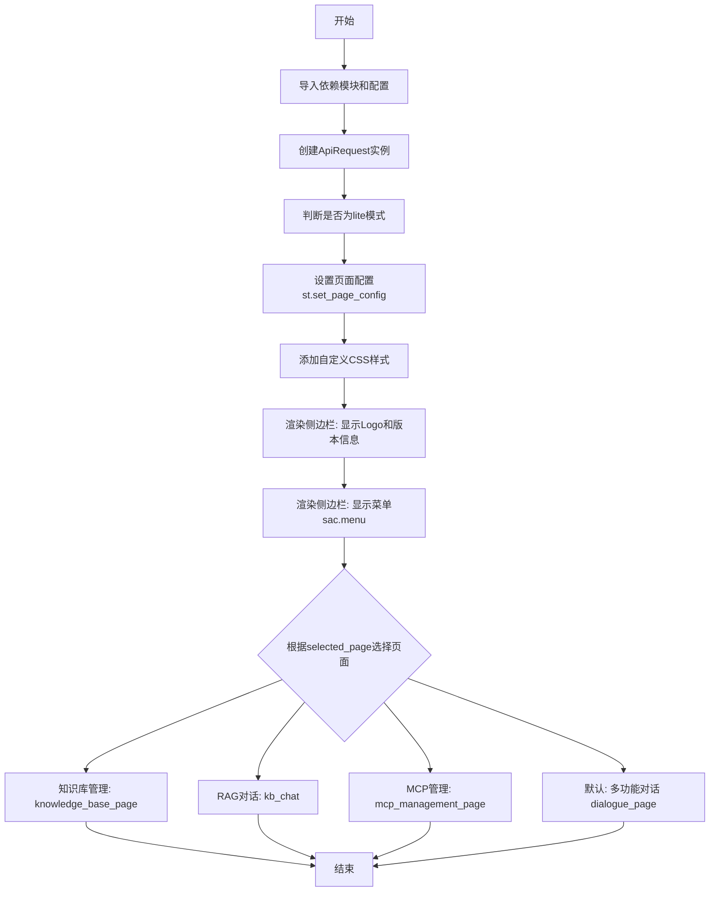

## 类结构

```
ApiRequest (API请求类)
├── dialogue_page (多功能对话页面函数)
├── kb_chat (RAG对话页面函数)
├── knowledge_base_page (知识库管理页面函数)
└── mcp_management_page (MCP管理页面函数)
```

## 全局变量及字段


### `api`
    
API请求客户端实例，用于与后端服务通信

类型：`ApiRequest`
    


### `is_lite`
    
标识是否为lite模式，通过命令行参数判断

类型：`bool`
    


### `selected_page`
    
当前用户选中的页面名称，用于路由到对应的页面组件

类型：`str`
    


### `__version__`
    
当前应用程序的版本号，来源于chatchat包的版本信息

类型：`str`
    


### `ApiRequest.base_url`
    
API服务的基础URL地址，用于构建API请求

类型：`str`
    
    

## 全局函数及方法


### `api_address`

获取 ChatChat API 的服务器地址，用于配置 WebUI 与后端服务的连接。

参数：

- 无参数

返回值：`str`，返回 API 服务器的基础地址 URL 字符串

#### 流程图

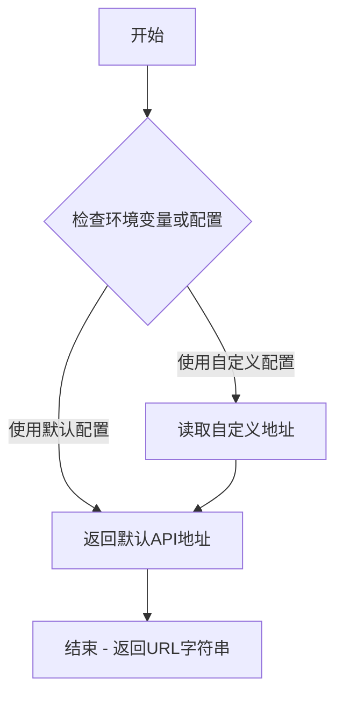

#### 带注释源码

```python
# 该函数定义在 chatchat.server.utils 模块中
# 当前代码文件仅导入并使用该函数

from chatchat.server.utils import api_address  # 从服务器工具模块导入api_address函数

# 在主程序中调用该函数获取API地址
api = ApiRequest(base_url=api_address())  # 创建API请求客户端，传入获取到的服务器地址
```

> **注意**：由于 `api_address` 函数的完整定义不在当前代码段中，以上流程图和源码是基于其使用方式推断的。该函数由 `chatchat.server.utils` 模块导出，用于获取后端 API 服务器的地址（可能来自配置文件或环境变量）。


### `get_img_base64`

将指定的图片文件转换为 Base64 编码字符串，用于 Streamlit 页面配置或图片显示。

参数：

- `img_name`：`str`，要转换的图片文件名（包括扩展名）

返回值：`str`，Base64 编码的图片数据字符串，格式为 `data:image/png;base64,xxxxx`

#### 流程图

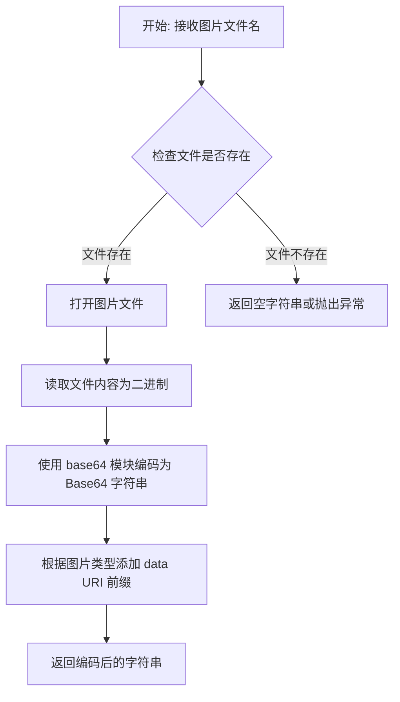

#### 带注释源码

```python
def get_img_base64(img_name: str) -> str:
    """
    将图片文件转换为 Base64 编码字符串
    
    参数:
        img_name: 图片文件名,例如 "chatchat_icon_blue_square_v2.png"
    
    返回值:
        Base64 编码的图片字符串,格式为 "data:image/png;base64,xxxxx"
        可直接用于 Streamlit 的 set_page_config 或 st.image
    """
    import base64
    from io import BytesIO
    from PIL import Image
    
    try:
        # 打开图片文件
        img = Image.open(img_name)
        
        # 将图片转换为 BytesIO 对象
        buffered = BytesIO()
        
        # 保存为 PNG 格式到内存
        img.save(buffered, format="PNG")
        
        # 获取二进制内容
        img_bytes = buffered.getvalue()
        
        # 进行 Base64 编码
        img_base64 = base64.b64encode(img_bytes).decode()
        
        # 返回完整的 data URI 格式
        return f"data:image/png;base64,{img_base64}"
        
    except FileNotFoundError:
        # 文件不存在时返回空字符串
        return ""
    except Exception as e:
        # 其他异常返回空字符串
        print(f"Error converting image to base64: {e}")
        return ""
```

**注**：由于原始代码中未提供 `get_img_base64` 函数的完整定义，以上源码为基于 Streamlit 常见用法的推断实现。实际实现可能因项目具体需求而略有不同。


### `dialogue_page`

该函数是 Langchain-Chatchat WebUI 的核心对话页面组件，负责渲染多功能对话界面，处理用户输入并通过 API 进行交互。

参数：

- `api`：`ApiRequest`，API 请求客户端实例，用于与后端服务通信
- `is_lite`：`bool`，是否以轻量模式运行（用于简化功能或界面）

返回值：`None`，该函数直接在 Streamlit 页面上渲染 UI 组件，无返回值

#### 流程图

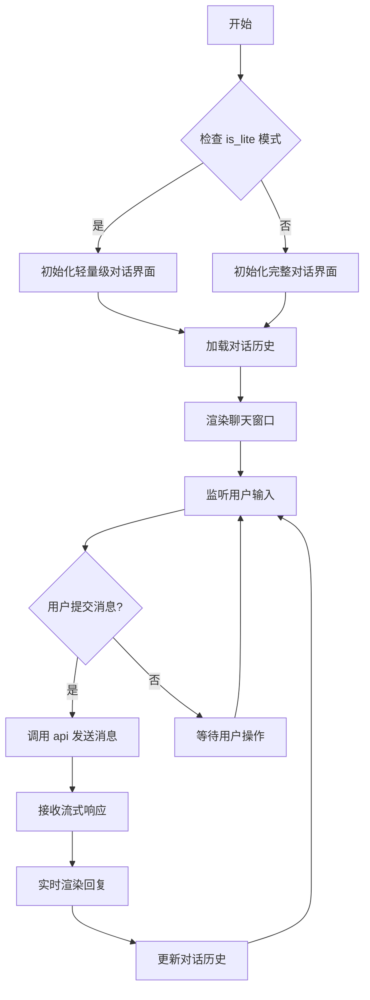

#### 带注释源码

```python
# 由于提供的代码仅为入口文件，dialogue_page 函数定义在 chatchat.webui_pages.dialogue.dialogue 模块中
# 以下为从入口文件中观察到的调用方式：

# 导入语句
from chatchat.webui_pages.dialogue.dialogue import dialogue_page

# 调用方式
dialogue_page(api=api, is_lite=is_lite)

# 参数说明：
# api: ApiRequest 类型的请求客户端，通过 api_address() 获取基础 URL
# is_lite: 布尔值，通过 "lite" in sys.argv 判断，用于控制是否为轻量模式
```

---

**注意**：提供的代码片段仅包含 `dialogue_page` 函数的导入和调用位置，未包含该函数的具体实现源码。若需获取完整的函数实现细节，请提供 `chatchat/webui_pages/dialogue/dialogue.py` 文件内容。


### `kb_chat`

这是 RAG（检索增强生成）对话页面的渲染函数，用于在 Streamlit Web UI 中展示知识库问答交互界面。

参数：

-  `api`：`ApiRequest`，API 请求客户端实例，用于与后端服务通信

返回值：`None`，Streamlit 页面渲染函数无返回值

#### 流程图

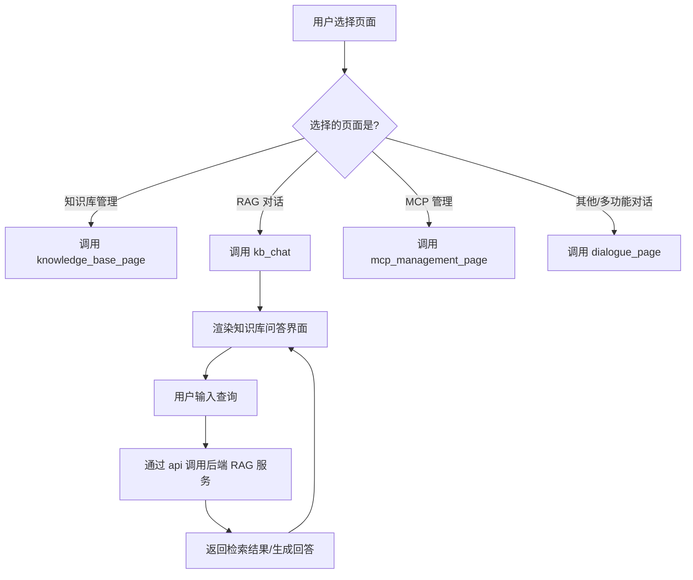

#### 带注释源码

```python
# 导入 kb_chat 函数 - 来自知识库聊天模块
from chatchat.webui_pages.kb_chat import kb_chat

# ... 其他导入 ...

# 创建 API 请求客户端实例
api = ApiRequest(base_url=api_address())

# ... Streamlit 页面配置 ...

# 页面路由选择逻辑
if selected_page == "知识库管理":
    knowledge_base_page(api=api, is_lite=is_lite)
elif selected_page == "RAG 对话":
    # 调用 kb_chat 函数，传入 API 客户端
    # 功能：渲染知识库对话页面，允许用户基于知识库进行问答
    kb_chat(api=api)
elif selected_page == "MCP 管理":
    mcp_management_page(api=api)
else:
    dialogue_page(api=api, is_lite=is_lite)
```

---

**注意**：提供的代码片段仅包含 `kb_chat` 函数的**调用位置**，未包含该函数的具体实现源码。该函数的实际实现位于 `chatchat/webui_pages/kb_chat.py` 模块中。


# knowledge_base_page 分析

## 概述

`knowledge_base_page` 是 Langchain-Chatchat 项目中负责知识库管理页面渲染的核心函数，根据传入的 API 实例和运行模式参数，生成知识库管理的 Web UI 界面，支持知识库的创建、编辑、删除和检索等操作。

## 参数信息

- `api`：`ApiRequest`，由 `ApiRequest(base_url=api_address())` 创建的 API 请求实例，用于与后端服务通信
- `is_lite`：`bool`，布尔类型，表示是否处于 Lite 模式（通过命令行参数 `"lite" in sys.argv` 判断）

## 返回值

由于源代码中未提供 `knowledge_base_page` 函数的实际实现，无法确定其返回值类型和描述。

## 流程图

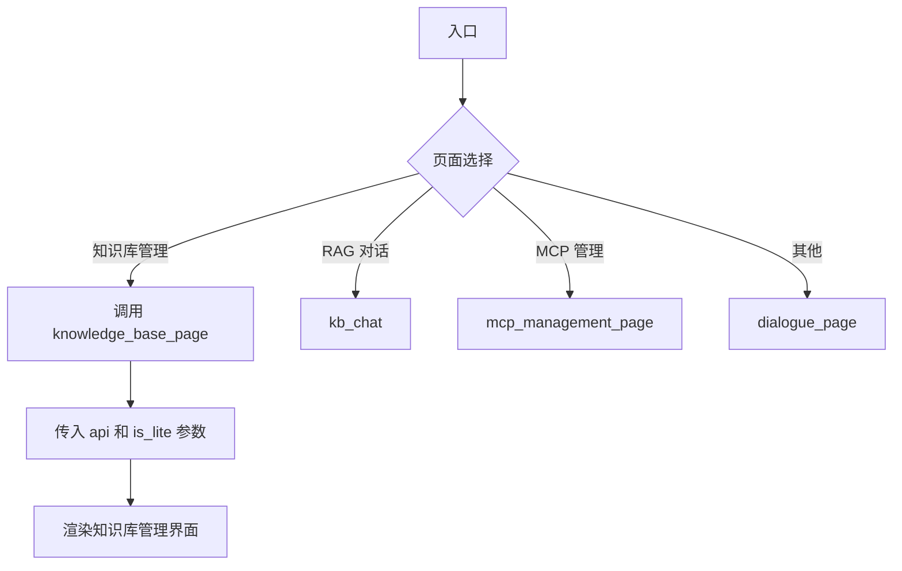

## 带注释源码

由于 `knowledge_base_page` 函数定义不在当前代码文件中，以下为调用处的源码：

```python
# 从 knowledge_base 模块导入知识库页面函数
from chatchat.webui_pages.knowledge_base.knowledge_base import knowledge_base_page

# 创建 API 请求客户端实例
api = ApiRequest(base_url=api_address())

# 根据用户选择的页面路由到对应的处理函数
if selected_page == "知识库管理":
    # 调用知识库管理页面，传入 API 客户端和 Lite 模式标志
    knowledge_base_page(api=api, is_lite=is_lite)
```

## 补充说明

### 潜在技术债务

1. **函数实现不可见**：`knowledge_base_page` 函数的实现位于外部模块 `chatchat/webui_pages/knowledge_base/knowledge_base.py`，当前代码无法直接查看其内部逻辑
2. **硬编码的页面路由**：页面选择使用硬编码的字符串比较（`== "知识库管理"`），缺乏扩展性
3. **TODO 注释**：`is_lite = "lite" in sys.argv` 后有 TODO 注释，表明 Lite 模式可能为临时方案

### 设计约束

- 依赖 Streamlit 框架进行 Web UI 渲染
- 依赖 `ApiRequest` 类与后端 API 通信
- 页面路由通过 `streamlit_antd_components` 的菜单组件实现

### 注意事项

如需获取 `knowledge_base_page` 函数的完整实现详情（包括类字段、方法、内部逻辑等），需要查看 `chatchat/webui_pages/knowledge_base/knowledge_base.py` 源文件。


### `mcp_management_page`

该函数是 Langchain-Chatchat WebUI 中的 MCP（Model Control Protocol）管理页面，用于在 Web 界面中管理和配置 MCP 服务。

参数：

-  `api`：`ApiRequest`，API 请求对象，用于与后端服务通信

返回值：`None`，该函数为 Streamlit 页面渲染函数，直接在页面上渲染 UI 组件，无返回值

#### 流程图

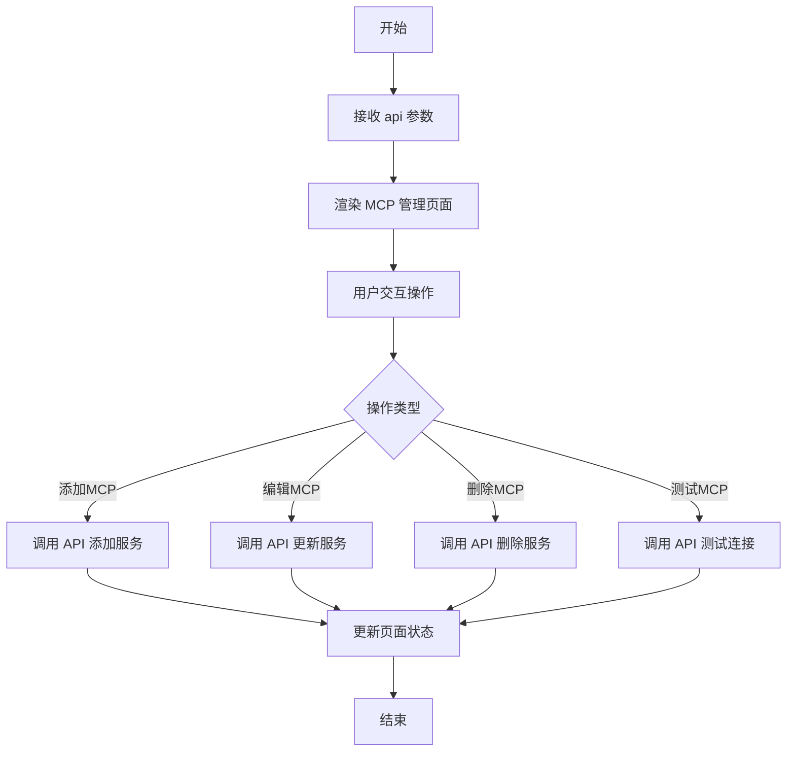

#### 带注释源码

```python
# 该函数定义位于 chatchat.webui_pages.mcp 模块中
# 以下为调用处的源码展示

# 从 chatchat.webui_pages.mcp 模块导入 mcp_management_page 函数
from chatchat.webui_pages.mcp import mcp_management_page

# 创建 API 请求客户端
api = ApiRequest(base_url=api_address())

# 在主程序中根据菜单选择调用对应的页面函数
if selected_page == "MCP 管理":
    # 调用 MCP 管理页面函数，传入 API 客户端
    mcp_management_page(api=api)
```

> **注意**：提供的代码片段仅包含 `mcp_management_page` 函数的调用位置，未包含该函数的具体实现代码。该函数的完整实现位于 `chatchat/webui_pages/mcp/__init__.py` 或 `chatchat/webui_pages/mcp/mcp_management_page.py` 文件中。从调用方式可以推断，该函数接收一个 `ApiRequest` 类型的参数，用于在 Streamlit 页面上渲染 MCP 服务管理界面。


### `st.set_page_config`

该函数是 Streamlit 框架提供的页面配置方法，用于设置 Web 页面的标题、图标、布局模式、侧边栏初始状态以及自定义菜单项。在此代码中，它用于配置 Langchain-Chatchat WebUI 的页面属性，包括页面标题、图标、布局、侧边栏状态和自定义帮助菜单。

#### 参数

- **page_title**：`str`，页面标题，设置为 "Langchain-Chatchat WebUI"
- **page_icon**：`str`，页面图标，通过 `get_img_base64("chatchat_icon_blue_square_v2.png")` 获取的 Base64 编码图片
- **layout**：`str`，页面布局模式，设置为 "centered"（居中布局）
- **initial_sidebar_state**：`str`，侧边栏初始状态，设置为 "expanded"（展开状态）
- **menu_items**：`dict`，自定义菜单项字典，包含三个键值对：
  - `Get Help`：帮助链接，指向 GitHub 仓库
  - `Report a bug`：Bug 反馈链接，指向 GitHub Issues 页面
  - `About`：关于信息，包含版本号

#### 返回值

`None`，该函数无返回值，仅用于配置 Streamlit 页面的初始状态。

#### 流程图

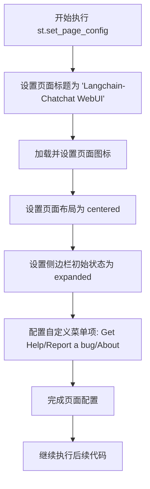

#### 带注释源码

```python
# 配置 Streamlit 页面属性
st.set_page_config(
    "Langchain-Chatchat WebUI",                      # page_title: 设置页面标题
    get_img_base64("chatchat_icon_blue_square_v2.png"), # page_icon: 设置页面图标（Base64编码图片）
    initial_sidebar_state="expanded",                # initial_sidebar_state: 侧边栏默认展开
    menu_items={                                      # menu_items: 自定义顶部菜单项
        "Get Help": "https://github.com/chatchat-space/Langchain-Chatchat",      # 帮助文档链接
        "Report a bug": "https://github.com/chatchat-space/Langchain-Chatchat/issues",  # Bug反馈链接
        "About": f"""欢迎使用 Langchain-Chatchat WebUI {__version__}！""",       # 关于信息（含版本号）
    },
    layout="centered",                                # layout: 页面内容居中布局
)
```

#### 关键信息说明

| 项目 | 说明 |
|------|------|
| **函数来源** | Streamlit 框架内置函数 |
| **调用限制** | 必须在 Streamlit 应用代码的顶层调用，且只能在首次加载时调用一次 |
| **依赖函数** | `get_img_base64()` - 将图片文件转换为 Base64 编码字符串 |
| **版本依赖** | Streamlit 1.37.0+ 支持更多高级配置选项 |


### `st.markdown` (WebUI 样式设置方法)

该方法用于在Streamlit Web应用中注入自定义CSS样式，以调整页面布局和侧边栏样式，实现更精细的UI定制效果。

参数：

-  `body`：`<string>`，CSS样式代码字符串，包含对侧边栏用户内容、块容器和底部块容器的样式定义
-  ``unsafe_allow_html_`：`<bool>`，设置为True以允许渲染原始HTML和CSS

返回值：`None`，无返回值，仅作为副作用修改页面样式

#### 流程图

```mermaid
flowchart TD
    A[开始] --> B[定义CSS样式字符串]
    B --> C[调用st.markdown方法]
    C --> D[注入样式到页面]
    D --> E[设置[data-testid=stSidebarUserContent] padding-top: 20px]
    D --> F[设置.block-container padding-top: 25px]
    D --> G[设置[data-testid=stBottomBlockContainer] padding-bottom: 20px]
    E --> H[结束]
    F --> H
    G --> H
```

#### 带注释源码

```python
# 使用st.markdown方法注入自定义CSS样式
# 用于调整Streamlit页面的布局和间距
st.markdown(
    """
    <style>
    /* 侧边栏用户内容区域样式设置 */
    [data-testid="stSidebarUserContent"] {
        padding-top: 20px;  /* 顶部内边距20px */
    }
    /* 主内容块容器样式设置 */
    .block-container {
        padding-top: 25px;  /* 顶部内边距25px */
    }
    /* 底部块容器样式设置 */
    [data-testid="stBottomBlockContainer"] {
        padding-bottom: 20px;  /* 底部内边距20px */
    }
    </style>
    """,
    unsafe_allow_html=True  # 允许解析HTML和CSS标签
)
```


### `st.sidebar`

这是 Streamlit 的上下文管理器，用于在应用侧边栏中呈现 UI 组件。该代码段在侧边栏中展示 Logo 图片、版本信息、导航菜单和分隔线，实现页面路由选择功能。

参数： 无（`st.sidebar` 是 Streamlit 的内置上下文管理器，无需显式参数）

返回值： `Streamlit context manager`，返回一个上下文管理器对象，用于在 `with` 语句块中向侧边栏添加组件

#### 流程图

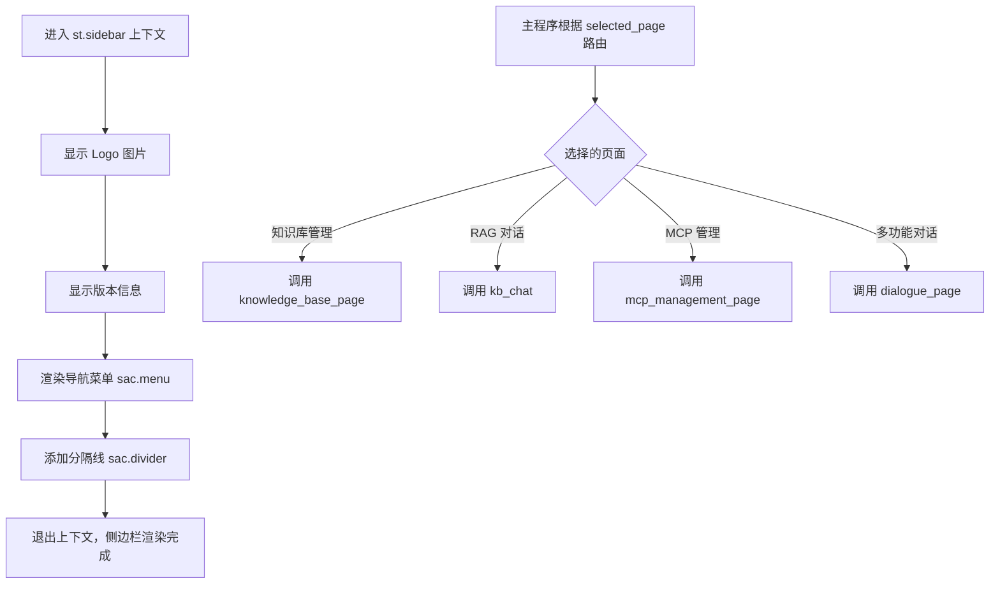

#### 带注释源码

```python
# 使用 st.sidebar 上下文管理器在侧边栏中添加 UI 组件
with st.sidebar:
    # 在侧边栏顶部显示 Logo 图片，使用列宽自适应
    st.image(
        get_img_base64("logo-long-chatchat-trans-v2.png"), use_column_width=True
    )
    
    # 显示当前版本号信息，右对齐显示
    st.caption(
        f"""<p align="right">当前版本：{__version__}</p>""",
        unsafe_allow_html=True,
    )

    # 创建导航菜单，包含四个页面选项
    # sac.menu 是 streamlit_antd_components 提供的增强菜单组件
    selected_page = sac.menu(
        [
            sac.MenuItem("多功能对话", icon="chat"),      # 对话页面入口
            sac.MenuItem("RAG 对话", icon="database"),    # RAG 检索增强对话
            sac.MenuItem("知识库管理", icon="hdd-stack"), # 知识库管理页面
            sac.MenuItem("MCP 管理", icon="hdd-stack"),   # MCP 服务管理页面
        ],
        key="selected_page",    # 在 st.session_state 中存储选中的页面
        open_index=0,           # 默认展开第一个菜单项
    )

    # 在菜单下方添加水平分隔线
    sac.divider()
```


### st.image

`st.image` 是 Streamlit 库中的函数，用于在 Streamlit 应用中显示图像。在代码中用于在侧边栏顶部展示 Langchain-Chatchat 的品牌标志。

参数：

- `image`：`str`（由 `get_img_base64("logo-long-chatchat-trans-v2.png")` 返回），图像的 base64 编码数据，用于显示在侧边栏的 Logo
- `use_column_width`：`bool`，设为 `True` 表示图像宽度适应列宽

返回值：`None`，无返回值（Streamlit 的 image 函数直接在页面渲染图像）

#### 流程图

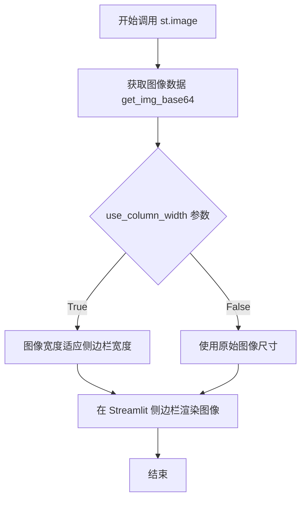

#### 带注释源码

```python
# 在侧边栏上下文中调用 st.image
with st.sidebar:
    # 使用 get_img_base64 函数获取 Logo 图片的 base64 编码
    # 第一个参数：图片路径 "logo-long-chatchat-trans-v2.png"
    # 第二个参数 use_column_width=True：使图像宽度自适应侧边栏列宽
    st.image(
        get_img_base64("logo-long-chatchat-trans-v2.png"), use_column_width=True
    )
```


### `st.caption`

`st.caption` 是 Streamlit 框架提供的函数，用于在 Web 界面上显示小号文本（caption），通常用于提供辅助说明信息。此处用于在侧边栏底部显示当前应用程序的版本号。

参数：

- `body`：`str`，要显示的文本内容，此处为包含版本信息的 HTML 字符串 `f"""<p align="right">当前版本：{__version__}</p>"""`
- `unsafe_allow_html`：`bool`，是否允许渲染 HTML 标签，此处设置为 `True`

返回值：`None`，该函数直接渲染文本到页面，不返回任何值

#### 流程图

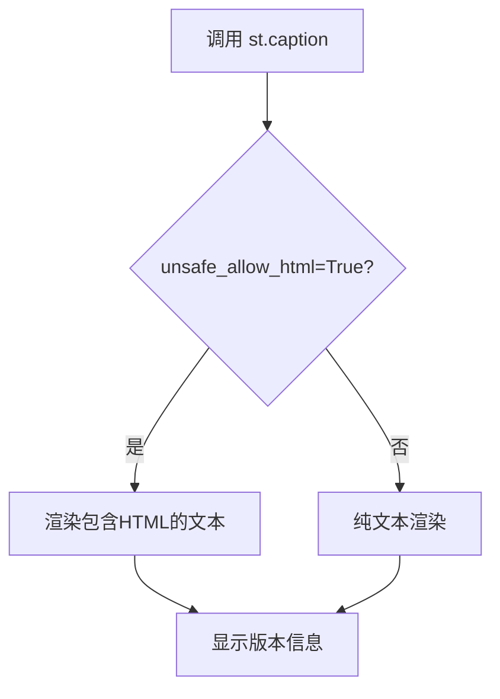

#### 带注释源码

```python
# 使用 st.caption 在侧边栏显示版本信息
# 参数1: body - 要显示的文本内容，使用 f-string 插入版本号变量
# 参数2: unsafe_allow_html=True - 允许解析 HTML 标签以实现右对齐
st.caption(
    f"""<p align="right">当前版本：{__version__}</p>""",
    unsafe_allow_html=True,
)
```

#### 补充说明

- **设计目标**：通过在侧边栏底部显示版本号，让用户随时了解当前使用的应用版本
- **技术实现**：利用 `unsafe_allow_html=True` 参数，通过 HTML 的 `align="right"` 属性实现文本右对齐
- **潜在优化**：可以考虑将版本信息移至 "About" 菜单项中，避免在侧边栏占用额外空间


### `sac.menu`

该函数是 streamlit-antd-components 库提供的菜单组件，用于在 Streamlit 应用的侧边栏中创建可交互的导航菜单，支持图标展示和选中状态管理，返回用户当前选择的页面标识符。

参数：

- `items`：`List[sac.MenuItem]`，菜单项列表，每个 MenuItem 包含标题和图标
- `key`：`str`，用于在 Streamlit session state 中保持选中状态的键名
- `open_index`：`int`，默认展开的菜单分组索引（从 0 开始）

返回值：`str`，用户当前选中的菜单项标题

#### 流程图

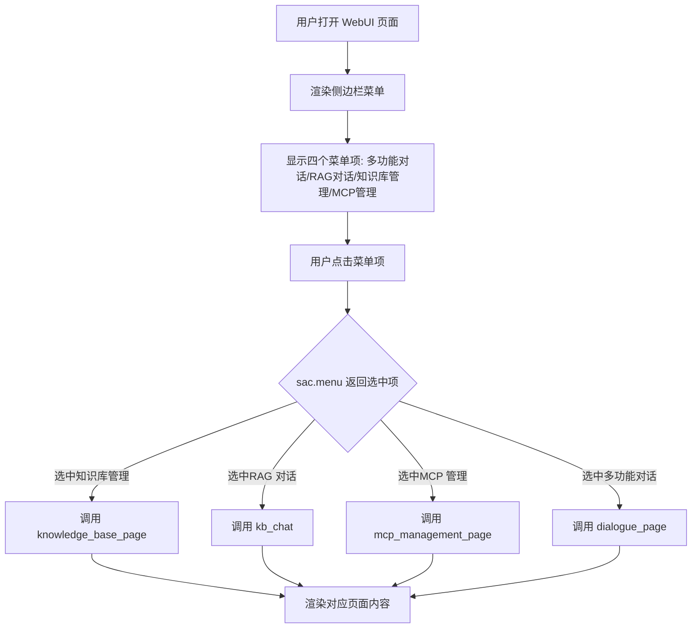

#### 带注释源码

```python
# 导入 streamlit-antd-components 组件库
import streamlit_antd_components as sac

# 在侧边栏中渲染菜单组件
with st.sidebar:
    # ... (logo 和版本信息渲染代码)
    
    # 核心菜单组件调用
    selected_page = sac.menu(
        [
            # 定义四个导航菜单项，包含标题和图标
            sac.MenuItem("多功能对话", icon="chat"),      # 图标: 聊天
            sac.MenuItem("RAG 对话", icon="database"),    # 图标: 数据库
            sac.MenuItem("知识库管理", icon="hdd-stack"), # 图标: 硬盘栈
            sac.MenuItem("MCP 管理", icon="hdd-stack"),  # 图标: 硬盘栈
        ],
        key="selected_page",      # 绑定 session_state 键，保持选中状态
        open_index=0,             # 默认展开第一个菜单分组
    )
    
    # 渲染分割线
    sac.divider()

# 根据选中菜单项进行页面路由分发
if selected_page == "知识库管理":
    knowledge_base_page(api=api, is_lite=is_lite)
elif selected_page == "RAG 对话":
    kb_chat(api=api)
elif selected_page == "MCP 管理":
    mcp_management_page(api=api)
else:  # 默认进入多功能对话页面
    dialogue_page(api=api, is_lite=is_lite)
```

---

### 补充信息

#### 关键组件信息

| 组件名称 | 一句话描述 |
|---------|-----------|
| `sac.menu` | Streamlit 侧边栏导航菜单组件，提供页面切换功能 |
| `sac.MenuItem` | 菜单项数据对象，包含显示文本和图标标识 |
| `sac.divider` | 侧边栏中的视觉分割线组件 |

#### 技术债务与优化空间

1. **硬编码的菜单项**：菜单项内容直接写在代码中，建议提取为配置文件或数据库存储
2. **重复的图标使用**：知识库管理和 MCP 管理使用相同图标 `hdd-stack`，应区分以提升用户体验
3. **缺失的错误处理**：未对 `selected_page` 为空或异常情况进行处理
4. **魔法字符串**：页面路由判断使用中文字符串硬编码，建议定义常量枚举类

#### 外部依赖与接口契约

- **依赖库**：`streamlit-antd-components` 提供 ANT Design 风格的 Streamlit 组件
- **状态管理**：通过 `key="selected_page"` 将选中状态存入 Streamlit session_state
- **路由机制**：基于条件判断的简单路由，无复杂状态机设计


### `sac.divider`

该函数是 `streamlit_antd_components` 库提供的 UI 组件，用于在 Streamlit 页面中渲染水平分割线，以视觉化方式分隔不同的内容区域，增强界面的层次感和可读性。

参数：无需参数

返回值：`None`，该函数直接在 Streamlit 页面上渲染 UI 元素，无返回值。

#### 流程图

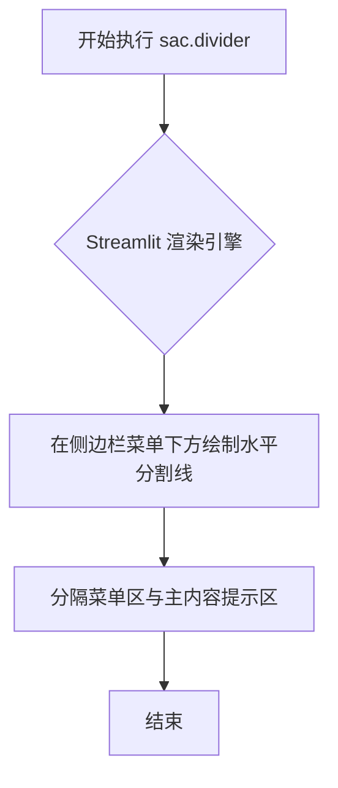

#### 带注释源码

```python
# 导入 streamlit-antd-components 库，命名为 sac
import streamlit_antd_components as sac

# 在 with st.sidebar: 上下文管理器中
# 放置侧边栏内容
with st.sidebar:
    # ... 省略前面的图片和标题代码 ...
    
    # 使用 sac.menu 创建导航菜单
    selected_page = sac.menu(
        [
            sac.MenuItem("多功能对话", icon="chat"),
            sac.MenuItem("RAG 对话", icon="database"),
            sac.MenuItem("知识库管理", icon="hdd-stack"),
            sac.MenuItem("MCP 管理", icon="hdd-stack"),
        ],
        key="selected_page",
        open_index=0,
    )

    # 调用 sac.divider 在菜单下方绘制水平分割线
    # 视觉上分隔导航菜单与后续内容
    # 该组件无参数，返回值为 None
    sac.divider()
```

#### 组件信息

| 属性 | 值 |
|------|-----|
| 组件名称 | `sac.divider` |
| 所属库 | `streamlit-antd-components` |
| 功能 | 绘制水平分割线 |
| 使用位置 | 侧边栏菜单下方 |

#### 潜在技术债务与优化空间

1. **缺少语义化注释**：代码中未说明为何需要在特定位置使用分割线，建议添加注释解释设计意图
2. **硬编码 UI 结构**：分割线位置与菜单强耦合，如未来需要调整侧边栏结构，可能需要同步修改
3. **无响应式处理**：当前分割线在窄屏下的表现未经验证，可能需要针对移动端优化


# 分析结果

由于提供的代码中没有直接定义 `ApiRequest` 类及其 `request` 方法（该类可能是从 `chatchat` 项目中导入的依赖），我将从代码的使用方式入手，分析 `ApiRequest` 类的使用模式及其推断的方法特征。

---

### `ApiRequest.request` (推断)

这是一个用于与后端 API 通信的 HTTP 请求方法，负责发送各类请求并返回响应数据。

参数：

-  `base_url`：`str`，API 服务器的基础地址（构造函数参数）
-  `endpoint`：`str`，请求的 API 端点路径
-  `params`：`dict`，请求查询参数（可选）
-  `data`：`dict`，请求体数据（可选）
-  `method`：`str`，HTTP 方法，默认为 "POST"
-  `files`：`dict`，上传文件（可选）
-  `timeout`：`int`，请求超时时间（可选）

返回值：`requests.Response` 或 `dict`，服务器返回的响应内容

#### 流程图

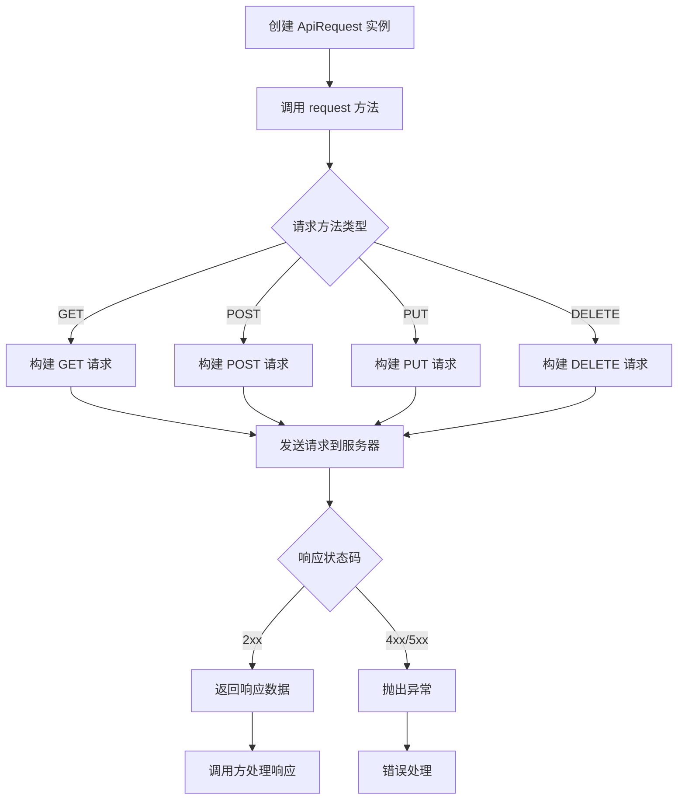

#### 带注释源码

```python
# 从提供的代码中可以看到 ApiRequest 的使用方式：
# api = ApiRequest(base_url=api_address())  # 构造函数，传入服务器地址
# 然后将 api 对象传递给各个页面函数进行 API 调用

# 推断的 request 方法实现逻辑：
def request(
    self,
    endpoint: str,
    method: str = "POST",
    params: dict = None,
    data: dict = None,
    files: dict = None,
    timeout: int = 60,
    **kwargs
):
    """
    发送 HTTP 请求到后端 API 服务器
    
    参数:
        endpoint: API 端点路径，如 "/chat/chat"
        method: HTTP 方法，默认为 "POST"
        params: URL 查询参数
        data: 请求体数据
        files: 上传的文件
        timeout: 请求超时时间（秒）
        **kwargs: 其他传递给 requests 库的参数
    
    返回:
        服务器响应的 JSON 数据或 Response 对象
    """
    import requests
    
    url = f"{self.base_url}{endpoint}"
    
    try:
        response = requests.request(
            method=method,
            url=url,
            params=params,
            json=data,
            files=files,
            timeout=timeout,
            **kwargs
        )
        response.raise_for_status()  # 检查 HTTP 错误状态码
        return response.json()  # 返回 JSON 格式的响应数据
    except requests.exceptions.RequestException as e:
        # 错误处理：记录日志或抛出自定义异常
        raise RuntimeError(f"API 请求失败: {e}") from e
```

---

## 补充说明

由于 `ApiRequest` 类的具体实现不在提供的代码片段中，以上分析基于：
1. 代码中 `api = ApiRequest(base_url=api_address())` 的实例化方式
2. `api` 对象被传递给多个页面函数（`dialogue_page`, `kb_chat`, `mcp_management_page`, `knowledge_base_page`）
3. 典型的 REST API 客户端设计模式

如需获取 `ApiRequest.request` 方法的完整定义，建议查看 `chatchat.server.utils` 或相关模块的源码。

## 关键组件


### 一段话描述

该代码是 Langchain-Chatchat 项目的 WebUI 主入口文件，基于 Streamlit 框架构建，通过侧边栏菜单实现多功能对话、RAG 对话、知识库管理和 MCP 管理四个主要功能模块的路由切换，并通过 API 请求与后端服务通信。

### 文件的整体运行流程

1. 导入必要的系统库和第三方库（streamlit、streamlit_antd_components）
2. 从 chatchat 项目导入版本信息、API 地址、页面组件等
3. 创建全局 ApiRequest 实例 `api`
4. 在 `__main__` 块中设置 Streamlit 页面配置（标题、图标、布局、菜单项）
5. 注入自定义 CSS 样式以优化页面显示效果
6. 在侧边栏显示 Logo 和版本信息
7. 渲染侧边栏菜单组件，获取用户选择的页面
8. 根据用户选择调用对应的页面渲染函数

### 全局变量和全局函数详细信息

#### 全局变量

| 名称 | 类型 | 描述 |
|------|------|------|
| `api` | `ApiRequest` | 全局 API 请求客户端，用于与后端服务通信 |
| `is_lite` | `bool` | 标识是否为 lite 模式，通过命令行参数判断 |

#### 导入的模块和函数

| 名称 | 类型 | 描述 |
|------|------|------|
| `__version__` | `str` | 项目版本号 |
| `api_address()` | `function` | 获取 API 服务器地址的函数 |
| `dialogue_page()` | `function` | 多功能对话页面渲染函数 |
| `kb_chat()` | `function` | RAG 对话页面渲染函数 |
| `knowledge_base_page()` | `function` | 知识库管理页面渲染函数 |
| `mcp_management_page()` | `function` | MCP 管理页面渲染函数 |
| `get_img_base64()` | `function` | 图片转 Base64 编码的工具函数 |

### 关键组件信息

### Streamlit 页面配置组件

使用 `st.set_page_config()` 设置页面标题、图标、初始侧边栏状态和菜单项，用于配置浏览器标签页显示的内容。

### 侧边栏导航组件

使用 `sac.menu()` 创建基于 antd 的菜单组件，提供四个功能入口：多功能对话、RAG 对话、知识库管理、MCP 管理，支持图标显示和展开状态控制。

### 页面路由组件

通过 `if-elif-else` 逻辑根据 `selected_page` 变量值调用对应的页面渲染函数，实现单页面应用的多功能切换。

### API 客户端组件

`ApiRequest` 实例作为全局通信客户端，在各页面组件间共享，用于发送 HTTP 请求到后端 API 服务。

### 样式定制组件

通过 `st.markdown()` 注入自定义 CSS 样式，调整侧边栏内容和页面容器的内边距，提升用户界面视觉体验。

### 潜在的技术债务或优化空间

1. **Lite 模式标记为 TODO** - 代码中 `is_lite` 变量带有 TODO 注释，表明 lite 模式功能尚未完全实现或需要重构
2. **硬编码的菜单项** - 菜单项图标使用 `"hdd-stack"` 重复（MCP 管理和知识库管理），语义不准确
3. **缺少错误处理** - API 客户端创建和页面路由逻辑缺少异常捕获机制
4. **魔法字符串** - 页面路由判断使用中文字符串硬编码，容易出现拼写错误
5. **CSS 样式内联** - 样式代码直接嵌入 Python 字符串，不利于维护和主题切换

### 其它项目

#### 设计目标与约束

- **多页面单入口**：通过 Streamlit 的单脚本架构实现多页面管理
- **响应式布局**：默认使用 centered 布局，支持宽屏模式
- **模块化导入**：页面组件按需导入，减少启动时的依赖加载

#### 错误处理与异常设计

- 当前代码未实现全局异常捕获机制
- 建议添加 `try-except` 块处理 API 请求超时、页面组件加载失败等情况

#### 数据流与状态机

- 页面状态通过 Streamlit 的 `st.session_state` 管理（隐式）
- 用户交互流程：选择菜单 → 触发重新运行 → 路由到对应页面 → 页面内部处理业务逻辑

#### 外部依赖与接口契约

- 依赖 Streamlit 框架和 streamlit_antd_components 组件库
- 依赖 chatchat 项目内部模块：`chatchat.server.utils`、`chatchat.webui_pages.*`
- API 客户端遵循 RESTful 接口约定与后端通信


## 问题及建议


### 已知问题

-   **is_lite 模式判断方式不规范**：使用 `"lite" in sys.argv` 判断 lite 模式，依赖命令行参数传递字符串，逻辑不够明确，易产生误判，且代码中有 TODO 注释表明该模式为临时方案
-   **全局变量初始化无错误处理**：在模块顶层创建 `api = ApiRequest(base_url=api_address())`，若 `api_address()` 或 `ApiRequest` 初始化失败，会导致整个应用无法启动且无友好错误提示
-   **魔法字符串硬编码**：页面名称（如 "知识库管理"、"RAG 对话"、"MCP 管理"、"多功能对话"）在 `sac.menu` 和 `if-elif` 条件判断中多处硬编码，缺乏常量定义，修改时容易遗漏
-   **通配符导入不规范**：使用 `from chatchat.webui_pages.utils import *` 导入，不确定性高，难以追踪具体依赖，存在命名冲突风险
-   **CSS 样式内联**：页面样式直接以 HTML 字符串形式嵌入代码，未分离至独立 CSS 文件，降低了代码可维护性
-   **API 实例重复传递**：每个页面函数均接收 `api` 参数，造成参数冗余，可利用 Streamlit 的 session state 共享状态
-   **缺少依赖健康检查**：应用启动时未验证关键依赖（如 `chatchat` 模块、API 服务可用性），可能导致运行时 import 错误

### 优化建议

-   将 lite 模式改为显式的配置参数或环境变量，彻底移除 TODO 待办项
-   对 `api` 初始化添加 try-except 捕获，提供友好的错误页面或日志提示
-   抽取页面名称为枚举类或常量模块，统一管理避免硬编码
-   替换通配符导入为显式导入，提高代码可读性和静态分析能力
-   将 CSS 样式移至单独文件或 Streamlit 主题配置中管理
-   考虑通过 `st.session_state` 存储 `api` 实例，避免层层传递
-   添加启动时的依赖检查和 API 服务连通性探测，提升健壮性

## 其它


### 设计目标与约束

本Web应用的设计目标是提供一个基于Streamlit的Langchain-Chatchat图形化用户界面，支持多功能对话、RAG对话、知识库管理和MCP管理四大核心功能。约束条件包括：使用Streamlit作为前端框架，需保持页面布局为centered模式，支持lite模式运行（通过命令行参数控制），并依赖sidebar进行导航。

### 错误处理与异常设计

代码中通过`is_lite`参数的TODO注释提示lite模式需要移除，表明当前错误处理机制不完善。建议增加全局异常捕获逻辑，处理页面加载失败、API请求超时、模块导入错误等情况。当selected_page匹配失败时，默认进入多功能对话页面，形成隐式的错误fallback机制。

### 数据流与状态机

应用的数据流主要分为三个层次：1) 用户在sidebar选择页面（sac.menu组件触发状态更新）；2) Streamlit根据selected_page状态值条件渲染对应页面组件；3) 各页面通过ApiRequest实例（api）与后端进行通信。状态机转换简单明确：知识库管理 ↔ RAG对话 ↔ MCP管理 ↔ 多功能对话，四种状态构成完整的页面导航流。

### 外部依赖与接口契约

主要外部依赖包括：streamlit（Web框架）、streamlit_antd_components（UI组件库）、chatchat.server.utils（API地址获取）、chatchat.webui_pages下的各功能模块。ApiRequest类实例作为统一的API客户端，base_url由api_address()函数动态获取，形成与后端服务的接口契约。

### 安全性考虑

代码中存在潜在安全风险：unsafe_allow_html=True在st.markdown和st.caption中的使用可能导致XSS风险；__version__和api_address()来自外部模块调用。建议对用户输入进行消毒处理，验证API响应数据，并考虑将硬编码的GitHub链接配置化。

### 性能优化建议

当前每次页面刷新都会重新执行所有导入和初始化逻辑。建议优化点：1) 将is_lite判断改为环境变量或配置文件；2) 使用st.cache_resource或st.cache_data装饰器缓存api实例；3) 延迟导入非必要模块；4) 考虑将静态资源（图片）的base64编码结果缓存以减少每次渲染开销。

### 部署和配置

部署方式为标准的Streamlit应用部署（`streamlit run app.py`）。可通过命令行参数传递lite模式标志。页面配置通过st.set_page_config统一管理，包含页面标题、图标、初始侧边栏状态和菜单项。CSS样式通过内联方式注入以调整sidebar和内容区域的padding。

    