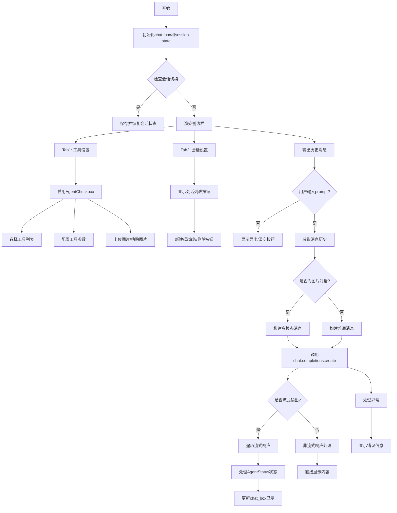
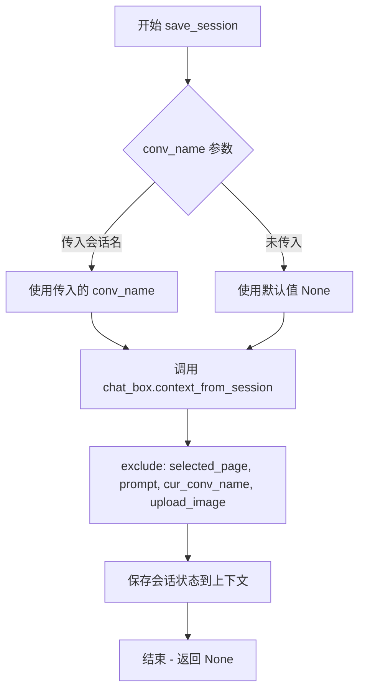
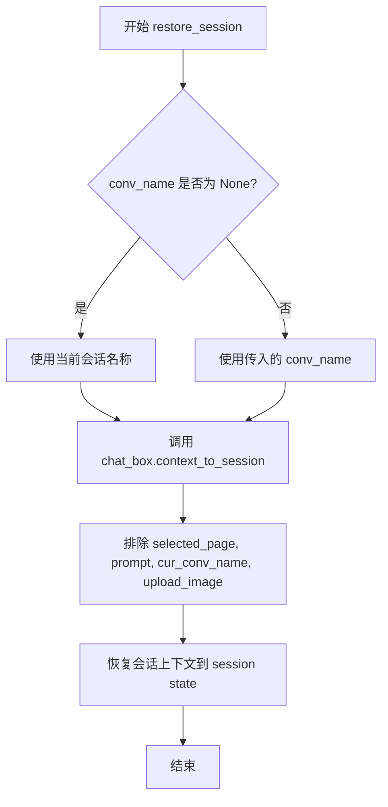
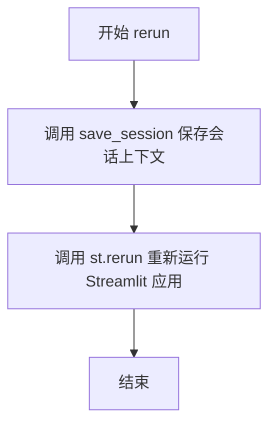
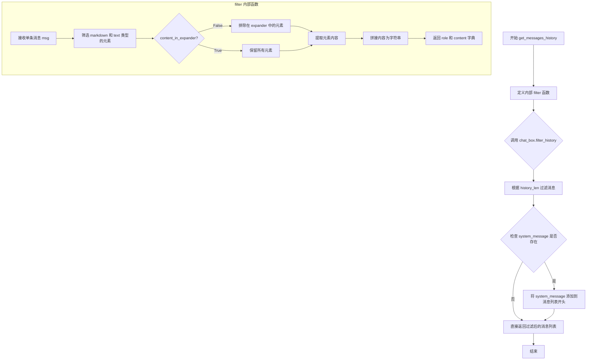
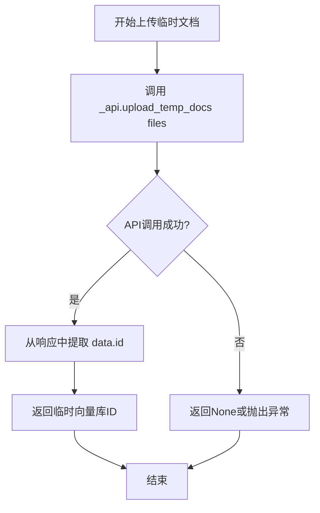
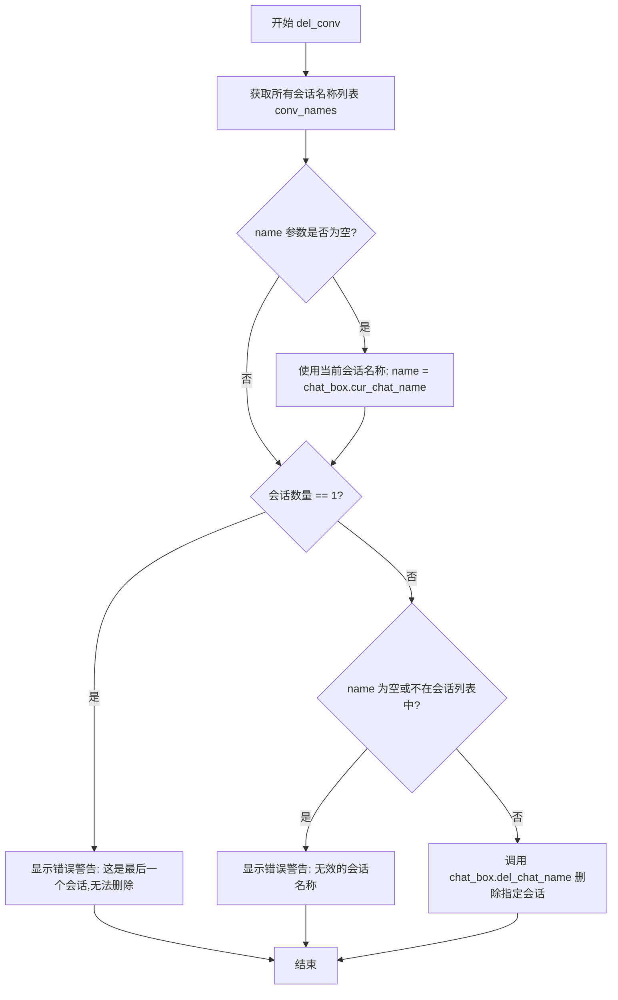
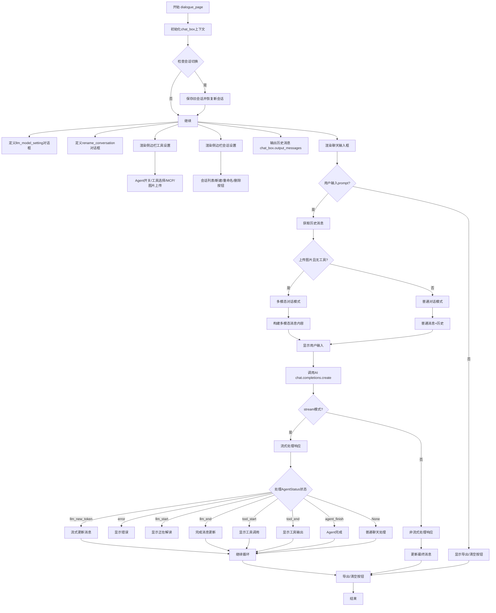
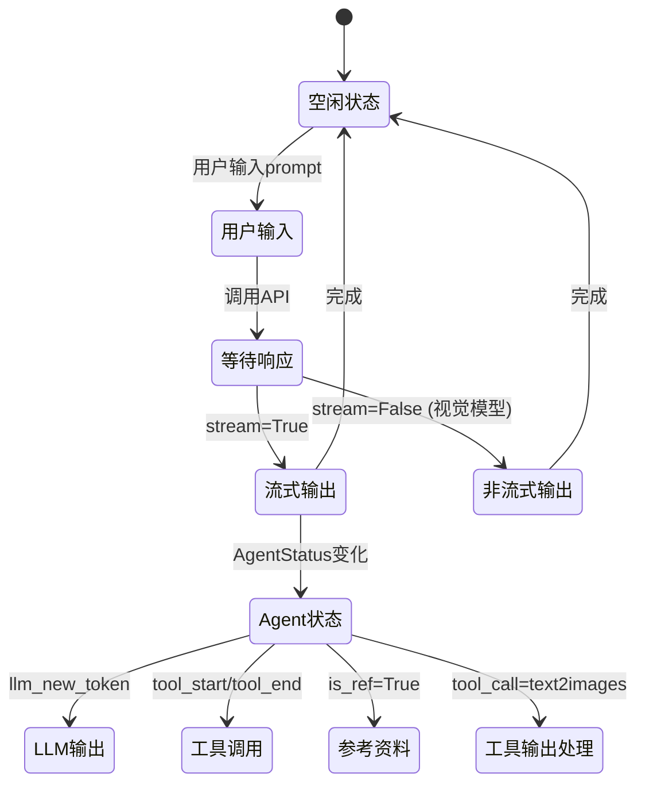

# `Langchain-Chatchat\libs\chatchat-server\chatchat\webui_pages\dialogue\dialogue.py` 详细设计文档

这是一个基于Streamlit的ChatChat聊天界面页面模块，提供了完整的对话功能支持，包括多会话管理、LLM模型配置、Agent/Tool工具集成、多模态图片对话、对话历史导出等核心功能。

## 整体流程



## 类结构

```
ChatBox (外部依赖)
├── dialogue_page (主函数)
│   ├── llm_model_setting (内部对话框)
│   ├── rename_conversation (内部对话框)
│   ├── on_upload_file_change (回调函数)
│   └── on_conv_change (回调函数)
```

## 全局变量及字段


### `chat_box`
    
全局聊天框组件实例，用于管理对话历史和消息展示

类型：`ChatBox`
    


### `conversation_id`
    
当前会话的唯一标识符，从聊天上下文获取的UUID字符串

类型：`str`
    


### `conversation_name`
    
当前会话的名称，通过sac.buttons组件获取的用户选择

类型：`str`
    


### `cur_image`
    
当前上传的图片元组，包含文件名和PIL Image对象

类型：`tuple`
    


### `files_upload`
    
上传的附件文件字典，可能包含images、videos、audios键

类型：`dict`
    


### `is_vision_chat`
    
是否启用视觉聊天模式的布尔标志，基于上传图片和无工具选择判断

类型：`bool`
    


### `llm_model`
    
当前选中的大语言模型名称，从聊天上下文获取

类型：`str`
    


### `llm_model_config`
    
从设置中获取的LLM模型配置字典，包含各模型的配置信息

类型：`dict`
    


### `chat_model_config`
    
构建后的聊天模型配置字典，根据选中的LLM模型填充配置

类型：`dict`
    


### `messages`
    
消息列表，包含历史消息和当前用户输入的消息字典

类型：`List[Dict]`
    


### `params`
    
API调用参数字典，包含消息、模型、流式输出等参数

类型：`dict`
    


### `prompt`
    
用户输入的对话内容，从聊天输入框获取的字符串

类型：`str`
    


### `selected_tools`
    
用户选中的工具名称列表，从多选框获取

类型：`list`
    


### `selected_tool_configs`
    
选中的工具配置字典，键为工具名值为配置信息

类型：`dict`
    


### `text`
    
累积的回复文本字符串，用于流式输出时构建完整响应

类型：`str`
    


### `tool_input`
    
工具输入参数字典，存储用户填写的工具参数

类型：`dict`
    


### `tools`
    
可用工具名称列表，用于API调用时的tools参数

类型：`list`
    


### `tool_choice`
    
选中的单一工具名称，若未选或多选则为None

类型：`str | None`
    


### `upload_image`
    
上传图片的响应字典，包含文件ID等信息，无上传时为None

类型：`dict | None`
    


### `chat_box.context.uid`
    
会话唯一标识符，UUID格式的十六进制字符串

类型：`str`
    


### `chat_box.context.file_chat_id`
    
文件对话ID，用于关联上传的文档

类型：`str | None`
    


### `chat_box.context.llm_model`
    
当前使用的LLM模型名称

类型：`str`
    


### `chat_box.context.temperature`
    
LLM生成温度参数，控制随机性

类型：`float`
    


### `chat_box.context.system_message`
    
系统消息内容，用于设置AI行为

类型：`str`
    
    

## 全局函数及方法


### `save_session`

保存会话状态到聊天上下文。该函数接收一个可选的会话名称参数，然后调用聊天框的 `context_from_session` 方法将会话状态保存到上下文中，排除指定的键名。

参数：

-  `conv_name`：`str | None`，可选参数，表示要保存的会话名称，默认为 None

返回值：`None`，无返回值，仅执行会话状态保存操作

#### 流程图



#### 带注释源码

```python
def save_session(conv_name: str = None):
    """
    保存会话状态到聊天上下文
    
    参数:
        conv_name: str | None, 可选的会话名称，用于指定要保存哪个会话的状态
                  如果为 None，则保存当前会话的状态
    
    返回:
        None: 该函数没有返回值，仅执行状态保存操作
    
    说明:
        该函数会将当前 Streamlit 会话状态中的聊天上下文保存到 chat_box 对象中。
        通过 exclude 参数排除了一些不需要保存的会话状态键，
        包括：selected_page（当前页面）、prompt（用户输入）、cur_conv_name（当前会话名）、
        upload_image（上传的图片）等临时状态。
    """
    chat_box.context_from_session(
        conv_name, 
        exclude=["selected_page", "prompt", "cur_conv_name", "upload_image"]
    )
```


### `restore_session`

该函数用于从聊天上下文中恢复会话状态，通过调用 `chat_box.context_to_session` 方法将指定会话的上下文信息恢复到当前 Streamlit session state 中，排除不需要恢复的特定键。

参数：

- `conv_name`：`str`，可选，要恢复的会话名称，默认为 None，表示恢复当前会话的上下文

返回值：`None`，该函数直接操作 Streamlit 的 session state，不返回任何值

#### 流程图



#### 带注释源码

```python
def restore_session(conv_name: str = None):
    """
    restore sesstion state from chat context
    
    该函数从聊天上下文中恢复会话状态。它调用 ChatBox 对象的 context_to_session 方法，
    将指定会话的上下文信息（包括消息历史、配置等）恢复到 Streamlit 的 session state 中。
    
    Args:
        conv_name: str, 可选参数，要恢复的会话名称。如果为 None，则恢复当前会话的上下文。
                   默认为 None。
    
    Returns:
        None: 该函数不返回值，直接修改 Streamlit 的 session state
    """
    # 调用 ChatBox 的 context_to_session 方法恢复会话上下文
    # exclude 参数指定了哪些键不恢复，以避免恢复不需要的 UI 状态
    chat_box.context_to_session(
        conv_name, exclude=["selected_page", "prompt", "cur_conv_name", "upload_image"]
    )
```


### `rerun`

该函数是 Streamlit 应用中的会话刷新机制，在重新运行应用前先将当前聊天上下文保存到会话状态中，以确保用户状态和对话历史不会丢失。

参数：此函数无参数。

返回值：`None`，无返回值。

#### 流程图



#### 带注释源码

```python
def rerun():
    """
    save chat context before rerun
    """
    # 保存当前聊天上下文到会话状态
    # 这会将被选中页面、提示词、当前会话名称、上传图片等可能变化的状态排除在外
    save_session()
    # 触发 Streamlit 应用重新运行
    # Streamlit 会重新执行整个脚本，但保持 session_state 中的数据
    st.rerun()
```


### `get_messages_history`

获取聊天消息历史记录，并根据配置过滤消息内容，支持选择是否包含折叠面板中的内容。

参数：

- `history_len`：`int`，要获取的历史消息长度，用于控制返回的历史消息数量
- `content_in_expander`：`bool`，控制是否返回 expander（折叠面板）元素中的内容。导出时可选上，传入 LLM 的 history 不需要

返回值：`List[Dict]`，返回消息历史列表，每个字典包含 `role`（角色）和 `content`（内容）字段

#### 流程图



#### 带注释源码

```python
def get_messages_history(
    history_len: int, content_in_expander: bool = False
) -> List[Dict]:
    """
    返回消息历史。
    content_in_expander控制是否返回expander元素中的内容，
    一般导出的时候可以选上，传入LLM的history不需要
    """

    def filter(msg):
        # 从消息元素中筛选出 markdown 和 text 类型的输出元素
        content = [
            x for x in msg["elements"] if x._output_method in ["markdown", "text"]
        ]
        
        # 如果不包含 expander 内容，则过滤掉在 expander 中的元素
        if not content_in_expander:
            content = [x for x in content if not x._in_expander]
        
        # 提取元素内容
        content = [x.content for x in content]

        # 返回格式化的消息字典，role 为角色，content 为拼接的内容
        return {
            "role": msg["role"],
            "content": "\n\n".join(content),
        }

    # 使用 chat_box 的 filter_history 方法获取历史消息
    # history_len 控制返回的历史消息长度
    # filter 参数传入自定义的过滤函数
    messages = chat_box.filter_history(history_len=history_len, filter=filter)
    
    # 检查是否存在 system_message，如果存在则添加到消息列表开头
    if sys_msg := chat_box.context.get("system_message"):
        messages = [{"role": "system", "content": sys_msg}] + messages

    return messages
```


### `upload_temp_docs`

将用户上传的文件临时上传到服务器端，创建临时向量库并返回对应的ID，用于后续的文件对话功能。

参数：

- `files`：未明确指定类型（根据调用推断应为文件列表或文件对象），需要上传的临时文件
- `_api`：`ApiRequest`，API请求客户端实例，用于调用后端接口执行实际上传操作

返回值：`str`，返回临时向量库的ID，用于后续文件对话请求

#### 流程图



#### 带注释源码

```python
@st.cache_data
def upload_temp_docs(files, _api: ApiRequest) -> str:
    """
    将文件上传到临时目录，用于文件对话
    返回临时向量库ID
    """
    # 调用API客户端的upload_temp_docs方法上传文件
    # 参数files: 需要上传的文件列表或文件对象
    # 返回包含data字段的响应对象
    response = _api.upload_temp_docs(files)
    
    # 从响应中提取data字段，再从data中获取id字段
    # 如果响应结构不符合预期，get方法会返回None
    temp_docs_id = response.get("data", {}).get("id")
    
    # 返回临时向量库ID字符串，供后续文件对话使用
    return temp_docs_id
```


### `upload_image_file`

该函数用于将图像文件上传到支持 OpenAI SDK 的后端服务，以便 Vision 模型进行图像理解处理。函数接收文件名和图像二进制内容，通过 OpenAI 客户端调用文件创建接口，将图像作为辅助文件上传，并返回服务器响应的字典结果。

参数：

- `file_name`：`str`，图像文件的名称，用于上传时标识文件
- `content`：`bytes`，图像的二进制内容，即图像的原始字节数据

返回值：`dict`，上传成功后服务器返回的文件信息字典，包含文件 ID 等元数据

#### 流程图

```mermaid
flowchart TD
    A[开始 upload_image_file] --> B[创建 OpenAI 客户端]
    B --> C[设置 base_url 为 api_address()/v1]
    C --> D[调用 client.files.create 上传文件]
    D --> E[设置 purpose='assistants']
    E --> F[将响应转换为字典]
    F --> G[返回 dict 结果]
```

#### 带注释源码

```python
@st.cache_data
def upload_image_file(file_name: str, content: bytes) -> dict:
    '''
    上传图像文件用于 vision 模型（使用 OpenAI SDK）
    
    参数:
        file_name: str - 图像文件的名称
        content: bytes - 图像的二进制内容
    
    返回:
        dict - 服务器返回的文件信息字典
    '''
    # 创建 OpenAI 客户端，指向自定义后端 API 地址
    # api_address() 获取当前服务的地址，API key 设为 "NONE" 表示免认证
    client = openai.Client(base_url=f"{api_address()}/v1", api_key="NONE")
    
    # 调用 OpenAI files.create 接口上传文件
    # file 参数为元组 (文件名, 二进制内容)
    # purpose 设为 "assistants" 表示作为 Assistant 用途的文件
    return client.files.create(file=(file_name, content), purpose="assistants").to_dict()
```


### `get_image_file_url`

根据上传文件对象中的文件 ID，拼接生成可用于访问文件内容的完整 URL 地址。

参数：

- `upload_file`：`dict`，包含上传文件信息的字典对象，需要从中提取 `id` 字段作为文件标识

返回值：`str`，返回文件的完整访问 URL，格式为 `{api_address}/v1/files/{file_id}/content`

#### 流程图

```mermaid
flowchart TD
    A[开始] --> B[从upload_file字典获取id字段]
    B --> C[调用api_address获取API基础地址]
    C --> D[拼接URL: {api_address}/v1/files/{file_id}/content]
    D --> E[返回完整URL字符串]
    E --> F[结束]
```

#### 带注释源码

```python
def get_image_file_url(upload_file: dict) -> str:
    """
    根据上传文件的信息生成可访问的文件URL
    
    参数:
        upload_file: dict, 包含文件元信息的字典，必须包含 'id' 字段
                    例如: {"id": "file_abc123", "filename": "image.png", ...}
    
    返回:
        str, 完整的文件访问URL，可用于在页面中展示或API调用
    """
    # 从上传文件字典中提取文件ID
    file_id = upload_file.get("id")
    
    # 拼接完整的文件访问URL
    # api_address(True) 返回API的基础地址（带协议和域名）
    # 格式: http(s)://domain:port/v1/files/{file_id}/content
    return f"{api_address(True)}/v1/files/{file_id}/content"
```


### `add_conv`

创建一个新的会话。如果未提供名称，则自动生成唯一的会话名称（格式为"会话{N}"），并将其设置为当前会话。

参数：

- `name`：`str`，可选参数，新会话的名称，默认为空字符串。如果为空，将自动生成唯一名称。

返回值：`None`，无返回值，仅执行会话创建逻辑。

#### 流程图

```mermaid
flowchart TD
    A[开始 add_conv] --> B[获取所有现有会话名称 conv_names]
    B --> C{参数 name 是否为空?}
    C -->|是| D[设 i = len(conv_names) + 1]
    D --> E[生成 name = f'会话{i}']
    E --> F{name 是否在 conv_names 中?}
    F -->|是| G[i = i + 1]
    G --> E
    F -->|否| H[退出循环]
    C -->|否| I[继续]
    I --> J{name 是否在 conv_names 中?}
    H --> J
    J -->|是| K[显示错误警告: 会话名称已存在]
    J -->|否| L[调用 chat_box.use_chat_name(name) 切换到新会话]
    L --> M[设置 st.session_state['cur_conv_name'] = name]
    M --> N[结束]
    K --> N
```

#### 带注释源码

```python
def add_conv(name: str = ""):
    """
    创建新会话
    
    参数:
        name: str, 新会话的名称，默认为空字符串。
              如果为空，将自动生成唯一的会话名称（格式：会话1, 会话2, ...）
    """
    # 获取所有现有会话名称
    conv_names = chat_box.get_chat_names()
    
    # 如果未提供名称，自动生成唯一名称
    if not name:
        i = len(conv_names) + 1
        while True:
            # 尝试生成"会话{i}"格式的名称
            name = f"会话{i}"
            # 检查该名称是否已存在
            if name not in conv_names:
                break
            i += 1
    
    # 检查会话名称是否已存在
    if name in conv_names:
        # 名称已存在，显示错误警告
        sac.alert(
            "创建新会话出错",
            f"该会话名称 \"{name}\" 已存在",
            color="error",
            closable=True,
        )
    else:
        # 名称可用，切换到新会话
        chat_box.use_chat_name(name)
        # 将当前会话名称保存到 session state
        st.session_state["cur_conv_name"] = name
```


### `del_conv`

该函数用于删除指定的会话（对话），首先获取所有会话名称列表，然后验证要删除的会话是否存在且不是最后一个会话，若验证通过则调用聊天框组件的删除方法移除指定会话，最后更新当前会话状态。

参数：

- `name`：`str`，可选参数，要删除的会话名称。如果未提供，则默认为当前活跃的会话名称。

返回值：`None`，该函数不返回任何值，仅执行会话删除操作和状态更新。

#### 流程图



#### 带注释源码

```python
def del_conv(name: str = None):
    """
    删除指定的会话
    参数:
        name: 要删除的会话名称,如果不提供则删除当前会话
    """
    # 获取所有会话名称列表
    conv_names = chat_box.get_chat_names()
    
    # 如果未提供名称,则使用当前会话名称
    name = name or chat_box.cur_chat_name

    # 检查是否是最后一个会话
    if len(conv_names) == 1:
        # 弹出错误警告:最后一个会话无法删除
        sac.alert(
            "删除会话出错", f"这是最后一个会话，无法删除", color="error", closable=True
        )
    # 检查会话名称是否有效
    elif not name or name not in conv_names:
        # 弹出错误警告:无效的会话名称
        sac.alert(
            "删除会话出错", f"无效的会话名称："{name}"", color="error", closable=True
        )
    else:
        # 调用聊天框组件的删除方法移除指定会话
        chat_box.del_chat_name(name)
        # restore_session()  # 已注释的恢复会话代码

    # 将当前会话名称更新到 session state
    st.session_state["cur_conv_name"] = chat_box.cur_chat_name
```


### `clear_conv`

该函数用于清除指定会话的聊天历史记录，通过调用 `chat_box` 对象的 `reset_history` 方法实现。如果未提供会话名称，则清除当前活动会话的历史记录。

参数：

- `name`：`str | None`，可选参数，指定要清除历史记录的会话名称，默认为 `None`（清除当前会话）

返回值：`None`，无返回值

#### 流程图

```mermaid
flowchart TD
    A[开始 clear_conv] --> B{是否提供 name 参数?}
    B -->|是, 传入 name| C[调用 chat_box.reset_history(name=name)]
    B -->|否, name 为 None| D[调用 chat_box.reset_history(name=None)]
    C --> E[结束]
    D --> E
```

#### 带注释源码

```python
def clear_conv(name: str = None):
    """
    清除指定会话的聊天历史记录
    
    参数:
        name: str, 可选的会话名称. 如果为 None, 则清除当前活动会话的历史记录
    
    返回值:
        无返回值 (None)
    """
    # 调用 chat_box 的 reset_history 方法重置会话历史
    # 如果提供了 name 则重置指定会话, 否则重置当前会话
    chat_box.reset_history(name=name or None)
```


### `list_tools`

获取可用的工具列表，供用户在Agent模式下选择使用。该函数调用后端API获取工具定义，并返回工具字典。

参数：

- `_api`：`ApiRequest`，API请求对象，用于调用后端接口获取工具列表

返回值：`dict`，返回工具列表的字典，如果API调用失败或返回空则返回空字典

#### 流程图

```mermaid
flowchart TD
    A[开始] --> B[调用_api.list_tools方法]
    B --> C{返回值是否为空?}
    C -->|是| D[返回空字典 {}]
    C -->|否| E[返回API结果]
    D --> F[结束]
    E --> F
```

#### 带注释源码

```python
# @st.cache_data  # 已注释，Streamlit缓存装饰器，暂时禁用
def list_tools(_api: ApiRequest):
    """
    获取可用的工具列表
    
    参数:
        _api: ApiRequest实例，用于调用后端API
        
    返回:
        dict: 工具名称到工具定义的映射字典，如果没有工具则返回空字典
    """
    return _api.list_tools() or {}
```


### `dialogue_page`

这是一个Streamlit页面主函数，用于构建完整的AI对话界面。该函数集成了多轮对话管理、Agent工具调用、多模态图片对话、会话创建/删除/重命名、模型参数配置、流式输出处理、工具调用结果显示以及聊天记录导出等核心功能。

参数：

- `api`：`ApiRequest`，API请求对象，用于调用后端聊天接口和工具列表
- `is_lite`：`bool`，是否为轻量模式，默认为False

返回值：`None`，该函数为页面渲染函数，无返回值

#### 流程图



#### 带注释源码

```python
def dialogue_page(
    api: ApiRequest,
    is_lite: bool = False,
):
    """
    主对话页面函数，处理用户与AI的所有交互逻辑
    """
    # ========== 1. 初始化上下文 ==========
    ctx = chat_box.context
    ctx.setdefault("uid", uuid.uuid4().hex)  # 生成唯一会话ID
    ctx.setdefault("file_chat_id", None)     # 文件对话ID
    ctx.setdefault("llm_model", get_default_llm())  # 默认LLM模型
    ctx.setdefault("temperature", Settings.model_settings.TEMPERATURE)  # 默认温度
    
    # Session state初始化
    st.session_state.setdefault("cur_conv_name", chat_box.cur_chat_name)
    st.session_state.setdefault("last_conv_name", chat_box.cur_chat_name)

    # ========== 2. 会话切换处理 ==========
    # sac on_change callbacks not working since st>=1.34
    if st.session_state.cur_conv_name != st.session_state.last_conv_name:
        save_session(st.session_state.last_conv_name)
        restore_session(st.session_state.cur_conv_name)
        st.session_state.last_conv_name = st.session_state.cur_conv_name

    # ========== 3. 定义对话框函数 ==========
    @st.experimental_dialog("模型配置", width="large")
    def llm_model_setting():
        """模型配置对话框：选择平台、LLM模型、temperature、system message"""
        # 模型
        cols = st.columns(3)
        platforms = ["所有"] + list(get_config_platforms())
        platform = cols[0].selectbox("选择模型平台", platforms, key="platform")
        llm_models = list(
            get_config_models(
                model_type="llm", platform_name=None if platform == "所有" else platform
            )
        )
        llm_models += list(
            get_config_models(
                model_type="image2text", platform_name=None if platform == "所有" else platform
            )
        )
        llm_model = cols[1].selectbox("选择LLM模型", llm_models, key="llm_model")
        temperature = cols[2].slider("Temperature", 0.0, 1.0, key="temperature")
        system_message = st.text_area("System Message:", key="system_message")
        if st.button("OK"):
            rerun()

    @st.experimental_dialog("重命名会话")
    def rename_conversation():
        """重命名会话对话框"""
        name = st.text_input("会话名称")
        if st.button("OK"):
            chat_box.change_chat_name(name)
            restore_session()
            st.session_state["cur_conv_name"] = name
            rerun()

    # ========== 4. 侧边栏：工具设置 ==========
    with st.sidebar:
        tab1, tab2 = st.tabs(["工具设置", "会话设置"])

        with tab1:
            # Agent开关
            use_agent = st.checkbox(
                "启用Agent", help="请确保选择的模型具备Agent能力", key="use_agent"
            )

            # 获取可用工具列表
            tools = list_tools(api)
            tool_names = ["None"] + list(tools)
            
            if use_agent:
                use_mcp = st.checkbox("使用MCP", key="use_mcp")
                # 工具多选框
                selected_tools = st.multiselect(
                    "选择工具",
                    list(tools),
                    format_func=lambda x: tools[x]["title"],
                    key="selected_tools",
                )
            else:
                selected_tools = []
            
            # 构建工具配置字典
            selected_tool_configs = {
                name: tool["config"]
                for name, tool in tools.items()
                if name in selected_tools
            }

            if "None" in selected_tools:
                selected_tools.remove("None")
            
            # 非Agent模式下的工具参数手动输入
            tool_input = {}
            if not use_agent and len(selected_tools) == 1:
                with st.expander("工具参数", True):
                    for k, v in tools[selected_tools[0]]["args"].items():
                        if choices := v.get("choices", v.get("enum")):
                            tool_input[k] = st.selectbox(v["title"], choices)
                        else:
                            if v["type"] == "integer":
                                tool_input[k] = st.slider(v["title"], value=v.get("default"))
                            elif v["type"] == "number":
                                tool_input[k] = st.slider(v["title"], value=v.get("default"), step=0.1)
                            else:
                                tool_input[k] = st.text_input(v["title"], v.get("default"))

            files_upload = None  # 附件上传（当前未启用）

            # ========== 图片上传处理 ==========
            upload_image = None
            def on_upload_file_change():
                """上传图片文件变化回调"""
                if f := st.session_state.get("upload_image"):
                    name = ".".join(f.name.split(".")[:-1]) + ".png"
                    st.session_state["cur_image"] = (name, PILImage.open(f))
                else:
                    st.session_state["cur_image"] = (None, None)
                st.session_state.pop("paste_image", None)

            st.file_uploader("上传图片", ["bmp", "jpg", "jpeg", "png"],
                            accept_multiple_files=False,
                            key="upload_image",
                            on_change=on_upload_file_change)
            
            # 粘贴图片按钮
            paste_image = paste_image_button("黏贴图像", key="paste_image")
            cur_image = st.session_state.get("cur_image", (None, None))
            
            # 处理粘贴的图片
            if cur_image[1] is None and paste_image.image_data is not None:
                name = hashlib.md5(paste_image.image_data.tobytes()).hexdigest()+".png"
                cur_image = (name, paste_image.image_data)
            
            # 显示图片并上传
            if cur_image[1] is not None:
                st.image(cur_image[1])
                buffer = io.BytesIO()
                cur_image[1].save(buffer, format="png")
                upload_image = upload_image_file(cur_image[0], buffer.getvalue())

        # ========== 5. 侧边栏：会话设置 ==========
        with tab2:
            cols = st.columns(3)
            conv_names = chat_box.get_chat_names()

            def on_conv_change():
                """会话切换回调（当前未使用）"""
                print(conversation_name, st.session_state.cur_conv_name)
                save_session(conversation_name)
                restore_session(st.session_state.cur_conv_name)

            # 会话选择按钮
            conversation_name = sac.buttons(
                conv_names,
                label="当前会话：",
                key="cur_conv_name",
            )
            chat_box.use_chat_name(conversation_name)
            conversation_id = chat_box.context["uid"]
            
            # 会话管理按钮
            if cols[0].button("新建", on_click=add_conv):
                ...
            if cols[1].button("重命名"):
                rename_conversation()
            if cols[2].button("删除", on_click=del_conv):
                ...

    # ========== 6. 显示聊天历史 ==========
    chat_box.output_messages()
    chat_input_placeholder = "请输入对话内容，换行请使用Shift+Enter。"

    # ========== 7. LLM模型配置 ==========
    # 从设置获取模型配置
    llm_model_config = Settings.model_settings.LLM_MODEL_CONFIG
    chat_model_config = {key: {} for key in llm_model_config.keys()}
    for key in llm_model_config:
        if c := llm_model_config[key]:
            model = c.get("model", "").strip() or get_default_llm()
            chat_model_config[key][model] = llm_model_config[key]
    llm_model = ctx.get("llm_model")
    if llm_model is not None:
        chat_model_config["llm_model"][llm_model] = llm_model_config["llm_model"].get(
            llm_model, {}
        )

    # ========== 8. 聊天输入区域 ==========
    with bottom():
        cols = st.columns([1, 0.2, 15, 1])
        # 模型配置按钮
        if cols[0].button(":gear:", help="模型配置"):
            widget_keys = ["platform", "llm_model", "temperature", "system_message"]
            chat_box.context_to_session(include=widget_keys)
            llm_model_setting()
        # 清空对话按钮
        if cols[-1].button(":wastebasket:", help="清空对话"):
            chat_box.reset_history()
            rerun()
        
        # 聊天输入框
        prompt = cols[2].chat_input(chat_input_placeholder, key="prompt")

    # ========== 9. 处理用户输入 ==========
    if prompt:
        # 获取历史消息
        history = get_messages_history(
            chat_model_config["llm_model"]
            .get(next(iter(chat_model_config["llm_model"])), {})
            .get("history_len", 1)
        )

        # 判断是否为图片对话（多模态）
        is_vision_chat = upload_image and not selected_tools

        # 显示用户输入
        if is_vision_chat: # multimodal chat
            chat_box.user_say([Image(get_image_file_url(upload_image), width=100), Markdown(prompt)])
        else:
            chat_box.user_say(prompt)
        
        # 显示上传的附件（如果有）
        if files_upload:
            if files_upload["images"]:
                st.markdown(
                    f'',
                    unsafe_allow_html=True,
                )
            elif files_upload["videos"]:
                st.markdown(
                    f'<video width="400" height="300" controls><source src="data:video/mp4;base64,{files_upload["videos"][0]}" type="video/mp4"></video>',
                    unsafe_allow_html=True,
                )
            elif files_upload["audios"]:
                st.markdown(
                    f'<audio controls><source src="data:audio/wav;base64,{files_upload["audios"][0]}" type="audio/wav"></audio>',
                    unsafe_allow_html=True,
                )

        # AI开始响应
        chat_box.ai_say("正在思考...")
        text = ""
        started = False

        # 创建OpenAI客户端
        client = openai.Client(base_url=f"{api_address()}/chat", api_key="NONE", timeout=100000)
        
        # 构建消息内容
        if is_vision_chat: # multimodal chat
            content = [
                {"type": "text", "text": prompt},
                {"type": "image_url", "image_url": {"url": get_image_file_url(upload_image)}}
            ]
            messages = [{"role": "user", "content": content}]
        else:
            messages = history + [{"role": "user", "content": prompt}]
        
        # 工具配置
        tools = list(selected_tool_configs)
        if len(selected_tools) == 1:
            tool_choice = selected_tools[0]
        else:
            tool_choice = None
        
        # 填充空工具参数为用户输入
        for k in tool_input:
            if tool_input[k] in [None, ""]:
                tool_input[k] = prompt

        # 额外参数
        extra_body = dict(
            metadata=files_upload,
            chat_model_config=chat_model_config,
            conversation_id=conversation_id,
            tool_input=tool_input,
            upload_image=upload_image,
            use_mcp=use_mcp,
        )
        
        # 是否流式输出
        stream = not is_vision_chat
        
        # 构建请求参数
        params = dict(
            messages=messages,
            model=llm_model,
            stream=stream,
            extra_body=extra_body,
        )
        if tools:
            params["tools"] = tools
        if tool_choice:
            params["tool_choice"] = tool_choice
        if Settings.model_settings.MAX_TOKENS:
            params["max_tokens"] = Settings.model_settings.MAX_TOKENS

        # ========== 10. 流式响应处理 ==========
        if stream:
            try:
                for d in client.chat.completions.create(**params):
                    message_id = d.message_id
                    metadata = {"message_id": message_id}

                    # 清除初始消息
                    if not started:
                        chat_box.update_msg("", streaming=False)
                        started = True

                    # 根据Agent状态处理不同响应
                    if d.status == AgentStatus.error:
                        st.error(d.choices[0].delta.content)
                    elif d.status == AgentStatus.llm_start:
                        chat_box.insert_msg("正在解读工具输出结果...")
                        text = d.choices[0].delta.content or ""
                    elif d.status == AgentStatus.llm_new_token:
                        text += d.choices[0].delta.content or ""
                        chat_box.update_msg(
                            text.replace("\n", "\n\n"), streaming=True, metadata=metadata
                        )
                    elif d.status == AgentStatus.llm_end:
                        text += d.choices[0].delta.content or ""
                        chat_box.update_msg(
                            text.replace("\n", "\n\n"), streaming=False, metadata=metadata
                        )
                    elif d.status == AgentStatus.tool_start:
                        # 工具调用开始
                        formatted_data = {
                            "Function": d.choices[0].delta.tool_calls[0].function.name,
                            "function_input": d.choices[0].delta.tool_calls[0].function.arguments,
                        }
                        formatted_json = json.dumps(formatted_data, indent=2, ensure_ascii=False)
                        text = """\n```{}\n```\n""".format(formatted_json)
                        chat_box.insert_msg(
                            Markdown(text, title="Function call", in_expander=True, expanded=True, state="running"))
                    elif d.status == AgentStatus.tool_end:
                        # 工具调用结束
                        tool_output = d.choices[0].delta.tool_calls[0].tool_output
                        if d.message_type == MsgType.IMAGE:
                            for url in json.loads(tool_output).get("images", []):
                                if not url.startswith("http"):
                                    url = f"{api.base_url}/media/{url}"
                                chat_box.insert_msg(Image(url), pos=-2)
                            chat_box.update_msg(text, streaming=False, expanded=True, state="complete")
                        else:
                            text += """\n```\nObservation:\n{}\n```\n""".format(tool_output)
                            chat_box.update_msg(text, streaming=False, expanded=False, state="complete")
                    elif d.status == AgentStatus.agent_finish:
                        text = d.choices[0].delta.content or ""
                        chat_box.update_msg(text.replace("\n", "\n\n"))
                    elif d.status is None:  # 非Agent聊天
                        if getattr(d, "is_ref", False):
                            # 显示参考资料
                            context = str(d.tool_output)
                            if isinstance(d.tool_output, dict):
                                docs = d.tool_output.get("docs", [])
                                source_documents = format_reference(
                                    kb_name=d.tool_output.get("knowledge_base"),
                                    docs=docs,
                                    api_base_url=api_address(is_public=True)
                                )
                                context = "\n".join(source_documents)
                            chat_box.insert_msg(
                                Markdown(
                                    context,
                                    in_expander=True,
                                    state="complete",
                                    title="参考资料",
                                )
                            )
                            chat_box.insert_msg("")
                        elif getattr(d, "tool_call", None) == "text2images":
                            # 文生图结果
                            for img in d.tool_output.get("images", []):
                                chat_box.insert_msg(Image(f"{api.base_url}/media/{img}"), pos=-2)
                        else:
                            # 普通文本响应
                            text += d.choices[0].delta.content or ""
                            chat_box.update_msg(
                                text.replace("\n", "\n\n"), streaming=True, metadata=metadata
                            )
                    chat_box.update_msg(text, streaming=False, metadata=metadata)
            except Exception as e:
                st.error(e.body)
        else:
            # ========== 11. 非流式响应处理 ==========
            try:
                d = client.chat.completions.create(**params)
                chat_box.update_msg(d.choices[0].message.content or "", streaming=False)
            except Exception as e:
                st.error(e.body)

    # ========== 12. 底部：导出和清空 ==========
    now = datetime.now()
    with tab2:
        cols = st.columns(2)
        export_btn = cols[0]
        if cols[1].button("清空对话", use_container_width=True):
            chat_box.reset_history()
            rerun()

    # 导出按钮
    export_btn.download_button(
        "导出记录",
        "".join(chat_box.export2md()),
        file_name=f"{now:%Y-%m-%d %H.%M}_对话记录.md",
        mime="text/markdown",
        use_container_width=True,
    )
```

## 关键组件


### ChatBox 聊天组件

负责聊天界面的渲染和消息管理，集成了streamlit_chatbox库，支持多会话、消息历史和markdown渲染。

### 会话状态管理

通过save_session和restore_session函数实现会话状态的保存与恢复，支持切换会话时的上下文迁移。

### 消息历史获取

get_messages_history函数从聊天框中获取历史消息，支持过滤expander内容和系统消息注入，用于向LLM传递对话上下文。

### 临时文档上传

upload_temp_docs函数将文件上传到临时目录，返回临时向量库ID，用于文件对话功能。

### 图片上传与处理

包含upload_image_file（使用OpenAI SDK上传图片）、get_image_file_url（获取图片URL）和on_upload_file_change（处理文件上传变更）三个函数，支持粘贴和上传图片用于视觉对话。

### 模型配置对话框

llm_model_setting函数以experimental_dialog方式展示模型配置界面，支持选择平台、LLM模型、Temperature参数和System Message设置。

### 工具/Agent系统

list_tools函数获取可用工具列表，配合use_agent和use_mcp开关，支持MCP工具选择和工具参数动态配置。

### 对话页面主函数

dialogue_page是核心入口函数，协调整个对话流程：初始化上下文、配置侧边栏、处理用户输入、调用OpenAI API、渲染响应和处理流式输出。

### 流式输出状态机

通过AgentStatus枚举处理不同的流式输出状态：llm_start（开始生成）、llm_new_token（新增token）、llm_end（生成结束）、tool_start（工具调用开始）、tool_end（工具调用结束）、agent_finish（Agent完成），实现复杂的Agent交互流程。

### 多模态对话支持

通过is_vision_chat标志区分普通对话和视觉对话，支持图片URL和文本混合输入的多模态交互。

### 会话管理操作

包含add_conv（创建新会话）、del_conv（删除会话）、clear_conv（清空会话）和rename_conversation（重命名会话）等操作函数。

### 导出功能

支持将聊天记录导出为Markdown格式文件，包含完整对话内容和参考资料。


## 问题及建议


### 已知问题

-   **硬编码超时值**：`client` 初始化时 `timeout=100000`（约27小时），属于魔法数字，应提取为配置项
-   **未使用的导入**：`base64`、`os`、`datetime` 等模块被导入但未在代码中实际使用
-   **未使用的函数与变量**：`on_conv_change` 函数定义了但因注释导致未生效，`conversation_id` 变量定义后未在非 extra_body 场景使用
-   **@st.cache_data 误用**：`upload_temp_docs` 和 `upload_image_file` 使用了 `@st.cache_data` 装饰器，但传入的是文件对象和 API 请求，可能导致缓存错误或内存泄漏
-   **函数过长**：`dialogue_page` 函数超过 400 行，嵌套了多个子函数（`llm_model_setting`、`rename_conversation`），违反单一职责原则，难以维护
-   **API 客户端重复创建**：每次对话请求都通过 `openai.Client()` 创建新的客户端实例，未使用连接池，性能低下
-   **错误处理不完善**：仅使用 `st.error(e.body)` 展示错误，缺少日志记录和降级处理
-   **会话状态管理混乱**：同时使用 `st.session_state` 和 `chat_box.context` 两套状态机制，且状态同步逻辑复杂（`save_session`/`restore_session`），容易产生状态不一致
-   **按钮空操作**：使用 `...` 作为按钮回调的空实现（如 `if cols[0].button("新建", on_click=add_conv): ...`），代码语义不清晰
-   **类型注解缺失**：`tool_input` 字典变量缺少类型注解，部分函数（如 `list_tools`）缺少返回类型
-   **TODO 累积**：代码中存在多处 TODO 注释，表明功能未完成或需优化，但长期未处理
-   **重复代码**：多处字符串格式化代码重复（如 markdown 代码块构建），可抽取为工具函数

### 优化建议

-   **提取配置项**：将超时时间、API 地址等硬编码值提取到 Settings 配置类中
-   **清理未使用导入**：移除未使用的 import 语句
-   **重构大函数**：将 `dialogue_page` 拆分为多个独立函数，如 `render_sidebar()`、`handle_chat_input()`、`call_api()` 等
-   **单例或连接池**：将 `openai.Client` 改为单例模式或使用连接池，避免每次请求创建新实例
-   **完善错误处理**：增加 try-except 块的日志记录，并根据错误类型提供用户友好的降级提示
-   **移除缓存装饰器**：移除 `upload_temp_docs` 和 `upload_image_file` 上的 `@st.cache_data`
-   **统一状态管理**：梳理 `session_state` 和 `chat_box.context` 的职责边界，简化状态同步逻辑
-   **完善类型注解**：为所有函数添加完整的类型注解，提高代码可读性和 IDE 支持
-   **抽取工具函数**：将重复的 markdown 格式化、对话框构建等代码抽取为公共函数
-   **处理 TODO**：逐一评估并处理代码中的 TODO 注释，或创建 issue 跟踪

## 其它


### 设计目标与约束

**设计目标**：构建一个基于Streamlit的Web聊天界面，支持多会话管理、LLM模型对话、Agent工具调用、多模态（图片）对话以及会话导出功能。

**技术约束**：
- 依赖Streamlit框架（v>=1.34）
- 使用OpenAI SDK与后端API通信
- 必须使用`streamlit_chatbox`库进行聊天UI管理
- 模型需支持流式输出（`xinference qwen-vl-chat`等除外）

### 错误处理与异常设计

**异常捕获层级**：
1. **API调用异常**：在流式/非流式调用`client.chat.completions.create()`时，使用`try-except`捕获异常并通过`st.error(e.body)`展示错误信息
2. **会话操作异常**：`add_conv`、`del_conv`等函数中对无效输入（如重复会话名、删除最后一个会话）进行前置校验，并通过`sac.alert`组件提示用户
3. **工具参数异常**：当`tool_input`字段为空时，自动填充为用户输入的`prompt`

**边界条件处理**：
- 无会话时自动创建默认会话（`f"会话{i}"`）
- 图片上传失败时静默处理（`upload_image`为`None`）
- 工具列表为空时设置`selected_tools = []`

### 数据流与状态机

**状态转换图（mermaid）**：


**关键状态变量**：
- `st.session_state.cur_conv_name`：当前会话名称
- `st.session_state.last_conv_name`：上一会话名称（用于切换检测）
- `chat_box.context`：包含`uid`、`file_chat_id`、`llm_model`、`temperature`、`system_message`
- `ctx["uid"]`：会话唯一标识符

### 外部依赖与接口契约

**核心外部依赖**：
| 依赖库 | 版本要求 | 用途 |
|--------|----------|------|
| streamlit | >=1.34 | Web框架 |
| openai | 最新版 | API调用SDK |
| streamlit_chatbox | 最新版 | 聊天UI组件 |
| streamlit_antd_components | 最新版 | UI组件（按钮、警告） |
| streamlit_paste_button | 最新版 | 粘贴图片功能 |
| PIL (Pillow) | 最新版 | 图片处理 |
| langchain_chatchat | 最新版 | Agent回调处理 |

**API接口契约**：
1. **聊天接口**：`POST /chat/completions`
   - 请求参数：`messages`, `model`, `stream`, `extra_body`(含`chat_model_config`, `conversation_id`, `tool_input`, `upload_image`, `use_mcp`)
   - 响应：流式`ServerSentEvents`或JSON

2. **工具列表接口**：`_api.list_tools()`
   - 返回格式：`Dict[str, Dict]`（工具名→{title, config, args}）

3. **临时文档上传**：`_api.upload_temp_docs(files)`
   - 返回：`{"data": {"id": "temp_vector_db_id"}}`

4. **图片上传**：`POST /v1/files`
   - 请求：文件二进制+`purpose="assistants"`
   - 返回：`{"id": "file_id"}`

### 性能考虑与优化空间

1. **缓存优化**：
   - `@st.cache_data`已用于`upload_temp_docs`和`upload_image_file`，但未缓存`list_tools()`
   - 建议：`@st.cache_data(ttl=3600)`应用于工具列表获取

2. **网络请求优化**：
   - `client`对象在每次对话时重新创建（`openai.Client(...)`），建议提升为模块级单例

3. **状态持久化**：
   - 当前依赖`st.session_state`，页面刷新后丢失
   - 建议：结合后端数据库存储会话上下文

### 安全考量

1. **API Key处理**：
   - 使用`api_key="NONE"`，依赖后端鉴权
   - 建议：明确标注无需前端配置API Key的安全前提

2. **文件上传安全**：
   - 仅支持指定图片格式（bmp, jpg, jpeg, png）
   - 建议：增加文件大小限制和病毒扫描

3. **XSS防护**：
   - `st.markdown(..., unsafe_allow_html=True)`用于嵌入图片/视频
   - 建议：严格校验URL域名白名单

### 可扩展性设计

1. **工具系统**：
   - 当前硬编码部分工具处理逻辑（如`text2images`）
   - 建议：实现通用工具输出渲染器

2. **多模态扩展**：
   - 当前仅支持图片上传
   - 建议：预留音频/视频上传接口（已有`files_upload`结构）

3. **Agent架构**：
   - 支持MCP（Model Context Protocol）
   - 建议：抽离Agent策略配置为独立模块

### 部署与运维建议

1. **环境变量**：
   - 需配置`api_address()`返回的后端地址
   - 建议：使用`.env`文件管理环境配置

2. **日志与监控**：
   - 当前仅`print(conversation_name, ...)`
   - 建议：集成`structlog`或`logging`模块

3. **容器化部署**：
   - 依赖项较多，建议使用`requirements.txt`锁定版本

### 总结

该代码是一个功能完备的AI聊天Web应用，集成了会话管理、多模态输入、Agent工具调用等能力。核心架构遵循Streamlit的响应式编程模型，通过状态管理实现会话切换和数据持久化。主要优化方向包括：减少API调用开销、增强错误处理健壮性、抽离通用组件以提升可维护性。


    