# `Langchain-Chatchat\libs\chatchat-server\chatchat\webui_pages\kb_chat.py` 详细设计文档

这是一个基于 Streamlit 的 RAG（检索增强生成）对话系统页面，支持知识库问答、文件对话和搜索引擎问答三种模式，提供会话管理和 LLM 模型配置功能。

## 整体流程

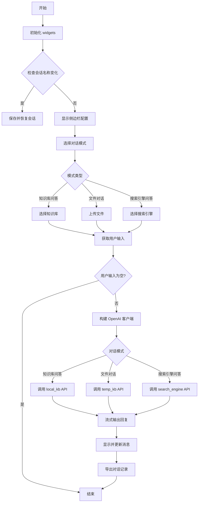

## 类结构

```
无自定义类定义 (主要使用第三方库类)
```

## 全局变量及字段


### `chat_box`
    
聊天框组件实例，用于管理对话界面和消息历史

类型：`ChatBox`
    


### `ctx`
    
对话上下文字典，存储uid、llm_model、temperature等会话级配置

类型：`Dict`
    


### `llm_model`
    
当前选中的LLM模型名称，用于生成对话内容

类型：`str`
    


### `prompt`
    
用户输入的对话文本内容

类型：`str`
    


### `text`
    
累积的AI响应文本，用于流式输出时的文本拼接

类型：`str`
    


### `first`
    
标记是否为第一条响应消息，用于控制消息更新逻辑

类型：`bool`
    


### `now`
    
当前系统时间，用于导出对话记录的文件名

类型：`datetime`
    


### `ChatBox.assistant_avatar`
    
助手头像的Base64编码字符串，用于聊天界面的头像显示

类型：`str`
    
    

## 全局函数及方法


### `init_widgets`

该函数用于初始化 Streamlit 应用的核心会话状态变量，包括对话历史长度、知识库配置、搜索参数和会话名称等关键信息，确保页面刷新或切换时保持用户配置的连续性。

参数：无

返回值：`None`，该函数没有显式返回值，仅通过修改 `st.session_state` 来持久化状态。

#### 流程图

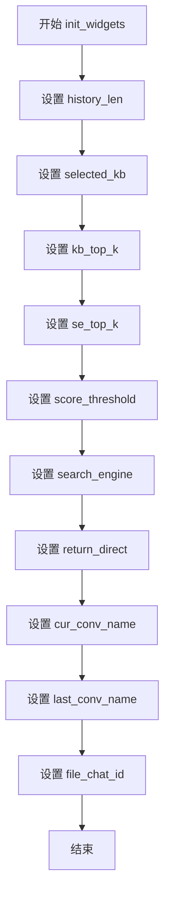

#### 带注释源码

```python
def init_widgets():
    """
    初始化 Streamlit 会话状态中的核心变量
    使用 setdefault 确保只在变量不存在时设置默认值，避免覆盖用户已有配置
    """
    # 设置对话历史轮数，默认为设置文件中配置的历史长度
    st.session_state.setdefault("history_len", Settings.model_settings.HISTORY_LEN)
    
    # 设置默认知识库，默认为设置文件中配置的默认知识库
    st.session_state.setdefault("selected_kb", Settings.kb_settings.DEFAULT_KNOWLEDGE_BASE)
    
    # 设置向量检索返回的Top-K结果数量
    st.session_state.setdefault("kb_top_k", Settings.kb_settings.VECTOR_SEARCH_TOP_K)
    
    # 设置搜索引擎返回的Top-K结果数量
    st.session_state.setdefault("se_top_k", Settings.kb_settings.SEARCH_ENGINE_TOP_K)
    
    # 设置知识匹配分数阈值，用于过滤低相关性结果
    st.session_state.setdefault("score_threshold", Settings.kb_settings.SCORE_THRESHOLD)
    
    # 设置默认搜索引擎
    st.session_state.setdefault("search_engine", Settings.kb_settings.DEFAULT_SEARCH_ENGINE)
    
    # 设置是否直接返回检索结果而不经过LLM处理
    st.session_state.setdefault("return_direct", False)
    
    # 设置当前会话名称，从聊天框组件获取当前聊天名称
    st.session_state.setdefault("cur_conv_name", chat_box.cur_chat_name)
    
    # 设置上一次会话名称，用于检测会话切换
    st.session_state.setdefault("last_conv_name", chat_box.cur_chat_name)
    
    # 设置文件对话ID，初始为None，表示当前无文件对话
    st.session_state.setdefault("file_chat_id", None)
```


### `kb_chat`

该函数是知识库问答模块的核心页面处理函数，负责初始化会话上下文、渲染侧边栏配置（知识库/文件/搜索引擎选择）、处理用户输入，并通过 OpenAI 兼容接口流式调用后端 RAG 服务，最终将结果渲染至聊天界面，同时提供会话管理与导出功能。

参数：

-  `api`：`ApiRequest`，封装了与后端服务器通信的 API 调用方法，用于获取知识库列表、上传文件等。

返回值：`None`，该函数为 Streamlit 页面入口，不返回值，仅通过副作用（渲染 UI）呈现结果。

#### 流程图

```mermaid
flowchart TD
    A[Start: kb_chat] --> B[Init Context & Widgets]
    B --> C{Session Changed?}
    C -->|Yes| D[Save & Restore Session]
    C -->|No| E[Render Sidebar: RAG Config]
    D --> E
    E --> F[Render Sidebar: Session Settings]
    E --> G[Render Chat History]
    G --> H{Render Chat Input}
    H --> I{Has Prompt?}
    I -->|No| J[Render Export/Delete Buttons]
    I -->|Yes| K[Get History & Build Messages]
    K --> L{Determine Dialogue Mode}
    L -->|Knowledge Base| M[Setup Client: local_kb/{kb_name}]
    L -->|File Chat| N[Setup Client: temp_kb/{file_id}]
    L -->|Search Engine| O[Setup Client: search_engine/{engine}]
    M --> P[Call API Stream]
    N --> P
    O --> P
    P --> Q[Update UI: Show Docs & Stream Text]
    Q --> J
    J --> Z[End]
```

#### 带注释源码

```python
def kb_chat(api: ApiRequest):
    """
    知识库问答主页面逻辑函数。
    处理 UI 渲染、用户交互及后端 API 调用。
    """
    # 1. 初始化聊天上下文和 Widget 状态
    ctx = chat_box.context
    ctx.setdefault("uid", uuid.uuid4().hex)
    ctx.setdefault("file_chat_id", None)
    ctx.setdefault("llm_model", get_default_llm())
    ctx.setdefault("temperature", Settings.model_settings.TEMPERATURE)
    init_widgets()

    # 检查会话是否切换，如果切换则保存旧会话恢复新会话
    # sac on_change callbacks not working since st>=1.34
    if st.session_state.cur_conv_name != st.session_state.last_conv_name:
        save_session(st.session_state.last_conv_name)
        restore_session(st.session_state.cur_conv_name)
        st.session_state.last_conv_name = st.session_state.cur_conv_name

    # 2. 定义内部模态对话框函数
    @st.experimental_dialog("模型配置", width="large")
    def llm_model_setting():
        # ... (省略 UI 代码) ...
        # 用于配置 LLM 模型平台、温度等
        pass

    @st.experimental_dialog("重命名会话")
    def rename_conversation():
        # ... (省略 UI 代码) ...
        # 用于重命名当前会话
        pass

    # 3. 渲染侧边栏配置区域
    with st.sidebar:
        tabs = st.tabs(["RAG 配置", "会话设置"])
        
        # --- Tab 1: RAG 配置 ---
        with tabs[0]:
            dialogue_modes = ["知识库问答", "文件对话", "搜索引擎问答"]
            dialogue_mode = st.selectbox("请选择对话模式：", dialogue_modes, key="dialogue_mode")
            
            placeholder = st.empty()
            st.divider()
            prompt_name="default"
            # 获取 RAG 相关参数
            history_len = st.number_input("历史对话轮数：", 0, 20, key="history_len")
            kb_top_k = st.number_input("匹配知识条数：", 1, 20, key="kb_top_k")
            score_threshold = st.slider("知识匹配分数阈值：", 0.0, 2.0, step=0.01, key="score_threshold")
            return_direct = st.checkbox("仅返回检索结果", key="return_direct")

            # 根据模式显示不同的知识库选择或文件上传器
            with placeholder.container():
                if dialogue_mode == "知识库问答":
                    kb_list = [x["kb_name"] for x in api.list_knowledge_bases()]
                    selected_kb = st.selectbox("请选择知识库：", kb_list, key="selected_kb")
                elif dialogue_mode == "文件对话":
                    files = st.file_uploader("上传知识文件：", ...)
                    if st.button("开始上传", disabled=len(files) == 0):
                        st.session_state["file_chat_id"] = upload_temp_docs(files, api)
                elif dialogue_mode == "搜索引擎问答":
                    search_engine_list = list(Settings.tool_settings.search_internet["search_engine_config"])
                    search_engine = st.selectbox("请选择搜索引擎", search_engine_list, key="search_engine")

        # --- Tab 2: 会话设置 ---
        with tabs[1]:
            # ... (省略会话管理 UI 代码) ...
            # 包含新建、重命名、删除会话按钮

    # 4. 渲染主聊天区域
    chat_box.output_messages() # 显示历史消息
    
    # 获取当前 LLM 模型配置
    llm_model = ctx.get("llm_model")

    # 5. 渲染聊天输入框
    with bottom():
        cols = st.columns([1, 0.2, 15, 1])
        # 配置按钮
        if cols[0].button(":gear:", help="模型配置"):
            # ... 触发模型设置弹窗 ...
            llm_model_setting()
        
        # 清空对话按钮
        if cols[-1].button(":wastebasket:", help="清空对话"):
            chat_box.reset_history()
            rerun()
            
        # 文本输入框
        prompt = cols[2].chat_input("请输入对话内容，换行请使用Shift+Enter。", key="prompt")

    # 6. 处理用户输入逻辑
    if prompt:
        # 获取历史记录并添加当前用户输入
        history = get_messages_history(ctx.get("history_len", 0))
        messages = history + [{"role": "user", "content": prompt}]
        chat_box.user_say(prompt)

        # 构建请求体参数
        extra_body = dict(
            top_k=kb_top_k,
            score_threshold=score_threshold,
            temperature=ctx.get("temperature"),
            prompt_name=prompt_name,
            return_direct=return_direct,
        )
    
        api_url = api_address(is_public=True)
        
        # 根据模式初始化不同的 API 客户端
        if dialogue_mode == "知识库问答":
            client = openai.Client(base_url=f"{api_url}/knowledge_base/local_kb/{selected_kb}", api_key="NONE")
            # 显示加载提示
            chat_box.ai_say([...])
        elif dialogue_mode == "文件对话":
            # ... 初始化临时知识库客户端 ...
            pass
        else:
            # ... 初始化搜索引擎客户端 ...
            pass

        # 7. 流式调用与结果展示
        text = ""
        first = True
        try:
            # 发起流式请求
            for d in client.chat.completions.create(messages=messages, model=llm_model, stream=True, extra_body=extra_body):
                # 处理文档片段（如果有）
                if first and d.docs:
                    chat_box.update_msg("\n\n".join(d.docs), element_index=0, streaming=False, state="complete")
                    first = False
                    continue
                
                # 处理文本流
                text += d.choices[0].delta.content or ""
                chat_box.update_msg(text.replace("\n", "\n\n"), streaming=True)
            
            chat_box.update_msg(text, streaming=False)
        except Exception as e:
            st.error(e.body)

    # 8. 底部导出与清理
    now = datetime.now()
    # ... 渲染导出按钮 ...
```


### `llm_model_setting`

这是一个 Streamlit 对话框函数，用于在 Web 界面中配置 LLM 模型参数。用户可以通过下拉选择框选择模型平台（支持"所有"选项或特定平台），从获取的 LLM 模型列表和 image2text 模型列表中选择目标模型，通过滑块调整 temperature 参数，并可在文本区域输入自定义 System Message。点击 "OK" 按钮后触发页面重运行以应用配置。

参数： 该函数无显式参数（通过 Streamlit 的 `st.experimental_dialog` 装饰器调用）

返回值：`None`，无返回值（通过 `rerun()` 重启应用间接生效）

#### 流程图

```mermaid
flowchart TD
    A[开始: llm_model_setting 对话框] --> B[创建三列布局: cols = st.columns(3)]
    B --> C[获取平台列表: get_config_platforms]
    C --> D[列0: 选择模型平台 selectbox]
    D --> E{用户选择平台}
    E -->|"所有"| F[platform_name = None]
    E -->|"其他平台"| G[platform_name = 具体平台名]
    F --> H[获取LLM模型列表: get_config_models model_type=llm]
    G --> H
    H --> I[获取image2text模型列表: get_config_models model_type=image2text]
    I --> J[合并模型列表]
    J --> K[列1: 选择LLM模型 selectbox]
    K --> L[列2: Temperature滑块 0.0-1.0]
    L --> M[文本区域: System Message 输入]
    M --> N{点击OK按钮?}
    N -->|否| O[等待用户交互]
    N -->|是| P[调用 rerun 重启应用]
    P --> Q[结束]
```

#### 带注释源码

```python
@st.experimental_dialog("模型配置", width="large")
def llm_model_setting():
    """
    LLM模型配置对话框
    用于在Streamlit界面中配置LLM模型的平台、模型类型、温度和系统消息
    """
    # 创建三列布局，用于水平排列控件
    cols = st.columns(3)
    
    # 获取所有可用的模型平台列表，并在开头添加"所有"选项
    platforms = ["所有"] + list(get_config_platforms())
    
    # 第0列：模型平台选择下拉框
    # key="platform" 将选择结果存储在 session_state.platform 中
    platform = cols[0].selectbox("选择模型平台", platforms, key="platform")
    
    # 根据选择获取LLM模型列表
    # 如果选择"所有"平台，则 platform_name 为 None，返回所有平台模型
    llm_models = list(
        get_config_models(
            model_type="llm", 
            platform_name=None if platform == "所有" else platform
        )
    )
    
    # 同时获取 image2text 模型并合并到列表中
    llm_models += list(
        get_config_models(
            model_type="image2text", 
            platform_name=None if platform == "所有" else platform
        )
    )
    
    # 第1列：LLM模型选择下拉框
    # key="llm_model" 将选择结果存储在 session_state.llm_model 中
    llm_model = cols[1].selectbox("选择LLM模型", llm_models, key="llm_model")
    
    # 第2列：Temperature 滑块，控制生成随机性
    # 范围 0.0-1.0，key="temperature" 存储在 session_state 中
    temperature = cols[2].slider("Temperature", 0.0, 1.0, key="temperature")
    
    # System Message 文本区域，用于设置系统提示词
    # key="system_message" 存储在 session_state 中
    system_message = st.text_area("System Message:", key="system_message")
    
    # OK 按钮，点击后触发页面重运行
    if st.button("OK"):
        # 调用 rerun() 重新执行脚本，使配置生效
        rerun()
```


### `rename_conversation`

这是一个 Streamlit 对话框函数，用于在 Web 界面中重命名当前会话。用户通过文本输入框输入新的会话名称，点击确认按钮后，系统会更新会话名称并刷新页面。

参数：
- 该函数无显式参数（通过 `st.text_input` 在函数内部获取用户输入）

返回值：`None`，无返回值（函数执行完成后通过 `rerun()` 触发页面刷新）

#### 流程图

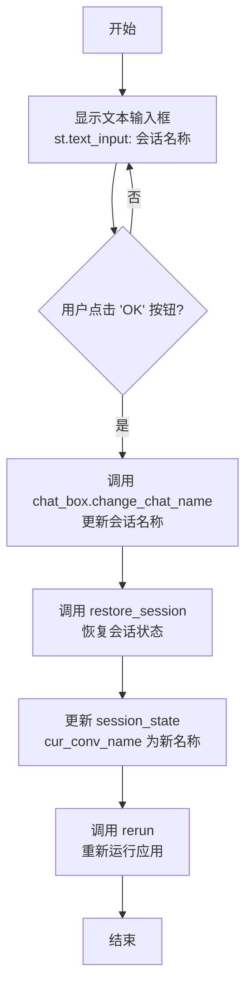

#### 带注释源码

```python
@st.experimental_dialog("重命名会话")
def rename_conversation():
    """
    Streamlit 对话框函数，用于重命名当前会话
    该函数是一个内部函数，定义在 kb_chat 函数内部
    """
    
    # 创建文本输入框，让用户输入新的会话名称
    name = st.text_input("会话名称")
    
    # 检查用户是否点击了确认按钮
    if st.button("OK"):
        # 调用 ChatBox 对象的 change_chat_name 方法更新会话名称
        chat_box.change_chat_name(name)
        
        # 恢复会话状态
        restore_session()
        
        # 将新会话名称保存到 session_state 中
        st.session_state["cur_conv_name"] = name
        
        # 重新运行 Streamlit 应用以刷新界面
        rerun()
```


### `on_kb_change`

该函数是一个回调函数，当用户在知识库选择框中更改所选知识库时触发，用于向用户显示已加载知识库的提示信息。

参数： 无

返回值：`None`，无返回值，仅执行界面提示操作

#### 流程图

```mermaid
graph TD
    A[开始] --> B[获取st.session_state.selected_kb]
    B --> C[显示Toast提示: 已加载知识库: {selected_kb}]
    C --> D[结束]
```

#### 带注释源码

```python
def on_kb_change():
    """
    知识库切换回调函数
    
    当用户在下拉框中选择不同的知识库时，此函数被触发。
    通过Streamlit的toast组件向用户显示当前已加载的知识库名称，
    提供即时的视觉反馈，增强用户体验。
    
    注意：此回调函数依赖于st.session_state中的selected_kb变量，
    该变量由st.selectbox的on_change参数自动关联。
    """
    st.toast(f"已加载知识库： {st.session_state.selected_kb}")
```


### `on_conv_change`

当用户在会话列表中选择不同会话时，该回调函数会被触发，用于保存当前会话的上下文状态并恢复所选会话的历史记录，实现会话间的无缝切换。

参数： 无

返回值：`None`，无显式返回值

#### 流程图

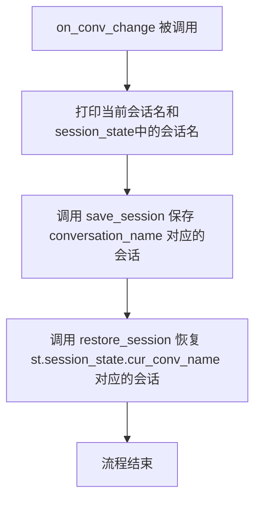

#### 带注释源码

```python
def on_conv_change():
    """
    会话切换回调函数
    当用户通过 sac.buttons 切换会话时触发
    用于保存当前会话状态并恢复目标会话状态
    """
    # 打印调试信息：当前选中的会话名和session_state中存储的会话名
    print(conversation_name, st.session_state.cur_conv_name)
    
    # 保存当前会话（conversation_name）的对话历史和状态到持久化存储
    save_session(conversation_name)
    
    # 从持久化存储中恢复目标会话（st.session_state.cur_conv_name）的对话历史和状态
    restore_session(st.session_state.cur_conv_name)
```

---

### 上下文信息补充

**闭包变量捕获：**
- `conversation_name`：从外部作用域捕获的变量，代表用户切换前的会话名称
- `st.session_state.cur_conv_name`：Streamlit会话状态中的当前会话名称（切换后的值）

**依赖函数：**
- `save_session`：保存会话上下文到持久化存储
- `restore_session`：从持久化存储恢复会话上下文

**潜在问题：**
1. 函数使用了闭包捕获的`conversation_name`变量，但该变量在按钮点击时的值可能与预期不符（Streamlit的按钮回调机制可能导致变量获取延迟）
2. 缺少异常处理机制，如果`save_session`或`restore_session`失败会导致应用崩溃
3. 未更新`st.session_state.last_conv_name`，可能导致重复保存或状态不一致


### `ChatBox.context`

获取聊天框的上下文管理器，用于存储会话期间的对话状态信息（如用户ID、模型配置等）。

参数： 无

返回值：`Dict`，返回聊天框的上下文字典对象，可用于存储和检索对话相关的状态信息。

#### 流程图

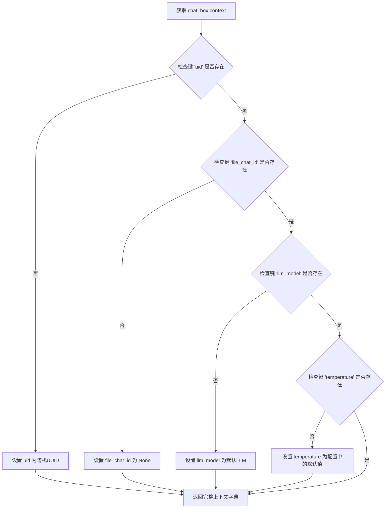

#### 带注释源码

```python
# 在 kb_chat 函数中获取 ChatBox 的上下文管理器
ctx = chat_box.context  # 获取 chat_box 对象的 context 属性，返回一个字典

# 初始化上下文中的关键字段
ctx.setdefault("uid", uuid.uuid4().hex)  # 设置唯一会话ID，使用UUID的十六进制表示
ctx.setdefault("file_chat_id", None)      # 设置文件对话ID，初始为None
ctx.setdefault("llm_model", get_default_llm())  # 设置默认LLM模型
ctx.setdefault("temperature", Settings.model_settings.TEMPERATURE)  # 设置温度参数

# 后续使用上下文中的信息
llm_model = ctx.get("llm_model")  # 获取当前选中的LLM模型
history = get_messages_history(ctx.get("history_len", 0))  # 获取历史消息，获取历史轮数，默认为0
extra_body = dict(
    temperature=ctx.get("temperature"),  # 将温度参数添加到请求体
    # ... 其他参数
)

# 访问上下文中的用户ID
conversation_id = chat_box.context["uid"]  # 直接通过键访问uid
```


### `ChatBox.cur_chat_name`

该属性用于获取或设置 ChatBox 组件当前的聊天会话名称，支持会话切换和会话重命名功能。

参数：无（属性访问）

返回值：`str`，当前聊天会话的名称

#### 流程图

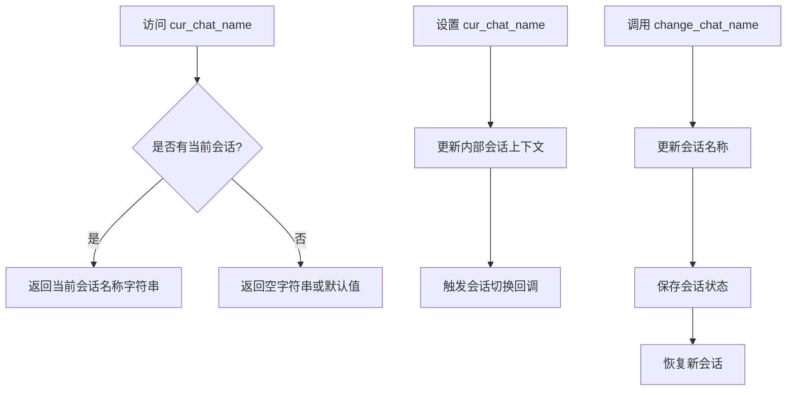

#### 带注释源码

```python
# 代码中对该属性的使用方式如下：

# 1. 读取当前聊天名称（init_widgets 函数）
st.session_state.setdefault("cur_conv_name", chat_box.cur_chat_name)
# 从 ChatBox 实例获取当前会话名称，用于初始化 session_state

# 2. 对比当前会话名称（kb_chat 函数）
if st.session_state.cur_conv_name != st.session_state.last_conv_name:
    save_session(st.session_state.last_conv_name)
    restore_session(st.session_state.cur_conv_name)
    st.session_state.last_conv_name = st.session_state.cur_conv_name
# 比较当前会话名称与上一次会话名称，判断是否需要切换会话

# 3. 更改会话名称（rename_conversation 对话框函数）
def rename_conversation():
    name = st.text_input("会话名称")
    if st.button("OK"):
        chat_box.change_chat_name(name)  # 调用方法修改会话名称
        restore_session()
        st.session_state["cur_conv_name"] = name
        rerun()
# 通过 change_chat_name 方法修改当前会话名称

# 4. 获取所有会话名称列表（kb_chat 函数）
conv_names = chat_box.get_chat_names()
# 用于在侧边栏显示所有可用会话名称

# 5. 使用指定会话名称（kb_chat 函数）
chat_box.use_chat_name(conversation_name)
# 切换到指定名称的会话

# 注意：cur_chat_name 是 ChatBox 类的一个属性（property），而非方法
# 根据 streamlit_chatbox 库的实现，它通常包含：
# - getter: 返回当前活动会话的名称
# - setter: 切换到指定名称的会话
# - change_chat_name(): 用于重命名当前会话
# - get_chat_names(): 获取所有会话名称列表
# - use_chat_name(): 激活指定会话
```


### `ChatBox.get_chat_names`

获取当前 ChatBox 实例中所有会话的名称列表，用于在侧边栏展示和切换会话。

参数：

- （无参数）

返回值：`List[str]`，返回当前 ChatBox 中所有已存在的会话名称列表，供前端组件渲染会话切换按钮使用。

#### 流程图

```mermaid
flowchart TD
    A[调用 get_chat_names] --> B{获取会话列表}
    B --> C[返回 List[str] 会话名称]
    C --> D[传递给 sac.buttons 组件]
    D --> E[渲染会话切换按钮]
    
    style A fill:#f9f,color:#333
    style C fill:#9f9,color:#333
    style E fill:#9ff,color:#333
```

#### 带注释源码

```python
# 从代码中提取的调用上下文
# chat_box 是 ChatBox 类的实例对象
# 调用 get_chat_names() 方法获取所有会话名称

conv_names = chat_box.get_chat_names()  # 获取当前所有会话的名称列表，返回类型为 List[str]

# 后续将返回的会话名称列表传递给 antd 按钮组件进行渲染
conversation_name = sac.buttons(
    conv_names,                      # 这里的 conv_names 就是 get_chat_names() 的返回值
    label="当前会话：",
    key="cur_conv_name",
    on_change=on_conv_change,
)
```


### `ChatBox.use_chat_name`

该方法用于切换当前聊天框的会话到指定名称的会话，更新ChatBox实例的当前聊天会话上下文。

参数：

- `conversation_name`：`str`，要切换到的目标会话名称

返回值：`None`，无返回值（根据调用方式推断）

#### 流程图

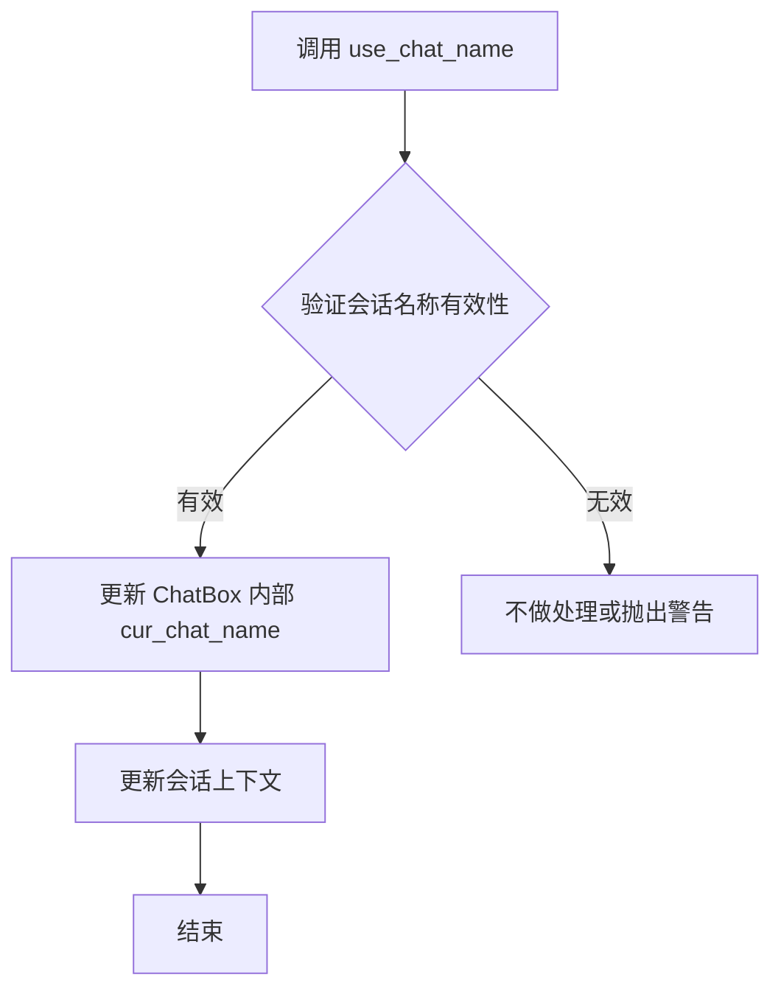

#### 带注释源码

```python
# 调用示例（在 kb_chat 函数中）
chat_box.use_chat_name(conversation_name)

# 根据调用上下文推断的源码逻辑：
def use_chat_name(self, conversation_name: str) -> None:
    """
    切换当前聊天会话到指定名称的会话
    
    参数:
        conversation_name: 目标会话的名称，用于切换当前活跃的聊天会话
    
    实现逻辑:
        1. 验证传入的会话名称是否存在于会话列表中
        2. 如果验证通过，更新实例的 cur_chat_name 属性
        3. 触发会话上下文更新，可能涉及 UI 刷新或状态同步
    """
    # 验证会话名称是否在已存在的会话列表中
    if conversation_name in self.get_chat_names():
        # 更新当前聊天会话名称
        self.cur_chat_name = conversation_name
        # 可能还需要更新相关的会话上下文或状态
        # 具体的实现取决于 ChatBox 类的内部设计
```

> **注意**：由于 `ChatBox` 类的定义不在当前代码文件中，以上源码是根据 `streamlit_chatbox` 库的使用方式和代码调用上下文推断的。实际的 `use_chat_name` 方法实现需要参考 `streamlit_chatbox` 库的源码。


### `ChatBox.output_messages`

该方法用于将 ChatBox 中当前会话的所有聊天消息（包括用户消息和助手消息）渲染并输出显示到 Streamlit 页面上，是聊天界面更新的核心方法。

参数： 无

返回值：`None`，该方法直接在 Streamlit 页面上渲染消息，无返回值

#### 流程图

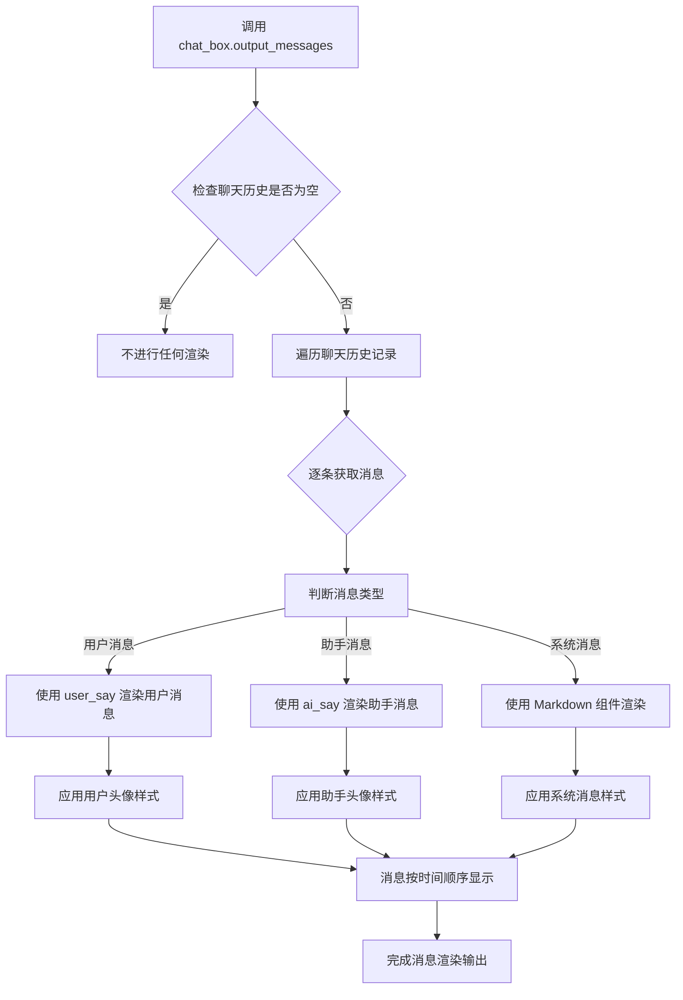

#### 带注释源码

```python
# 这是 streamlit_chatbox 库中的方法，在当前代码中调用方式如下：

# 在第175行调用
# Display chat messages from history on app rerun
chat_box.output_messages()

# 源码分析（基于 streamlit_chatbox 库的推断实现）:
def output_messages(self):
    """
    输出渲染聊天框中的所有消息到 Streamlit 页面
    
    该方法会：
    1. 读取 self.history 中存储的所有消息历史
    2. 根据每条消息的 role（user/assistant/system）选择合适的渲染方式
    3. 使用 Streamlit 组件按顺序将消息渲染到页面上
    """
    # 获取历史消息列表
    # history 是一个列表，每条消息为 dict: {"role": "user/assistant/system", "content": "内容", "timestamp": 时间戳}
    history = self.history
    
    # 遍历历史消息
    for msg in history:
        role = msg.get("role")
        content = msg.get("content")
        
        if role == "user":
            # 渲染用户消息，使用用户头像
            self.user_say(content)
        elif role == "assistant":
            # 渲染助手消息，使用助手头像（在初始化时设置）
            self.ai_say(content)
        else:
            # 渲染系统消息，使用 Markdown 组件
            st.markdown(content)
    
    # 消息会按照历史顺序依次显示在页面上
    # 每次 Streamlit 重新运行时都会调用此方法以保持消息显示
```


# ChatBox.user_say 分析

## 概述

`ChatBox.user_say` 是 `streamlit_chatbox` 库中的方法，用于在聊天界面中显示用户输入的消息。在给定的代码中，该方法被调用时传入用户输入的提示文本，将用户消息渲染到聊天界面中。

**注意**：由于 `ChatBox` 类来自外部库 `streamlit_chatbox`，其完整源码未在当前代码文件中定义。以下信息基于代码中的调用方式和使用上下文推断得出。

---

### `ChatBox.user_say`

该方法用于在聊天框中显示用户消息。

参数：

- `prompt`：`str`，用户输入的对话内容，从 Streamlit 的 `chat_input` 组件获取

返回值：通常为 `None`（根据 Streamlit 组件的一般模式推断），或返回 `ChatBox` 实例以支持链式调用

#### 流程图

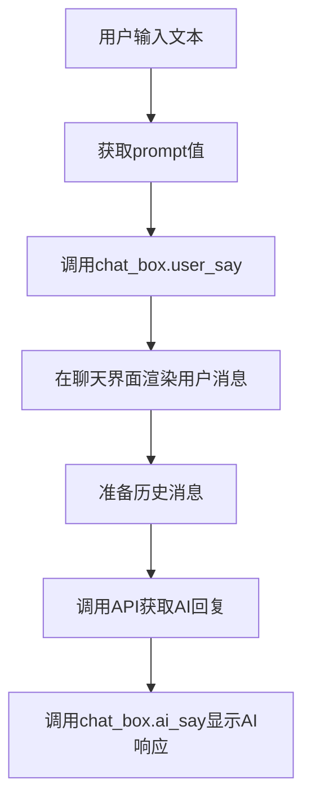

#### 带注释源码

```python
# 从代码中提取的相关调用片段
# 第227行附近

# 用户提交输入后
if prompt:
    # 获取历史消息记录
    history = get_messages_history(ctx.get("history_len", 0))
    
    # 构建消息列表，包含历史和当前输入
    messages = history + [{"role": "user", "content": prompt}]
    
    # 调用user_say方法，在聊天框中显示用户输入的文本
    # 这是streamlit_chatbox库的核心功能之一
    chat_box.user_say(prompt)
```

---

## 额外信息

### 上下文使用分析

在代码中，`user_say` 方法的调用流程如下：

1. **输入获取**：通过 `st.columns(...)` 布局中的 `chat_input` 组件获取用户输入
2. **消息显示**：调用 `chat_box.user_say(prompt)` 将用户消息渲染到界面
3. **后续处理**：构建消息历史列表，准备调用 LLM API
4. **AI 响应**：使用 `chat_box.ai_say()` 和 `chat_box.update_msg()` 显示 AI 回复

### 技术债务/优化空间

1. **外部库依赖**：完全依赖 `streamlit_chatbox` 库，缺乏对该库内部实现的了解
2. **错误处理缺失**：代码中未对 `user_say` 方法可能出现的异常进行处理
3. **返回值未利用**：未检查 `user_say` 的返回值（如果有）

### 设计约束

- 该方法需要在 Streamlit 的会话状态（`st.session_state`）中正确初始化 `ChatBox` 实例才能正常工作
- 用户输入的内容会被直接渲染，需要考虑 XSS 防护（由底层库处理）


### `ChatBox.ai_say`

该方法用于在聊天界面中显示助手（AI）的消息，支持显示 Markdown 格式的富文本内容和普通文本，作为流式响应的初始状态展示。

参数：

-  `elements`：`List[Any]`，要显示的消息元素列表，通常包含 Markdown 对象和描述性文本，用于构建聊天气泡的初始内容

返回值：`None`，无返回值，直接在 Streamlit 聊天框中渲染消息

#### 流程图

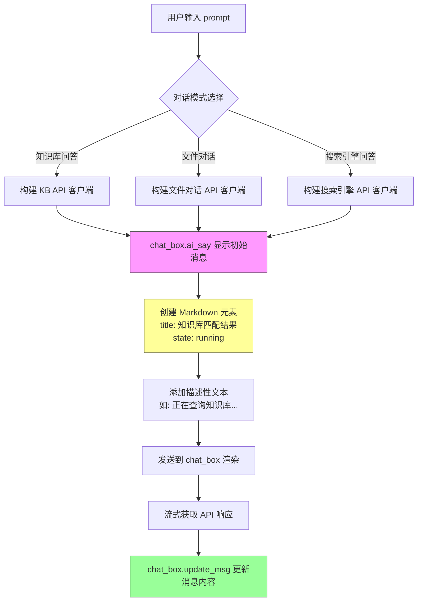

#### 带注释源码

```python
# 根据不同的对话模式构建相应的 API 客户端并调用 ai_say 方法

# 模式1: 知识库问答
if dialogue_mode == "知识库问答":
    # 创建指向特定知识库的 OpenAI 兼容客户端
    client = openai.Client(
        base_url=f"{api_url}/knowledge_base/local_kb/{selected_kb}",
        api_key="NONE"
    )
    # 调用 ai_say 方法显示初始状态消息
    # elements 参数是一个列表，包含:
    # 1. Markdown 对象 - 用于显示知识库匹配结果（可折叠的 expander）
    # 2. 普通字符串 - 用于显示当前正在执行的操作描述
    chat_box.ai_say([
        Markdown(
            "...",                           # 初始内容（流式响应后会替换）
            in_expander=True,                # 作为可折叠区域显示
            title="知识库匹配结果",           # expander 标题
            state="running",                 # 状态：运行中
            expanded=return_direct           # 是否默认展开（仅返回结果时展开）
        ),
        f"正在查询知识库 `{selected_kb}` ...",  # 描述性文本
    ])

# 模式2: 文件对话（处理临时上传的文档）
elif dialogue_mode == "文件对话":
    # 检查是否已上传文件
    if st.session_state.get("file_chat_id") is None:
        st.error("请先上传文件再进行对话")
        st.stop()
    
    # 获取文件对应的知识库 ID
    knowledge_id = st.session_state.get("file_chat_id")
    # 创建指向临时知识库的客户端
    client = openai.Client(
        base_url=f"{api_url}/knowledge_base/temp_kb/{knowledge_id}",
        api_key="NONE"
    )
    # 显示文件查询的初始消息
    chat_box.ai_say([
        Markdown(
            "...",
            in_expander=True,
            title="知识库匹配结果",
            state="running",
            expanded=return_direct
        ),
        f"正在查询文件 `{st.session_state.get('file_chat_id')}` ...",
    ])

# 模式3: 搜索引擎问答
else:
    # 创建指向搜索引擎 API 的客户端
    client = openai.Client(
        base_url=f"{api_url}/knowledge_base/search_engine/{search_engine}",
        api_key="NONE"
    )
    # 显示搜索引擎查询的初始消息
    chat_box.ai_say([
        Markdown(
            "...",
            in_expander=True,
            title="知识库匹配结果",
            state="running",
            expanded=return_direct
        ),
        f"正在执行 `{search_engine}` 搜索...",
    ])

# 后续流程：流式获取响应并通过 chat_box.update_msg 更新消息内容
```


### `ChatBox.update_msg`

该方法用于更新聊天框中的消息内容，支持流式输出和消息状态管理，是实现实时对话反馈的核心方法。

参数：

- `text`：`str`，要更新的消息文本内容
- `element_index`：`int`，可选，要更新的消息元素索引，默认为 None（表示最后一条消息）
- `streaming`：`bool`，可选，是否以流式方式显示，设置为 True 时会逐步显示文本
- `state`：`str`，可选，消息状态，如 "running"（运行中）、"complete"（完成）等

返回值：`None`，该方法直接修改聊天框的显示，不返回值

#### 流程图

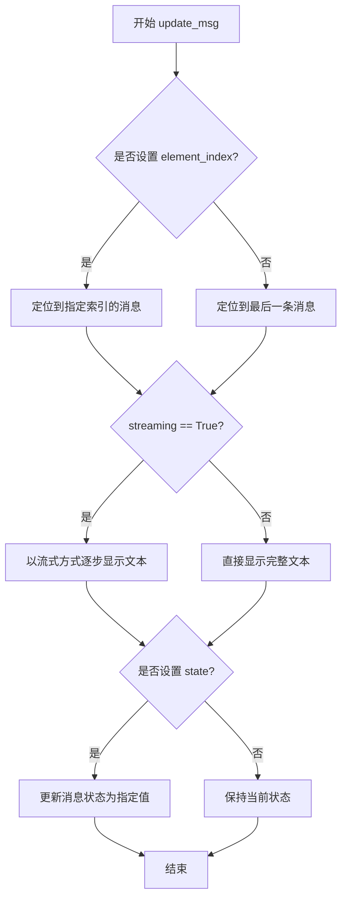

#### 带注释源码

```python
# ChatBox.update_msg 方法的调用示例源码

# 场景1：首次响应知识库匹配结果，设置消息状态为完成
chat_box.update_msg(
    "\n\n".join(d.docs),          # 知识库匹配结果文本
    element_index=0,              # 更新第一条消息（Markdown组件）
    streaming=False,              # 非流式显示
    state="complete"              # 状态设为完成
)

# 场景2：清空第二条消息内容（用于后续流式输出）
chat_box.update_msg("", streaming=False)

# 场景3：流式输出AI回复内容
text += d.choices[0].delta.content or ""  # 追加新内容
chat_box.update_msg(
    text.replace("\n", "\n\n"),   # 将换行符替换为双换行以正确显示
    streaming=True                # 启用流式显示模式
)

# 场景4：流式输出完成，最终确认文本
chat_box.update_msg(text, streaming=False)  # 关闭流式模式，显示最终完整文本
```


### `chat_box.reset_history`

该方法用于清空 ChatBox 组件中的所有聊天历史记录，包括用户和助手的消息历史，并重置对话状态。通常在用户点击"清空对话"按钮时调用。

参数：
- 该方法无显式参数

返回值：`None`，无返回值

#### 流程图

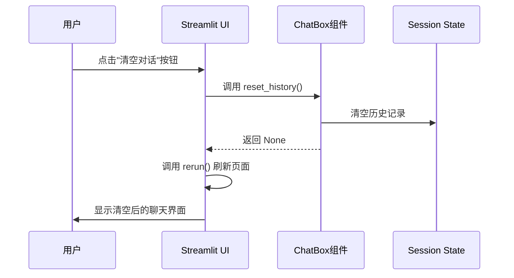

#### 带注释源码

```python
# 在侧边栏底部的清空按钮（带垃圾桶图标）
if cols[-1].button(":wastebasket:", help="清空对话"):
    chat_box.reset_history()  # 重置聊天历史记录
    rerun()  # 重新运行 Streamlit 应用以刷新界面

# ... 中间代码 ...

# 在底部标签页中的清空对话按钮
if cols[1].button(
    "清空对话",
    use_container_width=True,
):
    chat_box.reset_history()  # 重置聊天历史记录
    rerun()  # 重新运行应用以刷新界面
```

#### 说明

`reset_history()` 是 `streamlit_chatbox` 库中 `ChatBox` 类的方法，用于清空当前聊天会话的所有消息历史。该方法会：
1. 清空 `ChatBox` 内部维护的消息列表
2. 重置对话状态为初始状态
3. 不影响 `ChatBox` 的其他配置（如头像、对话名称等）

调用后通常需要配合 `rerun()` 函数重新运行应用，以在界面上立即反映清空后的状态。


### `ChatBox.export2md`

该方法为 `ChatBox` 类的成员方法，用于将当前聊天框中的对话记录导出为 Markdown 格式，返回一个字符串列表，每个元素对应一条消息的 Markdown 表示，可通过 `"".join()` 合并后下载为 Markdown 文件。

参数：无

返回值：`List[str]`，返回包含对话记录的 Markdown 格式字符串列表

#### 流程图

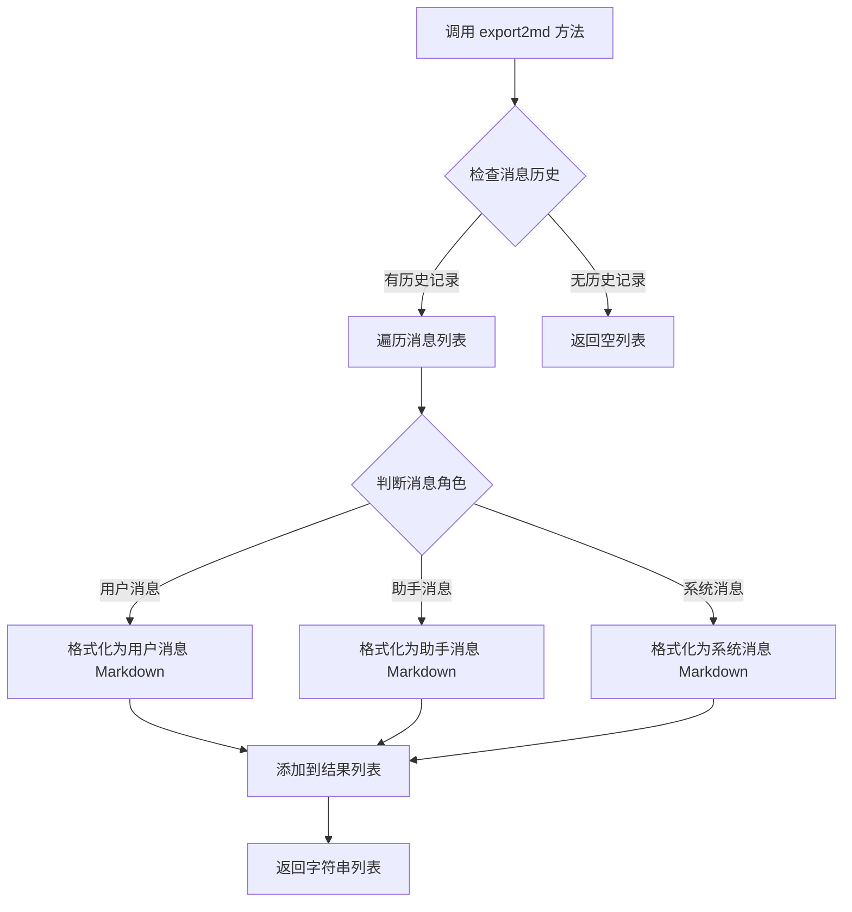

#### 带注释源码

```python
# 该方法定义在 streamlit_chatbox 库中，以下为基于使用方式的推断源码

def export2md(self) -> List[str]:
    """
    将聊天记录导出为 Markdown 格式
    
    Returns:
        List[str]: 包含每条消息 Markdown 格式的字符串列表
    """
    # 获取聊天历史记录
    history = self.history
    
    # 存储 Markdown 格式的对话记录
    md_lines = []
    
    # 遍历所有消息
    for msg in history:
        # 根据消息角色格式化
        if msg["role"] == "user":
            # 用户消息格式
            md_lines.append(f"**用户**: {msg['content']}\n\n")
        elif msg["role"] == "assistant":
            # 助手消息格式
            md_lines.append(f"**助手**: {msg['content']}\n\n")
        elif msg["role"] == "system":
            # 系统消息格式
            md_lines.append(f"*{msg['content']}*\n\n")
    
    return md_lines

# 调用示例（来自代码第252-257行）
export_btn.download_button(
    "导出记录",
    "".join(chat_box.export2md()),  # 将列表中的字符串合并为一个完整的 Markdown 文档
    file_name=f"{now:%Y-%m-%d %H.%M}_对话记录.md",
    mime="text/markdown",
    use_container_width=True,
)
```


### `ChatBox.change_chat_name`

该方法用于更改 ChatBox 组件当前聊天会话的名称。在代码中，当用户点击"重命名"按钮并输入新的会话名称后，会调用此方法更新会话名称，然后重新加载会话状态。

参数：

- `name`：`str`，新的会话名称，用于重命名当前聊天会话

返回值：`None`，该方法通常直接修改内部状态而不返回任何值

#### 流程图

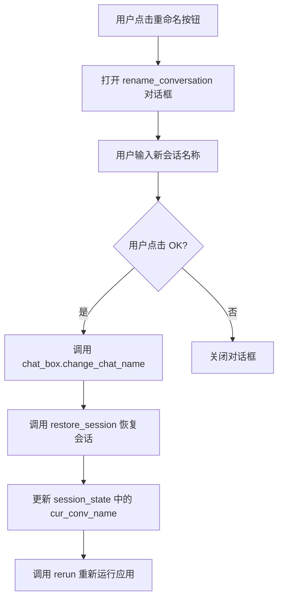

#### 带注释源码

```python
# 在 rename_conversation 对话框中调用 change_chat_name
@st.experimental_dialog("重命名会话")
def rename_conversation():
    # 文本输入框，让用户输入新的会话名称
    name = st.text_input("会话名称")
    if st.button("OK"):
        # 调用 ChatBox 的 change_chat_name 方法更改会话名称
        chat_box.change_chat_name(name)
        # 恢复会话状态
        restore_session()
        # 更新 Streamlit session_state 中的当前会话名称
        st.session_state["cur_conv_name"] = name
        # 重新运行应用以反映更改
        rerun()
```

> **注意**：由于 `ChatBox` 类来自第三方库 `streamlit_chatbox`，其完整实现源码不在本项目代码范围内。以上源码片段展示的是该方法的调用上下文，而非方法本身的实现。从调用方式可以推断，该方法接收一个字符串参数 `name`，直接修改 ChatBox 内部的会话名称状态。


### `ChatBox.context_to_session`

将 ChatBox 的上下文信息同步到 Streamlit 的 session_state 中，用于在配置弹窗中保留用户之前设置的模型参数。

参数：

- `include`：`List[str]`，需要同步到 session_state 的上下文键名列表（如 `["platform", "llm_model", "temperature", "system_message"]`）

返回值：`None`，该方法直接修改 Streamlit 的 session_state，不返回任何值。

#### 流程图

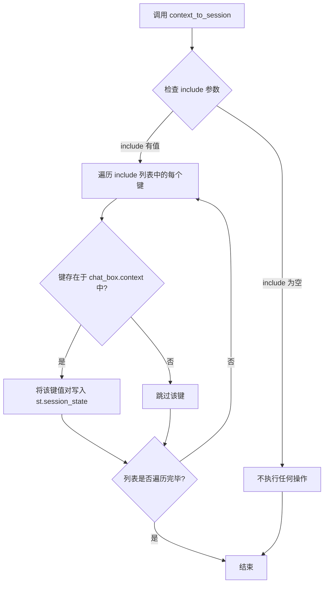

#### 带注释源码

```python
# 注意：此方法的完整源码不在提供的代码中
# 以下是基于 streamlit_chatbox 库的常见实现推断

def context_to_session(self, include: List[str] = None, exclude: List[str] = None):
    """
    将 chat_box.context 中的指定键值同步到 Streamlit session_state
    
    参数:
        include: 需要同步的键列表，如果为 None 则同步所有键
        exclude: 需要排除的键列表
    """
    # 获取 chat_box 的上下文对象
    ctx = self.context
    
    # 确定需要同步的键
    if include is not None:
        keys_to_sync = include
    else:
        keys_to_sync = list(ctx.keys())
    
    # 如果有排除列表，从键列表中移除
    if exclude:
        keys_to_sync = [k for k in keys_to_sync if k not in exclude]
    
    # 遍历并同步每个键到 session_state
    for key in keys_to_sync:
        if key in ctx:
            st.session_state[key] = ctx[key]
```

---

> **注意**：提供的代码中只包含对此方法的调用，未包含方法的具体定义。以上信息是基于 `streamlit_chatbox` 库的通用实现模式推断得出的。若需获取准确的源码，请参考该库的官方文档或源码。

## 关键组件


### ChatBox 聊天框组件

用于管理对话界面，包括显示消息、用户输入、聊天历史记录管理和导出功能。集成头像、会话名称切换和消息状态管理。

### ApiRequest API 请求客户端

用于向后端服务发起请求，包括知识库列表查询、文档上传和聊天对话生成。支持流式响应处理和错误捕获。

### 对话模式管理

支持三种对话模式：知识库问答（local_kb）、文件对话（temp_kb）、搜索引擎问答（search_engine）。根据模式选择不同的 API 端点和交互流程。

### 知识库配置组件

包含知识库选择（selected_kb）、向量搜索 top_k（kb_top_k）、分数阈值（score_threshold）、搜索返回直接结果（return_direct）等参数配置。用于 RAG 检索优化。

### 会话管理组件

负责会话的创建（add_conv）、删除（del_conv）、重命名和历史记录保存恢复（save_session/restore_session）。维护会话列表和当前会话状态。

### 模型配置对话框

提供 LLM 模型选择（llm_model）、平台筛选（platform）、温度参数（temperature）和系统消息（system_message）配置。包含模型列表动态加载功能。

### 文件上传与临时知识库

支持上传文档到临时知识库进行对话。包含文件类型过滤（LOADER_DICT）、批量上传和上传状态追踪（file_chat_id）。

### 搜索引撃集成

支持配置不同的搜索引擎（search_engine），通过 Settings.tool_settings.search_internet 获取可用引擎列表，用于网络搜索问答场景。

### 消息历史管理

通过 get_messages_history 获取历史对话记录，支持配置历史轮数（history_len），用于上下文保持和长对话场景。

### 导出与下载功能

将对话记录导出为 Markdown 格式，支持时间戳命名文件（%Y-%m-%d %H.%M），包含完整对话内容和元数据。

### Streamlit 组件集成

使用 st.sidebar、st.tabs、st.columns 等布局组件，配合 streamlit_antd_components 按钮组件，实现响应式 Web 界面。

### 状态管理与初始化

通过 st.session_state 管理应用状态，包括会话参数、控件状态和上下文信息。init_widgets 函数初始化默认配置值。


## 问题及建议


### 已知问题

-   **异常处理缺陷**：捕获异常后直接访问`e.body`属性，但通用`Exception`对象不一定具有`body`属性，会导致二次异常
-   **API密钥硬编码**：使用`api_key="NONE"`进行请求，在生产环境中存在安全风险
-   **未使用的导入**：`uuid`模块被导入并生成UUID但未被实际使用；`datetime`仅用于格式化文件名
-   **重复代码**：创建`openai.Client`的逻辑在不同对话模式（知识库问答、文件对话、搜索引擎问答）中重复出现
-   **状态初始化时机问题**：`init_widgets()`在`kb_chat`函数每次调用时都执行，导致会话切换时的状态可能不一致
-   **硬编码配置**：`prompt_name`被硬编码为"default"，原本应从配置中选择但被注释掉
-   **TODO未完成**：代码中有TODO注释"搜索未配置API KEY时产生报错"，表明存在已知问题但未解决
-   **嵌套函数过深**：`llm_model_setting`和`rename_conversation`两个对话框函数定义在`kb_chat`内部，降低了可维护性和可测试性

### 优化建议

-   **重构异常处理**：使用`st.error(str(e))`或检查异常类型后再访问属性
-   **配置化管理**：将API密钥配置移至Settings统一管理，避免硬编码
-   **抽取公共逻辑**：将`openai.Client`创建逻辑封装为独立函数，减少重复代码
-   **优化导入**：清理未使用的导入语句
-   **重构会话管理**：将`init_widgets()`移至应用初始化阶段，使用`@st.cache_data`或单例模式确保只初始化一次
-   **提取对话框函数**：将`llm_model_setting`和`rename_conversation`移至模块顶层或单独模块
-   **恢复配置功能**：取消注释`prompt_name`选择逻辑，提供用户自定义Prompt模板的能力
-   **完善TODO**：实现搜索API KEY配置检查和友好提示功能

## 其它


### 设计目标与约束

本应用的设计目标是构建一个基于Streamlit的Web UI，实现与知识库的智能对话功能，支持三种对话模式：知识库问答、文件对话和搜索引擎问答。系统需要提供灵活的RAG（检索增强生成）配置，包括知识匹配条数、分数阈值、temperature等参数，并支持会话管理和对话记录导出。

技术约束方面，前端依赖Streamlit 1.34+版本（存在版本兼容性问题，sac on_change回调在1.34后失效），后端API采用OpenAI兼容接口风格，API密钥验证暂为"NONE"（存在安全隐患），文件上传支持多种文档格式（由LOADER_DICT定义），知识库检索默认使用Bge模型（分数阈值范围0.0-2.0）。

### 错误处理与异常设计

系统采用分层错误处理策略。在UI层使用st.error()展示用户友好错误信息，在API调用层使用try-except捕获stream异常，在状态管理层对session_state进行默认值初始化。关键技术债务包括：代码第220行存在TODO注释"搜索未配置API KEY时产生报错"，当前异常捕获直接输出e.body而未做类型判断（若e无body属性会引发次生异常），文件上传校验仅检查文件列表非空而未验证文件类型和大小。

异常分类处理：输入异常（空文件、无效对话模式）通过st.stop()阻断流程并给出提示；API异常（网络超时、模型不可用）捕获后展示错误信息并保留对话上下文；配置异常（知识库不存在、模型未配置）通过sidebar控件的on_change回调进行Toast提示。

### 数据流与状态机

应用采用Streamlit的session_state实现状态机，主要状态包括：对话相关（history_len、cur_conv_name、last_conv_name）、知识库相关（selected_kb、file_chat_id）、RAG参数（kb_top_k、score_threshold、return_direct）、模型配置（llm_model、temperature、platform）。

状态转换流程：用户打开页面 -> init_widgets()初始化默认状态 -> 加载历史会话restore_session() -> 用户选择对话模式 -> 配置RAG参数 -> 输入问题 -> 获取历史消息get_messages_history() -> 构建消息列表 -> 根据dialogue_mode选择API端点 -> 流式调用client.chat.completions.create() -> chat_box.ai_say()展示Markdown结果 -> 用户可导出对话记录。

关键状态变更触发点：新建会话(add_conv)触发会话列表刷新和状态重置；切换会话(on_conv_change)触发session保存和恢复；切换对话模式触发知识库列表刷新；点击模型配置按钮触发context_to_session()状态同步。

### 外部依赖与接口契约

外部依赖包括：核心框架streamlit（>=1.34）、UI组件streamlit_antd_components（按钮组件）、聊天组件streamlit_chatbox（消息框管理）、HTTP客户端openai（API调用）、配置管理chatchat.settings、工具函数chatchat.server.knowledge_base.utils（LOADER_DICT定义支持的文件类型）。

API接口契约采用OpenAI兼容格式，主要包括：

| 接口 | 端点格式 | 请求格式 | 响应格式 |
|------|----------|----------|----------|
| 知识库问答 | /knowledge_base/local_kb/{selected_kb} | messages + model + stream + extra_body | Stream of ChatCompletionChunk |
| 文件对话 | /knowledge_base/temp_kb/{knowledge_id} | 同上 | 同上 |
| 搜索引擎 | /knowledge_base/search_engine/{search_engine} | 同上 | 同上 |

extra_body参数定义：top_k（int，1-20）、score_threshold（float，0.0-2.0）、temperature（float，0.0-1.0）、prompt_name（str）、return_direct（bool）。list_knowledge_bases()接口返回知识库名称列表，get_config_platforms()返回可用模型平台列表，get_config_models()返回指定平台的模型列表。

### 性能优化与扩展性

当前实现存在以下优化空间：图片资源使用get_img_base64()同步加载，可考虑懒加载或CDN加速；chat_box.export2md()每次点击都重新构建导出内容，可缓存；知识库列表api.list_knowledge_bases()在sidebar每次rerun都调用，可添加缓存或按需加载；流式响应处理中d.docs字段访问未做空值保护。

扩展性设计：prompt模板系统预留接口（注释中prompt_templates_kb_list），对话模式通过dialogue_modes列表可快速添加新模式，RAG配置通过extra_body可扩展更多参数，LOADER_DICT可注册新的文档加载器。

### 安全设计考量

当前实现存在安全风险：API调用使用硬编码"NONE"作为api_key，客户端未进行身份验证；文件上传未进行内容安全检查和大小限制；用户输入的prompt直接用于API调用未做XSS防护；知识库选择依赖前端返回的列表未做二次验证。

建议改进：API调用应使用JWT token或API Key认证；文件上传添加类型白名单和大小限制（建议最大50MB）；用户输入添加HTML转义；后端对知识库名称进行存在性校验。

### 部署与运维

运行环境需要Python 3.8+，依赖包通过requirements.txt管理。部署模式推荐使用Streamlit Community Cloud或私有化Docker容器。关键配置项通过Settings类集中管理，支持环境变量覆盖。日志记录依赖Streamlit默认日志，可集成structlog进行结构化日志采集。健康检查可调用api.list_knowledge_bases()接口验证后端连通性。


    