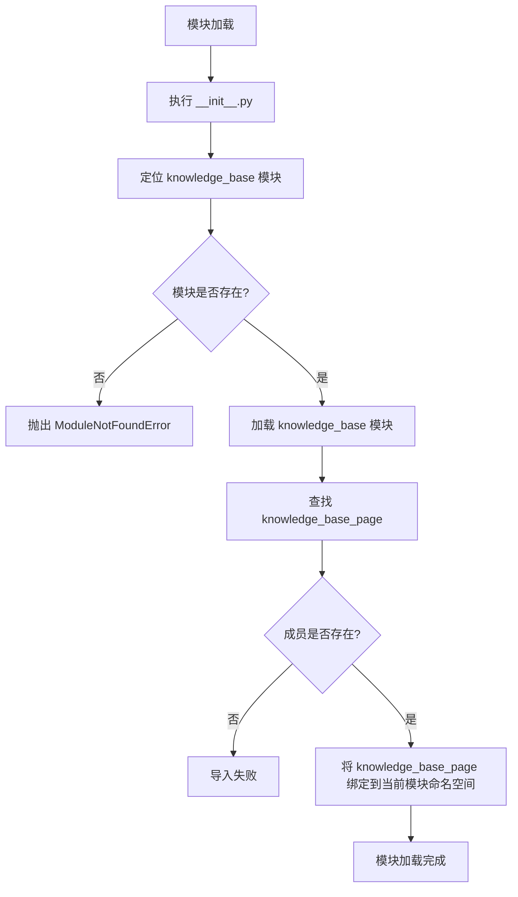

# `Langchain-Chatchat\libs\chatchat-server\chatchat\webui_pages\knowledge_base\__init__.py` 详细设计文档

该代码片段是一个相对导入语句，从当前包的 knowledge_base 模块中导入 knowledge_base_page 成员（可能是一个函数或类），用于在包级别暴露知识库页面相关的功能。

## 整体流程



## 类结构

```
当前文件为包初始化文件
└── knowledge_base_page (从 knowledge_base 模块导入)
```

## 全局变量及字段


    

## 全局函数及方法


### `knowledge_base_page`

无法从给定的代码中提取该函数的完整信息。当前提供的代码仅为导入语句，未包含 `knowledge_base_page` 函数的具体定义。

```
from .knowledge_base import knowledge_base_page
```

#### 原因说明

该代码片段仅包含从 `knowledge_base` 模块导入 `knowledge_base_page` 的语句，未提供 `knowledge_base_page` 函数/类的实际定义（如参数、返回值、方法体等）。

#### 建议

如需生成完整的详细设计文档，请提供以下信息之一：

1. **`knowledge_base_page` 函数的完整定义源码**（包含函数体）
2. **`knowledge_base` 模块的完整代码**
3. **该函数的调用示例及上下文**

基于命名规范，`knowledge_base_page` 推测可能是一个生成知识库页面内容的函数，但无法确定具体参数、返回值及业务逻辑。

---
**备注**：根据您提供的导入语句，`knowledge_base_page` 应位于同目录下的 `knowledge_base.py` 或 `knowledge_base/__init__.py` 文件中。请检查源文件以获取完整定义。


## 关键组件


### knowledge_base_page 页面处理组件

从 knowledge_base 模块导入的页面处理函数，负责处理知识库相关的页面请求和渲染逻辑

### 相对导入机制

使用点号（.）表示的相对导入，用于在同一包内导入子模块的公开接口，实现模块间的解耦和代码组织

### 知识库模块依赖

当前文件依赖的 knowledge_base 模块，作为数据层或业务逻辑层提供知识库页面的相关功能支持


## 问题及建议


### 已知问题

-   **导入来源不明确**：仅有一个相对导入语句，无法确定 `knowledge_base_page` 的具体功能、参数、返回值类型以及实现细节，文档严重缺失
-   **模块依赖关系不透明**：无法确认 `knowledge_base_page` 依赖哪些模块、数据库或外部服务，追踪依赖链困难
-   **无错误处理机制**：该导入语句未包含任何异常捕获逻辑，若 `knowledge_base` 模块不存在或导入失败，将导致整个模块初始化失败
-   **接口契约未知**：无法确认 `knowledge_base_page` 的函数签名、预期的输入输出格式，调用方难以正确使用
-   **相对导入局限性**：使用相对导入（`from .knowledge_base`）使模块与包结构强耦合，重构或迁移时容易出现问题

### 优化建议

-   为 `knowledge_base_page` 添加完整的函数签名和类型注解，明确输入参数和返回值类型
-   在模块顶层添加文档字符串（docstring），描述该函数的功能、用途及使用场景
-   考虑使用绝对导入替代相对导入，提升代码可读性和可维护性
-   添加导入错误处理（如 try-except），提供友好的错误提示
-   如果 `knowledge_base_page` 是页面渲染函数，建议拆分为独立的路由定义模块，明确路由与处理函数的对应关系
-   补充单元测试和集成测试，确保模块导入和使用符合预期


## 其它


### 设计目标与约束

本代码片段旨在通过相对导入方式将`knowledge_base_page`函数引入当前包作用域，提供统一的模块访问入口。设计目标包括简化导入路径、遵循Python包结构规范。约束条件为`knowledge_base`模块必须存在于当前包目录中且正确定义了`knowledge_base_page`导出项。

### 错误处理与异常设计

本代码仅包含导入语句，错误处理机制依赖Python解释器的导入系统。若`knowledge_base`模块不存在，将触发`ModuleNotFoundError`；若模块中未定义`knowledge_base_page`，则抛出`AttributeError`。建议调用方使用`try-except`块捕获`ImportError`或其子类以实现优雅降级。

### 数据流与状态机

本代码片段不涉及复杂的数据流或状态机逻辑。作为静态导入声明，其在模块加载阶段执行，将外部函数绑定至本地命名空间，后续代码可直接调用`knowledge_base_page`处理业务请求。

### 外部依赖与接口契约

外部依赖为`knowledge_base`模块，该模块属于项目内部包。接口契约要求`knowledge_base_page`为可调用对象（通常为视图函数），接受HTTP请求参数并返回响应对象，具体接口规范需参照`knowledge_base`模块的文档。

### 性能考虑

由于仅执行单次导入操作，性能开销可忽略不计。但在实际部署中需确保包结构扁平，避免深层嵌套导致的导入延迟。`knowledge_base_page`函数的执行性能取决于其业务逻辑复杂度。

### 安全性考虑

本代码本身不直接涉及安全风险，但`knowledge_base_page`的实现需遵循Web安全最佳实践，包括输入验证、CSRF防护、权限控制等。导入路径的确定性有助于安全审计。

### 可扩展性设计

当前设计符合Python包规范，具有良好的可扩展性。如需导出多个函数，可在当前模块中继续添加导入语句，或通过`__all__`列表显式控制公开接口。建议保持导入语句的字母顺序以提高可维护性。

### 配置与环境

无需特殊配置。但需确保：
- Python环境路径包含当前包父目录
- `knowledge_base`模块可被正确定位
- 如为Web应用，需配置URL路由指向`knowledge_base_page`

### 测试策略

建议编写以下测试用例：
- 验证导入语句成功执行
- 验证`knowledge_base_page`属性存在且可调用
- 使用`unittest.mock`模拟`knowledge_base_page`进行单元测试

### 部署相关

部署时需确保：
- 包目录结构完整
- `__init__.py`文件存在
- 所有依赖模块可被正确导入
- Web服务器配置正确路由

### 监控与日志

本代码片段无需日志记录。但建议在`knowledge_base_page`视图函数中实现请求日志、性能监控和异常追踪。

### 命名规范与代码风格

遵循PEP 8风格指南：
- 使用相对导入（from .module import name）
- 保持导入语句简洁
- 避免循环导入

### 版本与变更记录

| 版本 | 日期 | 变更说明 |
|------|------|----------|
| 1.0.0 | - | 初始版本，导入knowledge_base_page函数 |

### 参考文献

- Python官方文档：Importing from a Package
- PEP 328：Imports: Standard Library
- 项目相关架构文档（需参照knowledge_base模块说明）

    